# 01 Physical Security Audit Manual (PSAM) — Physical Security

<details>
<summary><b>📖 Book Publication Details & Disclaimers</b></summary>

* **Publisher:** Raivan Global | [www.raivanglobal.com](https://www.raivanglobal.com)
* **Disclaimer:** This *Physical Security Audit Manual (PSAM)* is furnished for training and ready reference purposes. While every effort has been made to ensure the accuracy of the contents herein, Raivan Global assumes no responsibility for errors or omissions.
* **Copyright:** © Raivan Global. All rights reserved. Prepared for internal training and security audit operations.

</details>

## Table of Contents

  * [Introduction: Physical Security Audit Manual (PSAM)](#introduction-physical-security-audit-manual-psam)
* [Chapter 1: Concepts in Security Risk Management](#chapter-1-concepts-in-security-risk-management)
  * [1.1 Taking an Enterprise Security Risk Management Approach](#11-taking-an-enterprise-security-risk-management-approach)
  * [1.1.1 The Benefits of an ESRM Program](#111-the-benefits-of-an-esrm-program)
  * [1.1.2 Adopting an ESRM Approach](#112-adopting-an-esrm-approach)
  * [1.2 The ESRM Cycle](#12-the-esrm-cycle)
  * [1.3 The Foundation of ESRM](#13-the-foundation-of-esrm)
* [Chapter 2: Functions of Physical Security](#chapter-2-functions-of-physical-security)
  * [2.1 Definition and Purpose of Physical Security](#21-definition-and-purpose-of-physical-security)
  * [2.2 Functions of Physical Security](#22-functions-of-physical-security)
  * [2.3 Peripheral Systems and Interfaces](#23-peripheral-systems-and-interfaces)
* [Chapter 3: Planning and Conducting Physical Security Assessments](#chapter-3-planning-and-conducting-physical-security-assessments)
  * [3.1 General Risk Assessment Models and Considerations](#31-general-risk-assessment-models-and-considerations)
  * [3.2 Qualitative and Quantitative Methods](#32-qualitative-and-quantitative-methods)
  * [3.3 Physical Security Assessments](#33-physical-security-assessments)
  * [3.4 General Guidelines — Areas to Assess](#34-general-guidelines-areas-to-assess)
  * [3.4.2 Tests](#342-tests)
  * [3.5 Applying Assessment Results](#35-applying-assessment-results)
  * [3.6 Automated Assessment Tools](#36-automated-assessment-tools)
* [Chapter 4: Measuring Effectiveness: Concepts in Physical Security Metrics](#chapter-4-measuring-effectiveness-concepts-in-physical-security-metrics)
  * [4.1 Understanding Metrics](#41-understanding-metrics)
  * [4.1.1 Benefits of a Security Metrics Program](#411-benefits-of-a-security-metrics-program)
  * [4.2 Physical Security Metrics](#42-physical-security-metrics)
  * [4.3 Additional Recommended Metrics](#43-additional-recommended-metrics)
  * [4.4 Application of Metrics Throughout This Book](#44-application-of-metrics-throughout-this-book)
* [Chapter 5: Basic Design Concepts](#chapter-5-basic-design-concepts)
  * [5.1 Foundational Design Principles](#51-foundational-design-principles)
  * [5.2 Core System Attributes & Integration](#52-core-system-attributes-integration)
  * [5.3 Examples of Design Practices: Good and Not So Good](#53-examples-of-design-practices-good-and-not-so-good)
* [Chapter 6: Key Influencing Factors in Physical Security Design](#chapter-6-key-influencing-factors-in-physical-security-design)
  * [6.1 Characteristics Of The Assets Under Protection](#61-characteristics-of-the-assets-under-protection)
  * [6.2 Characteristics Of The Building Or Facility](#62-characteristics-of-the-building-or-facility)
  * [6.3 Characteristics of the Surroundings](#63-characteristics-of-the-surroundings)
  * [6.4 Characteristics of the Location](#64-characteristics-of-the-location)
  * [6.5 Additional Influencing Factors](#65-additional-influencing-factors)
* [Chapter 7: Security Architecture and Engineering](#chapter-7-security-architecture-and-engineering)
  * [7.1 Historical Precedents: Castle Engineering](#71-historical-precedents-castle-engineering)
  * [7.2 Codes, Standards, and Regulations](#72-codes-standards-and-regulations)
  * [7.3 Project Requirements, Risk Assessment, and DBT](#73-project-requirements-risk-assessment-and-dbt)
  * [7.4 Construction Types: New Construction vs. Retrofits](#74-construction-types-new-construction-vs-retrofits)
  * [7.5 Site Layout and Perimeter Defense](#75-site-layout-and-perimeter-defense)
  * [7.6 Site Layout: Security Lighting](#76-site-layout-security-lighting)
  * [7.7 Building Design Against Blast](#77-building-design-against-blast)
  * [7.8 Structural Integrity and Interior Layout](#78-structural-integrity-and-interior-layout)
  * [7.9 Glazing and Window Engineering](#79-glazing-and-window-engineering)
  * [7.10 Site Utilities and Infrastructure](#710-site-utilities-and-infrastructure)
  * [7.11 Life Safety and Emergency Systems](#711-life-safety-and-emergency-systems)
  * [7.12 Publications Relevant to Security Architecture and Engineering](#712-publications-relevant-to-security-architecture-and-engineering)
* [Chapter 8: Integrated Security and Protection Strategies](#chapter-8-integrated-security-and-protection-strategies)
  * [8.1 Integrated Electronic Security Systems (ESS)](#81-integrated-electronic-security-systems-ess)
  * [8.2 Integrated Physical Security Elements](#82-integrated-physical-security-elements)
  * [8.3 Integrated Security Programs](#83-integrated-security-programs)
  * [8.4 Integration of ERM and ESRM](#84-integration-of-erm-and-esrm)
* [Chapter 9: Structural Security Measures](#chapter-9-structural-security-measures)
  * [9.1 Physical Barriers](#91-physical-barriers)
  * [9.2 Walls and Structural Shells](#92-walls-and-structural-shells)
  * [9.3 Doors and Access Hatches](#93-doors-and-access-hatches)
  * [9.4 Hardening and Upgrading Doors](#94-hardening-and-upgrading-doors)
  * [9.5 Windows and Glazing Engineering](#95-windows-and-glazing-engineering)
  * [9.6 Roofs, Floors, and Utility Openings](#96-roofs-floors-and-utility-openings)
  * [9.7 Fencing and Perimeter Barriers](#97-fencing-and-perimeter-barriers)
  * [9.8 Vehicle Barriers and Anti-Ram Systems](#98-vehicle-barriers-and-anti-ram-systems)
  * [9.9 Containers, Safes, and Vaults](#99-containers-safes-and-vaults)
  * [9.10 Locks and Locking Mechanisms](#910-locks-and-locking-mechanisms)
  * [9.11 Security Lighting and Illumination](#911-security-lighting-and-illumination)
* [Chapter 10: Crime Prevention Through Environmental Design (CPTED)](#chapter-10-crime-prevention-through-environmental-design-cpted)
  * [10.1 Principles of CPTED](#101-principles-of-cpted)
  * [10.2 Tools of CPTED](#102-tools-of-cpted)
  * [10.3 CPTED Applications in Various Settings](#103-cpted-applications-in-various-settings)
  * [10.4 Integration of CPTED and Traditional Security](#104-integration-of-cpted-and-traditional-security)
* [Chapter 11: Electronic Security Systems](#chapter-11-electronic-security-systems)
  * [11.1 Access Control Systems](#111-access-control-systems)
  * [11.2 Screening and Contraband Detection Systems](#112-screening-and-contraband-detection-systems)
  * [11.3 Physical Intrusion Detection Systems](#113-physical-intrusion-detection-systems)
  * [11.3.1 Performance Metrics and Vulnerabilities](#1131-performance-metrics-and-vulnerabilities)
  * [11.3.2 Standards, Codes, and Regulations](#1132-standards-codes-and-regulations)
  * [11.3.3 Exterior Sensor Technologies](#1133-exterior-sensor-technologies)
  * [11.3.4 Interior Sensor Technologies](#1134-interior-sensor-technologies)
  * [11.3.5 System Integration, Supervision, and Operations](#1135-system-integration-supervision-and-operations)
  * [11.4 Video Surveillance](#114-video-surveillance)
  * [11.4.1 System Purpose and Camera Selection Steps](#1141-system-purpose-and-camera-selection-steps)
  * [11.4.2 Resolution Levels and Target Fields of View](#1142-resolution-levels-and-target-fields-of-view)
  * [11.4.3 Lens Optics, Enclosures, and Compatibility](#1143-lens-optics-enclosures-and-compatibility)
  * [11.4.4 Camera Styles, Features, and Physics](#1144-camera-styles-features-and-physics)
  * [11.4.5 Environmental, Cabling, and Network Specifications](#1145-environmental-cabling-and-network-specifications)
  * [11.4.6 Mounting and Field-of-View Calculations](#1146-mounting-and-field-of-view-calculations)
  * [11.4.7 Verification, Acceptance Testing, and Maintenance](#1147-verification-acceptance-testing-and-maintenance)
  * [11.5 Communications And Annunciation Systems](#115-communications-and-annunciation-systems)
  * [11.6 Trends And Issues In Electronic Systems Integration](#116-trends-and-issues-in-electronic-systems-integration)
* [Chapter 12: Security Officers and the Human Element](#chapter-12-security-officers-and-the-human-element)
  * [12.1 Security Officer Utilization & Industry Growth](#121-security-officer-utilization-industry-growth)
  * [12.2 Determining the Need: The "Necessary Human Being" Concept](#122-determining-the-need-the-necessary-human-being-concept)
  * [12.3 Security Force Deployment Models](#123-security-force-deployment-models)
  * [12.4 Basic Security Officer Functions](#124-basic-security-officer-functions)
  * [12.5 Security Officer Roles](#125-security-officer-roles)
  * [12.6 Uniforms and Equipment](#126-uniforms-and-equipment)
  * [12.7 Security Officer Selection](#127-security-officer-selection)
  * [12.8 Security Officer Training Process](#128-security-officer-training-process)
  * [12.9 Managing the Security Force](#129-managing-the-security-force)
  * [12.10 Leveraging the Human Element: Community-Wide Security](#1210-leveraging-the-human-element-community-wide-security)
* [Chapter 13: Principles of Project Management](#chapter-13-principles-of-project-management)
  * [13.1 Security Project Goals and Objectives](#131-security-project-goals-and-objectives)
  * [13.2 The Nine PMI Knowledge Areas](#132-the-nine-pmi-knowledge-areas)
  * [13.3 Project Manager Roles and Tools](#133-project-manager-roles-and-tools)
* [Chapter 14: Systems Design](#chapter-14-systems-design)
  * [14.1 System Design Principles](#141-system-design-principles)
  * [14.2 Design Phases and Deliverables](#142-design-phases-and-deliverables)
  * [14.3 Visual Design Schematics](#143-visual-design-schematics)
  * [14.4 Bidding and Procurement Management](#144-bidding-and-procurement-management)
  * [14.5 System Integration and Legacy Migration](#145-system-integration-and-legacy-migration)
* [Chapter 15: Installation and Implementation](#chapter-15-installation-and-implementation)
  * [15.1 Site Preparation and Coordination](#151-site-preparation-and-coordination)
  * [15.2 System Commissioning and Testing](#152-system-commissioning-and-testing)
  * [15.3 Categories of Security Testing](#153-categories-of-security-testing)
  * [15.4 Operator and Technical Training](#154-operator-and-technical-training)
* [Chapter 16: System Maintenance and Lifecycle Evaluation](#chapter-16-system-maintenance-and-lifecycle-evaluation)
  * [16.1 Maintenance Models and Administration](#161-maintenance-models-and-administration)
  * [16.2 Preventive Maintenance Checklist](#162-preventive-maintenance-checklist)
  * [16.3 System Lifecycle Replacement and Evaluation](#163-system-lifecycle-replacement-and-evaluation)
* [Appendix A: Key Terms and Definitions](#appendix-a-key-terms-and-definitions)
* [Appendix B: Physical Security and Life Safety Considerations in High-Rise Buildings](#appendix-b-physical-security-and-life-safety-considerations-in-high-rise-buildings)
  * [B.1 The High-Rise Physical Environment](#b1-the-high-rise-physical-environment)
  * [B.2 Life Safety and Fire Protection Systems](#b2-life-safety-and-fire-protection-systems)
  * [B.3 Access Control Recommendations in High-Rise Structures](#b3-access-control-recommendations-in-high-rise-structures)
  * [B.4 Engineering Specific Entry & Egress Solutions](#b4-engineering-specific-entry-egress-solutions)
  * [B.5 Specialized Protective Measures](#b5-specialized-protective-measures)
  * [B.6 References and Sources](#b6-references-and-sources)
* [Appendix C: Voluntary and Statutory Standards](#appendix-c-voluntary-and-statutory-standards)
  * [C.1 The Plan-Do-Check-Act (PDCA) Loop](#c1-the-plan-do-check-act-pdca-loop)

---

### Introduction: Physical Security Audit Manual (PSAM)

The **Physical Security Audit Manual (PSAM)** is intended for security professionals to find current, accurate, and practical treatment of the broad range of asset protection subjects, strategies, and solutions in a single source. 

The growing size and frequency of all forms of asset losses, coupled with the related increasing cost and complexity of countermeasures, demand a systematic and unified presentation of protection doctrine. It is a fundamental objective of PSAM to draw upon a vast qualified source base, distilling from the available data common or recurrent characteristics and trends that identify valid protection strategies.

#### Readership & Dialogue
PSAM is designed for a wide readership, including security professionals, business managers with asset protection responsibility, and students pursuing programs in asset protection. Dialogue is highly encouraged via the **Raivan Global Connect** platform to discuss novel or complex security problems.

#### Supplemental Training
PSAM serves as an exceptional resource for assignments within a formal training syllabus or professional education program.


---

## Chapter 1: Concepts in Security Risk Management

### 1.1 Taking an Enterprise Security Risk Management Approach

Whether in the public or private sector, and whether dealing with traditional or cyber security (or both), modern asset protection is based on the principle of **Enterprise Security Risk Management (ESRM)**. 

ESRM was developed as a collaborative initiative by security executives to approach security as a business-aligned management process. Too often, organizational leaders look to a "quick fix"—buying a popular technology system without asking what their critical assets are or what threats they actually face. ESRM transitions security professionals from "program managers" to strategic enterprise risk advisors.

#### Traditional Security vs. ESRM
* **Traditional Security:** The security professional acts as the absolute owner and decision-maker of all security programs, implementing tactical measures in a silo.
* **ESRM:** Asset owners hold decision-making responsibility for security risks impacting the assets they manage. The security professional acts as a trusted advisor, partnering with them to identify, prioritize, and mitigate threats.

#### Two Major Misconceptions of ESRM

1. **Misconception 1 (The Convergence Myth):** Many believe ESRM requires convergence (combining physical security and cybersecurity under one executive). While convergence makes managing resource allocation less cumbersome, ESRM is an operational philosophy that succeeds even when functions are led by different departments.
2. **Misconception 2 (ESRM is just ERM):** Enterprise Risk Management (ERM) addresses financial, operational, and strategic risks organization-wide. ESRM is a dedicated sub-component focused on security risks. While major security risks rise to the level of ERM oversight, ESRM serves as the independent security risk management framework for all organizations.

---

### 1.1.1 The Benefits of an ESRM Program

#### Benefits for the Security Professional & Department
1. **Shared Accountability:** Shifting risk ownership to asset owners brings more strategic business perspectives to the mitigation table.
2. **Trusted Advisor Role:** Transitions the security professional from a tactical enforcer to a strategic business partner.
3. **Common Management Language:** Operates in a risk-based business framework that managers and executives naturally understand.
4. **Deep Business Insight:** Promotes a stronger understanding of the organization's overarching commercial and mission goals.
5. **Stakeholder Engagement:** Encourages positive internal alliances by aligning security goals with stakeholder operations.
6. **Innovation in Solutions:** Shifts focus from rigid "check-the-box" security programs to innovative, dynamic problem-solving.
7. **Holistic Value Delivery:** Delivers measurable value by addressing broader corporate security vulnerabilities.
8. **Proactive Security Posture:** Prevents security failures through early hazard identification, minimizing operational impact.
9. **Streamlined Resource Allocation:** Directs budgets precisely where risks are validated and prioritized by business leaders.
10. **Organizational Visibility:** Elevates security's stature, paving the way for participation in strategic enterprise planning.

#### Benefits for the Organization
1. **Enterprise-Level Strategy:** Integrates security decisions directly with organizational missions.
2. **Consistency of Understanding:** Provides stakeholders with a clear, shared vision of security functions.
3. **Top Management Visibility:** Elevates critical security risks to executive oversight via the asset owners themselves.
4. **Strategic Resource Alignment:** Matches security spending directly with priority organizational assets.
5. **Early Hazard Monitoring:** Identifies and proactively tracks a wider range of emerging security vectors.
6. **Vested Stakeholder Buy-in:** Builds deeper engagement with personnel who depend on asset integrity.
7. **Compliance Integration:** Strengthens alignment with legal, regulatory, and contractual obligations.
8. **Cultural Synergy:** Safely embeds security consciousness into the day-to-day corporate culture.
9. **Resilient Crisis Response:** Enhances emergency planning, threat response, and disaster mitigation capabilities.

---

### 1.1.2 Adopting an ESRM Approach

Successfully implementing ESRM requires mastering three major components:
* **The Context of ESRM:** Understanding the organization's strategic and operating environments.
* **The Foundation of ESRM:** Cultivating collaborative concepts like transparency and stakeholder partnerships.
* **The ESRM Cycle:** The progressive loop used to identify, prioritize, and mitigate security risks.

#### 1.1.2.1 The Context of ESRM
To safeguard an organization, security professionals must understand the business environment at least as well as they understand security threats. This context is analyzed through three environments:
1. **The Physical Environment:** Includes building design, surroundings, pedestrian and vehicle traffic, warehouse assets, and industrial control systems.
2. **The Nonphysical Environment:** Includes geo-political trends, compliance laws, competitive pressures, leadership changes, and technical evolution.
3. **The Logical Environment:** Focuses on digital connections, databases, data flows, and communications systems.

#### 1.1.2.2 Core Values and Culture
An organization's core values—such as environmental stewardship, product quality, brand protection, and employee safety—define its culture. ESRM relies on transparency, partnership, and collaboration. Organizations whose core values reflect these concepts will naturally embrace ESRM. To assess cultural readiness, evaluate:
* How the organization handles change.
* Its general risk tolerance or risk appetite.
* Business units that are most open to working as security allies.
* Motivators and goals highlighted in employee feedback.

#### 1.1.2.3 Stakeholder Partnerships
Support from stakeholders is crucial to the successful adoption of ESRM. It is important to identify them, engage them, understand what is important to them, and align with their priorities. Once security professionals understand the priorities of the organization’s stakeholders, they can better support achieving their objectives. Creating supportive relationships is critical in an ESRM environment.

Note that understanding stakeholders does not necessarily mean harmonizing their interests, but rather understanding their needs and their risk insights to better facilitate the ESRM process. Security professionals must align with:
* **Internal Stakeholders:** Key operational allies who are often owners of intangible assets, such as Human Resources, Legal, Procurement, Facilities, IT, and Marketing. Security professionals must partner with these groups to identify and mitigate specific risks.
* **External Stakeholders:** Suppliers, distributors, consultants, auditing firms, and industry organizations. Industry groups are key stakeholders because their actions and standards often directly affect the organization's strategic direction.
* **Clients and Customers:** Distributors, resellers, retailers, and direct customers. These stakeholders present a wide variety of challenges in risk management and directly impact assets and the organization's revenue.
* **The Surrounding Community:** Often overlooked, the community surrounding the organization's operations is a critical stakeholder. Organizations can impact the surrounding environment, traffic, noise, and local economy. There are joint risks that affect both stakeholders and the organization, and partnering with surrounding communities helps address shared environmental and safety risks.

---

### 1.2 The ESRM Cycle

The **ESRM Cycle** describes the progressive operational loop through which security risks are systematically managed and mitigated. Rather than operating in a silo, it emphasizes a deep partnership between security professionals and the actual asset owners.


> [!IMPORTANT]
> **Core Concept:** The defining trait of the ESRM Cycle is its **collaborative governance**. Security professionals act as strategic advisors, but the **Asset Owner** is the decision-making risk owner who ultimately approves the mitigation strategy.

#### 1.2.1 Identify and Prioritize Assets
The first process in the ESRM Cycle is to Identify and Prioritize Assets. Asset prioritization is based on each asset’s criticality to the organization's mission and overall strategy. It relies on guidance from top management and input from asset owners and other stakeholders. The resulting prioritized list of assets forms the basis for the remainder of the ESRM Cycle.

Key roles to understand at this stage and throughout the ESRM Cycle include:
* **The Asset Owner:** The person most directly responsible for the successful operation of the asset. ESRM assigns responsibility for the risk of an asset to the asset owner, because they best understand the asset. As such, they are trusted and empowered to make decisions about risks to their assets. In short, according to ESRM, the asset owner is the risk owner.
* **Top Management:** The highest level of executive leadership in an organization (e.g., the C-suite or executive committee). In all cases, top management is above and not inclusive of the security function’s leader.
* **The Security Professional:** Acts as a security risk subject matter expert and a trusted advisor to asset owners, top management, and other stakeholders, guiding them through the security risk decision-making process.

#### 1.2.2 Identify and Prioritize Risks
Once assets are identified and prioritized, the second process in the ESRM Cycle is to Identify and Prioritize Risks. This step combines all the information on prioritized assets, potential threats, and system vulnerabilities to determine the likelihood and impact of a loss event. 

Security professionals guide asset owners in:
* **Identifying Threats:** Analyzing man-made (intentional), natural, or inadvertent threats that could impact the assets.
* **Assessing Vulnerabilities:** Evaluating the weaknesses in existing defenses (in terms of observability and exploitability).
* **Prioritizing Risks:** Ranking the risks based on their potential consequences to the enterprise's mission and objectives.

#### 1.2.3 Mitigate Prioritized Risks
The third process in the ESRM Cycle is to Mitigate Prioritized Risks. Mitigation plans are developed in close partnership between security professionals and asset owners. 

The security practitioner has a range of options to address identified risks:
* **Security Measures:** Implementing physical security, architectural designs, electronic systems, and security staffing.
* **Policy and Procedure Controls:** Bolstering systems with human element controls, audits, and strong operational policies.
* **Risk Transfer or Acceptance:** Transferring financial risk through insurance or contractual agreements (like indemnification), or formally accepting the risk as a cost of doing business.

The asset owner holds the ultimate decision-making authority to approve and fund the chosen mitigation options, while the security professional oversees or coordinates their deployment.

#### 1.2.4 Continuous Improvement
The final process in the ESRM Cycle is Continuous Improvement. Security risks and business operations are dynamic. Therefore, security measures and risk levels must be routinely reviewed and updated.

This process involves:
* **Incident Auditing:** Conducting thorough investigations and analysis of security incidents to identify new vulnerabilities or gaps in existing mitigation plans.
* **Performance Measurement:** Utilizing key performance indicators (KPIs) and metrics to evaluate the effectiveness of the security systems and guard forces.
* **Framework Adjustments:** Updating the prioritized asset and risk registers as the business environment, technology, or threats change over time.

---

### 1.3 The Foundation of ESRM

Security professionals with a thorough understanding of the organizations they are protecting are well-positioned to successfully adopt and implement ESRM. To ensure sustained longevity and success, there are four critical concepts to incorporate. Called the Foundation of ESRM, its four components are:

1. **Holistic Risk Management**
2. **Partnership with Stakeholders**
3. **Transparency**
4. **Governance**

#### 1.3.1 Holistic Risk Management
The term “holistic” refers to an inclusive, all-encompassing, or complete approach. The concept of holistic risk management has two relevant meanings from the perspective of ESRM:
1. **Holistic Process:** ESRM advocates that all stakeholders participate in the risk management process. All stakeholders have a role, a vested interest, and a benefit from the organization’s effective management of security risk. This is especially true for asset owners and top management.
2. **Holistic Scope:** ESRM considers and accounts for all types of security risk without qualifiers or silos (such as physical, cyber, information, or personnel security risk). Whatever is in the scope of responsibility for a security function is in scope for ESRM.

#### 1.3.2 Partnership with Stakeholders
ESRM encourages security professionals to forge deep partnerships with identified stakeholders. The security professional acts in a collaborative, supportive role as a advisor and advocate.
* Security professionals in an ESRM environment should provide **guidance instead of instruction**.
* They should **support decisions about assets instead of making decisions themselves**.
* They should base their discussions in **measured risk rather than fear, uncertainty, or doubt (FUD)**.

This alignment increases stakeholder engagement, builds deep trust, and reduces the perception of security as a hindrance or obstacle to doing business.

#### 1.3.3 Transparency & Governance

##### Transparency
Transparency refers to a clear, open, and honest approach. Two types of transparency are particularly relevant:
1. **Risk Transparency:** Security professionals should represent risks based on objective facts, quantitative analysis, and quantifiable metrics in a clear, open, and honest way. Risks should be represented exactly as they are, neither exaggerated nor minimized. This supports the asset owner in their role as the decision-making risk owner.
2. **Process Transparency:** Security professionals should ensure that asset owners and stakeholders understand the security risk management process and each step of that process. Sharing the process openly increases engagement and buy-in among stakeholders.

##### Governance
Governance refers to the rules and processes by which a function or organization is directed, controlled, and monitored:
1. **Organizational Governance:** The overarching system by which an organization is directed and controlled, typically addressing the role of top executives, the board of directors, audit oversight, and procedures for decision-making. ESRM governance must align with it.
2. **ESRM Governance:** The process of setting enterprise security risk policy and direction, allocating resources, and ensuring compliance. It is carried out by the organization's security governance body (e.g., a committee or council). Members should mostly be security risk stakeholders, not security professionals.
   * **Policies:** High-level statements of corporate strategy and direction ("laws" of the organization).
   * **Standards:** Tactical descriptions of how policy expectations must be met.
   * **Guidelines:** Tactical recommendations that provide guidance on what should or may be done.
   * **Procedures:** Operational step-by-step instructions on how to adhere to the previous governance documents.

---

## Chapter 2: Functions of Physical Security

### 2.1 Definition and Purpose of Physical Security

At the most basic level, the purpose of physical security is to protect assets, whether they are tangible, intangible, or mixed, and whether they take the form of people, property, or information.

Industry standards define physical security as:
> "That part of security concerned with physical measures designed to safeguard people; to prevent unauthorized access to equipment, facilities, material, and documents; and to safeguard them against a security incident."

---

### 2.2 Functions of Physical Security

A comprehensive physical security strategy utilizes a "menu of options" applied in a building-block fashion across various layers of security. These measures are designed to perform six fundamental conceptual security functions:

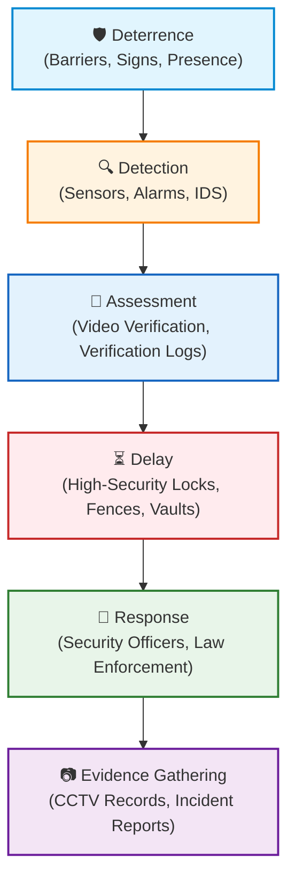

* **Deterrence:** Barriers, technology, and procedures designed to convince a potential attacker that they will not be successful, thereby influencing them to avoid the site. This is the most difficult security measure to quantify.
* **Detection:** The capacity of the physical protection system to sense that a potential intruder is present. Detection by itself is of little value without verification, and system sensitivity must be balanced to minimize false positives.
* **Assessment:** The ability of the physical protection system to determine what was detected and decide whether or not to initiate an emergency response.
* **Delay:** The deployment of physical barriers (such as no-cut/no-climb fencing, high-security locks, secure door hardware, window bars, etc.) to slow the progress of an intruder, allowing the response force sufficient time to arrive.
* **Response:** The actions taken to neutralize, contain, or mitigate a security event (e.g., security officer dispatch or local police intervention).
* **Evidence Gathering:** The collection of records (such as CCTV recordings, access logs, and incident reports) to support the prosecution of intruders, which serves as a highly visible deterrent for the site.

#### 2.2.2 Electronic Security Measures

Electronic security measures provide the automated monitoring, detection, and communication capabilities of the physical protection system. They must be carefully matched to the site's environment and operational requirements:
* **Intrusion Detection Systems (IDS):** An IDS generally includes sensors, alarms or annunciators, and a communication or transmission mechanism. It is critical to match IDS elements to the type of facility, space being protected, and surrounding environment. False alarms (false positives) and missed detections (false negatives) are significant issues in IDS operation. Poor initial design or installation can render a system completely ineffective.
* **Communications Systems:** Focus on means of communicating with employees and other facility occupants in both routine and emergency situations. It also encompasses transmission protocols allowing electronic security systems to communicate with one another (cameras, monitors, recorders, sensors, card readers, databases, electronic locks, and control centers). Communications layouts must be designed to withstand power outages, telecommunications downtime, and cyber threats.

#### 2.2.3 Personnel and Guard Force Security

The human element is the ultimate coordinator and responder in any physical protection system:
* **Security Officer Force:** A security officer force must be carefully designed to ensure maximum operational effectiveness and efficiency. Key planning factors include staffing levels, officer selection, training, equipment, post orders, specific patrol functions, quality control, and professional supervision.
* **Other Human Support Functions:** In many organizations, security responsibilities are shared. Other departments—such as Facilities, Maintenance, Reception, Legal, Risk Management, and IT—play key roles in the protection strategy. Structural and electronic security systems must be designed with non-security personnel in mind to ensure seamless coordination.
* **Visitor Management and Control:** Both written logs and automated visitor management systems are vital for access control at perimeters and reception desks. Modern automated systems are highly effective, cost-efficient, and can be easily integrated with access control, incident management, and investigations.

---

### 2.3 Peripheral Systems and Interfaces

The physical security measures outlined in this volume may not all be under the direct purview of the security department. For example, landscaping and terrain barriers may be managed by Facilities or Ground Maintenance; building construction materials are handled by general contractors; and loading dock operations are run by Logistics. Nonetheless, physical security measures must be closely coordinated with each of these peripheral systems and integrated into all physical security planning efforts.
It is especially critical in modern facilities to address the relationship between security components and peripheral systems and interfaces. These peripherals include life safety systems, building controls, IT infrastructure, liaison relationships, outsourced services, and policies and procedures. A major challenge in many facility construction, renovation, or system upgrade projects, for example, is the potential for conflict between security systems and life safety systems. Although national and international standards and local building codes generally alleviate this challenge, other compensatory measures may be necessary in some cases, and such recommendations should be part of the physical security planning process.

Building controls may include automated elevator controls, automatic or motion-activated room lighting, climate controls, automated zone lockdowns, and environmental monitoring (e.g., temperature, humidity, smoke, chemical, and other sensors). Like life safety systems, building controls often interoperate with security management systems. Careful planning is advised to avoid conflicts and ensure that the facility protection objectives are satisfied.

Either shared or dedicated IT infrastructure frequently supports electronic security systems, and that infrastructure must be evaluated in terms of its reliability and security (the security of the security system). In addition, liaison relationships, outsourced services, and policies and procedures can all have a significant impact on the operation and effectiveness of physical security components (individually or as a system). All of these peripheral systems and interfaces are important elements of the physical security environment and warrant a great deal of attention and consideration in any project.


## Chapter 3: Planning and Conducting Physical Security Assessments

### 3.1 General Risk Assessment Models and Considerations

Physical security assessments are the primary vehicle for identifying, analyzing, and evaluating risks to an organization's physical assets. A structured assessment ensures that security resources are directed precisely where they are needed most, rather than deployed in a reactive or ad-hoc manner.

In planning an assessment, security professionals consider several established risk assessment models, including the **ISO 31000 Risk Management Framework** (which uses a Plan-Do-Check-Act loop) and the **recognized physical security risk assessment standards**. Regardless of the specific model chosen, the methodology must be systematic, repeatable, and aligned with the organization's overarching risk tolerance and business strategy. Key considerations include the criticality of assets, general and specific threat vectors, existing system vulnerabilities, and the potential operational, financial, or reputational consequences of a security breach.

---

### 3.2 Qualitative and Quantitative Methods

Each component of the risk assessment process must be evaluated, either qualitatively or quantitatively. The value of assets is often expressed in monetary amounts, but assigning a precise financial figure is not always possible, particularly for intangible assets like intellectual property or workforce stability. 

Each approach, qualitative and quantitative, has its strengths and limitations, and a blended methodology is often the most effective.

#### 3.2.1 Asset Identification and Valuation

Asset identification is the critical first step in estimating risk at a site. An **asset** is anything that has tangible or intangible value to an enterprise, and it must be prioritized in relation to the organization's mission and goals. The security professional and the asset owner must agree at the outset on what will be considered an asset.

Asset value can be established based on multiple factors, including:
* **Direct Costs:** The purchase price, installation, or replacement cost of the asset.
* **Operational Impact:** The business interruption or unavailability of the asset (commonly identified through a Business Impact Analysis).
* **Indirect Costs:** Often overlooked, these include:
  * Temporary leased facilities or warehousing
  * Alternative logistics and shipping support
  * Special employee benefits or recruiting/staffing costs
  * Loss of market share (temporary or permanent)
  * Decreased employee productivity and increased insurance premiums
  * Data recovery and IT system reconfiguration
  * Administrative support, public relations, and emergency plan revisions
* **Intangible Impacts:** Reputation, information value, and regulatory compliance.

Asset values can be quantified in different ways:
1. **Relative Value:** Assigning a scale, such as a number from 1 (low) to 5 (high) based on priority.
2. **Cost-of-Loss Formula:** Calculated as (Patterson, 2013):
   $$C_l = C_p + C_t + C_r - I$$
   *Where:*
   * $C_l$ = Total Cost of Loss
   * $C_p$ = Cost of permanent replacement
   * $C_t$ = Cost of temporary substitute
   * $C_r$ = Total related costs (removal, installation, etc.)
   * $I$ = Available insurance or indemnity
3. **Criticality Criteria:** Ranking assets based on:
   * **Workforce:** Number and type of personnel located at the asset site.
   * **Service Delivery:** The percentage of overall organizational operations that depend on the asset.
   * **Dependencies:** The importance of the asset to other assets within the organization or network.
   * **Mission/Objectives:** The overall importance of the asset to the business mission or objective, taking into account all factors combined.

#### 3.2.2 Evaluating Threats

A threat is any verbal or physical conduct that conveys an intent or is reasonably perceived to convey an intent to cause physical harm or to place someone in fear of physical harm. Threats can be divided into several categories, including:

*   **Manmade Threats:** Evaluation of intentional threats is based on the identification and study of potential adversaries. Assessors should think outside the box when listing potential adversaries—not just disgruntled employees, but also terrorist organizations, organized crime groups, aggressive business competitors, and activist groups (such as radical environmental groups). The identification and assessment of adversaries is a growing challenge today, in part due to the global economy, worldwide demographic shifts, and the far more asymmetric (less conventional and more difficult to define) nature of modern-day threats.
    
    In most cases, adversaries can be judged according to their capabilities to cause a loss event (or attack) and their intentions to do so. Among the sources of information on adversary capabilities and intentions are past history, adversary sequence diagrams that reflect the penetration paths available into a locked building, organization rhetoric, public pronouncements, intelligence and other open sources, internal communications (newsletters, websites, blog posts, etc.), law enforcement reports, crime analysis, professional organizations, automated databases, and threat intelligence reports.
*   **Natural Threats:** Natural threats are typically evaluated using historical trends and statistics. Long-term data is generally collected on weather and other natural hazards for specific geographic areas, terrains, and environments. In some cases, natural hazard effects data has been assembled for particular industry sectors or facility types. Although this data provides extremely useful planning information, assessors must recognize that the unexpected can and usually does occur. Therefore, comprehensive contingency planning and at least some degree of all-hazard preparedness is strongly recommended by most professionals.

#### 3.2.3 Assessing Vulnerabilities

A **vulnerability** is a weakness or gap in a security program that can be exploited by a threat to cause harm . Vulnerabilities are generally evaluated in terms of observability and exploitability:
* **Observability:** The ability of an adversary to see and identify a vulnerability (e.g., a hole in a chain link perimeter fence vs. an inoperable interior camera). For natural threats, observability refers to the security team's ability to track and receive early warnings of an oncoming event.
* **Exploitability:** The ease with which an adversary can take advantage of the vulnerability once they are aware of it.
* **Inadvertent Threats:** For accidental risks, vulnerability analysis centers on whether security personnel are aware of the operational weaknesses and whether opportunities for loss exist due to the facility's nature.

Using this observability/exploitability approach, security professionals can identify critical gaps and develop short-term (tactical) and long-term (strategic) mitigation plans.

#### 3.2.4 Risk Analysis

Risk analysis combines the data collected on assets, threats, and vulnerabilities to prioritize potential impacts. In all risk analyses, it is highly advisable to determine the evaluation levels by committee, utilizing a multidisciplinary team of subject matter experts to reach credible and justifiable inputs.

Justifying the risk ratings is where security professionals are most often challenged by clients and executives. A widely used, mathematically rigorous formula to calculate risk is:
$$Risk = \sqrt[3]{Threat \times Vulnerability \times Impact}$$
*Where:*
* Threat, Vulnerability, and Impact are rated on a scale of 0 to 100 (representing percentages).
* Cubing the product and taking the cubed root ensures that the final Risk rating remains on an intuitive 0 to 100 scale, and recognizes that if any single factor is zero, the overall risk is zero at that time.

Risk analysis results should be presented in prioritized order or categories to guide decision-makers on which risks should be addressed first.

#### 3.2.5 Risk Mitigation

Risk mitigation is the operational phase of the ESRM cycle. The security practitioner provides the risk owner with a menu of options to manage identified risks:
* **Security Controls:** Physical security measures, architectural designs, electronic systems, and guard force staffing to deter, detect, delay, and respond to threats.
* **Operational Controls:** Strong security policies, employee training, and management practices.
* **Risk Transfer:** Utilizing insurance policies or contract terms (such as indemnification clauses in vendor agreements) to shift financial risk.
* **Risk Acceptance:** Formally accepting the risk as a necessary cost of doing business when mitigation is not financially or logistically feasible.

---

### 3.3 Physical Security Assessments

Risks to physical (tangible) assets are specifically evaluated through physical security assessments, also known as security surveys.

#### 3.3.1 What is a Security Survey?

A **security survey** is a thorough physical examination of a facility and its systems and procedures, conducted to assess the current level of security, locate deficiencies, and gauge the degree of protection needed. It serves to:
* Determine and document the current security posture.
* Identify deficiencies and excesses in existing security measures.
* Compare the current posture against the appropriate level of protection needed.
* Recommend cost-effective improvements to reduce risk.

While a comprehensive risk assessment focuses equally on assets, threats, and consequences, a security survey places the primary emphasis on **vulnerabilities**, such as single points of failure, lack of operational redundancy, collocation of critical systems, and ease of aggressor access. 

Finally, a cost-benefit analysis is an essential component. The practitioner must estimate implementation costs and weigh them against projected savings, replacement lifecycle costs, and risk reduction values.

#### 3.3.2 Choosing a Physical Security Assessment Methodology

To ensure consistency and repeatability, security teams apply structured methodologies:
* **Outside-Inward (Adversary Perspective):** The assessment team takes on the role of an adversary attempting to breach the facility. Starting from the outer perimeter (fences, neighborhood, public spaces), they evaluate each successive security layer to determine how it can be circumvented or defeated.
* **Inside-Outward (Defender Perspective):** The team starts at the critical asset (vault, server room, executive suite) and works outward to the perimeter. They evaluate how the measures at each layer contribute to the *deter-detect-delay-deny* concept and consider system interdependencies (e.g., how a power failure impacts access control locks).
* **Functional (Security Discipline) Methodology:** The team evaluates each security discipline individually before integrating the findings, following the structure of this textbook:
  * Security Architecture and Engineering (Chapter 7)
  * Structural Security Measures (Chapter 8) (Barriers, Locks, Lighting)
  * Crime Prevention Through Environmental Design (CPTED) (Chapter 10)
  * Electronic Security Systems (Chapter 11) (Access Control, IDS, Surveillance, IT Infrastructure)
  * Security Officer Forces and the Human Element (Chapter 12)
* **Analytical Tools:** Utilizing structured business tools like **SWOT (Strengths, Weaknesses, Opportunities, Threats) Analysis** to evaluate internal security controls (strengths and weaknesses) and external factors (opportunities and threats). Strengths and weaknesses are internal to the facility or security program, while opportunities and threats are external factors (such as the risk of power failures or new technological solutions).

---

### 3.4 General Guidelines — Areas to Assess

This section presents general guidelines for security surveys. The assessment team should first evaluate the surrounding neighborhood (peripheral risks), then walk the property perimeter (first/outer ring), check the building envelope (second/middle ring), and finally inspect the internal controls (third/inner ring).

#### 3.4.1 Typical Areas and Items to Assess

The following guidelines outline the key areas, items, and systems to consider during a survey. Each must be evaluated for operability, age, maintenance, aesthetics, and regulatory compliance:

Barriers
* fences and fence top guards
* bollards
* other access barriers
* natural barriers

Doors
* door construction (wood, metal, glass, solid core, etc.) and swing direction
* door frames
* use of appropriate astragals (trim applied to the edge of a door to cover the gap between two leaves)
* hinges and hinge pins
* locks and lock-throws

Windows
* accessibility from ground level
* window materials and glazing
* window locks
* window frames
* protection (bars, screens, grilles, etc.)

Other Openings (Accessibility and Protection)
* manholes
* skylights
* roof hatches
* ventilator/air conditioning vents/shafts
* penthouses and penthouse/roof/veranda access

Locks
* types of locks (appropriate to application)
* quality and security level
* adequacy
* maintenance
* key/card control protocol
* accountability and policy
* record keeping and inventory
* recovery procedures (for keys)
* changed when appropriate (turnover of key personnel, after a theft/burglary, etc.)

Safes and Containers
* appropriate type and classification for the intended purpose
* controls of combinations and keys
* alarms (if applicable)
* location and visibility
* weight and anchoring (how easily safes can be picked up and removed from the facility)

Signs should be standardized, easy to read and understand, visible (not obstructed in any way), and positioned at eye level. Signs should:
* use images and letters that are large enough to be read from a distance
* use colors that make the sign stick out vs. blending in with its surroundings
* be well-lit
* be kept clean and clear
* be placed at the right location based on relevance (i.e. entrances, areas, etc.)

Lighting
* adequacy (type, beam direction, controls)
* backup capability/emergency lighting
* wiring (integrity and protection)

* **Alarm (Physical Intrusion Detection) Systems:**
  * Cost-competitiveness and modern upgrades
  * Integration in the best interests of the facility
  * Appropriate liability/hold-harmless clauses in monitoring agreements
  * Direct reporting lines to local security dispatch or public fire/police departments
  * Sensor selection, scope, coverage, maintenance, and regular lifecycle updates
  * Security industry certifications (e.g., UL listings) and access authorization protocols
* **Electronic Security Systems (Other):**
  * Automated access control and secure database management
  * Scalability, physical placement, maintenance, and routine inspections of equipment
  * Video surveillance camera layouts, recording systems, and digital storage management
  * Integrated mass communications and emergency notification systems
  * Watch tour monitoring configurations
* **Security Officer Services:**
  * Staffing levels, hours of operation, and shift rotations
  * Specific guard force duties (e.g., patrols, fixed posts, inspections, access points)
  * Guard screening, licensing, initial training, and recurring emergency exercises
  * Automated incident management and visitor logging systems
  * Equipment, standard uniforms, and reliable personal communications gear
  * Supervisor coverage and quality assurance protocols
* **Vehicle, Traffic, and Parking Controls:**
  * Ingress/egress traffic patterns for vehicles and pedestrians
  * Vehicle registration, parking controls, and secure perimeter gates
* **Protection of Utilities:**
  * Secure locations and physical hardening of electricity, gas, oil, and water controls
  * Conduits, secure access, and monitoring of telecommunications and data backbones
* **Visitor Management:**
  * Dedicated entry points for visitors, delivery personnel, and contractors
  * Visual/electronic identification badges and cards
  * Sign-in/sign-out visitor logging policies (manual or automated databases)
* **Package and Mail Handling:**
  * Package accountability, tracking, and protection protocols (incoming/outgoing)
  * Secure mailroom layouts and strict access controls
  * Specialized inspection equipment and suspicious package instructions
  * Spot checks and receipt auditing procedures

---

### 3.4.2 Tests

As part of the survey, tests of certain systems and procedures may be appropriate. If tests are conducted, they should be fully coordinated with the building owner or manager and, if applicable, any outside agencies that may be involved (e.g., first responders, alarm monitoring services, etc.). 

The following are types of tests to consider:
* **Shipping and Receiving:** Check controls by doing a physical observation of selected shipments (outgoing and incoming) against bills of lading or inventory records.
* **Alarms:** Activate an intrusion alarm and evaluate the response as well as the reaction of facility occupants and security officers.
* **Computer/Server Room Security:** Test the security and access controls of computer and data processing areas by attempting unauthorized access during both working and non-working hours.
* **General Access Controls:** Attempt to gain unauthorized access to the facility and selected internal areas during both normal working hours and non-working hours. Determine whether access is possible and, if so, whether employees challenge the "intruders."

---

### 3.5 Applying Assessment Results

The most in-depth and competent security survey is useless if the results are not properly communicated, reported, and applied to risk-management decisions. 

#### The Five Criteria of Good Reporting
An effective security report must adhere to five key reporting criteria (Broder, 2012):
1. **Accuracy:** All findings, threat statistics, and vulnerability details must be factual, verified, and free of exaggeration.
2. **Clarity:** The report must be written in clear, unambiguous language, utilizing charts, graphs, and floor plans to present data.
3. **Conciseness:** The report should be brief and focused, avoiding unnecessary jargon or wordiness to ensure it is read.
4. **Timeliness:** The report must be compiled and delivered promptly after the on-site survey to address urgent vulnerabilities.
5. **Slant or Pitch:** The tone of the report must be professional, constructive, and objective. It should avoid a hostile or "gotcha" tone that merely points out failures. Instead, it should frame recommendations positively around how they support the organization's business goals and protect its assets.

#### Incident Management Database Integration
A sound risk-management strategy dictates that physical security solutions be thoughtfully orchestrated, rather than implemented as a reaction to a recent loss event or a vendor's product pitch.

As an industry expert writes:
> "Any risk assessment architecture will have components that rely on incident management (historical and empirical) data."

Such data may include loss event history, threat frequency analysis, single and annual loss expectancy, and impact assessment. The **annual loss expectancy (ALE)** is the product of the costs of incident impact and the frequency of occurrence. 

In addition, security survey reports can be stored in the same database affiliated with the incident management system. This greatly improves the archiving, search, and correlation functions of assessment reporting along with day-to-day incidents and investigation findings.

In summary, the value and usefulness of physical security assessments can be greatly enhanced through reporting, sharing, proper use of results, and updating. This observation applies to both internal and external (consultant-generated) assessments. The objective is to translate assessment results into actionable intelligence—both in the immediate sense and in the long term—rather than have the information lying around on a bookshelf, gathering dust.

---

### 3.6 Automated Assessment Tools

Many automated tools on the market can assist in performing risk assessments and risk analyses. There are pros and cons to using these computer programs, but the operative term is *assist*. Software should not be relied on as the sole element in conducting a physical security assessment because some automated risk analysis tools are, in general, not good at dealing with intangible factors and information that is difficult to quantify. 

One example of such information is the nature or character of a particular risk—an important consideration in risk analysis in most cases. Discussing long-range planning, management expert Peter Drucker (1970) wrote:
> "It is not only the magnitude of risk that we need to be able to appraise..., it is above all the character of the risk."

Often the character or nature of the risk cannot adequately be considered by software tools.

On the other hand, software tools present distinct advantages:
* **Data Processing:** They are effective at storing, processing, and manipulating large amounts of data.
* **Option Analysis:** In a risk analysis, they can compare related data and project the benefit of various protection options.
* **Consistency:** They are valuable when many similar assessments are being conducted. For example, the U.S. Federal Protective Service and the Interagency Security Committee (established by Presidential Executive Order 12977 to develop security standards for federal facilities) use specialized software for this purpose, producing systematic, repeatable, and easily compared survey results.
* **Limitations and Risks:** Assessors must guard against the mistaken belief that individuals with no knowledge of asset protection concepts can conduct a meaningful risk assessment simply by purchasing a software tool. Additionally, commercial software can be unnecessarily complex, highly expensive, and unable to factor in unquantifiable characteristics (such as the personality or culture of an organization).

In the end, an assessment tool can provide a valuable benefit, but its user must still be able to understand the threats, vulnerabilities, and consequences to calculate risk accurately. A combination of a trained security professional, a credible, reproducible process, and the technology of the tool is paramount to its effective use.

---

---

## Chapter 4: Measuring Effectiveness: Concepts in Physical Security Metrics

> "If you can’t measure it, you can’t manage it."

This adage seems to be the never-ending cry of today’s business executives. In a world of tight budgets and increased regulations and oversight, executives continually hold their managers to a higher standard of performance and accountability. Managers are now asked to provide hard data to justify funding and resource requests, and they must show the return on investment (ROI) for their programs.

Budgets constrain the physical security system design. One increasingly popular approach to this challenge—as well as overall program management—is the use of performance metrics to provide useful data. Metrics show the status of a program, identify performance trends, and demonstrate the ROI or value-added for a program, all within the context of the existing corporate culture.

### 4.1 Understanding Metrics

Metrics are an important part of the ESRM/BSRM program. Enterprise leadership and risk owners need a constant, real-time awareness of how the security organization is helping the business protect itself and its mission, as well as the current level of security risk to the business.

Security research offers interrelated definitions of metric and security:
* **Metric:** A measure based on a reference that involves at least two points (e.g., quantity over time). The primary goal of metrics is to facilitate insight into performance and operations.
* **Security:** Protection from or absence of danger. Therefore, security metrics should tell us about the state or degree of safety relative to a reference point, and what actions are necessary to avoid danger.

Metrics measure the effectiveness and efficiency of an organization's operations over time. However, if the organization has not experienced harm and has not been targeted, success can be hard to measure. Furthermore, there are some challenges to using metrics. Some security experts argue that collecting data is valuable, but the emphasis on metrics in the security discipline is sometimes misguided. Security teams can end up doing a good job of executing a bad process: metrics may look great, but if they measure an immature or broken process, they don’t answer the questions that should be asked. 

For example, an IT security team might be proud to have cleaned 17,000 viruses out of the system in its compliance efforts, when it actually missed 5,000 viruses due to an inadequate process or narrow scope. The numbers don’t show the lack of effectiveness because the system was not configured to measure what was missed. The process is broken. Therefore, it is important to know what is measured, the quality of those metrics, and what is not measured.

### 4.1.1 Benefits of a Security Metrics Program

Metrics are a valuable tool that security professionals can use to view and analyze their programs. For example, metrics allow managers to compare the effectiveness of various components of their overall security program; measure the performance of a specific system, product, or process; and assess the responsiveness of security staff members. The knowledge gained from this process, when effectively applied, helps security professionals do the following:
* Better understand program and staff performance.
* Identify potential risk and vulnerability trends within the program.
* Discover and correct broken internal processes.
* Measure internal compliance with organizational policies.
* Better leverage current security system capabilities.
* Measure program performance against established industry benchmarks.
* Effectively communicate program performance to senior leadership.
* Drive continuous performance improvement.
* Justify future resource and budget allocations.

#### 4.1.2 Designing A Metrics Program
Once management understands what metrics are and how they can be applied in a security program, the process of identifying which elements of the program can provide useful metrics can begin. This is where an ounce of planning can prevent a pound of frustration. The main tool in designing metrics is a measurement framework. Measurement frameworks guide one's thinking about what performance means and what ultimately leads to sustainable success (Frost, 2007).  
Various measurement frameworks can be applied to security metrics. For example, to help security professionals better assess metrics and present them to senior management, an industry research foundation sponsored major research that resulted in several useful products:
- the Security Metrics Evaluation Tool (Security MET), which security professionals can self-administer to develop, evaluate, and improve security metrics
- a library of metric descriptions, each evaluated according to the Security MET criteria
- guidelines for effective use of security metrics to inform and persuade senior management, with an emphasis on organizational risk and return on investment

The entirety of the research is presented in *Persuading Senior Management with Effective, Evaluated Security Metrics*, which is available as an industry reference manual.  
Especially valuable is the Security MET, which was designed to help a user identify a metric’s strengths and weaknesses so that the weaknesses can be corrected. The Security MET helps security professionals evaluate any metric according to the following criteria:

* **Operational (Security) Criteria:**
  * *Cost:* The financial resources required to collect, analyze, and maintain the metric.
  * *Manipulation:* The susceptibility of the metric to being distorted or falsely inflated by operators to make performance look better than it is.
* **Strategic (Corporate) Criteria:**
  * *Return on Investment (ROI):* The financial or operational value added by tracking the metric relative to the cost of collection.
  * *Communication:* How easily the metric can be understood and used to persuade senior leadership.

For each criterion, the Security MET provides standard concept illustrations and behavioral summary scales to help security managers evaluate their metrics.

#### The Enterprise Performance Framework
Another widely accepted approach to structuring security metrics is the **Enterprise Performance Framework** (Frost, 2007), which evaluates the security program along three dimensions:
* **Effectiveness:** How well security systems and programs are operating in terms of core functions (e.g., deterring, detecting, delaying, and annunciating).
* **Efficiency:** How quickly and resource-effectively the security team responds to alarms, incidents, and customer requests.
* **Strategic Improvement:** How well the security program's long-term objectives are aligned with the overarching strategic goals of the enterprise.

#### Core Program Evaluation
Once a framework is chosen, each element of the security program (physical security, personnel security, emergency management, infosec) must be evaluated based on its core functions:
1. **Primary Capability:** For physical security, this means protecting organizational assets by coordinating and integrating all systems and activities to prevent, prepare for, mitigate, and respond to unauthorized access.
2. **Execution Tools & Resources:**
   * *Systems:* Intrusion detection, access control (PACS), CCTV/video surveillance, and visitor management.
   * *Personnel:* Guard forces, professional department support staff, and general employees.
   * *Regulations:* Federal, state, and local compliance standards, standards documents, and internal security policies.

#### Key Implementation Tenets
When launching a physical security metrics program, practitioners should adhere to two primary rules:
* **Start Small:** The raw security data environment is fundamentally disorderly. Starting with a small, highly controlled set of core metrics allows the security staff to identify errors in collection and refine system programming before scaling up.
* **Focus on Noise Reduction:** Physical security systems that are not calibrated to optimal efficiency will flood the security operations center (SOC) with false alarms, drowning out legitimate alerts and causing operator fatigue. High-value metrics aim to eliminate this noise.

---

### 4.2 Physical Security Metrics

An effective metrics program organizes measurements into three major components: **Systems**, **Personnel**, and **Compliance**.

#### 4.2.1 Physical Security Systems Metrics
Systems metrics focus on the operational efficiency of electronic security systems (ESS) such as physical access control systems (PACS) and video surveillance. The goal is to reduce the "alarm noise" appearing on SOC screens, ensuring that operators respond rapidly to legitimate security events.

Key system alarms to track include:
* **Forced Door Alarms:** Initiated when a card-reader-controlled door is opened without a valid credential swipe or authorization. Causes typically fall into three categories:
  * *User Error:* Common in suites with nighttime cleaning crews or vendors who use a physical key instead of their issued access cards.
  * *Malicious Intent:* Adversaries attempting unauthorized physical entry by forcing the door envelope.
  * *System Malfunctions:* Loose door position switches, malfunctioning exit devices, misaligned doors, or system programming errors.
  * *System Tuning Case Study:* A facility experienced a massive spike in forced door alarms at its main turnstiles. Analysis revealed that the turnstiles were configured for free egress (badge-out removed by management), but the PACS database was not reprogrammed to accept this egress mode. Reprogramming the system instantly resolved the turnstile alarms, allowing technicians to focus on real entry-side malfunctions at other critical facility doors.
* **Held Open Door Alarms:** Generated when a door is held open past its programmed duration. 
  * *Causes:* Typically caused by employees propping doors open for air circulation, convenience, or moving equipment.
  * *Tuning System Delay:* To filter out transient employee errors and focus only on significant vulnerabilities, managers can extend the PACS alarm delay (e.g., to 15 minutes). This reduces noise and allows the SOC to dispatch guards to investigate long-duration props.
* **Unauthorized Access Attempts (Card Rejects):** System-generated alarms when unrecognized or unauthorized credentials are used. Classifications include:
  * *Expired Cards:* Attempted entry with deactivated credentials.
  * *Access Privilege Rejects:* Employees attempting to enter zones outside their approved security clearance or shifts.
  * *Card Misreads:* Hardware failures or dirty readers failing to scan credentials properly.

#### 4.2.2 Physical Security Personnel Metrics
Personnel metrics evaluate the human element of security operations, such as guard forces and system integrators. This data provides an overview of the expenditures, staffing levels, and training required to meet program objectives.

* **Response Metrics:**
  * *Guard Force Response:* Measured using drills, stopwatches, or silent duress alarm triggers. The Contracting Officer's Representative (COR) activates an alarm and records the time it takes for guards to respond in person or via telephone, comparing results against contract Service Level Agreements (SLAs).
  * *Systems Integrator Response:* Integrator contracts specify SLAs for hardware repairs and installations. Tracking the percentage of service calls completed within 24 hours (or by 5:00 PM the next business day) indicates contractor efficiency and informs maintenance contract renewals.
  * *Customer Service Response:* Measures the time taken to process employee requests (e.g., access badge issuance, card replacements, key requests).
  * *IT-Style Ticketing Collaboration:* By collaborating with the IT department, security managers can utilize existing IT customer service ticketing systems at minimal cost. Each request is assigned a tracking number, timestamped, and routed. This allows managers to track average response times, ticket volumes, and resource allocation while creating a seamless "one-stop-shop" service experience for employees.
* **Training Metrics:**
  * *Inward-Facing Training:* Tracks required training completed by security staff (e.g., percentage of required courses completed, end-of-course test scores, and exercise performance), directly feeding into annual performance evaluations.
  * *Outward-Facing Training:* Measures customer-facing training developed and delivered by the security team to general employees (e.g., active shooter drills, emergency evacuation, IT security compliance, workplace violence prevention). Key metrics include course completion rates against a 100% target.

#### 4.2.3 Physical Security Compliance Metrics
Compliance metrics ensure that facilities and security systems meet all applicable federal, state, local, and organizational regulations.

* **Facility Security Assessments Coverage Rate:** Measures how well the security department is meeting its mandate to conduct initial and recurring facility security assessments:
  $$\text{Assessment Coverage Rate} = \frac{\text{Total number of facilities with a current security assessment}}{\text{Total number of facilities}} \times 100\%$$
* **Mean Time to Mitigate Vulnerabilities (MTTMV):** Tracks the average duration required to resolve security gaps identified during assessments. Lower MTTMV scores indicate higher organizational responsiveness to risk:
  $$\text{MTTMV} = \frac{\sum (\text{Date of mitigation} - \text{Date vulnerability was detected})}{\text{Total number of mitigated vulnerabilities}}$$
* **System Compliance (FISMA 2014):** In the United States, PACS that rely on an IT backbone must meet federal standards under the Federal Information Security Management Act (FISMA). Systems must undergo Certification and Accreditation (C&A) audits to identify server, network, and environmental vulnerabilities. System compliance metrics include:
  * Percentage of mitigations successfully deployed.
  * Average mitigation cost and time per audit finding.
* **Biometric Compliance:** Tracking compliance with local, state (e.g., biometric information privacy acts), and international data privacy regulations regarding the collection, storage, and disposal of unique biometric identifiers.

#### 4.2.4 Presenting Program Status (Dashboards)
Rather than inundating executives with raw data, security managers aggregate component metrics into high-level dashboards.

```mermaid
gantt
    title Figure 4.9. Overall Physical Security Program Status (Dashboard Rating)
    dateFormat  X
    axisFormat %s
    section Systems
    PACS Efficiency (Target: 95%) : active, 0, 92
    Video Availability (Target: 98%) : 0, 99
    section Personnel
    Guard Response SLA (Target: 90%) : active, 0, 94
    Training Completion (Target: 100%) : 0, 85
    section Compliance
    Assessment Coverage (Target: 100%) : active, 0, 90
    MTTMV Target Met (Target: 95%) : 0, 92
```

| Component | Target SLA | Actual Score | Rating |
| :--- | :---: | :---: | :---: |
| **Systems** | 95.0% | 95.5% | **Exceeding** |
| **Personnel** | 90.0% | 91.2% | **Meeting** |
| **Compliance** | 100.0% | 91.0% | **Needs Improvement** |
| **Overall Program Status** | **95.0%** | **92.6%** | **Meeting** |

---

### 4.3 Additional Recommended Metrics

Senior security personnel should design custom metrics tailored to their specific operational risk profiles:
* **Security Cost per Square Foot:** Measures the financial efficiency of system installations and maintenance:
  $$\text{Security Cost per Square Foot} = \frac{\text{Total System Cost} + \text{Total Contractor Labor} + \text{Total FTE} + \text{Indirect Costs}}{\text{Total Facility Square Footage}}$$
* **Security Cost per Employee:** Normalizes operational expenditures relative to headcount:
  $$\text{Security Cost per Employee} = \frac{\text{Total Security Department Cost}}{\text{Total Number of Employees}}$$
* **Facility Security Assessments Completed:**
  $$\text{Assessment Completion Rate} = \frac{\text{Total Number of Facility Security Assessments Performed}}{\text{Total Number of Facility Security Assessments Planned}} \times 100\%$$
* **Security System Preventive Maintenance Rate:**
  $$\text{PM Inspection Rate} = \frac{\text{Total Number of Preventive Maintenance Inspections Performed}}{\text{Total Number of Facilities with Active Systems}} \times 100\%$$

Ultimately, these metrics allow the security department to compete effectively for limited corporate funding by presenting hard data demonstrating ROI, reduced vulnerability, and risk minimization.

---

### 4.4 Application of Metrics Throughout This Book

Metrics touch every functional discipline of physical security, as detailed in later chapters:
* **Chapter 11: Electronic Security Systems:** Metrics guide system selection, scoping, and maintenance. Tracking the performance and reporting quality of access control panels, communications protocols, and database servers ensures system integrity.
* **Chapter 12: Security Officers and the Human Element:** Metrics are a natural fit for Quality Assurance (QA) and Quality Control (QC) programs. Tracking contract funding burn rates, overtime usage, turnover costs, response times, and incident report accuracy allows managers to optimize guard force deployment.
* **Chapter 13: Principles of Project Management:** Project managers apply metrics—including **Earned Value (EV)**—to measure progress. Comparing the budgeted cost of work scheduled against actual costs completed gives early warnings of schedule and cost variances, enabling timely corrections.
* **Chapter 16: Follow-On Support and Activities:** Applying metrics to component failure rates determines whether to select a time-and-materials support agreement or a fixed-price maintenance contract, while informing system lifecycles and future transition plans.

---

---

## Chapter 5: Basic Design Concepts

Any physical security project, to be successful, must incorporate basic design concepts at all phases—especially during planning and early design. This chapter integrates the four core parts of physical asset protection:
1. **Risk Management:** The basis for physical security.
2. **Design Principles and Practices:** The engineering foundation.
3. **Physical Security and Protection Strategies:** Systems and hardware.
4. **Managing Physical Security Projects and Programs:** Execution and compliance.

Practitioners must apply security risk management concepts to facility layouts, overall protection strategies, structural and electronic systems, guard force operations, and project management. As recognized physical asset protection standards state:
> "To choose the right physical security measures and apply them appropriately, it is important to first conduct a risk assessment."

A robust design translates risk findings into a balanced, coordinated system of structural, electronic, human, and procedural elements.

---

### 5.1 Foundational Design Principles

Effective physical protection designs rely on two foundational concepts: **defense-in-depth (layered security)** and the **four Ds (Deter, Detect, Delay, Deny) plus Response**.

#### 5.1.1 Layered Security (Defense-in-Depth)
Layered security requires an adversary to defeat multiple protective features in sequence rather than a single barrier. Layers can be physical (e.g., fences, perimeter walls, vault doors) or functional (e.g., intrusion detection, video surveillance, guard response). 

A defense-in-depth architecture provides major strategic advantages:
* **Perpetrator Uncertainty:** Increases cognitive load and hesitation in the adversary's mind.
* **Prolonged Attack Time:** Adds steps, forcing the attacker to exhaust more energy and tools.
* **Early Detection and Response:** Maximizes the opportunity for security officers or local law enforcement to respond.
* **Mutual Backup:** Layers support one another, ensuring that if one sensor or barrier fails, another acts as a fail-safe.
* **Deterrence:** A robust sequence of layers often convinces an adversary to abort the attempt and find a softer target.

#### 5.1.2 The Critical Detection Point
A physical protection system (PPS) is only effective if detection occurs early enough to deploy a response before the adversary reaches the target. This relationship is defined by the **critical detection point (CDP)**:

> **Critical Detection Point (CDP):** The point along an adversary's path where the remaining delay time equals the response force time. 

For a system to successfully interrupt an attack, the probability of detection ($P_d$) must occur *before* the adversary crosses the CDP. Mathematically:
$$\text{Remaining Delay Time} > \text{Response Force Time}$$
If detection occurs *after* the adversary passes the CDP, the intruder will complete the theft or sabotage and escape before responders arrive.

#### 5.1.3 The Five Core Elements (4 Ds + R)
Every layered protection system orchestrates five operational functions:
1. **Deter:** Psychological and physical discouragement (e.g., warning signs, lighting, visible barriers, and active patrols) that makes a facility appear difficult to penetrate.
2. **Detect:** Sensing an unauthorized penetration attempt and assessing its validity (e.g., sensors, card readers, and video surveillance).
3. **Delay:** Slowing down the adversary's progress using physical barriers (e.g., locks, vaults, fences, and reinforced walls).
4. **Deny:** Preventing entry altogether to highly restricted zones (e.g., high-security portals and biometric locks).
5. **Respond:** Deploying security officers or law enforcement to interrupt and neutralize the adversary before the mission is completed.

---

### 5.2 Core System Attributes & Integration

A successful physical security system must be balanced, properly scoped, and procedurally supported.

#### 5.2.1 System Balance
Multiple dimensions of balance are critical to ensuring a cost-effective and secure architecture:
* **Balanced Measures:** Careful orchestration among **electronic** systems (IDS, cameras), **structural** measures (fences, walls, heavy locks), **human** actions (patrols, dispatchers), and **procedural** rules (escort policies). Security should not rely on high-tech electronic gadgets at the expense of sound architectural layouts.
* **Balanced Access Points:** Ensuring equal protection across all perimeter boundaries. It is common to find highly secure, card-access front lobbies alongside propped-open loading docks or broken emergency exit doors. A system is only as secure as its weakest point.
* **Performance Balance:** A theoretically perfect balanced system is one where the minimum time to penetrate each barrier is equal, and the probability of detecting penetration is equal across all paths. Security planners should design perimeters so that all possible entry paths require equivalent effort to defeat.
* **Asset Protection Balance:** While property protection is important, designers must balance systems to protect **people**, **information**, **intangible assets** (reputation), and the **business mission**.
* **Operational Balance:** Security measures must be balanced against life safety and business operations. Bay doors in a manufacturing plant, for instance, must allow heavy equipment transport while maintaining restricted zoning.

#### 5.2.2 Point vs. Area Security
* **Area Security:** Focuses on securing the outer perimeter of a campus or facility, tightly controlling ingress at a single portal (e.g., gated campuses, military bases). This is highly effective but costly in terms of barrier maintenance and gate staffing.
* **Point Security:** Focuses protection directly on the individual buildings or sensitive rooms within buildings (e.g., vaults, server rooms), leaving outer perimeters loosely controlled.
* *Integrated Approach:* Most organizations use a combination of both. Planners must assess the threat profile—shifting from point security under normal conditions to area security if a specific high-threat condition develops.

#### 5.2.3 Conflict Avoidance
Conflicts frequently arise between security systems, safety codes, and organizational culture:
* **System-on-System Conflicts:** Proactive employee actions or security officer patrols inadvertently triggering electronic sensors (e.g., guards inspecting a fence line and triggering an active perimeter sensor).
* **Safety vs. Security Conflicts:** The most critical conflict. Building and fire codes often dictate that electronic door locks fail-safe (unlocked on power loss or fire alarm) to ensure smooth emergency egress, whereas security demands they fail-secure. Planners must design systems that fully comply with safety codes (NFPA, local ordinances) while leveraging secondary delay measures.
* **Cultural Congruence:** Security measures must align with the mission, brand, and culture of the organization. High-security razor wire is inappropriate for a retail environment, whereas open access is a vulnerability for a research laboratory.

#### 5.2.4 Performance-Based vs. Feature-Based Criteria
* **Performance Criteria:** Focuses on overall system output and performance measures. Planners select elements based on their quantified contribution to system effectiveness. For example: *"The perimeter system must detect a running intruder under all weather conditions with a probability of detection ($P_d$) of 95%."* This supports cost-benefit analysis and innovation.
* **Feature Criteria (Checklist Security):** Mandates the presence of specific hardware or features regardless of performance. For example: *"The perimeter must include a 6-foot chain-link fence and a fiber-optic sensor."* This approach should be avoided or handled with extreme care, as it encourages checkbox compliance without verifying actual system effectiveness.

#### 5.2.5 Procedures and Investigations
Procedures define the rules by which humans operate security equipment:
* **Operational Procedures:** Define standard workflows (visitor escorts, badge issuance) and maintenance schedules.
* **Contingency Operations:** FACT: All complex systems fail. Security designs must feature contingency procedures for when electronic systems fail, including automatic failovers (e.g., backup generators taking over during primary grid failure) and pre-arranged backup staffing (e.g., law enforcement supplementing guard forces during high-alert periods).
* **Investigation Integration:** Incident reports, exploratory investigation findings, and access logs should be archived in an automated incident management system. Planners must analyze this historical data to refine protection goals and identify system vulnerabilities.

---

### 5.3 Examples of Design Practices: Good and Not So Good

#### 5.3.1 Facility Layout & Landscaping (The Office Campus Study)
An office campus layout (Figure 5.2) demonstrates how property surroundings influence security:
* **Highway Borders:** Bordering an interstate highway provides a strong natural barrier but introduces high-speed vehicle crash risks and quick escape routes for adversaries.
* **Adjacent Transit Fences:** Bordering a bus depot can be a crime generator, but if the transit yard is fenced, it acts as a secondary protective layer.
* **Aesthetic Berms:** Designers can use natural earthen berms, thorny shrubbery, or large decorative boulders as perimeters. This forms a structural vehicle barrier and a psychological deterrent while maintaining a professional, welcoming appearance.
* **Foliage Maintenance:** Dense landscaping can block camera fields of view and create blind spots. Regular maintenance is required to prevent seasonal foliage from compromising active surveillance.
* **Adapting to Change:** When a new rail station is constructed nearby, pedestrian cut-throughs can spike. Planners must adapt by adding decorative masonry walls, signage, or staffed entry portals.
* **Zoning:** High-visitor structures should be placed near the perimeter, while highly restricted buildings (data centers, utilities) are isolated in the rear.

#### 5.3.2 Environmental & Specialized System Security
Critical equipment in data centers, biotechnology labs, and manufacturing facilities requires early planning:
* **HVAC Security:** Server farms and clean rooms require specialized environmental controls. Air intakes, exhaust vents, and water lines should be secured within a hardened interior core to prevent contamination, vandalism, or sabotage.
* **Hazmat Placement:** Hazardous materials must be stored away from fire evacuation routes and key access roads to prevent incidents from blocking responders.

#### 5.3.3 Standoff Distance & Blast Protection
* **Natural Stand-off:** Placing buildings on elevated terrain or steep slopes (Figure 5.4) keeps vehicles at a distance (e.g., a 40-foot minimum standoff), isolating lower levels and preventing ramming attacks.
* **Decorative Buffer Walls:** Utilizing stylish brick walls (Figure 5.3) to partially hide critical assets (loading docks, trash compactors, backup generators) protects them from vehicle impact while keeping them out of direct sight of hostile observers.

#### 5.3.5 Separation of Shipping & Receiving
* **Cargo Loss Prevention:** Warehouses and docks should physically segregate incoming and outgoing materials (Figure 5.5). This prevents employee theft, which easily occurs when cargo is mixed, and reduces administrative inventory errors.
* **Locked Valuables Cages:** High-value materials should be placed inside locked wire cages on the dock, forming a visible physical barrier and a strong psychological deterrent.

#### 5.3.6 Overlapping Video Camera Scopes
* **Camera Layout Failures:** Mounting individual cameras directly above every door of a warehouse (Figure 5.6) is highly inefficient when a single camera could cover multiple doors. 
* **Loading Dock Blind Spots:** Dock doors warrant electronic surveillance even more than main entrances because trailers parked at docks can block camera lines of sight, creating severe blind spots. Planners must design overlapping fields of view that account for high vehicles.

#### 5.3.7 Lobby Compartmentation
* **Securing Lobbies:** Floor plans should feature a first-floor compartmentation layout (Figure 5.7). Placing conference rooms and public waiting suites *outside* the primary security check-desk allows meetings with external visitors without requiring them to sign in, receive badges, or enter restricted zones.
* **Elevator Hardening:** The central elevator lobby must be positioned *behind* the security check-desk, restricting access to upper levels.
* **Egress Obstructions:** Emergency exit paths must be kept free of decorative furniture, couches, or display booths. Blocked exits represent a direct life-safety violation that will be cited by safety inspectors.

#### 5.3.8 Bollards Failure to Coordinate
* **Myopic Design:** A building owner installed robust bollards along their property frontage to prevent vehicle bombs (Figure 5.8) but failed to coordinate with the adjacent property owner. Because the neighbor's driveway had no vehicle barriers, an attacker could simply drive around the bollards via the neighbor's open driveway, bypassing the standoff buffer entirely. Planners must view security perimeters holistically, coordinating perimeters with neighbors and surrounding infrastructure.

#### 5.3.9 Pedestrian Contingencies at Vehicle Barriers
* **Gate Vulnerabilities:** A secure compound deployed a high-speed retractable vehicle barrier to prevent tailgating. A vehicle carrying explosives attempted entry but was successfully blocked by the fast barrier. 
* **The Foot-Bomb Backup:** The driver exited the vehicle on foot with the explosives and ran into the compound. Because the entry guard was focused entirely on operating the vehicle gate, he did not assess the pedestrian threat in time. Planners must design gates with pedestrian barriers and train guards to execute secondary containment procedures.

#### 5.3.10 Vendor Purchasing Guardrails
Planners must guard against vendor bias and commercial pressure during system procurement:
* **Vendor Temptations:** Security suppliers may push outdated technology or overstocked, unnecessary inventory. Salespeople often omit the ongoing costs of extra personnel, expensive software licensing, and annual maintenance agreements.
* **The Six Rules of Wise Procurement:**
  1. **Buyer Beware:** Actively verify all vendor performance claims.
  2. **Team Approach:** Involve engineers, IT, and financial specialists in decisions.
  3. **Product to Need:** Match the specific product to the documented threat requirement—never adjust needs to fit a vendor's product sheet.
  4. **State-of-the-Art Awareness:** Stay informed of industry standards and emerging technology.
  5. **Critical Thinking:** Avoid emotional, panic-based, or "knee-jerk" purchases following a high-profile incident.
  6. **C&A Audits:** Use independent third parties to audit the capabilities of proposed systems.

---

---

## Chapter 6: Key Influencing Factors in Physical Security Design

### 6.1 Characteristics Of The Assets Under Protection

When approaching a physical security project, one might focus on a building or other structure. Within that structure are numerous assets that warrant protection, and the strategy is designed to offer a certain level of security. In some cases, however, the project focus is different. For example, a physical security program may include a strategy to protect the following:

*   **Individuals:** Including corporate executives, government officials, public figures, employees, contractors, and visitors.
*   **Intellectual Property:** Such as trade secrets, proprietary business information, patents, or physical design models of products.
*   **Events:** A single event (such as a shareholder meeting) or a recurring series of events.
*   **Conveyances:** Vehicles including automobiles, executive transports, trains, ships, aircraft, and other transit assets.
*   **Data and IT Infrastructure:** Data stored or processed by computers, servers, local area networks, telecommunications infrastructure, and related database hardware.
*   **Property and Facilities:** Real estate, buildings, warehouses, distribution centers, research laboratories, and other physical spaces, including the equipment and products housed within them.

### 6.2 Characteristics of the Building or Facility

When the asset is a building or facility, a different set of influencing factors should be considered. Some are listed below.

#### 6.2.1 Ownership And Occupancy

A key question is, "Who owns the building?" The answer can affect the ability to make changes to a structure, enter contract agreements, and conduct other forms of business. More leverage and flexibility are available when working directly with a building owner as opposed to a tenant. Besides the legal matters, face-to-face communications with the owner can be a benefit (although it may also be a distraction in the case of an owner who wishes to get too involved). Generally, an owner will take a greater interest in issues and details if the owner occupies the facility. Special security arrangements may be needed for a building owner once the facility is occupied and operational. For example, accommodations may need to be made for executive protection, robust communications capabilities, high-level/sensitive meeting facilities, an operations center, or other features. This is especially true if the building owner is a corporate CEO and the facility will house C-suite staff (CEO, CFO, CIO, etc.).

A large financial services corporation had a habit of constructing a building, occupying it for a few years, and then selling it. The facilities were built to exacting specifications to meet the firm's needs, but also with the recognition that the building would be sold after a short period and a different type of organization (perhaps several tenants) would likely move in. Thus, the buildings were designed such that architectural and security features could more easily be removed or installed according to the needs of the occupants.

Another relevant issue is whether the building will house one or multiple tenants. In multi-tenant facilities, a more adaptable approach must be taken to physical security design, and this flexibility must continue throughout the life of the facility. Different tenants have different requirements and expectations, which may vary over time. Even government facilities may experience multi-tenant issues when there is a mix of government and commercial occupancy in a building—or a mix of different government agencies. Different agencies have distinct policies, procedures, and requirements, all of which influence the physical security strategy for the facility (Gilmore, 2009). This is especially true when international or multinational organizations are involved since the policies, procedures, requirements, and expectations (not to mention the risk profile) may be significantly influenced by differences in culture, social mores, language, and business practices.

When a U.S. government agency moved out of a leased building in a commercial office park, it was required by policy to remove a great deal of physical security hardware, such as vault doors, special flooring, cabling, security systems, and other equipment. Soon, another U.S. government agency with a sensitive mission moved in—and installed vault doors, special flooring, cabling, security systems, and other equipment (which met the same specifications as the items removed). Although this might have been good for security vendors and construction crews, it represented a significant cost and waste of resources for the government, in addition to lengthy delays during the transition.

#### 6.2.2 Purpose Of The Facility

How and by whom will the facility be used? The answers may significantly influence the physical security strategy as well as the design and layout. The following are types of facilities with specific purposes:
*   Power plants
*   Dams and water resources
*   Other utilities (substations, telecommunications hubs)
*   Manufacturing and industrial plants
*   Facilities that handle classified or sensitive information (SCIFs, R&D centers)
*   Military facilities and defense sites
*   Hospitals and healthcare facilities
*   Laboratories and research institutions
*   Chemical plants and hazardous storage sites
*   Schools and educational facilities

Such issues as access control, standoff distance, sensor types, nature of the security officer force, reliance on public utilities, and other factors depend on the purpose of the facility.

#### 6.2.3 Access
Some facilities are meant to be open to the public (e.g., shopping centers, retail outlets), while others strictly limit access to authorized personnel (e.g., employees, contractors). The intended access profile (private, public, or mixed) significantly influences physical security strategies, facility layouts, parking arrangements, and the role of security officers. 

A related variable is business hours. Operating hours can be normal business hours, extended hours, or 24/7. Dual-egress doors mandated by local building codes can also affect lockdowns (such as doors that prevent a primary building from being locked down from an adjacent parking structure).

---

### 6.3 Characteristics of the Surroundings

Security planners must evaluate the terrain and the nature of surrounding properties. In most cases, organizations cannot choose their neighbors, but the surrounding entities must be factored into risk assessments:
* **Proximity Vulnerability:** A facility situated near a high-risk entity (e.g., a chemical refinery, hazardous waste facility, or high-profile target) absorbs secondary risks.
* **Ingress/Egress Impacts:** An incident at an adjacent facility (e.g., chemical leak, fire, labor strike, protest, or active shooter) can trigger emergency cordons, trapping employees or blocking critical logistics.
* *Neighborhood Cordon Case Study:* A manufacturing facility relying on 24/7 shipping was located adjacent to a museum that was regularly targeted by extremist groups. During an active shooter incident inside the museum, responding police cordoned off the entire neighborhood for several hours. This single-route transportation blockade completely halted the neighboring facility's logistics, resulting in severe supply chain losses.

---

### 6.4 Characteristics of the Location

The geographical and structural setting of a facility dictates its operational resilience:
* **Setting (Urban vs. Suburban/Remote):** Dense urban sites face high pedestrian traffic, severe space constraints for standoff buffers, and high crime rates. Remote rural sites enjoy massive standoff space but suffer from long police/first-responder response times, forcing the facility to rely heavily on self-defense measures.
* **Transportation & Infrastructure:** Proximity to expressways, rail lines, waterways, and bridges influences both threat vectors (e.g., train derailments, vehicle attacks) and emergency evacuation routes.
* **Climatic Propensity & Natural Hazards:** The risk profile must factor in extreme weather (tornadoes, hurricanes, earthquakes, tsunamis, wildfires, lightning, and extreme temperatures). Planners must ensure backup systems (generators, HVAC, communications) can withstand regional natural hazards.

---

### 6.5 Additional Influencing Factors

Beyond physical characteristics, several organizational factors shape security success:
* **Senior Management Commitment:** The single greatest predictor of success for both physical security and business continuity programs is active, visible commitment from executive leadership. Management must provide the necessary budget, resources, and administrative authority to enforce policies.
* **Partner Relationships:** The efficiency of security programs relies on responsive partnerships with systems integrators, central station alarm services, guard force vendors, and hardware suppliers.
* **Security Integration:** All electronic security systems (ESS), structural barriers, visitor logging databases, and guard operations must function as a single cohesive ecosystem. Furthermore, physical security must align transparently with IT security, personnel screening, safety teams, facilities management, and regulatory compliance.

#### 6.5.1 Selecting Risk Mitigation Options
The overarching goal is cohesiveness among the organization’s mission, its risk profile, and its protection strategy. Security practitioners must select mitigation strategies that protect assets without creating operational bottlenecks:
* **Cohesive Pairing:** Priority must be given to threat vectors that have both a high probability of occurrence and a devastating impact on the core mission.
* **The Balancing Act:** High-security access controls must not interfere with the commercial viability of the business. For example, while a retail store could prevent all shoplifting by closing its doors to the public, this action would put the company out of business. The challenge is to implement effective controls that maintain a welcoming, brand-congruent, and safe environment.
* **Business Continuity Planning (BCP):** The core process of BCP involves three phases: **Readiness**, **Response**, and **Recovery**. Plans must be rooted in a thorough **Business Impact Analysis (BIA)** to identify critical business functions and ensure operational survivability.

---

## Chapter 7: Security Architecture and Engineering

Security architecture and engineering represents a foundational element of a comprehensive, integrated assets protection strategy. This discipline focuses on designing facilities and building complexes such that physical protection and operational security features are built in from the very start rather than added later as costly, inefficient, or aesthetically disruptive afterthoughts. Security architecture and design can be applied to new construction, extensive renovations, or facility expansions.

Ideally, security professionals act as strategic partners, working collaboratively with architects, structural engineers, general contractors, and facility managers from the project's inception. Relying on early risk assessments and security design criteria not only saves significant financial resources but dramatically increases the overall protective posture of the asset.

### 7.1 Historical Precedents: Castle Engineering

Throughout human history, site layout and the design of building systems have been heavily influenced by security concerns. Medieval castles are prime historical examples of early security and force protection design. The design factors considered in these defensive strongholds closely mirror modern physical security principles:
* **Strategic Location:** Selection of geography, terrain, and positioning (e.g., high ground, cliff sides) to maximize sightlines and impede adversarial approach.
* **Structural Design:** Engineering shape, thick stone building materials, and physical mass to withstand direct attack and bombardment.
* **Clear Zones:** Open spaces surrounding the fortress to provide surveillance, threat detection, and standoff distance, eliminating blind spots or cover for attackers.
* **Access Control:** Layered access mechanisms (e.g., moats, drawbridges, heavy portcullises, and limited entry points) to filter and restrict incoming traffic.
* **Defensive Points:** Tactical positioning of crenellations, battlements, arrow slits, and cannon portals for the safe deployment of defensive weaponry.
* **Defense-in-Depth:** Multiple concentric layers or zones of protection (e.g., outer keep, inner keep, curtain walls) that force an attacker to bypass consecutive obstacles.

> [!NOTE]
> **Historical Case Studies of Castle Design:**
> * **Castel Nuovo (Naples, Italy - Built 1126):** Designed with water boundaries on three sides, a secure portcullis entrance, thick sloped curtain walls to deflect projectiles, battlements, and specialized arrow/cannon portals to support active defense.
> * **Hame Castle (Hämeenlinna, Finland - 13th Century):** Built from heavy gray stone and later fortified with brickwork. In the 18th century, defensive capabilities were upgraded with bastions, and in 1837 it was converted into a prison. It features excellent elevated surveillance posts, protective earth berms, and a highly defined clear zone around the perimeter.

---

### 7.2 Codes, Standards, and Regulations

Modern building projects are subject to an intricate matrix of federal, state, and local requirements. These requirements can be legally mandated codes, trade/industry guidelines, voluntary standards, permitting regulations, or specific contractual obligations. Security designers must identify and adhere to all applicable codes while carefully resolving any conflicts with other disciplines.

> [!WARNING]
> **Life Safety vs. Security Conflict:**
> A critical duty of the security designer is ensuring that security measures (e.g., electronic locking, access control gates, egress delay) do not violate local building and life safety codes (such as NFPA 101). Security systems must never impede emergency egress. Coordinating early with structural, electrical, and fire protection engineers is mandatory to prevent these costly conflicts.

#### 7.2.1 Key Regulatory Frameworks
* **Federal Guidelines:** US federal agencies maintain strict design guidelines. For example, Department of Defense projects must comply with the **Unified Facilities Criteria (UFC)**, specifically the **UFC Series 4 (Security)**. The **Whole Building Design Guide (WBDG)** (available at [wbdg.org](https://www.wbdg.org)) serves as a comprehensive central clearinghouse for these federal design guidelines.
* **Commercial Guidelines:** Organizations like the **Federal Emergency Management Agency (FEMA)** and the **American Society of Civil Engineers (ASCE)** publish highly regarded design guidelines for commercial structures (e.g., FEMA 426, FEMA 427, ASCE 59-11).
* **Voluntary & Best Practice Standards:** Even when a project is not legally subject to federal or specific commercial standards, referencing these publications provides valuable design frameworks, testing methodologies, and defensive concepts.

---

### 7.3 Project Requirements, Risk Assessment, and DBT

Every effective security design must begin with a thorough risk assessment. While various risk assessment models exist, the foundational approach relies on calculating risk as a function of asset value, threat, and vulnerability.

#### 7.3.1 The Risk Equation
The foundational relationship can be expressed mathematically as:

$$Risk = Vulnerability \times Threat \times Asset\ Value$$

* **Asset Value:** The criticality and worth of the physical, logical, or human asset to the organization’s mission.
* **Threat:** The probability or likelihood of an adverse event occurring, based on intent, capability, and history.
* **Vulnerability:** The weakness or gap in current defenses that could be exploited by a threat to cause damage.

Because an organization cannot realistically defend against every conceivable risk, leadership must establish an acceptable level of residual risk and implement mitigation measures based on rigorous cost-benefit analyses.

#### 7.3.2 Design Basis Threat (DBT)
In highly sensitive projects, the client may choose not to share the complete, detailed risk assessment. Instead, they provide the security designer with a **Design Basis Threat (DBT)**.
> **Design Basis Threat (DBT) Definition:**
> A profile of the type, composition, capabilities, methods (tactics, techniques, and procedures), goals, intent, and motivation of an adversary, upon which the security engineering and operations of a facility are based.

Under the FEMA design model, threats and hazards are categorized into two primary classes:
1. **Natural Hazards:** Catastrophic weather events, earthquakes, tsunamis, and wildfires, which can be evaluated probabilistically using historical meteorological and geological data.
2. **Human-Caused (Intentional) Hazards:** Technological failures, industrial accidents, and active adversarial threats (terrorism, sabotage, workplace violence). These are driven by human intent or error and require dynamic countermeasures.

#### 7.3.3 The Standoff / Welcoming Balance
A major challenge in physical security design is balancing public accessibility with safety. Average citizens prefer to feel welcomed when entering retail spaces, corporate offices, or municipal buildings, rather than entering an intimidating, fortress-like environment. Security designers must employ creative, aesthetically integrated mitigations (e.g., decorative planters, reinforced bench seating, landscaped berms) that provide robust vehicle delay and blast standoff while maintaining a beautiful, brand-congruent, and inviting public image.

#### 7.3.4 Product Verification and Certification
A common pitfall in security technology procurement is relying solely on manufacturers' unverified marketing claims. Security designers must diligently research and specify products that have undergone independent, real-world testing and certification. 
* **Independent Certification:** If a client requires a certified system (such as blast-rated glazing or crash-tested bollards), the designer must specify certified components and verify that the installation conforms precisely to the tested configurations.
* **Real-World Validation:** In the absence of standard testing mechanisms for novel technologies, security designers should request documented evidence of real-world testing or third-party validation before committing the client's budget.

---

### 7.4 Construction Types: New Construction vs. Retrofits

A project’s design and implementation strategy are fundamentally shaped by whether it is a **New Construction** project or a **Retrofit/Renovation** of an existing structure. Security requirements must be tailored based on these two paths:

| Construction Type | Advantages | Drawbacks & Limitations |
| :--- | :--- | :--- |
| **New Construction** | • Complete system and facility integration from inception.<br>• Designed strictly to custom security and structural criteria.<br>• Systems are pre-tested for complete software and hardware compatibility.<br>• Incorporates future scalability and expansion paths natively. | • High, front-loaded capital expenditures.<br>• Requires comprehensive, multi-disciplinary design of structure and systems.<br>• Significantly longer timelines for design, permitting, and construction. |
| **Retrofit / Renovation** | • Utilizes existing structural footprints, reducing initial shell costs.<br>• Substantially shorter project implementation timelines.<br>• Focused installation strictly on system components and localized upgrades. | • Intrusive to ongoing business activities and operational processes.<br>• Existing utilities (power, cooling, network) may have insufficient capacity.<br>• Existing systems may be incompatible with new technologies, driving up costs.<br>• Total retrofitting costs can sometimes exceed new construction due to structural modifications. |

#### 7.4.1 Preventing Single Points of Failure
Regardless of the construction type, the security designer must proactively identify and eliminate structural or technological failure points. A security posture is only as robust as its weakest link.
To manage design changes and ensure structural integrity is maintained across all engineering disciplines, projects should establish a **Change Review Board (CRB)**. Composed of representatives from all primary partners (security, IT, facilities, general contractor), the CRB acts as a strict clearinghouse for any proposed project modifications.

---

### 7.5 Site Layout and Perimeter Defense

The primary objective of site layout design is the practical application of the **4 Ds**:

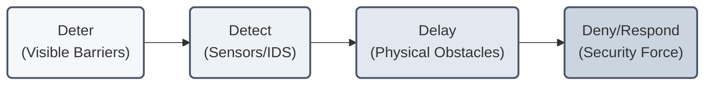

The most effective design principle is to establish maximum **standoff distance**—pushing the threat vector as far from the critical asset as possible. 
* **Urban Settings:** Severe space constraints are a significant limiting factor. Land is either prohibitively expensive or physically unavailable, preventing extensive standoff. Designers must rely on dense structural reinforcement and rapid electronic detection.
* **Suburban/Remote Settings:** Mass standoff space is readily available, but remote sites suffer from prolonged external law enforcement response times. The site design must compensate by prioritizing robust delay barriers (e.g., serpentine access roads, crash-rated perimeter fencing) to buy time for responding forces.

#### 7.5.1 Perimeter Barriers and Fencing
* **Denoting Boundaries:** Fencing is the most common perimeter defense. However, standard chain-link fencing only "keeps honest people honest"—an active intruder can scale or cut through standard 9-gauge chain-link with basic hand tools in seconds.
* **Cargo & Industrial Standards:** Specific industries mandate strict standards. For instance, the cargo and shipping industry requires a minimum **six-foot-high fence** topped with a barbed-wire or razor-ribbon outrigger for basic asset protection.
* **IDS Integration:** Fencing should be integrated with a **Perimeter Intrusion Detection System (PIDS)**—such as fence-mounted vibration sensors, underground fiber-optic pressure cables, and active infrared or laser/LiDAR beams. The fence acts as the delay mechanism, while the PIDS provides immediate detection and notification, initiating the response force window before the intruder breaches the inner perimeter.
* **Setback Strategy:** A critical perimeter design rule is to set the fence line a short distance **inside the actual property boundary**. This dedicated setback allows maintenance personnel to clear brush, inspect the outer barrier, and prevents neighbors from placing landscaping, structures, or dumpsters that could be used as climbing aids to scale the fence.

#### 7.5.2 Landscaping Gradients
Landscaping must support, not hinder, surveillance and detection:
* **Gradient Control:** Landscaping should systematically reduce in size and density as it approaches the facility. High-growth trees and dense shrubs should be kept away from the perimeter to prevent them from offering physical cover, blind spots, or climbing points for an adversary.
* **Camera Line-of-Sight:** Trees and foliage must be pruned to ensure they never obstruct the fields of view of security cameras or PIDS sensors. If critical fields of view are blocked by protected natural features, designers must specify cross-coverage cameras from alternative angles.
* **Advanced Material Delays:** With the widespread availability of cordless, high-torque power tools, standard fences can be bypassed almost instantly. For high-security environments, designers must specify **no-cut/no-climb fencing** (dense weld-mesh designs that prevent toe-holds and resist portable cutting tools), accepting the higher capital cost in exchange for significant delay times.

---

### 7.6 Site Layout: Security Lighting

High-quality lighting is a critical force multiplier for both human guard forces and electronic surveillance systems.

* **Camera Integration and Color Rendering Index (CRI):** Lighting systems must match the specific spectral sensitivity of the video surveillance cameras:
  * **Metal Halide Lighting:** Emits a high-quality, crisp white light that offers excellent color rendering, which is essential for identifying suspects and vehicles on color CCTV systems.
  * **High-Pressure Sodium (HPS) Lighting:** Emits a highly efficient but yellowish light that severely distorts color perception, making visual identification of clothing or vehicle colors extremely difficult on camera.
* **Code Compliance and Light Pollution:** Lighting designs must conform strictly to local municipal codes, which often regulate maximum allowable lumens and light placement to prevent **light pollution**.
* **Spillover Glare Control:** Designers must prevent light spillover (encroachment onto adjacent properties). Spillover can cause severe public nuisances in residential zones and, more critically, create dangerous glare that blinds oncoming traffic on adjacent roadways. Precise directional luminaires and full-cutoff fixtures must be used to focus light strictly within the facility's boundaries.

---

### 7.7 Building Design Against Blast

If a risk assessment identifies explosive blasts (e.g., IEDs, VBIEDs) as a design-basis threat, site layout and structural engineering must be meticulously integrated to mitigate catastrophic structural damage and loss of life.

#### 7.7.1 Blast Physics and Terminology
When an explosive detonates, the structure is subjected to complex pressure waves. Key physical terms include:
* **Incendiary Thermal Effect:** The high-temperature flash or fireball at the instant of detonation. Unless highly volatile or combustible materials are adjacent, the thermal effect plays a minor role in structural collapse.
* **Shock or Blast Wave:** The leading edge of high-density energy released by an explosion, expanding outward in a rapid, circular pattern from the detonation source.
* **Overpressure:** The transient pressure wave amplitude above normal atmospheric pressure.
* **Reflective Pressure:** The consolidated energy of the shock wave that is redirected when it strikes solid objects along its path. Reflective pressure can be **several times stronger** than the initial shock wave at the same distance, as waves combine and bounce off surrounding surfaces.
* **Fragmentation:** Projectiles generated by the casing of the explosive device or nearby building materials shattered by the pressure wave, which travel outward at high velocities.

> [!IMPORTANT]
> **The Urban Consolidation Effect:**
> In dense urban areas, blast waves behave like "ping-pong balls" released inside a miniature town. The energy waves bounce repeatedly off adjacent buildings and street surfaces. This Consolidation Effect prevents the rapid dissipation of pressure, amplifying structural damage compared to an open-field blast.

#### 7.7.2 Building Shapes and Air Blast
A building's architectural geometry heavily influences its vulnerability to air blast. As waves strike surfaces, they reflect at angles dictated by the facade's shape (FEMA/Hinman 2011):

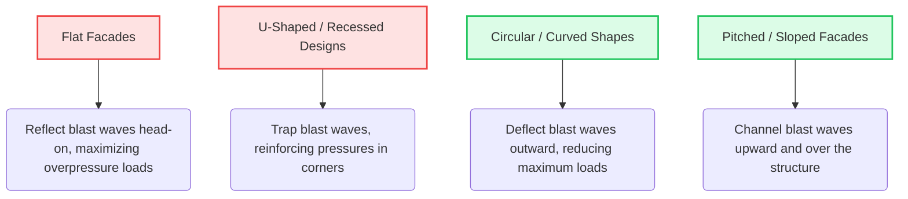

#### 7.7.3 Standoff Zones and Serpentine Drives
Standoff distance is the most cost-effective blast countermeasure. Designers utilize concentric protection zones to push vehicle threats away from the building:
1. **Outer Perimeter:** Clear zones, crash-rated perimeter fencing, and decorative planters.
2. **Access Control Points:** Serpentine patterns using heavy concrete planters or steel bollards to force vehicles to slow down, preventing high-speed ramming attempts.
3. **Inner Standoff:** Crash-rated retractable bollards positioned to protect pedestrian plazas and structural columns from vehicle encroachment.

---

### 7.8 Structural Integrity and Interior Layout

#### 7.8.1 Secondary Debris and Equipment Anchoring
Secondary debris (falling light fixtures, ceiling tiles, and suspended HVAC units) causes a high percentage of blast-related injuries. 
* **Anchoring Suspended Equipment:** Anchoring requirements designed for seismic resistance (earthquakes) double as effective protection against blast-induced vibrations, keeping heavy overhead equipment from falling when blast waves penetrate the building envelope.

#### 7.8.2 Progressive Collapse Prevention
For buildings of **three or more stories**, designers must evaluate progressive collapse risks per **ASCE/SEI 59-11**:
> **Progressive Collapse Definition:**
> The localized failure of a primary structural element (such as a column or load-bearing wall) that triggers a chain-reaction failure of surrounding structural members, leading to a collapse disproportionate to the initial damage.

Famous historical examples of progressive collapse from explosive attacks include the **Khobar Towers** (Saudi Arabia, 1996) and the **Alfred P. Murrah Federal Building** (Oklahoma City, 1995). Structural engineering countermeasures include designing redundant load paths and reinforcing joint connections so that adjacent members can bridge the load if a column is destroyed.

#### 7.8.3 Facade Considerations
Heavy ballast stone on roofs can be swept up by high winds (tornadoes, hurricanes) or blast waves, turning into dangerous wind-borne missiles. Designers should avoid loose roof ballast in high-threat zones, opting instead for fully adhered or concrete-paver roofing systems.

#### 7.8.4 Compartmentalization vs. Open Floor Plans
* **Open Floor Plans:** Offer excellent interior sightlines, situational awareness, and swift emergency exit capabilities. However, they create open attack zones with minimal physical cover for occupants during active shooter events.
* **Closed / Compartmentalized Layouts:** Provide robust physical barriers, privacy, and shelter-in-place options. However, they reduce overall situational awareness and can create egress bottlenecks.
* **Layered Interior Security:** Planners should place high-security zones in the center of the building, surrounded by lower-security zones, so visitors do not have to traverse secure areas. High-risk areas (e.g., mailrooms processing unknown parcels) should be positioned on exterior walls with reinforced structures, or ideally, in a separate, dedicated off-site facility.

---

### 7.9 Glazing and Window Engineering

Glazing is simultaneously a valuable architectural asset (natural light, welcoming design, LEED points) and one of the greatest hazards during a blast or storm due to flying glass fragmentation.

```
                  [ Annealed Glass ]
                 /                  \
   (Extreme Blast/Storm)      (Standard Breakage)
              /                        \
    Shatters instantly into             Shatters into
    razor-sharp shards                 unpredictable fragments
            |                                    |
  [ High Injury Risk ]                 [ Moderate Injury Risk ]

                 [ Laminated / Tempered Glass ]
                               |
                      (Extreme Blast/Storm)
                               |
                 Holds fragments together,
                 absorbing pressure waves
                               |
                     [ Low Injury Risk ]
```

#### 7.9.1 Glazing Countermeasures
To mitigate glazing failure and fragmentation, designers utilize:
* **Laminated Glass:** Composed of two glass panes bonded by a tough polyvinyl butyral (PVB) interlayer. When struck, the glass breaks but remains adhered to the interlayer, absorbing energy and containing fragments.
* **Bite and Frame Engineering:** The "bite" (the depth of the glass pane embedded in the window frame) must be engineered to match the pressure rating of the glass. If the bite is insufficient, the entire pane can pop out under pressure, entering the room as a singular, heavy projectile.
* **Blast Curtains:** Heavy, woven-fiber curtains anchored at the ceiling and floor behind windows. They are designed to capture flying glass fragments and drop them safely to the floor.
* **Central Catch Bars:** A rigid steel bar installed horizontally across the center of a window frame in retrofit projects. If the window fails, the Catch Bar supports the glass sheet, forcing it to fold over the bar rather than flying into the room.

---

### 7.10 Site Utilities and Infrastructure

Site utilities (power, natural gas, water, telecommunications) represent critical operational assets that must be secured against sabotage and accidental disruption.

* **Looping and Redundancy:** For critical facilities, utility feeds should be designed with looping configurations. Providing redundant feeds from two geographically separate entry points ensures that if one line is cut, the facility can be seamlessly back-fed from the alternative path.
* **Access Strategy:** Utility meters and shutoff valves must be strategically located. Placing them outside the security fence allows service providers to perform maintenance without entering secure zones, but leaves them vulnerable to sabotage. Placing them inside the perimeter protects them from attack, but requires strict visitor escort protocols.
* **Physical Entry Points:** Utility portals (storm drains, sewer systems, large air intakes, crawlspaces) must be physically secured with heavy-duty grates, locks, and electronic sensors to prevent them from being used as subterranean ingress routes.

---

### 7.11 Life Safety and Emergency Systems

Security designs must never operate in isolation; they must integrate seamlessly with life safety systems to ensure personnel survival during emergencies.

* **NFPA 101 Integration:** Under the **Life Safety Code (NFPA 101)**, security access control hardware must never trap occupants during an emergency. Electrified locks must be **failsafe**, meaning they immediately unlock and release upon a loss of power or fire alarm activation.
* **Delayed Egress Locks:** In specific commercial settings, life safety codes allow delayed egress locks that hold a door secure for 15 to 30 seconds after the panic bar is pressed, sounding an alarm to alert security forces of an unauthorized exit before releasing.
* **HVAC and Air Intake Security:** Ground-level fresh air intakes are vulnerable to the malicious introduction of chemical, biological, or radiological (CBR) agents. 
  * **Elevation:** Fresh air intakes should ideally be positioned on the roof or high up on exterior walls to prevent easy ground-level access.
  * **Inclined Mesh Grilles:** Ground-level intakes must be protected with heavy walls and an inclined steel mesh grille. The mesh prevents explosive devices or canisters from being tossed into the intake, and the sloped angle ensures objects roll off away from the port.
  * **Emergency Control:** Intakes should feature fast-acting isolation dampers that can be closed instantly from a central Security Operations Center (SOC) upon detecting contaminants or receiving alarms.

#### 7.11.1 Comprehensive Evacuation Checklist

An effective security-life safety plan requires strict preparation:

- [ ] **Egress Paths:** Define primary and secondary evacuation routes from all areas. Egress corridors must be kept completely clear of storage and debris.
- [ ] **Muster Points:** Establish designated assembly zones away from structural overhangs, glazing, and vehicle traffic.
- [ ] **Assigned Roles:** Appoint and train evacuation wardens to direct traffic and account for personnel.
- [ ] **Utility Shutoffs:** Map and secure all emergency shutoffs for natural gas, electrical mains, and water feeds.
- [ ] **Unified Signage:** Install low-level glow-in-the-dark wayfinding exit signs to guide personnel crawling beneath smoke.
- [ ] **Coded Assembly:** Use neutral letter or color designations for muster points (e.g., "Muster Zone Alpha") rather than department names ("Executive Board") to deny target identification to active threat actors.

---

### 7.12 Publications Relevant to Security Architecture and Engineering

* **American Society of Civil Engineers (ASCE):**
  * *Blast Protection of Buildings* (ASCE/SEI 59-11)
* **Centers for Disease Control and Prevention (CDC):**
  * *Guidance for Protecting Building Environments from Airborne Chemical, Biological, or Radiological Attacks*
* **Federal Emergency Management Agency (FEMA):**
  * FEMA 426: *Reference Manual to Mitigate Potential Terrorist Attacks Against Buildings*
  * FEMA 427: *Primer for Design of Commercial Buildings to Mitigate Terrorist Attacks*
  * FEMA 430: *Site and Urban Design for Security*
  * FEMA 453: *Design Guidance for Shelters and Safe Rooms*
* **General Services Administration (GSA):**
  * *Standard Test Method for Glazing and Window Systems Subject to Dynamic Overpressure Loadings*
* **National Fire Protection Association (NFPA):**
  * NFPA 101: *Life Safety Code*
  * NFPA 3000: *Standard for an Active Shooter/Hostile Event Response (ASHER) Program*
* **Unified Facilities Criteria (UFC):**
  * UFC 4-010-01: *DoD Minimum Antiterrorism Standards for Buildings*
  * UFC 4-022-01: *Security Engineering: Entry Control Facilities/Access Control Points*
  * UFC 4-023-03: *Design of Buildings to Resist Progressive Collapse*

---
## Chapter 8: Integrated Security and Protection Strategies

The terms **integrated** and **integration** are widely used in the assets protection and physical security domains. However, they are frequently applied in different ways across various organizational divisions. To establish clear protection concepts, security professionals must understand integration across four complementary levels, representing an increasingly broad strategic perspective:

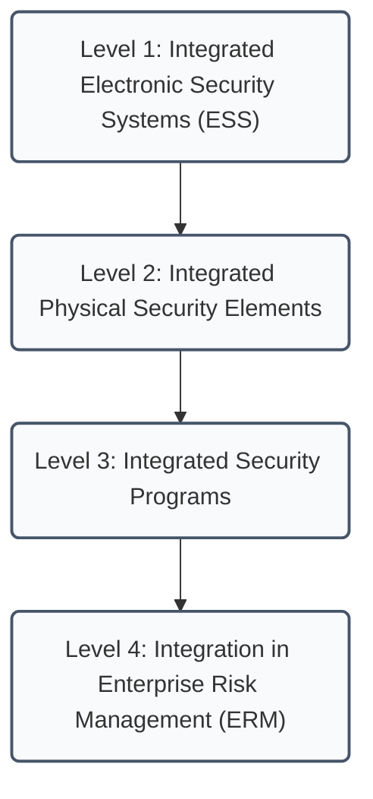

This chapter considers integrated security and protection strategies from two primary perspectives: **integration within the physical security domain**, and **integration across broader enterprise disciplines**.

---

### 8.1 Integrated Electronic Security Systems (ESS)

Modern electronic security systems rely on a complex network of video surveillance, access control, intrusion detection, and alarm annunciation components operating in concert. 

* **The Network Backbone:** Most modern security systems operate over a network backbone. While running on a dedicated, physically isolated security network is highly preferred, many systems ride on the shared corporate enterprise network. This shared approach can trigger performance issues due to bandwidth limits, network latency, or unexpected traffic surges, and introduces security permission and administrative challenges.
* **Single-Source Maintenance Advantage:** Due to the complex, multi-layered nature of networked systems, organizations benefit from selecting a single source to assume responsibility for all preventive and remedial maintenance. A single point of contact simplifies diagnostics, prevents finger-pointing between hardware vendors and software integrators, and ensures rapid incident resolution.
* **Systems Integration Partnerships:** Security professionals coordinate closely with third-party systems integrators, telecom providers, network engineers, and software developers to install and maintain system components.
* **Stakeholder Integration Teams:** When planning renovations, expansions, or new facilities, the security director must form a cross-functional stakeholder team. This team ensures the new system design meets the operational requirements of all business units while leveraging system interoperability to its maximum potential.

> [!CAUTION]
> **Vulnerabilities of Deep Integration:**
> While high integration improves operational efficiency and situational awareness, it introduces serious vulnerabilities:
> 1. **System Dependencies:** Failure of a central network switch or database server can cause a cascading outage across all connected access control and video systems.
> 2. **Cybersecurity of Security Systems:** Highly integrated, network-connected security devices represent potential cyber ingress points. If not properly secured with firewalls, encryption, and strict access controls, the physical security system itself can compromise the corporate network.

---

### 8.2 Integrated Physical Security Elements

A successful physical security strategy integrates three core pillars: **architectural elements**, **electronic systems**, and **operational personnel**.

```
                           [ Integrated Security ]
                          /           |           \
                         /            |            \
            [ Architectural ]    [ Electronic ]    [ Operational ]
            - Building Layout    - Access Control  - Security Force
            - Landscaping        - Surveillance    - Policies/SOPs
            - Standoff Zones     - Intrusion (IDS) - Staff Training
```

#### 8.2.1 Core Components of a Physical Security Strategy
The following represents a comprehensive list of elements that must be integrated to form a cohesive protective posture:
* **Architecture & Engineering:** Facility layout, secure pathways, structural materials, and blast-resistant design.
* **Environmental Controls:** Landscaping, natural access control, and natural surveillance (CPTED).
* **Perimeter Protections:** Fencing, automated gates, structural walls, and vehicle barriers (bollards).
* **Electronic Security Systems:** Electronic access control, video surveillance, intrusion detection (sensors), and alarm communication networks.
* **Operational Controls:** Visitor management systems, incident and case management databases, and real-time threat intelligence feeds.
* **Human Capital:** Professional security officer forces, concierge/reception staff, auxiliary personnel, and outsourced service providers.

#### 8.2.2 The Human Element: Operational Alignment
The human element is the vital link in physical security. Having the right people in the right roles is critical to the survival of the security program:
* **Role Mismatch Risks:** An officer who performs exceptionally at a static entry post or on mobile patrol may be entirely unprepared to handle the cognitive demands, database systems, and crisis dispatch duties of a modern Security Operations Center (SOC). 
* **Staffing Mismatches:** Staffing mismatches—whether from poor selection, sudden operational surges, or staffing shortages—can lead to failed incident response, broken compliance protocols, lost clients, or severe corporate liability.

---

### 8.3 Integrated Security Programs

Physical security does not operate in a vacuum. It is a singular component of a holistic corporate protection strategy. A successful security program must integrate physical protection with several adjacent security and business disciplines:

* **Adjacent Disciplines:**
  * **Personnel Security:** Pre-employment screening, background checks, and insider threat programs.
  * **Information Security / Cybersecurity:** Protecting logical networks, databases, and digital assets.
  * **Information Assets Protection:** Intellectual property defense and proprietary data labeling.
  * **Technical Security:** Counter-surveillance measures and secure meeting rooms.
  * **Training & Awareness:** Employee security education, phishing tests, and active shooter drills.
  * **Executive Protection:** Close protection for high-profile or high-risk leaders.
  * **Product Security:** Supply chain security, counterfeiting deterrence, and product tracking.
  * **Crime Prevention:** Community outreach and local police coordination.

#### 8.3.1 Technology as a Force Multiplier
Technology does not replace physical manpower. Instead, it serves as a powerful force multiplier, augmenting human capabilities and providing automated checks and balances to detect and deter individual wrongdoing. 

#### 8.3.2 Operational Philosophy and CPTED Integration
* **Integrated Design Timing:** Human factors—decision-making, user interfaces, security awareness, and employee culture—must be integrated into the security design *during* the initial planning phase, not after systems are deployed.
* **Philosophical Precedence:** Tailored operating procedures and corporate philosophies must be developed *before* purchasing hardware or software. Installing advanced equipment without clear operational rules results in systems that increase complexity and residual risk.
* **Architectural Access Control:** Restricting the number of building entry points and directing pedestrian flows through designated control portals reduces the security burden on guards and systems. As noted by Patterson (2013), when everyone adheres to clean, easy-to-follow access procedures, abnormal activity immediately stands out.

---

### 8.4 Integration of ERM and ESRM

At the highest organizational level, security integration converges with corporate governance through two distinct risk management systems:

| Characteristic | Enterprise Risk Management (ERM) | Enterprise Security Risk Management (ESRM) |
| :--- | :--- | :--- |
| **Scope** | Broadest enterprise view: manages strategic, financial, operational, market, reputational, and compliance risks. | Focused security view: manages physical, logical, personnel, and information security risks. |
| **Governance** | Led by the C-suite or risk committee; addresses overall business survival and corporate strategy. | Led by the security professional acting as a trusted advisor to asset/risk owners. |
| **Ownership** | Corporate executives own overall enterprise risk portfolios. | Business unit managers (Asset Owners) own security risk decisions; security manages implementation. |
| **Relationship** | Serves as the overarching risk umbrella; may incorporate ESRM as a critical subcomponent. | Operates independently or plugs directly into the ERM framework as the specialized security risk arm. |

#### 8.4.1 The Integration Continuum
The strategic path of security integration flows from the micro to the macro level:

$$\text{Device Components} \longrightarrow \text{Integrated Electronic Systems (ESS)} \longrightarrow \text{Physical Security Program} \longrightarrow \text{Enterprise Risk Management (ERM)}$$

#### 8.4.2 Strategic and Reputational Value
Adopting a holistic ERM/ESRM mindset allows security professionals to contribute to strategic business decisions:
* **Strategic Business Alignment:** Security directors should align programs with financial risk. For example, in a financial institution, a security director must understand the civil liability associated with automated teller machine (ATM) robberies and design a proactive, CPTED-compliant lighting and camera program to mitigate that financial exposure.
* **Corporate Resilience:** Security professionals often assist in strategic investigations, regulatory compliance, and business continuity. Understanding how physical security incidents impact reputational equity and brand value enables the security leader to act as a valuable business partner in a fast-paced, highly connected corporate landscape.

---
## Chapter 9: Structural Security Measures

### 9.1 Physical Barriers

The structural components of a building or facility—walls, floors, ceilings, roofs, doors, windows, and utility ports—form the primary physical shell that protects assets. In a comprehensive security strategy, these components must be understood, engineered, and managed as an integrated barrier system. The effectiveness of any barrier is determined by the **principle of balanced design**: all paths of entry must provide equal delay against the design-basis threat so that no single component becomes a glaring weak link.

---

### 9.2 Walls and Structural Shells

Walls are generally more resistant to penetration than doors, windows, and utility openings. However, most conventional walls can be breached using hand, power, thermal, or explosive tools.

#### 9.2.1 Conventional vs. Reinforced Construction
* **Wall Types and Vulnerabilities:** Typical commercial wall constructions (wood sheathing, corrugated asbestos, standard hollow cinder block) offer minimal delay. Vehicles can easily ram through them, and light hand or power tools can create entry holes in minutes.
* **Reinforced Concrete Walls:** Widely believed to be virtually impenetrable, standard reinforced concrete walls are typically designed to support structural loads, not to resist security penetration. Testing has shown that conventional reinforced concrete walls can be breached relatively quickly.
* **Placement in Series:** Placing two separate reinforced concrete walls in series provides a significantly longer penetration delay than a single wall of equivalent combined thickness. A series configuration forces the adversary to perform multiple setups and physically transport heavy breach tools through the first opening.
* **Enhancing Concrete Delay:** To maximize penetration delay, designers can:
  * Decrease the center-to-center spacing of the internal steel rebar grid.
  * Increase the diameter and gauge of the rebar.
  * Embed heavy steel mesh or interlocking fibers directly into the concrete mix.
  * Ensure the rebar remains anchored; even if explosives shatter the concrete, the intact rebar grid prevents entry until cut with thermal or heavy power tools.

---

### 9.3 Doors and Access Hatches

Doors represent the most common weak link in a building's physical envelope due to their functional requirement to open and the mechanical tolerances of their hardware.

#### 9.3.1 Door Classifications
Doors are categorized based on their structural design and protective application:
1. **Standard Industrial Doors:** Lightweight wood or metal, providing minimal security (delay times as low as 10 seconds).
2. **Personnel Doors:** Standard hollow steel doors used for general building access.
3. **Attack- and Bullet-Resistant Doors:** Heavy-duty reinforced doors engineered to resist localized physical attacks and ballistic impacts.
4. **Vehicle Access Doors:** Heavy coiling or sliding doors designed for warehouses and loading docks.
5. **Vault Doors:** Massive, precision-engineered steel assemblies designed to resist high-intensity tool and thermal attacks.
6. **Blast-Resistant Doors:** Reinforced plate structures engineered to withstand severe overpressure waves.

#### 9.3.2 Standard Exterior Door Specifications
The baseline standard for a secure exterior personnel door includes:
* **Thickness & Gauge:** A minimum thickness of **1¾ inches (44 mm)** with **16 or 18-gauge (1.5 or 1.2 mm)** steel surface sheets.
* **Core Materials:** Hollow core designs should be avoided in favor of composite cores containing noncombustible, sound-deadening structural material, such as high-density polyurethane foam or solid mineral slabs.
* **Internal Reinforcement:** Specifying light-gauge vertical steel channels inside the door shell to provide maximum torsional strength and rigidity.

---

### 9.4 Hardening and Upgrading Doors

When complete door replacement is not feasible, existing door assemblies can be significantly upgraded to resist hand, power, or thermal tool attacks.

> [!WARNING]
> **The Critical Prying Metric:**
> Forced frame-to-door separation of only **½ inch (13 mm) to ¾ inch (19 mm)** is typically sufficient to disengage standard lock bolts, allowing an intruder to pry open a secure door. Striker plates and lock frames must be reinforced to prevent prying deflection.

#### 9.4.1 Door Hardening Techniques

| Upgrade Target | Vulnerability Vector | Hardening Countermeasure |
| :--- | :--- | :--- |
| **Door Frame** | Prying and frame spreading attacks that disengage the lock bolt. | **Grouting:** Fill the hollow steel door frame with high-strength concrete to a height of at least **18 inches (45 cm)** above the strike plate on both sides of the frame. |
| **Lock / Frame Gap** | Direct prying or insertion of tools into the locking latch. | **Astragals:** Weld or bolt a heavy steel strip (astragal) over the lock gap. The astragal must be door-height, at least **2 inches (51 mm)** wide, and overlap the door frame by at least **1 inch (25 mm)**. |
| **Hinges** | Cutting of exposed hinge knuckles or removal of hinge pins in outward-swinging doors. | • Specify hinges with a **stud-in-hole (security stud)** feature.<br>• Weld the pin tops to prevent removal.<br>• Install a full-length **piano hinge** to distribute forces.<br>• Bolt or weld a steel **Z-strip** to the rear door face to prevent removal even if hinges are completely cut. |
| **Thermal Protection** | Rapid cutting using thermal lances or oxy-acetylene torches. | **Redwood Cores:** Laminate a solid redwood core between dual steel plates. The organic density of redwood increases thermal cutting delay times by **three to four times** compared to an empty air void. |
| **Panic / Crash Bars** | Chiseling or wire-hooking attacks through gaps to depress the panic bar from the outside. | • Install a bent metal plate shield with a drill-resistant steel section over the bar.<br>• Remove all exterior doorknobs and key cylinders (exit-only doors).<br>• Use **delayed egress hardware** (NFPA 101 compliant) that delays unlocking by 15–30 seconds while sounding local alarms. |

---

### 9.5 Windows and Glazing Engineering

Unenhanced windows delay adversaries only slightly, often requiring less than 15 seconds to breach. Upgrading glazing involves selecting materials that balance visibility with physical delay and fragment containment.

#### 9.5.1 Glazing Materials and Performance

* **Annealed (Plate) Glass:** Standard glass. Breaks into large, razor-sharp shards. Highly dangerous; building codes restrict its use in high-traffic panels or fire exits due to injury risk.
* **Tempered Glass:** Heat-treated glass. Mechanical strength is higher than annealed glass, but it shatters into small, relatively harmless crumbs. It can still be broken instantly with handheld impact tools.
* **Wired Glass:** Features an embedded wire mesh. Often required by fire codes to maintain fire ratings in doors. Offers minimal security; can be penetrated with hand tools in **20 seconds**.
* **Laminated Glass:** PAN PVB interlayer bonded between glass sheets. Cracks but remains adhered to the plastic interlayer, absorbing energy. Highly preferred for blast fragment mitigation.
* **Bullet-resistant / Burglar-resistant Glass:** Multi-ply laminate composed of multiple layers of glass, polycarbonate, and specialized PVB films to provide certified ballistic ratings.
* **Acrylic Plastics (e.g., Lucite, Plexiglas):** Lightweight glass substitutes. Standard thicknesses under 1 inch (25 mm) can be shattered with hand tools in under **10 seconds** and are highly combustible.
* **Polycarbonates (e.g., Lexan):** High-impact structural plastics. A **¼-inch (6 mm)** sheet resists basic hand tools for up to **two minutes**. Thermal tools can bypass them in one minute but produce dense, toxic combustion gases.
* **Glass/Polycarbonate Composites:** Multi-layer panels combining the scratch resistance of glass with the impact toughness of polycarbonate. Highly resistant to prolonged hand and power tool attacks (prison-grade).

#### 9.5.2 Window Systems Hardening
For effective delay, windows must be engineered as a complete system (glass, sash, locking mechanisms, and wall anchors):
* **Frame Anchorages:** Window sashes and frames must be secured to the masonry structure with heavy-duty anchors or welded directly into structural steel plates.
* **Fixed vs. Operable:** Fixed windows are highly preferred. In operable windows, locking hardware must be shielded from exterior reach.
* **Window Bars:** Heavy steel bars installed over the opening, subject to building and fire egress codes.
* **Fragment Retention Film:** Adhesive film applied to the interior glass surface. Holds shattered glass together, mitigating injuries from blast overpressures and extreme weather (tornadoes/hurricanes).
* **Blast Curtains & Shutters:** Reinforced woven-fabric curtains to capture debris, or heavy rolling aluminum shutters (horizontal interlocking slats) that provide physical delay and privacy.

---

### 9.6 Roofs, Floors, and Utility Openings

Determined adversaries may bypass hardened walls and doors by attacking horizontal boundaries or utility penetrations.

#### 9.6.1 Roof and Floor Integrity
Roofs and floors are engineered similarly but vary in concrete thickness, reinforcement density, and load capacity.
* **Floors:** Generally provide higher penetration resistance because they are designed to support heavy structural and live loads.
* **Roofs:** Represent a soft target, often composed of lightweight subdecks, wood sheathing, or thin concrete over insulation.
* **Upgrades:** Roof security can be enhanced by embedding heavy steel mesh screens directly into the roofing membrane below the weather seal.

#### 9.6.2 Utility Ports and Structural Openings
Unattended openings—ventilation ducts, utility tunnels, and maintenance hatches—represent concealed pathways for intruders.
* **Narrow Aperture Design:** In new construction, designers should limit window and utility duct widths to **4 inches (102 mm) or less**. Even if the glazing is removed, a 4-inch aperture prevents human passage without intensive structural demolition.
* **Securing Tunnels and Ducts:** Tunnels and larger HVAC ducts must be protected with heavy steel security grates, locked hatches, and electronic sensors (IDS) to detect unauthorized access.

---

### 9.7 Fencing and Perimeter Barriers

Fences and perimeter walls are the most common perimeter defense measures. Placed at the property boundary as a countermeasure, they serve as a visual line of demarcation, deter casual trespassers, and act as a physical barrier to delay or prevent entry.

#### 9.7.1 Chain Link Fencing
Of the various fence types available, metal chain link is the most popular, durable, and cost-effective for most applications. If properly deployed, it provides reasonable protection and has the advantage of allowing complete visibility between the interior and exterior of the perimeter.

##### Structural Specifications (ASTM & CLFMI Standards)
* **Standard Height:** A chain link fence intended to discourage human penetration must be a minimum of **7 feet (2.1 m)** in height (excluding the top guard). Fences used purely to mark boundaries or discourage small animals can be **4 feet (1.2 m)** high, with ownership and warning signs posted at **30 feet (15 m)** intervals.
* **Wire Fabric & Mesh:** Fabric must be **No. 9 AWG (American Wire Gauge)** or heavier, with mesh openings not exceeding **2 inches (50 mm)**. For higher-security requirements, a smaller mesh (e.g., 1 inch or 3/8 inch) should be used.
* **Selvage Treatment:**
  * For fences **5 feet (1.5 m) and under**, the selvage must be knuckled at both ends.
  * For fences **higher than 5 feet (1.5 m)**, the selvage should be knuckled at the bottom and twisted/barbed at the top.
  * For mesh sizes **less than 2 inches (41 mm)**, all selvages should be knuckled.
* **Tension and Anchorage:**
  * Fabric must be stretched taut, fastened to line posts at **15-inch (38 cm)** intervals, and to top/bottom rails or tension wires at **24-inch (60.9 cm)** intervals.
  * The bottom of the fabric should be **2 inches (51 mm)** above hard ground or paving. On soft ground, it must extend below the soil surface. To prevent burrowing or pulling, a concrete apron at least **6 inches (152 mm)** thick can be installed, or the fabric can be staked using U-shaped stakes **2 feet (0.6 m)** long.
* **Culverts and Openings:** Any culverts, troughs, or streams crossing the fence line that are **96 sq. inches (619 sq. cm)** or larger must be protected with grates, bars, or additional fencing to prevent entry without impeding water drainage.

##### Breaking Strengths by Wire Gauge
The fence fabric wire must withstand the following breaking loads:
* **No. 6 Gauge ($0.192\text{ in.}$ / $4.9\text{ mm}$):** $2,170\text{ lbs}$ ($984\text{ kg}$)
* **No. 9 Gauge ($0.148\text{ in.}$ / $3.8\text{ mm}$):** $1,290\text{ lbs}$ ($585\text{ kg}$)
* **No. 11 Gauge ($0.120\text{ in.}$ / $3.0\text{ mm}$):** $850\text{ lbs}$ ($386\text{ kg}$)
* **No. 12 Gauge ($0.113\text{ in.}$ / $2.9\text{ mm}$):** $750\text{ lbs}$ ($340\text{ kg}$)

##### Post and Bracing Installation
* **Post Spacing:** Line posts must be spaced equidistantly at intervals not exceeding **10 feet (3 m)** center-to-center.
* **Footing Excavation:** Under normal soil conditions, post holes should have a diameter **four times** the post's largest cross-section. Hole depth must be a minimum of **24 inches (0.6 m)**, plus an additional **3 inches (76 mm)** for each 1-foot (0.3 m) increase in fence height over 4 feet (1.2 m).
* **Concrete Backfill:** Posts must be set plumb and backfilled with **2,500 psi (17.2 MPa)** concrete, extending **2 inches (50 mm)** above grade and crowned to shed water.
* **Rock Installation:** In solid rock, hole depth must be **three times** the post's largest cross-section, with a diameter **0.5 inches (13 mm)** larger than the post. The hole is half-filled with non-shrink hydraulic cement, the post forced to the bottom, and the remaining space filled and crowned.
* **Alternative Driven Anchors:** Driven posts using two steel blades driven diagonally through metal shoes below ground level can provide stability equivalent or superior to concrete footings. The blades brace the post from front and back, resisting frost heaving and bending before the footing gives.
* **Bracing Requirements:**
  * Diagonal braces from terminal posts to the nearest line post are required for all fabric **over 6 feet (1.83 m)**. No braces are required for fabric 6 feet or under if a top rail is installed.
  * For fabric **over 12 feet (3.66 m)**, a center rail is required.
  * Fences without a top rail must have diagonal braces on all terminal posts, with a top tension wire stretched from end to end and fastened within the top **1 foot (0.3 m)** of the fabric. The angle between the diagonal brace and the ground must not exceed **50 degrees**.

##### Fence Top Treatment & Outriggers
* **Top Rail:** A horizontal member that improves fence appearance but provides a handhold for climbing. If omitted, a top tension wire must be used.
* **Top Guard (Outrigger):** An overhang of **three strands of barbed wire** spaced **6 inches (15.2 cm)** apart, usually set at a **45-degree angle**, extending the fence height by **1 foot (0.3 m)**.
  * **Direction:** An **outward-facing** outrigger hampers entry from the outside; an **inward-facing** outrigger hampers exit from the inside. A **double overhang** (V-shape or inverted V) provides bidirectional deterrence.
  * **Load Capacity:** Barb arms must support a dead weight of **250 lbs (113 kg)** applied at the outermost strand.

##### Clear Zone Management
> [!IMPORTANT]
> **The Clear Zone Rule:**
> Failure to establish and maintain a clear zone is one of the most common physical security errors. All potential climbing aids—including boxes, ladders, trash containers, parked vehicles, equipment, and overhanging tree limbs—must be kept completely clear of both sides of the fence line.

##### Gates, Turnstiles, and Color Coatings
* **Gate Construction:** Gate frames must be constructed of welded tubular steel (round or square) to withstand lateral strains. Fabric must match the fence and be tied at **15-inch** intervals. Lockable configurations include single-swing, double-swing, multifold, overhead slide, cantilever slide, and vertical-lift gates.
* **Turnstiles:** Pedestrian control units manufactured in two heights:
  * **Waist-High (approx. 36 in / 0.9 m):** Used for crowd flow and counting, but offers little security unless constantly attended.
  * **Full-Height (approx. 7 ft / 2.1 m):** Completely encloses individuals, preventing climbing or tailgating, and is easily integrated with card access, keypads, or biometrics.
* **Color and Privacy Enhancements:**
  * **PVC/Polymer Coatings:** Hot-extruded PVC resin coatings (up to **22 mil / 0.5 mm** thick) prevent rust, making them ideal for marine environments. Standard colors are green, olive green, brown, and black.
  * **Privacy Slats:** Redwood or plastic strips can be woven into the fabric to provide visual screening.
  * **Interior Enclosures:** Chain link fabric can be used indoors (e.g., in warehouses) to form secure, caged storage compartments, including a caged ceiling.

#### 9.7.2 Decorative Fencing and Masonry Walls
Where aesthetics are critical, decorative fencing or walls can be used as an alternative to chain link:
* **Materials:** Ornamental fences are constructed of carbon steel, galvanized steel, or aluminum, tailored in height, pale/picket spacing, and rail spacing. Modern high-security decorative fencing can include built-in top barbs and outward-angled pickets.
* **Masonry Walls:** Constructed of brick, stone, or concrete. They blend easily into architectural environments and provide high delay, but they are expensive, obstruct visibility, and can create blind spots if not integrated with lighting and surveillance cameras.

#### 9.7.3 Specialty Fencing Types
* **Cable System Fencing:** High-strength steel cables suspended between heavy concrete anchor blocks (deadmen) spaced up to **200 feet (61 m)** apart. Cable fences allow deflection and absorb energy, making them highly effective for vehicle access delay.
* **Expanded Metal Fencing:** Heavy steel sheet slit and stretched to form a diamond-mesh pattern. It is tougher, heavier, and far more difficult to cut than chain link because it does not unravel. Available in standard, grating, flattened, and decorative styles.
* **Welded Wire Fabric:** Interlocking wire grids welded at each joint. More expensive than chain link but less than expanded metal; typically used in medium-to-low risk perimeters.
* **Wooden Fences:** Limited to low-security applications. To maximize security, vertical pickets should be no wider than **1.5 inches (44 mm)**, and horizontal rails must be spaced at least **50 inches (1.27 m)** apart and located on the protected side.
* **Electric Security Fencing:** A close wire grid supported by insulated posts. It acts as both a psychological deterrent (discharging non-lethal, unpleasant electrical pulses 45 times per minute) and a monitored alarm system that detects cuts or short circuits. Typical industrial systems are **8 feet (2.4 m)** tall with **20 zones/wires** mounted to the inside of a standard chain link fence.

---

### 9.8 Vehicle Barriers and Anti-Ram Systems

Standard perimeter fencing provides minimal resistance to vehicle ramming. Where vehicle-borne improvised explosive devices (VBIEDs) or forced vehicular entry are threat vectors, specialized anti-ram barriers must be deployed.

#### 9.8.1 Classification of Vehicle Barriers
Barriers are categorized into two operational classes:
1. **Passive (Fixed) Barriers:** Anchored permanently in place to protect perimeters where vehicle access is not required.
2. **Active (Operable) Barriers:** Retractable or movable units positioned at entry control points (ECPs) to regulate authorized vehicle passage.

```mermaid
graph TD
    %% Base Styles
    style ECP fill:#1e1e2f,stroke:#4a4a6a,stroke-width:2px,color:#fff
    style Passive fill:#152e15,stroke:#2d6a4f,stroke-width:2px,color:#fff
    style Active fill:#2e1515,stroke:#6a2d2d,stroke-width:2px,color:#fff
    style Standards fill:#2e2e15,stroke:#6a6a2d,stroke-width:2px,color:#fff

    ECP["Perimeter Protection & Anti-Ram Layer"]
    ECP --> Passive["Passive (Fixed) Barriers"]
    ECP --> Active["Active (Operable) Barriers"]
    ECP --> Standards["Crash Testing Standards"]

    Passive --> P1["Fixed Bollards (Deep vs. Shallow)"]
    Passive --> P2["Engineered Planters"]
    Passive --> P3["Jersey Barriers (Anchored)"]
    Passive --> P4["Specialty (Half-Buried Tires/Heavy Posts)"]

    Active --> A1["Retractable/Twist-up Bollards"]
    Active --> A2["Rising/Rotating Wedge Barriers"]
    Active --> A3["Drop-Arm Crash Beams"]
    Active --> A4["Retractable Gates"]

    Standards --> S1["ASTM F2656-07 (M30/M40/M50)"]
    Standards --> S2["U.S. Dept of State (K4/K8/K12)"]
    Standards --> S3["BSI PAS 68:2013"]
```

#### 9.8.2 Passive Barrier Systems
* **Fixed Bollards:** Vertical metal or concrete posts designed to absorb kinetic energy:
  * **Spacing:** Must be spaced between **36 and 48 inches (0.9 to 1.2 m)** center-to-center to prevent small vehicle passage while maintaining ADA wheelchair accessibility.
  * **Foundation Types:**
    * *Deep-Mount:* Traditional deep concrete foundations providing maximum anti-ram strength.
    * *Shallow-Mount:* Engineered footings requiring minimal excavation (often less than 12 inches), ideal for urban environments with dense buried utility networks.
  * **Height:** Typically **30 to 38 inches (0.76 to 1.0 m)**, inclusive of decorative sleeves (e.g., brushed aluminum, bronze, stainless steel).
  * **Integration:** Fixed bollards can be fitted with LED, CFL, or metal halide lighting and electrical outlets.
* **Planter Barriers:** Reinforced concrete planter boxes acting as heavy decorative barriers:
  * **Anchorage:** Planters are secured to the subgrade with heavy steel rebar dowels or placed over a structural concrete foundation. Some feature a heavy-duty highway-type steel/concrete barrier core inside a decorative exterior.
* **Jersey Barriers:** Standardized precast concrete median blocks:
  * **Mass:** A standard **12-foot (3.6 m)** Jersey barrier weighs approximately **5,700 lbs (2,585 kg)**.
  * **Defeat Vulnerability:** Simply resting on the ground makes them ineffective against vehicle ramming because the impact easily shoves them aside.
  * **Hardening:** To be effective, they must be embedded in the pavement and anchored vertically with steel reinforcing bars driven into the foundation.
* **Specialty Passive Barriers:**
  * *Half-Buried Tires:* Heavy equipment tires **7 to 8 feet (2.1 to 2.4 m)** in diameter, buried halfway in the ground with firmly tamped soil. Tested to stop a 3/4-ton pickup.
  * *Angled Metal Posts:* Heavy steel posts or railroad ties embedded in concrete footings, angled outward at **30 to 45 degrees** in the direction of threat, spaced **4 feet (1.2 m)** apart.

#### 9.8.3 Active Barrier Systems
Active barriers must be monitored, controlled by access systems (card readers, keypads), and attended by personnel due to liability and safety risks.
* **Retractable Bollards:** Automatically rise or lower level with the road surface via electric, pneumatic, hydraulic, or gas-assisted cylinders. Newer models use twist-up rotational mechanisms.
  * *Disadvantages:* High maintenance requirements, vulnerability to environmental debris/water, and risk of accidental activation leading to vehicle damage or lawsuits.
* **Wedge Barriers (Plate Barriers):** Heavy-duty steel plates installed in the roadway that rotate upwards at an angle to block traffic:
  * **Installation:** Can be surface-mounted or set in a shallow trench (approx. **18 inches / 0.48 m** deep).
  * **Operating Speed:** Typically deploys or retracts in **3 seconds** using hydraulic rams.
  * **Duty Cycles:** Designers must calculate expected daily cycles. A barrier kept normally retracted and raised only in emergencies undergoes minimal wear; a barrier kept normally raised and lowered for every vehicle undergoes hundreds of cycles per day, demanding heavy-duty continuous-duty systems.
* **Drop-Arm Crash Beams:** Heavy steel beams pivoted on a robust hinge post and secured in a locking receiver post.

#### 9.8.4 Anti-Ram Standards and Crash Ratings
To evaluate barrier performance against vehicle-borne threats, security designers use standardized crash ratings. These tests assess a barrier's ability to stop a specific vehicle weight traveling at a designated speed within a maximum allowed penetration distance:
* **U.S. Department of State (SD-STD-02.01):** Uses ratings based on a medium-duty truck ($15,000\text{ lbs}$ / $6,800\text{ kg}$):
  * **K4:** Stops a $15,000\text{ lbs}$ vehicle traveling at $30\text{ mph}$ ($48\text{ km/h}$).
  * **K8:** Stops a $15,000\text{ lbs}$ vehicle traveling at $40\text{ mph}$ ($64\text{ km/h}$).
  * **K12:** Stops a $15,000\text{ lbs}$ vehicle traveling at $50\text{ mph}$ ($80\text{ km/h}$).
* **ASTM F2656-07:** Replaced the DoS standard, offering a wider range of vehicle types, speeds, and penetration ratings. Key classifications:
  * **C7:** Small passenger car ($2,430\text{ lbs}$ / $1,100\text{ kg}$).
  * **M:** Medium-duty truck ($15,000\text{ lbs}$ / $6,800\text{ kg}$) - equivalent to DoS K-ratings (M30, M40, M50).
  * **H:** Heavy-duty dump truck ($65,000\text{ lbs}$ / $29,500\text{ kg}$).
  * **Penetration Ratings (P):** Specifies how far the cargo bed of the vehicle penetrated past the barrier's reference line:
    * **P1:** $\le 3.3\text{ feet}$ ($\le 1\text{ m}$).
    * **P2:** $3.31\text{ to }16.4\text{ feet}$ ($1.01\text{ to }5\text{ m}$).
    * **P3:** $16.41\text{ to }98.4\text{ feet}$ ($5.01\text{ to }30\text{ m}$).
    * **P4:** $\ge 98.41\text{ feet}$ ($\ge 30\text{ m}$).
* **BSI PAS 68:2013:** The equivalent United Kingdom crash testing standard.

---

### 9.9 Containers, Safes, and Vaults

Physical protection of critical assets (cash, high-value negotiables, classified documents, digital media, and vital records) requires the deployment of secure storage enclosures. These systems are engineered to resist two distinct vectors: **forced entry (burglary)** and **thermal destruction (fire)**.

#### 9.9.1 Fire-Resistant Containers and Safes
Fire safes are engineered to protect interior contents from thermal destruction by keeping temperatures below the combustion threshold of the stored medium:
* **Thermal Thresholds:**
  * **Paper Records:** Paper begins to char at approximately **410°F (210°C)**. Fire safes for paper must maintain an interior temperature **below 350°F (177°C)**.
  * **Digital Media:** CDs, DVDs, and USB flash drives require temperatures **below 125°F (52°C)**.
  * **Magnetic Tapes & Hard Drives:** Backups and magnetic media require temperatures **below 150°F (66°C)** and a relative humidity of less than 85%.

##### Underwriters Laboratories (UL 72) Fire Classifications
UL 72 establishes standardized ratings based on the duration of exposure (1/2, 1, 2, 3, or 4 hours) in an oven at temperatures up to 2,000°F (1,093°C), followed by a cool-down phase and a drop test:
1. **Class 350 (Paper Records):**
   * *Class 350-4:* 4 hours of fire exposure; interior temp remains $< 350^\circ\text{F}$.
   * *Class 350-2:* 2 hours of fire exposure; interior temp remains $< 350^\circ\text{F}$.
   * *Class 350-1:* 1 hour of fire exposure; interior temp remains $< 350^\circ\text{F}$.
2. **Class 150 (Magnetic Tapes/Floppy Disks):**
   * *Class 150-1/2/3/4:* Maintain interior temp $< 150^\circ\text{F}$ and humidity $< 85\%$ for the specified duration.
3. **Class 125 (Digital Data/CDs/Hard Drives):**
   * *Class 125-1/2/3:* Maintain interior temp $< 125^\circ\text{F}$ and humidity $< 80\%$ for the specified duration.

##### The UL Fire Endurance, Drop, and Explosion Tests
* **Fire Endurance:** The safe is placed in a test furnace and heated according to a standard time-temperature curve. The interior temperature and humidity are recorded continuously during both heating and the subsequent natural cool-down period.
* **Explosion Test:** The safe is placed directly in a furnace preheated to **2,000°F (1,093°C)** for 30 minutes. This sudden thermal shock test determines whether the moisture in the safe's insulation will create steam pressure high enough to cause structural failure or blow the door off.
* **Fire-Drop Test:** The safe, after being heated in the furnace, is hoisted **30 feet (9 m)** (simulating a three-story building collapse) and dropped onto concrete rubble. Once cooled, it is turned upside down and reheated in the furnace to ensure its door, hinges, and body remain completely intact and its interior contents remain unharmed.

#### 9.9.2 Burglary-Resistant Containers and Safes
Burglary safes are constructed of solid steel plate or high-tensile composite materials (concrete mixed with steel fibers, corundum, or copper to defeat drills and torches).

##### Underwriters Laboratories (UL 687) Burglary Ratings
UL 687 classifications are based on the **net working time** during which testing engineers (equipped with blueprints and disassembling tools) attempt to open the door or make a **6-inch square opening** through the body or door:
* **Net Working Time Rule:** The attack clock runs only when the tool makes contact with the safe ("when the tool comes off, the clock stops").
* **Residential Security Container (RSC):** Resists a **5-minute** attack by one technician using common hand tools (screwdrivers, pry bars, chisels, wrenches, and hammers up to 3 lbs, length $\le 18\text{ in.}$). Conforms to **UL 1037**.
* **Residential Security Container II (RSC II):** Resists a **10-minute** attack by two technicians using more aggressive tools (picks, high-speed carbide drills, and pressure-applying devices) attempting to make a 6-square-inch opening.
* **TL-15 (Tool Resistant):** Resists a **15-minute** attack on the door or front face using common hand tools, drills, punches, hammers, and pressure-applying devices. Must weigh at least **750 lbs (340 kg)** or be anchored.
* **TL-30 (Tool Resistant):** Resists a **30-minute** attack on the door or front face using TL-15 tools plus power saws, grinding points, and abrasive cutting wheels.
* **TL-30X6 (Six-Sided Tool Resistant):** Resists a **30-minute** tool attack on all six sides of the safe (door, top, bottom, sides, and back).
* **TRTL-30 (Torch and Tool Resistant):** Resists a **30-minute** attack on the door or front face using tools plus oxy-acetylene cutting torches.
* **TXTL-60 (Torch, Tool, and Explosives):** Resists a **60-minute** attack on all six sides using tools, torches, and high explosives.

##### Non-Tested Safe Ratings
* **B-Rate:** An industry catch-all rating requiring no standardized testing. Typically defined by a **1/4-inch** steel body and **1/2-inch** steel door. Offers minimal resistance against determined attacks.
* **C-Rate:** An industry catch-all rating requiring no standardized testing. Defined by a **1/2-inch** steel body and **1-inch** steel door.
* **GSA-Approved Safes:** Tested and approved by the U.S. General Services Administration (GSA) under federal specifications (e.g., AA-F-358) for the storage of classified documents. Rated into classes (Class 5, Class 6) resisting forcible and surreptitious entry.

#### 9.9.3 Vault Construction and Engineering
Vaults are reinforced rooms designed to provide high-delay protection against forced entry and thermal hazards:
* **Location:** Vaults should be located on an interior wall rather than an exterior building boundary, as exterior placement allows adversaries to mount heavy attacks from outside without detection. Basement locations should be avoided because smoldering debris can accumulate above, producing a long-term "cooking effect," and they are highly vulnerable to flooding.
* **Balanced Design:** All six sides of a vault (walls, ceiling, floor) must provide equal penetration delay. Installing a massive Class 5 vault door on standard 4-inch concrete walls creates a severe weak link.
* **Construction Specifications:**
  * **Reinforced Concrete Walls:** Minimum thickness of **12 inches (30.5 cm)** of poured concrete reinforced with steel rebar.
  * **Steel Rebar Reinforcement:** Rebar must be at least **0.5 inches (13 mm) in diameter (No. 4 AWG)** spaced **6 inches (15.2 cm)** on-center in a grid, wired securely at intersections, and centered in the pour.
  * **Rebar Thickness Metrics & Delay Avenues:**
    * *No. 4 or smaller rebar:* Can be cut with manual handheld bolt cutters.
    * *No. 5 to No. 8 rebar:* Requires power-operated hydraulic bolt cutters, cutting torches, or thermal burning bars.
    * *Larger than No. 8 rebar:* Can only be cut with oxygen torches, burning bars, power saws, or explosives.

##### Fire-Resistive Vault Specifications (NFPA 232 / NFPA 220)
* **4-Hour Vault Wall:** Minimum thickness of **12 inches (30.5 cm)** for brick or **8 inches (20.4 cm)** for reinforced concrete.
* **6-Hour Vault Wall:** Minimum thickness of **12 inches (30.5 cm)** for brick or **10 inches (25.4 cm)** for reinforced concrete.

##### Vault Operational Procedures & Vulnerabilities
* **Two-Man Rule:** Ensures no single individual can open the vault. The Dial combo is usually a three-wheel changeable combination lock. A common mistake is counting the final opening index (the last dial step) as a fourth combination number, leading to improper setting and compromise.
* **Combination Setup Precautions:** Avoid setting the first and last numbers of the combination within the dead zones of $0\text{ to }10$ or $90\text{ to }100$. Wheel gates are typically two digits wide. If not changed using proper locksmith procedures, a lock can be vulnerable to simple dial-rotation bypasses.
* **Internal Safety:** Vaults must be equipped with internal release handles (escape mechanisms) and CCTV with two-way audio to prevent lock-ins.
* **Maintenance:** Vault doors, hinges, and locksets must undergo periodic inspection by an ALOA-certified locksmith to prevent door sag and lock binding.

---

### 9.10 Locks and Locking Mechanisms

Locks are the primary mechanical and electromechanical devices used to secure doors, windows, gates, and containers, forming a critical control layer in physical asset protection.

#### 9.10.1 Mechanical Locking Systems
A mechanical lock uses physical barriers (tumblers) to prevent the movement of a bolt or latch unless a matching key is inserted:
* **Core Assemblies:**
  1. **The Bolt or Latch:** The movable member that projects into the frame.
  2. **The Keeper or Strike:** The metal housing in the frame that receives and secures the bolt.
  3. **The Tumbler Array:** The internal barrier/labyrinth that must be aligned to move the bolt.
  4. **The Key or Credential:** The device that aligns the tumblers.
* **Primary Types of Mechanical Locks:**
  * **Warded Locks:** The oldest design, featuring a series of circular metal projections (wards) inside the keyway. The key must have cutouts that bypass these wards.
    * *Vulnerability:* Extremely insecure. Easily defeated using simple skeleton keys or spring manipulation wires. Warded locks are completely obsolete for security applications and must undergo phased replacement.
  * **Lever Locks:** Feature flat metal tumblers pivoting on a common post and held under spring tension. When the key aligns the notches (gates) in the levers, a metal fence on the bolt slides through them, allowing retraction.
    * *Applications:* Safe deposit boxes, lockers, mailboxes, and office desks. High-security versions offer excellent pick resistance.
  * **Pin Tumbler Locks (The Yale Cylinder):** Uses a cylinder containing a plug and a series of spring-loaded split pins (driver pins and key pins) of varying lengths.
    * *Operation:* When the correct key is inserted, its bitting cuts raise the pin splits to align perfectly with the plug-shell boundary, known as the **shear line**, allowing the plug to rotate.
    * *Vulnerabilities:* Susceptible to picking, raking, bumping, and impression attacks (try keys).
  * **High-Security Cylinders:** Hardened pin-tumbler locks designed to resist picking, drilling, and key duplication:
    * *Interlocking Pins:* Pins and drivers are interlocked to prevent picking.
    * *Rotational Bitting:* The key bitting cuts are angled as well as cut to specific depths. The key must both raise the pins to the shear line and rotate them to align slots with a side bar (e.g., Medeco cylinders).
  * **Wafer Tumbler Locks:** Uses flat, spring-loaded plates (wafers) that project into the cylinder shell. Inserting the correct key pulls the wafers flush with the plug, allowing rotation. Commonly used in cars, desks, and cabinets; easily picked.
  * **Dial Combination Locks:** Keyless mechanical locks containing circular, interdependent metal tumblers (wheels). Rotating the dial aligns the gates on all wheels, allowing a fence to drop in and retract the bolt.
    * *Logic:* Dial locks are true combination locks (the order of rotation matters: Left-Right-Left) rather than simple permutation locks.
    * *Math:* For a 3-wheel lock with 100 dial positions, the theoretical maximum combinations are $100^3 = 1,000,000$.

#### 9.10.2 Electromechanical and Electrified Locking Systems
Electrified locks combine mechanical locking assemblies with electrical solenoids or electromagnets to allow remote control via access systems (card readers, keypads, biometrics) and Boolean logic:
* **The Boolean Logic Rule:** Access control systems can program doors using logical operators (e.g., `IF Door A is Closed AND Door B is Locked, THEN Unlock Door C`). This is critical in designing high-security mantrap (interlocking door) networks.
* **Operational Modes:**
  * **Fail-Safe:** The lock automatically unlocks when power is removed or lost.
    * *Egress Rule:* Mandatory for doors in the path of emergency egress (e.g., electromagnetic locks) under the International Building Code and NFPA 101 Life Safety Code.
  * **Fail-Secure:** The lock remains locked when power is removed or lost. Used to protect high-security vaults or perimeters during power outages, provided there is a separate mechanical free-egress mechanism (e.g., panic bar).

##### Primary Types of Electrified Locks
* **Electric Deadbolts:** A solenoid drives a heavy metal bolt into the strike plate.
  * *Warning:* Not recommended for emergency egress because the bolt can easily bind in the strike under panic situations (e.g., occupants pressing against the door before the solenoid de-energizes).
* **Electric Latches:** Similar to electric deadbolts but use a beveled spring-loaded latch that allows the door to push shut and lock automatically.
* **Electric Strikes:** Replaces the standard passive strike plate in the door frame.
  * *Operation:* A solenoid releases a hinged keeper on the strike, allowing the door to be pushed open without retracting the lock bolt.
  * *Duty Cycle:* Intermittent-duty strikes are energized briefly; continuous-duty strikes are designed for long-term energization and provide superior physical attack resistance.
* **Electric Locksets:** Standard mortise or cylindrical locks containing internal solenoids that enable or disable the exterior handle's ability to retract the latch.
  * *Egress:* The interior handle remains mechanically linked, ensuring free egress at all times. Built-in request-to-exit (REX) switches shunt magnetic sensors to prevent false alarms, requiring a **four-wire transfer hinge** to route power and signals through the door frame.
* **Electromagnetic Locks (Maglocks):** Consist of a heavy electromagnet mounted on the frame and a steel armature plate mounted on the door:
  * *Operation:* When energized, magnetic force holds the door shut. They are intrinsically fail-safe.
  * *Ratings:* Rated by holding force, typically **500 to 2,000 lbs (227 to 907 kg)**. High-security sites use multiple magnets or shear-locks (which align metal tabs to provide physical delay alongside magnetic force).
  * *Defeat countermeasure:* Maglocks must incorporate bond sensors to detect debris or non-metallic shims placed between the magnet and armature to weaken holding force.
* **Electrified Exit Devices (Panic Bars / Crash Bars):** Horizontal bars mounted on the secure side of egress doors. Electrified versions retract the latches using solenoids in response to access control:
  * **Delayed Egress Systems:** A critical compromise between life safety and asset protection. When a user pushes the bar, a local alarm sounds and a countdown timer starts (**15 or 30 seconds**) before the latch retracts, allowing exit.
    * *IBC Compliance:* Delay must be completely bypassed if the fire alarm is triggered, or if power is lost. Special signage is mandatory.
* **Wireless Locks:** Battery-powered integrated locksets containing the reader, lock, and wireless transceiver (typically communicating via Wi-Fi or Zigbee to a central hub). They dramatically reduce cabling and installation costs.

#### 9.10.3 Master Keying and Key Control Systems
Master keying is a hierarchical key structure where a single key (the Master Key) operates multiple locks, while individual change keys operate only their respective cylinders.
* **The Split-Pin Principle:** Cylinder master keying is achieved by inserting additional small brass discs (**master pins** or **split pins**) in the pin stack. This creates multiple shear lines within the cylinder, allowing different key bittings to rotate the plug.

##### Security Risks of Master Keying
> [!WARNING]
> **The Master Key Vulnerability:**
> Master keying is a major security compromise implemented for convenience:
> 1. **Massive Exposure:** Losing a master key compromises the entire group of locks, necessitating a complete rekey.
> 2. **Pick Vulnerability:** Adding split pins creates multiple shear lines, making the cylinder significantly easier to pick.
> 3. **Mechanical Failure:** Frail split pins increase the rate of lock binding, sticking, and mechanical wear.

##### Key Control Policies & Accountability
A professional locking program must be governed by a written, strictly enforced policy:
* **System Design:** Locks should be planned holistically with clear hierarchical sectors rather than added ad-hoc.
* **Key Control:** Keys must be stored in restricted-access key cabinets and tracked using computer databases.
* **Change Methods:** Relocating locks (rotating cylinders) can neutralize compromised keys. The most efficient method is using **interchangeable cores (IC cylinders)**, which allow a locksmith to replace the lock core in seconds using a special control key.
* **Certification:** Lock systems should be designed and maintained by locksmiths carrying ALOA (Associated Locksmiths of America) certifications (Registered Locksmith, Certified Locksmith, or Certified Master Locksmith).

---

### 9.11 Security Lighting and Illumination

The study of lighting involves many disciplines: lighting science and technology, electrical systems, power supplies, fixture/housing design (in terms of aesthetics and functionality), cost factors (initial and recurring), light trespass, and environmental factors (such as the effect of chemicals like lamp mercury). Lighting must also be viewed in terms of its application and purpose for safety and security in real-world settings.

Lighting can act as a deterrent to criminal activity and otherwise support both safety and security objectives. Some lighting is specific to the security function (security lighting), but other lighting (such as general-purpose lighting) must also be considered for its impact on the security situation. For example, lighting can support electronic surveillance systems, enhance the ability for people to observe a scene, assist security response operations, distinguish public from private space, and possibly reduce liability.

In general, lighting systems can serve a wide variety of important purposes, both indoor and outdoor, but they may also have some disadvantages. These include the cost of equipment, installation, and maintenance; the possibility of light pollution and light trespass; fixtures that disrupt aesthetics or architectural design; and the possibility of calling attention to a site that would otherwise maintain a lower profile. This section provides a basic understanding of lighting science, terminology, applications, and considerations for the physical security professional.

---

#### 9.11.1 Types of Lighting Equipment and Fixtures


* **Streetlight** — Projects a downward, circular illumination.
* **Searchlight** — Uses a very narrow, high-intensity beam of light concentrated on a specific area. Used in correctional, construction, and industrial settings to supplement other lighting types.
* **Floodlight** — Projects a medium-to-wide beam on a larger area. Used in commercial, industrial, and residential perimeters; typically mounted on buildings near the perimeter.
* **Fresnel** — Projects a narrow, horizontal beam. Unlike a floodlight, the Fresnel can illuminate potential intruders while leaving security personnel concealed. Often used at fence boundaries of industrial perimeters.
* **High-Mast Lighting** — Used mainly in parking lots and along highways; varies from 70 to 150 ft (21 to 46 m) in height, and is the primary determinant of lighting levels outside the perimeter boundary.

---

#### 9.11.2 Lamp Types and Characteristics

The main lighting sources are as follows *(Purpura, Fennelly, Honey, & Broder)*:

| Lamp Type | Key Characteristics |
|---|---|
| **Incandescent** | Passes current through a tungsten wire. Least efficient, most expensive to operate; short lifespan. |
| **Halogen / Quartz Halogen** | Incandescent bulb filled with halogen gas. ~25% better efficiency and life than ordinary incandescent. |
| **Fluorescent** | Produces 40–80 lumens/watt; twice the light and less than half the heat of incandescent. Not used extensively outdoors (except signs). |
| **Mercury Vapor** | Passes current through a gas. Requires several minutes for full output. Poor color rendition (bluish cast) for CCTV; long lifespan. |
| **Metal Halide** | Imitates daylight; colors appear natural. Works well with CCTV. Most expensive lamp type to install and maintain. |
| **High-Pressure Sodium** | Energy efficient; long lifespan; poor color rendition. Used on streets and parking lots; improves visibility detail in fog. |
| **Low-Pressure Sodium** | More efficient than high-pressure sodium; expensive to maintain; very poor color rendition for CCTV systems. |
| **LED** | Highly cost-effective; longest lifespan; no sacrifice in illumination. Standard modern choice for most security applications. |
| **Induction** | Long life; used mainly indoors and in parking structures, underpasses, and tunnels. |
| **Infrared (IR)** | Invisible to the naked eye; useful for covert video scene illumination in conjunction with IR-sensitive cameras. |

Each lamp type has specific characteristics related to **color rendition**, **lifespan**, **power consumption**, and **startup/restrike time**. Careful attention must be paid to lamp and luminaire selection for both security and general-purpose lighting.

---

#### 9.11.3 The LED Revolution in Security Lighting

*(David Beausoleil, CAST Lighting, LLC)*

Floodlights, wall packs, and pole-mounted parking lot lighting were the traditional standard for security lighting from the 1950s onward. More lumens were always considered better, with little attention paid to glare, fixture placement, or light levels. Systems were controlled by simple "dusk-to-dawn" photocells or basic time clocks.

The introduction of the **light-emitting diode (LED)** caused exponential improvements in light quality, beam patterns, and optical performance. Key developments include:

* **Energy efficiency** — LEDs are dramatically more efficient (lumens per consumed watt) and continue to improve.
* **Miniaturization** — Fixtures became far smaller as technology migrated from ballasted HID fixtures to electronic printed circuit boards.
* **Optical precision** — With LEDs, no light can be "wasted." Internal reflector loss, light spill, and unnecessary output must be minimized.
* **Glare awareness** — Poorly designed lighting causes severe contrast between bright and dark zones — creating black spaces where people can hide, cameras cannot see, and security personnel cannot observe. The human eye takes 20–60 seconds to refocus after a blinding event.

A newer development uses **24-Volt DC perimeter lighting** (vs. traditional 120V) — fence- or wall-mounted lights spaced at 10, 20, or 30 ft intervals that produce reflected, glare-free illumination. Benefits include:

* Allows the human eye to see past the light discharge into darkness.
* Virtually eliminates the contrast problems caused by overlighting.
* Saves ~80% over traditional high-voltage system installation, labor, materials, and energy costs.
* Consumes only ~7 watts per fixture vs. much higher consumption from traditional pole lighting.

Typical applications: storage yards, oil refineries, tank farms, ports, train stations, airports, reservoirs, and large perimeter fencing installations.

> [!NOTE]
> LED systems are not a panacea. A poorly positioned LED that produces glare and overly bright light may reduce energy costs but still result in inadequate security lighting. Careful system design and integration with overall security objectives is essential.

---

#### 9.11.4 Security Purposes and Lighting Challenges

Lighting has three major security purposes *(Purpura 2013)*:

1. To create a **psychological deterrent**
2. To enable **detection**
3. To enhance the capabilities of **video surveillance systems**

To fulfill these purposes, the appropriate amount, type, and intensity of light must be placed over the correct space in an efficient manner. However, several challenges may arise:

**Ineffective Lighting:**
* Severe contrasts between light and shadow can disorient surveillance (human or electronic).
* Poor lighting can facilitate intruders' attempts to hide or evade detection.
* Inappropriate lighting can make security officers more visible and vulnerable compared to the intruder.

**Too Much Lighting:**
* Glare caused by excess lighting can blind security officers or response forces.
* Imbalance between exterior and interior lighting can permit undesired visibility into a facility from the outside.
* Overlighting can create blind spots or "white out" for security cameras.
* Increased contrast between light and shadow can impede effective observation.

> [!WARNING]
> **The Tunnel Contrast Lesson:** A short highway tunnel fitted with very bright lights caused vehicle accidents at night because the contrast between the extreme brightness inside the tunnel and the relative darkness as drivers exited essentially blinded them. The solution — turning off every other lamp — required costly rewiring. *(Kurasz 2007)*

**Relative Brightness and Neighbors:** A complex that appears well-lit in a remote area may appear dimly lit if adjacent to an extremely bright neighbor (e.g., a car dealership or sports field). Facilities in remote areas with little surrounding light may require lower lighting levels to achieve the same objective. *(Kurasz 2007)*

**Glare as a Tool:** Intentional glare may be used to inhibit the vision of an intruder or attacker, but care must be taken that it does not inhibit cameras or security personnel. Unnecessary glare can be minimized by increasing fixture mounting heights and using steeper aiming angles.

---

#### 9.11.5 Light Pollution, Trespass, and Beam Direction

* **Light spillage** — Light that overshoots its intended area or spills beyond where it is needed or wanted.
* **Light trespass** — Light spillage that extends into a neighbor's property or interferes with the activities of another entity. Ramifications range from energy waste and annoyance to hostility and lawsuits. Many communities impose zoning restrictions on the level and trespass of lighting.
* **Beam direction** — Affected by the lamp type, luminaire design, mounting technique, location, and environmental conditions.
* **Beam overlap** — A useful rule of thumb: space poles at **twice the mast height** for proper overlap.
* **High-mast lighting** (FEMA 2003) — Recommended for outdoor applications because it gives a broader, more natural light distribution, requires fewer poles, and is more aesthetically pleasing — though it is subject to lightning strikes.

---

#### 9.11.6 Lighting System Components and Costs

A complete lighting system consists of:

* **Lamp** (light bulb) — The manufactured light source (filament or arc tube, glass casing, electrical connectors).
* **Luminaire** (fixture) — The complete lighting unit including the lamp, holder, reflectors, diffusers, ballasts, and photosensors. In industrial settings with vibration, include a secondary restraint (metal cable) to prevent falls.
* **Mounting hardware** — Wall brackets, poles, or masts that position the luminaire at the correct height and location.
* **Electrical power** — HID lamps (metal halide, mercury vapor, high-pressure sodium) require stable voltage; a sufficiently reduced supply voltage will extinguish the arc, requiring lengthy restart times (up to 20 minutes). Backup batteries, generators, and UPS systems should be considered for high-security areas and emergency egress paths.

**Cost breakdown for a typical installation:**

| Cost Element | Approximate Share |
|---|---|
| Energy | ~88% |
| Replacement lamps | ~8% |
| Maintenance (cleaning, labor) | ~4% |

> [!TIP]
> A lamp's **efficacy** — output in lumens divided by power draw in watts — is the most important efficiency metric. Lamp output declines with age and dirt accumulation. In dirty environments, output may drop 20% after just one year. Regular cleaning cycles and planned group relamping (using multiples of the cleaning interval) are recommended best practices.

---

#### 9.11.7 Lamp Starting and Restrike Times

HID lamps rely on an arc to produce light. The lamp tube must cool sufficiently before the arc can be restruck. This creates significant security vulnerabilities during power interruptions.

| Lamp Type | Start Time (min) | Restrike Time (min) |
|---|---|---|
| Mercury Vapor | 5–8 | 10–20 |
| Metal Halide | 3–5 | 10–20 |
| High-Pressure Sodium | 2–5 | 1–20 |
| Low-Pressure Sodium | 5–8 | 0–8 |
| Fluorescent | Moderate (especially cold weather) | Fast |
| LED | Instant | Instant |

> [!IMPORTANT]
> A full or partial power failure — however brief — can result in a loss of HID lighting for a considerable period. Some HID lamps are available with two tubes (only one in use at a time) so the other remains cool for a rapid restrike.

---

#### 9.11.8 Lighting Applications and Recommended Levels

The four standard modes of security lighting are: **standby, continuous, movable,** and **emergency**. Below are recommended illuminance levels by application:

> **Detection reference:** 0.5 fc minimum for pedestrians or normal cameras; 1.0 fc for recognition; 2.0 fc for identification.

| Application | Recommended Level |
|---|---|
| Outer perimeter fence | 0.6–2.0 fc (NRC: 0.2 fc; DoAFM: 0.15 fc) |
| Open areas | 2.0 fc |
| Pedestrian walkways | 1–4 fc; 0.2 fc minimum |
| Roadways | 0.5–2.0 fc |
| Site entrances (pedestrian) | 5.0–10.0 fc |
| Building facade | 0.5–2.0 fc |
| Open parking | 0.2 fc min (general); 2.0 fc high-activity; 5.0 fc cash/access control |
| Covered parking structure | 5.0 fc horizontal; uniformity ratio 4:1 |
| Loading dock exterior | 0.2–5.0 fc (1 fc facade at night; 5 fc during operations) |
| Loading bays | 15 fc |
| Unpacking/sorting areas | 20 fc |
| Packing/dispatch areas | 30 fc |
| Gate/guard houses exterior | 2–5 fc |
| Gate/guard houses interior | 30 fc daytime; reduced below exterior at night |
| Security control rooms | 30–50 fc ambient; 50–70 fc task areas |
| Bank lobby | 20 fc |
| Bank teller | 50 fc |
| Bank ATM | 15 fc (IES: 30 fc on preparation counter) |

**Perimeter fencing:** NRC regulations specify 0.2 fc at the perimeter and in the clear zone between two fences. Light trespass onto neighboring properties must be considered.

**Site landscape approaches:** Ground lighting focused up into trees and shrubs is most effective in deterring their use as hiding places and provides a high-contrast background for detecting movement.

---

#### 9.11.9 Lighting for Electronic Surveillance Systems

Where cameras or electronic surveillance systems are used, additional considerations apply:

* **Color Rendering Index (CRI)** for accurate color reproduction and identification
* **Reflectance of materials** in the scene
* **Directionality of reflected lighting** relative to camera placement

**Visible spectrum:** 400 nm (violet) to 700 nm (red). Surveillance cameras are generally designed to see what people see, but many cameras can sense illumination in the near-infrared range (700–1,100 nm).

**Infrared (IR) illuminators:** Allow camera views even with no visible light. Useful where zoning restrictions limit light trespass or where covert surveillance is desired. Limited to **monochrome cameras**. The IR luminaire should be matched to the camera lens beam spread. For pan/tilt/zoom cameras, mount the IR source on the pan/tilt mechanism.

**Color vs. monochrome cameras:**
* Color cameras require **twice the light** of monochrome cameras for the same picture quality.
* A color camera needs at least **50% of full video signal** before color registration begins to fade; black-and-white needs only **20–30%**.

**CRI by lamp type:**

| Lamp Type | CRI Range |
|---|---|
| LED | 75–90 |
| Metal Halide | ~70–90 |
| Fluorescent | ~60–80 |
| Mercury Vapor | ~40–55 |
| High-Pressure Sodium | ~20 |
| Low-Pressure Sodium | ~5 |

> [!NOTE]
> A high CRI increases visual clarity, creates higher morale and greater productivity, and makes pedestrians feel safer at night by improving depth perception and the ability to see farther.

**Lens and minimum illuminance:** A standard color camera may perform at a minimum of 0.25 fc with an f/1.2 lens; with an f/2.0 lens, the minimum illuminance increases to 0.68 fc — a 2.7× increase. White balance range (2,200° K to 7,000° K) must be compatible with the designed lighting.

---

#### 9.11.10 Lighting Standards and Uniformity

Lighting standards vary significantly by application and jurisdiction. Useful uniformity ratios:
* 1:0.7 for working environments
* 4:1 on pedestrian walkways
* 10:1 on roadways

Higher uniformity gives better depth perception and a greater perception of security.

**Reference organizations:**
* Illuminating Engineering Society (IES): www.ies.org
* National Lighting Bureau: www.nlb.org
* National Council on Qualifications for the Lighting Professions: www.ncqlp.org
* National Association of Lighting Designers: www.iald.org

---

## Chapter 10: Crime Prevention Through Environmental Design (CPTED)

---

### 10.1 Principles of CPTED

The term CPTED was first coined in 1971. According to its original principles, CPTED's central principle is that the proper design and effective use of the built environment can lead to a reduction in the incidence and fear of crime, as well as an improvement in the quality of life. At its core, CPTED is based on common sense and a heightened awareness about how people use their space for legitimate and criminal intentions.

CPTED is best applied using a multidisciplinary approach that engages planners, designers, architects, landscapers, law enforcement, security professionals, and facility users (residents, employees, etc.) in working teams. For the security professional, CPTED is a set of management tools that target the following:

* **Places.** Physical environments (such as office buildings, parking garages, parks and public spaces, multifamily apartment buildings, warehouses, schools, houses of worship, and shopping centers) can be designed to produce behavioral effects that reduce the opportunity for certain types of crime and the fear of those crimes. For example, in a parking garage, adding emergency call stations and additional lighting helps overcome a feeling of distance and isolation.
* **Behavior.** Some locations seem to predict, create, promote, or allow criminal activity or unruly behavior while other environments elicit compliant and law-abiding conduct.
* **Design and use of space.** Redesigning a space or using it more effectively can encourage desirable behavior and discourage crime. For example, it would be an appropriate countermeasure to place parking in front of a convenience store to reduce criminal activity.

The three underlying elements of CPTED are **territoriality**, **surveillance**, and **access control**. CPTED measures may be:

* **Mechanical** — involving physical security hardware or electronic systems such as locks, fencing, or CCTV
* **Organizational** — involving people or activities rather than equipment, such as security guards, police patrols, or neighborhood watch programs
* **Natural** — involving natural features such as terrain, layout, landscaping, gates, walls, and other nonmechanical objects

The following are examples of CPTED tools:

* **Natural territorial reinforcement.** This is the process of establishing a sense of ownership, responsibility, and accountability in property owners, managers, or occupants to increase vigilance in identifying trespassers. For example, the use of small edging shrubbery along sidewalks in an apartment complex marks the territory of individual apartments and discourages trespassers. Color, texture, surface variations, signage, and wayfinding systems are all part of territoriality and boundary setting. Real barriers (fences and walls) and symbolic markers (warning signage, low hedges, low picket fences) encourage tenants or employees to defend the property from individuals with undesirable intentions.

* **Natural surveillance.** Increasing visibility by occupants and casual observers increases the detection of trespassers or misconduct. If a high wooden fence blocks the view of a loading dock, the lack of visibility may invite thieves. Conversely, chain-link fencing that allows an unobstructed view may discourage them. Windows, door viewers, mirrors, open design concepts, adequate nighttime lighting, and activity areas in front of buildings all fall under natural surveillance.

* **Natural access control.** Employing both real and symbolic barriers — including doors, fences, and shrubbery — to define and limit access to a building or space. Examples include placing dense thorny bushes near lower-story windows, door hinges not accessible from the outside, secured access to rooftops, key-control policies, and neighborhood watch programs.

* **Management and maintenance.** For spaces to look well cared for and crime-free, they must be maintained. The "broken windows" theory (Wilson & Kelling, 1982) suggests that leaving broken windows or other decay markers (e.g., graffiti, trash, abandoned furniture, weeds) unattended can lead to the impression of abandonment and increased crime opportunity. Maintenance of a building — including lighting, paint, signage, fencing, walkways, and any broken items — is critical for showing that someone cares about the building and is responsible for its upkeep.

* **Legitimate activity support.** Some places are difficult to protect by nature of their location or other geographic features. A crime hotspot might be eradicated if police placed a substation there or maintenance staff moved to occupy the space. Drug and other criminal activity thrives in spaces that residents and management fail to claim through legitimate activities.

A key element of CPTED is the design or redesign of a venue to reduce crime opportunity and fear of crime through natural, mechanical, and organizational/procedural means. CPTED is a crime prevention theory grounded in environmental criminology — the proposition that carefully designed places such as buildings, parks, parking lots, and other structures can improve quality of life by deterring crime opportunities and reducing the fear of crime.

---

#### 10.1.1 Criminal Behaviors and Patterns

Applying CPTED requires an understanding of basic crime prevention theory and practice. The American Crime Prevention Institute at the University of Louisville has established several crime prevention operating assumptions, two of which have particular application to CPTED:

* Crime prevention knowledge is continually developing and is interdisciplinary in nature; practitioners should continually analyze successful practices and emerging technologies.
* Crime prevention strategies must remain flexible and creative. What works in one situation may not work in a largely similar situation with different cultural, environmental, or other characteristics.

CPTED is a living discipline that continually seeks new techniques and approaches based on changes in design and construction, the way space is used, societal mindsets, and criminal behavior. One contemporary example is the flash mob: a large number of generally young people who storm a convenience store or retail outlet for mass theft and vandalism, planned almost instantaneously through social media. Such gatherings are difficult to defend against because of the sheer number of perpetrators.

Criminals generally stay away from areas they feel are aggressively patrolled by police, security officers, or nosy neighbors. They also avoid passive barriers such as alarm systems, fences, and locks. Criminals look for the easiest, least-risky path. Natural surveillance and capable guardians reduce a site's perceived vulnerability and make it less attractive to offenders.

**Situational Crime Prevention**

Developed in the late 1970s and early 1980s in Britain, situational crime prevention sought to reduce crime opportunities in all behavioral contexts, not just in buildings and spaces. Although early approaches focused on reducing opportunity for specific crime types, more recent forms include strategies to address motives as well as opportunities. In short, situational crime prevention manages, designs, or manipulates the environment in a systematic way (as permanently as possible) to increase the necessary effort and risk to a potential perpetrator and to reduce perceived rewards.

This research shifted British crime control policy from a focus on offenders (and their personalities, behaviors, or backgrounds) to a focus on the environment (factors that create opportunities for crime). Design features can contribute to both objectives.

---

#### 10.1.2 Later Developments in CPTED

**Second Generation CPTED**

Developing from about 2003 to 2008, second generation CPTED refocused attention to encompass not only reducing physical crime opportunities but also creating a sense of neighborliness to help reduce the motives that cause crime in the first place. Second generation CPTED employs four main strategies:

* **Cohesion.** Community groups, neighborhood associations, and personal development programs (leadership, financial and organizational skills, conflict resolution).
* **Capacity threshold.** Also known as tipping point theory — balancing land uses and urban features. Too many abandoned properties can tip an area into crime; a healthy balance of commercial, recreational, and diverse residential properties enhances livability.
* **Community culture.** Cultural, artistic, sporting, and other recreational activities bring neighborhood people together in common purpose.
* **Connectivity.** Strategies link the neighborhood to surrounding neighborhoods and to funding and political support from corporations and government.

**Third Generation CPTED**

Modern-day CPTED introduces environmental sustainability and green technology to CPTED practice:

> While the focus of the first generation manifested in a fortified city mentality, and the second generation focused on a socio-economically balanced community and a well-maintained city for all [socio-economic and ethnic groups], the third generation of CPTED is more focused on reprogramming the urban space through digital means on one hand, and green technologies on the other. Yet, it also incorporates the principle of surveillance and control from the first generation, and effective physical design and socio-cultural diversity from the second generation. *(UNICRI and MIT 2011)*

The premise of third-generation CPTED is that a sustainable, green urbanity is perceived by its members and outsiders as safe. Whereas first- and second-generation CPTED were of a more local nature, third-generation CPTED looks at security as a global issue.

**CPTED 3-D and Beyond**

A related concept looks at CPTED through three lenses:
* **Designation** — the designated purpose of the space
* **Definition** — how the space is managed and its identity defined
* **Design** — how physical design relates to desired function and behavior

This is sometimes referred to as CPTED 3-D. The following tool evaluates CPTED 3-D factors, incorporating the traditional "4 Ds" (deter, detect, delay, and deny):

| Category | Key Evaluation Questions |
|---|---|
| **Designation** | What is the designated purpose of the space? For what purpose was it originally intended? How well does the space support its current or intended use? Is there a conflict? |
| **Definition** | How is the space defined? Is ownership clear? Where are the borders? Do social/cultural definitions affect use? Are legal/administrative rules clearly established and enforced? Do signs indicate proper use or define access limits? |
| **Design** | How well does physical design support the intended function and desired behaviors? Does design conflict with or impede productive use? Does it permit good surveillance and access control? Does it promote intended behavior and deter illegal behavior? |
| **Deter** | Does the presence of intended behavior deter or discourage illegal or undesirable behavior? |
| **Detect** | Can one control entry? Is there a process for assessing whether an intrusion is legitimate? Is intrusion detection accomplished by physical design, mechanical technology, or operational manpower? After an intrusion, is a responding person or agency notified? |
| **Delay** | Are there active barriers? Are there passive barriers? Are there security officers or other designated responders? How much delay is needed to detect and respond? |
| **Response** | What are the roles and post orders of responding security officers? What equipment is needed to support a complete response? What tactics are used? What training is given? What communications network is used for documenting intrusions? What is the written protocol for incident reports? |
| **Discern** | Are staff trained to distinguish legitimate from illegitimate users or threats? Is the equipment sufficiently sensitive to distinguish false from real threats? Has the threat been sufficiently deterred? Has the system been reset and tested to prevent complacency? Have the criminals or threats been controlled, law enforcement contacted, and the scene resecured? |

Once the questions have been answered, the space is assessed according to how well it supports natural access control, natural surveillance, and territoriality. The questions are intended to ensure there are no conflicts between the intended space, its activities, and expected behaviors. For example, if an access control system is difficult to use or experiences frequent outages, employees may prop doors open — suggesting that security designers chose a poor system and failed to educate users on its operation.

---

### 10.2 Tools of CPTED

This section begins by looking at how tools can be applied within each of the three underlying elements of CPTED: territoriality, surveillance, and access control. Then some additional tools relating specifically to architectural design are addressed.

#### 10.2.1 Tools That Address the Three Elements of CPTED

**Territoriality**

This concept contends that people take better care of space when they feel some degree of ownership or responsibility over it — whether formal or informal. This leads to facility users (employees, residents, visitors, etc.) being more observant and vigilant, more likely to report suspicious activity, more prone to notice and correct safety hazards, and generally better stewards of the property.

The most basic tool of territoriality is an effective training and awareness program. Another relatively simple tool is signage. An environment or building sends messages about its designated use and appropriate behavior. Signage and graphics represent very effective means of communication.

* A **graphic** is a symbol that conveys a message pictorially (e.g., the symbol of a man at a men's toilet).
* **Signage** conveys a message with letters or words.

Security signage puts users of a space on notice and can shift some responsibility to them. Signage should state expectations or ground rules, such as:
* Do not walk on the grass.
* Enter at own risk.
* Lock your valuables.
* No trespassing.

Signage may also tell users how to behave, direct people to designated locations, or reduce wandering by unfamiliar persons. The same can be accomplished with a properly located information kiosk or concierge/receptionist.

Several categories of considerations affect the use of security signage and graphics:

* **Architectural design considerations.** For a sign to be clearly read by a person with 20/20 vision at 50 ft. (15 m), letters must be at least 6 in. (15 cm) high, and graphics/symbols must be at least 15 in. (38 cm) high. Interior lighting levels should be at least 215 lumens per square meter, and lamps must be positioned to avoid glare on the signage.
* **Systems considerations.** Graphics and signage should be consistent, uniform, and well distributed. Just as fire exit signs must be displayed and illuminated at all stairways, security signage should be systematically displayed at all critical areas.
* **Procedural considerations.** Graphics and signage can clarify procedures — e.g., having employees wear ID badges, letting guests know of a change in floor level, or putting shoppers on notice of shoplifting surveillance.

> [!WARNING]
> Signage can also have a negative impact on security. For example, a sign meant to prevent vehicle exhaust from getting into the building could also tell a potential perpetrator or terrorist where to place a chemical or biological device for maximum effect.

**Surveillance**

Surveillance is the act of observing. For most security professionals, surveillance brings to mind high-tech video cameras, monitors, and digital recorders. However, surveillance can also be natural — a form that can be just as effective for certain protection objectives as electronic surveillance systems. For example, an office suite with glass doors allows a strategically placed receptionist to casually observe the lobby and take note of any suspicious activity.

**Access Control**

Access control can also be natural. One of the oldest examples of security design (and also CPTED) is a castle, which leverages design features such as tall towers and clear zones for surveillance, as well as access control elements like walls, moats, berms, drawbridges, terrain, water, rock/stone, and limited access points.

A more modern example: a professional office complex uses a well-landscaped berm and tree line for both perimeter control and a degree of privacy. The berm design incorporates a single vehicle entrance/exit. In this case, a design decision was made at the outset to use natural features instead of a standard fence line, achieving multiple objectives in terms of perimeter security while also creating an aesthetically pleasing work environment.

---

#### 10.2.2 Reducing Crime Through Architectural Design

By working with appropriate community and professional groups, security practitioners can integrate CPTED features into the facility design to reduce opportunities for crime. Integrating CPTED during initial planning is more cost-effective than making changes after construction has begun. Designing without security in mind can lead to lawsuits, injuries, expensive retrofitting, and the need for additional security personnel.

A traditional building planning process includes:

1. **Programming.** The owner informs the architect about the building's purpose and occupants.
2. **Schematic design.** The architect develops bubble diagrams reflecting circulation patterns and proximity relationships, evolving into drawings of the floor plan, site plan, and elevations.
3. **Design development.** The architect presents ideas to the client and makes design corrections. Drawings become more sophisticated and include structural, mechanical, electrical, ventilation, and site planning considerations.
4. **Construction documents / working drawings.** Final drawings prepared for construction purposes, accompanied by technical specifications.
5. **Bids for construction and selection of contractor.** The architectural drawings and specifications are put out to bid.

---

#### 10.2.3 Access Control, Surveillance, and Territorial Reinforcement

Access control should be strongly considered in these areas:
* All entrances and exits to the site and building
* Internal access points to restricted or controlled areas
* Environmental and building features used to gain access (avenues of approach, trees, ledges, skylights, balconies, windows, tunnels)
* Security screening devices (officer stations, surveillance, identification equipment, turnstiles, card readers)

The focus of access control strategies is to deny access to a crime target (asset) and create in potential offenders a perception of risk as well as detection, delay, and response.

* **Organized** methods of access control: security officers
* **Mechanical** methods: target hardening with locks, card key systems, protective glazing, special door/window hardware, reinforced walls, floors, or doors
* **Natural** methods: spatial definition and circulation patterns, security zoning

**Surveillance** strengthens access control. Organized methods: police and security officer patrols. Mechanical: lighting and video. Natural: windows, low landscaping, and raised entrances.

**Site Development and Security Zoning**

Whenever possible, security planning should begin during site selection. The security analysis should assess on-site and off-site conditions — topography, vegetation, adjacent land uses, circulation patterns, neighborhood crime patterns, police patrol patterns, sight lines, areas for concealment, location of utilities, and existing and proposed lighting.

The site analysis represents the **first level of security defense planning** (site perimeter and grounds). Site design measures can include walls, heavy plantings, fences, berms, ditches, lighting, and natural topographic separations.

The **second level of security defense planning** is the perimeter or exterior of the building — the crucial second line of defense against intrusion. The area being protected has four sides as well as a top and bottom. Principal points of entry are windows, doors, skylights, storm sewers, the roof, the floor, and fire escapes. Doors and windows provide poor resistance; the doorframe, latches, locks, hinges, panic hardware, and surrounding wall must all be considered. Most stud walls and metal deck roof assemblies can be compromised with hand tools in less than two minutes.

The **third level** is internal space protection. Sensitive areas within a facility may warrant special protection with security technology, staffing, and restricted circulation based on security zones:

| Zone Type | Description | Typical Areas |
|---|---|---|
| **Unrestricted** | Completely unrestricted during designated hours | Lobbies, reception areas, snack bars, public meeting rooms |
| **Controlled** | Person must have a valid purpose for entry | Administrative offices, staff dining, security offices, loading docks |
| **Restricted** | Sensitive areas limited to assigned staff | Vaults, sensitive records, chemicals/drugs, control rooms, laboratories, mechanical areas |

**Visibility: Privacy versus Security**

Striking the right balance between privacy and security is difficult. Low hedges psychologically and physically define public from private property without obscuring surveillance. Adding trees may provide enclosure but still allow views between the fence and tree canopy. Block or brick walls may secure the property but also hide thieves and invite graffiti. Walls supplemented with landscaping (thorny bougainvillea, carissa, wild lime) can provide both protection and a more effective barrier.

Landscaping considerations for safe design:
* Plantings should not obscure extensive parts of a main path or recreation area.
* Plants' growth rates and maintenance requirements must be considered.
* Low-growing plants should be set back at least 1 m (3 ft.) from the edge of paths.
* Low-growing shrubs should be kept to no higher than 32 in. (81 cm).
* Spiny/thorny shrubs should be used to protect areas from unauthorized access (but note safety concerns for small children and maintenance challenges).
* Hard landscaping should be vandal-resistant and not provide potential missiles (e.g., cobblestones or loose gravel).
* Tree canopies should be trimmed up to 8 ft. (2.4 m) in height to provide clear lines of sight and reduce hiding spots.
* Both the height and fullness of trees must be considered for camera placement.
* Earth berms must not create visual obstructions (e.g., one public park had to lower berms to no more than 2.5 ft. / 0.7 m to allow police to view play areas).

---

### 10.3 CPTED Applications in Various Settings

#### 10.3.1 Commercial/Office Buildings

Key CPTED design considerations include:

* **Internal locations.** Carefully design and arrange lobby entrances, secondary entrances, reception areas, cash office areas, computer areas, electrical or telephone service areas, executive areas, canteens, staff restrooms, security command centers, vault rooms, and special equipment.
* **Lobby entrance.** Design the lobby entrance to establish to all that the lobby is the correct place to enter. Use higher-grade materials in the lobby to create an image of success, stability, and power.
* **Reception desk.** Position the reception desk to provide a good view of persons entering the building and to block access to nonpublic areas, elevators, and stairs. Do not overload the receptionist with excessive duties. Install an emergency assistance call button. Design the desk in a way that slows attacks (as bank teller counters are built wide to prevent criminals from easily reaching or jumping over them).
* **Access control and video surveillance.** Examine stairs, elevators, and corridors for security requirements. Select a key system that can accommodate growth and change. Plan conduits for security needs during building design.
* **Pedestrian access.** Design a path that leads directly from the street to the front of the building.
* **Orientation.** Orient the building to allow views into the site.
* **Doors and windows.** Pay extra attention to these, especially on the ground floor.

---

#### 10.3.2 Industrial Buildings and Facilities

Industrial buildings are subject to a high risk of employee theft, burglary, robbery, commercial espionage, vandalism, and arson. CPTED principles for industrial facilities include:

* **Traffic.** Clearly define incoming and outgoing traffic.
* **Perimeter.** Clearly define the perimeter boundaries with landscaping, fences, walls, etc.
* **Paths of travel.** Separate the paths used by public, private, and service vehicles and pedestrians. Provide pedestrian access routes and points that are easily viewed by others.
* **Building shell.** Minimize openings in the building shell. Lobbies and entrances should be clearly defined and provide a transition from the security perimeter to the plant or production area. Reinforce or secure any openings larger than 96 sq. in. (619 sq. cm) and lower than 18 ft. (5.5 m) from the ground.
* **Monitoring.** Arrange for exterior doors used as emergency exits to be alarmed, placed under video surveillance, and monitored by security staff.
* **Service doors.** Arrange service doors from the outside to lead directly to service areas. Service doors should be under in-person or video surveillance.
* **Shipping and receiving.** Separate the two functions as much as possible to minimize collusion and pilferage opportunities. The dock area should be inside the building, and it should also provide a driver waiting area with restrooms.
* **Trash.** Design the trash removal system so custodial staff can access compactors or incinerators without leaving the building.
* **Research and development.** Place R&D and other business-sensitive activities away from the building's normal circulation paths.
* **Employee entrances.** Place them directly off employee parking lots. Design doorways large enough for traffic flow and to permit supervision.
* **Elevators.** Separate freight and personnel elevators to reduce exposure of freight to theft and pilferage.
* **Warehouse.** Place finished product warehousing areas away from operational areas. Establish access control for doors to warehousing areas.
* **Other storage.** Design tool rooms and other storage areas to have a ceiling enclosure.

---

#### 10.3.3 Parking Lots and Garages

Parking lots and garages can use CPTED features to increase environmental security with surveillance, access control, and territorial reinforcement. The interface of design, security patrol, and technology provides the means to achieve these CPTED goals.

The first step toward CPTED-based parking lot security is the **vulnerability assessment** — including a criminal history of the site; a review of landscaping, lighting, stairwells, elevators, surveillance capabilities, access control equipment, signage, and restrooms; and an inspection of facilities for supervisor surveillance collection.

Key questions to ask:
* Whom does the parking facility serve — shoppers, commuters, students, or employees?
* How many cars frequent the facility, and how quickly do spaces turn over?
* Are the lines of sight clear, or are they blocked by walls, columns, or ramps?
* What are the hours of operation, and how do those hours affect the user environment?
* Is the lighting all or mostly natural, or mostly artificial? Are lighting fixtures at ceiling height?
* Is video surveillance in use?
* Does the garage or lot have ground-level protection, such as gates, screens, or other barriers?

Additional questions might address vehicle and pedestrian entrances, handicap accessibility, elevator condition, stairwell placement and visibility issues, and whether lightly used areas can be closed selectively.

**On the Ground:**
* To maximize natural surveillance, place a surface parking lot where it can be viewed from the road and nearby occupied buildings.
* Metal screens should be used on the ground level to deter unauthorized access; upper floors should be open-sided but have cable strung to prevent cars from overshooting parking spaces.
* Traffic engineers prefer multiple access points; CPTED theory prefers one means of entry/exit for all vehicles. If traffic volume requires more, each access point should have an attendant booth, access gate arm, roll-down shutter for after-hours closure, video surveillance, and good lighting.
* Avoid forcing pedestrians to cross car traffic paths. When unavoidable, design safe passages and marked crosswalks. Design pedestrian paths to pass by the parking attendant station for surveillance opportunities.
* Attendant booths should be situated with a 360-degree field of view, monitored by video surveillance, possess security glazing, duress alarms, and drop safes with signage advertising that the attendant cannot retrieve money.

**Columns and Ramps:**
* If newly built, use round columns (greater visibility than rectangular/square).
* The most CPTED-oriented ramp design is an exterior loop that allows floors to be level and preserves unobstructed lines of sight.
* Where solid walls are needed, incorporate portholes with screening, windows, or openings.
* Stairwells should be visible from grade level and constructed of clear glazing to allow visibility from the street.
* Stairwell terminations at the lowest level should not offer accessible hiding holes; exits to the roof should be secured.
* Glass-walled elevators placed along the exterior of the building provide good natural visibility.

**Surveillance:**
* Video surveillance cameras should be placed in areas with constant light.
* Cameras should be placed to achieve an unhindered view while remaining out of reach.
* Protect cameras within dark polycarbonate domes to resist vandalism and obscure their direction.
* Video surveillance systems should be monitored in real time and digitally recorded.
* Color cameras make it easier to identify specific vehicles and persons.
* Panic button call boxes should be integrated with the video surveillance system.
* License plate numbers should be captured when vehicles enter or exit.

**Lighting:**
* It is recommended that at least 175 yards of illumination is sufficient to detect human movement.
* Recommended lighting levels (IES 2017): 5–6 foot-candles (54–65 lm/sq. m) in gathering areas such as stairs, elevators, and ramps.
* Walkways around garages: 5 foot-candles.
* Open parking lots: minimum 3 foot-candles (32 lm/sq. m).
* Entrances: 10 foot-candles (108 lm/sq. m) or twice the level of the surrounding area.
* Perimeter fencing: at least half the average horizontal illumination on both sides.
* Typical light poles are 30–45 ft. (9–14 m) high. Pedestrian-level lighting (12–14 ft. / 3.6–4.2 m high) casts light through car glass and reflects off cars, reducing shadows.
* Pathways to garages: 3 foot-candles (32 lm/sq. m) to allow visibility of persons at least 30 ft. (9 m) away; average-to-minimum ratio not exceeding 4:1.
* Interior of parking garages should be painted in light colors to increase light reflection.
* Most CPTED practitioners prefer metal halide lamps (lifespan ~20,000 hours) because they accurately reproduce the color of cars, clothes, and people.

**Signage:** Parking facility signage should be well lit, with letters or symbols at least 8 in. (20 cm) tall. Graffiti should be removed as quickly as possible; walls can be coated with graffiti-resistant epoxy paint.

**Mixed Uses:** Making parking part of a mixed-use development increases the territoriality of desired site users. Many garages are adding retail storefronts to provide compatible, safe activities that draw legitimate users.

---

#### 10.3.4 Schools

Schools — with their large populations, multiple entrances, and many ground-floor windows — present a protection challenge. Problems may arise when:
* Campus borders are poorly defined
* Informal gathering areas are out of sight
* The building layout produces isolated spots
* Bus loading conflicts with car traffic
* Student parking lots are farthest from the building
* Parking areas are obscured by plantings
* Locker areas create confusion and facilitate the hiding of contraband
* The overuse of corridors creates blind spots

CPTED can contribute to a school's security through natural access control, surveillance, territoriality, boundary definition, management, and maintenance — without turning the school into a fortress.

A security professional applying CPTED principles to school design should focus on:
* **Site:** Landscaping, perimeter boundary, exterior pedestrian/vehicular routes, and recreational areas
* **Building design:** Building organization, exterior covered corridors, points of entry, enclosed exterior spaces, ancillary buildings, walls, windows, doors, roofs, and lighting
* **Interior spaces:** Lobby and reception areas, corridors, toilets, stairs, cafeterias, auditoriums, gyms, libraries, classrooms, locker rooms, labs, and administrative areas
* **Systems and equipment:** Alarms and surveillance systems, fire control, HVAC, vending machines, elevators, telephone systems, and information systems

Numerous issues arise in CPTED-oriented school design:
* **Observation from classrooms.** Place parking and circulation areas in view of classrooms.
* **Observation of vehicular traffic.** Administrative spaces should have clear lines of sight to entry roads and parking lots.
* **Surveillance points.** Provide views to potential problem areas from publicly used spaces.
* **Exterior circulation.** Paths should be large enough to accommodate many students. Bicycle racks should be placed in a high-visibility area.
* **Traffic calming.** Design parking lots with few or no long runs; install and maintain proper speed and stop signage.
* **Signage.** Should announce intended and prohibited uses; clear, reasonably sized, and placed for easy viewing.
* **Lighting.** Dusk-to-dawn lighting on the grounds is helpful.
* **Main entry.** Main entryways should be obvious and few in number. Weapon detectors can be integrated within an entryway.
* **Recessed entries.** When building configuration creates a blind spot, taper corners to allow students to see around the corner.
* **Walls.** Should not be allowed to create hiding places. Walls in high-vandalism areas should be constructed of durable, graffiti-resistant material. If used as part of a perimeter strategy, walls should be at least 7 ft. (2.1 m) high with barbed wire as a top guard.
* **Windows.** A group of small windows can provide the same benefits as a large window but with greater security (smaller size makes it difficult to crawl through). All windows should feature self-engaging locking mechanisms.
* **Video surveillance.** Cameras should operate continuously, and recordings should be archived.
* **Duress alarms.** These should be placed in isolated areas like restrooms and locker areas, integrated with the overall security system.

---

#### 10.3.5 Automated Teller Machines (ATMs)

Criminals know ATMs are often located in isolated locations and that users are likely to be withdrawing cash. Implementation of CPTED principles can reduce the risk of assault, robbery, and murder of bank customers.

Key considerations:

* **Adequate lighting.** Lighting allows users to see any suspicious people near the ATM and allows potential witnesses — including police — to see a crime in progress. Sufficient lighting should be in place around all building corners adjacent to the ATM as well as for nearby parking places.
  * Typical minimum standards: 25 fc (269 lm/sq. m) at the face of the ATM; 10 fc (107 lm/sq. m) within 5 ft. (1.5 m); 2 fc (22 lm/sq. m) at 50–60 ft. (15–18 m) away, measured at 3 ft. (1 m) above the ground.
  * Lights should turn on automatically with photo sensors. Long-lasting bulbs should be used. Automated light-detection monitors can alert operators if light levels drop.

* **Landscaping.** Trees and shrubbery should be trimmed routinely to remove potential hiding places. No shrubbery is the best option; if planted, slow-growing shrubbery is preferable. Obstacles such as trash bins, benches, or walls that obstruct views of the ATM should be removed.

* **Mirrors.** Rearview mirrors on ATMs and adjacent building corners may enable users to detect suspicious people and behavior.

* **Natural surveillance placement.** ATMs should be placed in locations that provide natural surveillance from pedestrians and drivers and that lie within view of police patrols and surveillance cameras. When placed in enclosures or vestibules, there should be large vision panels, free of obstructions. Vestibules should have duress alarms that summon a real response.

* **Surveillance cameras.** Should record both close-up images of the ATM user and the view immediately behind the user. Plainly visible cameras are more effective deterrents to robbers. Dummy cameras should not be used without working cameras — otherwise, a false sense of security creates potential liability ("illusion of security").

* **Panic button call boxes.** Can activate a camera; may include telephone, live microphone, or door alarm integrated into the access control system. Reverse PIN technology (entering PIN in reverse or with additional digit to activate a silent alarm) is available but may be cost-prohibitive.

* **High-risk site precautions.** ATMs should not be placed in areas known for drug trafficking or near abandoned property or crime-prone liquor establishments.

* **Daily cash-withdrawal limits.** Can reduce potential financial loss from robbery and discourage robbers who weigh benefit versus risk.

* **User training.** Customers should be taught to: put money away discreetly; look around for observation; take a companion at night; look inside a vestibule before entering; prevent shoulder surfing; and watch for loiterers near parking areas.

---

#### 10.3.6 Federal and Government Buildings

The bombing of the Alfred P. Murrah Federal Building in Oklahoma City in 1995 led to a federal effort to develop security standards for all federal facilities. The General Services Administration (GSA) security standards encourage a defensible space/CPTED approach. Different recommendations apply to different security levels. For example, a Level 1 facility might not require an entry control system while a Level 4 facility might require electronic controls and video surveillance.

The standards address security in four categories:
* **Perimeter and exterior security** — parking area and controls, video surveillance monitoring, lighting with emergency backup, physical barriers
* **Entry security** — intrusion detection, upgrade to current life safety standards, mail/person/package screening, entry control with video surveillance and electric door strikes, high-security locks, employee IDs and visitor controls
* **Interior security** — control of access to utilities, emergency power for critical systems, blast standards
* **Interior tenant concerns** — location of day care centers, tenant locations based on particular security needs

Defensive steps for bombing-resistant design:
* Establish a secure perimeter, as far out as possible (setbacks of 100 ft. / 30 m are suggested)
* Design concrete barriers as flower planters or works of art, positioned near curbing with less than 4 ft. (1.2 m) of spacing between them to block vehicular passage
* Build new buildings in a simple rectangular layout to minimize the diffraction effect when blast waves bounce off U-shaped or L-shaped buildings
* Reduce or eliminate building ornamentation that could break away in a blast
* Eliminate potential hiding places near the facility
* Provide unobstructed views around the facility site and place it within view of other occupied facilities
* Eliminate lines of vehicular approach perpendicular to the building
* Minimize the number of vehicle access points
* Eliminate or strictly control parking beneath facilities
* Locate parking as far from the building as practical and place it within view of occupied rooms or facilities
* Illuminate the building exterior
* Secure access to power or heat plants, gas mains, water supplies, and electrical and telephone service

---

### 10.4 Integration of CPTED and Traditional Security

Only in rare cases will CPTED provide adequate security risk management as a standalone protection approach. However, when incorporated into a comprehensive asset protection strategy, it often provides an excellent and cost-effective complement to typical physical security tools in most settings.

Proper application of CPTED principles can, depending on the situation, reduce costs through:
* Reducing the number of security officers or reassigning them
* Reducing the necessary scope of a video surveillance system
* Providing for natural access controls to offset the need for some structural barriers
* Potentially lowering insurance rates

CPTED can also facilitate safety through improved evacuation routes and by reducing the risk of incidental crimes against employees, residents, and facility users. Including these measures as part of a "big picture" program, overall asset protection objectives can be met more effectively, usually while reducing costs (or by spreading costs across multiple departments or cost centers).

In the coming years, street crime and workplace violence will continue as major threats, and they may be joined by sabotage and terrorism against critical infrastructure. CPTED may not be able to stop the most determined terrorists or other criminals, but even acts of terrorism usually start with trespassing and unauthorized access as the property is scoped for vulnerabilities. A criminal or terrorist may seek a different or more vulnerable target if the original target is not easily accessible or has a proper security system in place. Therefore, CPTED is a legitimate strategy for reducing the opportunity for acts of terrorism as well as ordinary crime.

---


## Chapter 11: Electronic Security Systems

### 11.1 Access Control Systems

Electronic access control systems validate one or more credentials to restrict entry and exit to secure areas. These systems operate on three primary authentication factors:
* **Something you have:** Credentials or items in your possession (e.g., proximity cards, smart cards, magnetic stripe cards, keys, photo IDs).
* **Something you know:** Private information (e.g., passwords, Personal Identification Numbers [PINs]).
* **Something you are:** Positive physiological or behavioral characteristics (biometrics, e.g., fingerprints, hand geometry, iris and retinal patterns, facial features, voice).

A comprehensive physical access control system (PACS) is designed to achieve the following core objectives:
1. **Authorized Transit:** Permit only authorized personnel and vehicles to enter and exit.
2. **Policy Auditing:** Provide robust audit logs to verify compliance with organizational security policies.
3. **Contraband Interdiction:** Detect and prevent the entry of weapons, explosives, or other contraband.
4. **Asset Protection:** Detect and prevent the unauthorized removal of sensitive assets.
5. **Event Alerting:** Provide real-time data to security staff for timely assessment and response to alarms or exception conditions.

> [!NOTE]
> **Core Principle:** A physical characteristic match (biometrics) verifies positive identity—confirming *who* is entering. A card or PIN only verifies that the presenter is in possession of a valid credential or knows the code.

#### 11.1.1 Methods of Personal Entry Authorization

##### Personal Identification Numbers (PINs)
A PIN-based system relies on a memorized number entered on a keypad. To increase security, PACS often combine a PIN with a card credential (dual-factor authentication). Keypads must be protected from vulnerabilities:
* **Keypad Weaknesses:** PINs can be passed to unauthorized individuals, observed surreptitiously ("shoulder surfing"), or coerced.
* **Mitigation Strategies:**
  * **Scrambler Keypads:** Keypads where the layout of numbers changes dynamically with each use, and a restricted viewing angle prevents observation from the side.
  * **Secure PIN Policies:** PINs should be long enough (e.g., a 4-to-6-digit number is standard; 4 digits allow for 10,000 combinations, sufficient for a population of several hundred) and avoid predictable patterns (e.g., birthdates, phone numbers, sequences like `1234` or `1111`).
  * **Duress Codes:** A duress option allows a user to trigger a silent panic alarm by reversing the PIN digits or changing the last two digits.
  * **Account Lockout:** Systems should generate an alarm and temporarily disable credentials after a maximum number of incorrect PIN entry attempts.

##### Credentials
Physical credentials are key tools in PACS. They are categorized based on verification methods:

| Credential Type | Verification Mode | Strengths | Weaknesses |
| :--- | :--- | :--- | :--- |
| **Photo ID Badge** | Manual check by guard | Low cost, universally accepted | High risk of guard fatigue/inattentiveness, easily counterfeited or bypassed with makeup |
| **Exchange Badge** | Manual comparison & swap | High security, badges never leave the secure zone | High guard labor, slow throughput |
| **Stored-Image Badge** | Guard checks video comparator | Prevents tampering with the physical badge image | Vulnerable to facial makeup, requires guard vigilance |
| **Coded Credential** | Automated machine verification | Extremely fast, supports detailed audit logs, easily deactivated | Cards can be lost, stolen, snuffed, or copied |

* **Photo ID Badges:** Modern printers use dye sublimation, custom overlays, and holograms to prevent forgery. Secure card production requires locked blank card stock and two-person authorization (e.g., a supervisor issuing blank cards to the print technician). Photos should be updated every 5 to 10 years to account for physical aging.
* **Exchange Badges:** A matching set of badges is maintained at the checkpoint. The employee swaps their personal badge for the corresponding exchange badge upon entry; the personal badge remains secured at the guard post. This prevents the high-security credential from leaving the controlled zone.
* **Stored-Image Badges (Video Comparator):** Presenting a card or entering an ID calls up the employee's database photo on the guard's console. Handheld verification devices allow guards to retrieve these images wirelessly, extending security patrols to perimeters.
* **Coded Credentials and Application Features:** PACS software provides extensive features:
  * Maintenance of detailed entry/exit logs.
  * Instant revocation of credentials without recovering the physical card.
  * Multi-level access permissions (time zones, holiday schedules, specific reader groups).
  * **Anti-Passback (APB):** Prevents a card from being used to enter an area twice without an intervening exit read, deterring card tailgating.
  * Integration with visitor management, HR payroll databases, contractor billing, and biometric template storage.
  * Centralized alarm management, manual lock overrides, and automated CCTV camera call-up upon alarm.

##### Credential Technologies and Encoding

* **Magnetic Stripe Cards:** Data is stored on a strip of magnetic material.
  * *Low-Coercivity (Lo-Co):* 300 oersted material, easy to erase or duplicate (common in transit tickets).
  * *High-Coercivity (Hi-Co):* 2,500 to 4,000 oersted material, highly resistant to accidental erasure from household magnets (standard in security credentials).
  * *Vulnerability:* Easily copied/cloned unless secured with proprietary, nonstandard encoding formats.
* **Wiegand Wire Technology:** Legacy cards utilizing specially treated Wiegand wires to generate a unique voltage pulse when swiped. While the physical cards are obsolete, the **Wiegand protocol** remains a de facto communication standard between readers and PACS controllers.
* **Open Supervised Device Protocol (OSDP):** Adopted as an SIA standard in 2020 and recognized internationally as an IEC standard, OSDP is a bidirectional communication protocol.
  * *Security advantage:* Uses AES-128 encryption to secure reader-to-panel communications against sniffing and hacking.
  * *Wiring advantage:* Requires only two wires for full implementation compared to Wiegand's 12+ wires, simplifying door hardware installation.
* **Bar Codes (1D & 2D):** Printed optical bars. Vulnerable to photocopying unless covered by an infrared-opaque overlay. 2D codes store significantly more data.
* **Proximity Badges (RFID):** Active (battery-powered, long range) or Passive (powered by reader's electromagnetic field) transponders.
  * *Low-Frequency (LF):* 125 kHz range, short range, easily sniffed and cloned.
  * *High-Frequency (HF):* 13.56 MHz (smart cards), highly secure, supports encryption.
  * *Facility Codes:* An additional site-specific code programmed onto all credentials to prevent badges from other facilities with the same card number from gaining unauthorized access.
  * *Mitigations:* Proximity readers are highly durable (no moving parts, weather-proof, vandal-resistant) but vulnerable to cloning, requiring the use of RFID-shielding wallets or dual-factor authentication.
* **Smart Cards:** Contact (metallic surface contacts) or Contactless (RF transponder).
  * True smart cards contain embedded microprocessors with 8KB to 64KB (future 1MB) memory capacity.
  * Offer high-grade cryptographic encryption, making them extremely resistant to forgery. Ideal for high-security applications (executive suites, data centers).
* **Hybrid and Mobile Credentials:** Hybrid cards combine multiple technologies (smart card + mag stripe + photo + bar code). Mobile credentials utilize **Near Field Communication (NFC)** or **Bluetooth Low Energy (BLE)** on smartphones as secure, trusted credentials.

#### 11.1.2 Locking Hardware

Mechanical locks and keys remain the baseline of physical security. However, their security is only as strong as key control policies and the structural integrity of the surrounding door, frame, wall, and ceiling.

##### Mechanical Cylinder Types
* **Pin Tumbler Cylinder:** The baseline mechanical lock. Consists of a plug, shell, key pins, and driver pins. When a key is master-keyed, split pins are introduced, which reduces the total number of secure key changes. Paracentric keyways make lock-picking more difficult. In high-security cylinders (e.g., Medeco), pins must rotate to a precise angle and depth to align a sidebar with cutouts in the shell, preventing routine key duplication.
* **Wafer Tumbler Cylinder:** Flat metal wafers bind the plug. Used primarily for low-security cabinets or vehicle locks.
* **Dial Combination Lock:** Relies on aligning gates in circular, interdependent tumblers. The theoretical maximum number of combinations is the number of dial positions raised to the power of the number of tumblers (e.g., a 4-tumbler lock with 100 dial positions has $100^4$ or 100,000,000 combinations).

##### Electrified and Electromagnetic Locking Hardware

* **Electric Locksets (Electrified Mortise/Cylindrical Locks):** Mortise locksets electrified to control handle rotation. Unsecured side is locked/unlocked electronically; secure side always permits immediate mechanical egress (free egress). Uses a four-wire transfer hinge to route power and a Request-to-Exit (REX) sensor switch to shunt alarms automatically.
* **Electromagnetic Locks (Maglocks):** Consist of an electromagnet and a metal armature/strike plate.
  * Rated by holding force (500 to 2,000 lbs).
  * Intrinsically **fail-safe** (loss of power immediately unlocks the door). Must be integrated with local fire alarm systems to ensure emergency release.
  * *Vulnerabilities:* Susceptible to defeat by placing a thin nonmetallic sheet between the magnet and armature (preventing magnetic bonding). High-quality maglocks include built-in magnetic bond sensors and door position switches to detect this.
  * > [!WARNING]
    > **Life Safety Alert:** In most jurisdictions under building and life safety codes (NFPA 101), using a battery backup on an electrified maglock deployed on emergency egress paths is illegal. They must be wired fail-safe.
* **Electrified Exit Devices (Panic/Crash Bars):** Horizontal push bars mounted on egress doors. Electrified versions use solenoids to retract latch bolts remotely.
* **Delayed Egress Systems:** A compromise between building security and life safety (typically deployed on fire exit doors to prevent theft). Pushing the panic bar triggers a local alarm and initiates a 15-to-30-second delay countdown before unlocking. Must immediately unlock upon fire alarm activation or power loss, and requires AHJ approval.

##### Designing Secure Locking Systems
PACS design must balance security and convenience:
1. **Structural Balance:** A premium lock is useless on a flimsy wooden door, a weak frame, or adjacent to a wall of simple sheetrock where an intruder can easily cut through. Ceiling tile access over doors must be secured.
2. **Lock System Planning:** A written locking policy must assign responsibility, establish strict key control, and hold personnel accountable. Considerations include total locks, turnover, security goals, drawings, and door numbering.
3. **Rapid Entry Systems (Knox Box):** A heavy, weatherproof, exterior key vault containing facility keys for emergency responders. Often required by the local Authority Having Jurisdiction (AHJ) and monitored by the IDS for tamper alerts.

---

### 11.2 Screening and Contraband Detection Systems

Screening systems prevent the unauthorized entry of weapons, explosives, and chemical/biological agents, as well as the theft of critical assets.

#### 11.2.1 Metal Detection Systems

* **Magnetometers (Passive):** Monitor the Earth's magnetic field and detect distortions caused by ferromagnetic materials (iron, steel). They cannot detect copper, aluminum, or zinc, and are not recommended for comprehensive contraband detection.
* **Active Metal Detectors:** Generate a time-varying electromagnetic field and analyze the field changes or eddy currents induced in metallic objects.
  * *Continuous-Wave (CW) Detectors:* Generate a steady-state sinusoidal field (100 Hz to 25 kHz). Uses a differential amplifier to detect coil unbalance. No longer commercially available.
  * *Pulsed-Field Detectors:* Generate short magnetic pulses (200 to 400 times/sec). Turn off the transmitter to measure the decay of eddy currents in metals. Digital processing allows distinction between personal items (keys, coins) and threat objects.
* **Placement & Operations:** Metal detectors are highly sensitive to moving metal in their vicinity (rebar in floors, metal support columns, moving doors, carts, forklifts) and electromagnetic noise (flickering fluorescent lights, power cables). Screening points require trained operators (typically armed and deployed in pairs for mutual protection) and same-sex screeners for intrusive handheld searches.

#### 11.2.2 Package and Cargo Screening (X-ray Interrogation)

Interrogation systems screen packages and containers for contraband using ionizing radiation:
* **Single-Energy Transmission X-ray:** Traditional systems that produce a 2D image based on material density. Effective for detecting heavy metals (weapons, bomb components) but relies heavily on operator vigilance.
* **Dual-Energy X-ray:** Measures the mass absorption coefficient to approximate the effective atomic number ($Z$). PACS color-codes the image to highlight low-$Z$ materials (organic materials like explosives or drugs).
* **Backscatter X-ray:** Measures the X-rays reflected back from the object. Excellent for detecting low-$Z$ materials near the surface.
* **Computed Tomography (CT) Scans:** Rotates an X-ray source on a spinning gantry to create a 3D image. CT calculates exact mass, density, and absorption coefficients, enabling automated explosives detection. High capital cost and a high nuisance alarm rate (up to 20%) due to common organic materials (foods, polymers).

#### 11.2.3 Explosives Detection Technologies

Explosives screening is divided into two primary disciplines:
1. **Bulk Detection:** Measures macroscopic physical characteristics (density, Z-number, chemical makeup) to identify detonable masses.
2. **Trace Detection:** Targets microscopic chemical residues (particles or vapors) left behind when handling explosives. Key metrics are **limit of detection** (sensitivity) and **selectivity** (false alarm resistance).

##### Sampling Methods for Trace Detection
* **Swipe Sampling:** Rubbing a fabric swab across hand-held items (luggage, cards, cell phones). Highly efficient for collecting solid particles from hard surfaces, yielding the highest mass for analysis.
* **Vapor Sampling:** Pulling air adjacent to a container or person. Less invasive than swipe sampling, but highly challenging because many high explosives (e.g., RDX in C-4) have extremely low vapor pressure and readily adsorb to surfaces at room temperature.

##### Trace Detection Technologies

| Technology | Operating Principle | Advantages | Disadvantages |
| :--- | :--- | :--- | :--- |
| **Ion Mobility Spectrometry (IMS)** | Ionizes molecules (Ni-63 source) and measures time-of-flight down an electric drift cell | High sensitivity (nanograms), fast, robust, low maintenance. Dual-polarity IMS detects negative (TNT) and positive (TATP) ions | Perfumes and fragrances can cause nuisance alarms; handheld units require frequent battery swaps |
| **Colorimetric Kits** | Chemical sprays or test paper change colors in the presence of specific compounds | Extremely low cost, highly portable | High nuisance alarms, messy consumables, disposal issues |
| **Chemiluminescence** | Fast gas chromatograph (GC) separates vapors; sample is heated to NO, reacted with ozone to emit detectable photons | Outstanding sensitivity (picograms) for RDX/PETN, highly specific | Longest analysis time (~1 minute), high maintenance and capital cost |
| **Gas Chromatography / Electron Capture (GC/ECD)** | GC separation paired with ECD measuring electron affinity of nitro groups | Low cost, good specificity, low limits of detection | Long analysis times, frequent column maintenance |
| **Mass Spectrometry (MS)** | Measures mass-to-charge ratio of accelerated ions under vacuum | The absolute "gold standard" for specificity and limit of detection; reprogrammable | Extremely expensive, high maintenance, requires expert operators |
| **Amplifying Fluorescent Polymers** | Polymer coatings quench their fluorescence when explosive molecules (e.g. TNT) bind to monomers | Tiny size, low cost, ultra-sensitive (femtograms) | Currently limited to specific explosives |
| **Canine Olfaction** | Trained dogs detect explosives vapor; handlers read behavioral changes | Unmatched mobility, ideal for building sweeps | Dogs need frequent breaks; handler labor is a recurring cost; performance varies with canine health |
| **Trace Portals** | Air jets dislodge particles from clothing; air is filtered and analyzed by IMS/MS | Automated, noninvasive, fast (10-25 seconds) | Large physical footprint, high cost (~$150,000) |

#### 11.2.4 Chemical and Biological Agent Detection

* **Chemical Agent Detection:** Designed to detect sudden, high-concentration lethal attacks at perimeters. Point sensors continuously sample air or use optical standoff methods. Nuisance alarms are extremely costly because chemical responses must be immediate and absolute.
* **Biological Agent Detection:** Unlike chemical attacks, biological agents are rarely immediately lethal. Point detection is challenging because it requires filtering air for several hours, followed by several hours of laboratory analysis. Biological screening focuses on post-exposure detection and treatment rather than real-time interdiction, though it remains a highly active field of research.


### 11.3 Physical Intrusion Detection Systems

Physical Intrusion Detection Systems (**PIDS**) are the essential electronic building blocks of physical security, serving to detect unauthorized entry or tampering at perimeters and interior spaces. All subsequent alarm transmission, processing, assessment, and logging depend entirely on the performance of the front-end sensors. If sensors are misapplied, poorly maintained, or incorrectly tested, the entire physical protection system (**PPS**) is compromised.

---

### 11.3.1 Performance Metrics and Vulnerabilities

An effective intrusion detection system requires rigorous mathematical and operational definitions of its performance, false alarms, and potential failure modes.

#### PIDS Core Performance Indicators

*   **Probability of Detection ($P_D$):** The statistical probability that a sensor will generate an alarm during an actual intrusion. A perfect $P_D$ is $1.0$, but environmental variations mean real-world values are always less.
*   **Confidence Level ($CL$):** The statistical confidence associated with the measured $P_D$ over a series of tests. 
    > [!NOTE]
    > Manufacturers often state a $P_D$ without specifying the $CL$. In these cases, a **Confidence Level ($CL$) of at least 90%** is mathematically implied.
*   **Nuisance Alarm Rate ($NAR$):** Alarms caused by environmental or non-adversarial factors (e.g., wind, rain, wildlife, vegetation, industrial vibrations, or electromagnetic interference).
*   **False Alarm Rate ($FAR$):** Alarms generated by equipment malfunctions, component failures, poor design, or inadequate maintenance.
    > [!TIP]
    > PPS designers must specify concrete, measurable performance envelopes. A standard high-security specification is: **"The total perimeter system shall average no more than 1 false alarm per week, per zone, while maintaining a minimum $P_D$ of 0.90."**

#### Vulnerability to Defeat (Attack Paths)

All intrusion sensors are vulnerable to defeat. Security systems must be designed as balanced, overlapping layers to counter three primary defeat methods:

1.  **Bypass:** Exploiting physical gaps in a sensor’s finite coverage zone, or physically masking/shielding the sensor (e.g., using a shroud or tape during access hours) to prevent detection.
2.  **Adversary Path Exploitation:** Traversing the detection zone in a manner or speed that does not trigger the sensor’s specific detection algorithms (e.g., crawling extremely slowly under a microwave beam, or walking directly toward a PIR sensor, which is least sensitive to radial motion).
3.  **Spoofing:** Using technical countermeasures (e.g., external magnets on magnetic switches or signal injection) to pass through a detection zone while maintaining a "secure" state on the supervision circuit.

#### Alarm Initiation Conditions

A comprehensive PPS must initiate a priority alarm under any of the following five conditions:
*   **Intrusion Events:** Occurrence of a defined intrusion attempt in a detection zone.
*   **State/Process Changes:** Critical environmental shifts (e.g., fire, smoke, or rapid temperature rise).
*   **Power Failures:** Complete or partial loss of main or backup electrical power.
*   **Circuit Tampering:** Opening, shorting, or grounding device circuitry, or altering loop impedance.
*   **Component Failures:** Internal self-diagnostic failures of the sensor or processor itself.

#### Operating Conditions

All security field components must operate reliably within standard temperature and humidity envelopes:
*   **Indoor Equipment:** **32°F to 120°F (0°C to 49°C)**.
*   **Outdoor/Unheated Equipment:** **-30°F to 150°F (-34°C to 66°C)**.
*   **Relative Humidity:** **95% RH at 90°F (32°C)**.

---

### 11.3.2 Standards, Codes, and Regulations

Adherence to established codes ensures reliability, safety, and legal compliance.

#### Underwriters Laboratories (UL) Standards

UL standards primarily address **life safety** and installation standards rather than adversary detection capabilities. However, compliance is frequently mandated by municipal building codes and insurance underwriters.

| UL Standard | Scope & Application |
| :--- | :--- |
| **UL 365** | Police Station Connected Burglar Alarm Units and Systems |
| **UL 606** | Linings and Screens for Use with Burglar Alarm Systems |
| **UL 609** | Local Burglar Alarm Units and Systems |
| **UL 611** | Central-Station Burglar Alarm Systems |
| **UL 634** | Connectors and Switches for Use with Burglar Alarm Systems (Door/Window contacts) |
| **UL 636** | Hold-Up Alarm Units and Systems |
| **UL 639** | Intrusion Detection Units (Volumetric & Motion Sensors) |
| **UL 681** | **Installation and Classification of Burglar and Holdup Alarm Systems (Key US Standard)** |
| **UL 827** | Central-Station Alarm Services |
| **UL 827A**| Central-Station Alarm Hosted Services |
| **UL 1037**| Anti-Theft Alarms and Devices |
| **UL 1076**| Proprietary Burglar Alarm Units and Systems (USA) |
| **UL 1610**| Central Station Burglar Alarm Units |
| **UL 1635**| Digital Burglar Alarm Communicator Units |
| **UL 1641**| Installation and Classification of Residential Burglar Alarm Systems (USA) |
| **UL 2050**| **National Industrial Security Systems for the Protection of Classified Materials** |

> [!IMPORTANT]
> **Equipment Listing vs. System Certification:** A system using UL-listed components is *not* a UL-certificated system. A **UL-Certificated System** requires a licensed **Alarm Service Company (ASC)** to issue a physical certificate, maintaining strict operational compliance (such as keyholder/runner response options under **UL 611, 827, and 2050**), conducting annual inspections, and rectifying major/minor defects.
> 
> Government SCIFs and classified areas governed by **NISPOM** or **ICD-705** require **UL 2050** certification and the use of **UL 2080** for SCIF-grade intrusion detection.

#### NFPA and Electrical Codes
*   **NFPA 72 (National Fire Alarm and Signaling Code):** Formed in 1993 by consolidating Codes 71, 72A–E, 72G, 72H, 72K, and 74.
*   **NFPA 731:** Standard for the Installation of Electronic Premises Security Systems.
*   **NFPA 70 (National Electrical Code):** Articles 725 and 800 establish mandatory wiring requirements for low-voltage and signaling circuits.

#### European Alarm Standards (EN 50131 Series)

Effective **October 1, 2005**, the **BSEN 50131** series officially replaced conflicting British Standards (BS 4737, 6799, and 7042). The standard classifies systems into four distinct security grades:

| Grade | Risk Level | Target Threat Profile & Knowledge | Technical Requirements |
| :---: | :--- | :--- | :--- |
| **1** | Low | Intruders with little knowledge and limited tools. | Basic perimeter/point switches. |
| **2** | Low to Med | Intruders with limited knowledge and basic tools. | Volumetric sensors, basic signaling. |
| **3** | Med to High | Intruders with good knowledge and full range of tools. | **Must detect masking** (e.g., spray paint or blockages on sensor lens). |
| **4** | High | Intruders with sophisticated knowledge and specialized tools. | **Must detect range reduction** (partial field of view blockages). |

> [!WARNING]
> If equipment grades are mixed, the **official grade of the entire system** defaults to the **lowest-graded component** used. Grade 4 signaling is universally required by insurers for high-risk premises (e.g., jewelers), even if the control panel is Grade 3.

##### Signaling Options & ARC Response (United Kingdom)

Each signaling grade defines options for notifying the **Alarm Receiving Center (ARC)** of a communication link failure:
*   **Grade 2 (Option B):** Single link to ARC. Must notify of link failure within **25 hours**.
*   **Grade 3 (Option B):** Single link to ARC. Must notify of link failure within **5 hours**.
*   **Grade 4 (Option B/C/D):** Dual/supervised links to ARC. Must notify of link failure within **3 minutes**.

##### Maintenance Frequencies
*   **Grade 2 (Option X):** 1 site visit per annum.
*   **Grades 2/3 (Option B/C/D):** 2 visits per annum (or 1 site visit and 1 remote diagnostic check).
*   **Grade 4 (Option B/C/D):** 2 on-site maintenance visits per annum.

#### Canadian Fire and Life Safety Standards (ULC)

| Canadian Code | Scope |
| :--- | :--- |
| **CAN/ULC-S524-06** | Installation of Fire Alarm Systems |
| **CAN/ULC-S525-07** | Audible Signal Devices for Fire Alarm Systems, Including Accessories |
| **CAN/ULC-S526-07** | Visible Signal Devices for Fire Alarm Systems, Including Accessories |
| **CAN/ULC-S527-99** | Control Units for Fire Alarm Systems |
| **CAN/ULC-S528-05** | Manual Stations for Fire Alarm Systems, Including Accessories |
| **CAN/ULC-S529-02** | Smoke Detectors for Fire Alarm Systems |
| **CAN/ULC-S533-08** | Egress Door Securing & Releasing Devices |
| **CAN/ULC-S536-04** | Inspection & Testing of Fire Alarm Systems |
| **CAN/ULC-S537-04** | Verification of Fire Alarm Systems |
| **CAN/ULC-S540-M86**| Installation of Residential Fire Warning Systems |
| **CAN/ULC-S541-07** | Speakers for Fire Alarm Systems, Including Accessories |
| **ULC-S545-02** | Residential Fire Warning System Control Units |
| **CAN/ULC-S548-08** | Devices & Accessories for Water Type Extinguishing Systems |
| **CAN/ULC-S552-02** | Inspection & Testing of Smoke Alarms |
| **CAN/ULC-S553-02** | Installation of Smoke Alarms |
| **CAN/ULC-S559-04** | Equipment for Fire Signal Receiving Centers and Systems |
| **CAN/ULC-S561-03** | Installation and Services for Fire Signal Receiving Centers and Systems |
| **CAN/ULC-S573** | Installation of Ancillary Devices |
| **ULC-S567** | Door Closers and Electromagnetic Door Holders |
| **ULC-S575** | Commissioning of Life Safety & Fire Protection Systems |
| **ULC-S572** | Photoluminescent and Self-Luminous Exit Signs and Path Marking Systems |
| **ULC-S576** | Mass Notification System Equipment and Accessories |

---

### 11.3.3 Exterior Sensor Technologies

Exterior sensors are classified along four dimensions:
1.  **Passive vs. Active:** Passive sensors collect ambient or emitted energy (vibration, heat, magnetic fields); active sensors transmit energy and analyze changes in the reflected signal.
2.  **Covert vs. Visible:** Covert sensors are buried or hidden (no aesthetic impact, high defeat resistance); visible sensors act as a visual deterrent and are easier to maintain.
3.  **Line-of-Sight (LOS) vs. Terrain-Following:** LOS sensors require a straight, unobstructed path between transmitter and receiver; terrain-following sensors conform to physical contours.
4.  **Volumetric vs. Line Detection:** Volumetric sensors protect a three-dimensional field; line sensors detect a single crossing boundary.

#### Major Exterior Technologies

##### 1. Ported Coaxial Cables (Leaky Coax)
*   **Classification:** Active, Covert, Terrain-Following, Volumetric.
*   **Operating Principle:** Two parallel cables are buried underground. The transmitter cable "leaks" an electromagnetic field through ports in its outer conductor, which is received by the parallel cable. Intrusion by objects with high dielectric constants or high conductivity (human bodies, metal vehicles) alters the received field.
*   **Dimensions:** The detection zone extends **1.5 to 3.0 ft (0.46 m to 0.91 m) above ground** and **3 to 6 ft (0.91 m to 1.83 m) wider than cable spacing**.
*   **Nuisance Sources:** Flowing groundwater, nearby metallic fences or pipes, and orientation shifts.
*   **Key Detail:** These sensors are **more sensitive in frozen soil** than thawed soil because frozen soil has lower electrical conductivity, absorbing less of the field energy.

##### 2. Fence Disturbance Sensors
*   **Classification:** Passive, Visible, Terrain-Following, Line detection.
*   **Operating Principle:** Transducers (electromechanical, strain-sensitive, geophones, fiber-optic micro-bending, or piezoelectric crystals) detect vibrations or shocks on a chain-link fence fabric caused by climbing or cutting.
*   **Rigidity Requirements:**
    *   **Fence Posts:** Must deflect no more than **0.5 in (12.7 mm)** under a **50 lb (22.7 kg) pull** applied **5 ft (1.5 m) above the ground**.
    *   **Fence Fabric:** Must deflect a maximum of **2.5 in (6.4 cm)** under a **30 lb (13.6 kg) pull** centered between posts.
*   **Mitigation:** Sensor-equipped fences should be the inner fence of a double-fence system to prevent animals or blowing debris from causing nuisance alarms.

##### 3. Taut-Wire / Sensor Fences
*   **Classification:** Passive, Visible, Terrain-Following, Line detection.
*   **Operating Principle:** High-tensile steel wires are tensioned between posts and connected to mechanical switches or transducers. Physical deflection or cutting of a wire breaks contact and triggers an alarm.

##### 4. Fiber-Optic Fences
*   **Classification:** Passive, Visible/Covert, Terrain-Following.
*   **Operating Principle:** Fiber-optic cable is woven into the fence fabric. An intrusion attempt introduces structural vibrations, causing micro-bending of the glass core, which detectably shifts the light phase or attenuation at the receiver.

##### 5. Capacitance / Electric Field Sensors
*   **Classification:** Active, Visible, Terrain-Following, Volumetric.
*   **Operating Principle:** Uses a system of field and sensing wires to establish an electrostatic field. A grounded intruder approaching the wires alters the field's electrical capacitance.

##### 6. Active Infrared Beams
*   **Classification:** Active, Covert/Visible, Line-of-Sight, Line detection.
*   **Operating Principle:** Multiple modulated infrared beams are projected from a transmitter to a receiver. Interruption of the beams initiates an alarm.
*   **Vulnerability:** Susceptible to fog, heavy snow, bird blockages, and requires completely flat terrain.

##### 7. Bistatic Microwave Sensors
*   **Classification:** Active, Visible, Line-of-Sight, Volumetric.
*   **Operating Principle:** Uses separate transmitter and receiver antennas to project a high-frequency (GHz) cigar-shaped electromagnetic field. An intruder entering the path disrupts the signal. Requires a cleared, flat isolation zone.

---

### 11.3.4 Interior Sensor Technologies

Interior environments are controlled and predictable, allowing high-performance volumetric, boundary, and spot protection.

#### Interior Motion Classification (UL 681 Definitions)

*   **Trap Detection:** Targeting high-traffic areas or bottleneck paths where an intruder is forced to pass (e.g., corridors).
*   **Spot Detection:** Focused protection on a single, high-value asset (e.g., safe, vault, storage cage).
*   **Channel Detection:** Narrow linear detection pattern crossing an entry point or corridor.
*   **Volumetric Detection:** Wide-area protection. Standard: must detect a human moving at **1 ft (0.3 m) per second**, taking **4 steps (30 inches each)** with a detection rate of **3 out of 4 times** across the coverage zone.

#### Major Interior Technologies

##### 1. Balanced Magnetic Switches (BMS) & Hall-Effect Switches (Doors/Windows)
*   **Balanced Magnetic Switch (BMS):** A passive, visible boundary-penetration sensor. Uses a magnetic reed switch mounted on a frame and a magnet on the door. It incorporates an internal **bias magnet** that balances the field. If an external magnet is introduced to spoof the switch, the bias magnet field is disrupted, triggering a tamper alarm.
    *   *Standard BMS Envelope:* Must alarm when the door is opened **1.0 in (2.5 cm) or more**, but must NOT alarm for normal rattling/movement of **0.5 in (1.3 cm) or less**.
*   **Hall-Effect Switches:** Fully electronic boundary sensors that measure magnetic field strength and polarity using the Hall effect (charge separation across a current-carrying semiconductor under a magnetic field). It is active (requires power) and offers significantly higher defeat resistance than a BMS.
*   **UL 634 High-Security Switch (HSS) Levels:**
    *   **Level 1 (HSS1):** Standard BMS protection.
    *   **Level 2 (HSS2):** Enhanced SCIF-grade high-security switches.
    > [!IMPORTANT]
    > Under **UL 634 (9th Edition)**, all new SCIF and high-security government installations must use **HSS2** switches. Existing HSS1 switches can remain in use but must be replaced by HSS2 during any system upgrade.

##### 2. Glass-Break Sensors
*   **Vibration/Shock Sensors:** Piezoelectric or inertial sensors mounted directly to the window pane.
*   **Acoustic Glass-Break Detectors:** Wall- or ceiling-mounted microphone sensors with a standard detection range of **25 to 40 ft**.
    *   *Dual-Technology Acoustic:* Combines a low-frequency pressure sensor (detecting the initial flex/thud of the glass impact) and a high-frequency acoustic sensor (detecting the high-pitched glass shatter) using **AND-gate logic**. Both frequencies must occur within a sub-second window.
    *   *Limitations:* Heavy window treatments, curtains, and large furniture muffle glass-shattering frequencies and absorb energy, creating severe blind spots.

##### 3. Monostatic Microwave Sensors
*   **Classification:** Active, Visible, Volumetric.
*   **Operating Principle:** Projects an energy field at gigahertz (**GHz**) frequencies (K-band) from a single unit. It detects motion using the **Doppler frequency shift** of the returned signal.
*   **Vulnerabilities & Design:**
    *   **Motion Sensitivity:** Highly sensitive to radial motion (toward and away from the sensor), but highly insensitive to crosswalk (circumferential) motion.
    *   **Penetration:** Microwave energy penetrates glass, sheetrock, wood, and plastic. Can detect movement outside the room (causing false alarms).
    *   **Fluorescent Interference:** Fluorescent lights generate ionized gas that oscillates at **60 Hz**, reflecting microwave energy and triggering false alarms. Sensors must not be aimed at fluorescent fixtures.
    *   **Mounting:** Must be mounted to a completely rigid surface near the ceiling to prevent structural vibrations from triggering false alarms.

##### 4. Passive Infrared (PIR) Sensors
*   **Classification:** Passive, Visible, Volumetric.
*   **Operating Principle:** Collects ambient blackbody thermal radiation (focused via segmented parabolic mirrors or Fresnel lens optics) onto a pyroelectric or thermopile detector. Operates in the **8 to 14 micrometer (nm)** infrared band.
*   **Performance Metrics:**
    *   Detects moving heat signatures (matching a human body, which radiates thermal energy equivalent to a **50-watt light bulb**) against a static background.
    *   Detection relies on the **Minimum Resolvable Temperature (MRT)** difference between the human body and the background. Commercial sensors achieve an MRT as low as **1.8°F (1°C)**.
*   **Motion Sensitivity:** Highly sensitive to crosswalk (circumferential) motion, but least sensitive to radial (towards-and-away) motion.
*   **Limitation:** High ambient temperatures close to human body temperature degrade detection capability.

##### 5. Dual-Technology (AND-Gate) Motion Sensors
*   **Classification:** Active/Passive Hybrid, Volumetric.
*   **Operating Principle:** Combines a **Monostatic Microwave sensor** and a **Passive Infrared (PIR) sensor** in a single housing, wired with an electronic **AND-gate logic processor**. An alarm is only generated when both technologies trigger simultaneously.
    *   *Complementary Physics:* PIR filters out false alarms caused by microwave penetration or fluorescent lights; Microwave filters out false alarms caused by sudden thermal shifts, drafts, or sunlight. This configuration dramatically reduces both NAR and FAR.

##### 6. Spot & Specialized Sensors
*   **Pressure Mats:** Passive spot sensors placed under carpets at critical thresholds.
*   **Capacitance Safe Protection:** Protects metal safes and cabinets by measuring the electrical capacitance of the container relative to ground. When an intruder approaches or touches the metal cabinet, the capacitance changes, triggering an alarm.
*   **Continuity Break Wire Grids:** Fine, supervised copper wires woven into screens, vent grates, or vault walls. Physical cutting breaks the electrical circuit, triggering a priority alarm.

---

### 11.3.5 System Integration, Supervision, and Operations

Intrusion detection systems must be integrated with access control, video verification, and security procedures to form a cohesive, defensive shield.

#### Supervision and Tamper Protection

All critical field components and communication pathways must have continuous hardware supervision.

*   **Line Supervision:** Monitors the communication cabling between the field sensor and the alarm control panel. 
    *   **Implementation:** Always place the **End-of-Line (EOL) Resistor** inside the field sensor housing on the terminal strip—**never inside the central control panel**. This ensures that any attempt to cut, short, or bridge the signaling loop in the field alters the resistance, triggering a line fault.
    *   *Supervision Modes:* Reverse polarity, direct current (Class B), tone modulation, and digital data buses (Class A and AB).
*   **Tamper Switches:** Every sensor housing must contain a mechanical or optical cover tamper switch. To counter insider threats, tamper switches must be wired to **individual, 24-hour unsupervised zones** that remain fully armed and active even when the primary intrusion zone is disarmed for daily operations.
*   **Power/Data Bus Vulnerability:** Many standard panels are vulnerable if their power or data buses are shorted. Systems must use isolated, short-circuit protected power distribution modules to prevent a local short from disabling the entire system.

#### Clear Zone Architecture

For exterior perimeters, a clear, flat isolation zone is required between parallel fences:
*   **Width:** A physical clear zone of **10 to 40 yards (9 to 37 m)** represents the ideal operational compromise. Sensor engineers prefer a wider zone to eliminate fence/vibration interference, while video engineers prefer a narrower zone to maximize camera resolution.
*   **Towers:** Camera towers must be placed **1 to 2 yards (0.9 to 1.8 m) inside the outer fence** to prevent adversaries from using the towers as bridge points to climb over the perimeter barrier.

#### Testing and Operational Procedures

*   **Two-Person Rule:** Requiring two authorized personnel to be present for any configuration change, key override, or maintenance action on SCIF-grade networks to prevent single-insider compromise.
*   **Operational Testing:** Walk-tests must be performed regularly, forcing the tester to move at various speeds (walking, running, crawling) to verify complete coverage.
*   **Standardized Testing:**
    *   *Microwave sensors:* Use an **aluminum sphere** of standard size to simulate a crawling body, providing highly repeatable results without relying on human crawl speed.
    *   *Infrared sensors:* Conduct precise attenuation checks of the receiving optics.
*   **Self-Testing:** Central panels should trigger automated, random sensor self-tests (sending simulated test signals to verify sensor transceivers and EOL loops).

### 11.4 Video Surveillance

Video Surveillance Systems (**VSS**)—historically referred to as Closed-Circuit Television (**CCTV**), and also termed Digital Imaging Systems (**DIS**) or Visual Imaging Systems (**VIS**)—are essential security building blocks that provide deterrence, real-time intrusion detection, immediate alarm assessment, forensic evidence, and proactive risk mitigation. Modern system design must be driven by a comprehensive site-wide risk assessment using established industry risk assessment guidelines.

---

### 11.4.1 System Purpose and Camera Selection Steps

A professional VSS is built on structured, component-level requirements. System designers should execute the following seven sequential steps prior to procurement or bidding:

1.  **Define the Overall System Purpose:** Establish a written statement of intent (e.g., area coverage, real-time monitoring, or forensic backup). 
    > [!IMPORTANT]
    > **Security Primacy Rule:** The primary security use case must always take precedence. Secondary business or operational functions (e.g., traffic monitoring or assembly line tracking) are only permitted if they do not degrade security operations.
2.  **Define the Purpose of Each Camera:** Establish individual camera "job descriptions" linked to localized risk profiles (e.g., visible cameras for high-deterrence zones vs. covert cameras for private/sensitive spaces, respecting all legal privacy rights).
3.  **Define the Specific Areas to Be Viewed:** Map camera locations in terms of physical mounting heights, angles, and compass bearings. System designers should always document these views using interior floor plans and exterior satellite layout drawings.
4.  **Choose the Camera Style:** Select camera hardware based on environmental needs, light sensitivity, pixel resolution, and onboard analytics.
5.  **Choose the Proper Lens:** Match focal lengths and optical designs to the camera's imager size, target distance, and the required field of view.
6.  **Select the Transport/Transmission Medium:** Determine the communication path (cabling, fiber, or wireless) based on distance, data bandwidth, and network security requirements.
7.  **Lay Out the Control & Recording Infrastructure:** Design the security operations center (SOC) console, map event-triggered alarm priorities, and size network storage capacities to accommodate compression factors and frame-rate retention.

---

### 11.4.2 Resolution Levels and Target Fields of View

With the transition from analog HTVL to digital megapixel sensors, resolution is defined by **pixels per foot (or pixels per meter)** at the target plane. System designers can design for seven distinct levels of digital visual identification:

| Identification View | Resolution (Imperial) | Resolution (Metric) | Operational Capability & Detail Level |
| :--- | :---: | :---: | :--- |
| **1. General** | **5 pixels/ft** | 16 pixels/m | Clothing and colors are not distinguishable. No digital blowup. |
| **2. Monitor** | **7 pixels/ft** | 23 pixels/m | General human or vehicular traffic flows. No detail upon blowup. |
| **3. Detect** | **11 pixels/ft** | 35 pixels/m | Person-sized targets detected but not identified. No detail. |
| **4. Observe** | **18 pixels/ft** | 58 pixels/m | Clothing and colors start to become distinctive. No fine detail. |
| **5. Recognize** | **35 pixels/ft** | 118 pixels/m | High-accuracy identification/separation of known individuals. |
| **6. Subject ID** | **46 pixels/ft** | 150 pixels/m | **Establishes identity beyond a shadow of a doubt.** Excellent blowup. |
| **7. License Plate** | **70 pixels/ft** | 231 pixels/m | Identifies license plates and similar-sized high-detail characters. |
| **8. Facial Rec** | **88 pixels/ft** | 289 pixels/m | Extreme detail; optimized for algorithmic facial search engines. |

> [!NOTE]
> **Analog Subject ID Equivalence:** In legacy analog systems (minimum **325 Horizontal Television Lines [HTVL]** resolution), establishing subject identification beyond a shadow of doubt requires the target to occupy at least **10% to 20% of the overall scene width** at the point of recording.

---

### 11.4.3 Lens Optics, Enclosures, and Compatibility

Selecting the proper lens is critical to capturing clear details. Lenses and cameras must be mathematically and physically matched.

#### Lens Classifications by Focal Length

*   **Wide-Angle Lens:** Captures a broad field of view at short ranges (**0 to 15 ft / 4.5 m**).
*   **Standard Lens:** Recreates a scene equivalent to normal human vision (medium range: **15 to 50 ft / 4.5 to 15 m**). 
    > [!NOTE]
    > The human eye has a peripheral vision approximately **2.5 times wider** than a standard camera lens.
*   **Telephoto Lens:** Magnifies distant objects in a narrow field of view, best for long ranges (**anything over 50 ft / 15.25 m**).
*   **Varifocal Lens:** Offers a variable focal-length range adjusted manually on-site. It lacks an optical tracking mechanism, meaning **it must be refocused every time the focal range is changed**.
*   **Zoom Lens:** Motorized, remotely controlled lens that offers a continuous range of focal lengths. Zoom lenses incorporate an **optical tracking mechanism** that automatically maintains focus as the lens zooms out from telephoto to wide angle.

#### Critical Compatibility Standards

To avoid physical damage or severe optical distortion, system designers must verify five compatibility criteria:

1.  **Format Size Matching:** Diagonal imager sensor sizes vary (1/4 in, 1/3 in, 1/2 in, 2/3 in, 1 in). The format size of the lens **must equal or exceed** the format size of the camera. If a lens format is too small (e.g., mounting a 1/4 in lens on a 1/2 in camera), it results in **tunnel vision (vignetting)**.
2.  **Mounting Standards (C vs. CS Mount):**
    *   **C-Mount:** Specifies a flange focal distance of **17.526 mm** between the lens shoulder and the sensor.
    *   **CS-Mount:** Specifies a flange focal distance of **12.5 mm** (introduced in the late 1990s to support smaller cameras).
    > [!CAUTION]
    > **Sensor Damage Risk:** Mounting a C-mount lens onto a CS-mount camera without an adapter spacer will penetrate too deeply and **crack the delicate CCD/CMOS sensor chip**. A **5 mm spacer ring (C/CS adapter)** must be used to adapt C lenses to CS cameras. Conversely, mounting a CS lens on a C camera prevents the lens from focusing because the elements cannot sit close enough to the sensor.
3.  **Iris Control & Video Standards:**
    *   **Fixed/Manual Iris:** Best for spaces with constant, unvarying lighting.
    *   **Auto-Iris (AC/EC vs. DC/LC):**
        *   *AC/EC (Video Iris):* Contains active sampling and control electronics inside the lens body, driven by the camera's raw video signal.
        *   *DC/LC (Direct Drive/Logic Control):* Standardized since 2002. The lens has no control board; the camera directly provides positive/negative motor voltages to open and close the iris.
    > [!WARNING]
    > Auto-iris systems respond to the average amplitude of the video signal (seeking **1.0 Vpp**). In high-contrast scenes (e.g., an indoor camera aiming at an entry door with a bright exterior glass background), this average-seeking behavior closes the iris, silhouetting the foreground subject.
4.  **Megapixel Optimization:** High-resolution digital sensors ($\ge 1280 	imes 1024$ pixels) require specialized megapixel-rated lenses. Standard analog lenses (e.g., rated for 4 CIF) cannot resolve down to the single-pixel scale, focusing light across multiple pixels and neutralizing the megapixel sensor’s advantage.
5.  **Infrared (IR) Spectrum Correction:** Day-night cameras utilizing IR illumination at night must use **IR-corrected lenses**. Because infrared light has a longer wavelength than visible light, it focuses at a different physical plane. A standard lens will cause the camera to go out of focus at night; IR-corrected lenses use specialized coatings to focus both spectra onto the exact same plane.

---

### 11.4.4 Camera Styles, Features, and Physics

#### Core Camera Technologies

*   **Standard Analog CCD:** Solid-state charge-coupled device cameras ranging from **220 to 580 HTVL** in resolution. Standard sensitivities range from **0.00046 foot-candles (0.005 lux)** for low-light black-and-white units up to **0.929 foot-candles (10 lux)** for standard color units.
*   **IP (Internet Protocol) Network Cameras:** Native digital devices that transmit video packet streams over Ethernet networks. They act as **edge devices** when built with onboard microprocessors capable of local video processing (DPTZ, motion detection, and facial recognition). Standard resolutions are classified as multiples of the **Common Intermediate Format (CIF)**.
*   **Thermal Imaging Cameras:** Passive sensors requiring zero visible or IR light. They detect ambient blackbody heat signatures using thermal lenses, displaying cold objects in shades of blue and hot objects in shades of red. These cameras are ideal for long-range marine and border security (e.g., detecting ships **5 miles / 8 km** away).
*   **True Day-Night Cameras:** Employs a physical **removable IR-cut filter** (IR-blocking filter) that covers the sensor during daylight to produce high-fidelity color, and mechanically retracts at night to leverage high IR light sensitivity for detailed black-and-white images.

#### Electronic Optimization Features

*   **Automatic Gain Control (AGC):** An internal amplifier circuit that automatically boosts the video signal as light levels fall.
    > [!WARNING]
    > AGC amplifies image noise by a **factor of 10**, creating a grainy, low-quality image in dim lighting. However, it is essential to prevent the image from going completely black just below minimum light levels.
*   **Electronic Shuttering:** Rapidly modulates imager exposure time to compensate for extreme brightness or freeze fast-moving objects.
*   **Backlight Compensation (BLC) and Dynamic Range:**
    *   *Masking:* Dividing the image into a grid and programming the video sampler to ignore extremely bright zones.
    *   *Electronic Iris:* True digital signal averaging that de-amplifies super-bright pixels and amplifies shadow pixels to maintain a balanced **1.0 Vpp** signal.
    *   *Wide Dynamic Range (WDR):* An analog double-scan technique where the camera takes two sequential exposures (one overexposed, one underexposed) and merges the optimal portions into a single high-contrast image.
*   **Privacy Masking:** Digitally overlays blackouts or pixelated boxes onto specific image coordinates. Modern VSS anchors these masks mathematically to the imager pixels, ensuring the privacy block remains locked in place even when an operator pans, tilts, or zooms the camera.

---

### 11.4.5 Environmental, Cabling, and Network Specifications

#### Environmental Envelopes and Protection

*   **Cold Environments:** If winter temperatures drop below **35°F (1.7°C)**, camera housings must be equipped with **internal heaters** to prevent the grease in focus, zoom, and iris rings from freezing and stalling.
*   **Hot Environments:** If summer temperatures exceed **80°F (26.7°C)**, enclosures must have **fans** or **air conditioners** to dissipate imager heat.
*   **Direct Sunlight:** Sun shields are required to prevent solar heat loading inside the housing. Facing East or West requires sun visors to block low-angle lens glare.

#### Cabling and Network Performance (ISO/IEC-11801)

The maximum transmission distance for standard digital copper Ethernet streams is **328 ft (100 m)**. Distances beyond 1,000 ft (305 m) require conversion to fiber-optic cabling. 

| Network Standard | Bandwidth | Transport Medium & Cable Spec | Maximum Distance |
| :--- | :---: | :--- | :---: |
| **10BASE-T** | 10 MBit/s | Twisted-Pair (Cat-3 or higher) | 100 m |
| **100BASE-TX**| 100 MBit/s | Twisted-Pair (Cat-5 or higher) | 100 m |
| **100BASE-FX**| 100 MBit/s | Multi-Mode Fiber (MMF) | 2,000 m |
| **1000BASE-SX**| 1,000 MBit/s | Multi-Mode Fiber (MMF) | 500 m |
| **1000BASE-LX**| 1,000 MBit/s | Multi-Mode or Single-Mode Fiber (SMF) | 2 m to 5 km |
| **1000BASE-T**| 1,000 MBit/s | Twisted-Pair (Cat-5e or higher) | 100 m |
| **10GBASE-LX4**| 10,000 MBit/s| Multi-Mode or Single-Mode Fiber (SMF) | 2 m to 10 km |
| **10GBASE-T** | 10,000 MBit/s| Twisted-Pair (Cat-6a to Cat-7) | 100 m |

---

### 11.4.6 Mounting and Field-of-View Calculations

#### Geometry and Camera Height

True camera-to-subject distance is calculated using the Pythagorean theorem ($A^2 + B^2 = C^2$). If a camera is mounted on a building **40 ft** high, and the target center is **30 ft** from the wall base, the actual diagonal distance is:

$$	ext{Distance} = \sqrt{30^2 + 40^2} = \sqrt{900 + 1600} = \sqrt{2500} = 50	ext{ ft}$$

#### Target Coverage Constraints

*   **Objective Limits:** A single camera should never be tasked with monitoring more than **two physical objectives** (one major, one minor).
*   **Auto-Panning Limit:** A camera should not auto-pan, physically or digitally, more than **45 degrees** left or right of its primary center of focus.
*   **360° Coverage:** Standard analog systems require at least **four cameras** to achieve a full 360° view. Modern digital systems can utilize single-sensor panoramic or multi-sensor **180° and 360° cameras** running panomorph software.

---

### 11.4.7 Verification, Acceptance Testing, and Maintenance

To assure long-term reliability and legally admissible video evidence, structured verification programs are essential.

#### The 1.0 Vpp Calibration and Lighting Rules

*   **Calibration:** The final video signal must be balanced to **1.0 Vpp (Volt peak-to-peak)**.
*   **CRI (Color Rendition Index):** Security lighting must provide high CRI (e.g., metal halide or high-CRI LED). Poor CRI (such as low-pressure sodium) distorts color rendering, rendering clothing or vehicle colors useless for prosecution or witness statements.
*   **Exterior Lighting Surveys:** Surveys should be conducted using high-quality light meters across a grid pattern (e.g., at **3 ft / 0.9 m intervals, 1 ft / 0.3 m above ground**) during system commissioning and repeated **annually** thereafter.

#### Standardized Resolution Verification (Test Targets)

System designers should verify actual far-field resolution under operating conditions rather than relying solely on manufacturer literature.

*   **Rotakin & Geometric Test Targets:** Standardized targets include a **1 ft (0.3 m) circle, square, and triangle**. The **1 ft (0.3 m)** dimension represents the cross-section of a crawling human intruder.
*   **The Contrast Test:** Test shapes must be painted **black on one side and white on the other**. By placing them at the far edge of the assessment zone, designers can verify that the VSS can resolve details at both lighting extremes (using the white side in bright spots and the black side in dark spots).
*   **Resolution Criteria:** The target sizes are calibrated based on a horizontal field of view of **6 Horizontal Television Lines (HTVL) per foot** at the far edge of the zone—the minimum standard required to successfully **classify a crawling person**.
*   **Classify vs. Identify:**
    *   *Classification:* The ability to differentiate the general category of a moving object (e.g., human vs. animal vs. blowing debris).
    *   *Identification:* The ability to distinguish a specific individual beyond a shadow of doubt (e.g., John vs. Jim).

#### System Testing, Spares, and Maintenance

*   **Subsystem Speed Test:** Video capture must occur fast enough to record the intrusion event. Systems must be tested for alarm-reporting speed (under 1 second), camera switching latency, and hard-drive write speeds.
*   **Remote Focusing:** Day-to-night temperature and spectrum shifts can cause focus drift. Cameras should be focused at night under operating light conditions. Modern sealed environmental housings should support remote focus calibration via a web GUI or VMS.
*   **Inventory Spares:** Maintain a **10% to 20%** on-site spare inventory of critical cameras to ensure rapid swap-outs during failures.
*   **Maintenance Logs:** Log all repairs, cleaning, and focus adjustments to track performance degradation and identify substandard hardware.
*   **Contingency Plans:** Establish clear protocols in case of VSS failure, including deploying security officers to blind spots or setting up portable, temporary camera systems.

### 11.5 Communications And Annunciation Systems

Ever-increasing speeds and methods for sending and receiving data are altering the experience of managing information, including alarm and response systems. The challenge is to present data effectively and to react in a timely fashion.

The process of delivering and acknowledging outputs and inputs is commonly referred to as the **alarm communication and display (AC&D) system**. AC&D is the part of the electronic security system that transports alarm and assessment information to a central point and presents that information to a human operator.

The two critical elements of an AC&D system are:
1. **Transportation or communication of data** from remote sensors.
2. **Presentation or display of that data** to a human operator in a meaningful, actionable form.

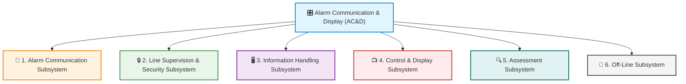

---

#### 11.5.1 Six Core Subsystems of AC&D
1. **Alarm Communication Subsystem:** The transmission channels and protocols that move sensor signals to display systems.
2. **Line Supervision and Security Subsystem:** Monitors transmission lines to ensure signal integrity and detect tampering.
3. **Information Handling Subsystem:** Automates the prioritization, sorting, logging, and routing of data.
4. **Control and Display Subsystem:** The operator's console and user interfaces that display data and receive inputs.
5. **Assessment Subsystem:** Coordinates cameras, audio feeds, and displays to support rapid threat verification.
6. **Off-Line Subsystem:** Manages history logs, database backups, system configuration, and diagnostic tools.

---

#### 11.5.2 Core Attributes of an Effective AC&D System
An AC&D system must meet rigorous standards across several dimensions:

*   **Robustness:** The ability of physical components to withstand their operating environments, particularly thermal variations and humidity in exterior placements, without component failure.
*   **Reliability:** Individual devices must have a long **Mean Time Between Failures (MTBF)**. The system must ensure verified delivery with zero loss of critical alarm data.
*   **Redundancy:** Provision of backup units or alternate pathways (such as dual-routing paths for cables entering a facility) to minimize total system downtime in the event of hardware or transmission medium failures.
*   **Timeliness (Speed):** AC&D reporting speeds should occur in **milliseconds**, representing a negligible fraction of the overall threat assessment and response force deployment times. Human operator interfaces should have no perceptible delay (under a few tenths of a second).
*   **Security:** Safeguarding the AC&D networks, databases, and wiring against adversary attacks, including restricting access to configuration software.
*   **Usability (Ergonomics):** Presenting essential sensor details without causing cognitive overload, enabling the operator to make prompt, correct assessment decisions.

---

#### 11.5.3 Alarm Communication Subsystem & Network Topologies
The communication subsystem moves alarm data from remote sensors to the central console. Depending on organizational scale, monitoring is deployed in one of three topologies:
*   **Proprietary (In-House):** Owned, operated, and responded to entirely by internal organizational resources.
*   **Central Station:** Contracted off-premises monitoring where alarm inputs are transmitted to a vendor facility. The central station operator reviews the event and follows pre-agreed response protocols.
*   **Hybrid:** A blend of proprietary on-site control during business hours and contract central station monitoring for off-hours and disaster recovery.

##### Multiplexing (TDM vs. FDM)
Rather than laying separate dedicated lines for every individual sensor, modern security networks utilize **multiplexing** to transmit multiple signals simultaneously over a single common wire pair or optical fiber.

> [!WARNING]
> Because a multiplexed trunk carries all signal lines, it represents a single point of failure. Interruption of the trunk cuts off all down-line sensors. High-security sites must utilize redundant paths (such as alternate copper trunks, backup dialers, or RF links) to prevent communication losses.

*   **Time Division Multiplexing (TDM):** Assigns a distinct, rapid, sequential time segment to each sensor channel. TDM relies on precise timing; the multiplexor and receiving demultiplexor must be synchronized exactly to prevent data overlapping and cross-talk.
*   **Frequency Division Multiplexing (FDM):** Assigns unique portions of the frequency spectrum to each channel. Multiple signals are transmitted simultaneously without overlapping.

###### FDM Channel Allocation Example:
*   **Channel 1:** Centered at **400 Hz**; applied data produces a peak deviation of **430 Hz**.
*   **Channel 2:** Centered at **560 Hz**; peak deviation is **$\pm$ 42 Hz**.
*   **Channel 3:** Centered at **730 Hz**; peak deviation is **$\pm$ 55 Hz**.
*   **Combined Medium Band:** Ranging from **370 Hz to 785 Hz**, with guard bands between channels to prevent overlapping and interference.
*   **Demodulation:** Bandpass filters at the receiving end isolate the channels, routing them to individual discriminators for recovery and display.

---

#### 11.5.4 Transmission Media Comparison

A wide array of communication channels is used to transport alarm and video data:

| Transmission Medium | Operating Principle | Technical Specifications | Security & Vulnerability Analysis |
|---|---|---|---|
| **Wire & Copper Cable** | Electrical current on shielded/unshielded DC or AC pairs. | Wire resistance varies directly with length $L$ and inversely with diameter $D$. | High vulnerability to wire cuts, grounds, and physical tampering. Must be run in underground conduits. |
| **Power Line Carrier (PLC)** | Modulates high-frequency communication signals directly onto existing 60 Hz electrical current. | Utilizes high-frequency couplers. | Challenging due to signal degradation across power transformers and electrical noise. |
| **Optical Fiber** | Modulates a light beam (using monochromatic LED or laser) through a spun glass strand. | A 565 Mbps system supports **8,064** simultaneous conversations per fiber. | **High Security:** Immune to EMI, RFI, and lightning. Signals do not radiate, making interception virtually impossible without immediate detection. |
| **Wireless Voice Radio** | Radio-frequency transceiver links between a base station and mobile units. | Operates on shared frequencies with repeaters to extend range. | Susceptible to eavesdropping and drift interference unless encrypted. |
| **Wireless Alarm Signals** | Coded RF transponders transmitting omnidirectionally to vendor base stations. | Coded alarm matches strongest base station; linked via leased landlines. | Enhanced by dual-mode transmissions (RF + digital wire) and automatic polling. |
| **Cordless Telephones** | RF base-to-handset voice transceivers. | Range: **700 to 1,000 ft (213 to 305 m)**. | **Extremely Vulnerable:** Historical bypass hook switches allowed conversion into listening bugs. Never discuss sensitive data. |
| **Cellular Telephones** | Multi-frequency cells linked to landline switching hubs. | USA: **800 / 1,900 MHz (PCS)**.<br>Intl: **900 / 1,800 MHz**. | Secure during transit but digital bitstreams can be recorded and decrypted if poorly encrypted. |
| **Microwave Transmissions** | Line-of-sight Super High Frequency (SHF) radio beams. | Frequencies: **30 GHz to 300 GHz**. | Penetrates weather, immune to man-made noise. Requires FCC licensing. Obstacles require flat passive reflectors. |
| **Laser (Coherent Light)** | Coherent monochromatic beam modulated via electro-optic crystals. | Line-of-sight range: **4 miles (6.4 km)** without repeaters. | **Extremely Secure:** Unlawful beam interception breaks the path, triggering an immediate alarm. Interrupted by heavy fog or snow. |

##### Cellular Compression Technologies
To maximize spectrum space in cellular communications, telecommunications providers use two digital transmission formats:
1. **TDMA (Time Division Multiple Access):** Divides calls into sequential, alternating time slots.
2. **CDMA (Code Division Multiple Access):** Spreads segments of calls across a wide swath of frequencies, attaching a unique code to each segment to reconstitute it. CDMA offers **10 to 20 times the capacity** of legacy analog cellular (AMPS) systems.

---

#### 11.5.5 Satellite Communications and Orbit Geometries

Satellites provide highly versatile communications across three primary orbit classes:

*   **Geostationary Earth Orbit (GEO):** Satellites orbit at a fixed position relative to the equator at a nominal altitude of **22,300 miles (36,000 km)**. While providing a vast footprint, the high altitude introduces a significant signal propagation delay (latency) that hampers delay-sensitive telemetry.
*   **Medium Earth Orbit (MEO):** Satellites orbit at **6,500 miles (10,300 km)** altitude. MEO arrays support dual-mode handheld telephones, maritime shipping networks, and aviation systems.
*   **Low Earth Orbit (LEO):** Low-altitude orbits (420 to 763 miles / 675 to 1,220 km) eliminate high-altitude signal latency, enabling fiber-like speeds for delay-sensitive applications.

##### LEO Satellite Array Designs:
*   **28 LEO Satellites (480 miles / 770 km):** Designed to provide data messaging services for industrial monitoring and two-way truck/barge transponder tracking.
*   **48 LEO Satellites (763 miles / 1,220 km):** Provides worldwide mobile and fixed telephone service.
*   **66 LEO Satellites (421 miles / 675 km):** Supports handheld dual-mode telephones, paging, and low-speed fax.
*   **840 LEO Satellites (440 miles / 700 km):** Operates at high frequencies (**30 GHz uplink and 20 GHz downlink**), utilizing small, low-power terminals and antennas to achieve fiber-like bandwidth and eliminate signal delays.

---

#### 11.5.6 Wireless Interference and Environmental Mitigations
Proper signal reception depends on the equipment's ability to isolate wanted signals from background interference and noise:
*   **Man-Made Noise:** Electrical arcing from switches, motors, ignition circuits, and high-frequency industrial precipitators.
*   **Natural Noise:** Static discharge caused by atmospheric conditions and thunderstorms.
*   *Mitigation:* **Frequency Modulation (FM)** is significantly more resilient to man-made noise than Amplitude Modulation (AM).
*   **Structural Obstructions:** Heavy steel and concrete limit signal ranges. This is mitigated through the use of distributed antenna systems (DAS) or radiating loop cables run throughout the structure.

---

#### 11.5.7 Line Security, Supervision, and Tamper Protections
The pathways linking sensors to controllers must be monitored automatically to detect opens, shorts, grounds, or deliberate bypass attempts by an adversary.

*   **Basic Line Supervision (End-of-Line Resistors):**
    An End-of-Line (EOL) resistor is installed at the *far end* of the loop (inside the sensor enclosure, not the control panel). The resistor introduces a constant, measurable current. The control panel continuously monitors this loop current:
    *   **Open Circuit (Cut Wire):** Current drops to zero, triggering a line fault or alarm.
    *   **Short Circuit (Bridged Wire):** Current jumps as resistance drops to zero, triggering an alarm.
    *   **Ground Fault:** Current leaks, altering the loop value and triggering an alarm.
    *   *Limitation:* A skilled adversary can compromise basic EOL loops if they can duplicate the resistor value without interrupting the circuit, provided no tamper switches are active.
*   **Advanced Line Security:**
    *   **Permissible Variance Restriction:** Minimizes the allowable current fluctuations window to detect tiny, subtle modifications.
    *   **Quasi-Random Pulses:** The control panel and field sensor module continuously exchange unique, mathematically randomized pulse streams. Any attempt to bridge the line with a static voltage source is instantly detected.
    *   **IP Network Encryption:** IP-based alarm communicators protect data packets with advanced cryptographic standards (e.g., AES-128 or AES-256), representing the gold standard for off-premises communications.

---

#### 11.5.8 Voice Scrambling and Cryptographic Keystreams
To protect voice radio and cellular communications from eavesdropping, scramblers modify the two primary components of voice: **frequency (pitch)** and **amplitude (loudness)**.

##### Scrambler Types:
*   **Frequency Inverters:** Invert the voice frequency spectrum (low pitch to high, and vice-versa). While low-cost and highly tolerant of poor channel conditions, they are easily decoded by trained listeners or simple duplicate devices.
*   **Band Splitters:** Divide the voice spectrum into smaller sub-bands, inverting and interchanging them. A 5-band splitter theoretically yields **3,080** scrambling combinations, but **90%** of these offer no practical security advantage over a basic inverter.
*   **Rolling Band Splitters:** Continuously change the sub-band interchange pattern according to a predetermined keystream. Very secure against trial-and-error decoding.
*   **Frequency/Phase Modulators:** Continuously shift the voice wave spectrum in frequency or phase according to a keystream. Extremely secure, but require high-quality channels to prevent voice quality degradation.
*   **Amplitude Masking:** Injects a masking signal (single tone, switched tones, or RF noise) to destroy syllabic content, which is removed at the receiver. Insecure when used alone, but provides exceptionally high security when combined with splitters or modulators.

##### Shift Register Keystream Algebra
The keystream must be predetermined to allow the receiver to decode the signal, yet pseudo-random to prevent interception. This is accomplished using an electronic shift register with linear feedback loops:

$$	ext{Keystream Pattern Length} = 2^N - 1$$
*(where $N$ is the number of stages in the shift register)*

###### The 23-Stage Shift Register Standard:
*   **Pattern Length:** $2^{23} - 1 = \mathbf{8,388,607	ext{ bits}}$.
*   **Repeat Duration:** Switched at a rate of 10 bits per second, this pattern will run for **9.7 days** before repeating.
*   **Code Configurations:** Supports **364,722** distinct maximum-length keystreams (individual connection codes).

---

#### 11.5.9 Alarm Control and Display (AC&D) Console Ergonomics
The operator's console is the human-machine interface (HMI) where alarm information is received, assessed, and acted upon.

##### Server Room Separation
To optimize console ergonomics and security, all primary computing CPUs, video switching matrixes, and transmission electronics (excluding operator displays and controls) must be located in a dedicated, secure server room.
*   **Ergonomic Benefits:** Removes high-frequency fan noise, reduces room temperature and heat dissipation, and eliminates on-floor maintenance disruptions.
*   **Security Benefits:** Hardens systems against unauthorized physical tampering.

##### Console Layout Guidelines
*   **Desk Duplication:** If a console is operated by multiple staff simultaneously, all primary tools, communication inputs (microphones, telephones), and critical displays must be duplicated at each operator position. Infrequently used secondary tools can be shared.
*   **Visual Annunciation:** Use highly recognizable colored indicators to convey status:
    *   🔴 **Red:** Alarm / immediate action required.
    *   🟡 **Yellow:** Caution / abnormal state / tamper warning.
    *   🟢 **Green:** Proceed / normal state.
*   **Audible Alerts:** Consoles should feature non-annoying audible alerts, avoiding loud, continuous, or flashing strobe displays that can cause operator panic or cognitive overload.

---

#### 11.5.10 Premium GUI Console Design System (The Operator-First Standards)
To prevent cognitive fatigue and ensure rapid assessment during high-stress crises, modern Security Operation Center (SOC) GUIs must adhere to a strict set of display and navigation constraints:

```
                  ┌──────────────────────────────┐
                  │                              │
                  │       OVERVIEW WINDOW        │
                  │        (Full Screen)         │
                  │                              │
                  └──────────────┬───────────────┘
                                 │
                 ┌───────────────┴───────────────┐
                 ▼                               ▼
       ┌──────────────────┐            ┌──────────────────┐
       │   SUBORDINATE    │            │     MENUS &      │
       │   (Max 50% Size) │            │     CONTROLS     │
       └──────────────────┘            └──────────────────┘
```

*   **Window Count Constraints (Max 3):**
    Operators must never be required to manually resize or drag windows. The display is limited to a maximum of **three windows** at once:
    1.  **Overview Window:** Full-screen window showing the overall system status map.
    2.  **Subordinate Window:** Maximum of **half-screen size**, showing detail on a selected alarm zone.
    3.  **Control/Menu Window:** Dedicated space for operational buttons and menu choices.
*   **Menu Level Constraints (9-3 Rule):**
    Deeply nested menus delay response. Menus must contain no more than **9 items** per level, and be nested no deeper than **3 levels**. Common operations should bypass menus entirely, using dedicated buttons.
*   **Button Bar Constraints (Max 9):**
    Visible button bars are limited to a maximum of **9 buttons**, labeled with clear text describing their functions. Only valid options for the current context should remain active.
*   **Interactive Maps (1:5,000 Scale):**
    Maps must be clean, stylized vector drawings at a standard **1:5,000 scale**. They must omit unnecessary architectural clutter while displaying interactive sensor icons.
*   **Sensor Icon Density (Max 50):**
    No individual map view should contain more than **50 sensor or group icons**. To manage density, multiple adjacent sensors are combined into a single group icon.
*   **Worst-Case State Display:**
    Grouped sensor icons must display the *worst-case state* of all sensors in that group (e.g., if 49 sensors are normal but 1 is in alarm, the group icon must flash red).
*   **The 7-Color Palette Limit:**
    To accommodate the **10% of the population** with color blindness, the GUI must restrict active colors to a maximum of **7 colors**. Menus, buttons, and backgrounds should use consistent neutral grays. Red, yellow, and green are strictly reserved for sensor status.
*   **Single-Action Execution:**
    Critical commands must require minimal effort—specifically, **a single mouse click** or **a single keystroke** to execute.
*   **Alarm Assessment Integrity:**
    Incoming alarms must not override or hijack the operator's active screen during an ongoing assessment. The system should provide a non-intrusive alert of new events in the background, allowing the operator to finish the current assessment without interruption.
*   **Video Assessment vs. Surveillance:**
    *   **Assessment:** Instantly associates immediate video image capture with a triggered sensor alarm, allowing the operator to verify the threat within seconds.
    *   **Surveillance:** Gathers video continuously without sensor association for post-event investigation or general monitoring.

---
### 11.6 Trends And Issues In Electronic Systems Integration

As technology advances, physical security systems are transitioning from isolated hardware endpoints into deeply integrated, data-driven software suites. A modern physical protection system (PPS) must leverage emerging trends to adapt to a complex threat landscape:

*   **📈 Big Data & Data Analytics:** The explosion of digital data—such as high-definition video, access logs, and sensor telemetry—presents massive processing challenges. Big data solutions allow security platforms to parse massive data sets, while machine-learning analytics identify anomalies and predict threat behaviors.
*   **💾 Exponential Data Storage Capacity:** Storage hardware has evolved from early magnetic tape systems to micro-drives, secure SD cards, Blu-ray media, and scalable, encrypted cloud storage arrays.
*   **🔌 Standardization & Open Interoperability:** Device manufacturers are shifting away from proprietary protocols toward universal open standards (such as ONVIF and building management system network standards). This interoperability allows diverse products to communicate seamlessly within a single unified security platform.
*   **📂 Data Aggregation & OS Compatibility:** Advanced physical security information management (PSIM) systems aggregate diverse databases into a single operator dashboard. Compatibility across multiple operating systems is critical for performance and redundancy.
*   **📱 Near Field Communication (NFC) & Smart Credentials:** NFC standards allow smartphones and mobile devices to establish secure radio communication based on existing RFID standards. Proliferation of handsets with built-in NFC hardware allows businesses to deploy dynamic, secure, and contactless digital access credentials.
*   **💳 Smart Cards & Embedded Biometrics:** Miniaturized, high-capacity storage on secure credentials (smart cards) enables the encryption of biometric templates directly onto the card. The *Smart Card Alliance Physical Access Council* (www.smartcardalliance.org) provides guidelines for implementing these trusted, multi-factor credentials.
*   **☁️ Remote Managed Services (Security as a Service - SECaaS):** Cloud-based storage and SaaS models enable third-party providers to manage access control, ID credentialing, video monitoring, virtual guard tours, unattended delivery, and remote door control. SECaaS reduces staffing overhead and serves as a vital disaster recovery backup.
*   **⚡ Product Hybridization:** Standalone hardware units are merging into multi-sensor hybrid products—for example, a single smoke detector unit that also houses a miniature video camera, microphone, and inert gas monitoring sensor.
*   **🤖 Robotics & Automation:** Robotic technologies are transitioning from repetitive industrial assembly arms to humanized security applications, including autonomous patrol robots, aerial drone surveillance, and assistive robotic systems in healthcare.
*   **🎓 Case-Specific E-Learning Tools:** Advanced training software enables organizations to create site-specific, repeatable security awareness training and system operator tutorials, lowering administrative costs and ensuring regulatory compliance.

---

## Chapter 12: Security Officers and the Human Element

---

Despite the recent explosion of security technologies, security officers remain an important and often essential component of many integrated asset protection strategies. Technology solutions will inevitably continue to evolve to meet increasingly sophisticated threats, yet even impressive technological advances are unlikely to eliminate completely the need for well-trained security officers. Today, there is an increased recognition that successful risk management strategies must take advantage of technology solutions, while strategically integrating the use of security officers for maximum effectiveness.

Once known as watchmen and later as guards, today the preferred industry term is **protection officer** or **security officer** to reflect the increased levels of responsibility, training, and professionalism now expected of these security personnel.

This chapter provides an overview of security officer operations, including:
*   Security officer utilization and growth
*   Determining the need for a security force (the "necessary human being" concept)
*   Security force models (proprietary, contract, and hybrid)
*   Basic security officer functions and roles
*   Uniforms, weapons, and equipment
*   Officer selection and background screening
*   Training processes and modern methodologies
*   Managing and leveraging the human element within security operations

---

### 12.1 Security Officer Utilization & Industry Growth

The global utilization of security officers continues to expand to meet shifting risk landscapes:
*   **Historical Benchmarks:** In the wake of September 11, 2001, security officer staffing in the United States grew by **13%**, exceeding **1 million** active personnel by 2002.
*   **Sector Ratios:** By 2008, active security personnel reached **1.1 million** in the US, with approximately **55%** employed by contract security agencies and **six out of seven** working full-time (supplemented significantly by off-duty law enforcement officers moonlighting in security roles). These ratios have remained highly consistent through the late 2010s and early 2020s.
*   **Emerging Sectors:** Demand has diversified into energy exploration fields (often requiring highly armed protective forces in remote or unstable environments), secure transport operations, and the rapidly growing global cannabis market (where cultivation centers, testing laboratories, dispensaries, and transit lines are heavily regulated to require dedicated contract security officers).
*   **Administrative & PR Expansion:** Officers are increasingly multi-tasked to support communications, customer services, front-desk reception, and public relations. By integrating advanced technology, a smaller, highly trained security force can manage complex facilities, maximizing the organizational Return on Investment (ROI).

#### Regulatory Oversight
To elevate industry standards, private security is increasingly regulated at the state, provincial, and national levels.
*   **The IASIR Standard:** The **International Association of Security and Investigative Regulators (IASIR)**, founded in **1993** with **15** regulator members, has grown to oversee **32** regulatory boards across 20 states, 7 Canadian provinces, and France, in addition to **38** non-voting associate industry memberships.
*   **Compliance Requirements:** Licensing authorities enforce strict standards governing backgrounds, background fingerprint checks, training hours, liability insurance, uniform styling, and badge designs to ensure private security is readily distinguishable from public law enforcement.

#### The Technology Shift
The basic tools of security patrols have undergone a digital revolution:
*   **Patrol Tracking:** Legacy mechanical watchclocks (such as the *Detex* watchclocks introduced in **1902**) have been entirely replaced by computerized patrol tour systems utilizing Bluetooth, GPS, and Wi-Fi beacons.
*   **Dispatch & Reporting:** Paper logs have been replaced by cloud-based reporting systems and computer-aided dispatch (CAD) software, requiring today's security officers to possess strong computer literacy and adaptability.

---

### 12.2 Determining the Need: The "Necessary Human Being" Concept

Security officers represent the most flexible, but also the most expensive, component of an integrated asset protection plan. Designing a guard post must be mathematically and operationally justified.

> [!IMPORTANT]
> **The Necessary Human Being Standard**
> A post requires physical human staffing (rather than technological automation) if it demands a combination of the following domains of human capability:
> *   **Cognitive (Knowledge):** Discriminating among complex, randomly varying events, persons, and objects based on deep and changing criteria.
> *   **Psychomotor (Physical):** Applying proportional physical force or the threat of physical force to restrain intruders, perform active pursuits, or guide emergency evacuations.
> *   **Affective (Attitudinal):** Conducting face-to-face rational dialogue to de-escalate conflicts, assist visitors, or assess a person's mental status under high stress.
> *   *Optimization Note:* If a post does not require these human-specific domains, it should be automated via **person-traps (interlocking revolving doors)**, card access, and remote video/audio links where a single operator can efficiently monitor **3 to 4 access points**.

---

### 12.3 Security Force Deployment Models

When deploying protective forces, organizations must weigh the advantages and disadvantages of three operational models:

| Security Force Model | Core Characteristics | Core Advantages | Key Disadvantages & Trade-offs |
|---|---|---|---|
| **Proprietary** (In-House) | Officers are direct employees of the protected organization. | Direct control over selection, background checks, training, and supervision; high employee loyalty, low turnover, deep site-specific knowledge. | Significantly more expensive; administrative burdens (recruitment, benefits, payroll, performance management, post-coverage) must be managed internally. |
| **Contract** (Outsourced) | Officers are employees of a specialized security services agency. | Shuts off internal administrative burden; legal review may shift certain liabilities; offers high staffing flexibility for events or scaling. | Reduced control over hiring quality; higher turnover rates; potential wage-reduction issues (lowest-bid contracts compromise service standards). |
| **Hybrid** (Combined) | Blends proprietary leadership/critical posts with contract line officers. | Balances cost-effectiveness with high-level supervisor control; retains critical site knowledge while scaling workforce flexibly. | Management complexity increases; potential friction or cultural divisions between in-house and contract staff. |

#### Contract Procurement Cautions
Organizations outsourcing security services must avoid selecting contractors solely on the lowest hourly rate. Because wages represent the largest cost component of guard services, low-bid contracts inevitably depress officer pay, resulting in high turnover, poor morale, and substandard performance.
*   **The Bid Specification Standard:** Procurement departments must draft highly detailed bid specifications that enforce mandatory minimum wage scales, benefit packages, training criteria, and performance expectations to hold contractors to the required quality level.

---

### 12.4 Basic Security Officer Functions

Security officers perform five primary operational functions on-site:

1.  **Access Control:** Verifying employee and visitor credentials, managing guest logs, screening packages, and physically intercepting unauthorized persons at perimeter gates or building lobbies.
2.  **Active Patrols:** Conducting systematic foot, vehicle, bicycle, Segway, or robotic patrols to deter adversaries and detect safety hazards (e.g., open fire doors, water leaks, failed perimeter lights). Patrol routes should be randomized to prevent adversaries from charting guard movements.
3.  **Traffic Control:** Managing the flow of pedestrians and vehicles, directing shipping dock arrivals, enforcing parking regulations, and controlling automated gate arms.
4.  **Responding to Altered Mental Status:** De-escalating conflicts involving individuals under the influence of drugs or alcohol, or those experiencing psychological crises. Officers must be trained in non-violent crisis intervention and know when to summon emergency medical services (EMS).
5.  **Escort Services:** Escorting visitors through restricted zones, safeguarding high-value assets during transport, and accompanying employees to parking lots during high-risk hours.

---

### 12.5 Security Officer Roles

Within the organization, security officers serve in four distinct professional capacities:

*   **Public Relations & Brand Ambassador:** Often the very first point of contact for guests and clients. Officers must project a highly professional, helpful, and alert image, balancing strict security enforcement with exceptional customer service.
*   **First Responder:** Serving as the immediate on-scene responder during emergencies. Officers must maintain active certifications in CPR/AED, first aid, and fire extinguisher use, and be prepared to coordinate evacuation routes, shelter-in-place protocols, and emergency vehicle arrivals.
*   **Legal Consultant & Witness:** Documenting incident reports, preserving physical evidence, and providing testimony in civil or criminal proceedings. Accurate, detailed, and objective logging is critical for legal admissibility.
*   **Physical Security Specialist:** Conducting daily operational checks of physical protection systems, including testing fire alarms, inspecting locking hardware, verifying lighting foot-candle levels, and checking CCTV camera fields of view.

---

### 12.6 Uniforms and Equipment

An officer's uniform is a crucial tool that establishes authority, deters potential adversaries, and fosters a sense of security among legitimate occupants.

```
                      ┌──────────────────────────────┐
                      │    REGULATORY COMPLIANCE     │
                      │  Pre-approval of badges and  │
                      │   patches to prevent public  │
                      │     police identification    │
                      └──────────────┬───────────────┘
                                     │
                 ┌───────────────────┴───────────────────┐
                 ▼                                       ▼
       ┌──────────────────┐                    ┌──────────────────┐
       │   ARMED FORCES   │                    │  NON-LETHAL GEAR │
       │ Psych profiling, │                    │ OC Spray, Baton, │
       │  drug checks, &  │                    │ Conducted Energy │
       │ annual fire qualification           │   Weapon (Taser) │
       └──────────────────┘                    └──────────────────┘
```

#### Uniform Regulations & Figure 12.1
To prevent confusion with public law enforcement, private security uniforms are strictly regulated by state and local statutes.
*   **Pre-Approval Requirements:** Licensing boards (such as the Arizona Department of Public Safety) mandate that all private security badges, shoulder patches, breast patches, uniform colors, and vehicle emergency lights be pre-approved before an agency license is issued.
*   **Identification Standards:** Badges and patches must clearly display the word **"Security"** and the agency name in highly visible lettering.

#### Force Equipment & Armament
*   **Armed vs. Unarmed:** Deploying armed officers significantly increases organizational liability and requires exhaustive background checks, psychological evaluations, and randomized drug screenings. Armed personnel must undergo rigorous initial training and complete **annual or semi-annual** firearm re-qualifications.
*   **Non-Lethal Tools:** Unarmed or armed officers are typically equipped with intermediate weapons to manage resistive behavior:
    *   **OC (Oleoresin Capsicum) Pepper Spray:** Chemical agent for intermediate de-escalation.
    *   **Batons (Expandable/Straight):** Impact tools requiring specialized training and certification.
    *   **Conducted Energy Weapons (Tasers):** Highly effective neuromuscular disruption tools.
    *   **Handcuffs:** Temporary physical restraint tools.

---

### 12.7 Security Officer Selection

Selecting high-quality personnel is the foundation of a reliable security operation. Organizations must establish a rigorous, multi-stage screening process:
1.  **Background Investigations:** Verification of prior employment, military records, educational credentials, and professional references.
2.  **Criminal Records Screening:** Comprehensive local, state, and national fingerprint database checks to identify prior felony convictions or disqualifying misdemeanors.
3.  **Drug Screening:** Initial pre-employment drug panels followed by randomized ongoing testing.
4.  **Psychological Profiling:** Administered for high-risk, armed, or critical infrastructure posts to evaluate stability, judgment, and stress tolerance.
5.  **Physical Fitness Evaluations:** Ensuring candidates possess the physical stamina, psychomotor speed, and mobility required to perform active patrols and emergency evacuations.

---

### 12.8 Security Officer Training Process

A highly structured training program mitigates liability, reduces employee turnover, and ensures consistent emergency response.

| Training Phase | Primary Objectives | Delivery Methodologies | Key Metrics & Standards |
|---|---|---|---|
| **Classroom / Basic Training** | Establish core knowledge of legal limits, use-of-force continuums, safety codes, and report writing. | Lectures, digital slideshows, and written examinations. | Minimum passing score (typically **80%**) on comprehensive exams. |
| **On-the-Job Training (OJT)** | Master post-specific routines, local emergency controls, and site layout under direct supervision. | Pairing with a certified Field Training Officer (FTO). | Completed post-instruction sign-offs for all core duties. |
| **Scenario & Simulation** | Develop psychomotor muscle memory and de-escalation skills during high-stress crises. | Live role-play, mock scenarios, and virtual interactive simulations. | Performance evaluations against standardized response checklists. |
| **Case-Specific E-Learning** | Ensure cost-effective, repeatable, and easily tracked regulatory compliance updates. | Self-paced online modules and system software tutorials. | Automated tracking logs and online certificate completions. |

#### Overcoming Training Obstacles
Security managers often face challenges in implementing comprehensive training:
*   **Operational Post Coverage:** Pulled officers leave posts open, creating overtime costs. This is resolved by scheduling training during off-peak shifts or using hybrid e-learning formats.
*   **Management Buy-In:** Overcoming the perception of training as a pure cost center by documenting reduced liability insurance rates, lower worker compensation claims, and higher employee retention.

---

### 12.9 Managing the Security Force

Effective guard force management relies on structured communication, clear operational directives, and data-driven oversight:

#### Directive Frameworks: Orders
*   **General Orders:** Permanent, baseline operating rules applicable to all security officers at all times across the entire organization.
*   **Post Orders:** Detailed, step-by-step instructions customized for a specific post (e.g., Lobby Desk, Loading Dock, Patrol Vehicle). Post orders specify access rules, lighting controls, key logs, and emergency contact numbers.
*   **Special Orders:** Temporary instructions issued for a specific time-limited event, VIP visit, or short-term threat increase.

#### Data-Driven Guard Force Management
Security managers must leverage digital patrol and CAD logs to evaluate guard performance:
*   **Overtime Burn Rates:** Tracking overtime hours to prevent officer fatigue (which causes delayed response and poor judgment).
*   **Turnover Costs:** Calculating recruitment and onboarding costs to justify employee retention investments.
*   **Response Time Metrics:** Monitoring average elapsed time between sensor activation and officer arrival on-scene.
*   **Patrol Coverage Gaps:** Using automated tour metrics to ensure all high-risk areas are visited within designated intervals.

---

### 12.10 Leveraging the Human Element: Community-Wide Security

A truly comprehensive physical security strategy recognizes that asset protection extends far beyond the professional guard force:

*   **Non-Security Staff Awareness:** HR managers, facilities personnel, and general employees represent the "eyes and ears" of the organization. Routine security awareness training must be integrated into new-hire orientations and department meetings.
*   **Free Educational Resources:** Organizations should leverage free, high-quality public training programs, including the **Nationwide SAR (Suspicious Activity Reporting) Initiative** and courses offered by the **DHS** and **FEMA Independent Study Program (ISP)**.
*   **Business Watch Programs:** Modeled on Neighborhood Watch, these collaborative programs link local businesses with dedicated police crime prevention officers to share intelligence and mitigate local crime risks.

#### Prince William County (Virginia) Certified Crime Prevention Business
A prime model of public-private security collaboration, the Prince William County Crime Prevention Unit awards formal certification to businesses that meet four rigorous pillars:
1.  **Written Crime Prevention Policies:** Standardized procedures addressing internal theft, physical assets, and emergency evacuations.
2.  **Employee Training:** Documented security awareness and crime prevention training delivered to all staff.
3.  **On-Site Security Assessment:** Completion of a formal, CPTED-based physical security survey of the facility.
4.  **Dedicated Liaison POC:** Appointing a designated employee to act as the primary liaison with local law enforcement.

---

---

## Chapter 13: Principles of Project Management

Project management involves planning, organizing, and controlling resources to achieve specific goals and objectives. Unlike ongoing operations, a project is a **temporary endeavor** with a defined beginning and end. 

Security projects can either be standalone initiatives (e.g., upgrading a facility's visitor management system) or security-related components of a larger enterprise project (e.g., managing the physical protection system design and CPTED parameters for a new corporate campus).

> [!NOTE]
> Standalone projects focus entirely on the security mission, whereas integrated enterprise projects require coordination between capital budgets, construction managers, architects, and facilities operations.

### 13.1 Security Project Goals and Objectives
Security projects aim to integrate architectural, technological, and operational subsystems to protect organization assets. Core objectives typically include:
*   **Asset Accessibility Control:** Assuring only authorized personnel access public, controlled, or restricted zones.
*   **Reliable Intrusion Detection:** Alerting responders instantly to any unauthorized entry attempts.
*   **Incident Response Optimization:** Developing cohesive protocols for automated or human-led response.
*   **Forensic Evidence Gathering:** Ensuring high-quality video and data logs are compiled for administrative or legal actions.
*   **Metrics-Driven Security:** Utilizing security metrics (e.g., throughput, alarm rates) to continually optimize operational posture.

All security projects operate within a tightly coupled system of **four core constraints**:
```
        [Project Scope]
              / \
             /   \
  [Schedule] ----- [Budget]
              \ /
               \
            [Quality]
```
If a project is poorly conceived or managed, failure to balance these constraints will lead to delays, cost overruns, or vulnerable installations.

---

### 13.2 The Nine PMI Knowledge Areas
The Project Management Institute (PMI) defines nine key knowledge areas within the Project Management Body of Knowledge (PMBOK Guide, 2017) that security project managers must master:

| Knowledge Area | Core Components & Applications |
| :--- | :--- |
| **1. Project Integration** | Plan development, project plan execution, and integrated change control. |
| **2. Project Scope** | Scope planning, scope definition, Work Breakdown Structure (WBS), and scope validation. |
| **3. Project Time** | Activity definition, activity sequencing, duration estimating, and schedule control. |
| **4. Project Cost** | Resource planning, cost estimating, budgeting, and cost control. |
| **5. Project Quality** | Quality planning (standards definition), quality assurance, and quality control (testing). |
| **6. Project Human Resources** | Staff acquisition, roles/responsibilities mapping, and team development. |
| **7. Project Communications** | Communications planning, performance reporting, and administrative closure. |
| **8. Project Risk** | Risk management planning, threat identification, qualitative/quantitative risk analysis, and risk response. |
| **9. Project Procurement** | Procurement planning, solicitation, vendor evaluation, and contract administration. |

---

### 13.3 Project Manager Roles and Tools
The security project manager (PM) may fulfill several distinct roles depending on the organization's structure:
*   **Creator:** Conceptualizing the initial security design and business case to secure executive-level funding.
*   **Decision Maker:** Influencing and controlling project scope, schedules, and capital resource allocations.
*   **Funding Controller:** Directing or managing the approved security project budget.
*   **Project Influencer:** Serving as a technical advisor (e.g., security director or consultant) to shape the scope.
*   **Project Stakeholder:** Managing security interests when another department controls the master project scope.
*   **Project Contractor:** Delivering the specified hardware, programming, and cabling within a set schedule.

#### Essential PM Tools
1.  **Professional Training:** Project management is a learned discipline; professional credentials such as the Project Management Professional (PMP) are highly recommended.
2.  **Scheduling & Management Software:** Tools to map dependencies, construct Gantt charts, and track critical paths.
3.  **Determination:** The professional willpower to control scope creep and defend the integrity of the security design.

---

## Chapter 14: Systems Design

System design is a highly structured, serial process. Each phase must be completed in sequence, as the output of one task directly serves as the input for the next. 

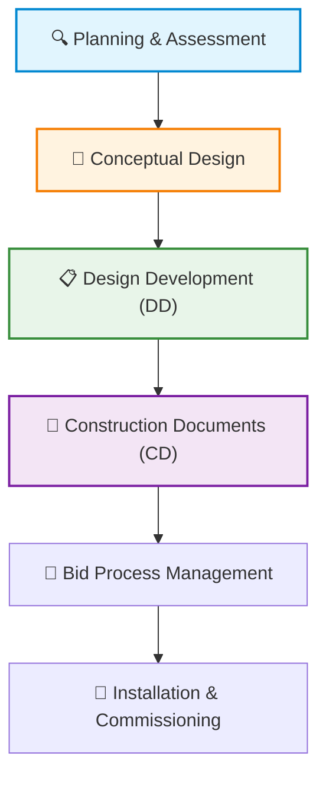

### 14.1 System Design Principles
Security systems are designed using the principle of **Defense-in-Depth (Concentric Rings of Security)**. The goal is to build sequential delays and detection thresholds into the path of an adversary, giving responders adequate time to mitigate the threat.

```mermaid
graph TC
    subgraph Rings ["🛡️ Concentric Rings of Security"]
        A["Ring 1: Outer Perimeter (Fencing, Lighting, PIDS)"] --> B["Ring 2: Inner Perimeter (Building Envelope, Portals)"]
        B --> C["Ring 3: Interior Spaces (Lobbies, Corridors)"]
        C --> D["Ring 4: Critical Assets (Server Rooms, Vaults)"]
    end
    style Rings fill:#f9f9f9,stroke:#ccc,stroke-width:1px
    style A fill:#ffebee,stroke:#c62828,stroke-width:2px
    style B fill:#fff3e0,stroke:#ef6c00,stroke-width:2px
    style C fill:#e8f5e9,stroke:#2e7d32,stroke-width:2px
    style D fill:#e3f2fd,stroke:#1565c0,stroke-width:2px
```

#### Proactive vs. Reactive Design
Design requirements are derived from a rigorous **security risk assessment** that identifies critical assets, analyzes potential threats, and highlights vulnerabilities. By establishing performance-based design criteria before a security event occurs, the system acts proactively to prevent, delay, or mitigate the consequences of an attack.

> [!IMPORTANT]
> A physical protection system (PPS) should be designed around **detect and delay** objectives rather than absolute "prevention." Absolute prevention (100% confidence) is functionally impossible or financially prohibitive. The focus must be on managing and modifying the consequences of unauthorized access.

---

### 14.2 Design Phases and Deliverables

#### 1. Planning and Assessment (Requirements Analysis)
Establishes the design basis by defining what assets require protection and the operational objectives of the security program. A level-of-confidence factor (e.g., probability of detection, delay times) is assigned to each functional requirement.

```plaintext
Figure 14.2. Sample Requirements Analysis Matrix
+------------------+-----------------------------+------------------------------------+-----------------------+
| Asset            | Threat/Vulnerability        | Functional Security Requirement    | Protection Strategy   |
+------------------+-----------------------------+------------------------------------+-----------------------+
| Executive Area   | Unauthorized entry / Theft  | Access control demarcation at first| Biometric/Card Access,|
| (First Floor)    | of sensitive assets         | floor elevator lobby.              | Recessed door contacts|
+------------------+-----------------------------+------------------------------------+-----------------------+
| Day Care Center  | Child wandering / Strangers | High-confidence entry restriction  | Video assessment,     |
| (First Floor)    | gaining entry               | and visitor vetting at access gates| Two-way audio system  |
+------------------+-----------------------------+------------------------------------+-----------------------+
```

#### 2. Conceptual (Schematic) Design
Translates the requirements analysis into a top-level narrative description of the proposed subsystems (Access Control, Video Surveillance, Intrusion Detection), accompanied by an initial budgetary estimate (typically $\pm 20\%$ contingency).

#### 3. Design Development (DD) Phase
Translates schematic concepts into preliminary design drawings (30% to 50% completion). DELIVERABLES include:
*   Floor plans mapping device symbols and preliminary physical placements.
*   Outline specifications detailing proposed equipment types.
*   Initial schedules (wire, power, heat load metrics).
*   Refined project budgets based on preliminary device counts.

#### 4. Construction Documents (CD) Phase
Produces the final, detailed package (60% to 100% completion) required for competitive bidding and construction. DELIVERABLES include:
*   **CD Drawings:** Exact device locations, conduit pathways, power junctions, and mounting details.
*   **Schedules:** Comprehensive door, camera, and termination schedules.
*   **Riser Diagrams:** Schematic representations of complete systems detailing how field devices connect back to main control cabinets.
*   **Specifications:** Precise, written requirements of materials, quality, and installation standards.

##### Standard CSI Specification Format
Standard construction specifications follow the **Construction Specifications Institute (CSI)** format, dividing each section into three parts:
1.  **Part 1: General:** Project description, references, standard codes, submittal requirements, quality assurance, and warranty rules.
2.  **Part 2: Products:** Acceptable equipment manufacturers, model specifications, physical capacities, and material standards.
3.  **Part 3: Execution:** Pre-installation checks, mounting and installation procedures, wiring, testing, and commissioning rules.

> [!TIP]
> Within the CSI MasterFormat standards, **Electronic Safety and Security** is designated under **Division 28**. For highly integrated systems, designers often consolidate all subsystems into a single, customized Division 28 section to ensure compatibility.

---

### 14.3 Visual Design Schematics

#### Security Door Elevation
Figure 14.6 details the standard layout of an access-controlled security door. Field wiring must run through conduit from the card reader, door contact, request-to-exit (REX) sensor, and locking strike to a local system junction box (SJB) and then to the central Process Control Panel.

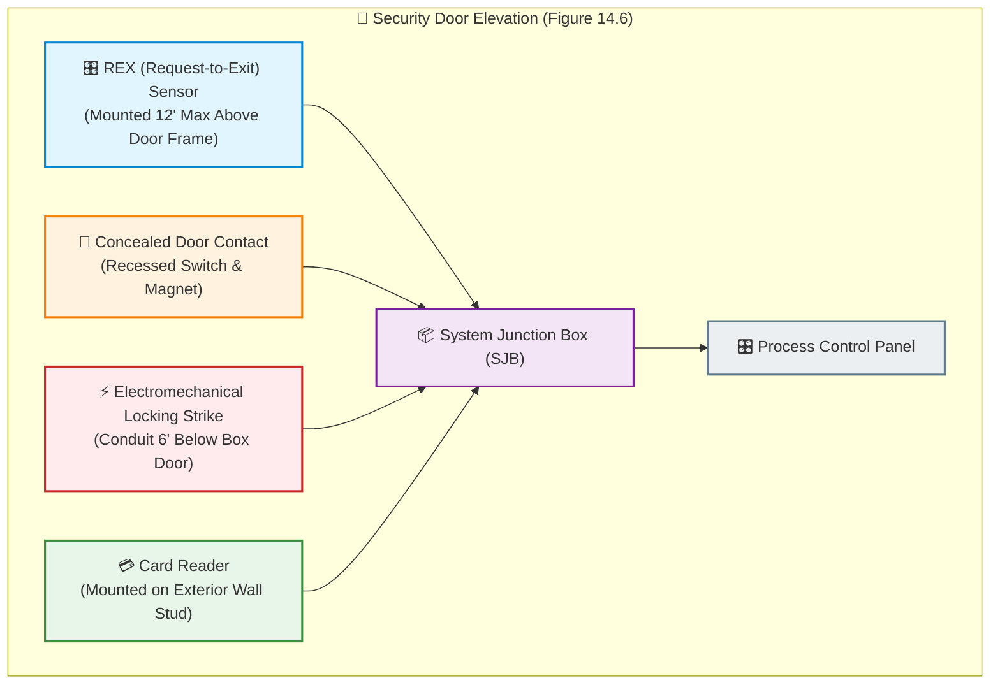

#### System Riser Diagram
Figure 14.7 illustrates a sample system riser diagram showing how security devices across multiple floors are integrated.

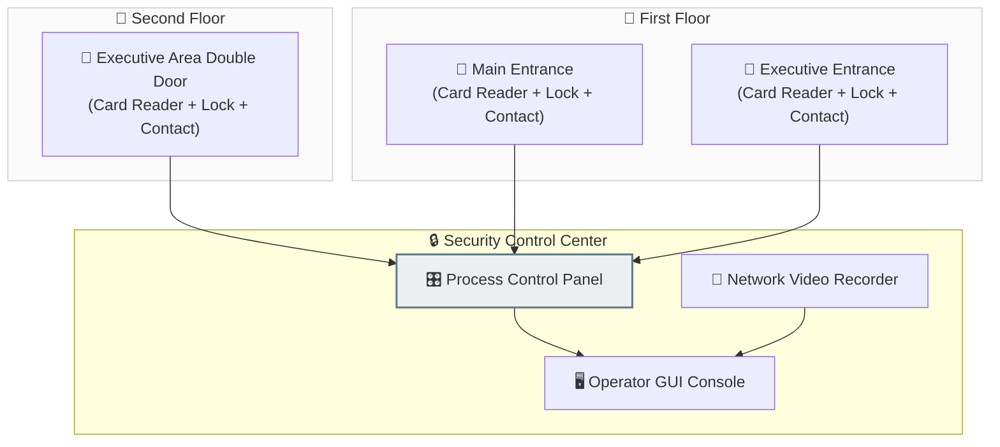

---

### 14.4 Bidding and Procurement Management
Security procurement is generally structured in one of three primary formats:

| Bidding Format | Advantages | Disadvantages |
| :--- | :--- | :--- |
| **Sole Source** | Simple drawings, extremely fast design phase, trusted single vendor. | Vested vendor interest, no cost comparison, high probability of scope creep. |
| **Request for Proposal (RFP)** | Generic performance-based, focuses on procuring a business partner, allows vendor-proposed alternates. | Lengthy preparation time (3-4 weeks minimum), complex multi-stage evaluation. |
| **Invitation for Bid (IFB)** | Highly competitive, award goes strictly to the lowest qualified bidder. | Requires extremely detailed, foolproof construction drawings to prevent loopholes. |

#### Life-Cycle Cost (LCC) Analysis
When evaluating vendor bids, project managers should look beyond the initial capital expenditure and calculate the **Life-Cycle Cost** of the system:

$$\text{LCC} = \text{Capital Cost} + \text{Maintenance Cost over useful life}$$

> [!IMPORTANT]
> As a industry standard rule of thumb, annual system maintenance and warranty costs typically average **11% of the total capital systems construction cost**. Budgets must account for this recurring cost to avoid deferred maintenance failures.

---

### 14.5 System Integration and Legacy Migration

#### Technical Network Requirements
1.  **Bandwidth Allocations:** Video surveillance demands significant network bandwidth. To prevent packet loss and latency, network design must ensure that no more than **45% of available bandwidth** is utilized on any single port, network switch, or ethernet segment.
2.  **Network Segmentation:** Security data must be completely segmented from standard enterprise business data. The preferred methods include virtual local area networks (VLANs), virtual private networks (VPNs), and multicast video transmission protocols.
3.  **Data Security:** All security data, databases, and logs must be encrypted both in transit (using robust secure transport protocols) and at rest (using advanced disk-encryption algorithms and complex keys).

---

## Chapter 15: Installation and Implementation

Project implementation begins immediately after a contractor is selected. It consists of site preparation, scheduling, testing, and training.

### 15.1 Site Preparation and Coordination
Before installing any hardware, the contractor and the project manager must conduct a detailed site walk-through to verify that site conditions match the construction documents. 

#### Critical System Interfaces
Physical security systems must interface with several crucial building systems, requiring active coordination:
*   **Elevators:** In-cab card readers, cameras, and elevator controller shunts.
*   **Doors and Hardware:** Architectural lock fitting and factory-prepped frames.
*   **Fire/Life Safety Systems:** Supervised relays to cut power to fail-safe locks on fire alarm activation.
*   **HVAC Systems:** High-temperature/humidity panel environments (avoid placing panels in spaces like boiler rooms without specialized, rated enclosures).
*   **Directory Services:** Direct software integration with human resource databases, Active Directory, or LDAP for automated user credential provisioning.

---

### 15.2 System Commissioning and Testing
A rigorous commissioning process is critical to the longevity of the PPS. Testing is divided into four distinct phases:

```
[Factory Testing] ──> [Site Testing] ──> [Reliability Phase] ──> [Warranty Period]
```

#### 1. Predelivery or Factory Acceptance Testing (FAT)
For complex systems, the contractor must assemble a mockup of the complete system in a laboratory environment to prove software and hardware compatibility before shipping to the site. A typical FAT testing lab setup must include:
*   All security control center monitoring equipment and switchers.
*   At least one of each data transmission link type.
*   A number of field panels equal to the total required by the site
    design.
*   At least one sensor of each type, with sensor simulators to represent the full alarm zone count.
*   At least **four video cameras** of each specified lens type, three monitors, and the NVR.

#### 2. Site Acceptance Testing (SAT)
Once the system is installed, the contractor certifies in writing that the complete system has been calibrated and is ready for SAT. The commissioning team must execute a 100% point-by-point test:
*   **Camera Calibration:** Verify that cameras facing the rising or setting sun are aimed below the horizon to prevent direct viewing.
*   **Blooming Assessment:** Ensure headlights of vehicles near assessment zones do not cause video blooming (loss of detail due to excessive bright spots).
*   **Tamper Supervision:** Verify that all enclosure, panel, and junction box tamper switches send an alarm on unauthorized opening.

#### 3. Reliability and Availability Testing
Conducted 24/7 in two consecutive phases of **15 calendar days each**:
*   **Phase I:** The system operates continuously. The contractor makes no repairs unless authorized. Any failure restarts the 15-day trial period.
*   **Phase II:** The system operates continuously for another 15 consecutive days to verify stability under normal load.

> [!WARNING]
> Acceptance testing should never be shortened. The security manager must enforce a strict **30-day monitoring trial period** under actual facility operations before final project sign-off.

---

### 15.3 Categories of Security Testing
Ongoing testing maintains system integrity over its lifecycle:

| Test Category | Description & Frequency |
| :--- | :--- |
| **Operational Tests** | Simple tests to prove correct operation (e.g., opening a door to trigger an alarm). Conducted monthly/quarterly by staff. |
| **Performance Tests** | Quantitative checks using calibrated instruments to verify parameters like probability of detection ($P_d$). |
| **Post-Maintenance** | Operational checks performed immediately following remedial or preventive maintenance. |
| **Subsystem Tests** | Large-scale tests to ensure linked technologies (e.g., alarm call-ups triggering video preset movements) work together. |
| **Evaluation Tests** | Comprehensive, independent annual audits to validate the vulnerability analysis and ensure overall system effectiveness. |

---

### 15.4 Operator and Technical Training
A security system is only as effective as the personnel operating it. The installation contractor must provide comprehensive, manufacturer-certified training courses:
*   **Training Schedule:** Training must be conducted and completed **at least 30 days before** the start of site acceptance testing.
*   **Documentation:** Trainees must receive comprehensive manuals, including lesson agendas, system architectures, and step-by-step administration guides.

---

## Chapter 16: System Maintenance and Lifecycle Evaluation

Deferred maintenance is the primary cause of security system failure. Systems require a proactive, structured maintenance program.

### 16.1 Maintenance Models and Administration
Security maintenance falls into two distinct categories:

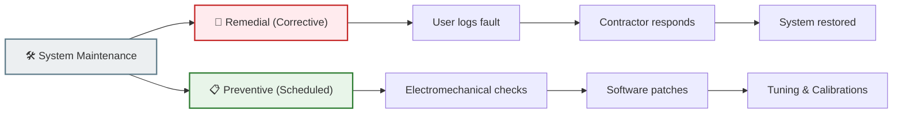

*   **Remedial Maintenance:** Corrects faults and returns the system to operation after a hardware or software component failure.
*   **Preventive Maintenance:** Scheduled checks to keep equipment and software up to current specifications.

> [!TIP]
> To prevent finger-pointing and coordination delays across complex network environments, organizations should contract with a **single systems integrator** as the prime contractor. This integrator serves as the single point of contact and manages all third-party hardware and software suppliers.

#### Records and Spares Administration
*   **Maintenance Logs:** A continuous, chronological log must be maintained for all devices. Complete logs should be kept on-site, documenting dates, technicians, faults, calibrations, and torque details.
*   **Spare Parts Inventory:** To minimize downtime, organizations should allocate **5% of the total system capital cost annually** to procure and maintain a local spare parts inventory based on vendor recommendations.

---

### 16.2 Preventive Maintenance Checklist
Technicians should utilize a structured checklist during scheduled preventive maintenance visits:

1.  **Cabinet Inspections:** Check all panels for damage, corrosion, or unauthorized openings.
2.  **Warning Signage:** Verify that high-voltage warning stickers are in place on all power supply cabinets.
3.  **Air Passages:** Inspect and clear all panel air intake filters and fans of dust and debris.
4.  **Odor & Thermal Check:** Scan boards for signs of electrical overheating or unusual odors.
5.  **Locking Devices:** Inspect and lubricate all door locks, strikes, hinges, and alignment plates.
6.  **Acoustic Scan:** Listen for unusual fan, generator, or transformer noises.
7.  **Mounting Hardware:** Ensure all bracketry, camera housings, and enclosures are firmly mounted.
8.  **Loose Wiring:** Inspect all terminals for loose wires and tighten terminations where needed.
9.  **Corrosion Check:** Clean all battery terminals and electrical connections of oxidation.
10. **Insulation Check:** Verify that cable insulation shows no degradation or discoloration.
11. **Grounding:** Test ground conductors and shield connections to prevent video noise or ground loops.
12. **Torque Checks:** Torque all high-power electrical connections to the manufacturer's specified value.
13. **Operational Tests:** Periodic, point-by-point functional activation of all motion, glass-break, and door sensors.
14. **Camera Lens Cleaning:** Clean camera domes, lenses, and optical sensors with approved solutions.
15. **Backup Power Testing:** Perform load testing on batteries and verify that auxiliary generator switchovers are automatic and immediate.

---

### 16.3 System Lifecycle Replacement and Evaluation
A security system eventually reaches the end of its useful life due to unreliability, obsolescence, lack of spare parts, or excessive maintenance costs.

When planning a replacement, the security manager should form a multidisciplinary stakeholder team including **IT, HR, and Facilities**:
*   **Expansion Potential:** Select a platform with at least 15% to 20% expansion capacity to accommodate future sites, cards, and cameras.
*   **Database Integration:** Ensure the security software supports a seamless, real-time database interface with the company's employee HR directory software.
*   **Future-Proofing:** Evaluate advanced technologies (e.g., ONVIF profile standards, SECaaS cloud compatibility, mobile credentials) to ensure a high-performing system for the next 7 to 10 years.
## Appendix A: Key Terms and Definitions

This appendix offers definitions of important terms as they are used in this book and, in general, within the professional security community.

*   **Access Control:** The control of persons, vehicles, and materials through the implementation of security measures for a protected area.
*   **Alarm System:** Combination of sensors, controls, and annunciators (devices that announce an alarm via sound, light, or other means) arranged to detect and report an intrusion or other emergency.
*   **Asset:** Anything tangible or intangible with value to a person or organization, such as people, property, and information.
*   **Barrier:** A natural or man-made obstacle to the movement or direction of persons, animals, vehicles, or materials.
*   **Bollards:** A vehicle barrier generally consisting of a cylinder (usually made of steel and filled with concrete) placed on end in a deep concrete footing in the ground to prevent vehicles from passing, but allowing the entrance of pedestrians and bicycles. Bollards can be specified with ornamental trim or with cast sleeves of aluminum, iron, or bronze that slip over the crash tube.
*   **Building Envelope:** The separation between the interior and the exterior environments of a building. It serves as the outer shell to protect the indoor environment as well as to facilitate its climate control. Building envelope design is a specialized area of architectural and engineering practice that draws from all areas of building science and indoor climate control.
*   **Camera:** A device for capturing visual images, whether still or moving. In security, part of a video surveillance system.
*   **CCT Rating:** Corrected Color Temperature (CCT) is a measure of the warmth or coolness of a light. It is measured in degrees Kelvin, where the color temperature of sunlight is 5,000 degrees K, and temperatures above that number are increasingly warm, or yellowish, and temperatures below that number are cooler, or bluish.
*   **Closed-Circuit Television (CCTV):** See *Video Surveillance*.
*   **Contract Security Service:** A business that provides security services, typically the services of security officers, to another entity for compensation.
*   **Crime:** An act or omission which is in violation of a law forbidding or commanding it, for which penalties or punishment may be assessed.
*   **Crime Prevention Through Environmental Design (CPTED):** Pronounced "sep-ted", this is an approach to reducing the incidence and fear of crime (and enhancing security) through the proper design and effective use of the built environment. CPTED uses organizational, mechanical, and natural methods to control access, enhance natural surveillance, and foster territoriality, while supporting legitimate activity.
*   **Defense-in-Depth (Layered Security):** The strategy of forming layers of protection for an asset.
*   **Denial:** Frustration of an adversary's attempt to engage in behavior that would constitute a security incident.
*   **Design Basis Threat (DBT):** The threat against which an asset must be protected and upon which the protective system's design is based. It is the baseline type and size of threat that buildings or other structures are designed to withstand. The DBT includes the tactics that aggressors will use against the asset and the tools, weapons, and explosives employed in these tactics.
*   **Detection:** The act of discovering an attempt (successful or unsuccessful) to breach a secured perimeter (physical or logical). Examples of breaching a physical perimeter may include scaling a fence, opening a locked window, or entering an area without authorization.
*   **Duress Alarm:** A device that enables a person under duress to call for help without arousing suspicion.
*   **Event:** A noteworthy happening; typically, a security incident, alarm, medical emergency, or similar occurrence.
*   **Facility:** One or more buildings or structures and parking areas that are related by function and location and that form an operating entity.
*   **Intrusion Detection System (IDS):** A system that uses a sensor (or multiple sensors) to detect an impending or actual security breach (physical or logical) and to initiate an alarm, notification, or response to the event.
*   **Lamp:** A manufactured light source that includes a filament or an arc tube, its glass casing, and its electrical connectors.
*   **Light Level (Illuminance):** The concentration of light over a particular area, usually measured in lux (lumens per square meter) or foot-candles (lumens per square foot).
*   **Lighting:** Degree of illumination; also, equipment, used indoors and outdoors, for increasing illumination (usually measured in lux or foot-candles).
*   **Lock:** A piece of equipment used to prevent undesired opening, typically of an aperture (gate, window, building door, vault door, etc.), while still allowing opening by authorized users.
*   **Luminaire (Fixture):** The complete lighting unit consisting of the lamp, its holder, and the reflectors and diffusers used to distribute and focus the light.
*   **Metrics:** Measures that are based on a reference, that use at least two points (e.g., quantity over time), and that facilitate insight into performance, operations, or quality.
*   **Perimeter Protection:** Safeguarding of a boundary or limit (physical or logical).
*   **Physical Security:** That part of security concerned with physical measures designed to safeguard, ensure the protection of, or prevent unauthorized access to assets under protection. Assets may include facilities, equipment, people, intangible assets, data, and other properties.
*   **Physical Security Information Management (PSIM):** A software platform that integrates multiple unconnected security applications and devices (video, access control, sensors, analytics, networks, building systems, etc.) and controls them through a comprehensive user interface. The platform collects and correlates events from existing disparate security devices and information systems to allow personnel to identify and proactively resolve situations.
*   **Physical Security Measure:** A device, system, or practice of a tangible nature designed to protect people and prevent damage to, loss of, or unauthorized access to assets.
*   **Policy:** A general statement of a principle according to which an organization performs business functions.
*   **Private Security:** The nongovernmental, private-sector practice of protecting people, property, and information; conducting investigations; and otherwise safeguarding an organization's assets. These functions may be performed for an organization by an internal department (usually called proprietary security) or by an external, outsourced provider (usually called contract security).
*   **Private Security Officer:** An individual, in uniform or plain clothes, employed by an organization to protect assets. In the past, such an individual was often referred to as a guard.
*   **Procedure:** Detailed implementation instructions for carrying out policies (security, organizational, or other) or a business practice related to a specific function.
*   **Progressive Collapse:** Occurs when the failure of a primary structural element results in the failure of adjoining structural elements, which in turn causes further structural failure. The resulting damage progresses to other parts of the structure, resulting in a partial or total collapse of the building.
*   **Proprietary Security Organization:** Typically, a department within a company that provides security services for that company.
*   **Risk:** The likelihood or potential that a given threat will exploit vulnerabilities to cause loss or damage to an asset.
*   **Risk Assessment:** A systematic process whereby assets are identified and valuated, credible threats to those assets are enumerated, applicable vulnerabilities are documented, potential impacts or consequences of a loss event are described, and a qualitative or quantitative analysis of resulting risks is produced. Risks are generally reported in order of priority or severity and attached to some description of a level of risk.
*   **Risk Management:** A business discipline that implements a process for identifying, analyzing, and communicating risk and accepting, avoiding, transferring, or controlling it to an acceptable level, considering associated costs and benefits of any actions taken.
*   **Risk Profile:** A description or depiction of risks to an asset, system, geographic area, or other entity, considering situational and influencing factors.
*   **Security Incident:** An unwanted occurrence or action likely to affect assets.
*   **Security Measure:** A practice or device designed to protect people and prevent damage to, loss of, or unauthorized access to equipment, facilities, material, and information.
*   **Security Officer:** An individual, in uniform or plain clothes, employed to protect assets.
*   **Security Survey (Physical Security Assessment):** A critical, on-site examination of a building or facility to ascertain the present security status, identify deficiencies or excesses, determine the protection needed, and make recommendations to improve the overall security of the operation. This is accomplished by collecting data in interviews, observation, and document review.
*   **Sensor:** An electronic device used to measure a physical quantity such as temperature, pressure, or loudness and convert it into an electronic signal of some kind.
*   **Site Hardening:** Implementation of enhancement measures to make a site more difficult to penetrate.
*   **Standoff Distance (Setback):** The distance between the asset and the threat, typically regarding an explosive threat.
*   **Surveillance:** Observation of a location, activity, or person.
*   **Tailgating (Piggybacking):** To follow closely (an individual or vehicle). In access control, an attempt by one individual to enter a controlled area by immediately following another individual (who has authorized access).
*   **Threat:** Any entity or action that can result in a loss event, adverse impact, or other harm to an asset or organization. The term includes both threat actors (e.g., a terrorist) and threat vectors.
*   **Threat Vector:** Any path by which a threat action can be carried out. The term includes a physical path or route, a sequence of events, or a logical path (via cyber infrastructure).
*   **Throughput:** The average rate of flow of people, vehicles, objects, or data through an access point, system, or process.
*   **Token:** An electronically encoded device (such as a smart card, key fob, USB device, etc.) that contains information used to authenticate a user's personal identity. Hardware or security tokens are used for access control for physical facilities or IT devices.
*   **Uninterruptible Power Supply (UPS):** A system that provides continuous power to an alternating current (AC) line within prescribed tolerances and protects against overvoltage conditions, loss of primary power, and intermittent brownouts. Often used with an emergency generator.
*   **Vault:** A specially constructed room or area intended to limit access and provide protection (from threats such as forced entry or fire) to the assets in the space.
*   **Video Analytics:** The computerized processing and analysis of video streams from surveillance systems to perform automated tasks, such as immediately detecting events, recognizing certain activities, searching for items (such as faces, license plates, or objects), or extracting data from prerecorded video.
*   **Video Management System (VMS):** A set of software tools that manage various functions as part of a video surveillance system, such as network storage, transmission, camera control, alerts, and internet protocol interface.
*   **Video Surveillance:** A surveillance system in which visual images are captured and transmitted, typically to monitors, recorders, and control equipment. Video surveillance includes closed-circuit television (CCTV) and network-based video systems.
*   **Vulnerability:** A weakness, condition, or organizational practice that may facilitate or allow a threat (intentional, natural, or inadvertent) to be implemented (cause harm) or increase the magnitude of a loss event.

---

## Appendix B: Physical Security and Life Safety Considerations in High-Rise Buildings

This appendix provides crucial details on the unique operational considerations and engineering parameters governing high-rise structures, specifically detailing the correlation and frequent conflicts between physical security countermeasures and life safety codes.

### B.1 The High-Rise Physical Environment
A high-rise structure is defined as a building that extends higher than the maximum reach of standard, available ground-based fire-fighting equipment. 

*   **Height Threshold:** Generally established by fire codes as a height between **75 feet (23 meters) and 100 feet (30 meters)**, or approximately **7 to 10 stories** (depending on slab-to-slab distances).
*   **Fire-Fighting Constraint:** Because fire-fighting equipment cannot reach upper floors from the exterior, fires in these facilities must be fought by emergency responders from *inside* the structure.
*   **Evacuation Challenge:** Immediate, simultaneous evacuation of the entire occupant population is impossible due to the limited capacity of fire stairwells and the strict code rule that passenger elevators must not be used during fires.

```
       [High-Rise Operational Risks]
                     |
    +----------------+----------------+
    |                                 |
[Evacuation Limits]           [Accessibility Exposure]
* Limited stairwell capacity  * Urban direct street entrances
* Elevator lockout protocols  * Mixed-use tenant footprints
* Delayed egress rules        * Shared HVAC fresh air intakes
```

---

### B.2 Life Safety and Fire Protection Systems

> [!WARNING]
> Building and life safety codes (e.g., NFPA 101) mandate that all building occupants be permitted unimpeded egress during emergency situations. This requirement frequently conflicts with physical security objectives designed to restrict access and control asset boundaries. Special coordination and system overrides must be designed into all electronic locking hardware to resolve this dilemma.

#### B.2.1 Fire Detection and Suppression Subsystems
An integrated high-rise fire protection system consists of several vital subsystems:

1.  **Smoke Detection:** Active sensors placed in return air ducts, corridors, elevator lobbies, and electrical closets. 
2.  **Heat Detection:** Deploying rate-of-rise or fixed-temperature sensors in areas where smoke detection is prone to nuisance alarms (e.g., boiler rooms, kitchens).
3.  **Sprinkler & Standpipe Flow Alarms:** Detecting when water flow initiates in the wet-pipe sprinkler grid, indicating fire suppression is active.
4.  **Smoke Control Systems:** Automatic HVAC fan shunts and damper releases designed to maintain positive air pressure in stairwells and elevator shafts, keeping egress routes clear of toxic smoke.

#### B.2.2 Notification and Response Protocols
*   **Occupant Notification:** Standard fire alarm sirens, strobe lights, and pre-recorded, multi-lingual emergency voice announcements instructing occupants whether to evacuate, shelter-in-place, or relocate to lower floors.
*   **Emergency Services Notification:** Supervised, redundant signal pathways (primary IP network + secondary cellular/radio backup) to immediately transmit alarms to a 24-hour central station or directly to local municipal fire dispatch.

---

### B.3 Access Control Recommendations in High-Rise Structures

To effectively secure a mixed-use high-rise building, spaces should be categorized into three distinct security sectors:

| Space Classification | Representative Examples | Security Measures Required |
| :--- | :--- | :--- |
| **1. Common/Public Areas** | Entrance lobbies, mezzanine retail shops, cafes, parking ramps. | Open architectural design, natural surveillance, visitor desks, CCTV. |
| **2. Tenant Occupancies** | Rented corporate floors, executive suites, proprietary zones. | demarked card access boundaries, visitor credential checking, turnstiles. |
| **3. Maintenance Spaces** | Mechanical rooms, electrical vaults, telecom closets, riser shafts. | Strict access control (locks + alarms), unique zoning, 24/7 logging. |

#### B.3.1 Building Operating Modes
High-rise buildings operate in distinct modes depending on occupancy cycles:
*   **Open Mode:** Unrestricted entry to lobby public spaces during normal business hours. Visitors proceed directly to designated floor elevator banks.
*   **Closed Mode:** Lobby turnstiles or security checkpoints authenticate all credentials before granting access to elevator cars. Visitors must be vetted at a registration desk.
*   **Hybrid Mode:** High-security floors (e.g., corporate headquarters) require card/biometric validation inside elevator cars, while other multi-tenant floors remain accessible.
*   **Transition Phases:** Tailoring system rules for regular business, intermediate (shift changes), and off-hours (nights, weekends, holidays).

---

### B.4 Engineering Specific Entry & Egress Solutions

#### B.4.1 Elevator and Turnstile Demarcation
To deter "piggybacking" or "tailgating" into sensitive building zones, the entrance lobby should feature **optical turnstiles** integrated with access card or biometric readers. Passenger elevator cars should be programmed to require valid credential presentations inside the cab before releasing the selector buttons for restricted floors.

*   **Service & Freight Elevators:** Freight elevators pose extreme security vulnerabilities since they typically access all building levels, including loading docks and basements. Service cars must be programmed to remain locked on hoistway doors at sensitive floors, requiring key or security operations center (SOC) shunts to open.

#### B.4.2 Building Stairwell Reentry Management
Emergency stairwells must permit free, uninhibited egress at all times. However, to prevent unauthorized entry from the stairwell back onto tenant floors, specialized locking hardware must be deployed:

> [!IMPORTANT]
> **Hightower-Function Mortise Locks (Stair Tower Locks):** These electro-mechanical locks are energized and secured at all times on the stair side. In the event of a fire alarm or power loss, electrical power ceases, and the locks immediately **fail-safe (unlock)**, allowing occupants trapped in smoky stairwells to seek refuge on tenant floors, and permitting fire personnel to move through the building.

*   **Delayed-Egress Locks:** Under strict code compliance, some jurisdictions permit exit doors (e.g., ground floor exits) to be equipped with delayed-egress magnetic locks. When pushed, the door remains locked for **15 to 30 seconds** while sounding a local alarm, sending a signal to the SOC, and triggering a camera call-up to allow security forces to intercept unauthorized exiting. The lock must release immediately upon fire alarm activation or complete power loss.

---

### B.5 Specialized Protective Measures

#### B.5.1 Fresh Air Intake Protection
Ground-level fresh air intakes for HVAC systems are highly vulnerable to the introduction of airborne chemical, biological, or radiological (CBR) agents. 

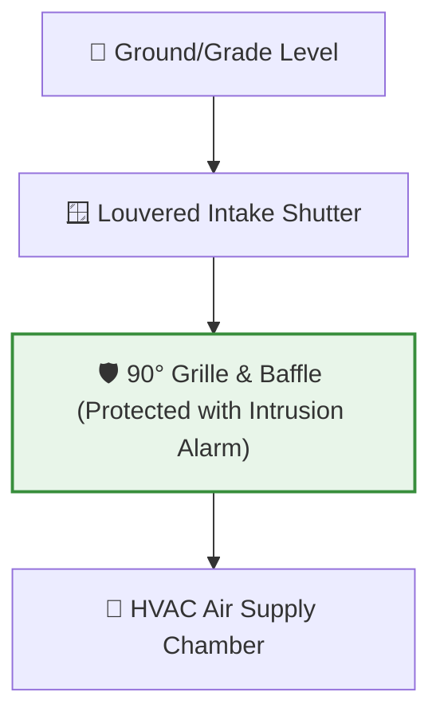

*   **Mitigation Strategy:** Locate all fresh air intakes at higher floor levels where physical access is impossible. If ground-level intakes exist, protect the portal with a **90-degree steel baffle and grille**, backed by physical intrusion sensors, as shown in Figure B-2.

#### B.5.2 Telecommunications Hardening
*   **Path Redundancy:** For high-security facilities, telecommunications cabling must enter the building via **two physically separated underground service conduits** routed to distinct central telephone offices.
*   **Riser Closets:** Risers and trunk cables must be enclosed in concrete or high-resistivity conduit pathways, and all hatch covers, closet doors, and distribution junctions must be supervised with tamper switches.

#### B.5.3 Site Hardening & Structural Resistivity
*   **Blast Mitigation:** Protecting the building envelope from explosive attacks using reinforced concrete facades, structural steel configurations, and robust standoff distances.
*   **Glazing Protection:** Deploying laminated, bullet-resistant glass or heavy-duty **security window film** designed to hold broken shards intact during blast events, preventing them from becoming lethal indoor projectiles.
*   **Executive Safety Demarcation:** Hardening executive corridors using masonry or double-sheet drywall embedded with structural steel sheets or fiberglass panels. 

---

## Appendix C: Voluntary and Statutory Standards

A standard is a documented set of guidelines, specifications, best practices, and metrics coordinated through accredited Standards Developing Organizations (SDOs). Standards ensure global compatibility, quality, and security across physical, electronic, and operational platforms.

### C.1 The Plan-Do-Check-Act (PDCA) Loop
Management systems standards (such as recognized industry standards) are structured around the continuous improvement **Plan-Do-Check-Act (PDCA) cycle**:

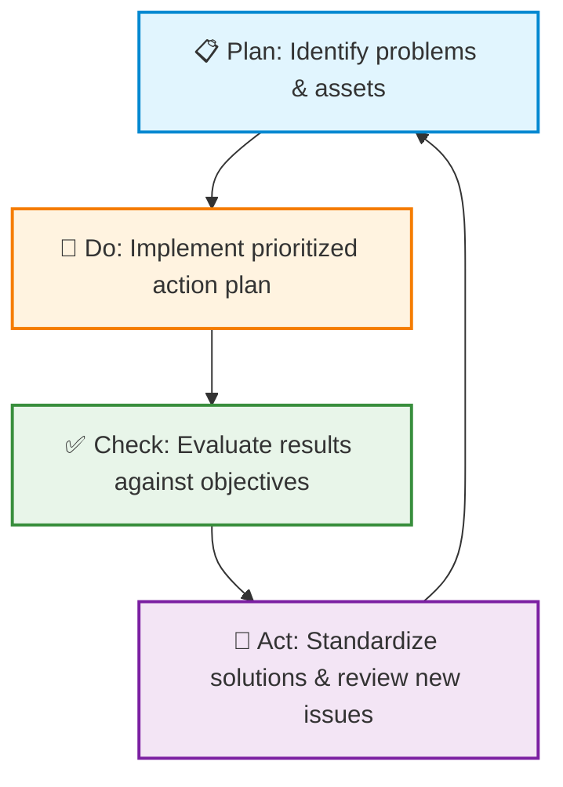

*   **Plan:** Establish the security objectives, identify critical assets, analyze threats and vulnerabilities, and prioritize risk mitigations.
*   **Do:** Implement the prioritized action plan, construct physical protection systems, establish operational procedures, and conduct training programs.
*   **Check:** Monitor, audit, and evaluate operations against the design objectives and performance criteria. Perform regular SAT, reliability, and annual evaluation testing.
*   **Act:** Take corrective and preventive actions based on review findings. Standardize successful solutions throughout the organization, update risk profiles, and begin the loop again for continuous organizational resilience.
