# 02 Physical Security Audit Manual (PSAM) — Business Principles

<details>
<summary><b>📖 Book Publication Details & Disclaimers</b></summary>

- **Publisher:** Raivan Global | [www.raivanglobal.com](https://www.raivanglobal.com)
- **Disclaimer:** This _Physical Security Audit Manual (PSAM)_ is furnished for training and ready reference purposes. While every effort has been made to ensure the accuracy of the contents herein, Raivan Global assumes no responsibility for errors or omissions.
- **Copyright:** © Raivan Global. All rights reserved. Prepared for internal training and security audit operations.

</details>

---

## Table of Contents

- [Introduction to Physical Security Audit Manual (PSAM)](#introduction-to-physical-security-audit-manual-psam)
  - [Objectives of Physical Security Audit Manual (PSAM)](#objectives-of-physical-security-audit-manual-psam)
  - [Readership](#readership)
  - [Dialogue](#dialogue)
  - [Supplemental Training](#supplemental-training)
- [Preface](#preface)
  - [The Organization and Content of This Book](#the-organization-and-content-of-this-book)
  - [Acknowledgements](#acknowledgements)
- [Chapter 1: Management and Leadership](#chapter-1-management-and-leadership)
  - [1.1 Management](#11-management)
  - [1.2 Efficiency and Effectiveness](#12-efficiency-and-effectiveness)
  - [1.3 The Evolution of Management](#13-the-evolution-of-management)
  - [1.4 Managerial Skills](#14-managerial-skills)
  - [1.5 Managers Today](#15-managers-today)
  - [1.6 Evolutionary Theories of Leadership](#16-evolutionary-theories-of-leadership)
  - [1.7 A New Leadership Paradigm & Competencies](#17-a-new-leadership-paradigm-competencies)
  - [1.8 Dynamics of Leadership and Styles](#18-dynamics-of-leadership-and-styles)
  - [1.9 Leadership Styles in Actual Practice](#19-leadership-styles-in-actual-practice)
  - [1.10 Leadership Flaws and Values](#110-leadership-flaws-and-values)
  - [1.11 Ethical Leadership](#111-ethical-leadership)
  - [1.12 Ethical Dilemmas in Security Practice](#112-ethical-dilemmas-in-security-practice)
  - [1.13 Chapter Summary](#113-chapter-summary)
- [Chapter 2: Critical Thinking and Decision-Making](#chapter-2-critical-thinking-and-decision-making)
  - [2.1 Critical Thinking](#21-critical-thinking)
  - [2.2 The Process of Critical Thinking](#22-the-process-of-critical-thinking)
  - [2.3 Cognitive Biases](#23-cognitive-biases)
  - [2.4 Intuition and Heuristics](#24-intuition-and-heuristics)
  - [2.5 Decision-Making: Problems, Styles, and Conditions](#25-decision-making-problems-styles-and-conditions)
  - [Comparison of Decision-Making Problems and Decisions](#comparison-of-decision-making-problems-and-decisions)
  - [2.6 The Eight-Step Decision-Making Process](#26-the-eight-step-decision-making-process)
  - [2.7 Group Decision-Making and Dysfunction](#27-group-decision-making-and-dysfunction)
  - [2.8 Big Data and Decision-Making](#28-big-data-and-decision-making)
  - [2.9 Chapter Summary](#29-chapter-summary)
  - [Key Chapter Takeaways](#key-chapter-takeaways)
  - [Appendix 2A: Case Studies](#appendix-2a-case-studies)
  - [Capstone Case Study: Strategic Decision-Making for a Global CSO](#capstone-case-study-strategic-decision-making-for-a-global-cso)
  - [📋 Historical Corporate Security Crises](#-historical-corporate-security-crises)
  - [Questions for Analysis](#questions-for-analysis)
- [Chapter 3: What Strategy Is and Why It’s Important](#chapter-3-what-strategy-is-and-why-its-important)
  - [3.1 The Concept of Strategy](#31-the-concept-of-strategy)
  - [3.2 Strategy Is About Competing Differently](#32-strategy-is-about-competing-differently)
  - [3.3 The Strategy Quiz](#33-the-strategy-quiz)
  - [3.4 Vision, Mission, Values, and the Strategic Management Process](#34-vision-mission-values-and-the-strategic-management-process)
  - [3.5 Objectives and Goals](#35-objectives-and-goals)
  - [3.6 SWOT Analysis: The Key to Environmental Alignment](#36-swot-analysis-the-key-to-environmental-alignment)
  - [SWOT Diagnostic Framework](#swot-diagnostic-framework)
  - [3.7 Crafting and Executing a Strategy](#37-crafting-and-executing-a-strategy)
  - [3.8 Strategy Implementation: The Ten Tasks of Execution](#38-strategy-implementation-the-ten-tasks-of-execution)
  - [3.9 The Evolution of Strategy: Intended vs. Emergent](#39-the-evolution-of-strategy-intended-vs-emergent)
  - [3.10 What Makes a Strategy a Winner: The Three Tests](#310-what-makes-a-strategy-a-winner-the-three-tests)
  - [3.11 Chapter Summary](#311-chapter-summary)
- [Chapter 4: Evaluating the External Environment](#chapter-4-evaluating-the-external-environment)
  - [4.1 The Spectrum of External Competition](#41-the-spectrum-of-external-competition)
  - [4.2 The Macro-Environment: Six Principal Sectors](#42-the-macro-environment-six-principal-sectors)
  - [4.3 Immediate Industry and Competitive Environment](#43-immediate-industry-and-competitive-environment)
  - [4.4 The Five Forces Framework](#44-the-five-forces-framework)
  - [4.5 Matching Strategy to Competitive Conditions](#45-matching-strategy-to-competitive-conditions)
  - [4.6 Strategic Group Analysis](#46-strategic-group-analysis)
  - [4.7 Competitor Analysis](#47-competitor-analysis)
  - [4.8 Key Success Factors (KSFs)](#48-key-success-factors-ksfs)
  - [4.9 Evaluating the Industry Outlook for Profitability](#49-evaluating-the-industry-outlook-for-profitability)
  - [4.10 Chapter Summary](#410-chapter-summary)
- [Chapter 5: The Internal Environment: Evaluating Resources, Capabilities, and Competitiveness](#chapter-5-the-internal-environment-evaluating-resources-capabilities-and-competitiveness)
  - [5.1 Question 1: How Well is the Company's Strategy Working?](#51-question-1-how-well-is-the-companys-strategy-working)
  - [5.2 Question 2: What are the Company's Most Important Resources and Capabilities?](#52-question-2-what-are-the-companys-most-important-resources-and-capabilities)
  - [5.2.3 Assessing the Competitive Power of a Company's Assets (The VRIN Framework)](#523-assessing-the-competitive-power-of-a-companys-assets-the-vrin-framework)
  - [5.3 Question 3: What Are the Company’s Strengths and Weaknesses Relative to Market Opportunities and External Threats?](#53-question-3-what-are-the-companys-strengths-and-weaknesses-relative-to-market-opportunities-and-external-threats)
  - [5.4 Question 4: How Do the Company's Value Chain Activities Impact Its Cost Structure and Customer Value Proposition?](#54-question-4-how-do-the-companys-value-chain-activities-impact-its-cost-structure-and-customer-value-proposition)
  - [5.4.4 Benchmarking and Best Practices](#544-benchmarking-and-best-practices)
  - [5.5 Question 5: Is the Company Competitively Stronger or Weaker Than Key Rivals?](#55-question-5-is-the-company-competitively-stronger-or-weaker-than-key-rivals)
  - [5.6 Question 6: What Strategic Issues and Problems Merit Front-Burner Managerial Attention?](#56-question-6-what-strategic-issues-and-problems-merit-front-burner-managerial-attention)
  - [5.7 Chapter Summary](#57-chapter-summary)
- [Chapter 6: Business-Level Strategies](#chapter-6-business-level-strategies)
  - [6.1 Types of Generic Competitive Strategies](#61-types-of-generic-competitive-strategies)
  - [6.1.1 Overall Low-Cost Strategy](#611-overall-low-cost-strategy)
  - [6.1.2 The Ten Cost Drivers](#612-the-ten-cost-drivers)
  - [6.1.3 Revamping the Value Chain System to Lower Costs](#613-revamping-the-value-chain-system-to-lower-costs)
  - [6.1.4 The Keys to Being a Successful Low-Cost Provider](#614-the-keys-to-being-a-successful-low-cost-provider)
  - [6.1.5 Pitfalls of Attempting to Be a Low-Cost Provider](#615-pitfalls-of-attempting-to-be-a-low-cost-provider)
  - [6.2 Broad Differentiation Strategies](#62-broad-differentiation-strategies)
  - [6.2.1 The Systematic Approach: The Eight Value Drivers](#621-the-systematic-approach-the-eight-value-drivers)
  - [6.2.2 Revamping the Value Chain to Increase Differentiation](#622-revamping-the-value-chain-to-increase-differentiation)
  - [6.2.3 Delivering Superior Value with Broad Differentiation](#623-delivering-superior-value-with-broad-differentiation)
  - [6.2.4 Pitfalls to Avoid in Pursuing a Differentiation Strategy](#624-pitfalls-to-avoid-in-pursuing-a-differentiation-strategy)
  - [6.3 Focused (Market Niche) Strategies](#63-focused-market-niche-strategies)
  - [6.3.1 Focused Low-Cost Strategy](#631-focused-low-cost-strategy)
  - [6.3.2 Focused Differentiation Strategy](#632-focused-differentiation-strategy)
  - [6.3.3 When a Focused Strategy Is Attractive](#633-when-a-focused-strategy-is-attractive)
  - [6.3.4 Risks of a Focused Strategy](#634-risks-of-a-focused-strategy)
  - [6.4 Best-Cost Provider Strategies](#64-best-cost-provider-strategies)
  - [6.5 Chapter 6 Summary](#65-chapter-6-summary)
- [Chapter 7: Corporate-Level Strategies](#chapter-7-corporate-level-strategies)
  - [7.1 When to Consider Diversifying](#71-when-to-consider-diversifying)
  - [7.2 Approaches to Diversification](#72-approaches-to-diversification)
  - [7.3 Choosing the Diversification Path: Related vs. Unrelated](#73-choosing-the-diversification-path-related-vs-unrelated)
  - [7.4 Unrelated Diversification](#74-unrelated-diversification)
  - [7.5 Evaluating the Strategy of a Diversified Company](#75-evaluating-the-strategy-of-a-diversified-company)
  - [Step 3: Checking for Good Resource Fit](#step-3-checking-for-good-resource-fit)
  - [Step 4: Ranking Business Units and Assigning a Priority for Resource Allocation](#step-4-ranking-business-units-and-assigning-a-priority-for-resource-allocation)
  - [Step 5: Crafting New Strategic Moves to Improve Overall Portfolio Performance](#step-5-crafting-new-strategic-moves-to-improve-overall-portfolio-performance)
  - [7.6 Chapter 7 Summary](#76-chapter-7-summary)
- [Chapter 8: International Business](#chapter-8-international-business)
  - [8.1 Why Companies Decide to Enter Foreign Markets](#81-why-companies-decide-to-enter-foreign-markets)
  - [8.2 Why Competing Across National Borders Makes Strategy More Complex](#82-why-competing-across-national-borders-makes-strategy-more-complex)
  - [8.3 Strategic Options for Entering International Markets](#83-strategic-options-for-entering-international-markets)
  - [8.4 International Strategy: The Three Main Approaches](#84-international-strategy-the-three-main-approaches)
  - [8.5 International Operations and the Quest for Competitive Advantage](#85-international-operations-and-the-quest-for-competitive-advantage)
  - [8.6 Cross-Border Strategic Moves: Profit Sanctuaries & Deterrence](#86-cross-border-strategic-moves-profit-sanctuaries-deterrence)
  - [8.7 Strategies for Competing in Developing-Country Markets](#87-strategies-for-competing-in-developing-country-markets)
  - [8.8 Defending Against Global Giants: Strategies for Local Companies](#88-defending-against-global-giants-strategies-for-local-companies)
  - [8.9 Relevant Threats to International Business Development](#89-relevant-threats-to-international-business-development)
  - [8.10 Chapter 8 Summary](#810-chapter-8-summary)
- [Chapter 9: Building an Organization Capable of Good Strategy Execution](#chapter-9-building-an-organization-capable-of-good-strategy-execution)
  - [A Framework For Executing Strategy](#a-framework-for-executing-strategy)
  - [9.2 Building An Organization Capable Of Good Strategy Execution: The First Three Key Actions](#92-building-an-organization-capable-of-good-strategy-execution-the-first-three-key-actions)
  - [9.3 Staffing The Organization](#93-staffing-the-organization)
  - [9.4 Developing And Building Critical Resources And Capabilities](#94-developing-and-building-critical-resources-and-capabilities)
  - [9.5 Matching Organizational Structure To The Strategy](#95-matching-organizational-structure-to-the-strategy)
  - [9.6 Summary](#96-summary)
- [Chapter 10: Managing Internal Operations: Promoting Good Strategy Execution](#chapter-10-managing-internal-operations-promoting-good-strategy-execution)
  - [10.1 Allocating Resources To The Strategy Execution Effort](#101-allocating-resources-to-the-strategy-execution-effort)
  - [10.2 Instituting Policies And Procedures That Facilitate Strategy Execution](#102-instituting-policies-and-procedures-that-facilitate-strategy-execution)
  - [10.3 Adopting And Adapting Best Practices And Employing Process Management Tools](#103-adopting-and-adapting-best-practices-and-employing-process-management-tools)
  - [10.4 Information And Operating Systems As A Means For Improving Strategy Execution](#104-information-and-operating-systems-as-a-means-for-improving-strategy-execution)
  - [10.5 Strategy-Supportive Rewards/Incentive Guidelines](#105-strategy-supportive-rewardsincentive-guidelines)
  - [10.6 Managing Internal Operations During And After A Global Pandemic](#106-managing-internal-operations-during-and-after-a-global-pandemic)
  - [10.7 Summary](#107-summary)
- [Chapter 11: Organizational Culture](#chapter-11-organizational-culture)
  - [11.1 Instilling A Corporate Culture Conducive To Good Strategy Execution](#111-instilling-a-corporate-culture-conducive-to-good-strategy-execution)
  - [11.2 Leading The Strategy Execution Process](#112-leading-the-strategy-execution-process)
  - [11.3 Summary](#113-summary)
- [Chapter 12: Business Measurements and Metrics](#chapter-12-business-measurements-and-metrics)
  - [12.1 Financial Planning And Budgeting](#121-financial-planning-and-budgeting)
  - [12.2 Key Measurements](#122-key-measurements)
  - [12.3 Key Metrics](#123-key-metrics)
  - [12.4 Other Metrics](#124-other-metrics)
  - [12.5 Final Thoughts](#125-final-thoughts)
  - [Voluntary, Statutory, and Mixed Standards](#voluntary-statutory-and-mixed-standards)

---

## Introduction to Physical Security Audit Manual (PSAM)

### Objectives of Physical Security Audit Manual (PSAM)

The _Physical Security Audit Manual (PSAM)_ is intended for a security professional to find current, accurate, and practical treatment of the broad range of asset protection subjects, strategies, and solutions in a single source. The need for such a comprehensive resource is widespread according to the editors, writers, and many professional colleagues whose advice has been sought in compiling this text.

The growing size and frequency of all forms of asset losses, coupled with the related increasing cost and complexity of countermeasures selection, demand a systematic and unified presentation of protection doctrine in all relevant areas, as well as standards and specifications as they are issued. Of course, it would be presumptuous to assume that any small group of authors could present such material unaided. It is, therefore, a fundamental objective of the PSAM to draw upon as large a qualified source base as can be developed.

The writers, peer reviewers, and editors attempt to distill from the available data common or recurrent characteristics, trends, and other factors, which identify significant valid protection strategies. The objective is to provide a source document where information on any protection problem can be obtained.

### Readership

The _Physical Security Audit Manual (PSAM)_ is intended for a wide readership: all security professionals and business managers with asset protection responsibility. The coherent discussion and pertinent reference material in each subject area should help the reader conduct unique research that is effective and organized. Of particular significance are the various forms, matrices, and checklists that give the reader a practical start toward application of the security theory to his or her own situation. The PSAM also serves as a central reference for students pursuing a program in security or asset protection.

### Dialogue

We hope that the Physical Security Audit Manual (PSAM) becomes an important source of professional insight for those who read it and that it stimulates serious dialogue among security professionals. Any reader who is grappling with an unusual, novel, or difficult security problem and would appreciate the opinions of others is encouraged to write a succinct statement describing the problem and share it with the professional security community.

### Supplemental Training

Readers with supervisory or management responsibility for other security and asset protection personnel will find the PSAM to be a useful resource from which to assign required readings. Such readings could be elements of a formal training syllabus and could be assigned as part of related course sessions.

---

## Preface

This book is a first of its kind to be included in the Physical Security Audit Manual (PSAM) and is meant to serve as a guide and source of relevant business information for security professionals and aid their professional training.

From both my experience in security management and discussions with other security professionals, there has long been a need for a true business principles book to more effectively round the education of security professionals; as many who undertake security as a profession come to the world of business from government, law enforcement, or the military, without any substantial grasp of the world of business they are entering. Having done that myself, it was made strikingly clear upon joining a notable company that the capabilities which had served me well in one profession — law enforcement — and were the basis for having been hired to serve as a business security professional, were not going to be sufficient enough to enable me to achieve success in the business over the longer term.

Based on a lack of any formal business education, when I left law enforcement to begin a career in business security, I came to realize how much I needed to know, what I was missing and what a barrier it was to my fully realizing the goals I set forth; but more importantly, what my business actually expected me to accomplish. Still, I was limited by my understanding of business principles.

In truth, it was not until I left the world of business security and pursued and attained a doctorate degree in business that I fully understood what I had been missing and how much more I could have achieved had I attained a business education before entering the world of security. While, retrospectively, it is not a path I would recommend, it is this understanding that has been a driving factor in my efforts to help security become more professional, better educated about business, and hopefully more effective.

I was the creator and teacher of business management programs for security professionals. I created a course on business security for an MBA program, a certification program for a retail association, a graduate program in security management, worked with professional security associations on business practitioner-academic development programs, and spoken at a number of international programs, including the CSO Roundtable, on the topic of business management. This committed effort to further security knowledge and professionalism is at the heart of this book.

The challenge in writing a first-of-a-kind book, of course, is what to include and what to leave out. As a former law enforcement officer who managed to become a CSO and then a business professor, I believe I offer a unique view of the field of security and what a professional might need to know. And, while I endeavored to include those things about business that would further the knowledge a security professional would need, the book is not designed as a prescription. Rather, it is meant to offer a grounded basis on which to build a security professional’s business education.

What each security professional gets from the book will be a process of individual discovery. But it will be, rest assured, valuable as the basis for better understanding what companies are expecting of all current employees — security included — that is, continuing, ongoing education that helps them become more valuable to the company, their profession, and themselves.

### The Organization and Content of This Book

The chapters were designed to move the reader along a linear path of discovery — from understanding leadership and management, to decision making, then onto business and its many aspects. The book culminates with business measurements and metrics chosen for related importance to security and are meant to create greater security awareness and understanding of the means by which business is analyzed.

What each chapter has sought to provide is an understanding of key terms relevant to the discussion of the material included, and this effort is accompanied by charts, graphs, and examples that are tied to the learning points offered.

- **Chapter 1** deals with leadership and management. Organizations of all kinds must have capable leaders and managers, as opposed to the command and control more common to the military, law enforcement, and many governmental agencies. This chapter seeks to draw distinctions about the leadership and management expected in a business setting and offer examples of actual but disguised security management and leadership in action, in order to help enlighten the learning points with a view of security professionals in practice.
- **Chapter 2** discusses the process of critical thinking, how it differs from creative thinking, and the meaning of cognitive biases that impair critical thinking and inhibit effective decision-making that is needed to solve problems. The greater focus of the chapter is on the types of decisions we face and the manner in which we can arrive at solutions to the problems the decisions are meant to solve. Decision-making styles are identified and analyzed for their relevance and applicability. Finally, a specific, multi-step decisional process is offered as a means to systematic and iterative process to aid in arriving at reasonable and effective decisions. A case study that is based on the composition of real-world security challenges — which I developed for professional management training programs — is offered at the end as a capstone for a practical learning opportunity.
- **Chapter 3** is a discussion of Strategy. As many who have been in the military and law enforcement have long understood, strategy is a big picture view and, most often, the sole jurisdiction of senior leaders. As is true of business, any good idea that has value is worth "stealing," and so it was with business adopting and adapting the concept of strategy. As pointed out in the chapter, in the world of business, strategy is king. So, it is a fundamentally important aspect for security professionals to become intimately aware of and as knowledgeable as possible, because in business all functions — security included — are expected to grasp the larger business strategy and work to mold their functional strategy in support.
- **Chapter 4** looks at the external business environment, which consists of economic, demographic, socio-cultural, political-legal, technological, and international-global sectors. The chapter discusses the six sectors of the macro-environment and their context in businesses. These sectors are beyond the control of a business, but they serve as the basis for aligning the capabilities that exist within the internal environment. Any mismatch between the two can and will lead to mistakes and failures. Further, the chapter introduces readers to the most fundamental perspective on strategy development and business management — the Five Forces model of competition, which serves as the single most powerful tool for diagnosing the competitive pressures within an industry and that will affect how well or poorly a business may operate.
- **Chapter 5** discusses techniques for evaluating a company’s internal environment and includes an explanation of why the collection of resources and capabilities, as well as the activities businesses perform along their value chain, is a powerful tool for assessing a company’s competitive assets. Other important topics covered in this chapter include SWOT analysis, value chain analysis, benchmarking, and a discussion of what resources, capabilities, and competencies mean and how they serve to enable strategies to be effective and achieve the desired outcomes. Of note is the discussion of the VRIN framework used to determine if a company has the ability to compete effectively.
- **Chapter 6** is about business-level strategies, which involve the actions companies take to gain competitive advantage in a single market or industry. Specifically referred to as the five generic strategies, they are choices companies make to compete based on how their internal capabilities are well matched or aligned with the external opportunities that exist in the competitive environment. The five generic strategies are low-cost, differentiation, best-cost provider, focused differentiation, and focused low-cost. The chapter describes when each of these strategies work best and what pitfalls to avoid. Also explained are the cost drivers and uniqueness drivers that reduce a company’s costs or enhance its differentiation, respectively.
- **Chapter 7** discusses corporate-level strategies, which are actions firms take to gain competitive advantage by operating in multiple markets or industries simultaneously. With a focus on diversification through building new products or entering new markets, corporate strategy takes a portfolio approach to strategic decision-making by looking across all of a firm's businesses to determine how to create the most value. In order to develop a corporate strategy, firms must look at how the various businesses they own fit together, how they impact each other, and how the parent company is structured in order to optimize human capital, processes, and governance. Corporate strategy builds on top of business strategy, which is concerned with the strategic decisions within the individual businesses.
- **Chapter 8** is about international business that, at some level, has existed since the beginning of recorded time. We can see that some form of international business has existed throughout history — as there has long been trade across borders — that has served as an important determinant of the wealth of individuals, companies, and countries. The search for trading opportunities and trade routes was a primary motivation for the exploration that led to the settlement of the world. The chapter explores the different market conditions and the complexities and risks that exist across countries and how they influence a company’s strategic choices about where and how they choose to enter and compete in foreign markets.
- **Chapters 9, 10, and 11** are interrelated discussions of tasks associated with effective management.
- **Chapter 9** is about having in place an organization capable of the tasks demanded of it and emphasizing the importance of staffing the organization with managers and employees capable of executing the strategy well; acquiring and developing the resources and organizational capabilities necessary for successful strategy execution; and creating a strategy-supportive organizational structure.
- **Chapter 10** extends the discussion into the managerial tasks that are designed to improve business performance through effective strategy execution. These include allocating sufficient resources (financial and human) to the strategy execution effort; instituting policies and procedures that facilitate strategy execution; adopting and adapting best practices and business processes to drive the strategy execution activities; installing information and operating systems that enable company personnel to carry out their roles proficiently; and tying rewards and incentives directly to the achievement of strategic and financial targets.
- **Chapter 11** focuses on organizational culture. Corporate culture refers to the shared values, ingrained attitudes, core beliefs, and company traditions that determine the norms of behavior, accepted work practices, and styles of operating within a specific organization. The chapter explores the key features of an organizational culture and discusses the importance of instilling an effective corporate culture to promote good strategy execution; exercise strong leadership to drive the execution process forward; and help attain companywide strategic objectives.
- **Chapter 12** provides security professionals with a fundamental understanding of key business measurements and metrics. These are important informational tools that will help with the "translation" of what is often called business-speak and enable the security professional to be better "armed" to compete for resources and capabilities. The chapter discusses the make-up of two of the most common types of budgets; as well as the value of understanding the "big three" financial statements issued by a company — the P&L, balance sheet, and cash flow statement — from which ratios can be calculated to reflect a company’s ability to earn a profit relative to its sales revenue, operating costs, balance sheet assets, and shareholders’ equity. These metrics can also show how well companies use their existing assets to generate profit and value for owners and shareholders. The chapter also offers a short discussion of liquidity ratios — those metrics that tell an analyst how well a company is able to pay off current debt obligations without raising external capital. Liquidity ratios measure a company's ability to pay debt obligations and assess its margin of safety through the calculation of metrics. Finally, the chapter ends with a discussion of non-financial measurements.

### Acknowledgements

I must thank the professional security community and leadership for having the confidence in me and encouraging this book. In sum, it was their vision that the security profession needed to be better grounded in an understanding of the world that the profession inhabits — business. Their belief was that a firmer understanding of business was needed as a part of the Physical Security Audit Manual (PSAM) anthology, and as an element of the professional training process. I am also indebted to the editorial team for their kind guidance, comments, and assistance with the editing process that made the book eminently more relevant and readable for security professionals.

I would also like to acknowledge that writing this book was only possible because of what I learned from my time as a security professional and a strategy professor. The many people who taught me the security profession are valued, even if unnamed, and extend into various business functions and in a variety of companies. To one person who wishes to remain anonymous — thank you for teaching a person untrained in business well enough to survive and thrive. I also want to thank the many people who worked for and with me over the years and who taught me at least as much as I taught them.

Finally, it is hoped that this book adds value to all security professionals and, ultimately, aids in furthering the profession; which is, after all, grounded in business.

## Chapter 1: Management and Leadership

Management and leadership are essential to organizational life. Organizations of all kinds must have capable leaders and managers, as opposed to the command-and-control structures more common to the military, law enforcement, and many government agencies. This chapter seeks to draw distinctions between the leadership and management expected in a business setting and offers examples of actual, disguised security management and leadership in action. This approach will ground key learning points in the everyday practice of security professionals.

Understanding management or leadership is complicated by the fact that there are many different perspectives on both. For example, a search on the word "management" provides billions of results, and a similar search on the word "leadership" delivers billions more.

All of these materials exist because, no matter the size, type, or location of the organization, managers and leaders are essential to success. However, the competitive environment that businesses find themselves in is not static—it is changing, and so are the roles of managers and leaders. While they are linked and share many similar characteristics, managers and leaders differ in a number of important ways. Let’s explore both roles to better understand their similarities and differences, and how they relate to businesses, organizations, and security professionals.

---

### 1.1 Management

In its simplest definition, **management** is a set of activities directed at the efficient and effective utilization of resources in the pursuit of one or more goals. A **manager** is someone who coordinates and oversees the work of other people in ways that enable organizational goals to be accomplished.

Management is a complex process essential to organizational success because it involves getting things done through the effective and efficient utilization of resources that include people, time, and money.

#### 1.1.1 Who Are Managers?

Today, managers can range from millennials to baby boomers. While management was once almost entirely the domain of men, women now represent the greater number of college graduates and are increasingly entering the workforce and joining the ranks of management.

Demographic shifts are occurring at the same time as organizations face the changing nature of work. This increasingly competitive landscape has blurred the distinction between managers and nonmanagerial employees. Many roles previously considered nonmanagerial because they lacked direct reports are now seen as containing critical management tasks. We see this in companies with a single security manager who is responsible for all things security and must interact across all structural and geographic boundaries to ensure the security of the business, its employees, suppliers, customers, and stakeholders.

Of course, achieving goals through others is often personally satisfying and financially rewarding, and can be considered a significant achievement in itself. Still, a manager’s job is ultimately about the success of the group or larger organization, as exemplified in the following scenario.

> [!NOTE]
> **Case Story: The Transition from Contributor to Manager**
>
> A new security director was hired by a business. He had broad experience investigating business crimes and, as the sole security professional in the company, was responsible for crime prevention and the investigation of any allegations of internal crime. He found there was no absence of opportunities to prove his worth.
>
> However, as the company expanded its business, the security director recognized that the demands for investigations exceeded his available time and negatively impacted his ability to create the requisite security systems and programs that would help establish a more secure business. Consequently, in the next fiscal year planning cycle, he sought a new budget to include new field security positions to aid in that effort. With the new fiscal year came the budget approval, and he was able to hire four new security professionals.
>
> After a period of training and exposing the new employees to the business, the company began rolling out security programs, policies, and systems and conducted criminal investigations. While most crimes were small and the investigations simple, one high-profile fraud case was complex and caused a significant financial impact.
>
> Because this was a high-profile event for his new department and the security director had the experience to conduct such a complex investigation, he pondered whether to take over the investigation personally. The event was an early and significant challenge, and the security director recognized a successful outcome was essential in proving the value and standing of the new department. He believed that with his skills and business experience, he could better navigate the potential problems and successfully bring the investigation to a satisfying conclusion.
>
> However, after careful consideration, the security director recognized that, despite his considerable knowledge of investigations and his business experience, the role he should take was that of a manager providing guidance when needed and ensuring his subordinates had the resources and organizational support to complete the investigation. The director realized his role had evolved and he was no longer the individual contributor. His job as a manager was to coordinate and oversee the work of his employees.
>
> As this story illustrates, the security director did not take over the work of his subordinate because it would have impaired the opportunity for learning that would aid in longer-term success. Rather, by overseeing the work and ensuring the investigator had the necessary resources, the security manager achieved his goals.
>
> One thing that should not be lost when considering who works for whom is that the security director in our story had his own reporting relationship to a higher-level manager. The success of the director's new employees—as well as his own decision to transition from investigator to manager—showed that his recommendation for hiring new staff was a worthy financial investment by the company.

This story illustrates the structure of organizations, and where managers fit within it. In traditionally structured organizations, a pyramid shape depicts the various levels of management.

```
       ▲
      / \      Top Management (Executives: Board, President, CEO)
     /       /     \    Middle Management (Branch/Department Managers)
   /         /_________\  First-Line Management (Frontline: Shift Leaders, Sergeants)
```

- **First-line (frontline) managers** are the lowest level of managerial employees. These managers generally oversee the performance of nonmanagerial employees who work on operational tasks. They may be recognized by titles such as foreman, line boss, shift leader, section chief, head nurse, or sergeant. While titles vary, first-line managers across all organizations supervise about 93 percent of all nonsupervisory employees, making it a highly influential role.
- **Middle management** is the intermediate management level of a hierarchical organization that is subordinate to executive management and responsible for specialist and team-leading line managers. Middle managers are responsible for junior staff performance and productivity, translating the organization's strategy into action. General managers, branch managers, and department managers are all examples of middle-level managers and are accountable to top management for the function of their department. Middle-level managers devote more time to organizational activities than top-level managers.
- **Top management** is at the highest level of an organization and is often referred to as senior management, executive management, or upper management. This level of management has the day-to-day tasks of managing the organizational direction, focusing on the management of ideas more than people. In business, top-level managers include the board of directors, president, vice presidents, and CEO. These managers are responsible for controlling and overseeing the entire organization, as well as developing goals, strategic plans, company policies, and making decisions on the direction of the business.

Not all organizations are structured in a traditional pyramid form—some use matrix forms that allow more independent managerial actions and decisions. But even in that form, top management consistently serves to identify and develop goal setting and the strategies designed to help achieve them.

> [!IMPORTANT]
> **Definition:** An **organization** is a deliberate arrangement of people to accomplish a specific purpose.
>
> Organizations can include large corporations, medium-sized businesses, hospitals, not-for-profit agencies, museums, schools, political campaigns, sports teams, and music tours.

> [!TIP]
> **Study Pointer:** Enterprise Security Risk Management (ESRM) guidelines operate within the context of the organization. ESRM outlines that asset protection and security strategies must align closely with organizational objectives, governance, and operating structures.

We are seeing greater flexibility in the structure of organizations as the nature of work is changing, unbound by either time or location. Nonetheless, no matter what deliberate structure is used, the key is for managers to enable people to do the work and achieve the goals.

Great managers can inspire and motivate by energizing people to accomplish things together that they could not get done alone. They can provide coaching and guidance with problem resolution, give performance feedback to help employees improve performance, and keep people informed through regular communication.

It is often said that the reason many people will leave a job is not because it wasn't challenging or the organization didn't have career-enhancing opportunities. People will leave a job because they dislike their supervisor. This is why effective management is critical to organizations—poor managers can create needless employee turnover.

---

### 1.2 Efficiency and Effectiveness

Today’s changing global environment is ever-more uncertain, complex, and chaotic. Striving for organizational efficiency is standard, but the use of resources must be balanced with the expectations that spending will produce outcomes valued by the company.

While security departments often use benchmarking and standards to compare their own operations to an industry leader, companies striving for efficiency are going to evaluate all spending requests—as well as the use of time and talent—to ensure the use of resources in ways that enable effectiveness.

> [!IMPORTANT]
>
> - **Efficiency:** The ability to do things right — minimizing the resources (people, time, money) needed to achieve goals.
> - **Effectiveness:** The ability to do the right things — producing the intended or desired outcomes that support the organization's strategic purpose.

Effectiveness is not always achieved at a low cost. Rather, effectiveness is about doing things in ways that ensure the achievement of the stated, planned-for, and desired goals.

The concepts of efficiency and effectiveness are not always mutually exclusive. For example, some budget airlines seek to control costs in order to be efficient. However, operating cheaply is not acceptable if it risks the goal of getting customers to and from destinations safely. New planes and equipment—as well as hiring, training, and retaining talented people—will add costs, but they are essential to the effective operation of the business and the attainment of goals, including quality customer service and safety.

Balancing the demands for efficiency and effectiveness is about managing the work done to ensure the achievement of goals. Poor management reflects inefficiencies and ineffectiveness, but good management helps companies achieve their desired goals.

---

### 1.3 The Evolution of Management

With the first Industrial Revolution, countries around the world moved from an agrarian and craft economy to one dominated by industry and machine manufacturing. This drove changes in socioeconomics and business, sparking a need for more effective management.

Over the next 100-plus years, theories on how to make work more manageable, and new ideas on management arose. In 1911, mechanical engineer Frederick Taylor sought to determine the “one best way” that a job could be done. His approach, called **scientific management**, was an effort to make manufacturing more efficient and, in so doing, reduce costs. Scientific management recognized that controlling costs is one way to attain profitability. However, Taylor's approach was less about science and more about a process for performing efficient manufacturing tasks that made management easier.

Shortly after Taylor's approach was made popular, a pragmatic French businessman, Henri Fayol, suggested that the actual role of managers involved performing a number of basic functions. The functions Fayol saw as essential to businesses centered around management principles that sought to describe what managers do and what constituted good management practice.

Today, Fayol’s management principles have been adapted and are known by their acronym—**PODSCORB**—Planning, Organizing, Deciding, Staffing, Directing, Coordinating, Reporting, and Budgeting.

Let’s take a look at these functions individually:

- **Planning:** It is the task of managers not only to decide what to do, but to plan the agenda. Planning is about foresight and includes short-term planning (weekly, monthly, and quarterly), medium-term planning (annual) and long-term planning (looking ahead with a multi-year timeline). Planning is essential because it determines the direction of the organization, which is affected by long-term capital projects, medium-term staffing, and short-term day-to-day operations.
- **Organizing:** Managers not only have the task of assigning activities, but also of allocating these tasks to their respective departments and employees. To achieve a desired result, the manager requires the necessary resources that include some form of budgetary funds, materials, and people with the necessary skills, technology, and equipment. The manager will have to organize a range of things to achieve the desired outcome. To be as efficient as possible, it is important that the employees’ division of labor—the breakdown of jobs into narrow tasks—enables the achievement of the desired goal.
- **Directing (Direction):** Direction lies in the hands of the manager and is about plotting a course of action. He or she is the person with final responsibility and is held accountable for this direction. This means that the manager must maintain control over all functions, monitor progress, and serve to encourage, motivate, and direct employees in their pursuit of goals.
- **Staffing:** Staffing is necessary to facilitate organizational functions and all activities within an organization, including hiring, training, and retention of employees. Different staffing needs exist in organizations, depending on the tasks demanded of the jobs. However, skilled, competent people are crucial for an organization to function optimally. The task of the manager is to identify the expertise, skills, and experiences required for the positions that are to be filled in order to ensure that the right person is in the right place.
- **Coordinating:** This managerial task involves connecting different people and functions to achieve cooperation that enables a stated goal to be achieved. A good manager must have a broader view and understanding of what is happening and what needs to be done. From this perspective, the manager is able to coordinate tasks and manage employees. It is also his or her task to synchronize different departments that are not in his or her direct control and work to bring them together with the right end goal in mind.
- **Reporting:** Whether in words or numbers, reporting is valuable because it offers visible evidence of management. A clear report keeps communication open throughout the entire organization, identifying progress and linking management with their employees and higher-level management, as it provides insights into the progress being made. It also includes other essential information—such as problems with employees, new processes, performance reviews, and sales figures.
- **Budgeting:** Finance is the lifeblood of any business, and it begins with budgeting. The manager is responsible for projecting budget needs, as well as the expenditure and control of the department’s budget. This includes facilitating base budgets; managing incremental increases and decreases; projecting forecasts of short- and long-range plans to maintain operations; developing budgetary contingencies in an attempt to address foreseen and unforeseen problems; forecasting a decrease in expenses; proposing and explaining needs for budgetary increases; identifying contingencies; explaining one-time expenditures; prioritizing capital expenditures based on analysis; articulating budgetary contingencies; and, when necessary, explaining budget sufficiency.

---

### 1.4 Managerial Skills

To perform the PODSCORB functions effectively, managers require a combination of skills that are generally defined as technical, interpersonal, and conceptual. However, the extent to which a manager needs each of these skills is, by the very practice of management, relative to the organizational level at which the manager resides.

| Skill Category           | Description & Core Focus                                                                                | Primary Level of Application                                                    |
| :----------------------- | :------------------------------------------------------------------------------------------------------ | :------------------------------------------------------------------------------ |
| **Technical Skills**     | Specialized job knowledge, task procedures, and operational proficiency.                                | **First-Line (Frontline) Management** (Shift leaders, sergeants, foremen)       |
| **Interpersonal Skills** | The capacity to communicate, build trust, motivate individuals/groups, and resolve conflicts.           | **All Levels** (Particularly critical for department heads and middle managers) |
| **Conceptual Skills**    | The ability to think abstractly, conceptualize complex/fluid situations, and design long-term strategy. | **Top Management** (Board, Executives, CEO, senior CSOs)                        |

- **Technical Skills:** In a lower-level management job, the expectation would be that the manager has a great deal of technical skills, as they are closer to the work that comprises the operational nature of the business. By necessity, the depth of the technical skills of a lower-level manager is expected to be far more than that possessed by the next-level manager. For example, a lower-level manager in a security services firm that offers guard services would have an in-depth operational understanding of the job responsibilities and activities expected of the guards as they service their customers.
- **Interpersonal Skills:** While strong technical skills are essential to success for a lower-level manager, as we move upward in management levels, the business requires more and better interpersonal and conceptual skills. Interpersonal skills involve the ability to not only understand the work being done but how it relates to individuals and groups within the larger organization. This requires relationship building, the ability to communicate effectively, and the capacity to inspire trust and motivate others. This is encompassed in the ability to manage more people in more functions toward desired outcomes.
- **Conceptual Skills:** Conceptual skills are necessary for all levels of managers but are demanded more of top-level managers because they require the ability to think and conceptualize abstract and complex situations. To use our security services company example, it is less about the technical work of the guards or investigators and more about how to create the strategies necessary to expand the business and appeal to new clients. Using conceptual skills, top managers see the organization as a whole, work to understand the relationships among the various departments, and determine how the organization can better compete. With this, managers will make a substantial number of decisions in support of the company’s strategies used to pursue its competitive goals.

What we can say when looking at the three levels of management and their roles is that, in today’s demanding and dynamic workplace, employees who want to be valuable to their organization must constantly upgrade their knowledge base beyond technical skills. To move up into higher levels of management within an organization requires building a stronger knowledge base that, while including some technical skills, requires deeper and better interpersonal and conceptual skills.

### 1.5 Managers Today

In today’s world, managers are dealing with new and increasing uncertainties. For example,
at the end of the 20th Century, businesses tended to place their risks in one of five buckets:

1. strategic risks ~ these involving competitors in the markets being served; 2) financial risks

- associated with how to fund business growth and manage company debt; 3) operational
  risks - involving the exposure of the complete company value chain to myriad risks; 4)
  compliance or regulatory risks - which can impact the financials and relate to new rules
  or legislation affecting how a business operates; and 5) reputational risks - the result of
  business mistakes or failures that can affect future operations and profitability.
  While these risks still exist, they are now viewed more as individual buckets of risk into
  which more specific risks reside. Business risks faced by a manager will vary depending on
  where he or she resides functionally in the organizational structure. A recent list of business
  risks offered below provides a valuable example of the nature of risks facing organizations
  and reflect how businesses have changed.

* Slow economic growth and profit pressure
* Regulatory and policy risks
* Cyberthreats and loss of intellectual property
* Financial liquidity (interest rates, access to capital markets)
* The collapse of a major government
* Inability to address crises or repair damage to reputation
* Inability to attract or retain talent
* Threats of pandemics and natural disasters
* Disruptive innovation (technology, products, and processes)
  Security professionals likely recognize a number of risks that may fall under their area of
  responsibility. Some risks may be addressed programmatically, for example, through a
  companywide crisis management program. Others, like terrorism and the theft of intellectual
  property, will be addressed as they arise. But in all cases, the risks must be managed, even
  as their complexity increases. The global company of today is fundamentally different from
  the old multinationals of the 1960s and 1970s.

For example, in just the past decade, a consistent set of management challenges has arisen
that relates to the needs of the business environment. These specific needs include:

- Responsiveness to the competitive markets
- A closer relationship with customers
- Focus on outsourcing, partnerships, and alliances
- Emphasis on speed, quality, and productivity
- Shift to boundaryless work groups and global enterprise
- More emphasis on employee empowerment, self-direction, and diversity
- Leaner, more streamlined organizational structures
- Focus on core processes
- The shift to a high-performance team philosophy
- Greater application of technologies and expert knowledge to create value
- The shift from command and control management to a leadership orientation
  Without question, these challenges, combined with business risks, mean that all managers—
  including security professionals with and without managerial roles—must have the skills
  and capabilities to handle both.
  Three ideas are apparent about the state of management today. First, there is a universality
  of management—managers are essential to the efficiency and effectiveness of all sizes and
  types of organizations, at all organizational levels, and in all geographic locations. Second,
  the reality of work in organizations means that people will manage or be managed. Third,
  management is central to identifying and achieving goals necessary to organizational
  success.
  Without capable managers, organizations cannot exist. But, just as importantly,
  organizations also need effective leaders. There is often confusion about the distinctions
  between the two, but the role of leaders in organizations is different from that of managers.
  As discussed in the previous section, management is about coping with complexity.
  Without good management, complex enterprises tend to become chaotic in ways that threaten their very existence. Good management brings a degree of order and consistency
  to key dimensions such as quality and profitability.
  By contrast, leaders are individuals who, in their own inimitable way, inspire confidence,
  undermine despair, fight fear, initiate positive and productive actions, define goals, and
  paint better tomorrows.
  It sounds different, does it not? And, itis.
  Leadership can be a paradox—it is an art and a science, it involves change and stability, it
  draws on personal attributes and requires interpersonal relationships, it sets visions and
  results in actions, it honors the past and exists in the future, it manages things and leads
  people, it is transformational and transactional, it serves employees and customers, it
  requires learning and unlearning, it centers on values and is seen in behaviors.
  The distinction between managers and leaders is often marked by the differences in their
  individual motivation, personal history, and in how they think and act. This difference is
  apparent in their attitudes toward goals. For managers, goals are impersonal and arise out
  of necessity, affected by the organization’s history and culture. In this way, managers are
  reactive.
  However, leaders seek to be proactive and tryto shape ideas and influence actions instead
  of responding to them. In taking ownership of their role, leaders adopt a personal attitude
  toward goals, and the influence they exert seeks to change the way people think about what
  is desirable, possible, and necessary.
  While the reality is that leadership is different from management, it is not for the reasons
  most people think. Leadership is not mystical and mysterious. It has nothing to do with
  having charisma or other exotic personality traits, as suggested in some books on leadership.
  Leadership is not necessarily better than management or a replacement for it. Rather, they
  are two distinctive but complementary activities. Both are necessary for success in an
  increasingly complex and volatile business environment.
  It has been stated that leadership is one of the most observed and least understood
  phenomena on earth. This suggests some difficulty in defining leadership, in no small
  part because it seems the definition has been broadened to include almost everyone with
  organizational power and authority.
  It would seem that nearly every organizational executive has been spoken of as a leader.
  We hear of community leaders, political leaders, business leaders, religious leaders, and
  military leaders. But, are all of these people really leaders or merely holders of positions—
  to key dimensions such as quality and profitability.
  paint better tomorrows. :
  It sounds different, does it not? And, it is.
  ‘The distinction between managers and leaders is often marked by the differences in their
  reactive.
  However, leaders seek to be proactive and try to shape ideas and influence actions instead of merely reacting to them. In taking ownership of their role, leaders adopt a personal attitude toward goals, and the influence they exert seeks to change the way people think about what is desirable, possible, and necessary.

While the reality is that leadership is different from management, it is not for the reasons most people think. Leadership is not mystical or mysterious. It has nothing to do with having charisma or other exotic personality traits, as suggested in some popular books. Leadership is not necessarily better than management or a replacement for it. Rather, they are two distinctive but complementary activities. Both are necessary for success in an increasingly complex and volatile business environment.

It has been stated that leadership is one of the most observed and least understood phenomena on earth. This suggests some difficulty in defining leadership, in no small part because the definition has been broadened to include almost everyone with organizational power and authority. We hear of community leaders, political leaders, business leaders, religious leaders, and military leaders.

But are all of these people really leaders, or are they merely holders of positions—managers, as it were? Should we expect that because someone holds a lofty organizational position, they are automatically imbued with the ability to lead? The question begs to be asked: why is the term "leadership" used so commonly?

Perhaps it is due to the wealth of writing on leadership, including some that provide perspectives credited to historical figures, athletic coaches, and former business and military leaders. However, what made people successful leaders in one setting does not ensure they will succeed in another. History has shown that great military leaders sometimes struggle when leading governmental organizations, and in the business world, CEOs who succeed in one business may fail in another. If they bring the same set of skills to the new organization, why do we see failure?

Because the concept of leadership is complex, and while we believe we recognize leadership when we see it, we cannot say exactly what makes someone a good leader. One thing is clear—leadership is not the province of only a chosen few, which raises the question of the origin of the concept.

---

### 1.6 Evolutionary Theories of Leadership

Before popular writers took hold of the concept, leadership scholars in the early part of the 20th Century began studying how leadership function in growing organizations. They initially focused on the qualities that distinguished leaders from followers, seeking to define leadership as a behavior, a style, a skill, a process, a responsibility, a function of management, or an influencing relationship. Most of these historic approaches can be classified into a few major categories:

#### 1.6.1 "Great Man" Theory

The term "Great Man" was used because, at the time, leadership was primarily thought of as an innate male quality, often tied to military command. This theory proposed that great leaders are born, not made, possessing a natural, inborn capacity for leadership. It portrays leaders as heroic, mythic figures destined to rise up to lead when needed, holding power because they are uniquely enlightened. However, history and practical observation have shown that many leaders in government and business, no matter how charismatic, can be corrupted by power, greed, and money, failing the test of practical experience.

#### 1.6.2 Trait Theory

Influenced by the Great Man concept, **trait theory** assumes that people inherit certain qualities or personality characteristics that make them better suited for leadership. Scholars have identified several key traits shared by successful leaders:

- Drive for responsibility and task completion.
- Vigor and persistence in the pursuit of goals.
- Risk-taking and originality in problem-solving.
- Drive to exercise initiative in social situations.
- Self-confidence and a strong sense of personal identity.
- Willingness to accept the consequences of decisions and actions.
- Readiness to absorb interpersonal stress and tolerate frustration or delay.
- Ability to influence the behavior of others and structure interaction systems to the purpose at hand.

> [!WARNING]
> **Limitation of Trait Theory:** While these traits are valuable, a pure trait-based approach is flawed because it treats traits as fixed and fails to account for the unique work environment or situational context. Researchers have found no definitive, universal list of traits that guarantees leadership success in all situations.

#### 1.6.3 Situational Theory

**Situational theory** proposes that leaders choose the best course of action based on situational conditions or circumstances rather than possessing a fixed set of traits. The pattern of personal capabilities of the leader must bear a relevant relationship to the characteristics, activities, and goals of the followers in concert with the context of the moment. Leadership effectiveness is thus shaped by a dynamic interaction of internal and external situational variables, including:

- The history and culture of the organization.
- The previous experience of the leader.
- The environment and industry in which the organization operates.
- The specific work requirements and operational tasks of the group.
- The size and psychological climate of the group being led.
- The capabilities, knowledge, and expectations of the followers.
- The degree of cooperation required and the time allowed for decision-making.

> [!TIP]
> **Crisis Leadership:** Past success as a leader is often the best indicator of future success. However, previously successful leaders may fail when placed in a situation incompatible with their capabilities. As security professionals know well, the decision-making process in turbulent, high-stress crisis environments differs radically from stable environments—some people are simply not suited for a crisis.

#### 1.6.4 Behavioral Theory

Behavioral theory focuses on how a leader acts, suggesting that effective leadership is defined by observable behaviors rather than innate traits. Behavioral theory rests on two general propositions:

1. **Subordinate Satisfaction:** Leadership behavior is acceptable and satisfying to subordinates to the extent that they see such behavior as either an immediate source of satisfaction or as an instrument to future satisfaction.
2. **Motivation & Support:** Leadership behavior is motivational to the extent that it makes the satisfaction of subordinates' needs contingent on effective performance, and complements the environment by providing coaching, guidance, support, and rewards necessary to enable that performance.

---

### 1.7 A New Leadership Paradigm & Competencies

As leadership research evolved, scholars recognized that leadership is a collective, social, and context-dependent process. It is affected by material constraints, surrounding environments, and situational contingencies. This shift led to a focus on **competencies** as a means to identify and develop leaders.

> [!IMPORTANT]
> **Definition:** A **competency** is an underlying characteristic of a person—such as a trait, motive, skill, aspect of self-image, social role, or body of knowledge—that drives effective performance. In leadership, competencies refer to observable behavioral dimensions.

Competency models provide a framework for organizations to establish and measure behaviors considered critically important for future leaders. They establish a common language and benchmark for individual and organizational development.

However, competency models are not perfect. Leadership competencies expected from senior executives are far different from those needed at frontline levels. Furthermore, different functions and operating units demand different competencies. Organizations must guard against treating competency models as a mere "shopping list" of attributes to teach, which mistakenly prioritizes formal instruction over actual, ongoing learning. True leadership development is not a one-time training event but an ongoing process of personal willingness to learn, grow, and adapt.

---

### 1.8 Dynamics of Leadership and Styles

Historically, leaders managed people and teams they could physically see. Today, organizational functions, teams, and people are geographically dispersed, making leadership far more complex. Because people are the core of the work process, leaders must adapt to diverse generational dynamics (from Baby Boomers and Gen X to Millennials and Gen Z) and highly fluid environments. Leadership styles must vary depending on time, location, and operational need.

#### 1.8.1 The Three Core Leadership Styles

- **Authoritarian Leadership Style:** Authoritarian leaders perceive subordinates as needing close direction and control. They determine and direct how work is to be done and maintain central authority over all communication.
  - _Positive Outcomes:_ Can be highly efficient and productive in crises. For example, a senior security manager handling a major disaster site must be authoritarian to prioritize tasks and ensure safety.
  - _Negative Outcomes:_ Fosters dependence, limits employee growth, and can lead to discontent and hostility over the long term.
- **Democratic Leadership Style:** Democratic leaders treat subordinates as capable partners. They guide rather than command, employing mutual praise, open communication, and collaborative decision-making.
  - _Positive Outcomes:_ Leads to higher morale, stronger motivation, and cohesive, committed teams.
  - _Negative Outcomes:_ Demands significant time and consensus-building, which can reduce operational efficiency even if work is highly effective.
- **Laissez-Faire Leadership Style:** Laissez-faire leadership is essentially "non-leadership." The manager abdicates active influence, ignoring workers and remaining ambivalent toward their motivations.
  - _Positive Outcomes:_ Can be effective if leading a highly skilled, self-motivated team of experts who require complete autonomy.
  - _Negative Outcomes:_ Typically creates confusion, lack of direction, and operational chaos, particularly with less-skilled employees.

---

### 1.9 Leadership Styles in Actual Practice

Although leaders tend to exhibit one dominant style, effective leadership demands adapting one's style to the situation, as illustrated by the following corporate security scenario.

> [!NOTE]
> **Case Story: Adapting Leadership Styles to Operational Reality**
>
> A new security director was hired to manage the security division of a major consumer products group. Her division generated multi-billion-dollar revenues through multiple manufacturing plants and distribution channels, but faced severe product theft and diversion. Under her were two regional security managers responsible for managing proprietary security operations and building relationships with end-user distribution points.
>
> The new director had previously worked under a highly democratic, engaging supervisor and believed her career success was due to that democratic style. She was determined to implement this collaborative approach in her new role. However, she quickly discovered the situation was vastly different:
>
> - Past clashes between security and senior management had left the security function highly risk-averse.
> - The two regional security managers lacked the advanced experience and education of her former colleagues.
> - The company had recently transitioned from a contract guard force to a proprietary, in-house guard service. This controversial decision—made by the CFO and Legal Counsel without security input—was designed to reduce liability and costs.
> - However, the proprietary guards were poorly trained, poorly paid, and suffered from high turnover. The rising product losses directly correlated with this poorly managed transition.
>
> Recognizing she could not succeed with a purely democratic style, the director adapted:
>
> 1. **Authoritarian & Directive:** She implemented strict, authoritarian oversight for the frontline guard force to stabilize operations, enforce basic standards, and immediately curb product losses.
> 2. **Differentiated Management:** With her direct reports, she used a collaborative, democratic style with the regional manager who showed high growth potential. Conversely, she maintained a directive, authoritarian style with the other manager who required close supervision.
> 3. **Strategic Advocacy:** With the executive committee (CFO and Legal), she blended democratic consultation with a hands-off, laissez-faire presentation of clear, objective data, allowing the executives to make informed decisions regarding security investments.
>
> By adapting her style to the environment, she stabilized the guard force, gained executive support, and successfully protected the company's assets, demonstrating that a rigid leadership style leads to failure.

---

### 1.10 Leadership Flaws and Values

Sometimes leaders fail because of personal character and behavioral flaws. Addressing these flaws is critical to developing the values and ethics necessary for leadership.

> [!CAUTION]
> **The 5 Fatal Flaws that Derail Leaders**
>
> 1. **Inability to Learn from Mistakes:** The single biggest cause of leadership failure, often driven by arrogance or a lack of self-reflection.
> 2. **Lack of Core Interpersonal Skills:** Manifests as destructive behaviors (sins of commission) or neglecting relationships and team needs (sins of omission).
> 3. **Lack of Openness to New Ideas:** Fosters rigidity, risk aversion, or arrogance, blocking adaptive and innovative solutions.
> 4. **Lack of Accountability:** Evidenced by shifts in blame to subordinates, taking sole credit, and displaying risk-averse behavior with senior executives.
> 5. **Lack of Initiative:** Manifests as a failure to take calculated risks and make good things happen proactively.

#### 1.10.1 The Role of Core Values

Successful organizations ask their employees to live their values. Leaders must remain faithful to their personal values while aligning them with organizational goals and being sensitive to the values of their followers.

Guiding values include **authenticity, truth, fairness, integrity, and responsibility**. Adhering to these values builds credibility, reduces stress, and fosters teamwork by:

- Promoting high levels of organizational loyalty and pride.
- Facilitating consensus around key goals and expectations.
- Encouraging consistent, ethical decision-making.

---

### 1.11 Ethical Leadership

Ethical leadership is about **moral influence**—inspiring people to do the right things, in the right way, and for the right purpose. In a high-pressure business environment, it is easy to focus strictly on short-term financial targets. To ensure long-term sustainability, modern business leaders increasingly evaluate performance using the **Triple Bottom Line** framework.

```
                  ┌──────────────┐
                  │    PEOPLE    │
                  │   (Social)   │
                  └──────┬───────┘
                         │
           ┌─────────────┼─────────────┐
           │                           │
    ┌──────▼──────┐             ┌──────▼──────┐
    │   PLANET    │             │   PROFIT    │
    │(Environment)│             │ (Economic)  │
    └─────────────┘             └─────────────┘
```

> [!IMPORTANT]
> **The Triple Bottom Line:** A sustainability framework that measures a company's social impact (**People**), environmental impact (**Planet**), and traditional financial performance (**Profit**).

#### 1.11.1 Six Key Factors of Ethical Leadership

1. **Character:** The core values, trustworthiness, fairness, and responsibility of the leader.
2. **Actions:** The behaviors and means used to achieve goals. For an ethical leader, the ends do not justify unethical means.
3. **Goals:** Identifying and pursuing worthy goals that consider the interests of all stakeholders.
4. **Honesty:** The foundation of ethical leadership. Honesty requires transparency and truthfulness, balanced with the legal and strategic need to protect sensitive business data.
5. **Power:** The formal capacity to influence others. Power is derived from five distinct bases:

| Power Base           | Description & Source                                                                   |
| :------------------- | :------------------------------------------------------------------------------------- |
| **Referent Power**   | Derived from the followers' respect and personal liking for the leader.                |
| **Expert Power**     | Based on the followers' perception of the leader's unique skills and competence.       |
| **Legitimate Power** | Associated with the formal status or organizational job authority held by the leader.  |
| **Reward Power**     | Derived from the leader's capacity to provide tangible benefits (bonuses, promotions). |
| **Coercive Power**   | Derived from the authority to penalize, discipline, or punish others.                  |

6. **Values:** The ethical standards (justice, kindness, integrity) that guide the leader's daily behavior.

---

### 1.12 Ethical Dilemmas in Security Practice

While security should be a leading light in ethical actions, security professionals often face difficult ethical dilemmas from vendors or internal corporate pressures, as illustrated in the following real-world case.

> [!NOTE]
> **Case Story: Corporate Ethics and Plausible Deniability**
>
> A global company wanted to expand its operations in Europe and sent two highly respected vice presidents to manage the real estate development. The project was massive, requiring the acquisition of multiple land sites and coordinating numerous contractors.
>
> Late in the process, a whistleblower from a losing contractor alleged fraud and malfeasance within the development team. The company's security and audit departments were called in to investigate.
>
> The investigation revealed a sophisticated kickback scheme. The VPs had worked with specific site finders (commercial realtors) to identify land. Phony shell companies controlled by the realtors bought the land first, and then resold it to the global company at highly inflated prices. A portion of the inflated markup was funneled back to the two VPs through checks written to their spouses.
>
> When the security manager presented the findings to the European business unit leader, the immediate development team was fired. However, senior management was initially reluctant to terminate the two VPs, who claimed "plausible deniability" and described the VPs' expensive trips and dinners as standard business development expenses.
>
> When confrontational evidence of the spouses' checks was presented, the VPs were terminated. However, when the security manager pushed to criminally prosecute all five individuals, the executive committee (including the General Counsel) blocked prosecution to protect the company's public reputation and prevent disruption to ongoing European expansion.
>
> Although personally disappointing to the investigators, the security manager recognized that protecting the company's broader interests, when balanced with immediate ethical corrections, was the most effective strategic decision.

---

### 1.13 Chapter Summary

Management and leadership are distinct but complementary processes essential to organizational success. While **management** focuses on order, consistency, and efficient utilization of resources (people, time, money) using tools like Fayol's PODSCORB, **leadership** is a collective, social process focused on vision, alignment, and moral influence.

Successful security professionals must master both: managing operational assets efficiently while leading people ethically and adapting their leadership style to fit dynamic situational variables. Ultimately, character, integrity, and adherence to core values provide the standards required to deliver true security value to the modern enterprise.

## Chapter 2: Critical Thinking and Decision-Making

“We cannot solve our problems with the same thinking we used when we created them.” — Albert Einstein

Every day, people are faced with decisions. Cream or sugar? Window or aisle? Soup or salad? Those are easy. Others are far more complex: How do you ensure that you hire the right talent? How do you determine that your function displays operational effectiveness? How can you create budgets and manage staff members that enable your department to carry out its tasks? How do you adapt to effectively meet the challenges facing you, your company, or your department? How can you exploit innovative ideas from your position that benefit your business?

The answers to these questions are rarely obvious. Usually, that means they involve complex problems that offer no easy answers. This chapter explains the barriers and conditions that affect decisions and offers a structured process to aid in decision-making. Through this, security professionals will be better able to develop and apply critical thinking to decision-making and, ultimately, to the problem-solving that is at the heart of professional and personal success—or failure.

> [!IMPORTANT]
> **Definition:** A **problem** is an obstacle that makes it difficult to achieve a desired goal or purpose.

As Nobel laureate Thomas Schelling once observed: _“One thing a person cannot do, no matter how rigorous his analysis or heroic his imagination, is to draw up a list of things that would never occur to him.”_ (Carter 2018)

In trying to solve a problem, our decision-making is often limited by the very knowledge that made us successful enough to achieve our current position. When faced with a new situation, we naturally compare it to past, similar conditions. However, novel situations require a fresh look at the facts.

> [!NOTE]
> **Study Narrative: The Three Little Pigs & Decision Theory**
>
> The classic children’s story of the three little pigs and the big, bad wolf explores the dilemma facing each pig in choosing building materials for its house. Based on their choices, we traditionally judge their industriousness, concluding that laziness has its consequences.
>
> However, from a modern decision-making perspective, understanding the true complexity of the problem requires asking deeper questions:
>
> - How did the pigs arrive at their decisions? What was their risk-assessment process?
> - Did they understand the actual threat level the wolf posed to their survival?
> - As for the wolf, did his rapid early success with the first two houses (straw and twigs) lead to overconfidence, causing him to misread the vastly different challenge of the third house (brick) and commit a fatal strategic error?
>
> This lighthearted look at decision-making makes it clear that the decisions preceding events are not always obvious from their immediate outcomes. A good result does not automatically mean the decision-making process or the thinking behind it was sound. Luck can influence outcomes (what if the wolf had attacked the brick house first?), but consistent success is the residue of proper planning, efficient preparation, and effective execution—all of which come from asking the right questions and making the best decisions possible.

The concepts of thinking and deciding are the foundation of action. Yet, research shows that human thought processes are frequently flawed—much thinking is biased, distorted, incomplete, uninformed, or prejudiced. If our thinking is impaired, the decisions we make will fail to resolve the problems they are intended to address. Except in rare cases of unintended positive consequences, poorly conceived decisions lead directly to operational failure.

Conversely, decisions seemingly made with all available information can still fail. Making better decisions is possible, but it requires hard work that begins with improving the thought process itself.

---

### 2.1 Critical Thinking

**Critical thinking** is a structured, disciplined process by which knowledge and intelligence are actively used to arrive at the most reasonable, logical, and justifiable positions on issues. This requires the thinker to identify, understand, and systematically overcome numerous cognitive hindrances.

Critical thinking is based on universal intellectual values: clarity, accuracy, consistency, relevance, depth, breadth, logic, significance, and fairness. (Foundation for Critical Thinking 2020) An effective critical thinker exhibits a constant pursuit of facts, high inquisitiveness, open-mindedness, and systematic, analytical thought.

Critical thinking is not a pedestrian effort. It is rigorous mental work demanded in positions of high responsibility because it shapes the organization, guides strategic communication, and improves the organizational learning necessary for conceptual, innovative, and integrative work.

In critical thinking, personal attributes and experiences vary among people—meaning not everyone will arrive at the same conclusion when presented with the identical evidence.

> [!NOTE]
> **Case Example: The Premises Liability Dilemma**
>
> Consider a civil lawsuit involving premises liability. Both the defense and the plaintiff present their evidence and employ expert witnesses—including medical professionals, economists, and security managers—to make their case.
>
> No witness is lying; each swears to tell the truth. Yet, the experts differ radically in their interpretation of the facts. This is because experts convey an analysis and judgment that exist within the unique context of their personal experience and knowledge.
>
> While it is often said that the side with the best facts wins, in reality, it frequently comes down to the credibility, logic, and critical thinking displayed by the experts in presenting their arguments. One security professional might look at the physical security measures and argue that the company did everything "reasonable and ordinary" to prevent the crime (as no company is legally required to prevent all possible liabilities). The opposing security expert will counter that the standard of "reasonable and ordinary" care was neglected.
>
> Critical thinking is not about finding a single, absolute, "perfect" answer. Rather, it is about constructing a well-reasoned, highly justifiable position based on the available evidence. (Lok 2020)

#### 2.1.1 What Critical Thinking Is Not

- **It is not fault-finding:** Critical thinking is not about simply criticizing or finding flaws in others' work. It is a neutral, objective process for evaluating claims, opinions, and facts.
- **It is not a threat to individuality:** The goal is not to force everyone to think alike. Objectivity is shaped by personal values and principles, meaning critical thinking respects and enhances individuality.
- **It is not a belief system:** It does not require subscribing to a specific dogma. It is a functional mental tool used to evaluate the validity of beliefs.
- **It is not pure intellect:** Being highly intelligent or having advanced technical skills does not automatically make someone a good critical thinker. Emotional states, personal biases, and experience heavily influence the process.

---

### 2.2 The Process of Critical Thinking

The critical thinking process begins by adopting an **attitude of inquiry**—admitting a lack of understanding. This intellectual humility can be difficult for experienced professionals. It requires maintaining curiosity and asking targeted questions to assess both the information and its source.

Beyond listening carefully, critical thinkers must analyze and question all incoming data. Incoming ideas, assumptions, and opinions carry logical implications and consequences. Therefore, managers must suspend final judgment and decision-making until sufficient, relevant facts are uncovered and thoroughly evaluated.

#### 2.2.1 Ten Questions to Guide Critical Thinking

1. Does ambiguity, vagueness, or obscurity hinder a full understanding of the argument?
2. What is the precise source of the information?
3. How reliable and accurate is this source?
4. What underlying assumptions led to this specific conclusion?
5. Is the proposed conclusion fully consistent with the objective data?
6. Are there plausible alternative explanations or conclusions?
7. Have I thoroughly evaluated the relevance, fairness, completeness, and significance of the evidence?
8. In what ways might my own thinking have been in error or biased?
9. Did I miss any critical details or ignore opposing viewpoints?
10. What are the operational, financial, and strategic implications of being wrong? (Kahneman, Lovallo, Sibony 2011)

During this inquiry, new evidence may emerge that contradicts previous positions. Critical thinking demands a willingness to abandon outdated assumptions, change one's mind, and pursue continuous reassessment. It also requires actively recognizing and avoiding biased thinking.

---

### 2.3 Cognitive Biases

Everyone suffers from cognitive biases in daily life. While biases about sports teams or personal preferences are harmless, biases in a professional security setting directly impair strategic decision-making. Even highly intelligent, well-intentioned leaders with excellent data can make disastrous decisions because of unconscious, biased thinking.

| Cognitive Bias           | Description & Core Focus                                                                                                                | Impact on Security Decisions                                                                                                |
| :----------------------- | :-------------------------------------------------------------------------------------------------------------------------------------- | :-------------------------------------------------------------------------------------------------------------------------- |
| **Attribution Error**    | The tendency to overemphasize personal traits and ignore situational factors when judging others, while doing the opposite for oneself. | Crediting department success entirely to one's own talent while blaming operational security failures on "bad luck."        |
| **Overconfidence Bias**  | An unrealistic, inflated view of one's own performance, knowledge, and organizational abilities.                                        | Underestimating threat capabilities and assuming existing security measures are flawless.                                   |
| **Anchoring Effect**     | Disproportionately focusing on the first piece of information gathered, while ignoring all subsequent data.                             | Relying strictly on an initial threat assessment report and ignoring real-time intelligence updates.                        |
| **Selective Perception** | Selecting, organizing, and interpreting events based on personal, pre-existing beliefs.                                                 | Misinterpreting minor operational anomalies to fit a familiar incident profile.                                             |
| **Confirmation Bias**    | Actively searching for and favoring information that confirms pre-existing beliefs, while discounting opposing evidence.                | Investigating an incident with a pre-conceived culprit, gathering only evidence of guilt while ignoring signs of innocence. |
| **Recency Effect**       | The tendency to weigh recent events far more heavily than historical data.                                                              | Over-allocating budget to address the most recent security incident, ignoring long-term historical threat trends.           |
| **Selectivity Error**    | Evaluating a system based on highly selected, narrow parameters rather than comprehensive performance.                                  | Judging a corporate security program's success solely by the number of alarm triggers, ignoring overall breach rates.       |

> [!WARNING]
> **Escalation of Commitment:** This bias occurs when an individual or group continues to pour time, money, and resources into a failing course of action instead of altering course. In security management, this is seen when a director escalates spending on a failing technology or physical security system simply because they have already invested heavily in it, rather than admitting the initial decision was wrong.

> [!WARNING]
> **The Framing Effect:** The manner in which data is presented heavily influences decision-making. In a famous study (Pfeffer and Sutton 2006), when hospital patients were told they had an **80% chance of survival** from a surgery, the majority agreed to it. However, when told they faced a **20% chance of death** from the identical surgery, the majority declined. Security managers must be conscious of how they frame risks and solutions to senior executives.

---

### 2.4 Intuition and Heuristics

#### 2.4.1 Intuition

Often incorrectly called "gut instinct" or "hunches," **intuition** is not a mystical feeling. It is a rapid, subconscious cognitive process that holistically synthesizes a combination of factors: common sense, past experience, education, training, knowledge, values, and ethics. (Wikipedia 2020) Because intuition relies on stored knowledge, the intuition of an experienced, highly educated security director is far more reliable than that of a new recruit.

#### 2.4.2 Heuristics

Intuition is supported by **heuristics**—mental shortcuts or "rules of thumb" used to simplify complex decisions and ease cognitive load. Heuristics are sufficient for reaching immediate, short-term goals when finding an optimal solution is impossible or impractical.

> [!TIP]
> **Expert Heuristics:** A medical diagnostician recognizes symptoms rapidly because of stored heuristic models built through years of clinical training. Similarly, an experienced security manager can instantly spot anomalies in a facility's access logs. However, heuristics can lead to errors if the situation is novel and the user's experience is limited. For critical strategic, financial, or ethical decisions, "hunches" must be verified through deliberate reflection and detailed analysis.

#### 2.4.3 Common Obstacles to Effective Thinking

Even experienced decision-makers can fall into common logical errors:

- **Overgeneralization:** Using absolute terms (e.g., _always, never, all, none_) to describe complex operational problems.
- **Personalizing Issues:** Allowing emotional reactions to individuals to cloud judgment of technical facts.
- **False Comparisons:** Drawing analogies between unrelated situations (e.g., comparing a retail security model directly to a critical infrastructure model).
- **Correlation vs. Causation:** Mistaking a statistical correlation for direct cause and effect.
- **Appeal to False Authority:** Relying blindly on external "experts" whose opinions may conflict or lack relevance to the specific business context.
- **People-Pleasing:** Providing security recommendations designed to be liked by senior management rather than reflecting reality.
- **Rigid Assumptions:** Believing in "self-evident truths" that may be outdated or invalidated by changes in the business environment.

Applying critical thinking is not about achieving absolute perfection. It is about arriving at the most logical, highly informed decision possible at that specific point in time, using the best available information.

### 2.5 Decision-Making: Problems, Styles, and Conditions

All decision-making begins with the recognition that a discrepancy exists between the current situation and the desired state of affairs. This discrepancy creates the problem that must be solved. However, not all decisions are equal in complexity, scope, or impact. Managers and security leaders face two primary types of problems: well-structured and ill-structured.

#### 2.5.1 Well-Structured Problems & Programmed Decisions

**Well-structured problems** are straightforward, familiar, and easy to define. These issues are typically identified during audits, compliance reviews, or through the application of operational checklists. The information needed to solve them is readily available, the objectives are clear, and the outcomes are predictable.

Well-structured problems are common at lower operational levels of an organization. They are best resolved using **programmed (programmatic) decisions**—repetitive decisions that are handled by a routine approach. These require minimal analysis or stakeholder coordination because the solution is already codified in:

- **Rules:** Explicit statements detailing what must or must not be done.
- **Policies:** Broad guidelines that establish parameters for decision-making.
- **Procedures (SOPs):** Sequential, standardized steps for executing routine tasks.

_Example:_ A routine breach of access control (e.g., an unescorted visitor in a low-security area) is a well-structured problem. The response protocol is clearly defined in standard operating procedures, requiring no custom reasoning.

#### 2.5.2 Ill-Structured Problems & Non-Programmed Decisions

**Ill-structured problems** are novel, nonrecurring, and highly ambiguous. The goals may be clear (e.g., "reduce operational risk by 20%"), but the information available is incomplete, conflicting, or unavailable, and no off-the-shelf solution exists.

These problems represent the bulk of the work facing senior security and business executives. They require **non-programmed decisions**—unique, custom-made solutions that demand deep critical thinking, customized analysis, reasoning, and professional judgment.

_Example:_ Resolving a strategic resource constraint, designing a department-wide physical security master plan, or navigating a complex personnel investigation are ill-structured problems. They do not lend themselves to a simple checklist and require custom, context-specific strategies.

---

### Comparison of Decision-Making Problems and Decisions

| Dimension                    | Well-Structured Problems & Programmed Decisions             | Ill-Structured Problems & Non-Programmed Decisions                  |
| :--------------------------- | :---------------------------------------------------------- | :------------------------------------------------------------------ |
| **Characteristics**          | Straightforward, familiar, easily defined, repetitive.      | Novel, nonrecurring, unusual, ambiguous, or incomplete information. |
| **Organizational Level**     | Lower operational levels (supervisors, officers).           | Higher managerial and executive levels (directors, VPs, CSOs).      |
| **Method of Resolution**     | Rules, policies, standard operating procedures, checklists. | Custom reasoning, creative problem-solving, stakeholder alignment.  |
| **Information Availability** | High; complete data is readily accessible.                  | Low; ambiguous, incomplete, or conflicting data.                    |
| **Example Scenario**         | Responding to a standard access control breach.             | Allocating a tight capital budget across competing global offices.  |

---

#### 2.5.3 Four Decision-Making Styles

When confronting ill-structured problems, managers approach the decision-making process differently based on their tolerance for ambiguity and their way of thinking (logical vs. intuitive). There are four basic decision-making styles:

| Decision Style | Tolerance for Ambiguity | Thinking Style       | Primary Focus         | Characteristics                                                                                |
| :------------- | :---------------------- | :------------------- | :-------------------- | :--------------------------------------------------------------------------------------------- |
| **Directive**  | Low                     | Logical / Rational   | Short-Term Efficiency | Seeks fast, logical decisions; focuses on immediate results and operational efficiency.        |
| **Analytical** | High                    | Logical / Rational   | Medium-to-Long Term   | Gathers comprehensive data, considers multiple alternatives, adapts well to unique situations. |
| **Conceptual** | High                    | Intuitive / Creative | Long-Term Strategic   | Taps into intuition, highly creative, explores broad and innovative possibilities.             |
| **Behavioral** | Low                     | Social / Empathic    | Consensus & Harmony   | Seeks acceptance from others, avoids conflict, relies on collaboration and group input.        |

In practice, effective managers do not rely on a single style. Instead, they adapt their decision-making style dynamically to match the context and needs of the situation.

#### 2.5.4 Conditions Affecting Decision-Making

Decisions are rarely made in a vacuum. The context under which decision-making occurs generally falls into one of three conditions, which vary in predictability and risk:

1. **Certainty:** A situation where the outcomes of every alternative are fully known. This is the ideal condition for rational choice, but it is highly unrealistic in practice because internal and external organizational environments are dynamic and constantly changing.
2. **Risk:** The most common organizational condition. The decision-maker cannot predict outcomes with absolute certainty but can estimate the potential for success or failure (probabilities) based on historical data, industry benchmarks, and personal experience. Managing risk effectively demands critical thinking and analytical rigor.
3. **Uncertainty:** The most challenging condition. The situation offers little to no reliable information, and the decision-maker has no basis for estimating probabilities. This condition often triggers an over-reliance on raw intuition or unverified heuristics, which can introduce cognitive biases. It demands disciplined, systematic critical thinking to avoid costly errors.

---

> [!NOTE]
> **Bounded Rationality & Satisficing**
>
> Traditional economic theory assumes managers are perfectly rational beings who possess complete information and evaluate all possible alternatives before choosing the optimal solution. In reality, complete rationality is a myth due to **bounded rationality**—the inherent limits on a human's ability to gather, process, and analyze every piece of relevant information within a finite timeframe and budget.
>
> As a result of these cognitive and temporal constraints, managers practice **satisficing**—selecting the first alternative that is "good enough" (satisfactory and sufficient) to solve the problem, rather than searching indefinitely for the perfect, absolute optimal solution.
>
> Good decision-making is not about deriving a single, flawless choice. It is about developing a range of viable alternative choices that address the most compelling aspects of the problem while offering realistic trade-offs.

---

### 2.6 The Eight-Step Decision-Making Process

To guard against cognitive errors and ensure consistent results, managers can utilize a systematic, iterative decision-making process. The **Eight-Step Decision-Making Process** provides a structured framework for identifying, organizing, and analyzing information.

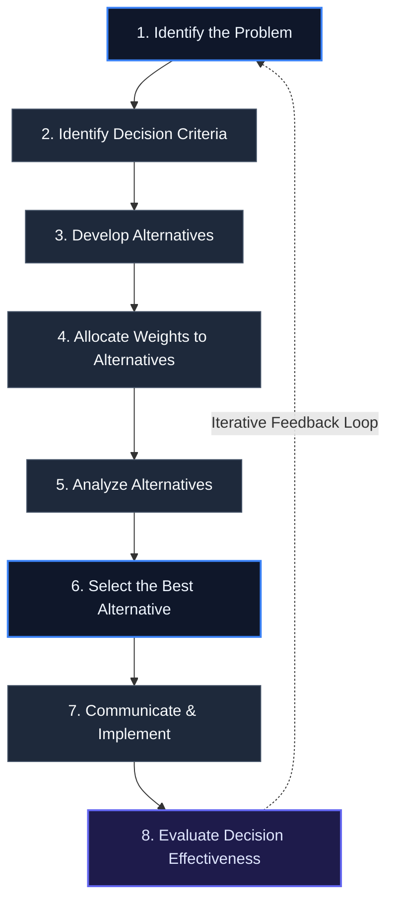

#### 2.6.1 Execution of the Eight Steps

1. **Identifying the Problem:** Define the gap between the existing situation and the desired state. Analyze the pressure to act and identify its source (e.g., senior management directives, external threats, market competition). Root-cause analysis is critical here: solving the wrong problem leads directly to operational failure.
2. **Identifying Decisional Criteria:** Establish the factors that will guide and limit the decision. These include deadline constraints, budgetary limits, required resources, skill dependencies, and the boundaries of the decision-maker's authority.
3. **Developing Alternatives:** Creatively generate multiple viable options to solve the problem. Critical thinking is vital here to ensure the focus remains on high-quality, practical alternatives that conform to the identified criteria and constraints.
4. **Allocating Weights to Alternatives:** Rank the alternatives against the decisional criteria. Since all criteria are rarely equal, weights must be allocated (e.g., prioritizing low cost over rapid deployment, or vice-versa) based on organizational goals.
5. **Analyzing the Alternatives:** Systematically evaluate each alternative against the weighted criteria. This step involves reviewing data, testing assumptions, and analyzing the operational trade-offs of each option.
6. **Selecting the Alternative:** Choose the alternative that maximizes effectiveness and best solves the problem. Be vigilant against cognitive biases or internal political pressures that could distort this selection. If multiple alternatives have nearly identical value, make a decision promptly and proceed.
7. **Communicating and Implementing the Alternative:** Share the chosen course of action with all key stakeholders and secure their commitment. Execution is the bridge between decision and results; even the most brilliant decision will fail if poorly implemented.
8. **Evaluating Decision Effectiveness:** Assess the real-world results to determine if the problem was actually solved. If the problem persists, review the process iteratively: Was the root problem misidentified? Was the information inaccurate? Were the alternatives weighted incorrectly? Adjust the course of action accordingly.

---

### 2.7 Group Decision-Making and Dysfunction

Group decision-making is a collective activity where multiple individuals interact to solve a common problem. While individual decision-making can be faster, involving a team allows managers to tap into diverse perspectives, varied educations, and rich experiences.

In some cases, organizations utilize **crowdsourcing**—distributing problem-solving by obtaining work, information, or opinions from a large, diverse group of people. While crowdsourcing can uncover highly innovative insights, it also carries the risk of introducing noise, irrelevant data, and collective cognitive biases.

Indeed, two heads are not always better than one. Group decision-making is highly vulnerable to systemic dysfunctions, most notably **Groupthink** and the **Abilene Paradox**.

#### 2.7.1 Groupthink

**Groupthink** occurs when a highly cohesive group's desire for harmony, conformity, and loyalty results in an irrational or dysfunctional decision-making outcome. To maintain group consensus and avoid conflict, members self-censor their doubts, ignore warning signs, and fail to critically evaluate opposing viewpoints.

> [!WARNING]
> **Symptoms of Groupthink in Security Settings:**
>
> - **Illusion of Invulnerability:** A dangerous collective belief that the team cannot fail, leading to excessive optimism and extreme risk-taking.
> - **Unquestioned Morality:** Assuming the group's goals are inherently good and ignoring the ethical or professional consequences of decisions.
> - **Collective Rationalization:** Discounting warnings or disconfirming data by rationalizing away contradictory evidence.
> - **Stereotyping Outsiders:** Dismissing external critics or competitors as too weak, stupid, or ill-informed to pose a threat.
> - **Self-Censorship:** Members suppressing their own doubts or misgivings to maintain the appearance of consensus.
> - **Illusion of Unanimity:** Falsely assuming that silence equals agreement and that everyone shares the same perspective.
> - **Direct Pressure on Dissenters:** Coercing members who raise objections to "get on board" and stop rocking the boat.

#### 2.7.2 The Abilene Paradox

The **Abilene Paradox** is a social phenomenon where a group collectively decides on a course of action that is counter to the actual preferences of _many or all_ of its individual members. It is driven by a severe breakdown in group communication and individual **action anxiety**—the fear of exclusion, separation, or negative feedback for voicing an unpopular opinion.

Members conjure "negative fantasies" of what might happen if they are honest, so they remain silent, falsely assuming that everyone else agrees with the plan. As a result, the group executes a decision that _nobody actually wanted_.

_Example:_ The events leading up to the Deepwater Horizon disaster in 2010 illustrated the Abilene Paradox. Multiple engineers and contractors harbored deep misgivings about cost-cutting measures and compromised safety redundancies. However, due to action anxiety and the false assumption that others possessed superior knowledge, they remained silent, leading to a catastrophic operational failure.

---

> [!WARNING]
> **Key Differences: Groupthink vs. The Abilene Paradox**
>
> - **In Groupthink:** Individual members genuinely support the group's decision. They have successfully rationalized the choice, feel good about the consensus, and are blind to the risks due to collective self-deception.
> - **In the Abilene Paradox:** Individual members _know_ the decision is flawed or wrong and consciously disagree with it. However, they act _against their own conscious wishes_ and remain silent due to fear of isolation, leading the group to make a choice that no single member actually supports.

---

#### 2.7.3 Avoiding Dysfunctional Group Decisions

To prevent Groupthink, the Abilene Paradox, and the "spiral of silence," security leaders and managers should implement the following strategies:

- **Challenge the Decisional Process:** Establish and enforce a rigorous, objective decision-making framework, and verify that the steps are followed rather than bypassed.
- **Balance Advocacy with Inquiry:** When presenting an alternative, active dialogue should be prioritized. Ask: _"What are the potential flaws?"_ and _"What is everyone else thinking?"_ rather than just pushing for acceptance.
- **Appoint a Devil's Advocate:** Formally designate a team member to challenge assumptions, point out risks, and voice unpopular truths. Rotate this role to prevent the advocate from being socially marginalized.
- **Encourage Dissent and Intellectual Freedom:** Create a psychological safety zone where taking unpopular positions is welcomed and protected. Discourage the sentiment of _"you are either with us or against us."_
- **Implement Impartial Leadership:** Effective leaders must remain objective and neutral early in the process. Avoid expressing personal preferences or predetermined solutions at the start of a meeting, which can create a self-fulfilling prophecy or pressure members to conform.
- **Gather Input Individually:** Conduct one-on-one check-ins. People are far more candid in private, individual settings because they do not fear peer judgment or alienation.
- **Leverage Outside Experts:** Invite independent, external specialists to review plans and provide objective, unbiased feedback.

In this way, making decisions is more art than science.

### 2.8 Big Data and Decision-Making

> [!IMPORTANT]
> **Definition:** **Big Data** refers to the vast, rapidly growing volume of structured and unstructured, quantifiable data that can be processed and analyzed using highly sophisticated algorithms and computing systems.

Organizations have long demanded data-driven decisions, employing everything from basic comparative analysis to advanced mathematical formulas to guide choice. However, the volume, velocity, and variety of data have grown exponentially, raising the bar for the quality of organizational decisions and the capabilities of decision-makers.

While a wide variety of information is easily accessible via modern internet search engines, not all data is created equal. Using sophisticated statistical analysis tools—such as multiple regression—still requires human decision-makers to select independent variables and interpret their practical meaning.

The collection and use of Big Data is sometimes criticized as merely a modern iteration of Frederick Taylor's scientific management, presenting a risk when organizations attempt to use it to entirely supplant human decision-makers.

Big Data analysis has immense value, but its utility depends heavily on whether the problem at hand is structured or unstructured:

- **For Structured Problems:** Big Data can rapidly identify patterns, automate routine choices, and optimize outcomes.
- **For Unstructured Problems:** Data alone is insufficient; these situations require deliberate critical thinking and qualitative judgment.

Ultimately, data collection is useless without effective analysis. Security and business leaders must remember that while Big Data is excellent at detecting statistical correlations, it does not explain _why_ those correlations exist or what they mean in a broader strategic context (Lohr 2012).

---

#### 2.8.1 Artificial Intelligence and Machine Learning

> [!IMPORTANT]
> **Definition:** **Artificial Intelligence (AI)** is the theory and development of computer systems capable of performing tasks that traditionally require human intelligence, such as visual perception, speech recognition, translation between languages, and complex decision-making.

The modern business environment is increasingly shaped by AI and machine learning (ML), which allow systems to make decisions faster and with higher precision. This rapid advancement raises the question of whether machine learning will eventually replace human decision-makers.

However, AI systems remain bounded by the knowledge, parameters, and historical data programmed into them by human developers.

> [!NOTE]
> **The Self-Driving Car Dilemma: Ethics in AI**
>
> The development of autonomous vehicles highlights the logical and ethical limits of AI decision-making. Developers must program the technology to handle split-second, critical decisions:
>
> - If a crash is imminent, should the car hit an object in the street or swerve to hit something else?
> - How does the system calculate "least harm" when choosing between hitting a pedestrian, colliding with a barricade, or swerving into oncoming traffic?
>
> The technology must mimic the split-second decisions a human driver would make, but a human's actions are shaped by real-time experience, panic, and individual skills (which vary drastically between a novice teenager and a professional race car driver). Crucially, the AI's "ethics" are pre-defined by the programmers who write the code and input the data.

Suggesting that all decision-making will automatically improve with AI and machine learning fails to account for the highly dynamic, unpredictable nature of the external environment. Just like human decision-makers, artificial intelligence operates under its own structural limits.

---

### 2.9 Chapter Summary

Decision-making is a multi-dimensional activity influenced by a wide array of cognitive, environmental, and structural factors. The interactions among these elements are summarized in the framework below:

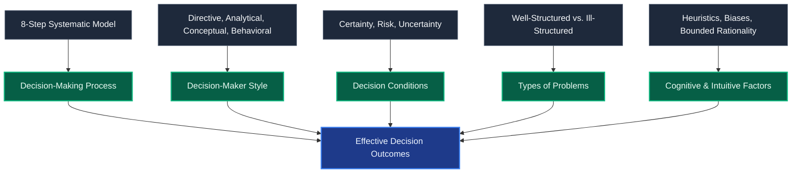

_Figure 2.2: Factors Involved in Decision-Making_

No cognitive problem is more prevalent or potentially catastrophic than **overconfidence bias**. Research consistently demonstrates that whether decision-makers rely on professional expertise or avoid systematic processes, they tend to be far too optimistic about their own choices.

Studies show that when individuals are 65% to 75% confident they are correct, they are actually correct less than half the time. Even when they claim to be 100% sure, they are only correct about 80% of the time (Campbell, Whitehead, and Finkelstein 2009).

In today's fast-paced business environment, rapid decisions are highly valued. However, while a "fast and frugal" heuristic approach may be efficient for daily tasks, critical issues require a logical, reflective critical thinking process to ensure that decisions actually solve the underlying problem.

### Key Chapter Takeaways

1. **Critical Thinking is Mandatory:** Because complex problems rarely yield simple solutions, critical thinking is essential. It provides a structured, logical process for gathering evidence, testing assumptions, and arriving at highly justifiable conclusions.
2. **Context is Dynamic:** The environment in which decisions are made is ever-changing. Timeliness in decision-making often outweighs absolute perfection; being "on time with good" is far superior to being "late with great." Because decisions exist to mobilize action, effective communication and execution are essential.
3. **Learn from Mistakes:** Inevitably, some decisions will fail due to unforeseen environmental shifts or cognitive blind spots. Successful security professionals must maintain the humility to listen, learn, and iteratively adjust their course of action.

### Appendix 2A: Case Studies

As the business world has become increasingly complex, it serves as a powerful learning laboratory. Business schools have long recognized the value of case studies; they are standard pedagogical tools across MBA programs used to dissect the strategies, actions, and competitive environments of real-world enterprises.

Case studies present compressed versions of actual management problems and operational scenarios. They offer an excellent method for developing new cognitive skills, improving qualitative analysis, and sharpening problem-solving and decision-making capabilities.

While case studies are usually candid in their discussions of the companies and individuals involved, they occasionally incorporate fictionalized elements. This protects the anonymity of the participants and organizations while maximizing the educational value of the material.

---

### Capstone Case Study: Strategic Decision-Making for a Global CSO

**A Strategic Leadership Case Study Created for the Executive Security Leadership Program**

#### The Scenario

You have recently been hired as the new Vice President and Chief Security Officer (CSO) for a global pharmaceutical firm. This is a newly created executive position reporting directly to the Chief Executive Officer.

During your first week on the job, you meet with the CEO, who requests that you formally evaluate the corporation's enterprise-wide security efforts. She immediately highlights the core structural challenge: various executives heading the individual lines of business (LOBs) have fiercely resisted a centralized corporate security program. They prefer the flexibility of directly budgeting for and managing their own security personnel and local issues.

Under this decentralized framework, corporate security staffing, policy, technology systems, and high-level programs are the responsibility of the corporate CSO. However, the funding for field security positions and the direct management of local security operations are controlled by the respective lines of business. Consequently, field security managers have only a dotted-line reporting relationship to you as the corporate CSO, while maintaining a solid-line operational report to their LOB heads.

The CEO notes that this decentralized structure is understandable—LOB executives want total control over any factor affecting their business unit's profitability. However, she also acknowledges that past security incidents have been handled poorly, largely due to a lack of consistent execution and an inadequate commitment of time and resources.

The CEO tells you that things must change. She instructs you to begin a comprehensive, enterprise-wide security evaluation immediately and return to her with strategic recommendations as soon as possible.

#### C-Suite Reality Check

Upon leaving the CEO's office, you consult with the Chief Legal Counsel, a key ally who supported your candidacy. He warns you that given the firm's history of security failures, this evaluation is a major, high-stakes test of your critical thinking and strategic capability. He cautions you to be thorough, noting that you will be expected to personally fix the deficiencies you uncover. He leaves you with a stark welcome: _"Welcome to the C-suite. It will not get any easier."_

This conversation is a powerful reminder that you are now operating at a much higher executive level. In contrast to your previous security role at a smaller firm with lower revenues and fewer assets, this global corporate context is highly complex. You recognize that the tactical approaches that worked in your past job will not succeed in this new environment.

#### The Investigation Findings

As you conduct your comprehensive security audit, you uncover a deeply troubling series of operational, financial, and strategic issues:

- **Uncoordinated Corporate Growth:** The corporation has grown aggressively through mergers and acquisitions (M&A)—a strategy that is actively continuing. However, corporate security has not kept pace with the associated rise in global business risks.
- **Vendor & Budget Inefficiencies:** An early assessment of security technology and vendor services reveals spotty supplier performance, poor quality, and inflated costs.
- **Exclusion from Strategic M&A due diligence:** Corporate security is entirely excluded from the due diligence process for evaluating potential mergers and acquisitions.
- **Intellectual Property (IP) Theft & Espionage:** The firm's competitive advantage relies on cutting-edge research and development (R&D) to produce novel, proprietary drugs. Currently, several high-value compounds are undergoing clinical trials for regulatory approval. You identify immediate vulnerabilities to corporate espionage and IP theft.
- **Competitor Precedent:** You learn that a chief competitor recently suffered a massive industrial espionage breach. Due to a poorly managed internal investigation, the breach resulted in a high-profile lawsuit, a public relations disaster, a collapsing stock price, and the termination of the CEO, the CSO, and several senior executives.
- **Active Extremist & Criminal Threats:** Animal rights activist groups in the United States and Europe have threatened violence against the firm's laboratories, alleging animal abuse in R&D. Concurrently, organized crime syndicates in Asia are manufacturing counterfeit copycat versions of your proprietary drugs, posing severe risks to revenue, brand reputation, and corporate legal liability.
- **Incompatible Crisis & Continuity Plans:** The firm's business continuity and crisis management plans are fragmented, incomplete, and highly incompatible across divisions. This is a critical vulnerability given the firm's recent operational history:

### 📋 Historical Corporate Security Crises

| Location / Facility                        | Incident Description                                                           | Organizational & Legal Impact                                                 |
| :----------------------------------------- | :----------------------------------------------------------------------------- | :---------------------------------------------------------------------------- |
| **R&D Facility** _(Eastern Europe)_        | Non-fatal bombing attack.                                                      | Physical damage, heightened employee fear, and operational disruption.        |
| **Production Facility** _(Western Europe)_ | Facility shutdown due to product contamination of unknown origin.              | Immediate supply chain disruption, financial losses, and product recall risk. |
| **Manufacturing Plant** _(South America)_  | Outbreak of violence arising from severe labor unrest.                         | Employee injuries, negative union relations, and operational downtime.        |
| **Distribution Center** _(United States)_  | Workplace violence incident; a former employee shot and killed his supervisor. | Active negligent security lawsuit filed against the corporation.              |

- **Dysfunctional Internal Relationships:** Past attempts to establish a coordinated security program failed due to a severe lack of organizational support. The former head of security was highly dictatorial, preferring to command others rather than enlist their support. His frequent, toxic arguments with HR, Legal, Public Affairs, R&D, Finance, and Operations led to his departure and left lingering animosity that continues to impair security's integration.
- **Operational Performance Discrepancies:** Field security staff consist primarily of former military or law enforcement personnel. Internal rumors suggest they treat their roles as easy, high-paying jobs to supplement their retirement pensions. However, their official performance files are filled with glowing reviews and consistent annual merit salary increases, presenting a major discrepancy.
- **Functional Credibility Gap:** The security department suffers from a severe credibility gap. In the midst of tough economic conditions, senior management is poised to openly question the value of security and threaten its resource allocations if changes are not made immediately.

You realize that the uncoordinated, ineffective security program poses an active, serious threat to the corporation, its stakeholders, and your own professional survival.

---

### Questions for Analysis

1. **Internal Challenges:** What specific organizational, structural, and cultural challenges does the new CSO face internally?
2. **External Threats:** What specific security, regulatory, and competitive threats does the CSO face in the external global environment?
3. **Strategic Options:** What strategic options does the CSO have to bridge the credibility gap and resolve the decentralized solid-line/dotted-line reporting conflicts?
4. **Action Recommendations:** What concrete, prioritized action plans should the CSO recommend to the CEO, and how can critical thinking be used to justify the resources required to implement them?

## Chapter 3: What Strategy Is and Why It’s Important

> “The underlying principles of strategy are enduring, regardless of disruptions from the advancement of technology or the pace of change in the environment.”
> — _Michael Porter_

While every company has its operational flaws, the best-managed organizations look at how they can best serve their **stakeholders**, not just their **shareholders**.

This is a critical distinction that modern enterprises are increasingly embracing. Shareholders hold financial equity in the company, whereas stakeholders represent an expanded audience—any party with an active interest or role in the company's operations, success, or impact.

> [!NOTE]
> **Who are Stakeholders?**
> Stakeholders include shareholders, employees, suppliers, customers, the local communities in which the business operates, regulatory bodies, and business associations.

Today's best-managed companies, ranging from legacy corporate giants to nimble technology firms, are exceptionally good at balancing competing priorities and navigating complex challenges. This success is not born of luck; rather, it is the result of leaders capable of crafting robust strategies to achieve stated objectives, coupled with a cultural willingness to adapt those strategies as the external environment changes.

To consistently align actions with long-term success, companies must actively address several key questions:

- What do our consumers want, and how can we attract them?
- How is our industry likely to evolve based on external macro-environmental forces?
- What strategic actions should we take, and what resources do we need to execute them?
- How can we develop sustainable competitive advantages to outperform our rivals?
- Most importantly, how can we grow the business responsibly?

Although a company's survival and prosperity depend directly on choosing and implementing a viable strategy, without a disciplined **strategic management process**, organizations will struggle to achieve alignment, leading to disjointed, tactical efforts that waste valuable resources.

---

### 3.1 The Concept of Strategy

The concept of **strategy** has historical military roots, fundamentally centered on analyzing a competitive situation and developing an appropriate, high-level response.

In a business context, a strategy is a goal-oriented set of plans and actions that enable an enterprise to compete effectively. Leading strategists define it as:

- _“A theory about how to gain competitive advantage.”_ (Barney and Hesterly 2015)
- _“A set of actions that a firm's managers take in order to outperform the competition.”_ (Thompson, Peteraf, Gamble, and Strickland 2016)

Ultimately, a strategy is an **action plan** designed to guide the firm toward its intended market position, attract customers, achieve financial and market targets, and drive the organization toward its stated goals.

#### 3.1.1 Strategy vs. Tactics

Managers and functional leaders frequently confuse strategy with tactics. In the classic military analogy:

- **Strategy** is the overarching plan to achieve the ultimate goal (e.g., _“taking the hill”_).
- **Tactics** are the specific, adaptive operational actions taken on the ground during the effort to execute the strategy (e.g., utilizing smoke grenades, flanking a specific coordinate).

This distinction is critical for security professionals. Senior executives expect functional leaders to present robust strategies, yet CSOs often respond with a list of operational tactics.

> [!IMPORTANT]
> **Tactical Actions vs. Strategic Alignment**
> If the security department is asked for a strategy to prevent workplace violence, presenting a list containing a new access control system, a revised background check policy, or employee training represents a collection of **tactics**.
>
> These tactics only become a **strategy** when they are integrated into a coordinated plan that:
>
> 1. Offers a clear purpose, direction, and measurable goals.
> 2. Identifies specific organizational roles, resources, and accountabilities.
> 3. Outlines the precise methods of execution and real-time decision-making.
> 4. Directly supports and aligns with the broader organizational and business goals.

#### 3.1.2 The Role of Budgeting

Confusion also arises when management refers to the annual budgeting process as a "strategic planning process." This is incorrect. Budgeting is an operational planning task.

It enters the realm of strategy only when it serves as the mechanism to allocate resources to functional areas based on established, long-term strategic objectives. In the proper order of operations:

1. Craft the **strategy** based on long-term goals.
2. Establish the **objectives** required to realize the strategy.
3. Develop and approve the **budget** to fund the resource commitments necessary to execute those strategies.

As _The Economist_ famously observed: _“In business, strategy is king. While leadership, management, luck, and overall hard work by all members of the firm are essential, it is strategy that makes or breaks a firm.”_

Long-term corporate success requires a well-crafted, well-executed, and constantly evolving strategy. Developing and executing this strategy is a core management function, and it is the most reliable path to turning a company into a standout market performer.

---

### 3.2 Strategy Is About Competing Differently

A business strategy stands a much higher chance of succeeding when it appeals to customers in ways that set the company apart from its rivals, allowing it to carve out a distinct market position.

A viable strategy must provide clear guidance on **what the company should and should not do**. Knowing what _not_ to do is just as important as knowing what to do; pursuing the wrong strategic paths leads directly to operational distraction, organizational confusion, and wasted capital.

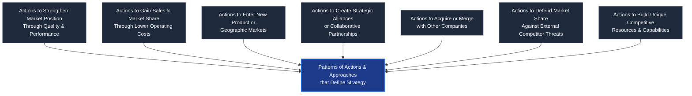

_Figure 3.2: Broad Patterns of Action That Characterize an Enterprise Strategy (Adapted from Thompson, Peteraf, et al. 2016)_

#### 3.2.1 Functional Strategic Alignment

Security's role in the strategic management process is not to dictate the company's overall operating strategy—that is the responsibility of the executive committee.

Rather, functional leaders (such as the CSO) must ensure their department's strategies, objectives, and goals are strictly **aligned** with the parent company's direction.

> [!WARNING]
> **The Cost of Strategic Exclusion**
> If an executive committee decides to enter new international markets as part of a global growth strategy, but fails to involve security in the due diligence planning, it represents a catastrophic gap.
>
> Security must be engaged early to evaluate regional geopolitical, physical, and cyber risks. If the expansion subsequently fails due to an unmitigated threat, the failure lies not with the security department, but with management's failure to integrate security into the strategic planning process.

Sustainable business success is about making executive commitments to well-considered, distinctive competitive choices. Some firms choose to compete by achieving lower costs than rivals, while others focus on superior product differentiation, narrow market niches, or broad global presence. The best-managed companies are those that couple a sound strategy with stellar execution: _it is far better to have a good strategy executed exceptionally well than a great strategy executed poorly._

---

### 3.3 The Strategy Quiz

To evaluate how well an organization understands the nature of strategic planning, consider the following diagnostic quiz (Hiam 1990).

#### True or False:

1. _Employees understand that the strategy is the basis for evaluating future opportunities._
2. _Strategy is developed independently of long-range planning._
3. _Strategy determines plans and guides resource allocation._
4. _Strategy is based on analysis and assumptions, not rigid plans._
5. _Each business function has its own strategies._
6. _Each business function's strategies are consistent with the larger organizational strategy._

**The Answers:**
**YES (True)** to all of them. In practice, however, senior executives and functional managers are all too often unclear on these basic principles, leading to fragmented efforts that fail to achieve organizational alignment.

---

### 3.4 Vision, Mission, Values, and the Strategic Management Process

The selection of strategies is an executive decision-making process. Because the market is dynamic, strategy must be built upon a robust set of assumptions and hypotheses about how competitive conditions will evolve and how rivals will react.

If these assumptions are flawed, the strategy will fail. Developing successful strategies requires far more than raw intuition or a "good dartboard"; it requires a disciplined, engaging **strategic management process**.

> [!IMPORTANT]
> **Definition:** The **Strategic Management Process** is a sequential set of analyses and decisional choices centered around a set of plans and actions designed to create a sustainable competitive advantage.

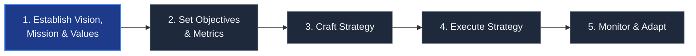

#### 3.4.1 The Five Tasks of the Strategic Management Process

1. **Establishing a Strategic Vision, Mission, and Core Values:** Defining the long-term direction, present business identity, and behavioral principles of the firm.
2. **Setting Objectives:** Creating specific, measurable performance targets to track progress.
3. **Crafting a Strategy:** Designing the plans and actions required to achieve the objectives and move the firm along its strategic course.
4. **Executing the Strategy:** Implementing the chosen strategy efficiently (minimizing time and cost) and effectively (optimizing outcomes).
5. **Monitoring, Evaluating, and Adapting:** Constantly assessing performance and environmental developments, and initiating corrective adjustments as needed.

Understanding this framework is essential for security professionals seeking to operate as valued corporate partners. Functional leaders must understand where the company is going in order to align their departmental strategies accordingly.

#### 3.4.2 The Vision Statement

A **strategic vision** portrays management's long-term aspirations for the firm, charting its future course and direction.

A sound vision statement must be business-specific, distinct, and communicated clearly to inspire commitment, motivate employees, and align internal and external stakeholders.

_Examples of successful corporate visions:_

- **Johnson & Johnson:** _“For all employees to draw on their unique experiences and backgrounds together to spark solutions that create a better, healthier world.”_
- **Amazon:** _“To be Earth’s most customer-centric company, where customers can find and discover anything they might want to buy online.”_

As Thompson, Peteraf, et al. (2016) noted, a well-communicated strategic vision:

- Crystallizes senior executives' own views about the firm's long-term direction.
- Reduces the risk of rudderless executive decision-making.
- Wins the active support of employees to make the vision a reality.
- Provides a beacon for functional managers in setting departmental objectives.
- Proactively prepares the organization for the future.

#### 3.4.3 The Mission Statement

While a strategic vision focuses on the future ("where we are going"), a **mission statement** describes the scope, purpose, and identity of the present business ("who we are, what we do, and why we are here").

A mission statement should describe the firm's business activities rather than focusing on profit, which is an objective, not a mission. A strong mission statement should:

- Identify the company's core products or services.
- Specify the buyer needs the firm seeks to satisfy.
- Identify the target customer groups and geographic markets it serves.
- Set the firm apart from its industry rivals.
- Clarify the company's business intent to all stakeholders.

_Example:_ **PepsiCo’s Mission Statement:**
_“It is the company’s intention of serving as a premier international brand and offering consumers convenient snacks and beverages. Pepsi strives for honesty and fairness in its interactions with consumers and investors and looks to deliver value and quality.”_

#### 3.4.4 The Values Statement

A company's **values** reflect management's core beliefs and the organization's culture. They are the beliefs, traits, and behavioral norms that employees are expected to display in conducting the firm's daily business.

_Example:_ **Walmart's Core Values:**
Walmart's vision (_“be the destination for customers to save money”_) and mission (_“to save people money so they can live better”_) are grounded in four core values: _Service to the Customer, Respect for the Individual, Strive for Excellence, and Act with Integrity_. These values dictate daily associate behaviors, drive business results, and support a cohesive culture of inclusion.

> [!WARNING]
> **When Values Conflict with Economic Realities: The Ben & Jerry's Case**
> While corporate values reflect a firm's culture, they must align with economic realities to prevent operational failure.
>
> In the 1990s, Ben & Jerry’s Ice Cream (B&J) sought to uphold strict standards of social justice and high product quality. However, they instituted a rigid compensation policy that capped executive pay based on a tight ratio relative to the lowest-paid worker, completely ignoring standard market rates for education and experience.
>
> This policy made it impossible to attract and retain qualified executive talent, leading to critical vacancies and operational inefficiencies. Additionally, B&J tried to force the same payment ratios onto their third-party suppliers, which damaged relations and severely disrupted their supply chain. These higher operating costs severely eroded profitability, leading to the company's decline and ultimate acquisition by Unilever in 2001.
>
> After the acquisition, Unilever maintained B&J's core social values but eliminated the unviable salary ratio caps, streamlined management, and integrated B&J into its global supply chain. This successfully restored the company's operational efficiency and profitability.

---

### 3.5 Objectives and Goals

In strategic planning, **objectives** and **goals** are distinct but highly interconnected concepts:

- **Goal:** The ultimate, desired long-term outcome or target state the organization seeks to achieve.
- **Objectives:** Specific, quantifiable, and time-bound milestones or measures of progress used to evaluate if the organization is successfully moving toward its goal.

> [!IMPORTANT]
> **Core Principle:** While a firm's vision, mission, and core values are broad, subjective, and aspirational, its objectives must be **specific, measurable, and tracked over time** to gauge strategic performance.

Objectives can be categorized by their timeframes:

- **Short-Term Targets:** Tactical, near-term milestones (e.g., quarterly) designed to focus operational efforts.
- **Long-Term Targets:** Strategic targets (typically one to three years) firmly connected to the mission.

#### 3.5.1 The Top-Down Nature of Objective-Setting

Setting objectives is a top-down process that begins at the senior management level and cascades down through separate business units, product lines, functional departments, and individual operating teams.

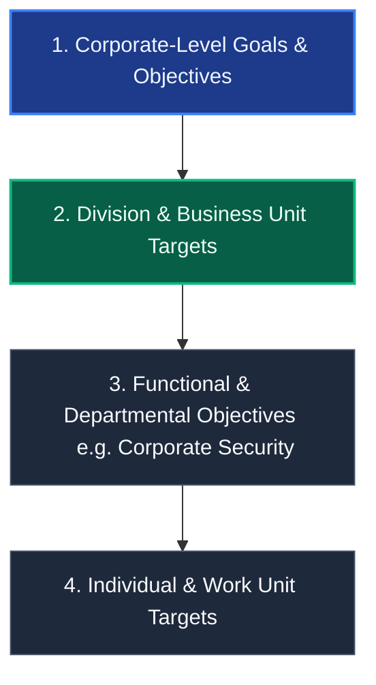

To drive high organizational performance, senior management frequently establishes **"stretch" objectives**—targets that are challenging but realistic and achievable. This process requires employees to be highly inventive, increases the urgency to improve competitive standing, and prevents organizational complacency or satisfaction with average performance.

#### 3.5.2 Functional Capabilities & Communication

Stretch objectives must align with the distinct capabilities of each function. If objectives are created in isolation, they can create operational friction and directly conflict with other business units. This highlights the absolute necessity of proactive, cross-functional communication.

> [!WARNING]
> **Case Study: Geographically Conflicting Corporate Objectives**
>
> In a large company, the security department established a strategic objective to investigate all employee-involved crimes, with the goal of terminating and prosecuting offenders. Shortly after, the security director noted a sharp rise in workplace criminal assaults, ranging from physical battery to sexual harassment.
>
> Security conducted a collaborative investigation with HR, the Legal department, and Operations. The inquiry revealed that the HR department, in coordination with the Tax unit, had launched a lucrative hiring initiative to recruit ex-convicts recently released from prison. The government provided the company a significant tax credit for doing so.
>
> While HR met its objective of lowering hiring costs and claiming tax benefits, it did so without consulting security to establish screening procedures. This oversight introduced violent offenders into the workplace, putting employees at risk and exposing the company to massive negligent security liability.
>
> Once the conflict was identified, the program was immediately revised to exclude applicants with records of violent crime. Consequently, violent incidents decreased. This real-world scenario demonstrates the critical need for interdepartmental communication to ensure the objectives of one unit do not create severe liabilities or compromise core values elsewhere.

#### 3.5.3 Strategic vs. Financial Objectives

Organizations track both financial and strategic performance metrics, but they differ in their predictive value:

- **Financial Objectives (Lagging Indicators):** Metrics such as quarterly revenue growth, profit margins, and return on investment (ROI). These are lagging indicators that reflect the outcomes of past strategic choices.
- **Strategic Objectives (Leading Indicators):** Metrics such as market share, brand strength, technological capability, and product quality. These are leading indicators that signal a firm's growing competitiveness and long-term capability to deliver future financial success.

---

### 3.6 SWOT Analysis: The Key to Environmental Alignment

To craft a strategy that bridges the gap between the firm's capabilities and its competitive context, managers conduct a situational analysis of the external and internal environments. The primary framework used for this is the **SWOT Analysis**.

> [!IMPORTANT]
> **Definition:** A **SWOT Analysis** is a context-dependent, point-in-time planning tool used to evaluate the internal **Strengths** and **Weaknesses** of an organization alongside the external **Opportunities** and **Threats** present in its competitive environment.

```mermaid
grid-layout
    [Internal Strengths] [External Opportunities]
    [Internal Weaknesses] [External Threats]
```

_Note: Strengths and Weaknesses are internal factors controlled by the organization. Opportunities and Threats are external factors driven by the macro-environment and are beyond the organization's direct control._

#### 3.6.1 The Four SWOT Components

##### Internal Strengths

Positive tangible and intangible attributes, capabilities, and resources controlled by the organization that provide a competitive advantage.

- _Examples:_ Core competencies in critical functional areas, high employee education and specialized skills, proprietary differentiated products, exceptional brand reputation, strong balance sheet, robust supply chain, and strategic alliances or JVs.

##### Internal Weaknesses

Controllable internal characteristics, resource deficiencies, or organizational constraints that place the firm at a competitive disadvantage.

- _Examples:_ Organizational dysfunction (high turnover, low morale), misaligned resources, narrow product line, weak brand image, limited customer base, weak balance sheet, lack of management depth, and under-utilized manufacturing capacity.

##### External Opportunities

Attractive external macro-environmental trends, changes, or openings that the firm can actively exploit to enhance profitability and growth.

- _Examples:_ Uncapped demand in new geographic markets, emerging consumer trends, openings to gain market share from struggling rivals, technological breakthroughs, attractive firms for acquisition, and favorable regulatory shifts.

##### External Threats

Uncontrollable external macro-environmental elements, competitive actions, or trends that jeopardize the firm's profitability, viability, or survival.

- _Examples:_ Intense competitor actions, slowdown in market growth, new industry entrants, substitute products, rising bargaining power of buyers/suppliers, costly new regulations (e.g., Sarbanes-Oxley), adverse demographic shifts, and unfavorable forces (war, pandemics, terrorism, war).

---

### SWOT Diagnostic Framework

| SWOT Component               | Core Strategic Focus                              | Actionable Response                                       |
| :--------------------------- | :------------------------------------------------ | :-------------------------------------------------------- |
| **Strengths** (Internal)     | Core organizational assets and competencies.      | Leverage as the foundational basis for strategy.          |
| **Weaknesses** (Internal)    | Internal deficiencies and structural constraints. | Correct or mitigate to prevent competitive vulnerability. |
| **Opportunities** (External) | Favorable market trends and emerging niches.      | Exploit proactively by aligning with internal strengths.  |
| **Threats** (External)       | Geopolitical, economic, and competitor risks.     | Address through risk mitigation and strategic adaptation. |

---

#### 3.6.2 SWOT Best Practices: Do's and Don'ts

##### Do:

- **Be rigorously analytical:** Back assumptions with objective data; avoid relying on gut feeling.
- **Think both inside and outside the box:** Analyze cross-functional and geopolitical interdependencies.
- **Choose the right participants:** Include diverse operational leaders, not just a small executive circle.
- **Recognize the context:** Remember that SWOT is a point-in-time perspective; an analysis done six months ago is obsolete today because macro conditions shift.

##### Don't:

- **Don't try to disguise weaknesses:** Admitting internal gaps is the only way to correct them.
- **Don't ignore the uncontrollable:** Remember that external threats require strategic adaptation, not denial.
- **Don't exclude dissenting voices:** Do not exclude stakeholders who challenge your thinking; this triggers confirmation bias.
- **Don't use SWOT as a blame exercise:** Keep the focus strictly on objective organizational performance.

For security professionals, SWOT is an invaluable tool when developing security department strategies, brainstorming with operating teams, or evaluating a new professional position.

---

### 3.7 Crafting and Executing a Strategy

Developing or crafting strategy is a sequential process. To create a competitively effective strategy, management must make logical decisions that address a series of **"Strategic Hows"**:

- How to position the firm in the marketplace?
- How to attract and retain customers?
- How to compete against industry rivals?
- How to capitalize on emerging growth opportunities?
- How to achieve the firm's performance and financial targets?
- How to adapt to changing macro-environmental and market conditions?

#### 3.7.1 The Hierarchy of Strategy

In any large enterprise, strategy is divided into three distinct levels:

1. **Corporate-Level Strategy:** Big-picture decisions that affect the entire multi-business organization. It dictates what industries to enter, how to enter them (e.g., acquisitions, internal startups, alliances), and how to allocate corporate resources across business units to manage growth, stability, and renewal.
2. **Business-Level Strategy:** Actions taken by a single business unit to gain competitiveness in its specific industry. These generally fall into two broad approaches:
   - **Cost Leadership:** Structuring operations to achieve lower costs than rivals while maintaining standard quality (e.g., Walmart, McDonald's).
   - **Differentiation:** Investing in unique, premium features to charge a price premium (e.g., Apple, BMW, Nordstrom).
3. **Functional-Level Strategy:** Plans to manage a specific activity (e.g., HR, Finance, Marketing, Security) to support the larger business-level strategy.

> [!IMPORTANT]
> **Comparative Advantage vs. Competitive Advantage**
> A single functional unit (like security) cannot create a **competitive advantage** for a firm; only the business in its entirety can achieve a competitive advantage in the marketplace.
>
> However, when a functional department develops superior internal systems that enhance business profitability (e.g., drastically reducing losses or liabilities at a lower operating cost), it creates a **comparative advantage** for the company. This is the ultimate strategic goal for security leaders.

> [!NOTE]
> **Operational Integration: Access Control at a Manufacturing Plant**
>
> Consider a manufacturing plant where an unauthorized individual bypassed a poorly secured checkpoint and assaulted an employee, exposing the firm to severe legal liability.
>
> Rather than proposing a single tactic, the security director developed a comprehensive functional strategy: upgrading access control hardware, implementing new visitor management SOPs, and optimizing security officer patrol routes.
>
> To secure funding, the CSO demonstrated how this functional strategy directly supported plant operations (minimizing downtime) while reducing overall corporate liability. This illustrates the art of crafting and selling a functional security strategy.

---

### 3.8 Strategy Implementation: The Ten Tasks of Execution

Selecting a strategy is meaningless without effective execution. Implementing strategy is a highly operational process that requires ten critical management tasks:

1. **Ensure Business-Wide Execution:** Mobilize all organizational units to align with the strategic goals.
2. **Staff the Organization:** Recruit and train personnel with the needed skills and capabilities.
3. **Strengthen Strategy-Supportive Resources:** Continually build and optimize competitive capabilities.
4. **Allocate Ample Resources:** Direct capital and operating budgets to critical strategic activities.
5. **Establish Supportive Policies:** Ensure operational policies and procedures facilitate execution rather than hindering it.
6. **Organize the Work Effort:** Structure the organization to maximize coordination and performance.
7. **Install Operating Systems:** Deploy robust information and operating systems that enable personnel to perform their duties.
8. **Motivate & Reward:** Tie incentives and rewards directly to the achievement of strategic objectives.
9. **Build a Conducive Culture:** Foster an internal corporate culture aligned with the strategy.
10. **Exert Strong Internal Leadership:** Provide active, objective leadership to propel the implementation forward.

---

### 3.9 The Evolution of Strategy: Intended vs. Emergent

Strategy is a living plan; it is never set in stone. As macro-environmental forces shift and competitors react, a firm's strategy must adapt. We categorize strategy into three states:

- **Intended Strategy:** The initial, planned strategy that managers designed and intended to pursue.
- **Emergent Strategy:** Unplanned strategic moves that develop in response to unexpected opportunities, threats, and competitor actions.
- **Realized Strategy:** The actual strategy a company ends up pursuing, representing a blend of intended and emergent strategies.

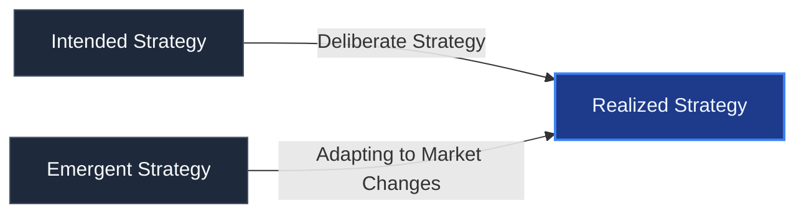

> [!NOTE]
> **Case Study: The Emergence of Johnson & Johnson's Consumer Business**
>
> Johnson & Johnson (J&J) originally operated strictly as a supplier of antiseptic gauze and medical plasters, with no consumer-facing business.
>
> Following doctor complaints that the adhesive plasters caused severe skin irritation, J&J began including a small tin of talcum powder with each plaster to soothe the skin. Soon, consumers began requesting the talcum powder as a standalone product. J&J adapted to this emergent opportunity, introducing "Johnson's Baby Powder."
>
> Decades later, when civil litigation alleged health risks associated with talcum, J&J adapted again, substituting cornstarch for talcum. J&J also introduced Band-Aids after a worker developed a convenient method for dressing minor cuts at home.
>
> This highlights that realized strategies are not the result of strategic planning failures; rather, they reflect management's ability to adapt and capture market opportunities as they emerge.

---

### 3.10 What Makes a Strategy a Winner: The Three Tests

To evaluate whether an enterprise or functional strategy works and can be classified as a winner, management must apply three rigorous tests:

1. **The Fitness Test:** How well does the strategy fit the company's situation? A winning strategy must exhibit a strong **external fit** (matching industry competitive conditions and market opportunities) and a robust **internal fit** (matching the company's unique resources and capabilities).
2. **The Competitiveness Test:** Is the strategy helping the company achieve a better competitive position? A winning strategy must yield a durable competitive benefit (or a functional comparative advantage) over rivals, leading to sustainable returns.
3. **The Performance Test:** Is the strategy producing superior company performance? Caliber is measured by two primary indicators: market standing (market share and rank) and financial strength (sustained profitability and capital growth).

---

### 3.11 Chapter Summary

A company's strategy represents its core business model—a theory of how to gain a sustainable competitive advantage. This theory is built on assumptions and hypotheses about how industry competition will evolve. When these assumptions align with reality, the strategy generates success.

Organizations select strategies via the **strategic management process**. This process is a set of analyses and decisions that increase the likelihood of choosing a "good enough" (**satisficing**) strategy that drives profitability and market standing.

The process begins by defining a strategic vision, mission, and core values. While the vision and mission define long-term purpose, **objectives and goals** provide the specific, measurable milestones used to track performance.

At the core of the strategic management process is the **SWOT Analysis**, which allows firms to identify external threats and opportunities alongside internal strengths and weaknesses. Armed with this diagnosis, firms craft corporate-level strategies (mergers, acquisitions, alliances), business-level strategies (cost leadership, differentiation), and functional-level strategies (HR, Finance, Security).

Implementing strategy requires a massive commitment of resources to establish supportive organizational structures, management systems, and target compensation programs. The ultimate goal of the strategic management process is to realize a better competitive position and produce **economic value**—the price a customer is willing to pay for a product or service that exceeds its cost of production.

## Chapter 4: Evaluating the External Environment

> "You can observe a lot by just watching."
> — _Yogi Berra_

To chart an enterprise's strategic course wisely, managers must first develop a deep, diagnostic understanding of the company's present situation. A comprehensive strategic assessment involves evaluating two distinct yet interrelated facets of a firm's business environment:

1. **The External Environment:** The broad macro-environment and the specific industry/competitive conditions in which the firm operates.
2. **The Internal Environment:** The firm's unique resources, organizational capabilities, and core competitiveness (discussed in Chapter 5).

An insightful diagnosis is a critical prerequisite for strategic decision-making. It enables managers to evaluate promising strategic options and business models, culminating in the selection of a strategy that achieves an optimal "fit" between the firm's internal capabilities and external realities.

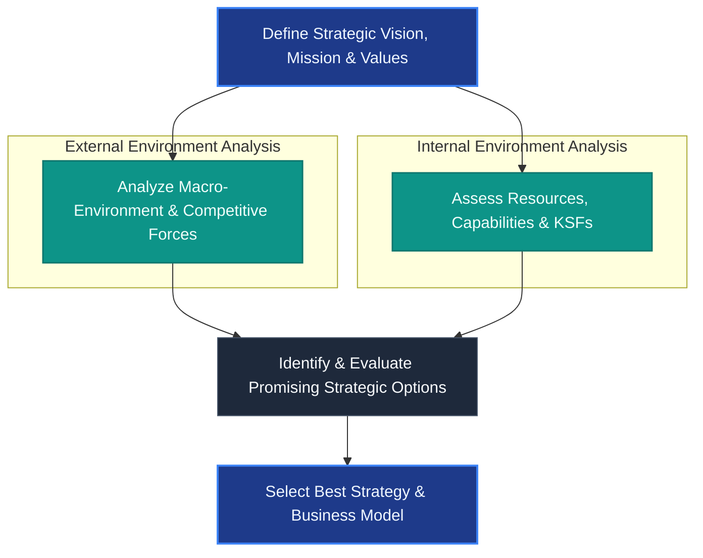

_Figure 4.1: From Thinking Strategically to Strategic Selection and Business Model Design (adapted)_

Consistent with the SWOT framework, creating adaptive strategies requires a granular understanding of the external environment's **opportunities** (positive trends that can improve performance) and **threats** (negative trends that could hinder it).

The external environment varies dynamically in its complexity and rate of change. Conducting a formal, data-driven external analysis enables managers to transition from a reactive posture to a proactive one. Research shows that firms conducting systematic external analyses consistently achieve superior financial performance, such as a higher Return on Assets (ROA) and stronger profitability (Barney and Hesterly 2015).

---

### 4.1 The Spectrum of External Competition

The nature of competition within an industry is inextricably linked to the severity of external threats. Economists view competition as a spectrum:

- **Perfect Competition:** Occurs when competitive threats are extremely high, barriers to entry are non-existent, products are identical commodities, and no single firm possesses market power. Profit margins in perfect competition are driven down to the cost of capital.
- **Monopoly:** Occurs when external competitive threats are extremely low or non-existent, barriers to entry are insurmountable, and a single firm dominates the market, possessing absolute pricing power.

Most industries operate in the broad space between these two extremes, characterized by monopolistic competition or oligopolies. Security is a unique profession because it operates in two ways:

1. **As an Internal Function:** Security departments exist within companies to proactively identify, manage, and mitigate risks to corporate assets, employees, and stakeholders.
2. **As a Commercial Industry:** Security companies sell proprietary security products, consulting services, and guarding solutions to clients, requiring them to analyze the market to capture opportunities and defeat threats.

---

### 4.2 The Macro-Environment: Six Principal Sectors

The **macro-environment** encompasses the broad, external context in which a company's industry is situated. These elements are strategically significant and can exert positive or negative influences on a firm, yet they are completely outside of the firm's direct control.

Analyzing the macro-environment requires flexible, adaptive thinking, recognizing that forecasts are hypotheses rather than facts. External analysis begins by evaluating the six principal sectors of the macro-environment.

#### 4.2.1 Economic Sector

The economic sector tracks the overall macroeconomic health, growth trends, and financial indicators of the countries or regions in which a firm operates. Economic conditions fluctuate over time through the **business cycle**, which consists of four distinct stages: **expansion**, **peak**, **contraction**, and **trough**.

When economic activity contracts and Gross Domestic Product (GDP) growth is negative for **two or more consecutive quarters**, the economy is officially in a **recession**. A severe, multi-year economic contraction can devolve into a **depression**.

> [!NOTE]
> **Measuring Economic Output: GDP vs. GNP**
>
> - **Gross Domestic Product (GDP):** A monetary measure of the market value of all finished goods and services produced within a country's geographical borders in a single year, by citizens and non-citizens alike.
> - **Gross National Product (GNP):** A monetary measure of all goods and services produced by a nation's citizens, including net overseas economic activities.
>
> _Historical Context:_ The United States officially transitioned from GNP to GDP in 1991 to standardize its economic comparisons with other nations. Today, the International Monetary Fund (IMF) and the vast majority of global economies use GDP as the primary metric of economic performance.

Key economic indicators that strategically affect business plans include:

- **Exchange Rates & Currency Value:** Shifts in currency values directly alter the cost of imported raw materials and the price competitiveness of exports.
- **Fiscal Policies:** Federal budget deficits or surpluses and tax structures (both corporate and individual rates).
- **Trade Balances:** Trade deficits or surpluses that influence global capital flows.
- **Consumer Metrics:** Consumer confidence levels, disposable income, and household debt burdens.
- **Labor Markets:** Employment and unemployment rates, which dictate labor costs and talent availability.

_Strategic Challenge:_ The primary challenge in analyzing the economic sector is obtaining reliable forecasting data and correctly interpreting its impact (e.g., _What does an interest rate hike mean for our capital projects? How will a dip in consumer confidence affect demand in our industry?_).

#### 4.2.2 Demographic Sector

Demographics refer to the distribution and characteristics of individuals in a society. Analyzing demographic data allows companies to determine the size, growth rate, and appeal of their potential customer bases.

Key demographic characteristics and trends that influence business strategies include:

- **Population Growth & Urbanization:** Expanding and urbanizing populations alter regional demand patterns.
- **Aging Populations:** The "graying" of the workforce and consumer base in developed countries creates significant shifts in healthcare, housing, and labor availability.
- **Gender & Workforce Participation:** The increasing representation of women in the professional workforce and higher education (e.g., women earning college degrees at higher rates than men).
- **Family Composition:** Delays in marriage and family formation, leading to declining birth rates.
- **Ethnic Diversity:** The rapid growth of minority populations (e.g., the Hispanic demographic in the United States), creating new market segments.
- **Health & Wellness Trends:** Rising education levels alongside critical public health challenges, such as increasing rates of obesity.

#### 4.2.3 Sociocultural Sector

The sociocultural sector encompasses a society's core values, beliefs, attitudes, lifestyles, and behavioral norms. These cultural factors define what is deemed right or wrong, fashionable or outdated, and acceptable or unacceptable.

When firms operate globally, they must carefully adapt to regional sociocultural realities. Key areas of sociocultural analysis include:

- **Lifestyles and Fashion:** Rapidly shifting consumer preferences (e.g., demand for organic foods, remote work preferences).
- **Social Values and Attitudes:** Ingrained societal beliefs regarding individual freedoms, work ethic, environmental sustainability, and gender equality.
- **Behavioral Patterns:** How families, communities, and demographic groups choose to spend their time, allocate their income, and raise their families.

_Strategic Value:_ Although sociocultural trends are often qualitative and difficult to measure precisely, failing to adapt to them can alienate customers and destroy brand equity.

#### 4.2.4 Political-Legal Sector

This sector includes the political forces, judicial decisions, statutory laws, and regulatory frameworks established by governments at all levels. These factors define the boundaries within which businesses must operate and vary widely across international jurisdictions.

For example:

- **The United States:** Characterized by strict antitrust enforcement, rigorous environmental protection laws, and financial transparency regulations (e.g., the Sarbanes-Oxley Act).
- **China:** Businesses operate under the direct oversight and pleasure of the state, where regulatory compliance is highly centralized and politically influenced.

Critical political-legal variables include:

- **Taxation Policies:** Corporate and individual tax rates, investment incentives, and tariffs.
- **Regulatory Oversight:** Specific industry regulations, occupational health and safety standards, and environmental mandates.
- **Intellectual Property Protection:** Patent, copyright, and trademark laws that safeguard innovation.
- **Trade Frameworks:** Bilateral or multilateral trade agreements (e.g., USMCA, EU, ASEAN) and the rules established by the World Trade Organization (WTO).

#### 4.2.5 Technological Sector

The technological sector is one of the fastest-growing and most disruptive forces in the macro-environment. It tracks scientific breakthroughs, technological innovations, and R&D pipelines that create massive opportunities while posing existential threats to legacy business models.

Key areas of technological disruption include:

- **Emerging Technologies:** Advances in Artificial Intelligence (AI), robotics, biotechnology, nanotechnology, and advanced medicine.
- **Process Innovations:** New manufacturing techniques, automation, and supply chain digitalization that drastically reduce operating costs.
- **Information Systems:** Cyber security infrastructure, cloud computing, and real-time data analytics.

Technological shifts routinely render old products obsolete while giving birth to entirely new industries, requiring constant strategic agility.

#### 4.2.6 International-Global Sector

The international-global sector captures the forces and developments that cross national boundaries, creating highly integrated global markets. This sector is extremely influential for multinational corporations.

Key global drivers include:

- **Globalization of Trade:** The continuous expansion of global trade and supply chains.
- **Macroeconomic Risks:** Currency exchange rate volatility, sovereign debt crises, and the emergence of fast-growing developing economies.
- **Geopolitical & Systemic Risks:** Geopolitical tensions, trade wars, local armed conflicts, international terrorism, pandemics, and global supply chain vulnerabilities.

Understanding these six sectors provides managers with the contextual background needed to identify external opportunities and anticipate macro-level threats.

---

### 4.3 Immediate Industry and Competitive Environment

While analyzing the macro-environment is essential, an enterprise's immediate industry and competitive environment exerts a much more direct, profound influence on its strategic success.

An **industry** is defined as a group of companies offering products or services that are close substitutes and compete for the same customer base. Diagnosing the industry's structural attractiveness requires a systematic framework to analyze the competitive pressures at play.

---

### 4.4 The Five Forces Framework

To understand an industry's competitive intensity and long-term profitability, strategy makers rely on Michael Porter's seminal **Five Forces Framework** (Porter 1990). The five forces model identifies and analyzes the primary competitive pressures that shape every industry, determining its structural strengths and weaknesses.

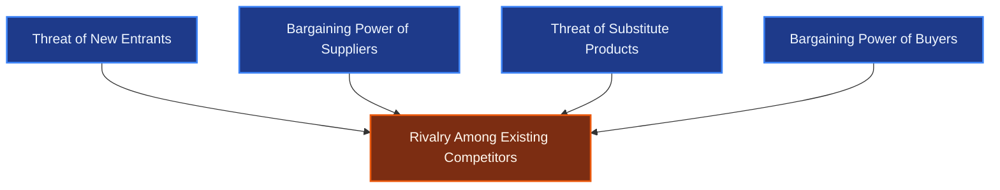

_Figure 4.2: Michael Porter's Five Forces Framework (adapted)_

Applying the Five Forces model to diagnose competitive pressures in an industry involves three systematic steps:

- **Step 1:** For each of the five forces, identify the specific parties involved, along with the concrete factors that generate competitive pressures.
- **Step 2:** Evaluate the intensity of the pressures stemming from each force (evaluating them as **strong**, **moderate**, or **weak**).
- **Step 3:** Determine whether the collective impact of the five forces is conducive to industry profitability.

Let us examine each of the five forces and the critical strategic factors that govern them.

#### 4.4.1 Force 1: Competitive Rivalry Among Industry Members

The strongest of the five competitive forces is almost always the competitive rivalry within the industry—the direct, head-to-head battle for sales and market share among existing competitors.

The intensity of rivalry is highly dynamic and increases under the following conditions:

- **Slow Industry Growth:** When buyer demand is stagnant or declining, firms can only grow by stealing market share from rivals. This triggers aggressive pricing discounts, sales promotions, and intense marketing campaigns.
- **Low Buyer Switching Costs:** The cheaper and easier it is for a customer to switch brands, the easier it is for competitors to lure customers away. Switching costs include monetary costs, time, inconvenience, and psychological friction.
- **Undifferentiated Products:** When competitors' offerings are virtually identical (commoditized), buyers have no brand loyalty and choose solely on the basis of price, leading to fierce price wars.
- **High Fixed or Storage Costs:** When fixed costs or inventory storage costs are high, firms are under immense pressure to operate at full capacity, leading to deep price concessions to clear inventory.
- **Equally Matched Competitors:** When competitors are numerous and relatively equal in size and capability, price-cutting is more common, and fear of devastating retaliation often keeps firms locked in a strategic stalemate.
- **High Exit Barriers:** When unprofitable firms face severe barriers to leaving the market (e.g., specialized assets that cannot be easily sold, high worker severance protections, or emotional commitment of owners), they remain in the industry, continuing to discount prices and depress industry profitability.

_Strategic Summary:_ When rivalry is **strong**, the battle for market share is so fierce that profit margins are squeezed across the industry. When rivalry is **moderate**, competition is healthy and allows well-managed companies to capture respectable margins. When rivalry is **weak**, competitors are satisfied with their growth, and there is minimal downward pressure on industry profitability.

#### 4.4.2 Force 2: Threat of Potential New Entrants

New entrants threaten incumbent firms because they introduce fresh production capacity, bid for market share, and can trigger price-cutting. The mere _threat_ of entry acts as a significant competitive force, often forcing incumbents to keep prices lower and invest in defensive strategies to deter potential entrants.

The seriousness of the entry threat depends on the **barriers to entry** established by incumbent firms and the expected retaliation from existing players. Barriers to entry are high, and the threat of new entry is low, under the following conditions:

- **Sizable Economies of Scale:** When incumbents enjoy massive cost advantages due to large-scale operations in production, distribution, or advertising, new entrants must either enter at a massive, highly risky scale or accept a permanent cost disadvantage.
- **Hard-to-Replicate Cost Advantages:** Incumbents possess proprietary cost advantages independent of scale, such as patents, proprietary technology, exclusive supplier partnerships, depreciated assets, or learning-curve cost savings accumulated from experience.
- **Strong Brand Loyalty and Preferences:** When buyers have strong emotional connections or loyalty to established brands, newcomers must spend heavily on marketing and promotions to overcome customer inertia.
- **High Customer Switching Costs:** High switching costs act as a natural barrier, requiring new entrants to offer deeply discounted prices or significant product improvements to convince customers to switch.
- **Network Effects:** In industries characterized by network effects (where the value of a product increases with the number of active users, such as operating systems or gaming consoles), it is incredibly difficult for new entrants to gain traction.
- **Restrictive Government Policies:** Regulatory requirements, licensing laws, and environmental standards can limit or completely block entry into specific sectors (e.g., banking, utilities, pharmaceuticals).

#### 4.4.3 Force 3: Threat of Substitute Products

Firms in one industry are in close competition with industries producing **substitute products**—products that perform the same or similar functions but belong to a different industry category (e.g., sugar substitutes vs. cane sugar; video conferencing vs. business travel).

The strength of the threat from substitutes depends on three main factors:

- **Price-Performance Trade-off:** The threat is high if good substitutes are readily available, attractively priced, and equal to or better than the industry's product in terms of quality, performance, and reliability. This places a firm ceiling on what industry players can charge.
- **Low Switching Costs:** If the cost to switch to the substitute is minimal (e.g., switching from coffee to tea), the competitive pressure is intense.
- **Buyer Propensity to Substitute:** The willingness of consumers to switch, which is influenced by sociocultural attitudes, convenience, and awareness.

_Strategic Action:_ To counter the threat of substitutes, companies must continuously innovate to improve product features, lower manufacturing costs, or differentiate their offerings to justify a premium price.

#### 4.4.4 Force 4: Bargaining Power of Suppliers

Suppliers represent a powerful competitive force if they have the leverage to demand higher prices, pass on operating costs, or restrict the quality and quantity of supply.

Supplier bargaining power is exceptionally **strong** under the following conditions:

- **High Supplier Concentration:** The supplier industry is dominated by a few large firms and is more concentrated than the industry it sells to.
- **High Switching Costs:** Industry members face high cost or operational disruption when switching from one supplier to another.
- **Highly Differentiated Inputs:** The supplier's product is unique, patented, or crucial to the buyer's production quality and cannot be easily substituted (e.g., specialized microchips).
- **Low Importance of the Buyer:** The buyer industry is not a major customer of the supplier group, meaning the supplier's financial health is not tied to the buyer's success.
- **Credible Threat of Forward Integration:** The supplier has the resources and capability to integrate forward into the buyer's industry (e.g., a parts manufacturer deciding to build the finished product).
- **No Available Substitutes:** There are no viable substitutes for the supplier's inputs (e.g., rare earth metals).

When supplier power is strong, it directly erodes the profitability of the buying industry by driving up input costs.

#### 4.4.5 Force 5: Bargaining Power of Buyers

The bargaining power of buyers dictates whether customers can successfully squeeze industry margins by demanding steep price concessions, superior quality, or extended warranties and services.

Buyer bargaining power is **strong** under the following conditions:

- **High Buyer Concentration:** Buyers are large and few in number relative to the number of sellers (e.g., Walmart negotiating with food suppliers).
- **Low Switching Costs:** Buyers can switch between competing sellers at negligible cost.
- **Undifferentiated (Commodity) Products:** The seller's products are identical or standard, allowing buyers to play sellers against one another solely on price.
- **Low Buyer Profitability:** When buyers earn low profits, they become highly price-sensitive and will aggressively negotiate for cost savings.
- **Credible Threat of Backward Integration:** Large buyers pose a credible threat of integrating backward to self-manufacture the product (e.g., large beverage firms producing their own aluminum cans).
- **High Price Sensitivity:** The purchase represents a large percentage of the buyer's total cost structure, making them highly sensitive to price changes.

_Strategic Summary:_ The strongest of the five competitive forces always determines the upper limit of industry profitability. Strategists must evaluate the collective impact of these forces to decide whether to enter, invest, or exit the industry.

### 4.5 Matching Strategy to Competitive Conditions

Assessing whether each of the five forces gives rise to strong, moderate, or weak competitive pressures sets the stage for evaluating whether the industry is conducive to profitability.

In the rarest and most extreme situation, all five forces are strong, which drives the industry into subpar levels of profitability, making the industry highly unattractive for entry and forcing weaker players to exit. Conversely, when the overall impact of the five forces is moderate or weak, the industry is deemed highly attractive, allowing the average member to achieve healthy profit margins.

To match its strategies with prevailing conditions, a company must look to **shield itself from as many competitive pressures as possible**. Strategy makers can achieve this by:

1. Accurately identifying the competitive pressures and their underlying drivers.
2. Gaining a deep diagnostic understanding of the state of competition in the industry.
3. Initiating strategic actions that shift the competitive forces in the company’s favor by altering their underlying factors.

#### 4.5.1 The Fluidity of Industry Change & Life Cycles

Industry conditions are never static; they are highly fluid and subject to continuous change. The rate of change varies, driven in part by the **industry life cycle** (Figure 4.3).


_Figure 4.3: The Standard Industry Life Cycle Stages_

Missing or ignoring these shifts can lead to strategic failure, as outdated strategies become unresponsive to market realities. Managers must accurately diagnose the driving forces of change to prepare the company for where the industry is heading.

#### 4.5.2 Primary Drivers of Industry Change

While many factors can trigger change, a few key **driving forces** are typically the most influential. These include (Thompson, Peteraf, et al. 2016):

- **Shifts in Long-Term Industry Growth Rate:** Directly affects the intensity of competitive rivalry.
- **Changes in Buyer Demographics:** Shifting customer profiles alter the type and volume of products demanded.
- **Emerging Technological Capabilities:** Disruptive advancements (e.g., Artificial Intelligence, IoT) that create entirely new market opportunities or threaten existing business models.
- **Manufacturing Process Innovation:** Automation and efficiency improvements that alter cost structures and price points.
- **Diffusion of Technical Know-How:** The spread of technology across competing firms and geographic boundaries, eroding proprietary cost advantages.
- **Product and Marketing Innovation:** Fresh product designs or novel marketing channels (e.g., direct-to-consumer) that reshape buyer preferences.
- **Entry or Exit of Major Firms:** Alters competitive density, production capacity, and rival positioning.
- **Changes in Cost and Efficiency:** Alters overall cost structures and pricing trends.
- **Changes in Business Uncertainty and Risk:** Geopolitical risks, supply chain instability, and economic shocks that require more adaptive planning.
- **Regulatory and Government Policy Changes:** New laws, compliance standards, or trade barriers that reshape operating parameters.
- **Changing Societal Concerns and Lifestyles:** Evolving attitudes toward health, environmental sustainability, and workplace safety.

---

### 4.6 Strategic Group Analysis

Within any industry, companies commonly employ different competitive approaches, sell in different price/quality ranges, target distinct buyer segments, and cover different geographic regions.

A **strategic group** consists of those industry members that share similar competitive approaches and market positions. Understanding which players are strongly positioned and which are weakly positioned is a core component of competitive analysis.

#### 4.6.1 The Four Steps of Strategic Group Mapping

The premier analytical technique for visualizing the competitive structure of an industry is **strategic group mapping**. Constructing a strategic group map involves four systematic steps:

1. **Identify Delineating Characteristics:** Select the competitive variables that separate players in the industry (e.g., price/quality range, geographic scope, product line breadth, service level, distribution channels, vertical integration).
2. **Plot the Firms:** Represent the industry competitors on a two-variable map using pairs of these delineating characteristics.
3. **Group the Competitors:** Assign firms that occupy the same relative map location to the same strategic group.
4. **Draw Revenue-Proportional Circles:** Draw circles around each strategic group, making the size of each circle proportional to the group's share of total industry sales revenues.

This two-dimensional map provides an instant, visual representation of which firms are close, head-to-head rivals and which are distant competitors against whom the firm does not directly compete.

#### 4.6.2 Identifying Competitive Gaps

Strategic group mapping allows managers to identify **competitive gaps**—empty spaces on the map where no competitors are currently positioned. These gaps represent fresh market opportunities to capture unsatisfied demand based on unique pricing, geography, or product attributes.

---

### 4.7 Competitor Analysis

Scouting the opposition is as essential in business as it is in sports. Gathering high-quality competitive intelligence regarding the strategic direction and likely moves of key rivals allows managers to anticipate their actions and proactively craft defensive countermoves.

To conduct a systematic competitor assessment, managers use Michael Porter's **Competitor Analysis Framework** (Figure 4.4).

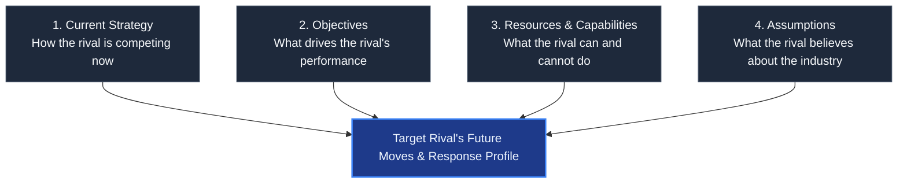

_Figure 4.4: Porter's Competitor Analysis Framework (adapted)_

#### 4.7.1 The Four Dimensions of Competitor Scouting

1. **Current Strategy:** Predict a rival's next moves by examining their current pattern of behavior. How are they positioned in the market? What specific investments are they making in marketing, R&D, or geographic expansion?
2. **Objectives:** Appraise the rival’s financial and strategic goals. Are they meeting their targets? Financially strong rivals are likely to continue their current strategies, whereas poorly performing firms are under pressure to make bold, highly disruptive moves.
3. **Resources and Capabilities:** A rival's actions are both enabled and constrained by their asset base. Assessing their relative strengths and weaknesses reveals what strategic moves they are capable of executing.
4. **Assumptions:** Evaluate top management's beliefs about their own company and the industry. Misaligned assumptions or blind spots present major opportunities for a firm to exploit.

_Information Gathering:_ High-quality competitive intelligence is gathered legally and ethically from open-source information, including company press releases, website updates, annual/quarterly reports, SEC filings (e.g., 10-K, 8-K), and public investor conference calls.

---

### 4.8 Key Success Factors (KSFs)

An industry's **Key Success Factors (KSFs)** are those competitive elements, product attributes, operational approaches, resources, and capabilities that most affect a company's ability to survive and thrive in the marketplace.

KSFs spell the difference between profit and loss, separating strong competitors from weak ones (Weedmark 2019). Strategists can pinpoint an industry's KSFs by answering three diagnostic questions:

1. **Buyer Choice:** On what basis do buyers choose between competing brands? What specific product attributes and services are crucial to their decision?
2. **Resource Requirements:** What resources and competitive capabilities must a firm possess to execute its strategy successfully?
3. **Disadvantages:** What operational or strategic shortcomings are almost certain to put a firm at a major competitive disadvantage?

An industry typically has **three to five KSFs**. Correctly diagnosing them is a top strategic priority, as it dictates how the firm must focus its resources and capabilities.

---

### 4.9 Evaluating the Industry Outlook for Profitability

The final step in external environment analysis is to synthesize all findings to determine whether the industry presents the company with sufficiently attractive opportunities for future growth and profitability.

Managers must evaluate six core diagnostic questions (Thompson, Peteraf, et al. 2016):

1. **Macro-Environment Impact:** How is the company being impacted by the broad macro-environment?
2. **Competitive Pressures:** Are strong competitive forces squeezing industry profitability to subpar levels?
3. **Driving Forces:** Is industry profitability favorably or unfavorably affected by the prevailing forces of change?
4. **Market Position:** Does the company occupy a stronger or more defensible market position than key rivals?
5. **Vulnerabilities:** Is the competition capable of successfully attacking the company's market position?
6. **KSF Alignment:** How well does the company's strategy deliver on the industry's Key Success Factors?

> [!IMPORTANT]
> **The Dual Conclusions of Industry Attractiveness**
> Based on this comprehensive synthesis, managers must reach one of two conclusions:
>
> - **Fundamentally Attractive:** The industry environment offers highly appealing opportunities for above-average profitability. _Strategic action:_ Invest aggressively to capture opportunities and strengthen long-term competitive position.
> - **Fundamentally Unattractive:** The prospects for future profitability are unappealingly low. _Strategic action:_ Invest cautiously, protect the current niche, or actively seek opportunities to diversify into other industries.

---

### 4.10 Chapter Summary

Thinking strategically about a company's external environment requires a multi-layered diagnostic approach:

1. **Macro-Environmental Analysis:** Evaluate the six sectors (Economic, Demographic, Sociocultural, Political-Legal, Technological, and International-Global) to trace broad trends and risks.
2. **Five Forces Diagnosis:** Assess the competitive pressures stemming from industry rivals, new entrants, substitutes, suppliers, and buyers. The strongest of these forces dictates the ceiling of industry profitability.
3. **Change Force Analysis:** Identify the drivers of change and track the industry's progression through the standard life cycle.
4. **Strategic Group Mapping:** Delineate market positions to identify close competitors and discover competitive gaps.
5. **Competitor Scouting:** Map rivals' current strategies, objectives, capabilities, and assumptions to anticipate their next moves.
6. **Key Success Factors:** Uncover the three to five competitive elements required for survival and commercial viability.
7. **Outlook Synthesis:** Determine the fundamental attractiveness of the industry to guide capital investment decisions.

## Chapter 5: The Internal Environment: Evaluating Resources, Capabilities, and Competitiveness

> "Organizations succeed over the long run if they can do certain things better than their competitors."
> — _Robert Hayes_

While external analysis diagnoses the opportunities and threats in the broader industry, internal analysis is the primary diagnostic tool that determines whether an enterprise's current strategy is yielding a sustainable competitive advantage. When combined, external and internal diagnoses enable managers to position the firm to capture emerging opportunities and neutralize competitive threats.

This chapter's systematic evaluation of a firm's internal environment centers on six core questions:

1. How well is the company’s current strategy working?
2. What are the company’s most important resources and capabilities, and do they possess the power to yield a sustainable competitive advantage over rivals?
3. What are the company’s strengths and weaknesses relative to market opportunities and external threats?
4. How do the company's value chain activities impact its cost structure and customer value proposition?
5. Is the company competitively stronger or weaker than key rivals?
6. What strategic issues and problems require front-burner managerial decisions?

---

### 5.1 Question 1: How Well is the Company's Strategy Working?

Evaluating a company's current strategy requires an examination of the specific competitive approaches and operational moves management has initiated (e.g., pricing adjustments, product design enhancements, advertising increases, geographic expansions, mergers, or acquisitions).

Furthermore, every company develops **functional strategies** within its specialized departments (R&D, Marketing, Production, IT, HR, and Security). These functional strategies must be strictly aligned to support the company’s overarching business strategy.

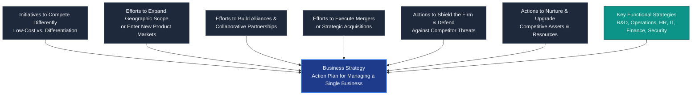

_Figure 5.1: The Strategy Wheel & Related Functional Abstractions (adapted)_

#### 5.1.1 Key Indicators of Strategic Success

To determine whether the company's strategy is working, managers must assess a range of financial and strategic performance metrics. The stronger a company's current overall performance, the less likely it is to require radical strategic changes.

Persistent shortfalls in meeting performance targets or weak market standing relative to rivals are definitive signals of a flawed strategy, poor execution, or both. Managers should track the following performance indicators:

- **Growth Metrics:** Trends in sales revenue, net earnings, and cash flows.
- **Capital Return:** Return on Assets (ROA), Return on Equity (ROE), and stock price trends.
- **Market Standing:** Trends in market share, industry rank, and brand recognition.
- **Customer Retention:** Rates of customer acquisition, churn, and brand loyalty.
- **Internal Process Efficiency:** Improvements in order fulfillment times, supply chain velocity, defects, and employee productivity.

---

### 5.2 Question 2: What are the Company's Most Important Resources and Capabilities?

An enterprise's resources and capabilities are its **competitive assets**. They represent the fundamental building blocks of its strategy and dictate whether its market power will be strong or weak. A firm with second-rate competitive assets will inevitably trail its rivals.

Analyzing a firm's competitive assets is a two-step diagnostic process:

1. **Identify** the company's resources and capabilities.
2. **Examine** them to determine which are the most valuable and whether they can support a sustainable competitive advantage.

#### 5.2.1 Identifying the Company's Resources

A **resource** is a productive input or asset that is owned or controlled by the company. Resources vary significantly in quality, utility, and competitive value.

Resources are categorized into two primary types:

1. **Tangible Resources:** Physical, financial, technological, and organizational assets that are easily quantified and touched (e.g., cash, credit lines, state-of-the-art facilities, equipment, inventory, patents, and proprietary database systems).
2. **Intangible Resources:** Assets that are non-physical, highly complex, and difficult to quantify. Intangible resources are developed over long periods and are deeply embedded in organizational routines. Examples include brand reputation, corporate culture, customer relationships, accumulated wisdom, and employee skills.

> [!NOTE]
> **Intangible Assets as the Ultimate Competitive Base**
> Intangible resources are often far more valuable than tangible ones. Because they represent learning over time, they embody institutional knowledge that competitors cannot easily purchase or replicate.
>
> _The Security Department as an Asset:_ A highly professional corporate security department represents a valuable intangible resource. By implementing robust threat-reduction protocols, compliance frameworks, and investigative systems, the security function minimizes legal liability, prevents asset loss, and reduces worker compensation claims, directly enhancing the company's cost efficiency.

#### 5.2.2 Identifying the Company's Capabilities

A **capability** (or organizational capability) is the capacity of a firm to perform an internal activity competently. Capabilities are learned over time through repetitive execution and organizational learning.

Unlike simple resources, capabilities are knowledge-based and reside in a firm's processes, routines, and intellectual capital. They involve the coordination of multiple resources to transform inputs into valuable outputs.

> [!TIP]
> **Southwest Airlines' Turnaround Capability**
> Southwest Airlines competes on a **cost-leadership strategy**, which demands maximum operational efficiency. Because aircraft only generate revenue when flying, Southwest has nurtured a unique capability: a **30-minute plane turnaround** at airport gates.
>
> This capability is built on highly integrated baggage handling, standardized ground operations, and a unique corporate culture that encourages pilots and gate agents to assist flight attendants in prepping the cabin. The capability is cross-functional, learned over decades, and extremely difficult for legacy carriers to imitate.

#### 5.2.3 Cross-Functional Resource Bundles

Uncovering capabilities often begins by auditing the firm's resource base. Some companies possess **cross-functional resource bundles**—interlinked competitive assets that operate in tandem to drive market success.

_Nike's Brand Bundle:_ Nike’s sustained dominance in athletic apparel is driven by a unique resource bundle consisting of professional endorsements, proprietary styling expertise, deep market research skills, an iconic brand name, and robust global distribution networks.

---

### 5.2.3 Assessing the Competitive Power of a Company's Assets (The VRIN Framework)

Merely possessing resources and capabilities is insufficient; managers must evaluate their **competitive superiority**. If a firm's competitive edge can be sustained over time, it yields a true **competitive advantage**.

> [!IMPORTANT]
> **What is a Competitive Advantage?**
> A **competitive advantage** is a firm's ability to offer consumers greater value than its rivals, either by charging lower prices for equivalent benefits (cost advantage) or by providing unique product attributes that justify a premium price (differentiation advantage).

To determine whether a resource or capability possesses the power to yield a sustainable competitive advantage, managers apply the four rigorous tests of the **VRIN Framework** (Wernerfelt 1984; Barney and Hesterly 2015):

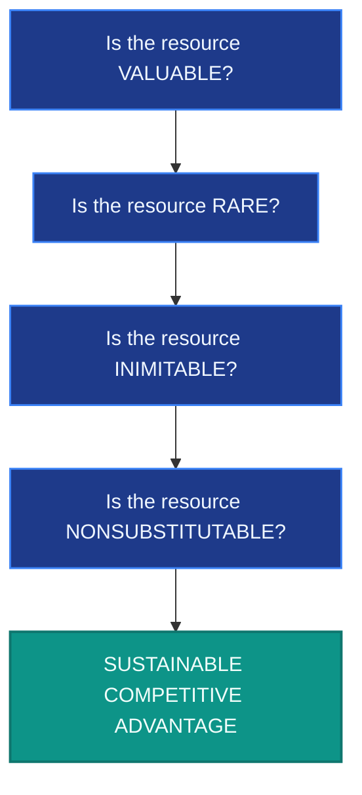

#### The Four VRIN Tests in Detail:

1. **Valuable (V):** To be valuable, a resource or capability must directly support the firm's strategy, exploit market opportunities, or neutralize external threats (e.g., Apple’s hardware-software design integration). If it does not make the firm a better competitor, it lacks competitive value.
2. **Rare (R):** A resource or capability is rare if it is held by only a few rivals in the industry. Widely available assets (e.g., standard marketing skills in the consumer goods industry) are the "price of entry" rather than sources of competitive advantage.
3. **Inimitable (I):** To support a durable advantage, the asset must be difficult or costly for rivals to copy. Inimitable assets include patent-protected formulas (pharmaceuticals), unique real estate locations, complex organizational cultures, and highly specialized, tacit employee skills.
4. **Nonsubstitutable (N):** The asset must be invulnerable to the threat of substitution by different types of resources. A resource may be valuable, rare, and inimitable, but if rivals can bypass it with an alternative resource (e.g., digital streaming replacing physical DVD distribution networks, or other smartphone brands substituting for the iPhone's specific features), the competitive edge is eroded.

_Reality Check:_ While very few companies possess resources that pass all four VRIN tests, those that do enjoy a sustainable competitive advantage. For others, competitive advantages are often temporary, demanding constant strategic execution.

#### 5.2.4 Dynamic Resources and Capabilities (Dynamic Capabilities)

Competitive assets are subject to erosion due to technological disruptions, changing consumer preferences, and competitor countermoves. To prevent competitive decay, firms must possess **dynamic capabilities**.

> [!NOTE]
> **Dynamic Capability Definition**
> A **dynamic capability** is an organization's learned capacity to build, integrate, adapt, and reconfigure its existing resources and capabilities in response to a rapidly changing business environment (Teece, Pisano, and Shuen 1997).

Dynamic capabilities enable companies to continuously upgrade their competitive assets:

- **Incremental Improvement:** Continuously polishing existing assets (e.g., Toyota’s Lexus division constantly upgrading production automation, engine efficiency, and cabin luxury).
- **Strategic Reconfiguration:** Adding entirely new capabilities or purging obsolete ones, often through alliances or strategic acquisitions (e.g., Bristol Myers Squibb acquiring biotech firms to replace blockbuster drugs losing patent exclusivity).

### 5.3 Question 3: What Are the Company’s Strengths and Weaknesses Relative to Market Opportunities and External Threats?

The ultimate test of a company's internal situation is how well its resources and capabilities match its external environment. **SWOT Analysis** (Strengths, Weaknesses, Opportunities, and Threats) is the primary strategic tool used to diagnose this alignment.

The core of SWOT analysis is the **Question of Value**: _Do the company’s internal assets enable it to exploit external opportunities or neutralize external threats?_

- If a resource or capability enables the firm to exploit an opportunity or neutralize a threat, it is an **internal strength**.
- If a resource or capability is missing or inferior, preventing the firm from acting on opportunities or shielding itself from threats, it is an **internal weakness**.

Resources and capabilities do not possess inherent value; their value is entirely contextual. An asset that represents a powerful strength in one market can be a neutral factor or even a liability in another.

---

#### 5.3.1 The Hierarchy of Capabilities and Competencies

To evaluate a company's strengths objectively, managers must distinguish between different levels of capability. Capabilities are not static; they exist on a developmental spectrum:

> [!NOTE]
> **The Capability Development Spectrum**
>
> 1. **Capability (Basic Skill):** An activity that a firm has learned to perform with basic competence or operational adequacy.
> 2. **Competence (Proficiency):** An internal activity that a company has learned to perform with consistent proficiency over time and at an acceptable cost.
> 3. **Core Competence (Strategic Value):** An activity that a company performs proficiently and that is also central to its strategy, market success, and profitability.
> 4. **Distinctive Competence (Superiority):** A competitively valuable capability that enables a company to perform a particular set of activities better than its rivals.

_The Evolution in Security Practice:_ Consider a corporate security investigations division. A newly hired investigator has the basic **capability** to perform standard interviews. Over years of structured training and experience, the investigator develops a **competence** in resolving complex corporate fraud cases. When this capability is scaled across the department, integrated into proprietary database systems, and recognized as a primary tool for protecting company margins, it becomes a **core competence** of the security function.

##### Leading Examples of Core Competencies:

- **Procter & Gamble (P&G):** Possesses a legendary core competence in **brand management**, allowing it to nurture a massive, highly profitable portfolio of consumer products (Tide, Crest, Pampers, Swiffer).
- **Nike:** Leverages a core competence in **designing and marketing innovative athletic footwear and apparel**, driving global brand recognition.

---

#### 5.3.2 Identifying Internal Weaknesses

A **weakness** is a competitive deficiency—an internal shortcoming that constitutes a competitive liability. Weaknesses place the company at a disadvantage in the marketplace.

Internal weaknesses can stem from:

- Deficiencies in physical, financial, or organizational assets.
- Missing, unproven, or inferior capabilities in key areas of the business.
- Uneven or outdated intellectual capital and specialized expertise.

_Strategic Challenge:_ All companies have internal liabilities. The critical question for strategists is whether a firm's weaknesses make it competitively vulnerable, or if they can be neutralized or offset by its existing strengths.

---

#### 5.3.3 Identifying Market Opportunities

Identifying and appraising market opportunities is a critical step in strategy formulation. Opportunities are the external trends, changes, or unmet customer needs that hold the potential for growth and profitability.

Market opportunities are context-dependent. They can be:

- Plentiful or scarce.
- Fleeting (requiring rapid execution) or lasting.
- Highly attractive, marginally interesting, or completely unsuitable.

_Strategic Insight:_ **No firm possesses the resource depth to pursue all opportunities equally.** Strategists must guard against chasing every available market opening. The most attractive opportunities are those that tightly match the firm’s competitive assets, offering the best prospects for sustained growth and profitability.

---

#### 5.3.4 Identifying External Threats

An **external threat** is an environmental factor that poses a challenge to a company’s competitive well-being, profitability, or very existence.

Threats stem from diverse macro-environmental forces:

- The emergence of disruptive, cheaper, or superior technologies by rivals.
- Low-cost foreign competitors entering domestic markets.
- Hostile regulatory shifts or new statutory mandates.
- Unfavorable demographic shifts or rapidly changing consumer preferences.
- Geopolitical shocks, supply chain crises, or regime instability.

> [!WARNING]
> **Resilience and Crisis Management**
> Environmental threats can range from moderate adversity to existential crises. The 2008–2009 financial collapse and the 2020 global coronavirus pandemic demonstrated that firms cannot always predict macro-level shocks.
>
> Instead, management must establish robust **crisis management and operational resilience plans** to adapt and strategically pivot, mitigating the impact of sudden external threats on company performance.

---

#### 5.3.5 The SWOT Action Matrix

Simply compiling lists of strengths, weaknesses, opportunities, and threats is an administrative exercise with no strategic value. The payoff of SWOT analysis lies in **translating the diagnosis into concrete strategic actions**.

Strategy makers use the **SWOT 2x2 Action Matrix** to formulate these actions:

| SWOT Matrix                                           | **External Opportunities (O)**<br>_Leverage positive trends_                                             | **External Threats (T)**<br>_Mitigate environmental risks_                                                        |
| :---------------------------------------------------- | :------------------------------------------------------------------------------------------------------- | :---------------------------------------------------------------------------------------------------------------- |
| **Internal Strengths (S)**<br>_Leverage key assets_   | **SO Strategies (Maxi-Maxi):**<br>Use internal strengths to capture attractive external opportunities.   | **ST Strategies (Maxi-Mini):**<br>Use internal strengths to shield the firm from external threats.                |
| **Internal Weaknesses (W)**<br>_Mitigate liabilities_ | **WO Strategies (Mini-Maxi):**<br>Overcome internal weaknesses to pursue promising market opportunities. | **WT Strategies (Mini-Mini):**<br>Minimize internal weaknesses and defend against catastrophic threats (or exit). |

_Core Strategic Rule:_ A company’s overarching strategy must always be built upon its **internal strengths**, placing heavy reliance on its best assets to compete successfully. Simultaneously, management must proactively correct those weaknesses that make the firm vulnerable to competitor attacks or prevent it from pursuing growth opportunities.

---

### 5.4 Question 4: How Do the Company's Value Chain Activities Impact Its Cost Structure and Customer Value Proposition?

To determine whether a company's costs and customer value propositions are competitively viable, strategists use **Value Chain Analysis**.

> [!NOTE]
> **What is the Value Chain?**
> A company's **value chain** is the collection of all internal activities a firm performs to design, produce, market, deliver, and support its product or service. It is called a value chain because the ultimate intent of these activities is to create value for buyers and generate profitability for the company.
>
> _Value Chain vs. Supply Chain:_ The supply chain represents the physical movement of raw materials and finished goods, which exists as a subset within the broader value chain.

The value chain is divided into two broad categories of activities (Porter 1985):

1. **Primary Activities:** The foremost money-making activities involved in the physical creation of the product, its sale, distribution, and post-sale service.
2. **Support (Secondary) Activities:** Activities that facilitate and enhance the performance of primary activities (e.g., procurement, HR, technology development, and security).

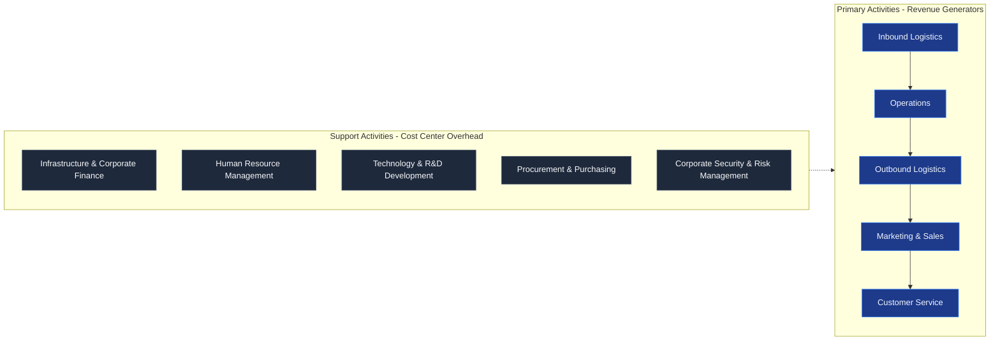

_Figure 5.2: The Corporate Value Chain System (adapted)_

#### 5.4.1 Primary Activities in Detail

- **Inbound Logistics:** The front end of the supply chain associated with receiving, storing, and distributing raw material inputs. Inefficient plant layouts or high warehousing rental costs directly inflate operating expenses and erode profitability.
- **Operations:** The core transformation process that converts raw inputs into finished products or services. In manufacturing, this includes assembly line automation and quality control. In retail, operations involve store management, shelf merchandising, and inventory tracking.
- **Outbound Logistics:** The back end of the supply chain associated with collecting, storing, and shipping the finished product to buyers. Optimized shipping processes minimize transit damage and distribution costs.
- **Marketing and Sales:** Activities designed to drive buyer awareness, segment the customer base demographically, and stimulate purchase intent through promotion and advertising.
- **Customer Service:** Post-sale support, warranty repairs, and service agreements that enhance product value and build brand loyalty.

#### 5.4.2 Support (Secondary) Activities & The Security Imperative

Secondary activities, such as Procurement, HR, Finance, and Corporate Security, are often viewed by executive committees strictly as **operating overhead (costs)** against profitability.

Consequently, requests for additional budget or headcount in these departments are scrutinized intensely. To secure capital, support functions must demonstrate how their activities enhance the efficiency or effectiveness of the primary revenue-generating activities:

- _Security's Business Value:_ Security is not merely an overhead cost. By mitigating theft, preventing fraud, protecting proprietary intellectual property, and safeguarding supply chain routes, corporate security directly protects the firm's operating margins.

---

#### 5.4.3 The Value Chain as an Interconnected System

A company's cost competitiveness depends not only on its internal activities, but on the costs incurred within the value chains of its **suppliers** and **distribution channel allies**.

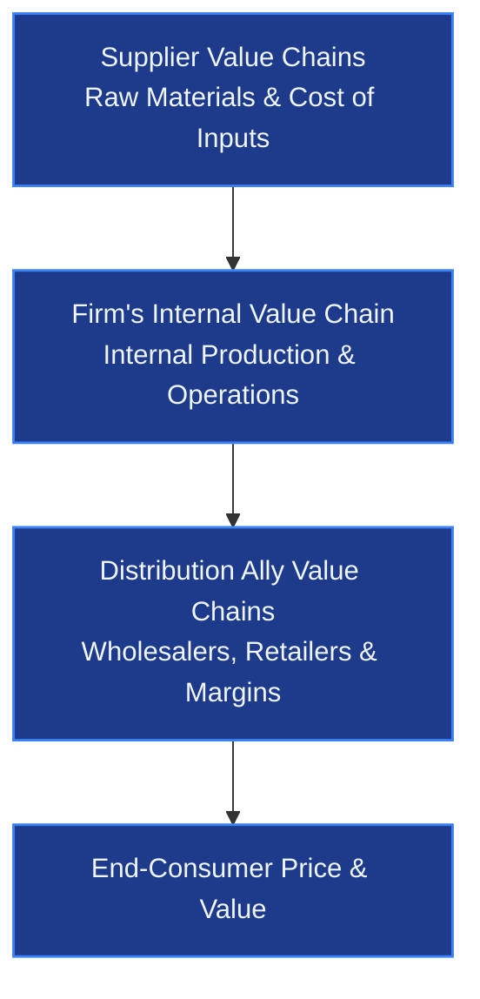

_Figure 5.3: The Integrated Industry Value Chain System_

Strategic alignment across this entire value system is critical:

- **Supplier Integration:** Working collaboratively with suppliers to reduce costs (e.g., auto manufacturers encouraging parts suppliers to locate facilities nearby to facilitate just-in-time inventory deliveries, cutting warehousing expenses).
- **Distribution Integration:** Working closely with dealers and retailers to improve customer satisfaction (e.g., appliance makers training retail service representatives to perform prompt warranty repairs).

---

### 5.4.4 Benchmarking and Best Practices

To determine whether its value chain costs are competitive, an enterprise must compare its performance metrics against its rivals.

> [!TIP]
> **Best Practice & Benchmarking Definitions**
>
> - **Best Practice:** An operational method of performing a task that consistently delivers superior results compared to alternative approaches.
> - **Benchmarking:** A strategic diagnostic tool used to compare the costs and effectiveness of a firm's value chain activities against those of competitors or best-in-class companies.

##### The McDonald's & Starbucks Benchmarking Case Study:

Nearly 70% of McDonald’s sales are generated through its drive-through windows. Seeking to expand its breakfast and commuter revenues, Starbucks benchmarked McDonald’s drive-through egress patterns, vehicle flow designs, and order-taking speeds.

Starbucks adopted these best practices, shifting its real estate strategy from neighborhood walk-in cafes to drive-through formats, necessitating a complete revamp of its menu and order-processing systems to match the faster service requirements.

#### 5.4.5 Legal Implications of Benchmarking

In premises liability and negligent security litigation, courts regularly employ benchmarking to evaluate a defendant's actions.

Judgments are rendered based on whether the firm's security practices aligned with the **"reasonable and ordinary"** practices expected of similar companies in that industry, rather than theoretical "best practices."

#### 5.4.6 Correcting Value Chain Disadvantages

Value chain analysis and benchmarking expose specific cost and value disadvantages relative to key rivals, pointing directly to corrective strategic options:

- **Implement best practices** throughout high-cost activities.
- **Outsource** non-core activities to specialized low-cost contractors.
- **Invest in technological improvements** to drive labor productivity.
- **Redesign products** or revamp the internal value chain altogether to detour around high-cost components.

---

### 5.5 Question 5: Is the Company Competitively Stronger or Weaker Than Key Rivals?

While SWOT and value chain analyses diagnose specific internal elements, a comprehensive strategic assessment requires a quantitative evaluation of the firm's overall competitive strength relative to its primary rivals.

Strategists construct a **Weighted Competitive Strength Assessment** using five systematic steps:

1. **Identify Success Measures:** Compile a list of the industry's Key Success Factors (KSFs) and competitive strength metrics.
2. **Assign Weights:** Allocate importance weights (summing to 1.0) to each success measure based on its strategic significance.
3. **Score the Competitors:** Rate the firm and its key rivals on each success measure using a scale of 1 to 10.
4. **Calculate Weighted Scores:** Multiply the raw scores by the assigned weights to arrive at weighted ratings.
5. **Sum and Synthesize:** Sum the weighted scores to obtain an overall competitive strength rating, drawing clear conclusions regarding the firm's net competitive advantages or disadvantages.

> [!NOTE]
> **The Value of Strength Ratings**
> Quantitative strength ratings reveal exactly where the firm is competitively vulnerable (where its scores are low compared to rivals) and where it possesses an edge (where its scores are high). Strategy makers use these insights to design target offensive moves to exploit rivals' weaknesses and defensive moves to shield their own liabilities.

---

### 5.6 Question 6: What Strategic Issues and Problems Merit Front-Burner Managerial Attention?

The final step in internal analysis is to synthesize all external and internal diagnoses to compile a **"front-burner" strategic agenda**. This agenda lists the precise competitive challenges, regulatory shifts, resource gaps, and market vulnerabilities that management must resolve.

#### 5.6.1 Competitive Parity, Tactical Moves, and Creative Destruction

When addressing front-burner strategic challenges, firms must carefully analyze the competitive dynamics of their actions and anticipate competitor responses:

- **Tactics vs. Strategy:** While a **strategy** represents the firm's long-term competitive game plan, **tactics** are short-term, immediate actions taken in response to shifting market conditions. Tactics are altered frequently and are easily imitated by rivals (e.g., adding a lemon scent to a laundry detergent, or Coke launching a diet soft drink in response to Pepsi).
- **Competitive Parity:** The state in which a company achieves equivalent operational performance and financial returns as its key rivals or the industry average. Tactical imitation is often undertaken simply to maintain competitive parity.
- **Creative Destruction:** A process of industrial mutation (Schumpeter 1942) that continuously revolutionizes the economic structure from within, destroying the old, legacy product markets and creating entirely new ones through disruptive innovation (e.g., digital streaming replacing DVD rental businesses).

#### 5.6.2 Competitive Actions and Strategic Inertia

When an enterprise achieves a sustainable competitive advantage, rivals may choose to respond in one of several ways:

1. **No Response (Strategic Inertia):** Rivals may maintain their current course if they possess a different competitive advantage they do not wish to imperil, if they lack the resource depth to duplicate the leader's assets, or if they seek to reduce ruinous price-cutting rivalry in the industry.
2. **Tactical Response:** Rivals may initiate short-term, low-cost modifications to hold their market share.
3. **Strategic Pivot:** Rivals may undertake a complete strategic reconfiguration, which requires working through the strategic management process anew (e.g., Microsoft shifting its core strategy from software licenses to cloud-based Azure services).

---

### 5.7 Chapter Summary

1. **Strategic Performance Assessment:** The first step in internal analysis is tracking key strategic and financial indicators to evaluate the efficacy of the current strategy.
2. **Asset Auditing:** Managers must catalog tangible and intangible assets and evaluate their competitive power using the VRIN Framework (Valuable, Rare, Inimitable, Nonsubstitutable).
3. **Dynamic Capabilities:** Sustaining a competitive edge requires dynamic capabilities to continuously upgrade, adapt, and reconfigure the company's competitive assets.
4. **SWOT Splicing:** Strategists use SWOT analysis to identify internal strengths and weaknesses, evaluate external opportunities and threats, and translate this diagnosis into concrete actions via the SWOT Action Matrix.
5. **Value Chain Integration:** Managing the corporate value chain and the broader supplier/distributor value system dictates the firm's cost structure and customer value proposition.
6. **Benchmarking:** Firms use benchmarking to discover best practices and correct cost or performance disadvantages.
7. **Quantitative Strength Assessment:** Assigning weighted scores to key success factors allows strategists to quantitatively measure the company's net competitive standing.
8. **Managerial Action Agenda:** The synthesis of all analyses culminate in a front-burner list of strategic issues that sets the agenda for immediate corporate action.

---

## Chapter 6: Business-Level Strategies

> "Business strategy is all about combining choices of what to do into a system that creates the requisite fit between the needs of the competitive environment and what the company has the ability to do."
> — _Michael Porter_

A company’s competitive strategy deals exclusively with the specifics of management's game plan for competing successfully—its efforts to position itself in the market, please customers, and defend against competitor threats.

Corporate-level strategies are actions firms take to gain competitive advantage by operating in multiple markets or industries simultaneously (Porter 1996). In contrast, **business-level strategies** represent the course of action arrived at by management to successfully compete in a **single product market or industry**.

To deliver superior value to customers, a firm must perform key value chain activities differently than its rivals, building competitively valuable resources and capabilities that rivals cannot easily match. A business cannot simply count on its rivals to be inept or inert.

---

### 6.1 Types of Generic Competitive Strategies

A company’s competitive strategy deals exclusively with the specifics of management's game plan for competing successfully—its efforts to position itself in the marketplace, how it seeks to please customers, and the manner in which it will defend against and fight off competitive threats.

The two biggest factors that distinguish one competitive strategy from another are:

1. **The Target Market Scope:** Whether the company's target market is **broad** or **narrow** (focusing on a specific buyer segment or niche).
2. **The Source of Competitive Advantage:** Whether the company is competing based on **lower overall costs** (enabling it to price products more competitively than rivals) or **product/service differentiation** (providing unique or novel features that rivals cannot easily match).

These two factors give rise to five distinct generic competitive strategy options, as visualized in Figure 6.1:

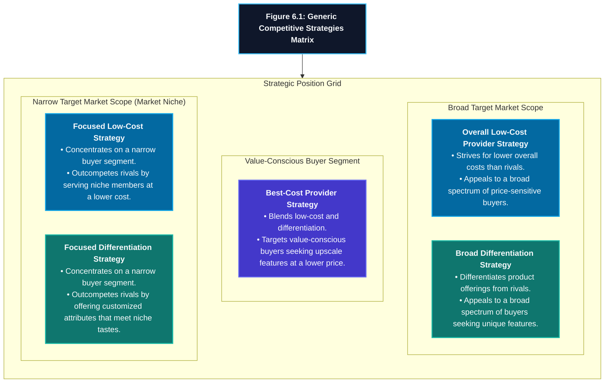

| Strategy Option               | Target Market            | Basis of Competitive Advantage       | Primary Strategic Focus                                                                |
| :---------------------------- | :----------------------- | :----------------------------------- | :------------------------------------------------------------------------------------- |
| **Overall Low-Cost Provider** | Broad spectrum of buyers | Lower overall costs than rivals      | Eliminating cost drivers systemwide and underpricing rivals or maximizing margins.     |
| **Broad Differentiation**     | Broad spectrum of buyers | Unique product or service attributes | Incorporating features that buyers value and rivals cannot easily replicate.           |
| **Best-Cost Provider**        | Value-conscious buyers   | Upscale attributes at a lower cost   | Giving buyers more value for their money by matching quality with attractive pricing.  |
| **Focused Low-Cost**          | Narrow segment (niche)   | Lower cost in serving the niche      | Outcompeting rivals by meeting specific niche needs at a lower cost than broad rivals. |
| **Focused Differentiation**   | Narrow segment (niche)   | Customized/unique niche attributes   | Catering to niche tastes with highly customized features that meet narrow demands.     |

---

### 6.1.1 Overall Low-Cost Strategy

Striving to achieve lower overall costs than rivals is a highly attractive competitive approach in markets with many price-sensitive buyers. Rather than being just one of many competitors with lower prices, a company achieves **low-cost leadership** when it becomes the industry's _lowest-cost provider_ (which does not necessarily mean it automatically offers the lowest retail price).

While low-cost leadership is a powerful advantage, it is not the sole route to financial success. A product that customers perceive as too "stripped-down" or free of basic attributes will be viewed as offering little value, regardless of its low price. To compete effectively on price, a company must strive for lower costs _while still offering features and services that buyers consider essential and worth paying for_.

#### Strategic Options for a Low-Cost Provider

A company with a cost advantage has two distinct ways to translate it into superior profitability:

1. **Underpricing Rivals:** Using the low-cost edge to underprice competitors, thereby attracting price-sensitive buyers in sufficient numbers to increase total market share and aggregate profits.
2. **Maintaining Price to Maximize Margins:** Keeping prices at parity with rivals and using the low-cost advantage to earn a higher profit margin on each unit sold, thereby boosting total profits and return on investment (ROI).

> [!WARNING]
> **The Risk of Retaliatory Price Cuts:**
> Merely using low prices to aggressively underprice rivals can trigger defensive reactions. Competitors may respond with retaliatory price cuts to protect their established customer base, resulting in a price war that lowers the profits of all participants. When the threat of retaliation is high, it is often safer to maintain prices and enjoy higher profit margins instead of initiating price cuts.

To achieve a meaningful cost edge over rivals, a firm’s cumulative costs across its overall value chain must be at parity with or lower than those of its competitors. There are two primary avenues for accomplishing this:

1. **Perform value chain activities more cost-effectively** than rivals.
2. **Revamp the firm’s overall value chain** to eliminate or bypass cost-producing activities entirely.

For security and operations managers, grasping these concepts is critical because cost-efficient management requires systematically searching out cost-saving opportunities in every activity along the value chain. No business function escapes scrutiny, and all personnel are expected to contribute to innovative cost-saving solutions.

---

### 6.1.2 The Ten Cost Drivers

To control and keep operating costs down, managers must focus on key factors that have a significant impact on systemwide expenses. Thompson et al. (2016) identify **10 cost drivers** that dictate a firm's cost structure:

```mermaid
flowchart TD
    %% Custom HSL Styling
    classDef center fill:#0F172A,stroke:#38BDF8,stroke-width:3px,color:#F8FAFC,font-weight:bold,font-size:16px;
    classDef scale fill:#0369A1,stroke:#0EA5E9,stroke-width:2px,color:#F8FAFC;
    classDef learning fill:#0F766E,stroke:#14B8A6,stroke-width:2px,color:#F8FAFC;
    classDef capacity fill:#4338CA,stroke:#6366F1,stroke-width:2px,color:#F8FAFC;
    classDef supply fill:#B45309,stroke:#F59E0B,stroke-width:2px,color:#F8FAFC;
    classDef input fill:#BE123C,stroke:#F43F5E,stroke-width:2px,color:#F8FAFC;
    classDef power fill:#6D28D9,stroke:#8B5CF6,stroke-width:2px,color:#F8FAFC;
    classDef systems fill:#0369A1,stroke:#0EA5E9,stroke-width:2px,color:#F8FAFC;
    classDef tech fill:#0F766E,stroke:#14B8A6,stroke-width:2px,color:#F8FAFC;
    classDef outsource fill:#4338CA,stroke:#6366F1,stroke-width:2px,color:#F8FAFC;
    classDef culture fill:#B45309,stroke:#F59E0B,stroke-width:2px,color:#F8FAFC;

    CD["THE 10 COST DRIVERS<br>(Key Determinants of Unit Costs)"]:::center

    CD --> D1["<b>1. Economies of Scale</b><br>Spreading fixed costs over larger production volumes."]:::scale
    CD --> D2["<b>2. Learning & Experience</b><br>Gaining speed and reducing errors through repetition."]:::learning
    CD --> D3["<b>3. Capacity Utilization</b><br>Minimizing unit cost penalties by operating at full capacity."]:::capacity
    CD --> D4["<b>4. Supply Chain Efficiencies</b><br>Streamlining logistics, scheduling, and JIT inventory."]:::supply
    CD --> D5["<b>5. Input Costs</b><br>Substituting lower-cost supplies without sacrificing performance."]:::input
    CD --> D6["<b>6. Bargaining Power</b><br>Leveraging volume to negotiate price concessions from suppliers."]:::power
    CD --> D7["<b>7. Systems & IT</b><br>Adopting enterprise software to trim labor and inventory costs."]:::systems
    CD --> D8["<b>8. Technology & Design</b><br>Employing CAD/CAM and TQM to boost production efficiency."]:::tech
    CD --> D9["<b>9. Outsourcing & Integration</b><br>Evaluating make-versus-buy to leverage specialized skills."]:::outsource
    CD --> D10["<b>10. Incentives & Culture</b><br>Motivating employees to innovate and boost productivity."]:::culture
```

#### 1. Capturing Economies of Scale

Firm size is a primary source of cost advantage. Economies of scale exist when an increase in production volume results in a lower average cost per unit, as fixed costs are spread over more units. These efficiencies can occur at various points along the value chain:

- **Logistics:** Massive warehouses (inbound) and large distribution networks (outbound) lower unit transit and handling costs.
- **Global Standardization:** Selling a uniform product globally lowers unit production costs relative to making customized versions for individual countries.
- **Advertising:** Spreading marketing costs over huge volumes (e.g., PepsiCo spending $5 million on a Super Bowl ad, which translates into fractions of a cent per unit sold).

#### 2. Capitalizing on the Learning and Experience Curve

As workers and managers repeat processes, they learn how to perform them more efficiently. Experience-curve effects reduce waste, eliminate errors, and compress cycle times. Workers become highly specialized in narrow roles, dramatically improving productivity and lowering unit labor costs over time.

#### 3. Optimizing Capacity Utilization

Operating facilities at or near full capacity is essential to spread depreciation and other fixed overheads over a larger volume, thereby lowering unit costs. The more capital-intensive a business is, the higher its fixed costs are as a percentage of total costs, resulting in a severe unit-cost penalty if the firm operates at less than full capacity.

> [!NOTE]
>
> ### Key Concepts: Fixed vs. Variable Costs
>
> - **Fixed Costs:** Corporate expenses that do not change with the volume of goods or services produced or sold. These are baseline overheads that must be paid regardless of business activity (e.g., rent, depreciation, interest payments, administrative salaries).
> - **Variable Costs:** Expenses that change in direct proportion to production output. These costs rise as production volume increases and fall as production decreases (e.g., raw materials, direct labor, packaging, shipping).

#### 4. Improving Supply Chain Efficiency

Partnering with suppliers to streamline purchasing, implementing Just-In-Time (JIT) inventory systems, and economizing shipping and materials handling reduce overall carrying costs. A distinctive competence in cost-efficient supply chain management can translate into a sizable cost advantage (e.g., Kimberly-Clark's seamless supply chain connectivity combined with proactive environmental and social programs).

#### 5. Substituting Lower-Cost Inputs

Switching from higher-cost to lower-cost inputs or suppliers when there is little to no sacrifice in product quality or performance. This also involves changing product designs to remove expensive components (e.g., Timex watch designs, which allow the company to offer stylish products while keeping manufacturing costs low).

#### 6. Leveraging Bargaining Power

Using the company's purchasing volume as a large buyer to gain price concessions from suppliers. Large buyers leverage supplier competition to lower input acquisition costs (e.g., Walmart's massive retail purchasing volume enables sustainable low-cost leadership).

#### 7. Using Systems and Information Technology

Implementing online systems, enterprise resource planning (ERP) software, and sophisticated data-sharing tools with suppliers. Real-time data access reduces safety stock inventories, trims labor costs, and improves operational execution (e.g., Amazon’s highly integrated software network that coordinates supplier inventories).

#### 8. Improving Process Design and Employing Advanced Technology

Cutting costs by utilizing advanced production design techniques (e.g., Computer-Aided Design and Manufacturing - CAD/CAM, and Total Quality Management - TQM) to boost efficiency and reduce waste (e.g., Visteon Corporation, a global automotive supplier utilizing advanced electronic manufacturing systems to efficiently build auto cockpit electronics).

#### 9. Leveraging Outsourcing or Vertical Integration

Outsourcing value chain activities is highly economical when outside specialists can perform them at lower costs than in-house teams. Conversely, integrating backwards (into suppliers) or forwards (into distributors) can lower costs by reducing transaction overheads and securing raw material access (e.g., Amazon and Walmart investing in their own transportation fleets to bypass third-party logistics margins).

#### 10. Motivating Employees through Incentives and Culture

Aligning employee incentives and corporate culture with cost-reduction goals. Encouraging worker productivity and rewarding cost-saving suggestions spurs continuous improvement and lowers employee turnover costs (e.g., the cost-reducing incentive systems and cultures at Nucor Steel, Southwest Airlines, and Walmart).

---

### 6.1.3 Revamping the Value Chain System to Lower Costs

Substantial cost advantages emerge from designing the company’s value chain system in ways that eliminate costly work steps and entirely bypass certain cost-producing activities. Key methods include:

- **Selling Directly to Consumers:** Creating an in-house direct sales force or an e-commerce platform to bypass the markups and distribution costs of dealers and wholesalers (where distributor margins can account for 30 to 50 percent of the final retail price).
- **Streamlining Operations:** Eliminating unnecessary steps that add little value. For example, Walmart bypasses its own distribution centers for certain items, having manufacturers ship directly to stores. Similarly, supermarket chains buy pre-cut, pre-packaged meats directly from packing plants, eliminating store-level butchering labor.
- **Optimizing Facilities Location:** Having suppliers locate their plants or warehouses immediately adjacent to the company's facilities. This minimizes incoming freight costs, reduces the need for large incoming parts warehouses, and eliminates double-handling.

#### Real-World Case Studies of Value Chain Revamping

- **Nucor Corporation:** The most profitable U.S. steel producer completely re-engineered the steel-making value chain by using electric arc furnaces (EAFs) rather than traditional blast furnaces. EAFs melt recycled steel scrap, bypassing several expensive coke-making and iron-ore smelting steps, requiring a fraction of the capital investment and a much smaller workforce to produce high-quality steel.
- **Amazon:** The global e-commerce giant maintains a relentless focus on costs by leveraging scale to secure massive bargaining power over suppliers. By negotiating to set up Amazon-managed space inside supplier warehouses, the company reduces its own inventory carrying costs. On the outbound side, building its own delivery fleet has enabled Amazon to spread the fixed costs of its massive logistics and automation investments over a vast volume, resulting in lower capital costs per dollar of sales compared to rivals like Target and Walmart.

---

### 6.1.4 The Keys to Being a Successful Low-Cost Provider

Although low-cost providers are highly frugal, they aggressively invest in resources and capabilities that promise to drive costs out of their business. Having and maintaining superior cost-reducing assets is essential to sustaining a competitive advantage.

For example, in the big-screen television market, **Vizio** carefully calculates potential savings before investing in new technology. By continuously investing in cost-saving manufacturing processes that are hard for rivals to match, Vizio has sustained its low-cost retail edge for years, focusing its sales on warehouse clubs and low-cost retailers (like Costco and Walmart) to reach price-conscious buyers, outcompeting differentiated but higher-cost offerings from Sony and Samsung.

Other notable companies that successfully employ low-cost provider strategies include **Ryanair** in airlines, **Stride Rite** in children’s footwear, and **Poulan** in chainsaws.

#### When a Low-Cost Provider Strategy Works Best

A low-cost provider strategy becomes increasingly powerful and appealing when:

1. **Price competition among rival sellers is vigorous:** Low-cost providers are best positioned to survive price wars and continue generating profits.
2. **The products of rival sellers are essentially identical:** Look-alike products and readily available supplies set the stage for intense price competition, making high-cost firms highly vulnerable.
3. **It is difficult to achieve product differentiation that has value to buyers:** When brand differences do not matter, price becomes the dominant factor in buyer decisions.
4. **Most buyers use the product in the same way:** Standardized user requirements allow a standardized product to fully satisfy customer needs.
5. **Buyers incur low costs in switching brands:** Low switching costs give buyers total flexibility to shift to the lowest-priced seller.

---

### 6.1.5 Pitfalls of Attempting to Be a Low-Cost Provider

According to Thompson et al. (2016) and Barney and Hesterly (2015), managers must guard against critical errors that can undermine a low-cost strategy:

1. **Overly Aggressive Price Cutting:** Lowering prices does not automatically increase profits. Price cuts reduce per-unit revenue and margins; they only boost profitability if the resulting volume increase is large enough to offset the margin squeeze. For example, if a firm cuts its price from $10 to $9.50 (with production costs at $9), its profit margin is halved (from $1.00 to $0.50). To maintain the same total profit, the firm must achieve a **100% sales increase** (from 1,000 units to 2,000 units).
2. **Relying on Easily Replicated Cost-Reduction Methods:** If competitors can easily or cheaply copy the leader’s low-cost methods (e.g., purchasing the same standard equipment), the cost advantage will be extremely short-lived.
3. **Fixation on Cost Reduction (Over-Zealousness):** Zealous cost-cutting can degrade product features to the point that the product no longer appeals to consumers. The firm must monitor changing buyer preferences, as buyers may easily migrate to feature-rich products if the price differential shrinks or if their incomes rise.
4. **Technological Obsolescence:** A low-cost leader with heavy financial investments in its current production setup faces severe risk if a competitor introduces a radical cost-saving technological breakthrough or a superior new value chain design that is expensive to imitate.

#### Organizational Alignment for Cost Leadership

To realize its full potential, every department and function within the organization must be strictly aligned with the cost-leadership strategy:

| Business Function          | Strategy Realization and Alignment                                                                                      |
| :------------------------- | :---------------------------------------------------------------------------------------------------------------------- |
| **Manufacturing**          | Implementing lean operations, minimizing scrap/waste, and maintaining strict quality standards to avoid costly re-work. |
| **Marketing**              | Emphasizing product value, durability, reliability, and attractive pricing over premium lifestyle branding.             |
| **Research & Development** | Focusing on process design improvements, manufacturing efficiency, and low-cost product extensions.                     |
| **Finance**                | Directing capital toward high-return cost-saving initiatives and maintaining a lean organizational structure.           |
| **Accounting**             | Adopting rigorous cost tracking, close supervision of inputs, and conservative financial principles.                    |
| **Sales**                  | Focusing customer pitches on total cost of ownership, value, reliability, and competitive pricing.                      |

Finally, management control systems under a cost-leadership strategy must incorporate tight cost controls, quantitative cost goals, close supervision of labor and inventories, and an organizational culture that systematically rewards cost reductions and efficiency innovations.

### 6.2 Broad Differentiation Strategies

Differentiation strategies are highly attractive whenever buyers’ needs and preferences are too diverse to be fully satisfied by a standardized, look-alike product offering. Successful product or service differentiation requires carefully studying buyer needs, behaviors, and values, and determining their willingness to pay for a unique offering.

Once these needs are understood, the company must incorporate a combination of desirable, unique features into its products or services to stand apart from the offerings of rivals. A broad differentiation strategy achieves its aim when a wide range of buyers finds the company’s offering appealing, distinctive, and worth a premium price.

#### Strategic Benefits of a Differentiation Strategy

Successful differentiation allows a firm to:

1. **Command a premium price** for its product or service.
2. **Increase unit sales** because the differentiating features successfully win over new buyers.
3. **Gain buyer loyalty** to the brand, creating a strong emotional bond between buyers and the company.

---

### 6.2.1 The Systematic Approach: The Eight Value Drivers

Differentiation is not something conjured up solely in marketing or advertising departments; it can be built into all aspects of a company's value chain. The most systematic approach managers can take involves focusing on a specific set of factors known as the **Value Drivers** (or uniqueness drivers) that reduce cost sensitivity and enhance buyer satisfaction:

```mermaid
flowchart TD
    %% Custom HSL Styling
    classDef center fill:#0F172A,stroke:#14B8A6,stroke-width:3px,color:#F8FAFC,font-weight:bold,font-size:16px;
    classDef feature fill:#0369A1,stroke:#0EA5E9,stroke-width:2px,color:#F8FAFC;
    classDef service fill:#0F766E,stroke:#14B8A6,stroke-width:2px,color:#F8FAFC;
    classDef rnd fill:#4338CA,stroke:#6366F1,stroke-width:2px,color:#F8FAFC;
    classDef innov fill:#B45309,stroke:#F59E0B,stroke-width:2px,color:#F8FAFC;
    classDef quality fill:#BE123C,stroke:#F43F5E,stroke-width:2px,color:#F8FAFC;
    classDef marketing fill:#6D28D9,stroke:#8B5CF6,stroke-width:2px,color:#F8FAFC;
    classDef inputs fill:#0369A1,stroke:#0EA5E9,stroke-width:2px,color:#F8FAFC;
    classDef hr fill:#0F766E,stroke:#14B8A6,stroke-width:2px,color:#F8FAFC;

    VD["THE EIGHT VALUE DRIVERS<br>(Key Determinants of Uniqueness)"]:::center

    VD --> V1["<b>1. Product Features & Performance</b><br>Functional attributes, safety, styling, and weight."]:::feature
    VD --> V2["<b>2. Customer Service & Support</b><br>Delivery, convenience, training, and technical assistance."]:::service
    VD --> V3["<b>3. Production R&D</b><br>Enabling custom manufacturing and wider product variety."]:::rnd
    VD --> V4["<b>4. Technology & Innovation</b><br>First-to-market solutions and patent protection."]:::innov
    VD --> V5["<b>5. Continuous Quality Improvement</b><br>Reducing defects, improving durability, and extending warranties."]:::quality
    VD --> V6["<b>6. Brand Building & Marketing</b><br>Enhancing perceived value and emotional customer bonds."]:::marketing
    VD --> V7["<b>7. High-Quality Inputs</b><br>Strict materials specifications to boost end-product prestige."]:::inputs
    VD --> V8["<b>8. Human Resource Management</b><br>Building intellectual capital, skills, and expertise."]:::hr
```

#### 1. Create Product Features and Performance Attributes

Incorporating physical and functional features that appeal to a wide range of buyers. This includes attributes that enhance user safety or environmental protection, styling, aesthetic appeal, size, and weight (e.g., Apple's focus on innovative features that improve performance and functionality).

#### 2. Improve Customer Service or Add Complementary Services

Providing superior customer service in areas such as delivery, returns, repairs, and technical assistance. Differentiators may also offer better training materials, attractive credit terms, quicker order processing, and greater customer convenience (e.g., Best Buy’s customer support and Geek Squad services).

#### 3. Invest in Production-Related R&D Activities

Engaging in production R&D to permit custom-order manufacturing at an efficient cost, providing wider product variety and selection. Flexible manufacturing systems allow different models and product versions to be manufactured on the same assembly line (e.g., Vistaprint's web-to-print customization capabilities).

#### 4. Pursue Innovation and Technological Advances

Successful innovation is a powerful route to differentiation, allowing for first-to-market victories. If the innovation is hard to replicate—through patent protection or proprietary technology—it provides a strong competitive advantage (e.g., Pfizer's medical research breakthroughs).

#### 5. Pursue Continuous Quality Improvement

Implementing rigorous quality control processes that reduce product defects, prevent premature product failure, extend product life, and make it economical to offer longer warranty coverage. This enhances the company's brand reputation (e.g., Lexus's reputation for luxury and defect-free vehicle manufacturing).

#### 6. Increase Marketing and Brand-Building Activities

Utilizing marketing and advertising to enhance the perceived value of the product, increasing buyers' willingness to pay a premium. Brand building creates customer loyalty, which raises switching costs even when the product price is high (e.g., Coca-Cola vs. Pepsi).

#### 7. Seek Out High-Quality Inputs

Sourcing premium inputs that have a direct spillover effect on the quality and prestige of the final product (e.g., Starbucks sourcing only high-grade arabica coffee beans and establishing strict purchase specifications).

#### 8. Emphasize Human Resource Management (HRM)

Investing in employee skills, expertise, and knowledge. A company with higher intellectual capital possesses a greater capacity to generate ideas that drive product innovation, technological advances, and superior quality (e.g., Google/Alphabet's talent acquisition and incentive programs).

---

### 6.2.2 Revamping the Value Chain to Increase Differentiation

Just as pursuing a cost advantage involves the entire value chain system, the same is true for a differentiation advantage. Activities performed upstream by suppliers or downstream by distributors and retailers can heavily influence customer perceptions of a company's product.

#### Upstream and Downstream Coordination

- **Coordinating with Suppliers to Better Address Customer Needs:** Collaborating with suppliers can improve product features, quality, and new product development cycles. It also ensures that the company's supply requirements are prioritized when industry materials are scarce (e.g., Dell collaborating with component suppliers and Harley-Davidson coordinating with parts suppliers).
- **Coordinating with Channel Allies to Enhance Customer Value:** Working with distributors, brokers, and retailers to standardize the selling environment, improve delivery speed, or provide co-sponsored promotions. For example, Coca-Cola coordinates closely with its bottling network, and has even taken over troubled bottlers to improve their management, equipment, and customer service before releasing them back to independent operations.

---

### 6.2.3 Delivering Superior Value with Broad Differentiation

Differentiation strategies depend on meeting customer needs in unique ways or creating new demands through innovation and persuasive advertising. Thompson et al. (2016) outline **four primary routes** to delivering superior value:

1. **Lowering the Buyer's Overall Cost of Using the Product:** Incorporating energy-efficient features, increasing maintenance intervals, improving product reliability, providing just-in-time (JIT) delivery to reduce a buyer's inventory carrying costs, or offering free technical support.
2. **Incorporating Tangible Features that Increase Customer Satisfaction:** Adding features that enhance performance, durability, utility, safety, portability, or aesthetic appeal (e.g., smartphone manufacturers racing to introduce next-generation cameras and simpler menus).
3. **Incorporating Intangible Features that Enhance Buyer Satisfaction in Non-Economic Ways:** Appealing to buyer desires for image, prestige, status, or environmental awareness (e.g., Toyota’s Prius appealing to environmentally conscious motorists, and luxury brands like Bentley, Coach, Cartier, Burberry, Ralph Lauren, and Louis Vuitton satisfying desires for status and superior craftsmanship).
4. **Signaling the Value of the Product Offering to Buyers:** Using signals such as high price, premium packaging, luxurious retail facilities, sophisticated brochures, and professional customer service. Signaling value is critical when:
   - The nature of differentiation is based on intangible features and is hard to quantify.
   - Buyers are making a first-time purchase and are unsure of the product's performance.
   - The product is purchased infrequently.
   - The buyers are unsophisticated.

#### Sustainable Capabilities-Based Differentiation

The most successful and sustainable differentiation approaches are those that are difficult for rivals to duplicate. While competitors can copy tangible product attributes over time, socially complex attributes such as **company reputation**, **long-standing customer relationships**, and **brand image** are extremely hard to imitate.

Differentiators also build sustainability by lock-in through high switching costs (e.g., Microsoft Office).

Examples of distinctive capabilities that sustain differentiation include:

- **Healthcare Clinics (Mayo Clinic, Cleveland Clinic, M.D. Anderson):** Possessing specialized medical expertise and equipment for treating complex diseases that most hospitals cannot afford to replicate.
- **Media Networks (CNN and Fox News):** Possessing massive global newsgathering infrastructures and the capabilities to rapidly deploy reporters to any location worldwide.

---

### 6.2.4 Pitfalls to Avoid in Pursuing a Differentiation Strategy

Managers must guard against the following key errors that can undermine a differentiation strategy:

1. **Relying on Easily Replicated Attributes:** Keying differentiation to product or service features that are easily, cheaply, or quickly copied by rivals. This results in rapid imitation, leading to competitive parity.
2. **Offering Attributes that Buyers Do Not Value:** Creating unique features that buyers do not find appealing or useful, or failing to make the differentiation recognizable to the buyer, which means they will refuse to pay a premium price.
3. **Overspending on Differentiation Efforts:** Raising R&D, marketing, or design costs to a level that erodes profitability. Profitable differentiation requires keeping the unit cost of achieving it below the price premium the company can command, or selling enough additional units to offset thinner margins.
4. **Offering Only Trivial Improvements:** Introducing minor upgrades in quality, service, or features that fail to generate a loyal customer base, particularly in markets with low brand loyalty and low switching costs.
5. **Over-Differentiating (Exceeding Buyer Needs):** Incorporating a dizzying array of features and options that drive up the product price beyond what buyers actually need or are willing to pay for.
6. **Charging Too High a Price Premium:** This is the most deadly pitfall. Buyers compare the price-value proposition when making decisions. If the price premium is too high relative to the perceived value of the differentiating attributes, buyers will switch to lower-priced rival offerings, viewing the premium as price gouging.

---

### 6.3 Focused (Market Niche) Strategies

What sets focused strategies apart from low-cost and broad differentiation strategies is that companies concentrate their attention on a **narrow piece of the total market** rather than appealing to the entire industry. The target market, or niche, can be defined as a:

- **Geographic Segment:** Serving a specific local community or region.
- **Customer Segment:** Targeting a specific demographic (e.g., youth, seniors, or luxury buyers).
- **Product Segment:** Focusing on a highly specialized product type.

Companies that concentrate on selling to niche markets are often smaller and less well-capitalized, but they seek to appeal to customers through either lower costs or customized differentiation. Examples of successful niche firms include:

- **Zipcar:** Car rentals tailored specifically to urban areas where car ownership is impractical.
- **Tesla Motors:** Concentrating initially on premium electric sports cars and luxury electric sedans.
- **Zappos:** Specializing in online footwear with superior customer service.
- **Blue Nile:** Online retail jewelry and diamonds.
- **Canada Goose:** Luxury winter clothing differentiated by extreme high quality and performance, sold at a premium price. (Although the COVID-19 pandemic sapped luxury demand in 2020, leading to temporary layoffs and retail closures).
- **Domino’s and Papa John’s:** Concentrating specifically on the fast-food niche of pizza delivery and carryout.
- **YouTube:** Specializing in the online video sharing and short clip niche.

---

### 6.3.1 Focused Low-Cost Strategy

A focused low-cost strategy concentrates on a small segment (niche) of buyers, aimed at securing a competitive advantage by serving buyers in that niche at a lower cost and price than rivals. This strategy is attractive when a firm can lower its operating costs by limiting its customer base to a well-defined buyer segment, using cost drivers to perform value chain activities efficiently and search for innovative ways to bypass non-essential activities.

Common examples of focused low-cost strategies include:

- **Private-Label Goods:** Generic manufacturers (like the **Perrigo Company**, the leading manufacturer of over-the-counter healthcare products) achieve low costs in product development and marketing by making generic items that imitate name-brand merchandise, selling directly to major retail chains (Walmart, CVS, Walgreens, Rite Aid, Safeway) that want high-margin store brands.
- **Budget Lodging:** Brands like **Motel 6**, **Sleep Inn**, and **Super 8** cater strictly to price-conscious travelers who want clean, no-frills overnight accommodations, eliminating amenities like pools, room service, or lobbies to keep costs extremely low.

---

### 6.3.2 Focused Differentiation Strategy

A focused differentiation strategy involves offering superior products or services tailored specifically to the unique preferences and needs of a narrow, well-defined group of buyers. It depends on the existence of a buyer segment that is looking for special product attributes or seller capabilities, and the firm's ability to create a distinctive offering that stands apart from rivals competing in the same niche.

Common examples of focused differentiation include:

- **World-Class Luxury:** Brands like **Rolls-Royce** and **The Ritz-Carlton Hotel Company** target ultra-upscale buyers wanting world-class attributes and exceptional service.
- **Specialized Apparel:** **Canada Goose** focuses strictly on high-performance luxury winter parkas and outerwear for upscale buyers who are willing to pay a premium for cold-weather protection.

The advantages of focusing a company’s entire competitive effort on a single market niche are considerable, especially for small or medium-sized companies that lack the depth of resources to tackle a broader customer base with complex, diverse needs.

---

### 6.3.3 When a Focused Strategy Is Attractive

A focused strategy based on either low cost or differentiation becomes increasingly attractive under the following conditions:

- **The target market niche is big enough** to be highly profitable and offers strong growth potential.
- **Industry leaders choose not to compete in the niche**, enabling the focuser to avoid head-to-head combat with massive, financially strong competitors.
- **It is costly or difficult for multi-segment competitors** to simultaneously meet the specialized needs of the niche segment and their mainstream customers.
- **The industry has many different niches and segments**, allowing a focuser to select the niche best suited to its unique resources and capabilities.
- **Rivals have little or no interest** in entering the target segment, reducing overcrowding and profit splintering.

---

### 6.3.4 Risks of a Focused Strategy

Focusing entails several serious risks that managers must manage:

1. **Intrusion by Broad Competitors:** Competitors outside the niche may find it highly attractive and seek ways to match the focuser's capabilities. Large multi-segment players can leverage their resources to launch multi-brand strategies specifically designed to capture the niche (e.g., Marriott and Hilton launching budget and extended-stay brands to squeeze niche lodging providers).
2. **Erosion of Niche Boundaries:** Niche buyer preferences and needs may shift over time toward the attributes valued by the mainstream market. The erosion of differences between segments lowers entry barriers, letting broad rivals steal the focuser's customers.
3. **Segment Overcrowding:** The segment becomes so highly attractive that it is soon inundated with competitors, intensifying local rivalry and splintering niche profits.
4. **Slowing Niche Growth:** Growth in the target segment may slow down dramatically, impairing the focuser's prospects for future sales and rendering profit gains unacceptably low.

### 6.4 Best-Cost Provider Strategies

Best-cost provider strategies are a hybrid of low-cost provider and differentiation strategies aimed at providing more desirable product attributes—including quality, performance, and satisfying customer service—while beating rivals on price.

By targeting value-conscious buyers, a best-cost provider seeks to stake out a middle ground. This positioning balances a strategic emphasis on low costs against a strategic emphasis on differentiation, delivering upscale features at a relatively low price.

#### Strategic Positioning: The Value-Conscious Middle Ground

Unlike academic models that present competitive strategy as a strict binary choice between cost leadership and differentiation, real-world firms frequently find success in the value-conscious middle ground. However, pursuing a best-cost strategy requires a clear and disciplined operational focus. Without a distinct understanding of the value proposition, management can become trapped in a confusing debate over "cheaper versus better," resulting in a poorly executed strategy.

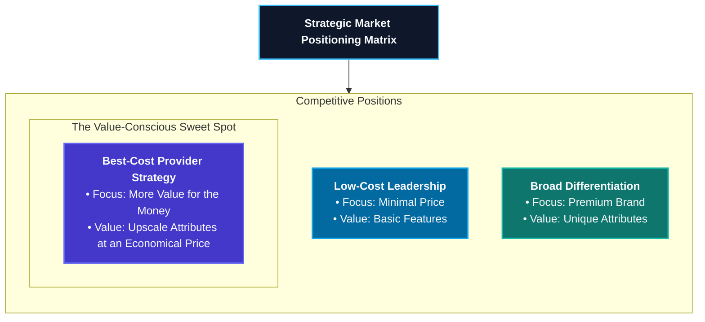

To profitably employ a best-cost provider strategy, a company must possess the unique value chain capabilities required to incorporate upscale attributes into its product offerings at a lower cost than rivals. By keeping its internal value chain costs below those of competitors offering similar features, the firm can either:

1. **Underprice rivals** who offer products with similar upscale attributes, or
2. **Offer much better quality and features** at the same price as rivals.

> [!NOTE]
> **Case Study: Toyota's Lexus Best-Cost Entry**
> In 1989, Toyota launched its Lexus line of luxury vehicles using a classic best-cost provider strategy. Drawing on its decades of experience in high-quality, low-cost manufacturing, Toyota designed the Lexus models to match the performance and luxury of established brands like Mercedes-Benz, BMW, and Jaguar.
>
> By keeping its manufacturing and distribution costs low relative to premium rivals, Toyota initially priced Lexus vehicles substantially below competitive luxury models. To support this positioning, Toyota established a separate dealer network focused on the high level of service and showroom experience expected by luxury car buyers. This combination of upscale features, exceptional service, and an attractive price enabled Lexus to rapidly secure a leading position in the luxury automobile market.

#### 6.4.1 When a Best-Cost Provider Strategy Works Best

A best-cost provider strategy is highly effective under the following market conditions:

- **Product differentiation is the industry norm:** In markets where buyers expect diverse options, a midrange offering stands out.
- **A large number of value-conscious buyers exist:** Many customers prefer high-value midrange products over cheap, stripped-down options or extremely expensive luxury items.
- **Economic downturns or recessions occur:** During recessions, price-sensitive but quality-conscious buyers migrate away from high-end differentiators to seek high-quality products at lower prices.
- **The firm occupies the strategic middle ground:** The company can position itself near the center of the market with either a medium-quality product at a below-average price or a high-quality product at an average price.

#### 6.4.2 The Risks of a Best-Cost Provider Strategy

The biggest danger of a best-cost strategy is getting squeezed from both sides:

1. **Low-Cost Leaders:** Pure low-cost providers may cut prices aggressively or improve their own products' basic features, eroding the best-cost firm's price advantage.
2. **High-End Differentiators:** Differentiated rivals may offer superior quality or prestigious brand images that pull quality-conscious buyers away, even at a higher price.

Without a strong cost-management capability, a best-cost provider risks becoming **"stuck in the middle."** In this scenario, the firm fails to achieve a low enough cost structure to compete on price, and fails to differentiate its products sufficiently to justify a premium price, resulting in poor financial performance and a weak market position.

| Strategy Option           | Cost Focus                      | Product Differentiation              | Key Risk                                         |
| :------------------------ | :------------------------------ | :----------------------------------- | :----------------------------------------------- |
| **Low-Cost Provider**     | Relentless cost reduction       | Standardized, basic product          | Price wars / low brand loyalty                   |
| **Broad Differentiation** | Controlled costs for uniqueness | High-value, unique features          | Over-differentiating / excessive premium         |
| **Best-Cost Provider**    | Cost-efficient upscale features | Value-engineered midrange attributes | Squeezed from both sides ("Stuck in the middle") |

---

### 6.5 Chapter 6 Summary

1. **Strategic Intent:** A company’s competitive strategy is its game plan for positioning itself in the marketplace, attracting customers, and defending against rival threats.
2. **Generic Framework:** The five generic competitive strategies are defined by a company's target market scope (broad vs. narrow) and its source of competitive advantage (lower costs vs. differentiation).
3. **Low-Cost Leadership:** Achieving a low-cost advantage requires performing value chain activities more cost-effectively than rivals and systematically leveraging the 10 cost drivers.
4. **Differentiation Edge:** Broad differentiation is built by integrating unique value drivers throughout the company's value chain, lowering the buyer's overall cost of ownership or increasing satisfaction.
5. **Focused Strategies:** Focused low-cost and focused differentiation strategies target a narrow market niche, serving the specialized needs of niche members better than broad-market rivals.
6. **Best-Cost Hybrid:** A best-cost provider strategy delivers upscale attributes at a midrange price, requiring a highly coordinated value chain capable of low costs and superior quality.
7. **Capabilities Alignment:** A strategy is only sustainable if it is supported by a tight fit with the company’s internal resources, capabilities, and organizational structure.

#### 6.5.1 The Security Manager's Strategic Perspective

For security and resilience professionals, understanding generic business-level strategies is essential. A company's choice of competitive strategy directly dictates operational priorities and resource allocation across all departments, including corporate security:

- In a **Low-Cost Provider** firm, security budgets are lean. Security managers must justify their programs by showing process efficiencies, minimizing waste, and demonstrating a clear return on investment (ROI) through loss prevention and risk reduction.
- In a **Differentiation** or **Best-Cost** firm, security is often leveraged as a value-adding asset. High-end retail, luxury hotels, and secure cloud storage providers utilize robust security, executive protection, and data privacy compliance as key differentiators to build brand trust and justify premium pricing.

---

## Chapter 7: Corporate-Level Strategies

> "However beautiful the strategy, you should occasionally look at the results."
> — _Sir Winston Churchill_

While business-level strategies focus on how to compete successfully within a single product market or industry, **corporate-level strategies** deal with the actions a diversified firm takes to gain a competitive advantage by operating in multiple markets or industries simultaneously (Porter 1996).

Corporate strategy takes a portfolio approach to strategic decision-making, looking across all of a firm's business units to determine how to allocate resources and maximize long-term enterprise value. Crafting corporate strategy requires top executives to determine how various business units fit together, how they impact one another, and how the parent corporation should be structured to optimize human capital, operational processes, and governance.

For security and operations managers, grasping the distinctions between business-level and corporate-level strategy is critical. While business strategy focuses on short-term tactical positioning, corporate strategy dictates long-term growth, capital allocation, and risk management across the entire corporate portfolio.

---

### 7.1 When to Consider Diversifying

Diversification strategies expand a firm's operations by entering new product markets, services, geographic regions, or stages of production. The primary purpose of diversification is to allow a company to enter lines of business that are distinct from its current operations.

Crafting a corporate diversification strategy involves three distinct facets:

1. **Picking New Industries to Enter:** Selecting target industries and deciding on the entry mode—whether through acquiring an existing firm, starting a new business from scratch (internal venture), or establishing a joint venture or strategic alliance.
2. **Leveraging Cross-Business Value Chain Relationships:** Identifying opportunities to share or transfer competitively valuable resources, capabilities, technologies, or brand assets across business units to achieve operational synergy.
3. **Optimizing the Business Lineup:** Initiating corporate actions to boost the collective performance of the portfolio, which may involve divesting poorly performing assets (retrenchment), acquiring new businesses, or restructuring the entire corporation.

Because of the demanding and highly complex nature of these tasks, corporate executives typically delegate the responsibility for business-level strategy to individual unit managers, focusing their own attention on portfolio coordination, capital allocation, and corporate governance.

#### 7.1.1 Building Value: The Three Tests of Corporate Advantage

Diversification must do more than simply spread business risk across different industries; it must add long-term economic value for shareholders. A corporate move to diversify into a new industry is only justified if it passes the **Three Tests of Corporate Advantage** (Porter 1987):

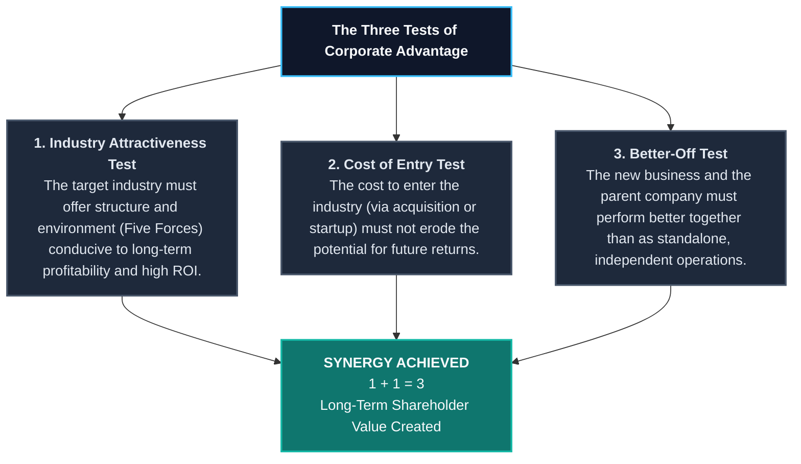

1. **The Industry Attractiveness Test:** The target industry must be structurally attractive, offering good long-term prospects for growth, profitability, and return on investment. Industry attractiveness is evaluated using the Five Forces framework and must match the strategic capabilities of the parent company.
2. **The Cost of Entry Test:** The cost of entering the target industry—whether through a high acquisition premium or the capital expenses of a startup—must not exceed the potential for future profitability. Since highly attractive industries often carry very high entry barriers or premium acquisition prices, passing this test requires rigorous financial discipline.
3. **The Better-Off Test:** The parent company and the new business unit must perform better together under a single corporate umbrella than they would as independent, standalone businesses. This positive spillover effect is known as **synergy** (where $1 + 1 = 3$), which is achieved by sharing or transferring competitively valuable value chain resources and capabilities.

Diversification moves that pass only one or two of these tests are of suspect value and often destroy shareholder wealth. A corporate acquisition must satisfy all three tests to build sustainable long-term value (Barney and Hesterly 2015).

### 7.2 Approaches to Diversification

When corporate executives decide to diversify, they must choose the entry mode that best balances risk, cost, speed, and strategic fit. The three primary avenues for entering a new industry are **acquisition**, **internal development (startup)**, and **strategic alliances or joint ventures** (Thompson et al. 2016).

#### 7.2.1 Diversifying by Acquisition of an Existing Business

Acquisition is the most popular and rapid means of entering a new industry. By purchasing an established firm, the acquirer immediately hurdles critical entry barriers such as acquiring technical know-how, securing supplier relationships, achieving economies of scale, building brand awareness, and gaining access to distribution channels.

Buying an ongoing concern allows the parent company to skip the lengthy and uncertain startup phase and move directly to building a strong competitive position. For example, in the pharmaceutical and biotechnology industries, where bringing a new patented drug to market can take over a decade, large pharmaceutical companies frequently acquire smaller, innovative biotech startups. Using their deep financial resources and expertise in the regulatory approval process, the acquiring firms can accelerate commercialization and generate economic profit much sooner.

> [!WARNING]
> **The High Failure Rate of Mergers and Acquisitions (M&As)**
> Despite their popularity, the majority of acquisitions fail to deliver long-term shareholder value. Research suggests that **70% to 90% of mergers and acquisitions fail** to achieve their stated financial and strategic goals (Martin 2016). Common pitfalls include:
>
> - **Overpaying:** Paying an excessive acquisition premium (which historically averages 25% or more above pre-acquisition market value) that erodes any potential financial gains (Kengelbach et al. 2019).
> - **Integration Failure:** Severe difficulties in merging distinct corporate cultures, information systems, operating processes, and reporting hierarchies.
> - **Flawed Due Diligence:** Failing to objectively evaluate the target company's true asset quality, liabilities, and market position before closing the transaction.

A professional **business valuation**—an objective economic evaluation conducted by third-party experts to determine the fair market value of a business unit—is essential to mitigate acquisition risks, serving as the financial anchor for partner buyouts, tax disputes, or corporate sales.

#### 7.2.2 Diversifying through Internal Development

Diversifying through internal development—often called **corporate venturing** or _new business development_—involves building a new subsidiary from scratch. This approach is highly attractive when:

- There are no suitable acquisition targets available in the target industry.
- The parent company already possesses the technical skills, capabilities, and intellectual capital needed to start the business.
- Launching a new competitor is less expensive than paying a hefty acquisition premium for an existing firm.
- The parent firm has sufficient time to develop the venture without losing first-mover advantages.

For example, **Johnson & Johnson** established _J&J Development Corporation_, a dedicated corporate venture capital arm, to fund internal startups and innovative projects that might otherwise be starved of standard capital expenditures (Raynor 2007).

However, corporate venturing carries substantial risks. Building a business from the ground up requires massive capital investments to establish manufacturing facilities, secure suppliers, hire and train personnel, establish distribution networks, and build customer trust. The failure rate of internal startups is exceptionally high, and their long development cycles can delay financial returns.

#### 7.2.3 Using Joint Ventures and Strategic Alliances

Joint ventures and strategic alliances are highly effective cooperative arrangements among independent companies with matching strategic goals, designed to share costs, risks, and resources. Thompson et al. (2016) identify three key scenarios where joint ventures are highly advantageous:

1. **High Complexity and Risk:** The strategic opportunity is too massive, complex, or financially risky for a single company to pursue alone.
2. **Complementary Capabilities:** The venture requires blending a diverse set of competencies, such as combining hardware manufacturing, software engineering, and customer service.
3. **Foreign Market Entry Barriers:** A domestic firm seeks to enter a foreign country but lacks local market knowledge, distribution relationships, or legal standing.

For instance, when entering the complex Indian market, **Starbucks** formed a 50-50 joint venture with the **Tata Group**, a massive Indian conglomerate. This cooperative strategy allowed Starbucks to rapidly secure premier retail locations, navigate local regulatory requirements, and leverage Tata's established supply chain and regional business expertise.

---

### 7.3 Choosing the Diversification Path: Related vs. Unrelated

Once the entry mode is selected, corporate strategists must decide whether to pursue **related diversification** (which centers on strategic fit across value chains) or **unrelated diversification** (which operates on a pure financial portfolio approach).

#### 7.3.1 Related Diversification

A related diversification strategy is built upon a firm entering new businesses that possess competitively valuable **cross-business value chain relationships**—known as **strategic fit**—with the company's existing operations.

By diversifying into businesses with related value chains, the parent corporation can create long-term economic value by:

- **Transferring expertise** and technical capabilities from one business unit to another.
- **Combining related activities** to eliminate duplicate efforts and reduce overall operating costs.
- **Sharing a single, highly respected brand name** across multiple product categories.
- **Leveraging corporate parenting capabilities** to upgrade competitive assets across all units.

#### 7.3.2 Identifying Cross-Business Strategic Fit along the Value Chain

Strategic fit is not a generic concept; it must be systematically identified and captured at specific points along the corporate value chain system:

```mermaid
flowchart TD
    %% Custom HSL Styling
    classDef title fill:#0F172A,stroke:#38BDF8,stroke-width:2px,color:#F8FAFC,font-weight:bold;
    classDef sharing fill:#0F766E,stroke:#14B8A6,stroke-width:2px,color:#F8FAFC;
    classDef unit fill:#1E293B,stroke:#475569,stroke-width:2px,color:#E2E8F0;
    classDef benefit fill:#4338CA,stroke:#6366F1,stroke-width:2px,color:#F8FAFC;

    Title["Figure 7.1: Value Chain Strategic Fit & Synergy"]:::title

    subgraph Units ["Corporate Portfolio"]
        BU1["<b>Business Unit A</b><br>Value Chain Activities"]:::unit
        BU2["<b>Business Unit B</b><br>Value Chain Activities"]:::unit
    end

    subgraph StrategicFit ["Points of Strategic Fit"]
        direction TB
        F1["<b>R&D & Technology</b><br>Share basic research, patents, and product design capabilities."]:::sharing
        F2["<b>Supply Chain & Purchasing</b><br>Consolidate purchasing volumes to gain bargaining leverage over suppliers."]:::sharing
        F3["<b>Operations & Manufacturing</b><br>Transfer quality management practices (TQM) and process designs."]:::sharing
        F4["<b>Sales & Marketing</b><br>Use a single sales force and share prestigious brand names."]:::sharing
        F5["<b>Distribution & Logistics</b><br>Utilize shared warehouses, shipping fleets, and order-processing systems."]:::sharing
    end

    Synergy["<b>CAPTURED SYNERGY</b><br>• Economies of Scope<br>• Lower Operating Costs<br>• Enhanced Competitive Power"]:::benefit

    BU1 --> StrategicFit
    BU2 --> StrategicFit
    StrategicFit --> Synergy
    Title --> Units
```

- **Upstream R&D and Technology Fit:** Business units can share basic scientific research, product design software, and engineering expertise, speeding up new product development and reducing R&D costs.
- **Supply Chain and Purchasing Fit:** Consolidating purchasing volumes across business units increases the corporation's bargaining power, enabling it to secure price concessions and shipping priorities from suppliers.
- **Operations and Manufacturing Fit:** Manufacturing units can transfer advanced process designs, lean manufacturing techniques, and quality management systems (such as Six Sigma), boosting product quality and manufacturing efficiency.
- **Sales and Marketing Fit:** Related units can utilize a single sales force, consolidate their advertising budgets, and share a premier corporate brand, increasing market reach and customer trust.
- **Distribution and Logistics Fit:** Units can share regional distribution centers, transport fleets, and order-fulfillment systems, driving down warehousing and shipping overheads.

#### 7.3.3 Strategic Fit and Economies of Scope

The primary economic benefit of related diversification is the achievement of **economies of scope**. Economies of scope represent cost-saving efficiencies that arise from sharing or transferring resources and capabilities across multiple business units.

> [!NOTE]
>
> ### Economies of Scale vs. Economies of Scope
>
> - **Economies of Scale:** Volume-based cost savings achieved within a _single business unit_ by spreading fixed overhead costs (such as factory depreciation or tooling costs) over a larger volume of production units.
> - **Economies of Scope:** Portfolio-based cost savings achieved _across multiple business units_ by sharing common resources (such as a shared sales force, corporate research lab, or distribution network) that none of the business units could afford to operate efficiently on a standalone basis.

---

### 7.4 Unrelated Diversification

An unrelated diversification strategy is built upon entering new businesses that have no strategic fit or value chain relationships with the company's existing operations. Rather than seeking operational synergy, corporate executives who pursue unrelated diversification act as **active portfolio managers**, focusing exclusively on financial returns, capital allocation, and risk management.

#### 7.4.1 Building Value through Unrelated Diversification: The Parenting Advantage

To justify unrelated diversification, the corporate parent must deliver a **parenting advantage**—proving that the business units perform better under its corporate ownership than they would as independent firms. The parent corporation creates value by:

1. **Efficient Capital Allocation:** Shifting capital among business units more efficiently than the external financial markets, redirecting cash from cash-rich mature units to fund high-growth opportunities.
2. **Corporate Restructuring:** Acquiring underperforming, poorly managed, or financially distressed companies at low prices, completely reorganizing their management, streamlining operations, and divesting non-essential assets to return the businesses to high profitability.
3. **General Management Parenting:** Providing high-caliber oversight, strategic leadership, sophisticated budgeting systems, and general management expertise that the individual business units could not afford on their own.

#### 7.4.2 Drawbacks of Unrelated Diversification

Unrelated diversification carries significant operational vulnerabilities:

- **The Demands of Wide-Ranging Oversight:** Corporate executives must understand the distinct key success factors, competitive dynamics, and technological changes across completely diverse industries. When a portfolio becomes too broad, corporate managers risk making poor strategic decisions due to information overload.
- **Fewer Synergies:** Because the business units lack value chain relationships, there are no opportunities to capture economies of scope or transfer operational capabilities, making the corporation entirely reliant on high financial performance from each individual unit.

#### 7.4.3 Misguided Motives for Unrelated Diversification

Many corporations embark on unrelated diversification for reasons that destroy shareholder wealth. Thompson et al. (2016) caution against four common misguided motives:

> [!CAUTION]
> **Wealth-Destroying Motives for Unrelated Diversification**
>
> 1. **Risk Reduction:** Spreading corporate investments over unrelated industries to reduce overall volatility is a flawed strategy. Shareholders can diversify their personal portfolios far more cheaply and efficiently by buying shares in different companies than a corporation can by executing complex, high-premium acquisitions.
> 2. **Growth for Growth’s Sake:** Pursuing acquisitions merely to increase total corporate revenues, without regard for profitability or return on capital, destroys value. Growth is only valuable if it is profitable.
> 3. **Earnings Stabilization:** Diversifying to offset cyclical downturns in one industry with cyclical upswings in another rarely works in practice. Consolidated earnings are seldom more stable in unrelated conglomerates than in focused firms, especially during major recessions.
> 4. **Managerial Self-Interest:** Executives may pursue acquisitions to increase the size of the firm simply to justify higher executive compensation, prestige, and power, creating severe agency conflicts.

---

### 7.5 Evaluating the Strategy of a Diversified Company

Evaluating the strategy of a diversified company requires corporate executives to analyze the entire portfolio using a systematic, six-step framework (Thompson et al. 2016).

```mermaid
flowchart TD
    %% Custom HSL Styling
    classDef stepNode fill:#1E293B,stroke:#475569,stroke-width:2px,color:#E2E8F0;
    classDef startNode fill:#0F172A,stroke:#38BDF8,stroke-width:3px,color:#F8FAFC,font-weight:bold;
    classDef endNode fill:#0F766E,stroke:#14B8A6,stroke-width:3px,color:#F8FAFC,font-weight:bold;

    S1["<b>Step 1: Evaluate Industry Attractiveness</b><br>Assess the structural appeal and ROI prospects of all industries in the portfolio."]:::startNode

    S2["<b>Step 2: Evaluate Business Unit Strength</b><br>Measure the competitive standing of each business unit in its respective industry."]:::stepNode

    S3["<b>Step 3: Analyze Strategic Fit</b><br>Identify value chain relationships and potential economies of scope."]:::stepNode

    S4["<b>Step 4: Check Resource Fit</b><br>Ensure corporate financial and nonfinancial resources are sufficient and balanced."]:::stepNode

    S5["<b>Step 5: Rank Business Units</b><br>Prioritize units for capital allocation and corporate parenting."]:::stepNode

    S6["<b>Step 6: Craft New Strategic Actions</b><br>Initiate grow/build, defend, restructure, or divest decisions."]:::endNode

    S1 --> S2
    S2 --> S3
    S3 --> S4
    S4 --> S5
    S5 --> S6
```

#### Step 1: Evaluating Industry Attractiveness

The first step is to quantitatively evaluate the attractiveness of the industries in which the firm operates, both individually and as a group. Executives assign importance weights (summing to 1.0) to key attractiveness measures, rate each industry on a scale of 1 to 10, and calculate a weighted attractiveness score:

| Industry Attractiveness Measure        | Importance Weight | Industry A Rating | Industry A Weighted Score | Industry B Rating | Industry B Weighted Score |
| :------------------------------------- | :---------------: | :---------------: | :-----------------------: | :---------------: | :-----------------------: |
| Market Size & Growth Rate              |       0.20        |         8         |           1.60            |         4         |           0.80            |
| Intensity of Competition (Five Forces) |       0.25        |         7         |           1.75            |         3         |           0.75            |
| Industry Profitability & ROI           |       0.20        |         8         |           1.60            |         5         |           1.00            |
| Cross-Industry Strategic Fit           |       0.15        |         9         |           1.35            |         1         |           0.15            |
| Regulatory & Political Factors         |       0.10        |         6         |           0.60            |         5         |           0.50            |
| Resource Requirements Match            |       0.10        |         7         |           0.70            |         8         |           0.80            |
| **Total Weights / Weighted Scores**    |     **1.00**      |         —         |         **7.60**          |         —         |         **4.00**          |

_Interpretation:_ An industry attractiveness score above 6.7 indicates high attractiveness (Industry A), while a score below 5.0 indicates a weak, unattractive market (Industry B).

#### Step 2: Evaluating Business Unit Competitive Strength

The second step appraises the competitive strength and market position of each business unit within its respective industry. Quantitative competitive strength scores are calculated using a weighted procedure:

| Competitive Strength Measure        | Importance Weight | Unit A Rating | Unit A Weighted Score | Unit B Rating | Unit B Weighted Score |
| :---------------------------------- | :---------------: | :-----------: | :-------------------: | :-----------: | :-------------------: |
| Relative Market Share               |       0.25        |       9       |         2.25          |       3       |         0.75          |
| Unit Cost Competitiveness           |       0.20        |       8       |         1.60          |       4       |         0.80          |
| Brand Image and Reputation          |       0.15        |       9       |         1.35          |       5       |         0.75          |
| Key Product Attributes & Quality    |       0.15        |       8       |         1.20          |       6       |         0.90          |
| Resource Alignment & Capabilities   |       0.15        |       8       |         1.20          |       5       |         0.75          |
| Bargaining Power (Suppliers/Buyers) |       0.10        |       7       |         0.70          |       4       |         0.40          |
| **Total Weights / Weighted Scores** |     **1.00**      |       —       |       **8.30**        |       —       |       **4.35**        |

_Interpretation:_ A competitive strength score above 6.7 represents a strong market leader (Unit A), while a score below 5.0 indicates a competitively weak business unit (Unit B).

#### The Nine-Cell Industry Attractiveness / Business Strength Matrix

Strategists plot each business unit on a **Nine-Cell Grid (3x3 Matrix)** using the quantitative industry attractiveness score (Y-axis) and the competitive strength score (X-axis). The area of each circle plotted represents the business unit's percentage contribution to total corporate revenues:

| Industry Attractiveness (Y)           | Strong Competitive Strength (X > 6.7)                                                                          | Average Competitive Strength (3.3 - 6.7)                                                            | Weak Competitive Strength (X < 3.3)                                                                         |
| :------------------------------------ | :------------------------------------------------------------------------------------------------------------- | :-------------------------------------------------------------------------------------------------- | :---------------------------------------------------------------------------------------------------------- |
| **High Attractiveness (Y > 6.7)**     | **HIGH PRIORITY: Invest & Grow**<br>Aggressively fund these units to maximize expansion and market leadership. | **MEDIUM PRIORITY: Selectively Reinvest**<br>Direct capital to build strength in specific segments. | **LOW PRIORITY: Restructure or Divest**<br>Pivotal candidates for operational turnaround or immediate sale. |
| **Medium Attractiveness (3.3 - 6.7)** | **MEDIUM PRIORITY: Selectively Reinvest**<br>Maintain market position and protect cash flow.                   | **MEDIUM PRIORITY: Defend & Harvest**<br>Limit capital spending; maximize cash extraction.          | **LOW PRIORITY: Divest or Liquidation**<br>Divest to free up capital and managerial bandwidth.              |
| **Low Attractiveness (Y < 3.3)**      | **MEDIUM PRIORITY: Defend & Harvest**<br>Protect strong position; treat as a reliable cash cow.                | **LOW PRIORITY: Divest or Harvest**<br>Extract residual cash; prepare for structured exit.          | **LOW PRIORITY: Divest or Liquidate**<br>Liquidate assets immediately to mitigate losses.                   |

---

### Step 3: Checking for Good Resource Fit

A diversified corporation must ensure its business lineup exhibits excellent **resource fit**—possessing sufficient financial and nonfinancial resources to support the entire portfolio without overtaxing corporate capabilities.

#### Financial Resource Fit: The Cash Cow vs. Cash Hog Portfolio Approach

A portfolio approach to financial resource fit is based on the cash flow and investment characteristics of different business units:

```mermaid
flowchart TD
    %% Custom HSL Styling
    classDef cow fill:#0369A1,stroke:#0EA5E9,stroke-width:2px,color:#F8FAFC;
    classDef hog fill:#BE123C,stroke:#F43F5E,stroke-width:2px,color:#F8FAFC;
    classDef star fill:#0F766E,stroke:#14B8A6,stroke-width:2px,color:#F8FAFC;
    classDef parent fill:#0F172A,stroke:#38BDF8,stroke-width:3px,color:#F8FAFC,font-weight:bold;

    Parent["<b>CORPORATE PARENT</b><br>Allocates Surplus Capital & Oversees Resource Fit"]:::parent

    Cow["<b>CASH COWS</b><br>• Market: Mature/Slow Growth<br>• Cash Flow: High Surplus<br>• Action: Extract Cash"]:::cow

    Hog["<b>CASH HOGS</b><br>• Market: Rapid Growth<br>• Cash Flow: Net Deficit<br>• Action: Sizable Capital Influx"]:::hog

    Star["<b>STAR BUSINESSES</b><br>• Market: High Growth/Market Leader<br>• Cash Flow: Self-Supporting<br>• Action: Reinvest for Future Cows"]:::star

    Cow -->|Surplus Cash Flow| Parent
    Parent -->|Strategic Reinvestment| Hog
    Hog -->|Market Expansion & Scale| Star
    Star -->|Market Maturity & Slow Growth| Cow
```

- **Cash Cows:** Business units with leading market positions in mature, slow-growth industries. Cash cows generate substantial surplus cash flow over what is needed to fund their own operations. Corporate parents extract this cash to pay corporate dividends, service debt, and fund growth in other business units.
- **Cash Hogs:** Business units in rapidly growing industries that require massive capital investments for new facilities, research, working capital, and technological upgrades to keep pace with demand. Because a cash hog's internal operations cannot generate enough cash to fund its expansion, the corporate parent must provide a steady influx of capital.
- **Star Businesses:** Strong, market-leading business units in high-growth markets. Stars are typically self-supporting, generating enough cash flow to cover their rapid expansion, and are destined to become the cash cows of the future as their markets mature.

Ideally, the corporate parent maintains a **balanced financial portfolio**—possessing enough cash cows to comfortably fund the strategic expansion of its cash hogs, eventually transforming those hogs into self-supporting star businesses and future cash cows.

#### Nonfinancial Resource Fit

Nonfinancial resource fit evaluates whether the parent corporation possesses the specific management capabilities, technological resources, and parenting assets required to support its business units. Corporates must guard against **stretching corporate resources too thin**—a severe operational failure that occurs when a corporation acquires too many businesses in diverse industries, overwhelming its managerial bandwidth and organizational systems.

---

### Step 4: Ranking Business Units and Assigning a Priority for Resource Allocation

Corporate executives must rank the business units in the portfolio from strongest to weakest based on industry attractiveness, competitive strength, and cash flow contribution. Strategists prioritize the units to ensure capital is directed to the opportunities that offer the highest return on investment:

1. **Top Priority (High Capital Allocation):** Star businesses and promising cash hogs in attractive industries that possess high growth potential.
2. **Medium Priority (Selective Reinvestment):** Established cash cows in mature industries, with capital limited to defending their market leadership.
3. **Lowest Priority (Harvest or Divest):** Competitively weak cash hogs or units in unattractive, low-growth industries.

---

### Step 5: Crafting New Strategic Moves to Improve Overall Portfolio Performance

The evaluation culminates in concrete corporate actions to improve the portfolio's long-term performance. Corporate executives choose from four primary pathways:

1. **Stick Closely to the Existing Lineup:** Direct corporate efforts toward strengthening the competitive positions of the current business units, avoiding new acquisitions.
2. **Broaden the Corporate Scope:** Enter new related or unrelated industries by executing new acquisitions, launching internal startups, or forming strategic alliances.
3. **Retrench and Narrow the Scope:** Divest poorly performing, structurally weak, or strategically misaligned business units, selling them to other firms or spinning them off as independent companies.
4. **Broadly Restructure the Corporation:** Execute a complete portfolio turnaround by divesting a large number of underperforming business units and acquiring promising new firms in high-growth industries.

---

### 7.6 Chapter 7 Summary

1. **Corporate vs. Business Strategy:** Corporate strategy focuses on managing a portfolio of diverse business units operating in multiple industries, whereas business strategy centers on competing successfully in a single product market.
2. **Entry Pathways:** Corporations diversify through acquisition (rapid entry but carries a high premium and failure rate), internal development (complete control but slow and high risk), or joint ventures (shared risk but requires high cooperation).
3. **The Three Tests:** A diversification move only creates long-term shareholder value if it satisfies the Industry Attractiveness, Cost of Entry, and Better-Off (synergy) tests.
4. **Related Diversification:** Centers on strategic fit along value chains, enabling the corporation to capture economies of scope and transfer valuable capabilities.
5. **Unrelated Diversification:** Relies on a pure financial portfolio approach, requiring the corporate parent to deliver a parenting advantage through capital allocation, general management oversight, or restructuring.
6. **Portfolio Evaluation:** Executives use a six-step framework to evaluate diversified portfolios, calculating industry attractiveness and unit competitive strength to plot units on a Nine-Cell Matrix.
7. **Resource Fit:** Corporates must ensure a balanced financial fit—using cash flow from mature Cash Cows to fund the expansion of cash-hungry Cash Hogs—while avoiding stretching nonfinancial management capabilities too thin.

---

## Chapter 8: International Business

> "Some form of international business has existed since the beginning of recorded time, serving as a primary catalyst for exploration, settlement, and the wealth of nations."
> — _Anonymous_

Throughout human history, the pursuit of cross-border trade has driven geopolitical exploration, established global transport networks, and shaped the wealth of nations. In the modern economic era, expanding operations beyond domestic borders is a highly attractive pathway for corporate growth, but it introduces substantial operational complexities and strategic risks.

While domestic business strategies focus on competing within a single national environment, **international business strategies** require firms to manage operations across multiple distinct country environments. This requires assessing diverse customer demographics, regional political regulations, host-government economic policies, and foreign currency fluctuations to design a coordinated global strategy.

For security, resilience, and operations professionals, understanding international business is essential. Managing assets across multiple borders requires designing risk mitigation programs that address regional threats, supply chain vulnerabilities, geopolitical instability, and host-country compliance standards.

---

### 8.1 Why Companies Decide to Enter Foreign Markets

Firms do not expand internationally merely to increase their geographic footprint; cross-border expansion must provide a distinct competitive advantage. Thompson et al. (2016) identify five primary drivers of international expansion:

1. **To Access New Customers:** Expanding into foreign country markets offers vast opportunities for sales growth, especially when domestic markets are mature, saturated, or stagnating.
2. **To Achieve Lower Costs:** International scale allows a firm to increase manufacturing volumes, capturing greater economies of scale and moving down the learning and experience curve.
3. **To Leverage Core Competencies:** Splicing a highly successful domestic capability—such as a proprietary technology, a prestigious brand image, or an efficient operating system—and replicating it in foreign markets where local rivals lack similar strengths.
4. **To Access Low-Cost Inputs or Specialized Resources:** Locating specific value chain activities in countries that offer abundant, low-cost inputs (such as natural resources or cheap manufacturing labor) or specialized intellectual assets (such as Silicon Valley software engineers).
5. **To Spread Business Risk:** Operating across multiple national markets reduces a corporation's dependence on any single country's economic stability, cushioning the firm against domestic recessions or local market downturns.

---

### 8.2 Why Competing Across National Borders Makes Strategy More Complex

Expanding across national borders increases strategic complexity because of five critical international factors:

1. **Home-Country Advantages:** Significant differences in host-country resource strengths, labor costs, and infrastructure.
2. **Location-Based Advantages:** Opportunities to disperse value chain activities to achieve low costs or high quality.
3. **Host-Government Policies:** Regional regulatory requirements, trade restrictions, and political risks.
4. **Adverse Exchange Rate Shifts:** Strategic vulnerabilities caused by fluctuating national currencies.
5. **Demographic and Cultural Pressures:** Sharp differences in customer demographics, buyer tastes, and cultural conditions.

#### 8.2.1 Home-Country Industry Advantages: Porter’s Diamond Model

To understand why certain companies from specific countries successfully dominate global markets, strategists utilize **Porter's Diamond of National Competitive Advantage** (Porter 1990). The model outlines four home-country factors that shape a firm's capacity to compete globally:

```mermaid
flowchart TD
    %% Custom HSL Styling
    classDef title fill:#0F172A,stroke:#38BDF8,stroke-width:2px,color:#F8FAFC,font-weight:bold;
    classDef diamond fill:#1E293B,stroke:#475569,stroke-width:2px,color:#E2E8F0;
    classDef outcome fill:#0F766E,stroke:#14B8A6,stroke-width:2px,color:#F8FAFC;

    Title["Porter's Diamond of National Advantage"]:::title

    subgraph Diamond ["Four Determinants of National Competitive Advantage"]
        direction TB
        F1["<b>1. Factor Conditions</b><br>Availability of raw materials, labor skills, infrastructure, and capital resources."]:::diamond

        F2["<b>2. Demand Conditions</b><br>The size, growth, and sophistication of home-market customer needs."]:::diamond

        F3["<b>3. Related & Supporting Industries</b><br>The presence of world-class domestic suppliers and complementary clusters."]:::diamond

        F4["<b>4. Firm Strategy, Structure, & Rivalry</b><br>The intensity of domestic competition and local management styles."]:::diamond
    end

    Outcome["<b>GLOBAL COMPETITIVE ADVANTAGE</b><br>National firms successfully outcompete foreign rivals in global markets."]:::outcome

    Title --> Diamond
    Diamond --> Outcome
```

1. **Factor Conditions:** The availability, quality, and cost of basic inputs (such as raw materials, natural harbors, and cheap labor) and advanced inputs (such as specialized scientific talent, digital communication infrastructure, and capital resources).
2. **Demand Conditions:** The size, growth rate, and sophistication of home-market customer requirements. A highly demanding, sophisticated domestic customer base forces national companies to continuously innovate and elevate product quality.
3. **Related and Supporting Industries:** The presence of world-class domestic supplier networks and complementary industries. Local clusters of related industries facilitate knowledge sharing, rapid technical collaboration, and low-cost component sourcing (e.g., Silicon Valley's technology cluster).
4. **Firm Strategy, Structure, and Rivalry:** The intensity of domestic competition and local organizational structures. Vigorous rivalry among local competitors forces firms to optimize process designs, trim overheads, and build strong strategic capabilities, preparing them to compete aggressively on the global stage.

#### 8.2.2 Location-Based Advantages: Concentrating vs. Dispersing Activities

To maximize competitive power, global firms must decide whether to concentrate their value chain activities in a few select countries or disperse them across many geographic locations:

- **Concentrating Activities:** Firms centralize activities in one or a few giant plants when:
  - Significant economies of scale exist in production or distribution.
  - Sizable learning and experience curve benefits exist, requiring a concentrated workforce to master advanced technologies.
  - Certain geographic locations possess superior resources, specialized labor pools, or lower input costs (e.g., manufacturing high-tech circuit boards in Taiwan to utilize advanced technical skills at a lower cost than in Western countries).
- **Dispersing Activities:** Firms spread activities across many host countries when:
  - High shipping costs make centralizing production uneconomical.
  - Regional distribution centers are required to ensure quick customer response times.
  - Host-government policies (such as local content requirements or high tariffs) penalize import strategies, forcing the firm to establish local manufacturing plants.

#### 8.2.3 Host-Government Policies and Geopolitical Risks

Operating in foreign markets requires navigating a complex web of host-government policies, which can act as significant trade barriers or investment incentives. Host governments frequently impose:

- **Tariffs and Import Quotas:** Levies and volume restrictions designed to shield domestic manufacturers from foreign competitors.
- **Local Content Requirements:** Regulations dictating that a certain percentage of a product's components must be sourced or manufactured locally.
- **Strict Safety and Environmental Standards:** High regulatory compliance costs that favor local competitors who are already aligned with regional rules.

Additionally, international firms face severe **geopolitical risks** in unstable country environments. These risks include host-government instability, unexpected regulatory shifts, currency expropriation, sudden nationalization of corporate assets, or civil unrest—all of which require robust physical security and strategic resilience planning.

#### 8.2.4 The Risks of Adverse Exchange Rate Shifts

Operating in multiple countries exposes a corporation to significant financial volatility due to fluctuating national currency exchange rates. Exchange rate shifts directly dictate a firm's cost competitiveness:

- **Cost Competitiveness of Manufacturing Plants:** A weakening domestic currency (e.g., a weaker U.S. dollar) is highly advantageous for home-country manufacturing plants. It makes domestic goods cheaper for foreign buyers using stronger currencies, boosting exports and manufacturing jobs. Conversely, a stronger domestic currency makes home-country plants less cost-competitive relative to foreign rivals.
- **Translation of Foreign Profits:** A weaker domestic currency increases the value of foreign-earned profits when converted back into the parent firm's reporting currency. For example, if a U.S. firm earns 10 million euros in Europe, those euros translate into a much larger dollar amount when the dollar is weak relative to the euro.

#### 8.2.5 Demographic, Cultural, and Market Pressures: Customization vs. Standardization

Buyer tastes, living standards, and demographic conditions vary dramatically across national borders. These differences force international firms to resolve a fundamental strategic tension: **Local Customization vs. Global Standardization**:

- **Local Customization:** Tailoring product designs, marketing campaigns, and service models to match the unique tastes and cultural expectations of each individual host country. While local customization increases customer appeal, it drives up manufacturing and logistics costs due to shorter production cycles, inventory complexity, and a lack of standard components.
- **Global Standardization:** Offering a uniform product worldwide. A standardized strategy allows the firm to capture massive global economies of scale and learning curve benefits, driving down unit manufacturing costs and enabling a low-cost competitive advantage. However, a standardized offering risks failing to appeal to buyers in countries with distinct cultural preferences or living standards.

### 8.3 Strategic Options for Entering International Markets

Once an enterprise decides to expand beyond its domestic borders, managers must select the most appropriate mode of entry. The choice of entry mode is a major strategic decision that shapes the company's financial commitment, operational control, and risk profile. Thompson et al. (2016) outline **five primary strategic options** for entering foreign markets:

#### 1. Export Strategies

Using domestic plants as a production base for exporting goods to foreign markets is an attractive, low-risk strategy. Exporting minimizes capital investment requirements, as the firm avoids the expense of building manufacturing facilities abroad. It allows the company to centralize production in a few highly efficient plants, leveraging scale economies and moving down the experience curve.

However, an export strategy is highly vulnerable to:

- High shipping and transportation costs.
- Adverse currency exchange rate shifts that erode price competitiveness.
- Import tariffs, quotas, and other protectionist trade barriers.
- A heavy reliance on foreign distributors who may lack commitment to the brand.

#### 2. Licensing Strategies

Licensing makes strategic sense when a firm possesses valuable technical know-how, patents, or a proprietary product but lacks the financial resources or organizational capability to enter foreign markets directly. By licensing trademark or production rights to foreign firms, the company generates a steady stream of royalty income while shifting all local costs, marketing risks, and capital expenditures to the foreign licensee.

The primary hazard of licensing is the risk of providing proprietary technological know-how to foreign companies, thereby losing control over its use and potentially creating a future global competitor.

#### 3. Franchising Strategies

While licensing is ideal for manufacturers, franchising is the preferred expansion vehicle for service and retail enterprises (e.g., McDonald's, Yum! Brands, 7-Eleven, Hilton Hotels). The franchisor recruits, trains, and monitors foreign franchisees, who bear the vast majority of the capital costs and operational risks of establishing local outlets.

> [!TIP]
> **Franchise Due Diligence and Quality Control**
> Sourcing local partners in foreign countries requires rigorous vetting. Service quality, inventory consistency, and process compliance can vary widely due to local cultural norms and operating standards. International franchisors frequently utilize **security and due diligence professionals** to:
>
> - Run comprehensive background checks on potential franchisees to prevent fraud and malfeasance.
> - Vet regional suppliers to guarantee raw material quality and ethical labor standards.
> - Audit local facilities to enforce strict adherence to corporate operating blueprints.

#### 4. Foreign Subsidiary Strategies: Acquisition vs. Greenfield

For firms wanting direct operational control over all value chain activities in a host country, establishing a wholly-owned **foreign subsidiary** is the preferred path. This can be achieved through two distinct approaches:

- **Acquisition of an Existing Local Firm:** Buying an ongoing business is the quickest and least risky way to hurdle local entry barriers (e.g., gaining immediate access to distribution networks, supplier relationships, and regulatory approvals). The acquirer must decide whether to pay a premium for a highly successful local firm or buy a struggling competitor at a bargain price to restructure it.
- **Greenfield Venture (Internal Startup):** Building an operating subsidiary from the ground up. Entering via a greenfield venture is highly attractive when building a new plant is cheaper than buying an existing one, the firm has deep experience in launching international subsidiaries, and the local market can absorb new production capacity without disrupting the supply-demand balance. However, greenfield ventures are highly capital-intensive, carry a high risk of failure, and represent the slowest path to market entry.

#### 5. Strategic Alliances and Joint Ventures

Cooperative agreements and joint ventures allow independent companies to share resources, operational costs, and risks. Host-country alliances are highly valuable for navigating foreign regulatory barriers, leveraging local distribution networks, and gaining deep insights into local buyer preferences.

However, alliances carry significant vulnerabilities, including the potential theft of proprietary technology, operational friction caused by cultural clashes, and an over-dependence on the foreign partner for core competencies.

| Foreign Entry Option         | Capital Investment | Operational Control | Primary Advantage                                                  | Key Strategic Risk                                         |
| :--------------------------- | :----------------: | :-----------------: | :----------------------------------------------------------------- | :--------------------------------------------------------- |
| **Exporting**                |        Low         |         Low         | Leverages domestic scale economies; low capital risk.              | Shipping costs, tariffs, and currency volatility.          |
| **Licensing**                |      Minimal       |       Minimal       | Low financial risk; rapid expansion for proprietary tech.          | Loss of control over IP; risks creating rivals.            |
| **Franchising**              |        Low         |       Medium        | Rapid expansion for retail/service; franchisee bears capital risk. | High coordination costs; quality control vulnerabilities.  |
| **Acquisition**              |        High        |        High         | Fastest entry path; bypasses local entry barriers immediately.     | High premium costs; severe integration challenges.         |
| **Greenfield Venture**       |     Very High      |        High         | Complete control; customized facilities and processes.             | Slowest entry path; highest capital risk exposure.         |
| **Alliance / Joint Venture** |       Medium       |       Medium        | Shared costs and risks; local partner navigation.                  | Cultural friction; operational deadlock; technology theft. |

---

### 8.4 International Strategy: The Three Main Approaches

As an enterprise expands further across the globe, it must navigate the fundamental tension between the **need for local responsiveness** (customizing offerings for local cultures and regulations) and the **need for global integration** (standardizing offerings to maximize efficiency and capture economies of scale). This tension gives rise to three main international strategic approaches (Bartlett and Ghoshal 1998):

```mermaid
flowchart TD
    %% Custom HSL Styling
    classDef title fill:#0F172A,stroke:#38BDF8,stroke-width:2px,color:#F8FAFC,font-weight:bold;
    classDef multidomestic fill:#B45309,stroke:#F59E0B,stroke-width:2px,color:#F8FAFC;
    classDef global fill:#0369A1,stroke:#0EA5E9,stroke-width:2px,color:#F8FAFC;
    classDef transnational fill:#4338CA,stroke:#6366F1,stroke-width:2px,color:#F8FAFC;

    Title["The Three Main International Strategic Approaches"]:::title

    MD["<b>1. Multidomestic Strategy</b><br>• Approach: Think Local, Act Local<br>• Focus: High Local Responsiveness<br>• Customizes products and marketing for each country."]:::multidomestic

    GL["<b>2. Global Strategy</b><br>• Approach: Think Global, Act Global<br>• Focus: High Global Standardization<br>• Sells standardized products worldwide; centralizes operations."]:::global

    TN["<b>3. Transnational Strategy</b><br>• Approach: Think Global, Act Local<br>• Focus: Balanced Hybrid<br>• Standardizes core processes; customizes local features."]:::transnational

    Title --> MD
    Title --> GL
    Title --> TN
```

#### 8.4.1 Multidomestic Strategy: "Think Local, Act Local"

A multidomestic strategy is appropriate when significant differences exist in demographic, cultural, regulatory, and market conditions across host countries. The firm decentralizes decision-making, giving local managers the authority to customize product features, packaging, and marketing campaigns to match local tastes (e.g., varying food ingredients and brand names country-by-country).

- **Primary Drawback:** Raising production and logistics costs due to shorter production runs and high inventory complexity, while preventing the transfer of core capabilities across borders.

#### 8.4.2 Global Strategy: "Think Global, Act Global"

A global strategy is highly effective when buyer needs are homogenous worldwide and massive cost savings can be achieved through standardization. The firm centralizes manufacturing, R&D, and distribution, selling the exact same products under a single global brand name everywhere. Decisions are highly centralized at corporate headquarters.

- **Primary Drawback:** Failing to address local buyer needs as precisely as local competitors, while suffering from high transport costs and coordination overheads.

#### 8.4.3 Transnational Strategy: "Think Global, Act Local"

A transnational strategy is a balanced hybrid designed to capture both the cost efficiencies of global integration and the customer appeal of local customization. Using advanced mass-customization manufacturing techniques, the firm standardizes its core product architectures and operating systems globally, while allowing regional subsidiaries to customize superficial features to satisfy local tastes (e.g., McDonald's customizing menus worldwide while maintaining strict operational layouts and quality controls).

- **Primary Drawback:** The most complex and expensive strategy to implement, placing severe coordination demands on corporate management.

| Strategic Dimension          | Multidomestic ("Think Local, Act Local")                     | Global ("Think Global, Act Global")                            | Transnational ("Think Global, Act Local")                       |
| :--------------------------- | :----------------------------------------------------------- | :------------------------------------------------------------- | :-------------------------------------------------------------- |
| **Core Philosophy**          | High responsiveness to local markets; decentralized control. | High standardization to drive down costs; centralized control. | Hybrid optimization of both local responsiveness and low costs. |
| **Product Strategy**         | Highly customized country-by-country.                        | Uniform, standardized worldwide product.                       | Standardized core architecture with localized variations.       |
| **Strategic Focus**          | Local differentiation based on local tastes.                 | Low-cost or standardized differentiation globally.             | Cross-border resource transfer and operational flexibility.     |
| **Organizational Structure** | Decentralized federation; local autonomy.                    | Centralized hub; tight headquarters control.                   | Transnational network; integrated interdependence.              |
| **Major Benefit**            | High customer appeal; rapid response to local shifts.        | Massive economies of scale and learning curve cost savings.    | Maximizes both operational efficiency and local market fit.     |
| **Key Vulnerability**        | Fails to capture global scale; high operating costs.         | Insensitive to local market changes; highly centralized.       | Extremely difficult to execute; highly complex coordination.    |

---

### 8.5 International Operations and the Quest for Competitive Advantage

Firms leverage their cross-border footprint to build sustainable competitive advantages in three distinct ways:

#### 1. Using Location to Build a Cost or Differentiation Edge

Strategists must determine whether to **concentrate** or **disperse** value chain activities:

- **Concentration of Activities:** Centralizing activities in one or a few strategic locations is highly advantageous when significant economies of scale exist, rapid learning curve cost savings are achieved by a concentrated workforce, or specific countries possess superior resources (e.g., concentrating circuit board manufacturing in Taiwan to leverage advanced technical skills and low operating costs).
- **Dispersion of Activities:** Spreading activities across many countries is preferred when high shipping costs make centralization uneconomical, regional distribution is needed to ensure fast customer response times, or host-government tariffs and local content laws penalize imports.

#### 2. Cross-Border Sharing and Transfer of Resources

Firms can extend their competitive advantage by cost-effectively transferring valuable resources, technologies, and intellectual assets across borders. A capability developed in one national subsidiary (e.g., Samsung's Silicon Valley R&D insights) can be rapidly transferred back to elevate operational quality across all global plants.

#### 3. Benefiting from Cross-Border Coordination

Operating in multiple countries allows a firm to coordinate operations in ways that domestic-only rivals cannot match. For example, a global firm can shift production schedules dynamically across plants to bypass local labor strikes, capitalize on temporary regional tax breaks, or hedge against sudden currency exchange rate shifts.

---

### 8.6 Cross-Border Strategic Moves: Profit Sanctuaries & Deterrence

A critical concept in international strategy is the management of **profit sanctuaries**—highly profitable country markets where a firm enjoys a dominant, protected, or structurally secure competitive position (often its home market). Global firms leverage their profit sanctuaries to wage strategic battles:

```mermaid
flowchart LR
    %% Custom HSL Styling
    classDef sanctuary fill:#0F172A,stroke:#38BDF8,stroke-width:2px,color:#F8FAFC,font-weight:bold;
    classDef subsidization fill:#0369A1,stroke:#0EA5E9,stroke-width:2px,color:#F8FAFC;
    classDef battle fill:#BE123C,stroke:#F43F5E,stroke-width:2px,color:#F8FAFC;

    PS["<b>Firm A's Profit Sanctuary</b><br>(Home Market: Protected, High Margin)"]:::sanctuary

    CS["<b>Cross-Subsidization</b><br>• Divert surplus cash flow.<br>• Underprice rivals in target market.<br>• Sustain low margins/losses."]:::subsidization

    Target["<b>Hostile Target Market</b><br>(Competitor Firm B's Home Market)<br>• Launch aggressive price cuts.<br>• Drain Firm B's financial resources."]:::battle

    PS -->|Surplus Capital| CS
    CS -->|Attack Strategy| Target
```

- **Cross-Subsidization:** A firm diverts surplus cash flow generated within its protected profit sanctuary to fund aggressive, low-priced competitive offenses in another competitor's home market, sustaining long-term losses there to drain the rival's resources and steal market share.
- **Mutual Restraint and Deterrence:** Possessing a presence in a global rival's home market acts as a powerful strategic deterrent. It signals to the rival that any aggressive competitive attack in other markets will trigger a costly, retaliatory price war directly within its own core profit sanctuary, encouraging mutual restraint.

---

### 8.7 Strategies for Competing in Developing-Country Markets

Developing markets—such as the BRIC nations (Brazil, Russia, India, China)—offer vast customer growth potential but feature low consumer incomes, primitive distribution infrastructures, and distinct institutional voids. Strategists use three primary approaches to enter these regions:

1. **Compete on the Basis of Low Price:** Completely re-engineer products to strip out non-essential features, utilizing local low-cost inputs to offer attractive, budget-friendly prices matching local purchasing power.
2. **Modify the Corporate Business Model:** Adapt value chain activities to accommodate local infrastructure shortcomings (e.g., using mobile payments and local neighborhood pickup points where credit card access and home delivery are unavailable).
3. **Try to Change the Local Market:** Invest heavily to upgrade local distribution networks, educate consumers, and establish new industry standards, shifting local buying habits to align with the company's established global business model.

---

### 8.8 Defending Against Global Giants: Strategies for Local Companies

Local firms in developing countries can successfully defend their home markets against massive global giants by adopting targeted strategies:

- **Exploit Infrastructure Shortcomings:** Design operating systems that bypass primitive local transport networks or fragmented retail systems where global giants struggle to operate efficiently.
- **Leverage Deep Local Market Knowledge:** Utilize established local relationships, a deep understanding of local customer tastes, and a highly familiar local brand to build customer loyalty that global entrants cannot easily duplicate.
- **Employ Mass-Growth Strategies:** Expand rapidly in the home market through mergers, acquisitions, and local capacity upgrades to achieve defensive scale before global giants can fully establish their presence.
- **Transfer Expertise to Adjacent Borders:** Take successful local business models and expand into neighboring regional developing countries that share similar demographics and market conditions.

---

### 8.9 Relevant Threats to International Business Development

International business expansion faces severe systemic risks in the modern macroeconomic environment. Security, operations, and resilience managers must design risk management systems to mitigate these four primary threats:

1. **Geopolitical Instability and Sovereign Risks:** Host-government instability, sudden regulatory reconfigurations, tariff wars, assets nationalization, or expropriation.
2. **Global Supply Chain Vulnerabilities:** A heavy reliance on centralized global manufacturing hubs (e.g., semiconductors in Taiwan or assembly in China) exposes firms to severe disruptions from regional natural disasters, labor strikes, port closures, or military conflicts.
3. **Macroeconomic and Sovereign Debt Crises:** Economic volatility, hyperinflation, host-country sovereign defaults, and systemic banking collapses (e.g., the 2008 financial crisis or the subsequent European debt crisis).
4. **Global Health Crises & Pandemics:** As demonstrated by the COVID-19 pandemic, global health crises can trigger sudden border closures, state-mandated lockdowns, labor shortages, and transport bottlenecks that completely paralyze global operations and devastate consumer spending.

---

### 8.10 Chapter 8 Summary

1. **Expansion Drivers:** Firms expand internationally to access new customers, achieve lower operating costs, leverage core competencies, secure low-cost resources, and diversify business risks.
2. **Strategic Complexity:** Operating across borders is complex due to country-to-country variations in resources, location advantages, host-government regulations, currency fluctuations, and buyer preferences.
3. **Porter's Diamond:** Home-country advantages are dictated by the four factors of Porter's Diamond: Factor Conditions, Demand Conditions, Related Industries, and Firm Strategy/Rivalry.
4. **Strategic Options:** Entering foreign markets is achieved via exporting, licensing, franchising, Wholly-Owned Subsidiaries (Acquisition or Greenfield), and joint ventures.
5. **Core Strategic Frameworks:** Companies compete globally using either a Multidomestic (think local, act local), Global (think global, act global), or Transnational (think global, act local) strategy.
6. **Competitive Leverage:** Global firms use location advantages (concentrating vs. dispersing activities), share cross-border capabilities, and manage profit sanctuaries for cross-subsidization and deterrence.
7. **Developing Markets:** Success in developing markets requires adapting business models to low purchasing power and local infrastructure gaps, while local firms defend their home turf using deep regional relationships and local market expertise.

---

## Chapter 9: Building an Organization Capable of Good Strategy Execution

> "In the end, strategy is nothing more than good intentions unless it is effectively implemented."
> — _Clayton Christensen_

Once senior executives have crafted a sound competitive strategy, corporate focus shifts completely to converting those strategic plans into concrete actions and profitable results. Putting a strategy into place and getting the organization to execute it proficiently requires an entirely different set of managerial skills.

While crafting strategy is an **analysis-driven activity** focused on evaluating market opportunities and matching them to internal capabilities, executing strategy is an **operations-driven activity** focused on managing people, business processes, organization structures, and resource systems.

Experienced managers know that it is far easier to design a brilliant strategic plan than it is to execute the plan and achieve targeted outcomes. A comprehensive study of 400 global CEOs found that **executional excellence** was the single greatest challenge facing executives in today's business landscape (Sull et al. 2015).

#### The Operations-Driven Nature of Strategy Execution

Strategy execution is an action-oriented task that tests a manager's ability to direct organizational change, build and strengthen competitive capabilities, allocate resource budgets, institute supportive policies, and manage day-to-day operations.

```mermaid
flowchart TD
    %% Custom HSL Styling
    classDef execute fill:#4338CA,stroke:#6366F1,stroke-width:3px,color:#F8FAFC,font-weight:bold;
    classDef task fill:#1E293B,stroke:#475569,stroke-width:2px,color:#E2E8F0;
    classDef parent fill:#0F172A,stroke:#38BDF8,stroke-width:2px,color:#F8FAFC,font-weight:bold;

    Parent["<b>Senior Executives (CEO / C-Suite)</b><br>Establish vision, set company goals, and dictate strategy."]:::parent

    Execute["<b>Proficient Strategy Execution</b><br>(Operations-Driven / Whole-Organization Task)"]:::execute

    T1["<b>Resource Allocation</b><br>Align budgets to strategy-critical activities."]:::task
    T2["<b>Capability Building</b><br>Strengthen and upgrade competitive competencies."]:::task
    T3["<b>Supportive Policies</b><br>Institute operating procedures and systems."]:::task
    T4["<b>Structure & Governance</b><br>Design supportive organizational hierarchies."]:::task
    T5["<b>Cultural Alignment</b><br>Nurture a culture dedicated to executional excellence."]:::task

    Parent --> Execute
    Execute --> T1
    Execute --> T2
    Execute --> T3
    Execute --> T4
    Execute --> T5
```

Executing strategy successfully is not a task limited to a few top executives; it is a **whole-organization task** that requires active support from all levels of management:

- **The CEO and C-Suite:** Establish the overarching strategic direction, align senior staff, and monitor company-wide execution.
- **Middle and Lower-Level Managers:** Implement the specific new operating practices, manage regional workflows, and ensure their departments meet performance targets.
- **Frontline Employees:** Perform the day-to-day value chain activities (such as manufacturing, customer service, and quality control) that directly determine whether corporate performance goals are achieved.

Because implementing new strategies requires modifying established working habits and building new organizational capabilities, the strategy execution process is rarely accomplished overnight. Depending on the size of the company and the scale of the strategic shift, achieving executional proficiency can take anywhere from **several months to several years**.

### A Framework For Executing Strategy

Implementing and executing strategy is a hands-on, operations-driven activity that revolves around managing people, business processes, and organizational structures. The approach to executing strategy must be customized to fit the specific context of a company's situation. Devising minor tweaks to an existing strategy differs significantly from launching a major strategic shift, as the contextual demands, resource needs, and capabilities required are entirely different.

For instance, the techniques required to execute a low-cost provider strategy differ drastically from those needed for a broad differentiation strategy. Similarly, executing a strategy in a stable market is distinct from responding to a crisis, a financial turnaround, or a new market entrant. Consequently, there is no single managerial recipe, checklist, or universal "gold standard" for successful strategy execution. The specific "to-do list" represents management's judgment of how to proceed within the context of the prevailing circumstances.

Nonetheless, there are ten common managerial tasks that cut across all organizational circumstances and must be executed well for a strategy to succeed:

1. **Staffing the Organization:** Recruiting, hiring, and retaining capable managers and employees with the required experience, technical skills, and intellectual capital.
2. **Developing Capabilities:** Acquiring, building, and upgrading the competitive capabilities and resources necessary to perform strategy-critical value chain activities.
3. **Structuring the Organization:** Designing a strategy-supportive organizational structure, establishing clear lines of authority, and defining reporting relationships.
4. **Allocating Resources:** Directing sufficient financial and human resources to strategy-critical activities.
5. **Instituting Policies and Procedures:** Establishing operating guidelines that facilitate consistency, support change efforts, and channel activities along a productive path.
6. **Adopting Best Practices:** Employing process management tools (like benchmarking, TQM, Six Sigma, and Business Process Reengineering) to drive continuous operating improvement.
7. **Installing Support Systems:** Implementing operating and information systems that enable personnel to carry out their strategic roles proficiently.
8. **Structuring Rewards and Incentives:** Tying compensation and nonmonetary rewards directly to the achievement of strategic and financial targets.
9. **Instilling a Supportive Culture:** Nurturing a corporate culture that aligns with and reinforces excellent strategy execution.
10. **Exercising Strategic Leadership:** Providing the active leadership needed to drive the execution process forward and achieve operational excellence.

> [!IMPORTANT]
> **The Ultimate Test of Strategy Execution:**
> The two best indicators of successful strategy execution are:
>
> 1. Whether the company is **meeting or beating its performance targets** (both strategic and financial).
> 2. Whether it is **performing value chain activities in a manner conducive to company-wide operating excellence**.

#### The Influence of Organizational Size

- **In Large, Complex Organizations:** Senior executives cannot personally oversee every aspect of execution. They must focus on communicating the case for change, building consensus, installing strong operating managers, establishing deadlines, and personally leading strategic change. Successful execution depends heavily on the cooperation, commitment, and skill of middle- and lower-level managers who can promote changes at the lowest organizational levels.
- **In Small Organizations:** Top managers can deal directly and informally with frontline staff. They can appeal directly to everyone, observe progress firsthand, and make immediate operational adjustments as needed.

---

### 9.2 Building An Organization Capable Of Good Strategy Execution: The First Three Key Actions

Proficient strategy execution starts with building an organization capable of the tasks demanded of it. The first three of the ten critical execution tasks form the foundation of organization-building:

1. **Staffing the organization** with a strong management team and skilled employees.
2. **Acquiring, developing, and strengthening** critical resources and competitive capabilities.
3. **Structuring the organization and work effort** to align with the chosen strategy.

```mermaid
graph TD
    classDef title fill:#0F172A,stroke:#E2E8F0,stroke-width:2px,color:#F8FAFC;
    classDef primary fill:#0369A1,stroke:#E2E8F0,stroke-width:1px,color:#F0F9FF;
    classDef tertiary fill:#4338CA,stroke:#E2E8F0,stroke-width:1px,color:#EEF2FF;

    Title["<b>ORGANIZATION-BUILDING FOUNDATIONS</b><br>Three Core Executional Pillars"]:::title

    Pillar1["<b>1. Staffing the Organization</b><br>• Assembling C-Suite talent<br>• Recruiting & hiring 'A Players'<br>• Retaining intellectual capital"]:::primary
    Pillar2["<b>2. Building Capabilities</b><br>• Developing skills internally<br>• M&A for rapid capability shifts<br>• Collaborative partnerships"]:::primary
    Pillar3["<b>3. Structuring Work Effort</b><br>• Aligning structure to strategy<br>• Selecting structural forms<br>• Calibrating delegated authority"]:::primary

    Title --> Pillar1
    Title --> Pillar2
    Title --> Pillar3
```

---

### 9.3 Staffing The Organization

#### 9.3.1 Putting Together A Strong Management Team

Assembling a capable management team is the absolute cornerstone of organization-building. While different strategies and company circumstances call for different mixes of backgrounds, experiences, and management styles, the most important consideration is to fill key managerial jobs with smart, clear thinkers who are adept at managing people and delivering results.

Weak executives are a severe impediment to strategy execution. They lack critical thinking capabilities and struggle to differentiate between meritorious ideas and misguided plans. Under their supervision, operational quality falters.

In contrast, strong implementers:

- Ask tough, incisive questions.
- Understand the business's operational details deeply enough to validate decisions.
- Carefully assess resource requests to ensure they align with execution needs.
- Get things done through others by placing the right people in the right roles.
- Consistently follow through on issues and monitor progress.

In turnaround environments or rapid-growth phases, companies frequently strengthen their teams by bringing in outsiders with specialized expertise or replacing managers who are unable to adapt to strategic changes in a timely, cost-effective manner.

#### 9.3.2 Recruiting, Training, Hiring, And Retaining Capable Employees

Staffing must extend past the management team to the entire workforce. The quality of a company’s people is a vital resource: knowledgeable, engaged employees are the primary source of creative, nuts-and-bolts improvements in value chain performance.

##### The Agile Evolution of Human Resources

Historically (post-WWII), human resources focused on long-term planning, grooming "lifers" through rigid rotational assignments, and maintaining rules-based systems to support multi-decade corporate plans. In the 1990s, as business environments grew less predictable, companies shifted toward lateral hiring from the outside for greater flexibility.

Today, rapid innovation is a strategic imperative. Traditional top-down planning models have given way to nimbler, agile, user-driven HR methods characterized by iterative feedback, team-based decisions, and task-centered action.

##### Staffing Practices of High-Performing Companies

Top-tier companies like Apple, Goldman Sachs, Johnson & Johnson, McKinsey & Company, PepsiCo, and Procter & Gamble prioritize talent base building over capital projects. They utilize several key practices:

1. **Intensive Screening:** Thoroughly evaluating applicants for skill sets, energy, initiative, learning aptitude, and cultural fit.
2. **Career-Long Training:** Providing continuous internal and external training programs throughout employees' careers.
3. **Skill-Stretching Assignments:** Offering challenging, growth-oriented work opportunities.
4. **Functional and Geographic Rotation:** Providing diverse management experiences, particularly in multinational organizations.
5. **Stimulating Work Climates:** Making the workplace engaging and productive so the company is viewed as a premier employer.
6. **Encouraging Innovation:** Creating a psychologically safe culture where employees feel comfortable challenging the status quo and proposing new operational improvements.
7. **Robust Retention Incentives:** Utilizing promotions, competitive salaries, performance bonuses, flexible health plans, and retirement packages.
8. **Active Performance Management:** Coaching average performers to upgrade their skills while systematically weeding out persistent underperformers.

---

### 9.4 Developing And Building Critical Resources And Capabilities

#### 9.4.1 Three Approaches To Building And Strengthening Capabilities

Building core competencies and competitive capabilities is a time-consuming and managerially challenging process. Companies must actively build _dynamic capabilities_ to manage resource and capability change as market conditions evolve.

There are three primary approaches to capability building:

##### 1. Developing Capabilities Internally

Internal capability development is a deliberate, multi-stage process that integrates individual skills and know-how into complex organizational routines. Because value chain processes are cross-functional, capability building requires coordination across departments. For example:

- **Product Development:** Requires collaboration among R&D, engineering, design, purchasing, manufacturing, and marketing.
- **Customer Service:** Demands integration among call centers, logistics, billing, and technical support.

```mermaid
graph TD
    classDef title fill:#0F172A,stroke:#E2E8F0,stroke-width:2px,color:#F8FAFC;
    classDef primary fill:#0369A1,stroke:#E2E8F0,stroke-width:1px,color:#F0F9FF;
    classDef tertiary fill:#4338CA,stroke:#E2E8F0,stroke-width:1px,color:#EEF2FF;

    T["<b>Internal Capability Development Process</b>"]:::title
    S1["<b>1. Set Stretch Objectives</b><br>Establish high, challenging, but achievable targets to ignite effort."]:::primary
    S2["<b>2. Organize Activities</b><br>Align roles, workflows, and task responsibilities."]:::primary
    S3["<b>3. Repeat Tasks (Experience Curve)</b><br>Drive learning-by-doing and process refinement."]:::primary
    S4["<b>4. Standardize Routines</b><br>Embed individual skills into institutionalized competencies."]:::primary
    S5["<b>5. Continuous Recombination</b><br>Adapt and combine existing capabilities for new strategies."]:::tertiary

    T --> S1 --> S2 --> S3 --> S4 --> S5
```

> [!TIP]
> **Organizational Learning and Recombination:**
> It is far easier and less time-consuming to update or recombine _existing_ capabilities than to build entirely new ones from scratch. For example, Williams-Sonoma leveraged its catalog-distribution capabilities from the 1970s, extended them to Pottery Barn, and successfully recombined them to build a dominant e-commerce capability that withstood the rise of Amazon and pandemic lockdowns.

##### 2. Acquiring Capabilities Through Mergers and Acquisitions

When industry conditions, technologies, or competitive pressures shift rapidly, internal development may be too slow or highly uncertain. Merging with or acquiring another firm allows a company to add new capabilities to its portfolio quickly.

However, capability acquisitions are highly risky because capabilities represent _tacit knowledge_ and complex, culturally embedded routines that cannot be easily transferred. Risks include:

- **Cultural Incompatibility:** Divergent decision-making cultures can stall integration.
- **System Mismatch:** Incompatibilities in supporting IT systems or organizational processes.
- **Capability Destruction:** Harsh or poorly managed integration can damage or destroy the acquired capabilities and drive away key talent (e.g., Facebook's early integration difficulties with Oculus VR).

##### 3. Accessing Capabilities Through Collaborative Partnerships

Firms can obtain valuable resources and capabilities by forming strategic alliances, joint ventures, or outsourcing partnerships:

- **Outsourcing:** Deficient non-core functions can be outsourced to specialized suppliers (e.g., payroll, logistics, or security). This allows the firm to concentrate its limited resources on strategy-critical core activities.
- **Complementary Collaborations:** Venturing with partners who possess complementary skills to achieve a shared strategic objective. Partners must be selected for management style and cultural fit, not just technical capability.
- **Partner-Mimicking and Learning:** Collaborating specifically to observe, internalize, and learn the partner’s capabilities.

> [!NOTE]
> **Kraft and Starbucks K-Cup Arbitration Case:**
> Starbucks originally partnered with Kraft for grocery store coffee distribution, but was restricted to selling coffee pods that worked only in Kraft's Tassimo machines. Seeing Green Mountain Coffee's massive success with K-Cups, Starbucks terminated the Kraft partnership once it had internalized the retail distribution capability. Kraft filed a legal challenge, leading to a three-year arbitration that ordered Starbucks to pay **$2.75 billion** in damages (paid to Mondelez, Kraft's spinoff). Despite this massive penalty, the strategic move was highly successful: Starbucks launched its own K-Cups, grew its market share of single-serving pods by over 20%, and generated billions in new revenue.

#### 9.4.2 The Strategic Role Of Employee Training

Training is vital when a company shifts to a strategy requiring new capabilities, or when technical know-how changes rapidly. High-performing firms treat training as a heavily funded, strategic priority. Over 4,000 companies globally run internal corporate "universities," investing more than **$370 billion** annually to facilitate continuous learning.

Modern companies have shifted from selecting a few employees for development to expecting **all** employees to continuously build skills. Development is increasingly viewed as the responsibility of the employee.

> [!WARNING]
> **Security Professional Career Tip:**
> Specialized technical security knowledge is important, but security professionals must actively develop a holistic **business skill set**. Corporate executives value managers who possess strong _business knowledge_—understanding the broader strategic, financial, and operational impacts of security decisions.

#### 9.4.3 Strategy Execution Capabilities And Competitive Advantage

As organizations grow proficient in strategy execution, the ability to execute itself becomes a key _dynamic capability_. While competitors can easily copy a promising strategy or business model, copycatting a socially complex, culturally embedded execution capability is extremely difficult. In highly competitive markets, the ability to out-execute rivals is a sustainable source of competitive advantage, enabling lower costs, superior customer value, and rapid market responsiveness.

---

### 9.5 Matching Organizational Structure To The Strategy

Every firm’s organizational structure is shaped by its unique history, political lines, and executive judgments. However, structural designs must align with the capabilities and value chain activities required by the chosen strategy.

#### 9.5.1 Deciding Which Value Chain Activities To Perform Internally And Which To Outsource

Outsourcing non-core activities to specialized external vendors can lower costs, flatten the organizational structure, reduce bureaucracy, speed up decision-making, and heighten strategic focus.

##### Examples of Outsourcing

- **E.&J. Gallo Winery:** Outsources 95% of its grape production to local farmers. This shifts weather and agricultural risks to third parties while allowing Gallo to focus entirely on wine production, brand building, and sales.
- **Cloud Computing:** Many firms outsource data processing and IT infrastructure to cloud service providers (Microsoft Azure, Amazon Web Services, Google Cloud Platform) to reduce upfront capital costs and simplify scaling. However, security professionals must carefully manage the associated privacy, compliance, and cybersecurity risks.
- **Collaborative Outsourcing:** Soft-drink and beer manufacturers rely heavily on local bottlers and distributors to build strong local market access. Fast-food chains (such as Wendy's and Burger King) outsource daily store operations to franchisees, maintaining strict corporate oversight on cleanliness, product quality, and service standards to ensure brand consistency.

##### Risks of Over-Outsourcing

Companies must guard against outsourcing core competencies, which makes them overly dependent on external suppliers and hollows out their competitive capabilities. Furthermore, outsourcing exposes companies to severe supply chain vulnerabilities.

- The **2011 Japanese earthquake and tsunami** damaged the Fukushima nuclear plant and devastated global automotive supply chains, halting assembly lines worldwide.
- The **2020 COVID-19 pandemic** severely disrupted global pharmaceutical supply chains, demonstrating the high risk of over-relying on foreign suppliers for active pharmaceutical ingredients (APIs).

#### 9.5.2 Aligning The Firm’S Organizational Structure With Its Strategy

An organizational structure consists of the formal and informal arrangement of responsibilities, lines of authority, reporting relationships, and communication flows. A well-designed structure aligns these elements to coordinate and control activities effectively.

```mermaid
graph TD
    classDef title fill:#0F172A,stroke:#E2E8F0,stroke-width:2px,color:#F8FAFC;
    classDef primary fill:#0369A1,stroke:#E2E8F0,stroke-width:1px,color:#F0F9FF;
    classDef secondary fill:#0F766E,stroke:#E2E8F0,stroke-width:1px,color:#F0FDFA;
    classDef tertiary fill:#4338CA,stroke:#E2E8F0,stroke-width:1px,color:#EEF2FF;

    Title["<b>THE FOUR BASIC STRUCTURAL FORMS</b><br>Evolutionary Paths of Corporate Design"]:::title

    Simple["<b>Simple Structure</b><br>• Centralized authority<br>• Flat, informal staff<br>• Low administrative costs"]:::primary
    Functional["<b>Functional Structure</b><br>• Grouped by value chain function<br>• High task specialization<br>• Potential department silos"]:::secondary
    MDiv["<b>Multidivisional (M-Form)</b><br>• Decentralized SBUs<br>• P&L accountability<br>• Inhibits cross-unit synergy"]:::tertiary
    Matrix["<b>Matrix Structure</b><br>• Dual reporting lines<br>• Promotes collaboration<br>• High administrative complexity"]:::title

    Title --> Simple
    Simple -->|Growth & Specialization| Functional
    Functional -->|Diversification| MDiv
    MDiv -->|Need for Cross-Unit Synergy| Matrix
```

##### Master Comparison of the Four Structural Forms

| Structural Type                                | Core Characteristics                                                                                                                                                      | Primary Advantages                                                                                                                                      | Chief Disadvantages                                                                                                        |
| :--------------------------------------------- | :------------------------------------------------------------------------------------------------------------------------------------------------------------------------ | :------------------------------------------------------------------------------------------------------------------------------------------------------ | :------------------------------------------------------------------------------------------------------------------------- |
| **Simple Structure** _(Flat/Startup)_          | A central executive makes all major decisions and directly oversees a small staff. Minimal hierarchy, limited task specialization, few rules, and lack of formal systems. | Extremely simple, flexible, and adaptable. Low administrative overhead. Fosters individual responsibility and rapid decision-making.                    | Becomes highly inadequate as the firm grows in size, diversity, and operational complexity.                                |
| **Functional Structure** _(Departmental)_      | Organized along functional value chain lines (e.g., R&D, engineering, manufacturing, sales, marketing, security). Managers report to corporate headquarters.              | Aligns task specialization. Promotes specialized learning, scale economies, and functional productivity.                                                | Creates rigid departmental boundaries ("turf wars") that inhibit information flow and block cross-functional coordination. |
| **Multidivisional Structure** _(M-Form / SBU)_ | Decentralized operating divisions organized by market, product, or geography. Central corporate HQ monitors, allocates capital, and provides shared services.             | Aligns business-level strategy with division managers who are close to customers. Minimizes coordination costs; reduces executive information overload. | Inhibits cross-business collaboration and blocks the capture of strategic synergies across related business units.         |
| **Matrix Structure** _(Combination)_           | Overlaps two structural dimensions (e.g., functional departments and product/geographic divisions) simultaneously. Employees report to multiple managers.                 | Promotes open communication, cross-unit collaboration, and rapid sharing of expertise. Helps capture cross-business synergies.                          | Dual reporting relationships create confusion, divided loyalties, political turf wars, and high administrative overhead.   |

> [!IMPORTANT]
> **Matrix Structure Reporting Lines in Security:**
> Under a matrix model, a field security manager typically has a **solid-line** reporting relationship to the divisional manager (who controls the operational budget and oversees daily activities), and a **dotted-line** reporting relationship to the corporate Chief Security Officer (CSO) (who provides technical oversight, policy guidelines, and standards). CSOs must manage this relationship carefully to ensure global security policies are implemented without causing friction with local business unit leaders.

#### 9.5.3 Determining How Much Authority To Delegate

Firms must carefully calibrate how much authority to retain at corporate headquarters and how much to delegate to division managers, functional heads, and frontline employees:

- **Centralized structures** keep decision-making authority in the hands of senior executives. This ensures strict control, consistent policies, and clear accountability. However, it slows organizational response times, discourages lower-level initiative, and places a heavy cognitive burden on top management.
- **Decentralized structures** delegate decision-making authority to operating managers and frontline staff who are closest to the action. This enhances operational responsiveness, sparks employee motivation, and encourages creative problem-solving. However, it requires robust control systems to prevent inconsistent actions, political turf wars, and a lack of alignment with corporate goals.

#### 9.5.4 Further Perspectives On Structuring The Work Effort

No organizational structure is perfect. Excellent strategy execution requires supplementing the basic structural design with appropriate coordinating mechanisms (such as cross-functional task forces, special project teams, and formal networks). Organization-building is a continuous, top-down process of consciously stitching together the efforts of individuals and teams to cultivate competitively valuable capabilities.

---

### 9.6 Summary

Executing strategy is an action-oriented, operations-driven activity. In this chapter, we focused on the first three of the ten critical strategy execution tasks:

1. **Staffing the Organization:** Building a talented management team and recruiting and retaining highly capable employees.
2. **Developing Capabilities:** Strengthening internal skills, orchestrating dynamic capability changes, and leveraging collaborative partnerships or acquisitions to fill resource gaps.
3. **Matching Structure to Strategy:** Aligning the organizational structure (Simple, Functional, Multidivisional, or Matrix) and decision-making authority with the value chain demands of the strategy.

Meeting performance targets and achieving operational excellence require senior executives to be deeply involved in knitting together individual and group efforts across functional and geographic boundaries.

---

## Chapter 10: Managing Internal Operations: Promoting Good Strategy Execution

> “Desire is the key to motivation. But it’s determination and commitment to an unrelenting pursuit of your goal — a commitment to excellence — that will enable you to attain the success you seek.”

Building a capable organization and staffing it with talented personnel is merely the first step. Excellent strategy execution requires active management of internal resources, policies, process tools, information systems, and incentive structures. This chapter details the next five key execution activities:

1. **Allocating Resources:** Directing sufficient financial and human capital to strategy-supportive organizational units.
2. **Establishing Policies and Procedures:** Instituting operating guidelines that facilitate execution and ensure consistency.
3. **Adopting Best Practices:** Leveraging process management tools (like TQM, Six Sigma, and BPR) to drive continuous improvement.
4. **Installing Operating and Support Systems:** Building data networks and tracking controls to enable personnel to perform strategy-critical roles.
5. **Designing Rewards and Incentives:** Tying positive and negative motivators directly to the achievement of targeted execution outcomes.

---

### 10.1 Allocating Resources To The Strategy Execution Effort

A company's strategic priorities must guide its resource allocation and capital budgeting process. Too little funding under-resources critical initiatives and stalls execution. Conversely, overfunding specific operational units wastes scarce capital and hurts performance.

Senior executives must take an active, data-driven role in reviewing budget proposals, shifting resources, and shutting down obsolete projects. Merely fine-tuning existing strategies rarely requires massive budget shifts. However, executing a major new strategic initiative demands line-by-line budget reviews to trim non-core costs and shift resources to new, high-priority value chain activities.

> [!TIP]
> **Data-Driven Decision-Making and Security:**
> In periods of strategic shift, all support functions—including corporate security—must systematically demonstrate their value to the company. When presenting budgets to the C-suite, security managers must provide objective operational data that links security outcomes with the protection of the company's core value-generating activities. Data analysis requires looking past the numbers to evaluate the validity, priorities, and long-term strategic implications of security investments.

---

### 10.2 Instituting Policies And Procedures That Facilitate Strategy Execution

A company’s policies and procedures can either facilitate or obstruct strategy execution. When implementing a new strategy, managers must review, revise, or replace existing operating rules. Well-conceived policies facilitate strategy execution in three primary ways:

1. **Providing Top-Down Guidance:** Policies provide clear, standardized routines that reduce operational uncertainty and guide employees on how to perform activities, solve emergent problems, and align their behaviors with strategy requirements.
2. **Ensuring Consistency:** Standardized operating procedures ensure uniform quality and reliability, which is particularly vital for geographically dispersed operations (e.g., McDonald's operating manuals; hospital and hotel standardized procedures).
3. **Fostering a Strategy-Supportive Work Climate:** Changing policies serves as a powerful lever for shifting corporate culture, establishing a common understanding of "how we do things around here," and counteracting resistance to change.

> [!WARNING]
> **Security Policy and Legal Liability:**
> The absence of clear, consistently applied security policies and procedures can lead to catastrophic operational failures, workplace violence, injuries, and deaths, exposing the organization to severe legal liability and financial penalties.

##### Finding the "Goldilocks" Policy Balance

Thick, rigid policy manuals can stifle individual initiative and create bureaucratic inertia. Management must seek a "Goldilocks" balance: establishing enough policy rules to provide clear direction and boundaries, while empowering employees with the discretion to act creatively and flexibly in pursuit of the company's strategic goals.

---

### 10.3 Adopting And Adapting Best Practices And Employing Process Management Tools

Managers can significantly accelerate strategy execution by employing process management tools to drive continuous improvement in daily operations.

#### 10.3.1 How The Process Of Identifying And Incorporating Best Practices Works

Benchmarking serves as the analytical backbone for identifying, studying, and implementing best practices.

- **Benchmarking:** Looking outward to measure how well the company's internal value chain activities compare to top-performing organizations within the same industry or across the world.
- **Best Practice:** A method of performing an activity that consistently delivers superior results compared to other approaches.

```mermaid
graph TD
    classDef title fill:#0F172A,stroke:#E2E8F0,stroke-width:2px,color:#F8FAFC;
    classDef primary fill:#0369A1,stroke:#E2E8F0,stroke-width:1px,color:#F0F9FF;
    classDef tertiary fill:#4338CA,stroke:#E2E8F0,stroke-width:1px,color:#EEF2FF;

    B["<b>BEST PRACTICE SYSTEMIC ADAPTATION</b>"]:::title
    Step1["<b>1. Identify Outward</b><br>Benchmark against best-in-class performers."]:::primary
    Step2["<b>2. Analyze Context</b><br>Understand the underlying culture, skills, and systems."]:::primary
    Step3["<b>3. Adapt (Do Not Simply Copy)</b><br>Tailor the practice to the firm's unique strategy and structure."]:::primary
    Step4["<b>4. Convince Frontline Staff</b><br>Address employee resistance; foster buy-in."]:::primary
    Step5["<b>5. Implement & Measure</b><br>Execute the customized version and monitor performance."]:::tertiary

    B --> Step1 --> Step2 --> Step3 --> Step4 --> Step5
```

> [!IMPORTANT]
> **Adaptation vs. Imitation:**
> Merely copying another company's best practices is a serious mistake. Best practices are the result of years of trial, error, and cultural alignment. To succeed, a company must **adapt** the benchmarked practices to fit its unique strategy, organizational structure, culture, and talent base.

For security professionals, adapting best practices helps reduce organizational liability and defend against claims of negligence, while showing senior executives that security programs are designed to support, rather than disrupt, business strategy execution.

#### 10.3.2 Business Process Improvement

##### Master Comparison of Process Management Tools

| Process Tool                             | Method & Scope                                                                                                               | Operational Focus                                          | Key Strategic Role                                                                |
| :--------------------------------------- | :--------------------------------------------------------------------------------------------------------------------------- | :--------------------------------------------------------- | :-------------------------------------------------------------------------------- |
| **Business Process Reengineering (BPR)** | **Radical Redesign:** A cross-functional, top-down overhaul of complete workflows and activities from the ground up.         | High-risk, high-gain, dramatic structural streamlining.    | Aims for **quantum leaps** in performance, cost reduction, and speed.             |
| **Total Quality Management (TQM)**       | **Continuous Incrementalism:** A company-wide quality culture focused on step-by-step improvement of every value chain task. | Low-risk, long-term, decentralized employee participation. | Instills a long-term **total quality culture** across the organization.           |
| **Six Sigma Programs**                   | **Advanced Statistical Controls:** Using rigorous DMAIC/DMADV statistical methods to eliminate defects and variability.      | Technical, mathematical, data-heavy, process-specific.     | Aims for near-perfection: **no more than 3.4 defects per million opportunities**. |

> [!NOTE]
> **Real-World Reengineering and Improvement Examples:**
>
> - **Hallmark:** Reengineered its new greeting card development process by replacing fragmented functional departments with cross-functional, co-located creative teams (artists, writers, lithographers). This cut development time by 24 months, slashed administrative overhead, and improved design quality.
> - **Northwest Water (UK):** Reengineered maintenance operations by closing 45 physical crew depots. Under the new process, crews worked directly out of their vehicles using in-cab terminals for scheduling and reporting, eliminating depot maintenance costs and bureaucratic layers.
> - **Agile Idea Submission:** A business unit manager streamlined an organization's slow, bureaucratic process for evaluating employee ideas. Under the new, simplified policy, any employee could email an improvement idea; if management failed to respond within 30 days, the employee was authorized to execute it. In the first year, employees submitted over 6,000 cost-saving ideas without any financial incentives, simply because they felt valued and empowered.

##### Action Steps to Realize Process Value (Olian & Rynes 1991)

To successfully implement BPR, TQM, or Six Sigma, managers must:

1. Establish visible, measurable performance objectives.
2. Align employee behaviors with those objectives.
3. Empower employees to drive improvements as a core part of their daily jobs.
4. Utilize online systems to share and diffuse the latest best practices company-wide.
5. Instill a culture of unrelenting continuous improvement.

---

### 10.4 Information And Operating Systems As A Means For Improving Strategy Execution

State-of-the-art operating and information systems are vital to executing strategies and building strong organizational capabilities.

##### Examples of Operating and IT Systems

- **FedEx:** Utilizes advanced flight operations and package-tracking systems to coordinate over 100,000 vehicles and route 11 million daily shipments across 220 countries. Its proprietary flight systems allow a single controller to manage up to 200 aircraft simultaneously. Customers leverage integrated e-commerce tools to track packages, manage billing, and lower their own warehousing costs, reinforcing FedEx's differentiation strategy against UPS and DHL.
- **Amazon:** Runs a global network of over 130 highly automated warehouses. Sophisticated algorithms generate optimized picking schedules, which are transmitted directly to workers' wireless receivers. The system continuously tracks picking speeds, order weights, and worker productivity to minimize costs and maximize shipping speed.
- **Siemens Healthcare:** Uses a cloud-based business activity monitoring system to monitor and improve customer order management processes across 190 countries, ensuring high service reliability.
- **Caesars Entertainment:** Capitalizes on a massive customer relationship management (CRM) database to track customers' lodging and gaming patterns in real-time, instantly delivering personalized rewards and room upgrades to high-spending patrons.

#### 10.4.1 Instituting Adequate Information Systems, Performance Tracking, And Controls

Information systems must gather and report real-time data across five key areas:

1. **Customer Data:** Satisfaction metrics, purchase histories, and service logs.
2. **Operations Data:** Production yields, inventory turns, and quality defect rates.
3. **Employee Data:** Productivity measures, sales numbers, and task completion times.
4. **Supplier/Strategic Partner Data:** Delivery times, defect rates, and transaction costs.
5. **Financial Performance Data:** Revenues, margins, cash flows, and capital utilization.

##### Monitoring Employee Performance in the Remote Work Era

The 2020 COVID-19 pandemic dramatically accelerated a shift toward remote and hybrid work, with up to 35% of the US workforce working from home at the height of the crisis. Remote work has changed the nature of performance tracking and management:

- **Meeting Dynamics (Sutton 2020):** Remote work led to a 10% increase in meetings (which were shorter in duration), but triggered a 52% surge in after-hours messaging. The loss of physical proximity and body language cues in virtual settings often created communication barriers and increased employee stress.
- **From Micromanagement to Results-Oriented Management (Culbert 2020):** Traditional command-and-control micromanagement is ineffective in virtual environments. Managers must focus on **timely results and outcomes** rather than _how_ or _when_ the work is done. The manager's role has shifted from monitoring tasks to identifying and eliminating operational obstacles for remote teams.
- **Trust and Cohesion Risks:** Extensive remote work poses a long-term risk of eroding organizational trust, cultural alignment, and social cohesion. Effective managers must proactively schedule regular check-ins (via video or phone) to build personal bonds and maintain team solidarity.

---

### 10.5 Strategy-Supportive Rewards/Incentive Guidelines

A company’s reward system is a powerful tool for aligning employee behavior with strategic goals. To drive execution, incentives must be tied directly to achieving targeted strategic and financial outcomes, rather than merely performing daily tasks.

#### 10.5.1 Nonmonetary Incentives

While financial compensation is crucial, high-performing organizations use a variety of nonmonetary motivators:

- **Perks and Fringe Benefits:** Offering comprehensive health insurance, wellness programs, tuition reimbursement, onsite childcare, onsite fitness centers, and flexible work arrangements (e.g., hybrid/remote schedules).
- **Public Recognition:** Holding award ceremonies and showcasing top-performing individuals, teams, and divisions in company newsletters to foster esprit de corps.
- **Promotion from Within:** Incentivizing high performance by offering clear career paths and requiring managers to develop their subordinates for advancement.
- **Acting on Employee Suggestions:** Increasing motivation and productivity by actively soliciting, reviewing, and executing frontline suggestions.
- **Camaraderie and Mutual Respect:** Creating a supportive, family-like work atmosphere that encourages calculated risk-taking and cross-unit collaboration.
- **Inspirational Strategic Vision:** Framing the company's mission around a "noble purpose" to inspire employees and lower recruitment and training costs.
- **Transparency:** Sharing financial, strategic, and competitive performance data to build trust and treat employees as genuine partners.

#### 10.5.2 Striking The Right Balance Between Rewards And Punishment

High-performing cultures maintain high standards and accountability. Some firms use rigorous performance filters:

- **"Up-or-Out" Systems:** Employees who do not earn promotions within a specific timeframe are asked to leave.
- **Forced Rankings:** Evaluators rank employees from top to bottom (1 to 10), and systematically weed out those in the lowest percentile.

While these systems can build a highly motivated, competitive cadre of ambitious employees, excessive reliance on fear, job insecurity, and extreme competition can devastate morale. Strategic leaders should maintain a **preponderance of positive over negative motivators** (enthusiasm, recognition, and growth) to spur creativity and initiative.

#### 10.5.3 Linking Rewards To Achieving The Right Outcomes

Incentives must reward results, not effort.

- **Low-Cost Strategy:** Tie incentives directly to cost-reduction targets, waste elimination, and operational efficiency gains.
- **Differentiation Strategy:** Tie incentives to defect reductions, service quality metrics, customer satisfaction scores, and product innovations.
- **Corporate Executives:** Incentivize based on corporate growth, earnings, return on investment, credit rating, and stock performance.
- **Support Managers (e.g., Security Directors):** Tie incentives to specific, measurable outcomes in their area of responsibility (e.g., a retail security director's bonus should be tied to reducing inventory shrink, conducting successful investigations, recovering assets, and executing policy revisions that mitigate long-term risk exposure).

##### Guidelines for Designing Incentive Compensation Systems

High-performing companies (e.g., Cisco Systems, Salesforce, Hilton, American Express) adhere to strict design guidelines (Thompson et al. 2016):

1. **Payoff Must Be Significant:** Performance-based incentives must constitute at least **10% to 15% of base salary** (and ideally 20% or more) to drive employee behavior. Payouts below 5% are weak motivators.
2. **Extend Incentives Universally:** All managers and frontline workers—not just senior executives—must have access to performance-based incentives to prevent resentment and high turnover.
3. **Ensure Objectivity and Fairness:** Performance standards must be realistic, and evaluations must be accurate and well-documented.
4. **Control Over Outcomes:** Performance metrics must be tied to outcomes that the individual or team can personally affect.
5. **Short Payout Cycle:** The time between achieving a performance milestone and receiving the reward should be as short as possible.
6. **Focus Solely on Results:** Never reward effort instead of results. A "no excuses" approach prevents employees from blaming poor outcomes on uncontrollable external forces.
7. **Explain the System Clearly:** The calculation metrics must be simple, transparent, and communicated company-wide so every employee understands how their daily actions impact their incentive compensation.

##### Execution Tips (Kruse 2019)

- Develop the simplest strategy for achieving a targeted outcome.
- Quantify and qualify clear performance measurements.
- Secure buy-in on goals from all stakeholders.
- Mutually agree on ambitious but attainable goals with each team member.
- Maintain a positive, enthusiastic work climate.
- Monitor productivity rates and address low performance immediately.
- Provide timely feedback, rewarding success and correcting underperformance.

---

### 10.6 Managing Internal Operations During And After A Global Pandemic

The 2020 COVID-19 pandemic delivered a massive systemic shock to global value chains, forcing companies to rebuild their internal operating strategies under extreme uncertainty.

##### Global Supply Chain Disruptions

The pandemic demonstrated that global supply chain disruptions are frequent and financially devastating. On average, across all major industries:

- Supply chain disruptions lasting a month or longer occur **every 3.7 years**.
- Over a decade, these disruptions can erase **half a year's worth of corporate profits**.

Other historical examples of severe supply chain disruptions include:

- The **2011 Japanese earthquake and tsunami**, which halted global automotive assembly lines and destroyed the top producer of advanced silicon wafers.
- The **2011 Thailand floods**, which swamped hard drive factories and left global computer manufacturers scrambling for components.
- The **2017 Hurricane Harvey**, which shut down oil refineries and petrochemical plants in Texas and Louisiana, triggering global shortages of industrial plastics and resins.

##### McKinsey's Six Problem-Solving Mindsets (Conn & McLean 2020)

To manage organizations through crises and high uncertainty, leaders must adopt six problem-solving mindsets:

```mermaid
graph TD
    classDef title fill:#0F172A,stroke:#E2E8F0,stroke-width:2px,color:#F8FAFC;
    classDef primary fill:#0369A1,stroke:#E2E8F0,stroke-width:1px,color:#F0F9FF;
    classDef tertiary fill:#4338CA,stroke:#E2E8F0,stroke-width:1px,color:#EEF2FF;

    M["<b>MCKINSEY'S SIX PROBLEM-SOLVING MINDSETS</b>"]:::title
    M1["<b>1. Ever-Curious</b><br>Continually ask 'why' and explore; avoid confirmation bias."]:::primary
    M2["<b>2. Imperfectionist</b><br>Tolerate ambiguity; make low-cost, small moves under uncertainty."]:::primary
    M3["<b>3. Dragonfly Eye</b><br>View issues through multiple lenses; anchor outside the firm."]:::primary
    M4["<b>4. Occurrent Behavior</b><br>Generate fresh operational data via relentless experimentation."]:::primary
    M5["<b>5. Collective Intelligence</b><br>Crowdsource ideas; bring in diverse perspectives from teams."]:::primary
    M6["<b>6. Show and Tell</b><br>Combine logic and emotional storytelling to drive corporate action."]:::tertiary

    M --> M1
    M --> M2
    M --> M3
    M --> M4
    M --> M5
    M --> M6
```

##### The Digital Tipping Point and the Future of Distance

The pandemic accelerated the adoption of virtual operations, verifying the predictions of Frances Cairncross's 1997 book _The Death of Distance_, which foresaw that telecommunications would redefine global work patterns.

- According to McKinsey (LaBerge et al. 2020), the COVID-19 crisis **accelerated the digitization of customer and supply-chain interactions by three to four years**, and accelerated the share of digital products in corporate portfolios by **seven years**.
- Without the shift to working from home, global economies would have collapsed during lockdowns (Bloom 2020). Remote work has proven to be an essential operational tool to mitigate systemic risks.
- However, remote work requires a deliberate effort from managers to preserve team trust, social cohesion, and the corporate culture, which can erode if virtual interactions become purely transactional.

---

### 10.7 Summary

Managing internal operations requires aligning budgets, policies, process tools, information systems, and incentive structures with strategic goals.

1. **Capital Budgeting:** Shift capital and human resources line-by-line to fuel strategy-critical value chain activities and cut funding to obsolete programs.
2. **Policies and Procedures:** Implement standard operating procedures to guide actions, ensure quality consistency across locations, and foster a strategy-supportive work climate.
3. **Continuous Improvement:** Benchmarking, TQM, Six Sigma, and Business Process Reengineering must be adapted—not simply imitated—to fit the company's unique context, driving the firm toward operational excellence.
4. **Operating and Information Systems:** Real-time data tracking across customers, operations, employees, suppliers, and finances is vital to monitor strategy execution and support rapid decision-making.
5. **Reward Systems:** Design incentive compensation systems that reward outcome-based results rather than effort, ensuring payoff sizes are significant (10% to 15% minimum of base salary), universally available, and fair.
6. **Crisis Resilience:** Strategic leaders must cultivate agile, outward-looking problem-solving mindsets to build operational resilience in the face of frequent global supply chain shocks.

## Chapter 11: Organizational Culture

> “When you ask people about what it is like being part of a great team, what is most striking is the meaningfulness of the experience. People talk about being part of something larger than themselves, of being connected. It becomes quite clear that their experiences as part of truly great teams stand out as singular periods of life lived to the fullest. Some spend the rest of their lives looking for ways to recapture that spirit.”

Executing strategy successfully requires active alignment of all ten critical managerial tasks. While Chapters 9 and 10 detailed the first eight execution activities (staffing, capability building, structural design, budgeting, policy formulation, continuous improvement tools, operating support systems, and incentive design), this chapter addresses task nine: **instilling a strategy-supportive corporate culture**.

Every organization has a culture, with self-reinforcing mechanisms that create and perpetuate it. Corporate culture is the sum of shared values, ingrained work attitudes, traditions, and behavioral norms that serve as formal and informal guides to standardized behavior. Operating as the company's "organizational DNA," culture defines what is ethically acceptable, what traditions are revered, and "how we do things around here," exerting a powerful influence on employee performance and strategy execution. (Reid and Hubbell 2005)

---

### 11.1 Instilling A Corporate Culture Conducive To Good Strategy Execution

Corporate cultures vary widely across different organizations, reflecting their distinct strategic focuses:

- **Walmart:** Aligns its culture with its low-cost strategy. The bedrock of Walmart's culture is a zealous pursuit of cost control, frugal operating practices, a strong work ethic, executive store visits to listen to customers, and ritualistic meetings to solicit frontline ideas. (Lombardo 2019)
- **Apple:** Shaped by founder Steve Jobs, Apple's culture is secretive, highly creative, customer-centric, and characterized by intense performance pressure. To spur innovation while protecting intellectual property (IP), Apple compartmentalizes work groups. Employees are forbidden from discussing projects outside their immediate teams. Projects are assigned codenames, and different teams work on separate pieces of the same project like a puzzle assembled at the last moment, enabling Apple to identify the source of any IP leaks. (Pratap 2019)
- **W.L. Gore & Associates (GORE-TEX):** Cultivates a flat, non-hierarchical culture to pursue multiple product applications simultaneously. The firm operates without traditional organization charts, predetermined communication channels, or formal chains of command. Multidisciplined teams organize around market opportunities, and leaders emerge organically based on the needs of specific development projects. (W.L. Gore & Associates 2020)
- **Nordstrom:** Focuses its culture entirely on legendary customer service, summarized by the motto: _"Respond to Unreasonable Customer Requests."_ Employees are empowered and rewarded for going to extraordinary lengths to satisfy patrons. One legendary Nordstrom story involves an associate who accepted a return and refunded a customer for a pair of shoes that were not even purchased at Nordstrom, reinforcing the brand's commitment to service. (Person 2015)

#### 11.1.1 Identifying Key Features Of A Company’S Corporate Culture

A company's culture is reflected in the character and "personality" of its work environment. Astute managers can identify a firm's culture by examining (Thompson et al. 2016):

1. **Core Values and Ethical Standards:** The principles that management preaches and actively practices.
2. **People Management Policies:** Stated rules and actual operating practices that guide employee behavior.
3. **Workplace Spirit and Atmosphere:** The prevailing work climate (competitive vs. cooperative, innovative vs. change-resistant, collegial vs. politicized).
4. **Interaction Norms:** How managers and employees communicate and relate to one another (collaborative teams vs. independent silos, first-name basis vs. rigid titles).
5. **Peer Pressure Strength:** The degree to which coworker group norms regulate individual behavior.
6. **Explicit and Implicit Rewards:** The specific actions and outcomes that management explicitly praises and rewards, and those that are discouraged.
7. **Revered Traditions and Myths:** The oft-repeated stories about "heroic acts" and legendary company successes.
8. **Stakeholder Relations:** The manner in which the company treats suppliers, customers, and local communities (collaborative partnerships vs. transactional arm's-length arrangements).

##### The Foundation of Values and Ethical Standards

The core of a corporate culture resides in its dedication to values and ethical behavior. Value statements and codes of ethics are sometimes cosmetic tools designed to build a positive public image. When a cosmetic culture is exposed, public trust declines, employee morale collapses, and financial performance suffers.

In contrast, strongly ingrained values and ethical standards actively guide behavior, reducing the likelihood of ethical lapses. Unprincipled corporate cultures driven by greed, ego, and an "ends justify the means" mentality lead to catastrophic failures. Notable historical examples include the accounting frauds at **Enron** and **WorldCom**, which resulted in the criminal indictments of top executives, the destruction of employees' retirement savings, and the collateral collapse of **Arthur Andersen** (one of the oldest and largest global accounting firms). (Giroux 2008)

##### Institutionalizing and Perpetuating Behavioral Norms

To deeply embed and perpetuate values and ethical norms, companies must utilize a variety of institutional channels (Carasco & Singh 2003):

- **Screening for Fit:** Recruiting and hiring applicants whose personal values align with the corporate culture.
- **Systematic Indoctrination:** Incorporating cultural values into new employee orientations and ongoing manager training.
- **Executive Modeling:** Expecting senior executives to act as role models, walking the talk and reiterating values in communications.
- **Performance Appraisals:** Factoring cultural conformance into job evaluations, salary increases, and promotions.
- **Ceremonies and Recognition:** Holding periodic events to honor individuals who demonstrate exemplary cultural alignment.
- **Peer Pressure:** Encouraging employees to exert peer pressure on coworkers to observe culturally approved behaviors.

##### The Power of Corporate Storytelling

Legendary stories serve to illustrate and reinforce expected behaviors:

- **Zappos:** Retells the story of a customer who ordered shoes for her ailing mother. When the shoes failed to relieve the pain, the daughter called Zappos to return them. Two days later, the family received a large flower bouquet from Zappos expressing support, alongside a free upgrade to lifetime expedited shipping.
- **Trader Joe’s:** Frequently shares stories of employees going above and beyond to deliver grocery orders directly to homebound customers during blizzards to ensure customer safety.
- **Apple:** When a customer returned a newly launched iPad 2 with a note reading _"Wife said No!"_, Apple's customer service team refunded the purchase and returned the device with a note reading _"Apple says Yes!"_, showcasing a culture of quick-witted customer care. (Conradt 2016)

##### Forces of Cultural Evolution

Cultures are dynamic rather than static. They evolve due to:

- **Market Disruptions:** Emergence of revolutionary technologies or new competitive pressures.
- **CEO Successions:** A new CEO is often the biggest cultural disruptor, frequently replacing C-suite executives and taking the firm in new strategic directions.
- **Structural Changes:** Mergers, acquisitions, rapid workforce diversification, or geographic expansion.

#### 11.1.2 Strong Versus Weak Cultures

Company cultures vary significantly in their strength, depth, and operational influence:

##### Strong-Culture Companies

A strong-culture company is characterized by the dominant, widespread presence of deeply rooted values, principles, and behavioral norms that shape the work climate. Senior executives continuously preach these values and exhibit them in their own actions.

Over time, these values become widely shared. Employees who are poor cultural fits choose to leave, and remaining personnel face strong peer pressure to conform. Strong cultures require years of deliberate building, typically driven by a visionary founder, low employee turnover, and continuous organizational success. These cultures are highly durable and can survive leadership changes, acting as powerful levers to mobilize commitment behind strategy execution. (Deal and Kennedy 1999)

##### Weak-Culture Companies

Weak-culture companies lack widely shared values, principles, or behavioral norms. They possess no internal cultural mechanisms to align or regulate employee behavior.

In the absence of a committed, long-term leadership vision, employees experience little pressure to act in organizationally consistent ways. This dearth of shared traditions leads to low employee allegiance. Staff members view the firm as just a place to work and their job as a way to make a living, providing management with no cultural levers to drive strategy execution. (Kotter and Heskett 1992)

#### 11.1.3 Why Corporate Culture Matters To The Strategy Execution Process

A corporate culture must be compatible with the requirements of the chosen strategy to act as an execution ally:

- **Low-Cost Strategies:** Require a culture of frugality, cost-consciousness, and continuous operational efficiency.
- **Differentiation Strategies:** Require a culture of innovation, creativity, calculated risk-taking, and open cross-functional collaboration.

When culture aligns with strategy, it facilitates execution in three ways:

1. **Focuses Employee Attention:** Steers behaviors and decisions toward strategy-critical priorities, minimizing the need for direct corporate supervision.
2. **Harnesses Peer Pressure:** Group norms powerful enough to shape employee behaviors more effectively than financial incentives.
3. **Deepens Employee Commitment:** Generates high motivation and organizational energy, boosting productivity and helping the firm meet or beat performance targets.

Conversely, a strategy-culture mismatch acts as a severe operational stumbling block. Employees experience divided loyalties between established traditions and new strategic demands, creating culture-bred resistance that can doom the strategy execution effort. Astute managers prioritize the tight alignment of culture and strategy to ensure the work climate automatically steers personnel toward supportive behaviors. (Kotter and Heskett 1992)

#### 11.1.4 Healthy Cultures That Aid Good Strategy Execution

##### Master Comparison of Healthy vs. Unhealthy Cultures

| Culture Category                           | Standout Traits                                                                                  | Core Focus                                                   | Operational Impact                                                                         |
| :----------------------------------------- | :----------------------------------------------------------------------------------------------- | :----------------------------------------------------------- | :----------------------------------------------------------------------------------------- |
| **High-Performance Culture** _(Healthy)_   | "Can-do" spirit, pride in quality, no-excuses accountability, and constructive peer pressure.    | Achieving and beating stretch objectives.                    | Drives high individual effort, operational focus, and executional excellence.              |
| **Adaptive Culture** _(Healthy)_           | Receptiveness to change, experimentation, proactive problem-solving, and calculated risk-taking. | Aligning changes with core values and stakeholder interests. | Allows rapid strategic pivots and innovation under high market uncertainty.                |
| **Change-Resistant Culture** _(Unhealthy)_ | Skepticism of new ideas, fear of mistakes, and rigid preservation of the status quo.             | Avoiding risks to protect individual power bases.            | Causes slow response to market shifts, low innovation, and operational stagnation.         |
| **Politicized Culture** _(Unhealthy)_      | Empire-building, internal turf wars, and cross-functional suspicion.                             | Advancing individual agendas and departmental "fiefdoms."    | Consumes organizational energy, blocks teamwork, and stalls strategy execution.            |
| **Insular Culture** _(Unhealthy)_          | Arrogance, "not-invented-here" syndrome, and neglect of customer feedback.                       | Relying solely on internal ideas and promotion paths.        | Leads to overestimating capabilities, underestimating rivals, and loss of competitiveness. |

##### Key Pillars of Healthy Cultures

- **High-Performance Cultures:** Characterized by a results-oriented climate where every employee is accountable for meeting performance objectives. Managers must reward top performers publicly to model desired behaviors, match talent to tasks, and encourage employees to learn from operational mistakes rather than penalizing risk-taking. (Reid and Hubbell 2005)
- **Adaptive Cultures:** Characterized by an organizational willingness to execute new strategies in response to environmental shifts. For an adaptive culture to succeed without breaking down, strategic changes must (1) not compromise the firm's core values, and (2) satisfy the legitimate interests of key constituencies (customers, employees, suppliers, shareholders, and communities). High-tech firms (e.g., Apple, Alphabet, Facebook) recruit flexible individuals who thrive on innovation to maintain this adaptive capability. (Kanter 2008)

#### 11.1.5 Unhealthy Cultures That Impede Good Strategy Execution

Unhealthy cultures possess counter-productive traits that degrade performance:

1. **Change-Resistant Cultures:** Preach safety and punish mistakes, forcing managers into conservative decisions that protect their power. Classic examples of firms whose change-resistant cultures led to severe market declines or bankruptcies include **Sears**, **Borders Books** (liquidated under Chapter 7), **J.C. Penney** (Chapter 11 restructuring), **Xerox**, **IBM**, and **General Motors**.
2. **Politicized Cultures:** Infighting consumes massive energy. Managers operate units as autonomous fiefdoms, rejecting cross-functional collaboration and stalling strategy execution. (Thompson et al. 2016)
3. **Insular, Inwardly Focused Cultures:** Long-term market success breeds arrogance. Insular firms believe they have all the answers, ignore customer feedback, refuse to hire senior managers from the outside, and fail to benchmark against best-in-class performers.
4. **Unethical and Greedy Cultures:** Driven by executive greed, ego gratification, and a corrupt "ends justify the means" mentality. Notable examples include **Turing Pharmaceuticals**, **Enron**, **BP**, **AIG**, **Three Oceans Shipping**, **Countrywide Financial**, **Tyco**, and **WorldCom**. (Eichenwald 2005)
5. **Incompatible, Clashing Subcultures:** Conflicting values between geographic offices, departments, or divisions block teamwork, create fragmented execution approaches, and prevent the organization from achieving unified strategic goals. (Booz & Company 2014)

#### 11.1.6 Changing A Problem Culture

When a culture is unhealthy or out of sync with strategy, senior executives must lead a cultural change effort as rapidly as possible. Overcoming entrenched habits is a difficult managerial challenge.

```mermaid
graph TD
    classDef title fill:#0F172A,stroke:#E2E8F0,stroke-width:2px,color:#F8FAFC;
    classDef primary fill:#0369A1,stroke:#E2E8F0,stroke-width:1px,color:#F0F9FF;
    classDef secondary fill:#0F766E,stroke:#E2E8F0,stroke-width:1px,color:#F0FDFA;
    classDef tertiary fill:#4338CA,stroke:#E2E8F0,stroke-width:1px,color:#EEF2FF;

    Start["<b>CULTURAL REMODELING SEQUENCE</b><br>Substantive & Symbolic Alignment"]:::title

    Step1["<b>1. Diagnose Dysfunction</b><br>Identify specific cultural traits that block strategy execution."]:::primary
    Step2["<b>2. Define Desired State</b><br>Articulate new behavioral norms and values clearly."]:::primary
    Step3["<b>3. Make Compelling Case</b><br>Communicate the strategic logic; win over opinion leaders."]:::primary
    Step4["<b>4. Substantive Actions</b><br>• Replace change-resistant managers<br>• Alter incentives & promotions<br>• Implement training programs"]:::secondary
    Step5["<b>5. Symbolic Actions</b><br>• Executive role-modeling<br>• Award ceremonies & stories<br>• Visible resource shifts"]:::secondary
    End["<b>Standardized Culture</b><br>Instill supportive behaviors as the standard."]:::tertiary

    Start --> Step1 --> Step2 --> Step3 --> Step4 --> Step5 --> End
```

##### Step 1: Making a Compelling Case

The C-suite must sell the workforce on the benefits of new behaviors, explaining how the present culture blocks execution, why a change is in the employees' best interests, and how the strategic pivot will bolster corporate competitiveness. Top leadership must win over frontline supervisors and key informal employee opinion leaders to turn values from aspirational plans into standard operating practices.

##### Step 2: Substantive Culture-Changing Actions

Talk must be backed by decisive actions:

- **Replacing change-resistant executives** who obstruct progress.
- **Promoting culture champions** to serve as visible role models.
- **Appointing outsiders** with desired cultural attributes to high-profile positions.
- **Screening new hires** strictly for alignment with the target culture.
- **Mandating culture-training programs** for all employees.
- **Redesigning incentives** to boost the pay of individuals and teams who demonstrate desired behaviors.
- **Revising operating policies and procedures** to institutionalize the change.

##### Step 3: Symbolic Culture-Changing Actions

Executives must walk the talk. In a low-cost strategy, senior executives must lead by example:

- **Frugal Corporate Designs:** Nucor Steel executives travel coach, use taxis instead of limousines, and vet decisions based on efficiency. Walmart executives occupy simply decorated offices and aggressively control costs.
- **Avoid LAVISH Double Standards:** An anonymous company preached cost-cutting to employees but maintained a lavish executive C-suite characterized by plush red carpets, mahogany paneling, private washrooms, and an executive dining room with gourmet fare. This created severe strategy-culture clashes, and the company nearly collapsed into bankruptcy during the pandemic.
- **Ceremonies and Group Gatherings:** Holding high-profile events to praise individuals who demonstrate the desired behaviors, using symbols and awards to celebrate operating success.

##### Timeframe for Cultural Remodeling

Cultural changes operate on an unspecified timeframe and cannot be achieved overnight. Entrenched cultures in large, geographically dispersed organizations require a determined, multi-year executive commitment to reform.

---

### 11.2 Leading The Strategy Execution Process

Executing strategy requires active strategic leadership. Managers must use "management by walking around" (MBWA) to gather firsthand information, spot operational bottlenecks, and eliminate obstacles to progress.

According to Montgomery (2008), leading strategy execution involves three continuous tasks:

1. **Staying on top of what is happening** by closely monitoring progress.
2. **Putting constructive pressure on the organization** to achieve operating excellence.
3. **Initiating swift corrective adjustments** when execution falters.

#### 11.2.1 Staying On Top Of How Well Things Are Going

To monitor strategy execution, senior managers must tap into multiple information sources: communicating with subordinates, reviewing daily sales and operations data, monitoring competitor moves, and conducting regular site visits to talk directly with frontline workers. MBWA provides leaders with a realistic view of operational progress, allows them to identify resource gaps, and provides opportunities to lift employee spirits, reinforce priorities, and build excitement. (Bossidy and Charan 2002)

#### 11.2.2 Mobilizing The Effort For Excellence In Strategy Execution

To mobilize organizational energy, leaders must nurture a results-oriented work climate:

- **Valuing Employees:** Providing career growth, comprehensive training, competitive benefits, and a high degree of job security.
- **Building Esprit de Corps:** Designing cooperative team arrangements that foster organizational pride.
- **Empowering Employees:** Delegating decision-making authority to lower-level managers and frontline staff, encouraging them to take initiative and propose creative solutions.
- **Managing Innovation:** Establishing a psychologically safe culture where experimentation is welcomed. Unsuccessful ideas should not be punished, as fear of failure prevents risk-taking and kills innovation.
- **Encouraging Stretch Objectives:** Clearly communicating high expectations to motivate superior performance.
- **Rewarding Performance:** Aligning financial incentives and symbolic recognition with high performers, while ensuring underperformance meets with fair consequences. (Kanazawa and Mikes 2008)

#### 11.2.3 Leading The Process Of Making Corrective Adjustments

No strategic plan can anticipate all emergent problems. Strategic leaders must analyze performance deviations to determine if poor results stem from a flawed strategy or weak strategy execution.

They must initiate corrective actions, leveraging critical thinking and sound business judgment. In a crisis, rapid decision-making is essential. In more stable conditions, leaders can proceed deliberately, evaluating options, building consensus, and incrementally implementing adjustments.

```mermaid
graph TD
    classDef title fill:#0F172A,stroke:#E2E8F0,stroke-width:2px,color:#F8FAFC;
    classDef primary fill:#0369A1,stroke:#E2E8F0,stroke-width:1px,color:#F0F9FF;
    classDef tertiary fill:#4338CA,stroke:#E2E8F0,stroke-width:1px,color:#EEF2FF;

    C["<b>THE STRATEGIC LEADERSHIP LOOP</b><br>Continuous Execution and Adjustment"]:::title

    A1["<b>Proactive / Reactive Assessment</b><br>Analyze internal KPIs and external competitive shifts."]:::primary
    A2["<b>Formulate Options</b><br>Develop multiple corrective scenarios; gather data."]:::primary
    A3["<b>Build Consensus</b><br>Consult stakeholders; align on the best operational path."]:::primary
    A4["<b>Execute Adjustments</b><br>Implement changes; shift resources and budgets."]:::primary
    A5["<b>Evaluate Outcomes</b><br>Assess strategic vision and performance metrics."]:::tertiary

    C --> A1 --> A2 --> A3 --> A4 --> A5 --> A1
```

The ultimate test of strategic leadership lies in three conditions:

1. Does the company possess a **competent strategy** that aligns with its business model?
2. Is the strategy being **effectively executed**?
3. Is the enterprise **meeting or beating its strategic and financial performance targets**?

If these conditions are met, the organization has good strategic leadership and is well-positioned for long-term competitive success.

---

### 11.3 Summary

Corporate culture is the organization's DNA—the character of its work climate, shared values, traditions, and behavioral norms.

1. **Key Features:** Culture is shaped by stated values, code of ethics, people management policies, coworker peer pressure, revered stories, and stakeholder relationships.
2. **Values and Ethics:** Embedded norms act as a guide, steering company personnel toward doing things right and doing the right thing. Strong cultures are highly durable, whereas weak cultures lack common values and offer no execution assistance.
3. **Strategy-Culture Fit:** A supportive culture is a valuable execution ally, focusing employee attention, building peer pressure, and boosting motivation. A mismatched culture creates divided loyalty and severe resistance.
4. **Cultural Remodeling:** Remodeling a problem culture requires strong C-suite leadership, a compelling case for change, substantive actions (replacing resistant managers, altering incentives), and symbolic actions (executive role-modeling, awards).
5. **Execution Leadership:** Active strategic leadership requires monitoring progress via "management by walking around," fostering a results-oriented climate, empowering employees to innovate, and making swift, data-driven corrective adjustments.

## Chapter 12: Business Measurements and Metrics

> “The greatest value of a picture is when, upon analysis, we see something we never expected.”
> — John Tukey

Businesses vary widely in their structures, competitive environments, and paths to success. Due to differences in corporate culture, industry dynamics, market positions, customer bases, and geographic locations, every firm operates under its own set of strategic priorities. Understanding these differences is essential for security professionals.

While technical security knowledge is necessary, security managers must master the fundamentals of corporate finance and "business speak." Developing a solid grasp of key financial measurements and metrics is critical to competing effectively for capital and resources, demonstrating the business value of security, and aligning security operations with corporate goals.

---

### 12.1 Financial Planning And Budgeting

All business operations start with financial planning, which forms the basis for creating budgets. Budgets allocate the financial and human resources needed to build capabilities, staff departments, and execute strategy across the corporate value chain.

#### Managing Budgets Under Uncertainty

Historically, corporate budgeting followed a rigid, long-term annual planning cycle. However, extreme environmental volatility—such as the 2020 global pandemic—demonstrated the limitations of traditional planning models. Businesses must now design budgets that prioritize adaptiveness and cost control under intense uncertainty.

In a survey of 127 Chief Financial Officers (CFOs) conducted by McKinsey & Company, financial leaders emphasized a rapid shift in budgeting practices (Agrawal et al. 2020):

- **43%** cited an urgent need to streamline their overall budgeting processes to react more quickly and efficiently.
- **65%** anticipated the frequent, ongoing use of rolling forecasts to manage resources dynamically.

#### Corporate Speed and Adaptability

During crises, successful firms demonstrate the ability to bypass slow, bureaucratic budgeting negotiations to redeploy talent and launch new business models at record speed. Key examples include (De Smet et al. 2020):

- **Rapid Talent Redeployment:** A global telecommunications company successfully redeployed 1,000 retail store workers to inside sales roles, retraining them in just three weeks.
- **Agile Business Models:** A U.S.-based retailer launched curbside pickup services in just two days—a strategic shift that was previously scheduled to take 18 months.
- **Operational Productivity:** An industrial factory ran at over 90% capacity with only 40% of its standard workforce by leveraging automated workflows and safety measures.
- **Fast Product Development:** An engineering firm designed and manufactured medical ventilators within a single week.
- **Flexible Operational Shifts:** A major shipbuilder pivoted from three shifts to two, successfully coordinating thousands of employees in partnership with local health officials.

#### Post-Pandemic Strategic Budgeting

Modern corporate strategic plans look and feel different than in previous decades. redrawn plans rely on:

1. **Multiple Scenarios:** Designing flexible budgets based on varying market conditions.
2. **Centrally Controlled Cash Pools:** Maintaining flexible funds that C-suite leaders can quickly deploy to high-priority areas.
3. **Value-Focused Performance Meetings:** Monthly reviews focused on resource-allocation agility rather than rigid conformance to static annual budgets.

> [!IMPORTANT]
> **The Security Budgeting Challenge:**
> Security is classified as a **support (secondary) activity** in the corporate value chain, meaning it does not directly generate top-line revenue. Because there is only 100% of a corporate budgetary pie, security professionals must construct highly persuasive, data-driven business cases to secure necessary capital.

---

### 12.2 Key Measurements

To build a budget, managers must understand the difference between fixed and variable costs:

- **Fixed Costs:** Expenditures that remain constant regardless of the company's sales volume or operational activity. These costs are time-related and difficult to adjust in the short term.
  - _Examples:_ Office and facility leases, mortgages, vehicle loans, machinery depreciation, salaried employee payroll, and basic utility contracts (e.g., landline phone and internet).
- **Variable Costs:** Expenditures that fluctuate in direct proportion to the company's operational volume, sales, or production activity.
  - _Examples:_ Hourly labor wages, sales commissions, utility usage that varies with manufacturing output (electricity, water), raw materials, shipping and logistics fees, equipment repairs, and transaction fees (e.g., credit card processing fees).

#### Budgets within the Enterprise

- **Master Budget:** The comprehensive financial projection for the overall company, typically forecasting the entire fiscal year. It integrates projected inputs for the three fundamental financial statements: the Income Statement, the Balance Sheet, and the Cash Flow Statement, outlining projected revenues, operating costs, capital expenditures, and cash positions.
- **Operating Budget:** The specific financial plan detailing the projected expenses and revenues associated with day-to-day operations. In periods of financial stress, C-suite executives will review operating budgets monthly and "sweep" unused departmental funds back into the master budget rather than allowing them to carry over, reducing slack.

##### Traditional Budgeting vs. Zero-Based Budgeting

| Budgetary Approach             | Core Methodology                                                                                                                                           | Primary Advantages                                                                                                                 | Chief Disadvantages                                                                                                                       |
| :----------------------------- | :--------------------------------------------------------------------------------------------------------------------------------------------------------- | :--------------------------------------------------------------------------------------------------------------------------------- | :---------------------------------------------------------------------------------------------------------------------------------------- |
| **Traditional Budgeting**      | Uses the previous year's budget as a baseline, applying incremental percentage increases or decreases (e.g., adjusting for inflation or projected growth). | Highly simple, easy to administer, and provides a stable, familiar organizational framework.                                       | Fails to review existing line items; perpetuates historical waste, limits innovation, and reacts poorly to sudden market shifts.          |
| **Zero-Based Budgeting (ZBB)** | Starts from a **blank slate (zero base)** at the beginning of each budget period. Every single expense must be justified and approved from scratch.        | Ferrets out unjustified historical costs, eliminates redundant operations, and aligns spending directly with strategic priorities. | Extremely resource-intensive, time-consuming to execute, and can promote short-term cost-cutting at the expense of long-term investments. |

> [!WARNING]
> **ZBB Risks for Support Services:**
> Under a Zero-Based Budgeting framework, managers are prone to favor primary activities that directly generate revenue. Security professionals must proactively demonstrate how security investments prevent catastrophic financial peril (such as employee theft, asset losses, business disruptions, and massive litigation liabilities) to justify their budgets on a blank-slate basis.

#### The Three Core Financial Statements

Corporate performance is assessed using three interrelated financial statements:

##### 1. The Profit and Loss (P&L) Statement

The P&L statement (or Income Statement) summarizes a company's revenues, costs, and expenses incurred during a specified period (quarterly or annually). Under the accrual accounting method, revenues and expenses are logged when they are earned or incurred, regardless of when cash changes hands.

###### P&L Case Study: Caterpillar Inc. (2013 vs. 2014)

_All figures in USD Millions (except per-share data)._

| Twelve Months Ended December 31                       | FY 2014       | FY 2013       |
| :---------------------------------------------------- | :------------ | :------------ |
| Sales of Machinery, Energy & Transportation           | $52,142       | $52,694       |
| Revenues of Financial Products                        | $3,042        | $2,962        |
| **Total Sales and Revenues**                          | **$55,184**   | **$55,656**   |
| Cost of Goods Sold (COGS)                             | ($39,767)     | ($40,727)     |
| Selling, General & Administrative (SG&A)              | ($5,697)      | ($5,547)      |
| Research & Development (R&D)                          | ($2,135)      | ($2,046)      |
| Interest Expense of Financial Products                | ($624)        | ($727)        |
| Other Operating Income (Expenses)                     | ($1,633)      | ($981)        |
| **Total Operating Costs**                             | **($49,856)** | **($50,028)** |
| Interest Expense (Excluding Financial Products)       | ($484)        | ($465)        |
| Other Income (Expense)                                | $239          | ($35)         |
| **Consolidated Profit Before Taxes**                  | **$5,083**    | **$5,128**    |
| Provision (Benefit) for Income Taxes                  | ($1,380)      | ($1,319)      |
| **Profit of Consolidated Companies**                  | **$3,703**    | **$3,809**    |
| Equity in Profit (Loss) of Affiliated Companies       | $8            | ($6)          |
| Less: Profit Attributable to Noncontrolling Interests | ($16)         | ($14)         |
| **Profit Attributable to Common Shareholders**        | **$3,695**    | **$3,789**    |
| **Earnings Per Common Share (Diluted)**               | **$5.88**     | **$5.97**     |
| Cash Dividends Declared Per Common Share              | $2.70         | $2.45         |

##### 2. The Balance Sheet

The Balance Sheet acts as a financial snapshot of the company's net worth at a single moment in time. It is structured around the fundamental accounting equation:
$$ ext{Assets} = ext{Liabilities} + ext{Shareholders' Equity}$$

###### Master Balance Sheet Format

_All figures in USD._

| Assets                       | Value ($)      | Liabilities & Equity             | Value ($)      |
| :--------------------------- | :------------- | :------------------------------- | :------------- |
| **Current Assets**           |                | **Current Liabilities**          |                |
| Cash and Cash Equivalents    | $520,000       | Accounts Payable                 | $250,000       |
| Accounts Receivable          | $350,000       | Short-Term Debt                  | $150,000       |
| Inventory                    | $280,000       | Accrued Liabilities              | $100,000       |
| **Fixed (Long-Term) Assets** |                | **Long-Term Liabilities**        |                |
| Property, Plant & Equipment  | $2,150,000     | Long-Term Corporate Debt         | $1,160,000     |
| Intangible Assets (Patents)  | $100,000       | **Shareholders' Equity**         |                |
|                              |                | Common Stock & Retained Earnings | $1,740,000     |
| **Total Assets**             | **$3,400,000** | **Total Liabilities & Equity**   | **$3,400,000** |

##### 3. The Cash Flow Statement

The Cash Flow Statement tracks the actual movement of physical cash into and out of an organization over a period of time. This statement reconciles the accrual-based Net Income from the P&L statement with the actual cash sitting in the firm's bank accounts. Cash flows are categorized into three areas:

1. **Operating Activities:** Cash generated or consumed by the firm's core business transactions (e.g., cash received from sales, cash paid for raw materials, inventory, payroll, and taxes).
2. **Investing Activities:** Cash spent or received from long-term capital assets (e.g., purchasing factory machinery, acquiring property, or buying/selling securities).
3. **Financing Activities:** Cash flows associated with raising or repaying capital (e.g., issuing stock, securing bank loans, repaying long-term corporate debt, and paying shareholder dividends).

###### Reconciled Statement of Cash Flows

_All figures in USD._

| Cash Flow Category / Line Item                         | Amount ($)     |
| :----------------------------------------------------- | :------------- |
| **Cash Flows from Operating Activities**               |                |
| Net Income (from Income Statement)                     | $500,000       |
| _Adjustments for Non-Cash Items:_                      |                |
| + Depreciation and Amortization                        | $85,000        |
| _Changes in Operating Assets & Liabilities:_           |                |
| + Decrease (Increase) in Accounts Receivable           | ($45,000)      |
| + Decrease (Increase) in Inventory                     | ($30,000)      |
| + Increase (Decrease) in Accounts Payable              | $25,000        |
| **Net Cash Provided by Operating Activities**          | **$535,000**   |
| **Cash Flows from Investing Activities**               |                |
| Capital Expenditures (Purchase of Property/Equipment)  | ($120,000)     |
| Acquisition of Intangible Assets (Patents)             | ($15,000)      |
| **Net Cash Used in Investing Activities**              | **($135,000)** |
| **Cash Flows from Financing Activities**               |                |
| Proceeds from Short-Term Borrowings                    | $50,000        |
| Repayment of Long-Term Corporate Debt                  | ($80,000)      |
| Dividends Paid to Shareholders                         | ($70,000)      |
| **Net Cash Used in Financing Activities**              | **($100,000)** |
| **Net Increase (Decrease) in Cash & Cash Equivalents** | **$300,000**   |
| Cash and Cash Equivalents at Beginning of Period       | $220,000       |
| **Cash and Cash Equivalents at End of Period**         | **$520,000**   |

---

### 12.3 Key Metrics

Financial analysts use data from the P&L, Balance Sheet, and Cash Flow statements to calculate critical profitability and liquidity ratios:

#### 12.3.1 Liquidity Ratios

##### Cash Ratio

Measures a firm's ability to satisfy short-term liabilities (due within 12 months) immediately using only cash and cash equivalents:
$$ ext{Cash Ratio} = rac{ ext{Cash} + ext{Cash Equivalents}}{ ext{Current Liabilities}}$$

- **Evaluation:** A Cash Ratio above **1.0** indicates that the firm has ample liquidity to cover all current debts immediately.
- _Example:_ If Cash is $\$25,000$, Cash Equivalents are $\$100,000$, and Current Liabilities are $\$55,000$:
  $$ ext{Cash Ratio} = rac{\$125,000}{\$55,000} = 2.27$$
  The firm can cover its short-term debts 2.27 times over, showing high creditworthiness.

##### Current Ratio (Working Capital Ratio)

Measures the firm's ability to cover short-term obligations using all current assets (assets expected to be liquidated in 12 months or less):
$$ ext{Current Ratio} = rac{ ext{Current Assets}}{ ext{Current Liabilities}}$$

- **Evaluation:** A Current Ratio above **1.0** is vital. If a firm's Current Ratio is 2.5, it has $\$2.50$ of short-term assets for every $\$1.00$ of short-term liabilities.

##### Operating Cash Flow Ratio

Assesses how efficiently a firm meets current liabilities from the cash flow generated by its core business operations:
$$ ext{Operating Cash Flow Ratio} = rac{ ext{Cash Flow from Operations}}{ ext{Current Liabilities}}$$

- **Evaluation:** A ratio below **1.0** indicates that core operations are not generating enough cash to cover short-term debts, signaling potential financial distress.

#### 12.3.2 Profitability and Margin Ratios

##### Gross Profit Margin

Measures product-level profitability after deducting the direct costs of production:

$$
	ext{Gross Profit Margin (\%)} = \left( rac{	ext{Sales Revenue} - 	ext{Cost of Goods Sold (COGS)}}{	ext{Sales Revenue}}
ight) 	imes 100
$$

- **Evaluation:** A high and stable Gross Profit Margin indicates that a company retains significant funds from each sale to cover operating overhead. Severe fluctuations typically signal supply chain disruptions or sudden supplier cost increases.

##### Operating Profit Margin

Measures a company's operational earning power and efficiency before taxes and financing costs:

$$
	ext{Operating Profit Margin (\%)} = \left( rac{	ext{Operating Income (EBIT)}}{	ext{Sales Revenue}}
ight) 	imes 100
$$

- **Evaluation:** An increasing operating profit margin indicates healthy, efficient corporate management. Analysts prefer this ratio for objective business-to-industry comparisons because it isolates core operational performance from financing decisions.

##### Net Profit Margin

Reflects the company's overall bottom-line profitability after all expenses, interest, and taxes are deducted:

$$
	ext{Net Profit Margin (\%)} = \left( rac{	ext{Net Income}}{	ext{Sales Revenue}}
ight) 	imes 100
$$

- **Evaluation:** This margin varies widely by sector. Industries like pharmaceuticals, medical services, and real estate maintain high margins, whereas consumer products operate on tight, high-volume margins.

#### 12.3.3 Capital Budgeting and Return Ratios

##### Return on Assets (ROA)

Measures how efficiently management uses its total asset base to generate earnings:

$$
	ext{Return on Assets (\%)} = \left( rac{	ext{Net Income Before Taxes}}{	ext{Total Assets}}
ight) 	imes 100
$$

- **Evaluation:** The higher the ROA percentage, the more efficiently the firm utilizes its property, plants, equipment, and inventories to generate profit.

##### Return on Equity (ROE)

Measures the return on net assets (assets minus debt), showing how effectively management uses shareholder capital to generate profits:

$$
	ext{Return on Equity (\%)} = \left( rac{	ext{Net Income}}{	ext{Total Shareholders' Equity}}
ight) 	imes 100
$$

- **Evaluation:** An ROE near the S&P 500 long-term average of **14%** is acceptable. An ROE below **10%** is considered poor. It is best practice to calculate ROE using _average equity_ over the fiscal year to avoid balance sheet timing mismatches.

##### Return on Investment (ROI)

A rudimentary performance metric used to evaluate the efficiency of a specific investment:
$$ ext{Return on Investment} = rac{ ext{Current Value of Investment} - ext{Cost of Investment}}{ ext{Cost of Investment}}$$

- **Evaluation:** ROI is simple and versatile, but it fails to account for the **time value of money**, potentially overstating the profitability of long-term projects.

##### Internal Rate of Return (IRR)

The discount rate that makes the Net Present Value (NPV) of all cash flows from a project equal to zero. IRR accounts for the time value of money.

- **Evaluation:** If a project's projected IRR exceeds the firm's required **hurdle rate** (the minimum acceptable rate of return for the level of risk present), the project is accepted; if the IRR falls below the hurdle rate, it is rejected. Riskier strategic initiatives are assigned higher hurdle rates.

##### Leverage and Debt Ratios

- **Debt Ratio:** Measures the proportion of a company's total assets financed by debt:
  $$ ext{Debt Ratio} = rac{ ext{Total Debt}}{ ext{Total Assets}}$$
  A ratio above **1.0 (100%)** indicates the firm has more debt than assets. Under sudden revenue shocks, high leverage exposes the firm to bankruptcy (Chapter 7 liquidation or Chapter 11 restructuring).
- **Debt-to-Equity (D/E) Ratio:** Measures the firm's financial leverage:
  $$ ext{Debt-to-Equity Ratio} = rac{ ext{Total Liabilities}}{ ext{Total Shareholders' Equity}}$$
  High D/E ratios indicate high risk to shareholders. Analysts frequently focus on _long-term debt_ only, since short-term liabilities pose an immediate threat to operational viability.

##### EBITDA (Earnings Before Interest, Taxes, Depreciation, & Amortization)

A critical metric used to evaluate a company's core operating performance by stripping out the effects of capital structure, financing choices, and non-cash accounting adjustments:
$$ ext{EBITDA} = ext{Net Income} + ext{Interest} + ext{Taxes} + ext{Depreciation} + ext{Amortization}$$

- **Depreciation:** The accounting allocation of the cost of tangible, physical assets (e.g., factory equipment) over their useful life as they wear down.
- **Amortization:** The gradual write-off of intangible assets (e.g., patents, milestone payments) to reduce taxable income.
- _Strategic Role:_ EBITDA acts as a proxy for operational cash flow. Banks and credit rating agencies use the **Debt-to-EBITDA** ratio in loan covenants to assess a firm's default probability. If a company violates its agreed-upon Debt-to-EBITDA target, lenders can trigger a default, making the entire loan payable immediately.

---

### 12.4 Other Metrics

#### 12.4.1 SWOT Analysis

As detailed in Chapter 5, SWOT is a context-dependent, point-in-time analysis of a firm's internal Strengths and Weaknesses, and external Opportunities and Threats. Because the competitive context shifts rapidly, managers must continuously update SWOT reviews to ensure they reflect current operational realities.

#### 12.4.2 Environmental Scanning

The proactive process of screening open-source information (e.g., SEC quarterly and annual filings, industry journals, trade shows, press releases, public databases, and customer feedback) to detect emerging trends and analyze competitor actions. Environmental scanning generates the competitive intelligence needed to establish effective benchmarking metrics and identify best practices.

---

### 12.5 Final Thoughts

Security professionals must understand that corporate money matters. In the business world, achieving profitability is the primary goal that ensures corporate viability and protects jobs. Because security is a secondary, non-revenue-generating value chain support service, security managers must align their programs with the firm's primary money-making activities.

To succeed in securing resources:

1. **Leverage Financial Allies:** Build collaborative relationships with the firm's finance and accounting professionals. They can help draft budgets, validate projections, and build a persuasive, business-aligned financial case for security initiatives.
2. **Avoid Paralysis by Analysis:** Managers must avoid getting bogged down in endless analytical loops. Paralysis by analysis occurs when options are overwhelming, managers overcomplicate simple issues, or fear of making a mistake drives an unproductive quest for a "perfect" rather than a "satisficing" (satisfactory and sufficient) solution. Woody Guthrie once noted: _"Any fool can complicate things; it takes genius to make it simple."_

Developing a clear understanding of business measurements, financial statements, and metrics ensures that security professionals can hold their own when presenting recommendations to the C-suite, demonstrating how risk mitigation drives long-term business value.

---

### Voluntary, Statutory, and Mixed Standards

A standard is a set of criteria, guidelines, or best practices developed to enhance the quality, reliability, and safety of products, services, and operational processes. Standards are developed by accredited **Standards Developing Organizations (SDOs)** which convene public and private stakeholders to codify industry best practices. Standards promote trade, provide a common technical language, and serve as building blocks for corporate competitiveness.

In the security arena, standards serve to establish robust risk-mitigation benchmarks, helping organizations safeguard assets and build resilience against natural and man-made threats.

#### Voluntary Standards

Voluntary standards are developed by trade associations or international bodies and are adopted at the organization's discretion.

- **ISO Standards:** Developed by the International Organization for Standardization, covering facilities management, environmental safety, risk management, and IT/information security (e.g., ISO 27001).
- **NFPA Standards:** Developed by the National Fire Protection Association, defining fire safety and prevention.
- **UL Standards:** Developed by Underwriters Laboratories, specifying design requirements for security equipment like locks, access control, and alarm devices.
- **IES and EIA Standards:** Created by the Illuminating Engineering Society (lighting standards) and the Electronic Industries Association (electronic component integrity).

#### Statutory or Regulatory Standards

Binding under law, statutory standards are mandatory and enforced by governmental or formal regulatory authorities.

#### Mixed Standards

The distinction between voluntary and statutory standards becomes blurred when voluntary standards are incorporated into administrative regulations or local laws (e.g., building, electrical, and fire codes incorporating NFPA and UL standards). Furthermore, voluntary standards are often obligatory in practice:

- **Casualty Insurance Incentives:** Insurers routinely determine the availability and cost of liability insurance based on the organization's adherence to voluntary UL and ISO standards.
- **Client-Driven Contracts:** Commercial clients increasingly mandate compliance with specific security standards as a prerequisite for business contracts.

#### Benefits of Security Standards

Standards facilitate a security professional's job by:

1. Codifying industry-best practices and sharing documented lessons learned.
2. Providing standardized tools to assess threats, vulnerabilities, criticalities, and impacts.
3. Defining objective performance measurement methods.
4. Establishing rigorous design requirements for physical infrastructure to withstand security threats.
5. Defining secure methods for identity verification and access management.
6. Enhancing cross-jurisdictional information sharing and technical interoperability.

#### Management System Standards

Designed to establish structured frameworks for continual improvement:

- **ISO 9001:** The global standard for Quality Management Systems (QMS).
- **ISO 14001:** The standard for Environmental Management Systems (EMS).

Management system standards encourage organizations to analyze stakeholder requirements, define repeatable processes, and drive operational performance.

#### The Plan-Do-Check-Act (PDCA) Cycle

The operating principle of all management system standards is the **Plan-Do-Check-Act (PDCA)** cycle—a structured, scientific approach to continuous improvement:

```mermaid
graph TD
    classDef title fill:#0F172A,stroke:#E2E8F0,stroke-width:2px,color:#F8FAFC;
    classDef primary fill:#0369A1,stroke:#E2E8F0,stroke-width:1px,color:#F0F9FF;
    classDef tertiary fill:#4338CA,stroke:#E2E8F0,stroke-width:1px,color:#EEF2FF;

    PDCA["<b>PLAN-DO-CHECK-ACT (PDCA) CYCLE</b><br>Continual Improvement Framework"]:::title

    P["<b>1. PLAN</b><br>• Identify organizational assets<br>• Assess threats & rank risks<br>• Formulate response objectives"]:::primary
    D["<b>2. DO</b><br>• Prioritize next steps<br>• Develop action plan<br>• Implement systematically"]:::primary
    C["<b>3. CHECK</b><br>• Monitor operations<br>• Measure actual outcomes<br>• Confirm compliance with plan"]:::primary
    A["<b>4. ACT</b><br>• Standardize solutions<br>• Review deviations<br>• Define new issues for improvement"]:::tertiary

    PDCA --> P
    P --> D
    D --> C
    C --> A
    A -->|Cycle Restarts| P
```
