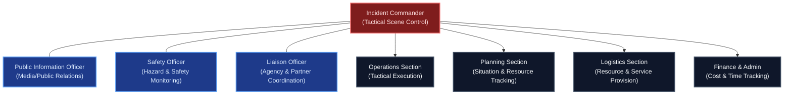
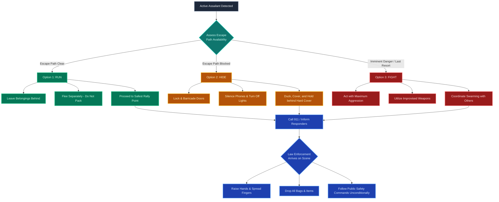
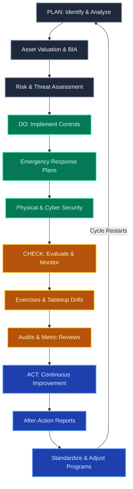

# 03 Physical Security Audit Manual (PSAM) — Crisis Management

<details>
<summary><b>📖 Book Publication Details & Disclaimers</b></summary>

- **Publisher:** Raivan Global | [www.raivanglobal.com](https://www.raivanglobal.com)
- **Disclaimer:** This _Physical Security Audit Manual (PSAM)_ is furnished for training and ready reference purposes. While every effort has been made to ensure the accuracy of the contents herein, Raivan Global assumes no responsibility for errors or omissions.
- **Copyright:** © Raivan Global. All rights reserved. Prepared for internal training and security audit operations.

</details>

---

## Table of Contents

- [Readership](#readership)
- [Dialogue](#dialogue)
- [Supplemental Training](#supplemental-training)
- [Chapter 1: Crisis, Emergency, and Business Continuity Management](#chapter-1-crisis-emergency-and-business-continuity-management)
  - [1.1 Emergency Management and Response: An Overview](#11-emergency-management-and-response-an-overview)
  - [1.2 Crisis Management: An Overview](#12-crisis-management-an-overview)
  - [1.3 Business Continuity Management: An Overview](#13-business-continuity-management-an-overview)
- [Chapter 2: General Event Response and Management](#chapter-2-general-event-response-and-management)
  - [2.1 Emergency and Response Teams](#21-emergency-and-response-teams)
  - [2.2 Emergency Response Liaison and Coordination](#22-emergency-response-liaison-and-coordination)
  - [2.3 Crisis Management Teams (CMT)](#23-crisis-management-teams-cmt)
- [Chapter 3: Business Continuity Management Planning](#chapter-3-business-continuity-management-planning)
  - [3.1 Overview and Goals of Business Continuity](#31-overview-and-goals-of-business-continuity)
  - [3.2 Business Continuity Teams](#32-business-continuity-teams)
  - [3.3 Developing Plans and Procedures](#33-developing-plans-and-procedures)
  - [3.4 Risk Management and the Business](#34-risk-management-and-the-business)
  - [3.5 A Risk Management Approach to Brand and Reputation](#35-a-risk-management-approach-to-brand-and-reputation)
  - [3.6 Business Impact Analysis (BIA)](#36-business-impact-analysis-bia)
- [Chapter 4: Emergency Response Planning](#chapter-4-emergency-response-planning)
  - [4.1 All-Hazards Emergency Operations Plan](#41-all-hazards-emergency-operations-plan)
  - [4.2 Threat-Specific Emergency Operations Plan](#42-threat-specific-emergency-operations-plan)
  - [4.3 General Principles of Emergency Planning](#43-general-principles-of-emergency-planning)
  - [4.4 Topic-Specific Emergency Operations Modules](#44-topic-specific-emergency-operations-modules)
  - [4.5 Emergency Operations Centers and Command Posts](#45-emergency-operations-centers-and-command-posts)
  - [4.6 Emergency Command Succession and Leadership](#46-emergency-command-succession-and-leadership)
  - [4.7 Emergency Shutdown, Salvage, and Restoration](#47-emergency-shutdown-salvage-and-restoration)
  - [4.8 Training, Testing, and Exercise Design](#48-training-testing-and-exercise-design)
- [Chapter 5: Crisis Management Planning](#chapter-5-crisis-management-planning)
  - [5.1 Parts of a Crisis Plan](#51-parts-of-a-crisis-plan)
  - [5.2 Strategic Crisis Communications](#52-strategic-crisis-communications)
  - [5.3 Family and Victim Support Protocols](#53-family-and-victim-support-protocols)
  - [5.4 Public Affairs and Media Relations](#54-public-affairs-and-media-relations)
- [Chapter 6: Event-Specific Planning](#chapter-6-event-specific-planning)
  - [6.1 General Response to a Crisis](#61-general-response-to-a-crisis)
  - [6.2 Natural and Environmental Threats](#62-natural-and-environmental-threats)
  - [6.3 Floods](#63-floods)
  - [6.4 Hurricanes](#64-hurricanes)
  - [6.5 Winter Storms](#65-winter-storms)
  - [6.6 Special Considerations: Extended Utility Loss](#66-special-considerations-extended-utility-loss)
  - [6.7 Earthquakes](#67-earthquakes)
  - [6.8 Medical Emergencies](#68-medical-emergencies)
  - [6.9 Hazardous Materials (HAZMAT) Incidents](#69-hazardous-materials-hazmat-incidents)
  - [6.10 Pandemic and Infectious Disease Planning](#610-pandemic-and-infectious-disease-planning)
  - [6.11 Human Threats (Workplace Violence)](#611-human-threats-workplace-violence)
  - [6.12 Domestic Violence in the Workplace](#612-domestic-violence-in-the-workplace)
  - [6.13 Active Assailant and Threat Protocols](#613-active-assailant-and-threat-protocols)
  - [6.14 Post-Incident Assailant Recovery Phases](#614-post-incident-assailant-recovery-phases)
  - [6.15 Civil Unrest](#615-civil-unrest)
  - [6.16 Bomb Threats](#616-bomb-threats)
  - [6.17 Cyber Threats](#617-cyber-threats)
- [Appendix A: Standards in Security](#appendix-a-standards-in-security)
  - [A.1 Voluntary, Statutory, and Mixed Standards](#a1-voluntary-statutory-and-mixed-standards)
  - [A.2 Benefits of Standards](#a2-benefits-of-standards)
  - [A.3 Management System Standards and the PDCA Cycle](#a3-management-system-standards-and-the-pdca-cycle)

---

### Readership

The _Physical Security Audit Manual (PSAM)_ is intended for a wide readership: all security professionals and business managers with asset protection responsibility. The coherent discussion and pertinent reference material in each subject area should help the reader conduct unique research that is effective and organized. Of particular significance are the various forms, matrices, and checklists that give the reader a practical start toward application of the security theory to their own situation. The PSAM also serves as a central reference for students pursuing a program in security or asset protection.

### Dialogue

We hope that the _Physical Security Audit Manual (PSAM)_ becomes an important source of professional insight for those who read it and that it stimulates serious dialogue among security professionals. Any reader who is grappling with an unusual, novel, or difficult security problem and would appreciate the opinions of others is encouraged to write a succinct statement describing the problem and share it with the professional security community.

### Supplemental Training

Readers with supervisory or management responsibility for other security and asset protection personnel will find the PSAM to be a useful resource from which to assign required readings. Such readings could be elements of a formal training syllabus and could be assigned as part of related course sessions.

---

## Chapter 1: Crisis, Emergency, and Business Continuity Management

Emergency management, crisis management, and business continuity management are three terms often used interchangeably to describe the activities associated with responding to disruptive events and dealing with their impacts. The terminology used by the industry has shifted somewhat over the past few decades. Early in the timeline of the security industry, professionals spoke of contingency planning and information technology (IT) disaster recovery. As the profession progressed, terms like disaster planning, disaster preparedness, and emergency response began to differentiate among different aspects of preparedness.

Currently, as organizations recognize that a business might be impacted by more than just natural disasters, terms like crisis management and business continuity are used to be more inclusive of all disruption types. This holistic view has gained significant traction, and modern risk management, security management, and crisis management programs are often referred to under the overarching umbrella term **resilience**.

In this chapter, we focus on the specific activities and related planning for high-impact events across three key areas:

- **Emergency Management/Response:** The tactical planning and activity associated with detecting, containing, and dealing with the immediate impact of an event (such as extinguishing a fire or locking down a network during a cyber breach).
- **Crisis Management:** The strategic process of supporting emergency response and business continuity operations while dealing with high-level issues that could impact the long-term viability of the organization. This includes managing the aftermath of a damaging event, post-crisis stabilization, and addressing reputational or other non-operational impacts on the business.
- **Business Continuity:** The processes and procedures put in place to ensure the organization can maintain critical business functions during a disruption and recover to normal operational levels expeditiously.

Together, these areas enable the enterprise to fulfill its mission while recovering from the impact of an event.

---

### 1.1 Emergency Management and Response: An Overview

Emergency management is the formal process used by an organization to prepare for and respond to disasters and emergencies. Many emergency planning methodologies break the model into four cyclical elements:

- **Mitigation:** The process of putting protective measures in place to reduce the likelihood of a disaster occurring, or to lessen the impact if one does occur. Examples include building flood barriers, constructing facilities with fire-rated structural materials, or bolting filing cabinets to walls in earthquake zones.
- **Preparedness:** The activities, programs, and systems developed and implemented prior to an incident to support and enhance response and recovery capabilities. (ANSI SPC.1-2009)
- **Response:** The tactical execution of the plan to preserve and protect life and property, and to provide essential services to the affected population. Emergency response must support the organization's mission, account for stakeholder interests, and assess the immediate impact of the disruption.
- **Recovery:** The systematic process of reestablishing operations, resources, and capabilities to meet ongoing requirements, which may also involve introducing organizational improvements or refocusing strategic objectives. (recognized business continuity standards)

While these elements were originally formalized for government agencies, they apply universally to businesses and private-sector organizations worldwide. Emergency response structures, capabilities, and regulatory requirements vary by region. Below are notable global frameworks:

- **Canada:** Public Safety and Emergency Preparedness Canada (PS), established in 2003, administers the _Emergency Management Act_ (effective 2007) and publishes the _Federal Emergency Response Plan (FERP)_ and the _National Emergency Response System_.
- **United Kingdom:** Civil protection is overseen by the Civil Contingencies Secretariat (CCS) within the Cabinet Office. The _Civil Contingencies Act 2004_ establishes local resilience forums and clear duties for emergency planners. The CCS publishes the _Business Continuity Management Toolkit_ and related resilience guidelines.
- **Australia:** Federal emergency management is under the Attorney-General's Department (AGD), which publishes the _Australian Emergency Manuals (AEMs)_ and manages national disaster response frameworks.
- **New Zealand:** The Ministry of Civil Defence & Emergency Management (created in 1999) operates under the _Civil Defence Emergency Management Act 2002_, publishing comprehensive _Best Practice Guides_ and _Director’s Guidelines_.
- **The Caribbean:** The Caribbean Disaster Emergency Response Agency (CDERA), established in 1991, provides a regional command structure and standard response protocols across sixteen Caribbean member states.

To a large extent, emergency management is generic; every incident requires certain common responses. However, situation-specific training and equipment are crucial for the unique hazards likely to affect a given industry or facility.

---

### 1.2 Crisis Management: An Overview

Recognized _Business Continuity Management Guidelines_ define crisis management as:

> A holistic management process that identifies potential impacts that threaten an organization and provides a framework for building resilience, with the capability for an effective response that safeguards the interests of its key stakeholders, reputation, brand, and value-creating activities—as well as effectively restoring operational capabilities. (recognized business continuity standards)

Crisis management begins immediately upon notification of any disruptive event—both physical emergencies (like a building collapse) and non-physical events (such as product recalls, regulatory violations, legal action, or severe financial stress). Crisis management is inherently strategic and cross-functional, requiring the active participation of executive leadership, legal counsel, risk managers, and public relations teams.

The ultimate objective of crisis management is to protect the organization's core assets (reputation, brand, financial health, trust, physical/intellectual property, and key relationships) from harm while keeping the enterprise functional and prepared for the recovery phase.

> [!IMPORTANT]
> **Functional Balance:** A mature crisis management program ensures that all functional areas (e.g., HR, Security, IT, Public Relations) are prepared to support the response. The program must never be dominated by a single department.

#### 1.2.4 Crisis Management Principles

Management must frequently respond to crisis events based on limited information and tight timelines. Therefore, all potentially disruptive events must be reported and escalated to the crisis management team immediately. Crisis evaluation and response require predefined procedures, robust communication protocols, training, and routine scenario rehearsals.

---

### 1.3 Business Continuity Management: An Overview

Recognized _Business Continuity Management Guidelines_ define business continuity management (BCM) as:

> A proactive set of planning, preparedness, and related activities that are intended to restore an organization’s critical business functions to predetermined levels enabling the organization to operate despite serious disruptive events and recover to an operational state expeditiously. (recognized business continuity standards)

Similarly, DRI International defines BCM as:

> A management process that identifies risk, threats and vulnerabilities that could impact an entity's continued operations and provides a framework for building organizational resilience and the capability for an effective response. (DRI)

Depending on organizational requirements, business continuity strategies may include resumption and recovery in place, contracting out selected functions, or relocating critical personnel and systems to alternate operating sites. The core objective is to resume critical functions as quickly as possible and restore the business to its pre-emergency condition.

There is no single formula for structuring a BCM plan. Good practices and frameworks should be adapted to the culture, available resources, industry, business complexity, and maturity level of the company.

Key international bodies providing BCM frameworks and standards include:

- **ISO 22301:2019 (Security and resilience — Business continuity management systems):** Specifies requirements to implement, maintain, and improve a management system to protect against, reduce the likelihood of, prepare for, respond to, and recover from disruptions.
- **Business Continuity Institute (BCI) Good Practice Guidelines (GPG):** The definitive guide for business continuity professionals, promoting a collaborative approach to resilience across management disciplines.
- **DRI International Professional Practices for Business Continuity Management:** A body of knowledge designed to assist in the development, implementation, and maintenance of BCM programs, and to serve as a tool for conducting program assessments.
- **Business Continuity Management Standard (BCM.01 2010):** Specifies requirements for a BCMS to enable an organization to identify, develop, and implement policies and processes to address disruptive events.

## Chapter 2: General Event Response and Management

When a disruptive event strikes, many decisions must be made while the event is still unfolding
and the true dimensions of the situation are unknown. While some decisions may affect the health
of the organization for many years, others will have an immediate effect on its ability to survive at
all. An emergency or crisis can overwhelm those who have done no planning or preparation.
The logical beginning of all aspects of responding to an emergency or crisis situation management
is the development of a plan that does the following (recognized business continuity standards):
Defines the term and scope of a crisis or emergency in terms relevant to the organization;
Establishes a group or team to perform specific tasks before, during, and after a
disruptive event;
Establishes a method for using available resources and for obtaining additional
resources at the time of an event;
Provides a means for moving normal operations into and back out of the crisis mode
of operations;
Provides a plan and framework to continually test and maintain the plan and response
capabilities.
Each aspect of the program should have appropriate plans and teams in place to deal with the
impacts at that phase of the disruptive event.

The International Organization for Standardization (ISO) Standard 22301:2019
Security and resilience - Business continuity management systems. “ISO
22301:2019 specifies requirements to implement, maintain, and improve a
management system to protect against, reduce the likelihood of the occurrence of,
prepare for, respond to, and recover from disruptions when they arise.” (ISO 2019) The
standard is available from https://www.iso.org/standard/75106.html.
Business Continuity Institute (BCI) Good Practices Guidelines. “The Good Practice
Guidelines (GPG) 2018 Edition is the definitive guide for business continuity and
resilience professionals. The GPG is used as an information source for individuals
and organizations seeking an understanding of business continuity as part of their
awareness raising campaigns and training schedules. The GPG takes a collaborative
approach to business continuity, ensuring organizations and individuals understand
how to work with related management disciplines to successfully implement their
business continuity solutions.” (BCI 2018) The guideline is available from http://www.
DRI International Professional Practices for Business Continuity Management.
“The Professional Practices for Business Continuity Management is a body of
knowledge designed to assist in the development, implementation, and maintenance
of business continuity programs. It also is intended to serve as a tool for conducting
assessments of existing programs.
Use of the Professional Practices framework to develop, implement, and maintain a
business continuity program can reduce the likelihood of significant gaps in a program
and increase cohesiveness. Using the Professional Practices to assess a program can
identify gaps or deficiencies so they may be corrected.” (DRI International 2017). The
practice document is available from https://drii.org/certification/professionalprac.
php.

### 2.1 Emergency and Response Teams

Emergency response personnel should be prepared to function in all types of emergencies—even those not anticipated at the time of plan development. Primary training should focus on the most likely scenarios, taking into account the location, construction, size, and function of each site.

In large organizations with multiple facilities, it is essential to establish an overarching **Emergency Operations Plan (EOP)** to ensure proper coordination across various locations. This must be supported by specific emergency plans tailored to the particular exposures and hazards of individual sites.

Emergency response requires a highly structured organization. Establishing these teams and command structures in advance ensures that team members understand their roles, receive appropriate training, and can easily reference procedures during an active incident.

#### 2.1.1 Structure

One operating official must be designated as the organization's **Emergency Coordinator** to assume overall responsibility for the plan. This coordinator ensures that department boundaries and jurisdictional friction do not impede a smooth emergency response. The coordinator should be an executive or manager regularly responsible for handling operations, such as the head of security or facility engineering, and must possess the authority to deal effectively with management and employees at all levels.

To be most effective:

- The appointment should be formally documented in both the EOP and an overarching organizational policy.
- Senior leadership must provide complete, visible support to the emergency coordinator and the program.
- A representative committee from critical departments should support the coordinator. At a minimum, this committee should include representatives from **Legal, Human Resources, Medical, Transportation, Public Relations, Facility Engineering, Information Technology, and Security**.
- Planners should temporarily reconfigure the existing organization to handle emergencies rather than attempting to build a totally new, separate command structure. (Business Continuity Standards; Broder 2012)

**Alternate Designations.** One of the most important considerations in developing an emergency management structure is to designate alternates for the primary decision-maker and for every critical role charged with specific responsibilities under the plan. Where possible, designate at least two alternates per role. It is vital to brief, train, and test both primary and alternate personnel on their assigned duties prior to any incident. Because robust training and testing are time- and resource-intensive, they are often neglected by management; nonetheless, regular exercises remain a non-negotiable prerequisite for response readiness. (Business Continuity Standards; Broder 2012)

#### 2.1.2 Incident Command

The **Incident Command System (ICS)** is a standardized command-and-control framework utilized by public safety and emergency management agencies worldwide to manage resources and coordinate response to emergencies or disasters.



Key features of standardized incident command systems typically include:

- **Single Incident Commander:** Most frameworks designate a single commander to ensure consistent decision-making and a unified response post. If multiple jurisdictions or agencies are involved, a **Unified Command** structure is established to facilitate collaborative, multi-agency coordination.
- **Functional Sections:** Standard ICS structures divide command responsibilities into five core areas:
  1. _Command:_ Overall management of the incident at the scene.
  2. _Operations:_ Direct tactical actions to reduce immediate hazards and save lives.
  3. _Planning:_ Collection, evaluation, and dissemination of intelligence and resource status.
  4. _Logistics:_ Providing facilities, services, and material support to the responders.
  5. _Finance & Administration:_ Tracking incident costs, personnel time, and procurement.
- **Special Staff Roles:** Incident commanders are supported by dedicated officers reporting directly to them:
  - _Public Information Officer (PIO):_ Interfaces with the media and public.
  - _Safety Officer (SO):_ Monitors safety conditions and develops measures to ensure responder safety.
  - _Liaison Officer (LO):_ Acts as the primary contact for assisting or cooperating agencies.

Global public safety agencies employ tailored variations of this system:

- **United States:** FEMA administers the _National Incident Management System (NIMS)_, which guides all levels of government, NGOs, and the private sector to work together cohesively.
- **United Kingdom:** The Cabinet Office publishes the _Emergency Response and Recovery_ guidance, establishing standard strategic (Gold), tactical (Silver), and operational (Bronze) command levels.
- **Canada:** The Canadian Emergency Management Framework utilizes _ICS Canada_ standards to coordinate inter-agency resources and training curricula.
- **Australia:** Federal and state emergency services utilize state-specific disaster plans and a comprehensive national catalog of emergency management resources to align response efforts.

> [!IMPORTANT]
> **Private Sector Application:** While ICS was designed for the public sector, it is highly beneficial for private organizations. Security professionals should adopt internal incident management structures that align with public safety frameworks. This compatibility ensures seamless coordination with first responders during joint drills and actual emergency operations.

---

### 2.2 Emergency Response Liaison and Coordination

Coordinating across multiple business units, supply chain partners, and public safety agencies is a core function of emergency response. The exact liaison roles, contact paths, and operational interfaces must be thoroughly documented within the emergency operating procedures.

#### 2.2.1 Planning Liaison

Emergency planners must coordinate with a wide array of stakeholders when developing and maintaining response plans:

- First responders (law enforcement, fire services, EMS, EOD, and local emergency management agencies).
- Internal cyber-response and IT disaster recovery teams.
- Executive leadership, corporate legal counsel, and department heads.
- Employees, onsite contractors, and visitors.
- Impacted personnel, survivors, and their family members.
- Local government and elected officials.
- Media outlets and public information channels.
- Neighboring private businesses, community groups, and local stakeholders.

Establishing these liaison channels during the planning phase ensures that reciprocal assistance agreements, mutual aid, and communication interfaces are fully operational before an incident occurs.

---

### 2.3 Crisis Management Teams (CMT)

The **Crisis Management Team (CMT)** is the strategic heart of an organization's crisis response program. While emergency response teams handle tactical, on-scene incidents, the CMT manages the strategic, long-term viability of the enterprise.

#### 2.3.1 Setting Up a Crisis Management Team

The CMT must be comprised of senior leaders who possess the authority to make high-impact, strategic decisions. The team should represent the core functions of the business:

- **Executive Leadership:** Provides overall strategic direction and ultimate decision-making.
- **Human Resources:** Manages employee safety, benefits, counseling (EAP), and family support services.
- **Security & Life Safety:** Coordinates on-scene tactical response, local liaison, and physical asset protection.
- **Legal Counsel:** Evaluates liability, regulatory exposure, and legal compliance.
- **Information Technology / Cyber Security:** Oversees network security, data integrity, and systems recovery.
- **Finance & Shared Services:** Manages emergency funding, insurance claims, and business unit accounting.
- **Corporate Communications / Public Relations:** Oversees brand preservation and internal/external communications.
- **Critical Operations:** Represents core revenue-generating business units.

> [!TIP]
> **Strategic vs. Tactical Separation:** In mature organizations, senior leadership focuses on macro-strategic goals and brand preservation, delegating tactical implementation to the CMT. CMT members should be identified by **position** (both primary and designated alternates) rather than name, ensuring seamless continuity during staff absences.

#### 2.3.2 Roles on the Crisis Team

For each role on the CMT, the crisis plan must clearly detail:

1. **Specific Incident Responsibilities:** The precise decisions and actions expected of the role.
2. **Redundant Contact Information:** Work, personal, and emergency communication channels.
3. **Alternate Succession Pathways:** Clear delegation paths if the primary position holder is unreachable.

| CMT Role                    | Primary Responsibility                       | Key Focus Areas                                                 |
| :-------------------------- | :------------------------------------------- | :-------------------------------------------------------------- |
| **Team Leader**             | Executive command and strategic coordination | Overall direction, cross-functional alignment, policy decisions |
| **Operations Lead**         | Continuity of core business units            | Asset protection, facility status, operational workarounds      |
| **Communications Lead**     | Internal and external messaging              | Media relations, brand preservation, employee notifications     |
| **Legal & Regulatory Lead** | Liability and compliance management          | Regulatory reporting, contract reviews, liability exposure      |
| **HR & Medical Lead**       | Employee welfare and health services         | Accountability, injury tracking, employee assistance programs   |

## Chapter 3: Business Continuity Management Planning

### 3.1 Overview and Goals of Business Continuity

Business continuity plans (BCPs) document the structured instructions that the Business Continuity Management (BCM) team will follow to recover critical business activities after an interrupting event. According to recognized business continuity guidelines, the goals of business continuity planning include:

- **Human Safety:** Save lives and reduce the likelihood of further injuries or deaths.
- **Asset Protection:** Safeguard physical, intellectual, and financial assets from further damage.
- **Process Restoration:** Restore critical business operations and technology systems.
- **Disruption Minimization:** Reduce the duration and operational impact of business interruptions.
- **Reputation Protection:** Mitigate long-term brand and reputation damage.
- **Media & Crisis Communications:** Control and coordinate media coverage (local, regional, national, or global).
- **Customer Relations:** Maintain client relationships and business agreements.

To achieve these goals, a comprehensive business continuity plan must include:

- Alternate operational locations or temporary transportation resources.
- **Pre-disruption checklists:** Actions to prepare for a looming or anticipated disruption.
- **Active-disruption checklists:** Immediate tactical responses during an ongoing incident.
- **Post-disruption checklists:** Systematic steps for returning to normal operations.
- Dedicated resource requirements and lists of essential emergency supplies.
- Standardized communication pathways, templates, and pre-scripted statements.
- Financial considerations, emergency funding procedures, and pre-authorized lines of credit.
- Scenario-specific hazard modules requiring specialized responses.

### 3.2 Business Continuity Teams

Business continuity teams are essential components of the broader organizational resilience framework. They are responsible for executing the tactical recovery procedures for their respective business units following a disruptive event. The BCM team functions independently of, but in close coordination with and as support for, the overarching strategic Crisis Management Team (CMT).

According to recognized **Business Continuity Guidelines**:

> "Response teams should develop response plans to address various aspects of potential crises, such as damage assessment, site restoration, payroll, human resources, information technology, and administrative support. Response plans should be consistent with and included within the overall BCP. Individuals should be recruited for membership on response teams based upon their skills, level of commitment, and vested interest." (recognized business continuity standards)

To ensure operational readiness, all BCM team members must:

1. Be explicitly named to the team and designated as primary or alternate representatives.
2. Provide direct input into the design and review of their unit's recovery plans.
3. Be fully trained on their specific roles, responsibilities, and decision-making authorities.
4. Know when, where, and how to activate and report for recovery activities.
5. Participate regularly in testing and plan-validation exercises.

### 3.3 Developing Plans and Procedures

Developing a robust business continuity plan is an iterative process integrated into the organization's overarching risk management and Enterprise Security Risk Management (ESRM) framework. Plans must be tailored to the organization's unique context, regularly evaluated, and continuously updated.

According to recognized **Business Continuity Standards**, the organization must establish, implement, and maintain BCPs and procedures to manage a disruptive event and continue its activities based on the recovery objectives identified in the Business Impact Analysis (BIA). These plans and procedures should:

- **Establish Protocols:** Outline clear internal and external notification and communication protocols.
- **Be Specific:** Detail exact, immediate steps to be taken during the initial hours of a disruption.
- **Maintain Flexibility:** Allow response teams to adapt to unanticipated threat scenarios and changing internal or external conditions.
- **Focus on Impact:** Prioritize responses based on the operational impact of the disruption rather than just the specific cause.
- **Address Interdependencies:** Be developed based on clearly defined planning assumptions and a thorough analysis of internal and external operational interdependencies.
- **Minimize Consequences:** Be highly effective at mitigating consequences through predefined, actionable response strategies.

#### 3.3.1 Risk Assessment and BCM Objectives

Before initiating a BCM program, the organization must conduct a formal risk assessment to identify, evaluate, and prioritize threats and vulnerabilities. This ensures BCM resources are focused on the areas of greatest exposure.

1. **Define the Context:** Prior to starting the risk cycle, the organization must identify its core mission, corporate goals, critical functions, vital assets, and key risk-decision-making stakeholders.
2. **Determine Likelihood and Consequence:** Estimate the probability of a disruptive event by analyzing the organization's changing security profile, existing mitigation measures, and geographic vulnerabilities. Assess consequences based on the value and criticality of the assets at risk.
3. **Form a Threat Evaluation Team:** For complex or dynamic threat environments, a multidisciplinary threat evaluation team should be established to assess incoming intelligence and verify threat levels.

**Setting BCM Objectives and Targets:**

- **Business Continuity Policy:** BCM objectives and targets translate the organization’s high-level business continuity policy into action plans.
- **Measurability:** BCM objectives must be measurable qualitatively and/or quantitatively, and approved by senior management.
- **Priority:** Core business continuity objectives (such as life safety and asset protection) always override considerations like rapid commercial restoration.
- **Key Performance Indicators (KPIs):** The organization should establish KPIs aligned with BCM objectives to evaluate performance and drive continuous program improvement.

#### 3.3.2 Writing the Business Continuity Plan

Establishing the context of a BCM program requires a deep understanding of the organization's operational priorities, regulatory environment, and stakeholder expectations. In an ESRM framework, BCM is defined in the initial stages of the security program to ensure that the scope of continuity planning aligns seamlessly with physical asset protection, cybersecurity, and operational risk boundaries.

Key infrastructure considerations in plan design include securing redundant telecommunications (e.g., cell phones, satellite phones, citizens' band radios, and backup internet/network lines) to maintain vital links at alternate operating sites.

##### Vital Business Records Management

A critical defense against "organizational amnesia" is the systematic identification, backup, and off-site replication of **Vital Records**. Vital records are those records indispensable for the immediate resumption or continuation of business activities. Arrangements for securing and retrieving these records must be fully integrated into the BCP and Continuity of Operations Planning (COOP).

The table below categorizes key business records and outlines their resumption criticality and standard protection requirements:

| Record Category             | Vital Business Record Type                                                                                                                                                              | Resumption Criticality    | Protection & Storage Requirements                                                                           |
| :-------------------------- | :-------------------------------------------------------------------------------------------------------------------------------------------------------------------------------------- | :------------------------ | :---------------------------------------------------------------------------------------------------------- |
| **Governance & Legal**      | Incorporation certificates, charters, franchises, constitutions, bylaws, legal documents, minutes of directors' meetings, stock certificates, stock transfer books, patents, copyrights | **Indispensable (Vital)** | High-security fireproof vaults (4-hour rated), off-site storage, or secure cloud-based digital replication. |
| **Financial & Accounting**  | General ledgers, accounts payable, accounts receivable, bank deposit data, notes receivable, debentures, bonds, tax records, receipt of payment                                         | **Critical**              | Daily encrypted digital backups replicated to secondary data centers; read-only access controls.            |
| **Operations & Assets**     | Capital asset lists, contracts, customer data, inventory lists, leases, purchase orders, sales data, manufacturing process data, floor and building plans                               | **Important**             | Dual-custody secure cloud storage, distributed data processing nodes, off-site secondary repositories.      |
| **Human Resources**         | Payroll and personnel files, pension data, employee policy manuals, social security receipts                                                                                            | **Important / Sensitive** | Encrypted HR databases with role-based access control (RBAC), secure off-site payroll processing vendors.   |
| **Technical & Engineering** | Engineering data, blueprints, machinery manuals, service records, operating procedures                                                                                                  | **Supportive**            | Version-controlled digital asset management systems; physical copies at alternate headquarters.             |

_(Source: Tailored from recognized security and emergency management references; Broder 2012; FEMA 1993; NFPA 1600)_

##### Planning for Alternate Facilities and Relocation

Planners must secure emergency funds, lines of credit, and alternate financing methods in advance to ensure the organization can resume operations at a secondary site without delay. When planning for relocation and COOP activation, key strategic questions and site requirements must be addressed:

**Key Continuity Questions:**

- What business functions are most critical to immediate survival?
- What resources are required to restore those critical functions?
- What is the timeline for restoring non-time-sensitive functions?
- What specific triggers or thresholds will necessitate a relocation?
- Which personnel and operational units will be relocated first?
- Where will the primary relocation facility be located?
- At what point in an extended disruption will a long-term relocation facility be required?
- Are basic equipment loads stored in highly portable containers for rapid deployment?

**Relocation Facility Capabilities Checklist:**

- [ ] **Briefings & Conferences:** Dedicated space for CMT briefings, press conferences, and staff meetings.
- [ ] **Operations Support:** Sufficient computers, high-speed copiers, recording equipment, and facsimile machines.
- [ ] **Communications:** Redundant voice and data networks with remote IT connectivity.
- [ ] **Life Support:** Food service, sanitary facilities, and emergency lodging for essential staff.
- [ ] **Utilities:** Emergency power generators with adequate fuel storage.
- [ ] **Security:** Robust physical access control, visitor logs, and guard force coverage.

_(Source: Prepared by David H. Gilmore. Used with permission.)_

#### 3.3.3 Communicating the Plan

Developing a plan is a major investment of time and effort. While specialized software and external emergency management consultants can streamline data collection and plan structure, they cannot substitute for direct, hands-on involvement by the organization’s management team. Day-to-day operations managers are the asset owners and possess the direct knowledge required to identify critical vulnerabilities and design practical workarounds.

The primary objective of an emergency plan (as in any ESRM program) is to force decision-makers and key personnel to anticipate emergency scenarios and think through their responses in a calm, analytical environment.

A plan is only as good as its execution:

- It must not be put on a shelf and forgotten.
- All personnel with assigned duties must be thoroughly trained and clear on their responsibilities.
- The plan must be treated as a living, continuous process that evolves as the business environment and risk profiles change.

#### 3.3.4 Testing and Exercising BCM

An organization’s business continuity plans, teams, and resources must be validated through regular exercises and kept current. To build a mature training program, the organization should:

- **Establish a Formal Program:** Secure top-management approval for an exercise schedule at planned intervals or following major organizational changes.
- **Define Clear Objectives:** Every exercise must have defined, measurable targets.
- **Ensure Safety:** Plan exercises carefully to ensure the test itself does not cause an operational disruption or safety hazard.
- **Conduct Post-Exercise Reviews:** Evaluate performance against objectives, document lessons learned, and identify areas for improvement.
- **Report to Leadership:** Submit written outcomes and recommended corrective actions to executive management.

**BCM Exercise Maturity Framework:**
The scope and complexity of exercises should mature as the organization's experience and capabilities grow:

- **Orientation (Level 1):** Introductory briefings, training sessions, or plan reviews to educate staff.
- **Tabletop Exercise (Level 2):** Narrated, scenario-driven discussions where BCM members talk through their actions in a conference room environment.
- **Functional Exercise (Level 3):** Realistic simulations of specific crisis elements (e.g., IT disaster recovery failover or building evacuation) conducted in a controlled environment.
- **Full-Scale Exercise (Level 4):** Comprehensive, real-time simulations involving actual facility relocations and coordination with external public safety agencies (fire, EMS, law enforcement).

All findings and lessons learned from exercises or actual incidents must be integrated back into the BCP to ensure continuous refinement.

### 3.4 Risk Management and the Business

An analysis by consulting firm PricewaterhouseCoopers explains in detail why risk management activities like enterprise security risk management (ESRM) need to take into account the overall business context:

> "It is important to begin by understanding the relevant business objectives in scope for the risk assessment. These will provide a basis for subsequently identifying potential risks that could affect the achievement of objectives and ensure the resulting risk assessment and management plan is relevant to the critical objectives of the organization. Objectives are typically laid out in annual reports, business unit strategic plans, presentations to analysts, functional unit charters, project/investment plans, and management documents. ... The focus on business objectives helps ensure relevance and facilitates the integration of risk assessments across the organization." (PwC 2008)

Businesses and industry drivers change over time, so this understanding of the enterprise must be continually refreshed.

#### 3.4.1 Understanding Business Environment and Industry Risks

Security and resilience plans must be designed to withstand macro-level disruptions in the business environment. To assist security managers in prioritizing long-term risks, the World Economic Forum (WEF) publishes an annual Global Risks Report. This report categorizes risks into five core domains:

| Global Risk Category | Core Threat Examples (WEF Global Risks 2021)                                                    | Enterprise Impact                                                           |
| :------------------- | :---------------------------------------------------------------------------------------------- | :-------------------------------------------------------------------------- |
| **Economic**         | Debt crises, asset bubble bursts, commodity price shocks, inflation/stagflation                 | Capital shortages, vendor bankruptcies, reduced purchasing power            |
| **Environmental**    | Extreme weather events, climate action failure, biodiversity loss, natural resource crises      | Physical plant damage, supply chain delays, agricultural disruptions        |
| **Geopolitical**     | Geopolitical resource wars, state collapse, terrorist attacks, weapons of mass destruction      | Asset expropriation, trade embargoes, heightened physical threat levels     |
| **Societal**         | Infectious disease pandemics, social cohesion erosion, livelihood crises, youth disillusionment | Severe absenteeism, workforce strikes, civil unrest, public health mandates |
| **Technological**    | Cybersecurity failures, IT infrastructure breakdowns, digital inequality, adverse tech advances | Massive data breaches, ransomware outages, regulatory non-compliance        |

These kinds of macro-level security and economic events can cost enterprises millions of dollars, damage brand reputation, and lead to significant civil, regulatory, or criminal liabilities if managed improperly. Physical infrastructure damage (e.g., to roads, bridges, and factories) immediately disrupts supply chains, while localized workplace disputes can severely impact an enterprise’s daily operational bottom line.

#### 3.4.2 Identifying and Prioritizing Risks (Risk Assessment)

The process of identifying, analyzing, and prioritizing enterprise risks to critical assets is formally termed a **Risk Assessment**. Recognized risk management institutes and standard bodies published the joint _Risk Assessment Standard (ANSI/RIMS RA.1-2015)_, which defines the core terms of the risk assessment life cycle in logical sequence:

| Risk Term               | Standard Definition (ANSI/RIMS RA.1-2015)                                                                                                                                                            |
| :---------------------- | :--------------------------------------------------------------------------------------------------------------------------------------------------------------------------------------------------- |
| **Risk Assessment**     | The overall and systematic process of evaluating the effects of uncertainty on achieving organizational objectives.                                                                                  |
| **Risk Identification** | The process of determining what risks are anticipated, including their characteristics, time dependencies, frequencies, duration periods, and potential outcomes.                                    |
| **Risk Analysis**       | The process to characterize and understand the nature of risk and to define the quantitative or qualitative level of risk.                                                                           |
| **Risk Evaluation**     | The process of comparing the results of risk analysis with predefined risk criteria to determine whether a particular risk level is within acceptable tolerance or presents a potential opportunity. |
| **Risk Tolerance**      | The amount of uncertainty an organization is prepared to accept in total or more narrowly within a certain business unit, a particular risk category, or for a specific initiative.                  |
| **Risk Criteria**       | The terms of reference used to measure and evaluate the significance and downstream effects of risk.                                                                                                 |
| **Risk Register**       | A dynamic compilation of all risks identified, analyzed, and evaluated throughout the risk assessment process.                                                                                       |

The risk assessment process consists of four major sequential steps:

1. **Risk Identification:** Determines the sources, nature, and characteristics of potential risks. Analysts employ both qualitative and quantitative methodologies, incorporating inputs such as the organization's corporate SWOT (Strengths, Weaknesses, Opportunities, Threats) analysis.
2. **Risk Analysis:** Characterizes the identified risks and determines their overall significance by assessing their likelihood and consequences to prioritize risk treatment options.
3. **Risk Evaluation:** Compares the risk levels against the organization's risk criteria to decide which risks are acceptable with existing controls and which require additional treatment. Evaluating pre- and post-treatment risk levels helps ensure that residual risk remains within defined tolerance boundaries.
4. **Risk Assessment Reporting:** Results must be documented in a concise risk assessment report. This report is delivered to the risk manager immediately following the post-assessment review to provide a definitive guide for mitigation planning.

#### 3.4.3 Risk Assessment Standards

Security professionals should draw upon established international standards when designing risk assessment methodologies. Globally recognized frameworks include:

- **OCTAVE (Operationally Critical Threat, Asset, and Vulnerability Evaluation):** Developed by Carnegie Mellon University, focusing on organizational security risks.
- **ENISA RM/RA Framework:** The European Union Agency for Cybersecurity framework for network and information security.
- **NIST Cybersecurity Framework (CSF):** Standardized guidance for managing cybersecurity risks.
- **COBIT 5 (ISACA):** A comprehensive framework for enterprise IT governance and risk management.
- **ISO 31000:** The International Organization for Standardization global model for Enterprise Risk Management (ERM).
- **ANSI/RIMS RA.1-2015:** The primary physical and operational asset protection risk assessment standard.

### 3.5 A Risk Management Approach to Brand and Reputation

An organization’s brand and reputation represent some of its most valuable intangible assets. Because reputation relies on external perceptions, it is highly vulnerable during a crisis.

- **Reputation** is the collective estimation of an organization’s:
  1. **Financial Performance:** Asset viability, revenue stability, and financial soundness.
  2. **Perception by Key Stakeholders:** How the organization is perceived by customers, investors, regulators, and the general public.
  3. **Organizational and Behavioral Values:** Integrity, ethics, corporate social responsibility, and culture.
  4. **Overall Strategy and Quality:** The long-term vision, operational reliability, and efficacy of its product/service delivery.
- **Brand** encompasses:
  1. **The Organization's Products or Services:** The tangible or intangible value proposition, quality, and design.
  2. **Values and Ethics:** What the company stands for and its core principles.
  3. **Culture and Workplace Identity:** The internal working environment and employee behaviors.
  4. **Market Presence and Identity:** Corporate symbols, trademarks, customer recognition, and marketing message.

#### 3.5.1 Pre-Crisis Reputation Management

Protecting brand and reputation must begin long before a disruptive event occurs. The risk assessment process should actively evaluate reputation profiles and identify how potential disruptions could impact public perception.

Pre-crisis research should include:

- Surveying audience and customer perceptions.
- Conducting structured interviews with key opinion leaders.
- Benchmarking reputation metrics against industry peers.

If research reveals weakness in brand identity or reputation, the organization must implement targeted improvements before a crisis strikes. Reputation-damaging crises are often secondary "offshoots" of operational or physical failures; therefore, the Crisis Communications Plan must proactively incorporate brand preservation strategies.

#### 3.5.2 Case Studies in Reputation Recovery

Organizations with strong pre-crisis brand equity and positive reputation are far more resilient and recover much faster from disruptive events:

##### Case Study: Johnson & Johnson (1981 Extra-Strength Tylenol Crisis)

In 1981, an unknown individual tampered with Extra-Strength Tylenol capsules in the Chicago area, lacing them with cyanide, which resulted in multiple deaths. Johnson & Johnson responded immediately by launching a nationwide product recall, halting all advertising, and fully cooperating with law enforcement and the media.

Because of their strong pre-crisis reputation, established public trust, and adherence to their corporate Credo (which prioritized customer safety above all else), they recovered rapidly. They introduced tamper-evident packaging, which became the new industry standard, and successfully restored consumer confidence.

##### Case Study: Firestone (2000 Ford Explorer Rollover Crisis)

In 2000, Firestone (owned by Bridgestone) was embroiled in a massive safety crisis involving tire tread separations on Ford Explorer SUVs, which caused severe rollover accidents and multiple fatalities. Despite intense congressional hearings and heavy media damage that led industry analysts to predict the complete demise of the Firestone brand, the brand survived and remains dominant today.

This resilience was driven not by corporate public relations, but by local consumer loyalty. Customers did not view the crisis through a macro-corporate lens; instead, they identified with their local, trusted neighborhood Firestone retail stores, mechanics, and service staff. This micro-level brand loyalty shielded the overall business from catastrophic failure.

Conversely, organizations with poor pre-crisis brand equity or negative public perceptions face an uphill battle, as the crisis acts as a multiplier of existing public distrust.

### 3.6 Business Impact Analysis (BIA)

The Business Impact Analysis (BIA) is a foundational BCM process that quantifies and qualifies the potential impacts of a disruption over time. According to the **recognized Business Continuity Guidelines**, the BIA must:

1. **Identify Impacts Over Time:** Evaluate financial, operational, legal, and reputational impacts resulting from disruptions to organizational activities and resources.
2. **Identify Compliance Mandates:** Map out all legal, regulatory, and contractual requirements governing critical business processes.
3. **Determine Downtime Metrics:** Estimate the **Maximum Tolerable Period of Disruption (MTPD)**—also known as Maximum Tolerable Downtime (MTD)—that the organization can withstand before its viability is threatened.
4. **Establish Recovery Objectives:** Use the MTPD to define specific **Recovery Time Objectives (RTO)** and **Recovery Point Objectives (RPO)**.
5. **Evaluate Resource Requirements:** Assess the necessary assets, staff, technology, and external interdependencies required to resume operations within the designated RTO.

#### 3.6.1 BIA Methodology and Criticality Metrics

The organization must implement a formal, documented BIA methodology. Typical BIA execution steps include:

- Confirming the operational scope of the analysis with executive management.
- Identifying internal and external sources of information.
- Collecting data through structured interviews, online questionnaires, and operational documentation.
- Analyzing the data to map out operational interdependencies and resource requirements.
- Presenting recommendations and formal justifications to executive management for approval.
- Translating approved BIA metrics into actionable business continuity strategies.

##### Defining Key Recovery Metrics

The BIA questionnaire establishes a objective priority list for business process recovery by defining three critical time-based metrics:

- **Recovery Point Objective (RPO):** The maximum tolerable volume of data loss, measured in hours or days. It represents the point in time to which data must be restored (e.g., from the last clean backup) to resume operations.
- **Recovery Time Objective (RTO):** The target duration of time within which a business process, system, or application must be restored after a disruption. The RTO must be strictly less than the Maximum Tolerable Downtime.
- **Maximum Tolerable Downtime (MTD) / Maximum Tolerable Period of Disruption (MTPD):** The absolute maximum limit of time a business function can be unavailable before the organization suffers irreversible damage or ceases to be a viable enterprise.

The diagram below illustrates the relationship between RPO, RTO, and MTD following a disruptive event:


##### BIA Questionnaire Framework

Applying a standard BIA questionnaire across all business units ensures that recovery timelines are established based on objective metrics rather than the individual opinions of department managers. The table below outlines the core categories and questions of a standard BIA questionnaire:

| BIA Category                       | Target Focus Areas & Questionnaire Questions                                                                                                                                                                                         |
| :--------------------------------- | :----------------------------------------------------------------------------------------------------------------------------------------------------------------------------------------------------------------------------------- |
| **Business Processes**             | Describe the primary business processes executed by your unit. What are the minimum acceptable recovery time frames for each process, application (e.g., email, ERP), and system?                                                    |
| **Operational Dependencies**       | Map out all internal business units, systems, or data streams that this unit depends on. Detail external dependencies, including key suppliers, contractors, and global supply chain links.                                          |
| **Process Criticality**            | Determine which business processes are absolutely essential to the organization's daily survival and core value chain.                                                                                                               |
| **Workarounds & Backups**          | Outline available manual workarounds (e.g., paper-based orders) that can be utilized during a system outage. Detail access to temporary staffing resources and alternate operational sites (e.g., hot/cold disaster recovery sites). |
| **Work Backlog Recovery**          | Estimate the time (in hours) required to clear backlog transactions for each day of operational downtime. Specify if recovery requires sequential or concurrent processing.                                                          |
| **Compliance & Reporting**         | Detail all mandatory internal and external reporting requirements (e.g., regulatory disclosures, SEC filings). Include report names, authors, recipients, frequencies, and penalties for non-compliance.                             |
| **Outage Tolerance**               | Assuming a catastrophic outage (e.g., headquarters destruction), how long could this unit remain completely offline before causing material harm to stakeholders, suppliers, and brand reputation?                                   |
| **Financial Disruption Threshold** | Define the maximum period of disruption before the organization suffers unacceptable losses in revenue, market share, customer contracts, or competitive viability.                                                                  |

## Chapter 4: Emergency Response Planning

### 4.1 All-Hazards Emergency Operations Plan

The specific emergency planning format used by an organization depends on the nature of the organization, its risk profile, and corporate policies. For most enterprises exposed to a variety of potential hazards, an **All-Hazards approach** is the most effective methodology. This approach establishes a core **Emergency Operations Plan (EOP)** that details basic, universally applicable response elements—such as team structures, roles, communication directories, and assembly protocols—supplemented by hazard-specific checklists.

The all-hazards approach is highly efficient because initial response requirements are fundamentally similar across a wide range of incidents, whether natural, technological, or human-caused. For example, a facility evacuation follows the same mechanical procedure regardless of whether it is triggered by a structural fire, a bomb threat, a hazardous materials (HAZMAT) spill, or a major utility outage.

### 4.2 Threat-Specific Emergency Operations Plan

Certain organizations, based on their sector or operational footprint, may require highly specialized, threat-specific emergency plans. For example, a healthcare facility must maintain distinct protocols for a major earthquake versus an outbreak of a high-level infectious contagion. Each enterprise must analyze its specific operational exposures to determine the optimal balance between all-hazards flexibility and threat-specific detail.

Regardless of the selected format, the EOP must be developed in the simplest, most actionable manner possible. Outlining specific, unambiguous responsibilities for all assigned emergency response personnel ensures a rapid, organized response under high-stress conditions.

### 4.3 General Principles of Emergency Planning

In setting emergency response priorities, time-tested principles must be systematically applied to the protection of life, followed by physical assets, and finally commercial restoration.

#### 4.3.1 Life Safety and Injury Prevention

- **Evacuation & Shelter:** Immediately transition all personnel not required for emergency operations to designated safe locations.
- **Personal Protection:** Ensure that response crew members who must remain within a threatened area are equipped with the highest possible level of protective gear and structural shelter.
- **Rescue & Relief:** Establish pre-planned, dedicated capabilities to locate, extract, and provide immediate medical first aid to injured persons.
- **Design Safety:** Proactively identify and eliminate facility conditions (e.g., blocked exits, poor lighting) that could increase the likelihood of injury during an emergency.
- **Proactive Training:** Extensively train both responders and general staff so that ignorance or panic does not increase exposure to hazards during an incident.

#### 4.3.2 Asset Protection and Loss Control

- **Resource Relocation:** Prevent the concentration of high-value physical assets or critical materials in high-hazard zones. Given adequate warning (e.g., a looming storm), valuable materials should be relocated using pre-arranged transport to secured secondary sites.
- **Rapid System Deployment:** Maintain highly responsive, pre-positioned systems (including automated suppression, physical barriers, and trained personnel) that can deploy immediately to control loss.

#### 4.3.3 Operational Restoration

- **Functional Relocation:** Pre-arrange alternate facilities to house relocated business units and essential staff.
- **Resource Accessibility:** Ensure that all operational data, recovery schedules, and contact lists are kept current, redundant, and easily accessible from alternate sites.

_(Source: recognized Physical Security Standards; OSHA 2001)_

### 4.4 Topic-Specific Emergency Operations Modules

Once the overarching planning assumptions are set, the specific tactical modules of the EOP must be detailed. While the exact contents are tailored to the organization, several core operational modules are standard:

#### 4.4.1 Emergency Evacuation and Shelter-in-Place

An effective evacuation plan requires considerations that go far beyond sounding a siren and expecting occupants to exit. Planners must address distinct scenarios based on the anticipated duration of the evacuation: **short-term** (less than one hour) and **extended** (more than one hour). After approximately one hour, displaced personnel standing at an outdoor assembly point will become restless and require active management, sheltering, or formal dismissal.

##### Evacuation Planning Checklist

To design a robust evacuation protocol, planners must address the following key operational questions:

- [ ] **Primary & Alternate Exits:** Are primary and secondary emergency exits clearly marked, unobstructed, and regularly inspected?
- [ ] **All-Threat Exit Routes:** Do employees know how to utilize exits for emergencies other than fires (e.g., gas leaks or active threats)?
- [ ] **Mass Notification:** How will occupants be notified to evacuate or shelter-in-place for non-fire emergencies when standard fire pull-stations are inappropriate?
- [ ] **Assisted Evacuation:** What specific procedures, equipment (e.g., evacuation chairs), and designated "buddies" are in place to assist individuals with mobility, visual, or hearing disabilities?
- [ ] **Short-Term Assembly:** Where are the designated short-term (under one hour) assembly areas, and what are the backup locations?
- [ ] **Extended Evacuation Facilities:** Where are the pre-arranged, sheltered extended assembly facilities, and how will personnel be transported there if not reachable on foot?
- [ ] **Inclement Weather Plan:** What immediate shelter options are available if an evacuation occurs during extreme cold, heat, or heavy precipitation?
- [ ] **Accountability Protocols:** How will the organization account for all employees, contractors, vendors, and visitors at the assembly area?
- [ ] **Incident Communication:** Who is authorized to provide regular, official updates to evacuees regarding the status of the incident?
- [ ] **Vehicle Access Control:** What is the protocol if personal or corporate vehicles are trapped inside a secured police or fire perimeter and are inaccessible?

_(Source: Tailored from checklist by David H. Gilmore)_

##### Evacuation Drills and Practice

- **Drill Realism:** Drills must be realistic. During fire drills, planners should periodically block primary exits (e.g., using signs reading "Exit Blocked by Smoke") to force occupants to locate and use alternate emergency exits.
- **Drill Scope:** Drills must not be terminated prematurely. Evacuation drills should continue until all occupants have successfully navigated to their designated assembly points and a full accountability head-count is executed.
- **Assorted Drill Distances:** Bomb threat and HAZMAT evacuations require much larger standoff distances than fire evacuations. Drills for these events must practice evacuating to the actual, extended distances defined in the plans.
- **Shelter-in-Place:** For threats where evacuation is dangerous (e.g., tornadoes, active assailants, HAZMAT plume, or earthquakes), the plan must designate fortified shelter-in-place zones. These zones must feature independent ventilation control, sanitary facilities, emergency water, food, and communication links.

#### 4.4.2 Emergency Warning and Mass Notification Systems

> [!IMPORTANT]
> **Study Pointer:** Under standard regulations (such as the Americans with Disabilities Act in the U.S.), emergency warning systems must feature **visual strobes** in addition to **audible alarms** in all areas where ambient noise exceeds 95 dBA or where hearing-impaired occupants may be present.

- **Environmental Audio Engineering:** System designers must account for ambient noise levels and physical layout to ensure alarms are clearly audible. Outdoor warning sirens or public address (PA) systems must be installed for exterior grounds.
- **Target Testing:** Mass notification systems must be tested periodically when the facility is occupied to ensure employees recognize the distinct signals and know the correct actions to take.
- **Multimodal Notification:** Incorporate electronic mass notification systems that can immediately push alerts, safety instructions, and accountability checks to employees' mobile phones, SMS, and corporate email accounts simultaneously.

#### 4.4.3 Emergency Contacts and Communications

- **Interoperability:** Planners must ensure that internal security and emergency teams maintain wireless interoperability (compatible radio frequencies or bridging technology) with local public safety responders (police, fire, and EMS).
- **Communication Redundancy:** To prevent delays caused by public network congestion during a crisis, secure dedicated, private-line telephone numbers for direct communication with emergency service dispatch. CMT members' devices should be pre-programmed with these numbers.
- **Congestion Mitigation:** Public cellular networks are frequently overwhelmed during high-impact events. Responders should utilize SMS text messaging rather than voice calls, as texts use minimal bandwidth and have a higher delivery success rate. Responders must wait 10 seconds between redial attempts to allow the cellular network connection logic to clear, and must maintain charged spare batteries or vehicle chargers.

### 4.5 Emergency Operations Centers and Command Posts

The organization must designate a physical **Emergency Operations Center (EOC)** or **Crisis Management Center (CMC)** from which the emergency response will be directed. For decentralized or virtual operations, a secure **Virtual Command Post** must be pre-configured.

- **EOC/CMC Scale:** Small organizations may manage incidents from a building manager's office. Larger enterprises require dedicated EOCs equipped with specialized monitoring, mapping, and communication tools. Access to the EOC must be strictly controlled to prevent distractions and maintain operational focus.
- **Redundant Alternate Sites:** The plan must designate one or more alternate EOC locations in separate buildings or geographic zones in case the primary EOC is damaged, destroyed, or inaccessible.
- **Alternate Site Capabilities:** The backup EOC must be equipped with redundant communications, backup power generators, independent potable water, and sanitation facilities that do not rely on municipal water grids. It must also have provisions for feeding and lodging essential personnel during multi-day operations.

### 4.6 Emergency Command Succession and Leadership

Crises can strike at any time. The EOP must establish a clear, legally binding line of **Emergency Command Succession** to ensure a qualified manager is always available to assume command.

- **Initial On-Site Command:** If an incident occurs outside normal business hours, primary corporate leaders may be unreachable or delayed by road closures. The EOP must explicitly authorize the senior on-site representative—frequently the security manager, supervisor, or senior security officer—to initiate the emergency plan and take command of the facility until a senior executive arrives.
- **Succession Lists:** The lines of succession must be formally documented, updated regularly, and distributed strictly on a need-to-know basis (such as to control centers and authorized senior personnel) to protect the privacy of personal contact numbers.
- **Corporate Legal Sanction:** Corporate succession lists and emergency bylaws should be formally authorized by board resolution. Planners must review emergency succession provisions with corporate counsel to ensure that all emergency decisions (such as large financial expenditures or operational shutdowns) are legally binding, even if a disaster prevents the board of directors from assembling a standard quorum.

### 4.7 Emergency Shutdown, Salvage, and Restoration

- **Surgical Shutdown Procedures:** The EOP must assign clear, individual responsibilities for executing emergency equipment shutdowns. Shutdown procedures must be kept as simple and rapid as possible, and crews must be drilled regularly. If crews must remain in the facility during an evacuation to manage high-hazard systems (e.g., in chemical or nuclear plants), they must be provided with heavily fortified, independent shelters.
- **Salvage Priorities:** To avoid spreading resources too thin and losing all physical assets, managers must establish a pre-approved salvage priority list. High-value, critical-path equipment and unique intellectual property must be designated for salvage priority.
- **Post-Incident Structural Surveys:** Once the immediate hazard is contained, the facility engineering crew must perform a comprehensive structural survey of the building and grounds. The survey team must include at least one technically competent professional qualified to detect structural compromises, hazardous material leaks, or electrical hazards before re-entry is authorized.

### 4.8 Training, Testing, and Exercise Design

Ensuring that emergency plans actually work requires a continuous, structured program of training and validation exercises.

#### 4.8.1 Key Target Audiences

1. **Crisis Management & Response Teams:** Require the highest, most comprehensive level of training on tactical execution, communication tools, and decision-making authority.
2. **General Employees:** Require general awareness training regarding plan existence, alarms, evacuation routes, and shelter-in-place procedures, reinforced by mandatory drills.
3. **Visitors:** Must be accounted for through clear emergency signage, escape maps, or a standardized check-in safety briefing.

#### 4.8.2 Exercise Design and Safety

- **Drill Variety:** Exercises must scale in complexity, utilizing tabletop discussions, functional drills (e.g., testing emergency generators or remote IT failovers), and full-scale simulations involving local public safety agencies.
- **Unannounced Drills:** Subject to safety controls, unannounced emergency drills are highly effective for evaluating true organizational readiness and identifying gaps in training or procedures.
- **Safety and Use of Force:** Safety is the paramount controlling factor of every drill. The simulated use of force by armed security personnel or role-players must be strictly controlled, monitored, and simulated under non-hazardous conditions.
- **External Notification:** Planners must coordinate closely with local emergency services. If public responders are not active participants in a drill, they must still be formally notified of the drill's date, time, and scope to prevent accidental real-world emergency responses.

##### Exercise Design Recommendations

When developing and executing emergency planning exercises, planners should adhere to the following framework:

- **Sequenced Complexity:** Design exercises in a logical sequence of increasing complexity (e.g., paper/walkthrough -> tabletop -> functional -> full-scale).
- **Train the Trainers:** Ensure that controllers and evaluators are trained first and understand that exercises are diagnostic tools, not competitions.
- **Worst-Case Focus:** Design scenarios that test worst-case conditions (e.g., loss of power and communications during inclement weather) to ensure the plan is resilient.
- **Component Testing:** Focus individual exercises on testing specific components of the plan (e.g., communication loops or EOC activation) rather than trying to test the entire EOP every time.
- **Train to the Plan:** Ensure that all simulations strictly reflect the actual written EOP. Never simulate procedures that are not documented in the plan.
- **Real-World Incident Protocols:** Maintain a clear, distinct protocol to instantly halt the exercise if a real-world emergency occurs during the simulation.
- **Practice Alternates:** Actively involve alternate CMT decision-makers, and practice utilizing alternate evacuation exits and routes.

_(Source: Tailored from recommendations by David H. Gilmore)_

## Chapter 5: Crisis Management Planning

### 5.1 Parts of a Crisis Plan

A crisis plan must be tailored to the specific operational needs, regulatory environments, and core mission of the enterprise. While the exact scope varies by organization, a standard Crisis Management Plan (CMP) must document four essential areas:

1. **Crisis Management Activation and Escalation Triggers**
2. **Crisis Command and Management Succession Protocols**
3. **Crisis Recovery Logistics and Resource Directories**
4. **Strategic Crisis Communications Plan (CCP)**

#### 5.1.1 Crisis Management Activation and Escalation

The CMP must explicitly define the circumstances and specific operational triggers under which the plan will be activated. Typical activation triggers include:

- **Severe Weather:** Immediate threat of hurricanes, severe flooding, or tornadoes.
- **Physical Failure:** A major facility fire, structural collapse, or chemical explosion.
- **Cybersecurity Breaches:** Critical infrastructure outages, systemic ransomware infections, or major data theft.
- **Reputational Incidents:** High-impact social media crises or serious legal/regulatory actions.

The CMP must establish a clear, standardized notification and activation method, detailing:

- **Notification Protocols:** How crisis management team (CMT) members are alerted of plan activation (e.g., automated mass notification systems, call trees).
- **Activation Authority:** Which specific positions (both primary and designated alternates) hold the authority to activate the team.
- **Meeting Locations:** Pre-established physical and virtual meeting spaces (e.g., secure conference bridges or dedicated EOC rooms).
- **Declaration Criteria:** The formal process for declaring a corporate-wide crisis.
- **Escalation Pathways:** For multi-site or global enterprises, the specific thresholds at which a localized site emergency escalates to the corporate parent CMT.
- **Executive Notification:** How executive leadership and the board of directors are informed of CMT activation, even if a formal crisis is not declared.

#### 5.1.2 Crisis Command and Management Succession

Clear lines of authority must be maintained throughout a crisis. Just as in the Emergency Operations Plan, the CMP must establish a formal management succession list. This ensures that a qualified senior management representative is always present and legally authorized to make critical decisions. (For detailed legal and board succession requirements, see Chapter 4, Section 4.6).

#### 5.1.3 Crisis Recovery Logistics and Resources

To ensure rapid stabilization, organizations must pre-arrange access to critical equipment and logistics support. Resources are typically categorized and managed in three ways:

1. **Emergency-Only Inventory:** Specialized equipment (e.g., backup generators, satellite phones, bleeding control kits) stored in dedicated locations and reserved exclusively for crisis response.
2. **Operational Redundancy:** Standard business assets (e.g., fleet vehicles, secondary laptops) that are used in daily operations but pre-designated for immediate crisis redeployment.
3. **External Procurement:** Pre-established mutual aid agreements, interagency support arrangements, and vendor service-level agreements (SLAs) for rapid procurement.

##### Vehicle Management Protocols

Responsibility for coordinating all transportation assets during a crisis must be assigned to a designated logistics manager and a primary alternate. The CMP must maintain:

- A complete, updated inventory of all corporate-owned and leased vehicles.
- Pre-arranged lease agreements with commercial vehicle rental agencies.
- Clear policies and expense-reimbursement templates for utilizing employees' personal vehicles during emergency operations.
- Pre-authorized agreements for heavy equipment leasing (e.g., debris-clearing haulers, rescue vehicles).

##### Logistics Planning Checklist

When planning for external logistics, CMT planners must address the following key questions:

- What specific equipment or services are required?
- What exact quantities are needed?
- What is the maximum acceptable time frame for delivery?
- What primary and secondary commercial sources are available?
- Can the designated vendors guarantee support 24/7/365 under disaster conditions?
- What are the estimated response and transit times for each source?
- What are the pre-negotiated emergency rates and costs?
- What are the primary and after-hours contact procedures for each vendor?
- Will the vendor transport the equipment directly to the site, or is corporate transport required?
- Who is responsible for the maintenance and repair of leased or rented equipment?
- Which CMT members hold pre-authorized spending authority for emergency procurement or leasing?
- What specific documentation (e.g., emergency purchase orders) is required to execute the transaction?
- How frequently will the logistics vendor list be reviewed and verified?

_(Source: Tailored from checklist by David H. Gilmore)_

### 5.2 Strategic Crisis Communications

> [!IMPORTANT]
> **Study Pointer:** **Crisis Communications is strategic, not tactical.** Tactical communications involve the tools (e.g., writing press releases, managing social media channels, or updating the website). Strategic communications focus on the long-term viability of the business model, protecting brand equity, maintaining shareholder confidence, and supporting post-crisis recovery.

#### 5.2.1 Core Principles of Crisis Communications

- **Professional Standards vs. "Spinning":** Public relations standards dictate that the organization communicate honestly, transparently, and rapidly. Attempting to "spin" a crisis—such as downplaying the severity of an incident or deflecting blame—frequently backfires, destroys public trust, and permanently damages corporate credibility.
- **Targeted Audience Messaging:** In a crisis, there is no single "general public." A crisis affects distinct stakeholders (employees, families, shareholders, vendors, customers, regulators), each of whom has unique concerns. The CMT must craft specific, carefully worded messages tailored to each group's specific concerns.
- **Compressed Timeframes:** In the digital age, time is compressed. Detractors and critics are highly organized and will post critical messaging immediately. If the organization delays its response, it will appear defensive, reducing its credibility.
- **Integrated Infrastructure:** The Crisis Communications Team (CCT) is not a standalone silo; it must be fully integrated into the strategic CMT and maintain a direct liaison link to the tactical Incident Command Post at the facility level.

#### 5.2.2 Crisis Communications Team (CCT) Structures

A mature crisis communications program includes planning, training, regular exercises, response, and post-crisis recovery. Standard CCT roles include:

- **Senior Communications Advisor / CCT Lead:** The senior-most public relations executive in the enterprise. This individual sits directly with the senior leadership team during strategic CMT deliberations to align communication strategies with operational response plans and provide direct counsel to the CEO.
- **Crisis Communications Manager:** Coordinates the CCT's daily activities, assigns tasks, manages deadlines, and executes the Crisis Communications Plan (CCP).
- **Communications Officers:** Represent various PR functions (e.g., internal communications, social media, investor relations, media liaisons). They draft messages, monitor public channels, and maintain community relations. A designated officer acts as a liaison to the CMT to track operational developments.
- **Incident Command Public Information Officer (PIO):** In a high-impact event at a specific facility, a designated CCT member serves as the PIO at the scene, reporting directly to the local Incident Commander to coordinate on-site media relations.
- **External Agencies:** For extended or highly complex crises, the CCT should maintain pre-arranged retainer agreements with specialized, external crisis public relations firms to scale response operations.

#### 5.2.3 The Crisis Communications Plan (CCP)

The CCP can be a standalone document or an integrated annex of the CMP. In either case, its activation and notification protocols must match the overarching CMT activation triggers.

##### The Scenario-Specific Planning Protocol

Using data gathered during the enterprise-wide risk assessment, the CCT must document the following five elements for every anticipated crisis scenario:

1. **Identify Affected Audiences:** Map out the specific stakeholders impacted by the scenario.
2. **Identify Audience Concerns:** Anticipate the primary questions and fears of each stakeholder group.
3. **Develop Core Messages:** Pre-draft clear, accurate, and approved messages addressing those specific concerns.
4. **Designate Spokespeople:** Formally assign trained, scenario-specific messengers (e.g., Technical Leads for cyber events, the CEO for high-impact financial events).
5. **Select Delivery Tactics:** Determine the most effective channels (e.g., press releases, live-streamed briefings, social media posts, direct email campaigns, or internal town halls) to disseminate each message.

#### 5.2.4 Communications Training and Recovery

- **Annual Media Training:** All CCT members and designated corporate spokespeople must undergo annual communications training. This training must include realistic camera and microphone interview practice, phone and radio interview techniques, and message-delivery skills.
- **Integrated Exercises:** The CCT must be active participants in the CMT's tabletop and functional exercise programs, practicing message development and media tracking in real-time.
- **Recovery Communications:** As the crisis stabilizes, the CCT must manage the transition from active response to recovery. Recovery communications support the enterprise as it resumes normal operations or establishes a "new normal." CCT planners must begin drafting recovery communication strategies while the operational team is still in active response mode.

### 5.3 Family and Victim Support Protocols

Aiding the welfare and morale of employees and their families during a catastrophic event (e.g., a structural collapse or serious mass-casualty incident) is a critical planning requirement. Planners should coordinate with local public safety agencies, the American Red Cross, and federal emergency management authorities to design a robust family and victim support plan.

The CMP must outline the following logistics and protocols for managing victim and family support:

- **Dedicated Family Support Center:** Establish a secure, comfortable physical location for families that is physically isolated from the media briefing center and active response operations.
- **Basic Needs Provision:** Provide immediate lodging, food, beverages, and transportation to and from the site, if appropriate.
- **Moral & Psychological Support:** Pre-arrange access to professional trauma counselors, employee assistance programs (EAP), and pastoral care.
- **Single Point of Contact:** Assign a designated, highly empathetic corporate representative to serve as the direct contact for families, ensuring they receive timely, accurate, and compassionate updates regarding recovery and rescue efforts.
- **Dignified Communication:** The treatment of victims and families attracts intense media and public scrutiny. Any operational or communication missteps can cause severe, long-lasting damage to the organization's moral standing and brand perception.

### 5.4 Public Affairs and Media Relations

Mishandling the release of information to news agencies during a disaster can result in devastating press coverage and permanent brand destruction. To maintain order and accuracy:

- **Single Source Control:** Establish a single, centralized source for all official information releases, typically coordinated through the public relations department.
- **Regular CMT Updates:** The PR director and designated alternates must receive regular, structured updates from the CMT coordinator to ensure their press releases and briefings are accurate.
- **Immediate Prepared Statements:** As soon as news representatives arrive, provide them with prepared press releases and brief oral updates to establish the organization as the primary source of factual information.
- **Avoid "No Comment":** Never use the phrase "no comment." Doing so suggests the organization is defensive, hiding information, or unprepared, which directly encourages speculative reporting, rumors, and hostile investigative coverage.
- **Access Control & Safety:** If media access to the disaster scene must be restricted due to active hazards or police perimeters, explain these safety reasons transparently. Arrange safe interviews with selected responders or technical experts as soon as feasible.
- **Casualty Notifications:** **Critical Principle:** The names of deceased or injured personnel must never be released to the media or the public until their immediate family members have been officially notified by authorized representatives.
- **Media Logistics Management:** For extended incidents, the EOP must pre-arrange logistics for the press, including:
  - A designated media briefing room and filing center.
  - Controlled, escorted media tours of the incident scene.
  - Credentials and access control badges for authorized journalists.
  - A dedicated parking area equipped with power for satellite and microwave remote broadcast vehicles.
  - Professional corporate photographers and videographers to document the scene for insurance, legal defense, and historical records.

## Chapter 6: Event-Specific Planning

### 6.1 General Response to a Crisis

Once the initial warnings, emergency notifications, and safety instructions (e.g., evacuation, lockdown, or shelter-in-place) have been disseminated to employees, the organization’s Crisis Management Team (CMT) and designated Threat Management Team will assume overall coordination of the response. This entails managing both internal security personnel and external public safety responders, establishing secure perimeters, containing the incident, and preventing unauthorized entry into the danger zone.

To ensure operational readiness, the organization must develop robust policies, procedures, and training modules tailored to high-impact crisis events. Security personnel, in particular, must undergo specialized training to handle complex tactical incidents (e.g., active assailants).

#### 6.1.1 Exercises and Testing

Response policies, command succession lists, and tactical procedures must be validated through regular tabletop, functional, and full-scale exercises. The Threat Management Team's involvement must continue throughout the active response phase and transition seamlessly into post-incident recovery.

#### 6.1.2 Pre-Incident and Post-Incident Active Assailant Planning

The checklist below details key operational considerations for managing active assailant programs and threat mitigation:

- [ ] **Threat Management Team:** Establish a multidisciplinary threat management team (TMT) to evaluate workplace violence indicators.
- [ ] **Roles & Procedures:** Define explicit roles, responsibilities, and decision-making authorities for all key response personnel.
- [ ] **Mass Notification:** Integrate redundant, multimodal emergency alert and warning systems to communicate with the workforce.
- [ ] **Workforce Education:** Implement continuous awareness and training programs focusing on workplace violence warning signs, reporting channels, and "Run, Hide, Fight" response options.
- [ ] **Emergency Equipment:** Pre-position critical response equipment, including handheld radios, high-powered flashlights, master key access cards, updated physical property plans, and certified bleeding control supplies (e.g., tourniquets, hemostatic dressings).
- [ ] **First Responder Liaison:** Establish direct operational liaison links and share building blueprints with local public safety agencies (police, fire, EMS).
- [ ] **Command & Control:** Pre-designate an on-site Incident Command Center (ICC) and an off-site Emergency Operations Center (EOC).
- [ ] **Staging Areas:** Identify pre-approved media staging zones and safe family reunification/notification centers located far from the active scene.
- [ ] **Psychological First Aid:** Incorporate structured plans to address acute psychological trauma and long-term post-traumatic stress in the preplanning, operational response, recovery, and business continuity phases.

##### Post-Incident Response Phase Guidelines

Crisis recovery operations are structured across three chronological phases:

- **Immediate Phase:** Focuses on life safety, accounting for all on-site personnel, containing the immediate hazard, and managing communications with employees, families, the media, and the public.
- **Short-Term Phase:** Focuses on securing and preserving the crime scene, monitoring staff and responders for acute psychological trauma, facilitating family reunification, and providing continuous factual updates.
- **Long-Term Phase:** Focuses on conducting structured debriefs with internal teams and external public safety partners, replenishing depleted emergency medical supplies, updating response plans, and maintaining long-term employee assistance program (EAP) support.

_(Source: Tailored from recommendations by David H. Gilmore; recognized Active Assailant Standards)_

### 6.2 Natural and Environmental Threats

#### 6.2.1 General Preparedness for Inclement Weather

Natural disasters and extreme weather events—including floods, tornadoes, hurricanes, snow, and ice storms—can instantly threaten life safety, cause structural failures, disrupt supply chains, and compromise security operations.

To manage these events effectively, security professionals must maintain a comprehensive, geographically tailored Weather Response Plan. This plan must be developed in coordination with key internal stakeholders:

- **Human Resources (HR):** For personnel safety policies, weather-related administrative decisions, and employee support.
- **Corporate Communications:** For internal mass alerts, emergency hotlines, and external brand preservation.
- **Operations & Supply Chain:** For planning safe facility shut-downs, identifying operational impacts, and managing vendor delays.
- **Facilities & Engineering:** For structural damage assessments, utility monitoring, and restoring critical building systems.

##### Universal Pre-Storm Emergency Action Checklist

When advanced warning of a severe weather threat is received, the CMT and facility coordinators must immediately execute the following preparedness steps:

- [ ] **Employee Notification:** Disseminate immediate emergency alerts and weather advisories to all personnel, detailing specific safety instructions.
- [ ] **Staff Accountability:** Account for all active on-site personnel and verify that all critical-path shift schedules are covered.
- [ ] **Remote Access verification:** Confirm that all work-from-home and administrative employees have verified remote network access (VPN) capabilities.
- [ ] **Device Readiness:** Charge all mobile phones, radios, and emergency batteries; distribute vehicle chargers to active response personnel.
- [ ] **Systems Load Testing:** Load-test emergency diesel generators and verify that fuel levels are topped off.
- [ ] **Equipment Shutdown:** Systematically power down all non-essential machinery, servers, and manufacturing equipment using pre-tested shutdown scripts.
- [ ] **Vendor Coordination:** Put emergency backup vendors (e.g., fuel suppliers, mobile generator rental services, HVAC contractors, UPS specialists) on standby.
- [ ] **Exterior Security:** Secure or store all exterior loose objects that could become wind-borne projectiles; board up high-wind-exposed windows.
- [ ] **Flood Barriers:** Position sandbags and flood barriers in low-lying areas and exterior entry points.
- [ ] **Warehouse Protection:** Relocate high-value inventory and sensitive materials in warehouses to higher shelving levels.
- [ ] **Logistics Control:** Cancel or reroute all incoming and outgoing shipments; schedule safe, clean stop-points for ongoing data center processing jobs.
- [ ] **Operational Redundancy:** Reroute customer service and IT lines to unaffected secondary facilities; distribute satellite phones to critical nodes.
- [ ] **Guard Force Prep:** Arrange for additional on-site security guards to secure damaged gates or doors during potential power outages.

##### Universal Post-Storm Recovery Checklist

Following the storm's passage, the recovery team must prioritize:

- [ ] **Power Restoration Liaison:** Contact local electrical utility operators to get official restoration timelines and updates.
- [ ] **Hotline Activation:** Update the corporate employee hotline with factual status updates and re-entry instructions.
- [ ] **Stranded Employee Welfare:** Deploy emergency cots, blankets, non-perishable food, potable water, and personal hygiene kits for employees stranded at the facility.
- [ ] **Structural Salvage:** Initiate building damage assessments (see Section 4.7) and salvage operations.

##### Universal Emergency Supply Kit Checklist

Facilities that must remain staffed during extreme weather events must be stocked with the following universal supplies. This standardized inventory supports staff welfare, communications, and basic building salvage:

| Supply Category            | Essential Inventory Items                                                                                                                                          |
| :------------------------- | :----------------------------------------------------------------------------------------------------------------------------------------------------------------- |
| **Life Support & Comfort** | Non-perishable 3-day food supply, potable water (1 gallon per person, per day), water purification tablets, cots, pillows, blankets, sleeping bags.                |
| **Medical & First Aid**    | Certified first aid kit, trauma dressings, AED, spare prescription medications, employee medical contact directory.                                                |
| **Communications & Info**  | Battery-operated NOAA weather radio, handheld two-way radios, backup satellite phones, whistles, signal flares, spare batteries, vehicle charging adapters.        |
| **Tools & Salvage**        | Basic hand tools (wrenches, screwdrivers, hammers, wire cutters), work gloves, plastic tarps, heavy-duty garbage bags, duct tape, utility knives.                  |
| **Safety & Utilities**     | Fire extinguishers (multi-class), smoke detectors, emergency flashlights, light sticks, spare fuel for vehicles and generators, backup building keys/access cards. |
| **Logistics & Financials** | Hard-copy emergency contact lists, physical maps of the local area, cash (for power outages), corporate credit cards, primary IDs.                                 |

_(Source: Tailored from recognized Emergency Planning Handbooks)_

### 6.3 Floods

#### 6.3.1 Preparing for a Flood

- **Chemical Hazard Mitigation:** Secure, elevate, or relocate all hazardous chemicals and fuels stored on-site to prevent environmental release or contamination.
- **Utility Protection:** Locate main electrical and gas shut-offs, and ensure all ground fuel tanks are securely anchored to prevent them from floating and rupturing.
- **Delivery Deferral:** Immediately postpone all incoming deliveries, shipments, and courier services.
- **Record Backup:** Initiate emergency database backups and replicate critical operational data to out-of-region secondary servers.
- **Drain & Sewer Control:** Install flood vents, structural barriers, and sewer plugs to prevent floodwaters from backing up into the facility's drainage systems.
- **Mass Communication:** Utilize mass notification systems to provide regular updates to employees, and maintain a centralized point of contact to track evacuees.

#### 6.3.2 Active Response (During a Flood)

- **Staff Dismissal:** Immediately dismiss all non-essential personnel and send them home before local roads become flooded.
- **Elevator Protection:** Raise all elevators to the second floor (or higher) and lock them out of service to prevent electrical damage.
- **Redundant Communications:** Instruct CMT members to carry charged cell phones, car chargers, and portable radios. Redirect corporate phone lines to mobile lines or an off-site answering service.
- **Active Evacuation:** Monitor local emergency services and immediately evacuate when local advisories or rising water levels dictate.

#### 6.3.3 Post-Flood Response

- **Water Safety:** Verify the safety of the municipal water supply with local public health authorities before allowing consumption on-site.
- **Contamination Hazards:** Avoid contact with standing floodwaters. Floodwaters are frequently contaminated with sewage, chemicals, and industrial oils, and present severe electrocution hazards from downed or underground power lines.
- **Road Stability:** Inspect all corporate driveways and local access roads. Receded floodwaters frequently wash out roadbeds, creating high risks of collapse under vehicle weight.

### 6.4 Hurricanes

#### 6.4.1 Preparing for a Hurricane

- **Wind Protection:** Install specialized storm shutters or anchor heavy plywood sheets over all windows and glass doors.
- **Roof Inspection:** Conduct an engineering inspection of the facility's roof to ensure structural panels and flashing are secure.
- **Vegetation Management:** Clear or trim adjacent tree limbs and foliage that could fall onto power lines or buildings.
- **Furniture & Assets:** Anchor all tall bookcases, file cabinets, and heavy storage racks to wall studs. Relocate all fragile or high-value physical assets to secure, interior rooms.
- **Waterproofing Documents:** Seal all non-digitized legal contracts, insurance policies, tax records, and accounting ledgers in waterproof containers and replicate them to secure off-site locations.
- **Logistics & Supplies:** Stock the facility with supplies from the _Universal Emergency Supply Kit Checklist_ (Section 6.2.1) and ensure backup generator fuel tanks are filled.

### 6.5 Winter Storms

#### 6.5.1 Preparing for a Winter Storm

- **Snow Removal Retainers:** Put professional snow and ice removal contractors on active standby for clearing corporate driveways, access roads, walkways, and facility roofs.
- **Heating System Inspections:** Have engineering clean, inspect, and service all boilers, firing mechanisms, and heat-producing process equipment.
- **Pipe Freeze Protection:** Drain all idle pumps and compressor jackets; verify that building heating keeps temperatures above 40°F (4°C), particularly in hard-to-heat areas containing water pipes.
- **Water Flow Maintenance:** Open vulnerable faucets slightly to maintain a slow, constant drip of water. This continuous flow helps prevent pipes from bursting by relieving pressure if ice forms inside the line.

#### 6.5.2 Active Response (During a Winter Storm)

- **Equipment Pre-positioning:** Secure and position space heaters, snowblowers, and backup generators in accessible locations.
- **Walkway Maintenance:** Ensure response crews clear walkways, parking lots, and emergency exits of snow and ice continuously.

### 6.6 Special Considerations: Extended Utility Loss

Extended utility outages (electricity, gas, water) can occur as secondary impacts of severe weather or primary technical failures.

- **Surge Prevention:** Immediately shut down and unplug all non-essential computers, servers, and sensitive electronic equipment. This prevents damage from high-voltage surges when grid power is restored.
- **Restoration Controls:** Have engineering establish a strict, step-by-step procedure to restore power to critical equipment gradually (item-by-item) rather than all at once, which could trip breakers and cause system-wide overloads.
- **Supply Support:** Stock the EOC and essential staffing areas with supplies from the _Universal Emergency Supply Kit Checklist_ (Section 6.2.1).

### 6.7 Earthquakes

#### 6.7.1 Earthquake Preparedness and Seismic Mitigation

Earthquakes are sudden, highly unpredictable events that present severe threats of structural collapse, falling debris, ruptured utility lines, tsunamis, and aftershocks. Because municipal infrastructure is typically overwhelmed, facilities must be prepared to operate independently for several days.

Planners must implement seismic risk mitigation:

- **Sprinkler Bracing:** Ensure that all automated fire suppression and sprinkler lines are retrofitted with seismic sway bracing in compliance with **NFPA Standard 13**.
- **Tall Objects Securing:** Bolt all heavy bookcases, file cabinets, display racks, industrial shelving, and chemical cabinets to floor slabs or structural wall studs.
- **IT Equipment Protection:** Strap servers, computers, and expensive laboratory instruments to desks or secure them in seismic-rated equipment racks. Base-isolate heavy machinery (boilers, pumps, chillers, and backup generators) to allow independent base movement during tremors.
- **Water Heater Securing:** Securely strap all facility water heaters to structural walls and install flexible gas line connections to prevent ruptures and preserve a clean source of emergency drinking water.
- **First Aid Training:** Extensively train all security and facility personnel in first aid, CPR, and the locations and operations of emergency utility shutoff valves (gas, electricity, water, chemical lines).

##### Desk/Car Personal Emergency Kit

All employees should be encouraged to maintain a personal emergency kit in their desk or vehicle, containing:

- First aid supplies and a supply of personal prescription medications.
- High-energy, low-sodium, non-perishable food.
- Flashlight, light sticks, and a battery-operated portable radio.
- Blanket or emergency space blanket.
- Safety whistle (to signal search-and-rescue teams if trapped).
- Out-of-town emergency contact numbers.
- Proof of residence (e.g., water bill) to facilitate re-entry past security cordons.

#### 6.7.2 Active Response (During an Earthquake)

- **If Indoors:**
  - **Duck, Cover, and Hold:** Immediately drop to the floor, take cover under a sturdy desk or table, and hold onto it firmly. If no desk is available, sit or stand against an interior load-bearing wall (never stand in a doorway).
  - **Protect Head & Face:** Move away from windows, exterior walls, light fixtures, and tall furniture that could fall.
  - **Do Not Run:** Do not attempt to run outside during the shaking, as most injuries occur from falling exterior masonry and glass.
  - **Post-Shaking Evacuation:** Once shaking stops, carefully evacuate the facility if structural damage or gas leaks are detected. Avoid elevator usage.
- **If Outdoors:**
  - **Find Open Ground:** Move immediately to open ground away from buildings, utility poles, downed power lines, and trees.
  - **Drop and Cover:** Drop to the ground and duck, cover, and hold until shaking subsides. Watch for falling glass and masonry debris during aftershocks.
- **If Driving:**
  - **Stop Safely:** Drive away from overpasses, underpasses, bridges, and power lines. Pull over in a safe, open area.
  - **Stay in Vehicle:** Set the parking brake and remain inside the car. If electrical wires fall onto the vehicle, stay inside until professional rescue teams arrive.

#### 6.7.3 Post-Earthquake Response and Damage Assessment

- **Accountability & Medical Aid:** Immediately account for all employees, check for injuries, and administer first aid. Call emergency dispatch if rescue support is needed.
- **Gas Leak Checks:** **Critical Rule:** Never use open flames, candles, or matches after an earthquake due to potential gas leaks. Do not turn off the main gas valve unless a gas leak is explicitly detected.
- **Structural Survey:** Have the facility engineering crew conduct a structural safety sweep, roping off damaged zones. Do not authorize building re-entry until certified structural engineers have conducted a formal post-seismic inspection.
- **Grid Coordination:** If facility power is lost, turn off all non-essential equipment. When power is restored, gradually power up critical systems item-by-item. Coordinate with fuel and vehicle vendors to secure emergency supplies.
- **Relocation Activation:** If structural damage is severe, initiate EOC backup activation and begin relocation procedures (see Section 4.5).

### 6.8 Medical Emergencies

All security departments and crisis teams must be equipped to respond immediately to medical emergencies, ranging from providing simple first aid to coordinating the emergency response during a mass-casualty incident. As the primary on-site responders, security officers must undergo regular first aid, CPR, and automated external defibrillator (AED) training, and remain familiar with the locations of all emergency medical equipment.

The emergency plan must outline clear procedures to streamline medical response, detailing:

- Where to direct and meet incoming public emergency services (EMS).
- Who within the organization must be notified (e.g., HR, CMT).
- The exact level of specialized training required based on the facility's specific risk profile. For example, a chemical processing facility must train security on chemical-exposure first aid and antidote administration, whereas a retail shopping center will focus on trips and falls, cardiac events, and heat exhaustion.

#### 6.8.1 Preparing for a Medical Emergency

- **Building Emergency Response Team (BERT):** Identify and train a dedicated BERT for each facility. The BERT is responsible for:
  - Initiating immediate life safety, evacuation, or shelter-in-place procedures.
  - Executing notifications and escalating to the CMT.
  - Serving as the dedicated interface for local public emergency responders.

#### 6.8.2 Active Response (During a Medical Emergency)

When a medical emergency occurs, responders must immediately execute the following steps:

1. **Alert Emergency Services:** Call the local emergency medical number (e.g., 911 in the U.S.).
2. **Provide Dispatch Details:** Communicate the following information clearly to the dispatcher:
   - The exact nature and severity of the medical emergency.
   - The precise location of the victim (street address, building name, floor, and room number).
   - The telephone number being used to make the call.
   - The number of victims and their current status (e.g., conscious, breathing).
   - The type of first aid or CPR currently being administered.
3. **Maintain Connection:** Do not hang up the call until instructed to do so by the emergency dispatcher.
4. **Responder Escort:** Dispatch a designated employee to meet the arriving ambulance at the facility entrance and guide them directly to the victim's location.
5. **Protect the Victim:** Do not attempt to move the injured or ill person unless their life is in immediate danger from a secondary hazard (e.g., fire or structural collapse).
6. **Administer Care:** Administer basic first aid, CPR, or AED shocks if trained, equipped, and authorized.

### 6.9 Hazardous Materials (HAZMAT) Incidents

Hazardous materials (HAZMAT) incidents can occur in many forms, including chemical spills, toxic gas releases, laboratory accidents, or transport vehicle crashes. Security departments must conduct regular risk assessments of all hazardous materials stored or utilized on-site, particularly in facilities featuring manufacturing lines, warehouses, or shipping docks.

A successful HAZMAT response requires a structured, multi-leveled approach:

1. **Identification:** Determine the exact chemical or material involved (referencing Safety Data Sheets).
2. **Control:** Contain the leak or spill at the source, if safe and trained to do so.
3. **Assessment:** Evaluate the immediate physical threat to facility personnel, public safety, and infrastructure.
4. **Information Sharing:** Coordinate rapid warning notifications to building occupants and the local community.
5. **Decontamination:** Execute certified cleanup and decontamination procedures.

> [!IMPORTANT]
> **Reputation Management:** A major chemical release that impacts the surrounding community will trigger intense media scrutiny and potential regulatory liability. When staffing the CMT for a HAZMAT-exposed facility, planners must include public relations and legal experts to manage crisis communications and brand preservation immediately.

#### 6.9.1 Active Response to a Large Chemical Spill

When a large chemical spill is detected, personnel must execute the following actions:

- [ ] **Immediate Notification:** Instantly notify the designated facility official and emergency coordinator.
- [ ] **Containment:** If safe and trained, contain the spill using pre-positioned emergency equipment (e.g., absorbent pads, containment booms, neutralizers).
- [ ] **Area Security:** Secure the zone using caution tape and barricades, and alert all nearby personnel to evacuate the area.
- [ ] **Cleanup Restrictions:** Do not attempt to clean up a large or highly toxic spill unless formally certified and equipped.
- [ ] **Medical Relief:** Attend to injured personnel and coordinate immediate first aid and EMS support.
- [ ] **Professional Salvage:** Contact the designated emergency spill-cleanup contractor or public fire department HAZMAT unit to execute the recovery.
- [ ] **Building Evacuation:** Order a full or partial building evacuation if toxic fumes or fire hazards are present.

#### 6.9.2 Active Response to a Small Chemical Spill

For minor, localized chemical spills, personnel must execute:

- [ ] **Notification:** Inform the supervisor and emergency coordinator of the incident.
- [ ] **Fume Isolation:** If minor toxic fumes are present, secure the area with cones or warning tape to prevent unauthorized entry.
- [ ] **SDS Compliance:** Review the chemical's **Safety Data Sheet (SDS)** and follow the exact cleanup instructions.
- [ ] **PPE Usage:** Clean up the spill safely while wearing the mandated **Personal Protective Equipment (PPE)** (e.g., gloves, goggles, respirators).
- [ ] **Safe Disposal:** Dispose of all contaminated cleanup materials in certified hazardous waste containers.

### 6.10 Pandemic and Infectious Disease Planning

An infectious disease outbreak or global pandemic can severely disrupt operations by causing massive workforce absenteeism, supply chain failures, and systemic facility closures. The primary goal of pandemic planning is to protect personnel health while maintaining critical business continuity.

#### 6.10.1 Strategic Pandemic Objectives

- **Transmission Reduction:** Implement robust hygiene, social distancing, and workplace safety protocols to protect staff, customers, and visitors.
- **Operations Maintenance:** Prioritize and maintain essential business operations and customer commitments.
- **Absenteeism Management:** Design flexible staffing models to maintain operational efficiency under high absenteeism levels (up to 40% workforce loss).
- **Economic Mitigation:** Minimize the financial impact of the disruption through remote work models and contract management.

#### 6.10.2 Standard Planning Assumptions

To ensure BCP resilience, plans must be designed around the following planning assumptions:

- Up to 40% of the workforce may be unavailable due to personal illness, family care, school closures, or fear of exposure.
- Public health mandates may require extended quarantines for infected employees and their close contacts.
- Workplace density must be radically reduced, requiring shift staggering or full telecommuting.
- High-risk employees must be accommodated with long-term work-from-home options.

#### 6.10.3 WHO Pandemic Alert Framework

Rather than a traditional before/during/after model, pandemic planning must align with the **World Health Organization (WHO) Pandemic Phases** to trigger progressive response strategies:

```
[Phase 1 & 2: Animal Risks] ──> [Phase 3: Rare Human Spread] ──> [Phases 4 & 5: Localized Clusters] ──> [Phase 6: Full Pandemic]
```

##### 1. Pandemic Alert Phases 1 and 2 (Inter-Pandemic Period)

During this period, there is low or no risk of human infection from circulating animal viruses. Focus is placed on foundational preparation:

- **Business Continuity:** Identify critical business processes and essential services required to maintain minimum viable operations. Establish formal delegations of authority and management succession lists.
- **Communications:** Appoint a dedicated Pandemic Response Manager. Develop internal and external communications matrices mapped to all six alert phases.
- **Technology Management:** Audit remote network capacity (VPN bandwidth, remote desktops). Procure and pre-position necessary remote hardware (laptops, security keys) for essential staff.
- **Facilities:** Audit building access control. Stockpile adequate personal protective equipment (PPE), hand sanitizer, disinfectants, and tissues before market shortages occur.
- **Human Resources:** Update HR policies regarding telecommuting, flexible work hours, and administrative leave. Create self-reporting guidelines for infectious symptoms.

##### 2. Pandemic Alert Phase 3 (Alert Period)

This period features human infection with a new virus subtype, but no sustained human-to-human transmission. Focus is placed on preliminary activation:

- **Business Continuity:** Review and verify the business continuity plans of key tier-one suppliers. Activate remote access systems for pilot testing.
- **Communications:** Launch employee campaigns focusing on preventive hygiene measures (handwashing, cough etiquette).
- **Human Resources:** Restrict non-critical corporate travel to affected regions; identify and track all employees currently in travel status. Prepare repatriation and recall protocols for international staff.
- **Supply Chain:** Establish alternate supply chain vendors; notify external visitors of preliminary facility access restrictions.

##### 3. Pandemic Alert Phases 4 and 5 (Substantial Pandemic Risk)

This period features localized human-to-human transmission clusters, indicating the virus is increasingly adapted to humans. Focus is placed on pre-emptive migration:

- **Business Continuity:** **Evaluate** the operational viability of critical workarounds; shift all corporate meetings to virtual teleconferencing and conference calls.
- **Communications:** Issue regular status updates to employees, clients, partners, and key stakeholders.
- **Technology Management:** Monitor corporate network loads and scale up IT support staffing to handle the influx of remote connections.
- **Facilities:** Activate emergency decontamination and deep-cleaning contractor agreements. Strictly restrict visitor access to all corporate facilities.
- **Human Resources:** Implement remote work mandates for all non-essential staff; launch corporate counseling and employee mental health support systems.
- **Supply Chain:** Establish touchless pickup and delivery procedures for all incoming and outgoing logistics.

##### 4. Pandemic Phase 6 (Active Pandemic Period)

This period features widespread, sustained transmission in the general population. Focus is placed on full emergency operations:

- **Communications:** Adjust pre-scripted templates based on dynamic health directives; actively counter rumors and operational misinformation immediately.
- **Facilities:** Implement rigorous, daily disinfection of all high-touch surfaces in accordance with CDC guidelines.
- **Human Resources:** Monitor the psychological and social welfare of the workforce; coordinate access to community-based psychosocial support networks.
- **Technology Management:** Track electronic data processing (EDP) systems capacity and secure additional bandwidth as network loads peak.

##### 5. Post-Pandemic Transition Period (Recovery Phase)

Focus is placed on systematic recovery and returning to normal operations:

- **Business Continuity:** Conduct a comprehensive post-incident review to evaluate physical, operational, and financial impacts.
- **Facilities:** Verify facility environmental controls (HVAC filtration upgrades) and clear backlogged maintenance schedules.
- **Human Resources:** Provide long-term psychological support to staff coping with grief, loss, or trauma. Facilitate employee access to government worker recovery and relief programs.
- **Technology Management:** Conduct a formal After-Action Review (AAR) to document lessons learned; scale down redundant remote access systems to baseline standby levels.

### 6.11 Human Threats (Workplace Violence)

Workplace violence represents a broad spectrum of disruptive behaviors, ranging from verbal abuse, bullying, and intimidation to targeted physical assaults and intent to cause massive loss of life. Intended or targeted violence is defined as a conscious, preplanned decision to kill or physically harm specific or symbolic victims in a workplace.

#### 6.11.1 Preparing for Workplace Violence

Building a resilient, threat-aware organizational culture requires proactive management, robust reporting channels, and comprehensive employee training:

- [ ] **Awareness Culture:** Foster a management culture that understands that workplace violence can occur at any time.
- [ ] **Policy & Manuals:** Develop a comprehensive Workplace Violence Policy and Procedures Manual that trains employees at all levels on early warning signs and exact response protocols.
- [ ] **Workforce Education:** Disseminate the policy handbook to all staff to build recognition of early warning signs (e.g., erratic behavior, threats, obsessive grievances).
- [ ] **Reporting Mandates:** Establish a strict, non-punitive "noticed-reported" reporting policy where employees are required to report all observed pre-incident warning signs or safety concerns.
- [ ] **After-Action Reviews:** Conduct a formal debriefing following all training sessions or drills to identify lessons learned and continuously update protocols.

#### 6.11.2 Active Response (During a Workplace Violence Incident)

Response protocols are situation-dependent and scale based on the severity of the threat:

##### Level 1: Bullying, Intimidation, and Verbal Abuse

- **Responders' Action:** Observe, document, and report the behavior to HR and security for a formal threat assessment.
- **Supervisory Action:** A supervisor must meet with the employee immediately to address the behavior, establish firm boundaries, and coordinate corrective action or EAP referrals.

##### Level 2: Sabotage, Property Theft, and Overt Threats

- **Responders' Action:** Immediately contact supervisors and security. If the individual sabotages equipment, steals property, or makes verbal or written threats indicating a "pathway to violence," escalate the response.
- **Security Action:** Observe, document, and secure the area. Call local law enforcement if the individual refuses to comply or poses an escalating threat. Coordinate security measures in accordance with the incident response plan.

##### Level 3: Active Danger and Physical Assault

- **Immediate Evacuation:** If the individual exhibits violent or threatening behavior that poses an immediate danger to life or property, evacuate the area immediately. Ensure your own safety and the safety of others.
- **Initiate Emergency Protocols:**
  - **Alert Responders:** Call 911 and the internal emergency response team immediately. Provide a clear description of the assailant and the situation.
  - **Secure Personal Safety:** Drop belongings, secure your personal safety first, and leave the vicinity of the attack.
  - **Cooperate with Police:** Remain calm, cooperate with responding law enforcement, and follow their instructions.
  - **Active Assailant Response:** If an active shooter or assailant is present, immediately execute **Options-Based Response** protocols (Run, Hide, Fight).
  - **System Integrity:** Monitor the situation and ensure other critical infrastructure or IT networks are not compromised during a coordinated physical attack.

### 6.12 Domestic Violence in the Workplace

Domestic and family violence is a highly delicate form of workplace violence that is frequently overlooked. It becomes a workplace hazard when a perpetrator comes to the facility to confront, stalk, or harm an employee. Because of the personal nature of the event, traditional risk assessments and reporting channels are often ineffective.

#### 6.12.1 Strategic Domestic Violence Support Plan

In close coordination with HR, security must establish a supportive, confidential culture that empowers employees experiencing domestic violence to seek help. An effective domestic violence program must feature:

- Strict confidentiality and privacy protocols.
- Flexible work schedules and social service resources.
- Geographically customized security plans, including panic buttons and parking escorts.
- Mandatory reporting of restraining or protective orders to security. Work and school are the most predictable locations where an abuser can locate a victim; therefore, security must be alerted to enforce access control and visitor restrictions.

#### 6.12.2 Signs of Domestic Violence

Workplace supervisors and colleagues must remain vigilant for the following signs that an employee may be experiencing domestic or family violence:

- **Attendance Issues:** Excessive, unexplained absences or frequent lateness (particularly on Mondays).
- **Productivity Drops:** Sudden, sustained, or uncharacteristic drops in work performance.
- **Physical Trauma:** Frequent, unexplained bruises, injuries, or wearing concealing clothing (e.g., sunglasses, high collars, long sleeves) in warm weather.
- **Anxiety & Distraction:** Exhibiting severe anxiety, depression, hyper-vigilance, difficulty concentrating, or distress.
- **Communication Patterns:** Receiving excessive, disruptive personal calls, text messages, emails, or unscheduled visits from a partner.
- **Operational Limits:** Unexplained inability to participate in required work-related travel or off-site events.

_(Source: Tailored from Australian Employer Guide to Family and Domestic Violence)_

#### 6.12.3 Preparing and Responding to Domestic Violence Threats

If a domestic violence situation is disclosed or suspected, management and security must act in coordination:

##### Administrative Accommodations

- **Flexible Entitlements:** Offer flexible working hours, telecommuting options, or immediate paid leave to allow the victim to seek shelter, childcare, or legal protection without fear of job loss.
- **Confidentiality:** Ensure that all disclosures, records, and safety measures are kept strictly confidential.
- **Directory Removal:** Do not include the employee's name, email, or telephone number in publicly available corporate directories or on the company website.

##### Physical Security Accommodations

- **Access Control:** Assist the victim in enforcing active restraining or protective orders. Secure a recent photo and vehicle description of the abuser, and alert reception and gate security.
- **Safe Workstations:** Relocate the employee's workstation to an interior space away from windows or street-level visibility.
- **Panic Devices:** Install silent panic buttons under the employee's desk, pre-program emergency numbers on their corporate phone, or provide personal alarms.
- **Communications Screening:** Have another employee screen and log all incoming calls. Divert the abuser's voicemails and emails to a designated mailbox monitored by a third party to track potential escalation while shielding the victim.
- **Secure Parking:** Provide secure, concealed parking for the victim, and arrange for security or peer escorts to their vehicle or public transit.
- **Separation of Staff:** If the victim and abuser are both employed by the organization, adjust shift schedules to ensure they are never scheduled to work at the same time or location. Enforce disciplinary procedures to hold the abuser accountable for workplace violations.
- **Law Enforcement Coordination:** Immediately notify the police if the abuser trespasses, stalks the employee, or engages in unauthorized surveillance.

### 6.13 Active Assailant and Threat Protocols

Active shooter or active assailant events are extremely fluid, chaotic, and high-tension incidents where a perpetrator intends to cause mass casualties. These attacks are typically preplanned, highly targeted, and can utilize a variety of weapons (firearms, knives, explosives, or vehicles).

#### 6.13.1 Critical Survivability Factors

Survival depends on a combination of four core factors:

1. **Workforce Education:** Regular, realistic active threat training and drills.
2. **Prevention Programs:** Active workplace violence reporting channels and early threat management team interventions.
3. **Facility Architecture:** Robust physical access control layers and lockable interior doors.
4. **Responder Efficacy:** Rapid tactical deployment by internal security forces and local public safety agencies.

##### Mobile Threat and Evacuation Kit

Security operations must maintain a pre-positioned, highly portable emergency kit containing:

- Detailed physical property and building plans.
- Direct contact directories for CMT and executive leadership (including alternate personal numbers).
- Master access control cards and physical keys for all facility areas.
- Secure access credentials (usernames, passwords) for life safety, video surveillance, and access control software.
- Dedicated PIO contact directories and media messaging templates.
- Mobile EOC communications hardware.

#### 6.13.2 Options-Based Active Assailant Response (Run, Hide, Fight)

Responders and employees must adopt an options-based response mindset, evaluating the environment continuously and changing tactics as the situation dictates:

##### 1. RUN (Escape)

If a safe, unobstructed path of escape is available:

- Evacuate immediately, regardless of whether others agree to follow.
- Leave all personal belongings behind.
- Warn others not to enter the active danger zone, and assist them in escaping if safe to do so.
- Do not stay behind or delay escape to help injured persons.
- Separate and flee in small groups rather than a tight crowd. If running across open ground in sight of the assailant, flee in a chaotic, zig-zag pattern.
- Flee to the safest designated rally point based on the attacker's last known location.
- Keep your hands empty, spread, and visible at all times, and follow all instructions from responding law enforcement officers.

##### 2. HIDE (Lockdown & Barricade)

If escape routes are blocked or dangerous:

- **Secure the Room:** Immediately lock the door. Barricade the door using the heaviest available furniture (desks, cabinets, filing cabinets) to slow or prevent entry if the lock is breached.
- **Positioning:** Move to the corners of the room away from the doorway and out of sight of any windows. Turn off all lights and silence all mobile devices (vibrate mode is not sufficient).
- **Determine Cover vs. Concealment:**
  - **Cover:** Provides physical protection from gunfire (e.g., concrete walls, heavy metal cabinets filled with paper, engine blocks).
  - **Concealment:** Merely obscures the attacker's view without stopping bullets (e.g., office partitions, window curtains). Always prioritize cover.
- **Call Emergency Services:** Once safe inside the barricaded room, call 911. Be prepared to provide the dispatcher with:
  - The exact location of the incident.
  - Your current phone number.
  - The number of attackers and their physical descriptions.
  - The type of weapons (handguns, rifles, knives) in their possession.
  - The last known direction of the attackers.
  - The estimated number of victims.

##### 3. FIGHT (Disrupt & Incapacitate)

As a last resort, only when life is in imminent danger and escape or hiding are impossible:

- Commit fully to your actions and act with maximum physical aggression.
- Utilize improvised weapons immediately (e.g., fire extinguishers, heavy books, chairs, bags, sharp objects, keys).
- Coordinate swarming tactics if in a group. A group attacking simultaneously from multiple directions is highly effective at overwhelming an assailant.
- Scream, yell, and make loud noises to create a chaotic, confusing environment for the attacker.
- **Weapon Retention:** If the attacker's weapon is successfully disarmed or acquired, do not point or use it, as arriving police may mistake you for the shooter. Secure the weapon inside a heavy trash can or cabinet, safely away from the attacker's reach.

#### 6.13.3 Active Assailant Options-Based Flowchart

The flowchart below maps out the options-based response decisions following an active threat detection:



##### When Law Enforcement Arrives

Responders must understand that tactical police teams are trained to bypass the injured and move directly to neutralize the threat.

- Follow all instructions immediately and unconditionally.
- Put down all items (bags, phones, jackets) and keep hands completely empty.
- Raise your hands high and spread your fingers wide. Keep hands visible at all times.
- Do not make sudden movements, run toward officers, or grab onto them.
- Be prepared to be searched, handcuffed, and detained for questioning. Do not discuss details of the incident with others until formally interviewed by law enforcement.

#### 6.13.4 Vehicle Ramming Attacks

Vehicle ramming attacks represent intentional, predatory violence utilizing a vehicle as a weapon of mass destruction.

- **Immediate Escape:** Immediately flee the path of the vehicle. If the vehicle is still mobile, seek hard cover behind concrete barriers, bollards, or reinforced structural columns.
- **Assess Intent:** Determine if the incident is an accidental collision or a targeted vehicle ramming.
- **Avoid the Vehicle:** Never attempt to approach the vehicle, open doors, or pull the driver out, as they may be armed or explosive devices may be present.
- **Evacuate Buildings:** Evacuate any structure or building with which the vehicle has collided, as structural integrity may be compromised or gas lines ruptured.
- **VBIED Hazard:** Remain alert for secondary attacks. Treat the vehicle as a potential **Vehicle-Borne Improvised Explosive Device (VBIED)** and maintain a large standoff distance.

### 6.14 Post-Incident Assailant Recovery Phases

Active threat recovery is structured across three distinct chronological phases:

#### 6.14.1 Immediate Phase (Hour 0 to Day 1)

- **Danger Verification:** Coordinate with law enforcement and tactical EMS to formally verify that the threat is neutralized and the danger no longer exists.
- **CMT Notification:** Alert corporate headquarters and executive leadership of plan activation.
- **Personnel Accountability:** Account for the safety, location, and medical status of all employees, contractors, and visitors (e.g., hospitalized, safe at home, evacuated to neighboring sites).
- **Communication Controls:** Instruct all staff to refrain from sharing details, rumors, or photographs on social media channels.
- **Unified Command:** Establish a dedicated corporate EOC and media briefing center, physically separated from public safety command posts.
- **Operational Suspension:** Declare a temporary closure of the site and coordinate external notifications to customers and vendors.

#### 6.14.2 Short-Term Phase (Day 2 to Week 2)

- **Crime Scene Preservation:** Maintain absolute security and assist law enforcement in preserving the crime scene and harvesting forensic evidence (surveillance footage, logs, access card reads).
- **Mental Health Relief:** Deploy professional trauma counselors, psychologists, and employee assistance program (EAP) resources. Establish a safe family reunification and notification center.
- **Re-occupy Planning:** Coordinate structural engineer inspections, hazardous materials cleanup, and specialized biohazard environmental sanitation once police release the facility. Develop a comprehensive re-occupancy plan.
- **Strategic Communications:** Develop unified corporate statements, manage public relations, and coordinate client outreach.
- **Security Assessments:** Arrange for additional physical security guards, install temporary barriers, and audit access control systems.

#### 6.14.3 Long-Term Phase (Weeks to Months)

- **Workforce Support:** Prepare for extended employee absenteeism; manage long-term worker's compensation, disability, and employee assistance program (EAP) cases.
- **Rehiring Protocols:** Coordinate with HR to execute hiring campaigns to replace employees who are unable or unwilling to return to the site.
- **Financial Calculations:** Account for the complete economic impact of the incident, including business interruption, property damage, and legal liabilities.
- **Legal Counsel:** Consult corporate counsel to prepare for potential regulatory reviews, OSHA audits, and civil litigation.
- **After-Action Reports:** Compile a comprehensive After-Action Report (AAR) to review plan performance, update emergency response plans, and replenish all medical/tactical supplies.
- **Memorial Planning:** Coordinate with stakeholders to establish a dignified timeline and protocol for removing temporary memorials, and plan permanent remembrances.

### 6.15 Civil Unrest

Protests, strikes, rallies, and riots—even if they do not directly target a specific workplace or involve its employees—have the potential to disrupt business operations, threaten life safety, and compromise facility integrity. These events range from peaceful gatherings of a local community to highly strategic, coordinated disruptions targeting vital corporate hubs, supply chains, or critical national infrastructure. Civil unrest is characterized by its potential to escalate rapidly and turn destructive, requiring distinct protective strategies that set it apart from other workplace security threats.

Demonstrations are frequently planned events, with logistics, schedules, and rallying calls shared extensively across online social platforms, community groups, or labor unions. This digital footprint provides security managers with crucial lead time to monitor the threat, gather resources, and enact protective plans. However, civil unrest can also erupt spontaneously as flash protests. Regardless of the available warning time, the Crisis Management Team (CMT) must immediately assess the nature, size, expected timeline, and "mood" of the crowd to determine the most effective protective strategy.

#### 6.15.1 Planning Considerations

When a location is directly targeted by demonstrators or lies in the projected path of active civil unrest, the security management team must focus on core asset protection priorities: **People**, **Property**, **Information**, and **Reputation**. It is crucial to remember that it is not security's role to suppress peaceful, lawful protests. Instead, security's primary directive is de-escalation, conflict prevention, and life safety preservation. Where feasible, establishing early, professional communication with protest "captains" or coordinators can establish mutual expectations regarding the time, place, and boundary lines of the demonstration, minimizing conflict and keeping the peace.

#### 6.15.2 Preparing for Civil Unrest

To build resilience against potential civil disturbances, security operations should implement the following proactive preparations:

- [ ] **Legal Clarification:** Analyze the legal differences between general public civil unrest, wildcat strikes, and formal employee union protests, as each requires distinct response parameters and labor relations protocols.
- [ ] **Threat Intelligence:** Closely monitor online channels, open-source intelligence (OSINT), and local news to evaluate if the corporate facility is a potential target or in close proximity to a demonstration route.
- [ ] **Workforce Advisory:** Maintain transparent communication with employees regarding local unrest, curfews, or road closures, and clearly communicate the active steps being taken to keep the workplace secure.
- [ ] **Employee Support (EAP):** Coordinate with HR to deploy Employee Assistance Programs to address employee distress or anxiety surrounding social tension.
- [ ] **Operational Flexibility:** Establish remote working protocols (work-from-home) for non-essential personnel on the day of a scheduled event.
- [ ] **Family & Transit Planning:** Account for logistical bottlenecks, such as school closures impacting staff child care, or transit shutdowns preventing staff travel.
- [ ] **Property Fortification:** If the property must be vacated before a high-tension protest, board up ground-floor windows, secure exterior gates, and configure remote CCTV monitoring systems.
- [ ] **First Responder Liaison:** Establish direct communication channels with local police, county sheriffs, and fire departments to exchange real-time intelligence and coordinate security perimeters.
- [ ] **Role-Based Protocols:** Define clear decision-making authority:
  - Who authorizes site evacuations?
  - Who represents the official public spokesperson (PIO)?
  - Who coordinates liaison efforts with protest leaders?
- [ ] **Drills & Exercises:** Conduct tabletop drills based on realistic civil unrest scenarios to run through "if-then" decision trees with the CMT.
- [ ] **High vs. Low Profile Security:** Evaluate whether to employ a highly visible security profile (e.g., perimeter guards, robust barriers) to deter looters, or a low-profile approach to avoid provoking crowd aggression.
- [ ] **Perimeter Layers:** Configure physical layers of security (e.g., outer perimeter fence, heavy shutters, window coverings, locked elevators, and secured stairwells) to isolate upper floors if a lobby is breached.
- [ ] **Communications Audit:** Test and inspect emergency PA systems, handheld satellite or digital radios, and mass notification text systems.
- [ ] **Asset Safeguards:** Secure all highly valuable assets, proprietary files, and toxic/hazardous items inside reinforced vaults, or transfer them to alternate secure facilities.
- [ ] **Housekeeping controls:** Remove or secure easily portable exterior items such as trash cans, benches, gravel, and signs that could be utilized as projectiles or improvised weapons.

#### 6.15.3 During Civil Unrest

During active civil unrest, management must prioritize real-time welfare and adaptive operations:

- **Welfare Checks:** Enable rapid status reporting protocols for all personnel on-site and in transit to verify their safety.
- **Situation Advisories:** Issue real-time security bulletins to staff regarding municipal road closures, transit delays, or curfew mandates.
- **PR Consistency:** Ensure all customer and external communications are centralized through the CMT and PIO to maintain brand reputation.
- **Evacuation Preparedness:** Prepare alternate evacuation routes that lead away from the crowd's path.
- **Scribe System:** Appoint a dedicated scribe to log a complete chronological timeline of security actions, notifications, and police liaison updates to protect the organization against future civil or labor litigation.

#### 6.15.4 Post-Civil Unrest Response

Once first responders declare the area safe and the crowd has dispersed, execute the following recovery steps:

- **Structural Clearance:** Conduct an immediate, rigorous sweep of the facility for damage, broken glass, graffiti, or structural vulnerabilities before permitting re-entry.
- **Environmental Cleaning:** Mobilize contracted biohazard and debris removal teams to sweep and sanitize the property.
- **Supply Replenishment:** Restock all emergency medical kits, water, and barrier materials consumed during the incident.
- **After-Action Report (AAR):** Assemble the CMT for a detailed review to capture lessons learned, optimize response times, and update the Crisis Management Playbook.

---

### 6.16 Bomb Threats

Bomb threats are serious operational emergencies designed to incite panic, cause extensive business disruption, and inflict direct economic or physical harm. Threats may be delivered telephonically, electronically, via mail, or in person. While the vast majority of bomb threats ultimately prove to be hoaxes, security managers must treat every threat as a serious threat until a comprehensive, formal credibility evaluation is completed.

Managing a bomb threat requires quick, analytical decision-making based on incomplete and highly time-sensitive information. The standard, default reaction is often to call for a full, immediate building evacuation. However, automatic, uncritical evacuations can carry substantial risk: they cause extensive operational downtime, can expose personnel to secondary explosive devices placed in outdoor assembly areas, and can encourage copycat threats from disgruntled individuals seeking time off or operational chaos. Conversely, failing to evacuate during a real attack is catastrophic. Therefore, establishing a systematic evaluation process is vital to balance life safety and operational resilience.

#### 6.16.1 Planning Considerations

An effective bomb threat response program relies on a five-step system:

1. **Threat Recognition:** Immediately identifying that a threat is being made.
2. **Information Capture:** Capturing critical technical details regarding the threat.
3. **Internal Reporting:** Alerting the designated security authority instantly.
4. **Threat Evaluation:** Quickly analyzing the credibility of the threat.
5. **Operational Response:** Enacting the appropriate response plan (search, partial evacuation, or full evacuation).

#### 6.16.2 Preparing for a Bomb Threat

Building readiness requires specialized staff training, physical equipment checklists, and pre-planned standoff perimeters:

- **Receptionist Training:** Ensure all front-line personnel (switchboard operators, receptionist staff) are trained in keeping callers on the line as long as possible and utilizing the **Telephonic Bomb Threat Checklist**.
- **Forensic Mail Handling:** Train mailroom staff to recognize suspicious package indicators and establish isolation procedures:
  - Look for oily stains, protruding wires, excessive postage, misspelled words, or lack of return address.
  - _Protocol:_ If a suspicious package is identified, do not touch, shake, or open it. Isolate the room immediately and notify security.
- **Mobile Threat / Evacuation Kit:** Maintain a pre-positioned mobile kit containing building schematics, key contact lists, master access cards, and life safety system access credentials.
- **Predetermined Evacuation Assembly Points:** Establish outdoor assembly points that are located completely outside the potential blast and fragmentation radius (typically a minimum of 300 to 500 feet, depending on structure type). These assembly zones must be physically distinct from standard fire evacuation areas.
- **Threat Evaluation Team:** Appoint a multi-disciplinary team consisting of the Security Director, Facility Manager, HR Manager, and corporate legal counsel to evaluate threat credibility in real-time.

##### Telephonic Bomb Threat Checklist

Switchboard and front-line staff must keep this checklist readily accessible under their desks or keyboards:

| Category                        | Immediate Information to Capture & Log                                                                                                                                                     |
| :------------------------------ | :----------------------------------------------------------------------------------------------------------------------------------------------------------------------------------------- |
| **Exact Threat Wording**        | Capture the exact words of the caller verbatim: _"What did they say? Did they read a statement?"_                                                                                          |
| **Explosive Device Details**    | _Ask the caller:_ "When is the bomb going to explode? Where is it right now? What does it look like? What kind of bomb is it? What will cause it to explode? Did you place the bomb? Why?" |
| **Caller's Physical Voice**     | Log characteristics: Loud, soft, deep, high-pitched, raspy, fast, slow, pleasant, nasal, lisp, stutter, distorted, familiar.                                                               |
| **Caller's Demeanor**           | Log mood: Calm, angry, excited, rational, irrational, coherent, incoherent, emotional, laughing, mocking.                                                                                  |
| **Background Noise Indicators** | Listen closely for: Street traffic, sirens, office machinery, factory motors, music, static, quiet, voices, animals.                                                                       |
| **Technical Details**           | Document: Exact date and time of call, phone number on Caller ID, estimated age, gender, accent.                                                                                           |

#### 6.16.3 During a Bomb Threat

Upon receiving a bomb threat, the Threat Evaluation Team must be convened immediately to analyze credibility using the matrix below:

| Credibility Level                    | Threat Characteristics / Indicators                                                                                                                                                                                                                                     | Mandatory Response Protocols                                                                                                                                                                                                                                                                                              |
| :----------------------------------- | :---------------------------------------------------------------------------------------------------------------------------------------------------------------------------------------------------------------------------------------------------------------------- | :------------------------------------------------------------------------------------------------------------------------------------------------------------------------------------------------------------------------------------------------------------------------------------------------------------------------ |
| **Low Credibility (Hoax)**           | Threat is highly vague, chaotic, or unfocused; caller is highly incoherent, slurring, laughing, or immature; zero specificity on location, time, or device; no current labor or political tension.                                                                      | _ 1. Notify security management and local police.<br>_ 2. Document call details on the Threat Checklist.<br>\* 3. Continue standard operations; avoid causing public panic.                                                                                                                                               |
| **Medium Credibility**               | Threat focuses on a general department, building wing, or site area; caller is coherent and deliberate; limited timeframe is given (e.g., "within two hours"); no detailed device description.                                                                          | _ 1. Convene the Threat Evaluation Team.<br>_ 2. Notify police and request assistance.<br>_ 3. Conduct a targeted "employee search" of workspaces (staff looking for unusual items in their immediate areas).<br>_ 4. Prepare for potential partial evacuation.                                                           |
| **High Credibility (Direct Threat)** | Extreme specificity is provided (exact room, floor, locker, package color, or chemical composition); caller provides clear motive (retaliation, extortion); supporting physical evidence exists (CCTV shows recent perimeter breach; access logs show keycard anomaly). | _ 1. Activate immediate, full building evacuation protocols.<br>_ 2. Call 911 and request bomb disposal units immediately.<br>_ 3. Establish an external Command Post at a safe standoff distance.<br>_ 4. Shut down facility HVAC to prevent dispersion (if applicable).<br>\* 5. Activate the Business Continuity Plan. |

##### Search Protocols

If a search is authorized, it should be conducted systematically:

- **Staff-Led Search:** Direct employees to sweep their own immediate workspaces, as they are best suited to identify out-of-place objects (e.g., an unfamiliar briefcase, backpack, or cardboard box).
- **Security Search:** Security teams sweep public areas, restrooms, hallways, elevator shafts, and exterior trash receptacles.
- **Suspicious Object Found:** If a suspicious package or device is located, **do not touch or move it**. Establish an immediate 300-foot security perimeter, notify emergency services, open all exterior windows and doors in the immediate vicinity to vent blast overpressure, and coordinate full evacuation.

#### 6.16.4 Post-Bomb Threat Response

Following an incident, security must systematically restore operations:

- **Clearance & Re-entry:** The facility must not be re-occupied until it is formally swept and cleared by law enforcement or designated bomb disposal experts.
- **Criminal Investigation Support:** Secure all CCTV footage, phone system metadata, access control records, and the completed Telephonic Bomb Threat Card to hand over to investigators.
- **Supply Audit & Replenishment:** Restock warning tape, search checklists, and test communications gear to ensure standby readiness.
- **Debriefing:** Document a complete incident log and hold a post-incident review to refine response plans.

---

### 6.17 Cyber Threats

Cyberattacks represent a persistent, asymmetric threat capable of causing extensive financial losses, intellectual property theft, data breaches, and severe disruptions to physical safety and facility operations. The threat surface area has grown exponentially, fueled by the rapid integration of millions of interconnected Internet of Things (IoT) devices, cloud infrastructure, and operational technology (OT) systems (such as SCADA and automated building management systems). A cyber incident can rapidly evolve into a physical crisis—for instance, an attacker seizing control of physical access control systems, disabling fire suppression, locking elevators, or shutting down water treatment plants and cooling systems in high-density facilities.

Because 95% of all cybersecurity breaches are triggered by human factors (phishing, social engineering, compromised credentials), planning must address technology, physical security, human hygiene, and incident response processes. An effective cyber resilience plan must align with the **NIST Cybersecurity Framework (Identify, Protect, Detect, Respond, Recover)** and bridge the gap between IT security and physical asset protection.

#### 6.17.1 Planning Considerations

Resilience relies on proactive alignment and incident response planning:

- **IT/Physical Security Integration:** Establish a close operational partnership between the Chief Information Security Officer (CISO) and the Director of Physical Security. Ensure physical security systems (IP cameras, access control doors, gate controls) are segmented on separate networks and continuously monitored for tampering.
- **Asset & Data Valuation:** Identify and map all mission-critical data, intellectual property, and operational technology assets. Establish a tiered risk classification to focus defensive resources on high-value targets.
- **Mutual Aid & Legal Partnerships:** Pre-arrange mutual aid assistance agreements and retain external forensic, public relations, and cybersecurity response firms before an incident occurs.

#### 6.17.2 Before a Cyberattack or Intrusion (Identify & Protect)

Proactive defense requires robust cyber hygiene and technical safeguards:

- **Cyber Hygiene Training:** Conduct continuous workforce education focused on identifying social engineering, spear-phishing campaigns, and ransomware lures. Implement clear reporting mechanisms for suspicious emails.
- **Patch Management:** Enact a strict, automated patch management schedule to ensure all operating systems, firmwares, and application software are updated against known vulnerabilities.
- **Network Segmentation:** Segment critical networks. Keep corporate networks, operational technology (OT) networks, and physical security systems isolated behind robust firewalls with strict access controls.
- **Multi-Factor Authentication (MFA):** Mandate MFA across all remote access points, VPNs, and privileged user accounts.
- **Redundant Backups:** Maintain offline, air-gapped, encrypted data backups that cannot be reached by ransomware lateral movement. Regularly test the restoration time of these backups.

#### 6.17.3 During a Cyberattack or Intrusion (Detect & Respond)

When a breach is detected (e.g., ransomware lockout, massive data exfiltration alert, or compromised OT systems):

- **Activate the Incident Response Plan:** Convene the Cyber Incident Response Team (CIRT) and the CMT immediately.
- **Network Isolation:** Execute immediate network isolation protocols to contain the threat. Disconnect infected servers, endpoints, or network zones to prevent lateral movement, while keeping vital standby systems active.
- **Manual Overrides:** If physical building systems (HVAC, power, access control) are compromised, immediately switch systems to local, manual control modes.
- **Forensic Preservation:** Ensure that memory dumps, log files, and network traffic records are preserved for forensic analysis. Do not shut down compromised devices if volatile forensic data will be lost.
- **Strategic Communications:** Coordinate with corporate communications, legal counsel, and law enforcement (such as the FBI Cyber Division). Manage public relations carefully to avoid spreading misinformation or alerting attackers to defense actions.

#### 6.17.4 After Recovering from a Cyberattack or Intrusion (Recover & Standardize)

Following system containment, transition systematically to long-term recovery:

- **System Validation:** Thoroughly scan and validate all restored systems, applications, and networks for residual malware or backdoor vulnerabilities before returning them to production.
- **Regulatory Compliance:** Consult legal counsel to navigate mandatory data breach notification laws (e.g., GDPR, CCPA, SEC material breach disclosures, state-level notification acts). Ensure affected clients, employees, and regulators are notified within legal windows.
- **Root-Cause Analysis:** Conduct a comprehensive post-incident analysis with internal IT and external forensic experts to identify the entry point and vulnerabilities exploited.
- **Defense Hardening:** Update security architectures, rebuild network perimeters, deploy advanced endpoint detection and response (EDR) agents, and adjust employee training programs based on lessons learned.

---

## Appendix A: Standards in Security

In the security management and resilience arena, standards represent a structured, peer-reviewed set of criteria, guidelines, and best practices designed to optimize products, operations, and risk management systems. Standards serve as the essential building blocks for domestic and international trade, providing a common professional language, establishing baseline performance metrics, and ensuring interoperability across diverse jurisdictions.

Standards are developed in accordance with the principles of consensus, openness, due process, and transparency. They are coordinated by accredited **Standards Developing Organizations (SDOs)**, which bring together public and private sector subject matter experts, academics, and industry stakeholders to codify established best practices.

### A.1 Voluntary, Statutory, and Mixed Standards

Security professionals must navigate three main categories of standards:

1. **Voluntary Standards:** Widely adopted but not legally mandated. Foremost among these are the standards published by the **International Organization for Standardization (ISO)** (e.g., ISO 22301 for Business Continuity Management Systems) and professional security associations (e.g., industry organizational resilience guidelines). These standards represent industry best practices and are highly respected by courts, insurers, and clients.
2. **Statutory or Regulatory Standards:** Binding under the law and enforced by regulatory authorities. Examples include municipal building codes, the National Fire Protection Association (NFPA) codes incorporated into state laws, and federal regulations such as OSHA safety standards.
3. **Mixed Standards:** Voluntary standards that become obligatory in practice. This occurs when:
   - Insurance underwriters make casualty insurance coverage conditional on the adoption of specific UL (Underwriters Laboratories) hardware or NFPA fire suppression standards.
   - Commercial client contracts require compliance with specific security standards (e.g., ISO 27001 for Information Security) as a prerequisite for bidding.

### A.2 Benefits of Standards

Implementing formal standards provides security operations with critical operational benefits:

- **Best Practice Codification:** Instantly imports decades of expert lessons and proven methods, preventing costly trial-and-error mistakes.
- **Defensible Metrics:** Provides objective, standardized tools to assess risk, vulnerability, and business impact, helping justify security budgets to boards.
- **Interoperability:** Ensures that physical equipment, communication networks, and emergency protocols are fully compatible with external first responders.
- **Equipment Verification:** Utilizes independent testing standards (such as UL certifications) to verify that locks, alarms, access control systems, and fire walls will perform as rated under emergency stress.

### A.3 Management System Standards and the PDCA Cycle

The most powerful standards in security are **Management System Standards (MSS)**, which focus on improving organizational processes rather than prescribing specific technical specifications. The most famous management systems standards are **ISO 9001 (Quality Management)** and **ISO 14001 (Environmental Management)**. In the security domain, recognized **Business Continuity Management (BCM)** and **Organizational Resilience** standards adopt the exact same management systems approach.

The operational foundation of all management system standards is the **Plan-Do-Check-Act (PDCA) Cycle**, a structured, iterative problem-solving methodology designed to foster continual improvement and organizational resilience.

#### The PDCA Cycle for Security and Resilience

The diagram below maps out how the PDCA cycle applies to corporate asset protection:



- **PLAN:** Identify corporate assets, conduct threat and vulnerability assessments, establish recovery objectives (RTO, RPO), and outline corporate policies.
- **DO:** Allocate resources, train emergency response personnel, implement technical/physical security measures, and write operational emergency response and business continuity plans.
- **CHECK:** Conduct regular audits, test systems, review metrics, and execute realistic tabletop exercises and full-scale drills to verify plan performance under stress.
- **ACT:** Review results from exercises and actual incidents. Formulate After-Action Reports (AARs), adjust procedures, patch vulnerabilities, standardize successful solutions sitewide, and begin the planning cycle again.
