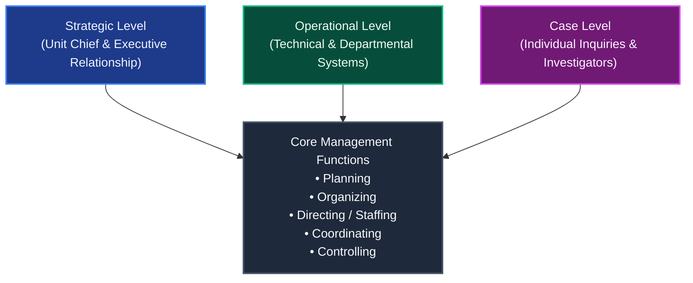
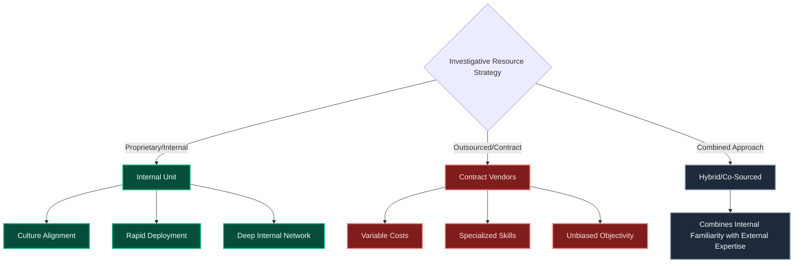
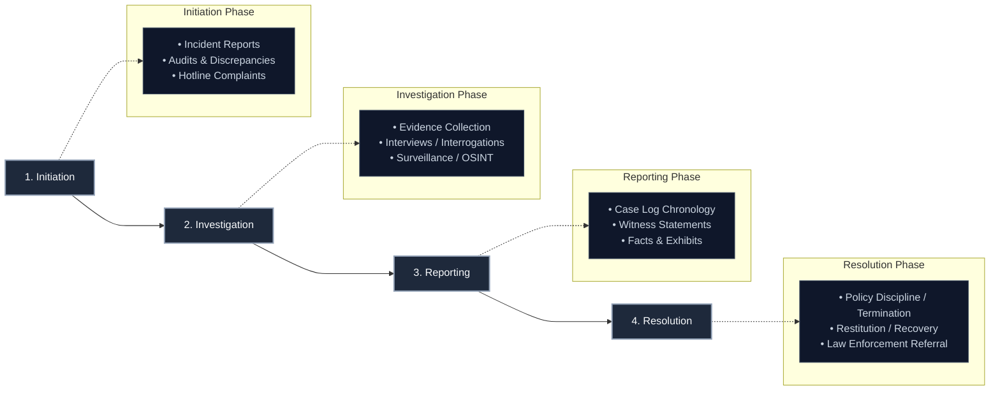
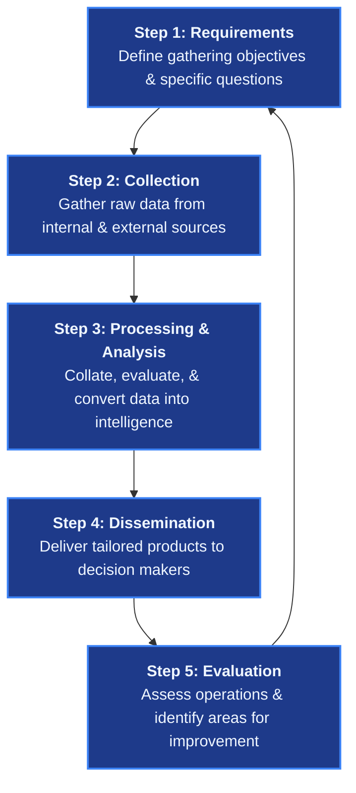
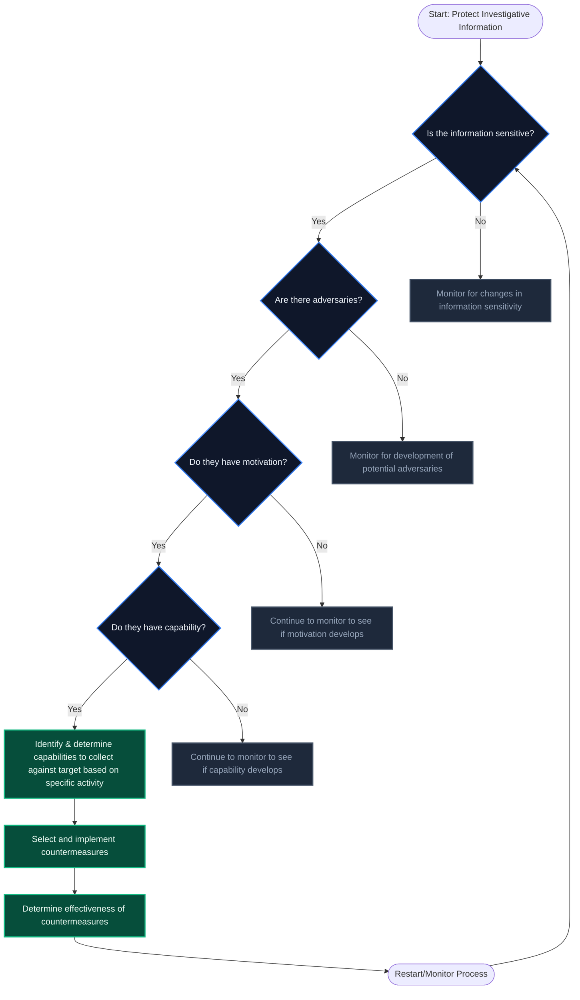
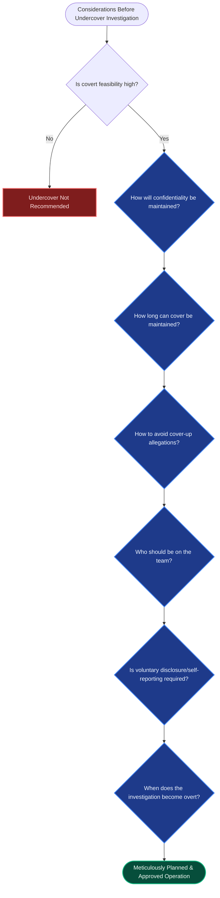
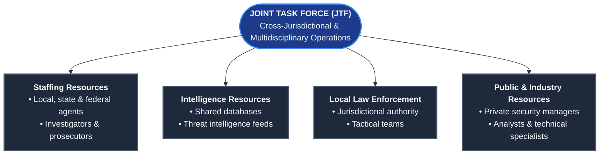
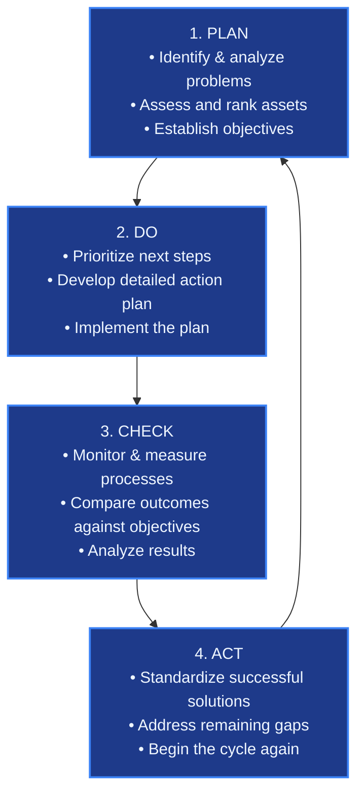

# 04 Physical Security Audit Manual (PSAM) — Investigations

<details>
<summary><b>📖 Book Publication Details & Disclaimers</b></summary>

* **Publisher:** Raivan Global | [www.raivanglobal.com](https://www.raivanglobal.com)
* **Disclaimer:** This *Physical Security Audit Manual (PSAM)* is furnished for training and ready reference purposes. While every effort has been made to ensure the accuracy of the contents herein, Raivan Global assumes no responsibility for errors or omissions.
* **Copyright:** © Raivan Global. All rights reserved. Prepared for internal training and security audit operations.

</details>

---

## Table of Contents

* [Preface: Introduction to Physical Security Audit Manual (PSAM)](#preface-introduction-to-physical-security-audit-manual-psam)
* [Introduction: History of Investigations](#introduction-history-of-investigations)
  * [Before Public Investigating](#before-public-investigating)
  * [Thief-Takers](#thief-takers)
  * [Bow Street Runners](#bow-street-runners)
  * [France (The Sûreté)](#france-the-sûreté)
  * [England (Scotland Yard)](#england-scotland-yard)
  * [United States (Pinkerton & Federal Agencies)](#united-states-pinkerton--federal-agencies)
* [Chapter 1: Investigations Management](#chapter-1-investigations-management)
  * [1.1 The Nature of Investigation Management](#11-the-nature-of-investigation-management)
  * [1.2 Qualities of an Effective Investigation](#12-qualities-of-an-effective-investigation)
  * [1.3 Public Sector vs. Private Sector Investigations](#13-public-sector-vs-private-sector-investigations)
  * [1.4 Management Issues in Investigations](#14-management-issues-in-investigations)
  * [1.5 Organizing for Investigations](#15-organizing-for-investigations)
  * [1.6 Fitting the Investigative Mission into the Organization](#16-fitting-the-investigative-mission-into-the-organization)
  * [1.7 Outsourcing Investigations](#17-outsourcing-investigations)
  * [1.8 Investigative Resources and Infrastructure](#18-investigative-resources-and-infrastructure)
  * [1.9 Managing Investigations](#19-managing-investigations)
  * [1.10 Other Management Matters](#110-other-management-matters)
  * [1.11 Case Management](#111-case-management)
  * [1.12 Other Investigative Management Issues](#112-other-investigative-management-issues)
  * [1.13 Types of Investigations](#113-types-of-investigations)
  * [1.14 Investigative Techniques and Tools](#114-investigative-techniques-and-tools)
* [Appendix 1A: Security Incident Reports](#appendix-1a-security-incident-reports)
* [Chapter 2: Undercover Investigations](#chapter-2-undercover-investigations)
  * [2.1 What Is Undercover Investigation?](#21-what-is-undercover-investigation)
  * [2.2 The History of Undercover Investigations](#22-the-history-of-undercover-investigations)
  * [2.3 When Should Undercover Be Used?](#23-when-should-undercover-be-used)
  * [2.4 When Undercover Operations Are Not Appropriate](#24-when-undercover-operations-are-not-appropriate)
  * [2.5 The Need for Undercover Investigation](#25-the-need-for-undercover-investigation)
  * [2.6 The Five Phases of the Investigation](#26-the-five-phases-of-the-investigation)
  * [2.7 Removing an Operative](#27-removing-an-operative)
  * [2.8 Types of Undercover Investigations](#28-types-of-undercover-investigations)
  * [2.9 The Cost of Undercover Operations](#29-the-cost-of-undercover-operations)
  * [2.10 The Future of Undercover Investigations](#210-the-future-of-undercover-investigations)
* [Appendix 2A: Chronological Report (Daily Log)](#appendix-2a-chronological-report-undercover-daily-log)
* [Appendix 2B: Narrative Report](#appendix-2b-narrative-report)
* [Appendix 2C: Investigative Summary Report](#appendix-2c-investigative-summary-report)
* [Appendix 2D: Special Report](#appendix-2d-special-report)
* [Chapter 3: Due Diligence Investigations](#chapter-3-due-diligence-investigations)
  * [3.1 Definitions of Due Diligence](#31-definitions-of-due-diligence)
  * [3.2 Relevance to Assets Protection and Security Risk Management](#32-relevance-to-assets-protection-and-security-risk-management)
  * [3.3 Applications of Due Diligence Investigations](#33-applications-of-due-diligence-investigations)
  * [3.4 Digital and Cyber Aspects of Due Diligence](#34-digital-and-cyber-aspects-of-due-diligence-investigations)
  * [3.5 Techniques and Steps in Due Diligence Investigations](#35-techniques-and-steps-in-due-diligence-investigations)
* [Appendix 3A: Sample Due Diligence Checklist](#appendix-3a-sample-due-diligence-investigation-checklist)
* [Appendix 3B: Securities Regulatory Bodies — Selected National Bodies](#appendix-3b-securities-regulatory-bodies-selected-national-bodies)
* [Appendix 3C: Securities Regulatory Bodies — Selected International Bodies](#appendix-3c-securities-regulatory-bodies-selected-international-bodies)
* [Chapter 4: Background Investigations and Preemployment Screening](#chapter-4-background-investigations-and-preemployment-screening)
  * [4.1 The Need for Background Investigations](#41-the-need-for-background-investigations)
  * [4.2 Issues That Require Investigation](#42-issues-that-require-investigation)
  * [4.3 Benefits of Preemployment Screening](#43-benefits-of-preemployment-screening)
  * [4.4 Developing a Screening Program](#44-developing-a-screening-program)
  * [4.5 Data Collection: The Basic Information Gathering](#45-data-collection-the-basic-information-gathering)
  * [4.6 Early Application Review and Initial Interview](#46-early-application-review-and-initial-interview)
  * [4.7 Final Selection Phase](#47-final-selection-phase)
  * [4.8 In-House vs. Contract Screening](#481-using-the-security-or-assets-protection-department)
  * [4.9 Future of Background Investigations](#49-future-of-background-investigations-and-preemployment-screening)
* [Appendix 4A: Sample Application Form](#appendix-4a-sample-application-form)
* [Appendix 4B: Sample Preemployment Reference Check](#appendix-4b-sample-preemployment-reference-check)
* [Chapter 5: Interview and Interrogation](#chapter-5-interview-and-interrogation)
  * [5.1 Definitions](#51-definitions)
  * [5.2 Psychosocial Aspects](#52-psychosocial-aspects)
  * [5.3 Planning the Interview](#53-planning-the-interview)
  * [5.4 Documentation of the Interview](#54-documentation-of-the-interview)
  * [5.5 Subject Factors](#55-subject-factors)
  * [5.6 Conducting the Interview](#56-conducting-the-interview)
  * [5.7 Closing Procedures](#57-closing-procedures)
  * [5.8 General Legal Aspects](#58-general-legal-aspects)
  * [5.9 Conclusion](#59-conclusion)
* [Chapter 6: Physical and Technical Evidence](#chapter-6-physical-and-technical-evidence)
  * [6.1 Oral Evidence](#61-oral-evidence)
  * [6.2 Documentary Evidence](#62-documentary-evidence)
  * [6.3 Physical Evidence](#63-physical-evidence)
  * [6.4 Incident Scene Safety](#64-incident-scene-safety)
* [Appendix 6A: Crime Lab Organizations](#appendix-6a-crime-lab-organizations)
* [Appendix 6B: Sample Policy on Computer Evidence](#appendix-6b-sample-policy-on-computer-evidence)
* [Chapter 7: Testimony and Courtroom Procedures](#chapter-7-testimony-and-courtroom-procedures)
  * [7.1 The Journey](#71-the-journey)
  * [7.2 Courtroom Participants](#72-courtroom-participants)
  * [7.3 Testifying](#73-testifying)
  * [7.4 Expert Witnesses](#74-expert-witnesses)
* [Chapter 8: Leveraging Investigative Results](#chapter-8-leveraging-investigative-results)
  * [8.1 Investigative Force Multipliers](#81-investigative-force-multipliers)
  * [8.2 Report Writing](#82-report-writing)
  * [8.3 Leveraging Investigative Results](#83-leveraging-investigative-results)
  * [8.4 Projections](#84-projections)
* [Appendix: Standards in Security](#appendix-standards-in-security)
---

# Preface: Introduction to Physical Security Audit Manual (PSAM)

The *Physical Security Audit Manual (PSAM)* is intended for a security professional to find current, accurate, and practical treatment of the broad range of asset protection subjects, strategies, and solutions in a single source.

The need for such a comprehensive resource is widespread according to the editors, writers, and many professional colleagues whose advice has been sought in compiling this text. The growing size and frequency of all forms of asset losses, coupled with the related increasing cost and complexity of countermeasures selection, demand a systematic and unified presentation of protection doctrine in all relevant areas, as well as standards and specifications as they are issued.

It is a fundamental objective of the *Physical Security Audit Manual (PSAM)* to draw upon as large a qualified source base as can be developed. The writers, peer reviewers, and editors attempt to distill from the available data common or recurrent characteristics, trends, and other factors, which identify or signal valid protection strategies. The objective is to provide a source document where information on any protection problem can be obtained.

### Readership
The *Physical Security Audit Manual (PSAM)* is intended for a wide readership: all security professionals and business managers with asset protection responsibility. The coherent discussion and pertinent reference material in each subject area should help the reader conduct unique research that is effective and organized. Of particular significance are the various forms, matrices, and checklists that give the reader a practical start toward application of the security theory to his or her own situation. The PSAM also serves as a central reference for students pursuing a program in security or asset protection.

### Dialogue
We hope that the *Physical Security Audit Manual (PSAM)* becomes an important source of professional insight for those who read it and that it stimulates serious dialogue among security professionals. Any reader who is grappling with an unusual, novel, or difficult security problem and would appreciate the opinions of others is encouraged to write a succinct statement describing the problem and share it with the professional security community.

### Supplemental Training
Readers with supervisory or management responsibility for other security and asset protection personnel will find the PSAM to be a useful resource from which to assign required readings. Such readings could be elements of a formal training syllabus and could be assigned as part of related course sessions.

---

# Introduction: History of Investigations

It is important to understand the historical foundation of the investigative process in order to place today’s approaches, tools, techniques, organizational structures, and relationships in context. The practice of investigation has long been carried out as both a public sector and a private sector function. The following summary of the origins and development of investigating is based on An Introduction to Public and Private Investigations (Dempsey 1996) and on “Our History.” (Securitas Security Services USA 2004)

### Before Public Investigating

Little is known about the very early history of policing or investigating. Policing—maintaining order and dealing with lawbreakers—had always been a private matter, Citizens were responsible for protecting themselves and investigating crimes committed against themselves. Modern-style police departments did not appear until the 14th century in France and the early 19th century in England. There was no official or organized police or law enforcement investigative process in Europe until well into the 19th century. Neither were there any official investigative agencies. Even with the advent of formal police departments, the police were primarily concerned with the prevention of crime by conspicuous uniformed police patrol. If a crime was reported or discovered, the police merely took a report. Private individuals served as some of the earliest investigators of crimes.

**Thief-Takers.** Before formal police departments developed, individuals called thief-takers served as a form of private police in 16th through 18th century France and England. Thief-takers had no official status but were paid by the king for every criminal they arrested, The major role of thief-takers was to combat robbery by highwaymen. By the 17th century, highwaymen like Jack Sheppard and Dick Turpin made traveling through the English countryside so dangerous that no coach or traveler was safe. In 1693, an act of Parliament established a reward for the capture of any highwayman or road agent. The thief-taker was paid upon the conviction of the highwayman and also received the highwayman’s horse, arms, money, and property. The thief-taker system was later extended to cover offenses other than highway robbery, and soon a sliding scale of rewards was established. Arresting a burglar or a footpad (street robber), for example, was worth the same as catching a highwayman, but catching a sheep stealer or a deserter from the army brought a much smaller reward. In some areas, homeowners joined together and offered supplementary rewards for the apprehension of a highwayman or footpad in their area. In addition, during serious crime waves Parliament granted special rewards for thief-takers to arrest particular felons.

**Bow Street Runners.** Henry Fielding, the novelist best known for writing Tom Jones, is credited with laying the foundation for the first modern police force. In 1748, during the heyday of the English highwayman, Fielding was appointed magistrate in Westminster, a city near London. He moved into a house on Bow Street, which also became his office. In an attempt to decrease the high number of burglaries, street and highway robberies, and other thefts, Fielding established relationships with local pawnbrokers. He provided lists and descriptions of recently stolen property and ask them to notify him should such property be brought into their pawnshops. He then placed an ad in the London and Westminster newspapers: All persons who shall for the future suffer by robber, burglars, etc., are desired immediately to bring or send the best description they can of such robbers, etc., with the time and place and circumstances of the fact, to Henry Fielding Esq., at his house in Bow Street. Fielding’s actions brought about what can be called the first official crime reports. He gained the cooperation of the High Constable of Holborn and several other public-spirited constables. Together they formed a small investigative unit, which they called the

**Bow Street Runners.** These were private citizens who were not paid by public funds but who were permitted to accept thief-taker rewards.

The first official publicly funded governmental police investigating units emerged in the 19th century. Such units first appeared in France and England. Investigation then began to take place in the United States, both in urban centers and on the frontier. France. The French led the way in developing specialized detectives when the king’s chief minister, Cardinal Mazarin, hired 100 exempts (investigators) in 1645. The leaders of the French Revolution felt repugnance for the system of the old regime and abolished the detective branch, but a new one was created by Napoléon Bonaparte in 1817. The Police de Sûreté (security police), France’s new police detective bureau, was created in Paris in 1817 under the leadership of notorious French criminal and police informant Eugéne Vidocq. In 1809, Vidocgq, while serving a prison sentence, offered his services as an informer to the Paris police. The prefecture of the Paris police assigned him to inform on fellow prison inmates. In return, he was allowed to escape custody. In 1817, Vidocq, under police authorization, formed the first Paris police detective bureau. Vidocq served as chief of the Sûreté from 1817 to 1827. Over several years the Paris police detective bureau increased from four detectives to 28 members. Between January and December 1817, with only 12 members, the squad made 772 arrests. Those arrested included 15 murderers, 108 burglars, five armed robbers, and more than 250 thieves of various descriptions. Vidocq was responsible for what became known as the French method of detective work. Detectives of the Sûreté routinely employed clandestine methods against both political and criminal suspects and retained spies and informers. Vidocg, whose maxim was “it takes a thief to catch a thief” hired about 20 ex-convicts he had known in prison. These men formed the basis of the newly expanded Sûreté. Vidocq would then arrest his own men on bogus charges and send them to prison, where they served as spies, gathering information on crimes and criminals inside and outside of prison. When they had collected enough useful information, Vidocq arranged for his men to escape or feign their own deaths. They were carted from prison in coffins, only to rise again to serve the Sûreté once more. After 10 years as head of the detective bureau, Vidocq resigned. He then began his own private investigations business. Thousands of crime victims asked for his help in regaining their stolen property. Vidocq also formed a “trade protection society—”a forerunner of today’s credit reporting agency. For a fee, any shopkeeper or business establishment could obtain the particulars regarding the financial solvency of new customers. At one time, more than 8,000 shopkeepers subscribed to the service.

England. London’s first large-scale, organized police department, the London Metropolitan Police, was created through the efforts of Sir Robert Peel, who successfully managed to have the Metropolitan Police Act of 1829 passed by Parliament. London’s first officers were nicknamed “bobbies” after him. Because the bobbies were housed in a building that had formerly been occupied by Scottish royalty, the home of the London Metropolitan Police became known as Scotland Yard. The early London police rarely engaged in criminal investigations because they did not wish to work in plainclothes, deal with criminal informants, or engage in covert operations. The police felt the public would turn against them if they operated like spies, the image of detectives in France. High crime rates forced the London police to open a detective branch at Scotland Yard in 1842. Under London Police Commissioner Richard Mayne, the detective force numbered no more than 16 men, and its operations were restricted by Mayne’s distrust of clandestine detective methods. In 1867, Irish rebels blew up a wall of Clerkenwell Prison, killing four people and injuring 40. The detective branch was criticized for failing to respond to prior warnings of the event. In 1868, as a result of the Clerkenwell incident, the number of headquarters detectives was increased to approximately 40, and an additional 180 detectives of all ranks were assigned to various local division headquarters. In 1877, three of the four chief inspectors of the headquarters detectives were convicted of accepting bribes. A formal investigation was undertaken by a government commission, and the following year the Criminal Investigation Division (CID) was created and placed in charge of both headquarters and division detectives. When Howard Vincent, a London lawyer, heard of the government investigation of the detectives, he visited Paris to study the French Sûreté. Vincent reported his findings to the home secretary and talked himself into appointment to the well-paid directorship of the CID. Under his regime, the CID was severely criticized for using French methods. The early years of the CID saw much activity by Irish nationalists. Because revolution in Ireland was blocked by the Royal Irish Constabulary and the army, the rebels turned to a terror campaign in England. During the years 1883-1885 they bombed railroads, subways, the Tower of London, and even Scotland Yard itself. A special squad of CID detectives was formed to deal with the terrorists and came to be known as the Special Branch of the CID. In 1887, detectives intercepted an IrishAmerican terrorist and broke up a plot to plant a bomb in Westminster Abbey during Queen Victoria’s jubilee ceremony. After that incident, the movement receded, but the Special Branch remained in existence and is still a force in British policing. United States. The American criminal justice system owes its heritage to the English experience. Discussion of 19th century investigating in the United States must distinguish between public investigating in the East, private investigating on the American frontier, and federal investigating in general.

America’s early police departments formed in the mid-1800s on the East Coast, then quickly spread to cities in the Midwest. Like London’s police department, these departments concentrated mostly on uniformed patrol to deter crime. Many of America’s early public detectives, such as Francis Tukey in Boston and Allan Pinkerton in Chicago, were appointed to their positions by mayors in response to public pressure to halt an increase in crime. Tukey, appointed as Boston’s new marshal in 1846, hired three officers to serve as Boston’s first detective bureau. They recovered $16,000 worth of stolen property in 1850 and $62,000 in 1860. Chicago appointed Allan Pinkerton as its first detective in 1849. Philadelphia started its first detective bureau in 1859 under Chief of Detectives Wood. During its first year, the eight-man unit arrested 481 suspects and recovered $25,000 in stolen property. In 1857, the New York City Police Department, under the supervision of Captain George Walling, designated 20 police officers as detectives. Walling divided the detective force into squads responsible for specific crimes. Each squad maintained records of complaints and arrests. Each detective was required to submit daily reports on the progress and disposition of cases. The Detective Bureau of New York was formally established by the New York State legislature in 1882. American detectives were originally recruited directly from civilian life, often from the criminal underworld. However, they frequently became involved in scandals. Therefore, it soon became necessary to select detectives from the uniformed patrol force. On the American frontier there was no real law enforcement except for the town marshal, appointed by the town’s mayor, and the elected county sheriff. Private police were much more effective than public law enforcement agencies on the frontier. Although they often acted in the same manner as the English thief-takers, keeping a percentage of the stolen property they recovered, America’s private police were more professional and honest than early England’s. Allan Pinkerton could be called America’s founder of criminal investigation. Born in Glasgow, Scotland, in 1819, Pinkerton immigrated to the United States and settled in the small town of Dundee, Illinois, near Chicago, His volunteer assistance in cracking major counterfeiting cases caught the attention of the Cook County sheriff, who later asked Pinkerton to come to Chicago and serve as a deputy. Within a year, he had risen to become Chicago’s first full-time detective. He also served as a special U.S. agent investigating mail thefts. In the early 1850s, Pinkerton left his job with the city to found a private detective agency—one of the first of its kind—in partnership with Chicago attorney Edward Rucker. Their agency, the NorthWestern Police Agency, was an immediate success. Pinkerton pioneered numerous investigative techniques, such as shadowing or suspect surveillance and undercover operations. His agency was the first to hire a female detective, Kate Warne, in 1856. Pinkerton also established and enforced a code of ethics for his employees, prohibiting them from accepting gratuities or rewards and removing politics from his operations. He believed that the job of a criminal investigator was to collect facts in order to identify the guilty party, locate them, and provide evidence of their guilt. Another Pinkerton innovation—the mug shot—soon spread to police and other detective organizations. By the 1870s, his agency had the largest collection of mug shots in the world, It also established a system whereby field agents around the country would diligently clip newspaper stories about criminals, add notations, and send them to a central office where they were incorporated into a criminal database. Pinkerton later offered his services to the federal government. He was assigned to protect President Lincoln and is credited with detecting and preventing at least one assassination plot. In addition, he developed both intelligence and counterintelligence capabilities during the Civil War. He operated an espionage unit that gathered military intelligence, and he personally conducted several undercover missions. On one occasion he posed as a Confederate supporter and was given a personal tour of enemy lines by a top-ranking officer. Later, his firm worked to track down embezzlers who cheated on government contracts. Among Pinkerton’s other major accomplishments were establishing the practice of handwriting examination in U.S. courts and proposing a plan to centralize criminal identification records. He also advanced the cause of international police cooperation by sharing information with Scotland Yard and the French Sireté. In competition with the Pinkerton Agency during the latter part of the 19th century was the Rocky Mountain Detective Association, which pursued and apprehended bank and train robbers, cattle thieves, murderers, and the road agents who plundered highways and mining communities throughout the Southwest and Rocky Mountain areas. Also in competition with Pinkerton was Wells, Fargo & Co., started in 1852 by Henry Wells and William G. Fargo as a banking and stock association designed to capitalize on the emerging shipping and banking opportunities in California. It operated as a mail-carrying service and stagecoach line out of more than 100 offices in the Western mining districts. Because it transported millions of dollars’ worth of gold and other cargo, the company created its own guard organization to protect shipments. The firm’s private security employees were generally effective in preventing robberies and thefts. When criminals succeeded in robbing the company’s banks and carriers, they were relentlessly hunted down. On the federal side, the U.S. government has employed investigators to detect revenue violations since the country’s earliest days. In 1789, the government appointed investigators, known collectively as the Revenue Cutter Service, to prevent smuggling. In 1829, the Post Office Department appointed investigators to investigate mail theft. In 1865, the Congress created the United States Secret Service to combat the counterfeiting of U.S. obligations, such as currency, bonds, and stamps. In 1903, two years after the assassination of President McKinley, the Secret Service assumed the responsibility of guarding the President. The 20th century saw the spread of public investigating to most local police departments in the United States. It also saw the further development of investigating units at the federal level, particularly the Federal Bureau of Investigation (FBI) and the Treasury Department’s Narcotic Bureau, now known as the Drug Enforcement Administration (DEA). The 20th century also witnessed the increased use of science in investigating crime and the use of academic research to study police investigations and establish new methods of investigating crimes. Private investigating also flourished. For example, the William J. Burns Detective Agency was founded in 1909. Burns was a well-known and highly experienced crime watchdog as well as a man of great integrity. In fact, he had a reputation as the greatest detective the U.S. had ever produced. Under his leadership, the company grew from a small detective agency to the second-largest security provider in the United States. In 1921, he was appointed director of the newly formed Bureau of Investigation, which later became the FBI. The art and science of investigating continues to develop in the 21st century. Today there is significant emphasis on computer forensics, garnering evidence from mobile devices, and the use of data analytics. These tools and other technologies influence almost all types of investigations. Nonetheless, there is still heavy reliance on the traditional tools such as physical evidence, interviews, and observation.

---

An investigation is a fact-finding process of logically, methodically, and lawfully gathering and documenting information for the specific purpose of objectively developing a reasonable conclusion based on the facts learned through this process (ANSI INV.1-2015). The investigator may not be asked to reach conclusions, but the results of the investigation and interviews will be used to guide others, such as legal counsel. This definition applies equally in both the public and private sectors and clearly covers the broad range of investigations, from background checks to administrative inquiries to criminal matters. Management is defined as the act of conducting or supervising something or “judicious use of means to accomplish an end” (Merriam-Webster 2020). The primary purpose of any investigation—particularly in the corporate or organizational setting—generally falls within one or more of the following categories (Webster University

- Thoroughly documenting incidents (such as those reported to security staff or officers)

Identifying the cause of undesirable situations (e.g., notable losses, sudden decrease in income or market share, unexplained shrinkage, inventory discrepancies, defalcation {failure to properly account for money held in a fiduciary capacity}, etc.) where nefarious activity is suspected

- Documenting and correlating facts surrounding any situation or allegation of misconduct or inappropriate behavior

- Identifying, interviewing, or surveilling suspects involved in a crime or act of

- Compiling information that proves or disproves an allegation or that implicates or exonerates an individual suspected of committing a crime or misconduct
- Allowing a decision to be made, often with respect to a level of trust or suitability determination, regarding an individual (e.g., in a personnel security clearance) or an organization (e.g., a potential partner firm or acquisition target) - Performing threat assessments to help prevent workplace, internal, or third-party - Collecting crime data and other material in the performance of a site inspection to help mitigate liability and risks to the enterprise From a management perspective, it is important to consider the purpose of the investigation at both the case level and the strategic level. At the case level, the purpose sets the context within which the investigation will be conducted and helps keep the people working on (and managing) the particular case focused. At the strategic level, the purpose of an investigation dictates the necessary planning, organizing, equipping, staffing, and preparation. Unit managers and security directors need to consider all possible purposes they may face, even though the majority of cases may fall clearly into one category. Although they should focus their resources and approaches on the most prevalent types of cases, they should also give forethought to other possibilities.

## Chapter 1: Investigations Management

### 1.1 The Nature of Investigation Management

Five attributes characterize an effective and reliable investigation: objectivity, thoroughness, relevance, accuracy, and timeliness. It is management's role to ensure that these qualities are present at both the strategic level and on an individual case basis, which is accomplished by creating a system that facilitates investigations characterized by these qualities and through effective case review and quality control. ‘The investigative process involves both science and art. Much of the art manifests itself in the qualities below.

Objectivity: Remaining unbiased and focusing on the use of a rational investigative hypothesis while carefully avoiding the interjection of prejudgment. Objectivity is defined as the ability to remain objective and focused; allowing information, evidence, and interviews to be reported without internal or external biases, while carefully avoiding the interjection of prejudgment or unsubstantiated hypotheses. Creating a hypothesis that is not based on evidence, substantiated information, and known facts often leads investigators down the wrong path. Objectivity requires setting aside personal feelings, opinions, and external influences. This can be one of the most difficult requirements for the investigator—even for the experienced professional—because it defies human nature. Many investigations are founded on a working hypothesis, which may be developed at the outset or later and may change one or more times. The hypothesis is appropriately used as a tool as long as itremains within the bounds of objectivity. Many investigations go astray when the investigator starts by trying to prove a certain theory or hypothesis of the incident instead of following every lead to its logical conclusion. A logical hypothesis begins with understanding the existing information, evidence, and context of the investigative mission. This means not jumping to conclusions—even in the face of what seems to be overwhelming and conclusive evidence—without first independently corroborating the facts. The facts need to speak for themselves in a concise, accurate, and professional manner. In an unsolved murder case, for example, the original investigators formed a hypothesis that a fugitive who had escaped from prison was the killer because his father lived next door to the victim. They overlooked leads and physical evidence while pursuing the fugitive. Once captured, the investigators discovered that the suspect was in a county jail for public intoxication at the time of the murder. Years later the cold case investigator pursued the physical evidence which led to the arrest of the victim's boyfriend. He subsequently confessed, asking why it took so long. To aid in maintaining objectivity, every investigator should consciously recognize his or her personal prejudices and neutralize the effects of those prejudices on investigative activities, including the formation of the hypothesis. In other words, the professional investigator must ensure that the investigative findings form the basis for his or her impressions, not the reverse.

As an example, unsolved murder cases went cold when investigators formed a hypothesis that they were committed by a specific person or type of person , but are unable to charge anyone. Years later, an investigator who was not involved in the original inquiry followed the missed leads and evidence. An overlooked fingerprint in blood matched a victim’s boyfriend. The investigator found time-clock records that disproved the boyfriend’s alibi. As a result of these new findings, the suspect confessed and provided details that corroborated he was the killer. In addition, an investigator’s approach and demeanor are critical to the successful outcome of a case. First and foremost, the investigator must project an air of objectivity. This is accomplished by choosing words and phrases carefully during the investigative process and by avoiding facial expressions and body language that might project an inappropriate attitude or prejudgment. Skilled investigators know that if you act like you know what you are doing, others will assume you must. Thoroughness: Following all relevant leads to their logical conclusion and focusing on corroboration of all key investigativefi ndings. A thorough investigation involves checking all leads and checking key leads more than once to ensure consistency. Corroborating important aspects through different sources is a proven means of achieving thoroughness. Different types of sources should be consulted to the greatest extent possible. Various types of sources for a particular piece of information might be interviewees or witnesses, subject matter experts, physical evidence, electronic evidence, public records, surveillance results, open sources, databases, etc. The investigator must also corroborate statements by witnesses and the subject of interest. As an example, in a major unsolved murder case involving 13 victims, the investigator approached a suspect in jail. Over the next six months, the suspect provided detailed alibis as to his whereabouts on the dates of the unsolved murders. The investigator was able to uncover evidence that every alibi was false. The suspect confessed after being confronted with his deception. Mm the course of an investigation, leads often generate other leads, some of which may appear to be superfluous. However, these secondary and tertiary leads can be of great value in either a direct or corroborative sense. In the interest of thoroughness, a balance must be drawn between an effort to follow every possible lead to its logical conclusion and gathering so much information that it confuses the outcome or becomes counterproductive. This is not an easy balance to find. That is why independent case management is an important function

in both the public and the private sectors. This balance is of special concern since there is often pressure to truncate an investigation due to time or resource constraints, particularly in the corporate setting. It is imperative to document all leads and information—they may seem irrelevant at the time but later become important to the investigation. Relevance: Effectively determining whether information applies to the case, considering an adequate spectrum and depth of details without gathering so much data as to confuse the facts of the case and bog down the investigation or possibly even obscure the truth.

#### 1.2.3 Relevance

The information in question must pertain to the subject of the investigation in some way and with the appropriate level of detail. Another difficult aspect of the investigator’s job is to determine relevance and the necessary level of detail (i-e., how deep to dig). The spectrum of details pertains to how wide a net the investigator needs to cast in order to gather all relevant information. For example, in investigating an office building theft problem, should the investigator spend time or energy looking into a construction project at a neighboring building? The answer is “perhaps.” Several years ago, numerous child sexual abuse incidents took place in a particular neighborhood. Investigators were unable to identify any suspects until one investigator noticed that the timeframe of the reported incidents coincided exactly with the start and end dates of a local construction project. The prime suspect was then identified from among the construction crew members, and he later confessed. The other key determinant of relevance is the depth of details. This can be illustrated by the example of a request for a person to describe what he or she did yesterday. One response may be too detailed: “I got out of bed, brushed my teeth, washed my face, then I shaved, got a bowl of cereal, ate breakfast, put my bowl in the kitchen sink...” By contrast, another person might state: “I got up, went to work, and came home.’ Obviously, the appropriate level or depth of detail lies somewhere between those extremes. The investigator may find that a person is scripting an alibi when such is not being sought during the interview. As an example, while interviewing an employee who had access to the safe, he showed the investigator a detailed accounting of his alleged whereabouts down to the minute. The pages had the date it was written, which was prior to the theft from the safe.

Investigators deal with relevance daily. The appropriate depth of detail is difficult to achieve with some interviewees, especially those who may be less intelligent or very intelligent (e.g., scientists and engineers) or people who are nervous, in a hurry, attempting to hide something, or simply very quiet or very talkative. A skilled interviewer can help guide the conversation toward the proper depth of detail without diminishing the value of the information provided. The investigator's job is to ask open-ended questions that allow for the free flow of information, Another aspect of relevance is cause and effect. For example, the subject of a personnel background investigation may have a poor credit rating. Rather than simply reporting a potential weakness in the applicant, the investigator should attempt to determine and verify the cause of the credit rating. The subject may have been a victim of identity theft or may have suffered the loss of a close relative and been saddled with large secondary financial debts until the estate could be settled. In either case, the issue might be completely resolved at the time of the investigation, thereby eliminating the potential weakness. Similar causeand-effect relationships can arise and become relevant in any type of investigation. Another example is finding that the candidate has a criminal history. The investigator should explore the details with the applicant for several reasons. Court and police records may simply reveal the conviction, and not the underlying facts. Records can be incomplete. Government guidelines encourage employers to consider the relevance of the conviction and potential rehabilitation. The candidate that admits he was convicted of a disqualifying crime and describes his crime is confessing to the matter through self-disclosure. Accuracy: The credibility of a source, whether human, physical, or electronic evidence, or the result of observation or surveillance.

#### 1.2.4 Accuracy

“Eyewitnesses play an important role in criminal cases when they can identify culprits. Yet it is well known that eyewitnesses make mistakes and that their memories can be affected by various factors including the very law enforcement procedures designed to test their memories” (National Research Council 2014). The issue is significant because of the number of times that eyewitness testimony has been a factor in reversing a conviction. According to The Innocence Project, mistaken eyewitness identifications contributed to more than 70 percent of the wrongful convictions in the United States later overturned by post-conviction DNA evidence (Innocence Project, 2020).

The mental processes that collect and sort data from the human senses often produce errors. The mountain seen in the clear air of Arizona may appear to be half a mile away but it is actually three miles away. Was the person seen leaving a crime scene short and fat, medium height, running with a limp, wearing a long coat, wearing no coat? Witnesses frequently report conflicting data. Another example of this phenomenon can be taken from a training exercise: a suspect was described by one observer as “a short, chubby male with a green golf shirt, light brown hair, and a mustache.’ Another observer on the same exercise described him as “a thin male of medium height wearing a blue T-shirt and having dark hair and a mustache” In the corporate environment, much credible information on losses, sexual harassment, and other reportable incidents comes from employee tips; however, workers are also the source of many incorrect or misinterpreted tips. Sound investigative techniques dictate frequent tests for verification, like financial auditing where evaluation of the accuracy, timeliness, and completeness of business records are critical. If information is susceptible to physical measurement, it must be measured. If an informant is the only source of key data, the informant should be tested at least for consistency. In addition, the information itself must be tested for inherent contradictions. For example, a person may claim to have traveled in an automobile from one place at a certain time and arrived at a destination at a certain later time, but examination of the distance and elapsed time indicates that the person would have needed to travel at 135 miles per hour to do so. In addition, the investigator should examine the motives of an informant. In many cases, an individual’s reasons for reporting or cooperating may color the completeness and accuracy of the information they provide. All investigative input should be carefully evaluated. It should not be accepted at face value, even if it appears to be straightforward. For example, date/time stamps such as those on computers, cameras (still or video), and mobile devices may be inaccurate if the internal clock on the device is set incorrectly. Similarly, an access control system record that indicates that a particular individual entered a certain door at a given date and time should be considered suspect. It must first be determined whether the system can be manipulated or spoofed and whether another individual could have used the first person’s access card on that occasion. Accuracy is also a key elementin personnel background and preemployment investigations. Some individuals believe that information provided by personal (listed) references is of no value because they are friends and would only say good things about the subject. Actual experience shows that this is often not true. Personal references may provide information unfavorable to the person who listed them. That fact, in itself, should cause the investigator to consider the possible motivations of the interviewee.

Timeliness: The ability to complete an investigation quickly, but not too quickly, and to resist pressure by outside forces to inappropriately either rush or stall a case, thereby damaging the quality of the resolution.
#### 1.2.5 Timeliness
Investigations must be pursued without delay to capitalize on memories and evidence before they fade. In investigations, it is important to:
- Open an investigation as soon as possible,
- Complete an investigation as quickly as possible, and
- Avoid closing an investigation prematurely. Although these aspects may sound contradictory, once again balance is the key. “Investigations should be conducted as soon as possible, consistent with jurisdictional requirements, and to avoid degradation of human, physical, or electronic evidence.” (recognized security standards). In addition, witnesses and others who possess relevant information provide the best information when an incident is fresh in their memory. Over time, their memory commonly begins to fade, or the information they provide may begin to be tainted by their rationalizations as they have more time to think about the incident and the implication of their answers to the investigator's questions. Their recollection may also be colored by media reports, conversations with other witnesses, or other input. Surveillance video may be lost by a protracted delay in the investigation. Many systems record a preset number of days before overwriting previous events. Once an investigation is underway, it should be completed in an expedient manner to conserve resources, allow operations to return to normal as soon as possible, and deter other potential wrongdoers. Finally, timely and decisive investigations reflect on the professionalism of the investigations or security staff, thereby enhancing their overall effectiveness. However, care must be taken not to rush an investigation at the expense of quality, thoroughness, or accuracy. Investigators may be pressured to close a case due to time or resource constraints or because of publicity or political factors. Bowing to these pressures should be avoided whenever possible. The investigative unit chief or security director may need to educate upper management on the potential adverse impact of a rushed investigation, including the possibility of increased liability risk.

In addition, senior decision makers and corporate executives must be made aware that resolution is not achieved in all cases. They cannot assume that every case will be solved rapidly or at all. Such misconceptions can lead to unrealistic expectations of an investigative unit (IU) or security department. Regular and timely communications between senior security or investigative managers and corporate or organizational decision makers will help minimize the problem of unrealistic expectations.

### 1.3 Public Sector Versus Private Sector Investigations

> [!IMPORTANT]
> **Study Pointer — Public vs. Private Investigations:**
> * **Public Sector:** Driven by public law, primary metric is arrests/convictions, subject to constitutional restrictions (e.g. 4th Amendment search and seizure rules).
> * **Private Sector:** Driven by assets protection and risk reduction, primary metric is recovery/mitigation, subject to employment law, consent, and contract rules.

Although tools, techniques, and processes are similar, there is a fundamental distinction between the investigative function in the public sector (generally law enforcement) and in private security. Public sector organizations exist to serve and protect society in general. Their activities are often measured in terms of numbers of arrests and convictions. For example, public sector investigative units will address a series of robberies either in a proactive strategy with surveillance or a reactive strategy with assigning more manpower to solve cases. A crime scene investigation is an example of a reactive measure. Examples of public sector agencies with an investigative mission include law enforcement agencies at national and local levels; regional or special-purpose units (e.g., airport, transportation, or park authorities); intelligence and counterintelligence agencies; inspector general offices; and regulatory agencies that enforce regulations or administrative statutes. The primary purpose of a private sector security organization, however, is to protect the interests of the employing enterprise. Private sector players generally fit into one of two categories:

- Internal investigative or security units within a company or organization, or

- Companies that provide investigative services or special expertise on a fee basis.

This chapter focuses on internal private sector units but recognizes the essential contributions of special service providers and refers to them as well where appropriate. The role of private security investigations, including those in the corporate arena, is growing. In many cases, the public law enforcement agency with jurisdiction decides not to investigate an incident because of its workload and other priorities. Public resources are limited, and some types of crime may not be of interest to conventional law enforcement. Moreover, law enforcement is barred from investigating civil or internal corporate matters, unless a specific crime has occurred.

The distinction between the public sector and private sector has implications for legal authority, resource allocation, program management, and investigative outcomes. Rather than public good, the value of private sector investigative capabilities is frequently measured in terms of recovery, restitution, mitigation of litigation, and risk reduction. The interests of society and the interests of a given enterprise are not necessarily the same. If criminal activity occurs within the enterprise, for example, the public interest is served by the prosecution and imprisonment of the offender. However, the interest of the private sector enterprise may be best served by some combination of accepting restitution or taking administrative or employment action. The investigative process should reflect this difference. For example, the public sector investigator is frequently required to meet a higher standard of proof than that required of the private sector investigator. The distinction flows from the particular rules of procedure in different courts. In U.S. criminal courts, for example, the prosecutor must prove the case beyond a reasonable doubt, while in civil court the preponderance of evidence drives the verdict. Usually, a greater burden of proof is required for prosecution than for employee discipline, including termination of employment. In the private sector, the desired outcome of the case dictates the required burden of proof. However, even if restitution and termination of employment are acceptable outcomes—in lieu of prosecution—the organization must still conduct the investigation professionally and reach a reasonable conclusion. Corporate investigations also tend to be broader in scope than those initiated by public law enforcement. Rather than focusing on a specific act or criminal violation, private sector investigations may further explore company policy violations and may even expand beyond individual violations to review systematic issues that may warrant changes in business processes or corporate policies. Recognized investigations standards offer a list of six ways public sector investigations differ from private sector ones. They include:

- Powers of arrest,

- Search and seizure,

- Testimony,
- Prosecution,

- Due process, and

- Consequences.

Early in the private sector investigation, the enterprise should determine the acceptable outcome or outcomes of the case. This determination must consider the legal requirements in the jurisdiction, organized labor contracts in force or pending, public and investor relations, and the past practices of the enterprise in similar cases. In fact, it may be advisable in some instances to have clear-cut corporate policies on investigative outcomes and the resultant corporate action to be taken. Legal counsel should always be consulted in making these types of determinations. In the private sector, a formal relationship should be formed between the investigation and appropriate legal counsel (corporate counsel or outside retained counsel) to protect the investigation results, exhibits, and data from discovery by the opposing side in the case of litigation. (The information becomes attorney work product.) The investigator should communicate only through assigned counsel or with those approved by counsel. Another difference between public and private sector [Us is that corporate investigators often focus on one type or a few particular types of investigations. For example, investigators at one company may spend 90 percent of their time on theft investigations. Another company’s unit may focus primarily on safety violations, employee misconduct, sexual harassment, or property damage. Still, security directors and unit chiefs should be prepared to deal with other unusual types of investigations as well (and on short notice) either by maintaining some level of internal capability (expertise, training, equipment, etc.) or by having outside resources they can call on when needed. It is important for IU leadership to communicate its multifaceted expertise to other leaders in the enterprise and build strong relationships throughout the organization. Otherwise, corporations may use human resources or legal counsel to conduct investigations, overlooking the valuable resource of the IU. Although corporate [Us generally deal with internal issues, they may also focus on external matters. This is true, for example, of Internet service providers, telecommunications companies, insurance companies, and utilities—organizations whose services are particularly susceptible to fraud or illegal use. Internal issues are generally created through the absence or weakness of internal controls. Many enterprises that deal with both internal and external investigations establish separate units for each. Doing so allows investigators to focus on a particular activity and to develop special expertise, liaison networks, and prosecutorial contacts. It also reduces confusion regarding investigative outcomes and processes.

In some cases, organizations hire outside firms to conduct their external or internal investigations. In many jurisdictions, the public sector occasionally hires a private sector company to provide specific investigative expertise (such as forensic accounting) in a police investigation. Such an arrangement may point to a future expansion of cooperation between the public and private sectors. Private sector [Us also use outside experts, for example, in investigations involving acts or threats of workplace violence. Performing threat assessment and intervention interviews of the person of interest requires unique experience that the IU team may rarely encounter.

### 1.4 Management Issues In Investigations

Management is crucial for success in security and criminal investigations in the corporate environment. Like any other corporate or organizational function, managing investigations entails basic functions of management: planning, organizing, directing, coordinating, and controlling. Figure 1-1 shows that all five of these functions apply at each level of investigative management: the strategic level, the operational level, and the case level. The strategic level involves high-level management of the entire unit and its relationship with the company’s executive leadership. Legal counsel must be involved at this level to ensure the proper focus of investigations relevant to company policy and procedure or civil or criminal statute. This is also where the formal retention of the investigators should occur to establish attorney work product protection. Issues at this level include who will head the investigative function, where it will fit in the organizational structure, what its strategic goals and objectives will be, where it will focus its efforts, and how financial and personnel resources will be allocated to the function. **Figure 1.1: Investigative Management Functions at Each Level**



‘The operational level deals with the technical aspects of the investigative function and how the function works within its department. Such issues as case load, case assessment, quality control, investigative policies and procedures, reporting formats, liaison, team composition, supplies and equipment, evidence management, and outside contracts are considered at this level. The case level involves individual investigations and the particular investigators, investigative techniques, and case management protocols associated with them (Webster The person directly responsible for the investigative function in an organization must think at all three of these levels while simultaneously considering factors that transcend the investigative management levels. That person may be the IU chief, chief security officer, security director, director of investigations, or have another title. Goals and objectives are critical to the investigation’s functions at all three levels. Goals articulate long-term and overarching end states and may be stated in general terms. Goals should be consistent with the parent organization’s strategic direction and should be incorporated into the IU’s mission statement. Objectives are based on goals but are more specific and may be more immediate. They are generally measurable and can be used to gauge the progress, success, or achievement of a unit. Specific, measurable goals are also known as metrics and can be used to evaluate the performance of individuals, teams, and organizations; however, metrics must be related to the overall goals rather than viewed as an end in themselves. Moreover, any investigative strategies developed must be compatible with the organization’s overall strategic business plan. Investigative objectives tend to be tactical and specific to the short-term expectations of the project. When developing the tactical objectives for an investigative project, the IU chief should consult the organization’s tactical business plan to ensure compatibility. For example, an allegation may arise from an undercover project. If an investigation is launched, its objectives should remain consistent with the objectives of the overall project. Changes to operational objectives need to be carefully considered and treated as “change orders” in project management terms. A significant issue that transcends the three levels of investigative management is ethics. From an organizational perspective, publishing written standards of ethical behavior, adopting a zero-tolerance policy for breaches of ethical behavior, and imposing penalties on those who commit such breaches will have a major impact. Although ethical lapses have plagued both the public and the private investigative community throughout history, a lack

of solid ethical standards can seriously damage the effectiveness of an IU or individual investigators, This is true primarily because investigators and [Us rely on their credibility and respectability to be effective in gathering, corroborating, and integrating facts. Almost all human sources upon whom investigators depend—victims, witnesses, first responders, liaison contacts, subject matter experts, and informants—provide information based on some level of trust in the investigator or agency. A reputation for unethical behavior has a significant adverse impact on that trust relationship and therefore reduces the amount, accuracy, or candor of information provided. It can also damage the respect a unit enjoys within the corporate structure and thus can affect how the IU is used and how its members are treated. The following examples of unethical or dishonest behavior are unacceptable in professional investigations:

- Selectively opening, closing, rushing, or stalling investigations based on a relationship

between the investigator or unit and the victim, suspect, or other key player or based on a desire for personal gain

- Improperly handling evidence in order to influence the outcome of an investigation

- Improperly handling evidence or investigative information through incompetence
- Fabricating evidence or investigative information
- Making inappropriate threats or promises during an interview of a suspect employee

- Compromising sensitive investigative information

- Using scientifically unproven, unreliable, inappropriate, or unnecessarily heavyhanded investigative techniques

- Mistreating liaison contacts (e.g., providing misleading or false information or

inappropriately exploiting the relationship)
- Lying during judicial or administrative proceedings Any of the preceding activities should result in the harshest punishment for the offender. Such behavior by a member of an investigative team can damage any prior investigations upon which the person worked. Everything the investigator has done in an official capacity before the discovery of the unethical behavior is now suspect. Moreover, it is discoverable and often admissible in litigation. Unethical behavior often leads senior executives to make changes in the IU leadership. A senior vice president of corporate investigations was terminated after it was revealed that

memos directed to local management were not disclosed to other employees in a timely manner, The jury found the company negligent for failure to warn. Besides diminishing effectiveness, unethical behavior can leave an organization open to civil or criminal liability. [U chiefs must make ethics an underlying pillar of their operations, procedures, and relationships, as well as instilling the importance of ethical behavior in investigative personnel. Experienced investigators know that a case is more likely to be solved through persistent pursuit of the truth than from heavy-handed tactics or trickery.

### 1.5 Organizing For Investigations

In organizations that have not previously had an IU or where the IU is being expanded, redesigned, or otherwise modified, one of the first decisions is how to organize the function. For small organizations with infrequent investigative needs, the use of an outside agency or contract service (outsourcing) may be the logical choice. Many small organizations keep qualified investigative consultants or private investigators on retainer to respond quickly to various issues that require an investigative response. In this way, investigative expenses are generally limited to the cost of specific inquiries and are incurred only when the need arises. In larger organizations or other environments with a constant need for investigative services, a full-time investigator or investigative staff may be justified. The rationale for an investigative capability depends, in part, on the organization’s needs. Matters that require investigations in the corporate arena may include personnel background investigations (BIs), product safety or tampering issues, white-collar crimes (including procurement fraud, other types of fraud, and embezzlement), employee misconduct, theft and pilferage, information loss, due diligence, information technology (IT) systems abuse, and regulatory compliance. Most medium- to large-sized companies have enough work to keep an investigator or investigative staff busy, particularly as investigative needs and regulatory compliance issues become increasingly complex. The primary goal of a compliance investigation is to provide guidance regarding possible or potential violations of regulatory requirements. In almost all situations, cost is a major factor in the decision to outsource or maintain an internal investigative capability. Cost elements include personnel expenses, contracts and retainers, equipment, consumables, overhead, labor, and office expenses. Return on investment can be demonstrated by using restitution figures. The cost-benefit analysis is a useful tool to determine whether to outsource the investigative unit.

The IU leadership should exercise caution regarding restitution as the primary focus of showing value. Some suspects will agree to make restitution to avoid criminal prosecution and later claim investigators used coercive tactics. The investigator should avoid exploring restitution until after the subject has provided a confession or the facts establish a reliable conclusion. Investigative budgets are difficult to predict accurately, because one or two major unexpected cases can result in substantial unplanned costs, The best approach is to base budget estimates on historical data, quantitative estimates of risk avoidance, support of organizational goals, and projected changes. Changes in the company (e.g., growth, new facilities, international expansion, new markets, etc.) and changes in applicable regulations can significantly impact IU budgets. [fno historical information is available, attempts should be made to benchmark with companies that are similar in size, location, and mission. Costs

**Figure 1.2: Investigative Services — Outsourcing vs. Internal**



 Solutions, LLC, 2020)

for equipment, supplies, outside services, travel (both local and out-of-area), administrative support, and contract or personnel management should also be factored in. Section provides more information on funding investigations. Outsourced investigations can be managed in a way that passes the charges for the investigation over to the business unit where or on whose behalf the investigation is performed. This cost then affects the budget of the user and only for the actual cost of services. IU leadership should place budgetary constraints on outside consultants as well. Creating timelines and benchmarks allows for a review of available information and a cost-benefit analysis. Figure 1.2 summarizes the major advantages and disadvantages of outsourcing investigative needs and maintaining an internal IU or capability.

### 1.6 Fitting The Investigative Mission Into The Organization

Precisely where in an organization an IU fits—and how it is used—varies a great deal from one organization to the next. For example, many commercial firms maintain an IU as part of the security department or under the chief security officer (CSO), while others may not have a dedicated investigative capability. Optimally, the structure of an investigative function is the result of a needs assessment and a cost-benefit analysis. All too often, however, this important decision is made indiscriminately, arbitrarily, or in a vacuum. Senior security, assets protection, or risk management professionals should advise executive leaders on realistic investigative needs and the most effective structure for meeting those needs. ‘The following are among the most common structures for an investigative capability in companies and other organizations:

- A separate IU with the unit chief (or senior investigator) reporting to the corporate

security director or CSO

- A separate IU with the unit chief (or senior investigator) reporting to the risk

management or assets protection director
- A separate IU with the unit chief (or senior investigator) reporting to the legal department

- Specialized investigations supported by internal audit or IT

- Investigations performed by an independent function, such as an inspector general or

equivalent, which reports directly to senior executive management

- Investigations conducted by the security director personally since no dedicated IU or

investigator exists

- Security director oversight of an outsourced investigative capability, calling on

an outside investigative company or investigator as needed under a prearranged agreement In larger or more geographically dispersed firms, regional IUs or personnel may be established in order to conserve travel costs and time. This arrangement also allows for investigators who are familiar with local issues (culture, geography, procedures, laws, regulations, etc.) and provides an opportunity to work more effectively with local liaison contacts. Companies may also establish separate investigative capabilities within different business units. For example, there may be one IU for the commercial division and one for the government division, or for the consumer products division and the business-to-business division. Another key issue in organizing for investigations is to recognize particular focus areas for the IU. The primary need in some organizations is personnel screening, while others may focus on employee misconduct, external theft, or fraud prevention and detection. The IU should consider the primary focus areas when organizing the unit, hiring and training personnel, arranging office space, purchasing equipment and supplies, developing communication mechanisms, and establishing relationships. However, managers must recognize (and tell the executive leadership) that other types of investigations may and probably will arise. In other words, it should be no surprise that an IU primarily focused on BIs may suddenly have to deal with an assault or theft case. Investigators should be prepared for this eventuality—mentally and in terms of equipment, contacts, and possible outside investigative service vendors. The lineup of liaison contacts, potential outside sources for investigative services, specialists, and equipment vendors should be tailored to the primary focus areas of the IU (but, as mentioned above, should include some flexibility). Whether the investigative capability of an organization consists of a dedicated unit, a single investigator, the security director alone, or another arrangement, a specific individual (with a backup) should be designated to manage these outside investigative resources. This provides continuity and facilitates rapid implementation of capabilities. Investigative needs generally arise on short notice and on a surge basis. Two other issues concerning how the investigative mission fits into an organization are the reporting chain and the physical location of the investigative capability. The reporting

chain for investigative information or results is critical and can affect both the outcome of specific cases and the effectiveness of the unit itself. Generally, the shortest reporting chain between the source of the information and the final decision maker is best. Many times, especially if litigation is expected or some culpability of the company is suspected, the investigator should deliver the report directly to and only to the legal counsel of record for the company, Doing so may protect the overall investigation as attorney work product. Legal counsel can then maintain attorney-client privilege while advising the company. The final decision maker might be the chief executive officer, chief operating officer, chief legal counsel, president, or some other official. Itis important to identify the decision maker, establish a close working relationship and trust with him or her, and develop a formal reporting mechanism. In some situations, it may be advisable to establish an alternate or contingency reporting mechanism in case the identified decisionmaker is unavailable or is involved in the investigative matter. The reporting chain does not necessarily need to follow the day-to-day organization chart or supervisory chain. In some organizations, following a nonstandard path may be uncomfortable or run counter to corporate culture. That is why an inspector general function, with a direct, independent reporting channel to the decision maker, may work best in some structures. The physical location of investigators or the IU may also be a factor. For example, in some cases the unit may select a physical location that provides adequate access to the officials and departments with which it must interact most closely. These usually include the executive office, general counsel, human resources, internal audit, IT, and security. In other situations, the unit may operate more effectively if it is remote from departments that attempt to micromanage investigative activity. For more on physical location and resources, see Section Finally, investigative functions and capabilities within an organization may expand or contract as the business environment evolves. For example, a company with [Us around the world may decrease the number of such units during corporate belt tightening. Similarly, the company may eliminate the regional units and consolidate investigative functions at corporate headquarters. Outsourcing of investigations in these regions can be a solution to this retrenchment. Another response is the use ofa threat management team (TMT). This is a multidisciplinary unit consisting of business units that include human resources, safety, security, legal, and other units depending on company objectives. Depending on the type of investigation, this team can be activated at the onset of an investigation to provide different perspectives based upon their areas of expertise. The team also provides input on disciplinary actions and recommendations on procedural and policy changes based upon investigative findings. This is particularly useful in investigations of workplace violence. A corporation’s response to criminal and unethical behavior may also change over time. In the past, a company might aggressively pursue both internal and external allegations of wrongdoing; the new paradigm might be to address only cases that could lead to major restitution or recovery or those that have a high profile. Alternatively, a firm might choose to spend scarce investigative resources on particular types of activity, for example, taking a heavy hand against IT-related abuses, while disregarding minor thefts or misappropriations. Government regulations may also dictate investigative steps and actions. These variations, evolutions, or cycles of emphasis can occur as the financial health of an enterprise ebbs and flows, as an industry sector evolves, or as public awareness of an issue surfaces. For example, in the aftermath of the September 11, 2001, attacks on the World Trade Center and the Pentagon, much of the investigative focus at the FBI shifted from organized and economic crime to counterterrorism activities. Similarly, the emphasis within the corporate arena on fraud and financial mismanagement expanded significantly in the wake of the Enron and WorldCom scandals of 2001 and 2002. Those responsible for the investigative function within organizations must build in the agility to accomplish key investigative objectives in a dynamic environment. For a corporate investigative function, outsourcing can mean

- complete outsourcing of the investigative function to an outside agency under contract,

- contracting out for selected or specialized investigative support services as needed. The decision to outsource and the outsourcing approach are usually based ona cost-benefit analysis and projected overall investigative needs. Almost without exception, organizations are cost-conscious, and many have only sporadic investigative requirements. In addition, some prefer an independent source when it comes to investigations. Another common reason for contracting out investigations is an overall corporate policy that encourages outsourcing of peripheral services. Contracting for full-scope investigative services is less common than obtaining services on an as-needed basis. Outsourcing for specialized and expert services, however, is almost always an important part of the budget and the approach to meeting the organization’s investigative needs. The following are specialized services that are commonly called on to support corporate investigations:
- Computer forensics;
- Forensic auditing;
- Handwriting analysis;

- Questioned document examination;

- Statement analysis;
- Workplace violence assessments and intervention;
- Harassment and sexual harassment allegations;
- Forensic psychology;
- Forensic polygraph (where legal);
- Technical surveillance or countersurveillance to provide a deterrent to criminal activity;

- Investigative project management (specialized projects, undercover work, labor

- Criminal behavioral science or profiling;
- Physical evidence collection;
- Laboratory services;
- Audio or video enhancement;

- Criminal intelligence analysis;

- Brand integrity investigations requiring geographic density;

- International investigations with local knowledge or contacts; and

- Investigations where the perception of a conflict of interest exist.

Whether a full-scope or a specialized service provider is needed, finding the right vendor or combination of vendors can be a challenge. The size of the preferred vendor and whether the required services will be distinct or bundled are two key decisions. A large, nationally or internationally recognized provider can bring a significant set of resources to the project. However, smaller firms also have advantages and may offer a more personalized service commitment or local experience. In addition, the use of smaller firms may be recommended for specialized or expert support services. There may also be a cost and availability variance between larger and smaller providers. One should be wary of smaller or local firms that boast of being expert in all aspects of investigations. It is extremely rare for a firm to have significant expertise in areas as diverse as computer forensics, ballistic analysis, BIs, and executive kidnapping cases. Regardless of the size and scope of the preferred vendor, clear criteria for potential service providers should be established and enforced. It is recommended that vendors be preapproved through a vetting process. The following are some important questions to consider in the vendor identification and selection process:
- Does the provider have a reputation for ethical and honest service?
- Does the provider have the demonstrated technical expertise necessary to meet the client’s particular requirements?
- Is the provider licensed in all the geographic areas to which the client’s investigative needs might lead?
- Are the provider’s investigators trained and certified in the techniques and equipment to be used?
- Has the provider served other companies in the client’s industry?
- Has the provider served other companies in the client’s geographic area?

- Does the provider have the personnel and physical resources to respond to the client’s

short-notice, long-term, and high-demand investigative needs?
- Does the provider have a talented, experienced, and stable investigative workforce?
- What is the provider’s billing structure (including peripheral, as-needed, and subcontracted services as well as reimbursable expenses)?

- Does the provider maintain professional relationships with liaison contacts, agencies,

and other firms (including potential subcontractors) that can enhance its operational effectiveness?

- Which mechanisms does the provider employ for quality assurance and contract

performance feedback?

° Which mechanisms does the provider employ (both formal and informal) for communications with the client, on both a routine and non-routine basis?

- Is the provider known for safeguarding information and protecting the interests of its

clients?
- For full-scope providers, does the firm have internal capabilities for specialized and as-needed support, such as surveillance, technical services, computer forensics, etc.?

- What is the professional background of the firm’s principals and key personnel?

- What is the acquisition and merger history of the provider firm?

- What professional, civic, and business associations is te provider affiliated with?

- Does the vendor maintain adequate professional liability insurance coverage?

#### 1.7.1 Identifying Potential Vendors

One source of information on potential service providers is word-of-mouth recommendations from colleagues and counterparts. This form of benchmarking can yield candid, valuable information. Another excellent strategy is to refer to credible professional associations or networks such as Intellenet (International Intelligence Network, www.intellenet.org) which lists vetted private investigators and investigative services firms. In addition, most U.S. states, Canadian provinces, and nations around the globe have professional associations of private investigators and investigative firms. These associations generally impose a code of ethics and training and licensing requirements on their members and often have a vetting process. Associations can also help clients find qualified vendors in specific regions. Once a vendor is selected, the IU chief should ensure that key provisions or clauses of the contract pass through to any consultants or subcontractors the vendor may use. This is especially important with respect to such issues as evidence handling, information protection, public release of information, licensing requirements, availability to testify, and liability matters. Ultimately, the responsibility for ensuring the proper training and licensing of contract investigators lies with the hiring organization (i.e., the company issuing the contract). These issues should always be thoroughly explored and verified during the source selection process. Some less reputable firms have been known to loosely interpret applicable licensing, training, and weapons qualification requirements.

There is no typical organizational structure for the investigative mission in the corporate environment. Factors such as the industry and the company’s mission, size, and scope all play a role in determining how the investigative function looks and how it fits in the organization. When establishing or reengineering an investigative function, the IU chief should use the information provided previously in this chapter as a starting point for the thought process. He or she should work with executive leadership to ensure that decisions are not made on an emotional, spur-of-the-moment, or uninformed basis. The structure and operation of an organization's investigative function can have a great impact on the financial and operational health of the organization.

#### 1.8.1 Functional Charters And Policy Statements

The IU is given credibility and authority through a functional charter issued by the CEO or an equivalent officer. This concise document (often one page or less) states the purpose and direction of the investigative function within the organization and lays out the unit’s strategic goals. It defines who is responsible for the investigative function, the nature and primary emphasis of the function, and the essential internal relationships with the rest of the organization. The next level of definition for the unit is usually a policy statement. This document outlines procedures for initiating and conducting investigations, and it addresses reporting channels, coordination mechanisms, and disposition. The policy statement applies to other departments in the organization as well. For example, it advises the human resources department on how to request personnel Bis. A third level of definition for the new or reengineered unit is a set of objectives. Unlike the functional charter and policy statement, the objectives will be revised on a fairly frequent (usually annual) basis. The objectives for the unit will include performance metrics and targets for areas of improvement over the subsequent period. Developing a well-thought-out and mission-tailored functional charter, policy statement, and set of objectives at the outset of establishing an IU contributes immeasurably to both the smooth introduction and the long-term effectiveness of the unit. The next step in the process is identifying and garnering appropriate resources for the unit based on the previously developed foundation documents. Resources can be categorized as human, physical, and other.

#### 1.8.2 Human Resources

To estimate the appropriate size of the unit, it is necessary to consider the projected case load, nature of cases, geographic area covered, and administrative or other support needs. If staffing needs cannot be accurately projected or benchmarked, the best approach is to start small, using outsourced resources when required, and grow the unit over time if necessary. The expected type of cases is a key determinant in unit size. For example, the caseload per investigator can normally be much higher for Bis than for complex procurement fraud cases. Therefore, a unit that handles mainly fraud cases will likely require a more robust (and experienced) investigative complement as well as additional administrative and support staff than a unit that focuses mainly on BI work. Selecting professional personnel is an important aspect of setting up a proprietary IU. While information, interrogation, and instrumentation are referred to as the three “I's” of an investigator, the complexity and profile of typical investigations within a unit will dictate the qualifications, education, and experience required of successful candidates. Many positions in today’s corporate environment require backgrounds in specialized fields, such as computer investigations, contract fraud, or financial crimes. Historically, a large percentage of corporate investigative personnel come from a public sector investigative or law enforcement background. The primary advantages of such a background are experience, excellent training, and a proven record of performance. A background in law enforcement also facilitates the development of close liaison relationships with law enforcement agencies and other first responders. However, an experienced public sector investigator or law enforcement officer may or may not fit well into the corporate environment. Candidates must be able to operate effectively in a business environment, interface with senior executive management, and interact well with corporate staff members at all levels and in all specialties. Among the differences are the lines of authority and jurisdiction, the investigative objectives (to some degree), and the nature of the relationships and coordination requirements. Investigators should have the ability to use investigative tools such as scatter graphs to identify weaknesses in manual or computerized systems. In short, the transition from public sector law enforcement to corporate investigations is sometimes a difficult one and can vary depending on the candidate’s personality. Criteria should include both the professional qualifications and the personal traits of the individual. On the following pages are recommended qualifications and traits to consider when hiring or assigning investigative personnel (Webster University 2020).

Education. Formal education is a point to consider. Many investigative positions require at least a bachelor’s degree. Although the formal education may not be specific to the investigative field, it does connote a general level of intelligence, maturity, and discipline as well as knowledge of a breadth of topic areas. A college education familiarizes people with structures and processes of culture and society that foster insights into the events and circumstances that real-world investigators encounter in the course of their professional work. Education also demonstrates an investigator’s ability to continue learning because specialists and experts will require specialized education—often including advanced degrees—in their particular field (e.g., forensic science, behavioral psychology, etc.). Training. An important factor in evaluating candidates is the training they have received. A wide variety of courses are available in general investigative techniques and specific aspects of investigations. Sources range from public sector law enforcement agencies to colleges and commercial vendors. The level of training, currency of the training and the training source (i.e., agency or school) should be carefully considered. Certification. Related certifications such as board-certified security investigator credentials, the Certified Fraud Examiner (CFE), and the Certified Forensic Interviewer (CFI) indicate a demonstrated level of knowledge as well as an individual’s commitment to the field and effort to maintain currency. Professional certifications should be given significant weight in recruiting and considering applicants, as well as for advancement. Experience (General). Actual investigative experience is an important qualification and should be carefully considered. As a rule of thumb, candidates should possess two years of experience conducting investigations, preferably a variety of types of investigations. General experience should include interviews and interrogations, evidence handling, liaison, surveillance, record searches, photography, reporting, and presentation of cases. Police patrol experience is not the same as investigations experience unless specific and detailed investigative activity was performed. Experience (Specialized). Specific experience in the relevant industry, in the business environment, or in an investigative specialty is generally a plus—sometimes a significant one. This allows the investigator to bring not only expertise to the new position, but also a valuable suite of lessons learned and best practices, many of which can be transferred to enhance the effectiveness of the unit. Of course, some “specialist” positions will require specialized experience as well. Detailed information about specialized experience should be requested from applicants for positions that require those skills.

Communications Skills. The ability to elicit information (the core of any investigation) from all sorts of people, both cooperative and uncooperative, with many different perspectives and at different levels, is absolutely essential. In addition, the investigator must be effective at presenting information orally and in writing to senior executives, attorneys, prosecutors, law enforcement personnel, and security professionals. They must be simultaneously concise and convincing, balancing facts with conclusions. Although communications skills are to some degree a personal trait, they should be considered a professional qualification. Personal Traits High Ethical Standards. Candidates must have a demonstrated background of trustworthiness and professional ethics. This trait will permeate every aspect of the individual's relationship with the unit and everyone the candidate deals with as a representative of the organization. Persistence. The investigative process often leads to apparent dead ends or other frustrations. The ability to forge ahead toward a successful case resolution or objective despite obstacles is valuable. Balance. At the same time, however, the individual must be able to draw an appropriate balance between aggressively pursuing a successful outcome and following established rules and protocols (so as not to threaten the legal basis of the case or unduly raise the liability risk to the organization). Maturity. A mature and realistic view of self and surroundings is important for anyone who deals with investigative matters, private information, legal issues, and activities that can affect people’s lives and careers—and the organization itself. It allows an individual to keep activities in perspective and place information, events, and situations within the appropriate context. Ability to Deal Effectively with People. Despite our dependence on technology, people form the core of almost every investigation. The ability to deal with all types of people, in every role, in a highly effective manner is essential. Self-Motivating and Self-Starting. In most environments, investigators operate with very little direct management oversight (other than from a legal and regulatory perspective) and are expected to perform independently. The ability to motivate oneself in combination with an inherent inner drive is of extreme value. Ability to Multitask. Every investigation has numerous elements and information sources. In addition, most investigators are assigned several investigations at any given time, so an ability to handle multiple tasks is useful.

Professional Demeanor. In all aspects of the investigative function including dealing with people, collecting and analyzing information, and presenting facts and conclusions, the investigator must maintain a professional demeanor. To do otherwise will threaten his or her effectiveness as well as the unit’s (and the organization’s) credibility. Observational Skills. Skill in observation (curiosity is most important) of people, places, activities, and situations is a key element of any investigation and feeds the information base for a particular case as well as helping direct future investigative steps. People with excellent observation, interpretation, and correlation skills often make good investigators. Flexibility. An individual who can operate smoothly in a wide variety of environments, is comfortable in a range of situations, and can distinguish between when to yield and when to persist will be a far more effective investigator than an inflexible person.

#### 1.8.4 Physical Resources

Office Space. Although it may not be the first thing to come to mind when considering the needs of an IU, office space is important. Open plan offices and those with shared spaces can be a serious concern for the IU, especially if the office space is adjacent to other departments or functions. If possible, private or semiprivate offices should be assigned to the investigative staff. Us also need private spaces for team meetings, interviews, and private phone conversations, as well as lockable spaces to accommodate sensitive files and evidence. Some organizatiownisll require discrete space for conducting interviews. Considerations for interview space include size and comfort of the room, furniture, layout, possible recording setup and whether the room has windows (which may be desirable or undesirable). The unit may want the rooms to be accessible via a path that offers privacy for individuals coming in for an interview. In cases where the investigators will be meeting regularly with people who are not part of the organization, a meeting/interview room may be located outside the controlled area (for example, off the outer lobby) so that guests do not need to sign in at visitor control, This may be particularly convenient for meeting with informants who are external to the company, liaison contacts, outsource providers, or law enforcement officials. These rooms might also be shared with the human resources department, which can use the space for exit interviews or post-employment meetings with terminated employees without allowing them access to the facility's controlled space. In addition, complex investigations are usually facilitated using a manual storyboard (e.g., a dry-erase board or blackboard) or electronic software for tracking leads, posting investigative links (link analysis), and planning follow-on steps. This information, like other investigative data, must be protected from view by anyone not directly associated with the investigative team. A “war room” or a separate, securable space that offers privacy and collaboration room may be useful. Evidence Storage. Although not all units will have a need for evidence storage facilities, consideration should be given to preparing for either temporary or long-term evidence storage. Keys, lock combinations, or ciphers to the evidence storage area should be given to only a few individuals. In addition, most evidence storage rooms are outfitted with individual lockable containers. A separately zoned intrusion detection system is also appropriate in most circumstances. Access control is critical for practical reasons, but also for chain-of-custody management where applicable. The possible need to store evidence with special storage requirements should be considered and planned for. Such evidence includes very large items, things that must be stored in a climate-controlled environment, and evidence that should be kept outdoors. Records and File Storage. Many investigative files are highly sensitive or confidential and are subject to both practical and legal access restrictions. In addition, files and records have widely varying retention requirements. Thus, it is important to ensure that adequate secure storage is available for records and that records are organized in such a way that they can easily be identified for retention and destruction (or disposition) at the appropriate time. All documents and evidence should be retained—in their original format—until all legal action is complete, including appeals. In most circumstances, records can more easily be stored electronically or using secure cloud-based services. Such storage requires less physical space and often results in more efficient retrieval, but some precautions are in order. Secure backup copies should be stored off-site and should be immediately accessible should the primary data, the computer system, or the IU facility become unavailable (e.g., due to cyberattack, natural disaster, or another catastrophe). This is why secure cloud-based services are preferred. In addition, even if investigative records and associated information are digitized, the original documents, photographs, and other items may need to be preserved in some instances. Items that may be needed as evidence (such as photographs and original written statements) must not be destroyed or disposed of. Investigative Supplies and Equipment. Private sector Us vary widely in the type and amount of equipment they require. Some units focus on investigations involving interviews and reporting. Other units may conduct equipment-intensive investigations requiring evidence collection and handling, technical equipment, and consumables. Most Us need at least a cursory evidence collection kit and some audio and visual recording equipment. A voice-activated digital recorder and digital camera often suffice. Although it may appear that smartphones easily meet these needs, careful consideration must be given to the fact that the recording device may itself become evidence, and therefore unavailable to the user/investigator for a significant period of time. In addition, investigative materials should be strictly segregated from other content (personal or organizational) that may exist on a cell phone or other mobile device. The unit should consider its needs realistically and outfit itself accordingly. In some firms, it may be possible to borrow audio or video recording and processing equipment from the audiovisual department or its equivalent. Original evidence (of an audiovisual or IT nature) must not be compromised or questioned due to duplication, enhancement, or other technical manipulation. Investigative personnel must be thoroughly familiar with any equipment before employing it in an actual operation. Investigators should test it under different conditions (e.g., light levels, microphone locations, background noise, indoors and outdoors, etc.) and practice its use. Procedures for marking, logging, and storing audiovisual and electronic evidence, investigative recordings, and removable media of all types must be established in advance. Physical Investigative Aids. Although extensive crime laboratory equipment is not needed in most environments, some simple investigative aids are often helpful. Examples of items that are stocked at many corporate [Us include a latent fingerprint kit, evidence bags and containers, latex gloves, and evidence marking or identification materials. The marking and identification materials come in many forms, including substances that fluoresce under ultraviolet light, barcode labels, QR codes, etching pens, and even radiofrequency identification (RFID) and global positioning system (GPS) tracking devices. Law enforcement and investigative supply firms offer various kits that combine a number of the required investigative aids at a reasonable cost. Other Equipment. Consideration should also be given to the computer equipment, including laptops, tablets, mobile devices, and specialized peripherals needed to support the mission. In addition to administrative requirements, computers may be needed for digital records management as well as computer forensics work and electronic evidence storage. The unit may consider purchasing turnkey digital recording systems for documenting interviews. There are commercial off-the-shelf systems designed specifically for law enforcement and investigators that can be installed in a room, as well as portable systems for off-site use. Consider the possibility that separate devices and systems may be needed for investigative processing, evidence handling, analysis, etc., in addition to the standard office administrative equipment. Other possible equipment needs for the unit include covert surveillance equipment such as photographic equipment, vehicles, and communications systems. Today, the use of drones for some types of facilities or applications is becoming commonplace. They can often serve as a convenient tool for surveillance, assessments, overhead photography for reports and illustration, and other types of investigative support. Covert surveillance equipment is no longer expensive, and wireless technology makes installation easy and efficient. Some basic equipment should be available for quick deployment. If such equipment is purchased, it should be properly maintained and any personnel who will be using it should receive comprehensive training and the opportunity to practice. Legal considerations and requirements for the use of surveillance and recording equipment must be understood, up to date, and verified before each deployment as appropriate. If the unit will be assigned a vehicle, a low-profile vehicle without company markings is preferable. Secure communications devices might be useful in some environments. Procedures should be established for the use of this type of equipment as well as for communications security. Other unit resources, both tangible and intangible, that must be planned for include the following: Training. The investigative team will require significant training, and both time and money must be allotted for it. Training includes informal, internal training as well as attendance at courses and conferences. Training requirements for specialists is more substantial than for general investigators, but all unit members need some degree of recurring and upgrade training to remain current in investigative techniques and legal issues and to enhance their skills, especially those necessary for properly leveraging available technologies. Relationships. Relationships and liaison contacts, both internal and external, should be viewed as a resource and must be deliberately developed. This is especially true when the investigative function is first established. Communications. Effective channels for communications within the organization and with outside entities (such as law enforcement and other external liaison contacts) must be established. Procedures for information sharing, case briefings, support requests, and resource allocation should be clear and realistic. The communications channels that are developed wil! be both formal and informal and should include procedures for both routine and crisis situations.

Financial resources. Budgets and financial management are always important issues, particularly when establishing a new function or unit. Budgets should be carefully planned and based on the best possible projections. Within some organizational structures and cultures, it makes sense to collaborate with other departments (e.g., facilities, security, safety, legal, risk management, etc.) to leverage one another’s budget allocations. Information assets. The lifeblood of the investigative mission is information, and a wide variety of information assets must be established at the outset and maintained throughout the life of an IU. Among these assets are recruitment, handling and case wrap-up of informants, liaison contacts, databases (internal and external), access to key personnel within the organization, open-source information, and operational data. In addition, the IU should establish (or arrange for access to) an employee hotline for complaints, allegations, tips, and other relevant information. An employee hotline is a costeffective way to obtain information with regard to employee malfeasance and garner other anonymous tips. Geographic assets. Many organizations today span a large geographic area, and many operate globally. Having information sources, liaison contacts, contingency vendors, and other resources available to support investigations in each general area where the organization operates makes good business sense and creates efficiencies. Prearranging these relationships and pre-staging equipment, supplies, and perhaps investigative personnel can contribute greatly to efficient and successful investigative operations. For both new and well-established investigative functions, numerous management issues warrant attention at both the strategic and day-to-day levels. This section explores four key management areas: investigative functions, investigative resources, unit management, and case Management. Most Us focus on a particular function or set of functions, They may range from relatively simple activities such as documenting facts surrounding a security force response to a workplace incident to complex procurement fraud investigations. These functions are generally referred to as types of investigations, and frequently the unit’s incident management system is organized according to incident types. The following are typical types of investigations in the corporate and organizational arena:

Incident or accident; Employee misconduct; Misuse or abuse of computer or IT system; Substance abuse; Due diligence; Regulatory compliance violation; Lifestyle or financial inquiries for corporate executives and personnel; Personnel security or background; Theft, pilferage, or misappropriation; Lapping (crediting one account with money from another account); Assaults and crimes against persons; Property damage and vandalism; Inventory discrepancies or unexplained shrinkage Sabotage; Industrial espionage; Embezzlement or defalcation (appropriation of property by a person to whom it has been entrusted); Fraud (general, procurement, insurance, travel, accounting, etc.); Product tampering (actual and hoax); Diverted or counterfeit product; Skimming (keeping some of the cash); Communicating threats; Harassment (including sexual harassment); Workplace violence (actual or potential); and
- Litigation support (varying according to whether the enterprise is the complainant or respondent in a particular case), Other types of investigations are conducted in various industries and environments. In some sectors an IU may be employed to directly support the core mission of the organization. For example, a real estate firm may use its unit to determine the whereabouts of unknown property owners or conduct difficult title searches. Similarly, [Us are sometimes used to support market research, competitive intelligence, and other corporate functions. The bottom line in many organizations is that the IU is seen as a corporate resource and is employed in ways that support overall business objectives. IU managers (and security directors where applicable) must understand how the investigative capability fits into the organization and how the executive leadership envisions its application (i.e., the big picture). Optimally, the investigations unit manager or security director plays a key role in defining that fit and the nature of the investigative functions. This role may vary from direct to subtle depending on the environment and leadership style, but wherever possible, investigators and security professionals should exert as strong an influence as possible, recognizing the overall business objective. Section 1.13 provides more detailed information on some of the more significant types of investigations in the private sector. Among those are incident investigations (which are the most common type of investigation in many organizations), compliance investigations, background investigations, and substance abuse investigations. One particularly important but often neglected investigation type is the due diligence investigation (see Chapter 3). Before entering into a new business relationship, a prudent organization will conduct an inquiry to verify the information provided by the proposed business associate. This activity is normally requested at the close of business negotiations and must be completed in a timely manner, ‘The skilled investigator can confirm the assets, liabilities, legal problems, potential conflicts of interest, and any undisclosed affiliations or identities of the subject quickly. The principal resources of an IU are people, information, credibility, physical assets, and financial assets. The primary functional focus dictates how the unit is structured and how the resources are allocated and applied. For example, the focus affects what types of investigators are hired, what information acquisition mechanisms are put in place, how and where the unit is structured, and the type of equipment and supplies it requires. Focus also largely frames the IU’s budget requests to the parent organization.

Investigative funding needs are often difficult to project because they can be drastically affected by one or a few major cases as well as new regulatory requirements or legislation. Therefore, justifying investigative budget requests is a daunting task. One of the best ways to help achieve a favorable budget request is to show value to the organization or to demonstrate that the unit pays for itself. Support for budget justifications can be bolstered by any or all of the following:
- Proper investigative focus to support the organizational mission as well as strategic and business goals;
- Accurate and detailed tracking of investigative costs;

- Effective implementation of cost management and efficiency measures;

- Demonstration of restitution and recovery benefits; and Quantitative estimation of risk avoidance in monetary terms. Carefully tracking and managing operational and overhead costs can significantly improve the response to funding requests. Costs can be tracked by case type, location, business unit, or other variables. Additionally, recoveries and restitution figures should be tracked and reported to senior management to help demonstrate a financial benefit to the organization and supportreturn oninvestment (ROI) arguments. Often, [Us can demonstrate ROI through civil recovery efforts, recovering not only the losses but also the related investigative costs. Costs for personnel and outside services generally represent the largest budget items for an IU, while overhead costs are often the easiest to control. IU managers should leverage the use of liaison contacts and other organizational departments (such as IT, facilities, accounting and finance, legal, and risk management) to conserve financial resources.

#### 1.9.3 Unit Management

IU managers face a significant challenge in balancing the administrative and operational responsibilities of their positions, Figure 1.3 shows the life cycle of the investigative process. It illustrates many of the functions that occur at the unit level and fall under the broad responsibilities of the IU manager. ‘The chart is divided into four phases. The first shows various ways by which an investigation is initiated (e.g., incidentreport, complaint, discrepancy report, or request for investigation). It includes both the reason for the investigation and the mechanism by which the case is opened.

The second phase is the investigation itself, and the chart provides examples of case types for both incident/ allegation/situation investigations and level of trust investigations. The next phase deals with reporting the findings but also includes further use of the resultant information, Most investigative information is formally retained (often in an automated database) in specified field, summary, or full format. incident Allegation _ Situation Nee for Level of Trust neident Report Complaint — _Audit or Discrepancy Request for investigation (known or unknown subject) _ / Criminal Investigation Background Administrative Inquiry Misconduct Investigation Due Diligence incident Investigation. -Financial/Lifestyle Compliance Investigation Retention and/or Report of Database Investigation Database Adjudication/ Determination **Figure 1.3: The Investigative Life Cycle**


 The final phase addresses the use of the resultant information on a case-specific basis (e.g, disciplinary action, referral to the law enforcement or judicial system, or adjudication) and also on an aggregate or follow-on basis. Examples of aggregate or follow-on use of the data include statistical analysis, program evaluation, strategic planning, and budgetary forecasting. The IU manager is responsible for designing and implementing systems to manage the activity within each of the four phases of the investigative life cycle. Although it is easy to get bogged down in the day-to-day operations of the unit and specific investigative activity, it is important to keep up with unit management and administrative tasks. Initiation In the case initiation phase, an important issue in most settings is some sort of reporting mechanism whereby employees and others may conveniently provide information that they feel may warrant investigation or support an ongoing case. Whistleblowers, employee tips (anonymous and not), and complaints channeled through supervisors account for a significant amount of credible information on incidents and conditions that can result in losses, liability, and other problems (including potential violence). Dismissing anonymous complaints is contrary to best practices in any organization. That said, the possibility of false allegations, retaliation or misinformation must also be considered. Laws in various jurisdictions protect whistleblowers from retaliation, but their protections vary from country to country. The United Nations adopted the Convention Against Corruption in 2003, which made whistleblower protection part of international law. (National Whistleblower Center 2020) In the United States, the Federal Sentencing Guidelines and Sarbanes-Oxley Act of 2002 require, as an integral part of an effective compliance and ethics program, that publicly traded companies (in the case of Sarbanes-Oxley) and companies convicted of criminal activity (in the case of the Federal Sentencing Guidelines) have in place a nonretaliatory internal reporting system for employees to report suspected violations. Many corporations, organizations, and agencies have established channels for reporting fraud, waste, abuse, threats, security violations, and other potential adverse situations. It is also important to maintain an awareness program. Companies are required to have a process in place to evaluate each communication and to investigate those deemed to require follow-up. Companies must make every effort to prevent any retaliation to the reporter, so it is prudent to make all reports anonymous. In some organizations, the reporting mechanism can be shared with departments that track reports of safety hazards, computer threats, or Investigation Management responsibilities in the investigation phase include implementation of a case management system and appropriate administrative controls. Most organizations use automated case management systems, many of which are integrated with the security department’s incident management system. This allows seamless integration of security, investigative, human resources, and facilities data if the system is properly configured and appropriate permissions are in place. Such systerns provide an efficient means of data collection and retention, report writing (and sharing), and coordination among corporate functions such as legal and finance. These programs can also assist with another critical task—case assignment and workload management—although the task can be accomplished manually in smaller units. Case assignment in larger units (with several or widely dispersed investigators) may be based on caseload, experience, specialization, geography, or a combination of these factors. Regardless of which factors are used to make case assignments, the process should be done carefully and deliberately. Poor case assignment can quickly lead to investigator disenchantment and degrade the IU’s effectiveness and its ability to resolve cases successfully. Some investigators could be overloaded while others have too light a caseload. Similarly, investigators with special expertise may be working general cases while investigations requiring their special skills are assigned to others. Case assignment warrants close attention by the IU manager. Oversight and administrative controls are essential in an IU. Managing an investigative assignment ledger falls under the function of the controller or manager. Aspects of each case, both operational and administrative (e.g., costs) require close scrutiny by the manager and should be evaluated at least monthly. Checks and balances should be in place to ensure the following at a minimum:
- Requests for investigation are documented and responded to.

- Appropriate authorizations are in place to open a case.

Investigators are given an appropriate number of cases to handle, and the right investigators are assigned to the right cases, Case status is briefed regularly (internally and externally as appropriate). Case leads are tracked as appropriate.

- Asset values (including estimated loss, recoveries, etc.) are properly recorded and

updated.

- Liaison contacts are tracked and managed.

- Periodic written reporting occurs as prescribed.

- Case resolution and objectives are updated regularly.

- Case resources are tracked and managed.

- Post-case information (disposition, case files, etc.) is recorded.

The controls should operate so that all investigations have been authorized, all work assigned to a particular investigator can be identified, and the results and tasks remaining in any investigation can be determined quickly. In the early days of a new IU, the need for formal controls may not be apparent. However, as the unit grows in size or activity and as personnel change, a formal system is required to derive maximum benefit from the accumulated investigative data. The system should attempt to answer such questions as how much a competent investigator should accomplish in a working day and how long it should take to complete an investigation. Investigative production is affected by the temperament, competence, and working pace of the investigator; by the complexity of the case; and by the availability of informants and other sources of information. It is often impossible to predict what investigative steps can be accomplished on a given day. Therefore, the skilled investigator sets in motion as many leads or inquiry paths as can be managed simultaneously. The objective is to create information inputs that can be exploited as the opportunity arises and in the least amount of time. One measure of effectiveness is the time it takes to complete a case. Although this figure varies drastically, statistical data can be used to derive average time requirements for particular types of leads or cases. The case average is then factored into the scheduling, budgeting, and case assignment routines. This approach may not work well in every environment or setting, but it can be useful in some organizations and can be applied to both case management and strategic planning efforts. Reporting Reporting formats, frequency, distribution, and other requirements should become a part of the unit’s policy and procedures and be followed carefully. Formal documentation

activities are often among the first items to become neglected when caseloads increase, and time pressure is experienced. However, lack of adequate and effective documentation along with sloppy record keeping can lead to failure. Documentation and record keeping are tedious but important aspects of investigative management responsibility. Follow-up Executive leadership and IU managers must recognize that the results or follow-up phase goes beyond simply determining disciplinary, administrative, or judicial action. For example, investigative conclusions occasionally point not only to individual culpability but also to systemic features or business practices that represent significant causal factors (sometimes including security vulnerabilities) and clearly warrant corrective measures. Synergy is created by using the investigative results not only to resolve the issue at hand, but also to correct conditions that allowed the incident to occur in the first place. Investigative results should also be retained in files or databases for statistical purposes and trend analyses according to the unit’s record retention policy. This information can be used to evaluate the effectiveness of the investigative and security or assets protection programs, support resource allocation decisions, and refine pertinent policy and procedures. It also represents valuable input to criminal intelligence analysis that may be employed in general terms or applied to specific future cases involving the same individuals, organizations, departments, locations, or modus operandi.

### 1.10 Other Management Matters

Three remaining key issues in managing the JU are setting objectives, motivating the investigative staff, and training. Setting objectives and monitoring progress toward them is a responsibility that is often neglected but is important for effective operation of the unit as well as demonstrating value to the organization. Objectives must be specific and measurable. They should also be established for different aspects of the unit, such as financial management, case resolution, overall unit performance, information flow, inquiries/complaints/leads handled, etc. In addition, they should be measured, documented, and updated periodically—annually at least.

Encouraging the investigative staff is a key task. The following issues investigators face can. affect their self-image and attitudes:

- Testifying in court and administrative proceedings often subjects investigators to

intense questioning, berating, and second-guessing by attorneys or other officials.

- Investigators may commit extensive time and effort on cases that are later shown to

be based on false allegations, reports, or information, thereby making them feel their effort was wasted.
- Investigations—some of which require a great deal of investigative effort—may not be resolved, may be terminated prior to resolution, or may result in what the investigator perceives as an inappropriate disposition.

- Some investigations (e.g., fraud and white-collar crime) may stretch out for a long

time—in some cases, for years—causing investigators to feel they are not making enough progress.
- Investigators may be subject to ethical temptations (e.g., dealing with unethical people who may be financially successful due to their wrongdoing, the possibility of being offered bribes, using privileged information for personal gain, abusing their authority, using improper or illegal investigative techniques, etc.).
- Witnesses, interviewees, and liaison contacts may be uncooperative or frustrating to deal with.
- Executive management decisions not to pursue a matter (either before or after an investigation) may frustrate investigators who believe that significant case potential exists,
- Reluctance on the part of law enforcement officials or a government prosecutor to accept a case after significant effort has been put forth can prove frustrating.

- Investigators may become cynical, letting work pressures or issues carry over into

their personal lives, Without attempting to act as armchair psychologists, [U managers must be alert for signs of those frustrations. Some measures that may assist in motivating investigators and keeping them at peak performance are requiring periodic breaks or vacation time; sending investigators to training courses to give them time away from case work; conducting office social events; teaming investigators so they can motivate each other; recognizing both personal and professional achievements; supporting participation in professional and community organizations; and employing a participative management style.

#### 1.10.3 Training

Training can be used to benefit both the unit and the individual investigator. Although it takes time and money away from other investigative priorities, training is an essential part of maintaining a professionally staffed unit. Periodically, time should be set aside for internal training sessions to review policies, procedures, protocols, and issues affecting the employing organization. In addition, investigators should be given the opportunity to attend outside training courses and seminars both on specialty topics and advanced general investigative techniques. Specialty topics should be related to the individual's job function or the pertinent industry and may include the following subjects:

- Computer investigations and forensics;

Surveillance technology; Evidence handling; White-collar crime;
- Forensic auditing;
- Criminal intelligence analysis;
- Safety investigations;
- Sexual harassment;

- Workplace violence;

- Insurance fraud;

- Interviewing and interrogation;

- General management;

- Communications; and

### 1.11 Case Management

The previous section discussed setting and monitoring objectives for the IU. However, objectives need to be set for individual cases as well. Even when the investigative objective is obvious, it is useful to deliberately identify and document the case predication and a primary objective—and usually secondary objectives—for a case. This can assist greatly in keeping the investigative activity focused and directing the investigative steps. In more involved (complex or nonroutine) investigations and all proactive investigations, a detailed investigative plan should be prepared, coordinated with all relevant parties, and approved by the IU manager or higher authority. Investigators should recognize that the primary and secondary objectives may change during the course of an investigation, and all such changes should be documented.

#### 1.11.1 Case Files

At the outset of each investigation and upon the approval of the IU manager, a case file should be established. The case file contains the original complaint form or other initiation mechanism, the assigned case or file number, the name of any investigators assigned, complaint or subject information, initial leads, and documentation of management approval. Opening the case file should set in motion the following steps:

- Assignment of a case or file number;

- Entry into the case management system (and other databases as appropriate);

- Notification of management and others as appropriate;
- Staff coordination as appropriate; and

- Efforts to corroborate the initial information.

Administratively, the case file should include the following information, which may be tracked manually or via an automated case management system:

- Case type or category;

- Case title or subject (if subject is known);

- File number;

- Location of the precipitating incident, if any;

- Value of assets lost or stolen;

Assigned investigators;
- Date opened (and location opened if applicable);
- Due date for a report or other action;

- Dates of any interim reports;

Date of the final or closing report; and
- Value of assets recovered.

#### 1.11.2 Following The Progress Of A Case

Investigators should be encouraged to use a case chronology form (either automated or handwritten) to track all investigative activity that occurs on a case but may not be significant enough to generate an interim report of investigation (e.g., setting appointments for witness interviews, setting appointments to review documentary evidence with record holders, and organizing information to further define remaining investigative actions to be completed). A running investigative chronology along with interim reports of investigative activities will demonstrate an investigator’s level of diligence in bringing an investigation to its logical conclusion and allow the IU manager to assess the efficiency and effectiveness of his or her investigative staff. An automated system can generally provide open case reports in order of due date, assigned investigator, or other factors. The IU manager can use the system to review the status of all open (or other) cases at any time. Interim reports can be reviewed electronically or in hard copy. Periodic oral case status briefings are also recommended in most environments. Larger IUs might have an operations coordinator who reviews cases, provides guidance, and makes recommendations on investigative steps. Whether investigators are working individually or in teams, it is a good idea to use supervisors and other investigators in the unit as sounding boards or for brainstorming. Investigation is, in part, a creative process, and the best ideas and approaches often result from collaboration. Case file management can present difficulties if a formal system is not in place, even in a small [U or security department. Hard copy case files should be stored in a secured container (such as a safe or a file cabinet with a high-quality lock). One or more persons should be designated to take responsibility for the cabinet or safe. No one should be allowed to add or remove a file for any reason. A checkout card should be used (and inserted in place of the removed file) to indicate who removed the file and when. This way, the file can be located when it is needed by the IU manager or another investigative team member. Electronically stored versions of case files (both in-progress and post-investigation) must

be carefully controlled with access permissions and audit trail management set by the systems administrator or another official designated by the IU manager. During the course of the investigation, the lead investigator must ensure that the following tasks are undertaken:

- Track liaison contacts and information provided;

- Maintain surveillance logs (physical and technical);

- Maintain evidence logs (along with receipts and chain-of-custody documents);

- File original written statements and documentary evidence;

- Where applicable, track investigative costs by case (in some instances the costs of an investigation can be billed to another corporate or outside account);
- Maintain the suspense log (a list of due dates for reports, status checks, investigative leads and other milestones in the investigation) and ensure that delegated tasks are accomplished as scheduled whenever possible; and
- Report to regulatory agencies when required. These steps help ensure not only the legal credibility of a case but also a higher probability of a successful investigative outcome and a higher degree of efficiency.

#### 1.11.3 Case Reporting And Information

Typically, investigative results are conveyed in a formal report of investigation. A final report and series of interim reports may be prepared as well as periodic and final investigative summaries or synopses. If interim reports are provided, each should include the information contained in the prior interim report. This technique eliminates the need for the reader to constantly go back to prior reports for clarification and understanding of the whole investigation. It means the latest report contains all the information to date. During and upon completion ofa case, a careful balance must be achieved between sharing relevant information with the people who need it in order to support the investigation or make decisions, and protecting the information to ensure its integrity and the privacy of individuals involved. Most [Us have specific policies on distribution of investigative information, but gray areas still arise. Investigators should carefully consider the release of any sensitive information and coordinate its release with the IU manager or appropriate authority. This recommendation is particularly important when the investigation has been initiated by legal counsel and attorney work product privilege is an issue. No information should be released unless the attorney directs the IU to do so.

Disseminated reports and other investigative information, whether in hard copy or electronic format, should include a clear indication of the sensitivity, any dissemination controls, and disposition/retention instructions. Recipients should also be advised, when applicable, that they may not retransmit the information or share it with anyone else. A log should be maintained indicating the distribution of reports, including whom they were sent to and when, or who accessed them electronically and when (as well as noting any downloading of or modification to files).

### 1.12 Other Investigative Management Issues

#### 7.12.1 Legal Issues

The legal issues outlined in this section relate to investigations in the United States, but similar legal issues will apply in most jurisdictions. Legal matters must be considered for two reasons:
- To protect the company against liability and
- To ensure that an appropriate conclusion can be reached if the case goes to court or another legal forum. Other legal considerations include the following:
- Compliance with laws regarding the licensing of private investigators and conduct of private investigations;
- Compliance with regulatory reporting requirements in all applicable jurisdictions;
- The possibility of civil suits (in some cases, criminal complaints) based on allegations of defamation, false imprisonment, false arrest, retaliation, and harassment; and

- The possibility of subpoenas to testify, produce written records of investigation, or

both. It is incumbent on the IU chief to ensure that the organization is familiar with all applicable laws and regulations, as well as corporate policies. This can become a significant task, especially if the company has locations in several different jurisdictions, even in other countries. The venue of a particular case may not necessarily be within the expected jurisdiction. A legal proceeding might be held where the corporate headquarters resides, where an incident actually occurred (which may not be on company property), where a complainant is located, or in some other geographic location connected to the incident.

Applicable laws, regulations, and restrictions may vary across the different jurisdictions. Local Licensing Requirements Most jurisdictions require paid investigators to be licensed, and licensing requirements and procedures vary widely from state to state and from country to country. These requirements should be carefully reviewed before investigators are hired and before investigators are assigned to conduct activity that may take them into other jurisdictions. In the case of outsourced investigators, consultants, or experts, the licensing status of both the individual and the firm that employs him or her should be verified. Current and proper licensing status cannot be assumed when using outside services, and violations can result in significant legal liability, fines, and dismissal of an otherwise good case. For employers with operations in several jurisdictions, the law of each jurisdiction in which investigative activity is conducted should be reviewed.

#### 1.12.2 Liaison

Professional working relationships are invaluable in the operation of an effective IU. Ensuring that the proper liaison relationships are established, nurtured, and appropriately employed is a key management responsibility. These relationships include internal and external, formal and informal, and individual and organizational contacts. Some examples of generally useful liaison contacts for corporate IUs are listed in Figure 1.4. Additional information on liaison and its benefits is provided in Chapter 8.

#### 1.12.3 Criminal Intelligence Analysis

For organizations that require frequent, large, or more complex investigations, a criminal intelligence analysis capability may be advisable—or even essential. According to INTERPOL, “information is the lifeblood of policing.” From INTERPOL's perspective, timely and accurate intelligence analysis is key to understanding the inner workings and driving factors of crime phenomena and criminal enterprises. INTERPOL distinguishes two types of criminal intelligence analysis: Operational (or tactical) analysis supports a specific investigation, while strategic analysis addresses an overall crime threat or trend. Operational analysis aims to achieve a specific law enforcement or investigational outcome. This might be an arrest, seizure, forfeiture of assets or money gained from criminal activities, or the disruption of a criminal group. Operational analytical support includes:

- Identifying links between suspects, and their involvement in crimes and criminal activity;
- Identifying key investigative or information gaps; and
- Providing or preparing profiles of known or suspected criminals.

Strategic analysis is intended to inform higher-level decision makers, and the benefits are realized over the long term. The intention is to provide early warning of threats and to support senior decision makers in setting priorities to prepare their organizations to deal with emerging criminal issues. This might include allocating resources to different types of crime, or increasing training in a particular crime-fighting technique. (INTERPOL 2020) Criminal intelligence analysis, however, can be just as important to corporate and organizational investigative units. In support of the security risk management process, it is generally used in a threat analysis role, but it can also highlight vulnerabilities and potential

impacts of criminal activity or other types of loss events. For example, it may provide valuable input to a comparative analysis of the impact of intellectual property theft (or loss) across multiple research initiatives within an organization, or across various business units.

**Figure 1.4: Suggested Liaison Contacts**

| Channel Type | Internal Contacts | External Contacts |
| :--- | :--- | :--- |
| **Formal Channels** | • Human Resources / Employee Relations<br>• Legal Counsel / Compliance Department<br>• Internal Audit / Finance Officers<br>• IT Security / Network Administrators<br>• Facilities Management / Operations | • Federal Agencies (e.g., FBI corporate relations representatives, computer crimes, economic espionage)<br>• State & Local Law Enforcement Agencies<br>• Regulatory Bodies (SEC, EPA, OSHA)<br>• Industry Associations (recognized security associations, ISACA) |
| **Informal Networks** | • Department Supervisors & Floor Managers<br>• Peer Security Staff & Investigators<br>• Long-term Company Employees<br>• Health and Safety Committees | • Private Security Managers in adjacent facilities<br>• Local Business Communities & Merchants<br>• Community Outreach & Civic Groups<br>• Personal Professional Networks | Criminal intelligence analysis in the private sector can be strategic or tactical (operational) in nature. Although strategic analysis informs management issues such as resource allocation, risk category focus/priorities and long-term planning, it is also useful in directly supporting investigative operations. One important aspect of strategic analysis, in this regard, is a formal process which is very similar to the National Security Intelligence Cycle. Figure 1.5 illustrates one version of a criminal intelligence cycle that might be employed by law enforcement agencies (at all levels), investigative organizations, or even corporate investigative units that are faced with large-scale, complex, or interconnected investigations.

**Figure 1.5: The Intelligence Collection Cycle**



As shown in the figure, a typical criminal intelligence cycle involves five steps. In reviewing the steps, consider the example of a corporation concerned about a widespread organized retail crime (ORC) ring that is exploiting its warehousing operations. **Step 1: Requirements.** Collection requirements may be set by the organization as a whole or for a specific business unit, region, or project. They define exactly what information needs to be gathered or what questions (often called interrogatories) need to be answered. Requirements are sometimes general, but the more specific they are, the more useful the resulting information will be. That also means they may be more challenging or take more time to answer. In the ORC scenario, collection requirements may revolve around any tactics ORC rings use in targeting warehouse operations, changes in modus operandi, detailed information about specific groups, where they operate, which groups operate in conjunction with each other, and means of communication.

**Step 2: Collection.** The collection often involves gathering information or data from several different sources (and source types) with the objective of providing pieces that will satisfy requirements or parts of requirements after being analyzed. This step usually involves a number of participants, both witting and unwitting. Some organizations have a competitive intelligence function that can be used as a very effective “collector” for this purpose. Others rely heavily on open source intelligence (OSINT), which is gathered through a variety of online, in-person, print and other sources, and may include direct observation or surveillance. Additional information might be gathered by market research assets within the company or by outsourcing some collection needs to firms that specialize in this arena. it is important to note that, in most cases, valuable information resides both inside and outside the organization. Neither of these venues should be overlooked when considering possible sources. Overall, the best collection operations involve a wide variety of sources and source types. By providing input that comes from different perspectives, different origins, different sectors, and perhaps from different time frames (older versus newer), the analysts can more effectively do their job and piece together a comprehensive picture that fully addresses the original requirements. In the ORC scenario, the collection phase might seek input from law enforcement agencies or task forces, news media, crime and threat databases, supply chain security experts, companies or facilities that were previous victims, and even members of ORC

groups (past or present) themselves. Risk assessments from warehouse facilities should be reviewed as well, if available. Some physical surveillance at or around warehouse locations may also be explored. The effort might use a combination of internal collectors, a contract intelligence collection firm, and a private investigations firm. The geographic scope of the collection effort would also need to be defined at the outset.

**Step 3: Processing and Analysis.** This is the heart of the process where information and data are converted into actionable intelligence. Information is received, collated, and sorted—assigned to particular collection requirements or general use files. The credibility of sources (people, organizations, publications, or other media) and the reliability of the information itself are assessed and considered. Integration and analysis also include activities such as:

- Corroborating information and comparing it to other inputs of a similar nature;

- Disassembling inputs, studying each component part for meaning and relevance, and reassembling it into a cohesive data point;
- Combining bits and pieces of information as though putting together a puzzle;
- Placing input in context and determining the meaning of the collective information in terms of the organization’s mission and intelligence needs; and

- Determining how the resulting intelligence can best be used and making

recommendations for dissemination and application. Many private sector organizations and businesses maintain their own internal intelligence analysis teams to perform this mission. They range from high-tech research and pharmaceutical firms to cruise lines and theme parks. The analysis cell might operate like a mini-intelligence fusion center. Such centers are normally established as a multijurisdictional law enforcement task force to receive threat, organizational and other information from a wide variety of sources and agencies, then collate and analyze it. Fusion centers often have a particular focus such as terrorism, drug smuggling, counterfeiting, or human trafficking, but they can also combine various purposes. In the case of a corporation or organization, a mini-fusion center might include participation by various business units, departments, corporate functions, or internal stakeholders and might even include key suppliers or business partners. The benefit of the fusion center model is that information is received from a broader range of sources and analyzed from a broader set of perspectives. In addition, information can be disseminated, with proper protections, to a wider audience and will likely be more useful to the organization overall.

Ideally, the analysts and collectors will communicate back and forth as necessary to ensure that a complete and comprehensive picture of the relevant subject matter is being provided and requirements are being fulfilled. In the ORC scenario, all information gathered is analyzed and shared with those who will prepare various intelligence products for appropriate intelligence “consumers” and stakeholders. At this point, checks will be made to determine whether and to what extent the collection requirements have been satisfied and the best way to handle or share intelligence beyond that which is responsive to specific requirements.

**Step 4: Dissemination.** An important decision at this point in the process is: who is going to get what information when, in what format and how will it be delivered? Some of the answers to these questions may be pre-determined based on specifications contained in the collection requirements; however, it is more common for them to be open ended. So, the dissemination process may be simple and straightforward or may be quite complex. Whether or not third parties will be receiving some of the output also influences the process. Another issue that needs to be addressed in the dissemination stage is that of classification. Many private sector organizations have a classification system as part of their information protection protocol—this type of information would most likely fall within the “confidential” or “proprietary” (or equivalent) designation. Finally, the dissemination stage must consider how and for how long the information (initial input as well as finished intelligence) will be retained. Applicable laws, regulations, and organizational policies will all play a role in these decisions. These may vary widely from one jurisdiction to another, especially where international boundaries (physical or logical) are involved. It should be noted that certain entities such as law enforcement and the asset owners may be a “source” of information as well as a “customer” or “recipient” of the finished intelligence. This is not uncommon and actually makes a great deal of sense in most situations. Processing during the integration and analysis step helps ensure that investigators are not simply regurgitating information that the original source provided and are providing value to all parties. In the ORC scenario, some recipients of the intelligence products might be the C-suite, the asset owners within the organization, the warehouse management team, human resources, personnel security, physical security, operations, IT, and—in a more limited way—trusted transportation and supply chain providers. Appropriate nondisclosure agreements (NDAs) must be in place. Investigators might also consider coordinating with law enforcement and/or security systems providers.

**Step 5: Evaluation.** This important step is easy to neglect. Periodically, the IU must assess operations and evaluate whether it is meeting objectives in order to improve the process. First, are the collection requirements satisfied? This can be done at the conclusion ofa specific collection requirement, or as an interim evaluation. Second, and more generally, is the criminal intelligence analysis function doing what it was meant to do (satisfying defined goals and objectives) and doing it efficiently? Finally, how can the process be improved? In the ORC scenario, does the IU know everything needed (or at least as much as is reasonably possible) to thwart the current ORC threat to warehousing operations? What other information might be needed on this topic now or in the future? Is the IU fully prepared to coordinate with law enforcement, legal counsel, or other appropriate parties on this issue? How can the process be improved, in the short term and long term? The tactical approach to criminal intelligence analysis usually relates to a specific investigation or ongoing operation. It can also be useful in visualizing and studying complex threat trends and interdependencies relevant to the security risk posture of an organization or endeavor. ‘The most prevalent tool employed is link analysis. This is an age-old tool which probably saw its origins in the early detective agencies such as the Pinkerton Agency described earlier in this book. Over the past several decades, it has been championed and promoted by professional associations, particularly the International Association of Law Enforcement Intelligence Analysts (IALEIA), and it continues to advance in scope and sophistication. Analyses formerly conducted with whiteboards and sticky notes now commonly use specialized software platforms and data analytics. Generally, link analysis graphically and logically portrays interconnections among people, places, and activities to reveal patterns or other useful information of investigative value. The results can be used to assist in solving crimes (the most well-known application), but they may also be applied proactively for threat analysis, predictive analysis, and the study of criminal or adversary organizations. The elements that represent data points in a link analysis program may include:

- Personal connections (2nd, 3rd, 4th degree, for example);

- Communications between/among individuals, groups or organizations;

- Travel patterns (local, domestic, or international);

- Events attended (social, professional, educational, organizational);

- Internet and social media connections;

- Employment;

- Locations;

- Vehicles;

- Memberships (formal or informal groups, criminal and noncriminal);
- Activities; and A thorough analysis will not only track these elements with respect to a particular crime, threat, group, or situation, but also identify any changes or trends over time. An overall objective is to “connect the dots” and reveal information that translates into actionable intelligence. Of course, both strategic and tactical intelligence analysis have a wide variety of applications including executive protection operations (static, local movement, and travel), crime prevention programs, threat assessment, and fraud detection. Each can also reveal systemic weaknesses in an organization’s security practices, business practices, decisionmaking processes, project management, and even facility design that may facilitate crime or exacerbate security risks. Both strategic and tactical analyses also rely heavily on social media inputs both as a means to identify and track threats and as a source of investigative leads. Software tools for data mining, data analytics, and link analysis are also valuable. In strategic analysis, social media is normally used in the collection step, but it should also be leveraged in the analysis phase to place information in context or as a method of corroboration. From a tactical perspective, social media is invaluable in identifying suspects, connections, and threat actors, as well as in uncovering criminal or illicit activity,

#### 1.12.4 Protecting Investigative Information

An important aspect of investigative management, which often receives less attention than is warranted, particularly in the private sector, is that of protecting case-specific investigative information. Once an investigation is completed and the information is compiled, the contents contained therein and outcome are permanent. Protecting such information is important because of the potential that its compromise could damage the

future effectiveness of the investigators or IU involved, lead to potential civil liability against the organization, damage the reputations and careers of individuals (such as subjects, witnesses, interviewees, managers, coworkers, etc.), and damage important liaison relationships. In addition, improper handling of investigative information can energize the rumor mill, harming the investigation, stock prices, market share, and corporate reputation. In many jurisdictions, investigations involving electronic and other documented information require extraordinary protection and security. Organizations and investigators are subject to regulatory sanctions if appropriate measures are not taken to secure personal information obtained from investigations and surveillance. Investigations in most European countries, Australia, and Canada are subject to laws that strictly govern an individual’s personal information privacy. One example is the European Union’s General Data Protection Regulation (GDPR) which was implemented in 2018. It places significant restrictions on the personal information that can be collected, shared, and accessed by others, and is meant to protect the privacy of individuals. The stipulations affect security professionals and investigators attempting to gather information, even for preemployment background investigations, even if the company or investigator is not located within the European Union. Particularly important applications for investigative information protection include the following:
- Cases in which the subjects are senior executives or high-profile persons; Joint task forces;
- Major compliance or regulatory investigations;

- Cases involving sensitive issues, such as terrorism, child pornography, workplace

violence, major fraud, or product safety; and
- Cases involving information defined as protected, personal information that requires safeguards pursuant to privacy legislation. Itis particularly difficult to protect investigative information in joint task force environments because each participating agency may have different policies, definitions, perspectives, and attitudes toward what is sensitive and warrants protection, or how exactly to protect it. In fact, protecting critical information is a key element of any investigation. This is even true in personnel background investigations (Bls) as is evidenced by the well-known tenet that the investigator does not reveal derogatory information received from interviewees or other sources to subsequent interviewees.

Besides formal protocols (such as government classification systems), operational security and operations security represent effective means to identify and protect valuable Operational security is the totality of all security and planning measures employed to ensure a successful outcome for a particular operation or activity as well as the safety of the investigators involved. It includes such measures as cover stories, backstopping (actions taken to support covers or contrived identities), communications protocols, agent infiltration plans, countersurveillance, covert meet security (measures to conceal a secret meeting), the use of carding (practice of keeping data about sources of information), and technical monitoring. In both the public and the private sectors, operational security is generally applied to special activities, such as undercover or sting operations. This topic is examined in Chapter 2. By contrast, operations security (OPSEC) is a simple and systematic method of employing safeguards to protect critical information. The OPSEC process includes five cyclical steps:
- Identify assets (critical information).
- Define the threat (collectors, capabilities, motivations).
- Analyze the risk (impact, priority, existing countermeasures, etc.). Develop and implement countermeasures. A key but often overlooked step is to realistically determine what information at each phase of the investigation or operation is sensitive and therefore warrants protection. This is the process of defining critical information. In the case of joint task force operations, for example, a deliberate process should be undertaken at the outset to define critical information and to reach an agreement among all participating agencies, Defining the threat entails identifying, within reason, all potential information collectors or adversaries who may target an investigation or operation using legal or illegal means. The following are among likely candidates as potential adversaries:

- Individuals or organizations with a stake in the outcome of the investigation,

- Friends or supporters of the subject of the investigation,

- Co-conspirators not yet identified (individuals or organizations),

- News media and simple public curiosity (especially in high-profile cases), and

- Potential copycats or others engaging in similar wrongdoing.

An important rule of thumb is never to underestimate the lengths to which adversaries will go to get what they want. Many criminals (and others) apply the same surveillance and human collection techniques that law enforcement and legitimate investigators use. They may monitor communications (radio, landlines, social media, cell phones, etc.), collect information from courtrooms and proceedings (public records), conduct social engineering, exploit public affairs offices, use open sources (such as news sources and the Internet), gather information from trash, and target computers and mobile devices (in some cases, even IoT devices). Vulnerabilities can be direct (such as physical or electronic interception of investigative information) or indirect (such as increased activity in the security department just prior to an important operation). Both should be carefully considered. Investigators should ask themselves whether they are exhibiting predictable patterns of behavior or doing anything that could be used by the adversary to block the success of their operation. A risk analysis—based on the nature of the critical information, the credible threats, the identified vulnerabilities, and the consequences of an information compromise— assigns levels or priorities to the information risks. These risks can then be addressed by appropriate countermeasures, Essentially, a countermeasure is anything that effectively negates or reduces an adversary’s ability to exploit information or vulnerabilities. It can be something as simple as a change in behavior or routines. Other countermeasures include the following:
- Restricting conversations in situations where others can overhear;
- Limiting the use of information that can be viewed on social media (Twitter, Instagram, Facebook, LinkedIn);

- Limiting cell phone, radio, and wireless communications usage;

- Using encryption when possible;
- Avoiding conversations in public areas such as restaurants, airports, etc.;

- Carefully selecting surveillance vehicles, techniques, and participants;

- Coordinating closely with public relations offices of participating agencies and

companies;

- Applying “need-to-know” procedures within the IU, agency, or company;

° Appropriately securing written information and office spaces;

- Immediately destroying trash that may contain sensitive information;
- Applying sound cybersecurity procedures to systems processing sensitive information; and
- Including information protection clauses in agreements and contracts for security or investigative support services. Figure 1.6 shows a generally applicable process flow chart outlining the steps for protecting Effective information protection measures should not hinder investigative operations but rather enhance them. Cost-effective countermeasures should be employed by all participants in an investigation or operation as well as anyone with access to related information. Such measures help to protect evidence, ensure successful investigative outcomes (including convictions or restitution), and protect personal safety. In summary, at the outset of an investigation or investigative operation, it is important to define the critical information; assess adversary capabilities and motivation to collect information against the activity; determine the adversary’s likely methods of collection; and then apply countermeasures to prevent, neutralize, or mitigate the collection effort.

#### 1.12.5 Working In Multicultural Or International Environments

In the climate of globalization, both public and private sector investigators must be able to operate in a multicultural environment. Cultural issues can become a factor in an investigation in almost any type of company, industry, or organization. Examples include the following:
- A corporate investigation within a domestic firm where the investigation involves subjects or witnesses who are of a different ethnic background or are citizens of another country;

- A corporate investigation that takes place or follows leads in another country;

A corporate investigation that involves partner firms, subsidiaries, joint ventures, vendors, or suppliers located or incorporated in another country;

- Due diligence investigations involving firms or individuals somehow affiliated with a

foreign country;
- An investigation involving international or multinational organizations; and
- A joint task force involving agencies from more than one country.

**Figure 1.6: Process Flow Chart for Protecting Investigative Information**



Among the key considerations for any investigations involving international venues, subjects, organizations, or information are: Laws. Laws vary not only from country to country but also between jurisdictions within a country. They may also be affected by agreements and regulations within regional entities, such as the European Union, various free trade zones or other regional entities. Investigators must be well informed of and sensitive to the pertinent laws and regulations—as well as customs-—within the international arenas in which they operate. Liaison. Like other investigative functions, liaison must be approachweithd specific cultural factors in mind. When. operating in foreign nations, liaison with local law enforcement, security, and intelligence agencies is commonplace and often a necessity. Relationships with such agencies can range from very close and trusting to extremely tenuous. Regardless, working with these agencies in general and on specific cases is usually advisable. In most cases, a close working relationship with foreign counterpart or supporting agencies can have immense benefits and greatly expedite successful resolution. However, before deciding to consult with agencies in foreign countries, discreet research on the reputation and practices of those agencies is critical. Internal team liaison is also essential when working with multinational joint task forces. Understanding one another's investigative tactics, legal constraints, and culture contributes greatly to task force effectiveness and reduces both wasted effort and duplication of effort. Additional information on liaison as an investigative force multiplier is provided in Chapter 8. Cultures and Approaches. Particular investigative techniques as well as overall approaches and strategies are more appropriate in some countries and cultures than others. For example, offering money for information may be an insult in some cultures, while it is virtually a necessity in others. Legal counsel should be consulted before payments are offered for information. Interview techniques, the relevance of certain types of evidence, surveillance operations, and technical surveillance all may have significant culturedependent ramifications as well. Nations differ drastically in how they interpret crime and technology issues. For example, not all countries recognize computer crimes as a serious threat. In addition, the rules of evidence and the technical capabilities oflaw enforcement agencies can vary greatly, thereby affecting agencies’ ability and willingness to assist in technology-related investigations. Various nations also have differing perspectives on drug crimes and related investigative practices. Another factor is one nation’s relationship with another in political, diplomatic, or economic matters. If relations between governments are less than cordial, those countries and their

representatives may be discouraged from cooperating in the investigation or prosecution of cross-jurisdictional criminals. Cultural differences are the most challenging problem in international investigations. Therefore, the investigator tasked with supporting investigative activity in multinational or international environments must understand cultural diversity in general as well as specific cultural and legal issues relevant to the country or ethnicity involved.

#### 1.12.6 Ensuring An Appropriate Case Conclusion

The overall objective is a successful investigative outcome or resolution of a case (whether an identified suspect is implicated or exonerated). The best way to help ensure an appropriate case conclusion is to focus on the basic qualities of an investigation: objectivity, thoroughness, relevance, accuracy, and timeliness. Investigative managers must also focus attention on legal issues, such as licensing and liability; technical issues, such as appropriate investigative techniques and the protection of investigative information; and management issues, such as effective coordination, documentation, and case presentation. By carefully and effectively balancing these key issues, management can help ensure successful case resolution and protection of organizational assets. At the conclusion of any case, the findings and other information developed during the investigation must also be evaluated for other ways the information can be used or benefit the organization. See Chapter 8 for more detail on this key step.

### 1.13 Types Of Investigations

As mentioned in Section 1.9.1, most [Us emphasize one or a few particular case types that represent their most prevalent matters or the bulk of their caseload. Typical case types for the corporate and organizational environment are listed in that section. Some case types, however, warrant specific discussion. For example, background investigations deserve detailed discussion because they represent a distinct investigative function in terms of approach, resources, reporting, case disposition, and associated legal issues. In every case effective and reliable investigations are timely and accurate. Although some discussions are more detailed than others, each of the following subsections discusses how the case type is distinct, which special techniques might be applied, and associated issues that investigators and IU managers should understand.

The initiation event in a private sector incident investigation is generally a security force incident report. Appendix 1A at the end of this chapter shows two examples of incident report formats commonly used by security forces in commercial and government facilities. Other initiation events for incident investigations include direct complaints, whistleblower reports, and security audits or assessments. For this reason, they are sometimes referred to as complaint investigations. This is the most common type of investigation in many business and organizational settings. In fact, incident investigations are needed in almost all organizations, many of which do not maintain formal investigative units or capabilities. Thus, this type of inquiry is often performed by a security supervisor or the security director rather than by a full-time, Detailed, directprocedural guidance is recommended forincidentinvestigations. Checklists, forms, and an incident investigation manual should be tailored to the organization and setting so that they meet the particular needs of the entity, are consistent with the culture of the organization, and satisfy applicable legal factors. Like Bls, incident investigations require a particularly methodical and systematic approach, whereas other types of investigations often call for a more creative problem-solving strategy or a flexible, situation-based approach. Firms and organizations, especially those without an JU or full-time investigator, should develop straightforward procedures (protocols) for conducting and reporting on incident investigations. Those with an IU might consider establishing guidelines (or including guidelines in their investigative policy statement) to delineate responsibilities for such inquiries. The following is a sample guideline: The following incidents will be investigated by or under the auspices of the senior security supervisor:
- Theft (estimated loss < $10,000)
- Unknown loss (estimated loss < $10,000)
- Simple assault

- Safety hazard

- Vehicle accident Property damage or vandalism (estimated loss < $5,000)
- Unsecured area

‘The following situations will be referred to the investigative unit for action:
- Theft (estimated loss > $10,000)

- Unknown loss (estimated loss > $10,000)

- Aggravated assault

- Property damage or vandalism (estimated loss > $5,000)

- Employee misconduct

- Executive misconduct

- Workplace violence (actual or potential)
- Sexual harassment
- Sexual assault
- Proprietary information loss
- Fraud and economic crime
- Unsecured area or forced entry The preceding thresholds may also apply to law enforcement or legal referral. Even if there is law enforcement interest, it may take considerable effort to establish the existence of a specific crime or initiate a criminal investigation. This situation varies from one jurisdiction to the next and may depend on such factors as local law enforcement emphasis, capabilities, caseload, and past experience. In many jurisdictions, the police [Us are overworked and often will not undertake an inquiry unless it involves a clear threat to public order or a loss above a certain threshold. Each enterprise should establish its own loss thresholds to determine whether an investigation is warranted and, if so, what its parameters should be. The same facts that establish a crime can also establish a tort or other actionable civil misconduct. A for-profit entity may be as interested in civil remedies as in criminal convictions. In either case—criminal or civil—a thorough and accurate investigation is necessary. For example, during an embezzlement investigation, cash disbursements are the most common form of workplace embezzlement. Therefore, the accounts payable ledger reflecting dates and amounts paid to company suppliers should be reviewed. In addition, investigative results can be crucial in any administrative or personnel proceedings. The investigative unit can work with the departments to ensure that there is a separation of

duties so that an accounts payable clerk doesn’t have access to add or delete names to the master vendor file. Investigative Process for Incident Investigations Investigative protocols should be approved by executive management in order to lend credibility and authority to the process, regardless of whether the organization has a separate IU or full-time investigator. A protocol should generally include a decision logic matrix to quickly identify who has responsibility for the inquiry, who should be notified, and whether immediate referral to law enforcement or the legal department is appropriate. The protocol should then outline the prescribed investigative steps. The following sample provides a general idea of recommended contents for a protocol:
- Assess the credibility of the source of the information and the information itself.
- Determine whether physical evidence is present and warrants collection (i.e., is there a scene to be processed?).
- Conduct initial witness interviews.

- Give priority to those who were directly involved in the incident or may have

perishable information.

- Give priority to those individuals who may not be available later for interview

(e.g., visitors, employees scheduled for a trip or reassignment, informants only temporarily in the area, etc.). ~ Get recommendations for follow-on interviewees (i.e., find out who else should be interviewed and obtain identifying or contact information for them). ~ Documentindividuals (witnesses, bystanders, etc.) who declined to be interviewed or who were not available for interview.

- Document other potentially relevant situational or environmental conditions.

List all security, corporate staff, and other officials who were involved in the initial response, assessment, and investigative steps. Conduct third-party interviews (of individuals or agencies that did not witness the incident or were not present but may have relevant information). Check security and investigations indices or databases for relevant information. Make and document all notifications regarding the incident.

- Determine information gaps and identify sources or methods to fill the gaps (via interviews, evidence collection, surveillance, observation, investigative research, records checks, etc.).

- Recommend follow-on action or referral.

- Complete appropriate documentation and database entry.

Security officers and staff should receive training on applicable investigative protocols, including the need to protect investigative information. Particular care should be taken with anonymous reports or complaint calls. Callers should be made to feel that the information they provide is important and appreciated and that the matter will be investigated. Failure to do so may discourage future reporting of valuable information. At the same time, potentially sensitive information must not be provided to complainants or others because complaints may lead to the initiation of undercover operations or other investigative activities that must be kept confidential. The report of investigation for this type of inquiry is often a standardized form. It is particularly important that reports be properly filed or entered in a database so the information they contain is retrievable later. The report should note whether a follow-up is required or recommended and whether referral to the IU or an outside investigative services firm or law enforcement agency is advisable or required. An important subcategory of constructive incident investigations is the misconduct investigation. This is generally an internal investigation conducted when an employee or other individual closely affiliated with the organization is suspected of violating a written corporate policy, a directive, terms of employment, or a federal, state, or local law. An important characteristic of workplace misconduct investigations is that they leave the employer particularly open to legal action by employees or former employees who feel they have been treated unfairly. Among the alleged causes for legal action are discrimination, wrongful termination, sexual harassment, defamation, and false arrest. The best way to prepare for such investigations is to coordinate the matter as soon as possible with the human resources director and corporate legal counsel (or equivalent officials). This recommendation pertains to most types of private sector investigations but is particularly important in employee misconduct cases.

Investigative Techniques and Issues in Misconduct Cases In general, those involved in a misconduct investigation should consider the differing perspectives of the parties on both sides—complainant and subject. From the employer’s perspective, the issue is a routine policy or disciplinary matter. From the subject’s perspective, it may be traumatic situation. Subjects may feel their career, livelihood, and reputation are at risk. Experienced corporate investigators do not use techniques that may induce an innocent person to confess to guilt. The use of coercive interview techniques can significantly impair the reputation of fairness in a corporate setting—and thus damage the credibility of and confidence in the IU and individual investigator. Some individuals are easily intimidated and, although innocent, may confess to crimes and wrongdoing when confronted with unfounded promises of leniency or fabricated and supposedly overwhelming evidence. The use of inappropriate techniques and failure to protect personal or confidential information during the investigation can lead to embarrassment for the corporation, erroneous investigative conclusions, and lawsuits against the enterprise. Suggested practices in misconduct investigations include the following:
- Determine the proposed outcome or disciplinary action (should the allegation be proven) at the outset of the investigation. This helps prevent claims of personal discrimination or the appearance that the intended action was modified during the investigation based on what or who was shown to be involved.
- Use information sources both internal and external to the organization to help prove or disprove allegations. Relying solely on internal sources may limit the scope of the information collected and may conceal critical facts or data points.
- Gather relevant information from previous employers of the individual in question. The information may show patterns of behavior and reveal significant data that can be used to direct the investigative efforts, strengthen the case, explain existing known facts, and provide additional leads. High turnover rates, common today, make it even more important to conduct thorough background checks and consider interviewing past coworkers, supervisors, colleagues, and other associates.

- Even in cases notinvolving IT system abuse, collect electronic evidence, such as email

records, access requests, logons, file downloads, and remote access sessions. These sources can provide valuable inforrnation. Finally, the potential side effects of a misconduct investigation and the way in which it is conducted must be considered. For example, when deciding to use surveillance (covert

monitoring to gather intelligence) it is important to remember that it is difficult and vulnerable to discovery if conducted while moving, However, an overt surveillance, whose main goal is to prevent crime or misconduct, may be effective. Effects may include diminished workforce productivity, strained interoffice relationships, and threats and intimidation. An internal investigation (or even a rumor of one) may turn coworker against coworker, create other frictions in the office, and have a short- or long-term impact on workplace comfort level and trust relationships. Although the potential for side effects cannot be allowed to dictate the aggressiveness or outcome of an internal investigation, it should be considered in terms of the overall investigative strategy, information dissemination, treatment of individuals, and professional demeanor of those involved in the case. Examples of Misconduct Cases Misconduct investigations often focus on conflict of interest, corporate resource abuse, employee theft, workplace violence, and substance abuse. For each issue, the existence of an attitude toward a specific corporate policy is critical to effective detection, successful investigative outcomes, and legal sufficiency. Several features of corporate policy can help protect the assets of the enterprise as well as the rights of individuals who may be accused or implicated in wrongdoing. It is important that management make corporate policy clear and ensure that no employee or manager can plausibly claim not to have been well informed of its meaning and consequences. In addition, such policies should encourage or require employees to help the company detect early warning signs from other workers, vendors, or customers by reporting suspicious, threatening, or inappropriate behavior and should obligate the employee to cooperate in any investigation, including cases of alleged misconduct. Besides sound, clearly communicated policy, the investigative process itself is also critical to deterring, detecting, and resolving misconduct. In fact, while some types of investigations are prohibited by law, others are mandated. For example, harassment charges must be investigated in many jurisdictions. The IU manager must be familiar with investigative prohibitions and requirements at the international, federal, and local levels. In addition, before conducting an investigation of employee conduct, an employer should determine whether the conduct is a legitimate subject of discipline and inquiry under local and national laws. Some factors in making that determination include whether an incident occurred on or off the employer’s property, whether an employee’s conduct was during duty hours or after hours, and whether the offender represented himself or herself as a representative of the organization.

Once an investigation has been initiated, the company must make several decisions, including whether any offense or infraction actually occurred, whether reporting to law enforcement is required, and how to communicate with the employee during the investigation and adjudication process. Such decisions are generally made as the investigation proceeds and should be reached in close coordination with legal counsel and other organizational officials. Conflict of Interest. The definition of this case type can vary widely and be influenced by the organization’s mission, structure, and culture. Generally, conflict of interest (Col) issues ate clearly defined in corporate policy and employee materials. From a legal perspective, it is essential that all employees and affiliates (consultants, contractors, subcontractors, vendors, etc.) be made fully aware of Col definitions, policies, and consequences. In instances where an investigator has a conflict of interest, this must be disclosed to the client, and the investigator should not be associated with this assignment in any way. Corporate Resource Abuse and Employee Theft. This phenomenon can represent a significant loss and is therefore significant from a corporate investigative perspective. The following are among the issues that may be addressed as abuse or misuse of corporate resources:
- Personal use of information technology resources; Misuse of computers (e.g. downloading pornography, accessing unauthorized information, spamming, phishing, etc.); Personal use of company vehicles; Unauthorized or inappropriate use of company information; and
- Inappropriate use of company aircraft. Principal characteristics of internal theft include diversion, conversion, disguise, and divergence. Workplace Violence. Workplace violence can range from simple bullying to significant violence resulting in loss oflife. Investigation is a major component ofany workplace violence situation and may include peripheral issues such as property damage, computer systems abuse, sexual harassment, and verbal or physical assault. Like many other misconduct issues, workplace violence incidents are usually preceded by indicators or warning signs (which are, unfortunately, often recognized only after the fact). The best prevention of exposure to workplace violence is a preemployment background investigation program; however, that does not guarantee that a person will not become violent. Investigations should be

initiated as soon as possible when warning signs are reported. In most circumstances, the investigator(s) will work closely with the threat assessment teams and generally share information to the extent possible. Substance Abuse. Workers with a substance abuse problem are costly to employers. NORC (2020) estimates that employers spend nearly $9,000 annually on each employee with an untreated substance use disorder. These costs include absenteeism, reduced productivity, accidents, theft, and increased healthcare costs. Substance abuse in the workplace can also represent a threat to public safety and worksite security, cause friction among coworkers, and lead to drug trafficking on the job. Meanwhile, in the United Kingdom, the yearly cost to businesses of drug abuse is estimated at 100 billion euros. (UK Addiction Treatment Centers, 2020) Some sources also suggest that although employees should be encouraged to make use of a corporate employee assistance program (EAP), the initiation of discipline following a drug or alcohol infraction should not be postponed during the employee's involvement in the program. In Canada, an employee with substance abuse issues is deemed to have a physical disability and the employer must be aware of the legal requirements for providing reasonable accommodation (e.g., EAP and time for recovery) to the employee. In substance abuse cases, as in all types of investigations, false allegations represent a significant nuisance to the IU and consume valuable investigative resources. In addition, they can damage individuals’ reputations, cause mistrust within an organization, and affect investigators’ morale. False allegations may be unintentional, resulting from an observer’s misinterpretation of certain actions as a crime where, in fact, no actual crime or infraction was committed. The false reports can also be intentional, resulting from a disturbed complainant's attempt to get attention, gain revenge, or cover up his or her own wrongdoing by diverting attention to another individual. Investigators must follow all reasonable investigative leads to resolve a matter, whether or not they believe a false allegation might be involved. However, security and investigative professionals should remain alert to the possibility of false allegations and be prepared to take appropriate action in response. Compliance investigations share many characteristics with incident and misconduct investigations and can, in fact, fall into either of those categories as well. Compliance issues are increasingly significant to organizations as well as the individuals who run them.

For many companies, it makes good business sense to have an internal capability to investigate compliance issues—and in some cases it is clearly mandated by government requirements. Team members should be trained on current regulatory issues and investigative methods and have a strong understanding of business practices and procedures in their industry and in business generally. Even small and medium-sized companies are turning to formal compliance programs and internal JUs to limit their risk of exposure to government investigations. In the United States, legislation such as the Sarbanes-Oxley Act and Federal Sentencing Guidelines for Organizational Crime, for example, emphasize corporate compliance programs and executive visibility, The purpose of a corporate compliance program is to protect the organization against violations of law, lapses in business ethics, and concomitant legal sanctions. An effective program encourages enforcement, monitoring, and employee training. A compliance program should be built on a clear corporate policy, often couched in a comprehensive code of conduct. The following are some policy issues that may be covered under an organization’s compliance code of conduct:
- Equal employment opportunity;
- Harassment; s Workplace safety;
- Confidential and proprietary information;
- Copyrights, patents, and trademarks;
- Company property and records;
- Computing systems, information access, and authorized uses;
- Conflicts of interest;
- Government entities;
- Antitrust violations;
- Political activities and lobbying;
- Securities requirements from various jurisdictions; and
- Regulatory violations.

Because compliance issues may harm the company’s bottom line, it is important that employees be trained and be familiar with code violations so they can immediately identify when a violation has occurred and know to whom to report the issue. A key element of any compliance program is an effective reporting mechanism. Many organizations have an employee hotline, but that has pitfalls. Multiple hotlines can be confusing, and lack of reaction or follow-up can discourage people from reporting. (Some companies have separate hotlines for regulatory violations; fraud, waste, and abuse; security violations; safety hazards; and management issues.) A consolidated hotline with well-trained and professional operators, when combined with an effective system for distribution and follow-up, will generally result in high-quality, valid, and useful reporting. This hotline can be administered internally or by an outside firm. An advantage of using an outside firm is that employees can be more confident their voices will not be recognized. An effective hotline can significantly reduce losses in most corporate and organizational environments, ‘The efficacy of the hotline can be enhanced greatly through an ongoing awareness program that communicates with all employee groups, as well as visible endorsement of the program by top management. Hotlines and other effective reporting mechanisms demonstrate corporate commitment to compliance as they expose and deter wrongdoing. Once credible information indicating that a violation has occurred is brought to light, a thorough investigation gathers and correlates the facts of the case. Cases involving violations of internal policies or procedures do not typically face the judicial scrutiny of a criminal investigation and can address wide-ranging issues involving the business practices of the enterprise. On the other hand, cases brought forward because of a government violation (like insider trading) tend to be narrow in scope because of legal constraints, although they may involve severe criminal sanctions. Corporate entities should not only provide for internal investigative capabilities but also be prepared to cooperate with investigations conducted by law enforcement or government regulatory agencies. In defending against some compliance issues, an organization’s culpability is lessened by having an effective program to detect and prevent violations. In 2004, The U.S. Sentencing Commission modified the standards for the compliance and ethics program, making them more rigorous and putting greater responsibility on boards of directors and executives for the oversight and management of compliance programs. The guidelines allow a reasonable period to conduct an internal investigation and assume that the company’s cooperation will be timely and thorough. However, the guidelines also state the following (U.S. Sentencing Commission 2018):

The two factors that mitigate the ultimate punishment of an organization are: (i) the existence of an effective compliance and ethics program; and (ii) self-reporting, cooperation, or acceptance of responsibility. Figure 1.7 provides agencies at the international and U.S. federal, state, and local levels that may have an interest, role, or enforcement mission in compliance investigations in the corporate arena.

#### 1.13.4 Exploratory (Informational) Investigations

Exploratory investigations are launched to answer questions or explain a situation rather than to conduct fact finding relating to a particular incident, violation, or potential crime. In some cases, an exploratory inquiry will lead to another type of investigation that is more “accusatory” in nature, but most of the time this type of investigation simply seeks to answer a question such as: “Why is this happening?” “What caused or allowed this to happen?” or “What exactly did happen?”

**Figure 1.7: Examples of Regulatory Agencies with Enforcement Authority**

| Jurisdiction | Regulatory / Enforcement Agency | Primary Focus and Enforcement Authority |
| :--- | :--- | :--- |
| **International** | • Interpol / Europol<br>• World Trade Organization (WTO)<br>• Financial Action Task Force (FATF) | • Cross-border criminal coordination and threat intelligence.<br>• International trade compliance and dispute monitoring.<br>• Global standards for anti-money laundering and terrorist financing. |
| **U.S. Federal** | • Securities and Exchange Commission (SEC)<br>• Federal Trade Commission (FTC)<br>• Environmental Protection Agency (EPA)<br>• Occupational Safety and Health Administration (OSHA)<br>• Office of Foreign Assets Control (OFAC)<br>• Federal Election Commission (FEC) | • Securities fraud, insider trading, and corporate financial reporting.<br>• Consumer protection, antitrust violations, and unfair business practices.<br>• Environmental compliance, toxic waste dumping, and pollution control.<br>• Workplace safety violations, occupational hazards, and whistleblower protection.<br>• Enforcement of economic sanctions, trade embargoes, and terrorist financing.<br>• Monitoring political campaign contributions and election finance compliance. |
| **State & Local** | • Secretary of State (Corporations Division)<br>• State Licensing Boards<br>• Local Health & Environmental Departments | • Corporate registration, business filings, and corporate legal standing.<br>• Professional licensing (e.g., private investigators, medical, legal) and disciplinary actions.<br>• Building codes, local fire codes, public health inspections, and local business licenses. |

One common form of exploratory investigation is the personnel background investigation or level of trust determination. These include preemployment, in-employment, and continuous screening of individuals; these investigations are meant to assess the integrity and qualifications of a person who is placed in a position of trust and assist in mitigating the insider threat to an organization. Specific aspects of this investigative type, as well as recommended tools and techniques are detailed in Chapter 4 and in the recognized Preemployment Background Screening guidelines, which provide useful perspectives, information, and recommended practices. Another common form of “exploratory investigation” is the due diligence investigation which is covered in detail in Chapter 3. Exploratory investigations might also be used in determining the origin of inventory discrepancies, adverse shrinkage trends, productivity/performance variations, accounting anomalies or other enigmatic conditions. They may even involve tracking down potential reputational damage or misinformation spread on social media, online platforms, or by website (or browser) hijacking. In these situations, the explanation may or may not be related to a crime or security issue; however, the answer to the investigational question is a key objective. The exploratory category also includes investigations that are designed to identify and explore situations that facilitate or support criminal activity, rather than to examine a criminal incident itself. Efforts by a business to seek out or uncover conditions that may contribute to human trafficking are one example. Human trafficking generally involves the exploitation of individuals for sex or forced labor purposes, and is a very serious concern in certain sectors, particularly the lodging and travel industries. Lodging accommodations (including hotels, motels, resorts, and short-term rentals) are commonly used, sometimes with the knowledge or complicity of owners or managers, by human trafficking operations. While the investigative activity into the human trafficking itself is usually a law enforcement (LE) issue, corporate entities and other private sector organizations, including nonprofits, often work closely with law enforcement agencies. According to open sources, the LE agencies, commonly working as joint task forces on special issues such as this, rely heavily on networking with nongovernmental organizations (NGOs), schools, churches, healthcare centers, civic groups, and businesses. These entities may assist with victim support and care, background information, leads, data searches, surveillance, public awareness campaigns, and employee training—-and in some cases, they may provide more direct investigative support. Businesses may also conduct internal investigations to uncover conditions that foster nefarious or corrupt activity within their facilities or to mitigate the potential reputational risk of being associated with criminal enterprises or operations such as human trafficking.

In some cases, relevant businesses or organizations may even be invited to be part of a joint task force and actively contribute their perspectives and capabilities to the LE or criminal

#### 1.13.5 Investigative Techniques In Exploratory (Informational) Inquiries

Background investigations normally rely heavily on interviews and database searches such as criminal records systems, local records checks, and previous employment verification. A primary objective is to compare information that surfaces during the investigation with that provided by the subject—for example on an employment application or background questionnaire. Inconsistencies may be indicators of an area of concern, a “red flag” issue, perfidy, or an attempt to hide something. Care must be taken to abide by applicable privacy regulations, which vary by jurisdiction and country. In some cases, honesty testing or polygraph examinations may also be a part of individual background screening. Other exploratory investigations can employ various techniques or tools depending upon the type of information sought or the issue under inquiry. Investigators conducting certain types of exploratory inquiries must have extensive knowledge of the organization’s operations. For example, in a discrepancy inquiry, the investigator requires an in-depth understanding of inventory management and supply chain administration, including the specific systems used in their organization. Those attempting to identify accounting anomalies must understand financial crimes and common (and legal) accounting procedures. Due diligence investigators require a deep familiarity with fiduciary relationships, contract, and merger and acquisition law, as well as international agreements and regulations where applicable. In other words, effective investigators must thoroughly understand the business (or organization) as well as the investigative process. Most exploratory investigations also share other similarities, especially discrepancy/ anomaly inquiries, due diligence investigations, and situations that may facilitate or support peripheral criminal activity. For example, they typically require a solid familiarity with any software, applications, data storage, and network communications protocols the organization uses in performing its mission. The investigator must also be familiar with the various devices in use, including various sensors, barcode readers, RFID readers, point-of-sale (POS) devices, industrial control system components, manufacturing/ production controllers, building controls, and access control systems. These are critical to business processes and, as such, must be carefully considered in terms of their relevance to an investigation. Inventory management programs, automated fulfilment systems, and electronic financial transactions are just a few examples. Although normally associated with fraud and white-collar crimes, tools such as forensic accounting can be extremely useful in assisting certain exploratory investigations as well,

especially those related to discrepancies, anomalies, or financial irregularities. Forensic accountants are specifically trained in investigative techniques and automated tools that are used to reveal irregularities in complicated procedures and record systems, particularly those related to financial and compliance data. They can also be useful in assessing internal business controls and recommending improvements. Finally, exploratory inquiries often lend themselves well to root cause analysis (see Chapter 8) as a tool because they seek to determine exactly why or how something occurred. As an example, the underlying cause of a sudden increase in shrinkage figures may be criminal activity, but shrinkage could also result from sloppy paperwork of a new manager, a change in a computer program (or software update), turnover of warehouse employees, a new supply chain vendor, or some combination of these. The answer, in many cases, is not immediately obvious, even on initial investigation. An appropriate root cause analysis technique may well solve the mystery in such a situation.

### 1.14 Investigative Techniques And Tools

This section outlines the primary techniques and tools employed by investigators in the performance of their duties. It is meant to advise managers, unit chiefs, and security directors on general methods employed in investigations. Investigative techniques are subject to policies and regulations applicable to the particular IU and the jurisdiction in which it operates. Investigators should be thoroughly trained in basic investigations, any relevant specialty areas, and the legal constraints to which they are subject. The success of an investigator is sometimes measured by his or her ability to interview or interrogate people. This topic is addressed in Chapter 5.

#### 1.14.2 Records And Database Checks

Records and database checks represent a key element of almost any investigation. For more information, see Chapter 8, Online Information Sources.

#### 1.14.3 Evidence Collection And Handling

The collection, handling, processing, and use of evidence is a key component ofinvestigation. Proper procedures in gathering, protecting, examining, storing, and presenting evidence are crucial to the successful resolution of a case. Some cases are resolved quickly with an

employment termination action, restitution, or both. Other cases may proceed through the judicial system, and some may not go to trial for years. Evidence tasks can be tedious and resource-intensive (including the possible consumption of a large amount of secure storage space). However, physical, technical, and other forms of evidence can be absolutely critical to case resolution and resultant action determinations (judicial, administrative, etc.) in all investigative settings. This topic will be addressed further in Chapter 6. According to Eugene Ferraro, “surveillance is simply the careful watching of people, places, or things. It need not be covert but often is. It is probably also the oldest form of investigation and was very likely the most widely used method until the advent of the recognized investigations standards. These standards define surveillance as “the direct and deliberate observation or monitoring of people, places, or things.” The primary purpose of surveillance is to obtain information about the identities or activities of those under investigation. It is essential that notes are taken during surveillance. A key investigative tool, surveillance can be broken down into three broad categories, physical (i.e., human observation or tracking), psychological (i.e., behavioral analysis), and data (e.g., technical or electronic). Surveillance is used extensively in both public and private investigations. Computer forensic science is the science of acquiring, preserving, retrieving, and presenting data that has been processed electronically and stored on computer media. It is different from most traditional forensic disciplines. Traditional forensic procedures are normally carried out in a laboratory environment. Computer forensic examinations are conducted in forensic laboratories, data processing departments, and in some cases virtually any physical location. Traditional forensic science relies on the ability of the scientists to produce a report based on the objective results of a scientific examination. Computer forensic science, by comparison, extracts or produces information. Traditional forensic science generally does not need specific details from the investigation. For example, a DNA examination can be conducted without knowledge of the victim's name, the subject, or other specific information. Conversely, computer forensic science, to be effective, must be driven by information uncovered during the investigation. As a practical matter, the computer forensic examiner cannot examine every file stored on a computer system. The storage capacity of a large hard drive or a central server makes

the task of reading every file in detail essentially impossible in the time available for the examination. Thus, the investigator must provide the forensic examiner with the details of the investigation. The examiner can also provide a prepopulated list of key words, phrases, or “terms” (for malware-type events), making it much easier for an examiner. To be effective, the examination must be a coordinated effort between the investigator and the examiner.

---

# Appendix 1A: Security Incident Reports

The two sample formats that follow are representative of those used by government and commercial environments. Incident reports frequently comprise the initial complaint that is used to initiate an investigation.

### Security Incident Report — Sample 1

```
1. Date of Report: __________________        2. Date & Time of Incident: ___________
3. Report No: ______________________        4. Type of Incident: __________________
5. Person Reporting: _______________        6. Time Reported: ____________________
7. Location Description: ___________        8. Tenant: ___________________________
```

#### Complaint & Incident Details
* **Name:** Ms. / Mr. __________________________________________________
* **Emergency Contact Person:** ________________________________________
* **Home Address:** __________________________________ **Phone:** _________
* **Work Address:** __________________________________ **Phone:** _________
* **Injury Sustained:** [ ] Yes  [ ] No
* **Cause of Injury:** [ ] Falling Object  [ ] Slipped  [ ] Tripped  [ ] Type of Shoe  [ ] Fell  [ ] Other
* **Condition of Area:** [ ] Liquid Spill  [ ] Food Spill  [ ] Dark Area  [ ] Uneven Surface  [ ] No Adverse Conditions  [ ] Other
* **Medical Services Contacted?** [ ] Yes  [ ] No
* **Responding Unit:** _________________ **Transported to:** _____________ [ ] If no, why not? ____________

#### Property Description (Stolen / Missing / Damaged / Recovered)
* **Description:** ______________________________________________________
* **Serial #:** _______________________ **Value:** $ ___________________

#### Suspect / Person of Interest Information
* **Name:** Ms. / Mr. __________________________________________________
* **Home Address:** __________________________________ **Phone:** _________
* **Work Address:** __________________________________ **Phone:** _________
* **Physical Description:** ____________________________________________
* **Barring Notice Issued?** [ ] Yes  [ ] No

#### Witness Information
* **Name:** Ms. / Mr. __________________________________________________
* **Home Address:** __________________________________ **Phone:** _________
* **Work Address:** __________________________________ **Phone:** _________
* **Written Statement Requested?** [ ] Yes  [ ] No

#### Incident Narrative & Signatures
* **Incident Description & Actions Taken:**
  ______________________________________________________________________
  ______________________________________________________________________
  ______________________________________________________________________
* **Notifications Made:** ______________________________________________
* **Reporting Officer:** _________________________ **Signature:** ____________
* **Supervisor:** ______________________________ **Police Officer:** __________ **Badge:** _______

---

### Security Incident Report — Sample 2 (Operations Division / Uniformed Protective Services)

```
TO:      [ ] Director of Operations  [ ] Manager, Uniformed Protective Services  [ ] Senior Field Supervisor  [ ] Other
FROM:    _____________________________________________________
CLIENT:  _____________________________________________________
DATE:    __________________   TIME OF REPORT: ________________

DAY, DATE, AND TIME OF INCIDENT: _____________________________
GENERAL NATURE OF INCIDENT: __________________________________
```

#### Details & Narrative (Who was involved? What happened? Where? Actions taken?)
______________________________________________________________________
______________________________________________________________________
______________________________________________________________________
______________________________________________________________________
______________________________________________________________________
______________________________________________________________________
*Page ____ of _____*

---

## Chapter 2: Undercover Investigations

### 2.1 What Is Undercover Investigation?

Corporate undercover investigation is the surreptitious placement of a properly trained and skilled investigator, posing as an employee, vendor, or customer, into an unsuspecting workforce for the primary purpose of gathering information. (A surrogate vendor or customer is usually based on a cooperating vendor or customer.) Undercover operations are, by nature, covert operations. Undercover investigations are complicated and are not suitable in all environments. The chief distinction between undercover and other types of investigations is that the undercover investigator neither conceals his or her presence nor attempts to operate unnoticed, The sub-rosa aspects of the investigation center on the true identity of the investigator, called the operative, or the purpose of the inquiry. Along with interviewing, undercover investigation is a form of interactive investigation. This unique quality allows the skilled operative to not only gather information concerning a workplace problem but also to learn the “how” and “why” behind the actions of those under investigation.

### 2.2 The History Of Undercover Investigations

Although a short history of the investigations field is presented in the Preface, it is also interesting to note some facts specific to the history of undercover investigations. The

name Alan Pinkerton is prominently featured in this history. Pinkerton appears to be the first to write about the practice. Pinkerton, a Scottish immigrant, formed one of America’s first private detective agencies in Chicago during 1850. The Pinkerton Agency’s operatives quickly established themselves as innovators and risk-takers. Shortly after the start of the Civil War in 1861, Pinkerton became Union General George McClellan’s Secret Service chief. In his book on the times, The Spy of the Rebellion (1883), Pinkerton details the inner workings of America’s first organized spy network. With great admiration and affection, Pinkerton also reveals the exploits of his favorite undercover agent, Timothy Webster. Pinkerton writes, “No historian will ever relate the thousand perils through which [Webster] passed in the service of his country.’ Webster's career as a Pinkerton undercover investigator was not a long one, however. He was arrested, quickly condemned as a spy, and put to death on April 13, 1862, in Richmond, Virginia, by order of Confederate President Jefferson Davis. Inhis book, Pinkerton alsoidentifies Mrs. Carrie Lawson as America’s first female undercover agent. According to Pinkerton, the efforts of Mrs. Lawson and her butler, John Scobell (also a Pinkerton employee and undercover operative), provided McClellan's Secret Service with critical information that in no small measure aided the North and helped defeat the South. Following the war, Pinkerton was sent to Washington, D.C., to form the United States Secret Service. Pinkerton’s undercover operatives were also busy after the war. It was Pinkerton’s James McParlan, for example, who ultimately led to the ruin of the Molly Maguires, a secret organization of Irish Americans operating in the mining districts of central and eastern Pennsylvania. Allegedly, the name immortalized a woman who had led an anti-landlord rebellion in Ireland during the 1840s. Between 1865 and 1875, the Mollies and their movement rose up against oppressive labor practices in the coal mining industry and the squalid living conditions in their rural communities. Because the police and the criminal justice system were entirely controlled by the mine owners, the Mollies often resorted to murdering or intimidating law enforcement or government agents and company officials. In an 1875 show of power, the Mollies established a union in a previously unorganized region of Pennsylvania and called a strike. Franklin Gowen, president of the Reading Railroad, which had extensive mining interests, hired Alan Pinkerton and his agency to infiltrate the union. Pinkerton inserted his best undercover agent, McParlan, into the organization and its unlawful union. Ultimately, ten Molly Maguires were hanged. For unknown reasons, McParlan died a wealthy man. Suspecting collusion, ancestors of those condemned pressed the U.S. Congress for release of McParlan’s secret reports, but they were not released for study until 1947.

During the 1920s and 1930s, as revealed by actual operatives years later, Detroit's motor car companies used undercover agents to address employee theft and on-the-job alcohol use. Although leading physical security companies such as Pinkertons, Wackenhut, and Burns offered an undercover service to their clients, it remained only a sideline. As a result, undercover investigations as a major factor in the protection of private industry did not surface again in written accounts until the 1980s. In 1981, industry realized that substance abuse had begun to take a grip on America’s workers. Through articles published in the mainstream media of the day, managers were forced to acknowledge that a social problem had become a workplace problem. By 1985, undercover became, and remains to this day, a preferred method of investigating substance abuse and certain types of criminal activity in the workplace.

### 2.3. When Should Undercover Be Used?

Undercover investigation should be the exception, not the rule. The technique should be contemplated only when no other options are available. While the technique might appear deceivingly simple, in truth, it is complicated, demanding, and fraught with the potential for legal challenges and liability for both the employer and the investigator. Undercover practices also require an investment of time, patience, and resources by the company. They require a highly structured process and flawlessly executed plan. Because the undercover operative does more than periodically collect information and mingle with coworkers, he or she may need to interact socially as well as professionally with the target group or individual. Association with the target may be close and continuing, such as in daily work assignments, or periodic or coincidental, such as when the investigator occasionally meets the target at a recreational activity or takes the same public transportation. As a result, the professional pursuit of information can lead to entrapment and may collide with the personal need for safety, immunity, and privacy. These considerations and complexities are among the reasons that undercover investigation is not for everyone or for every organization. How an undercover investigation unfolds will be dictated by the nature of the information sought. The following situations are typical of those that lend themselves to the use of undercover:

- Consistent, reliable information suggests employee misconduct, conversion

(receiving money or property of another and fraudulently withholding or applying it to one’s own use), or criminal activity, but insufficient details hinder prevention efforts or the identification of those involved.

- Losses are known to be occurring in a specific sector of the company—for example, failure to record cash accepted from customers—but available information cannot pinpoint how they occur or who is responsible or if it is a conspiracy (two or more individuals involved).
- Management strongly suspects that alcohol use, drug abuse, or drug dealing is occurring in the workplace, or actual indicators of these behaviors have been detected.
- Alcohol or drug abuse is impairing on-the-job performance, yet supervisors are unresponsive or incapable of intervening.

- Actual work practices need to be compared with required or stated policies, and

routine auditing is not possible.
- Management believes embedding operatives will produce significant results, and all other reasonable options have been ruled out.

### 2.4 When Undercover Operations Are Not Appropriate

Clearly, undercover investigations should not be used to gather or collect information of personal or confidential nature or to offensively intrude into the private life of anyone where a reasonable expectation of privacy exists. Such efforts are actionable and may give rise to legal claims against the employer and its investigators. Specifically, the option should not be considered in the following circumstances:

- Toinvestigate any activity permitted or protected by any governmental statute, rule, or

regulation.

- To replace some other form of investigation or fact-finding that will likely produce the

same results while consuming less time and resources.

- To investigate protected union activities. U.S. federal law prohibits surveillance or

investigation of union activities, and the same is true in many other jurisdictions. The use of undercover should not automatically be ruled out simply because a workforce is unionized. It is permissible for an employer to use undercover and even place undercover investigators into a unionized workforce as long as the investigation does not impinge upon the lawful and protected activities of that union or its membership. However, an employer should not use existing union employees in an undercover role.

### The Need For Undercover Investigation

Undercover investigations, although complicated and difficult at times, can be of great value to the protection and preservation of corporate assets, employees, and risk mitigation. However, undercover investigations should be chosen as an option only when no other alternatives are available and when the company can reasonably expect a significant return on the investment. Therefore, knowing when and how to employ an undercover investigation is critical to its success. When the need to conduct an internal corporate investigation arises, one of the first questions that needs to be answered is: Should the investigation be overt or covert? In other words, is it in the enterprise’s best interests to immediately adopt a policy of complete transparency or should certain investigative measures be taken undercover in order to avoid certain challenges and increase the chances of efficiently gathering all necessary facts? The undercover investigation that is not handled properly can be perceived as an effort to cover up alleged wrongdoing. The purpose and objectives of an undercover investigation must be clearly identified in advance. Itisrecommended thatthe enterprise engage legal counsel to be part ofthe planning and oversight of the investigation. Legal counsel may wish to engage the investigators. Generally, the attorney-client product and privilege protects the confidentiality of the investigation. The chief security officer (CSO) or senior security executive should be part of the vetting and investigative team. Legal counsel may be restrictive depending on various bar association rules concerning the use of deceptive practices often utilized in undercover operations. As an example, the New York Bar’s Professional Responsibility Committee and Professional Ethics Committee addressed this issue in 2011. These committees proposed an amendment to the New York Rules of Professional Conduct (RPC) to add language that “expressly permits a lawyer to give advice regarding, and to supervise the conduct of, otherwise lawful undercover investigations.’ (New York City Bar 2019) A qualified investigator from a reputable agency should be selected to conduct the factfinding and drive the process. The CSO should ensure that the agency is properly licensed and insured. The agency should provide written assurance that neither it nor its investigator has a conflict of interest. A project management team, consisting of representatives from the company, legal counsel, and the agency, should communicate frequently during the course of the investigation.

Law enforcement agencies and personnel should become involved only when necessary. In some cases, the enterprise may be required to report its findings to law enforcement, for example, if the undercover investigation uncovers a conspiracy or actual evidence of a crime. Following the investigation, proper communication with the workforce may be critical. In some cases, secrecy will make sense for an internal corporate undercover investigation, at least in the early stages. There are a number of reasons for this. For one, until management and counsel have more information, they may not know what to tell employees and customers. Oftentimes, the purpose of a corporate undercover investigation is to determine whether there is anything that needs to be disclosed at all. When a company is simply conducting due diligence and being a good corporate steward, there may be no legal or business need to make the inguiry known. Despite the best intentions, every undercover investigation encounters unique problems, and those participating in the investigation should anticipate difficulties and set up contingencies. With proper planning and the necessary resource allocation, many problems can be avoided. The main potential problem in an undercover investigation is the possibility that the investigation will be exposed or compromised. Exposure of an undercover operation to the workforce, customers, suppliers, or the general public either during or following the investigation is usually undesirable. If employees are made aware of an undercover investigation before its completion through some form of communication by management, for example, morale and productimvayi tbye adversely affected. Customers or suppliers may feel resentful at having been part of the investigated activity and may choose to discontinue their relationship or patronage. Public exposure of a compromised investigation may spark further resentment and adverse publicity. Thus, it is important to consider these factors before approving an undercover investigation. To prevent a compromise or unwanted exposure of an investigation, confidentiality must be maintained. Only those with an absolute need to know should be involved in or told of the investigation. To do otherwise may risk the organization’s investment and put people (including the undercover investigator) at risk. Careful monitoring of the undercover investigation gives management and counsel the opportunity to “pull-the-plug,’ ending the investigation. Undercover operations require time and patience, and they rarely produce results in the early stages. The investigator must become part of the workforce and gain the acceptance and trust of those being investigated. Figure 2.1 presents several questions to be asked before embarking on an undercover investigation.

**Figure 2.1: Considerations Before Approving an Undercover Investigation**



Before approving an undercover operation, the investigative team should review key operational and legal questions to assess feasibility:
- **Covert Feasibility:** Can the operation stay secret? If leaks are likely, undercover is not recommended.
- **Confidentiality:** Establish cover stories, hiring procedures, and secure communication channels.
- **Duration of Cover:** Anticipate external disclosures that might force an early end.
- **Preventing Cover-up Allegations:** Be prepared to justify the covert method legally and ethically.
- **Team Integrity:** Ensure team members are completely free of implication and vetted.
- **Disclosure Obligations:** Check if data breaches or self-reporting rules force public notice.
- **Overt Transition:** Plan how and when to move to interviews, discipline, or law enforcement referral.

### 2.6 The Five Phases Of The Investigation

No organization should be afraid to use undercover investigation when the situation warrants this action. While the practice can be complex and expensive, the operation can be managed effectively with a well-thought-out plan. Successful workplace undercover investigations unfold in five distinct phases: planning and preparation, information gathering, verification and analysis, disciplinary and corrective action, and prevention and education.

#### 2.6.1 Phase One: Planning And Preparation

When the decision to move forward with an undercover operation is made, careful plans must be prepared, drawing in the appropriate individuals. In this phase, an investigative team is formed, the investigation’s objectives are decided, an investigative agency and operative are selected, and the remaining phases are planned. Planning is key to an effective

Investigative Team and Objectives Before embarking on an undercover investigative project, the organization should select an investigative team. At a minimum, the team should include a corporate decision maker, a representative from human resources, a corporate security professional, and an attorney familiar with state and local employment law. This team should meet to decide on the expected outcome or objective of the investigation. Should employee misconduct be uncovered, the outcome could include employee discipline, prosecution, and restitution. Before deciding on which course of action to pursue, however, the organization should review past practices, industry precedent, organizational policies, applicable labor contracts, and the criminal definition of the suspected activity. In addition, the effect on employee relations, public opinion, and the organization’s culture and reputation must be considered, along with the potential return on investment when no other alternatives are available. Sometimes competing, these considerations must be thoroughly analyzed and weighed before realistic objectives can be decided. For example, the risk of embezzlement may be greater in an organization where the culture’s predominant value is economic. The objectives of the investigation will drive the type and structure of the pending investigation. Although an undercover investigation may be conducted for one purpose, information unrelated to that purpose or subject may be unearthed. Anticipating that unexpected information will surface—and establishing a mechanism to deal with it—is a necessary part of the planning phase. Some situations might produce information useful to the employer, but inappropriate for an investigation. Trying to determine the relative strength of a union organization campaign by identifying the workers sympathetic to the union would be a prime example and could be determined to be an unfair labor practice. The objectives of an undercover investigation could include the following:

- To identify the true nature, scope, and perpetrators of a problem;

- To gather information so management can enforce its policies and take corrective

action;

- To collect information in a way that is the least disruptive to the organization and its

operations;

- To ensure that the process provides the best return on investment; and

- To develop better training tools for employees.

These objectives are not only achievable but also the hallmark of any successful undercover investigation. They communicate that those who will conduct the investigation understand the organization’s needs and know how to fulfill them. Selecting an Agency Once constituted, the investigative team should seek out a vendor that can provide the undercover investigator and conduct the investigation. Although law enforcement agencies can conduct workplace undercover investigations, most have neither the time nor the resources to devote to a proper investigation. As such, most employers turn to private agencies that specialize in undercover operations. When selecting an undercover agency, the client should:

- Request a copy of the agency’s license, insurance coverage, and required permits. In

many jurisdictions, private investigators and their agencies must be licensed.
- Ask to see an agency’s training curriculum and operative training files. The agency selected should conduct thorough preemployment screening and periodic drug testing after hire and should provide professional training to its investigators.
- Elicit answers to difficult questions regarding the agency’s knowledge of and experience with investigations similar to the type under consideration.
- Ask for references and check them thoroughly. The best agencies are well known in the business community and are active in their trade associations.
- Find out about the firm’s litigation and claims experience. All undercover investigators must be willing to testify and see their cases through to their fullest completion.
- Ask for sample reports and examine them closely.
- Require the agency under consideration to provide a certificate of insurance naming the organization as an additional insured. Also ensure that coverage is “occurrence” based (protection is provided regardless of when the claim is made), not “claimsmade” (protection is provided only during the duration of the policy).

- Ask the agency to provide police references and cases when law enforcement assisted

during past investigations. While employee prosecution is not always necessary, investigations involving illegal drugs and sex-related crimes, as just two examples, cannot be done without the assistance of the police.

In addition, the client should be made aware of the length of time needed for the job, all associated costs, and the method of communication that will be used between the client and the investigator. The company should also ensure that its corporate attorney meets with the potential vendors. He or she will play a critical role and should be an active participant during the investigation. Selecting and Placing an Investigator Once an agency is selected, the next step is to choose the investigator. For the most part, today’s professional corporate undercover investigators are well educated, properly trained, and highly motivated. Better agencies routinely test their operatives for drugs. Because investigators may never know when they will be exposed to workplace drugs and substance abuse, they must randomly be screened to ensure their credibility and discourage carelessness. Short of a life-threatening circumstance, the operative must never use or even sample illegal drugs. To do so threatens credibility and jeopardizes the investigation. Undercover investigators come in all shapes, sizes, and colors. They also vary in experience and ability. The client should assist the agency in choosing an investigator that will blend into the target worldorce. To ensure that the investigator fits in with the target audience, anumber of personal factors should be considered, including sex, age, job experience, education, and ethnicity. In addition, the investigator should easily fit into the socioeconomic background and lifestyle of the workers he or she will be joining. For example, if the investigator must work with an unskilled labor force in a job typically filled by persons with less than a high school education and earning low wages, the operative’s style or mannerisms should not imply that he or she is highly educated or spends more than the typical employee. Professional operatives must also have strong written and verbal communication skills. Not only must they make written reports detailing their daily activities, they must also be able to effectively communicate verbally with the agency's supervisor and occasionally with the employer or client. The position must allow the operative sufficient mobility to effectively network and obtain the desired information in the shortest amount of time. To achieve this goal, the operative must be placed ina position that allows him or her to encounter large numbers of employees and still perform the responsibilities of the cover position. While undercover operatives can pose as an on-site contractor, they can also be very effective as an internal employee. In these circumstances, the undercover investigator should be treated just as any other employee and should not receive any preferential treatment or special considerations.

Proper placement of the operative is crucial to the investigation because the job selected must be one from which the mission’s objectives can be achieved. As an illustration, if the client suspects that finished goods are being diverted at the shipping platform of a distribution center, the optimal job would give the investigator maximum opportunity to be on or near the dock. The most important activity for an undercover operative is learning the job and becoming familiar with surroundings. Some of the best internal positions for the undercover operative are in the following departments:

- Material handling;

- Shipping and receiving;

- Mailroom;

- Customer service; and

- Uniformed security. If the position requires specialized skills, the operative should already have the skills required for the job. If necessary, remedial training can be provided before the investigator reports for work. However, should this question arise, the client may find it more costeffective to simply select another investigator who already has the required skill level. If a vehicle must be used, the client should ensure that it cannot be traced to the investigator. The investigator can be placed into a cover position in two ways. In the first, a cold hire, the investigator applies for a position and is processed just like any other applicant. This type of entry is preferred but may be the least practical. In the second, a controlled hire, the employment process is manipulated covertly so that the operative is hired in the desired capacity and placed in the targeted location, Before reporting for work, the operative should devise a plausible cover story, a fictitious reason or motive advanced to conceal the true one. The cover story should explain specifics of the investigator's identity and how he or she came to obtain the job. The level of detail can be superficial or quite involved, depending on the circumstances. Generally, the more intimate the investigator must be with members of the target group, the more in-depth the cover story should be. Social media and the Internet create a challenge and an opportunity in covert investigations. The company and agency must examine these sources to determine if the operative’s identity will be compromised before the investigation gains traction.

While the details will need to be tailored to the specific situation, an operative’s cover story should include the following points:

- Aconnection with the operative’s actual past. In the best circumstances, the operative

will have held a similar job before.
- Asound “back story” that includes personal details that are not true, but which are known to the targeted employee. For example, the operative might claim that he or she attended a specific school, worked at a certain location, or lived in the same neighborhood as the target.

- Back-up for the actions contemplated by the investigative plan. For example, if the

operative must ask the target to meet his or her “fence,” then the operative must have such a connection. Or if the operative claims to own a custom sport utility vehicle, then he or she must drive such an automobile.
- Documents that support the cover story. The operative should be able to produce the normal documents needed by any employee in a similar situation. However, no documentation that indicates the investigator's actual identity should ever be carried while on an assignment. An alternative, as one example, is the operative may need to conceal his or her driver’s license while driving a company, assigned, rental, or personal vehicle.

#### 2.6.2 Phase Two: Information Gathering

Once the client, the investigative agency, and the operative have agreed to the specifics of the undercover assignment, the information-gathering phase can begin. This phase involves two types of assets:

- People—those involved in the project management team, and

- Processes—-how information will be communicated, reported, and preserved in case

files. The Project Management Team The project management team oversees the actual investigative casework. It can be built from the investigative team, but should include five distinct but interrelated individuals who work closely together: the undercover investigator, the project manager, the client representative, a corporate attorney, and, if necessary, a representative of law enforcement. Each participant plays a distinctly different role but coordinates and communicates every effort with the other team members. This active participation and teamwork make a successful investigation possible.

The undercover investigator can make or break the investigation. Through his or her ability to think, plan, and execute under often-difficult and dangerous circumstances, the investigation moves forward, Once the investigation begins, the investigator will first engage in “relationship building.” During this most important phase, the operative will learn the job, become familiar with the surroundings, and make acquaintances. The investigator should resist the temptation to press for information or appear too inquisitive. To do so will create suspicion and will hamper the ability to gather information later. The operative must also be aware of preserving evidence. For example, if a computer requires forensic examination, managers should be alerted so that no information is destroyed. The project manager, usually someone from the investigative agency, should be responsible for the day-to-day administration of the case as well as the daily care and maintenance of the operative. The project manager should also maintain regular contact with the employer as well as the others involved in the project. The project manager must ensure that the other team members are kept abreast of the operative’s progress. In this respect, the project manager functions as the vehicle through which all case information flows and is disseminated. To be effective, the project manager should be a good communicator, have exceptional writing skills, and possess a sound background in investigations and management. Prior law enforcement or military experience, though helpful, is not necessary. The best project managers have high ethical standards, understand the intricacies of civil and criminal law as it applies to the investigative process, and have terrific people skills. The project manager must also have patience. For the operative, the cover position can be hard, dirty, and tiring. Cases that drag on for six months or more can be boring and sometimes frustrating. The operative needs to be closely monitored and coached so the case remains focused and moves forward with purpose. If this task is overlooked, an inexperienced undercover agent may attempt to keep the investigation active by fabricating evidence. In some instances, undercover operatives are accused of entrapment and creating and engaging in the illegal conduct. The project manager must supervise and motivate the operative and keep the assignment on track, The client representative acts as the primary point of contact for the employer, and all information passing into and out of the organization should pass by this individual. In this way, confidentiality is protected, and the risk of accidental compromise is significantly reduced. Caution should be exercised on how reports and information are delivered to the client representative. For example, IT employees may uncover an email believed to be spam and unwittingly discover the investigation. The person selected as the client representative

should be high enough on the organizational chart to have the authority to make policy decisions and spend the organization’s money. ‘The individual should also be of strong character and, of course, trustworthy. Many investigative agencies and their clients never consider involving an attorney in an undercover investigation. This lapse in judgment is evidenced by the lawsuits these illfated endeavors precipitate. Security professionals who rely on their own knowledge and the legal counsel of an investigative agency to weave through the complexities of the typical workplace undercover assignment put their careers at risk. A major reason to involve legal counsel as part of the management team is to protect the investigator’s work product from discovery. The counsel selected must be an employment law specialist with experience in cases involving employment claims. He or she must also understand the intricacies of criminal prosecution and its effect on employer liability. The attorney selected can be most effective if he or she joins the team during the investigation’s planning phase because the prelitigation preparation needed in undercover cases is sophisticated and unique in the investigative community. Unlike litigation, the prosecution has the obligation to present all of the evidence that will be used by the prosecution, even if it is damaging to the prosecution. The failure to do so makes any other evidence inadmissible and effectively useless for the purpose of prosecution. Therefore, the attorney must be qualified to address employment, contract, and prosecutorial questions as they arise. Law enforcement agencies play a critical role in most workplace undercover investigations. In cases involving illegal drugs, for example, no drug purchases should take place without the approval of the law enforcement agency with jurisdiction. In other types of cases, law enforcement may provide resources and, in some instances, actively participate in the supervision of the operative. Communication ‘The project team, however constructed, cannot function without effective communications, Information can be collected and shared through written reports, electronic communications, and the telephone. Written reports are the most fundamental form of communication used in undercover assignments. Even before the operative reports to the workplace, he or she can start generating reports. Although practices vary from agency to agency, most firms require operatives to make daily reports as soon as possible after every shift. These reports, in their most basic form, detail the who, what, when, where, how, and why of the investigator’s daily observations and experiences. Whatever the format selected, reports must be easy to

read and accurately describe the observations and experiences of the operative, Generated by the operative at the end of the workday, the reports are then transmitted to the project manager for review and dissemination, In writing a report, the investigator should assume that the reader knows absolutely nothing about the case other than what is provided. For example, descriptions such as using “short” to describe a person’s height or “small amount” to quantify drug use forces the reader to guess what the writer is trying to say. Even “late day” and “early hour” are relative terms. The use of simple, direct language enhances the accuracy and clarity of the report. A basic operative report, using a timeline or chronological format, is shown in Appendix 2A. The information contained in the report is organized so that the facts follow one another in a logical sequence, and the material related to a particular incident or event can be easily located and understood. One of the most popular formats for investigative reports today, the structured narrative, is shown in Appendix 2B. This simple, yet sophisticated format still presents information in chronological order, but includes more detail. It is also noteworthy for its simplicity and readability because it is conversational in tone. The narrative report is written in the third person, using descriptive text or “the operative,’ instead of using the pronoun “I.” This technique is preferred for two reasons. The first is very practical: if the report is written in the first person, it technically cannot be edited by anyone other than its writer. For example, suppose an operative submitted a report to the project manager, which included the following sentence: “I observed Ben Richards leave his assigned machine.’ Before the project manager could prepare a report for a client presentation, the sentence would need to be edited into the third person: “The operative observed Ben Richards leave his assigned machine.” In this case, the report would have to be reauthenticated by the operative before it could be passed on. This dilemma is easily overcome by simply generating all reports in the third person, a practice that eliminates massive rewrites and saves time and effort. The second reason for preferring third-person reports is more complicated. Suppose the results of the investigation are challenged, and the project manager who edited the operative’s reports is deposed or otherwise called on to testify. While under oath, the project manager could be asked to identify the document’s writer. He or she would have to admit that the operative’s report was altered (edited). When asked to identify the alterations, the manager might be unable to compare the edited version with the original and could easily miss something or make a mistake. The error could be exploited in an attempt to show that the report presented to the client (and ultimately used to make decisions) was possibly inaccurate since the project manager could not even recognize what he or she had altered.

If the operative’s report had been created in the third person, however, the project manager could logically explain that the report he or she generated for the client was not a doctored version of someone else’s work. Thus, the manager could attest to the accuracy of the document and explain any differences from the operative’s originals. The version presented would not look like an edited operative report pawned off as an original. To see this important distinction, compare the operative reports in Appendix 2A and Appendix 2B with the resulting project manager’s report in Appendix 2C. Clearly it would be difficult to get from Appendix 2A to the client report provided in Appendix 2C without using a great deal of literary license and red ink. Also note that each entry in Appendix 2B is a standalone paragraph. Some investigators begin these paragraphs with an alphanumeric code. These codes allow the project manager to later merge the operative’s daily reports and then sort them by topic or date. Electronically, the project manager can quickly prepare a report for the investigative team in which the information is sorted chronologically as well as by subject. This “investigative summary,” also written in the third person, is provided to the appropriate members of the investigative team in the place of daily reports. Appendix 2C is an example of a typical investigative summary. The frequency of investigative summaries depends upon the needs of the user. Typically, such summaries are prepared after the operative has completed a consecutive 10 days of work. This timing allows the accumulation of enough information to allow for thoughtful analysis of events and provides the content with some continuity. Information from the operative’s daily report can meld seamlessly into the investigative summary report. Because the operative’s report was written in the third person, it easily slides into the summary report. Reorganizing the information by topic makes the investigative summary more readable and much easier to use by the project team. Another report that is typically produced during the investigation is called the “special report.’ These reports document a special event observed by the operative or something other than the normal happenings in the course of the investigation. Although there is no established format for these special reports, they should be easy to read and prepare. An example of such a report is in Appendix 2D. Notice that it was created easily from the investigative summary report (Appendix 2C). If the document could be used as criminal evidence, it should be reviewed and signed by the operative before it is submitted to the client company. Another way for the project management team to effectively disseminate information is through electronic communications. An operative’s reports uploaded to the investigative

agency’s network at the end of the workday can be downloaded, edited, and resent within minutes of receipt to a recipient at the client location. The investigative agency can transmit video scenes of a workplace drug transaction to virtually anyone with Internet access. Phone communication is a necessary component of undercover investigations. In addition to providing a daily written report, the operative should talk to the project manager every day. Typically, however, he or she does not need to take or preserve notes on telephone conversations. As a function of normal operations, the project manager may choose to document telephone contacts to assure the client that communication with the operative occurred. Ultimately, though, the tangible, written reports will be used by the parties involved as a basis for action. Case Files At the completion of the investigation, all case file documents, including original notes, reports, and investigative summaries, as well as any evidence, should be retained. The person designated to maintain and archive the closed case file is called the “custodian of record.” Legal counsel may direct all records to be transferred to them, which may allow further protection as attorney-client product. Counsel should make this determination before the investigation and document it in a written directive. The management and format of case files is largely a matter of preference by the project manager. However, the system chosen should be simple and neat. At a minimum, the file should include operative daily reports, investigative summary reports, special reports, correspondence, and billing and expense information. The file should be confidential and no reference to the operative or the investigation should be in its name. Even a code name or case number could arouse suspicion. Folders and files should be downloaded and electronically stored and secured. Although duplicate information and files can be deleted to save space on servers, original documents and files should always be retained.

#### 2.6.3 Phase Three: Verification And Analysis

Once the operative has been removed, the other members of the project management team take on the task of additional investigative steps. Evidence, video surveillance, and findings need to be carefully reviewed. The investigation may move from a covert to an overt investigation, for example, by conducting employee interviews. Interviews are one of the most critical components of the entire undercover investigation. Information on how to conduct effective interviews can be found in Chapter 5 “Interview and Interrogation.”

One distinction should be noted: In most general investigations, the interview process closes in on the perpetrators over time. However, interviews that follow an undercover investigation often begin with those most involved and work toward those less involved. A good interviewer may also determine that obtaining statements from those who are less involved may help obtain additional facts or information about those most involved. Remember, there is no set formula in an investigation, because each is different and unique. Following the interviews, the project management team should compile all information gleaned during the investigation and separate it by individual. Typically, information can come from four sources: information developed by the operative, details provided by the employee during a personal interview, accounts provided by others during their interviews, and physical evidence. The project management team can prepare to guide company representatives through the information, examining the totality of information on each person.

#### 2.6.4 Phase Four: Disciplinary And Corrective Action

When the interview and investigation processes are completed, the project management team turns the information over to the client’s decision makers, who then determine how discipline will be administered. In this instance, the security professional and the other members of the investigation’s project management team are the information gatherers; others in the company make the disciplinary decisions. Once the discipline and corrective actions have been taken, all files, records, recordings, and evidence should be provided to the case file custodian of record, such as legal counsel, for storage and safekeeping. The corrective action may be a referral to law enforcement. Prosecutors and law enforcement can review the record and determine if criminal prosecution is warranted. A point to remember is that the company may be the victim of criminal misconduct. The enterprise is not prosecuting the employees, because that is the decision of law enforcement and prosecutors. The record must stand on its own merits, or else civil litigators may have a host of tort claims, including false imprisonment and malicious prosecution, among others. Evidence should be secured for the period outlined in applicable laws concerning statute of limitations. Following the disbursement of discipline, communication with the remaining workforce may become necessary. Communications, whether written or spoken, should not be done until after all the disciplinary and corrective action has taken place. Any meetings should be direct and straightforward. Documentation is crucial; in the absence of documentation, many jurors will believe that the testimony should be disregarded.

#### 2.6.5 Phase Five: Prevention And Education

No discussion regarding employee misconduct is complete without mentioning prevention. Generally, workplace crime is a function of several fundamental elements:

- The quality of people the organization hires. Past behavior is a predictor of future

behavior.

- The environment in which those people are placed.

- The quality and placement of security that acts as a deterrent to misconduct.

- Clear and decisive action when an employee engages in inappropriate behavior.

Waiting for the annual review to address minor issues appears to be punitive and unfair by the employee. Fairness is an essential key that every employee expects and deserves. The quality of supervision managing that environment and those people. A toxic work environment may create the motive for misconduct when an offended employee feels a need to even the score.
- The initial and recurring policy and procedure training programs. An effective technique is to personalize the policy and procedure. Here are some examples:

- Write down three situations where you think that it is okay to (steal, use

drugs on the job, harass others at work, engage in sexual harassment, etc.).

- Give me one good reason you would be willing to excuse an employee who

(steals from you, says you gave them the illegal drugs, sexually harasses you at work, etc.). Most offenders exposed during an undercover investigation should never have been hired. Stopping the problem at the door through effective preemployment screening only makes sense. Background investigations, checking employment references, and effective employment interviews are the gateway in helping protect the enterprise and workforce. It takes minutes to make a poor hiring choice, but months, if not years, to undo the harm caused by it. This topic is covered in detail in Chapter 4. Many lessons can be learned from an undercover investigation. The results may reveal training failures and expose educational deficiencies. The project management team should make appropriate recommendations to corporate management, which can select the ones that will provide the highest return on investment. Senior management may determine that some of the management team failed to take corrective action or ignored statements by employees before the problem escalated.

Frequently, supervisors and managers are not equipped with the skills or tools necessary to prevent problems from recurring. In this instance, education and training is the answer. Training modules developed for this purpose might cover the following topics:

- Workplace substance abuse detection and prevention;

- Loss prevention and asset protection;

Employee theft prevention;

- Workplace violence prevention; and

- Basic supervision and people management.

### 2.7 Removing An Operative

The amount of useful information gathered in every undercover investigation eventually reaches a point of diminishing return. Typically, the investigation has simply yielded enough information to allow the operative to be removed. The timing of the removal of the operative is one of the most frequently debated subjects among undercover supervisors. However, the answer is simple: the operative should be kept in as long as possible. But ifthe undercover operator is to be removed, he or she should depart with a plausible explanation. In cases where interviews follow the undercover effort, you may opt to leave the operative in place to avoid unmasking his or her identity. Investigators may even interview the operative as if he were a suspect. A good time to remove the operative is when he or she is named as an offender and when others are being terminated. To remove the operative sooner could raise suspicions. If removed before the interviews begin, it will be clear to everyone that the person in question was an informant. Remember that the operative may live in the community. If the undercover investigator is not compromised or otherwise exposed when the case is concluded, he or she can continue to be very valuable if left in place. Following a highly visible workplace investigation, communications should be open with all levels of the organization. Once disciplinary or other corrective action is taken by an employer following a high-profile case, offenders who have not been caught can become complacent. Some will even brag of their cunning and ability to slip through management's grasp. These individuals then become easy targets for the undercover operative and further investigation.

### 2.8 Types Of Undercover Investigations

While undercover investigations can reveal a host of loss prevention issues, drug investigations and theft investigations are particularly appropriate for undercover operations. Contrary to popular belief, most drug investigations are relatively easy and are not always dangerous. Once an undercover investigator has successfully joined the workforce and is accepted by coworkers, his or her efforts can become more focused. Drawing on the contacts made during the initial relationship-building phase of the investigation, the operative can begin to actively identify the substance abusers. With guidance from the project manager and law enforcement agencies, the operative can systematically pursue information about each substance abuser as he or she is identified. The operative may eventually have the opportunity to buy drugs from those willing to sell them, thereby separating the users from the dealers. To prevent problems, guidelines should be established to direct the operative during this important stage of the investigation. Guidelines for workplace drug purchases are not a matter of public policy or law. Rather, they are drawn up by the investigative team to give direction to the operative. The guidelines should address the following specifics:

- Qualify the dealer. Entrapment is best defined as inducing a person to commit a

crime. To overcome any potential allegation of entrapment (which is not a crime, but a criminal defense), the operative should qualify each person from whom he intends to purchase. Qualifying can be done through a simple report covering two points. First, the operative should establish that the behavior or activity in question was preexisting, or that the dealer had sold drugs previously. Second, the operative should establish why the dealer wants to sell to him or her. The perfect motive would be financial gain. By establishing a proper motive, dealers cannot claim that they were improperly induced into engaging in an activity that they knew was wrong. To avoid any allegation of entrapment, the operative should never invite another employee to commit criminal activity.
- Coordinate with law enforcement. All workplace drug buys should be done under the control and supervision of law enforcement. Although this step is not always possible, every attempt should be made to ensure that the appropriate law enforcement agencies are aware of and approve the drug purchase. This is especially true during a “buy-bust” at the conclusion of an undercover operation. Without this immunity, the operative and the investigative agency could be faced with criminal prosecution for the possession, transport, or purchase of a suspected controlled substance.

- Buy down, not up. As a matter of practice, law enforcement agents typically buy

increasingly larger quantities of drugs from the dealers they pursue, They purchase their way up the distribution chain hoping to eventually eliminate the supply at its source. However, in workplace drug investigations, the operative should purchase the smallest quantity the dealer is willing to sell. The employer must only demonstrate that the dealer committed a policy violation. The quantity sold is not an issue. Furthermore, by buying small quantities, the operative can buy more often and from more individuals. Best or larger buys should be made near the conclusion of the undercover operation.

- Make purchases on company time. Under most circumstances, an employer

cannot control what an employee does away from work. The focus of the workplace investigation should be workplace issues and misconduct, not the enforcement of public law.

- Avoid actual drug use. Short of a life-threatening situation, the operative should not

use illegal drugs. To help preserve the operative’s credibility in the eyes of the client, routine drug testing should be done. The results of periodic hair and urine testing can demonstrate that the investigator is not a substance abuser and has not used an illegal drug. Drug purchases give credibility to an employer’s claim of workplace substance abuse. However, the lack of an actual drug purchase is not fatal in a drug investigation. Many factors and situations may arise that force the investigator to forgo an otherwise permissible buy. For example, a qualified dealer might insist that all drug purchases take place off company property at locations where he or she would be alone with the investigator. In other instances, the dealer might insist that the operative use the drug before he sells it. Regardless, the properly engineered investigation contemplates these situations during the planning phase and identifies solutions. Experienced investigators (and arbitrators) know that drug purchases are not necessary to make good drug cases. Rather, good investigations make good drug cases. As a result, the investigation of potential drug use must include more than just an undercover operative. The investigative team can also draw on an assortment of investigative techniques. The process of investigation should employ every information-gathering tool available, such as chemical testing, dogs, etc. If the investigation’s objectives include prosecution, the team must be sure that it is necessary. Most importantly, the value of employee prosecution should be thoughtfully calculated when determining the investigation’s overall return on investment. Surprisingly, employee prosecution rarely provides any real return to the company. Disciplinary action is

a preferred recourse, because prosecution, from a business perspective, only further erodes the corporate bottom line. Employers should make discharge decisions independently of the criminal justice system. Factors such as plea bargains and evidentiary issues are not relevant to an employer’s disciplinary decision. (King 2015) Undercover investigations are often used to determine if theft is occurring at the workplace. Theft investigations mirror any other undercover investigation. However, special care should be taken during the planning phase. Strategy and tactics play important roles in almost every successful theft investigation. The investigator must become visible and accessible to those who are stealing. Because the identity of the perpetrators may not be known at the beginning of the investigation, this part of the investigation can be particularly difficult, expensive, and time consuming. As an alternative, operatives should tryto attract the thieves to them. In one of the most basic tactics used to investigate employee theft, the operative appears to already be involved in some form of criminal activity. Employees who are involved in breaking the law in one way will often find it easy to join the operative in trying to break the law in other ways as well, a phenomenon known as cognitive consistency. A well-known undercover axiom says that where one finds substance abuse, one will also find theft. Therefore, the prudent undercover investigator looking to solve a theft problem should also look for a substance abuse problem. By seemingly being in the middle of the client’s substance abuse problem, the operative can gain direct access to those involved in theft or diversion of company assets. Another investigator, or third party, can pose as a shady associate of the operative with criminal connections. Without a great deal of lead time or preparation, this associate can be brought into and out of play. Without actually calling the associate a fence, a thief, or drug dealer, the operative carefully casts him or her as a highly trusted friend, relative, or gang member. In theft investigations, it is perfectly acceptable for operatives to participate in a scheme to steal. But because their credibility is at stake, all theft activity should be done with an explicit purpose and be preapproved by the project management team. Everybody likes to get something for nothing, and criminals are no different. Offering small electronics, cigarettes, or common hand tools at ridiculously low prices is one such ruse to enhance the operative's criminal credibility by making coworkers think the products are stolen. Event tickets are another popular giveaway or item to sell.

One caution, however: Introducing weapons of any form into an investigation is unnecessarily dangerous and most likely unlawful. An investigator engaged in selling offprice merchandise might be asked to provide a handgun, for example. The investigator should not be allowed to do anything that will diminish his or her safety or that of the workplace or do anything else that is unlawful or otherwise inappropriate. A case can be worked in many ways without placing people at risk. Retail Theft Theft can occur in any kind of enterprise, but it is especially common in retail. Retail shrink reached an all-time high in 2019, accounting for 1.62 percent of a retailer’s bottom line and costing U.S. retailers roughly $62 billion. (National Retail Federation 2020) Organized retail crime (ORC) is a major problem for retailers and continues to evolve due to the new channels and forms of commerce available for selling stolen goods. ORC is more organized, and the thefts and frauds committed have become mote intricate and lucrative. Matas (2020) defines ORC: Organized retail crime is any organized criminal, conspiratorial attack on the retail establishment. ORC involves the association of two or more persons engaged in illegally or fraudulently obtaining retail merchandise, tender, confidential data, and customer personally identifiable information for the sole purpose of converting it into criminal financial gain. Typically coordinated under well-planned procedures, rules, and technical expertise, organized retail crime can operate on a local, regional, national, and/or international scale. These intricate and highly technical criminal operations are responsible for hundreds of billions of dollars in global losses each year. Undercover investigation is one resource in the toolbox to use against organized retail crime, because often an employee is the inside person helping the ring facilitate the criminal enterprise. The impact of ORC is seen at almost every level in the retail environment, including:
- Shoplifting, Sophisticated fraud schemes,

- Deep supply chain theft,

- Employee theft,

- Identity theft,

- Warehouse theft,
- Complex return frauds,

@ Shipping and transportation theft,
- Creative con games, 2 Cyber frauds, and Often, public-private partnerships are formed to combat ORC. For example, one undercover investigation resulted in the recovery of $2 million in retail merchandise in Chicago. The CVS Organized Retail Crime Team, along with the Wilmette and Evanston police departments and the Illinois Department of Revenue Criminal Investigations Division completed an I1-month investigation. Law enforcement executed 11 search warrants resulting in the recovery of property and three arrests of suspects fencing the stolen goods. (WLS-TV 2019) \ / Organized retail rings commonly hire hackers, mathematicians, and programmers to infiltrate a company’s cyber infrastructure to identify account algorithms in order to launch cyber point-of-sale attacks, Web application and e-commerce attacks, insider threats, and well-choreographed attacks against a retailer’s databases and proprietary operating systems, according to Matas. An effective alternative to undercover operations is the use of visible loss prevention agents. A study by John Jay College of Criminal Justice found visible loss prevention agents reduced shrink better than undercover loss prevention agents. (Seivold 2018) Buy-Busts and Sting Operations The buy-bust is nothing more than arresting the perpetrator at the time he or she is either buying or selling the property in question. Usually, the other party to the transaction is a member of law enforcement or a designated agent. On some prearranged signal, the suspect is confronted and arrested on the spot. Arresting the offender at this stage of the investigation prevents the loss or destruction of valuable evidence and eliminates the need to chase down dangerous offenders later.

In theft cases, just as in most drug cases, this technique works best toward the end of the investigation. Because buy-busts usually culminate the investigation, the true identity of undercover operatives and law enforcement agents can, by design, be exposed during the bust, although this is not always the case, nor it is always necessary. Sting operations, on the other hand, are similar, but the term generally connotes a longer, more complicated investigative effort. Sting operations usually involve elaborate setups and buy-busts. They might include the actual setup and operation of a business as a front or place where stolen goods are sold or traded. Because of their complexity, good sting operations are usually expensive and time consuming. Property Markers Invisible property markers and sprays have been around for years. These products allow the user to surreptitiously mark property so that if it is stolen and then recovered, its rightful owner can be identified. These products can be applied to vulnerable items in the investigation. Corroborating Evidence In most theft cases, corroborating evidence beyond that provided by the undercover investigator is often invaluable, The most common and economical form of corroborating evidence is video. By carefully choreographing the action, the operative and the thief can be placed in perfect positions to be captured on video. In this way, the stolen property, the money, and entire transaction can be documented. Multiple Buys As in drug investigations, making multiple buys from the thief builds a stronger case. As a matter of practice, the operative should always try to make more than one purchase from each player. Multiple purchases help eliminate the claim that the activity was spontaneous or an anomaly. Multiple purchases also help prove that the perpetrator is a true offender and not just someone who made a one-time mistake. Initially, the investigator should purchase a minimal amount. Recoveries Recoveries can be a big part of theft investigations. While determining who is stealing and what they are taking is important, of equal value is why are they stealing and how the stolen property is being disposed of. If other parties are receiving the property, civil recovery may be possible. Once additional thieves are identified, the investigation can be engineered to

allow recovery from them as well as the principal perpetrators. While typical recoveries include the property itself or consideration for the property, the costs of the investigation can be recovered as well. A settlement of this type significantly increases the return on investment of any investigation, not just undercover. Undercover investigations may also be appropriate in addressing abuse and mistreatment of the elderly, who are often unable to defend themselves or report abuse effectively. Childcare facilities present another opportunity for abuse and criminal conduct towards a vulnerable population. Undercover investigators posing as staff, nurses, and doctors can infiltrate facilities and monitor operations and employees in a way no other form of investigation can. Not even covert cameras can learn what is said behind closed doors or what children are told to do or think. Properly managed undercover operatives can identify abuse and negligence. Another challenge is evident in the healthcare industry. No longer can hospitals and healthcare institutions allow visitors and staff members to roam freely about the hospital or its campus. Baby thefts, drug diversion, equipment sabotage, and assault have heightened the concerns of every hospital administrator and security professional. Because of their open environment, hospitals are prime targets for thieves, vandals, and other criminals. Unfortunately, more locks, cameras, and guards will not eliminate the problem Undercover operatives effectively placed into the staff or posing as patients and visitors can serve as cost-effective tools to augment existing security architectures. Because of the high mobility most hospital employees and visitors enjoy, hospitals make perfect environments for effective and successful undercover investigations. Technology companies must maintain their competitive edge, or the technological advances they have created will be used against them to steal their secrets, their ideas, and their people. Discreetly, some of America’s high-tech powerhouses use undercover operatives to monitor and protect their most important secrets, The effort is cost-effective and appropriate. Governments can be a consumer of undercover services as well. A few possible applications include the investigation of discrimination complaints and the covert monitoring of food processing facilities and waste disposal sites. Likewise, corporate sectors—such as the transportation industry and food and drug producers—could benefit from undercover operations. The interwoven chains of companies that comprise these industries and have high turnover leave them vulnerable to waste and fraud—the intentional deception perpetrated for the purpose of unlawfully taking another’s property.

## 29 The Cost Of Undercover Operations

A successful undercover investigation requires money. The size, scope, and nature of the problem will determine the amount of money the employer must invest. Today, most experienced undercover investigation firms charge by the week (or some larger increment). The weekly rate is usually based on a 40-hour work week plus a minimum “cover pay,’ a wage paid to the undercover investigator. The weekly rate includes charges for both the investigator's time and that of his or her supervisor, as well as for report writing, transcription, postage, and communication with the employer's designated point of contact. This fee should cover everything except out-of-pocket expenses and the cost of other special investigations used to augment the undercover effort. When billed in this fashion, the investigator keeps the cover pay, and the agency pays the difference between it and the operative’s normal salary. Some less-experienced agencies charge by the hour and bill additional costs for report preparation and phone calls, a practice that can cause the client to feel “nickeled and dimed to death.’ Clients tend to resent complicated invoices that suggest everything is passed on to them and every minute is billed. What’s more, experienced clients know this billing scheme lays the foundation for hidden charges. Those who bill undercover by the hour will also bill for their investigators’ report writing time, travel time, and overtime. Some agencies claim to have several levels of sidll or classifications for their undercover investigators and may charge a differential based on the investigator’s experience. Some agencies try to create the appearance of having huge flocks of investigators stratified by skill or experience. Should a potential undercover agency make such a claim, the client should ask to see written descriptions and qualifications for each level. The agency should then be able to tell how many investigators they currently have working undercover at each level. They should also be able to provide an investigator and a supervisor from each level for an interview, The better agencies have no second- or tenth-tier employees. This system is just too complicated and expensive to maintain. While overcharging can happen, undercharging is far more typical, a fact that is not a blessing for the potential employer. Undercharging or undercutting prices causes good but struggling agencies to cut corners and take unnecessary risks. It also unfairly erodes the profits of the healthy agencies. It diminishes every agency's ability to pay their investigators properly and provide them with proper benefits. Businesses, even good businesses, do not continue to provide products and services if they cannot make a profit. Undercharging creates a market filled with inexperienced cutthroats that provide products and services of questionable quality. Unfortunately, the undercover business is no different. ;

Due diligence is essential in selecting a third-party agency and undercover operative. Law enforcement resources and contacts often prove invaluable in identifying reputable agencies with a proven track record of ethical conduct and success,

### 2.10 The Future Of Undercover Investigations

The future of undercover operations is solid as more organizations realize that this option may offer a solution where other security methods cannot. To stay competitive in today’s global economy, companies cannot afford to absorb losses that can be discreetly discovered and corrected, or to risk their reputations based on employee actions. Among the types of investigation that are growing are those that involve cybercrime and social media-related abuses, such as bullying and child predators. Workplace harassment may also call for undercover investigation.

---

# Appendix 2A: Chronological Report (Undercover Daily Log)

**THE XYZ INVESTIGATION COMPANY**
*Daily Chronological Log*

* **Day:** Thursday
* **Date:** August 20, 2020

- **0600:** Operative arrived at workplace and clocked in.
- **0745:** Operative took break and observed Ben Richards (Employee, Suspect #1) and Mike Miller (Employee, Suspect #2) meet in a suspicious manner.
- **1000:** Operative went on break (unscheduled) and talked about not being able to slack off at work anymore because the supervisor, Chris Watts (Employee, Suspect #3), had returned from vacation on Wednesday, 08/19/20. Watts said Friday would be a 12-hour shift.
- **1200:** Operative clocked out and departed for lunch with Mike Kilner (Employee).
- **1230:** Operative left his work area to talk to John (LNU, Janitor).
- **1310:** Operative returned to his work area. This was not a scheduled break time. Normal break time is 1345–1355 Hrs.
- **1315:** Operative purchased marijuana from Ronny Sanders (Employee, Suspect #7). See Incident Report #7.
- **1500:** Operative cleaned up his work area.
- **1530:** Operative clocked out and departed workplace.
- **1600:** Operative went to J.J.'s Bar & Grill and drank beer with several employees.

*End of Report*

---

# Appendix 2B: Narrative Report

* **Case Name:** Diamond Back
* **Case Number:** 000-000-000
* **Date:** Thursday, August 20, 2020
* **Off Clock:** 0.5 (report writing)
* **Expenses:** Social Activities ($20.00 for beer and tip)

#### Operative Daily Report

##### Suspected Drug Activity
On Thursday, August 20, 2020, at approximately 7:45 a.m., while in the production area, the operative observed Ben Richards leave his assigned machine accompanied by Mike Miller (production supervisor). Richards and Miller then entered the supplies closet and closed the door behind them. Both employees remained in the closet for approximately 3 minutes. Richards returned to his machine. Miller departed from the department. The operative intends to follow up and talk to Richards about this incident tomorrow.

##### Message from Management
On Thursday, August 20, 2020, at approximately 10:00 a.m., while in the production area, Chris Watts (floor supervisor) informed the production department that Friday, August 21, 2020, was going to be a 12-hour mandatory shift due to excessive customer orders. Watts warned all the production employees not to be absent or tardy. Approximately 15 production employees complained about the overtime to Watts. Watts stated to everyone that it was normal to work long hours the first quarter of the year. The meeting ended and production resumed work.

##### False Time Records
On Thursday, August 20, 2020, at approximately 1:10 p.m., while in the production area, John (last name unknown/Janitor/temporary) was observed clocking in three timecards. The operative asked John to whom the timecards belonged. John explained they belonged to other janitors (names unknown) who were late. No further questions were asked due to John’s behavior. John departed from the area and discontinued the conversation. John is described as a white male, approximately 22 years of age, 6'1", 200 pounds, brown short hair, brown eyes, and wore a blue janitorial jumpsuit uniform and white tennis shoes.

##### Marijuana Sale
On Thursday, August 20, 2020, at approximately 1:15 p.m., while in the receiving department, Ronny Sanders (receiving clerk) handed what Sanders identified to be 1/16 of an ounce of bud (marijuana) to Mike Lance (forklift operator) in exchange for $20 (two ten-dollar bills). Lance placed the marijuana in his right-side pants pocket. Lance thanked Sanders and exited the department through dock door 11. Sanders stated that Lance buys marijuana from him at least once a week at work. Sanders was paged over the intercom by Tony Lucas (receiving manager) to receive an order at dock door 14. Sanders responded to the page and discontinued the conversation. Sanders provided no further information concerning the marijuana transaction.

##### Absenteeism
On Thursday, August 20, 2020, at approximately 2:10 p.m., while in the production area, John (last name unknown/Janitor/temporary) stated that he planned on calling in sick on Saturday (August 22, 2020). John further stated that he was going hunting for elk with several friends (nonemployees/names unknown). John concluded the conversation by saying he often misses work. No further details were disclosed. John is described as a white male, approximately 22 years of age, 6'1", 200 pounds, brown short hair, brown eyes, and wore a blue janitorial jumpsuit uniform with white tennis shoes.

##### Sabotage
On Thursday, August 20, 2020 (labeled August 26, 2005 in historical records), at approximately 3:30 p.m., while at J.J.’s Bar & Grill (Cedar Springs, Colorado), Kenny Sanchez (truck driver) stated that he and two other drivers (names unknown) frequently puncture their work truck tires to avoid driving to certain delivery locations (locations unknown). Sanchez further stated that he has punctured the tires on his assigned truck on 3 occasions in a 12-month period. Sanchez changed the topic of conversation because Randy Clark (shipping lead) sat at the table with the operative and Sanchez. The conversation was changed to current affairs and sports. No further information was obtained.

**Submitted by:** Operative code name

---

# Appendix 2C: Investigative Summary Report

**THE VERY BIG XYZ COMPANY**
*Any Street, Any Town, USA 55555*

**Re:** Diamond-Back

#### Investigative Summary Report

The following Investigative Summary reflects the results of our investigative efforts at the Cedar Springs facility. The dates included are from Monday, August 17, 2020, through Friday, August 21, 2020. The operative developed information concerning the sale of cocaine and the talk of use/sales. Additionally, information was documented involving security/safety issues, employee misconduct, and employer/employee relations.

##### Summary of Findings
To date, our efforts have yielded:
* **12** cocaine purchases on company time and property.
* **6** cocaine purchases on company time off company property.
* **7** marijuana purchases on company time and property.

Additionally, we have identified:
* **16** employees using cocaine on company time and property.
* **12** employees using marijuana on company time and property.

##### Detailed Incidents

###### Cocaine Sale (Tuesday, August 18, 2020)
At approximately 11:35 a.m., while in the rail assembly area of the facility, Ben Richards (insert operator/temporary) motioned to the operative to step out the exit located behind the rail blaster. The operative walked out the exit, at which time Richards reached into his left shirt pocket and pulled out a cigarette wrapper and dumped from it a large white rock wrapped in cellophane, and handed it to the operative. Richards explained that the operative could break off a piece, put it in a pipe, and smoke it the way it is because it was so pure and better than the last “stuff” (cocaine) that he had sold the operative on Friday, August 7, 2020.

* **11:40 a.m.:** The operative took possession of the cocaine Ben Richards had given him.
* **11:45 a.m.:** The operative put the cocaine obtained from Ben Richards into an evidence bag that Special Agent Kenny Berger left with him, and then locked it in the evidence box in the trunk of his vehicle. The operative then proceeded to the First State Bank to rendezvous with Special Agent Berger.
* **12:00 p.m.:** The operative met Special Agent Berger and surrendered the locked evidence box. Special Agent Berger opened the box and removed the evidence bag. Upon satisfactory inspection of the bag and the evidence within it, Special Agent Berger provided the operative with a receipt (see Exhibit A) and returned the unlocked evidence box. Special Agent Berger allowed the operative to photograph the package after examining it himself (see Exhibit C). The operative placed the unlocked box in the trunk of his vehicle. Special Agent Berger retained the only key to the box.
* **12:10 p.m.:** The operative left the bank parking lot and returned to the facility.
* **12:35 p.m.:** While in the rail assembly area of the facility, the operative gave Ben Richards $300, completing the cocaine transaction. The operative handed Richards three one-hundred-dollar bills provided by the Colorado State Police Narcotics Task Force. The serial numbers of the bills are AB675470081, AL04508146D, and AJ35735194A (see Exhibit B).

##### Suspected Drug Activity
* **Thursday, August 13, 2020, at approximately 11:00 a.m.:** While in the rail assembly area of the facility, the operative was engaged in conversation with Ben Richards. Richards told the operative that Chris Watts (floor supervisor) likes to use crystal methamphetamine because it leaves the body’s system in two to three days. Richards further told the operative that when Watts’ hand was cut open at work and he received stitches, he was not tested for drugs like other employees who are injured at work.
* **Thursday, August 20, 2020, at approximately 7:45 a.m.:** While in the production area, the operative observed Ben Richards leave his assigned machine accompanied by Mike Miller (production supervisor). Richards and Miller then entered the supplies closet and closed the door behind them. Both employees remained in the closet for approximately 3 minutes. Richards returned to his machine. Miller departed from the department.

*End of Report*

---

# Appendix 2D: Special Report

**THE VERY BIG XYZ COMPANY**
*Any Street, Any Town, USA 55555*

**Re:** Diamond-Back

#### Special Report #16

On Tuesday, August 11, 2020, at approximately 11:35 a.m., while in the rail assembly area of the facility, Ben Richards (insert operator/temporary, male Caucasian, 5'11", 200 pounds, brown shoulder-length hair, blue eyes, and large blue dragon tattoo on left forearm) motioned to Confidential Informant #1 to step out the exit located behind the rail blaster. Confidential Informant #1 walked out the exit, at which time Richards reached into his left shirt pocket and pulled out a cigarette wrapper and dumped from it a large white rock wrapped in cellophane, and handed it to Confidential Informant #1. Richards explained that Confidential Informant #1 could break off a piece, put it in a pipe, and smoke it the way it is because it was so pure and better than the last “stuff” (cocaine) that he had sold Confidential Informant #1 on Friday, August 7, 2020.

* **11:40 a.m.:** Confidential Informant #1 took possession of the cocaine Ben Richards had given him.
* **11:45 a.m.:** Confidential Informant #1 put the cocaine obtained from Ben Richards into an evidence bag that Special Agent Kenny Berger left with him, and then locked it in the evidence box in the trunk of his vehicle. Confidential Informant #1 then proceeded to the First State Bank to rendezvous with Special Agent Berger.
* **12:00 p.m.:** Confidential Informant #1 met Special Agent Berger and surrendered the locked evidence box. Special Agent Berger opened the box and removed the evidence bag. Upon satisfactory inspection of the bag and the evidence within it, Special Agent Berger provided Confidential Informant #1 with a receipt (see Exhibit A) and returned the unlocked evidence box. Special Agent Berger allowed Confidential Informant #1 to photograph the package after examining it himself (see Exhibit C). Confidential Informant #1 placed the unlocked box in the trunk of his vehicle. Special Agent Berger retained the only key to the box.
* **12:10 p.m.:** Confidential Informant #1 left the bank parking lot and returned to the facility.
* **12:35 p.m.:** While in the rail assembly area of the facility, Confidential Informant #1 gave Ben Richards $300, completing the cocaine transaction. Confidential Informant #1 handed Richards three one-hundred-dollar bills provided by the Colorado State Police Narcotics Task Force. The serial numbers of the bills are AB675470081, AL04508146D, and AJ35735194A (see Exhibit B).

*End of Report*

**Submitted by:** Confidential Informant #1
**Date:** ________________________

---

## Chapter 3: Due Diligence Investigations

### 3.1 Definitions of Due Diligence

There are many different definitions of and perspectives on the term “due diligence.” It is worth exploring some of these before discussing the process itself and its relation to the practice of security risk management and investigations. According to recognized security standards, due diligence is “the care that a prudent person might be expected to exercise in the examination and evaluation of risks.” Black’s Law Dictionary (Gamer 2016) defines due diligence in these terms: The diligence reasonably expected from, and ordinarily exercised by, a person who seeks to satisfy a legal requirement or to discharge an obligation. Merriam-Webster (2021) defines due diligence as follows: 1: the care that a reasonable person exercises to avoid harm to other persons or their property 2: research and analysis of a company or organization done in preparation for a business transaction (such as a corporate merger or purchase of securities)

In common business usage, due diligence describes the investigative process for evaluating a target company or a company’s assets for the purpose of acquisition by a potential buyer/ acquirer. The term due diligence loosely means doing one’s homework on a particular subject. Ittakes place when an individual or organization researches an issue, person, deal, or anything else, in an effort to determine whether it is legitimate. The term originated in the securities industry, but it has become a catchphrase for a methodology of risk management. The Securities Act of 1933 provided the first common use of the term due diligence. The act included a defense called “the Due Diligence Defense,” which could be used by broker-dealers accused by investors of inadequate disclosure of material information. The Act absolved broker-dealers of responsibility for any information they failed to uncover about a company, if they conducted a due diligence investigation and disclosed their findings to potential investors. In other words, they were not held accountable for negative information they did not uncover. To protect themselves, broker-dealers adopted due diligence as a standard practice. Due diligence is now common vernacular for any investigation in almost any industry or situation. Today, due diligence investigations are valuable in any situation where one or more parties are deciding future actions or non-actions based on existing conditions or on representations made by another party. In other words, due diligence applies any time one party is trying to decide whether to do something (or not do something) and must rely on information. There is no absolute standard for due diligence. Instead, the standard depends on a variety of factors including the objective of the investigation, the situation at hand, the jurisdictions or geographic areas involved, related privacy laws and the time frame involved. Although one can find some general suggestions for ensuring due diligence (Appendix 3A provides a suggested due diligence checklist for a corporate acquisition), most cases are unique and should be approached froma distinct perspective. In some ways, due diligence is subjective in that one reviewer of the facts may find that due diligence was exercised, and another may not. Whether due diligence was exercised is determined by looking backward. It can be difficult to ascertain whether a due diligence investigation was correctly conducted until after the deal is complete and observers review the investigation and compare it with the actual results. Due diligence investigations may be required in any situation in which one or more parties expect to change position based on apparent conditions or on representations made by one or more other parties. For recurring situations, such as corporate mergers or the selection of a person to act in a fiduciary capacity, it is possible to develop models for ensuring that proper due diligence is conducted by one or both parties. Although not all transactions can be reduced to a checklist or a model, many can. The conceptual basis of due diligence can be compared to the doctrine of negligence. Diligence emphasizes the positive aspect of due care, while negligence describes the failure to exercise due care. Like negligent conduct, failure to exercise due diligence can result in legal damages if another party is harmed as a result. Lack of due diligence can also be costly to the person or entity that fails to exercise it, even if no damage occurs to others. Failure to exercise due diligence—due care in investigation—-can result in enormous costs to all parties involved, including the loss of money, reputation, opportunities, and time through poor business decisions. One way to view the difference between due care and due diligence is that due care refers to providing reasonable protection, while due diligence is the effort and steps taken to demonstrate or prove due care. In the end, due diligence is a proactive investigative process that supports security risk management decisions in a business or organizational setting.

### 3.2 Relevance to Assets Protection and Security Risk Management

One of the most important reasons for conducting due diligence investigations is to protect an organization’s assets. Not having a clear understanding of the degree to which a person, business, organization or situation is legitimate and trustworthy can significantly increase the risk involved in any business transaction or decision. In essence, due diligence is the intersection ofinvestigations and security risk management. It is an investigative process that serves to manage organizational risk. Due diligence may be voluntary (i.e., an advisable or prudent practice) or it may be a requirement in some cases according to law, regulation, or policy. Also, it may be a very informal process such as vetting a prospective vendor, a very formal and lengthy process in preparation for a major joint venture agreement/partnership, or anything in between. In every case, however, the objective is to be as informed as possible before entering a situation in order to protect the organization. Due diligence is often a critical requirement for the protection of enterprise assets, particularly in transactions with outside parties. For example, if a manufacturer seeks a distributor for its products, it must vet potential vendors by ensuring that candidates are competent to complete sales, have financial and logistical capabilities to maintain inventory, have a positive reputation so the manufacturer is not tainted by the association, and have secure and adequate warehouse facilities, among other matters, Without assurances about the distributor, the manufacturer risks losing product, time, and reputation, all of which have a cost to the manufacturer. In addition to direct loss, such as loss of product, the manufacturer may also suffer cost in terms of lost opportunity, loss of market share, and reputational damage. Even a fairly straightforward security risk such as an unsecured warehouse, can create the potential for an existing threat to exploit vulnerabilities and cause harm or damage to an asset and the organization itself. In this example, as in many due diligence situations, before contracting with the distributor, the manufacturer may want to know the following:
- Business history of the potential distributor. How long has it been in business? What is its level of success? What products does it currently distribute?

- Distribution method. How is the product distributed? Does the distributor own

trucks? How many?
- Product tracking. What system will the distributor use to track product and ensure safety from warehouse to distribution points? Are there methods of identifying the product to ensure its security throughout the distribution system? What are they?
- Security and insurance. How safe is the storage facility? The distribution network? What types of insurance does the distributor carry?

- Relationships. Is the distributor affiliated with other companies? Competitors?

Does it have a history of positive business relationships or of problem relationships? Does it have the ability to partner with other companies who could assist in product

- Litigation. Has the distributor been involved in previous litigation? With whom? Why?

Do the suits reflect the general ‘cost of doing business’ or do they appear to reflect substantial problems with the distributor? Is the distributor the plaintiff or defendant? Does it appear to break contracts? Does it regularly sue business partners?

- Reputation. What is the reputation of the company? What is the reputation of the

managers, officers, and other decision makers in the company? Will it hurt or help the manufacturer to be associated with the distributor?
- Financial and credit issues, What is the current situation of the company regarding finances and credit? What is its credit and financial history? Does the distributor have enough resources to retain inventory? What are the source and extent of funds available to the company? How much debt does the company carry? Has the company ever filed for bankruptcy?

- Sales and marketing. Will the distributor assist with the sales and marketing of the

product? What channels does it have in place? How large is its sales and marketing force? What media outlets does it use to advertise?

- Officers and managers. Who are the decision makers in the company? Do they have

any skeletons in the closet? What is their business history? What is their reputation? What is their financial situation?

- Total sales volume. What is the sales volume currently booked by the distributor?

How much capacity can it handle?

- Facilities. What facilities does the distributor currently own or lease? How large are

they? What is the current state of the facilities? Where are they located?

- Profitability. What is the distributor’s current and historic profitability (as a gauge of

its operating efficiency)? In finding reliable answers to these questions, the manufacturer exercises due diligence. These categories are not exhaustive, however, and the manufacturer could examine many other issues. Broader due diligence investigations may also include examination of a company’s strategy, information technology infrastructure, data security, regulatory compliance, operations, outsourcing protocols, human capital, global reach, and culture. The difficulty of obtaining the information depends on the type of deal and the type of information sought. Friendly deals may provide easy access to information, while hostile arrangements make it more difficult to obtain data from the target. In a friendly acquisition or partnership, parties may readily exchange information to help facilitate the deal. However, one common error made during due diligence investigations is relying on information solely from the target. While a target may attempt to provide accurate data, it is often skewed (sometimes inadvertently), or information may be omitted or ignored. If the target wants to complete a deal, it will most likely attempt to provide the most favorable information possible. Verification of information from primary sources is critical to conducting unbiased and comprehensive due diligence.

### 3.3 Applications Of Due Diligence Investigations

Comprehensive, cohesive due diligence investigations are not only effective but also critical in weighing the pros and cons of a wide variety of business transactions. Some examples include:

Mergers and acquisitions; Divestiture actions;
- Joint ventures; Hiring and executive placement; Fiduciary level of trust determinations; Financial and real estate investments; and

- Key outsourcing decisions (such as data center/cloud providers).

Even within an organization, due diligence may be performed to verify that policies, procedures, standards, governance processes, and documentation are in line with the organization’s greater goals and responsibilities—for example, to make sure thatinformation assets protection and privacy protection protocols are in place across the enterprise. Another common application for due diligence initiatives is in support of market entry planning. This process is relevant in certain business circumstances such as:
- Introduction of a new product or service line;
- Entry ofa product or service line into a new market, region or country; Establishment of a new partner or joint venture agreement; ° Opening of a new office, R&D, manufacturing, or distribution facility;
- Establishing a new supply chain partner or strategy; and
- Closing an office or facility. In market entry planning, the due diligence effort generally focuses on (1) protection of intellectual property and information assets, and (2) ensuring compliance with laws, regulations, and policies in the local jurisdiction. The organization’s due diligence process may include: Identifying and valuating intellectual property and intangible assets; Thoroughly reviewing markets for intellectual property rights (IPR) infringements; Reviewing IPR registration requirements in each market, region or country involved; Assessing the ability of each jurisdiction’s IP laws to support continued use, ownership, and control of IPR, information, and intangible assets during and after the deal;

- Conducting an on-site inspection of any new facilities or organizations involved;

- Reviewing the validity of contracts, agreements, security plans, licensing, registrations,

insurance coverage, and management practices; and
- Engaging a trusted consultant/advisor who is familiar with the culture, customs, language, laws, and regulations of each region or country involved. Because there is no single checklist for due diligence, the specific approach and results can vary widely. While a good due diligence investigation is the necessary cornerstone for making decisions, a poorly executed process can completely mislead parties. Effective due diligence goes beyond verifying information provided by parties and includes uncovering new information, raising questions, and highlighting new areas to consider for investigation. Failure to investigate fully can produce disastrous consequences (for example, failing to uncover an internal investigation into the chief financial officer’s fraudulent accounting activity could be a deal breaker). Parties involved in any transaction with other parties—even parties they believe they know—should undertake an unbiased, thorough due diligence investigation before proceeding. A thorough due diligence investigation may also aid in the identification of risks that could prevent an organization from achieving its objectives. In the United States, the USA Patriot Act of 2001 placed new responsibilities on financial institutions and multinational companies, which must make every effort to detect violations of the Foreign Corrupt Practices Act and Patriot Act. The U.S. Department of Justice (DOJ) published three versions (2017, 2019, and 2020) of the Evaluation of Corporate Compliance Programs (ECCP) guidance, which requires companies to conduct due diligence for mergers and acquisitions and third-party relationships to determine if evidence exists of compliance failures, fraud, or other misconduct. A thorough due diligence investigation provides information to assist in making a good decision, even if it does not include a review of every piece of information. While a due diligence investigation does not guarantee the success of a venture, it provides valuable insight. Even incomplete or missing information can be useful. For example, if it is virtually impossible to obtain financials on a company, the company may have reasons to obfuscate financial information such as to conceal fraudulent activity. Gaps in an individual’s employment are technically a lack of information but can speak volumes about an individual's history. Likewise, ifa compahnays no reputation in its sector, no press coverage, and no recognition in trade journals, it may not have the track record it advertises. At a minimum, a strong due diligence investigation can raise issues for further research, verify or contradict given information, and point parties to new sources of information.

A due diligence investigation is not a guarantee of success, nor is it always possible to obtain all the information that would preclude making errors in judgment. However, if best practices are followed, the due diligence report serves as a foundation for further consultation and negotiation. a ‘) The Bernard Madoff scandal clearly demonstrated the need for due diligence. In this case, Madoff lured investors to his hedge fund by promising returns higher than any other fund or securities investment. In late 2008, authorities discovered he was not actually making the investments he claimed. Instead, his fund was a $50 billion Ponzi scheme. The strong reputation of the Madofff und made potential investors giddy (and greedy) over the possible returns, so they ignored the usual due diligence process in exchange for fast action, high returns, and entry into the fund. A proper investigation likely would have shown that it was virtually impossible for the fund to realize the level of gains Madoff represented. In fact, according to the Wall Street Journal, some of the analysts who performed due diligence investigations on Madoff were unable to replicate the fund’s historic returns, conducting the same trades he reportedly made. They concluded it was doubtful that Madoff made all or any of the required trades his strategy dictated. Barron’s raised the possibility that his returns were most likely due to front running his firm’s brokerage clients. Investors chose to ignore warnings and not to undertake additional due diligence because Madoff discouraged investigation and suggested that questioning him could limit individuals’ ability to invest. This case highlights one reason to use outside investigation experts, legal counsel, and accountingfi rms to perform thorough and unbiased due diligence investigations.

### 3.4 Digital and Cyber Aspects of Due Diligence Investigations

In today’s digital age, the areas of online and social media intelligence, as well as cyber and data security, are becoming increasingly important components in due diligence investigations, While related, these two areas of digital due diligence must be approached separately, Conducting due diligence of an individual or entity's online and social media footprint involves an examination and research of the publicly available open-source information available regarding that entity. On the other hand, cyber and data security due diligence involves asking questions of a target company regarding their internal policies, protocols, safety measures, incident response plans, and any known data breaches to mitigate risk due to unforeseen cyber vulnerabilities.

#### 3.4.1 Online And Social Media Due Diligence

Today, nearly every company has an online and social media presence. Companies use social networking platforms to raise brand awareness, connect with customers, market to online audiences, and sell products and services. With an increasing online and social media presence comes the need for thorough due diligence using online and social media sources. Due diligence investigations often incorporate valuable insights gained from online sources in determining a company’s reputation, risks, and negative publicity. For example, a social media investigation of a company may reveal an uptick in customer complaints and negative posts around a certain date. Social media research may also help to corroborate information found in other sources and records, such as the hiring of a new CEO, new product launch, or business partnerships. Many consumers demand and expect companies of all industries to exercise social responsibility. Consumers are highly vocal on social media, holding companies and their executives accountable to ethical standards. As such, thorough social media intelligence research as part of a due diligence investigation may reveal key insights into a brand’s reputation and relationship with its customer base. Social media analysis may also identify key events, company officers, and milestones within an organization that would not otherwise be publicized. Some due diligence investigations may also involve detailed social media analysis of the personal accounts of the company’s executives, if any such accounts exist publicly. It is not uncommon for a personal comment made by a company executive on his or her personal— yet public—social media account to harm a company’s reputation, and consequently, the company’s bottom line.

#### 3.4.2 Cyber And Data Security Due Diligence

{- a In 2015, Marriott International announced that it would buy Starwood Hotels & Resortsf or over $12 billion, making Marriott the owner of the largest hotel chain in the world. Just a few years later, Marriott faced massive fines of aver $100 million from both U.S. and international regulators and class action lawsuits resultingf rom a data breach years earlier affecting Starwood guests’ personal information. The data breach, which reportedly began in 2014, exposed the personal information of hundreds of millions of people, including millions of passport numbers and other sensitive information. In this case, Marriottf ailed to discover the data breach during the course of its due diligence investigation prior to acquiring Starwood and paid a hefty price.

In today’s technology age, with its seemingly endless cyber risk landscape, companies must include cyber and data security in their overall due diligence processes. This may include working closely with cyber forensic auditors, information technology and cybersecurity experts, and legal counsel to develop cyber risk profiles and assess cyber incident preparedness, response, and mitigation measures, A data breach, even if undetected, can negatively impact a company’s resources, valuation, and public perception. Security experts, especially those working in cybersecurity functions, should be included early and often in the due diligence process. Cyberattacks and vulnerabilities are not exclusive to tech companies. Businesses from all industries face threats of data breaches and cyberattacks. Due diligence research should also consider what sensitive, proprietary, or trade secret information could be vulnerable, such as intellectual property, designs, formulas, and financial information. Other components of a cybersecurity due diligence assessment may include threat intelligence, Dark Web research, leaked customer information, penetration testing, and assessing network vulnerabilities.

### 3.5 Techniques And Steps In Due Diligence Investigations

There is no single, objective criterion for a due diligence investigation. The investigator must first look at the question at hand and determine what is important for assessing the particular situation. Therefore, the first step in any due diligence investigation is to examine the issue at hand—the deal, the person, the investment, etc.—and understand what factors to focus on to answer the question. A due diligence strategy should include at least the following questions:
- What is the nature of the situation? What is at risk? (assets, reputation, market share, etc.)
- What is the background of the situation? How well do the parties know each other?
- Who are the main players?

- What factors are important to the parties undertaking the deal?

- What potential problems would be most costly? What other minor problems could

affect the issue?
- What type of transaction do the parties expect? What is the size of the transaction? How complex is it?

- What is the cost of the investigation in terms of time and money? How difficult will it be to obtain information?

- What are the risks for the players? What is the cost to the players if the transaction

fails?

- Isthe objective within the organization's risk appetite, risk tolerance, and risk capacity?

The key to a good due diligence investigation is to understand the needs of the client and the transaction at hand. If investigators lack an understanding of the object of the investigation, they almost certainly will fail in their due diligence because they will not ask the right questions. Numerous investigative resources are available for conducting due diligence investigations. In general, resources can be broken down into primary and secondary research tools. Primary sources include:
- Interviews with individuals and
- Direct observations of people, places, or events. Secondary sources include:
- Government-maintained public records,
- Commercial record sources,
- Annual reports and other company records,
- News and other media sources,

- Federal criminal and civil records,

s State criminal and civil records, Local and municipal records, and

- Social media intelligence.

Many secondary resources are readily available on the Internet. However, the entity and individuals performing the investigation should corroborate information from the original source. While this section uses U.S. organizations as examples of sources, similar agencies keep corresponding records in other nations.

In the United States, some types of investigations fall under the Fair Credit Reporting Act (FCRA) because results are considered a consumer report. Some sites require users to have a valid private investigator license to access them, while others are available to the general public. Because access and available records change daily, investigators should regularly survey resources to ascertain the types and locations of available information. One advantage of government records is that they tend to be unbiased. The following are information sources that due diligence investigators may wish to consult:
- Clerk records. Each county clerk maintains records on liens, judgments, litigation, marriage, divorce, property ownership, mortgages, and other vital information. These records are important because they also show relationships, addresses, and patterns of behavior. They also often provide leads on other places to look for information.
- Securities and Exchange Commission filings. The U.S. Securities and Exchange Commission (SEC) maintains records on public companies, providing valuable information concerning those companies. It also maintains records on licensed broker-dealers and investment funds. Public companies regulated by securities laws must file a variety of reports with the SEC. The annual report (10-K) and quarterly reports (10-Q) are extremely informative. The 10-K provides information on company organization, business activities, finances, legal activities, officers, and other issues related to the company. The quarterly reports update the annual reports and contain any substantive changes since the annual report was filed. Private companies are not required to file reports with the SEC. SEC reports are available online at www.sec.gov, or in person at SEC public reading rooms. Individuals wishing to access SEC filings can also request documents by mail. Appendix 3B contains a list of security regulatory bodies in various other countries.
- Secretary of State or Division of Corporations. Each U.S. state has a Secretary of State or Division of Corporations that records and holds documents related to companies incorporated in that state. Depending on the state, these records may include annual reports and name change documents and may also provide information on mergers and acquisitions, date of incorporation, status, and names and addresses of officers. Many states provide access online, by phone or mail, or in person.

- State regulatory agencies and licensing boards. U.S. states have agencies that

regulate individuals in various occupations, such as medical professionals, attorneys, therapists, private investigators, security guards, and persons who work in the gaming industry. These agencies or boards can provide information on individuals’ licensing status, complaints, judgments, specialties, training, and other issues.

- Uniform Commercial Code filings. In the United States, sellers or creditors file

Uniform Commercial Code (UCC) reports to record commercial debt. UCC filings note the type of transaction, the date of the transaction, the amount involved, the creditor and borrower (or seller and buyer), and the manner in which the debt is secured. UCC information is available on the Internet.

- Freedom of Information Act (FOIA) documents. The Freedom of Information

Act (FOIA) allows the public to request documents from government agencies that would not normally be considered public records. For example, the FBI, local law enforcement, the CIA, and the Department of State all have FOIA officers to provide access to previously classified documents. Some state and county offices also have FOIA access. While these documents can be valuable, often it takes a long time to obtain them. They also generally contain large blacked-out sections that are not releasable to the public.

- Criminal records. In the United States, the public can access state and local level

criminal history records through most county clerks’ offices. For federal offenses, the public can search federal court dockets and records through PACER. gov. There is no legal method for the public to conduct a universal nationwide search for all criminal history and court records at once, because each state and county has its own recordkeeping and access procedures. Investigative teams should rely on reputable background screening or professional investigation firms to perform criminal history searches. Several online sources offer international searches for more than 200 countries. However, some of the information may be difficult to verify, and the process can be slow and expensive.
- Property records. Most U.S. counties have a property appraiser, assessor, recorder, or auditor’s office that provides information on property ownership, property value, sales information, deed transfers, and previous ownership. Google Maps and other free satellite services also offer overhead and street-level views of properties.
- Patent records. The U.S. Patent and Trademark Office offers free online access to patents. Other sites, such as Google Patents, also allow free patent searches.

- Credit reports, The major credit reporting companies—TransUnion, Equifax, and

Experian—are valuable sources of financial, organizational, and personnel data on businesses and individuals. To obtain those documents, however, researchers must obtain signed releases and authorization from the target. Credit reports by themselves are not a good source of public information, and material from a commercial credit report should be confirmed through primary sources.

- Corporate reports. Companies like Dun & Bradstreet provide corporate reports,

primarily on publicly traded companies. Lexis-Nexis and Dialog are examples of sources for gathering news stories about public and private companies. Annual reports issued by the company of interest may also be valuable.

Watchdog data. A number of watchdog organizations also provide information on companies; however, their information may be skewed to reflect their particular point of view. One group, CorpWatch, provides links to other sites in a step-by-step guide to researching company backgrounds, Other groups include Corporate Watch (the UK version of CorpWatch), CSRWire, OpenCorporates, and Violation Tracker. Interviews. Interviews by professional investigators are valuable for several reasons. They provide information and background and direct the investigator to other sources of information. While the individual being interviewed likely presents information through his or her own filter, a skilled investigator can elicit important information. Direct observations by investigators. Professional investigators may need to visually inspect facilities, materials, or activities. News media. News articles often contain valuable information on companies and individuals, as well as leads to other information sources. News reports may reveal workplace-related issues, lawsuits, public criticism, investments, and other details not otherwise found in other public records. General Internet searches. General websites, blogs, and social networking sites provide large amounts of corporate and personal information. Investigators should independently verify all information from the Internet, because there is no guarantee that postings are accurate, Federal records. Background screening firms have access to PACER, which is the repository for federal criminal, civil, bankruptcy, and appellate records. However, one must ensure the accuracy of the records, because it requires expertise to obtain sufficient personal identifiers (PII) to match the record to the subject of the investigation. State and local courts. Background screening firms often have direct access to state criminal and civil records. They have trained investigators or court runners when direct access is not available. The investigator must validate the records to the subject, as in a federal records search. Social media. Social media searches can be a difficult source of information, because too often there are insufficient personal identifiers to ensure the accuracy of the search. Guidance by legal counsel is important in performing such searches, because some jurisdictions have restrictive laws governing social media investigations. A sound policy is to limit the search to the following categories: ~ Potentially violent behavior;

- Potentially unlawful activity;

~ Sexually explicit material; and

- Association with criminal, terrorist, or hostile groups.

Social media intelligence may reveal critical details not found in other sources. For example, a social media investigation may reveal insights into a company’s reputation or relationship among its customers. Social media may also provide insights into company events, milestones, and other developments. On an individual level, social media investigations can reveal insights into a person’s lifestyle and potential conflicts of interest.

#### 3.5.2 Outsourcing Due Diligence Investigations

Several types of companies advertise the ability to conduct due diligence investigations. These include private investigation firms, research firms, preemployment screening companies, law firms, and accounting firms. Be aware that firms have different views of due diligence and may not perform the same level of inspection. Clients should carefully interview such companies to understand their sources and methods before contracting with the company. It is imperative to check references and ask to review a sample report. That said, some outsource providers do an excellent job of conducting thorough and targeted due diligence investigations, and may specialize in certain industry sectors, international regions or types of business transactions. Outsourcing can be extremely useful in many cases as long as the provider is thoroughly vetted and there is clear, mutual agreement on the objectives and tactics. Organizations may need to outsource certain aspects of a due diligence investigation even if it is being conducted internally for the most part. This might be due to time constraints, available internal expertise, or subject matter that might be outside the internal investigation unit’s knowledge base. Some investigations are so sensitive that using an outside expert is prudent. The sensitivity or confidential nature of the investigation may be ripe for a leak to the workforce, which is a consideration whether using outside counsel or experts or using internal resources, To receive the right type of service, the client of a due diligence company should provide detailed background information and work closely with the firm. Communication between. the client and the investigating firm is critical for a successful investigation. The client and the investigator should discuss and specify the issues that are most important to the client such as the client’s goals and objectives for seeking a due diligence investigation. Throughout the investigation, the client and the investigator should continue to communicate—the investigator reporting findings and the client assisting in deciding whether to pursue a lead or whether the information obtained is sufficient to answer the question. These decisions are influenced, in part by the organization’s risk appetite.

Large, highly publicized frauds, such as the Madoff case, are making due diligence even more critical and a more standard part of any venture. The demand for international due diligence is heightened by the global business environment, economy, and threats such as terrorism and international organized crime. For example, a company may want to know whether its potential joint venture partner participated in unsavory labor or environmental practices, or whether it was a target of animal rights extremists. Special international trade zones, too, raise the importance of—and demand for—international due diligence investigations.

#### 3.5.3 Reporting Due Diligence Findings

Due diligence investigations are carried out and reported in different ways depending on several factors including the purpose of the effort and intended audience. In some cases, certain industry sectors or geographic regions might have specified reporting formats, or there may be legal constraints or organization-specific requirements. In any case, the due diligence report should be coherent, easy to read, and comprehensive. The investigator must report findings in writing and should be prepared to defend the report if necessary. Report contents should include the identity of the client and provider, the purpose and background, scope of the effort, general methodology employed, findings, conclusion, and legal disclaimer (including any limitations on the investigative effort). Of course, confidentiality and dissemination controls are critical to the integrity of the report. These must be agreed to in advance between the client and the provider.

---

# Appendix 3A: Sample Due Diligence Investigation Checklist

This checklist provides a framework for conducting due diligence investigations in corporate transactions, mergers, acquisitions, or key partnerships.

#### Corporate Organization
- [ ] Articles of incorporation
- [ ] Bylaws
- [ ] Recent changes in corporate structure
- [ ] Shareholder list (showing outstanding shares and percent owned, as well as stock option or share appreciation rights plans)
- [ ] Parent, subsidiaries, and affiliates
- [ ] Shareholders’ agreements
- [ ] Minutes of board of directors’ meetings

#### Business Information
- [ ] Product offerings
- [ ] Depreciation method
- [ ] Patents
- [ ] Management information system

#### Business Plan
- [ ] Most recent five-year business plan
- [ ] Prior business plan

#### Capital Expenditures
- [ ] Last five years
- [ ] Five-year gross projection
- [ ] Detailed priority list with as much analysis as possible

#### Competition
- [ ] Competitors by product line (name, address, phone number, size of overall company, size of the competitor business unit, market share, and competitive advantages/disadvantages)
- [ ] Trade publications (name, address, and phone numbers)

#### Contracts
- [ ] Major contracts listed by product lines (terms)

#### Debt and Leases
- [ ] Lender
- [ ] Terms
- [ ] Interest rate
- [ ] Payment schedule

#### Employee Relations
- [ ] Unions (name of union, name of local president, address and phone number, and copy of contract)
- [ ] Description of employee relations history
- [ ] Pension plans and retiree benefits funding status

#### Environmental & Property
- [ ] Environmental studies
- [ ] Five-year projected remediation cost
- [ ] Five-year projected compliance cost
- [ ] Property description (recent acquisitions or spin-offs, expansion plans)
- [ ] Equipment list, age, and appraisal (orderly liquidation value/replacement value)

#### Financial Statements
- [ ] Five years of historical audited statements (income statement, balance sheet, statement of cash flows, change in equity statement)
- [ ] Year-to-date internally generated monthly statements
- [ ] Most recent five-year projections
- [ ] Monthly sales projections taking seasonality into account

#### Information Technology & Security
- [ ] IT policies and procedures
- [ ] Electronic record retention policies
- [ ] Cyber security history and assessments

#### Insurance
- [ ] Property insurance
- [ ] Liability insurance
- [ ] Workers’ compensation
- [ ] Other specialized insurance policies

#### Last Corporate Transactions
- [ ] Description of each recent transaction
- [ ] Purchase and sale agreement of each transaction

#### Litigation
- [ ] Current litigation (description, potential damages)
- [ ] Potential or threatened litigation (description, potential damages)

#### Management
- [ ] Organizational chart
- [ ] Resumes of key personnel
- [ ] Ownership interest of management
- [ ] Compensation and employment contracts
- [ ] Performance evaluation criteria
- [ ] Profit- or gain-sharing policies

#### Marketing & Operating Data
- [ ] Pricing strategy and promotions tactics
- [ ] Patents and distribution channels
- [ ] Customer base (top 10 customers by product line, showing volume)
- [ ] Market share by product line
- [ ] Accounts receivable (turnover, aging, control/credit policy, seasonality)
- [ ] Inventory (turnover, obsolescence policy, sources of supply, valuation method)
- [ ] Backlog (by product line, five-year history, current, seasonal issues)

#### Tax Status
- [ ] Historical tax rate
- [ ] Net operating losses

---

# Appendix 3B: Securities Regulatory Bodies — Selected National Bodies

| Country/Region | Regulatory Body | Website |
| :--- | :--- | :--- |
| Australia | Australian Securities and Investments Commission | [www.asic.gov.au](http://www.asic.gov.au/asic/asic.nsf) |
| Brazil | Comissão de Valores Mobiliários | [www.cvm.gov.br](http://www.cvm.gov.br/ingl/indexing.asp) |
| Canada | Canadian Securities Administrators | [www.securities-administrators.ca](http://www.securities-administrators.ca/) |
| France | Autorité des marchés financiers | [www.amf-france.org](http://www.amf-france.org) |
| Germany | Bundesbank and German Financial Supervisory Authority | [www.bafin.de](http://www.bafin.de) |
| Greece | Hellenic Capital Market Commission | [www.hcmc.gr](http://www.hcmc.gr) |
| Hong Kong | Securities and Futures Commission | [www.sfc.hk](http://www.sfc.hk/en) |
| Hungary | Hungarian Financial Supervisory Authority | [www.pszaf.hu](http://www.pszaf.hu/english/start.html) |
| India | Securities and Exchange Board of India | [www.sebi.gov.in](http://www.sebi.gov.in) |
| Italy | Commissione Nazionale per le Società
- la Borsa | [www.consob.it](http://www.consob.it) |
| Japan | Financial Services Agency | [www.fsa.go.jp](http://www.fsa.go.jp/en/index.html) |
| Jersey | Jersey Financial Services Commission | [www.jerseyfsc.org](http://www.jerseyfsc.org) |
| Lithuania | Securities Commission of the Republic of Lithuania | [www.vpk.lt](http://www.vpk.lt/) |
| Malta | Malta Financial Services Authority | [www.mfsa.mt](http://www.mfsa.mt) |
| Mexico | Comisión Nacional Bancaria y de Valores | [www.cnbv.gob.mx](http://www.cnbv.gob.mx) |
| Netherlands | Authority for the Financial Markets | [www.afm.nl](http://www.afm.nl/en) |
| New Zealand | Financial Markets Authority | [www.fma.govt.nz](http://www.fma.govt.nz) |
| Poland | Polish Financial Supervision Authority | [www.knf.gov.pl](http://www.knf.gov.pl) |
| Portugal | Comissão do Mercado de Valores Mobiliários | [www.cmvm.pt](http://www.cmvm.pt/en) |
| South Africa | Financial Sector Conduct Authority | [www.fsca.co.za](http://www.fsca.co.za) |
| Spain | Comisión Nacional del Mercado de Valores | [www.cnmv.es](http://www.cnmv.es/index.htm) |
| Switzerland | Swiss Financial Market Supervisory Authority | [www.finma.ch](http://www.finma.ch/en) |
| Turkey | Capital Markets Board of Turkey | [www.cmb.gov.tr](http://www.cmb.gov.tr) |
| United Kingdom | Financial Services Authority | [www.fsa.gov.uk](http://www.fsa.gov.uk) |
| United States | U.S. Commodity Futures Trading Commission | [www.cftc.gov](http://www.cftc.gov) |
| United States | U.S. Securities and Exchange Commission | [www.sec.gov](http://www.sec.gov) |

---

# Appendix 3C: Securities Regulatory Bodies — Selected International Bodies

| International Body | Website |
| :--- | :--- |
| Bank for International Settlements | [www.bis.org](http://www.bis.org/index.htm) |
| European Securities and Markets Authority | [www.esma.europa.eu](http://www.esma.europa.eu) |
| Financial Stability Board | [www.financialstabilityboard.org](http://www.financialstabilityboard.org) |
| International Accounting Standards Board | [www.ifrs.org](http://www.ifrs.org) |
| International Organization of Securities Commissions | [www.iosco.org](http://www.iosco.org) |
| International Federation of Accountants | [www.ifac.org](http://www.ifac.org) |
| International Finance Corporation | [www.ifc.org](http://www.ifc.org) |
| International Monetary Fund | [www.imf.org](http://www.imf.org) |
| North American Securities Administrators Association | [www.nasaa.org](http://www.nasaa.org) |
| Organisation for Economic Co-operation and Development | [www.oecd.org](http://www.oecd.org) |
| The World Bank | [www.worldbank.org](http://www.worldbank.org) |
| World Federation of Exchanges | [www.world-exchanges.org](http://www.world-exchanges.org) |

---

## Chapter 4: Background Investigations and Preemployment Screening

### 4.1 The Need for Background Investigations

A dishonest employee can wreak havoc in an enterprise. Just one bad hiring decision—one thief, drug abuser, or violent criminal—can significantly harm a company’s productivity, earnings, reputation, and morale. A comprehensive, legally permissible, fairly executed background investigation and preemployment screening program that is confirmatory and investigative in nature finds the most appropriate person for a particular job, and can go a long way toward preventing losses and mitigating the damage caused by a bad hiring decision. Losses due to employee theft and fraud, workplace violence, and illegal drug and alcohol use are staggering. Applicant screening and employee socialization are primary loss prevention strategies. The best way to reduce internal theft and exposure to workplace violence is to hire employees who possess integrity. The grim fact is that crime does occur in the workplace and employees are often involved as perpetrators or victims. A common saying in HR is, “It takes days, if not weeks, to hire someone, but it often takes years to get rid of the wrong candidate” A sound background investigation helps mitigate the risk of claims of negligent hiring, discrimination, and costly hiring mistakes, Background investigations are essential to an organization's brand, employee morale, safety and security, and asset protection.

The terms background check, background investigation or screening, personal risk assessment (PRA), and preemployment screening are often used interchangeably. In reality, they are related but distinct disciplines. Generally, a background check is a confirmatory type of investigation. This would include verification of information provided by an applicant, such as education and job history. Background investigation or screening actively searches for information, performing such tasks as developing references or searching criminal records. The goal is to uncover information that an applicant might try to hide, such as criminal activity or previous terminations. Recognized security glossaries define background screening as an “inquiry into the history and behaviors of an individual under consideration for employment, credit, access to sensitive assets (such as national defense information), and other reasons.” A background investigation or screening can vary widely, from merely checking prior employment experience and educational credentials to checking civil, criminal, and medical histories. Preemployment screening is a process for determining whether a prospective employee is trustworthy or capable of performing the functions required for a particular job. It can include all of the above and may also include any of the following:
- Drug or alcohol screening;
- Psychological testing (personality and integrity testing);
- General intelligence or aptitude testing; Medical screening and physical abilities tests; Polygraph tests; and Specific job-related tests. The legality of particular types of screening and the stages at which tests may be given are closely regulated in many places. Itis best to consult legal counsel for specific requirements. Background investigations and reference checks are employers’ primary means of obtaining useable information about applicants from sources other than the candidates themselves. A background investigation generally involves determining whether an applicant may be unqualified for a position due to a relevant record of criminal conviction, motor vehicle violations, job-specific poor credit history, or misrepresentations concerning education or work history. A reference check involves contacting applicants’ former employers, supervisors, coworkers, and educators to verify previous employment, education, and information about the candidate’s character, attendance, knowledge, skills, and abilities.

4,1 The Need for Background Investigations In the United States and other countries, preemployment screening and investigation can help minimize the risk of liability for improper hiring. It has been well established that an employer will be held responsible for the on-duty or job-related negligence of employees. There is also significant legal precedent for holding an employer liable for the intentional misconduct of employees if it can be shown that the employer knew or should have known of any history that would suggest that they might engage in such misconduct. Thus, landlords have been held liable for hiring former convicts who attacked residents of the property, and employers have been held liable for hiring people with criminal histories who then injured fellow employees in a manner similar to their prior crimes. In some jurisdictions and states, employers are given statutory immunity for obtaining references. The agent or employer is prohibited from providing information that is false, misleading, or given with malicious intent to harm the former employee. However, employers should be truthful when giving a reference after obtaining a signed release and consent from the employee. {— TM~ In one highly publicized case Fireman’s Fund sought a reference on Paul Calden from Allstate Insurance Company. Calden was applyingf or a position with Fireman’s and provided a letter of reference signed by an executive of Allstate. Allstate would confirm only the dates of employment when contacted by Fireman’s Fund. Calden was hired and shortly thereafter began telling coworkers he was from Mars and required daily blood transfusions to cleanse his Martian blood. A new employee said that Calden had threatened to kill her because she parked her car in an unassigned space that Calden claimed was his. Calden was terminated by Fireman’s, but that was not the end. Over the next Jew months, Calden made repeated calls to Fireman’s attempting to meet with the local executive team. He made death threats and was a suspect in the burglary of the HR manager’s home. Eight months after beingfi red, he returned to the workplace and shot the five executives involved in his termination, leaving three dead and the two survivors with life-altering wounds. Calden then committed suicide. the investigation thatf ollowed the murdersf ound that Allstate had had similar experiences with Calden. He had claimed to bef rom Mars and told others about daily blood transfusions. He had appearedf or a routine meeting with a gun. He was given a severance package to voluntarily leave Allstate. Allstate did not disclose this information to Fireman’s, resulting in the first litigation claim for negligent referral. (Hull 2005)

For centuries, obtaining background information on individuals was easy. People lived in smaller, less mobile communities and knew each other, at least by reputation. Today, society is much different. Companies are global, and job qualifications are more defined and specific. The preemployment screening industry emerged in the United States in the 1980s. Since then, interest has grown worldwide in response to incidents of terrorism, insider threats, intellectual property theft, and workplace violence, among other things. Today, typical corporations implement and periodically review policies on the screening of candidates, employees and trusted third parties. While background investigations and preemployment screening become ever more important to businesses, institutions, and individuals, legislation in many countries restricts preemployment evaluations and screening. The main concerns are privacy and data protection, and many jurisdictions provide exemptions when selecting applicants. The types of information available and stipulations surrounding the use of personal information vary widely from place to place. Many countries are currently in the process of determining how to regulate and distribute information. In other countries, background information is not available due to inadequate record-keeping. In a 2019 report sponsored by the Professional Association for Background Screeners— formerly the National Association of Background Screeners (NABS)—96 percent of surveyed employers indicated that they use one or more types of employment background screening. The report also showed that while most respondents conducted checks during the hiring process, others did so throughout the employment life cycle. (HR.com 2019)

### 4.2 Issues That Require Investigation

#### 4.2.1 Resume Fraud

Hiring an honest, nonviolent, drug-free employee is not easy. Honest and dishonest people look alike. Compounding the problem is that many résumés are misleading. A 2020 study from HireRight found that the most common misrepresentations are seen in previous employment, criminal history, and education credentials; these are found at all levels, including the C-suite. For example, in January 2020, a senior U.K. National Health Service leader who lied about his education history received a two-year suspended prison sentence for falsely claiming he had a classics degree. (HireRight 2020)

#### 4.2.2 Employee Theft

Employee theft is one of the major problems facing business today. The Global Fraud Survey 2018 (Ernst & Young 2018) included information provided by senior executives from major 4,2 Issues That Require Investigation corporations in 55 countries, Here are some of the sobering findings:

- Although there have been improvements in certain countries, fraud and corruption

have not declined globally since the equivalent survey in 2012.

- Younger respondents are more likely to justify fraud or corruption to meet financial

targets or help a business to survive an economic downturn.

- Recent years have seen an unprecedented level of fines from governments; more than

$11 billion of financial penalties have been imposed globally since 2012 by U.S.- and UK-based authorities.

- 93 percent of respondents stated that senior leaders demonstrate a commitment to

compliance and 95 percent stated that those leaders set an example of good ethical behavior. However, there is not a corresponding decrease in unethical conduct and business failures.

#### 4.2.3 Workplace Violence

Workplace violence is a serious concern for security practitioners. In the United States, homicide, the most extreme form of workplace violence, is the fourth leading cause of fatal occupational injury. According to the Bureau of Labor Statistics Census of Fatal Occupational Injuries, in 2018, there were 453 homicides in the workplace out of a total of 5,250 fatal work injuries. (Bureau of Labor Statistics 2019) According to the Society for Human Resource Management (SHRM 2019), nearly half of HR professionals surveyed in 2019 said their organization had experienced a workplace violence incident. Despite the fact that most survey respondents said their organization has a process for identifying employees with a history of violence, SHRM reported that one out of every seven employees feels unsafe at work. For the reasons outlined about, it is prudent for companies to develop appropriate preemployment screenings to help identify any potential applicants with problematic behaviors.

#### 4.2.4 Drug And Alcohol Use Among Workers

Everyone involved in a business—whether an owner or employee—is harmed by workplace alcohol and drug abuse. Some costly effects are obvious, such as absenteeism, accidents, and errors. Other effects, such as low morale and high illness rates, are less obvious but also costly and harmful.

In the United States, the 2019 National Survey of Drug Use and Health found that about 17 percent of adults over 26 had used illicit drugs in the past year and about 20 percent of employed persons over 26 had used drugs in the previous year. The percentage of employed persons ages 18-25 using illegal drugs was approximately double at 42 percent. This can pose a serious problem for employers. (Substance Abuse and Mental Health Services Some states have legalized marijuana for either medical use, recreational use or both. While these states have legalized marijuana, the drug and in particular a major component contained in the drug tetrahydrocannabinol (THC) was still illegal on the federal level at the time this book was published. To help mitigate any liability issues with employees in the workplace, many companies have drug-free policies, meaning employees can face disciplinary action for a positive THC test. it should be noted that there has to be some incident or suspicion raised that would warrant a drug test (i.e., accident while driving a company vehicle). From a liability standpoint and despite state laws, companies can create and/or enforce drug-free policies to help protect their employees. (HF&C/Assurex Global 2014)

### 4.3 Benefits of Preemployment Screening

The primary purpose of a background investigation is to prevent losses and mitigate damages. From a legal perspective, preemployment investigations protect organizations from negligent hiring and discrimination. A bad hiring decision imposes many costs. For example, ifa poorly chosen employee steals from the company, losses will include the value of the property or service stolen; the cost of the investigation; and the cost of recruiting, hiring, and training a replacement employee. Once the costs are totaled, it becomes clear that an assets protection program needs to gather and analyze as much relevantinformation about employment candidates as is lawful. The policy should be cost-effective, and the most expensive components of the process should be implemented last. Comprehensive preemployment screening programs arm managers with the critical information they need to make a successful hiring decision and should be conducted and evaluated prior to offering the potential employee a position. A preemployment screening program benefits businesses in several ways:
- It discourages applicants with something to hide and encourages applicants to be honest during the interview process. Applicants know that the information they provide will be scrutinized.

- It demonstrates that a company has exercised due diligence, which may provide legal protection in a lawsuit and may also encourage good candidates to apply. This is especially true since most professionals prefer to be associated with an organization where a safe and secure work environment exists.
- It ensures that a job candidate has the background, education, experience, and skills that he or she claims. Once that information is confirmed, hiring decisions can be based on facts, not instincts or promises.

### 4.4 Developing A Screening Program

Developing an effective background investigation and preemployment screening program requires the participation of many individuals and departments of the organization. This investigative function serves the corporate organization by screening applicants in an effort to hire the best people. Upper management must first sanction and support the policy. Then, ideally, a team of security and human resources professionals should be tasked with developing and implementing the policy. Other functions of the organization, such as procurement or purchasing, may be instrumental in analyzing bid packages if the investigation is outsourced. Finally, because of the myriad judicial and compliance issues associated with collecting and using personal information, legal counsel must review and endorse the program. Screening programs vary from organization to organization depending on the following factors:
- Access to information,
- Nature of the position,

- Potential liability associated with incorrect performance of a job, and

- Industry regulations.

#### 4.4.1 Access to Information

In today’s global business environment, security practitioners face unique challenges in obtaining and verifying applicant information. International companies struggle to maintain consistency in hiring policies due to disparities in available information. Multinational candidates present unique complications.

Global customs and compliance issues vary tremendously, making screening even more complex, Of particular importance is to understand the privacy laws of the jurisdiction. Canada’s information is protected by the Personal Information Protection and Electronic Documents Act (PIPEDA). The EU’s General Data Protection Regulation (GDPR)—and similar measures in other countries—protects the privacy of individuals. The United States, Australia, and Canada have laws that prohibit certain inquiries about gender, ethnicity, age, disability, and other personal information. Such questions may be legal in other jurisdictions. In the United States, access to personal information such as credit, insurance, and criminal history is governed by the Fair Credit Reporting Act (FCRA). Criminal history convictions are typically public information. Under the Freedom of Information Act, “public interest issues” records must be available for review. Credit history is not covered under this act and is not considered public information. Furthermore, cultural differences can complicate a background check in another country. For example, when verifying education and employment records in China, the individual’s name in Chinese characters and the person’s Chinese identification number may be required, because many institutions do not have translations of a Chinese name. In Mexico and other countries in Latin America, it is imperative to know the applicant’s mother’s maiden name in order to comprehensively search for a person’s records. (Infocubic.com 2020) Because of these differences, an organization may wish to outsource an investigation to a local provider or a company that specializes in global background investigations. Whether an organization is performing its own investigation or outsourcing this service, it is important to thoroughly understand local criminal justice and privacy laws in the country where the data resides.

#### 4.4.2 Nature Of The Position

Not all positions in an organization require the same level of screening. Some employees are entrusted with highly sensitive information and large amounts of money or other financial instruments. Other employees are in close contact with the public or work in customers’ homes or with children. Certain employees handle dangerous materials or are entrusted with protecting others. Such positions often merit an enhanced level of scrutiny. An organization must carefully review its position descriptions and select the appropriate level of screening.

#### 4.4.3 Liability Issues

Some positions allow little margin for error. Ship captains, pilots, doctors, childcare workers, and many others are presumed to have the correct training, skills, and education. It is incumbent upon the employer to verify an applicant’s background. Generally, the higher the level of responsibility is, the more involved the screening should be. Consider the ramifications of incomplete or incompetent performance of particular jobs. What would happen if a pilot did not have the training or alcohol and drug history he or she reported? What if a childcare worker had a violent criminal history? What if a company’s chief financial officer had a history of embezzlement? Laws vary, but accidents and injuries that result from employee error or incompetence often become the employer’s responsibility. Related lawsuits and settlements cost a substantial amount of money and may actually put a company out of business. In the Unites States, federal and state statutes set background screening requirements for many industries. These industries often require professional licensing; involve contact with vulnerable populations, such as children or the elderly; or in some other way present a high risk. Examples of regulated industries include banking, transportation, childcare, education, and security. A company must consider industry regulations when developing its screening program. Despite the variation based on the preceding factors—access to information, nature of the position, liability, and industry regulations—preemployment screening programs have a common foundation:

- Data collection: using a standardized, company-specific application and

supplemental paperwork.
- Background investigation and screening: following standardized, written policies and processes.
- Data analysis and hiring decisions.

#### 4.4.5 A Comprehensive Preemployment Screening Policy

The following steps can help in developing a legal, effective, and fair preemployment screening policy: 1, Create clearly written, well-defined job descriptions for all positions. The job description describes the duties to be performed in a position and the personal qualifications required for the successful completion of those duties. In compiling the job description, one must limit personal qualifications to those that are clearly required for the position. A prerequisite that cannot be shown as necessary for the successful completion of the prescribed duties can open the door to a complaint to a regulatory authority or even a civil action. In the United States, employers with atleast 15 employees must comply with the provisions of the Americans with Disabilities Act in defining the necessary applicant qualifications. Because the requirements set out in the job description are the standards for preliminary screening of the applicant, an accurate, well-written job description is crucial to the success of the program. Assess the risk of each job classification in terms of reasonable (or foreseeable) potential for problems. The following questions may aid in that assessment:
- Will the employee have access to financial instruments or sensitive information?
- Will the employee have regular or unsupervised contact with the public? (Examples of jobs with significant public contact include meter reader, appliance repair person, carpet installer, and many others.)

- Will the employee be given keys, alarm codes, and after-hours access to buildings?

° Does the position require the person to possess specific credentials, licenses, or professional standing?
- Will the employee be required to handle a firearm?
- Will the employee have access to dangerous materials, such as explosives or certain chemicals?
- Will the employee be required to drive a motor vehicle? Based on the preceding risk assessment, determine the scope of preemployment screening for each job classification. ‘Ihis means establishing standardized and consistent screening measures for temporary, permanent, full-time, part-time, contract, and volunteer workers in various positions. The company screening policy must be administered scrupulously across the entire job classification to avoid charges of unfair or illegal hiring practices. Nevertheless, different levels of screening may be used for different positions if the level of screening is appropriate and is administered consistently and fairly. For example, a credit check may be warranted for an accountant but not a food service worker. If that is the policy, then all accountant applicants will be subjected to a credit check and all food service workers will not. The policy should also specify appropriate periods for each component of the program. For example, the policy might state that a seven-year felony check will be performed for all applicants in a particular job class. (In some cases, the standard may be mandated by law.) 4. Work with human resources and legal personnel to develop an hiring packet. This packet should include a thorough application and relevant authorization and release forms, Legal counsel can help ensure that the packet's contents comply with applicable laws. If, during the preemployment background investigation, inconsistencies in the candidate’s background are discovered, the human resource department should be advised that further investigation may be necessary. 5. Establish criteria for evaluating information. It is important to determine what will constitute disqualifying information and who will make the hiring determination. The criteria should specify, for example, what types of prior criminal behavior are significant enough to bar an applicant from employment for given positions. Many companies use a team of human resources, security, and legal personnel to review negative findings. The standard of proof necessary to refuse to hire the applicant is “good faith.” 6. Communicate the preemployment screening policy and its purpose to the workforce. The policy and explanations can be posted on bulletin boards, on intranet sites, in the employee handbook, or in whatever place best fits the culture of the organization. The policy explanations should emphasize the benefits of increased safety and security, reduced turnover, and increased operational effectiveness. 7. Periodically review policy compliance. This step ensures that the policy is followed consistently throughout the enterprise.

### 4.5 Data Collection: The Basic Information Gathering

TOOLS A background investigation initially focuses on information provided by the applicant, which is typically found in the employment application, personal history questionnaire, résumé or CNV.,, and other biographical documents. Irrespective of whether the applicant offers a résumé, the employer should require the applicant to complete a standard application form, which should be designed by the company. No single screening tool should be used to assess an applicant. That approach helps the company obtain as much relevant and lawful information as possible about the applicant.

#### 4.5.1 Resume

A résumé provides the first indication of whether an applicant is qualified for a position. As such, it is an important element in prescreening applicants. Ifthe résumé does not show the necessary experience or education, the applicant should be removed from the hiring pool. Arésumeé is a promotional device, and it is difficult to hold an applicant strictly accountable for the information it contains. Therefore, it is important for a company not to accept a résumé in lieu of an employment application or complete work history. A résumé can be an important source of additional information about an applicant and should always be reviewed as part of the preemployment screening process. However, the employer’s own application form must be the main source for data gathering and should be reviewed prior to conducting the pre-hire investigation. Employment applications are the basic starting point for preemployment screening. The body of the job application consists of questions used to elicit information that will help the employer determine whether the applicant meets the minimum criteria for the position being filled. In drafting this section, the security manager can be instrumental in helping determine that the application contains sufficient information to chart an applicant's history and that only lawful questions are included. In the United States, applications are considered tests in the same sense as any other tool used to determine suitability. As a result, applications must be shown to have no adverse impact on applicants who are protected by federal employment discrimination laws. Legal counsel can help in making that determination. See Appendix 4A for a sample application. Ideally, applications should address the following items:
- Material omissions and misstatements. An application should state that material (important or consequential) omissions and misstatements are grounds to terminate the hiring process whenever discovered.

- Applicant’s correct and full name. The application should also request any other

names by which the applicant was known at any place of education, residence, or employment.

- Current and prior addresses. It is necessary to know not only the applicant’s current

address (and permanent or legal address if different from the current one), but also all prior addresses at which the applicant resided during any period of employment or education or any other period for which activity is to be checked.

- Education. The following should be obtained for each level of education:

~ Name and address of school;

- Course or program pursued;

  - Dates of attendance;
  - Final status (e.g., graduated, degree awarded, withdrawn, etc.);
  - Specific degree or certificate awarded, if any;
  - Average grades or standing; and
  - Reason for withdrawal prior to completion, if applicable.

Many educational institutions are reluctant to disclose academic record information beyond the simple fact of attendance or graduation. Authorization from the applicant for the release of additional information is helpful in such cases.

- Licensing and certifications. Licenses and certifications should be verified with the

issuing body to be sure they have been granted and have not expired.

- **Employment.** All employment history, including self-employment, should be required from the applicant for the period to be examined. If the organization will check the past five, seven, or 10 years, the applicant should provide an orderly, chronological presentation of employment, self-employment, and unemployment during that period. Application forms that provide only two or three entry blanks in this section suggest that no more information is expected. Therefore, the application instructions must clearly state that a complete employment history is expected and that an extra sheet should be used if more space is necessary. There should be a place on the form for the applicant to indicate whether the current employer can be contacted as a reference. For each previous job, the following information should be required:
- Name and address of employer;

- Job title (initial and final);

Period of employment;

- Reason for leaving; and

- Name and telephone number of the last immediate superior.

A sample preemployment reference check form is included in Appendix 4B.

- References. After several references have been interviewed, a trend should start to emerge in terms ofthe applicant’s performance and work style. The application should request the names, business and residence addresses, email addresses, and telephone numbers of at least three people who have known the applicant for one year or longer, who are not related to the applicant. Moreover, listed references should be asked to provide an additional list of references who know the subject. The secondary list may provide references that are willing to provide a more accurate and well-rounded view of the subject. A former employer who still knows the subject would provide an excellent source of reference. The applicant should also state the length of time known and the basis of the acquaintance (e.g., neighbor, friend, or coworker).

- Military service. The application should request the following information regarding

U.S. military service. Outside the United States, one should first check with legal counsel. Period of service Branch of service Character of separation or discharge

- Rank or rating at time of discharge

The Privacy Act and related regulations have imposed restrictions on what the military services may disclose about an applicant's unfavorable military service without a subpoena, but an applicant may voluntarily disclose such information. Therefore, an applicant should be asked to disclose an honorable or dishonorable discharge on the application form. The applicant can also be asked to produce the discharge document to confirm the character of separation.
- Criminal history. A criminal records check is the most common preemployment screening method. Because laws vary from jurisdiction to jurisdiction, it makes sense to contact legal counsel before formulating the application’s questions on criminal history. Ideally, criminal information should be requested in the broadest possible context such as requesting information on convictions, guilty pleas, and nolo contendere for a certain length of time (i.e., seven years or 10 years). The application should also state that a criminal conviction is not automatic grounds for rejection. The United States has seen a significant trend to protect the rights of convicted criminals called “Ban-the-Box.’ Federal contractors, numerous states, and municipal governments prohibit asking applicants about their criminal history on the employment application, until after a conditional job offer has been made. The U.S. Equal Employment Opportunity Commission (EEOC) has prosecuted employers who have a blanket ban on hiring people with felony convictions, because this ban violates an EEOC requirement for “individualized assessment” of the circumstances of any past convictions. Legal counsel should be involved in formulating policies and procedures for criminal history checks.

- Release. The application form should indicate that the applicant consents to

preemployment screening and that the release is valid for future screening for retention, promotion, or reassignment. Many information sources are either governed by statutes or have become cautious and reticent about disclosing data on former employees or students. In the United States, if an employer uses an outside screening service, the FCRA requires (1) a disclosure to the applicant that a consumer report maybe requested and (2) written authorization from the applicant. The disclosure and written authorization must be separate from the employment application. Legal counsel should be consulted as various states and municipalities have laws, regulations, and disclosure requirements.

### 4.6 Early Application Review And Initial Interview

The initial application review is an important tool in the preemployment screening process. Applicant falsifications generally fall into two categories:
- Willful omissions of material facts, and
- Misrepresentations of material facts. An applicant may attempt to omit information that could be a hindrance to employment. In fact, the applicant may have been falsifying the same information for years and become convinced that a prospective employer will not check it. All too often, the applicant is correct.

#### 4.6.1 Red Flags In Early Application Review

Some of the most common misrepresentations or omissions found in employment applications are listed below:
- Unsigned forms.

- Incomplete addresses or post office box numbers. Some applicants list the names

of schools but not the dates of attendance or the degrees conferred. A listed school with an unfamiliar name should always be verified.

- Conflicting dates of employment, education, or military service.

- Gaps in employment. All gaps in employment or life history—if more than one month— should be investigated.

- Changes of occupation. Abnormal employment patterns should be closely examined.

- Incomplete employment information or former employer out of business.

- Social security number variance (United States only). The social security number

may be at variance with the area of the country in which the applicant claims it was issued. By itself, this might not be a significant element of information, but it could serve as a valuable clue if the investigation must be expanded or the applicant questioned in further detail.

- Omission ofreasons for leaving. Applicants may attempt to avoid giving their reasons

for leaving, especially when they are unsure of the response a former employer might supply about their previous job performance. However, when asked directly, most applicants attempt to give an answer.

#### 4.6.2 Initial Applicant Interview

Preferably, this step should be conducted in person and after the applicant provides the application paperwork. The initial interview provides a chance to clarify any omissions, such as missing signatures and dates, unanswered questions, or incomplete work histories. The interviewer should not ask negative questions or questions that prompt a source to render a judgment because it produces misleading answers. If the clarification process reveals that the applicant is clearly not qualified for the job, the company can tell the applicant immediately and spare him or her any false hope. Teleconferencing has become more accepted as a means to interview a candidate in recent times, and its use was accelerated by the social distancing required during the COVID-19 pandemic. Recruiters report that the crucial components of an in-person interview—such as punctuality, attentiveness, and readiness for a job interview—apply equally to remote

### 4.7 Final Selection Phase

A cooperative effort within the organization will result in the optimum employee selection process. If the applicant makes it through the initial phases of the process, he or she will enter into the final selection phase, the point at which most in-depth screening occurs. Most organizations will wait until a candidate is chosen for a position to check the information provided on the resume and check references, criminal records, licenses, education, and other credentials. ‘This is also the point at which the candidate may undergo:

- Drug or alcohol screening;

- Psychological testing (personality and integrity testing);

General intelligence or aptitude testing; Medical screening and physical abilities tests; Polygraph tests; and Job-related tests. The legality of particular types of screening and the stages at which tests may be given are closely regulated in many places. It is best to consult legal counsel for specific requirements. The FCRA requires specific pre-adverse notices (letters) be given to applicants prior to making final hiring decisions if you anticipate you may make an adverse decision based in part on a consumer report, such as a background report prepared by a third-party. Various documents, FCRA Summary of Rights, and a copy of the consumer or background report must accompany the letter. You must give the candidate a reasonable period of time to review the report to ensure it is accurate, complete, or dispute in inaccurate information. Assuming the applicant does not dispute the report, you must then send a second letter, known as the adverse decision letter, if you decide to not hire the consumer based in part on the report. Legal counsel should always be consulted in setting up your compliance program, as missteps often resultin class action lawsuits. One patented system, iReviewNow, helps employers mitigate these risks, as it allows consumers the ability to review their reports, dispute inaccuracies, and provide instant feedback contemporaneous to when the employer views the report.

#### 4.7.1 Drug And Alcohol Screening

Because illegal drug and alcohol use can be a serious problem for businesses, federal law in the United States requires mandatory testing for some positions. For any position where mandatory screening is not required, the risk assessment detailed earlier will help an organization determine appropriate screening levels. Any organization conducting drug testing of any kind should have a clear, written policy outlining when testing will be conducted, how it will be conducted, and what the ramifications of test results are. The policy must be communicated to all applicants and employees.

After some countries and some U.S. states began legalizing marijuana—first for medical use and later for recreational use--many employers began dropping marijuana testing from their overall preemployment screening. Employers who are hiring for safety-sensitive positions, such as truck drivers or pilots, continue to test potential and current employees for marijuana because these positions may be subject to U.S. federal regulations or laws in other countries that require drug testing. (Gates 2019) In states and countries where marijuana has been legalized, employers need to understand the legal, contractual, and cultural issues involved with drug testing. For example, in some jurisdictions, laws prevent an employer from discriminating against a job applicant or current employee who tests positive for marijuana, unless failure to do so would cause the employer to lose benefits under a higher law. It is important to be transparent with the workforce as to what company expectations are, both in preemployment screening and ongoing tests. (Chapa 2015)

#### 4.7.2 Testing

The main goal of prehire selection tools is to help an employer make informed hiring decisions. Personality and Integrity Tests Personality tests provide a psychological measure of an individual’s basic characteristics, such as attitudes, emotional adjustment, motivations, interpersonal skills, and interests. This type of testing is particularly helpful in determining an applicant’s compatibility with a position. For example, an individual who tests as shy or introverted might not be a good fit for a sales position. Integrity or honesty testing measures an applicant's propensity toward undesirable behaviors, such as lying, stealing, and drug or alcohol abuse. ‘This type of testing is generally broken into two categories. Overt or direct testing asks explicit questions about an applicant’s past dishonest acts or behaviors, while personalityoriented or indirect tests examine concepts such as dependability and respect for authority. Another type of test is biographical questionnaires, which ask open-ended questions, These questions elicit self-disclosures from the candidate that help the create follow-up questions. For example, “How many times have you hit a co-worker out of anger in the last 24 months?” These types of questions are objective in nature. The tests are usually written or conducted through specialized computer software. It is imperative that the test be administered, scored, and interpreted correctly. The results of psychological testing should be used as only one of the factors in making a hiring decision. As with other types of screening, improper use of these tests could have negative consequences for the organization. Before beginning a testing program, it is prudent to seek legal counsel. Intelligence and Aptitude Tests Intelligence tests are sometimes part of preemployment assessments because intelligence is a good predictor of job performance. Intelligence tests may consist of logic problems, word problems, pattern identification, and other kinds of questions. Aptitude tests measure cognitive ability in a particular area, such as memory recall, vocabulary, or numerical perception. Intelligence and aptitude tests can be useful if administered and scored correctly, but they are not infallible and should be used as only one factor in making a hiring decision. The use of these tests should be discussed with legal counsel in advance. Medical Screening and Physical Ability Tests Medical screening is a sensitive area because of the personal nature of the tests and the legal risks they create. In general, medical screening may be performed if it specifically relates to a requirement of the job. If a medical exam discloses an illness or disability that is not directly related to the position for which the individual is applying, the organization may not refuse to employ that person. Physical ability tests measure specific characteristics, such as strength, endurance, or capacity for movement. Such tests tell an employer whether applicants would be able to perform the essential functions of a position without risking injury to themselves or others. This type of testing and the program directing it must be reviewed and endorsed by legal counsel before implementation because of the potential for discrimination or disparate impact claims. Therefore, medical record information review is not found in a typical preemployment background investigation. Also, in the United States, this type of testing could be considered a medical exam and in some states can only be administered after an offer of employment is made. Polygraph Tests In the United States, before the passage of the Employee Polygraph Protection Act of 1988, which prohibits the use of a preemployment polygraph examination, the polygraph was used for verifying background information on applicants. The polygraph is still used in the United States by some government agencies as well as some law enforcement agencies on the local, state, and federal levels. The validity of polygraph testing and results has been called into question particularly when used as evidence during court proceedings.

An employer may wish to test an applicant on skills and knowledge that will be used in the execution of a job. For example, a writing test may be appropriate for someone who will be writing reports, or a subject matter expert may undergo a knowledge assessment. Once the decision has been made to conduct preemployment screening and the policy is in place, one must determine how the screening will be accomplished. The three most common resources are these:
- Security or assets protection department,
- Human resources department, and

- Outside consumer reporting and investigative agencies.

These three resources are not mutually exclusive. Many organizations use different resources to conduct various segments of the investigation. The size and organizational structure of the enterprise are generally the principal factors in selecting the resources to be used. Staffing, expertise, efficiency, and cost-effectiveness should also be considered when deciding which services will be performed in-house and which services will be outsourced.

#### 4.8.1 Using The Security Or Assets Protection Department

If the security or assets protection department conduct investigations, it will need certain resources:

- Experienced and well-trained investigative personnel,

- Sufficient reference materials, and

Administrative support personnel can conduct some of the database searches and help to obtain and organize prior employment, education, and reference information. However, an experienced investigator must conduct the investigation and analyze the results of the search.

#### 4.8.2 Using The Human Resources Department

Ifit has enough staffing, the human resources department can play a significant role in the background screening process. Human resources professionals are versed in employment law and skilled in interviewing techniques. They are ideally suited for conducting preliminary screening, such as initial reference phone calls to determine whether an applicant has the appropriate skills and experience for a particular position. Often, as a result of this initial check, a determination is made as to whether the candidate will move forward in the process. If so, the remainder of the investigation must be conducted by an

#### 4.8.3 Using A Contract Consumer Reporting And Investigative Agency

The number of firms offering preemployment screening services has grown phenomenally. If the organization is planning to outsource this function, careful consideration should be given to choosing a firm. The following questions can help in making the decision:

- Does the firm provide information to the client (the security manager’s company) and

the subjects in compliance with applicable laws (e.g., FCRA in the United States and PIPEDA in Canada)?
- Can the firm provide the client with regulatory guidance?
- Is the information supplied the most current and accurate available?
- Does the firm provide all the screening services needed by the client, or will the client need to use more than one vendor?

- Does the firm provide convenient methods of ordering?

- How long does it take to receive the information requested?

- What is the price for the services provided? How does the price compare to the price

for similar services of competing firms?

- What steps does the firm take to establish an applicant’s true identity?

- What quality control procedures does the firm follow to ensure accuracy?

- Does the firm have errors and omissions insurance or other applicable coverage?

- Does the firm have adequate procedures to ensure the security and confidentiality of

the information?
- Has the firm provided similar services to organizations in the client’s industry?

Will the firm provide customer references that the client can contact?

- What client satisfaction guarantees does the firm provide?

- Does the firm provide its clients with resource materials or updates relating to legal

and practical issues in preemployment screening?
- Will the firm provide a sample report?

#### 4.8.4 Data Analysis

When all the screening results are returned, the process of analysis begins. In a best-case scenario, all the applicant’s information is verified and further screening shows no negative results. However, ifnegative results are found, the decision may become more complicated. The security manager should refer to the company’s written policy on the types of prior criminal behavior that may disqualify an individual from employment. Privacy law may come into play in the company’s particular location. In the United States, employers must disclose negative findings to an applicant and allow him or her to correct false or misapplied information. Also, the employment application should state that material omissions and misstatements are grounds to terminate the employment process whenever discovered. Such a statement lays the foundation for terminating the process for dishonesty in supplying the information and not just for the negative information itself.

### 4.9 Future Of Background Investigations And

### Preemployment Screening

Privacy legislation will significantly affect the future of background investigations and preemployment screening. Many countries are wrestling with the issues of data collection and storage and the secure transfer of information while balancing privacy and human rights, Technological advances are streamlining the verification and investigation process and improving the economics of conducting research worldwide. Many databases can be accessed online, enabling almost instantaneous turnaround time. However, because these databases can have severe limitations and may contain unconfirmed information, the information they provide should be treated as supplemental. Technology is also improving how information is gathered and disseminated throughout the enterprise. These technological improvements can make a time-consuming and sometimes tedious process simpler and help ensure that employment information is collected, protected, and shared in an efficient and secure manner. Preemployment screening will continue to be an essential component of any good security program. Security practitioners focus much attention on preventing employee theft, workplace violence, and other security incidents. Preemployment investigations/screening may help prevent some of the aforementioned incidents from occurring in the first place.


---

# Appendix 4A: Sample Application Form

*Please Print Clearly*

| Personal Information | |
| :--- | :--- |
| **Last Name:** ________________________ | **First Name:** ________________________ |
| **Middle Name:** ______________________ | **Any Name Changes?** _________________ |
| **Date Available:** __________________ | **Position Applied For:** _______________ |
| **Present Address:** __________________________________________________ |
| **Street, City, State, Zip:** ___________________________________________ |
| **How Long at Present Address?** ________ | **Phone Number:** (___) _______________ |
| **Email Address:** ____________________________________________________ |
| **Eligible to work in USA?** [ ] Yes  [ ] No | **Are you 18 or older?** [ ] Yes  [ ] No |
| **Are you over 21?** [ ] Yes  [ ] No | **Worked for us before?** [ ] Yes  [ ] No |
| **How did you hear about us?** ________________________________________ |

#### Additional Qualifications
*Are there any experiences, skills, or qualifications which may be of special benefit in the position for which you are applying?*
______________________________________________________________________
______________________________________________________________________

* **Desired Starting Pay:** $ _________ / hour
* **Preferred Contact Method:** [ ] E-mail  [ ] Home Phone  [ ] Cell Phone  [ ] Message Phone

#### Education
* **High School Name:** _______________________ **City, State:** _________________
  * **Years Completed:** ________ **Did you graduate?** [ ] Yes  [ ] No
* **College/Vocational:** _____________________ **City, State:** _________________
  * **Years Completed:** ________ **Did you graduate?** [ ] Yes  [ ] No

#### Military Service Record
* **Were you in the U.S. Armed Forces?** [ ] Yes  [ ] No
* **If yes, what branch?** _____________________ **Dates of Service:** ______________
* **DD-214 Available?** [ ] Yes  [ ] No
* **Relevant Military Training:** _________________________________________

> [!NOTE]
> **Job Requirement Warning:**
> Security work involves: walking, standing, lifting, climbing ladders/stairs, and prolonged moderate physical activity; night and weekend work in adverse weather conditions; keen attention to detail; and quick, effective response to emergencies.
> *Please state any reason why you may not be able to meet these job requirements:*
> ______________________________________________________________________

#### Previous Employment
*Please list all positions you have held for the last 10 years, starting with the most recent. Include all temporary jobs, contract work, and/or unpaid volunteer work. Explain all gaps in employment.*

1. **Employer:** _______________________ **Phone:** ___________________
   * **Address:** ____________________________________________________
   * **Dates:** From (mm/dd/yy) ______________ To (mm/dd/yy) ______________
   * **Position:** _____________________ **Reason for Leaving:** ______________
   * **May we contact this employer?** [ ] Yes  [ ] No
2. **Employer:** _______________________ **Phone:** ___________________
   * **Address:** ____________________________________________________
   * **Dates:** From (mm/dd/yy) ______________ To (mm/dd/yy) ______________
   * **Position:** _____________________ **Reason for Leaving:** ______________
   * **May we contact this employer?** [ ] Yes  [ ] No

#### Personal References
*Please list three personal references (NOT former employers or relatives)*

| Name and Occupation | Email Address | Years Known | Phone Number |
| :--- | :--- | :--- | :--- |
| 1. | | | |
| 2. | | | |
| 3. | | | |

#### Consent for Applicant Preemployment Backgrounding Process
The Company engages in a rigorous, comprehensive background check for all applicants. This can include preemployment testing on all factors required to qualify for security guard licensure and necessary to perform the duties of a security officer, including preemployment criminal history searches, consumer credit checks, drug testing, DMV records, social security number verification, reference checks, and physical fitness, all in accordance with the laws and our customer contracts.

I acknowledge this process, give my consent to the company to fully investigate my background, and freely provide the information to conduct these preemployment background checks.

**Printed Name:** ________________________
**Signature:** ___________________________
**Date:** ______________________________

> [!NOTE]
> **Criminal History Disclosure:**
> Criminal history information is only asked for and collected as required by the department of licensing to determine eligibility for licensure as a security guard. This information will not be used against you in the hiring process, unless you are deemed ineligible for licensure because of it.
>
> *Do you currently have any open criminal cases or have you ever been convicted of any crime? (This includes any crime to which you have pled guilty to or been found guilty of committing, even if given a deferred or suspended sentence with court-ordered obligations that were met).*
> **[ ] Yes   [ ] No**
>
> *If yes, please list the details and provide official court documents verifying all aspects of the offense, including court of jurisdiction, crime offense code, crime classification, plea or verdict, sentence, and final disposition.*
> **Explanation:**
> ______________________________________________________________________

**Printed Name:** ________________________
**Signature:** ___________________________
**Date:** ______________________________

* **Name on Driver's License:** __________________________________________
* **Driver's License Number:** ___________________ **State:** ___ **Exp Date:** _______
* **Residence Address on License:** ______________________________________
* **Social Security Number:** ______-____-______ **Email:** ___________________
* **Date of Birth:** ____/____/____

#### Application Agreement
I certify that the information contained in this application is correct and accurate to the best of my knowledge. I understand that falsification of this information is considered grounds for dismissal.

I agree that if I am employed by the Company now or at any time in the future, my employment is at will, which means that my employment may be terminated by said Company or me at any time with or without cause or notice and without liability to me for wages or salary, except any such wages or salary earned prior to the date of my termination.

I further understand that no representative of The Company other than the Chairman or CEO has any authority to enter into an agreement with me that is contrary to this at-will provision, and that any such contrary agreement will be in writing signed by the Chairman or CEO.

I authorize The Company and its representatives to contact the persons or companies I have listed as references regarding me, my work habits, skills, or professional conduct unless I have indicated otherwise.

I further authorize a background investigation to be made by The Company and its selected agents to solicit information about my background including but not limited to, information about my employment, education, driving record, criminal record, as required to determine licensure eligibility, and general public records history.

**Signature:** ___________________________
**Date:** ______________________________

**Application Reviewer Name/Sig:** ________________________
**Date:** ______________________________

---

# Appendix 4B: Sample Preemployment Reference Check

The individual below has listed you as a prior employer and has authorized our security company to obtain information regarding prior work history. Please fill out the following information and return it via fax, mail, or email as soon as possible. Your information will be strictly confidential. Thank you.

* **Employee Name:** ________________________
* **Name of Former Employer:** ________________________
* **Was employed by your company?** [ ] Yes  [ ] No
* **Dates of Employment:** From ____/____/____ To ____/____/____
* **Reason for Separation:** ________________________
* **Eligible for Rehire?** [ ] Yes  [ ] No

#### Performance Evaluation

Please rate the employee on the following attributes:

| Attribute | Good | Fair | Poor | Comments |
| :--- | :---: | :---: | :---: | :--- |
| **Work Performance** | [ ] | [ ] | [ ] | |
| **Attendance** | [ ] | [ ] | [ ] | |
| **Punctuality** | [ ] | [ ] | [ ] | |
| **Professionalism** | [ ] | [ ] | [ ] | |
| **Cooperation with Others** | [ ] | [ ] | [ ] | |
| **Honesty** | [ ] | [ ] | [ ] | |
| **Attitude** | [ ] | [ ] | [ ] | |

**Additional Comments:**
______________________________________________________________________
______________________________________________________________________

**Completed By (Name/Title - Optional):** ________________________
**Date:** ____/____/____

---

## Chapter 5: Interview and Interrogation

The purpose of an investigation is objectively developing a reasonable conclusion based on the facts learned through the investigative process. The three tools that an investigator uses during an investigation are referred to as the “three I’s”: information, interrogation, and instrumentation. This chapter will concentrate on obtaining information through interviewing and interrogation. It will focus mainly on interviewing, because interrogation is associated with policing rather than private investigation. In most inquiries, the persons involved in the matter are the most available and valuable sources of information. An interview is a question-and-answer session designed to elicit information. Interviews of victims, witnesses, informants, and confidential informants are considered the most critical aspect of an investigation because they are a primary source of information. The value of each interview is based on the investigator’s knowledge, skills in eliciting information, and ability to evaluate the veracity of the information obtained. The most prized talent an investigator can have is the ability to obtain information from individuals through questioning, By questioning witnesses and subjects, one can develop information that helps close an investigation successfully, cost-effectively, and on time. Throughout the process, it is vital to conduct interviews in accordance with statutes, regulations, and standards of fairness. There are many types of interviews and interrogations, just as there are many types of investigations. Por example, a private investigator may be involved primarily with domestic investigations, parental abductions, or traffic accidents. A corporation may employ private investigators to investigate corporate fraud or similar wrongdoing. The role of the corporate investigator is generally restricted to matters that may have an adverse effect on the personnel, financial stability, or reputation of the company. Information obtained from investigations can be used to improve loss prevention and gather intelligence. Public sector investigators handle matters related to violations of the law. An interview may be conducted in a private residence, on a street corner, or in a formal interview room. The purpose of the interview may be to learn about an applicant’s background, to gain information on an individual who is indirectly involved in a matter under investigation, or to obtain a written statement from a witness. The quality of an interview plays a crucial role in the successful completion of an investigation and in any ensuing litigation.

### 5.1 Definitions

According to recognized investigations standards, an interview is a conversational exchange for the purpose of collecting information to reveal facts and the truth about the events under question (Industry Guidelines 2015). Many investigators refer to an interview as a process of gathering information and an interrogation as the questioning of an accused or suspected person. Others have used a variety of definitions for the interview and the interrogation process. For example, Interviewing Techniques (Deming 1997) uses the terms informational interviews and confrontational interviews. An informational interview is nonaccusatory, while the confrontational interview can be accusatory and is generally highly structured. Deming’s definitions are recommended for the corporate and private setting to further differentiate the investigative approach of the enterprise security professional from that of the law Investigative Interviewing: Psychology, Method and Practice (Ferraro 2015) uses the terms administrative interview and investigative interview in describing the two functions. The administrative interview, which is simple and usually unstructured, is the process of interviewing witnesses, friends, supervisors, and anyone other than the subject or suspect in the investigation. The investigative interview is a structured process used when the investigator has reason to believe the subject committed the offense, alone or with others, Essentials of the Reid Technique (Inbau 2013), distinguishes between an interview and an interrogation as follows: an interview is a free-flowing nonaccusatory meeting or discussion used to gather information; an interrogation is an accusational interaction with a suspect, conducted in a controlled environment, designed to persuade the suspect to tell the truth. In summary, a key difference between an interview and an interrogation is in the person being interviewed. The interview, informational interview, or administrative interview is a free-flowing, nonaccusatory meeting or discussion used to gather information that pertains to the matter under investigation. An interrogation, confrontational interview, or investigative interview is conducted in a controlled environment and designed to persuade the suspect to tell the truth. Here we will use the terms general interview and confrontational interview, defining them as follows:

- General interview: nonaccusatory questioning of a person to gather information that

pertains to the matter under investigation. All persons in an investigation should be interviewed—victims, witnesses, and subjects.

- Confrontational interview: confrontational questioning of a person suspected of

committing an offense or serious breach of corporate policy. This process should be reserved for individuals whose involvement in the issue under investigation is reasonably certain. This discussion of interviews uses the following definitions of subject and witness: Subject: a person who is believed to have committed an offense based on accumulated evidence, proximity to the incident, motive, access to restricted areas, witness statements, etc. While this person is commonly referred to as a suspect, investigators prefer the term subject. Witness: any person, other than a subject, with information concerning an incident. The witness may not have directly observed the incident but may have facts that pertain to the matter under investigation, or he or she may be a one-time informant | who is eager to provide information based on moral grounds. Caution needs to be | taken with anonymous informants, because they are the most likely to provide false or biased information. The safety and security of the informant is a priority. In the most basic sense, the purpose of an interview is to aid an investigation into the truth, Questioning techniques should use objective, factual questions focused on obtaining evidence. However, the process has a variety of objectives, which are defined by the circumstances or the nature of the matter under investigation. John E. Reid and Associates, Inc., a firm that teaches interviewing and interrogation techniques, refers to at least four objectives in an interview):
- To obtain valuable facts,
- To eliminate the innocent,
- To identify the guilty, and

- To obtain a confession.

There are significant differences between the general interview and the confrontational interview. Figure 5.1 contrasts the two types of interviews. The distinctions affect how the interviewer prepares for the session.

### 5.2 Psychosocial Aspects

An interview is a process of human interaction between the interviewer and the interviewee. Each party brings emotions, experiences, and desires to the interview. To achieve the goal of the interview—truthful information—the interviewer must recognize the emotions and feelings of the interviewee. Moreover, the interviewer must be able to deal with those emotions and feelings with dignity and sensitivity. What follows is alook at the psychosocial needs, actions, and reactions of the interviewer and the interviewee. *Varies by country.
**Figure 5.1: Differences between General and Confrontational Interviews**

| Characteristics | General (Informational / Administrative) Interview | Confrontational (Investigative) Interview / Interrogation |
| :--- | :--- | :--- |
| **Purpose** | To gather facts, eliminate the innocent, and obtain information. | To obtain a truthful admission or confession from a suspect. |
| **Tone** | Nonaccusatory, conversational, and free-flowing. | Accusatory, highly structured, and persuasive. |
| **Target Audience** | Victims, witnesses, complainants, and potential subjects. | Suspects/Subjects whose involvement is reasonably certain. |
| **Environment** | Flexible, typically informal and comfortable. | Controlled environment (to minimize distractions and psychological barriers). |
| **Flow of Control** | Driven by the interviewee's narrative; open-ended questions. | Controlled strictly by the interviewer; focused and directive. |
| **Pre-requisites** | Can be conducted at any stage, often early. | Conducted after sufficient evidence has been gathered. |

#### 5.2.1 Behavioral Science

The studies and theories of Abraham H. Maslow are instructive in this topic. Maslow names the following human needs (Maslow 1987): Physiological or survival needs, such as food, drink, and health;
- Safety or physical and emotional needs, such as clothing, shelter, and protection against attack;
- Affection needs, such as belonging to a family or other small group;
- Esteem needs, such as self-respect, accomplishment, and achievement recognized and appreciated by someone else; and
- Self-fulfillment needs, that is, being able to use one’s potential to the maximum in working with and for one’s fellow beings. Maslow theorizes that once the primary needs are satisfied, they are no longer driving needs and are replaced by needs higher in the order. Thus, when primary needs are satisfied, higher-order needs are predominant. These needs exist in every part of a person’s life, including the interview. If the interviewer understands the needs of the interviewee and can relate to them, they can more effectively communicate with the interviewee. A successful interviewer fulfills as many of the interviewee’s needs as possible. All behavior is motivated by and directed to the attainment of some goal. The driving force is to satisfy a need. The direction of behavior is always toward a perceived reward or away from perceived punishment, Explanations of why people steal have historically referred to the theft triangle, which consists of need or want (desire), rationalization (motive), and opportunity. The person must have a need or desire for the asset, be able to rationalize a basis for taking the asset and have access to the asset (opportunity). For example, a bookkeeper who works excessive hours and seldom takes a vacation may be engaged in a dishonest activity and not want others to gain access to records. Regarding the rationalization side of the triangle, need and want are not necessarily synonymous. A person might need a procedure to address a threatening illness but want a new, large-screen television. The person might rationalize that the pride that comes with owning the television exceeds the worry about dying. Another factor in the rationalization might be the perception of a low probability of theft detection or of minimal punishment when detected. A major factor in obtaining a confession is the interviewer’s ability to help the subject form a socially acceptable rationalization for having committed the offense. The interviewer must appear professional, display confidence, and interact well with others. When possible, the interview should be held in a venue where the subject will feel comfortable and secure. The interviewer’s demeanor sets the tone of the interview. A negative attitude quickly translates into negative results. By contrast, making positive comments on the investigation and the interview indicates professionalism and an expectation of a successful interview. Interviewers must know their own skills and emotions and recognize the personal characteristics of the interviewee while eliciting information from that person. Interviewers must develop the skills to evaluate the truthfulness of the information furnished and simultaneously to formulate additional lines of questioning. By using the floatingpoint strategy of continuously reevaluating a hypothesis as information is obtained, an investigator can adjust questions accordingly. Inexperienced investigators often neglect the skill of listening when interviewing suspects. Active listening includes attentiveness, concentration, acceptance, detachment, and patience. Interviewers must be able to assess facts previously established in the light of information provided by the interviewee. Enlisting the cooperation of the interviewee is the key to a successful interview. The most important factor of a successful interview is the ability of the interviewer to establish a favorablerapportwith the interviewee. The successful interviewer recognizes the personality characteristics of the interviewee that can be used to garner the required cooperation. The successful interviewer will make attempts to understand the interviewee’s behavior and to satisfy the needs underlying the behavior. The ability to persevere and listen attentively is critical. The interviewer must resist the temptation to mentally formulate the next logical question while the interviewee responds to the previous question. An inexperienced investigative interviewer is often impatient. Attentive or active listening is an acquired ability that takes patience and extensive practice. A good interviewer does not assume an adversarial role but should remain an objective and neutral fact finder. Untruthful interviewees often experience a high degree of stress during interviews. They may exhibit their anxiety through a variety of verbal and nonverbal behaviors. Interviewers must be able to evaluate those behaviors to assess the truthfulness of subjects’ responses.

An investigator should take a number of actions in preparation for an interview. ‘The most critical of these preliminary actions is to learn the case information thoroughly. The investigator normally has enough advance notice to take the appropriate measures. However, sometimes the need to investigate an incident immediately makes it impossible to complete all the steps. The investigator should become familiar with all available historical information on the matter at hand before conducting an interview. Under ideal conditions, the investigator has time to research the matter in detail. Sometimes, however, it is only possible to take a few minutes to mentally review known facts. The investigator must use any available time to prepare for the interview. Optimally, before the interview, the interviewer knows the following in detail:
- Who will be interviewed?
- What is the interview about?
- What are the conditions under which the interview will be conducted?

**Matter Under Investigation.** In the initial information phase of an investigation, the effort focuses on gathering all legally available basic information. Every investigation eventually develops a theory or theme that collates the disparate evidence and explains how the crime was committed. The interviewer should have a basic understanding of the case’s current theory. All known facts on the matter under investigation should be reviewed. Particular attention should be paid to facts that have not been revealed to employees or the public. The interviewee who has knowledge of such facts is obviously a witness to or participant in the crime.

**Background Information on the Interviewee.** With knowledge of some personal characteristics of the interviewee, the interviewer can establish rapport more easily. A proper understanding of those characteristics aids in } accurate evaluation of the interviewee’s truthfulness. During a fraud investigation, for example, knowing that the interviewee had motive, ability, and opportunity to commit the crime are relevant facts. It is helpful to know the interviewee’s age, residence, criminal history, work history, education, and hobbies. Criminal investigators go to great lengths to conducta personality profile to identify an individual’s mental, emotional, and psychological characteristics. Ethnic influences on nonverbal responses are discussed later.

**Records Review.** Before conducting interviews, the interviewer should check the records of the organization and other entities for pertinent information. In a larger enterprise, investigative and personnel files are normally maintained in databases. If the matter under investigation is a shortage of product from a warehouse, the investigative records should be accessible by product name, product number, warehouse facility, and names of persons reportedly involved. Information from other investigations, open or closed, involving the product, facility, or personnel may suggest a course of investigation or method of interview. Personnel files of individuals believed to be involved in the matter under investigation should receive high priority. Performance evaluations and reports of habitual tardiness, fights, or other unacceptable conduct are highly useful in assessing the individual. Payroll files are helpful for evaluating the person’s financial stability. Garnishment or attachment of wages and orders for support payments may indicate the need for additional funds. Criminal justice files should be checked, to the extent possible, for adverse involvement with law enforcement. Access to criminal records must be sought in an ethical manner in accordance with statutes and policies.

**Discussion with Legal Counsel.** The policy of the investigating enterprise or that of the client frequently dictates which matters should be discussed with legal counsel. In many instances, the client is not aware of the nuances of legal matters and will depend on the expertise of the investigator. Investigative action musbte planned with the end in mind; possible civil or criminal actions should always be considered. For example, in the United States, investigations that include searches must comply with the Fourth Amendment to the Constitution. This includes locker searches where there is an expectation of privacy if employees are allowed to use their own locks. In some jurisdictions around the world, investigative reports, including statements taken in the course of interviews, are subject to discovery in civil or criminal proceedings. However, reports of investigative actions, including interviews that are taken on the advice of counsel, may be protected from discovery as attorney work product. For example, in the United States, an admission obtained by a private citizen who conducts an interrogation in violation of due process, but otherwise follows constitutionally prescribed conduct, may be admissible, An interviewer who is in doubt as to the proper course of action should consult with legal counsel.

### 5.3 Planning the Interview

‘The nature of the situation may preclude detailed planning. If there is time, the interviewer should consider a number of key factors in planning the interview.

**Location.** An interview must be conducted in an environment that an objective outsider would consider fair. A judge, jury, or arbitrator may consider the circumstances of the interview in deciding a statement’s admissibility or the outcome of a legal proceeding. Privacy for the interviewee is a major consideration. A quiet conversation in a secluded area at an incident scene might be acceptable. An intense conversation in a room where the interviewee faces a door that is open to a busy corridor during a shift change would be another matter. A competent, opposing counsel would quickly bring any apparently unfair condition to the attention of the judge, jury, or arbitrator. The choice of interview site depends on the nature and phase of the investigation, the apparent involvement of the interviewee, the issue of interviewee confidentiality, and the desired level of formality. The experienced investigator evaluates all facets of the investigation to date when determining the optimum location for each interview. A witness who has no apparent involvement in the matter under investigation may be interviewed in the office or at home. In such settings, the witness may be less tense and feel more confident. However, normal household or office activity may disrupt the interview. In some circumstances, interviews should be conducted at or near the incident location. For an interview with a subject who is expected to be uncooperative, a security office or interview room is the preferred location. Those locations provide a controlled environment with proper equipment and furnishings. Flexibility and adaptability are required in the selection of interview locations. The need for interviewee confidentiality may dictate that the interview be conducted in a discreet location. Occasionally an interview is needed at a private residence, public restaurant, or other location not associated with the incident setting or security staff. Sometimes the age or infirmity of the interviewee requires an interview in a hospital or nursing home. The physical arrangements of the interview may thus be out of the interviewer's control. In every setting, privacy and confidentiality should be maintained.

The interview room should be free of unnecessary, distracting objects. Thus, the subject’s office, which is likely to contain photos and mementos, is not an ideal interview location. Ifa room cannot be dedicated to interviews, a small conference room normally suffices. A straight chair with a padded seat and back, and without rollers, should be provided for the interviewee. Overstuffed and reclining chairs should be avoided because they encourage slouching or leaning back. Such positions are psychologically undesirable; a suspect who is too relaxed while being questioned may not give full attention to the investigator. The subject should face the interviewer, and any witness to the session should be seated to the side. The subject’s forward view should not include distractions such as a window. The interview should not be conducted across a desk or table, because such furniture inhibits rapport and precludes full observation of the subject’s nonverbal responses. The particular investigation and interview techniques used by the interviewer will dictate the spacing of the chairs. Generally speaking, during the interview the distance between the subject and the investigator should be about five feet. The interviewer should avoid continuous eye contact because it may be perceived as an effort to dominate the interviewee. The interview subject should always have a clear path to the room’s exit. Otherwise, allegations of coercion or false imprisonment might be made and sustained. To obtain accurate information, interviewers should interview only one individual ata time. Interviewing one person at a time and ensuring that the conversations cannot be overheard prevents one witness from influencing another. The interviewee may use colloquial language in the course of the interview. Hence, it is advantageous for the interviewer to have a basic understanding of current jargon. Interviewers should not use expletives or informal language themselves.

**Time Factors.** Several time issues must be considered in interviews:

- Time since the incident,

- Time scheduled for interviews in other investigations,

° Availability of the interviewee,
- Availability of the interviewer, and Anticipated length of the interview.

In an incident investigation, the interviews should be conducted as soon as possible after the event to capture witnesses’ recollections while they are fresh. Important details and nuances are quickly forgotten. In a routine investigation, the considerate interviewer does not schedule an interview at an inconvenient time for the interviewee. In a business situation, the interview should be conducted during normal business hours when the interviewee is expected to be working. However, various circumstances may require different scheduling. The length of time required for a general interview usually does not pose a problem. In interviewing a witness, the interviewer gathers the information and prepares a statement fairly quickly. Informational interviews of possible perpetrators, however, can take several hours. Nonetheless, these longer interviews must be completed in a reasonable length of time to preclude allegations of duress.

**Questioning Order.** Witnesses who should be questioned are, in descending order, as follows:

- Persons who are not likely to be readily available later, such as an employee scheduled

to be transferred to a distant location.
- Persons believed to have the most pertinent information concerning the matter under investigation.
- Persons who are likely to be hostile witnesses. ‘The offender or offending group is interviewed last. The theory of the case helps in identifying the person or persons, Information gathered from persons not suspected of wrongdoing may assist in confirming or refuting a subject’s guilt—before that subject is questioned.

**Questions to Ask.** The salient points ofthe matter underinvestigation, along with the persons known or believed to be involved, should be firmly fixed in the mind of the interviewer. The interviewer should also be familiar with the elements of proof of the alleged offense. A general questioning format can then be crafted, based on these two aspects of the investigation. Whether to use prepared notes or commit questions to memory is a matter of interviewing technique. Prepared notes can indicate careful preparation for the interview. They can also be a disruptive factor if overused. Prepared notes are acceptable provided the interviewer does not refer to them regularly throughout the interview. The essential point is that the interviewer must prepare for the interview. In general, random questioning is not productive and indicates a lack of professionalism, which the interviewee can readily observe. Interviewers should not try to write down all the information they are given during an interview—only pertinent facts.

**Persons Present.** One or two interviewers and the interviewee are normally the only people in the room—it is important not to fill the room with interviewers or third-party observers. It is difficult for a person to reveal information, much less confess, to a crowd. However, the investigator may want to have a second person in the room who can insulate the interviewer from potential accusations by the interviewee and corroborate statements against interest, confessions, etc. If a witness to the interview is present (usually another investigator), they should sit to the side of both the interviewee and interviewer and at a reasonable distance from them. The seating arrangement should help keep the interviewee focused on the interviewer. Itis critical that the interviewee clearly understand all of the interview’s proceedings. If the interviewer is not proficient in the language of the interviewee, a qualified interpreter must be brought in. If the interviewer and interviewee are of different sexes, it may be wise to include in the interview a witness of the same gender as the interviewee. Otherwise, the door to the room should remain open. If interviewee confidentiality is a concern, the interviewee should sit facing away from the door.

### 5.4 Documentation Of The Interview

#### 5.4.1 Audio And Video Recording

An audio or video recording of the interview is a valuable tool for confirming statements made by everyone present. It helps confirm the voluntary participation of the interviewee and preclude charges of coercion. With modern camera equipment, the recording process can be unobtrusive and is ideal for retaining information because recording is most reliable for verbatim documentation of evidence from an interview. The equipment should be tested before any interview. Because the recording may eventually reach a judicial proceeding, the audio must be reasonably clear, and any video recordings must contain images that distinguish the interview participants. In both video and audio recordings, the participants’ voices must be understandable. A video recording device also serves as a neutral thirdparty to the interview.

To be useful in the case and to avoid damaging the case, the recording must be made in conformance with the law and under circumstances that a court would consider fair, If the case requires audio recording, it is best if the interviewee consents and the recording is conducted openly. It may help to explain to the interviewee that the recording protects all participants. When an interview needs to be recorded without the interviewee’s knowledge, prior consultation with legal counsel is critical. It is poor practice to record the interview and assume that no one will know. If the interviewee does not consent and discreet recording is not feasible, the interviewer must take notes. An interview recording should capture at least the following:
- Consent of the interviewee at the beginning;
- Date, time, and place of the interview;
- Complete identification of the interviewee;
- Identification of everyone present;
- Statement of possible uses of the information furnished;
- Identification of persons leaving the room and time of exit;
- Identification of persons entering the room and time of entry;
- Start time, stop time, and purpose of any breaks; and
- Reaffirmation of the interviewee’s consent to the interview and recording.

#### 5.4.2 Notes

Note taking documents the subject’s responses. To minimize distraction, the interviewer should briefly note all the subject’s responses, using a form of shorthand. For example, it is critical to remain calm and document a response such as, “Let’s suppose I am guilty’ It is important that the interviewer watch the subject answer each question and then make a few brief notes about the response. Notes regarding overall opinions or impressions of a subject should be avoided. A skilled interviewer often waits a few minutes to record a note so that the subject is not aware that what was just said caught the attention of the interviewer. The subject should never see what the interviewer is writing down. In the question-and-answer phase of the interview, the interviewer should note the interviewee’s verbal and nonverbal responses (discussed later).

#### 5.4.3 Interview Log

A log of the interview should be made. It should include the same details required in an audio recording (listed previously).

### 5.5 Subject Factors

#### 5.5.1 Intoxication And Impairment

Information obtained from a person under the influence of alcohol or another substance is unreliable to some degree. A statement taken from such a person may be invalidated in a judicial proceeding. The interviewee should be questioned as to alcoholic beverages consumed within the last 24 hours and as to any medication taken. The interviewer should note the quantity of alcohol and the name and dose of any medication. Each situation must be considered on its own merits. It may be impossible to interview a homeless alcoholic in a state of sobriety; however, that may be the best available witness to an incident. Someone who is excessively active, has dilated pupils, and has not eaten or slept in days may be under the influence of amphetamines and at best unreliable. The usefulness of the information gained must be weighed in light of the condition of the interviewee.

#### 5.5.2 Physical And Psychological Condition

The physical and psychological condition of the interviewee can have a profound effect on the reliability and admissibility of the information obtained. For example, hostages may form an emotional bond with their captors (known as the Stockholm syndrome) that renders their interview suspect. A person who has been involved in a physically debilitating situation should be interviewed briefly on the event’s crucial aspects before being allowed to rest. The psychological effects of an incident might not be readily apparent but are equally debilitating. Responses will be colored by the stress of the incident and may not be accurate. The psychological effects of a situation may persist, perhaps subliminally, for a long period. Questions concerning a long-past situation may trigger an unexpected emotional response. A person who is physically debilitated or psychologically stressed should not be subjected to a lengthy interview. The length of the interview and the condition of the interviewee can be used at a later date by the person’s counsel to invalidate any statement taken. The interviewee should be asked to verify that the interview would not be contraindicated by any physical or mental condition.

#### 5.5.3 Prejudice

An interviewee’s prejudice toward an individual or group can contaminate the interview process. The prejudiced person may answer questions in generalities that include the perceived traits of the individual or group. Responses may be swayed both positively and negatively. Such answers are useful in evaluating the interviewee but are rarely useful in gathering specific information concerning the case. The interviewer should ensure that the answers given apply to the matter under investigation and the specific people involved. Prejudice on the part of the interviewer will harm the entire process. It may, in fact, render the interview nonproductive and have a negative effect on future interviews and the entire investigation. The interviewer must repress personal prejudice and remain neutral throughout the interview. It is tort of slander if an investigator deliberately and knowingly makes a false and damaging statement about the subject of an investigation. If the interviewer has a particular dislike for the individual or the group involved, it may be best for another investigator to conduct the interview. The physical and mental perception of the interviewee should be established in the course of the interview. The interviewee’s ability to have seen the events or documents pertinent to the investigation is critical in weighing their statements. Crucial factors include the interviewee’s corrected visual acuity, available light, and distance to the event or document in question. The mental perception of the interviewee is equally important. A member of the financial staff might immediately recognize a financial document but have difficulty with a detailed map of the facility. A maintenance worker might readily understand the facility map but not recognize the importance of a financial document.

#### 5.5.5 Age

Age can have a serious effect on the interview process. In the corporate environment, interviews with children are rarely encountered. In some facets of the private investigation field, interviews with children are common. Interviews with elderly persons are necessary in all elements of investigative work. It is not uncommon for children to be shy and distrustful of strangers. In fact, children are generally taught to be wary of strangers. Ifa young witness is interviewed, allowing the child to sit in the lap of a parent provides a physical sense of safety and facilitates cooperation.

The elderly may digress during interviews or relish the interviewer's company. At the same time, an elderly person may pay extraordinary attention to the details of an incident. The investigator who spends a few extra minutes in friendly conversation may be rewarded with unexpected cooperation and detailed information.

### 5.6 Conducting The Interview

#### 5.6.1 Opening Procedures

The following are key steps to take at the beginning of an interview:
- Identify the interviewee. The person who is to be interviewed is identified by name, home address, date and place of birth, and, if applicable, job title, and place of employment.
- Identify the interviewer. The interviewee is told the interviewer’s name, job title, and place of employment, as well as the name and function of others present.
- Clarify the interview topic. The topic of the interview must be made clear to the interviewee. This is best accomplished by asking for the interviewee’s understanding of the reason for the interview. The interviewee’s reply, using particular terms or nuances, may give insight into the matter under investigation. Any misconceptions on the part of the interviewee as to the purpose of the interview must be clarified. Details of the investigation are not necessary at this point. Further explanation can be given as the interview progresses.
- Establish rapport. The function of the interviewer is to elicit information from the interviewee. Merriam-Webster defines rapport as “a relationship characterized by agreement, mutual understanding, or empathy that makes communication possible or easy.” (Merriam-Webster 2021) To this end, clear communication is essential, so a good rapport must exist between the interviewer and the interviewee. A haughty or superior approach by the interviewer will hamper this goal. Showing authority, standing over a sitting interviewee, or pointing an accusatory finger elicits a defensive response and precludes good rapport. Ifan interviewee verbally attacks an interviewer, the interviewer should remain controlled, understanding, and nonjudgmental. Experienced interviewers frequently finish introducing other persons present by inviting them to spend a few minutes with the interviewee. This technique generally elicits an affirmative response and facilitates the cooperation of the interviewee. The interviewee should exhibit signs of congruence that signal a positive attitude.

Rapport can be accomplished by using hidden persuaders initiating a general discussion before direct questioning. The interview situation is usually fraught with tension for the interviewee, whose image of an interview was probably gained from television detective shows. Casual conversation about pets, gardening, sports, or similar topics puts the interviewee into an amenable state of mind. Insight as to the personality of the interviewee, gained in this casual conversation, can be highly useful later in the interview. The objective is to get to know the interviewee and to establish the interviewer as a helpful, understanding person. Maintaining eye contact with the interviewee promotes rapport. An interview with a witness, record custodian, or other person who is not directly involved in the matter under investigation is normally an uncomplicated process. The interviewer and the interviewee are identified, the nature of the investigation is briefly explained, and the requisite information is gathered. The interviewer should begin with broad, general questions and then ask more specific ones. Even if the theory of the case has been formulated and the interviewer has prepared a questioning format, the response to a broad question may suggest other questions to ask. The response to any question may lead to a correction in the case’s theory or an adjustment to the questioning format. The initial question in the interview is normally a request for the interviewee to relate the events in the matter under investigation. As much as possible, the interviewer should refrain from interrupting or guiding the interviewee at this stage. However, if the interviewee strays far from the matter under investigation, the interviewer must guide them back to the main topic. While the interviewee relates the events, the interviewer makes mental notes of points to be further developed. When the recitation is completed, the interviewer asks questions about pertinent points, and the interview’s focus shifts to more narrowly defined questions. In interviews, the two types of questions generally asked are open and closed. To put an interviewee at ease, the beginning of the interview should contain “closed” questions, which are specific questions that offer a limited number of possible responses, such as “yes,”D a.“no,’ and other short answers. As the interview progresses, questions should be phrased to elicit a narrative answer, not a simple yes or no. The basic “fact-finding” questions (who, what, when, where, why, and how) are most useful in formulating open-ended questions. A request such as “Please tell me how that account is verified at the end of the business day” is productive. Avoid leading questions because they suggest an answer or contain information the examiner is looking to have confirmed.

Questions shoulbde as simple as possible, given the nature of the matter under investigation and the interviewee’s involvement in the matter. It is critical that the interviewee have a precise understanding of each question. If there is any doubt as to the interviewee’s understanding, the question should be rephrased. The response to each question should be complete before another question is asked. Multiple open questions can result in mixed, multiple responses that must then be clarified to avoid confusion.

#### 5.6.3 Verbal And Nonverbal Behavior

Throughout the interview process, the investigator should carefully observe the subject’s verbal and nonverbal responses, particularly when the subject answers questions about the details of the matter, any alibi, and the subject's relationship to the victim. In the primary phase this is particularly important. The interviewer must analyze and compare both the factual evidence or information and the behavior of the person who is the source of the information. Every investigator who questions a person about procedures followed, the sequence of events on a given day, or the reasons an action was executed in a particular manner evaluates the person’s behavior and draws conclusions as to the person’s truthfulness or deception.

#### 5.6.4 Types Of Responses

Verbal responses include both spoken words and gestures that serve as word substitutes, such as nodding the head to indicate yes or shaking the head to indicate no. Also within the category of verbal responses are such vocal characteristics as tone, speed, pitch, and clarity. The careful listener considers not only the words themselves but also the interviewee’s timing and emphasis. The normally socialized individual does not enjoy lying; deception leads to a conflict that results in anxiety and stress. A suspect who offers an evasive answer or an objection in response to a direct question does so because of an attempt to avoid the internal anxiety associated with outright denial. Nonverbal responses include body movements and position changes, gestures, facial expressions, and eye contact. Nonverbal behavior is internally motivated to reduce anxiety. Whether through distraction (such as shifts in body posture, bringing a hand to the face, or crossing the arms) or displacement behavior (such as picking the lint off clothing, pacing, or repetitious fast movement), nonverbal behavior that accompanies a deceptive response emanates from a guilty suspect’s efforts to relieve anxiety.

Preliminary Cautions The following cautions are in order:

- No single word or nonverbal behavior automatically means a person is lying or telling

the truth. Each behavior characteristic displayed must be considered in the context of the environment and intensity of the setting and in comparison to the subject’s normal behavior.

- The assessment of a subject’s truthfulness should be based on the overall behavioral pattern displayed, not on any single observation.

- Behavioral indications should be evaluated based on when they occur (timing) and

how often they occur (consistency). To be reliable indicators of truth or deception, behavioral changes should occur immediately in response to a question or simultaneously with the subject’s answer.
- Evaluation of behavior symptoms should consider the subject’s intelligence, sense of social responsibility, and maturity. As a general rule, the more reliable behaviors are displayed by persons who are socially responsible—who have more at stake in the outcome of a case (such as their family, job, or reputation)—or are more mature. Caution must be used in evaluating the behavior of persons who are emotionally or
- Some behavioral characteristics that suggest deception may also be displayed by a truthful subject who feels fear, anxiety, anger, or mistrust. Verbal Responses Generally, a truthful person answers questions in a direct, straightforward, spontaneous, and sincere manner, particularly if the question is simple and unambiguous. Conversely, a deceptive person may delay response or repeat the question to gain time to contrive a false answer. For example, the subject may say, “Let me see now,’ trying to remember previous statements or camouflage reactions with pretended, serious thought. The truthful person does not have to ponder over an answer and an effective interviewer will use silence to enhance the interview. Truthful subjects have only one answer for any given question, and it will be substantially the same answer regardless of any repetition of the inquiry. In contrast, if a deceptive subject is asked whether he stole money from a safe, he may give an evasive answer, such as “I was home all day” or “I don’t even know the combination” Some deceptive subjects may answer questions too quickly, even before the question is completed.

A lying subject will sometimes speak in an irrational manner or use fragmented or incomplete sentences, such as “It’s important that...” “If you think...” or “I hope that you...” A deceiver may also develop a memory failure when confronted with a probing question and may respond with a half-lie, such as “I don’t remember,” “As far as I know,’ or “I don’t recall.” They may try to bolster an answer with such phrases as “To be perfectly honest with you...” or “To be quite frank...” More sophisticated liars usually plan ahead and give their answers a protective verbal coating, such as “At this point in time,” “IfI recall correctly...” “It is my understanding...” “Ifmy memory serves me right...” or “I may be mistaken, but...” By these tactics, deceptive subjects seek to establish an escape hatch rather than risk an outright lie. Some lying subjects may exhibit an unreasonably good or selective memory. The end result, however, is usually so implausible as to reveal the attempted deception. Deceptive subjects respond to questions with complicated, detailed explanations that include factual information and are overly broad for the question. Pathological liars are likely to invent stories when relating the actual facts would be simpler and more convenient. Truthful subjects tend to use harsh, realistic words, such as steal, rape, kill, rob, or stab, while deceptive subjects usually avoid such language in order to assuage their guilty feeling. A person who uses an insincere facade of religion or oaths to support an answer is, in many instances, not telling the truth. Typical examples of expressions used by lying subjects who try to make their statements believable are “I swear to God...” or “I'll swear on a stack of Bibles...” or “With God as my witness.’ Some may even state, “On my poor mother’s grave.” A subject who uses religion as a defense—stating, for example, “I couldn’t do something like that. 1ama [religious affiliation]”—is usually not telling the truth. Truthful persons not only respond directly but also speak clearly, for example, “No, I didn’t steal the money.’ Some liars mumble or talk so softly that they cannot be heard clearly, while others may speak rapidly or display erratic changes in the tone or pitch of their voice. Similarly, a verbal response coupled with nervous laughter or a wisecrack is a common attempt to camouflage deception. Deceptive subjects are more likely to challenge minute details of factual information on a case, perhaps saying, “They said this thing happened at 1:30 and I didn’t come back until 1:45.” Deceptive subjects tend to offer excuses or justifications to support their claims of innocence and may give very specific denials: “I did not take that $12,437.18” The truthful subject will generally offer much more general denials: “I did not steal that $12,000 or whatever it is. I didn’t steal a penny of it.”

In summation, the verbal behavior of a person who is telling the truth differs from that of one who is withholding relevant information. The truthful person: ° Makes general, sweeping denials; @ Offers unqualified, direct, and spontaneous answers; Exhibits a reasonable memory; and Responds to questions in a rational manner and a clear tone of voice. The deceptive person:
- Offers very specific denials;

- Avoids realistic words;

- Makes seemingly irrelevant comments;
- Gives delayed, evasive, or vague answers;

- Exhibits an unusually poor, selective, or remarkable memory;

- Qualifies answers or uses religion or oaths to support statements; and

- Speaks in an irrational, fragmented, mumbled, or subdued manner. Nonverbal Responses Nonverbal behavior is responsible for much of the information and meaning of a message communicated in a conversation. While the verbal statements a person makes are usually carefully thought out and certainly under the person’s conscious control, most people do not pay the same attention to their physical movements and gestures. As a result, the true meaning of a person’s statement, in many cases, may be discerned only by considering the verbal content in conjunction with the nonverbal behavior that accompanies it. For example, if the interviewer asks a person about involvement in a particular act (such as embezzlement), and the person responds in a firm voice, saying, “Absolutely not; I had nothing to do with that,’ while leaning forward in the chair, in an open posture and maintaining steady eye contact, the entire message conveyed is one of sincerity and directness. But if the interviewee responds in a variety of tension-relieving gestures, in a weak tone of voice, shifts positions in the chair, drops eye contact to the floor, crosses their arms and legs into a closed posture, and leans back in the chair while completing the answer, even if the same words are used, an entirely different message is conveyed—one of insincerity and lack of candor and maybe an indication of deception. Most people would recognize the difference even if they could not explain it. Activities Suggesting Deception A number of specific, observable nonverbal behaviors can be consciously evaluated for indications of deception. Physical activities of the deceptive person may be categorized into the following general types:
- Significant posture change. This includes quick and sudden movements of the upper and lower body or perhaps even leaving the room while being questioned.
- Grooming gestures and cosmetic adjustments. Such gestures include rubbing and wringing the hands; stroking the back of the head; touching the nose, earlobes, or lips; picking or chewing fingernails; shuffling, tapping, swinging, or arching the feet; rearranging clothing or jewelry; dusting, picking lint from or pulling threads on clothing; adjusting or cleaning glasses; and straightening or stroking the hair.

- Supportive gestures. Among these are placing a hand over the mouth or eyes when

speaking, crossing arms or legs, hiding the hands or feet, holding the forehead with a hand, or placing the hands under or between the legs. When a suspect repeatedly combines any of these nonverbal reactions with verbal responses, there is a strong indication the verbal responses may not be truthful. Comparative Postures Truthful people tend to exhibit a different posture than deceptive people do. A truthful person:
- Sits upright but not rigid;

- Positions himself or herself in front of the questioner;

- Leans toward the questioner when making a point; and
- Appears relaxed and casual. A deceptive person:
- Slouches or leans back in the chair;

- Sits unnaturally stiffly;

s Sits off to the side, not directly in front of the questioner; Pulls elbows close to the side, arms folded and locked in front, with legs crossed; and Exhibits rapid and erratic posture changes. Eye Contact An important nonverbal sign is the suspect’s degree of eye contact with the interviewer. Deceptive people generally do not look directly at the interviewer; they look down at the floor, over to the side, or up at the ceiling. Anxiety is relieved—and it is easier to lie—if their eyes are focused somewhere other than on the questioner. Consequently, deceivers either try to avoid eye contact with the interrogator by making compensatory movements or else overreact by staring in a challenging manner. Truthful people, on the other hand, are not defensive in their looks or actions and can easily maintain eye contact with the questioner. Their speech is fluid and straight to the point; they do not move excessively during questioning and refrain from fidgeting when responding. Truthful persons remain relaxed and display confidence even though apprehensive. They show no concern about the credibility of their answers. They are attentive, and their casual manner is natural. Evidence is the cornerstone of any investigative decision. An investigator’s ability to elicit full and complete information from others and to assess the truth of that information affects the direction of the investigation. An investigator with knowledge of these behaviors and the ability to analyze them can be far more effective in distinguishing fact from fiction. Influence of Culture In evaluating behavior displayed during the interview, the cultures of the interviewer and interviewee must be considered. Comments and actions that are normal and acceptable in some cultures are considered offensive in others. The interviewer who shows respect for the culture of the interviewee will establish rapport more easily. These cultural considerations, if well understood, can also be used to the interviewer’s advantage during the interview. In Western cultures, eye-to-eye contact indicates sincerity. In Asian cultures, however, eye contact with a person in a superior position is considered impolite. A person from an Asian culture might appear to be insincere in avoiding eye contact, but they may actually intend politeness.

In some cultures, the frequent use of hand gestures to emphasize verbal comments is common. A demonstrative person may use frequent hand gestures to emphasize verbal responses in the course of the interview. A less demonstrative person may avoid hand gestures, but that practice cannot be equated with truth or prevarication.

#### 5.6.5 Behavior Analysis Interview

The Behavior Analysis Interview (BAI) was first developed by John E. Reid, founder of John E. Reid & Associates, Inc. A BAI is a systematic evaluation of a subject’s verbal and nonverbal behavior during the course of a structured interview in which both investigative and behavior-provoking questions are asked. Investigative questions (about the who, what, when, where, why, and how of the incident) have already been discussed. Behavior-provoking questions in a BAI are designed to draw out specific verbal responses or behavior that can be studied to distinguish between a truthful person and a person who is lying. Theoretical models were developed and statistically tested and validated for the predicted differences in the type of responses given by truthful and deceptive subjects. More than 30 behavior-provoking questions have been developed and used during BAIs. (Horvath 2005) Five of these questions are presented here to illustrate some of the differences in message characteristics. The following questions are asked in the context of an investigation into credit cards stolen from a mailroom. Each question is followed by examples of response types normally offered by truthful and deceptive subjects. ° Purpose question: “What is your understanding of the purpose of this interview?” The truthful response provides an accurate description of events. The subject may use direct words, such as steal, and may mention numbers of cards stolen or victims’ names, if known. The deceptive subject's response is a vague and nonspecific description of events. It may use nondescriptive language (an incident, something happened, etc.), or use qualifiers such as apparently, evidently, or may have. It does not mention any details about the number of stolen cards or the victim's names.

- “You” question: A novice investigator may not come right out and ask the suspect if

he or she committed the offense, but often it is the shortest distance to identifying the offender. “Over the past several weeks we have had a number of credit cards disappear from the bank and specifically the mailroom. If you had anything to do with stealing these missing credit cards, you should tell me now.” A direct and unequivocal brief denial—for example, “No, I didn’t steal any credit cards” characterizes the truthful response, It may use broad, all-encompassing language: “Absolutely not! I haven’t stolen anything from here.” The deceptive response is a longer and unemotional denial—for example, “I do not know anything about this” (an evasive response) or “I didn’t even know credit cards were missing,’ or the objection, “Why would I risk my job by doing something like that?”

- Knowledge question: “Do you know for sure who did steal any of the missing credit

cards?” Truthful subjects often volunteer suspicion: “Not for sure, but I have some ideas.’ They may express concern or anger: “I wish I did know, but I just don’t have any idea.” The deceptive subject gives a brief, unemotional denial: “No, I do not.” The subject does not offer spontaneous thoughts or feelings.

- Suspicion question: “Who do you suspect may have stolen these missing credit

cards?” The truthful subject gives the question careful thought and when offering a suspicion can substantiate its basis. A deceptive response would be, “I don’t have any idea,’ without giving the question any careful thought. Deceivers may name improbable suspects, such as people without opportunity or access.
- Vouch question: “Is there anyone with whom you work who you feel is above suspicion and would not do anything like this?” This question is also known as a “Trust” question. The truthful subject will give the question thought and typically eliminate possible suspects. The deceptive one, however, will not vouch for others so as not to narrow the field of suspects. Doing so could increase the chance of exposure. By incorporating these types of behavior-provoking questions into the interview process, in conjunction with the investigative questions, the investigator can develop a greater insight into a subject’s probable truthfulness or deception. The investigator can more confidently eliminate people from suspicion and conduct a confrontational interview of the suspected guilty person. When all the appropriate general interviews have been conducted and the accumulated evidence points to a specific person as the likely perpetrator, a confrontational interview or interrogation should be conducted. Reid Method The following is a description of what is often considered the most effective process for persuading a deceptive subject to tell the truth about the act under investigation: the Reid Nine Steps of Interrogation. The process should be conducted only when the investigator is reasonably certain about the subject’s involvement in the act.

**Step One: Positive Confrontation.** Most interrogators enter the room with a file summarizing the investigation results, After an exchange of greetings, the interrogator confronts the suspect with an accusation of guilt. This type of accusation is made only when the suspect’s guilt seems very clear. Otherwise, the statement should be less direct. Following the confrontation, the interrogator pauses to evaluate the suspect's reaction to the statement, then repeats the initial statement of involvement. Then the interrogator sets the investigation file aside, sits down directly opposite the suspect, and makes a transition to a sympathetic and understanding manner.

**Step Two: Theme Development.** The next step is to present moral justification for the suspect’s criminal behavior. One way of doing so is to place moral blame for an illegal activity on another person or an outside set of circumstances. This effort appeals to a basic aspect of human nature—the tendency of a wrongdoer to minimize responsibility for their actions by blaming someone or something else. In a credit card case, for example, the interrogator could suggest that the suspect was not paid enough by the employer or that someone left the card where it was an open temptation. Other moral justifications include unusual family expenses, desperate circumstances, the influence of a friend, retribution for an argument, or drug or alcohol dependence. By minimizing the situation, the investigator will make it easier for the subject to admit guilt. The moral justification should be presented in a sympathetic and understanding way. An interest in working with the suspect to resolve the problem breaks the ice. The interrogator should voice the justification in a monologue, not giving the suspect an opportunity to speak until ready to admit guilt.

**Step Three: Handling Denials.** The more often the suspect denies guilt, the more difficult it becomes to admit guilt later. Therefore, the interrogator should interject a blocking statement whenever the subject enters an “I didn’t do it” plea. By sticking to theme development, the interrogator weakens the guilty subject's denials. Many guilty people change from a defensive position to an offensive one, offering objections. The innocent subject generally will not ask to make a statement but will, instead, without any display of etiquette, promptly and unequivocally maintain innocence. An innocent subject never moves past this denial stage and remains steadfast in the assertion of innocence.

**Step Four: Overcoming Objections.** Most subjects’ objection statements can be categorized in two general groups: trait objections (e.g., “I wasn’t brought up that way” or “A person who would do something like that is really stupid”) and factual objections (e.g., “I don’t even have the safe combination,” “I didn’t even know him,” or “I don’t need the money”). Statements from either group are feeble explanations, even when they may be partly true. In any event, the interviewer should not argue about the statement or show surprise or irritation. A detached reaction discourages the subject, who then perceives that the statement was wrong or at least ineffective. If the interviewer overcomes the objections, a subject often withdraws into a shell and focuses on impending punishment.

**Step Five: Keeping a Subject’s Attention.** Following the objection stage, the guilty subject often becomes pensive, apathetic, and quiet. It is most important during this stage to ensure that the subject listens attentively to the theme (psychological justification for the suspect’s behavior) and does not concentrate on punishment (which would serve to reinforce a resolve to deny the crime). To keep the subject’s attention, the interviewer should draw nearer to them. This proximity often regains attention, and the subject will watch and listen more intently. The interrogator begins to channel the theme down to the probable alternative components.

**Step Six: Handling a Subject’s Passive Mood.** At this stage, some suspects may cry, a reaction that often expresses remorse. Other suspects do not cry but express their emotional state by assuming a defeatist posture—slumped head and shoulders, relaxed legs, and vacant stare. To facilitate the impending inculpatory statement or admission of guilt, the interrogator should intensify the theme presentation and concentrate on the psychological justification for the unlawful act. Gestures of sympathy, such as a hand on the suspect's shoulder, also aid truth-telling.

**Step Seven: Presenting an Alternative Question.** The alternative question consists of two incriminating choices concerning aspects of the incident or crime. Elements of the alternative are developed as logical extensions of the theme. If the theme contrasts impulsive behavior with premeditated acts, the alternative question is, “Did you plan this thing, or did it just happen on the spur of the moment?” Either choice is an admission of guilt. The alternative question should be based on an assumption of guilt. The interviewer should not ask, “Did you do this or didn’t you?” A poorly phrased question invites denial. A suspect who accepts one alternative has made a first admission of guilt. The task, then, is to develop this admission into an acceptable confession.

**Step Eight: Having the Subject Relate Details.** Once the alternative question has been answered, the interviewer responds with a statement of reinforcement. Essentially, this is a statement that acknowledges the subject’s admission of guilt. The objective is to obtain a brief oral review of the basic sequence of events while obtaining sufficient detail to corroborate the suspect’s guilt. In seeking a confession, it is important to help the interviewee rationalize actions and avoid embarrassment. In attempting to obtain a confession, the investigator should not ask ambiguous questions. Questions asked at this time should be brief and clear, calling for only limited verbal responses from the subject. It is premature to say, “Well, just tell me everything that happened.’ Questions should be open-ended and free of emotionally charged words. Once the interviewer has obtained a brief statement about the crime sequence, he or she should ask detailed questions to obtain information that can be corroborated by subsequent investigation. After this full statement is complete, it may be necessary to return to the subject's choice of alternatives, or to some other subject statement, to establish the actual purpose and intent at the time of the crime.

**Step Nine: Converting an Oral Confession.** After advising the subject, the interviewer leaves the room, ostensibly to check on something. He or she returns with a witness, who may be introduced as someone who has been involved in the investigation. The interviewer repeats the essential details of the subject’s confession, and then the witness asks a few confirming questions. This is the time to convert an oral confession into a written one. One of four formats can be used:
- Statement written by the subject;
- Statement authored by the interviewer, but read and signed by the subject;

- Statement taken down by the witness and transcribed into a typed document for the

subject to read and sign; or
- Recorded statement (audio or video) by the subject. The statement of guilt must be legible and understandable by someone who is not familiar with what the subject has done. Therefore, it must include a recitation of the facts or events. The statement should be made using the general vocabulary, grammatical irregularities, profanity, and idiomatic abnormalities that the person making the statement would use in everyday speech. Any errors, changes, or crossed-out words should be initialed with an OK written in the margin by the subject. The statement should reflect that the subject was treated properly, that no threats or promises were made, and that the statement was freely given by the subject. A subject who has completed reading the written statement is instructed to “write your name here” while the interviewer points to the signature line. It is better to avoid asking the subject to “sign here” because “sign” connotes too much Jegal significance. The subject signs each page of the statement in front of the interviewer and the witness, and then both of them sign as well. For a written statement or confession to be credible and admissible in U.S. court, it must be given voluntarily, be trustworthy, and include the following essential information:
- Date, time, and place where the statement was prepared;
- Complete identification of the person making the statement: full name, date and place of birth, and residence address;
- All pertinent points of the interview discussion, with particular emphasis on the elements of proof of the crime under investigation;
- An affirmation that the statement is made freely after fair treatment in the course of the interview and without remuneration, threat, coercion, or promises;

- Sequential numbering of every page, with each page signed by the person making the

statement;

- Initialing of any additions to, deletions from, or alterations of the statement by the

person making the statement; and
- Signature, on the last page of the statement, of the person making the statement, the interviewer, and a witness. Obtaining the written confession at the end of the interrogation is not the capstone. Every effort should be made to verify the statement and obtain the supporting evidence necessary for trial. Prior to going to trial, a formal deposition, given under oath, may be requested by either counsel to determine how the investigator conducted the investigation, what evidence was obtained, and what the witness(es) and subject(s) said during the investigation.

#### 5.6.7 Other Suspect Interviewing Techniques

While the Reid method is commonly used in the United States, there are other methods of interviewing that are designed to elicit a confession from a subject. (Stevenson-Cooper The PEACE Model An acronym for Preparation and Planning, Engage and Explain, Account, Closure, and Evaluate, the PEACE technique was developed for use by police in the United Kingdom and has been adopted by law enforcement bodies in other parts of the world. It is designed to reduce the number of false confessions during an interrogation. This technique puts the focus on fairness, openness, accountability, and fact finding rather than simply gaining a confession. The WZ Non-Confrontational Method Wicklander-Zulawski & Associates developed the WZ Non-Confrontational Method as an alternative investigative interviewing technique. It is a structured, conversational approach that results in fewer denials and objections and eliminates conflict in the interview. The interview begins by building credibility with an introductory statement, builds rapport with the subject by rationalizing the motives behind the event, and encourages truth telling. The Kinesic Interview The kinesic interview technique assesses whether a subject is telling the truth via the subject’s reaction to stress. Often combined with other techniques, it employs hypothetical questions, such as soliciting the subject’s opinion on the eventual punishment for the crime in question. Investigators analyze the verbal and nonverbal responses to evaluate the subject’s truthfulness.

#### 5.6.8 False Confessions

One challenge investigators face is that subjects may confess to a crime they did not commit. These “false confessors” can consume time and resources. They may have read or viewed available media and news releases and may even believe that they have committed the crime. One technique is to present the confessor with an alternate scenario laced with false details and misleading photographs to see if that person corroborates the fabricated crime. A related problem is overcoming a subsequent challenge that a defendant gave a false confession. The investigator can overcome such allegations by allowing the suspect to provide details about the crime without leading the suspect. Second, the person that committed the offense can provide details that only the offender knows. The investigator should refrain from suggesting answers or providing details early in the interview that can be repeated by a gullible interviewee wishing to provide a false confession. The interviewer can then present a fabricated crime after obtaining the confession to determine if the suspect is willing to confess to a crime the interviewer fabricates. The key is to add facts that make the fictitious crime slightly more egregious than the real case.

### 5.7 Closing Procedures

The close of the interview may not be the last time the interviewer and the interviewee meet. Developments in the case may require another interview, or the interviewee may be called as a witness in a legal proceeding. The interviewer should display appreciation for the interviewee’s cooperation. Even though the interviewee may have been uncooperative, the interviewer should avoid ending the interview on. a hostile note. Cases have been resolved when an individual contacts the investigator with information that was not previously revealed. The best closing strategy besides general conversation would be asking the interviewee if there is anything they would like to add and, if necessary, may they be called on again.

### 5.8 General Legal Aspects

Interviewers should have a clear understanding of the legal requirements regarding interviews in the jurisdiction in which they work. Interviewers in the United States should particularly be informed about the requirements of the Weingarten decision (NLRB v. Weingarten, Inc., 420 U.S. 251(1975)) regarding the right of the interviewee to have a union representative present at an investigative interview.

#### 5.8.1 Statements And Confessions

A confession or sworn statement must be competent, material, relevant, and obtained voluntarily under legally acceptable circumstances so it will be admissible in any subsequent legal proceeding or hearing.

#### 5.8.2 Promises and Guarantees

in the course of the interview, it may be necessary to make a promise to the interviewee. The interviewer must be certain that whatever is promised can be legally performed. The interviewer should avoid making any promise or guarantee, explicit or implied, that is illegal, that cannot be confirmed by the client or senior management, or that cannot be fulfilled. An interviewee may ask for an opinion as to the outcome of the matter under investigation. The investigator usually cannot guarantee a specific outcome and, in fact, should not do so. The function of the investigator is to gather the facts. A claim by the interviewer that cooperation on the part of the interviewee will lead to a more favorable outcome will, most probably, invalidate any confession obtained.

#### 5.8.3 Threats, Intimidation, And Duress

Any coercion, duress, or psychological constraint placed on the interviewee is unacceptable and may make a confession inadmissible. Likewise, verbal abuse, threats, and intimidation are unprofessional, unethical, and unacceptable. Either type of abuse invalidates confessions or statements obtained and may call for civil or criminal action against the interviewer. Interviewees must understand that they are free to leave the interview location. An indication, expressed or implied, that the interviewee is not free to leave creates the conditions for allegations of false imprisonment.

#### 5.8.4 Consent

The interviewee must consent to the interview and to making any statement. The consent must be fully voluntary and cannot be coerced in any manner. Otherwise, a confession or statement will be ruled inadmissible in subsequent legal proceedings. The interviewee must be legally competent to give consent. For example, a minor cannot give consent, nor can a person under the influence of alcohol or other intoxicants. The interviewee must also understand that consent, once given, may be withdrawn at any time.

#### 5.8.5 Access To Restrooms And Meals

The interviewee must have access to restroom facilities at reasonable intervals and especially on request. In a lengthy interview, time for meals should be scheduled at appropriate times. Coffee or other beverage breaks are useful when the interviewer wants to change the mood. If meals and breaks are taken in a public area, the environment is generally not conducive to a discussion of the interview topic. However, meals and breaks can enhance communication between the interviewer and interviewee. To preclude the possibility of interruption during the interview, before beginning, the investigator should ask, “Are you in any way sick? Are you thirsty? Do you have to use the restroom?”

### 5.9 Conclusion

One key to the investigative process is the investigator’s ability to interview suspects involved in the matter under investigation. While television shows perpetuate the idea that when investigators usually find a clue at the crime scene that leads them to the offender, most cases are solved with information developed during interviews and the subsequent efforts to corroborate or disprove interview findings. Skilled interviewers must be patient, persistent, and prepared. They must conduct every interview in a professional manner, always treating the subject with respect and carefully adhering to all legal requirements. All interviews and interrogations should be conducted in such a manner that they can withstand the scrutiny of judicial review. The practices and techniques outlined in this discussion provide the foundation for effective and respectful techniques.

---

## Chapter 6: Physical and Technical Evidence

This chapter describes the types of evidence and the means of collecting, protecting, examining, and transporting evidence according to the stringent standards required for criminal and civil cases. Even if the evidence will not be used in litigation, handling it according to that standard preserves the option and also bolsters the credibility of any administrative action that might be recommended in disciplinary matters, Itshould be noted that there is no universally accepted standard for investigative evidence handling or management. Individual nations, states, other jurisdictions, and separate agencies have their own procedures and rules. All recognized standards for evidence handling, however, follow a basic model which is outlined in this chapter and its references. Investigators should follow best practices, but also be aware of specific rules and procedures that may apply to a jurisdiction, agency, or crime lab (public or private) with which they must comply in a given case. One misstep can prove costly and the evidence collected may never see the courtroom unless investigators preserve the chain of custody and follow the standards adopted by that jurisdiction.

Evidence appears in oral, documentary, and physical forms, described in detail below. There are two basic categories: direct (real and material) and indirect (circumstantial and hearsay). Direct evidence is firsthand knowledge. For example, if a witness sees a driver in an automobile pass through a red light and strike another automobile, that witness has direct evidence of the incident. By contrast, indirect evidence is a highly informed inference. For example, consider that a witness had been around the corner, heard the screech of brakes and then the impact of two cars, ran to the scene, and then saw the light change from red to green. That witness can make an informed inference that the driver wrongfully passed througha red light. Indirect evidence is also known as circumstantial evidence, where something is inferred to have happened based on testimony given on a series of events. After an incident, security practitioners should gather evidence (or supervise evidence gathering) carefully, regardless of whether law enforcement will become involved. Such evidence can be used to establish a timeline, resolve the issue, analyze how the incident occurred, and, if necessary, modify security measures to prevent future incidents. If the case should go to trial, the competency and materiality of the evidence will be determined by the judge, usually following case law. In noncriminal cases there may be more open interpretation and allowances made on the presentation of evidence. In both criminal and noncriminal cases, the defense is entitled to the information during discovery. Investigators must be able to recognize when an incident scene has been staged to purposefully alter the scene in order to mislead the investigation. When physical evidence is presented at a trial, a chain of custody—the uninterrupted control of evidence—must be clearly shown, the evidence must be properly identified, and it must be relevant to the case before the court. Evidence should be marked with the investigator’s initials at the time it is gathered. Limiting the individuals who handle the evidence to the smallest number possible and properly documenting each transfer will maintain the chain of custody and assist the prosecution when introducing it at trial as the same evidence that was seized. Even whena case is not going to be referred to a court or judicial hearing, these best practices should always be followed.

### 6.1 Oral Evidence

Oral evidence is a spoken statement regarding a person’s knowledge, which may be direct or indirect and gained through any manner. Hearsay evidence is indirect evidence, but—with the exception of a dying declaration of an individual to a credible witness—hearsay evidence is normally not admissible in a trial. An exception to the hearsay rule is when a person making the statement about what another person said makes statements against self-interest.

The rule that applies most often in determining the importance of evidence and its ability to prove a point is called materiality—what is the evidence’s quality, substance, and connection to the incident or case? Res gestae (a Latin phrase meaning “things done”) is an exception to the rule against hearsay evidence. Res gestae is based on the belief that because certain statements are made naturally, spontaneously, and without deliberation during the course of an event, they leave little room for misunderstanding/misinterpretation upon hearing by someone else (i.e. by the witness who will later repeat the statement to the court) and thus the courts believe that such statements carry a high degree of credibility. Evidence which can be admitted into evidence as Res gestae fall into three headings: 1. Words or phrases that either form part of or explain a physical act, 2. Exclamations that are so spontaneous as to belie concoction, and 3. Statements that are evidence as to someone’s state of mind. ‘The following discussion of oral evidence is adapted to a security audience from Eyewitness Evidence: Trainer’s Manual for Law Enforcement. (National Institute of Justice 2003)

#### 6.1.1 Initial Report And First Response

Answering the Call Principle: The call taker should obtain, in a non-suggestive manner, complete and accurate information from the caller. This information may include the name or a description of the perpetrator. The call taker should also be alert for signs that may question the credibility of the complainant and the plausibility of the allegation. Preliminary Scene Investigation Principle: For a thorough preliminary investigation, it is necessary to preserve and document the scene, including information from witnesses and physical evidence. The methods used by the preliminary investigator have a direct impact on the amount and accuracy of information obtained throughout the investigation. Policy: The preliminary investigator should obtain, preserve, and use the maximum amount of accurate information from the scene. Procedure: After securing the scene, the investigator should calm the victim and attend to any injured persons. The preliminary investigator should then do the following:

Identify any perpetrators and detain them if still present at the scene. Determine what type of incident has occurred. Broadcast an updated description of the incident, perpetrators, and vehicles. Verify the identity of the witnesses. Witnesses will need to be contacted later. Separate witnesses and instruct them to avoid discussing details of the incident with other witnesses, Witnesses should not hear others’ accounts. It also may be helpful to ascertain whether witnesses have spoken with each other about the incident before being separated. Canvass the area for other witnesses. Witnesses may be reluctant to come forward or may have departed the scene before security personnel arrived. Also, other employees, contractors, guests, or invitees in the vicinity may have heard or seen something that could assist in the investigation. Note that some procedures must vary according to special circumstances. For example, in a union environment, it is improper for an employer investigator to require confidentiality from employees who are being interviewed. There are four exceptions to this: When witnesses are in need of protection; When evidence is in danger of being destroyed; When testimony is in danger of being fabricated; or When there is a need to prevent a cover up. Obtaining Information from Witnesses Principle: The way the preliminary investigating officer obtains information from a witness affects the amount and accuracy of that information. Policy: The preliminary investigator should obtain, accurately document, and preserve information from witnesses. Procedure: When interviewing a witness, the preliminary investigating officer should consider the following approach: Establish rapport with the witness. The witness will then be more comfortable during the interview and will likely provide more information. In developing that rapport, the investigator can learn about the witness’s communication style (e.g., how the witness describes everyday events compared with how the witness describes the incident).

- Inquire about the witness’s condition. A simple question, such as “How are you

doing?” contributes to rapport and may also alert the investigator to physical or mental conditions (e.g., intoxication, medication, shock) that could impair the witness’s ability to recall or report information effectively.

- Use open-ended questions (“What can you tell me about the car?”), augmented

with closed-ended questions (“What color was the car?”), and avoid leading questions (“Was the car red. Leading questions suggest an answer and may distort the witness's perception or memory. The investigator needs to determine only what the witness knows, uninfluenced by what the investigator might expect or know from other sources.
- Clarify the information with the witness. This step helps ensure that the investigator has understood and accurately recorded the information.
- Document information obtained from the witness, including the witness’s identity. This information will be necessary when the witness is contacted for a follow-up interview.

- Encourage the witness to contact investigators with any further information.

Witnesses often remember additional, useful information after an interview. They should be reminded that any information, no matter how trivial it seems, may be important. For example, if the witness later remembers that the perpetrator drank from a soft drink can at the scene, there could be fingerprints or saliva on the can.

- Encourage the witness to avoid contact with the media or exposure to media

accounts concerning the incident. Media information may contaminate the witness's memory. Media requests for a story or offers of compensation may encourage a witness to fabricate information.

- Instruct the witness to avoid discussing details of the incident with other potential

witnesses. Witnesses should not hear others’ accounts because they may be influenced by that information. The independence of witnesses is important so that investigators can judge whether the information they have provided is consistent with other witnesses’ statements and other evidence developed in the investigation. Summary: Information obtained from the witness can corroborate other evidence in the investigation. Therefore, it is important that this information be accurately documented.

#### 6.1.2 Interviews By The Follow-Up Investigator

Pre-Interview Preparations and Decisions Principle: Preparing for an interview maximizes the effectiveness of witness participation and interviewer efficiency. Policy: The investigator should review all available witness and case information and arrange an efficient and effective interview. Procedure: Before conducting the interview, the investigator should do the following:

- Review available information. This information may include police reports and

incident scene information. The interview can then be tailored to elicit the maximum amount of information from the witness.
- Plan to conduct the interview as soon as the witness is physically and emotionally capable.
- Select an environment that minimizes distractions and is comfortable for the witness.
- Obtain key materials (e.g., notepad, recorder, camera) in advance so the interview will not be interrupted.
- Separate the witnesses. Independent witness statements can be used for corroboration. Witnesses should not hear others’ statements because they may be influenced by that information.
- Determine the nature of the witness’s prior law enforcement, security, or corporate contacts. This information can help put any information obtained from the witness into context for the purpose of assessing witness credibility or reliability, It also can assist later in rapport development, Conducting the Interview Several principles underlie the interviewing of cooperative witnesses:
- Social dynamics between the interviewer and witness;

- Facilitation of the witness’s memory and thinking;

- Communication between the interviewer and witness; and EUANONE aE OEE

Social Dynamics The interviewer should maintain or reestablish rapport with the witness and encourage the witness to actively and voluntarily report information, rather than passively respond to questions. A rapport is especially helpful when the investigator seeks personal or intimate information from a witness. The interviewer should show understanding and concern by asking about the witness's health, empathizing with the witness's situation, avoiding judgmental comments, and establishing common ground with the witness. The interviewer should also personalize the interview by treating the witness as an individual. This can be accomplished by avoiding questions that sound programmed or artificial (e.g., “Is there anything you can tell me that would further assist this investigation?”) and referring to the witness by name. The interviewer should also ask questions that follow up on the witness’s previous responses, repeat the witness’s concerns, lean forward, and make eye contact. To encourage the witness to volunteer information without prompting, the interviewer should do the following:
- State expectations. The witness may not know what to expect or may have incorrect expectations of his or her role in the interview. The interviewer should state explicitly that the witness is expected to volunteer information.
- Ask open-ended questions. These questions allow the witness to do most of the talking.
- Avoid interruptions. Interruptions discourage the witness from playing an active role and disrupt his or her memory. The interviewer should make a note and follow up later with any questions that arise during a witness’s narration.
- Allow pauses. Pauses after the witness stops speaking allow the witness to collect his or her thoughts and then continue providing information.

- In-person interviews. All interviews should be conducted in person where feasible. If

not available, then conduct interviews via teleconferencing rather than by audio only. This helps the investigator see real-time responses of the interviewee. Facilitation of the Witness’s Memory and Thinking Much of the information about an incident is stored in the witness’s mind. The interviewer can promote information retrieval in several ways:

- Minimize distractions. The interviewer should ensure that physical distractions, such

as noise or the presence of other persons, are minimized. In addition, the interviewer can encourage the witness to block out distractions by closing his or her eyes and concentrating on the memory.
- Encourage the witness to mentally recreate the incident. The interviewer should instruct the witness to mentally recreate the circumstances surrounding the incident (e.g., by thinking about his or her thoughts or feelings at the time of the incident),
- Tailor questions to the witness's narrative. The interviewer's questions should be tailored to the witness's current thoughts and narrative. For example, if the witness is thinking or talking about the perpetrator’s face, the questions should be about the face and not about other aspects of the incident, such as a license plate. The interviewer should try to understand what aspect of the incident the witness is thinking about. The interviewer should then ask an open-ended question about that topic and then follow up with non-leading, closed-ended questions related to the topic. Communication Between the Interviewer and Witness The interviewer is concerned with many issues, such as resolving an incident, enforcing corporate rules, and preparing for civil litigation. The witness knows details about the incident. For the most productive interview, both individuals should communicate their needs and information to each other. Oral evidence is given great weight by jurors and judges. It is paramount for the security employee tasked with investigating an incidentto possess the professional skills for obtaining oral evidence to be used in later proceedings. It is also important that the investigator make no promises or offers of a reward to encourage a witness to make a statement. This will not only void the statement if discovered, but it may also lead to a charge of witness tampering against the investigator.

### 6.2 Documentary Evidence

Documentary evidence is information, usually in the form of letters, figures, or other marks, that is contained on or in such items as paper products, rubber stamps, plastic bags, and seals. If documentary evidence will not be examined by law enforcement laboratories, security practitioners may need to reach out to private labs and experts. Appendix 6A lists crime lab organizations. The following discussion of questioned document examination is adapted from the Federal Bureau of Investigation’s Handbook of Forensic Services (2019).

#### 6.2.1 Handwriting, Hand Printing, And Signatures

Examination of handwriting characteristics can sometimes determine the origin or authenticity of questioned writing. Altered and obliterated writing can sometimes be deciphered. In addition, false signatures may be detected. Security organizations should collect images of anonymous letters and other threatening documents that have been cause for concern. Investigators can then search the collection to associate a letter from one case with letters from others. To obtain exemplars from persons of interest for comparison to existing documents, the text, size of paper, space available for writing, writing instrument, and writing style (handwriting or hand printing) must be as close to the original conditions as possible. The investigator should give instructions (oral or written) about the text to be written. The investigator should not give instructions on spelling, punctuation, or arrangement of writing. In addition, the investigators should.

- Ensure that all exemplars are on separate pieces of paper.

- Ensure that the writer and a witness initial and date each page of writing.

- Do not allow the writer to see the previous exemplars or the questioned writing.

° Allow subject to complete numerous repetitions until normal writing has been produced.
- Obtain exemplars from the right and left hands.

- Obtain hand printing exemplars in both uppercase and lowercase letters.

- Obtain a sufficient quantity of exemplars to account for natural variation in the writing.

- Obtain undictated writing, such as business records, personal correspondence, and

canceled checks, False signatures fall into three main types:

- Traced signatures are prepared by using a genuine signature as a template or pattern,

- Simulated signatures are prepared by copying or drawing a genuine signature.

- Freehand signatures are written in the forger’s normal handwriting with no attempt

to copy another person’s writing style.

Evidence thatis typewritten rarely occurs today, butit may be relevant in some investigations involving situations where a typewriter (or impact printer) was in use, or in older (often referred to as “cold”) cases that may have been dormant for a number of years, but where new information has come to light. Questioned typewriting can occasionally be matched to the typewriter that produced it. Photocopies can sometimes be matched to the machine producing them if the exemplars and questioned copies are relatively contemporaneous. Investigators gathering exemplars should obtain 10 copies using each of these methods:
- No document on the glass plate, cover down
- No document on the glass plate, cover up
- Document on the glass plate, cover down
- Document fed through automatic document feeder Investigators should record the date, name of collector, and conditions on each page. They should record the make, model, and serial number of the photocopy machine, information about the toner supplies and components, whether the paper supply is sheet- or roll-fed, and options such as color, reduction, enlargement, zoom, mask, and trim.

#### 6.2.4 Other Materials And Images

Graphic Arts and Photographs Printed documents can sometimes be associated with a common source or identified with known printing paraphernalia, such as artwork, negatives, or plates. Examinations of film, negatives, digital images, photographic prints, and video recordings can compare persons in the questioned images with persons in known images (e.g., photographs, videos). Comparisons can also be made with firearms, vehicles, clothing, and other objects depicted in images. Examinations of photographic evidence may be able to determine the location, time, and date that an image was taken. They can also determine whether an image is a composite, alteration, or copy.

Dimensions can be derived from photographic images through the use of mathematical formulas or on-site comparison via photogrammetry. Examples include determining people’s height and the length of weapons or tools depicted in images. When collecting photographs as evidence or using photographs to process or evaluate evidence, it is critical to determine whether the image has been altered (and to document that determination). A variety of popular and easily available tools to manipulate images (such as Adobe Photoshop) can be used to surreptitiously falsify photographic evidence. Paper and Documents Torn edges can sometimes be positively matched. The manufacturer can sometimes be determined if a watermark is present. Paper can be examined for indentations caused by writing. The investigator should not rub the indentations with a pencil or add indentations by writing on top of the evidence. Liquid-soaked documents can be properly dried and preserved, and frozen ones can be thawed and preserved. Information on burned or charred documents can sometimes be deciphered. The document must be minimally handled, and it should be transported in the container in which it was burned, in polyester film encapsulation, or between layers of cotton in a rigid container. The earliest date a document could have been prepared can sometimes be determined by examining watermarks, indented writing, printing, or typewriting. Ink Ink analysis is usually limited to comparisons of the organic dye components. When ink formulations are the same, it is not possible to determine whether the ink originated from the same source to the exclusion of others. Examinations cannot determine how long ink has been on a document. Investigators should pack ink evidence separately from any document or surface with ink marks, Other Media Examination of used carbon paper or carbon film ribbon can sometimes disclose the content of the text. A checkwriter impression can sometimes be associated with the checkwriter that produced it. :

An embossed or seal impression can sometimes be identified with the instrument that produced it. Likewise, a rubber stamp impression can sometimes be identified with the rubber stamp that produced it. Plastic bags (such as sandwich or garbage bags) can sometimes be identified with the roll or a box from which they originated.

#### 6.2.5 Shipping Documentary Evidence

Documentary evidence must be preserved in the condition in which it was found. It must not be folded, torn, marked, soiled, stamped, written on, or handled unnecessarily. In addition, investigators should protect the evidence from inadvertent indented writing or other impressions. Documents may be marked unobtrusively with initials, date, and other information using a pencil. Whenever possible, the original evidence should be submitted to the laboratory. The lack of detail in photocopies makes examinations difficult. Copies are sufficient for reference file searches, but do not store photocopies in plastic envelopes. If evidence needs to be shipped to a laboratory or other testing facility, properly packaged evidence must be sent via registered mail or a registered carrier to preserve the chain of custody.

### 6.3 Physical Evidence

Physical evidence is tangible. It may consist of air particulates, a puddle of liquid, dirt or dust, clothing, tools, electronic devices, weapons, vehicles, bodily fluids, or anything else that can be touched or sensed physically or technologically. Physical evidence can be divided into categories: © Corpus delicti relates to the evidence that proves a crime has been committed, such as the body at a homicide scene.
- Associative evidence (also known as circumstantial evidence) links a suspect with the scene of a crime, such as fingerprints or DNA.
- Identifying evidence is the associative evidence that establishes the identity of a suspect such as a fingerprints, bite impressions, or blood found at the scene.

- Tracing evidence (not to be confused with “trace evidence”) assists in the possible

identification and location of a suspect, such as a credit card receipt or a tag on a piece of clothing.

- Trace evidence that will undergo examination in the criminalistics section of a crime

lab includes fibers, paints, dyes, glass, and similar elements.

- Impression evidence includes firearms, tool marks, bite impressions, and footprints.

#### 6.3.1 Evidence Searches

Success in the use of physical evidence increases when an incident scene search is planned, coordinated, and executed by knowledgeable security employees, who must keep in mind the following:
- ‘The best search options are often the most difficult and time-consuming.
- Physical evidence cannot be overdocumented.
- A search may be either a cautious search of visible areas (avoiding evidence loss or contamination) or a vigorous search of concealed areas.
- Searches must be timely so that they are conducted while the evidence may still be available. For example, a six-year-old bank forgery case may not yield any physical evidence ofa false production or document alteration because the regulations require the bank to maintain records for only five years. Team Members The investigative team should discuss the search with involved personnel before arriving at the scene, if possible. They should ensure that personnel are aware of the types of evidence usually encountered and the proper handling of the evidence. They should make preliminary personnel assignments before arriving at the scene, if possible, and may assign two or more responsibilities to each person. Roles are as follows:
- The person in charge: i Ensures scene security. Prepares administrative log. I Conducts preliminary survey (initial walkthrough). t Prepares narrative description. Resolves problems. Makes final decisions.

The photographer: ~ Photographs and logs evidence and scene The sketch preparer: ~ Sketches and logs scene.

- The evidence recorder:

~ Serves as evidence custodian and logs evidence.
- The scene supervisor: Establishes communication with the appropriate corporate executives, including legal counsel if necessary, so issues arising from incident scene searches can be resolved. Coordinates agreements with all departments in multidepartmental incident scene searches. Obtains evidence collection and packaging materials and equipment. Prepares the paperwork to document the search. ! Provides appropriate protective clothing, communication, lighting, shelter, transportation, equipment, food, water, medical assistance, and security for search personnel. In prolonged searches, uses shifts of two or more teams. Transfers paperwork and responsibility in a preplanned manner from one team to the next. Is alert for evidence. Takes extensive notes. i Considers the safety of all personnel. Procedures The sections below describe the main tasks that the on-site team should perform. Secure and Protect the Scene Team members should take control of the scene immediately and determine how well the scene has been protected. Personnel who know its original condition should be consulted.

Unauthorized personnel should not be allowed to enter the area, and the team should record who enters and leaves, The team should designate a person to be in charge of final decision making and problem resolution. One or more persons should take extensive notes. Conduct a Preliminary Survey The preliminary survey is a tool for planning a search. Begin by cautiously walking through the scene and taking preliminary photographs. Delineate the extent of the search area and be prepared to expand the initial perimeter. Recognize special problem areas. Organize methods and procedures. Select a narrative technique—written, audio, or video— and identify and develop a general theory of the incident. Take extensive notes to document the scene, physical and environmental conditions, and personnel movements. Identify and protect transient physical evidence. Determine personnel and equipment needs, making specific assignments. Throughout the survey, maintain administrative and emotional control. Evaluate Evidence Possibilities Focus first on evidence that could be lost. Leave the least transient evidence for last. Search the easily accessible areas and progress to out-of-view locations. Look for hidden items. Ensure that the collection and packaging materials and equipment are sufficient. All personnel should consider the many varieties of possible evidence, not only evidence within their specialties. They should assess whether evidence appears to have been moved, and also consider whether the scene appears contrived. Produce a Narrative The narrative is a running description of the incident scene. It should be created using a systematic approach. The team should consider everything that warrants attention to be worth recording, and photographs and sketches are used to supplement, not substitute for the narrative. In general, evidence is not collected during the narrative. ‘The narrative must include, at a minimum:
- Case identifier;

- Date, time, and location;
- Weather and lighting conditions;
- Identity and assignments of personnel; and Condition and position of evidence. Photography It is important to photograph the incident scene as soon as possible. Before entering the scene, acquire, if possible, prior photographs, blueprints, or maps of the scene. When using digital cameras, first take a few test shots to make there is no distortion of the crime scene in the photos. Distortion can be caused by an incorrect point of view, improper perspective, and deceptive tones, such as shadows. Photograph from eye level to represent the normal view, and establish a progression of overall, medium, and close-up views of the incident scene. Start by taking pictures of the most fragile areas of the incident scene, photographing all stages of the investigation, including discoveries. There should be images of evidence before it is recovered. Take all photographs intended for examination purposes with a scale. When a scale is used, first take a photograph without the scale. Photograph important evidence twice—first, a medium-distance view that shows the evidence and its position relative to other evidence, and second, a close view that includes a scale and fills the frame. Photographs should include the photographer’s name and the date. Photograph the interior incident scene in an overlapping series using a normal lens, if possible. Overall photographs may be taken using a wide-angle lens. Photograph the exterior incident scene, establishing the location of the scene by a series of overall photographs including a landmark. Photograph entrances and exits from the inside and the outside. Photographs should have 360 degrees of coverage. Consider aerial photography. Prepare a photographic log that records all photographs and a description and location of evidence. Sketches Use sketches to record location of items, conditions, and distance and size relationships. Number sketches in a way that coordinates with evidence log numbers. Include the following with each sketch: .

- Case identifier

- Date, time, and location
- Weather and lighting conditions

- Identity and assignments of personnel

- Dimensions of rooms, furniture, doors, and windows

- Distances between objects, persons, bodies, entrances, and exits
- Measurements showing the location of evidence (in reference to two unmovable items, such as doors or walls)

- Key, legend, compass orientation, scale, scale disclaimer, or combination thereof

Physical Evidence Collection The actual collection of evidence is most critical and the time when most errors occur, so special care is needed during the search, photography, recovery, marking, identification, and packaging of the evidence by an evidence technician or investigator. It is also imperative that the scene be isolated and protected for the preservation of evidence. That is why it is important to teach the proper process of securing a crime scene in any basic law enforcement or security officer training course. Choose a search pattern (grid, strip or lane, spiral), and search entrances and exits. Search from the general to the specific. Be alert for all evidence. The most common type of physical evidence is fingerprints, so care should be taken to collect and preserve them first. Wear latex or cotton gloves to avoid leaving new fingerprints. Do not handle the evidence more than necessary after recovery. Seal all evidence packages at the incident scene. Time and temperature affect organic materials, so measures should be taken to prevent deterioration. Obtain known standards (e.g., fiber samples from a known. carpet). Arrange for two people to observe evidence in place, during recovery, and as it is marked for identification. Proper marking of evidence at the time of seizure and transfer establishes the actual chain of custody, Mark directly on the evidence when necessary, but first attempt to place identifying marks on evidence containers, At a minimum, the best way to certify a piece of evidence is with the investigator’s initials. Photograph all items before collection and notate the photographic log.

Make a complete evaluation of the incident scene. If possible, have one person serve as evidence custodian. Mark evidence locations on the sketch. Constantly check paperwork, packaging, and other information for errors. Accounting for control and secure handling of al] evidence is paramount to maintaining the chain of custody, and therefore the chain of custody must be documented throughout the process to identify all the individuals who came in contact with the evidence. Final Survey The final survey is a review of all aspects of the search. Discuss the search with all personnel, and ensure that all documentation is correct and complete. Photograph the scene, showing its final condition. Make sure that all evidence is secured, all equipment is retrieved, and no hiding places or areas with difficult access have been overlooked. Release After the final survey, consider whether specialists (e.g., human resources, labor relations, safety) are needed to observe the scene before it is released. Be sure that the evidence is collected according to legal requirements, documented, and marked for identification. Note in release documentation the time and date of release, to whom the scene was released, and by whom it was released. Release the scene only when all personnel are satisfied that the scene was searched correctly and completely. Only the person in charge should release the scene.

#### 6.3.2 Requesting Evidence Examinations

All requests for evidence examinations should be in writing, on organizational letterhead, and addressed to the appropriate laboratory. Submission requirements vary by laboratory but typically include the following:

- Submitting person’s name, organization, address, email, and telephone number;

- Anyprevious case identification numbers, evidence submissions, and communications relating to the case; ° Description of the nature and basic facts of the case as they pertain to evidence examinations;

- Names and descriptions of individuals involved (such as the subject, person of

interest, or victim);

Submitting organization’s case number; List of evidence enclosed or sent under separate cover (along with means of shipping); Types of examinations requested; Address to which the evidence should be returned; Address to which the laboratory report should be sent; Statement regarding whether the evidence was examined by another expert, there is local controversy, or other organizations have an interest in the case; Reasons for an expeditious examination, if needed; and Separate communications for separate cases.

#### 6.3.3 Shipping Evidence

Several steps are important in transporting evidence to laboratories:

- Before packaging and shipping evidence, call the laboratory for specific instructions.

- Wrap and seal each item of evidence separately to avoid contamination.
- Place the evidence in a clean, dry, previously unused inner container.

- Seal the inner container with tamper-evident or filament tape.

- Affix “BIOHAZARD” labels, if appropriate, on the inner container. If any of the evidence needs to be examined for latent prints, affix a “LATENT” label on the inner container.

- Place the sealed inner container in a clean, dry, previously unused outer container

with clean packing materials. Do not use loose foam materials.

- A copy of the evidence examination request should be submitted with each shipping

container and contained in a separate envelope form all evidence.

- Completely seal the outer container so that tampering with the container would be

evident. In the United States, all shipments of hazardous materials must comply with U.S. Department of Transportation and International Air Transport Association regulations. A trained and qualified evidence technician must assist with the labeling, packaging, and shipping of all hazardous materials.

The following guidelines must be followed when shipping live ammunition:

- Package and ship ammunition separately from firearms.

- Label the outside of the container “ORM-D, Cartridges, Small Arms.’

- Note on the Declaration of Dangerous Goods the number of packages and the gross

weight of the completed packages in grams. It is advisable to use shipping services that track shipments carefully. Security staff should record the method of shipment and the tracking numbers on the chain of custody form. A related concern is disposal of hazardous materials. The U.S. Environmental Protection Agency’s Resource Conservation and Recovery Act (RCRA), commonly referred to as the “cradle-to-grave” regulation, was established to track chemicals from “cradle” or generation to “grave” or disposal. This system imposes requirements on both generators and transporters, as well as on transport, storage, and disposal facilities. RCRA specifies that once a material is determined to be hazardous, it is the generator’s complete responsibility. The process for determining whether a material is a hazardous waste should be done by qualified personnel. Even new material in its original container may be waste if there is no use for it. Hazardous waste contractors and transporters can be used to help remove materials from scenes. Hazardous materials that are removed from incident scenes are considered evidence and would not fall under RCRA waste provisions. However, when a case has been adjudicated or the material for other reasons is not needed, the immediate assistance of a qualified contractor knowledgeable about local regulations must be sought. Clandestine drug laboratories and environmental incidents are examples of scenes that may require the removal of waste.

#### 6.3.4 Handling Physical Evidence

Most investigators in the private sector will call on law enforcement to take control of the physical evidence that may be required in serious cases such as homicides and terrorist attacks. The following are recommendations that investigators should follow in handling various types of physical evidence in other types of cases or until law enforcement arrives. Much of this information is adapted from the Federal Bureau of Investigation’s Handbook of Forensic Services (2019). See the publication for information on more types of evidence and how to handie it.

**Ammunition and Firearms.**

**Guns and Gun Parts.** Gun parts examinations can determine the caliber and model of gun from which the parts originated. Before examination, it is important to ensure that all firearms are unloaded. Firearms must be minimally handled to avoid loss or destruction of evidence. Objects must not be allowed to enter or contact the firearm’s barrel, chamber, or other operating surfaces. Never stick anything down the barrel of the weapon. When handling a recovered spent projectile/bullet, care must be taken to protect the rifling marks. Pick up spare cartridges by the open end using tweezers or some other tool so as not to destroy any partial fingerprint or other evidence that may be on the outside of the cartridge. Do not mark the item. Firearm pieces must be identified with a tag containing the caliber, make, model, and serial number. The date, time, owners’ names, location, collector’s name, case number, and evidence number must be on the container.

**Bullets, Jackets, and Casings.** Fired bullets can be examined to determine the general rifling characteristics such as caliber and physical features of the rifling impressions and the manufacturer of the bullets. Examination of cartridge cases, shotshell casings, and wadding components can determine the caliber or gauge, the manufacturer, and whether there are marks of value for comparison. The images of questioned cartridge cases and shotshell casings can be scanned into the National Integrated Ballistics Information Network to compare with evidence from other shooting incidents. The microscopic characteristics on evidence bullets and casings can be examined to determine whether they were fired from a specific firearm. Examinations of unfired cartridges or shotshells can determine the caliber or gauge and whether there are marks of value for comparison. Examinations can also determine whether the ammunition was loaded in and extracted froma specific firearm. Unfired and fired cartridges or shotshells can be associated through manufacturing marks. Ammunition components, such as bullets, cartridge cases, and shotshell casings, should be packaged separately with the date, time, location, collector’s name, case number, and evidence number written on the container.

**Gunshot Residue on Clothing.** The deposition of gunshot residue on evidence such as clothing varies with the distance from the muzzle of the firearm to the target. Patterns of gunshot residue can be duplicated using a questioned firearm and ammunition combination fired into test materials at known distances. These patterns serve as a basis for estimating muzzle-to-garment distances. Clothing submitted for gunshot residue examination must be carefully handled, air-dried, and wrapped separately in paper. Clothing with blood must be air-dried and labeled “BIOHAZARD” on the inner and outer containers. The date, time, location, collector’s name, case number, and evidence number must be on the container.

**Audio and Video Recordings.** Write-protect original recordings. Never use the pause operation when viewing original video recordings. Submit original evidence (e.g., film or video) whenever possible because it contains the greatest level of detail. Ifthe originals are unavailable, submit first-generation audio, video, and photos. When requesting forensic examinations based on video images, cue the original video to the approximate time of the pertinent area. State in a communication the date and time of the pertinent area and use the date-time stamp on the images or the counter indicator. If prints from the relevant frames are available, submit them for reference. Process all film, including surveillance film, prior to submitting. When shipping, label the outer container “FRAGILE, SENSITIVE ELECTRONIC EQUIPMENT” or “FRAGILE, SENSITIVE AUDIO/VIDEO MEDIA” and “KEEP AWAY FROM

> [!CAUTION]
> **KEEP AWAY FROM MAGNETS OR MAGNETIC FIELDS**

**Biological Samples and DNA.** Deoxyribonucleic acid (DNA) is analyzed in body fluids, stains, and other biological specimens recovered from evidence. The results of DNA analysis of questioned biological samples are compared with the results of DNA analysis of known samples. The analysis can associate victims or persons of interest with each other or with an incident scene. If DNA evidence is not properly documented, collected, packaged, and preserved, it will not meet the legal and scientific requirements for admissibility in a court of law. Its origin can be questioned, biological activity can be lost, it can become contaminated, and decomposition and deterioration can destroy its usefulness. The appropriate methods for collecting, packaging, and preserving DNA evidence depend on the liquid or solid state and the condition of the evidence. The more the evidence retains its original integrity until it reaches the laboratory, the greater the possibility of conducting useful examinations. In general, law enforcement personnel should collect these samples.

**Blood Samples.** Only qualified medical personnel should collect blood samples from a person. They should collect at least two 5 milliliter tubes of blood in purple-top tubes with EDTA as an anticoagulant for DNA analysis. Samples for drug-or alcohol-testing are collected in graytop tubes with sodium fluoride. Each tube should be identified with the date, time, subject’s name, location, collector’s name, case number, and evidence number. Blood samples must be refrigerated but not frozen, using cold packs, not dry ice, during shipping. Tubes should be packed individually in foam or cylindrical tubes with absorbent material surrounding the tubes and shipped to the laboratory immediately. Outer container should be labeled: “KEEP IN A COOL DRY PLACE,” “REFRIGERATE ON ARRIVAL,” and

> [!WARNING]
> **BIOHAZARD WARNING**

**Blood on a Person or Surface.** Liquid blood or blood clots should be absorbed onto a clean cotton cloth or swab; dried blood should be absorbed onto a clean cotton cloth or swab moistened with distilled water. A portion of the cloth or swab should remain unstained as a control. Air-dry the cloth or swab and pack in clean paper or an envelope with sealed corners. Do not use plastic containers. Blood that is in snow or water should be collected immediately to avoid further dilution and placed in a clean, airtight container and frozen.

**Blood Stains.** Bloodstained garments should be air-dried, taking care to preserve bloodstain patterns. Wrap dried garments in clean paper. Place all debris or residue from the garments in clean paper or an envelope with sealed corners. For immovable objects, a large sample should be cut from the object using a clean, sharp instrument; an unstained control sample should also be collected. Pack to prevent stain removal by abrasive action during shipping. Pack in clean paper. Do not use plastic containers.

**Saliva, Urine, and Semen.** Saliva, urine, and semen are collected in the same manner as blood and blood stains.

Cigarette butts should be collected with gloved hands or clean forceps. Do not submit ashes. Air-dry and place the cigarette butts from the same location (e.g., ashtray) in clean paper or an envelope with sealed corners. Do not submit the ashtray unless a latent print examination is requested. Package the ashtray separately. Chewing gum, envelopes, and stamps should be picked up with gloved hands or clean forceps and placed in a clean envelope. These samples should not be packed in plastic containers.

**Oral (Buccal) Swabs.** Clean cotton swabs are used to rub the inside surfaces of the cheeks. Swabs should be airdried and placed in clean paper or an envelope with sealed corners. These samples do not require refrigeration. Do not use plastic containers.

**Hair.** Hair should be picked up carefully with clean forceps to prevent damaging the root tissue and air-dried if mixed with body fluids. Package each group of hair separately in clean paper or an envelope with sealed corners. Do not use plastic containers. Refrigerate and submit as soon as possible.

**Tissues, Bones, and Teeth.** Tissues, bones, and teeth should be collected with gloved hands or clean forceps. Place tissue samples in a clean, airtight plastic container without formalin or formaldehyde. Place teeth and bone samples in clean paper or an envelope with sealed corners. This evidence should be frozen and packed in dry ice for overnight shipping.

**Building Materials.** When building materials are penetrated or damaged, debris can adhere to people, clothing, tools, bags, and vehicles. If possible, submit the evidence so that lab examiners can remove the debris themselves. Package each item of evidence in a separate paper bag. Do not process tools for latent prints. Collect known samples from the penetrated or damaged areas for comparison. Ship known and questioned debris separately to avoid contamination. Submit known and questioned debris in leakproof containers, such as film canisters or plastic pill bottles. Do not use paper or glass containers. Pack to keep lumps intact.

**Chemicals (General Unknowns).** General unknowns include powders, liquids, and stains that are of indeterminate origin or cannot be readily classified. Full identification of an unknown may not be possible, but general classification of a substance usually is. When comparison samples are available, it may be possible to comment on the consistency of the unknown substance with a known comparison sample. Powder and liquid samples should be submitted in leakproof containers. Large stained evidence should not be submitted; when possible sumit a small sarnple in a heat-sealed or resealable plastic bag. Collect an unstained control sample, package separately, and submit it with the stained evidence. When cutting is not possible, transfer questioned stains by rubbing with a clean cotton swab (dry or alcohol-dipped). Air-dry the swab and packina heat-sealed or resealable plastic bag. Submit an unstained swab as a control.

**Computers.** The examination of computer hardware, software, media, and peripherals is critical to the typical investigation today. Examiners can determine what type of data files are resident on a computer, compare data files to known documents and data files, determine when and in what order files were created, recover deleted files via a bit stream backup, convert files into different formats, search files for word or phrases, recover passwords, decrypt encoded files, and analyze source code. The FBI’s Computer Analysis Response Team uses both investigations and laboratory support to conduct computer forensic examinations to handle malware. Investigators will seize printouts and other data copies and mark and control them so that the forensic team can conduct a sterile examination to maintain the integrity of the original media. It is critical to:
- Determine the type of computers and operating systems.

- If applicable, determine the type of network software, the location of the network

servers, and the number of computers on the network.
- Determine whether encryption or password protection is used.

- Decide whether to seize computers and media or conduct an on-site examination.

- Generally, submit only the central processing units and the internal and external

storage media. ~ Use a sturdy cardboard container when shipping computer components. If possible, use the original packing case with the fitted padding. Use large, plastic bubble wrap or foam rubber pads as packing. Do not use loose foam pieces because they lodge inside computers and components and create static charges that can cause data loss or damage to circuit boards. Seal the container with strong packing tape.

- Pack and ship central processing units in the upright position. Label the outside

container “THIS END UP”

- Pack disks, cartridges, tapes, and hard drives to avoid movement during shipping.

- Label the outer container “FRAGILE, SENSITIVE ELECTRONIC EQUIPMENT”

and “KEEP AWAY FROM MAGNETS OR MAGNETIC FIELDS” Appendix 6B contains a sample policy on seizing computer equipment.

**Controlled Substances and Pharmaceuticals.** Controlled substance examinations can establish trace-drug presence, identity, and quantity. Evidence should be submitted in separate heat-sealed or resealable plastic bags. Clothing should folded to preserve trace evidence. Used drug field test kits should not be submitted with evidence. Pharmaceutical examinations can identify constituents, active ingredients, quantity, and weight. When submitting to a lab, list the names of the pharmaceuticals and information on use. If possible, submit pharmaceuticals in original containers.

**Electronic Devices.** It is possible to extract data from mobile devices and “interception of communication” devices, which consist of transmitters and receivers for eavesdropping. It is also possible to identify devices’ operating characteristics and modifications. In some cases, it is necessary to disassemble devices during examination.

- Label the outer container “FRAGILE, SENSITIVE ELECTRONIC EQUIPMENT” and

> [!CAUTION]
> **KEEP AWAY FROM MAGNETS OR MAGNETIC FIELDS**

**Glass.** Glass comparison examinations can determine whether particles of glass originated from a broken source of glass. Glass fracture examinations can determine the direction and type of the breaking force and the sequencing of shots.

**Comparison.**
- Submit samples of glass from each broken window or source in leakproof containers such as film canisters or plastic pill bottles. Do not use paper or glass containers.

- Submit samples of laminated glass (e.g., windshield) from each side of the glass. Label

the samples “INSIDE” and “OUTSIDE” and package separately in leakproof containers such as film canisters or plastic pill bottles. Do not use paper or glass containers.

- Submit relevant air-dried clothing. Each item must be packaged separately in a paper

bag.

- Search for particles in hair, skin, and wounds. Submit particles in leakproof containers

such as film canisters or plastic pill bottles. Do not use paper or glass containers.

- Search for particles in vehicles by vacuuming each section of the vehicle separately.

Do not use tape for recovering glass particles. Submit vacuum sweepings in leakproof containers. Do not use paper or glass containers.
- Ship known and questioned debris separately to avoid contamination.

- Do not process evidence for latent prints.

**Fracture.**

- Label the sides of the glass in the frame (“INSIDE” and “OUTSIDE”). Label the glass

where it was removed in the frame (“TOP ,’ “BOTTOM,” “LEFT,” and “RIGHT”).

- Submit all glass pieces so that the pieces can be fitted together to identify the radial

cracks near and at points of impact and to increase the probability of matching edges. Pack all glass separately and securely to avoid shifting and breaking during shipping.

- Submit the entire piece of laminated glass, if possible. Secure the glass between

plywood or sturdy cardboard. Do not place any objects into the impact area.

- Do not process evidence for latent prints.

**Latent Fingerprints.** The laboratory is the best place to develop latent prints; however, it is sometimes necessary to develop latent prints at incident scenes. Caution should be taken to avoid destroying latent prints. The following are measures to ensure that incident scene latent prints are protected: Photograph latent prints prior to any processing. Examine all evidence visually and with a laser or alternate light source before using any other latent print development process.

When using latent print development processes, refer to the manufacturer’s instructions and any safety guidance. Use personal protective equipment (e.g., safety glasses, masks, gloves, smocks). Consult the FBI’s Processing Guide for Developing Latent Prints (2001), a comprehensive list of latent print processes and protocols. Following this guide will maximize the potential to develop latent prints and preserve evidence if other forensic examinations are required.

**Lubricants.** Lubricants include a range of substances, including petroleum products, natural fatty ester oils, and polyalkylene glycol oils. Automotive fluids (e.g., engine oil, brake fluid), certain cosmetics (e.g., bath oils, lotions), and some polishes contain lubricants. Lubricant examinations may be conducted in sexual assault, vehicular homicide, or heavy equipment sabotage cases.
- Submit entire items (e.g., clothing) when possible. Air-dry the evidence and package separately in paper bags.
- Absorb lubricants onto a clean cotton cloth or swab. Leave a portion of the cloth or swab unstained as a control. Air-dry the swab and pack in a heat-sealed or resealable plastic bag.

- Package lubricants separately in leakproof containers.

**Metals.**

**Comparison.** Comparative examinations can determine whether two metals or metallic objects came from the same source or from each other. Metal comparisons can identify various surface and microstructural characteristics, including fractured areas, accidental damage, and fabrication marks to determine whether the objects share a common origin. Moreover, the manufacturing methods used to produce an object can be determined. Examinations can also determine mechanical properties, such as the response of a metal to an applied force or load. In addition, examinations can also determine chemical composition, including alloying and trace elements.

**Broken or Mechanically Damaged Metal.** The causes of failure or damage can be determined. The magnitude of the force or load that caused the failure, how the force or load was transmitted to the metal, and the direction it was transmitted can also be determined.

**Specification Frauds and Noncompliant Materials.** Metallurgical testing of materials can determine whether inferior components were substituted in contracting frauds. The composition and mechanical properties of materials can be examined to determine if the components meet contractual obligations or appropriate regulatory codes. In some cases, the country of origin can be determined. Precious metal contents can also be determined.

**Burned, Heated, or Melted Metal.** Examinations can determine the approximate temperature to which a metal was exposed, the nature of the heat source, and whether a metal was in an electrical short-circuit.

**Cut or Severed Metal.** Examinations can determine the method by which a metal was severed, such as sawing, shearing, milling, turning, or thermal cutting. The nature of the thermal source (e.g., burner bar, electric-arc welder) can sometimes be determined.

**Metal Fragments.** Examinations can determine how metal fragments were formed. If fragments were formed by impulsive (short duration, high-strain rate) loading, it can be determined whether an explosive was detonated and what the magnitude of the detonation velocity was. The nature of the object that was the source of the fragments can also often be determined.

**Watches, Clocks, and Timers.** The conditions causing a watch, clock, timer, or other mechanism to stop or malfunction can be determined, as can the on/off condition of appliance timers damaged bya fire or explosion.

**Lamp Bulbs.** Examinations can determine whether a lamp bulb was glowing when its glass envelope was broken or when it was subjected to an impact force, such as a vehicular collision.

**Internal Components.** X-ray radiography can nondestructively reveal the interior construction and the presence or absence of defects, cavities, or foreign materials. The positions of on/off switches and other mechanical components can also be determined.

**Paint.** The layer structure of a questioned paint sample can be compared with known sources. The sequence, relative thickness, color, texture, number, and chemical composition of each of the layers can be compared. The color, manufacturer, model, and model year of an automobile can be determined from a paint chip (for factory-applied, original automotive paint). Paint on safes, vaults, windowsills, and door frames can be transferred to and from tools. A comparison can be made between the paint from an object and the paint ona tool. When collecting paint fragments, investigators should note that paints can be transferred from one car to another, from car to object, or from object to car during an accident or incident. Investigators should also collect control paint chips. Controls must be taken from an area close to, but notin, any damaged area. Ifno damage is obvious, controls should be taken from several areas of the substrate. Each layer can be a point of comparison. Controls must have all of the layers of paint to the substrate. This can be accomplished by cutting a paint sample from the surface with a clean, sharp instrument; lifting or prying any loosely attached chips; or dislodging the paint by gently hitting the opposite side of the painted surface. Paint specimens should be packaged in leakproof containers such as vials or pillboxes. Do not stick paint particles on adhesive tape. Do not use plastic bags, cotton, or envelopes to package paint specimens.

**Pepper Spray or Foam.** Oleoresin capsicum, a resin in various peppers, may be used in self-defense sprays or foams. Ultraviolet dye or tear gas may be also be in the sprays or foams. Items can be analyzed for the presence of oleoresin capsicum, dye, or tear gas. Submit entire items (e.g., clothing) when possible. Air-dry the evidence and package separately in paper bags. Moisten a clean cotton cloth or swab with isopropanol (rubbing alcohol) and wipe over the sprays or foams. Prepare a second, moistened cloth or swab as a control. Air-dry the cloths or swabs and pack separately in heat-sealed or resealable plastic bags. Submit spray canisters when possible.

**Polymers.** Polymer evidence typically consists of pieces of plastic or other manmade materials. The source, use, or manufacturer of polymer evidence usually cannot be identified by composition analysis. Motor vehicle trim can be compared with plastic remaining on property struck in hit-and-run cases. The manufacturer, make, model, and model year of a vehicle can be determined if a manufacturer’s part number is on the trim.

Plastics in wire insulation and miscellaneous plastics such as buttons can be compared with known sources. When a motor vehicle has been in an accident, fragments (e.g., of plastic lens covers) may be left at the scene. These pieces can be physically reconstructed with the remnants of the fixture left on the car if edges are intact. Fragments should be submitted to a laboratory in leakproof containers, such as film canisters or plastic pill bottles. Do not use cotton or paper containers. Damaged motorvehicle parts should be packaged separately in resealable plastic bags or boxes. Items (e.g., clothing) with potential or smeared polymeric transfers should be packed separately in paper bags, not plastic containers.

**Product Tampering.** Product tampering occurs when a commercial product is intentionally distorted to harm someone or for extortion purposes. Examples include drug tampering in medical environments and food adulteration in supermarkets. For comparison, submit control samples of the unadulterated product. Package and ship samples separately to avoid contamination. Submit samples in leakproof containers, such as film canisters or plastic pill bottles. Do not use paper or glass containers. Caution should be taken to avoid destroying latent prints.

**Ropes and Cords.** A piece of rope or cord can be compared with a questioned rope or cord. The composition, construction, color, and diameter can be determined. Ifa tracer is present, the manufacturer can be determined. For analysis, submit the entire rope or cord. If the rope or cord must be cut, specify which end was cut during evidence collection. Label the known and questioned samples. Handle the sections of rope or cord carefully to prevent contamination or the loss of trace material. Submit in heat-sealed or resealable plastic or paper bags.

**Safe Insulation.** Safe insulation can be compared to a known source. Examinations of safe insulation can sometimes determine the manufacturer. Collect safe insulation samples from damaged areas. Because insulation can adhere to people, clothing, tools, bags, and loot and can transfer to vehicles, submit the evidence to the selected laboratory for examiners to remove the debris, Package each item of evidence in separate paper bags. Do not process tools for latent prints.

**Serial Numbers.** Obliterated serial or identification numbers on metal, wood, plastic, and fiberglass are often restorable. If possible, remove the material containing the serial number and note where it came from. If the serial number cannot be removed, make a cast to submit to the laboratory. Call the laboratory regarding the appropriate cast kit and specific instructions.

**Shoeprints and Tire Treads.** Shoeprint or tire tread impressions are routinely left at incident scenes. These impressions are retained on surfaces in two- and three-dimensional forms. Almost all impressions, including partial impressions, have value for forensic comparisons.

**Photographing Shoeprint and Tire Tread Impressions.** General incident scene photographs must be taken to relate the impressions to the incident scene. These photographs must include close-range and long-range photographs. Examination-quality photographs must be taken to obtain maximum detail for forensic examination. They must be taken directly over the impressions using a tripod and lighting. The purpose of these photographs is to produce a detailed negative that can be enlarged to natural size. Examination-quality photographs must be taken as follows:
- ASLR 12 MP or higher digital camera or a 35 mm film camera body should be used with a tripod and cable or electronic release.
- RAW uncompressed, RAW lossless compression, and TIFF lossless compression are the acceptable file formats.JPEG files are not acceptable.
- Set the ISO to 400 ISO and select the proper white balance to capture the impression in its correct color.

- Select aperture priority or manual mode to control depth of feld and select a setting of

f/16 or f/22. Use a fixed focal length lens that is double the normal focal length for the camera.
- Place a linear scale such as a ruler next to the impression and on the same plane as the impression, Also place a label to correlate the impression with crime scene notes.

- For tire treads, use a long tape measure as a scale and photograph the impression in

overlapping segments to capture a full revolution (7-9 feet or 2-3 meters) of the tire.

Focus camera on the bottom of the impression. Attach an electronic flash and position at a very low angle for oblique lighting and 10 to 15 degrees above the ground to enhance the detail of the impression. € For footwear impressions, take at least three images with oblique lighting, moving the lighting around the entire impression. For tire impressions, take four images, positioning the flash to illuminate the impression from all four sides. Copy the image files to a hard drive, CD, or DVD. Make at least two copies marked as original/master and create additional copies for viewing processing, and printing. Impressionsinsnoware difficultto photograph because oflackofcontrast. Itis bestto attempt to photograph the impressions as if in soil. To increase the contrast, snow impressions can be lightly sprayed with snow print wax or with colored spray paint. The spray can must be held at least two to three feet from the impression, so the force of the aerosol does not damage the impression. A light application of spray must be directed at an angle of about 30 to 45 degrees so the paint only strikes the high points of the impression. Highlighted impressions will absorb heat from the sun and must be shielded until photographed and cast to prevent melting.

**Casting Shoeprint and Tire Tread Impressions.** If the evidence itself cannot be submitted to the laboratory, it can be cast with dental stone and the cast submitted to a laboratory. Plaster of Paris, modeling plasters, and dental plasters are not hard enough for this application.
- Store premeasured dental stone in resealable plastic bags. Mix with the appropriate amount of water in the bag until it has the consistency of pancake batter or heavy cream.

- Casting material has sufficient weight and volume to destroy detail if it is poured

directly on top of the impression. The casting material should be poured on the ground next to the impression, allowing it to flow into the impression. The impression should be filled with casting material until it overflows.

- Ifthe mixture is too viscous to flow into the impression, vibrate a finger or a small stick

on the surface to cause the dental stone to flow into the impression. Do not put the stick or finger more than 1/4 inch below the surface of the casting material because it can damage the impression.
- Before the cast completely hardens, write the date, collector's initials, and other identifying information on it. The cast should be left undisturbed for at least 20 to 30

minutes in warm weather (longer in cold weather). If the cast is in sand or loose soil, it should lift easily. Casts in mud or clay may require careful treatment and excavation when being removed.

- Allow the cast to air-dry for at least 48 hours. Package the cast in paper, not plastic.

- A laboratory examiner must clean the cast.

**Lifting Two-Dimensional Impressions.** Lifting an impression allows for the transfer ofa two-dimensional residue or dust impression to a lifting film. It also allows the impression to be shipped to the laboratory for photography and examination. Electrostatic lifts. An electrostatic lifting device lifts footwear impressions from porous and nonporous surfaces without damaging the impressions. This device works on dry dust or residue impressions on clean surfaces but will not work if the impressions were wet or become wet. Electrostatic lifting devices have instructions regarding use. Lifted impressions are easily damaged if the film is not properly stored. The film has a residual charge that attracts dust and debris and causes the film to cling to another surface. To preserve and store the lifting film containing an impression, tape one edge of the film securely in a clean, smooth paper file folder or tape the edges securely in a shallow photographic paper box. Low-grade cardboard boxes such as pizza boxes must not be used because the residual charge on the film will pull dust from the boxes and contaminate the impression. Items that contain a dry residue footwear impression must not be wrapped or stored in plastic because a partial transfer of the impression to the plastic will occur. Gelatin and adhesive lifts. Gelatin lifters can be used to lift impressions from porous and nonporous surfaces. Black gelatin lifters work well for lifting light-colored dry or wet impressions, White gelatin lifters can be used to lift impressions developed with fingerprint powders or impressions dark enough to contrast with a white background. Adhesive lifters can only be used to lift impressions from smooth, nonporous surfaces. White adhesive lifters can be used to lift impressions developed with fingerprint powders. Transparent adhesive lifters can be used to lift impressions developed with black powders. Transparent tapes such as two-inch fingerprint lifting tape can also be used to lift powdered impressions if they are transferred to a white card.

**Soil.** Soil examinations can determine whether soils share a common origin by comparing color, texture, and composition. Collect soil samples as soon as possible. Soil at the incident scene can change dramatically. Soil samples should be collected from the immediate incident scene area and from logical access or escape routes. Soil should be collected where there are noticeable changes in color, texture, and composition. Collect soil samples at a depth that is consistent with the depth from which the questioned soil may have originated. If possible, collect soil samples from alibi locations such as a yard or work area. A map should identify soil sample locations. Do not remove soil adhering to shoes, clothing, and tools. Do not process tools for latent prints. Air-dry the soil and the clothing and package separately in paper bags. Carefully remove soil adhering to vehicles. Air-dry the soil and package separately in paper bags. Ship known and questioned debris separately to avoid contamination. Submit known and questioned soil in leakproof containers such as film canisters or plastic pill bottles. Do not use paper envelopes or glass containers. Pack to keep lumps intact.

**Tape.** Tape composition, construction, and color can be compared with known sources. Comparisons can be made betweena torn piece of tape anda roll of tape. Laboratories examine duct, vinyl electrical, and packaging tapes but may not examine cellulose acetate tape (e.g., Scotch tape).

- Whenever possible, submit tape still adhered to the substrate. This minimizes the loss

of trace evidence, latent fingerprints, or contact impressions. If it is not possible to submit the substrate, the tape may be manually removed and placed adhesive side down on a clean, colorless piece of plastic sheeting (e.g., transparency film or tubular rollstock), not on cardboard, paper, or vinyl document protectors. Do not distort or tear the tape during removal.

- Ifthe tape is cut during removal, document and initial each cut. Use a method that

produces a unique cutting pattern (e.g., pinking shears).

**Toolmarks.** Tools can bear unique microscopic characteristics due to manufacturing processes and use. These characteristics can be transferred to surfaces that the tools contact. Evidence toolmarks can be compared to recovered tools. In the absence of a questioned tool, toolmark examinations can determine the type of tool that produced the toolmark and whether the toolmark is of value for comparison. Toolmark examinations also include lock and key examinations. Obtain samples of any material deposited on the tools. Submit samples in leakproof containers, such as film canisters or plastic pill bottles. To avoid contamination, do not place the tool against the toolmarked evidence. Submit the tool rather than making test cuts or impressions. Mark the ends of the evidence and specify which end was cut during evidence collection. Photographs are useful for locating toolmarks but are of no value for identification purposes. Ifit is not possible to send the toolmarked evidence, make a cast to submit to the laboratory. Call the laboratory regarding the appropriate cast kit and specific instructions.

**Toxicology.** Toxicology examinations can disclose the presence of alcohol, drugs, and poisons in biological specimens and food products. The examinations can determine the circumstances surrounding drug- or poison-related incidents and accidents. Because of the large number of potentially toxic substances, it may be necessary to screen for classes of poisons, such as volatile compounds (ethanol, methanol, isopropanol), heavy metals (arsenic), nonvolatile organic compounds (drugs of abuse, pharmaceuticals), and miscellaneous substances (strychnine, cyanide). Biological evidence in drug-facilitated assaults must include a urine sample. The urine must be collected as soon as possible after the assault and not more than 96 hours after the alleged drugging. The quantity of biological specimens submitted depends on whether the identity of a toxic substance is known, the route of administration, the time after exposure that biological specimens are collected, and whether the persons involved are living or dead. Call the laboratory before submitting the specimens to ensure that the correct quantity is submitted.

- Place each biological specimen in a separate, labeled, sealed glass tube, plastic cup,

or heat-sealed or resealable plastic bag. Affix “BIOHAZARD” labels to the inside and outside containers. To avoid deterioration, biological specimens must be refrigerated or frozen during storage and shipping. Pack so that no breakage, leakage, or contamination occurs.

- Submit a copy of the incident report.

s Describe the symptoms of the person involved at the time of the incident. List any known or questioned drugs consumed by or prescribed for the person.

- Describe any known or questioned environmental exposure to toxic substances by

the person.

**Video.**

**Authenticity.** Video Authenticity examinations are conducted to determine whether video recordings are original, continuous, unaltered, and consistent with the recording device used to make the recording. Enhancement examinations are conducted to maximize the clarity of the video signal through video processors and time-base correctors. Enhanced prints can be produced from images depicted on video. Audio and video signals can be combined to produce one composite recording. Special effects such as a mosaic can be added to video recordings to protect a person’s identity. Investigators should write-protect the original recording and never use the pause operation when viewing original video recordings. When submitting original video recordings to a lab, investigators should identify the locations of the images on the video recordings and describe the images. They should label the outer container “FRAGILE, SENSITIVE ELECTRONIC EQUIPMENT” or “FRAGILE, SENSITIVE AUDIO/VIDEO MEDIA,’ and “KEEP AWAY FROM MAGNETS OR MAGNETIC FIELDS."

**Wood.** Wood examinations can match sides, ends, and fractures; can determine wood species; and can compare wood particles found on clothing, vehicles, and other objects with wood from the incident scene, Submit wood in plastic or paper bags.

### 6.4 Incident Scene Safety

This section discusses the hazards, safety precautions, and personal protective equipment (PPE) recommended for processing routine incident scenes. Security personnel should take care to consult applicable environmental and occupational health and safety laws as well as waste-disposal regulations. In addition, security executives and investigative unit managers should ensure that personal safety measures and concerns are incorporated into any contracts for outsourced investigative services that may involve evidence gathering or handling. Neglecting the safety and personal protection needs of contracted personnel can leave the organization open to liability risks as well as reputational damage should a contractor be injured or harmed.

#### 6.4.1 Routes Of Exposure

Personnel operating in or around contaminated environments must be aware of the various ways in which hazards may enter and harm the body.

**Inhalation.** Inhalation is the introduction of a substance into the respiratory system. Airborne contaminants may be in the form of dust, aerosol, smoke, vapor, gas, or fume. Materials may be in a solid or liquid form and still represent an inhalation hazard because they produce vapors, mists, and fumes. Proper work practices and adequate ventilation can minimize the risk of airborne contaminant inhalation. When working in areas with airborne contaminants, respiratory protection must be worn. Only certified personnel are allowed to wear respiratory protection and work in areas containing airborne contaminants.

**Skin Contact.** Contamination through the skin can result from direct contact or by absorption. The severity of the injury can depend on the concentration of the contaminant and the amount of exposure time. Systemic effects, such as dizziness, tremors, nausea, blurred vision, liver and kidney damage, shock, or collapse, can occur when the substances are absorbed through the skin and circulated throughout the body. Exposure can be prevented by using personal protective equipment (e.g., gloves, safety glasses, goggles, face shields, and protective clothing).

**Ingestion.** Ingestion involves introducing substances into the body through the mouth. Ingestion can cause severe damage to the mouth, throat, and digestive tract. Safe work practices, such as washing hands before eating, smoking, or applying cosmetics must always be used. Personnel should not bring food, drink, or cigarettes into areas where contamination can occur, regardless of personal protection that may be worn.

**Injection.** The direct injection of contaminants into the body, either by needle sticks or mechanical injuries from contaminated glass, metal, or other sharp objects, can cause severe complications. Contaminants enter directly into the bloodstream and can spread rapidly. Extreme caution should be exercised when handling objects with sharp edges. Work gloves should be worn at all times.

#### 6.4.2 Safety

The following sections discuss safety related to bloodborne pathogens, chemicals, light sources, confined spaces, and x-rays. In the United States, regulations on bloodborne-pathogen safety from the Occupational Safety and Health Administration can be found in Title 29, Section 1910.1030, of the Code of Federal Regulations. Fundamental to the bloodborne pathogens standard is the concept of universal precautions. It requires personnel to treat all blood, body fluids, or other potentially infectious materials as if infected with bloodborne diseases, such as hepatitis B virus (HBV), hepatitis C virus (HCV), and human immunodeficiency virus (HIV). The following protective measures should be taken to avoid direct contact with potentially infectious materials: Use barrier protection, such as disposable gloves, coveralls, and shoe covers, if contact with potentially infectious materials may occur. Change gloves when they are torn or punctured or when their ability to function as a barrier is compromised. Wear appropriate eye and face protection. Remove gloves and other personal protective equipment in a manner that will not result in contaminating unprotected skin or clothing. Wash hands after removing gloves or other PPE, Do not eat, drink, smoke, or apply cosmetics where human blood, body fluids, or other potentially infectious materials are present, regardless of PPE that may be worn. Do not bend, recap, remove, or otherwise handle contaminated needles or other sharps. Place contaminated sharps in appropriate closable, leakproof, puncture-resistant containers when transported or discarded. Label the containers with a “BIOHAZARD” warning label.

Decontaminate equipment after use with a daily prepared solution of household bleach diluted 1:10 or 70 percent isopropyl alcohol or other appropriate disinfectant. Noncorrosive disinfectants are commercially available. It is important to allow sufficient contact time for complete disinfection. In addition to the preceding universal precautions, engineering controls and prudent work practices can reduce or eliminate exposure to potentially infectious materials. Some examples of engineering controls include puncture-resistant containers used for storage and disposal of sharps and paint stirrers and long- handled mirrors for use in locating and retrieving evidence in confined or hidden spaces.

**Chemical Safety.** Depending on the type of material encountered, a variety of health and safety hazards can exist:
- Flammable or combustible materials, such as gasoline, acetone, and ether, ignite easily when exposed to air and an ignition source, such as a spark or flame.

- Some explosive materials, such as nitroglycerine and nitroglycerine-based dynamite,

deteriorate over time to become chemically unstable. For example, ether will form peroxides around the mouth of the vessel in which it is stored. All explosive materials are sensitive to heat, shock, and friction.
- Pyrophoric materials, such as phosphorus, sodium, and barium, can be liquid or solid and can ignite in air temperatures less than 130 degrees Fahrenheit (54 degrees Celsius) without an external ignition source.
- Oxidizers, such as nitrates, hydrogen peroxide, and concentrated sulfuric acid readily yield oxygen to promote combustion. They should not be stored with flammable and combustible materials or substances that could accelerate their decomposition.

- Corrosive materials can cause destruction to living tissue or objects, such as wood and

steel. The amount of damage depends on the concentration and duration of contact. In the United States, chemical manufacturers, distributors, and importers must provide Safety Data Sheets for each hazardous chemical to communicate information about these hazards, disposal techniques, packaging and shipping procedures, and emergency preparedness. These are also required by governments in other countries.

**Light-Source Safety.** When using ultraviolet lights, lasers, and other light sources, the eyes must be protected from direct and indirect exposure. Not all laser beams are visible, and irreversible eye damage can result from exposure to direct or indirect light from reflected beams. Prolonged exposure to the skin should also be avoided. Protective eyewear appropriate for the light source should be worn by all personnel in the vicinity. Goggles must have sufficient protective material and fit snugly to prevent light from entering at any angle. In the United States, the goggles must display the American National Standards Institute’s mark denoting eye-protection compliance. Laser protective eyewear must be made of the appropriate optical density to protect against the maximum operating wavelength of the laser source.

**Confined Space Safety.** A confined space is an enclosed area that is large enough for personnel to enter and work but that has limited or restricted means for entry and exit. Confined spaces (e.g., sewers, open pits, tank cars, and vats) are not designed for continuous occupancy. Confined spaces can expose personnel to hazards including toxic gases, explosive or oxygen-deficient atmospheres, electrical dangers, or materials that can engulf personnel entering the space. Conditions in a confined space must be considered dangerous. Such spaces should not be entered until the space is assessed by a trained person and, if needed, a confined space permit has been issued. The atmosphere must be continuously monitored with a calibrated, direct-reading instrument for oxygen, carbon monoxide, flammable gases and vapors, and toxic air contaminants. Periodic readings from the monitor should be documented. Only certified confined-space personnel may operate in confined spaces. Rescue services must be immediately available. The following practices must be followed when working in a confined space:

- Never enter before all atmospheric, engulfment, mechanical, and electrical hazards

have been identified and documented.

- Provide ventilation. Ensure that ventilation equipment does not interfere with entry,

exit, or rescue procedures.
- Provide barriers to warn unauthorized personnel and to keep entrants safe from external hazards.

- Provide constant communication between personnel entering the confined space and attendants.
- Put backup communication in place before entry.
- Wear appropriate personal protective equipment, such as self-contained breathing apparatus (SCBA), full-body harness, and head protection.
- Never attempt a rescue unless part of a designated rescue team.

- Personnel certified in first aid and cardiopulmonary resuscitation (CPR) must be onsite. Rescue services must also be immediately available to the site.

For additional information, refer to the Occupational Safety and Health Administration standard for Permit-Required Confined Spaces, 29 CFR

**X-Ray Safety.** Portable, handheld x-ray machines, often used to identify the contents of unknown packages, pose a risk for exposure to x-ray radiation at incident scenes. To proceed safely, shield the x-ray device, the questionable object, and the operator. Remove all nonessential personnel from the x-ray field. Limit the time that personnel are in the area of operation. Wear assigned monitoring devices appropriate for x-ray radiation. Ensure that standard x-ray operating procedures are in place and followed and that adequate training has been provided in accordance with federal and state regulations.

#### 6.4.3 Personal Protective Equipment

In all incident scenes, the selection of personal protective equipment must be done in coordination with a hazard-risk assessment completed by trained and qualified personnel. The hazard-risk assessment should identify the possible contaminants as well as the hazards associated with each product.

**Hand Protection.** Hand protection should be selected on the basis of the type of material being handled and the hazards associated with the material. Detailed information can be obtained from the manufacturer. The following list provides information about glove material types and functions:

- Nitrile provides protection from acids, alkaline solutions, hydraulic fluid, photographic

solutions, fuels, lubricants, aromatics, petroleum, and chlorinated solvents. It also offers some resistance to cuts and snags.

- Neoprene offers resistance to oil, grease, acids, solvents, alkalis, bases, and most refrigerants,

- Polyvinyl chloride (PVC) is resistant to alkalis, oils, and limited concentrations of

nitric and chromic acids.

- Latex (natural rubber) resists mild acids, caustics, detergents, germicides, and ketonic

solutions. Latex will swell and degrade if exposed to gasoline or kerosene. When exposed to prolonged, excessive heat or direct sunlight, latex gloves can degrade.

- Powder-free gloves with reduced protein content will lower the risk of developing

latex allergies. Personnel allergic to latex can usually wear nitrile or neoprene. Guidelines for glove use include the following: Inspect the gloves for holes, punctures, and tears before putting them on. Remove rings or other sharp objects that can cause punctures. When working with heavily contaminated materials, wear a double layer of gloves. Change gloves when torn or punctured or when their ability to function as a barrier is compromised. To avoid contaminating unprotected skin or clothing, remove disposable gloves by grasping the Cuffs and pulling them off inside out. Discard disposable gloves in designated containers. Do not reuse.

**Eye Protection.** Appropriate eye protection, such as safety glasses and goggles, should be worn when handling biological, chemical, and radioactive materials. Face shields offer better protection when there is a potential for splashing or flying debris. Face shields must be worn in combination with safety glasses or goggles. Contact lens users must wear safety glasses or goggles to protect the eyes. In the event of a chemical splash into the eye, it can be difficult to remove the contact lens to irrigate the eye, and contaminants can be trapped behind the contact lens. Protective eyewear should be worn over prescription glasses. Safety glasses may be made to the wearer’s eyeglass prescription.

**Foot Protection.** Shoes that completely cover and protect the foot are essential, Protective footwear should be used at incident scenes when there is a danger of foot injuries from falling or rolling objects, from objects piercing the sole, and from exposure to electrical hazards. The standards recognized by the Occupational Safety and Health Administration for protective footwear are the ASTM International F2412 and F2413 standards. In some situations, nonpermeable shoe covers can provide barrier protection to shoes and prevent the transfer of contaminants outside the incident scene.

**Respiratory Protection.** Certain incident scenes, such as bombings and clandestine laboratories, can produce noxious fumes and other airborne contaminants for which responders must use respiratory protection. In the United States, compliance with 29 CFR 1910.134, Respiratory Protection, is mandatory whenever respirators are used. Critical elements for the safe use of respirators include a written program, training, medical evaluation, fit testing, and a respiratormaintenance program.

**Head Protection.** In incident scenes where structural damage has occurred or may occur, protective helmets should be worn. The standard recognized by the Occupational Safety and Health Administration for protective helmets is ANSI Z89.1-2014, Requirements for Industrial Head Protection.

---

# Appendix 6A: Crime Lab Organizations

Security professionals should consider the credibility, reputation, and reliability of the labs and testing personnel or companies used to process and examine evidence, as well as the vendor’s specialty/capabilities or area of expertise. Efforts should be made to vet potential vendors well in advance of a situation where they are needed. Real-time investigations do not normally allow adequate time for vetting, due diligence, and selection of a vendor. One way to find a professional laboratory is through an accrediting or other professional organization, such as the following:

* **American Academy of Forensic Sciences (AAFS):** Dedicated to the application of science to the law. [www.aafs.org](https://www.aafs.org)
* **American Board of Forensic Entomology:** Promotes the science of using insect evidence to uncover circumstances of interest to the law, often related to a crime.
* **American Society of Crime Laboratory Directors (ASCLD):** Dedicated to providing excellence in forensic science through leadership and innovation. [www.ascld.org](https://www.ascld.org)
* **Association for Crime Scene Reconstruction (ACSR):** Encourages the exchange of information and procedures useful in the reconstruction of crime scenes. [www.acsr.org](https://www.acsr.org)
* **Canadian Society of Forensic Science (CSFS):** Maintains professional standards and promotes the study of forensic science. [www.csfs.ca](https://www.csfs.ca)
* **The Chartered Society of Forensic Sciences (CSFS - UK):** A UK-based organization dedicated to the application of science to the cause of justice. [www.csofs.org](https://www.csofs.org)
* **International Association for Identification (IAI):** Supports those engaged in forensic identification, investigation, and scientific examination of physical evidence. [www.theiai.org](https://www.theiai.org)
* **International Association of Arson Investigators (IAAI):** Promotes fire investigation standards. [www.firearson.com](https://www.firearson.com)
* **International Crime Scene Investigators Association (ICSIA):** Helps law enforcement personnel involved in the processing of crime scenes. [www.icsia.org](https://www.icsia.org)

---

# Appendix 6B: Sample Policy on Computer Evidence

### Seizure and Disconnection of Computer Equipment

1. Isolate, photograph, and document the computer system, phone, and power connections as found. Confirm that the computer is not erasing data and check for physical traps.
2. Wear latex gloves at all times when handling computer and computer-related equipment in relationship to a criminal investigation.
3. Do not use fingerprint powder on the equipment.
4. Leave the computer off if it is found off.
5. If the computer is on, do not touch (or allow anyone to touch) the keyboard. Make a note of applications running on the screen. If necessary, you may move the mouse to activate the screen, but **DO NOT** open any files or applications.
6. For standalone systems, do not shut the system down in a normal way. Unplug from the back of the machine, then from the power source.
7. If the computer is a laptop and it is on, pull the battery first and then disconnect from the power source.
8. For networked systems, a department computer crimes investigator will respond for assistance.
9. Photograph the back of the computer to record the cable connections.
10. Label all cables, indicating which cable is connected to which port on each device.
11. Photograph and document all attached devices (such as printers).
12. Make a note of anything unusual about the computer or related items in the vicinity (such as loose screws).
13. Disconnect all cables and attached devices.
14. Remove storage media and process as evidence.
15. Place evidence tape over the entrance to the disk drives and on the computer case in such a way that if someone were to use a drive or open the case, the tape would show tampering. Initial and date the edge of the tape. This will preserve the drives until an exact copy can be made for analysis so that the original drive is secured as evidence.

#### Seizure, Packaging, and Transport of Computer Devices

1. Seize other items that can store information, such as DVDs, CDs, flash memory (drives or cards), disks, tapes, or cartridges.
2. Consider mobile phones, data bank watches, personal digital assistants, pagers, and caller ID devices.
3. Check the area for notation of passwords.
4. Seize other devices attached to the computer, such as monitors, keyboards, mice, printers, external drives, cameras, modems, dongles, and power cords.
5. Seize any software and related manuals.
6. Package computers in original boxes and foam inserts, if available. If not, use other boxes and bubble wrap or solid foam packing; **do not** use packing peanuts or shredded paper, which generate static electricity and dust.
7. Place separate storage media in boxes or paper bags. Do not use plastic bags, because they may generate static electricity.
8. Mark each item on the item itself for identification.
9. Seal, initial, and date each package.
10. Transport the evidence carefully, following these precautions:
    - **a.** Transport the evidence inside the passenger area of the vehicle. Do not place it in the trunk next to a radio transmitter. Transmitters emit radio frequency energy, which can damage storage media.
    - **b.** Consider turning off the vehicle radio during transport.
    - **c.** Avoid exposing the evidence to extreme heat and cold.
    - **d.** Photograph the scene after evidence has been removed.
    - **e.** Note any equipment that was not seized.

---

## Chapter 7: Testimony and Courtroom Procedures

Testimonial evidence generally represents a major portion of the evidence presented in court. Because of the incidents they encounter in their work, security employees are often called to give testimony. They may testify in formal or informal regulatory hearings; they may be interviewed by government authorities, give formal depositions, or appear before grand juries; or they may give testimony in civil or criminal courts at any level. Security employees called to testify are usually paired with legal counsel, but during testimony counsel may be unable to assist or intercede. Moreover, the experience of testifying in a courtroom can be intimidating. Therefore, security employees should learn the rules and processes related to giving testimony. Laws and rules regarding testimony vary from country to country (and even within countries), so it is impractical to address every variation in the legal treatment of testimony. For purposes of illustration, this document follows two U.S. codes: the Federal Code of Civil Procedures and the Federal Code of Criminal Procedures. Security employees’ testimony must always be truthful and at the same time follow court guidelines and counsel's strategy. A person who gives testimony—a witness—is usually either a fact witness or an opinion witness. (Security employees could be either.) Fact witness testimony is typically restricted to matters that the witness actually saw, heard, smelled, touched, or tasted. Hearsay— relating what some other person may have said—may or may not be admissible. A typical hearsay exception regards reporting a person’s “dying declaration,” such as a crime victim's last words identifying the perpetrator.

To be accepted as an opinion witness, also known as an expert witness or forensic witness, one must demonstrate training, education, and experience in a specific subject. Such a witness may provide an opinion on the matter at hand, based on analysis of the evidence according to accepted scientific standards and scholarly research methods.

### 7.1 The Journey

Security employees can look on testimony as the end of a process that began with an earlier event. At any time after that event, from immediately to years later, they may be required to testify, even if they have left the job. From the first day on the job, they should realize that their observations, reports, or findings, coupled with their demeanor and their ability to articulate events, may be the key to the verdict.

#### 7.1.1 Procedure

Every security incident should be treated as if it could result in a courtroom appearance. This approach requires adherence to established procedures or at least consistent personal procedures. Security employees should mark evidence with their initials, the date, and a tracking or report number, in the same location whenever possible. If procedures are not followed, security employees should know why and be prepared to explain. Variations from procedure may occur due to weather, a situation’s urgency, the type of evidence to be marked, and so on. Witnesses should be familiar with any evidence they claim to have marked. They should examine the evidence before taking the stand because its appearance may have changed, and it may appear in a different order than expected.

#### 7.1.2 Report

Security employees should provide all relevant reports and notes to counsel for review. It is also appropriate to educate counsel about the expected testimony. Witnesses should know their facts but not script their testimony. Preparation begins long before thoughts of litigation. It starts with the accurate and timely capture of facts and impressions of the incident in a report or notes. Such documentation is much more credible than mental recollection, which is diminished and altered by time and events. Shortly before testimony, preparation may consist of a site visit and a review of notes, reports, photos, and diagrams. As part of the preparation, a thorough review of the case with the prosecuting attorney will be conducted with the security representative to determine the strong and weak points of the case to be presented. Testimonial evidence presented in court may be called “parol” or “spoken word,’ and the attorney will want to make sure that it supports the case. It is also normal to have a pre-trial meeting where opposing litigants get together to exchange information that each believes is necessary to their position. They will request a duces tecum (produce all tangible evidence) from each other as well as written questions called interrogatories. They also may wish to interview or interrogate certain witnesses, the complainant, and the defendant. Formal sworn depositions may also be taken; these are admissible in court. Itis customary for depositions to be conducted in person; however, the COVID-19 pandemic has made remote depositions more customary. When security professionals are required to make a remote deposition, they should prepare as for an in-person meeting. They should dress professionally, sit in front of a neutral background, and answer questions to the best of their ability.

### 7.2 Courtroom Participants

#### 7.2.1 Judges

Judges are public officials authorized to decide questions of law brought before a court | and are the ultimate authority in regulating the litigation before them. In all trials, they are | responsible for requiring adherence to procedural rules. In bench trials (those without a ) jury), judges also decide the outcome (guilt or innocence, fault or no fault).

#### 7.2.2 Juries

Juries consist of jurors, selected citizens required to render a decision based on the facts presented to them. Jurors are not professional arbiters of fact. Typically, their names are drawn from the voter rolls in a jurisdiction. Once sworn in, the jury candidates are put through a legal process known as voir dire where the attorneys and/or judge ask questions to determine their suitability to be on the jury for the trial in question. Once the final jury members are selected, they receive instructions from the judge that includes what they may consider as evidence (relevancy, materiality, and competency); give varying weight to different evidence; and then render a verdict within the boundaries of the applicable standard of proof.

#### 7.2.3 Counsel

Counsel, attorneys, lawyers—these are advocates hired to represent their clients to the best of their ability within the rules of procedure and bounds of integrity. Security professionals should know that may be in counsel’s best interest to point out inconsistencies between testimony given before trial and testimony given at trial.

#### 7.2.4 Witnesses

Security employees called to testify may serve as either fact witnesses or opinion/expert/ forensic witnesses, and their testimony may be sought either to support or to contradict other evidence. For example, an individual with extensive experience, knowledge, and background in automobile paint may be recognized as an expert witness in an accident investigation.

### 7.3 Testifying

Security employees who will give testimony can take several steps to improve their effectiveness as witnesses. They should educate themselves about the following matters. Before testifying, in any venue, security employees should review their notes and discuss their testimony with counsel including any concerns they have about a weak point in the case. Attorneys have differing thoughts on strategies, presentation of witnesses, the form of the answer, and what should be said in direct examination or left unanswered until crossexamination (examination by opposing counsel). Typically, a security employee is just one part of the attorney’s strategy. In some cases, the attorney may want the security employee to provide short answers, without superlatives, in response to questions, In other cases, the attorney may favor effusive, dramatically descriptive responses, but in all cases, answer only the questions that are asked. Proper pre-testimony review examines the following:
- Notes and reports on the incident;
- Evidence that is available, accessible, and retrievable; and

- Documentary evidence from any subsequent actions or hearings.

If physical evidence will be used in court, the security employee should physically examine it during the pre-trial conference. That is the only way to ensure that the evidence exists in its entirety as noted in descriptive documents and evidence tags. The security employee should also be prepared to testify on the gathering of the evidence and the chain of custody.

#### 7.3.2 Incident Site And Courtroom

The security witness should visit the incident site—ideally, in conditions similar to those prevailing when the incident occurred (time of day, time of year, lighting, weather, etc.). Doing so can clarify elements of the report, put them in the proper perspective, and greatly enhance recollections of the incident. It is also useful for a witness to visit a courtroom before giving testimony, especially if the upcoming appearance is the witness's first ever or first in that country. Observing the testimony of others, approaches of the different attorneys, actions of the judge, and conduct of the jurors will go far in removing the mystique surrounding trials.

#### 7.3.3 Public Place Discussions

Witnesses should avoid discussing cases in public places and with persons other than their side’s attorney. When witnesses reveal their opinions in front of other witnesses, they raise the risk of impeachment problems (possibly due to a misinterpretation of their words) and may prematurely reveal their testimony to the opposition. Witnesses should also refrain from commenting or posting about cases on social media or news websites.

#### 7.3.4 Demeanor And Attire

No matter what role they may play, witnesses should avoid being stiff, argumentative, arrogant, evasive, and uncaring, and they should not take questions personally. They should strive to be personable, charming, professional, polite, earnest, and knowledgeable. Security personnel who are testifying must also emphasize self-confidence. Moreover, to be effective witnesses, security employees should dress appropriately for the jury and jurisdiction. A uniform may or may not appeal to the jury; a business suit may communicate arrogance. Whatever the style of dress, it should be neat, clean, respectable, and devoid of flashiness.

#### 7.3.5 Questioning And Response Techniques

Knowing what to expect of the opposition can help the security employee testify more effectively. During testimony, opposing counsel may well lay traps for witnesses. Security employees giving testimony should be aware of the following, both during deposition and trial:

- Counsel might try to gauge the witness’s ability to withstand serious cross-examination. The witness should be prepared to testify and should keep in mind that he or she probably knows more than the attorney does about security response and reporting procedures.
- An attorney might summarize a witness's answer in the attorney's words. If that happens, the witness should not offer merely a yes answer. He or she can say, for example, that the attorney’s summary is accurate only in the broadest terms and does not accurately capture what the witness said. The attorney's choice of words in the summary may change the witness's meaning.
- Counsel might violate rules of evidence and seek hearsay, conversation information, rumors, and opinions.

- The attorney might ask for a witness’s notes. Witnesses often want to take notes

or files to the stand, especially in complex cases. Before testifying, a witness should ask counsel whether to use notes and what to do if opposing counsel asks for them. If notes will be used, opposing counsel may have a right to receive a copy of them in advance. Any notes taken to the witness stand should be carefully organized. If opposing counsel takes the notes for a moment, the witness should not continue the testimony until the notes are returned. If opposing counsel shuffled them, the witness may politely ask the judge for time to put them back in order.
- The attorney might ask trick questions. For instance, in a case alleging inadequate security, opposing counsel might ask, “When you were working alone on the night of this incident, what is the first thing you did when Mary flagged you down on the employee parking lot to report she had been assaulted?” Perhaps the incident happened during the day, or several officers were on duty, or the witness proactively intervened instead of being flagged down. If the witness only replies, “I checked to see if she was injured and then called for an ambulance,’ the witness has allowed opposing counsel to make misstatements without clarification or objection, The misstatements may influence the jury. A witness who does not understand a question should ask the attorney to speak up or clarify it. If the witness still does not understand the question clearly, the witness may state that he or she is confused; may ask whether he or she can give a qualified (limited and explained) answer; or may simply state that he or she cannot answer with a yes or no. Certainly the witness should refrain from answering the question that the witness merely thinks the attorney is asking. The attorneys and the judge may make comments, but the witness should do as the judge directs.

Witnesses should never guess on the witness stand nor volunteer information. Ifthey do not know or cannot recall the answer, they should say so or ask if they can refer to their notes. However, continually saying “I can’t recall” may damage their credibility. If the answers being solicited are not things the witness should know, the attorney for the witness’s side will typically raise objections. Witnesses should not nod their heads in agreement or shake their heads in disagreement until opposing counsel has asked a question in its entirety. Security employees who will give testimony should stay abreast of developments in the security field. They would appear uninformed, unprofessional, and unconvincing if opposing counsel raised a common and relevant security practice that they did not know about. When answering questions, witnesses should emphasize self-confidence, speak clearly, and give positive, direct, and definitive answers whenever possible. They may take their time in answering but should not obviously delay or deny the obvious. If they have to use technical terms that may be unfamiliar to the jury, they should immediately restate or explain them in ordinary language. Though charged with rendering a verdict based on fact, jurors, like most people, are influenced by their personality, culture, and life experience. For instance, in criminal cases, numerous studies have found Black jurors less likely than white jurors to convict, especially when the defendant is Black. (Anwar 2012) This cross-race effect may make it especially important for security witnesses to build a rapport with the jurors and show themselves as knowledgeable. In addition to race, other personal characteristics—such as gender, age, religion, ethnicity, and sexual orientation—may bias juries. Witnesses may be able to communicate better with juries by paying attention to the reactions of jurors. Witnesses can often detect how jurors view them and their answers. If witnesses detect a negative response, they can alter their delivery to improve communication. It may be that their body language signals laziness, lack of professionalism, or coldness, or perhaps the testimony is too wordy or filled with jargon. In the past, witnesses were sometimes told to avoid making eye contact with the jurors. Today most experts believe that eye contact keeps the jury engaged in what is being said. The witness should focus on the attorney when questions are asked, then divide eye contact between the jury and the attorney while answering questions. (Broda-Bahm 2015) Regarding other body language and answering strategy issues, witnesses should do the following:

Look comfortable, but do not slouch, rest head on hand, chew gum, play with earrings or mustache, or move around in the chair. Ask for a restroom break or drink of water if needed, Speak authoritatively but not arrogantly. Answer questions directly but volunteer nothing. Admit to meeting with counsel. Admit discussing the case with others (if true) if the discussions are not privileged. Keep an even temper even if opposing counsel appears to lose his or her temper. Stick to an answer even if opposing counsel repeats the question numerous times with increasing incredulity. Make opposing counsel ask simple questions, not multiple questions within a question. Lawyers are trained to look for inconsistencies in testimony and exploit them to their advantage. The following are types of inconsistencies that could lead a jury to believe a witness is dishonest: Inconsistencies in the witness’s own statement, Inconsistencies between the witness's different statements, Inconsistencies between the witness’s statement and what others said, and Inconsistencies between the witness’s statement and other evidence.

### 7.4 Expert Witnesses

Unlike a fact witness, an expert witness is allowed to provide his or her opinion about what caused or could have prevented an incident. Acceptance as an expert witness typically requires such qualifications as experience, education, teaching, research, and publication of articles in the field. While other countries may define expert witnesses differently, in the United States, the legal requirements for expert witnesses are found in these three U.S. Supreme Court cases:

- Daubert v, Merrell Dow Pharmaceuticals, Inc, (1993), requires judges to determine

whether expert scientific testimony is based on sound science before allowing it into evidence.

- General Electric Co. v. Joiner found that trial judges can specify the kind of scientific

testimony that juries can hear.

- Kumho Tire v. Carmichael Co. expanded the scope of Daubert, requiring that any

expert, scientific or otherwise, be scrutinized before testifying. Whereas fact witnesses are typically requested or compelled to appear, expert witnesses are hired to provide their opinion. The jurist controlling the case decides whether a person recommended and retained by counsel qualifies as an expert—that is, a person with knowledge not typically possessed by the layman or someone outside a defined field. In some jurisdictions, the judge appoints experts as additional resources for the judge and jury. However, in most jurisdictions, each side may retain its own experts. For example, in a lawsuit alleging inadequate security and an injury resulting from a violent act, experts might be retained to provide opinions (based on review of the facts of the case and analysis of relevant data) as to the who, what, when, where, how, and possibly why of the case. Other experts might be retained to testify on pure security issues, such as premises liability, policies and procedures, personnel, technology, hardware, and design, as well as the relation of those issues to the incident. Still other experts might testify on criminological issues. From the expert witness’s perspective, it is wise to accept a case based on the merit of the case and the witness's areas of expertise. Witnesses should be prepared to document their expertise and training in court to establish theix qualifications. Additionally there should be no obvious conflicts of interest. ‘The expert witness should collect relevant information and be prepared for challenges to their memory and opinions. That may include conducting a site inspection and a crime analysis. (Meyer 2020) Pact witnesses are not required to answer questions about hypothetical scenarios, but expert witnesses are. One response is to say “I understand your hypothetical scenario, but those are not the facts in this case. If they were, I would answer this way.” This response allows the expert witness to answer the question without applying the hypothetical to the case in question.

The witness should answer questions directly and succinctly. Elaborating without need gives the opposing attorney more information than strictly needed, and it can open up new lines of questioning that the witness may not be prepared to answer. In sum, security employees can view testimony as a journey that begins with an incident; depends on procedures and reports; features judges, juries, counsel, and witnesses; requires pre-testimony review; and ends with testimony given with full knowledge of the techniques of testifying and the potential traps of opposing counsel.

---

## Chapter 8: Leveraging Investigative Results

### 8.1 Investigative Force Multipliers

The term force multiplier originated in the military arena and applies to such activities as electronic warfare, intelligence operations, and perception management. The original U.S. Department of Defense definition is as follows: A capability that, when added to and employed by a combat force, significantly increases the combat potential of that force and thus enhances the probability of successful mission accomplishment. :

The concept can easily be adapted to the corporate investigations arena. In this sense, a force multiplier is any activity, capability, or resource that enhances the effectiveness or efficiency of the investigative function. One example of a “force multiplier” is the “If You See Something, Say Something” campaign, which is a joint venture between the U.S. Department of Homeland Security and local law enforcement agencies. A nationwide security awareness program, it enlists the public in reporting suspicious or illegal activities. Four important force multipliers in investigations are online information sources, liaison, intelligence information, and technology. Each can contribute significantly to successful and expedient investigative outcomes. Nevertheless, all have costs and thus represent an investment in the investigative function of an organization or company. This must be clearly understood by both investigative managers and executive decision makers.

#### 8.1.1 Online Information Sources

The core of any investigation is information. Anything that significantly improves the speed and efficiency of information gathering, collation, analysis, or organization is an important force multiplier. The Internet can be a powerful force multiplier for investigators. Effectively using online information sources in an investigation starts with a basic understanding of the structure of the Internet, what can and cannot be accessed, and how to evaluate the reliability of information found on the Web. In the digital age, investigators must be even more vigilant when gathering intelligence from online sources because information, and often misinformation, is in no short abundance. When used prudently and strategically, online information sources are undoubtedly a critical component of a thorough investigation.

#### Internet Structure

To understand how to best locate and leverage sources of reliable information online, investigators must understand how the Internet is structured. The Internet can be conceptually understood as similar to an iceberg. The section of the iceberg above the water level—the tip of the iceberg—is visible to all. This is known as the “surface web” or “clear web,’ containing everything one can theoretically find publicly on the Internet through basic searching, such as news, shopping, company and government websites, and some social media. The surface web is the only layer accessible to search engines such as Google. Although there are billions of websites in the surface web, they amount to only about 4 percent of the entire Internet. (Ajaeb 2019)

Like an iceberg, the vast majority of the Internet’s substance lies beneath the surface. This underwater section, known as the “deep web,’ amounts to more than 93 percent of all content on the Internet, consisting of information typically found behind a website’s login page or within an internal database. These sites are not indexed by search engines because they are not meant to be public facing. This does not necessarily mean that they are dangerous, however. Online databases, social media exchanges, internal company websites, financial records, research catalogues, and file storage are all part of the deep web. This content is still on the Internet, but not discoverable by Google searching. Finally, the “dark web” is an intentionally hidden network of websites typically used for anonymous and often dangerous and illegal activities. Drug trafficking, weapons sales, and other illicit exchanges make up the majority of dark web activity. The dark web is also used by some to bypass restrictions on free speech in certain countries. The dark web can be accessed only through special browsers, such as Tor, and comprises about 3 percent of all Internet content. Knowing how the Internet is structured will allow investigators to better understand where and how to find information and use resources to their fullest capability. While search engines may be a useful starting point, the true value of online information comes from understanding and utilizing what’s beneath the surface.

#### Sources for Online Information and Research

Online information and digital resources have changed the nature of investigations dramatically in recent years. What used to take days or weeks to obtain can now be completed online in minutes. Whether searching for public records, court dockets, or corporate filings, online resources allow investigators to collect more intelligence in less time. Additionally, the widespread use of social media now allows investigators a closer and more personal glimpse into the lives of their targets. The following subsections briefly describe some of the information that can be obtained through online resources. Note that this is not an exhaustive list of all possible sources of online intelligence, but rather a general overview of the most frequently sought information by investigators and online researchers.

#### Public Records Databases

Public records databases are some of the most popular and frequently used sources of information online. Public records may include criminal and civil court records, property and land records, tax liens, judgments, and other information that sheds light on a particular individual or entity. For many investigators, one of the key steps in an investigation is to determine the criminal history of a subject.

Luckily, many jurisdictions provide online access to certain public records, such as criminal court cases, Depending on the location of the subject, investigators can search state, county, city, and municipal court records for any cases involving an individual. Results vary widely by specific court and jurisdiction, and not all courts provide case details online. For U.S. federal court cases, the U.S. government provides Public Access to Court Electronic Records (PACER), at PACER. gov, which can be used to search millions of federal criminal, civil, and bankruptcy court cases. Investigators can also find property and land records, tax liens, and civil judgments through local county assessors’ and recorders’ offices. Like courts, many county governments provide online search functions through their websites to find property and lien records for an individual. The key to effectively using public records databases in an investigation is to understand which agencies are responsible for maintaining certain records and how much, if any, online access they provide to the public. Investigators should familiarize themselves with the relevant government websites in order to conduct thorough research.

#### Regulatory Databases

When investigating individuals and companies, regulatory agencies can provide an immense amount of valuable intelligence. Searching for and locating any regulatory enforcement actions against a person or company can shed light on a target’s personal and professional conduct and is an essential step in the due diligence process. Below are just some of the agencies and regulatory bodies that provide some level of online access to regulatory actions, investigations, and other informational databases in the United States. Other countries will have similar bodies that can be useful in an investigation.
- Securities and Exchange Commission (SEC): Search for securities violations
- Office of Foreign Assets Control (OFAC): Search for economic sanctions

- Federal Trade Commission (FTC): Search for legal and enforcement actions

- Environmental Protection Agency (EPA): Search for environmental violations
- Occupational Safety and Health Administration (OSHA): Search for worksite violations
- Federal Election Commission (FEC): Search for political campaign contributions

- Secretary of State or State Corporations Division: Search for corporate filings and business registration records in each state.
- State Licensing Boards: Search for professional and occupational licenses and disciplinary actions.

#### Online News and Media

Online news and media sources can be valuable for investigators seeking details beyond what public records provide. Court records do not always offer the full narrative of an incident. News sources, particularly local news outlets, often cover local significant stories and provide statements from witnesses and details regarding the nature of an incident. Investigators should familiarize themselves with local and regional news outlets in the area of interest to their investigation. Whether investigating a criminal offense, a workplace incident, or a company’s reputation, online news and media sources can offer a more robust picture of a target.

#### Library Resources and Online Archival Research

A library card is one of the most versatile tools an investigator can have. Many local public libraries also provide access to countless online and digital research resources. One of the most valuable library resources for investigators is the ability to search archival news sources. When investigating a person or entity online, search results may show news and media references only from recent years. Investigators seeking information from earlier time periods, or from sources only available in print, may find digital library access hugely beneficial. Many libraries offer free online access to digitized print media and newspaper sources, which can be searched for key terms and information relevant to an investigation. Some researchers and investigators specialize in online historical news and archival research. The Association of Independent Information Professionals (AIIP.org) is one such organization of members who are experts in research and information retrieval.

#### Social Media

Social media is an integral component of our everyday lives. Social networking is how we communicate, find jobs, express ideas, and share our lives with the world. Billions of social media interactions occur daily. When understood and collected properly, all of this digital interaction can be a goldmine for investigators. Nearly every investigation can benefit from using some aspect of social media as a source of information online. Whether investigating an individual, company, incident, or other entity or activity, social media sites contain insights and intelligence that simply cannot be found elsewhere. When public records, databases, and news articles only provide limited information, examining and analyzing an individual's social media footprint can help investigators develop an additional dimensional perspective on their targets.

Facebook remains one of the top social networking platforms used by U.S. adults, with nearly 70 percent of American adults using the service. Four out of five Americans use at least one social media platform, and the average American has more than eight social media accounts. Stopping an investigation after a brief Facebook search may be missing a wealth of additional intelligence and information. Below are a few additional popular social media and social networking sites used by people worldwide. (Pew Research 2019;

- Facebook: 2.7 billion monthly active users worldwide; used by nearly 70 percent of

US. adults
- Twitter: 353 million monthly active users worldwide; used by approximately 22 percent of U.S. adults
- Instagram: 1.2 billion monthly active users worldwide; used by approximately 37 percent of U.S. adults

- LinkedIn: 700 million users worldwide; used by approximately 27percent of U.S.

adults

- YouTube: 2 billion monthly active users worldwide; used by approximately 73 percent

of U.S. adults Social media has become such a critical part of investigations in recent years that many firms have begun specializing in online and social media investigations. Understanding the various audiences, features, privacy settings, configurations, benefits, and drawbacks to the many different social media platforms and services is a constantly evolving skill for investigators. As with most technology, techniques and methodologies for investigations and intelligence collection on social media platforms are always changing and evolving.

#### Search Engines

Search engines offer a way for investigators to conduct a broad search of their target using specific keywords and search terms. Search engines may include Google, Bing, Yahoo, and others. While by no means authoritative, search engines do offer a way to identify and locate information beyond public records databases and news. Search engines often turn up information from company websites, newsletters, event announcements, and other sources that investigators may not have thought to consider. Search engines are also a way for investigators to quickly assess the volume of information that may pertain to a target when initiating an investigation.

Investigators should be mindful that search engine results are based on an enormously complex mix of algorithms, configurations, advertising, and optimizations so that certain pages rank higher in results than others. (Ajaeb 2019) Search engine results are also affected by the physical location of the searcher. Investigators should be diligent regarding search engine results and evaluate findings carefully.

#### Commercial and Subscription-Based Databases

Licensed professional investigators are allowed access to numerous commercial and subscription-based databases that are essential for effective investigations. These databases are not generally available to the public due to the sensitive information they contain, as well as laws regulating their use. These databases are often used for obtaining baseline information on a subject, providing summary details where such information is readily collected by the data providers. These databases are by no means exhaustive or complete, but they do provide investigators with valuable intelligence not typically found through search engines or other means. Some commercial and subscription-based databases for investigators include but are not limited to TLOxp, idiCORE, Tracers, IRB, Delvepoint, and LexisNexis.

#### Cautions and Considerations

While online information sources can provide crucial intelligence to investigators, as well as reduce time and costs in an investigation, there are several points to consider when conducting an online investigation. First, not all information is available online. As mentioned earlier regarding public records and court cases, not all jurisdictions provide online access to documents and records. In numerous jurisdictions, records can be obtained only at the physical courthouse location or through a clerk's office. Additionally, any information found in online databases should be verified by inspecting additional records and documentation. Secondly, online research and investigations can quickly lead to information overload. Online and social media investigations can be time-consuming and labor-intensive, because they require a keen eye and technical skill to execute efficiently. Investigators should develop a plan, checklist, or outline for keeping track of what information is relevant to their investigation and what resources are to be searched. Investigators must also carefully evaluate the reliability and accuracy of information found online. Errors do occur, even in official public databases and court records. Investigators should corroborate sources and seek additional records and documentation where available, Additionally, consider what is not included in a database or record that may be relevant to seek out. Lastly, investigators should be mindful of any bias in their analysis and carefully evaluate the potential biases of any sources, especially on social media. Finally, because online information sources can be vast and require special skillsets in online and social media investigative techniques and methodologies, many investigators and firms have appropriated budgets to ongoing professional development and training in these areas. In other instances, firms have found it more economical to partner with investigative firms that specialize in enhanced online and social media investigations to supplement their investigative work. Tools, techniques, and tactics for online and social media investigations are always changing, with the pace of technological innovations, new platforms, and privacy concerns by the public. Investigators should consider these options to enhance the value of their investigative products and services. In general, [U managers should evaluate their research needs and determine the most mission- and cost-effective approach to meeting them. The proliferation of available information, ease of access, and budgetary considerations will often lead to greater use of online sources.

#### 8.1.2 Liaison In Investigations

One of the most significant force multipliers in the investigative function is liaison. Liaison comes in many forms: internal and external, formal and informal, and individual and organizational. In all its forms, it allows IUs and individual investigators to leverage the resources of others; share best practices and lessons learned; collaborate on specific cases; more effectively address common issues; and share information, equipment, and facilities—in short, to do more with less. In addition, effective liaison allows [Us to be more proactive in their focus, thus making them a greater value-added asset to the organization. Investigators should be allowed and encouraged to develop and maintain their own formal and informal liaison contacts. Large law enforcement agencies may have agents stationed worldwide with high-level access to officials and information. Investigators and security directors in the corporate arena usually do not have that luxury. Therefore, to be effective in assessing threats, gathering information, and conducting investigations, IUs and individual investigators must establish professional relationships in the community. These relationships should include law enforcement agencies, government services, security colleagues, and associations. Effective relationships provide resources that can either produce investigative results or provide the facts, evidence, and witnesses that lead to such results, Even when an organization has an active, large-scale network in place, liaison can expand that network and help it operate more efficiently.

In addition, certain violations or concerns may arise in an organization very infrequently, so investigators and other corporate players will not be accustomed to dealing with them. Such issues may include large-scale fraud, cyberattacks, workplace violence, or executive misconduct. Early and close coordination with internal liaison contacts such as the general counsel and human resources director is critical in these cases. Calling on outside contacts, such as functional experts or consultants, may also be useful to ensure that appropriate and up-to-date investigative protocols are employed. TUs strive to be as proactive as possible. This enhances their effectiveness and credibility and demonstrates their value to the enterprise or community they serve. Although it is possible for liaison to occur in a reactive environment (e.g., during a crisis or emergency), it is primarily a proactive medium. In fact, many consider it an essential tool in fighting pervasive societal problems, such as illicit drugs, street violence, workplace violence, and fraud. By working together, law enforcement agencies, corporate staff, security professionals, and the legal community can be more effective in protecting assets, resolving incidents of wrongdoing, and preventing future losses. (Webster University, 2020) Finally, a more philosophical reason for liaison is simply professionalism. Most true professionals are eager to share their expertise and learn from others. This mutually beneficial exchange contributes to the profession in general and at the same time helps individuals hone their personal and organizational body of knowledge.

#### How to Establish Liaison

Professional relationships are established through introductions, references, contacts (both formal and social), and mutual assistance. An excellent opportunity for establishing liaison contacts is through professional and civic associations. Security directors, IU managers, and investigators should be encouraged to join organizations—service, community, social, and athletic, as well as professional groups. Emergency planning exercises can also be an excellent venue for meeting colleagues and developing liaison contacts. It makes good sense to get to know the individuals and agencies that will support the organization in an emergency. They can be of great assistance not only in times of crisis but also in reviewing plans, providing awareness training, gaining facility familiarity, and exchanging general information. Participation in multilateral forums should be encouraged. Examples of such forums include the following:

- Local business and community security associations;

- Industry security associations (e.g., healthcare, utilities, retail, etc,); and

- Local Infragard chapters or similar organizations

In some cases, it may be necessary to justify such participation to senior management. It may be advisable to invite a senior representative of the particular forum to meet (or help educate) corporate executives or staff. Professional associations are an important part of public-private partnerships between law enforcement and corporate security professionals. Training and professional development courses are also excellent places to meet people who will add to an investigator’s network. Additional advice on establishing liaison contacts comes from a seasoned security and investigations professional (Hudak 2005): Establish relationships with professionals at different levels of organizations. When first entering the community, make a courtesy visit to the highest official in the agency you can manage. Later, you can use that meeting as a reference to others in that organization. Do not limit your contacts to law enforcement—expand the courtesy visits to the fire department, emergency services, utilities, mayor’s office, postal inspector’s office, hospital security directors, and any organization that could be of service to your company. Internally, it is wise to develop close working relationships with key people within the enterprise by making an introductory visit and periodic follow-up visits and by exchanging information and favors. A crisis or major investigation is not the best moment to meet colleagues for the first time! Suggested internal contacts include the following:
- Executive assistant and front office staff;
- General counsel;
- Contracting or procurement officer;

- Human resources director;

- Facilities manager;

- Public relations or information officer or equivalent;

- Accounting and finance director or chief financial officer;

- Operations manager;

- IT manager or chief information officer;

- Security or safety director;
- Occupational health staff; and
- Leaders of the union or collective bargaining unit. Depending on the size of the enterprise, it is advisable to develop internal liaison contacts at different levels within each of the preceding functions. In the global business environment, liaison relationships are critical to effective investigations. The intricacies of culture, host nation laws and regulations, local law enforcement policies and procedures, language differences, and local familiarity can have a tremendous bearing on investigations in foreign countries. Local liaison contacts can make all the difference in successful investigative outcomes and in the ability of investigative team members to avoid trouble and keep a low profile. Whenever possible, international liaison relationships—with agencies and individuals— should be established well in advance of a crisis or investigation. Many foreign security and law enforcement agencies have special units in topics such as counterterrorism, cybercrime, financial crimes, import/export issues, and organized crime. Investigators should establish liaison, to the greatest extent possible, with their direct counterparts and exchange correspondence periodically. When visiting corporate facilities in other countries, it is useful to meet with counterpart investigators and become familiar with their policies, procedures, and concerns. This will make sub- sequent interactions much smoother and more effective for both parties.

#### How to Maintain Liaison

Once established, liaison relationships require maintenance. Liaison is based on a professional trust relationship and requires periodic exchange as well as mutual benefit. The following suggestions support strong, sustainable liaison relationships: ° Make sure each party derives some benefit without unduly taking advantage of the other. Liaison relationships must be mutual in nature, though not necessarily quid pro quo.

- To avoid disciplinary action and harm to the liaison relationship, follow legal limits

and agency regulations on the maximum value of liaison gifts.

- Never violate the trust of a liaison contact. Doing so will generally terminate the

relationship and brand the offending investigator and his or her agency for a long time.

- Maintain contact periodically, even when there is no specific information to exchange, Doing so demonstrates that the relationship is important and helps maintain familiarity with individuals and their organizations.

#### Joint Task Forces

One highly structured form of liaison is the task force. Complex, often multijurisdictional issues such as retail theft, terrorism, cybercrime, human trafficking, and major procurement fraud are frequently addressed by joint task forces (JTFs). JTFs may be case-specific (e.g., the 2002 National Capital Area Sniper Case and the Unabomber Task Force) or longstanding (e.g., various Joint Terrorism Task Forces and the Crimes Against Children Task Force). Figure 8.1 shows some of the resources available to JTFs. **Figure 8.1: Joint Task Force Resources**



Joint Task Forces (JTFs) typically draw on a diverse set of resources to operate effectively. These resources include:
- **Staffing Resources:** Personnel assigned from various organizations, including internal investigators, legal counsel, and external specialists.
- **Intelligence Resources:** Criminal and public databases, intelligence databases, and shared files.
- **Local Law Enforcement:** Officers, agencies, and regional task force members who provide formal police authority and localized networks.
- **Public & Industry Resources:** Liaison databases, industry associations, and private sector corporate security teams.

JTFs often feature special expertise and cross-jurisdictional boundaries. They may incorporate multiple international, federal, and local law enforcement agencies as well as industry resources, auditors, analysts, consultants, prosecutors, and others. The diversity of members in a task force introduces many benefits, but it can also lead to misunderstanding, conflict, and inefficiencies. The JTF should be managed in a way that compensates for any adverse effects while capitalizing on the strengths of diversity. When operating within or managing a JTF, investigators must be alert for a number of other important issues, including parochialism, protection of sensitive information, data management, and reporting chains. Parochialism can occur when JTF members arrive with varying agendas, either individual or organizational. This inevitably causes conflict, whether explicit or subtle, and can seriously detract from the effectiveness of the unit. Besides limiting investigative or prosecutorial results, this behavior can erode the public’s or corporate executives’ confidence in the task force. Information protection in a JTF environment presents several challenges. Members may have different perspectives on what information is sensitive (or over what time particular information is sensitive). In addition, most members are dealing with multiple reporting chains, varying departmental policies, pressure to inform different constituencies, and different secure communications capabilities. To minimize these challenges, JTFs should have a tailored operations security (OPSEC) plan for the protection of information in both physical and electronic formats. Reporting chains can be confusing in the JTF environment. Such confusion can lead to the dissemination of fragmented and apparently contradictory information regarding task force progress, successes, needs, and relationships. Well-defined reporting chains involving both the task force itself and member departments will go a long way toward minimizing the confusion and apparent miscommunication. The preceding advice regarding JTFs can also be valuable in the corporate arena. For example, it can be applied to multidisciplinary or integrated product teams within an organization or to multiorganization collaborative efforts. These entities operate like JTFs and face many of the same issues. In addition, corporate and nongovernmental organizations sometimes work with or provide direct support to law enforcement and/or intelligence JTFs. In summary, liaison comes in many shapes and sizes, ranging from informal face-to-face conversations to detailed international agreements. Regardless of the form it takes or level at which it occurs, liaison is a significant force multiplier for any IU. In the words of a former Special Agent in Charge of the largest U.S. Air Force Central Systems Fraud Detachment, “The establishment of good liaison is much like a good informant program...without it you simply can’t be proactive or establish a proactive posture.” (Smith 1997)

Although intelligence information is a key force multiplier for [Us in almost any setting, an organized approach to managing it is frequently lacking in the corporate arena. IU managers should establish a formal intelligence management program that includes policies, procedures, and systems for the following:

- Defining general and specific objectives;

- Gathering intelligence information;
- integrating and analyzing information;
- Organizing and storing information;
- Sharing information internally and externally as appropriate;
- Controlling access to the data itself;
- Controlling access to information on methods and sources; and
- Periodically evaluating and enhancing the program. As part of the program, the unit should set both general and specific intelligence objectives, including the topics that must be emphasized. In addition, strategies for collecting and using the information should be developed, and in some cases intelligence requirements should be assigned to specific investigators or locations. Potential sources of information are defined by the type of inquiry being conducted and the functional focus of the IU. Of course, skilled and experienced investigators are generally better able than novices to quickly recognize and exploit intelligence sources. These skills are taught in almost all basic and advanced investigations courses, and even the newest investigators, if properly trained, should have a basic understanding of the intelligence function. A basic maxim of investigations is to “check your own files first.” It is not uncommon for valuable sources of information within the organization to be overlooked. This is particularly true in large, complex, or multilocation enterprises. Case management software that accommodates exhibits and photographs and allows link analysis is extremely helpful—especially if it is stored on the organization’s network or in the cloud so that it can be accessed by all IU personnel. Using off-the-shelf programs, many of which allow customization, is more cost-effective than building programs from scratch.

The most significant sources may be those recognized and used because of their specific and perhaps unique relevance to the particular investigation. Possibly used only once, such sources can provide critical data for resolving the case. Long-term continuous information sources are also of tremendous value. They may include liaison contacts, controlled informants who have the greatest potential to deliver, and confidential sources. In addition, each investigator develops personal sources that can provide certain kinds of information on a regular basis. Whenever possible, these sources should be shared with the IU. However, contact should be coordinated through the A key element in any intelligence program is protecting information about methods and sources, some of which may be extremely sensitive. (Of course, only legal methods and sources should be used.) A mechanism for code names or numbers should be established where appropriate to conceal the identities of individuals, organizations, or technical sources of information. The confidentiality mechanism should strive to minimize the possibility of compromise via inadvertent disclosure and through legal processes such as discovery, particularly when compromise of the source would represent a significant embarrassment or cause a physical threat to individuals or organizations. Intelligence sources vary widely and often depend on the functional focus of the IU, the geographic location, or the industry involved. The following are some common intelligence sources:
- News media;
- Online sources;
- Internal files and historical records;

- Local (province, state, county, city) court filings and records;

- Criminal justice agency files;
- IT department records and audit trails;

- Contracting and procurement records;

- Accounts payable and accounts receivable records;

- Operations and production records;

° Regulatory filings and agencies;

- Tax filings;

- Motor vehicle records;

- Insurance carriers and claims histories;

- Safety and incident records;
- Inventory management systems;

- Human resources data;

- Personnel evaluations, awards, and disciplinary files;
- Payroll and travel records;
- Medical and financial records;
- Security files; and
- Licensing or permit and other local governmental records. It should be noted that certain pieces of information—medical and financial records, and other personal information, for example—are protected by various local, national, and international regulations. Much care must be taken to ensure they are not accessed illegally. If they are, the information is useless and the source, investigator, and company can be prosecuted criminally.

#### 8.1.3 Technology

Advanced technology can also be considered a force multiplier in investigations because it contributes significantly to faster analysis and data fusion, better knowledge management, a more predictive approach, and more efficient information dissemination. Perhaps the most significant technology force multiplier is a natural follow-on from the previous section on intelligence information. Data mining and data analytics tools are revolutionizing the ability to locate, collect, organize, and analyze vast amounts of information—a must for effective investigations. Three approaches to leveraging these modern tools are:

- Using built-in tools in standard software programs such as basic productivity packages;

- Purchasing and installing specific data mining/analytics suites (some of which are

customized for investigative use); and
- Outsourcing to a company that specializes in data mining and analytics. These approaches can be used individually or in combination depending on the particular needs of the IU. Data mining and data analytics tools can also be used for open-source intelligence (OSINT) projects that are important to many types of businesses and organizations, not only for direct investigative functions, but also for related purposes such as brand and reputation management, and competitive intelligence. Advanced technology tools can also be used for investigative training. Creative learning aids such as virtual reality (VR) environments and collaborative/interactive case scenarios (which can be run with participants from widespread locations around the world) can greatly enhance agent capabilities. Contrary to the idea that technology tends to reduce human contact, these training opportunities, if properly arranged, can facilitate liaison across diverse organizations, specialties, and geographic regions. This can serve to enhance relationships among investigators and other professionals who may have opportunities to support one another in the future. Finally, today’s high-tech environment also necessitates a closer relationship among security professionals, investigators, and the IT staff within the company or organization. This should begin at the highest level—with the senior security or investigative executive collaborating closely with the chief information officer (CIO) or equivalent—and work down through the entire organization in both functions. Leveraging the IT staff and their capabilities for investigative purposes (within legal limits) may be mutually beneficial and yield creative ways to uncover information or generate solutions or process improvements. Many IT departments, for example, routinely perform pattern analysis or keystroke monitoring that could potentially identify insider threats or system abusers, Combining the mindset and the interests of IT professionals with those of security or investigations professionals can render creative and valuable outcomes,

### 8.2 Report Writing

An investigative report is a written document in which the investigator records the activity in the investigation and the evidence gathered. Ifit is not the final report of the investigation, it may still provide leads for other investigators to pursue. The report also serves as the basis for post-investigation administrative action, such as prosecution or disciplinary action.

A report should enable the reader to understand readily what the investigator did, why it was done, and what resulted. The most diligent and professionally conducted investigation loses its value if the effort is not properly reported. The five basic steps of report writing are to:

- Gather the facts,

Record the facts immediately,

- Organize the facts,

- Write the report, and Evaluate/edit the report, if necessary.

#### Types of Reports

Although the exact nature of the reporting process varies, the following types of investigative reports are typical: Initial report. The initial report is filed a few days after the investigation is opened. It describes the progress of the investigation and details the leads, if any, that remain to be followed. In a simple case, the initial report may be the final or closing report.
- Progress report. An investigation can last for months in the private sector; public sector cases may remain open and under investigation for years. Progress or interim reports of the case status are submitted at fixed intervals to detail the progress of the investigation and any leads that remain to be followed. In the private sector, the normal interval for progress report submission is 30 days.

- Special report. The special report documents an action other than normal in the

course of the investigation. The special report can be a supplement to a progress report, but it must be able to stand separately from the progress report. An example of a special report would be a report of surveillance conducted in an undercover investigation.
- Final report. It is most important that a final report is logical and submitted under these circumstances: when the investigation is successfully brought to a close; when all investigative leads have been followed without success and further investigative action is deemed to be unproductive; or as directed by the person or office that authorized the opening of the case.

#### Elements of the Report

The format of the investigative report varies widely among organizations. One method is to separate the report into various topics such as statements, surveillance logs, etc. Reports may be mandated in hard copy or electronic format and in some cases a “certified” copy which is hand signed may be required. Regardless of the report’s form, it should contain relevant information obtained during the investigation as well as administrative information, a summary, a narrative, conclusions, and enclosures.

**Administrative Information.** The report must be complete and readily understood without reference to other reports. Therefore, it must include the following administrative information:

- Name of the subject of the case;

- Case or file number;
- Type of case (if not identified by the case or file number); Status of the case (open or closed);
- Reporting investigator; and
- Date of the report.

**Summary.** A summary or synopsis of the report, given at the beginning, permits a quick assessment by readers. The general rule is that every major point covered by the report requires at least one sentence in the synopsis. Supporting facts are not cited in the synopsis. Conclusions are permissible if they fairly represent the detailed information in the body of the document.

**Narrative.** The narrative segment of the report contains the details of the investigative effort. It provides an easily understood recitation of the chronology of the investigative process and the facts of the matter. Each step in the investigation should be covered in a separate paragraph. It should be clear, simple, and brief. The vocabulary should be easily understood. Technical terms should be avoided or at least defined. The narrative portion of an undercover operative’s report should be written in the first person so that the activity is easily understood.

**Conclusions.** Some organizations request that the investigator’s conclusions and recommendations be provided as part of the investigative report. For example, after a successful fraud investigation, an investigator may recommend corrective action (such as control enhancements) or after a burglary investigation the investigator may recommend enhanced physical security measures (such as surveys, alarms, guards, and video surveillance). However, the investigator is primarily a collector of relevant evidence, and the appropriate authority in the organization should decide any judicial or administrative actions to be taken.

**Enclosures.** Enclosures to the report should include at least the following:

- The initial complaint;

- Complainant and witness statements;

Other interviewees’ written statements;
- Evidence documentation and reports of analysis results (including physical, documentary, electronic, and technical evidence);
- Surveillance logs (if appropriate); and
- Photographs, audio recordings, or videos.

#### Distribution and Protection of Investigative Reports

Investigative reports may be subject to disclosure during the judicial process of discovery. Through this process, an investigative agency or unit can be compelled to release its report and other files to the opposing party in a legal action. For that reason, it is important to keep the report clear of extraneous and irrelevant material, particularly the names of people and places not relevant to the inquiry. The report should be delivered to and retained by the company’s attorney of record only. It will then likely be classed as attorney work product and be protected from subpoena. This technique is not foolproof, but at least discovery of the report will generally require a court order after argument at a hearing. Generally, properly controlled investigative reports will be granted qualified privilege and hence not be actionable for defamation, even when they contain false data (unless it can be shown that the false information was placed there with malice). Even so, care should be taken not to include opinions and conclusions by the investigator. The items in the report should be the statements of others or the personal observations of the reporting investigator and should be clearly identified as such. The final process in the investigative report is distribution. Distribution should be restricted to those with a genuine need to know. The report could contain damaging information about or statements from employees or other people. Copies of the report should be controlled closely. Finally, any person receiving a copy or retaining a file should have the appropriate security protection and be advised of the sensitive nature of the document and relevant handling instructions.

The requirement for dissemination on a need-to-know basis also affects the qualified privilege accorded an investigative report. Later, if the report is found to contain inaccurate and damaging material, the privilege can be lost due to unnecessarily wide distribution. Again, many organizations distribute investigative reports only through in-house or contract legal counsel to ensure that attorney-client privilege protects the reports.

#### 8.2.1 Other Reporting Formats

Other formats may be used for specific purposes or for certain types of investigations. For example, a simple incident investigation conducted by a security supervisor may be documented on the incident report itself. Preemployment and background investigations may also use slightly different formats as designated by the organization or requesting authority.

### Testifying And Depositions

Investigators in mostfields are often called to testifiyn judicial or administrative proceedings. Further reading of this subject matter is presented in Chapter 7.

### 8.3 Leveraging Investigative Results

Although the natural conclusion of an investigation is typically the assembly of all relevant facts, documentation of findings, and disposition of disciplinary action or restitution, that should not, in general, be the end of the story. Investigations almost always reveal valuable information. Among other things, they might uncover a condition or weakness that allowed a crime to be perpetrated, afforded unauthorized access, created an opportunity for malicious activity, produced inadvertent hazards, or enabled some other anomaly to occur. Even background investigations can be subject to trend analysis to identify possible changes in typical “red flag” activity or indicators of unsuitability, and how those might relate to adjudication standards, and the possible need to update them. This information represents an extremely valuable output from investigative activity and should not be squandered. In other words, the organization needs to have mechanisms in place to leverage any and all investigative findings for process improvement. Potential benefits can be derived by pursuing two complementary objectives:

- To improve the investigative processes and/or capabilities of the organization, and

- To improve the security/safety posture of the organization and its ability to manage

current and future risk,

#### 8.3.1 Improving The Investigative Process

According to an article by software provider Forensic Notes, “Once the workplace investigation has completed, then it is time for HR and the organization to analyze the investigation to see if changes need to be made for future investigations. You should also discuss what could have been handled more appropriately [as well as] how to improve future workplace investigations. Consider [asking]: do policies need updating? [and] is further training required?” (Forensic Notes 2020) Some additional questions might be:
- Did we make efficient use of our people and investigative resources for this investigation? How can we improve?
- Did we make efficient and effective use of outsourced or external resources for this investigation? How can we improve?
- Were there any tools or capabilities needed for this investigation that were not available to us? Do we need to acquire or budget for any new equipment, services, or capabilities?
- Did we interface well with other departments within the organization (legal, HR, CIO,

- Was information effectively shared with the proper organizational elements and at the

proper times? ° Did the investigation result in any new opportunities for liaison (internal or external) or identify any new contacts?

- Were there any actual or potential security breaches of sensitive information during

the investigation and, if so, how can we prevent them in the future)?

#### 8.3.2 Improving The Organization’S Security And Safety Posture

The second objective is to improve processes by which the organization manages security and safety risk overall. The strategy is summarized in recognized information asset protection guidelines.

Findings or results of investigative activity that reveal a condition, policy, practice, or vulnerability that places assets at risk should be documented and addressed, including those issues that could cause or exacerbate reputational or brand risk. Using this strategy will provide continuous improvement to protection and risk management practices while mitigating known threats and vulnerabilities. Investigative reports—whether prepared internally or provided by outside agencies— should periodically be culled for useful information regarding security vulnerabilities; safety hazards; methods of attack, adversary capabilities, intent, and targeting; insider threats; and criminal intelligence. The resulting information can be used to update business policies and practices and improve security procedures. In addition, they may lead to opening new investigations on matters that have not otherwise surfaced. Another excellent practice in many situations is to conduct a post-investigation review on specific cases, which will essentially extend into a root cause analysis (if that information is not already included in the investigative report). A “root cause” is defined by the American Society for Quality (ASQ) as a factor responsible for a nonconformance that is the core issue setting in motion the entire cause-and-effect reaction that ultimately leads to the problem (or set of problems). The root cause is often something that required an investigation to be conducted. Root cause analysis uses approaches, tools, and techniques—ranging from informal to sophisticated—to uncover the true (root) cause ofa problem. One way to do thisis to conduct research into exactly what change occurred and when, and how it led to an action (which may have been a crime, security violation, safety incident, or other loss event). Timelines are a useful tool for this type of analysis. The change may be in people, equipment, a vendor, a procedure, a facility, or some other variable. Another tool, barrier analysis, focuses on what controls are in place (and may have failed) to prevent or detect a problem. (ASQ 2020) While an investigation determines what happened and how, root cause analysis can be useful in determining exactly why it happened and how recurrence can be prevented. The information gleaned from such an analysis can lead to:

- Improvements in physical, personnel, information, and cybersecurity programs;

- More effective implementation of enterprise security risk management (ESRM);

- Better-informed business decision making; and
- Improvements in business and operational practices themselves.

Investigative results can help organizations address issues such as how they might repair employee morale after a high-profile incident and answer questions from employees, the public, and other stakeholders in the aftermath. There will also likely be questions about what corrective actions the organization will be taking and how that will affect operations. The bottom line is to be sure to correct any faults that are uncovered. Anything discovered during a workplace investigation will now be a matter of record and must be handled appropriately. Failing to correct issues could result in future legal action ifthe same mistakes are made. (Forensic Notes 2020)

### 8.4 Projections

A number of themes pertinent to the future of investigations can be drawn from the historical perspectives presented at the beginning of this book. First, the distinction between public and private investigating is becoming blurred, as is evident in the experience of Pinkerton and Burns and in fact throughout history. This same situation is present today in the early 21st century, as private sector entities and public law enforcement increasingly rely upon one another. Second, history shows a consistent and strong correlation between security and investigative functions. (Webster University 2020) Examples include the deterrent (security) value of investigations, the assignment of the investigative function to the security department in many modern corporate structures, and the fact that many private companies (including Pinkerton, Burns, Wackenhut, Wells Fargo, G4S, and Securitas) throughout history have offered both security and investigative services. Third, allegations of corruption in private investigations firms as well as police departments have been commonplace. It is important to work hard today and in the future to maintain both the reality and the image ofhigh ethical standards. Such standards have a direct impact on the credibility of investigators and IUs, and that credibility has a direct impact on their effectiveness. Investigators are held to a professional code of conduct and their credibility on the witness stand depends on taking a hard stand against taking shortcuts that comprise ethical safeguards. You are never better than the current case you are working. Finally, contemporary issues in the 21st century global environment have, in fact, been a concern throughout history. A few examples of these issues, which often mold the direction and focus of the investigative function, are as follows:

- Terrorism concerns (e.g., England in the 1800s);

- Burglaries and street crime;

- Violent crimes;
- Executive protection needs;
- Economic and white-collar crime;

- Corporate assets protection needs;

- International and cross-border crime;
- Large-scale thefts and cargo or in-transit crimes;
- Organized crime rings;

- Information theft and business intelligence;

- Corporate compliance; and ° Competitive intelligence and espionage. Although the specific tools and techniques used in these crimes will continue to change, especially in our world of rapidly growing digitalization, the crimes themselves remain both relevant and significant from a risk management perspective. Of course, advances in science, technology, legal theory, and international affairs will continue to affect the investigative function. Regardless of an IU’s focus, new scientific developments will offer improvements in investigative tools, evidence collection and analysis techniques, surveillance capabilities, database and knowledge management, and information-sharing mechanisms. Closely related to those advancements is the continually growing reliance on IT in every facet of life. This will place greater demands on TUs to develop increasingly sophisticated IT know-how and computer forensics capabilities (whether internal or outsourced), In addition, there is a trend toward increasing self-reliance on the part of corporate entities, organizations, and communities in terms of satisfying their security and investigative needs. According to the International Foundation of Protection Officers, due to budget and other constraints, public law enforcement and society in general will increasingly place greater expectations on businesses to provide their own internal investigations of whitecollar crime. (Davies 2015)

The realm of homeland security also plays a significant role in today’s government and corporate investigative environment. Cooperation and information sharing not only among federal, state, local, and international law enforcement agencies but also between the government and private sectors have become paramount in protecting assets. For example, a major step toward closer ties and information sharing between federal agencies and the business community grew out of the critical infrastructure protection efforts in the late1990s which continue today, as threats to critical infrastructure around the world expand. These efforts expanded into semiformal Information Sharing and Analysis Centers (ISACs) within key industry sectors and have now forged even more productive relationships under the domain of homeland security. Such public-private partnerships as the FBI’s Infragard program and the U.S. State Department’s Overseas Security Advisory Council (OSAC) are good examples of how government and private industry can work successfully together. These relationships and the trust on which they are founded must continue to expand and evolve. In summary, as the 21st century progresses, we will likely see a continuation of several historical trends in investigations. These include an expansion of private sector investigative responsibilities and capabilities; a close relationship between the investigative function and the security risk management/assets protection function; and an emphasis on high ethical standards and professionalism in the investigations arena (including the professional investigative services industry). New scientific advances will be incorporated into the investigative process rapidly, and information sciences such as database and knowledge management and technology-based information-sharing mechanisms will play an increasingly integral role in the field. To some degree, these developments will affect the necessary background, training, qualifications, and use of investigative personnel in the future, as well as the use of outside expertise. Still, there will continue to be heavy reliance on traditional investigative techniques and processes, such as interviewing, use of human sources, physical surveillance, and report writing.

---

# Appendix: Standards in Security

A standard is a set of criteria, guidelines, and best practices that can be used to enhance the quality and reliability of products, services, or processes. Because of the world’s numerous national and international standards, many parts, processes, and systems work regardless of who creates or performs them, who uses them, and where they are used.

Standards are developed to address a market need or fill a gap in existing industry standards. They are coordinated through accredited standards developing organizations (SDOs), which bring together interested stakeholders from both the private and public sectors to collaborate in the identification of industry best practices. Standards serve as building blocks to innovation and competitiveness and provide a common language to promote domestic and international trade.

Standards are developed in accordance with the principles of consensus, openness, due process, and transparency. In the security arena, they can help nations, communities, societies, organizations, and individuals safeguard assets and improve resilience in the face of security threats, both natural and man-made.

### Voluntary Standards
Standards from the International Organization for Standardization (ISO) and national standardization institutes are voluntary but widely adopted. Some have been integrated into various countries’ regulatory frameworks. ISO standards are relevant to assets protection and involve such issues as facilities management, health, environment and safety, risk management, security and resilience, and IT and information security.

In the United States, voluntary standards are also set by trade or professional associations that develop standards for security management. Other entities such as the National Fire Protection Association (NFPA) develop standards that are not all voluntary—rather some may be incorporated into regulations, such as building codes.

Several standards from Underwriters Laboratories (UL) relate to security equipment, such as locks, alarms, and access control systems. Other trade and professional associations, such as the Illuminating Engineering Society (lighting standards and practices) and the Electronic Industries Association (electronic components and products), create standards.

Recognized security management standards and guidelines are available from various professional associations.

### Statutory Or Regulatory Standards
Unlike voluntary standards, statutory or regulatory standards are binding under the law and can be enforced by formal authorities.

### Mixed Standards
The distinction between statutory and voluntary standards becomes blurred when voluntary standards are incorporated into laws or regulations, as is the case in areas such as fire, construction, and life safety. In some situations, a standard may remain technically voluntary but obligatory in practice. For example, insurers may determine the availability and cost of casualty insurance based on the use of approved materials or standardized practices. Contracts, too, may incorporate standards as requirements and increasingly show that adoption of standards is increasingly client-driven.

### Benefits of Standards
Security standards can play several roles in making a security professional’s job easier. Standards may do one or all of the following:
- Codify best practices and processes and share lessons learned.
- Provide tools to assess threats, risks, vulnerabilities, criticalities, and impacts.
- Define measurement methods.
- Document equipment performance requirements to ensure effectiveness and safety.
- Establish design requirements for devices, systems, and infrastructure to withstand threats.
- Define effective methods for identification of individuals.
- Increase knowledge and competency.
- Enhance cross-jurisdictional information sharing and interoperability.
- Provide for consistency of services.

### Management System Standards
Management systems standards are designed to help organizations improve the ways in which they provide services and perform processes; they are widely accepted and used in many fields and disciplines. The most prominent management systems standards are ISO 9001 on quality management systems and ISO 14001 on environmental management systems.

The management systems approach encourages organizations to analyze organizational and stakeholder requirements and define processes that contribute to success. A management system provides the framework for continual improvement to increase the likelihood of achieving strategic, operational, tactical, and reputational objectives while enhancing the resilience of an organization.

### The Plan-Do-Check-Act (PDCA) Cycle
The Plan-Do-Check-Act (PDCA) cycle is the operating principle of management systems standards. It is an approach to structured problem solving focused on continual improvement.

**Plan-Do-Check-Act (PDCA) Cycle Diagram**



The cycle works as follows:
- **Plan:** Identify and analyze the organization’s problems, assess and rank assets, and establish strategic/operational objectives.
- **Do:** Prioritize next steps, develop a detailed action plan, and implement the plan on a trial or full scale.
- **Check:** Monitor, measure, and examine whether the implemented solutions are producing outcomes that are consistent with the established objectives.
- **Act:** Standardize successful solutions, identify remaining gaps, and begin the cycle again to ensure continual, iterative improvement.

