# 05 Physical Security Audit Manual (PSAM) — Information Security

<details>
<summary><b>📖 Book Publication Details & Disclaimers</b></summary>

- **Publisher:** Raivan Global | [www.raivanglobal.com](https://www.raivanglobal.com)
- **Disclaimer:** This _Physical Security Audit Manual (PSAM)_ is furnished for training and ready reference purposes. While every effort has been made to ensure the accuracy of the contents herein, Raivan Global assumes no responsibility for errors or omissions.
- **Copyright:** © Raivan Global. All rights reserved. Prepared for internal training and security audit operations.

</details>

---

## Table of Contents

- [Chapter 1: Information Asset Protection](#chapter-1-information-asset-protection)
  - [Introduction](#introduction)
  - [History of Espionage and Business Intelligence Collection](#history-of-espionage-and-business-intelligence-collection)
  - [Risk Management Approach to IAP](#risk-management-approach-to-iap)
  - [Today's Global Information Environment](#todays-global-information-environment)
  - [Threat Categories and Examples](#threat-categories-and-examples)
  - [Risk Assessment and Due Diligence](#risk-assessment-and-due-diligence)
  - [Attaining Buy-In](#attaining-buy-in)
  - [Approaches to Risk Mitigation](#approaches-to-risk-mitigation)
  - [Physical Security](#physical-security)
  - [Personnel Security](#personnel-security)
  - [Privacy Protection](#privacy-protection)
  - [Business Practices](#business-practices)
  - [Operations Security (OPSEC) and Information Risk Management](#operations-security-opsec-and-information-risk-management)
  - [Travel and Meeting Security](#travel-and-meeting-security)
  - [Preventing and Detecting Counterfeiting and Product Piracy](#preventing-and-detecting-counterfeiting-and-product-piracy)
  - [Legal Protections for Information Assets](#legal-protections-for-information-assets)
  - [Technical Protective Measures](#technical-protective-measures)
  - [Summary](#summary)
  - [Appendix A](#appendix-a)
  - [Sample Policy on Information Asset Protection](#sample-policy-on-information-asset-protection)
  - [A. Policy Overview](#a-policy-overview)
  - [B. IAP Program Manager](#b-iap-program-manager)
  - [C. Scope and Applicability](#c-scope-and-applicability)
  - [D. Information Assets](#d-information-assets)
  - [E. Information Classification and Sharing](#e-information-classification-and-sharing)
  - [F. Employee Privacy](#f-employee-privacy)
  - [G. Securing Our Property](#g-securing-our-property)
  - [H. Security Awareness and Training](#h-security-awareness-and-training)
  - [I. Public Release of Information](#i-public-release-of-information)
  - [J. Publications and Presentations](#j-publications-and-presentations)
  - [K. Travel Security Planning](#k-travel-security-planning)
  - [L. New Projects and Initiatives](#l-new-projects-and-initiatives)
  - [M. IT Resources](#m-it-resources)
  - [N. Web Presence](#n-web-presence)
  - [O. Trusted Relationships (Extended Enterprise)](#o-trusted-relationships-extended-enterprise)
  - [P. Reporting Suspicious Activity or Suspected Losses or Compromises](#p-reporting-suspicious-activity-or-suspected-losses-or-compromises)
  - [Appendix B](#appendix-b)
  - [Quick Reference Guide for Information Asset Protection](#quick-reference-guide-for-information-asset-protection)
  - [Step 1: Understand the Information Classifications](#step-1-understand-the-information-classifications)
  - [Step 2: Determine the Appropriate Classification](#step-2-determine-the-appropriate-classification)
  - [Step 3: Apply the Required Protective Procedures](#step-3-apply-the-required-protective-procedures)
  - [Appendix C](#appendix-c)
  - [Sample Nondisclosure Agreements](#sample-nondisclosure-agreements)
  - [Sample 1: Unilateral Nondisclosure Agreement](#sample-1-unilateral-nondisclosure-agreement)
  - [Sample 2: Bilateral Nondisclosure Agreement](#sample-2-bilateral-nondisclosure-agreement)
  - [Appendix D](#appendix-d)
  - [Technical Reports and Laboratory Notebooks](#technical-reports-and-laboratory-notebooks)
  - [Managing Technical Reports](#managing-technical-reports)
  - [Procedures for Laboratory Notebooks](#procedures-for-laboratory-notebooks)
  - [Appendix E](#appendix-e)
  - [Information Disposal and Destruction](#information-disposal-and-destruction)
- [Chapter 2: Information Systems Security](#chapter-2-information-systems-security)
  - [The Increasing Importance of Information Systems Security](#the-increasing-importance-of-information-systems-security)
  - [2.1 The Human Challenge: Failure of Imagination](#21-the-human-challenge-failure-of-imagination)
  - [2.2 The State of Information Systems Security](#22-the-state-of-information-systems-security)
  - [2.3 Economics of Information Systems Security](#23-economics-of-information-systems-security)
  - [2.4 Critical Success Factors of an ISS Program](#24-critical-success-factors-of-an-iss-program)
  - [2.5 Implications to Physical Security in a Converged World](#25-implications-to-physical-security-in-a-converged-world)
  - [2.6 Cybercrime: A National and Global Challenge](#26-cybercrime-a-national-and-global-challenge)
- [Chapter 3: Information Systems Security Body of Knowledge](#chapter-3-information-systems-security-body-of-knowledge)
  - [The Information Systems Security Body of Knowledge](#the-information-systems-security-body-of-knowledge)
  - [3.1 The Elements of ISS Risk](#31-the-elements-of-iss-risk)
  - [3.2 Computer Logic, System Complexity, and Inherent Vulnerability](#32-computer-logic-system-complexity-and-inherent-vulnerability)
  - [3.3 Logical Access Points and Defensive Controls](#33-logical-access-points-and-defensive-controls)
  - [3.4 Operational Network Management & Convergence Risks](#34-operational-network-management-convergence-risks)
  - [3.5 Selected Information Security Technologies](#35-selected-information-security-technologies)
  - [3.6 ISS Practitioner Frameworks](#36-iss-practitioner-frameworks)
  - [3.3.4 Information Security Governance: Guidance for Boards of Directors and Executive Management](#334-information-security-governance-guidance-for-boards-of-directors-and-executive-management)
  - [3.3.5 Generally Accepted Information System Security Practices (GAISP)](#335-generally-accepted-information-system-security-practices-gaisp)
  - [3.4 The Emerging Legal, Regulatory, and Contractual Landscape Regarding ISS](#34-the-emerging-legal-regulatory-and-contractual-landscape-regarding-iss)
  - [3.4.1 Payment Card Industry Data Security Standard (PCI DSS)](#341-payment-card-industry-data-security-standard-pci-dss)
  - [3.4.2 Healthcare and Insurance Portability and Accountability Act (HIPAA) & HITECH](#342-healthcare-and-insurance-portability-and-accountability-act-hipaa-hitech)
  - [3.4.3 Gramm-Leach-Bliley Act (GLBA)](#343-gramm-leach-bliley-act-glba)
  - [3.4.4 Children's Online Privacy Protection Act (COPPA)](#344-childrens-online-privacy-protection-act-coppa)
  - [3.4.5 Sarbanes-Oxley Act (SOX)](#345-sarbanes-oxley-act-sox)
  - [3.4.6 The Red Flags Rule](#346-the-red-flags-rule)
  - [3.4.7 FTC Enforcement Actions & Section 5 Power](#347-ftc-enforcement-actions-section-5-power)
  - [State Breach Disclosure And Related Iss And Privacy Laws](#state-breach-disclosure-and-related-iss-and-privacy-laws)
  - [European Union Data Protection Directive](#european-union-data-protection-directive)
  - [Emerging Case Law](#emerging-case-law)
  - [Special Topics In Iss](#special-topics-in-iss)
  - [Iss Risk And Vulnerability Assessment](#iss-risk-and-vulnerability-assessment)
  - [Iss Policy Implementation](#iss-policy-implementation)
  - [Incident Response](#incident-response)
  - [Total Iss Management](#total-iss-management)
  - [Iso 27001 Information Security Management Systems](#iso-27001-information-security-management-systems)
  - [Making Continual Improvement Happen](#making-continual-improvement-happen)
  - [Appendix A: Information Systems Security Resources](#appendix-a-information-systems-security-resources)
- [Chapter 4: Security Challenges of Convergence](#chapter-4-security-challenges-of-convergence)
  - [Network Risk](#network-risk)
  - [Network Case Study: Camera System](#network-case-study-camera-system)
  - [Network Case Study: Access Control](#network-case-study-access-control)
  - [Communications Attacks](#communications-attacks)
  - [Information Security Management System](#information-security-management-system)
  - [Communications And Operations Management](#communications-and-operations-management)
  - [Access Control](#access-control)
  - [Information Systems Acquisition, Development, And Maintenance](#information-systems-acquisition-development-and-maintenance)
  - [Information Security Incident Management](#information-security-incident-management)
  - [Business Continuity Management](#business-continuity-management)
  - [Compliance](#compliance)
  - [ISMS Summary](#isms-summary)
  - [Conclusion](#conclusion)

---

## Chapter 1: Information Asset Protection

### Introduction

Information assets consist of sensitive and proprietary information, privacy-protected data, intellectual property, intangible assets, and information defined under international, federal, and state laws governing trade secrets, patents, and copyrights. Some specific examples of information assets are scientific knowledge, branding, corporate reputation, and proprietary business processes.

Information assets exist in many forms, including:

- An individual’s knowledge and spoken information
- A physical process or organizational procedure
- Information written on paper
- A physical item (such as a model, prototype, device, or machine)
- Data on an information technology (IT) or communications system
- An electronic transmission
- Data stored on electronic media (CD, DVD, magnetic tape, disc, memory card, thumb drive, volatile memory, etc.)

The wide variety of forms significantly enlarges the spectrum of protection approaches that must be considered.

This chapter addresses information asset protection (IAP), also known as information security or protection of proprietary information. The goal is to help the reader formulate an IAP program, implement a risk-based mitigation strategy, and identify protection gaps and solutions—all while supporting, rather than hindering, the business or organizational mission. As Richard Heffernan, former chairman of the Information Asset Protection Council, notes: _"Assessing and addressing risks enables business."_

### History of Espionage and Business Intelligence Collection

Throughout history, organizations have attempted to steal the information assets of competitors. What is perhaps the earliest surviving record of espionage dates from about 1274 BC during Pharaoh Rameses’ war with the Hittites. Later, around 500 BC, the Chinese military strategist Sun Tzu wrote about five classes of spies: local spies, internal spies, converted spies, doomed spies, and surviving spies. He calls them _"the sovereign’s most precious faculty"_ and suggests that they can be used in settings beyond the battlefield, urging his readers to: _"[b]e subtle! and use your spies for every kind of business."_

The historic silk trade between Asia and Europe provides a specific example of a failure of information asset protection. For centuries, China had attempted to keep secret its techniques for raising silkworms and producing silk. However, in 552 AD, the Byzantine emperor Justinian dispatched two monks to China to smuggle out silkworm eggs and mulberry tree seeds. As a result, China came to face significant competition in silk production.

Another example of intelligence collection involves Russia’s Czar Peter the Great. In 1697–1698, he traveled to the West to collect information on technology. Leading a team of military and industrial experts, he traveled to Poland, Germany, Holland, and England, studying gunnery, shipbuilding, seaport operations, Western culture, the scientific community, and the mint in England. By the early 1700s, Peter was employing much of the technology and business knowledge he had acquired to build Russia's military and economic power.

One early example of U.S. industrial espionage involves Francis Cabot Lowell. In 1810, using a cover story that he was in Scotland for his health, Lowell visited several British textile mills normally closed to visitors. Possessing a photographic memory, he was able to skirt British customs inspectors searching for stolen loom plans and blueprints. Back home, Lowell built his first textile plant in Waltham, Massachusetts, and America was well on its way into the Industrial Revolution. The Pinkerton National Detective Agency, founded in 1850, continued this trend in the United States by developing a robust private business in intelligence and counterintelligence.

Near the end of the nineteenth century, Frederick Taylor, considered the father of scientific management, also engaged in industrial espionage. He used several surreptitious techniques to research alleged patent violations:

- Directing an agent to gain employment with a suspected company under false pretenses
- Directing an agent to befriend employees of such a company to collect information on proprietary manufacturing processes
- Directing an agent to establish a fake business arrangement with a company to learn details of its manufacturing process
- Recruiting an employee of the company to provide information on manufacturing
- Performing reverse engineering

In the 1940s, U.S. nuclear weapons secrets were the target of intense espionage. Much was at stake: Soviet espionage directed at the Manhattan Project probably hastened by at least 12–18 months the Soviet acquisition of the atomic bomb (United States Department of Energy, 2001).

Throughout the Cold War, espionage flourished in both the national and commercial sectors. Much of this activity targeted dual-use technologies and information—those with both military and commercial applications. From the Western perspective, the predominant threat was that of the Soviet intelligence service (the KGB) and its military counterpart (the GRU). The KGB’s Line X (Science and Technology Directorate) and its equivalent agencies in Eastern European states targeted dual-use technologies from private companies, government agencies, and universities.

In the 1970s, to mitigate the threats of espionage, open-source collection, and aggressive targeting, the FBI established the Developing Espionage and Counterintelligence Awareness (DECA) Program. This program aimed to educate U.S. industry—particularly cleared defense contractors—and solicit its support in reporting suspicious activities that might represent foreign intelligence targeting. The DECA Program evolved into the Awareness of National Security Issues and Response (ANSIR) Program, and later the Counterintelligence Domain Program. Today, it is known as the Counterintelligence Strategic Partnerships Program. These FBI liaison programs encourage outreach to the private sector and focus on protecting U.S. competitiveness by safeguarding the information assets of businesses.

A major milestone in the protection of commercial and dual-use technologies in the United States was the enactment of the Economic Espionage Act (EEA) of 1996. The law made the theft of trade secrets a federal offense and granted the FBI authority to investigate economic espionage. The law was crafted with input from recognized security organizations and their professional councils.

Over the years, while the technologies employed in espionage have advanced tremendously, the general tactics and techniques have remained remarkably consistent. Even the approaches espoused by Sun Tzu and Frederick Taylor are still widely used today.

### Risk Management Approach to IAP

All organizations possess and use information assets that warrant protection. The nature of that protection should be based on a sound risk management approach.

The following is the standard risk assessment process for use in IAP:

1. **Identify information assets:** Discover and catalog all sensitive organizational data.
2. **Valuate information assets:** Assign a quantitative value (such as dollars) or a qualitative value (such as high, medium, or low) to each asset class.
3. **Assess threats to information assets:** Identify likely adversaries and evaluate their capabilities and intentions.
4. **Assess the likelihood of occurrence:** Estimate the probability that specific threat scenarios will occur.
5. **Identify existing and projected vulnerabilities:** Pinpoint weaknesses in current physical, technical, and administrative controls.
6. **Assess the impact of a loss event:** Evaluate the consequences of unauthorized disclosure, alteration, or destruction.
7. **Identify security controls:** Determine existing and planned countermeasures to mitigate risks.
8. **Assess and prioritize risks:** Order risks based on their likelihood and potential organizational impact.

An information protection strategy should be designed to support the organization’s goals, strategy, and timelines. As author Ira Winkler observes (_Spies Among Us_, 2005):

> "Only when you understand the real components of risk can you put together an effective and appropriate strategy for protecting your organization and managing your risk. By addressing your vulnerabilities and optimizing, rather than maximizing, your counterespionage efforts, you can greatly improve your security."

> [!IMPORTANT]
> **Core Principle:** The goal of a security program is to _optimize_ risk, never to completely _minimize_ it. Minimizing risk at all costs creates friction that can paralyze business operations; optimization balances operational enablement with robust security.

### Today's Global Information Environment

In terms of information exchange, the world is interconnected as never before. Because of this global level of interconnectedness, threats to information assets have become more diffuse, difficult to recognize, and rapid. The overall risk level is growing. As Michael D. Moberly, former chairman of the Information Asset Protection Council, notes:

> "An unfortunate reality of international business transactions is that the probability that a company will experience some form of infringement, misappropriation, counterfeiting, or product piracy is growing."

Today, once information assets are compromised, they are almost always impossible to recall or contain in terms of dissemination (Industry Studies, _Trends in Proprietary Information Loss_, 2007). They can be duplicated and spread globally in an instant.

The U.S. Office of the National Counterintelligence Executive, in its _Annual Report on Foreign Economic Collection and Industrial Espionage_ (2006), recognized this challenge:

> "Continued fierce global economic competition will fuel commercial technology theft and illegal acquisitions of military and dual-use items. As globalization continues to pressure U.S. companies to move important technologies and even research and development facilities overseas, third-country venues may become increasingly important locations for U.S. technology acquisition. Both the security and legal frameworks for protecting technologies abroad tend to be weaker."

### Threat Categories and Examples

A key element of the risk assessment model is a thorough study of existing and projected threats. These may include intentional threats, natural threats, and inadvertent threats.

#### Intentional Threats

Historically, most security attention has been focused on intentional threats. To assess them, an organization must identify potential adversaries and evaluate their capability and intention to target key assets. Adversaries include foreign and domestic competitors, foreign governments, activist groups, terrorist groups, criminal enterprises, information brokers, and vandals.

The FBI provides the following summary of today’s threat environment:

> "The Cold War is not over, it has merely moved into a new arena: the global marketplace. Every year, billions of dollars are lost to foreign and domestic competitors who deliberately target economic intelligence in flourishing industries and technologies, and who cull intelligence out of shelved technologies by exploiting open-source information and company trade secrets."

Foreign competitors seeking economic intelligence generally operate in three primary ways:

1. **Aggressive recruiting of insiders:** Targeting and recruiting insiders (often from the same national or ethnic background) working for target companies and research institutions.
2. **Espionage operations:** Conducting operations like bribery, cyber intrusions, physical theft, dumpster diving (in search of discarded intellectual property or prototypes), and wiretapping.
3. **Establishing deceptive partnerships:** Setting up seemingly innocent business relationships (such as joint ventures or consulting agreements) between foreign companies and target industries to gather trade secrets.

Research on adversaries’ capabilities and intentions can be performed internally or by a trusted threat-intelligence consultant.

#### Natural Threats

After natural disasters, many companies dissolve not because they lost their facilities, but because they lost their critical information. Often, these companies fail due to the lack of an effective preparedness plan—such as off-site data backups and warm/hot recovery sites—as part of a comprehensive business continuity plan. All entities, large and small, must prepare for natural threats that can disrupt operations.

#### Inadvertent Threats

Perhaps the most frequently overlooked threats are inadvertent threats. These are also the most difficult to identify and evaluate, but they cannot be ignored. As Ira Winkler observes (_Spies Among Us_, 2005):

> "Although people want to hear about terrorists and hackers, the fact is that the largest losses are from the people in the mirror. ... People make mistakes, and those mistakes are the most likely thing to hurt you. Human error and accidents cause hundreds of billions of dollars in losses a year. When not appropriately anticipated, incidents can literally destroy a life or a company."

Inadvertent threats can be attributed to inadequate employee training, misunderstandings, lack of attention to detail, lax security enforcement, organizational pressure to produce deliverables, or insufficient staffing. It is thus essential to develop, promulgate, and enforce practical security policies.

Several specific threat trends warrant close monitoring:

##### Data Mining

According to industry surveys on _Trends in Proprietary Information Loss_ (2007), data mining (software-driven collection of open-source data and public information) has become a significant threat. The expansion of international linkages has created global brokers skilled in moving technologies across borders and undercutting export controls. Furthermore, both governments and private entities are increasingly using automated tools to collect, filter, analyze, and disseminate information.

##### Insiders

The exploitation of trusted relationships is an increasing threat. Trusted insiders include employees, vendors, customers, joint-venture partners, subcontractors, and outsourced providers. As a report for the Defense Personnel Security Research Center (Kramer, Heuer & Crawford, 2005) notes:

> "Due to their knowledge of the public agencies and private companies that employ them, their familiarity with computer systems that contain classified and proprietary information, and their awareness of the value of protected information in the global market, insiders constitute a significant area of vulnerability... The information revolution, global economic competition, and the evolution of nontraditional intelligence adversaries have converged to create unusually fertile ground for insider espionage."

Key findings of this research include:

- **Technological leverage:** Storage and retrieval advances are dramatically improving insiders’ ability to access and exfiltrate massive volumes of proprietary data.
- **Expanded global markets:** Insiders can easily sell diverse types of information to a broader range of foreign buyers.
- **Internationalization:** Increased collaboration and international travel place employees in strategic positions to establish contact with foreign entities.
- **Internet anonymity:** The internet allows sellers and seekers of information to communicate anonymously and transmit encrypted data securely.
- **Financial and personal stressors:** Severe financial crises (often tied to consumer spending or gambling disorders) frequently serve as the primary source of motivation for insider theft.
- **Diminishing loyalty:** Decreasing organizational loyalty and workplace disaffection can motivate disaffected employees to steal information to exact revenge.

A study of 49 insider incidents by the United States Secret Service (2005) found that:

- **Perpetrator Status:** 59% were former employees or contractors, while 41% were current employees or contractors.
- **Demographics:** Perpetrator age ranged from 17 to 60 years.
- **Prior Records:** 30% of perpetrators had a previous arrest record.
- **Triggers:** A negative work-related event triggered the theft in almost all cases.
- **Behavioral Red Flags:** In 80% of cases, the perpetrator exhibited inappropriate workplace behaviors (e.g., arguments, poor performance) before the incident.
- **Prior Knowledge:** In 31% of cases, others had information about the plan; a direct threat was made in 20% of cases.

##### Counterfeiting and Piracy

From consumer products to chemicals and pharmaceuticals, counterfeiting and piracy are growing threats with severe economic and safety implications. As the Government Accountability Office (GAO) and Michael Moberly note, early-stage firms and small-to-medium enterprises often do not recognize the scope of global piracy or how reactive conventional defenses (patents, trademarks) are against instantaneous digital counterfeiting.

### Risk Assessment and Due Diligence

Risk assessments should identify, quantify, and prioritize threats according to the organization’s criteria for risk acceptance. These assessments must be performed regularly, incorporating continuous risk monitoring to address changes in the nature of information assets, adversaries, vulnerability profiles, and business impacts.

### Attaining Buy-In

Executive buy-in is critical. Because information and intellectual property are intangible, gaining resource commitment is often challenging. Security professionals must make a convincing business case by articulating the business impacts of a loss event:

- Loss of company reputation, brand image, and customer goodwill.
- Loss of competitive advantage in a single or multiple product lines.
- Reduced projected returns or profitability.
- Theft of core business technology or manufacturing processes.

An effective IAP program serves as a business enabler by:

1. Enhancing fiduciary oversight and stewardship of intangible assets.
2. Aligning information security directly with strategic business operations.
3. Optimizing the allocation of traditional and IT security resources.
4. Serving as leverage to negotiate lower premiums for cyber and intellectual property insurance.
5. Standardizing internal and external handling of intangible assets.

Gaining the support of mid-level management is equally vital, as front-line managers are positioned to monitor daily compliance and foster a culture of security awareness. Ultimately, the responsibility for protecting information assets rests with organizational leadership and must be embraced by every individual with access to the company's assets.

### Approaches to Risk Mitigation

The protective measures described below are consistent with the FBI's approach to information asset protection. Most can be applied to any private or public organization to establish a robust defense-in-depth posture.

#### Basic Protection Practices

The FBI (2011) lists the following essential steps for protecting a business from espionage:

1. **Recognize the threat:** Acknowledge that both insider and outsider threats to your company are real.
2. **Identify and valuate trade secrets:** Map what proprietary information is critical and assign its business value.
3. **Implement a proactive plan:** Establish a comprehensive plan for safeguarding trade secrets and intellectual property.
4. **Secure physical and electronic copies:** Apply appropriate physical and digital security controls.
5. **Enforce "need-to-know" access:** Confine intellectual knowledge only to authorized individuals.
6. **Provide employee training:** Educate staff repeatedly about the company’s intellectual property plan and security guidelines.

#### IAP Policies and Awareness

Clear, practical, and well-promulgated policies strengthen any security program. In developing an effective IAP policy, several steps are vital:

- **Leadership Commitment:** The organization’s leadership must show its commitment to IAP by providing appropriate resources and requiring all business units to develop strategies that align business and protection goals.
- **Dedicated Department/Group:** A dedicated department, group, or individual should be tasked with policy management, enforcement, and auditing.
- **Universal Adherence:** All business units, personnel, temporary employees, vendors, consultants, contractors, and business partners should be required to adhere to the policy.
- **Continuous Training:** IAP training should be delivered repeatedly at new employee orientation sessions, during inspections, all-hands conferences, on the company intranet, in newsletters, and as part of IT or human resources training.
- **Documented Awareness:** All IAP awareness and training efforts must be documented.

It is important to identify what information should be protected and when, and then identify the many forms this information may take over its life cycle. Only a certain segment of the organization’s information warrants protection. Once such information is identified, it should be classified so the most significant information assets receive the greatest degree of protection.

The policy statement sets the tone for the organization and, if enforced, supports legal actions if they become necessary. The policy should clarify that information is one of the organization’s most important resources, that all information needs to be appropriately evaluated for sensitivity, and that protection measures must be sufficient to ensure confidentiality, integrity, availability, accountability, recoverability, auditability, and nonrepudiation of information in both the physical and cyber environments. Random audits should be conducted to ensure compliance with IAP policy.

#### Identification and Marking of Protected Information

Information warranting protection must be appropriately identified and marked. Various levels are used to distinguish the degree of sensitivity or the degree of protection warranted (e.g., confidential, restricted, limited, non-public). Most organizations use two to four levels of sensitivity.

For example, many businesses divide information into three categories:

1. **Approved for External Release (Unrestricted Access):** Openly distributable information.
2. **Internal Use (Limited Access):** Restricted to employees, contractors, and trusted partners.
3. **Confidential (Restricted Access):** Limited strictly by a specific need-to-know.

Whenever practical, the material should be marked or tagged. The originator of the information typically determines the classification level, and authorized users may not disclose contents without the owner’s approval.

Access to internal information should be restricted to company personnel or others who have signed a nondisclosure agreement (NDA). Standards for granting access may also include a satisfactory background investigation. An employee’s access should be based on his or her current job function and need-to-know, not solely on corporate position or management level.

### Physical Security

IAP professionals must coordinate closely with physical security staff to harmonize protective efforts. Physical security provides the outer layers that safeguard the systems, media, and environments where information is processed and stored.

#### Layered Protection (Defense in Depth)

This concept, which applies a vision of concentric rings or layers of protection to any asset, is most commonly thought of in terms of physical security. The same approach, however, should be employed in protecting sensitive information assets. Defense in depth can be viewed from three distinct perspectives:

- **Trust-Based Layers (Increasing Trust):** Concentric layers represent increasing levels of trust for those given access. For example, a member of the maintenance staff will have a lower level of trust (and therefore physical access) than the director of research and development.
- **Diverse Security Technologies (Operational Synergy):** Applying overlapping and diverse security technologies and measures in concert so that the strengths of one offset the limitations of another.
- **Deterrence, Delay, and Detection:** Successive layers employed to delay an adversary, offer additional opportunities to detect the intrusion, and deter the adversary from advancing.

These perspectives apply equally to automated systems protection and to information in other forms (hard copy, physical processes, knowledge, and intangibles).

To implement layered protection, an IAP professional should do the following:

- Apply multiple levels or layers of protective measures to critical information assets appropriate to their sensitivity or exposure to loss.
- Ensure that successive levels or layers of protective measures complement rather than conflict with each other.
- Build a coordinated strategy that integrates different families of protective measures, such as physical security, personnel security, technical security, access control, education and awareness, and policies and procedures.

Normally, facilities and systems housing company information should be afforded protection from unauthorized entry at all times. Access to internal or confidential information should require authentication via presentation of unique, preauthorized physical and logical access credentials.

#### Handling of Documents and Records

These functions represent the everyday management of sensitive information in paper or electronic form. The following protective steps are recommended:

- Place shredders or secure collection receptacles near printers, copiers, and fax machines.
- Place signs in such areas to remind employees that overruns and misprints must be destroyed.
- Document all transfers (internal and external) of sensitive records or documents.
- Carefully select any contractors that destroy records, documents, or sensitive information.
- Destroy records and sensitive information in a manner that precludes reconstruction consistent with its level of sensitivity, and document the date and place of destruction.
- Destroy obsolete records regularly, according to a record retention schedule.
- Destroy incidental and duplicate records on a regular basis.
- Store media awaiting destruction in secure containers.
- If possible, avoid discarding destroyed media in trash receptacles accessible to the public.
- When records and information are being transported, protect them with locked containers, seals, escorts, radio frequency identification tags, and transportation logs.

> [!TIP]
> **Study Pointer:** Standards dictate what **must** or **shall** be done (rigid requirements), whereas Guidelines indicate what **should** or **may** be done (recommended best practices).

#### Protection of Information in Physical Form

- **Prototypes and Models:**
  - These should be afforded all the same physical security, access controls, classification, employee vetting, verification, and documentation as other information assets. They may exist in the form of paper designs, hardware, test vehicles, market test materials, software, or other prototypes.
  - Obsolete prototypes, models, and test items should be destroyed so they cannot be reverse-engineered.
  - Contractors or vendors entrusted with prototypes, models, or test items should be contractually bound to protect them according to the owner’s policies and procedures, and given clear instructions for return or disposition when no longer needed.
- **Manufacturing Processes and Equipment:**
  - Access to production or processing facilities should be restricted to employees who require access to carry out their responsibilities.
  - Photography in production or processing areas should be strictly restricted.
  - Contractors with access to the production or processing area must have executed nondisclosure agreements.
  - Employees, contractors, and visitors entering the production or processing area should display identification badges indicating their status and approved level of access. Visitors must be required to sign in using an automated visitor control system or visitor log.
  - Obsolete or damaged production equipment, as well as scrap, should be disposed of in a manner that does not compromise or divulge proprietary manufacturing secrets.
  - Information regarding loading dock activity (such as raw materials and quantities received in shipments) may also require protection as competitors can use this data to calculate production capacity.
- **Compartmentalization and Visual Barriers:**
  - Information of various classifications should be stored separately.
  - Visual safeguards such as barriers, privacy screens, and covers should be used when sensitive information may be exposed to view by unauthorized individuals.

### Personnel Security

Personnel security plays a key role in IAP. It includes such matters as due diligence investigations of potential business partners, standard pre-employment screening, and vetting of subcontractors, vendors, and consultants.

The screening process is often outside the direct control of the security, risk management, or IAP functions, and is instead handled by the legal or human resources departments. An additional challenge is that these investigations require long lead times, which sometimes tempts managers to circumvent procedures, putting information assets at greater risk.

To overcome these challenges, the IAP professional should:

- Establish an effective communications channel with other organizational elements involved in these screening functions.
- Ensure that vetting covers all potential trusted parties with whom protected information may be shared.
- Periodically review personnel screening, due diligence, and vetting procedures to ensure they remain robust.

### Privacy Protection

All organizations handle private information pertaining to their employees, management, business partners, and customers. In some organizations, this includes information designated as Personally Identifiable Information (PII). To maintain trust and meet legal requirements, IAP professionals should:

- Establish specific privacy policies and designate an employee responsible for implementing and managing the privacy program.
- Evaluate privacy information relating to employees, partners, vendors, and customers, and determine exact legal and regulatory requirements.
- Ensure systems are in place to guard employee and customer privacy.
- Provide a mechanism to investigate compromises of privacy information (including identity theft) and report incidents to affected individuals or organizations (victims) as appropriate.
- Review applicable federal, state, and international guidelines—such as those shown at the U.S. Federal Trade Commission site ([FTC Privacy](http://www.ftc.gov/privacy)) and in various European Union data protection directives—to ensure full compliance with applicable laws.
- Clearly mark privacy information to state how it will be used, what notifications will be taken if a compromise occurs, and instructions for destruction or disposition when no longer needed.
- Conduct regular program audits to ensure privacy policies are properly implemented.

### Business Practices

Industry best practices hold that security is a business function. Thus, IAP principles should be incorporated into the business’s everyday practices and culture. Conversely, key aspects of the organization’s mission and business philosophy should be included in the IAP strategy.

The following are essential steps for harmonizing IAP and general business practices:

- **Cross-Departmental Coordination:** Coordinate IAP matters with all appropriate elements of the company, including legal, human resources, security, risk management, safety, IT, research and development, contracting, marketing, public relations, training, logistics, competitive intelligence, international relations, accounting, finance, and facilities.
- **Business Continuity Alignment:** Incorporate IAP into the organization’s business continuity plan (BCP) to ensure that critical information retains its availability, confidentiality, and integrity during all phases of crisis situations, including response and recovery.
- **Employee Training:** Infuse IAP-related material into employee training, onboarding, and professional development programs.
- **Management Communication:** Establish a regular cadence to communicate IAP issues and risk metrics to all levels of management.

One business activity that raises special risks to a company’s information is the establishment of relationships (such as partnerships, joint ventures, or outsourcing agreements) with other companies, domestically or internationally. In those relationships, companies may inadvertently let down their guard. Therefore, it is essential to conduct thorough due diligence investigations before partnering with—and sharing information with—other companies.

### Operations Security (OPSEC) and Information Risk Management

Operations security (OPSEC) is a protection methodology originally developed in the military to protect unclassified or peripheral indicators that, if aggregated, could reveal highly sensitive plans and strategic capabilities. In 1988, a U.S. National Security Decision Directive formally instituted OPSEC throughout the executive branch of the federal government. Since then, its principles have been successfully adapted by the private sector to protect sensitive research and development (R&D), manufacturing schematics, product testing parameters, law enforcement operations, and strategic commercial information from aggressive competitor intelligence-gathering efforts.

In the corporate world, OPSEC serves as a highly effective system of **Information Risk Management**. Its core value lies in viewing the enterprise from an adversary's perspective and identifying subtle "protection gaps" that persist despite traditional security measures. These gaps represent avenues through which information assets could be compromised—either deliberately by competitors or inadvertently by employees. Gaps often occur in the transitions between departments—for example, between legal strategies and physical security protocols, or between domestic protection standards and those of international subsidiaries. Practicing OPSEC or information risk management is highly recommended for organizations of all sizes, and is exceptionally valuable for small-to-medium enterprises (SMEs) that may have limited dedicated security or IAP personnel (Peterson, 2005).

OPSEC recognizes that major information compromises rarely happen in one clean sweep. Instead, adversaries assemble small bits of publicly visible information from diverse sources to piece together highly sensitive plans.

To prevent this "mosaic effect," organizations should implement the following tactical safeguards:

- **Tailored Project Policies:** Develop specific, project-by-project security guidelines for all major R&D and strategic initiatives.
- **Manage Observable Indicators:** Ensure that peripheral information (e.g., public job postings, supply orders, utility upgrades, or hiring plans) does not reveal strategic timelines or capabilities.
- **Evaluate Joint Venture Risks:** Carefully audit the IAP postures of joint venture partners, suppliers, and distributors, as external entities often lack equivalent internal safeguards.
- **Audit Public-Facing Content:** Regularly review company websites, partner portals, press releases, and employee social media accounts to ensure that aggregated public data does not reveal sensitive corporate plans.
- **Adopt an Adversarial Mindset:** Routinely perform threat assessments by taking the perspective of an aggressive competitor to detect and defend against realistic intelligence-gathering methods.
- **Enforce Presentation Approvals:** Implement a formal, structured approval process for all academic papers, trade journal articles, and public speaking presentations before they are released by employees.

### Travel and Meeting Security

Sensitive corporate information is exceptionally vulnerable when employees travel, attend industry trade shows, or participate in on- and off-site corporate meetings.

#### Domestic and International Travel

Business travel exposes employees to unique technical, physical, and administrative threats. Travelers carrying sensitive information must adhere to the following strict guidelines to safeguard corporate data:

- **Pre-Travel Security Briefings:** Consult up-to-date travel advisories and obtain official briefings prior to departure. The U.S. Department of State’s Overseas Security Advisory Council (OSAC) is an excellent resource for commercial travel risk assessments.
- **Maintain a Low Profile:** Minimize targeting by avoiding items, luggage tags, or apparel that visibly advertise corporate affiliation or personal wealth.
- **Practice Data Minimization:** Restrict the files, prototypes, and records carried only to what is absolutely necessary for the trip.
- **Maintain Custodial Control:** Always carry sensitive information, laptops, and prototype devices on your person in carry-on baggage. Never check items containing sensitive data or leave them in the custody of baggage handlers, bellmen, or hotel storage rooms.
- **Remain Vigilant Against Eavesdropping:** Assume all hotel rooms, cafes, and public transit areas are subject to electronic eavesdropping and technical surveillance.
- **Protect Screens and Inputs:** Never discuss or work on sensitive corporate matters in public spaces or on public transportation. Always use computer privacy filters and physical cable locks when working in transit.
- **Avoid Shared Business Centers:** Do not use hotel fax machines, public copy centers, or shared business center computers for handling sensitive or proprietary documents.
- **Purge Temporary Files:** If electronic presentations must be copied onto third-party computers for display or printing, ensure the files are completely deleted and temporary system caches are purged afterward.
- **Report All Incidents:** Immediately report any actual, attempted, or suspected targeting of devices or information during travel to the corporate IAP security officer.

#### Trade Shows

Trade shows, expos, and scientific conventions are traditional venues for competitive intelligence collection and corporate espionage. The U.S. Office of the National Counterintelligence Executive (2006) warns that conventions represent high-risk environments:

> "Conventions, expositions, and seminars offer rich collection and targeting opportunities for foreign entities because they directly link foreign experts with specialists, programs, and technologies. Furthermore, these venues give foreign specialists the opportunity to compare and contrast various technologies and to ask technical questions to fill intelligence gaps."

To mitigate these exposure risks, organizations should:

- **Establish Targeted Briefings:** Deliver specialized training to employees attending expos, emphasizing how to recognize and defuse structured elicitation techniques (where competitors ask conversational, seemingly harmless questions to extract technical data).
- **Profile High-Risk Attendees:** Identify key researchers, developers, and executives who possess sensitive knowledge and provide them with personalized security briefings.
- **Inventory Mobile Assets:** Document and log all laptop computers, prototype devices, and storage media before they are carried to conventions.
- **Post-Travel Debriefings:** Conduct formal debriefings of returning travelers, especially those who attended technical conferences or expos abroad, to gather reports of suspicious inquiries.

#### On- and Off-Site Meetings

Corporate meetings—especially those involving strategic planning or research collaborations—have a long history of being targeted for information harvesting. IAP professionals should take the following steps to secure these environments:

- **Annual Security Integration:** Maintain a schedule of the organization's strategic and critical meetings and design a tailored IAP plan for each high-risk event.
- **AV & Telecom Infrastructure Audits:** Before confirming a meeting venue, secure the floor plans and inspect the telecommunications, networking, and audiovisual infrastructure.
- **Prioritize Secure Venues:** Instruct meeting planners to select venues specifically engineered to support information security and access control.
- **Maintain Low-Profile Logistics:** Keep high-security meetings low-profile by minimizing public digital signage, room posting lists, and description boards. Use generic or code-named meeting descriptions.
- **Conduct TSCM Sweeps:** Arrange for Technical Surveillance Countermeasures (TSCM) sweeps before and during high-sensitivity meetings. Common vulnerabilities include unencrypted wireless microphones, wireless headsets, acoustic leakage, and unsecured telecom terminals.
- **Secure Transit and Shipment:** Ensure that all physical files, presentation laptops, and prototypes are shipped securely and stored in lockboxes at the venue.
- **Document Control:** Minimize the printing and distribution of hard-copy documents.
- **Presentation Safety:** Protect electronic slides during creation and editing, and ensure they are physically wiped from local projection systems after use.
- **Ensure Supplier Vetting:** Verify that all venue suppliers, AV teams, and catering staff have signed comprehensive NDAs.
- **Access Control:** Enforce rigid access control. Utilize dedicated security guards to monitor entryways and provide 24-hour physical security of meeting rooms and hardware.
- **Sweeps & Sanitization:** Clean meeting rooms immediately after sessions conclude. Collect all abandoned notebooks, flip-charts, whiteboards, and scrap papers for secure destruction.

### Preventing and Detecting Counterfeiting and Product Piracy

Counterfeiting and intellectual property piracy are growing global problems with severe economic, reputational, and safety consequences. IAP professionals should implement the following layered defenses:

- **Continuous Online Monitoring:** Systematically monitor internet marketplaces, web domains, and social media platforms to identify counterfeit goods or unauthorized trademark listings.
- **Employee Vigilance Training:** Train sales staff, distributors, and customer service teams to recognize counterfeit products, illegal copies, and suspicious distribution routes.
- **NDA Enforcement:** Require all employees, vendors, suppliers, and subcontractors to sign legally binding, enforceable nondisclosure agreements.
- **Anti-Counterfeiting Technologies:** Integrate physical and digital security identifiers—such as holographic seals, RFID tags, chemical markers, and unique serial barcodes—into product packaging.
- **Document Management:** Number and track all technical memoranda, schematics, and R&D notebooks to establish a clear custody trail.
- **Inventory Control Audits:** Conduct regular compliance and inventory audits across both internal manufacturing sites and external distributor networks.
- **Law Enforcement Collaboration:** Work closely with domestic and international law enforcement agencies to share actionable intelligence on counterfeiting rings.
- **CBP e-Recordation Program:** Actively participate in the U.S. Customs and Border Protection (CBP) Intellectual Property Rights e-Recordation program. Recording corporate trademarks and copyrights with CBP enables border patrol agents to seize counterfeit shipments proactively and notify the intellectual property owner.

### Legal Protections for Information Assets

Privacy-protected information is strictly regulated by international, federal, and state legal regimes, such as the Health Insurance Portability and Accountability Act (HIPAA), the Privacy Act, and the Gramm-Leach-Bliley Act (GLBA) in the United States; the Data Protection Directive (and its successor, GDPR) in the European Union; and various privacy laws worldwide. All successful IAP programs assign a dedicated specialist the responsibility of monitoring pending legislation and regulatory updates. It is vital to assess any potential effects these changes may have on the organization's compliance profile.

Security professionals should regularly consult the organization’s legal counsel regarding:

- **Enforcement Actions:** Initiating enforcement actions on any patent, copyright, or trademark/service mark infringements.
- **Damages Assessment:** Understanding current legal protocols and case law to calculate lost profits, financial damages, and appropriate restitution strategies.
- **Jurisdictional Rights:** Evaluating the status of intellectual property rights (IPR) protection and the frequency of violations in each country where the organization plans to operate.

Information asset owners must recognize that legal protections are effective only if the owner is willing to aggressively pursue recourse when a violation occurs. Because litigation consumes substantial time and financial resources, asset owners must establish their legal enforcement strategy in advance.

> [!IMPORTANT]
> **Regulatory Overview:** In the United States, intellectual property is protected by three primary regimes:
>
> - **Patent:** A property right granted to an inventor to exclude others from making, using, or selling an invention for a limited time (typically 20 years). Requires full public disclosure.
> - **Trademark:** Words, names, symbols, or devices applied to products to uniquely identify their source.
> - **Copyright:** Legal protection for the original expression of ideas in literary, artistic, and musical works.

The best way to address infringement of patents, copyrights, and trademarks is proactive registration. It is the intellectual property owner’s responsibility to comply with IPR requirements in every relevant jurisdiction. Security professionals should seek expert legal counsel when registering rights and addressing potential infringements.

#### Copyrights

Under international law, copyrights do not have to be registered to be protected; protection exists automatically upon the creation of the work in a tangible medium. Nevertheless, registering copyrights with government authorities (such as the U.S. Copyright Office) formalizes ownership and is highly recommended to support later enforcement actions.

To prevent licensing vulnerabilities, copyright owners should maintain direct control of their assets and:

- **Incorporate Protections:** Embed copyright clauses directly into contracts and marketing agreements.
- **Execute Enforceable Agreements:** Require all agents, suppliers, distributors, and employees to sign written contracts committing to protect copyrighted materials.
- **Prevent Premature Licensing:** Refuse to assign or license copyrights until all commercial and legal consequences are fully understood.
- **Retain Ownership:** Ensure that copyrights revert back to the organization upon the termination of any license, transaction, or investment.

If a copyright violation is discovered, the organization must take immediate, decisive action. Available response tools include:

- Hiring specialized intellectual property counsel.
- Informing local law enforcement and customs authorities.
- Conducting investigations, raids, and physical seizures of pirated goods.
- Initiating civil litigation, administrative proceedings, and criminal prosecutions.

When selecting the appropriate enforcement tool, the organization should evaluate:

1. Is the copyright registered or otherwise protectable in the specific country?
2. Is the harm occurring domestically or overseas?
3. What is the source of the infringement: competitors, employees, agents, or contractors?

#### Trademarks, Trade Dress, and Service Marks

New market entrants must develop a comprehensive trademark strategy early in their planning stages. Proactive registration of trademarks—before a product enters a country's stream of commerce—is the primary means of ensuring legal eligibility for protection and securing administrative or judicial remedies in the event of infringement. Organizations should also apply appropriate trade or service markings (™ or ®) to all corporate materials.

When doing business internationally, prevention is the best defense. Implement the following practical steps:

- **Pre-Border Verification:** Familiarize the organization with its legal IPR rights before products cross international borders.
- **Register Local-Language Versions:** Develop and register a host-country language version of the trademark. Otherwise, the local market may coin a nickname that the company dislikes, or a third party may register it first, forcing the company to buy back the rights.
- **Establish Regional Blocks:** Register trademarks in neighboring countries to protect potential expansions and prevent third parties from registering confusingly similar marks.
- **Monitor the Marketplace:** Conduct ongoing research to identify counterfeit products or confusingly similar marks registered by other parties.

#### Patents

An inventor can protect an innovation either by patenting it or by keeping it as a trade secret. Both approaches offer unique advantages and trade-offs:

- **Patents:** Grant a 20-year legal monopoly to exclude others from using the invention, but require the inventor to publicly disclose the technical elements. Patent infringement is strictly a civil matter; there are no criminal laws regarding patent infringement.
- **Trade Secrets:** Require no public disclosure and can last indefinitely, but offer no protection if a competitor independently discovers or reverse-engineers the technology. Stealing a trade secret, however, represents a criminal offense under laws like the Economic Espionage Act.

To safeguard proprietary inventions, organizations should:

- **Follow Trade Secret Guidelines:** Apply strict trade secret protections to all newly discovered processes or designs until a formal patent has been officially issued.
- **Acquire Multilateral Protection:** Secure patent protection in all jurisdictions where manufacturing or sales will occur.
- **Leverage the ITC:** Consider utilizing the U.S. International Trade Commission (ITC) as a swift venue for resolving import-related patent disputes.

#### Trade Secrets

Trade secrets need not be registered with any government agency, allowing the owner to maintain complete confidentiality. However, to legally defend a trade secret, the owner must be able to prove three things:

1. The information provides a distinct competitive advantage or economic benefit to the owner.
2. The trade secret was specifically identified and documented.
3. The owner took **reasonable measures** to maintain its secrecy.

The legal standard for "reasonable measures" is exceptionally high. The owner must demonstrate a robust, documented security program and strict protection measures that are clearly defined, communicated, and consistently enforced.

Organizations should implement the following steps to protect trade secrets:

- **Document Valuations:** Formally document the identification, valuation, and competitive role of all trade secrets, alongside the specific security measures instituted to protect them.
- **Enforce Layered Security:** Deploy robust physical and cyber security controls to prevent unauthorized access to trade secret environments.
- **Conduct Compliance Audits:** Perform regular, random security audits to ensure employees adhere to trade secret policies.
- **Require NDAs:** Execute comprehensive nondisclosure agreements with all employees, suppliers, consultants, and joint venture partners prior to disclosure.
- **Restrict Access (Need-to-Know):** Implement granular access controls, ensuring individuals can access only the specific portions of a trade secret required to perform their jobs.
- **Deploy Warning Banners:** Utilize clear information warning notifications and digital classification banners to remind users of the sensitivity of the data.
- **Secure Destruction:** Implement strict document destruction procedures for all trade secret media.

#### International Concerns

Introducing intellectual property into foreign markets requires early and extensive collaboration with specialized legal counsel experienced in the target country. Companies must inventory their intellectual property assets and draft customized protection plans.

In addition to securing patents and licensing agreements, companies must evaluate the distinct risks posed by contractual partnerships, as many IP disputes arise between active business partners. To mitigate international risks:

- **Compartmentalize Knowledge:** Strictly compartmentalize proprietary knowledge, sharing only isolated components with international partners.
- **Utilize NDAs:** Mandate the use of NDAs in all preliminary negotiations and contracts.
- **Apply Physical Safeguards:** Protect physical tools, dies, molds, and chemical formulas using traditional physical security controls at international manufacturing sites.
- **Perform IP Due Diligence:** Investigate target markets for existing infringements and study the historical experiences of similar companies in those jurisdictions.
- **Consult Local Regulations:** Consult qualified local counsel to determine the exact requirements for recording licensing agreements to ensure IPR rights are not compromised.

> [!TIP]
> **Advisory Resource:** The U.S. State Department’s Overseas Security Advisory Council (OSAC) ([OSAC Portal](http://www.osac.gov)) provides excellent country-specific advice, security guidelines, and infringement trend reports for enterprises operating abroad.

#### Nondisclosure Agreements and Contracts

Written nondisclosure agreements (NDAs) are fundamental to establishing a clear legal obligation to protect information assets. NDAs should explicitly state that any business communications or transaction records on any medium represent official company records and must be handled according to IAP guidelines.

Organizations should enforce the following contract standards:

- **Onboarding NDAs:** Require all employees to sign a comprehensive NDA as an absolute condition of employment, acknowledging that all proprietary data regarding the employer, customers, and vendors is owned exclusively by the company.
- **Re-verify at Offboarding:** Conduct formal exit interviews, reminding departing employees of their continuing, life-long legal obligations under the signed NDA.
- **Extend to the Extended Enterprise:** Ensure that all contractors, subcontractors, consultants, and third-party vendors with access to proprietary data are contractually bound to protect the information to the exact same degree as required in-house.

### Technical Protective Measures

This section addresses specific methods to mitigate technical collection threats. Integrating traditional physical security measures with these technical approaches represents a prime application of convergence in enterprise asset protection. Many of the specialized defensive disciplines outlined below require highly technical expertise. When outsourcing these services, partners must be selected with extreme care, as they will necessarily gain access to highly sensitive environments and systems.

#### Technical Surveillance Countermeasures (TSCM)

Technical Surveillance Countermeasures (TSCM) encompass the specialized services, equipment, and techniques designed to locate, identify, and neutralize technical surveillance activities (electronic eavesdropping or "bugging"). TSCM represents a vital component of an organization's proactive information protection strategy.

IAP professionals should implement the following TSCM protocols:

- **Routine Infrastructure Audits:** Schedule regular, systematic inspections of telecommunications equipment, data lines, cabling, and terminals.
- **Random & Target-Based Sweeps:** Conduct physical and electronic sweeps of sensitive offices, executive boardrooms, and strategic meeting spaces on both a regular, random basis, and immediately prior to high-level confidential discussions.
- **Vulnerability Vetting:** Utilize qualified, certified TSCM professionals equipped with modern spectrum analyzers, non-linear junction detectors, and thermal imaging systems to detect passive or sophisticated digital transmitting devices.

#### Protection in an IT Environment

Because the vast majority of modern corporate data resides in electronic form, IAP professionals must collaborate closely with IT security teams. Securing networks (both wired and wireless) and endpoints requires a robust, defense-in-depth approach that integrates physical, procedural, and logical controls.

To establish a secure logical perimeter, organizations must enforce the following baseline IT security practices:

- **Credential Management:** Unconditionally change all default manufacturer passwords, user names, and administrative accounts immediately upon deployment.
- **Least Privilege:** Restrict administrative privileges. System administrators must utilize standard, non-privileged accounts for daily operations, logging into administrative accounts only when performing system maintenance.
- **Endpoint Protection:** Install, maintain, and continuously update enterprise antivirus, anti-malware, and host-based firewalls on all network servers and client devices (laptops, workstations, and mobile devices).
- **Patch & Configuration Management:** Enforce centralized, formal patch management and system configuration protocols to instantly address zero-day software vulnerabilities.
- **IT Separation of Duties:** Structure the IT department to ensure a separation of duties, preventing any single administrator from having unchecked control over data systems.
- **System Hardening:** Limit and monitor physical access to servers, switches, routers, and cabling paths to prevent direct hardware tampering.
- **User Training:** Deliver continuous user awareness training regarding the distinct risks associated with remote access, mobile networking, and public wireless connections.
- **Third-Party Risk Vetting:** Contractually mandate that any external organization with access to the company's network or data systems maintains an equivalent, verified security posture.
- **Intrusion Detection & Prevention (IDS/IPS):** Deploy network and host-based Intrusion Detection Systems (IDS) to monitor for malicious traffic and unauthorized configuration changes. For high-threat environments, implement Intrusion Prevention Systems (IPS) to actively block attacks in real-time, alongside Extrusion Prevention Systems (Data Loss Prevention or DLP) to stop unauthorized data exfiltration.
- **Cloud & Archival Security:** Pay close attention to data storage, identity management, and access controls in cloud-computing environments, particularly when utilizing third-party vendors for online backup, data warehousing, or records archiving.

Security professionals should also maintain high awareness of these critical technological controls:

- **Logical Network Access Control (NAC):** The formal process by which users and devices are uniquely identified, authenticated, and granted specific system privileges.
- **Application Security:** Modern business applications integrate custom code, web interfaces, and databases. Improper integration can introduce severe vulnerabilities (e.g., SQL injection). Secure software development lifecycles (SSDLC) must be enforced.
- **Media Sanitization:** The rigorous process of completely removing data from storage media (e.g., hard drives, backup tapes) before reuse or disposal. Approved methods include secure overwriting, degaussing (magnetic erasure), or complete physical destruction (shredding).
- **Encryption:** The mathematical process of obscuring the meaning of data by altering or encoding it so that it can only be decrypted and read by authorized keyholders. Encryption must be applied to data both in transit (across networks) and at rest (stored on devices).
- **Digital Signatures:** Cryptographic mechanisms used to authenticate the identity of a message sender and guarantee the integrity of the transmitted data, which is essential for secure email and e-commerce transactions.
- **Wireless Security:** Wireless local area networks (WLANs) are highly convenient but inherently vulnerable due to signal leakage. All corporate WLANs must employ enterprise-grade encryption (WPA3 Enterprise), and sensitive data transport over wireless channels should be restricted.

#### Protection in Special Environments

Several operating environments pose unique information protection challenges because they sit outside the traditional physical security perimeter of the corporate office.

- **Mobile Devices (Laptops, Smartphones, and Tablets):**
  - Require all employees to acknowledge, in writing, that corporate-issued hardware and any data stored on it are the exclusive property of the employer.
  - Ban or strictly control the use of mobile devices with embedded cameras in R&D facilities, manufacturing floors, and restricted meeting areas.
  - Unconditionally prohibit the storage of highly sensitive data—such as social security numbers, credit card numbers, or system passwords—in unencrypted formats on mobile devices.
  - Require all mobile devices to lock automatically after a short period of inactivity (maximum 5 minutes) and enforce strong PIN or biometric authentication.
  - Deploy Mobile Device Management (MDM) software capable of remotely locking and wiping all data from lost or stolen devices.
  - Physically tag and engrave laptops with the organization's name and contact details to facilitate recovery if lost.
  - Configure system screens to hide the last logged-in username to prevent credential harvesting.
  - Transport corporate laptops in nondescript carrying cases rather than bags branded with corporate logos.
  - Educate travelers on the severe risks of public Wi-Fi hotspots. Configure laptops to disable auto-connection to unsecure wireless access points.
  - Systematically update device operating systems and firmware to patch hardware-level vulnerabilities.
- **Virtual and Web-Based Collaboration:**
  - Video conferencing, VoIP, and web-based collaboration tools are highly convenient but vulnerable to interception. Verify the security controls, data transit pathways, and password policies of all virtual service providers.
  - Utilize end-to-end encryption (E2EE) for all virtual meetings, and assume discussions are public unless secure communication channels have been validated.
- **Outsourcing:**
  - Outsourcing operational control transfers accountability but does not transfer ultimate risk. To mitigate third-party exposure:
  - Perform comprehensive due diligence investigations on potential providers, analyzing their financial stability, market reputation, foreign government ties, trade histories, and past security breaches.
  - Require individual and corporate NDAs from all outsourcing providers and mandate that their subcontractors sign equivalent agreements.
  - Conduct regular, on-site physical and logical security audits of the provider's facilities before signing contracts and periodically thereafter.
  - Logically and physically segregate where outsource personnel will work, ensuring robust network access controls are enforced.
  - Consult international legal counsel to navigate complex cross-border regulations regarding technology transfer, import/export restrictions, and data privacy compliance (e.g., GDPR).

#### Response and Recovery After an Information Loss

When an information security breach, loss, or compromise is suspected, the organization must act with immediate, structured precision.

- **Investigation Protocols:**
  - Conduct a thorough, immediate investigation of all suspected and confirmed compromises to support law enforcement reporting, civil litigation, asset recovery, and root-cause analysis.
  - Establish a clear investigative plan in direct coordination with corporate legal counsel to protect the confidentiality and attorney-client privilege of the findings.
  - Mobilize necessary internal investigative resources or engage trusted external forensics experts.
  - Establish and maintain active liaisons with law enforcement agencies, cyber-forensics teams, and industry information-sharing networks (ISACs).
  - Rapidly and systematically determine exactly what files, records, or patents were compromised.
  - Quantify the immediate and long-term business impacts of the compromise, including direct economic losses, product R&D delays, operational disruptions, brand damage, shareholder impact, and legal liabilities.
  - Deliver comprehensive impact reports to executive management and the board of directors.
- **Recovery and Follow-up:**
  - The dual objectives of recovery are (1) to restore normal business operations as rapidly as possible and (2) to implement immediate controls to prevent a recurrence of the breach.
  - Activate relevant elements of the corporate business continuity plan (BCP) and incident response plan.
  - Conduct a formal root-cause analysis (RCA) and implement permanent corrective actions.
  - Maintain a secure, centralized database of all security incidents, anomalies, and near-misses to identify emerging threat trends and refine security controls.

### Summary

Securing an organization’s information assets requires an integrated, strategic framework that balances preventive security controls with resilient response mechanisms. A successful program begins with a clear, practical, and executive-backed IAP policy that is communicated to all employees and business partners. Because every organization’s risk profile is unique, the optimal defense-in-depth posture relies on a harmonious convergence of physical security measures, personnel vetting, IT controls, and legal mechanisms (such as patents, copyrights, trademarks, and nondisclosure agreements). Finally, to ensure long-term resilience, information asset protection must be woven directly into the fabric of daily business operations and aligned with business continuity planning.

### Appendix A

### Sample Policy on Information Asset Protection

This sample policy on information asset protection can be tailored to any organization and promulgated on paper and on the company intranet. It is adapted from recognized industry guidelines.

> [!TIP]
> **Implementation Note:** This sample Information Asset Protection (IAP) policy represents a best-practice template. In practice, organizations should tailor these provisions to their specific risk profile, local regulatory mandates, and operational requirements.

---

### A. Policy Overview

We are committed to protecting the organization’s assets, including employees, information, and the work environment, to enable us to achieve our business goals. As such, we have established this Information Asset Protection (IAP) policy. It sets forth our guiding principles with respect to protecting the organization’s information assets.

Information is a key organizational asset and will be protected commensurate with its value and based on the results of periodic risk assessments. The protection strategy is based on the following core principles:

- **Identification & Valuation:** Protecting information assets consists of identifying, valuing, classifying, and labeling assets to guard against unauthorized access, use, disclosure, modification, destruction, or denial of service.
- **Cost-Effective Controls:** Security controls will represent cost-effective, risk-based measures consistent with other corporate policies and the strategic goals of the organization.
- **Integrated Security Posture:** The IAP strategy seamlessly integrates traditional physical security, information technology (IT) security, and legal and administrative compliance functions.
- **Shared Responsibility:** Responsibility and accountability for information protection extends to all employees, as well as consultants, contractors, subcontractors, part-time employees, temporary employees, interns, teaming partners, and external associates.
- **Regulatory Compliance:** We will meet all applicable local, state, federal, and international legal and regulatory requirements.

### B. IAP Program Manager

All questions, issues, and concerns related to this policy should be directed to the IAP Program Manager [provide contact information].

### C. Scope and Applicability

The IAP policy applies to all employees and to the extended enterprise—that is, all individuals and entities with authorized access to the organization’s information assets, people, and facilities.

### D. Information Assets

Our information assets fall into a variety of categories, some of which are subject to specific laws and regulations. In those cases, we will comply with all applicable laws and regulations. This compliance framework may become complex in some circumstances where local, state, federal, and international laws and regulations all apply simultaneously. Contact the organization’s legal counsel or IAP Program Manager for guidance in specific cases.

The major categories of information assets include:

- Privacy and personally identifiable information (PII)
- Proprietary business information
- Trade secrets
- Intellectual property (patents, copyrights, trademarks, and service marks)
- Financial data
- Regulated information (e.g., healthcare, export-controlled, or financial services data)

Each category warrants specific protections according to its classification and the corresponding IAP procedures.

### E. Information Classification and Sharing

It is essential to share information both internally and externally to achieve our business objectives. However, it is also our responsibility to ensure that sensitive information assets are protected from loss or compromise. All employees and members of our extended enterprise are responsible for sharing information assets appropriately and protecting them from unauthorized disclosure, modification, misuse, or loss.

To protect information (whether paper, electronic, oral, or other media) according to its business value, we have developed policies, practices, and procedures as part of our IAP program. This includes a structured mechanism to classify our information assets into four distinct categories:

- **Highly Restricted:** Reserved for proprietary information that could allow a competitor to take action that could seriously damage our competitive position, or that, if disclosed, could significantly damage the organization's financial health. Strict precautions are enforced to eliminate accidental or deliberate disclosure and to detect unauthorized access attempts. Access for employees is strictly limited to specifically authorized individuals on a need-to-know basis. Access for non-employees is restricted to approved individuals who are covered by an active Nondisclosure Agreement (NDA).
- **Restricted:** Used for information that is organizationally or competitively sensitive, or that could introduce legal or employee privacy risks. Precautions are taken to reduce the risk of accidental or deliberate disclosure. Access for employees is granted based on their specific job roles. Access for non-employees is limited to approved individuals covered by an NDA.
- **Internal Use:** Applied to information generated within the organization that is not intended for public distribution. Commonsense precautions are used to reasonably protect this information. Access is generally limited to employees. Access for non-employees is restricted to approved individuals or organizations covered by an NDA.
- **Unrestricted:** Applied to information that has been approved for public release and can be shared freely both inside and outside the organization.

**Individual Responsibilities.** Everyone covered by this policy is required to take the following steps:

- Follow all established procedures and practices regarding the protection of information assets.
- Participate in incident management, risk assessments, work processes, and control mechanisms that support the IAP policy.
- Ensure that proper access controls are in place for any information you create, handle, or own.
- Use common sense, caution, and forethought prior to the release of any organization-related information.

**Designated Role Responsibilities.** Employees in designated roles have been assigned specific responsibilities for the deployment, implementation, and maintenance of the IAP policy:

- **The IAP Program Manager** is responsible for overall policy execution, including:
  - Determining the classification levels and the specific protection controls required within each level.
  - Providing baseline information security through the organization’s technology infrastructure.
  - Providing regular IAP management and compliance reports to executive leadership.
  - Coordinating the IAP program with other operational units across the organization.
- **Managers and Directors** are responsible for ensuring their employees understand and comply with the IAP policy, as well as associated practices and procedures. These responsibilities include:
  - Training employees on all information classification levels and handling procedures.
  - Ensuring that local work processes and controls support the policy.
  - Ensuring that risk assessments are conducted as needed and that incidents are managed promptly within the framework of the IAP policy.

### F. Employee Privacy

Employee data is a sensitive resource to be protected against unauthorized alteration, loss, or disclosure. We guard information that is essential to running the business and protect this information from disclosure to anyone other than those who have a legitimate business need or a legal right to access it.

The privacy and confidentiality of personnel records must be assured. Any personal information collected by the organization will be necessary and relevant, and will be obtained and maintained using secure methods that respect the individual’s right to privacy and comply with applicable laws and regulations. In addition, each employee has the right to know what type of personal information the organization maintains about them and how it is or may be used. Periodic audits may be conducted to ensure compliance with organizational policy and relevant privacy laws.

### G. Securing Our Property

We are committed to providing robust security for our tangible and intangible assets to avoid loss. Each of us should do the following:

- Help ensure that access to the organization’s facilities is limited strictly to authorized persons or approved visitors.
- Wear and display appropriate identification badges as defined by organizational policy.
- Address security issues in a proactive manner, seeking early involvement of the security department in new brand initiatives, construction projects, and related business issues.
- Be vigilant and take appropriate, timely action on potential security risks at work.

Managers in company branches will ensure that facilities meet recommended access control standards, comply with physical security guidance, and respond to security incidents or concerns, ensuring they are promptly reported to the security department.

The security department, in conjunction with other operational units, has the responsibility to conduct investigative activities in cases of known or suspected information loss, compromise, theft, manipulation, denial of access, fraud, or conflict of interest. Security is also responsible for involving law enforcement authorities as appropriate. Specialized investigative or technical expertise should be engaged through trusted external providers when necessary.

Specific measures for handling, marking, storing, transmitting, transporting, copying, declassifying, and destroying sensitive information are detailed in our organization’s standard practices and procedures, which are available on the corporate intranet.

### H. Security Awareness and Training

Each employee and member of the extended enterprise is responsible for protecting our information assets. Each individual must also be aware of the business case for controls, as well as the practical steps that comprise our IAP program.

The security department, in conjunction with the IAP Program Manager, will provide periodic security awareness training. This training will include up-to-date information on the active risks to information assets and prudent defensive measures. Awareness will also be facilitated through regular newsletter articles, desktop reminders, and web-based resources. Our goal is to keep security at the forefront of peoples' minds and to equip everyone with the necessary IAP tools, including rapid access to company practices and useful answers to questions.

### I. Public Release of Information

Direct all media inquiries to the External Affairs Director to ensure that public information is presented consistently, and that information requests are monitored and handled appropriately.

### J. Publications and Presentations

We encourage the appropriate sharing of information through presentations and publications. Such sharing fosters innovation, professional networking, market development, public relations, and community awareness.

Any information shared publicly must follow the IAP policy regarding security precautions for each respective classification level. Contact your manager if you have any questions regarding the suitability of the information to be shared. The External Affairs Department should be informed of all planned presentations and publications to outside audiences. Presentations and publications that could potentially involve restricted or highly restricted information must be reviewed and approved prior to release.

### K. Travel Security Planning

Information assets are particularly vulnerable when employees and associates travel. Therefore, IAP-focused travel security training should be completed before international or sensitive travel. This training will discuss the security environment of the travel destination and review relevant security practices and procedures. These may include visit requests or notifications, reporting procedures, material packaging or forwarding, and the preparation of secure storage media.

Any security issue, suspicious activity, or other problem encountered during a trip should be reported immediately to the security department, the IAP Program Manager, or the traveler’s own manager.

Notebook computers and handheld devices are particularly vulnerable to theft or compromise during travel. The use of wireless devices and networks outside of the organization’s facilities is subject to specific restrictions outlined in the organization’s practices and procedures. In addition, employees should never discuss sensitive information in public places where conversations can be overheard or recorded, or with individuals who do not have a legitimate need to know.

### L. New Projects and Initiatives

All new research, development, product line, or brand initiatives should be protected using the security principles and strategies detailed in this IAP policy and supporting procedures. An explicit IAP plan must be established for any projects involving highly restricted or restricted information.

### M. IT Resources

Computers, peripherals, and handheld and wireless devices owned or issued by the organization remain the sole property of the organization and are intended for business use. All such systems and the information contained on them are subject to monitoring or review by the organization’s officials or representatives at any time, and no expectation of privacy exists in the possession or use of these systems.

Individuals (employees and members of the extended enterprise) are responsible for the proper handling and protection of all hardware, firmware, software, data, and information associated with these systems. This includes ensuring that software is properly licensed and that the equipment is reasonably protected from theft, tampering, and misuse.

In addition, individuals are responsible for protecting all information that may reside on such systems, regardless of its sensitivity or subject matter. Information must be properly protected while resident on the system and while being processed, copied, transmitted, received, or exchanged.

Although a limited and reasonable amount of non-business use may be tolerated in some cases (e.g., receiving an occasional personal call on a company-issued mobile phone), such use should be minimal and proper security measures still apply. Under no circumstances will any inappropriate matter (e.g., pornography, illegal activities, defamatory material, threats, or harassment) be accessed, downloaded, stored, transmitted, or processed on company-owned or -issued systems.

### N. Web Presence

Individuals must ensure that any information they post online (including on personal blogs, social media, or public forums) complies with IAP policy procedures. Proprietary, internal-use, restricted, or highly restricted information must never be posted online without explicit authorization.

### O. Trusted Relationships (Extended Enterprise)

Specific obligations, practices, and procedures for IAP will be documented in written agreements prior to the execution of any contract, consulting engagement, or other business relationship that may involve the exchange of or access to sensitive information.

These agreements may include Nondisclosure Agreements (NDAs), specific contract clauses, memoranda of understanding, or other legal formats. The agreement must specify:

- The precise types of information to which it applies.
- The identity of the parties involved.
- The purpose of the information exchange.
- The time period for which the agreement remains valid.

Specific reference to the IAP policy and other relevant organizational policies, practices, and procedures will be made in all such agreements. Individuals and entities in a trusted relationship with our organization should be made aware that their obligation to protect sensitive information extends beyond the period of their active business relationship or the completion of a particular project. In addition to our written agreement, local, state, federal, or international laws and regulations may also apply to information protection and disclosure matters.

### P. Reporting Suspicious Activity or Suspected Losses or Compromises

Individuals must immediately notify the IAP Program Manager or the security department about:

1. Any inappropriate approaches (in person, telephonic, or electronic) by individuals requesting sensitive information.
2. Any other suspicious activity or unusual inquiries.
3. Any suspected or confirmed loss, theft, or compromise of sensitive information.

These issues can be reported using the designated contact methods [list contact information].

This organization strictly abides by copyright, trademark, trade secret, and patent laws. Employees who violate this policy—either intentionally or through negligence—may be subject to disciplinary action, up to and including termination of employment. In addition, employees, contractors, and external entities covered under this policy may be subject to administrative actions, criminal prosecution, or civil lawsuits for violations.

### Appendix B

### Quick Reference Guide for Information Asset Protection

This guide is designed to help every employee or trusted associate of the organization determine the proper classification of material and the relevant procedures for handling sensitive information. It is adapted from recognized industry guidelines.

---

### Step 1: Understand the Information Classifications

All organizational information must be classified under one of the four categories below. Only information classified as **Internal Use**, **Restricted**, or **Highly Restricted** is required to be marked and handled using specific security controls.

| Classification        | Access & Control                                                                                                                  | External Dissemination                                                                   | Extended Enterprise Access                                                          |
| :-------------------- | :-------------------------------------------------------------------------------------------------------------------------------- | :--------------------------------------------------------------------------------------- | :---------------------------------------------------------------------------------- |
| **Unrestricted**      | Read access is unrestricted both inside and outside the company. Version control and updates are managed by the content owner.    | Can be shared freely with the public. No special markings or agreements are required.    | Unrestricted access; no NDA required.                                               |
| **Internal Use**      | Read access is unrestricted within the company. Updates and version controls are managed by the content owner.                    | Not intended for public distribution. Requires an NDA for external sharing.              | Access is limited to approved individuals/entities covered by an active NDA.        |
| **Restricted**        | Content owners manage access lists. Access is limited to designated groups, departments, or roles (e.g., Legal, HR, Engineering). | Access is limited and based strictly on job role and control requirements.               | A signed NDA and an established "need to know" are strictly required.               |
| **Highly Restricted** | Content owners tightly manage access lists. Access is restricted to specifically named individuals.                               | Access is strictly limited on a need-to-know basis. Access lists are reviewed quarterly. | A signed NDA, executive approval, and specific contractual agreements are required. |

> [!NOTE]
> **Extended Enterprise:** Represents consultants, contractors, subcontractors, teaming partners, and other external associates who require authorized access to the organization's information assets, facilities, or personnel.

---

### Step 2: Determine the Appropriate Classification

Use the following questionnaire to determine the correct security classification for the information you own or create. Select the column that best matches your answer for each question. The column with the most selections suggests the appropriate classification level.

| Classification Criteria                             | Unrestricted | Internal Use              | Restricted                   | Highly Restricted                 |
| :-------------------------------------------------- | :----------- | :------------------------ | :--------------------------- | :-------------------------------- |
| **1. Competitive Advantage**                        | None / N/A   | Possible advantage        | Definite advantage           | Significant advantage             |
| **2. Competitor Interest**                          | None         | Some likelihood           | Likelihood exists            | Strong likelihood of targeting    |
| **3. Operational Impact** _(if lost/compromised)_   | None         | Some operational damage   | Moderate operational damage  | Severe operational disruption     |
| **4. Individual Privacy Impact** _(if compromised)_ | None         | Some personal impact      | Moderate personal impact     | Severe personal privacy impact    |
| **5. Reputation/Image Damage**                      | None         | Some reputational damage  | Moderate reputational damage | Severe reputational damage        |
| **6. Business Partner Confidence**                  | None         | Some chance of loss       | Good chance of loss          | Definite loss of confidence       |
| **7. Intellectual Property Loss**                   | None         | Some risk to IP           | Good chance of IP loss       | Definite loss of IP/patent rights |
| **8. Time-to-Market Disadvantage**                  | None         | Some risk of delay        | Good chance of delay         | Definite loss of market lead      |
| **9. Market Share Loss**                            | None         | Some risk of loss         | Good chance of loss          | Definite loss of market share     |
| **10. Valuation / Investment Impact**               | None         | Minimal short-term effect | Moderate short-term effect   | Severe and long-term effect       |

#### Representative Examples of Classifications

- **Unrestricted:**
  - Factual advertising and marketing literature
  - Published press releases
  - Public-facing product specifications and user guides
- **Internal Use:**
  - General organization charts
  - Safety datasheets and facility emergency maps
  - Internal employee directories
- **Restricted:**
  - Pre-patent draft data and preliminary research findings
  - Future product initiative reports and roadmaps
  - Global sourcing plans and brand strategies
- **Highly Restricted:**
  - Core developmental formulas and chemical specifications
  - Consolidated financial forecasts and pre-announcement stock actions
  - Flagship brand strategy documents and M&A plans
  - Global financial system configurations, source code, and cryptographic keys
  - Executive personnel background records and private medical data

> [!IMPORTANT]
> **Study Pointer:** If a document does not meet the minimum criteria for _Internal Use_, it is classified as _Unrestricted_ (public information) by default, unless it falls under specific regulatory frameworks such as HIPAA (healthcare), GLBA (financial), or GDPR/CCPA (privacy).

---

### Step 3: Apply the Required Protective Procedures

The following matrix defines the baseline protective controls and dissemination procedures required for each sensitive information classification.

| Handling Procedure                           | Internal Use                                                                                             | Restricted                                                                                              | Highly Restricted                                                                                                    |
| :------------------------------------------- | :------------------------------------------------------------------------------------------------------- | :------------------------------------------------------------------------------------------------------ | :------------------------------------------------------------------------------------------------------------------- |
| **Marking Documents** _(Paper & Electronic)_ | Only items with broad corporate circulation require markings. Share in non-editable formats (e.g., PDF). | Clearly mark **"Restricted"** on the first page or at the entry screen of the application/website.      | Clearly mark **"Highly Restricted"** on every page and screen displaying or providing access to the data.            |
| **Mailing / Shipping** _(Within Company)_    | Use standard routing envelopes with no special security markings.                                        | Use double, sealed envelopes. Mark the inner envelope **"Restricted: To be opened by addressee only."** | Use double, sealed envelopes. Mark the inner envelope **"Highly Restricted: To be opened by addressee only."**       |
| **Facsimile (FAX)** _(Within Company)_       | No special physical security requirements.                                                               | Confirm recipient's fax number and physical security of the machine. Recipient must stand by.           | Avoid faxing. If unavoidable, sanitize contents and confirm recipient is present at the secure machine.              |
| **Facsimile (FAX)** _(Outside Lines)_        | Notify recipient in advance and confirm the destination fax number.                                      | Recipient must be physically present at the machine during transmission.                                | Avoid faxing. If sent, neutralize/sanitize contents, do not mark cover sheet, and confirm recipient presence.        |
| **Intranet & Internal Email**                | No special encryption requirements on secure internal corporate links.                                   | Encryption is recommended but not mandatory for internal-only transmissions.                            | Encrypt the email messages or attached files. Use approved corporate encryption technology.                          |
| **External Email / Internet**                | Address directly to specific individuals. Do not post on public forums or bulletin boards.               | Use approved encryption technology. Strictly validate business need and recipient identity.             | Always encrypt. Tightly validate the business need and identity of the recipient prior to transfer.                  |
| **Storage** _(On Premises)_                  | Use a password-enabled screensaver with an inactive timeout of less than 15 minutes.                     | Encrypt electronic files and restrict access permissions. Keep physical files in locked storage.        | Encrypt all files and control access lists. Keep physical documents in high-security locked safes.                   |
| **Storage** _(Off Premises)_                 | Keep information under your direct control. Use password-protected devices.                              | Keep under active personal control or in locked transport cases. Use strong device encryption.          | **Strictly prohibited** unless explicitly authorized by the IAP Program Manager. Keep under constant supervision.    |
| **Destruction & Disposal**                   | Adhere to corporate retention limits. Shred hard copies or use locked recycle bins. Delete files.        | Adhere to retention limits. Shred hard copies using high-security cross-cut shredders.                  | Adhere to retention limits. Cross-cut shred hard copies under witness. Sanitize storage media or physically destroy. |

---

### Appendix C

### Sample Nondisclosure Agreements

This appendix contains two sample nondisclosure agreements. The first protects the information assets of one party only (unilateral), while the second provides mutual protection (bilateral).

---

### Sample 1: Unilateral Nondisclosure Agreement

_Governing One Party's Information_

**THIS AGREEMENT** is dated this **\_\_\_\_** day of ******\_\_\_\_******, 20\_\_, and is made:

**BETWEEN:**

1. **[Company Name/Owner]**, having its principal place of business at [Address] (hereinafter referred to as the **"Owner"**); and
2. **[Recipient Name]**, having its principal place of business or residence at [Address] (hereinafter referred to as the **"Recipient"**).

**WHEREAS:**

A. The Owner possesses certain Proprietary Information which the Owner is willing to disclose to the Recipient on the terms set out below; and
B. The Recipient is willing to accept the Proprietary Information on those terms and to use the Proprietary Information only for the purpose of [State exact project or relationship] (hereinafter referred to as the **"Permitted Purpose"**).

**NOW, IT IS AGREED AS FOLLOWS:**

1. **Confidential Information Defined.** "Confidential Information" means any and all information, whether commercial or technical, relating to the business of the Owner, including without limitation, know-how, data, processes, designs, photographs, drawings, specifications, software programs, and samples, which is marked with an indicator such as "Confidential" or "Proprietary", but excluding information which:
   - 1.1 is or comes into the public domain otherwise than by disclosure or default by the Recipient;
   - 1.2 was or is lawfully obtained or available from a third party who was lawfully in possession of the same and free to disclose it; or
   - 1.3 was already known to the Recipient as evidenced by a written record pre-dating such disclosure.
2. **Recipient Obligations.** In consideration of the Owner disclosing the Confidential Information, the Recipient hereby undertakes for a period of [e.g., five] years from the date of this Agreement:
   - 2.1 to keep confidential all Confidential Information that it may acquire in any manner;
   - 2.2 to use such Confidential Information exclusively for the Permitted Purpose and not to use the Confidential Information for the Recipient’s own purposes or benefit;
   - 2.3 not to disclose such Confidential Information to any third party, except to authorized employees or agents of the Recipient who need to have access to the Confidential Information for the purpose of carrying out their duties in connection with the Permitted Purpose;
   - 2.4 to inform everyone to whom it discloses Confidential Information that it is confidential and obtain their written agreement to keep it confidential on the same terms as this Agreement;
   - 2.5 to keep safe any drawings, documents, samples, or materials provided on loan by the Owner, not to reproduce, part with possession of, modify, or otherwise interfere with such items, and to return them immediately upon the Owner’s request or spontaneously when no longer required;
   - 2.6 to notify the Owner immediately upon becoming aware of any breach of confidence by anyone to whom the Recipient has disclosed the information, and to provide all necessary assistance to help the Owner prevent, stop, or obtain compensation for such breach.
3. **Intellectual Property Rights.** Nothing in this Agreement shall be deemed to grant to the Recipient any license, expressly or by implication, under any patent, copyright, trade secret, or other intellectual property right. The Recipient hereby acknowledges and confirms that all existing and future intellectual property rights relating to the Confidential Information are the exclusive property of the Owner. The Recipient will not apply for or obtain any intellectual property protection in respect of the Confidential Information. All intellectual property rights relating to any drawings, documents, and work carried out by the Recipient using the Confidential Information will belong to and vest in the Owner.
4. **Governing Law.** This Agreement is governed by and will be construed in accordance with the laws of [Jurisdiction, e.g., England and Wales / State of New York] and is subject to the non-exclusive jurisdiction of the [Designated Courts].

| For and on Behalf of the Recipient                       | For and on Behalf of the Owner                           |
| :------------------------------------------------------- | :------------------------------------------------------- |
| **Signed:** \_\_\_\_\_\_\_\_\_\_\_\_\_\_\_\_\_\_\_\_\_   | **Signed:** \_\_\_\_\_\_\_\_\_\_\_\_\_\_\_\_\_\_\_\_\_   |
| **Name:** \_\_\_\_\_\_\_\_\_\_\_\_\_\_\_\_\_\_\_\_\_\_\_ | **Name:** \_\_\_\_\_\_\_\_\_\_\_\_\_\_\_\_\_\_\_\_\_\_\_ |
| **Position:** \_\_\_\_\_\_\_\_\_\_\_\_\_\_\_\_\_\_\_\_\_ | **Position:** \_\_\_\_\_\_\_\_\_\_\_\_\_\_\_\_\_\_\_\_\_ |
| **Date:** \_\_\_\_\_\_\_\_\_\_\_\_\_\_\_\_\_\_\_\_\_\_\_ | **Date:** \_\_\_\_\_\_\_\_\_\_\_\_\_\_\_\_\_\_\_\_\_\_\_ |

---

### Sample 2: Bilateral Nondisclosure Agreement

_Governing Both Parties' Information_

**IT IS UNDERSTOOD AND AGREED** that the parties to this Agreement wish to provide each other with certain information that may be considered confidential. To ensure the protection of such information and in consideration of the mutual agreement to exchange said information, the parties agree as follows:

1. **Scope of Confidential Information.** The confidential information to be disclosed under this Agreement ("Confidential Information") includes:
   - Technical and business information relating to proprietary ideas, patentable ideas, trade secrets, existing or contemplated products and services, research and development, production, costs, profit and margin information, finances, financial projections, customer lists, marketing plans, and current or future business plans and models, regardless of whether such information is designated as "Confidential" at the time of its disclosure.
   - Other confidential and/or sensitive information which is: (a) disclosed in writing and marked as confidential at the time of disclosure; or (b) disclosed in any other manner, identified as confidential at the time of disclosure, and summarized in a written memorandum delivered within thirty (30) days of disclosure.
2. **Permitted Purpose.** The parties shall use the Confidential Information only for the purpose of evaluating and executing potential mutually beneficial business, employment, or investment relationships.
3. **Use Limits and Protection Measures.** The parties shall limit disclosure of Confidential Information within their own organizations to directors, officers, partners, members, and employees who have a legitimate "need to know," and shall not disclose Confidential Information to any third party without prior written consent. The parties shall satisfy their obligations under this paragraph by taking affirmative security measures to ensure compliance by their employees, agents, and consultants.
4. **Exclusions from Confidentiality.** This Agreement imposes no obligation upon either party with respect to any Confidential Information that:
   - (a) was possessed prior to receipt from the disclosing party;
   - (b) is or becomes a matter of public knowledge through no fault of the receiving party;
   - (c) is rightfully received from a third party who owes no duty of confidentiality;
   - (d) is disclosed to a third party by or with the explicit authorization of the disclosing party; or
   - (e) is independently developed without use of or reference to the Confidential Information.
5. **Right to Disclose Warranty.** The parties warrant that they possess the legal right to make the disclosures under this Agreement.
6. **No Transfer of Intellectual Property.** This Agreement shall not be construed as creating, conveying, transferring, granting, or conferring upon either party any rights, licenses, or authority in or to the information exchanged, except the limited right of use specified in Paragraph 2. No license of any patent, copyright, or trademark is granted or implied.
7. **No Purchase Obligation.** Neither party has any obligation under this Agreement to purchase any service, goods, or intangibles from the other party. The exchange of information does not commit or bind either party to any present or future contractual relationship.
8. **Liability Limitation.** Neither party shall be liable to the other in any manner whatsoever for any decisions, obligations, costs, or expenses incurred, or changes in business practices, plans, or services based on the decision to use or rely on information exchanged under this Agreement.
9. **Injunctive Relief.** If there is a breach or threatened breach of any provision of this Agreement, it is understood and agreed that the non-breaching party would have no adequate remedy in money or damages alone, and accordingly shall be entitled to seek injunctive relief in addition to any other remedies available at law.
10. **Entire Agreement and Amendments.** This Agreement states the entire agreement between the parties concerning the disclosure of Confidential Information and supersedes all prior agreements, understandings, or representations. Any addition or modification must be made in writing and signed by authorized representatives of both parties. This Agreement shall be construed according to the laws of the State of [State], U.S.A. In the event of a breach, all disputes must be settled in a court of competent jurisdiction within the State of [State].
11. **Severability.** If any provision of this Agreement is found to be unenforceable, the remaining provisions shall be enforced as fully as possible, and the unenforceable provision(s) shall be deemed modified to the limited extent required to permit enforcement of the Agreement as a whole.

**WHEREFORE**, the parties acknowledge that they have read and understand this Agreement and voluntarily accept the duties and obligations set forth herein.

| Recipient of Confidential Information                     | Discloser of Confidential Information                     |
| :-------------------------------------------------------- | :-------------------------------------------------------- |
| **Name (Print or Type):** \_\_\_\_\_\_\_\_\_\_\_\_\_\_    | **Name (Print or Type):** \_\_\_\_\_\_\_\_\_\_\_\_\_\_    |
| **Signed:** \_\_\_\_\_\_\_\_\_\_\_\_\_\_\_\_\_\_\_\_\_    | **Signed:** \_\_\_\_\_\_\_\_\_\_\_\_\_\_\_\_\_\_\_\_\_    |
| **Title:** \_\_\_\_\_\_\_\_\_\_\_\_\_\_\_\_\_\_\_\_\_\_\_ | **Title:** \_\_\_\_\_\_\_\_\_\_\_\_\_\_\_\_\_\_\_\_\_\_\_ |
| **Date:** \_\_\_\_\_\_\_\_\_\_\_\_\_\_\_\_\_\_\_\_\_\_\_  | **Date:** \_\_\_\_\_\_\_\_\_\_\_\_\_\_\_\_\_\_\_\_\_\_\_  |

Appendix D: Technical Reports and Laboratory Notebooks

### Appendix D

### Technical Reports and Laboratory Notebooks

### Managing Technical Reports

Enterprises with research and development (R&D) facilities must pay particular attention to technical reports and laboratory notebooks as part of their Information Asset Protection (IAP) strategy. Proper procedures for handling these documents serve two critical business functions:

1. They support good business sense by preventing duplicate research and tracking development steps.
2. They establish a solid legal foundation in the event of a trade secret or patent infringement suit.

Policy makers sometimes fail to consider the interdependent steps leading to the final production of a technical report. This oversight often results in elaborate systems for protecting the finished product, while neglecting the many intermediate phases. However, the intermediate stages are precisely when the greatest possibility of compromise occurs—often with the least prospect of detection. For this reason, an intensive and thorough audit and reporting system is required throughout the project lifecycle.

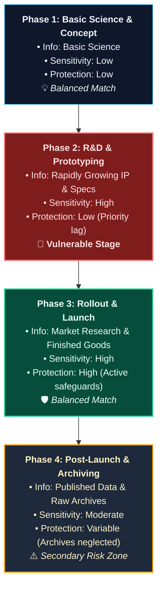

**Project Vulnerability Analysis:**

- **Early Phase (Basic Science):** Information is mostly related to basic science and is not highly sensitive. Protection measures are modest, which aligns well with the low risk.
- **Middle Phase (R&D & Prototyping):** Sensitivity and the volume of proprietary information grow rapidly, often unexpectedly. Protection controls may lag behind because technical teams focus on engineering milestones rather than security. Furthermore, personnel may become complacent during these lengthy phases. This is the period of maximum vulnerability to both intentional espionage and inadvertent disclosure (Peterson, 2005).
- **Late Phase (Market Research & Product Rollout):** The organization recognizes the high sensitivity of the near-finished product, deploying robust physical, legal, and logical safeguards. The protection matches the sensitivity well.
- **Post-Marketing Phase (Archiving):** Once a product is marketed or the technical report is published, attention shifts to new R&D initiatives. Proprietary records are often transferred to secondary storage locations managed by personnel who may be unfamiliar with the importance of the data. Effective IAP requires **cradle-to-grave protection**, regulating the secondary distribution of technical reports and controlling access to raw archival data.

> [!IMPORTANT]
> **Time-Dependency of Loss:** The consequences of a information compromise are highly time-dependent. Releasing a proprietary detail during the R&D phase may destroy a firm's competitive edge or prevent patent acquisition, whereas the same disclosure post-rollout may have negligible impact. Security managers must evaluate the potential impact of a loss relative to the project's current timeline phase.

---

### Procedures for Laboratory Notebooks

Well-documented laboratory notebooks are key organizational assets. They prevent repetitious experimental work, allow researchers to retrace steps to isolate critical aspects of an invention, establish legally binding documentation of a discovery, and permit proper determination of inventor status.

The requirement to maintain legally adequate records for patent purposes is highly stringent; notebooks maintained to this standard will normally satisfy all other business and regulatory needs. In patent disputes, courts do not accept an inventor's testimony alone as sufficient proof of invention. The law requires that the inventor’s records be supported by disinterested third parties who have firsthand knowledge of the invention.

#### 1. Basic Legal Principles

The procedures for managing laboratory notebooks are designed to satisfy several fundamental legal principles:

- **Invention Definition:** A completed invention consists of two events:
  1. **Conception:** Formulating the original idea in the mind.
  2. **Reduction to Practice:** Physical execution demonstrating that the invention works for its intended purpose.
- **Corroboration Requirement:** An inventor's own records cannot legally prove conception or reduction to practice. Their testimony must be corroborated in every respect by others.
- **Conception Proof:** Conception exists wholly in the inventor’s mind and can only be proven by disclosing it to others. This is best done via a written, dated document describing the invention in clear terms, signed by the inventor, and witnessed by someone else who understands the technology.
- **Reduction to Practice Proof:** The actual reduction to practice must be corroborated by an independent witness who can swear that they either personally observed the key steps of the process or carried out the execution under the inventor's direction.
- **Non-Co-Inventor Rule:** Neither the witness to conception nor the corroborator of reduction to practice can be a co-inventor. Joint inventors cannot corroborate each other.
- **Comprehension:** Both the witness and the corroborator must fully understand the technical aspects of the invention.
- **Contemporaneous Evidence:** Corroborative testimony should be supported by evidence created at the time, such as drawings, models, prototypes, sketches, or samples.
- **Validity of Dates:** Undated or backdated documents are completely inadmissible as legal evidence.

#### 2. Minimum Legal Requirements in Notebook Maintenance

To establish legally binding proof of conception and reduction to practice, all employees engaged in research and development must follow these practices:

- **Documenting Conception:** Upon conceiving an original idea, the inventor must immediately record it in their notebook using sketches, drawings, and text clear enough for someone skilled in the field to understand. The entry must be dated and signed by the inventor. Two independent witnesses who understand the invention must read and sign at the bottom of the entry:
  > **Witnessed, read, and understood by:**
  > Signature: ************\_\_************ Name: ************\_\_************ Date: ******\_\_******
  > Signature: ************\_\_************ Name: ************\_\_************ Date: ******\_\_******
- **Documenting Reduction to Practice:** The actual reduction to practice must be documented in a laboratory notebook and corroborated by an independent observer. Drawings, blueprints, or purchase orders may be incorporated by reference using clear, positive identification tags. The entry should be written in the notebook of the person performing the execution, signed and dated by the inventor, and signed by two corroborating witnesses who observed the essential steps:
  > **Witnessed and corroborated by:**
  > Signature: ************\_\_************ Name: ************\_\_************ Date: ******\_\_******
  > Signature: ************\_\_************ Name: ************\_\_************ Date: ******\_\_******
- If the reduction to practice occurs over an extended period, each significant step must be recorded on the date it occurs and witnessed using the same protocol.

#### 3. Administrative Rules for Notebook Management

- **Physical Format:** Notebooks must be bound with permanently stitched pages (never loose-leaf).
- **Content Structure:** Each entry should state: why the work was done, what was done, who did it, when it was done, what results were obtained, and what conclusions were drawn.
- **Consecutive Entries:** All entries must run consecutively without blank lines or spaces. All unused portions of pages must be blocked out with a diagonal line, dated, and signed.
- **Terminology:** Coded terminology is prohibited unless the code is fully defined in the notebook. Standard abbreviations are permitted.
- **Integrity:** Falsification or alteration of records is strictly prohibited. Erasures or white-out must never be used. If an error is made, a single line must be drawn through it so the original text remains legible, and the correction must be written adjacent and initialed.
- **Media:** All entries must be written in permanent ink or indelible pencil.
- **Timeliness:** Entries must never be backdated. Records must be made current, as delays diminish the legal value of the documentation.

#### 4. Notebook Control Procedures

- **Issuance:** Every employee engaged in R&D must acquire their bound notebook directly from the research librarian. Notebooks are numbered consecutively and registered to a specific individual.
- **Retention:** Completed notebooks must be returned to the research librarian for archiving. The author may retain the physical notebook at their office temporarily for reference.
- **Separation:** Upon termination of employment, all notebooks must be returned to the librarian. If the research is ongoing, registration may be transferred to the succeeding employee.
- **Invention Disclosure:** Once an invention is documented, a formal invention disclosure should be filed in accordance with standard operating procedures. Employees must never disclose notebook contents externally without explicit release authorization.
- **Electronic Laboratory Notebooks (ELNs):**
  - Organizations increasingly deploy ELNs in place of or alongside paper notebooks.
  - ELNs must be protected with access controls, cryptographic timestamps, and digital signatures that provide the same legal integrity as bound paper records.
  - Policies must strictly regulate or prohibit the unauthorized removal or remote synchronization of ELNs to prevent intellectual property leaks.

---

### Appendix E

### Information Disposal and Destruction

Proper, secure destruction of information is an essential pillar of an effective Information Asset Protection (IAP) program. Every organization generates records that require destruction, ranging from proprietary customer lists, pricing plans, and correspondence drafts to sensitive personal employee files.

> [!WARNING]
> **The Dumpster Risk:** Without standard disposal controls, sensitive records are simply thrown into the daily trash. Once discarded in a dumpster, this information is legally considered abandoned property and becomes accessible to anyone, including competitors, dumpster-divers, and corporate intelligence agents. Simple disposal exposes an organization to severe risk of intellectual property loss, corporate espionage, and regulatory non-compliance.

#### Core Principles of Secure Disposal

- **Regular Retention & Destruction Schedules:** Stored records should be destroyed in accordance with a strict, consistent retention schedule. Records should not be kept longer than is necessary for business, legal, or compliance needs. Routine destruction prevents the appearance of selective deletion or suspicious behavior in the event of litigation or regulatory audits, and minimizes the volume of discoverable records.
- **Protection of Daily Incidental Waste:** Daily incidental business waste—including phone messages, rough drafts, bid calculations, and discarded printed memos—must be protected. Employees must discard these items directly into secure consolidation bins rather than open wastebaskets.
- **Recycling is NOT Destruction:** Secure destruction must not be confused with recycling. Recycling facilities handle paper as an open commodity; there is no chain of custody or verification of secure destruction. Material should only be recycled _after_ it has been completely and securely shredded or pulverized.
- **Due Diligence in Selecting Vendors:** When contracting a third-party document destruction company, the organization must exercise due diligence. This includes reviewing the vendor's operating procedures, vetting their personnel, and performing unannounced site audits.

> [!IMPORTANT]
> **Non-Transferability of Liability:** Utilizing a third-party document destruction vendor does not transfer the legal liability for data breaches or confidentiality losses to the contractor. If sensitive private information surfaces after it has been accepted by a contractor, the courts will examine whether the organization showed due diligence in selecting and auditing that contractor. A failure to perform due diligence may result in a finding of negligence.

#### Technical Standards for Secure Destruction

Organizations should enforce the following standards for destroying information across various media formats:

1. **Paper Documents:** Shredded using high-security cross-cut shredders that reduce documents to tiny confetti-like pieces, or pulverized/macerated. Standard strip-cut shredders are inadequate as they allow easy reconstruction.
2. **Electronic Data:** Standard file deletion or drive formatting is insufficient as data remains recoverable. Drives must be sanitized using multi-pass software overwriting tools or degaussed (demagnetized) to render data unrecoverable.
3. **Physical Media:** Removable storage media (such as CDs, DVDs, USB flash drives, backup tapes, and solid-state drives) must be physically destroyed—through grinding, incineration, or disintegration—prior to final disposal.

## Chapter 2: Information Systems Security

### The Increasing Importance of Information Systems Security

In the movie _Ocean’s Eleven_, casino owner Terry Benedict discovers that Danny Ocean has compromised the state-of-the-art video monitoring system protecting Benedict’s vault and its millions in cash. The attack against the supposedly uncrackable security system relied in part on hacking into information systems. The film depicts Benedict as one who takes the protection of his money very seriously, giving his security personnel no second chances. In the real world, too, cybercriminals take advantage of security weaknesses in corporate information systems every day to steal, destroy, misappropriate, or otherwise misuse corporate assets.

Cybercrime—the use of information systems to commit crime—is real. In May 2009, President Obama remarked: _"It’s been estimated that last year alone cyber criminals stole intellectual property from businesses worldwide worth up to $1 trillion"_ (Obama, 2009). Information systems are beset with vulnerabilities unlike those in the physical world. To address the never-before-seen challenges of Information Systems Security (ISS), security professionals must augment their physical security paradigm with a new logical security paradigm (Lam & Stahl, 2010).

In _The Structure of Scientific Revolutions_ (1962), Thomas Kuhn revolutionized the way philosophers think about science. He introduced the word "paradigm" as a theoretical tool for understanding the comprehensive frameworks of a scientific school of thought or rigorous discipline, such as physical security or ISS.

- **Physical Security Paradigm:** The framework used to process issues specifically focused on physical assets, such as surveillance cameras, locks, guard forces, protection of human life, and securing physical facilities against tangible loss.
- **Logical Security Paradigm:** The framework that deals with similar protection concepts, but operates within virtual space. In the logical realm, assets, threats, and losses are physically invisible and require a completely different technical understanding to counter.

The purpose of this chapter is to provide physical security professionals with a practical understanding of this new logical security paradigm.

---

### 2.1 The Human Challenge: Failure of Imagination

On September 11, 2001, terrorists hijacked commercial airliners and flew them into the World Trade Center towers and the Pentagon, while a fourth plane crashed in Pennsylvania due to the heroic actions of its passengers. The FBI and other intelligence agencies possessed all the individual "dots" necessary to anticipate 9/11. Had they connected these dots, over 3,000 lives might have been saved. In the final report of the 9/11 Commission, the primary explanation for this failure was attributed to a **"failure of imagination"** (National Commission on Terrorist Attacks, 2004, p. 336).

A far less serious, but highly illustrative, example of a failure of imagination occurred at a hotel swimming pool. To enter, guests had to insert their key cards into a slot, which unlocked the latch. The security system appeared to work perfectly—until a young girl walked up, slid her thin arm through the bars below the latch, reached up, and easily opened the door from the inside.

A similar vulnerability exists at Web site log-in screens. Users are expected to enter a valid User ID and password, much like hotel guests inserting key cards. However, a malicious attacker might bypass the authentication logic entirely by exploiting a database query vulnerability (known as SQL injection). Instead of a standard password, they might enter:

```sql
' OR '1'='1' --
```

This input alters the database query logic to always evaluate as true, granting unauthorized access. More complex, sanitized penetration test payloads can bypass enterprise databases to extract sensitive customer records, such as Social Security numbers, without ever knowing a valid password.[^2]

[^2]: **Analogy Note:** SQL injection, cross-site scripting (XSS), content spoofing, and information leakage are the logical equivalents of the young girl's thin wrist reaching through the pool gate—exploiting physical design assumptions to bypass authentication controls. Indeed, cross-site scripting alone accounted for over 80 percent of documented website vulnerabilities in the late 2000s (Symantec, 2008).

#### The Myth of Perfect Multi-Factor Authentication

Failures of imagination are part of being human. Once we experience a bad situation, we can imagine and defend against similar scenarios; the challenge lies in anticipating attacks we have never experienced.

For instance, a corporate IT director once wrote the following regarding his company’s online banking security:

> _"Teresa has a fob that issues passcodes, which change every 30 seconds. The fob is not connected to the computer in any way. To complete an authorized transaction on the computer, she needs to enter a passcode from the fob within that 30-second timeframe. I can’t imagine a way that a hacker would be able to manage to hack that."_

Yet just two weeks prior, investigative reports highlighted how data-stealing Trojan horses, such as the "Zeus" malware, routinely defeat multi-factor fob authentication (Krebs, 2009). The malware intercepts the user's credentials in real-time, displays a counterfeit bank page claiming _"the site is down for maintenance, please try again in 15 minutes,"_ and secretly transmits the valid 30-second passcode to the attackers. The thieves instantly log in as the victim and initiate unauthorized wire transfers before the passcode expires.

---

### 2.2 The State of Information Systems Security

By 2010, the microcomputer revolution—marked by the rise of local-area networks (LANs), wide-area networks (WANs), and the public Internet—was 35 years old.[^3] Interconnecting computers has yielded massive gains in global productivity, entertainment, and communication. However, these virtues are accompanied by serious, unintended security risks.

[^3]: **Historical Context:** Malcolm Gladwell dates the start of the microcomputer revolution to January 1975, when _Popular Electronics_ ran its cover story on the Altair 8800 microcomputer kit (Gladwell, 2008).

On July 1, 2003, California Senate Bill 1386 became the nation's first breach-disclosure law. It required any organization conducting business in California to notify residents if their unencrypted personal data was acquired by an unauthorized person.[^4] Most states have since enacted similar breach-disclosure laws, establishing a standard of corporate accountability.

[^4]: **Legal Basis:** California Civil Codes 1798.29 and 1798.82.

In the years following SB 1386, the Privacy Rights Clearinghouse (2009) documented over **340 million consumer records** exposed through data breaches. Major organizations admitting severe compromises include:

- ChoicePoint
- Sam’s Club
- Bank of America
- T.J. Maxx
- CitiFinancial
- Time Warner
- Ernst & Young
- Ralph Lauren
- Ford Motor Company
- JPMorgan Chase
- DSW Shoes
- Hanover Insurance

This figure represents only the tip of the iceberg, as it excludes undiscovered breaches, unreported data losses, and corporate bank thefts that do not trigger consumer disclosure mandates.

#### The Shift to Professionalized Cybercrime

The nature of cyber threats has fundamentally evolved. Historically, the primary threats were internal, caused by disgruntled employees, or external "script kiddies" hacking for ego, curiosity, or computer resource theft. Today, cybercrime is a professionalized, highly lucrative industry dominated by organized crime consortiums and state-sponsored actors (Herley & Florencio, 2009).

According to a computer security expert's congressional testimony, modern cyber-attacks are pervasive due to:

- **Hyper-Connectivity:** The exponential growth of assailable networks, systems, and internet-connected devices.
- **Financial Incentives:** The ability of cybercriminals to derive massive, untraceable financial rewards.
- **Global Syndication:** Robust cooperation and underground markets between malware developers, hosters, and specialized thieves.
- **Geopolitical Backing:** Active financing and protection of cyber-warfare operations by nation-states and politically motivated groups.
- **Jurisdictional Arbitrage:** A severe lack of cohesive, international law enforcement and extradition treaties.

Cybercriminals deploy automated tools that constantly compromise legitimate websites, turning them into redirectors for malware distribution. They constantly rewrite malware code to bypass signature-based antivirus systems. In addition, cyber extortion—using ransomware or DDoS threats to demand payment—has become a routine corporate hazard (Wagley, 2009).

#### The Scale of Financial Impact

The financial consequences of cybercrime are staggering:

- **Average Incidents:** The _CSI Computer Crime and Security Survey_ (Richardson, 2008) found that the average financial cyber-fraud incident cost a victim company $500,000, while a typical botnet attack cost $350,000.
- **Targeted Attacks:** 27 percent of cyber-attacks in 2008 utilized "custom malware" written specifically to compromise a single, target enterprise.
- **Organized Crime Dominance:** Verizon's study of 500 major breaches revealed that 91 percent of stolen records were compromised by organized crime groups, and 74 percent of attacks originated from external threat actors (Verizon Business RISK Team, 2009). Insiders are no longer the source of most data losses.
- **Anti-Forensics:** Cybercriminals actively hide their tracks, deploying "anti-forensics" techniques (such as log wiping and memory-only execution) in over one-third of investigated cases.
- **Nation-State Cyber Warfare:** Cyberspace is actively leveraged for espionage and geopolitical disruption, as demonstrated by the cyber-attacks targeting the nation-state of Georgia (2008), Estonia, and public infrastructure in South Korea (2009).
- **Rogueware & Mobile Exploits:** Malicious software disguised as security updates generates an estimated $34 million per month for cybercriminals, while mobile device banking malware has emerged as a rapid growth sector.

As Stewart Baker, former U.S. Assistant Secretary of Homeland Security, summarized:

> _"In fifteen years, decentralized networks have moved from novelty uses like monitoring communal coffee machines to managing financial assets, telecommunications, and the electric grid... We trust far more of our critical assets to IT networks than we once did, and security vulnerabilities that may have been tolerable fifteen years ago can have devastating consequences today."_

---

### 2.3 Economics of Information Systems Security

Information security breaches represent a direct drain on corporate capital. The cost of a security incident comprises several layers:

1. **Direct Cleaning Costs:** IT personnel and external consultant fees to purge malware, patch vulnerabilities, and restore systems.
2. **Productivity Losses:** The operational downtime of employees unable to perform their duties. For example, a malware attack on a law firm required $12,400 in staff and consultant remediation fees, but caused a 20 percent drop in attorney productivity that cost the firm over $25,000 in lost billings—more than double the cleanup cost.
3. **Intellectual Property Theft:** The long-term loss of competitive advantage if a competitor acquires proprietary trade secrets, R&D plans, cost structures, or customer lists.
4. **Compliance & Legal Liabilities:** The cost of complying with state breach-disclosure laws, which averages over $200 per compromised record (Claborn, 2009). A breach of a minor 10,000-record database can instantly incur over $2 million in notification, identity theft protection, and legal defense costs.

Conversely, implementing security controls requires significant capital. Organizations must balance the costs of firewalls, encryption tools, security awareness training, and specialized ISS analysts against direct contributors to the bottom line.

> [!IMPORTANT]
> **The Learned Hand Rule of Security Negligence:**
> Mathematically, an organization is negligent if the cost of prevention (**B**) is less than the monetary loss of an incident (**L**) multiplied by the probability of its occurrence (**P**):
> $$ ext{Negligence} \iff B < P imes L$$
> As the frequency ($P$) and severity ($L$) of cyber incidents escalate, organizations must increase their prevention budgets ($B$) to meet their legal standard of due care (Gordon & Loeb, 2006).

A formal ISS program, managed by a dedicated executive (such as a Chief Information Security Officer), is highly recommended to prudently and cost-effectively manage the risk that critical information could:

- **be compromised** (Loss of Confidentiality),
- **be changed without authorization** (Loss of Integrity), or
- **become unavailable** (Loss of Availability).

---

### 2.4 Critical Success Factors of an ISS Program

Three coevolving domains define whether a company’s ISS program meets the legal and professional standard of due care:

1. **Legislation and Regulation:** Legal mandates governing the protection of nonpublic personal information (e.g., GLBA, HIPAA, SB 1386).
2. **Contract and Tort Law:** Civil liability regarding the failure to secure systems and downstream partner networks.
3. **Professional Security Practices:** Established frameworks recommended by the security community (e.g., ISO/IEC 27001).

Based on these domains, Braun and Stahl (2005) identified **eight critical success factors** that an information security program must satisfy:

- **Executive Management Responsibility:** Senior leadership designates a specific executive with formal management authority and accountability for the information security program.
- **Information Security Policies:** Documented policies outline the management approach to information security, aligning with legal, regulatory, and business duties.
- **User Awareness Training:** Employees and contractors receive regular training regarding security policies, social engineering threats, and personal responsibilities.
- **Computer and Network Security:** IT staff actively manages, documents, and secures the technology infrastructure (firewalls, patching, system hardening) in line with best practices.
- **Third-Party Assurance:** The organization shares sensitive data with third-party partners only after verifying that they maintain equivalent security standards of care.
- **Physical and Personnel Security:** The company secures facilities housing IT assets, screens candidates during hiring, and integrates security expectations into job descriptions.
- **Periodic Risk Assessments:** Independent, comprehensive audits of both the technical controls and management processes are conducted at least annually.
- **Classification and Control of Information:** The organization inventories its intellectual property, categorizes data (Unrestricted, Internal Use, Restricted, Highly Restricted), and assigns clear data owners to manage access permissions.

---

### 2.5 Implications to Physical Security in a Converged World

Historically, physical security systems existed in isolation. Today, physical security and information technology have converged.

The Alliance for Enterprise Security Risk Management defines security convergence as:

> _"...the identification of security risks and interdependencies between business functions and processes within the enterprise and the development of managed business process solutions to address those risks and interdependencies."_ (Booz Allen Hamilton, 2005)

A more detailed definition states:

> _"Security convergence is the integration, in a formal, collaborative, and strategic manner, of the cumulative security resources of the organization in order to deliver enterprise-wide benefits through enhanced risk mitigation, increased operational effectiveness and efficiency, and cost savings."_ (Tyson, 2007, p. 4)

#### The Risks of Networked Physical Security

Convergence allows physical security devices to interact across IP networks, yielding massive operational efficiencies. However, it introduces unprecedented vulnerabilities. In the traditional physical paradigm, video cameras, recorders, and access controllers were isolated; an attacker required physical access to compromise them. In the converged paradigm, physical security devices are networked nodes, potentially accessible from anywhere in the world.

As the director of Sandia National Laboratories' Information Operations Center testified:

> _"Today, legacy [utility and physical] systems are gradually being replaced by new SCADA [supervisory control and data acquisition] systems that use the Internet as the control backbone... However, this trend substantially increases the possibility of disruptions because: (1) the number of people having access to the system is substantially increased, (2) disruptions can be caused by hackers who have no training in control systems engineering, and (3) the use of the Internet exposes SCADA systems to all the inherent vulnerabilities of interconnected computer networks..."_ (Varnado, 2005)

#### Re-Engineering Video Surveillance Architectures

To visualize this risk, compare a traditional video layout with a modern converged video infrastructure.


_Figure 2-1: Traditional Isolated Video Surveillance Layout. Security relies entirely on denying physical access to the localized components._

```mermaid
graph TD
    classDef network fill:#1e293b,stroke:#64748b,stroke-width:1px,color:#f8fafc;
    classDef device fill:#0f172a,stroke:#38bdf8,stroke-width:1px,color:#f1f5f9;
    classDef server fill:#064e3b,stroke:#34d399,stroke-width:2px,color:#ecfdf5;
    classDef risk fill:#7f1d1d,stroke:#f87171,stroke-width:2px,color:#fee2e2;

    IPCam1["<b>IP Camera 1</b><br/>(TCP/IP)"]:::device --> Switch["<b>Network Switch</b><br/>(LAN Backbone)"]:::network
    IPCam2["<b>IP Camera 2</b><br/>(TCP/IP)"]:::device --> Switch
    Switch <=> NVR["<b>Video Server / NVR</b><br/>(IP Storage)"]:::server
    Switch <=> IntUsers["<b>Internal Users</b><br/>(LAN Clients)"]:::server
    VPN["<b>Virtual Private Network (VPN)</b>"]:::network <=> Switch
    VPN <=> ExtUsers["<b>External Users</b><br/>(Remote Clients)"]:::network
    Hacker["💥 <b>Remote Attacker</b><br/>(Exploits IP vulnerability)"]:::risk -.-> VPN
```

_Figure 2-2: Modern Converged IP Video Surveillance Layout. Cameras stream digitized video onto shared network servers. Any network compromise can grant an attacker access to live video feeds, archives, or allow camera hijacking._

Physical security communication protocols are categorized into three formats:

1. **Proprietary Connections:** Direct, non-standardized connections between dedicated devices.
2. **Industry-Standard Interfaces:** Local protocols used to pass data between sensors and local processors (e.g., the Wiegand protocol between a card reader and an door controller).
3. **TCP/IP Network Connections:** The worldwide standard for open packet-based communication, used to connect controllers to enterprise databases and servers.

Physical security nodes represent either **embedded systems** (special-purpose devices running proprietary operating systems, such as IP cameras, readers, and controllers) or **host-based systems** (general-purpose computers running Windows, Linux, or macOS to host security database software). Both configurations are vulnerable to remote compromises.

> [!WARNING]
> **Vulnerability Inquiries for Physical Security Managers:**
> When deploying IP-based video surveillance, security professionals must evaluate:
>
> - What if an unauthorized user intercepts and watches our camera feeds?
> - What if an attacker replaces the live video feed with pre-recorded loop footage?
> - Does the camera manufacturer enforce mutual authentication and transport encryption?
> - What if a hacker disables the network switch, blinding the security operations center?
> - What if an intruder compromises the NVR and deletes incriminating video evidence?
> - What if a burglar alters video analytics parameters to ignore intrusion events or trigger excessive false alarms to induce operator fatigue?

#### Re-Engineering Electronic Access Control

Modern electronic access control systems comprise three major components:

1. **Card Reader:** The physical interface presented to the user (e.g., a proximity or smartcard reader).
2. **Door Controller:** The embedded local processor that evaluates access rules and controls the lock hardware.
3. **Database Server:** The host-based software that stores user credentials, schedules, and global policies.

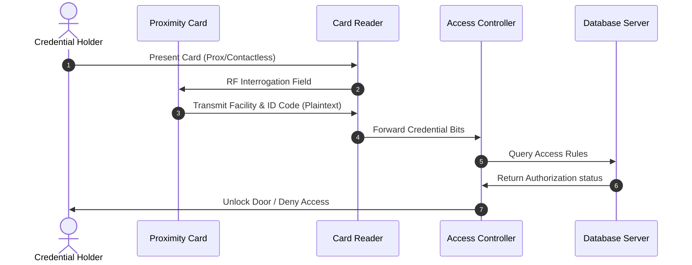

_Figure 2-3: Basic Access Control Card Flow._

Traditional access control setups are vulnerable to non-network attacks due to obsolete protocols:

- **Unauthenticated Proximity Cards:** Standard legacy proximity cards (e.g., early 125 kHz HID cards) do not perform mutual authentication. When queried by any compatible radio frequency field, the card instantly transmits its unencrypted facility code and card ID. An attacker carrying a compact, concealed long-range cloner in a backpack can skim card credentials simply by standing within a foot of an employee in a public space.
- **Plaintext Wiegand Interface:** The Wiegand protocol, developed in the late 1980s to connect card readers to door controllers, transmits credential bits as raw, unencrypted electrical pulses.

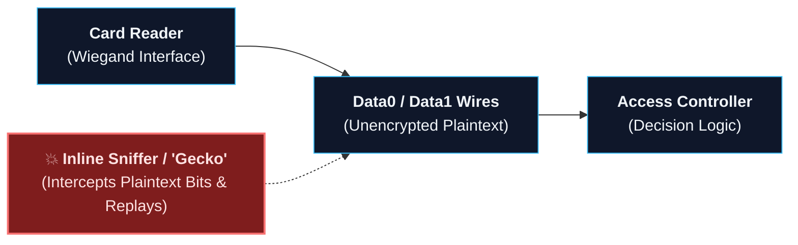

_Figure 2-4: Wiegand Protocol Plaintext Vulnerability. Because the signal is unencrypted, an intruder can splice a cheap, commercial micro-controller (e.g., a "Gecko" device) into the reader-to-controller wiring to capture credential packets and replay them to command the door to unlock._

#### Networked Access Control Vulnerabilities

In modern enterprise architectures, access control controllers are connected directly to the corporate IP network to facilitate real-time database synchronization.

```mermaid
graph TD
    classDef device fill:#0f172a,stroke:#38bdf8,stroke-width:1px,color:#f1f5f9;
    classDef controller fill:#1e293b,stroke:#94a3b8,stroke-width:1px,color:#f8fafc;
    classDef switch fill:#1e293b,stroke:#64748b,stroke-width:1px,color:#f8fafc;
    classDef server fill:#064e3b,stroke:#34d399,stroke-width:2px,color:#ecfdf5;
    classDef risk fill:#7f1d1d,stroke:#f87171,stroke-width:2px,color:#fee2e2;

    Reader1["<b>Card Reader 1</b>"]:::device --> Controller1["<b>Embedded Controller 1</b><br/>(Door Control)"]:::controller
    Reader2["<b>Card Reader 2</b>"]:::device --> Controller2["<b>Embedded Controller 2</b><br/>(Door Control)"]:::controller
    Controller1 --> Switch["<b>Access Control Switch</b><br/>(Dedicated VLAN)"]:::switch
    Controller2 --> Switch
    Switch <=> DB["<b>Access Control Server</b><br/>(System Database)"]:::server
    Switch <=> IntUsers["<b>Internal Administrators</b>"]:::server
    FW["<b>Corporate Firewall</b>"]:::switch <=> Switch
    FW <=> Internet["<b>Public Internet</b>"]:::switch
    Attacker["💥 <b>Remote Hacker</b><br/>(Aims to hijack DB or Controller)"]:::risk -.-> Internet
```

_Figure 2-5: Networked Access Control Topology. While highly efficient, this layout exposes door controllers and central databases to network-based attacks._

Because networked access control systems rely on active central databases, two primary security risks arise:

1. **Administrative Abuse:** A rogue administrator or compromised administrative account could inject a "backdoor" card or temporarily disable audit logs. Access control programs must enforce strict separation of duties and generate immutable, tamper-proof audit trails.
2. **Network Hijacking:** If the central database server or network switches are accessible from the corporate network or the public Internet, a remote attacker who compromises any connected workstation can pivot, seize control of the access control database, and open physical doors or lock out security personnel globally.

---

### 2.6 Cybercrime: A National and Global Challenge

In a landmark speech on securing national cyber infrastructure, President Obama highlighted several core realities of the Information Age. These observations apply directly to the daily responsibilities of the modern security professional (Obama, 2009):

> _"It’s the great irony of our Information Age—the very technologies that empower us to create and to build also empower those who would disrupt and destroy. And this paradox—seen and unseen—is something that we experience every day."_

- **Security Application:** Modern technology enables security professionals to manage risk with unprecedented efficiency. However, these identical technologies introduce virtual entry vectors. Security professionals must master the logical security paradigm to prevent their own protective systems from being used against them.

> _"It’s about the privacy and the economic security of American families... We rely on the Internet to pay our bills, to bank, to shop, to file our taxes. But we’ve had to learn a whole new vocabulary just to stay ahead of the cyber criminals who would do us harm—spyware and malware and spoofing and phishing and botnets... cyber crime has cost Americans more than $8 billion."_

- **Security Application:** Cybercrime directly threatens the financial viability of our enterprises, customers, and partners. The vocabulary of threats is constantly expanding, and defenses must evolve dynamically.

> _"This is a matter, as well, of America’s economic competitiveness. The small businesswoman in St. Louis, the bond trader in the New York Stock Exchange, the workers at a global shipping company in Memphis, the young entrepreneur in Silicon Valley—they all need the networks to make the next payroll, the next trade, the next delivery... E-commerce alone last year accounted for some $132 billion in retail sales."_

- **Security Application:** Corporate networks are the lifeblood of business survival. A denial-of-service attack or critical database compromise does not merely affect IT; it halts physical shipments, freezes financial trades, and disrupts payroll.

> _"But every day we see waves of cyber thieves trolling for sensitive information—the disgruntled employee on the inside, the lone hacker a thousand miles away, organized crime, the industrial spy and, increasingly, foreign intelligence services... It’s been estimated that last year alone cyber criminals stole intellectual property from businesses worldwide worth up to $1 trillion."_

- **Security Application:** The modern threat landscape is highly populated, featuring diverse adversaries with sophisticated resources. Security professionals are the front-line defenders against these multi-vector attacks.

In 1937, mathematician Alan Turing designed the "Turing Machine"—the conceptual blueprint for the modern programmable computer. His invention created a new virtual world. Today, the physical security and information systems paradigms have merged, and those charged with protecting people, property, and assets must fully comprehend and secure this converged landscape.

## Chapter 3: Information Systems Security Body of Knowledge

### The Information Systems Security Body of Knowledge

The primary objective of an organization’s Information Systems Security (ISS) program is to prudently and cost-effectively manage the risk that critical organizational information could:

- **be compromised** (Loss of Confidentiality),
- **be changed without authorization** (Loss of Integrity), or
- **become unavailable** (Loss of Availability).

In other words, the security professional strives to protect information’s confidentiality, integrity, and availability (commonly referred to as the **CIA triad**). This effort is critical because information systems risks directly lead to other severe business risks, including:

- Loss of capital through theft, fraud, and embezzlement
- Incident response and recovery costs
- Loss of proprietary intellectual property and trade secrets
- Substantial attorney and other legal expenses
- Long-term erosion of brand and reputational value

This chapter presents an overview of the ISS body of knowledge, addressing the elements of ISS risk and the technical, legal, and managerial challenges of protecting virtual assets.

---

### 3.1 The Elements of ISS Risk

#### ISS Core Terminology

The basic language of ISS maps closely to concepts familiar to the traditional physical security practitioner, adapted for logical environments:

- **Information Systems Threat:** Any circumstance, capability, action, or event with the potential to adversely impact an information system through unauthorized access, destruction, disclosure, modification of data, or denial of service.[^6]
- **Information Systems Vulnerability:** A flaw or weakness in an information system’s design, implementation, or operation and management (including policies, procedures, processes, and internal controls) that could be exploited to violate the system’s security policy.[^7]
- **Information Systems Risk:** The probability that a particular threat agent will exploit a specific system vulnerability, resulting in a harmful loss.[^8]
- **Information Systems Countermeasure:** An action, device, procedure, technique, or other control that reduces a threat, a vulnerability, or an attack by eliminating or preventing it, by minimizing the harm it can cause, or by discovering and reporting it so that corrective action can be taken.[^9]
- **Residual Threat Risk:** For each individual threat, the remaining potential risk after all specific ISS countermeasures have been applied.[^10]
- **Residual Risk:** The total remaining potential risk after all combined ISS countermeasures and security controls are implemented.[^11]

[^6]: **Threat Source:** This integrates the definitions of the Committee on National Security Systems Instruction (CNSSI) 4009, the SANS Institute, and RFC 2828 (Internet Security Glossary).

[^7]: **Vulnerability Source:** This is a combination of CNSSI 4009 and RFC 2828.

[^8]: **Risk Source:** Derived from SANS and CNSSI 4009. A common variation includes the expectation of loss in the definition of risk (RFC 2828).

[^9]: **Countermeasure Source:** Integrates CNSSI 4009 and RFC 2828 definitions of risk treatment.

[^10]: **Residual Threat Risk Source:** Defined in the National Institute of Standards and Technology (NIST) Glossary of Key Information Security Terms.

[^11]: **Residual Risk Source:** Integrates the NIST, ISO/IEC 27001, and RFC 2828 definitions.

#### The Fundamental Qualitative Equation of ISS

The risk concepts defined above are mathematically connected in the fundamental qualitative equation of ISS (Quigley & Stahl, 1987):

$$ ext{Residual Risk} = rac{ ext{Threats} imes ext{Vulnerabilities}}{ ext{Countermeasures}}$$

> [!IMPORTANT]
> **Qualitative Nature:** This equation is intended to be qualitative, not quantitative. It demonstrates that residual risk escalates as threats and vulnerabilities increase, and decreases as robust countermeasures are applied. All other things being equal, the more system vulnerabilities an organization has, the higher its residual risk will be. Conversely, the more carefully planned and managed a system of countermeasures is, the lower the residual risk becomes.

#### Information System Threat Agents

Threats are executed by threat agents. The first two categories of threat agents are familiar to physical security practitioners, while the third category highlights the unique challenges of the logical paradigm:

1. **Natural Forces:** Earthquakes, hurricanes, floods, power outages, and other natural disasters.
2. **Human Actors:**
   - **Insiders:** Employees and trusted associates with legitimate access who exploit opportunities for personal gain.
   - **Outsiders:** Cybercriminals, online bank thieves, botnet herders, credit card fraudsters, corporate spies, state-sponsored actors, and politically motivated cyber terrorists.
3. **Virtual Threats:** A malicious computer program or script (malware) illegitimately installed on a workstation, server, router, or other device. Virtual threats are capable of:
   - Harvesting sensitive data and sending it to an external control server.
   - Receiving command and control (C2) instructions from a remote owner to adjust their behavior.
   - Executing unauthorized commands locally on the hijacked device.

A virtual threat agent is the network equivalent of a **"ghost in the machine."** In the physical world, a vault robber must physically enter the facility; in the logical world, the cybercriminal leverages a virtual agent to compromise, manipulate, or steal assets remotely. This ability to "go virtual" represents the core difference between the physical and logical security paradigms.

Before deploying a virtual threat agent, an attacker must first establish a foothold on the target computer. Common intrusion vectors include:

- **Physical Access:** Directly loading code via a USB drive or other peripheral.
- **Remote Hacking:** Exploiting an open port or unpatched network vulnerability.
- **Drive-by Downloads:** Placing malware on public websites that compromises a user's browser during a visit.
- **Phishing & Social Engineering:** Tricking a user into executing a malicious email attachment or link.

Common historical and modern virtual threat agents include marketing spyware (pop-ups and tracking), keyloggers (recording keystrokes), specialized worms (e.g., Koobface targeting social networks), and highly sophisticated financial Trojans (e.g., Zeus targeting online banking).

#### Information System Vulnerabilities

Threats cannot manifest without a vulnerability to exploit. ISS vulnerabilities fall into five primary categories:

- **Infrastructure Vulnerabilities:** Flaws in the technology layer, such as inappropriate links to unprotected networks, improper system configurations, or unpatched software.
- **User Vulnerabilities:** Flaws in employee security awareness, such as susceptibility to social engineering or phishing that grants attackers access to local systems.
- **Custodian Vulnerabilities:** Flaws in system administration, including granting excessive permissions, failing to monitor and log administrative actions, and inadequate training.
- **Management Vulnerabilities:** Lack of executive accountability, inadequate or obsolete policies, absence of security awareness training, and poor third-party vendor management.
- **Process Vulnerabilities:** Flaws in operational management, such as poor patch management, inadequate change control, lack of network perimeter controls, unsafe software development practices, and deficient business continuity planning.

#### ISS Control Objectives

Rather than simply defending assets, a mature ISS program must address four comprehensive control objectives to manage residual risk:

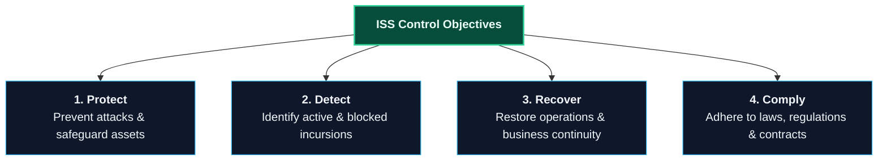

_Figure 3-1: ISS Overall Objectives and Control Objectives. For each of these four control objectives, the organization must preserve its data's confidentiality, integrity, and availability._

---

### 3.2 Computer Logic, System Complexity, and Inherent Vulnerability

In 1936, British mathematician Alan Turing published a paper exploring computability—what it means for a number or Decimals of fractions (like $rac{1}{2}$, $rac{2}{3}$, $rac{7}{8}$) and complex expansions (like $\pi$) to be calculable by finite mathematical means. Turing's conceptual framework, now known as a **Turing Machine**, proved that even a simple set of logical instructions yields deep, complex theoretical limits.

During World War II, Turing applied his theories to decrypting German Enigma signals, leading to the construction of the world’s first modern computer. Ironically, this first computer was essentially a cryptographic "hacker tool" designed to break the confidentiality of sensitive military data.

#### The Role of Algorithms and Moore's Law

Central to computing is the **algorithm**—a finite sequence of precise instructions for solving a problem. Modern computer programs are simply massive, highly complex algorithms. Because of their sheer size and logical complexity, they inherently contain errors, or **bugs**. If a programmer does not precisely define the instructions or the exact sequence in which they execute, a bug is created. These bugs form the basis of information security vulnerabilities.

In 1968, Intel co-founder Gordon Moore posited **Moore’s Law**: the processing power of microchips doubles approximately every 18 months. While this exponential growth enables incredible technological achievements, it has severe security implications:

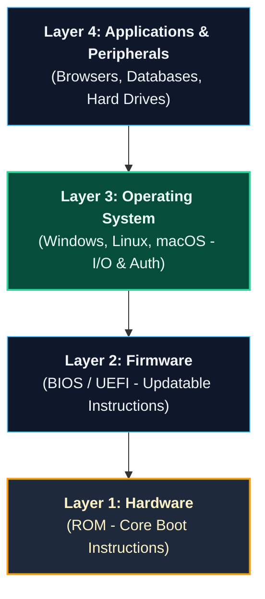

_Figure 3-2: Basic Components of Computer Architecture. A program can do exactly what it is programmed to do and still contain vulnerabilities if security specifications are inadequately defined._

For example, a specification might dictate that a database user interface requires a Login ID and password. However, if the back-end database is built to trust all direct queries without re-authenticating the request, an attacker can bypass the front-end login screen and query the database directly.

#### The OSI Seven-Layer Network Model

To communicate, modern computers follow the **Open Systems Interconnection (OSI) model**, developed by the International Organization for Standardization (ISO). It describes seven layers of data interaction between network nodes:

| Layer | Layer Name       | Key Function                                               | Typical Security Controls                                       |
| :---- | :--------------- | :--------------------------------------------------------- | :-------------------------------------------------------------- |
| **7** | **Application**  | Direct user interface and application interaction.         | Web Application Firewalls (WAF), email gateways, proxy servers. |
| **6** | **Presentation** | Data formatting, syntax normalization, and encryption.     | SSL/TLS encryption, data compression.                           |
| **5** | **Session**      | Managing, establishing, and tearing down connections.      | Session tokens, secure RPC handshakes.                          |
| **4** | **Transport**    | End-to-end packet delivery, flow control, and reliability. | Port filtering, stateful firewalls, TCP sequence protection.    |
| **3** | **Network**      | Packet routing across multiple intermediate networks.      | Routers, packet-filtering firewalls, IP routing tables.         |
| **2** | **Data Link**    | Physical addressing (MAC) and local packet switching.      | Layer 2 switches, VLANs, IEEE 802.1X network authentication.    |
| **1** | **Physical**     | Transmission of raw electrical, light, or radio signals.   | Cable shielding, physical locks, secure distribution systems.   |

#### Layer 2 vs. Layer 3 Communication

At the **Data Link Layer (Layer 2)**, communication is localized. Computers connect directly to a localized hardware device called a **switch**. This is analogous to a group of people sitting around a conference table; they can speak directly to anyone else in the room simply by calling their name.

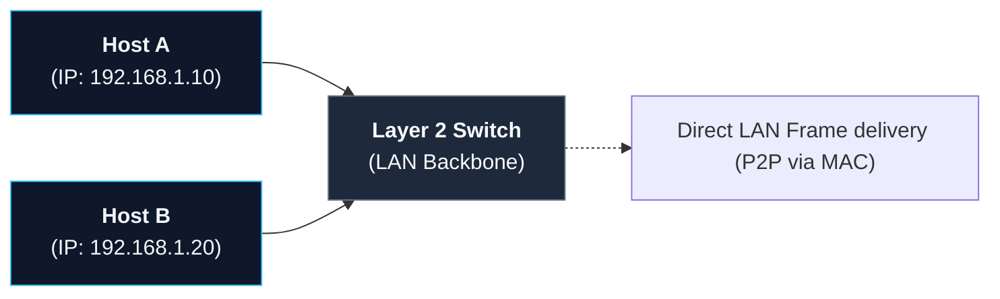

_Figure 3-3: Layer 2 Direct Switch Communication. While switches segment traffic to provide a degree of privacy, attackers can intercept whispered LAN communications by compromising switch configurations or spoofing MAC addresses._

At the **Network Layer (Layer 3)**, computers communicate across separate networks. This requires an intermediary device called a **router**, which acts like a postal sorting facility to route packets through multiple pathways.


_Figure 3-4: Layer 3 Routed Network Communication. Routers exchange routing tables to establish secure paths across global networks._

---

### 3.3 Logical Access Points and Defensive Controls

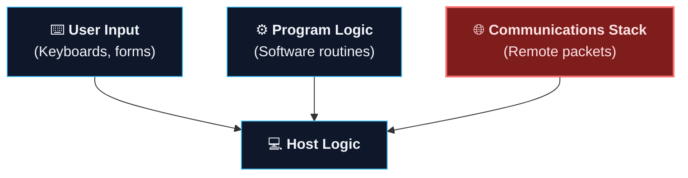

_Figure 3-5: Computer Logic Entry Points. The remote communications stack is the most dangerous entry point, as it allows attackers to inject malicious input from anywhere in the world._

#### Common Exploitation Mechanisms

- **SQL Injection (SQLi):** Injecting unexpected database code into an input field (e.g., `' OR '1'='1' --`) to manipulate database behavior and bypass authentication screens.
- **Buffer Overflow:** Flooding an application's memory buffer with more data than it is allocated to hold. The excess data overflows into adjacent memory, overwriting execution registers with malicious code.
- **Logic Errors:** Exploiting poorly constructed code sequences or race conditions (where operations occur in an unexpected sequence due to system delays) to bypass checks.

#### Host Classifications and AAA Security

A **host** is any device with memory and computational capacity that communicates on a network. This includes servers (central data repositories), workstations (fixed desktop units), laptops (portable, high-risk computers), smartphones, network-connected printers, and copiers.

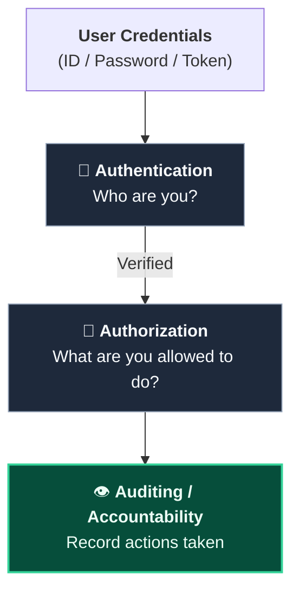

_Figure 3-6: The AAA Security Triad. Together with the CIA Triad, AAA forms the cornerstone of logical security._

- **Authentication (Identity Verification):** Confirming user identity via passwords (something you know), biometrics/fobs (something you have/are), or multi-factor authentication.
- **Authorization (Access Rights):** Granting specific user rights, permissions, and privileges based on roles.
- **Auditing (Accountability):** Maintaining immutable log trails to record system modifications and user access history.

#### The CIA Triad Elements

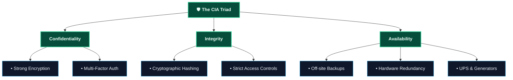

_Figure 3-7: The Expanded CIA Triad._

- **Confidentiality:** Restricting access to authorized users via strong encryption algorithms (e.g., symmetric block ciphers replacing primitive Caesar ciphers) and biometrics.
- **Integrity:** Ensuring data has not been modified. Cryptographic hashes and Cyclical Redundancy Checks (CRCs) are used to verify that critical identity, privilege, and application files remain untampered.
- **Availability:** Ensuring system uptime. This requires rigorous off-site backing of data, redundant power supplies (UPS and generators), and clustered server failovers (if one server fails, a backup node immediately assumes the load).

---

### 3.4 Operational Network Management & Convergence Risks

To align IT delivery with business security objectives, organizations implement structured IT frameworks:

- **IT Infrastructure Library (ITIL):** An international framework for managing IT services, defining **Service Level Agreements (SLAs)**. SLAs must codify emergency bandwidth requirements. For example, during an active threat event, multiple security officers may need to pull high-bandwidth live camera feeds simultaneously; if this SLA is not configured in advance, network switches may throttle the video traffic, blinding security teams.
- **Physical Infrastructure Security:** Server rooms and intermediate distribution facilities (IDFs) require physical access control, CCTV, and environmental monitoring (humidity, temperature, vibration) to ensure logical availability. If a physical switch or server is left unprotected, a physical intrusion can easily lead to a logical network compromise.

#### Perimeter Controls, Firewalls, and VPNs

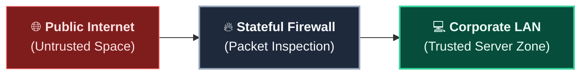

_Figure 3-8: Stateful Firewall Filtering._

A stateful firewall acts as the first line of perimeter defense, inspecting incoming and outgoing packets to ensure only authorized traffic crosses between untrusted and trusted networks. To secure data traversing untrusted networks, organizations deploy **Virtual Private Networks (VPNs)**. A VPN establishes a cryptographically secure, encrypted tunnel across the open Internet, preventing man-in-the-middle sniffing attacks.

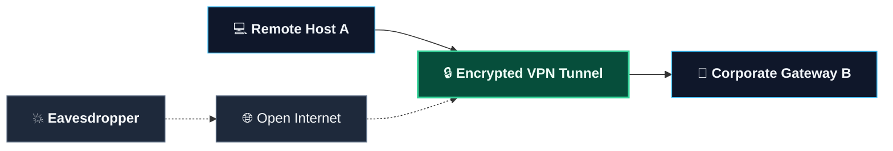

_Figure 3-9: Encrypted VPN Tunneling._

#### Convergence in Telecommunications

Modern corporate telecommunications represent a major network convergence target:

- **Legacy PBX Systems:** Traditional private branch exchanges were solid-state, isolated hardware units. While secure from standard network hacking, they are still computerized systems with RMAT (Remote Maintenance and Administration Terminal) dial-in ports, which require strong authentication to prevent unauthorized call forwarding and international billing fraud.
- **Voice over IP (VoIP) Systems:** Modern VoIP converges voice data onto the shared enterprise network. Because VoIP calls, call routing engines, and voicemail sit on standard computer switches, they are exposed to remote sniffing, session hijacking, and network-based exploits. Furthermore, VoIP servers are more vulnerable to hardware failure than legacy solid-state PBXs, necessitating fully redundant VoIP call servers and dedicated Quality of Service (QoS) configurations.

```mermaid
graph TD
    classDef device fill:#0f172a,stroke:#38bdf8,stroke-width:1px,color:#f1f5f9;
    classDef switch fill:#1e293b,stroke:#64748b,stroke-width:1px,color:#f8fafc;
    classDef server fill:#064e3b,stroke:#34d399,stroke-width:2px,color:#ecfdf5;

    Phone["☎️ <b>VoIP Phone</b>"]:::device --> Switch["🔌 <b>LAN Switch (QoS Enabled)</b>"]:::switch
    Switch <=> VoIP["🖥️ <b>VoIP Server</b><br/>(Call Routing & Voicemail)"]:::server
    Switch <=> Gateway["🌐 <b>Voice Gateway</b>"]:::server
    Gateway -- <b>Internet / SIP Trunk</b> --> PSTN["📞 <b>Telephone Company Central Office</b>"]:::switch
```

_Figure 3-10: Converged Voice over IP (VoIP) Infrastructure. Security policies must account for VoIP server redundancy, unencrypted voice packets, and backup power mandates._

- **Backup Power Mandate:** Traditional PBX systems run on centralized power. To maintain emergency communications, converged network switches and VoIP routers must be supported by battery systems and generators providing a minimum of **12 hours of backup power**.
- **Modern Converged Features:** Properly secured VoIP systems enable emergency enhancements such as **E911** (transmitting the caller's exact room/office location to emergency responders) and integrated public address messaging systems.
- **Peripherals and Smart Devices:** Network-connected printers, copiers, and multifunction devices contain hard drives and local memory that cache printed confidential data. Physical security practitioners must secure these devices physically and ensure that drives are wiped periodically. Additionally, smartphones and tablets require strict mobile device management (MDM), as they allow massive amounts of sensitive data to bypass the physical corporate perimeter.

---

### 3.5 Selected Information Security Technologies

To implement the defensive control objectives, organizations deploy a range of logical security technologies:

- **Intrusion Detection System (IDS):** Network sensors that analyze traffic patterns or signatures to identify active attacks.
- **Intrusion Prevention System (IPS):** An active IDS capable of automatically blocking a detected attack in progress. IPS policies must be carefully tuned to prevent accidental blocking of critical legitimate business services.
- **Host Intrusion Prevention System (HIPS):** A behavior-based security suite deployed directly on a host workstation or server. HIPS supplements traditional antivirus by identifying suspicious system behaviors (e.g., unauthorized registry writes) rather than relying purely on file signatures.
- **Digital Certificates:** Cryptographic credentials that verify identities over untrusted networks. Using asymmetric key cryptography (public/private pairs), certificates establish mutual trust and exchange a session key, which is then used by faster symmetric algorithms to encrypt the actual data exchange.
- **Security Information and Event Manager (SIEM):** A centralized platform that aggregates, correlates, and analyzes security log activity across the network to identify anomalies and coordinate incident response. In the physical realm, **Physical Security Information Management (PSIM)** platforms perform a similar function.
- **E-Mail Gateway:** A perimeter security device that inspects inbound and outbound email to filter out spam, phishing attempts, and embedded malware.
- **Web Gateway / Proxy Server:** A proxy server that filters outgoing web requests, restricting access to unauthorized sites and scrubbing requested pages for malicious content.
- **Data Loss Prevention (DLP):** Host and network sensors that monitor data flows, blocking unauthorized attempts to transfer trade secrets or intellectual property outside the network.
- **Web Application Firewall (WAF):** A special-purpose firewall that filters HTTP/HTTPS traffic before it reaches a Web server, protecting vulnerable application code from SQL injection and cross-site scripting attacks.
- **Network Access Control (NAC):** Security systems that inspect devices seeking to connect to the network. Devices are only admitted if they are authenticated, run updated antivirus, and comply with security baselines.
- **IEEE 802.1X:** A port-based network access control standard that requires mutual authentication before a physical Ethernet port or wireless link is enabled.
- **Common Vulnerabilities and Exposures (CVE):** A standardized, publicly accessible dictionary of documented security flaws hosted at [cve.mitre.org](http://cve.mitre.org). It forms the foundation of the National Vulnerability Database (NVD) and is critical for systematic patch management.

---

### 3.6 ISS Practitioner Frameworks

ISS is sufficiently complex to require systematic frameworks to organize security controls and ensure complete risk management.

#### ISO/IEC 27001 & ISO/IEC 27002

These international standards form the premier worldwide code of practice for managing information security. They mandate a comprehensive **Information Security Management System (ISMS)**—a business-risk-based management framework designed to establish, implement, operate, monitor, and continuously improve security controls.

The ISMS is comprised of **11 specific vital management practices**:[^13]

1. **Security Policy:** Formulating the organization's security directives.
2. **Organization of Information Security:** Structuring roles, responsibilities, and external partner security.
3. **Asset Management:** Cataloging information assets and establishing handling guidelines.
4. **Human Resources Security:** Vetting candidates, training employees, and managing separations.
5. **Physical and Environmental Security:** Establishing secure perimeters, barriers, and hardware controls.
6. **Communications and Operations Management:** Hardening networks, managing backup procedures, and controlling system changes.
7. **Access Control:** Restricting access to systems and applications based on business needs (AAA logic).
8. **Information Systems Acquisition, Development, and Maintenance:** Hardening software development life cycles and securing custom code.
9. **Information Security Incident Management:** Coordinating response procedures for data breaches and anomalies.
10. **Business Continuity Management:** Securing operations against disasters and hardware failures.
11. **Compliance:** Adhering to laws, regulations, and contractual mandates.

[^13]: **List Restoration Note:** Document control lists have been fully restored from original standards documentation to include _Asset Management_ and _Access Control_, correcting omissions present in the raw OCR scan.

#### The CISSP Common Body of Knowledge (CBK)

Managed by the International Information System Security Certification Consortium, or $ ext{(ISC)}^2$, the CISSP Common Body of Knowledge organizes the core ISS domains into **10 strategic categories** for security practitioners:

- **Access Control:** Defining AAA logic (Authentication, Authorization, Accountability) to restrict logical access to resources.
- **Application Development Security:** Implementing secure coding standards and SDLC protocols to eliminate application bugs.
- **Business Continuity & Disaster Recovery Planning (BCP/DRP):** Preparing operational frameworks to preserve business processes in the face of disasters (Gregg, 2009).
- **Cryptography:** Utilizing secure cryptographic algorithms to protect data confidentiality, integrity, and non-repudiation (Gregg, 2009).
- **Information Security Governance & Risk Management:** Organizing corporate security strategies through formal risk assessments, security metrics, and policies.
- **Legal, Regulations, Investigations, and Compliance:** Vetting corporate compliance profiles and establishing procedures for digital forensics.
- **Operations Security:** Restricting resource access, implementing backup procedures, and selecting appropriate operational controls (Gregg, 2009).
- **Physical (Environmental) Security:** Securing facilities housing IT hardware, maintaining stable environmental conditions, and preventing physical intrusions.
- **Security Architecture & Design:** Organizing hardware, system kernels, and security components to ensure secure execution environments.
- **Telecommunications & Network Security:** Designing, securing, and maintaining communications protocols across shared data channels.

### 3.3.4 Information Security Governance: Guidance for Boards of Directors and Executive Management

The third practitioner perspective, outlined in _Information Security Governance: Guidance for Boards of Directors and Executive Management_ (ISACA, 2001), represents the standpoint of professionals responsible for auditing and evaluating the strategic maturity level of an organization’s ISS program.

ISACA’s model is built upon a software engineering capability maturity model (CMM) developed in the 1980s by the Software Engineering Institute (SEI) at Carnegie Mellon University. This model measures the extent to which information security is formally, systematically, and proactively managed throughout the organization.

Organizations can apply this management maturity framework as a:

- **Snapshot-in-Time Assessment:** A tool to analyze the current strengths and weaknesses of local information security management practices.
- **Targeting Tool:** A method to identify the desired, optimal security management maturity level to which the organization aspires.
- **Gap Analysis Method:** A systematic way to identify the delta between current security maturity and the target level.
- **Strategic Roadmap:** A planning framework to design and manage an organization-wide ISS capability improvement program.
- **Project Management Tool:** A framework for scoping and auditing individual security improvement initiatives.

#### The Information Security Maturity Model

| Maturity Level | Level Title                  | Core Characteristics & Operational State                                                                                                                                                                           |
| :------------- | :--------------------------- | :----------------------------------------------------------------------------------------------------------------------------------------------------------------------------------------------------------------- |
| **Level 0**    | **Nonexistent**              | Security management is completely nonexistent. The organization does not recognize its duty of care and does not manage the security of its information assets.                                                    |
| **Level 1**    | **Initial / Ad Hoc**         | Security management is chaotic, ad-hoc, and completely unorganized. Responsibility is fragmented or nonexistent, and controls are implemented purely in response to active incidents.                              |
| **Level 2**    | **Repeatable but Intuitive** | Basic security countermeasures and processes are active. Key roles are assigned responsibility, authority, and accountability; however, procedures are intuitive rather than standardized.                         |
| **Level 3**    | **Defined Process**          | Security management flows systematically from corporate strategy and an organization-wide risk management policy. Employees receive regular training, and security procedures are fully documented and integrated. |
| **Level 4**    | **Managed and Measurable**   | Security controls and processes are actively monitored, audited, and measured. Regular feedback, security metrics, and compliance logs are used to evaluate and continuously improve control effectiveness.        |
| **Level 5**    | **Optimized**                | Security operations are fully optimized. The organization proactively implements cutting-edge configuration guides, conducts automated audits, and adapts dynamically to the threat landscape.                     |

---

### 3.3.5 Generally Accepted Information System Security Practices (GAISP)

The fourth perspective is drawn from the draft standard of _Generally Accepted Information System Security Practices_ (GAISP), developed by the Information Systems Security Association (ISSA). GAISP is notable for codifying real-world ISS practices that encompass both strategic management and operational delivery of security capabilities.

GAISP represents an ongoing effort by the international practitioner community to collect, synthesize, and document security principles proven to be highly effective in practice. It leverages established security standards and industry regulations to deliver comprehensive, objective, and widely accepted guidelines for professionals, enterprises, and governmental entities.

---

### 3.4 The Emerging Legal, Regulatory, and Contractual Landscape Regarding ISS

In addition to mastering practitioner frameworks, security professionals must maintain a comprehensive understanding of the rapidly evolving body of information security laws, regulations, and contract mandates. The modern legal framework is designed to hold organizations legally accountable for protecting sensitive personal and corporate data in their custody.

---

### 3.4.1 Payment Card Industry Data Security Standard (PCI DSS)

The Payment Card Industry Data Security Standard is a stringent, worldwide information security standard established by the PCI Security Standards Council (2010). Originating from the independent security programs of major credit card issuers (Visa, MasterCard, American Express, Discover, and JCB International), the standard delivers a uniform baseline of security controls for protecting cardholder information.

> [!IMPORTANT]
> **Applicability:** The PCI DSS applies to **every organization** that stores, processes, transmits, or exchanges cardholder data from any card branded with the logo of a participating credit card company. Non-compliance or failure to secure data results in severe contractual penalties and millions of dollars in card-reissuance liabilities.

The PCI DSS organizes its 12 core requirements across six comprehensive security categories:

| Security Goal                         | Requirement        | Description of Security Measure                                                         |
| :------------------------------------ | :----------------- | :-------------------------------------------------------------------------------------- |
| **Build & Maintain a Secure Network** | **Requirement 1**  | Install and maintain a secure firewall configuration to protect cardholder data.        |
|                                       | **Requirement 2**  | Do not use vendor-supplied defaults for system passwords and other security parameters. |
| **Protect Cardholder Data**           | **Requirement 3**  | Protect stored cardholder data (e.g., encryption, truncation, masking).                 |
|                                       | **Requirement 4**  | Encrypt transmission of cardholder data across open, public networks.                   |
| **Maintain a Vulnerability Program**  | **Requirement 5**  | Deploy and regularly update antivirus software on all systems.                          |
|                                       | **Requirement 6**  | Develop and maintain secure systems, applications, and custom code.                     |
| **Implement Strong Access Controls**  | **Requirement 7**  | Restrict access to cardholder data by strict business need-to-know.                     |
|                                       | **Requirement 8**  | Assign a unique, identifiable computer ID to each person with system access.            |
|                                       | **Requirement 9**  | Restrict physical access to servers and locations storing cardholder data.              |
| **Regularly Monitor & Test Networks** | **Requirement 10** | Track and monitor all access to network resources and cardholder data.                  |
|                                       | **Requirement 11** | Regularly test security systems, configurations, and processes (e.g., pen testing).     |
| **Maintain an InfoSec Policy**        | **Requirement 12** | Maintain a comprehensive policy that addresses information security for all personnel.  |

#### Financial Consequences of PCI DSS Breaches

Failure to protect cardholder data carries devastating financial consequences. For example, following a massive credit card data breach in 2008, payment processor Heartland Payment Systems agreed to pay $60 million to settle liabilities with Visa and $3.6 million to settle with American Express, in addition to ongoing settlements with MasterCard and Discover (Cordeiro, 2010).

---

### 3.4.2 Healthcare and Insurance Portability and Accountability Act (HIPAA) & HITECH

HIPAA represents the first major federal legislative attempt to enforce a standard of care for electronic transactions and data privacy in the healthcare sector. Subject to HIPAA are health insurance providers, physicians, hospitals, medical laboratories, and any employer who administers an employee health plan.

In 2009, HIPAA’s reach was significantly expanded by the passage of the **Health Information Technology for Economic and Clinical Health (HITECH) Act**. HITECH extended direct legal liability for security safeguards to **business associates** (third-party vendors, IT contractors, and billing services) of covered healthcare entities.

The U.S. Department of Health and Human Services (HHS) regulates the privacy and security of "individually identifiable health information" (Protected Health Information, or PHI) under 45 CFR Parts 160, 162, and 164. Under these security regulations, covered entities and business associates must:

- **Maintain a Risk-Driven Program:** Establish an ISMS based on a combination of administrative, technical, and physical safeguards.
- **Ensure CIA Controls:** Guarantee the confidentiality, integrity, and availability of all electronic PHI (ePHI) created, received, maintained, or transmitted.
- **Proactively Prevent Threats:** Protect against any reasonably anticipated threats or hazards to ePHI security or integrity.
- **Prevent Unauthorized Disclosure:** Prevent any unauthorized or non-permitted uses or disclosures of patient data.
- **Enforce Workforce Compliance:** Train and audit the organization's workforce to ensure compliance.
- **Ensure Third-Party Compliance:** Legally bind external partners with business associate agreements (BAAs) to enforce identical security standards.

> [!WARNING]
> **HITECH Breach Disclosure Rule:** The HITECH Act mandates that covered entities and business associates must immediately notify affected patients, HHS, and—in cases of large breaches—the media in the event of any unauthorized compromise of paper or electronic Protected Health Information.

---

### 3.4.3 Gramm-Leach-Bliley Act (GLBA)

Passed by Congress in 1999, the Gramm-Leach-Bliley Act regulates the collection, use, and disclosure of nonpublic personal information (NPI) of consumers who obtain financial products or services (15 USC 6801).

GLBA establishes an **affirmative and continuing obligation** for financial institutions to respect customer privacy and secure their personal data:

> _“It is the policy of the Congress that each financial institution has an affirmative and continuing obligation to respect the privacy of its customers and to protect the security and confidentiality of those customers’ nonpublic personal information.”_

#### Broad Industry Applicability

While GLBA ostensibly targets financial institutions, the law defines "financial institution" extremely broadly. It applies to **any firm** that facilitates or conducts financial transactions, including:

- Banks, credit unions, and traditional lenders
- Broker-dealers and investment advisors
- Mortgage lenders, brokers, and payday lenders
- Wire transfer services and check-cashing firms
- Collection agencies and credit counselors
- Tax preparation services and accountants
- Travel agencies operated in connection with financial services

#### Direct Privacy & Disclosure Rules

GLBA prohibits financial institutions from sharing NPI with nonaffiliated third parties unless the institution has:

1. Provided a clear and conspicuous privacy notice to the consumer.
2. Given the consumer an opportunity to "opt-out" of third-party sharing.
3. Described the exact mechanism by which the consumer can exercise this option.

Financial institutions must issue these privacy statements at the inception of the customer relationship and **not less than annually** thereafter, describing the categories of information collected, shared, and protected.

#### The Safeguards Rule

To prevent data leaks, federal and state regulators enforce strict **Safeguards Rules** under GLBA.[^16] While individual agency safeguards vary slightly, they uniformly mandate:

- Active involvement and oversight by executive management.
- Risk- and vulnerability-driven security measures based on regular assessments.
- Formally documented, written information security policies.
- Comprehensive employee security awareness training.
- Rigorous vetting and continuous contract control of third-party service providers.

[^16]: **Regulatory Safegards:** Safeguards are enforced via respective regulatory codes, including 12 CFR 30 (OCC), 12 CFR 208/211/225 (Federal Reserve), 12 CFR 308/364 (FDIC), 12 CFR 568/570 (OTS), 16 CFR 314 (FTC), and 17 CFR 248 (SEC).

---

### 3.4.4 Children's Online Privacy Protection Act (COPPA)

Effective April 21, 2000, COPPA applies to any commercial website or online service operator that collects personal information from children under the age of 13.

COPPA and its implementing rules mandate that operators must:

- Post a clear, conspicuous privacy policy describing what information is collected.
- Obtain **verifiable parental consent** prior to collecting, using, or disclosing any personal data from children under 13.
- Maintain reasonable procedures to protect the confidentiality, security, and integrity of the children's data.

The Federal Trade Commission (FTC) strictly enforces COPPA, imposing heavy civil penalties on firms that fail to protect children’s privacy online:[^17]

| Target Operator    | FTC Civil Penalty | Core Violation / Context                                         |
| :----------------- | :---------------- | :--------------------------------------------------------------- |
| **Sony BMG Music** | **$1,000,000**    | Illegal collection of under-13 user data on fan sites.           |
| **Xanga.com**      | **$1,000,000**    | Permitting children under 13 to create profiles without consent. |
| **Iconix Brand**   | **$250,000**      | Collecting children's data on fashion websites.                  |
| **Imbee.com**      | **$130,000**      | COPPA tracking and consent failures.                             |
| **Mrs. Fields**    | **$100,000**      | Failure to obtain parental consent on kids' portals.             |
| **Hershey Foods**  | **$85,000**       | Marketing sites targeting children without consent.              |
| **Bonzi Software** | **$75,000**       | Software registration collecting children's personal data.       |

[^17]: **Enforcement Data:** FTC civil penalty data retrieved from the Federal Trade Commission's public enforcement portal (ftc.gov/opa).

---

### 3.4.5 Sarbanes-Oxley Act (SOX)

Enacted in 2002, the Sarbanes-Oxley Act represents a major overhaul of federal securities laws, placing significant corporate governance responsibilities on public company officers and directors. SOX imposes severe criminal penalties (fines and imprisonment) on CEOs and CFOs who certify false or misleading corporate disclosures.

SOX has a profound, direct impact on corporate information security practices:

> [!IMPORTANT]
> **Section 404 - Internal Controls Over Financial Reporting:**
> Section 404 requires the executive management of public companies to assess and certify the effectiveness of the company’s internal control over financial reporting annually. Because financial reporting relies entirely on computerized accounting systems, **information systems security controls represent a core element of SOX compliance.** Organizations must document, test, and continuously monitor access controls, data integrity, change controls, and backup procedures for all financial databases.

To meet the quarterly certification requirements, the SEC recommends that corporations establish a **disclosure committee** (CFO, controller, division heads, and senior security managers) to:

- Review existing internal IT controls and disclosure procedures.
- Document system configurations, privilege structures, and network paths.
- Promptly remediate any identified "material weaknesses" in system security.
- Implement continuous monitoring and quarterly testing regimens.

Principles of SOX-compliant corporate governance have increasingly extended to private enterprises through state laws, auditor demands, and insurance underwriting standards.

---

### 3.4.6 The Red Flags Rule

The Red Flags Rule implements Sections 114 and 315 of the Fair and Accurate Credit Transactions (FACT) Act. Enforced by major financial regulators and the FTC, the rule requires financial institutions and creditors that hold "covered accounts" to develop and implement a formal, written **Identity Theft Prevention Program**.[^18]

[^18]: **FACT Act Codes:** Red Flags Rules are codified across 12 CFR 41 (OCC), 12 CFR 222 (Federal Reserve), 12 CFR 334/364 (FDIC), 12 CFR 571 (OTS), 12 CFR 717 (NCUA), and 16 CFR 681 (FTC).

#### Program Requirements

The Identity Theft Prevention Program must include reasonable policies and procedures to:

1. **Identify Red Flags:** List relevant patterns, practices, and warning signs signaling potential identity theft.
2. **Detect Red Flags:** Establish operational controls to monitor and detect these warnings in daily transactions.
3. **Respond Appropriately:** Outline timely response protocols to prevent or mitigate identity theft once a red flag is raised.
4. **Update Continuously:** Perform regular risk assessments to adapt the program to changing identity theft methodologies.

#### Covered Accounts & Red Flag Categories

- **Covered Account Definition:** Any account offered or maintained primarily for personal, family, or household purposes that permits multiple transactions (e.g., checking/savings, credit card, mortgage, cell phone, or utility accounts), or any other account with a foreseeable risk of identity theft.
- **Core Red Flag Categories:**
  - Alerts, notifications, or warnings from a consumer reporting agency (e.g., credit freeze alerts or active-duty alerts).
  - Presentation of suspicious documents (e.g., altered photo IDs or applications showing signs of tampering).
  - Presentation of suspicious identifying information (e.g., addresses that do not match credit bureau files or social security numbers associated with deceased persons).
  - Unusual or suspicious activity on an existing covered account (e.g., sudden spikes in credit card use, changes in address immediately followed by card replacement requests, or account inactivity suddenly broken by large transfers).
  - Notices from customers, identity theft victims, or law enforcement regarding potential account compromises.

---

### 3.4.7 FTC Enforcement Actions & Section 5 Power

The Federal Trade Commission has emerged as the premier regulatory enforcer of corporate privacy and information security. Under the GLBA Safeguards Rule (16 CFR 314), the FTC mandates that all financial entities within its jurisdiction must:

> _“...develop, implement, and maintain a comprehensive information security program that is written in one or more readily accessible parts and contains administrative, technical, and physical safeguards that are appropriate to your size and complexity...”_

Rather than prescribing rigid technical rules, the Safeguards Rule requires organizations to analyze their unique risk profiles, evaluate the sensitivity of their customer information, and implement appropriate, risk-based administrative, technical, and physical safeguards.

#### Section 5: Unfair and Deceptive Practices

For companies outside the financial sector, the FTC aggressively enforces **Section 5 of the FTC Act**, which prohibits "unfair or deceptive acts or practices in or affecting commerce."

The FTC leverages Section 5 to hold companies accountable to the promises they make in their posted privacy policies. If a corporation publishes a privacy policy claiming it utilizes "industry-standard encryption" or "reasonable safeguards" to secure customer data, but fails to maintain basic security hygiene, the FTC can prosecute them for deceptive practices.

#### Core Enforcement Cases

The FTC has brought numerous complaints against major companies, resulting in published settlements and long-term compliance mandates:[^20]

- **Early Actions:** The GeoCities settlement (1998) established early online privacy boundaries, followed by settlements with Eli Lilly (failing to secure Prozac user list data), Microsoft Passport (security vulnerabilities in central identity databases), and Guess, Inc. (failing to secure customer credit card databases).
- **CVS Caremark Settlement (2009):** CVS settled FTC charges that it failed to protect the sensitive medical and financial data of customers and employees (e.g., throwing un-shredded pharmacy records into open dumpsters). CVS paid $2.25 million to settle related HIPAA violations with HHS and agreed to a comprehensive security overhaul.[^21]
- **Heartland Payment Systems (2010):** Heartland paid $60 million to Visa and $3.6 million to American Express to resolve massive database breach liabilities.

[^20]: **Enforcement Portals:** Case details are publicly cataloged on the FTC's legal activities portal (ftc.gov/opa).

[^21]: **CVS Data:** CVS Caremark settlement logs, Federal Trade Commission, February 2009.

#### Landmark Security Failures: The TJX & Reed Elsevier Settlements

In March 2008, the FTC finalized a landmark settlement with national retailer TJX following a massive network compromise that exposed tens of millions of debit/credit cards and the personal files of 455,000 consumers. Simultaneously, the FTC finalized settlements with data brokers Reed Elsevier (REI) and Seisint, whose databases were exploited by identity thieves to steal personal information for over 316,000 consumers.

> [!WARNING]
> **The FTC's Specific Security Charges Against TJX:**
> The FTC's formal complaint charged that TJX created an unacceptable risk to consumer data by:
>
> 1. Transmitting and storing sensitive cardholder data across internal networks in unencrypted **clear text**.
> 2. Failing to secure wireless networks, allowing hackers to wardrive and connect wirelessly to internal networks without authorization.
> 3. Permitting network administrators to use **weak, default passwords** and reuse identical credentials across multiple computers.
> 4. Failing to deploy standard logical boundaries, such as **internal firewalls**, to isolate the cardholder data zone from the Internet.
> 5. Failing to apply critical security patches, update antivirus signatures, or monitor system logs for intrusion anomalies.

#### The 20-Year Consent Order Mandate

To settle these complaints, the FTC forced TJX, REI, and Seisint to enter into strict **20-year consent orders**. Under these mandates, the companies must:

- Designate dedicated security officers to manage the information security program.
- Perform annual risk assessments to identify internal and external vulnerabilities.
- Implement administrative, technical, and physical safeguards to control all identified risks.
- Bind all third-party service providers to strict confidentiality contracts.
- **Retain independent, third-party security auditors to assess and certify their security programs biennially (every 2 years) for 20 years.** The auditors must formally certify that the security controls are operating effectively to protect consumer privacy.

FTC Chairperson Deborah Platt Majoras summarized the regulatory standard:

> _“By now, the message should be clear: companies that collect sensitive consumer information have a responsibility to keep it secure... Information security is a priority for the FTC, as it should be for every business in America.”_

#### Other Notable FTC Information Security Settlements

The FTC has prosecuted approximately 30 major corporations for security failures, including:[^22]

- **BJ’s Wholesale Club (2005):** Fined for failing to encrypt credit card transactions and storing unencrypted card data.
- **Life is Good (2008):** Settled charges of failing to patch SQL injection vulnerabilities and storing passwords in plain text.
- **Goal Financial, LLC (2008):** Settled charges of throwing consumer loan files into open, unsecured dumpsters.
- **ChoicePoint (2006 & 2009):** Settled massive data breach liabilities, paying $15 million in civil penalties and consumer redress for failing to vet data purchasers.

[^22]: **Civil Penalty Records:** Collected from FTC published consent decrees, 2005-2009.

### State Breach Disclosure And Related Iss And Privacy Laws

The legal landscape for information systems security is further complicated by numerous state laws. With 50 states enacting individual statutes, the regulatory volume can be overwhelming for organizations operating nationally.

#### California SB 1386: The Breach Notification Standard

On July 1, 2003, California Civil Code §§ 1798.80–1798.84 (Senate Bill 1386) became the first state law requiring organizations to notify individuals if their personal information was, or was reasonably believed to have been, compromised in a security breach.

> [!IMPORTANT]
> **California SB 1386 Legislative Intent:**
> Any person or business that conducts business in California, and that owns or licenses computerized data that includes personal information, must disclose any breach of security of the data to any resident of California whose unencrypted personal information was, or is reasonably believed to have been, acquired by an unauthorized person.

Following California's lead, at the time of this writing, 46 other states, the District of Columbia, Puerto Rico, and the Virgin Islands have enacted similar security breach notification statutes. Compliance requires that an organization monitor and adhere to the laws of every jurisdiction in which its customers reside.

#### Massachusetts 201 CMR 17.00: The Safeguarding Standard

States have also enacted comprehensive information security and data privacy protection laws. A primary example is the Massachusetts regulations (**201 CMR 17.00**), which establish strict minimum standards for safeguarding personal information:

- **Applicability:** Applies to any business that owns or licenses personal data of Massachusetts residents, regardless of the business's physical location.
- **Core Requirements:**
  1. **Written Information Security Program (WISP):** Develop, implement, and maintain a comprehensive, written security program.
  2. **Security Officer:** Designate a specific employee responsible for managing and enforcing the program.
  3. **User Access Controls:** Implement logical access controls to restrict data access to authorized personnel only.
  4. **Training:** Train all employees on the organization's ISS policies and procedures.
  5. **Encryption:** Encrypt all personal information stored on laptops, mobile devices, or transmitted across public networks.
  6. **Third-Party Vendor Contracts:** Require service providers, by written contract, to implement and maintain similar security safeguards.

#### Data Breach Damages Recovery

Several states, including Minnesota, Nevada, and Washington, have enacted legislation allowing financial institutions (banks and credit unions) to recover breach-related costs and damages (such as card reissuance fees) from retailers and credit card processors who suffer data breaches after failing to maintain compliance with the current Payment Card Industry Data Security Standard (PCI DSS).

As intellectual property attorney Stephen Wu notes:

> _"I expect states to continue testing the effectiveness of relatively modest and incremental legislation. Yet, with the huge cost of data breaches, small and large, it is more important than ever for businesses to adopt security programs from a risk management perspective, even if they have no legislative or regulatory requirement to do so."_

### European Union Data Protection Directive

In 1995, the European Commission issued the **EU Data Protection Directive (Directive 95/46/EC)**. This directive was designed to harmonize the national laws of EU member states, ensuring the protection and privacy of all personal data collected about citizens of the European Union.

Taking effect in the fall of 1998, the directive established a standardized framework for online privacy rights, setting a high baseline for data protection across all member nations.

#### The ePrivacy Directive

The core directive is supplemented by **Directive 2002/58/EC** (commonly known as the **ePrivacy Directive** or "cookie law"), which addresses the privacy of electronic communications and regulates:

- The use of tracking cookies and local storage.
- Rules governing unsolicited commercial communications (spam).
- Technical requirements for electronic networks (amended by **Directive 2009/136/EC** to require implementation by member states by June 2011).

#### The U.S.–EU Safe Harbor Framework

Because the EU Data Protection Directive prohibits the transfer of personal data outside of the EU unless the recipient country ensures an "adequate level of protection," U.S. and EU officials negotiated a bridge. The U.S. Department of Commerce, in consultation with the European Commission, developed the **Safe Harbor Framework** in 2000. This framework allowed U.S. organizations to self-certify compliance with seven foundational privacy principles.

| Principle              | Core Requirement                                                                                                                                                                                                                                          |
| :--------------------- | :-------------------------------------------------------------------------------------------------------------------------------------------------------------------------------------------------------------------------------------------------------- |
| **1. Notice**          | Organizations must inform individuals about the purposes for which they collect and use their data, how to contact the organization, the types of third parties to whom data is disclosed, and the choices available for limiting data use.               |
| **2. Choice**          | Organizations must offer individuals an opt-out mechanism to prevent their personal information from being disclosed to a third party or used for a purpose incompatible with the original collection context.                                            |
| **3. Onward Transfer** | To transfer data to a third party, organizations must apply the Notice and Choice principles. If transferring to an agent (performing tasks under instructions), the agent must agree to provide equivalent protection.                                   |
| **4. Security**        | Organizations creating, maintaining, using, or disseminating personal information must take reasonable administrative, physical, and technical precautions to protect it from loss, misuse, unauthorized access, disclosure, alteration, and destruction. |
| **5. Data Integrity**  | Personal information must be relevant, accurate, complete, and current for the purposes for which it is to be used.                                                                                                                                       |
| **6. Access**          | Individuals must have access to the personal information held about them and be able to correct, amend, or delete inaccurate or incomplete data.                                                                                                          |
| **7. Enforcement**     | Organizations must provide effective compliance mechanisms, including independent recourse paths for individuals to resolve complaints, and consequences for non-compliance.                                                                              |

### Emerging Case Law

As information systems become ubiquitous, the legal landscape surrounding data breaches, cyber liability, and compliance continues to evolve rapidly.

#### Responsibility for Online Bank Theft

A significant shift occurred in the late 2000s as cybercriminals targeted businesses' online bank credentials to orchestrate large-scale electronic siphoning.

- **The Scale of Cybercrime:** In the third quarter of 2009, cybercriminals stole more than **$25 million** via online banking heists—dramatically outpacing traditional brick-and-mortar bank robberies, which netted less than **$9.5 million** during the same period.
- **Attack Vector:** Hackers leverage "man-in-the-middle" (MITM) and social engineering attacks to plant keyloggers or financial Trojan malware on a corporate victim's PC, siphoning credentials to execute unauthorized wire transfers.
- **Liability & UCC § 4A-202:** Because the attacks are executed using valid banking credentials, financial institutions frequently deny reimbursement requests. Banks argue that under **Uniform Commercial Code (UCC) § 4A-202**, they are not liable for losses if they employed "commercially reasonable" security procedures in good faith to process the transaction.

#### Landmark Litigation: Businesses vs. Banks

| Case / Dispute                                      | Background & Core Conflict                                                                                                                                                                                                                                                                                                           |
| :-------------------------------------------------- | :----------------------------------------------------------------------------------------------------------------------------------------------------------------------------------------------------------------------------------------------------------------------------------------------------------------------------------- |
| **Illinois District Court (2009)**                  | An Illinois federal district court allowed a business to sue its bank, holding that the bank's security measures may have been insufficient after hackers used stolen credentials to secure an unauthorized $26,500 loan.                                                                                                            |
| **Maine Construction Firm vs. Local Bank (2009)**   | A construction firm filed suit against a local bank to recover over $500,000 stolen through a series of sophisticated, unauthorized online wire transfers.                                                                                                                                                                           |
| **Louisiana Firm vs. Capital One (2009)**           | An electronics testing firm sued Capital One, alleging negligence for failing to detect and block hackers who siphoned nearly $100,000 out of their accounts.                                                                                                                                                                        |
| **Hammond Appraisal vs. Capital One (2010)**        | A real estate appraisal company sued Capital One to recover $27,000 after hackers initiated four unauthorized Automated Clearinghouse (ACH) withdrawals.                                                                                                                                                                             |
| **PlainsCapital Bank vs. Hillary Machinery (2010)** | In an unusual preemptive move, PlainsCapital Bank sued its own customer, Hillary Machinery Inc., after the customer demanded repayment for an online heist. The bank petitioned the U.S. District Court to declare its security procedures "commercially reasonable" and certified that it processed the transactions in good faith. |

#### Corporate Class Action Lawsuits

Data compromises routinely trigger class action lawsuits from both shareholders and affected consumers:

- **Shareholder Derivative Actions:** Shareholders often sue corporate boards for failing to exercise due care. Following Heartland Payment Systems' massive breach, shareholders filed a class action alleging that the board failed to safeguard data and delayed public notification. While this specific shareholder suit was dismissed in December 2009, it established corporate governance risk baselines.
- **Consumer Class Action Settlements:**
  - **Heartland Payment Systems:** Heartland settled a consumer class action by agreeing to pay a minimum of **$1 million** (up to a **$2.4 million** cap) in direct claims, plus **$1.5 million** in class notification costs and **$760,000** in legal fees.
  - **Countrywide Mortgage:** In April 2010, the U.S. District Court for the Western District of Kentucky approved a proposed class action settlement against Countrywide. The lawsuit alleged that a senior financial advisor employed by Countrywide stole and sold confidential personal and financial data belonging to millions of clients. Under the settlement, Countrywide agreed to provide credit monitoring, identity theft insurance, **$6.5 million** in cash reimbursements for identity theft victims, and substantial legal fees.

Legal scholar Françoise Gilbert summarizes this convergence:

> _"There was a time, not so long ago, when the Internet was a world apart. We distinguished e-commerce and other activities in 'cyberspace' from those that had existed for centuries in what we called the 'brick and mortar' world. This is no longer the case. These worlds have converged."_

> [!TIP]
> **Legal Practice Note:** Legal counsel must be actively involved not only in the initial development of an organization's ISS program but also in periodic compliance audits to address evolving case law and state-level statutes.

### Special Topics In Iss

Information Systems Security requires physical security practitioners to understand three core administrative and operational topics:

1. **ISS Risk and Vulnerability Assessment**
2. **Policy Implementation**
3. **Incident Response**

These operational pillars are critical for building a comprehensive **Information Security Management System (ISMS)** as standardized by **ISO 27001**.

### Iss Risk And Vulnerability Assessment

Every professional security standard requires organizations to manage ISS through a systematic, risk-based approach.

An ISS risk and vulnerability assessment is often conducted to measure compliance against a specific standard:

- **PCI DSS:** Payment card processors must conduct periodic assessments against the Payment Card Industry Data Security Standard.
- **ISO 27001:** Organizations seeking certification must assess risks in strict accordance with the ISO 27001 ISMS standard.
- **HIPAA/HITECH:** Healthcare entities and their business partners must assess systems to verify patient privacy protections.

#### Core Objectives of an ISS Assessment

A thorough assessment addresses the traditional pillars of information security:

1. **Protection:** Safeguarding the organization's information systems.
2. **Detection:** Identifying both successful and blocked system attacks.
3. **Recovery:** Quickly siphoning resources to restore systems and limit damage.
4. **Compliance:** Meeting legal, regulatory, and contractual obligations.
   _All of these are aimed at ensuring the **Confidentiality, Integrity, and Availability (CIA)** of the organization’s data._

#### Structural Components of an Assessment

An ISS risk and vulnerability assessment comprises both management and technical components:

- **Management Component:** Ranges from informal (structured interviews with management and staff coupled with a baseline document review) to highly formal (compliance audits measuring controls against documented international standards).
- **Technical Component:** Provides a formal "snapshot-in-time" of the security configuration of the organization’s IT infrastructure through vulnerability scanning, penetration testing, and configuration reviews.

Regardless of format, an ISS risk and vulnerability assessment must answer these four critical questions:

- **What are the organization's information security needs, obligations, and opportunities?**
  - Legal obligations to protect consumer/employee information.
  - Ethical obligations to secure business partner data.
  - Brand and reputational risks associated with security incidents.
- **How effective is the organization at managing the security of its critical information assets?**
  - Administrative, technical, and physical controls.
  - Management structure and security governance.
  - Information classification, lifecycle, and access control.
  - User awareness training and education.
  - Computer, network, physical, and personnel security measures.
  - Third-party ISS assurance and audits.
- **What are the gaps between its needs and its realities?**
  - Management gaps (lack of resources, unclear authority).
  - Technology gaps (unpatched servers, unencrypted communications).
  - Cultural gaps (employees failing to follow basic security hygiene).
- **What capacity exists for closing these gaps?**
  - Budget, time, and human resource allocations.
  - Organizational willingness to adopt a security-conscious culture.

Armed with the answers to these questions, the organization can draft a methodical remediation plan to close its security gaps.

### Iss Policy Implementation

According to **ISO 27002**, information security policies should include, at a minimum, the following core guidance:

- A clear definition of information security, its overall objectives, its scope, and the importance of security as an enabling mechanism for safe business information sharing.
- A formal statement of management intent, demonstrating executive sponsorship and supporting the goals and principles of information security.
- A concise explanation of the security policies, principles, standards, and compliance requirements of particular importance to the organization.

The primary hurdle for management is not simply writing the policies, but implementing them in an orderly manner that influences actual employee behavior.

#### The Eight-Step Policy Development and Implementation Process

Following a rigorous methodology prepares the organization to implement a comprehensive Information Security Management System (ISMS):

1. **Identify Organizational Issues:** Analyze business goals, culture, operations, and regulatory environments that impact ISS policies.
2. **Identify Information Assets:** Determine which information requires protection and the specific level of security needed.
3. **Identify Policy Users:** Classify users into distinct logical groups (e.g., employees, contractors, developers, executives) to tailor policy relevance.
4. **Draft ISS Policies:** Draft policy documents based on the insights gained in Steps 1–3.
5. **Review and Finalize:** Review draft policies with stakeholders, senior management, and legal counsel, refining the text before final signing.
6. **Train and Educate:** Implement comprehensive, ongoing training for all personnel to ensure they understand their policy responsibilities.
7. **Enforce Policies:** Establish clear, consistent mechanisms for monitoring compliance and applying administrative penalties for policy violations.
8. **Review and Modify:** Conduct formal reviews at least annually, modifying policies to address emerging threats, business shifts, or regulatory changes.

### Incident Response

An incident response capability is a critical operational skill set. Because security controls cannot prevent 100% of attacks, organizations must prepare for the inevitable security compromise (e.g., malware outbreaks, network intrusions, unauthorized access, and human errors).

As the National Institute of Standards and Technology (**NIST SP 800-61**) explains:

> _"Computer security incident response has become an important component of information technology (IT) programs. Security-related threats have become not only more numerous and diverse but also more damaging and disruptive... Preventative activities based on the results of risk assessments can lower the number of incidents, but not all incidents can be prevented. An incident response capability is therefore necessary for rapidly detecting incidents, minimizing loss and destruction, mitigating the weaknesses that were exploited, and restoring computing services."_

#### Developing a Computer Security Incident Response Team (CSIRT)

The **Carnegie Mellon Software Engineering Institute's CERT Program** outlines a highly structured 19-step process for developing an effective CSIRT:

1. Identify stakeholders and participants.
2. Obtain management support and executive sponsorship.
3. Develop a comprehensive CSIRT project plan.
4. Gather initial requirements and information.
5. Identify the CSIRT's constituency (who the team serves).
6. Define the CSIRT's core mission statement.
7. Secure long-term funding for CSIRT operations.
8. Decide on the range and level of services the CSIRT will offer (e.g., reactive, proactive, quality management).
9. Determine the CSIRT reporting structure, operational authority, and organizational model (e.g., centralized, distributed, coordinate).
10. Identify required resources, including specialized staff, forensic equipment, and secure communications infrastructure.
11. Define interactions and interfaces with external and internal groups (e.g., legal counsel, HR, PR, physical security, ISPs).
12. Define roles, responsibilities, and corresponding authority for team members.
13. Document standard operational workflows.
14. Develop incident handling policies and corresponding technical procedures.
15. Create a phased implementation plan and solicit feedback from key stakeholders.
16. Announce the CSIRT when it becomes operational.
17. Define metrics and methods for evaluating the performance of the CSIRT.
18. Establish a robust backup plan for every element of the CSIRT.
19. Maintain operational flexibility to adapt to novel attack vectors.

#### SANS CIRT Guidance

The **SANS Institute** emphasizes the necessity of incident handling, highlighting the use of a **Computer Incident Response Team (CIRT)**:

> _"No company’s security policy should be considered complete until procedures are put into place that allow for the handling and recovery from even the most devastating of incidents. One possible solution is the inclusion of a Computer Incident Response Team (CIRT) within the company’s incident response procedures."_

#### NIST Incident Response Policy Elements

According to NIST, a formal incident response policy should define the following core elements:

- **Management Commitment:** A clear statement of executive support and dedication of resources.
- **Purpose and Objectives:** The primary goals of the incident response program.
- **Scope:** To whom, what systems, and under what circumstances the policy applies.
- **Definition of Incidents:** Concrete definitions of computer security incidents and their severity classifications within the context of the organization.
- **Roles, Responsibilities, and Authority:** The structural delineation of roles, including the explicit authority of the incident response team to confiscate or disconnect equipment and monitor suspicious activities.
- **Prioritization & Severity Ratings:** Criteria for determining the severity and containment priority of different incidents.
- **Performance Measures:** Key performance indicators (KPIs) to measure CSIRT efficiency (e.g., mean time to detect, mean time to contain).
- **Reporting Protocols:** Standard forms and contact procedures for reporting incidents internally and to external regulatory/law enforcement bodies.

> [!TIP]
> **Convergence Synergy:** Physical security practitioners play a critical role in the CSIRT. Due to the high similarity between physical breach response and logical incident response, physical security assists with chain of custody for physical evidence, secure facility isolation, and monitoring physical access logs during an intrusion.

### Total Iss Management

Risks, threats, vulnerabilities, and security countermeasures are in a state of continuous co-evolution. As cybercriminals refine their methods, security defenders must continuously improve their controls. This endless security arms race is known as the **Red Queen Effect**.

> **The Red Queen Effect:**
> The phrase is derived from Lewis Carroll’s _Through the Looking Glass_, in which the Red Queen remarks to Alice:
> _"Now, here, you see, it takes all the running you can do, to keep in the same place. If you want to get somewhere else, you must run at least twice as fast as that!"_

In the context of modern corporate governance, the Red Queen Effect dictates that an organization's ISS program cannot remain static. ISS management must not only provide appropriate security controls today, but must also build the capability to improve and adapt those controls tomorrow. This requirement is met by implementing an **Information Security Management System (ISMS)**.

### Iso 27001 Information Security Management Systems

The centerpiece of **ISO 27001** is the **Information Security Management System (ISMS)**, which serves as the keystone for continual improvement in an organization’s capability to manage information assets.

According to ISO 27001, an ISMS is:

> _"...that part of the overall management system, based on a business risk approach, to establish, implement, operate, monitor, review, maintain and improve information security... It includes organizational structure, policies, planning activities, responsibilities, practices, procedures, processes and resources."_

#### The Process Approach

An ISMS relies on a process-model perspective of security management. The standard encourages organizations to emphasize:

1. **Understanding** information security requirements and the corresponding need to establish clear security policies and objectives.
2. **Implementing** operating controls to manage security risks within the context of the organization's overall business risk.
3. **Monitoring and reviewing** the performance and operational effectiveness of the ISMS.
4. **Continual improvement** based on objective performance measurement.

#### The Plan-Do-Check-Act (PDCA) Model

The ISMS is structured around the classic Plan-Do-Check-Act (PDCA) model of continual improvement:

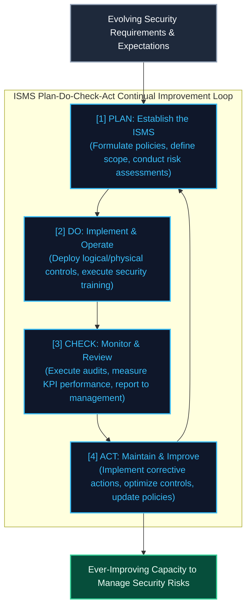

#### The Four PDCA Phases Defined

| Phase     | Operational Focus         | Actionable Requirements                                                                                                                                                                                |
| :-------- | :------------------------ | :----------------------------------------------------------------------------------------------------------------------------------------------------------------------------------------------------- |
| **Plan**  | **Establish the ISMS**    | Establish ISMS policies, objectives, processes, and procedures relevant to managing risk and improving information security. Align these directly with the organization’s overall business objectives. |
| **Do**    | **Implement and Operate** | Implement and operate the defined ISMS policies, controls, processes, and security procedures across all organizational zones.                                                                         |
| **Check** | **Monitor and Review**    | Assess and measure operational process performance against ISMS policies, objectives, and actual technical experience. Present formal compliance reports to senior management for review.              |
| **Act**   | **Maintain and Improve**  | Take immediate corrective and preventive actions based on the results of internal ISMS audits, management reviews, or new threat intelligence to continually improve the security posture.             |

### Making Continual Improvement Happen

Achieving continual improvement requires moving beyond mechanical controls. The study of continuous improvement programs over the last 40 years—drawing on seminal works by W. Edwards Deming, Peter Senge (learning organizations), Barry Boehm (Theory-W), and Tom Petzinger—demonstrates that successful implementation relies heavily on human dynamics.

#### Building an ISS-Aware Culture

The ultimate effectiveness of any information security program depends on employee behavior. Behavior is guided by:

1. What people **know** (knowledge).
2. How people **feel** (attitudes).
3. What their **instincts** tell them to do (ingrained habits).

While traditional information security training programs can successfully impart technical knowledge, they rarely influence employees' deeper security instincts. This limitation leads to a persistent gap between documented security policies and actual human behavior. Closing this gap requires shifting the organizational culture.

Organizational culture is defined by Edgar Schein as:

> _"...a pattern of shared basic assumptions that the group learned as it solved its problems of external adaptation and internal integration, that has worked well enough to be considered valid and, therefore, to be taught to new members as the correct way to perceive, think, and feel in relation to those problems."_

#### The ISS Cultural Challenge

Embedding security practices within corporate culture is uniquely challenging due to several administrative realities:

- **The "New Kid on the Block" Status:** The ISS department is relatively new in most organizations compared to established functions like operations or finance. (The origin of the ISS field dates back to the Defense Science Board Task Force Report, _Security Controls for Computer Systems_, edited by Willis Ware in 1970).
- **Perceived as Secondary to Core Mission:** Senior management often views ISS controls as a burdensome legal or regulatory mandate rather than an essential business driver. Support can evaporate if the regulatory landscape shifts.
- **Subculture Isolation:** ISS concerns can seem disconnected from the day-to-day work of marketing, sales, and financial departments. Consequently, the ISS subculture often feels isolated and subordinate to dominant organizational subcultures.
- **The "Not My Job" Mentality:** The presence of the word "security" leads employees to assume the ISS group will handle all technical issues, absolving individual staff of personal responsibility.
- **Negative Touchpoints:** Average employees typically interact with the ISS team only during negative events (e.g., forgotten passwords, locked accounts, system blocks). This isolation restricts natural opportunities for cultural integration.

#### Security Leadership and Culture Shift

To build a resilient defense, security leaders must embed a security mindset into the broader organizational culture. As Edgar Schein explains:

> _"Culture and leadership are two sides of the same coin... If cultures become dysfunctional, it is the unique function of leadership to perceive the functional and dysfunctional elements of the existing culture and to manage cultural evolution and change in such a way that the group can survive in a changing environment... This ability to perceive the limitations of one’s own culture and to develop the culture adaptively is the essence and ultimate challenge of leadership."_

Until a security mindset is integrated into the larger culture, the organization remains vulnerable to exploitation. Because human error is a primary root cause of data breaches, security practitioners must actively mold and shape their organization's culture so that careful, security-minded behaviors become the natural norm for all employees.

### Appendix A: Information Systems Security Resources

This appendix provides a quick reference guide to leading professional organizations, certifications, technical advisories, and legal frameworks relevant to information systems security.

#### Professional Organizations and Resources

| Organization                                                | Purpose & Core Offerings                                                                                                                                                | Website / Contact                                 |
| :---------------------------------------------------------- | :---------------------------------------------------------------------------------------------------------------------------------------------------------------------- | :------------------------------------------------ |
| **International Foundation for Protection Officers (IFPO)** | Focuses on education, training, and certification for security and protection practitioners.                                                                            | [ifpo.org](https://www.ifpo.org)                  |
| **Center for Internet Security (CIS)**                      | Developed global metrics and consensus-based security configuration benchmarks (hardening guides) to secure systems.                                                    | [cisecurity.org](http://www.cisecurity.org)       |
| **CERT Coordination Center**                                | Part of Carnegie Mellon's Software Engineering Institute. Provides extensive resources for incident response, threat vulnerability handling, and CSIRT creation guides. | [cert.org](http://www.cert.org)                   |
| **Computer Security Institute (CSI)**                       | Conducted the landmark annual CSI/FBI Computer Crime and Security Survey, analyzing economic losses and attack trends.                                                  | [gocsi.com](http://gocsi.com)                     |
| **ISACA**                                                   | A global professional association focusing on IT audit, governance, risk, and control. Developed the COBIT control framework.                                           | [isaca.org](http://isaca.org)                     |
| **Information Systems Security Association (ISSA)**         | A global, not-for-profit professional organization promoting education, collaboration, and advocacy for cybersecurity professionals.                                    | [issa.org](https://www.issa.org)                  |
| **InfraGard**                                               | A public-private partnership between the Federal Bureau of Investigation (FBI) and the private sector to share intelligence and protect critical infrastructure.        | [infragard.org](https://www.infragard.org)        |
| **National Institute of Standards and Technology (NIST)**   | A non-regulatory federal agency within the U.S. Department of Commerce that publishes the influential SP 800-series security guidelines.                                | [nist.gov](http://www.nist.gov)                   |
| **Open Web Application Security Project (OWASP)**           | A global community providing free resources, documentation, and tools focused on securing web applications, including the OWASP Top 10.                                 | [owasp.org](http://www.owasp.org)                 |
| **Privacy Rights Clearinghouse (PRC)**                      | A consumer advocacy non-profit that maintains a public, searchable database of reported data breaches.                                                                  | [privacyrights.org](http://www.privacyrights.org) |
| **Secunia**                                                 | A vulnerability intelligence provider offering patches, vulnerability tracking, and security advisory databases.                                                        | [secunia.com](http://secunia.com)                 |
| **SANS Institute**                                          | A premier cybersecurity training and research organization. Operates the global **Internet Storm Center (ISC)** for real-time cyber threat monitoring.                  | [sans.org](http://www.sans.org)                   |

#### Industry-Standard Information Security Certifications

- **Certified Information Systems Security Professional (CISSP):** Offered by **(ISC)²**, this is the globally recognized gold standard certification for information security practitioners, covering a broad common body of knowledge across security domains.
- **Certified Information Security Manager (CISM):** Offered by **ISACA**, this credential focuses on information security governance, program development, risk management, and incident response management.
- **Certified Information Systems Auditor (CISA):** Offered by **ISACA**, this is the standard certification for professionals auditing, controlling, and monitoring an organization's IT systems.
- **Global Information Assurance Certification (GIAC):** Offered in alignment with the SANS Institute, GIAC provides highly specialized, hands-on certifications in technical security areas such as forensics, penetration testing, and incident handling.

#### Technical Advisories & Threat Blogs

- **US-CERT (CISA):** Standard governmental gateway for critical vulnerability alerts and defensive recommendations ([us-cert.gov](http://www.uscert.gov)).
- **SANS Internet Storm Center (ISC):** Daily diaries and threat level indexes managed by volunteer incident handlers ([isc.sans.org](http://isc.sans.org)).
- **Google Online Security Blog:** Explores vulnerability research, browser defenses, and emerging web threats ([googleonlinesecurity.blogspot.com](http://googleonlinesecurity.blogspot.com/)).
- **Microsoft Malware Protection Center (MMPC):** Detailed technical threat analysis, intelligence reports, and security updates ([blogs.technet.com](http://blogs.technet.com)).
- **Schneier on Security:** Renowned technologist Bruce Schneier's blog covering security tech, cryptology, and policy analysis ([schneier.com](http://www.schneier.com)).
- **KrebsOnSecurity:** Brian Krebs' investigative journalism blog focusing on cybercrime syndicates and data breaches ([krebsonsecurity.com](http://krebsonsecurity.com)).
- **Citadel on Security:** Citadel Information Group's blog providing administrative perspective on cybercrime, regulations, and risk management.

#### United States Federal Laws, Regulations & Frameworks

- **Federal Trade Commission Safeguards Rule:** _Standards for Safeguarding Customer Information_ (16 CFR Part 314), enforcing administrative, physical, and technical safeguards.
- **Health Insurance Portability and Accountability Act (HIPAA):** _Security and Privacy Rules_ (45 CFR Parts 160 & 164), safeguarding Protected Health Information (PHI).
- **Gramm-Leach-Bliley Act (GLBA):** _Privacy and Consumer Financial Information_ (12 CFR Part 40), protecting non-public personal financial data.
- **Sarbanes-Oxley Act of 2002 (SOX):** Section 404 (Public Law 107-204), mandating strict internal control assessments for financial reporting systems.
- **California Civil Code SB 1386:** The nation's first data breach notification law (California Civil Code §§ 1798.80–1798.84).

#### ISS Standards, Frameworks & Guides

- **ISO/IEC 27001:** _Information technology — Security techniques — Information security management systems — Requirements._ Specifies the requirements for establishing and implementing an ISMS.
- **ISO/IEC 27002:** _Information technology — Security techniques — Code of practice for information security controls._ Establishes the guidelines and controls for implementing security standards.
- **PCI DSS:** _Payment Card Industry Data Security Standard._ Formulated by the major credit card issuers to secure credit card transaction zones and cardholder data.
- **NIST Special Publications (SP):**
  - **SP 800-100:** _Information Security Handbook: A Guide for Managers._
  - **SP 800-61:** _Computer Security Incident Handling Guide._
  - **SP 800-92:** _Guide to Computer Security Log Management._
  - **SP 800-83:** _Guide to Malware Incident Prevention and Handling._
  - **SP 800-86:** _Guide to Integrating Forensic Techniques into Incident Response._
  - **SP 800-64:** _Security Considerations in the System Development Life Cycle._
  - **SP 800-58:** _Security Considerations for Voice Over IP Systems._
  - **SP 800-50:** _Building an Information Technology Security Awareness and Training Program._
  - **SP 800-47:** _Security Guide for Interconnecting Information Technology Systems._

## Chapter 4: Security Challenges of Convergence

Convergence represents a major structural shift in how organizations manage their security assets. Rather than operating in isolated silos, modern organizations integrate physical security technologies directly with standard corporate IT network infrastructures.

> [!IMPORTANT]
> **Definition of Security Convergence:**
> According to Tyson (2007, p. 4), convergence is:
> _"...the integration, in a formal, collaborative, and strategic manner, of the cumulative security resources of the organization in order to deliver enterprise-wide benefits through enhanced risk mitigation, increased operational effectiveness and efficiency, and cost savings."_

While security convergence delivers substantial operational efficiencies and cost savings, it also expands the organization's risk profile. When physical security technologies are connected to a shared corporate network, they are exposed to the same vulnerabilities, threats, and logical attack vectors that target traditional IT assets.

### Network Risk

By placing physical security technology (such as IP cameras, biometric scanners, and smart locks) onto the network, security professionals open the door to significant network-based risks. All of the following threat vectors—which are core concerns for Information Systems Security (ISS) practitioners—can directly compromise and weaken physical security defenses:

| Risk Vector                      | Threat Action                                | Triad Focus         | Operational Impact on Physical Security                                                       |
| :------------------------------- | :------------------------------------------- | :------------------ | :-------------------------------------------------------------------------------------------- |
| **Denial of Service (DoS)**      | Disabling a network-enabled security system. | **Availability**    | Stops camera feeds, prevents remote door releases, or locks out control consoles.             |
| **Insertion of Inaccurate Data** | Injecting falsified logs or video frames.    | **Integrity**       | Inserts fake "looping" video feeds or spoofed access logs to mask unauthorized entry.         |
| **Data Theft**                   | Stealing system configurations or files.     | **Confidentiality** | Exposes site blueprints, camera locations, or user lists for physical planning of intrusions. |
| **Data Modification**            | Intercepting and altering system parameters. | **Integrity**       | Modifies user permissions in the database to grant unauthorized access to a restricted area.  |
| **Data Destruction**             | Deleting system logs or recorded archives.   | **Availability**    | Erases critical video evidence or audit trails, preventing forensic post-incident analysis.   |

To address the security risks brought on by convergence, physical security practitioners must be able to categorize ISS risk according to the Confidentiality, Integrity, and Availability (CIA) triad. This structural approach allows practitioners to quickly assess threats and implement appropriate countermeasures.

### Network Case Study: Camera System

A modern video surveillance system relies heavily on corporate network routing and switches, as illustrated in the following system architecture:

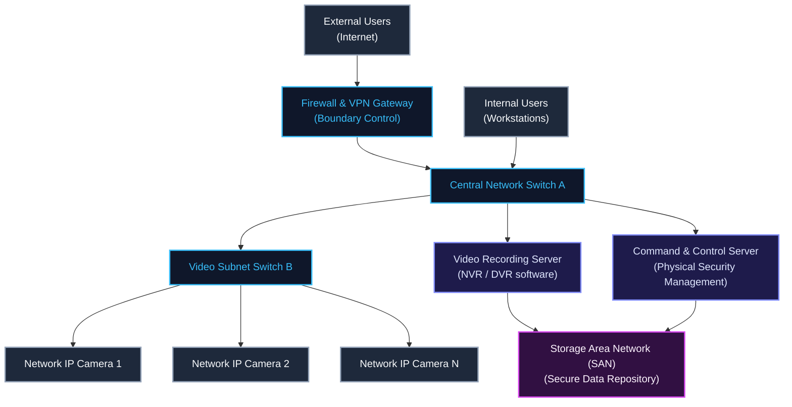

#### System Architecture Walkthrough

- **Network Boundary:** External users connecting via the Internet are segregated from the internal corporate network by a security boundary consisting of a **Firewall** and a **Virtual Private Network (VPN)** gateway.
- **Logical Switch Interconnections:** Internal workstation clients connect to central **Switch A** to access corporate data assets. IP-based security cameras are dispersed throughout the facilities. Each camera connects to local **Switch B**, which uplinks to Switch A, allowing cameras to communicate with servers across the corporate network.
- **Recording and Management Servers:** The servers that control the video surveillance architecture reside on the central switch:
  - **Video Recording Server:** Hosts the Network Video Recorder (NVR) software that streams and records video feeds.
  - **Command & Control Server:** Manages physical security platform configurations, scheduling, and alarms.
  - **Storage Area Network (SAN):** High-speed storage repository where all recorded video data and database configurations reside.

#### Application of the 5 ISS Risks to Video Systems

If network security is weak, an intruder can exploit vulnerabilities to compromise the video system:

- **Denial of Service (DoS) (Availability):** Attackers can flood the camera network, blocking video streams from reaching operator workstations or NVRs. This prevents real-time viewing during a physical breach.
- **Insertion of Inaccurate Data (Integrity):** Attackers can inject a forged pre-recorded video stream into the NVR, masking active illicit physical activity on-site.
- **Data Theft (Confidentiality):** Unauthorized users can capture raw video feeds from the network, providing them with intelligence regarding guard rotations, employee presence, and high-value asset storage locations.
- **Data Modification (Integrity):** Intruders can intercept and alter data in transit, replacing live streams with looping footage to deceive console operators.
- **Data Destruction (Availability):** Attackers who gain administrative access to the SAN can wipe archived recordings, destroying evidence needed for post-incident investigations.

### Network Case Study: Access Control

Electronic Access Control (EAC) systems introduce complex network interactions that require careful management by physical security practitioners.


#### Communication Layers: Layer 2 vs. Layer 3

Networked devices communicate using two fundamental logical methods:

- **Direct Communication (Layer 2 - Switch-Level):** Occurs when computers can see each other directly on the same local network segment or physical switch. This is analogous to speaking to someone in the same conference room. When a workstation wants to configure the access control server, it broadcasts an Address Resolution Protocol (ARP) request to find the server's MAC address and establishes a direct conversation.
- **Indirect Communication (Layer 3 - Routed):** Occurs when devices reside on separate subnets or physical locations. This is analogous to making a phone call to someone in another building; an intermediary (a **Router**) is required to dial, translate, and forward the data packets. When a remote workstation wants to communicate with an embedded door controller on another floor or branch, it forwards data packets to the default gateway router, which routes them across the networks.

#### System Hardware Interconnections

In a networked EAC system:

- **The Door Reader (Card Reader):** Connects physically via serial connection (such as Wiegand) to a local **Embedded Controller**.
- **The Embedded Controller:** Decides door lock relays and connects to the network via a switch to receive database updates from the Access Control Server.
- **The Access Control Server:** Connects directly to the switch, handling all log aggregation, credential database queries, and communications with workstations.

#### Application of the 5 ISS Risks to Access Control

- **Denial of Service (DoS) (Availability):** Attackers can flood the access control subnet with garbage traffic, preventing administrative workstations from uploading critical lockout commands or database updates to the controllers.
- **Insertion of Inaccurate Data (Integrity):** Hackers can exploit unencrypted protocols to inject a falsified credential verification command directly to the embedded controller, opening a high-security shipping facility door without a physical badge.
- **Data Theft (Confidentiality):** Attackers can sniff plain-text network traffic to steal employee badge IDs and system configuration files. This data can be used to duplicate physical proximity cards or plan social engineering attacks.
- **Data Modification (Integrity):** Intruders can exploit administrative operating system vulnerabilities to access the database and modify user records, granting themselves unauthorized high-level access permissions.
- **Data Destruction (Availability):** Rogue employees or intruders can wipe door transaction databases or server logs to erase their physical movements and cover their tracks after committing a theft.

### Communications Attacks

Once physical security systems are placed onto the corporate network, they are susceptible to diverse logical attacks coming from multiple vectors:

1. **Social Engineering:** Manipulating employees into exposing network credentials or system parameters.
2. **Direct Hacking:** Targeting network-enabled hardware or software platforms using administrative tools to bypass controls.
3. **Malware:** Deploying viruses, worms, spyware, rootkits, or Trojans to compromise system endpoints.
4. **Web Attacks:** Exploiting software vulnerabilities in the web application interfaces used to manage security devices.

#### Social Engineering

Social engineering is the psychological manipulation of individuals to perform actions or divulge confidential information that weakens system security.

- **Targeting Console Operators:** A hacker may phone a security console operator, pretending to be a technician from the IT department, and request their login username and password under the guise of "fixing a system error."
- **Impact:** If the operator lacks sufficient security training, they may share their credentials, giving the hacker full administrative access to remote video streams or door lock controls. This vulnerability applies equally to local servers and cloud-hosted systems.

#### Direct Hacking

In a direct hacking attack, the intruder utilizes active software tools to discover, probe, and exploit network security vulnerabilities.

- **Reconnaissance & Brute-Forcing:** Hackers use automated port scanners to identify active web management ports on video recorders. If they discover a login page, they use brute-force dictionary attacks to try thousands of password combinations. (Modern systems should employ lockout rules that disable accounts after a consecutive number of failed attempts).
- **Vulnerability Exploitation:** Hackers scan systems for unpatched software bugs or administrative program flaws. By using automated exploitation tools, they can inject malicious code to gain system control, create unauthorized administrative accounts, or alter passwords.
- **Architectural Misconfigurations:** A major vulnerability is incorrect architectural design—such as connecting an internal database or door controller directly to a public-facing switch.

#### Malware

Malware represents any software program designed to secretly infect and gain unauthorized control of a system. Common variants include:

- **Viruses & Worms:** Self-replicating programs that infect files and spread across local subnets.
- **Spyware & Keyloggers:** Software that silently records keystrokes, capturing passwords and PINs.
- **Trojans & Rootkits:** Programs that masquerade as legitimate software while opening administrative backdoors and hiding their presence deep in the operating system.

Malware frequently bypasses preventive corporate controls due to:

- Outdated antivirus signatures.
- Untrained users opening malicious email attachments or visiting compromised websites.
- Poor administrative controls that allow users to download and install unauthorized software on their desktops.

Once malware infects a console workstation and captures administrative credentials, the hacker gains full remote control over all connected physical security software.

#### Web Application Attacks & The OWASP Top 10

Physical security platforms that utilize a web browser interface for remote administration are exposed to web application attacks. The Open Web Application Security Project (OWASP) catalogs the most common application flaws:

1. **Injection (Specifically SQL Injection):**
   Occurs when untrusted data is sent to an interpreter as part of a command or query. If a web login page or query form is poorly written, a hacker can input database commands instead of plain text.

   _Example Payload:_
   Instead of a standard ID, a hacker inputs a SQL payload into the URL query field:
   `http://www.yourcompany.com/query.asp?employeeid=999999' OR '1'='1' --`

   If the database is poorly configured, it interprets the `' OR '1'='1'` as a true statement and returns all user records in the database, exposing passwords and badge IDs.

2. **Cross-Site Scripting (XSS):**
   Allows attackers to inject malicious scripts into trusted websites. When a user browses the compromised site, the script executes, potentially stealing active session tokens and loading keyloggers.

3. **Broken Authentication and Session Management:**
   Vulnerabilities that allow hackers to compromise active session tokens, passwords, or keys, permitting them to temporarily assume a legitimate user's identity.

4. **Insecure Direct Object References:**
   A failure to implement authorization checks when direct references are made to internal database files, allowing hackers to access backend administrative pages by altering the URL path.

5. **Cross-Site Request Forgery (CSRF):**
   An attack that tricks a victim’s web browser into executing an unauthorized command on a web application where the user is currently authenticated.

6. **Insecure Cryptographic Storage:**
   Failure to encrypt sensitive files or credentials on disk, or using weak, legacy algorithms. This type of vulnerability exposed 34 million credit card records in the TJX compromise.

7. **Failure to Restrict URL Access:**
   If a system fails to verify permissions for direct URL pathways, a cybercriminal can bypass menu buttons and type administrative addresses (e.g., `/admin/settings.asp`) directly into their browser to gain access.

8. **Insufficient Transport Layer Protection:**
   Transmitting sensitive data in plain text without using Secure Sockets Layer (SSL) or Transport Layer Security (TLS). This allows attackers to sniff logins and credentials from network traffic.

9. **Unvalidated Redirects and Forwards:**
   Allowing applications to redirect users to external links without prior validation, permitting attackers to redirect victims to malicious phishing or drive-by malware download sites.

Physical security professionals must verify that all acquired security hardware and software undergo rigorous code vetting and security configuration tests before being deployed.

### Information Security Management System

To mitigate these complex logical risks, organizations must implement a structured **Information Security Management System (ISMS)** as outlined in the **ISO/IEC 27001** and **ISO/IEC 27002** standards.

Physical security practitioners must collaborate directly with information security specialists, contributing their physical risk assessment expertise to build an integrated defense.

#### Core Elements of an ISO 27001 ISMS

An effective ISMS must establish:

- A formal Information Security Management System tailored to the organization's unique requirements.
- Ongoing risk identification, assessment, and management processes.
- Incorporation of appropriate technical, physical, and administrative controls.
- Constant monitoring, formal review, maintenance, and continual improvement of controls.
- Clear assignment of senior management responsibility (including designating a full-time **Chief Information Security Officer (CISO)**).
- Regular internal audits and independent third-party assessments.
- Regular, structured reports (such as a quarterly security dashboard) presented directly to the CEO and Board of Directors.

#### Critical Security Clauses under ISO 27002

To achieve a comprehensive security baseline, physical security systems must comply with the standard security clauses defined in **ISO/IEC 27002**:

| Clause                                | Operational Focus                           | Physical Security Integration                                              |
| :------------------------------------ | :------------------------------------------ | :------------------------------------------------------------------------- |
| **Security Policy**                   | Establishing administrative policies.       | Day-to-day physical operations and device network authorization standards. |
| **Human Resources Security**          | Reducing human risk throughout employment.  | Background checks, NDAs, security training, and termination lockouts.      |
| **Physical & Environmental**          | Securing facilities and hardware.           | Safeguarding servers, network closets, power supplies, and utility lines.  |
| **Communications & Operations**       | Ensuring stable, secure network operations. | Implementing operational controls (detailed in the following section).     |
| **Access Control**                    | Restricting access to authorized users.     | Multi-factor authentication (MFA) and user credential management.          |
| **Systems Acquisition & Maintenance** | Vetting software throughout its lifecycle.  | Verifying secure coding, database encryption, and software patching.       |
| **Incident Management**               | Responding to security compromises.         | Coordinating physical and logical incident response teams (CSIRT).         |
| **Business Continuity**               | Maintaining operations during crises.       | Server redundancy, generator backup, and backup site security.             |
| **Compliance**                        | Meeting legal and regulatory mandates.      | Ensuring system architectures comply with SOX, HIPAA, and PCI DSS.         |

### Communications And Operations Management

Communications and operations management represents the tactical core of system security, defining the day-to-day controls required to secure network environments. Physical security practitioners must align their systems with these standard IT operational controls.

#### 1. Computer System Turn-On, Shutdown, and Emergency Shutdown

Modern networked systems are highly interdependent and require a structured startup and shutdown sequence.

- **Startup Sequence:** Unlike legacy analog cameras that connect via coaxial cables and turn on instantly, IP cameras, network switches, video recording servers, and Storage Area Networks (SANs) must boot in a specific order to prevent connectivity failures.
- **Shutdown Delays:** Shutting down or restarting (cycling) an access control server during a technical glitch can take several minutes, temporarily disabling monitoring consoles and logging capabilities.
- **Emergency Shutdowns:** Environmental emergencies (such as a water leak or cooling failure) may require an immediate shutdown of the server room. Security architectures must include redundant, off-site servers that can instantly take over camera recording and access control functions.

#### 2. Change Management

Change management is the formal process of reviewing, testing, approving, and documenting all modifications to system hardware, software, or network routing.

- **Preventing System Failures:** Physical security teams cannot perform independent software upgrades on access control servers. A single unvetted camera upgrade can introduce bugs that trigger a "broadcast storm," flooding the switch and bringing down the entire corporate network.
- **Coordinating with IT:** Conversely, IT must consult with physical security before upgrading server operating systems, as updates can cause legacy physical security applications to stop functioning.

#### 3. Segregation of Duties

Segregation of duties is an administrative control that splits key responsibilities among multiple employees to prevent fraud and abuse.

- **Application to EAC:** The employee who possesses administrative access to create access control credentials should not be the same employee who is patrolling the facility or conducting physical audits. Restricting privileges prevents an individual from creating an untraceable card to access secure vaults.

#### 4. Third-Party Service Delivery

All third-party service providers must be bound by formal, written **Service Level Agreements (SLAs)** that mirror internal IT operational standards.

- **Bandwidth Commitments:** If video archiving is outsourced, the provider must commit to providing sufficient, secure network bandwidth to transmit high-definition feeds 24 hours a day without loss.

#### 5. Capacity Management

Capacity management involves forecasting and monitoring system resources (such as bandwidth, processing power, and storage) to prevent resource depletion.

- **Emergency Bandwidth Spikes:** During a critical facility incident, multiple security team members and external emergency responders may simultaneously attempt to access live video feeds over the network. If bandwidth limits are not pre-planned, the sudden spike will overwhelm the system, causing a Denial of Service.

#### 6. System Management

Unlike legacy, isolated appliances, networked computers require continuous administrative upkeep, including software patching to repair known system flaws.

- **Patch Scheduling:** Applying a patch to a central video server may require a temporary offline window. Security managers must coordinate with IT to schedule maintenance during low-risk hours or deploy temporary backup cameras to monitor critical zones.

#### 7. System Acceptance

System acceptance is the rigorous testing and validation process that new hardware and software must pass before being connected to the corporate network.

- **Security Vetting:** Network administrators must logically audit physical security devices (such as IP cameras) to verify they do not contain default hardcoded passwords or pre-installed vulnerabilities that could compromise the network.

#### 8. Malicious Code Protection

All networked workstations and servers must run host-level security software (such as antivirus and endpoint detection tools) to protect against malware.

- **EAC Server Protection:** If the access control server is left unprotected, an infection can spread, disabling door controllers or using the server to launch attacks across the corporate network.

#### 9. System Backup

System backups are critical for restoring operations following a system crash or hardware failure.

- **Regulatory Retention:** If video data is lost due to a drive failure, the company may face severe regulatory compliance fines. Backups of the access control database must be automated to avoid the massive cost and time required to re-register employee credentials by hand.

#### 10. Network Security Controls

Networked physical security devices must adhere to standard IT communication protocols and security controls.

- **802.1X Authentication:** High-security facilities require IP cameras to support 802.1X network access control, ensuring that only authenticated hardware can attach to the network port. This prevents an attacker from unplugging an outdoor camera and plugging in a rogue laptop.

#### 11. Media Handling

Media handling defines the controls for storing, transporting, and disposing of physical data media (such as hard drives, USB sticks, and backup tapes).

- **Investigation Data Safeguards:** Video recordings copied to a USB drive for an active investigation must be encrypted and locked in a secure container to prevent unauthorized access or loss of evidence.

#### 12. Security of System Documentation

System documentation—including network schematics, database schemas, and camera layout blueprints—contains highly sensitive information that must be restricted.

- **Preventing Intrusion Planning:** If an attacker obtains these documents, they can identify blind spots in camera coverage or locate key server cabinets to plan a physical and logical breach.

#### 13. Exchange of Information

Exchanging security data with first responders and third-party partners requires strict controls and secure communication channels.

- **Credential Protection:** While sharing camera feeds with local police during an emergency is beneficial, practitioners must establish secure guest portals to prevent administrative login credentials from being exposed.

#### 14. E-Commerce and Transactions

If the organization runs public-facing web portals or conducts electronic transactions, it must implement strict industry standards (such as TLS encryption) to secure data in transit.

#### 15. System Monitoring and Logging

Security administrators must continuously monitor system logs to identify anomalies. Firewall logs, intrusion detection alerts, and host-level system logs must be aggregated and analyzed to catch unauthorized access attempts in real time.

#### 16. Clock Synchronization & Network Time Protocol (NTP)

Clock synchronization is a vital practice in physical and logical security coordination.

- **Synchronized Audit Trails:** All network devices, cameras, access controllers, and servers must synchronize their internal clocks using the **Network Time Protocol (NTP)**.
- **Forensic Significance:** Having a unified time source is critical for evidence purposes, allowing forensic examiners to correlate a physical alarm log (e.g., door forced open at 14:02:15) with corresponding video footage and network firewall logs.

### Access Control

Network-connected security systems require rigorous logical access controls. Given the extreme sensitivity of physical security systems, standard username/password combinations are no longer sufficient.

- **Identity Verification:** Because web-enabled cameras and access control dashboards can theoretically be accessed from anywhere in the world, organizations must implement **Multi-Factor Authentication (MFA)**.
- **Implementing MFA:** MFA requires users to present at least two independent factors before gaining access:
  1. _Something you know_ (e.g., an administrative password).
  2. _Something you have_ (e.g., a one-time passcode generated by a hardware token or authenticator app) or _something you are_ (e.g., a fingerprint scan).
- **Vendor Selection Complexity:** Security practitioners must prioritize MFA capabilities when vetting security vendors. A vendor that offers excellent physical features but lacks MFA support introduces unacceptable logical risk to the corporate network.
- **Operating System Longevity:** Administrators must avoid placing door controllers on the network if they utilize outdated, unsupported operating systems (such as Windows XP or legacy Linux kernels). Unsupported systems contain unpatchable vulnerabilities, leaving them vulnerable to compromise.

### Information Systems Acquisition, Development, And Maintenance

As organizations acquire new security systems, develop custom software integrations, or perform upgrades, they must verify that these actions do not compromise the **CIA Triad** (Confidentiality, Integrity, or Availability) of the data stream.

- **Encrypted Data Streams:** All video streams and administrative credentials transmitted across the network must be encrypted in transit using industry-standard algorithms (such as AES-256 and TLS 1.3).
- **Protecting the Perimeter:** Unencrypted communications permit attackers to sniff data, clone credentials, or inject falsified commands onto the network.

### Information Security Incident Management

Physical security practitioners can provide valuable expertise to logical incident response teams, given their extensive experience in managing operational emergencies.

- **Forensic Integrity:** Digital forensic examiners often come from physical security backgrounds. In the event of a breach, physical security coordinates with IT to maintain the chain of custody for seized physical servers, hard drives, and network log records.

### Business Continuity Management

A resilient business continuity plan requires close integration between physical and logical security domains:

- **System Redundancy:** If an emergency power failure occurs, critical network switches and physical security servers must remain functional. Organizations must deploy robust uninterruptible power supplies (UPS) and backup generators.
- **Server Replication:** In a disaster, if the main server room becomes inaccessible, camera feeds and door controller software must instantly failover to a secure, alternate geographic site.
- **Facility Logistics:** Physical security personnel are well-equipped to manage emergency logistics (such as housing displaced personnel or securing the backup facility), directly assisting IT disaster recovery efforts.

### Compliance

Compliance requirements are non-negotiable legal mandates:

- **Sarbanes-Oxley (SOX):** Requires public companies to verify the logical and physical controls securing financial reporting systems.
- **HIPAA/HITECH & PCI DSS:** Mandate strict physical and logical access boundaries to protect patient records and credit card data.
- Security managers must fully understand these compliance obligations to ensure their systems are configured in accordance with the law, preventing costly regulatory penalties.

### ISMS Summary

The analysis of the ISMS framework highlights multiple areas where physical security and logical security practitioners must work in unison. Physical security systems represent a primary bridge between the logical and physical worlds; vulnerabilities in networked physical security hardware can weaken the entire logical network, while logical intrusions can disable physical security defenses.

By operating within the ISMS framework and collaborating with ISS colleagues, physical security professionals can gain the full operational benefits of convergence while systematically mitigating risk.

### Conclusion

As modern organizations continue to converge their security systems onto shared corporate network infrastructures, the security of physical assets becomes permanently intertwined with the security of information systems.

To successfully navigate this converged landscape, physical security professionals must:

> [!IMPORTANT]
> **Adopting the Dual Paradigm:**
> Physical security practitioners must augment their traditional **Physical Security Paradigm** with a modern **Logical Security Paradigm**.

To build an integrated defense, security professionals must:

1. Collaborate closely with their ISS colleagues to understand logical threat vectors.
2. Share physical risk management insights with logical security teams.
3. Ensure senior leadership supports the integration of physical and logical security paradigms.
