# 06 Physical Security Audit Manual (PSAM) — Personnel

<details>
<summary><b>📖 Book Publication Details & Disclaimers</b></summary>

* **Publisher:** Raivan Global | [www.raivanglobal.com](https://www.raivanglobal.com)
* **Disclaimer:** This *Physical Security Audit Manual (PSAM)* is furnished for training and ready reference purposes. While every effort has been made to ensure the accuracy of the contents herein, Raivan Global assumes no responsibility for errors or omissions.
* **Copyright:** © Raivan Global. All rights reserved. Prepared for internal training and security audit operations.

</details>

---
## Table of Contents

* [Introduction](#introduction)
  * [Readership](#readership)
  * [Dialogue](#dialogue)
  * [Supplemental Training](#supplemental-training)
* [Chapter 1: Security Officer Operations](#chapter-1-security-officer-operations)
  * [Historical Context](#historical-context)
  * [Security Officer Statistics](#security-officer-statistics)
  * [1.1 Security Officer Utilization](#11-security-officer-utilization)
  * [1.2 Basic Functions](#12-basic-functions)
  * [1.3 Officer Qualifications](#13-officer-qualifications)
  * [1.4 Training](#14-training)
  * [1.5 Weapons](#15-weapons)
  * [1.5.3 Use-of-Force Policy](#153-use-of-force-policy)
  * [1.6 Uniforms and Equipment](#16-uniforms-and-equipment)
  * [1.7 Organizational Structure](#17-organizational-structure)
  * [1.8 Legal Concerns](#18-legal-concerns)
  * [1.9 Scheduling and Managing the Security Force](#19-scheduling-and-managing-the-security-force)
  * [1.10 General Orders](#110-general-orders)
  * [1.11 Post Orders](#111-post-orders)
  * [Supervision](#supervision)
  * [1.13 Security Officer Reports](#113-security-officer-reports)
  * [1.14 Enhancing Security Officer Job Performance](#114-enhancing-security-officer-job-performance)
  * [1.14.2 Behavioral Theories in Guard Force Management](#1142-behavioral-theories-in-guard-force-management)
  * [1.15 The Human Environment & Personnel Selection](#115-the-human-environment-personnel-selection)
  * [1.16 Personal Communication, Training, and Supervision](#116-personal-communication-training-and-supervision)
  * [1.17 Serious Misconduct & Disciplinary Policies](#117-serious-misconduct-disciplinary-policies)
  * [1.19 Conclusion](#119-conclusion)
* [References](#references)
  * [APPENDIX 1A: Sample Disciplinary Policy](#appendix-1a-sample-disciplinary-policy)
  * [APPENDIX 1B: Company Fact Sheet on Employee Discipline](#appendix-1b-company-fact-sheet-on-employee-discipline)
* [Chapter 2: Training the Security Officer](#chapter-2-training-the-security-officer)
  * [2.1 Key Training Concepts](#21-key-training-concepts)
  * [2.2 Benefits of Training](#22-benefits-of-training)
  * [2.3 Identifying Training Needs](#23-identifying-training-needs)
  * [2.4 Training Program Assessment and Design](#24-training-program-assessment-and-design)
  * [2.5 Training Methodology](#25-training-methodology)
  * [2.6 The Training Process](#26-the-training-process)
  * [2.7 Obstacles to Providing Training](#27-obstacles-to-providing-training)
  * [2.8 Training Strategies](#28-training-strategies)
  * [2.9 Roles of Security Officers](#29-roles-of-security-officers)
  * [2.10 Future Trends in Training](#210-future-trends-in-training)
* [Chapter 3: The Security Services Contract](#chapter-3-the-security-services-contract)
  * [3.1 Client Responsibilities](#31-client-responsibilities)
  * [3.2 Agency Responsibilities](#32-agency-responsibilities)
  * [3.3 Bid Evaluation](#33-bid-evaluation)
  * [3.4 Contract Award](#34-contract-award)
  * [3.5 Administration of the Operating Agreement](#35-administration-of-the-operating-agreement)
  * [Appendix 3A: Sample Scope of Work](#appendix-3a-sample-scope-of-work)
  * [Appendix 3B: Sample General and Special Orders](#appendix-3b-sample-general-and-special-orders)
  * [Appendix 3C: Sample Operating Agreement for Security Service](#appendix-3c-sample-operating-agreement-for-security-service)
  * [Sample Operating Agreement — Attachment 1](#sample-operating-agreement-attachment-1)
  * [Sample Operating Agreement — Attachment 2](#sample-operating-agreement-attachment-2)
  * [Sample Operating Agreement — Attachment 3](#sample-operating-agreement-attachment-3)
* [Chapter 4: Consultants as a Protection Resource](#chapter-4-consultants-as-a-protection-resource)
  * [4.1 The Value of Consultants](#41-the-value-of-consultants)
  * [4.2 Types of Security Consultants](#42-types-of-security-consultants)
  * [4.3 How to Use a Consultant](#43-how-to-use-a-consultant)
  * [4.4 How to Find a Security Consultant](#44-how-to-find-a-security-consultant)
  * [4.5 Selecting a Security Consultant](#45-selecting-a-security-consultant)
  * [4.6 Consulting Fees and Expenses](#46-consulting-fees-and-expenses)
  * [4.7 Working with Consultants](#47-working-with-consultants)
  * [Appendix 4A: Application for Consulting Assignment](#appendix-4a-application-for-consulting-assignment)
  * [Appendix 4B: Sample Professional Résumé](#appendix-4b-sample-professional-rsum)
  * [John Doe](#john-doe)
  * [Executive Profile](#executive-profile)
  * [Areas of Expertise](#areas-of-expertise)
  * [Professional Experience](#professional-experience)
  * [Education](#education)
  * [Professional Affiliations & Certifications](#professional-affiliations-certifications)
  * [Key Publications](#key-publications)
  * [Verified Knowledge, Skills, & Abilities (KSAs)](#verified-knowledge-skills-abilities-ksas)
  * [Appendix 4C: Professional Consulting Services Agreement](#appendix-4c-professional-consulting-services-agreement)
* [Chapter 5: Executive Protection](#chapter-5-executive-protection)
  * [5.1 Principles and Collateral Value of Executive Protection](#51-principles-and-collateral-value-of-executive-protection)
  * [5.2 Domains of Protective Operations](#52-domains-of-protective-operations)
  * [5.3 Executive Protection Program Management](#53-executive-protection-program-management)
  * [5.4 Executive Protection Operations](#54-executive-protection-operations)
* [Chapter 6: Security Awareness](#chapter-6-security-awareness)
  * [6.1 Structural Levels of Security Awareness](#61-structural-levels-of-security-awareness)
  * [6.2 Core Objectives and Purposes of Security Awareness](#62-core-objectives-and-purposes-of-security-awareness)
  * [6.3 Developing, Delivering, and Measuring the Program](#63-developing-delivering-and-measuring-the-program)
  * [6.4 Loss Prevention and Active Employee Engagement](#64-loss-prevention-and-active-employee-engagement)
* [Chapter 7: Workplace Substance Abuse](#chapter-7-workplace-substance-abuse)
  * [7.1 The Human and Organizational Cost of Substance Abuse](#71-the-human-and-organizational-cost-of-substance-abuse)
  * [7.2 The Role of the Employer](#72-the-role-of-the-employer)
  * [7.3 Substance Abuse Rationalizations and Opportunity](#73-substance-abuse-rationalizations-and-opportunity)
  * [7.4 The Progressive Path of Workplace Substance Abuse](#74-the-progressive-path-of-workplace-substance-abuse)
  * [7.5 Comprehensive Classification of Drugs of Abuse](#75-comprehensive-classification-of-drugs-of-abuse)
  * [7.6 Addiction, Dependency, and the Cycle of Denial](#76-addiction-dependency-and-the-cycle-of-denial)
  * [7.7 Role of Supervisors and Managers](#77-role-of-supervisors-and-managers)
  * [7.8 Drug Testing in the Workplace](#78-drug-testing-in-the-workplace)
  * [Appendix 7A: Supervisor's Substance Abuse Indicators Checklist](#appendix-7a-supervisors-substance-abuse-indicators-checklist)
  * [Appendix 7B: Management Intervention Checklist](#appendix-7b-management-intervention-checklist)
  * [Appendix 7C: Sample Corporate Substance Abuse Policy](#appendix-7c-sample-corporate-substance-abuse-policy)
* [Chapter 8: Workplace Violence Prevention](#chapter-8-workplace-violence-prevention)
  * [8.1 Introduction and Historical Context](#81-introduction-and-historical-context)
  * [8.2 Workplace Violence Sources and Types](#82-workplace-violence-sources-and-types)
  * [8.3 Warning Signs and Behavioral "Red Flags"](#83-warning-signs-and-behavioral-red-flags)
  * [8.4 Developing the WVPI Program](#84-developing-the-wvpi-program)
  * [8.5 Threat Assessment and Incident Management Protocols](#85-threat-assessment-and-incident-management-protocols)
  * [8.6 Workplace Violence Program Implementation](#86-workplace-violence-program-implementation)
  * [8.7 Special Threat Scenarios](#87-special-threat-scenarios)
  * [8.8 Crisis Response Protocols](#88-crisis-response-protocols)
  * [8.9 Post-Incident Recovery and Continuity](#89-post-incident-recovery-and-continuity)
  * [8.10 Summary](#810-summary)
  * [Appendix 8A: Sample Corporate Workplace Violence Policy](#appendix-8a-sample-corporate-workplace-violence-policy)
  * [Appendix 8B: Workplace Violence Plan Scenario: Terminated Employee Access Control](#appendix-8b-workplace-violence-plan-scenario-terminated-employee-access-control)
  * [Appendix 8C: Standards in Security](#appendix-8c-standards-in-security)

---

## Introduction

The *Physical Security Audit Manual (PSAM)* is intended for security professionals to find current, accurate, and practical treatment of the broad range of asset protection subjects, strategies, and solutions in a single source.

The need for such a comprehensive resource is widespread. The growing size and frequency of all forms of asset losses, coupled with the related increasing cost and complexity of countermeasure selection, demand a systematic and unified presentation of protection doctrine, standards, and specifications. It is a fundamental objective of the *Physical Security Audit Manual (PSAM)* to draw upon as large a qualified source base as can be developed. Sincere efforts are made to distill common or recurrent characteristics, trends, and other factors identifying valid protection strategies from the available data. The goal is to provide a single, premier reference where information on any protection problem can be obtained.

### Readership
The *Physical Security Audit Manual (PSAM)* is intended for a wide readership: all security professionals and business managers with asset protection responsibility. The coherent discussion and pertinent reference material in each subject area are designed to help the reader conduct effective and organized research. Of particular significance are the various forms, matrices, and checklists that give the reader a practical start toward applying security theory to their own situations. The manual also serves as a central reference for students pursuing a program in security or asset protection.

### Dialogue
We hope that the *Physical Security Audit Manual (PSAM)* becomes an important source of professional insight and stimulates serious dialogue among security professionals. Any reader who is grappling with an unusual, novel, or difficult security problem is encouraged to share it with the professional community.

### Supplemental Training
Readers with supervisory or management responsibility for other security and asset protection personnel will find the manual to be an extremely useful resource from which to assign readings. Such readings can serve as elements of a formal training syllabus or be integrated into related course sessions.

Raivan Global has prepared the *Physical Security Audit Manual (PSAM)* to represent the premier standard in security education and guidance. It is the sincere desire of our team to continuously enhance the value of this important reference.

---

## Chapter 1: Security Officer Operations

### Historical Context

In the early days of private security operations, security personnel were known as watchmen, and their main purpose was to protect property. Later, they were called guards. Today, the preferred term is **security officer** or **protection officer**, and in some settings, the term may be **loss prevention officer**. As the most visible element of the private security sector, the uniformed security officer operation has evolved into a multibillion-dollar, worldwide industry. 

The public may still view security officers simply as "guards" without understanding the wide variety of services they perform. The terrorist attacks of September 11, 2001, led to unprecedented public and media scrutiny of airport security personnel, resulting in a much finer appreciation of the duties and responsibilities of security officers. The regulatory dynamic has changed, and governments around the world now regulate both proprietary and contract officers. In addition, some jurisdictions regulate other types of protective personnel, such as door supervisors, repossession agents, and locksmiths. As security responsibilities have grown, so has the need for higher-quality security personnel.

Protection officers also provide a more diverse array of services for their employers and clients. Better-trained personnel offer a greater return on investment (ROI). By leveraging technology, smaller numbers of personnel can perform more job tasks, some of which are not strictly security-related. Contemporary protection staffs are frequently asked to assist in communications, customer service, transportation, and other business functions.

Additional growth is taking place in regions experiencing civil unrest and warfare. As companies move into new areas, they may face armed adversaries. Heavily armed security forces have been used to meet these threats.

### Security Officer Statistics

The number of security officers is rising globally. After September 11, 2001, security staffs in the United States increased by 13 percent, totaling more than 1 million jobs in 2002 (Bureau of Labor Statistics 2007). By 2019, the number had risen to 1.1 million, about 60 percent of whom were employed by contract agencies. This compares with approximately 665,000 police and sheriff's officers in the United States (Bureau of Labor Statistics 2019). Thus, **private security officers outnumber public law enforcement officers by nearly two to one.**

In 2017, there were an estimated 20 million private security workers worldwide in an industry worth approximately $180 billion, which was expected to grow to $240 billion by 2020. The ratio of private security to law enforcement officers varies greatly by country; for example, there are an estimated 7 million private security workers in India compared to just 1.4 million police officers. In China, about 5 million people are employed in private security compared to 2.7 million police (McCarthy 2017).


### 1.1 Security Officer Utilization

Security officers are best utilized as part of a complete, integrated protection plan rather than as a stand-alone resource. Security management plans should be based on a thorough understanding of the risks they are designed to control, and officers represent just one strategy within that broader framework. Their use should be evaluated periodically alongside other protection resources, such as physical security hardware and electronic security systems.

Today, protection officers are deployed in a wider variety of environments than ever before. In some cases, they are replacing public police or military personnel. Security officers may:
* Patrol urban business improvement districts or sensitive military installations.
* Monitor heavily populated venues such as stadiums, shopping centers, and large residential complexes.
* Transport prisoners or detainees for correctional or judicial agencies.

Organizations increasingly rely upon security officers to act as their "eyes and ears," not only to detect immediate infractions but also to watch for subtle, concerning behaviors that might indicate an emerging threat.

#### 1.1.1 Number of Officers Required

The exact number of officers required to protect a facility is determined by several critical factors:
* **Risk Profile:** The nature and level of identified security risks.
* **Physical Layout:** The complexity, layout, and geographical size of the facility.
* **Demographics:** The number of employees, visitors, and vendors on-site.
* **Operational Nature:** The type of business activities being conducted.
* **Access Points:** The number of entrances and their scheduled hours of operation.
* **Asset Valuation:** The overall value and nature of the assets being protected.
* **Patrol and Escort Frequency:** The number of routine patrols, personal/material escorts, and special assignments required.

##### The Guard Post Staffing Formula

> [!IMPORTANT]
> **Staffing Calculations for 24/7/365 Posts:**
> * Assuming a standard **40-hour work week** per employee:
> * A single post staffed 24 hours a day, 7 days a week, requires a absolute minimum of **4.2 full-time equivalent (FTE) officers** (168 hours / 40 hours = 4.2).
> * However, to compensate for sick leave, vacations, and holidays, each post requires a realistic minimum of **4.5 officers**.
> * Organizations with generous vacation policies or high training requirements may require up to **5.0 full-time officers per post** to maintain uninterrupted coverage.

The supervisory force is typically supplemented with clerical, communication, training, and supply support personnel. The number of support staff required scales with the overall size and complexity of the security force.

---

### 1.2 Basic Functions

Whether developing a proprietary (in-house) or contract security organization, management must first identify the precise tasks the security force will be required to perform.

The basic functions of a security officer force typically include:
* Access control (pedestrian and vehicle traffic).
* Physical patrols of buildings, perimeters, and sensitive areas.
* Personal and material escorts.
* Routine inspections of fire and safety exposures.
* Monitoring assets and systems from a centralized control facility.
* Emergency response.
* De-escalating and dealing with disruptive or hostile individuals.
* Observing and reporting activities or behaviors of concern.
* Promoting safety and accident prevention.
* Maintaining positive public relations.
* Executing special security assignments.

#### 1.2.1 Access Control

A primary function of the security officer is access control, which is the systematic regulation of movement into, out of, and within a designated building or area. Controls are placed on people, vehicles, and materials. 

Typical security officer access control duties include:
* **Identity Verification:** Ensuring all employees display badges or comply with organizational safety and security protocols.
* **Visitor Management:** Providing visitors with passes and regulating their movements through an established permit process.
* **Intrusion Detection:** Identifying and reporting unauthorized persons within the facility, temporarily detaining individuals when legally authorized.
* **Contraband Interdiction:** Reporting individuals attempting to bring contraband, weapons, or unauthorized substances onto the premises.
* **Asset Protection:** Questioning individuals who remove company property to verify that they possess proper administrative authorization.
* **Material Monitoring:** Checking parcels, bags, and mail deliveries entering and leaving the facility.
* **Vehicle Control:** Monitoring and logging land, water, or air-based vehicles (trains, heavy equipment, cars, delivery trucks) entering the property.

During crises or public health emergencies, access control officers may also be tasked with checking body temperatures, identifying inappropriate clothing (e.g., heavy coats in hot weather), or spotting individuals exhibiting erratic behaviors.

#### 1.2.2 Patrol

Officers on patrol observe a wide variety of people, assets, and locations. They report hazards and deficiencies in the protection program so that corrective adjustments can be made. Patrolling officers also respond to alarms and other irregularities. Crucially, the visible presence of a uniformed officer or a marked vehicle serves as a powerful psychological deterrent to crime.

Patrols are divided into two main categories: **foot patrols** and **vehicular patrols**. 
* Officers should patrol systematically, frequently backtracking and altering routes. An unvarying patrol routine allows potential adversaries to predict officer locations and exploit gaps in coverage.
* Officers must possess an intimate knowledge of their patrol areas, including shortcuts, dead ends, utility shutoffs, and ongoing construction.
* Active observation is paramount. When detecting anything unusual, the officer must evaluate the situation and take appropriate action.

##### Common Patrol Checklists:
* Unsecured doors, windows, gates, or other building openings.
* Suspicious persons, unauthorized vehicles, or unusual circumstances.
* Disruption or erratic behavior (including persons under the influence of substances).
* Hazardous conditions, such as water leaks, electrical hazards, or fire risks.
* Machinery or equipment operating at improper times.
* Deficiencies in firefighting, first-aid, or electronic security equipment.
* Violations of established company security and safety policies.

#### 1.2.3 Escort

Generally, security personnel should not be required to escort visitors and customers on company property, as this takes them away from their primary protection tasks. The individual hosting a visitor should be responsible for their escort.

However, specially trained security officers may provide escorts under specific high-risk circumstances:
* Moving large sums of cash, high-value property, or sensitive proprietary documents.
* Ensuring employee safety, such as walking staff to parking lots at night.
* Assisting individuals with illnesses or physical disabilities.

#### 1.2.4 Inspection & Centralized Monitoring

Inspections are often conducted concurrently with patrols. Officers look for fire hazards, unlocked safes, and safety concerns. Due to their 24-hour presence, security personnel are frequently expected to monitor building systems and verify that fire extinguishers are pressurized and unobstructed.

Centralized security monitoring is increasingly conducted from **Security Operations Centers (SOCs)**, monitoring centers, or Global Security Operations Centers (GSOCs). These hubs integrate controls for:
* Closed-circuit television (CCTV) and electronic surveillance.
* Electronic access control systems.
* Fire and life safety alarms.
* Building management systems (lighting, elevators, HVAC).
* Duress and panic alarms.
* Environmental alarms and emergency call stations.

SOC personnel must be highly comfortable with complex computer networks, electronic systems, and high-stress environments.

#### 1.2.5 Emergency Response

Security personnel must remain in a constant state of emergency readiness. Security officers are tasked with directing, coordinating, and executing the emergency response plans established by security management. 

Typical emergencies requiring security intervention include:
* Fire alarms (legitimate and nuisance alarms).
* Bomb threats (telephonic, electronic, or written).
* Active explosions or bombings.
* Suspicious packages or mail.
* Hazardous material (HAZMAT) releases, both internal and external.
* Medical emergencies and injuries.
* Mechanical or power failures.
* Elevator entrapments.
* Extreme weather events (floods, tornadoes, ice storms, windstorms).
* Hostile criminal actions, including active assailants, hostage situations, or gunfire.
* Building collapses and partial or full evacuations.

#### 1.2.6 Dealing with Disruptive People

Security officers are frequently called upon to manage individuals who appear mentally ill, are under the influence of substances, are suffering emotional trauma, or are behaving in an irrational manner that poses a risk to themselves or others.

Managing disruptive behavior requires immense sensitivity and de-escalation skills. 
* **Primary Objective:** De-escalate the situation, prevent harm, and control the individual with a minimum of physical force, injury, or embarrassment.
* **Gender & Cultural Factors:** Responding to individuals of a different gender or culture requires careful training. Reluctance to engage physically due to gender differences can delay response, while misreading cultural cues can inadvertently escalate conflicts.
* **Liability Concerns:** Enterprises must establish clear policies on the use of physical force. Fear of legal liability must not result in an inadequate or delayed response when immediate danger exists. Proper insurance coverage must protect both the enterprise and individual security officers.
* **Policy & Training:** Having a written policy and crisis intervention training (such as verbal de-escalation) demonstrates that the organization has given serious thought to these scenarios, significantly mitigating liability and public relations issues.

#### 1.2.7 Observe and Report

Security officers play an essential role in the organization’s threat intelligence function. By remaining highly observant, officers help mitigate targeted attacks from criminals or terrorists. Even during routine patrols, officers must watch for pre-attack indicators:
* Unusual surveillance or intelligence gathering by external parties (e.g., photographing access points, timing patrols).
* Pre-attack behaviors and signs of surveillance.
* Safety hazards and suspicious packages.

Officers should be trained to safely document and photograph suspicious behavior in accordance with organizational policies.

---

### 1.3 Officer Qualifications

Qualifications for security officers vary widely based on the specific assignment, facility complexity, and local regulations. 

Organizations must establish qualifications based on clear job descriptions. Personal characteristics that predict success include:
* **Honesty and Integrity:** Resisting temptation and maintaining high ethical standards.
* **Courage and Discipline:** Remaining calm and taking decisive action in emergencies.
* **Communications:** Exhibiting courtesy, restraint, active listening, and clear speech.
* **Appearance:** Neatness and professional grooming, which command respect.
* **Job Knowledge:** Familiarity with federal, state, and local laws, building systems, and emergency plans.
* **Coachability:** A willingness to learn new procedures and adapt to change.

#### Selection and Training Guidelines
In 2001, recognized professional security organizations identified the need for industry standards and developed the *Private Security Officer Selection and Training Guideline* (updated in 2019).
* **United States:** Private security is regulated at the state level; organizations must ensure compliance with all state-specific licensing rules.
* **Canada:** The Canadian General Standards Board publishes *CAN/CGSB-133.1-2017*, establishing criteria for guard services supplied to the federal government.
* **European Union:** Regulation is left to individual member states, supplemented by voluntary training standards.
* **International Regulations:** Countries like China (Regulation on the Administration of Security and Guarding Services, 2010), India (Private Security Agencies Regulation Act, 2005), and Nigeria (NSCDC supervision) mandate strict local licensing and screening requirements.

---

### 1.4 Training

An officer's training must be directly aligned with their assigned duties. Security officers must be fully proficient in the use of all equipment and procedures they are expected to execute. *(Training is explored in detail in Chapter 2).*

---

### 1.5 Weapons

When a security officer discharges a firearm, the legal and financial consequences are severe. Judges and juries rarely accept the use of deadly force by private security as justified, often perceiving it as excessive force. Claims resulting from firearm discharge frequently exceed standard insurance limits. Therefore, firms employing armed personnel must carry significantly higher liability coverage limits.

The decision to arm a security officer must be based strictly on the following criteria:
1. There is a clear, demonstrable danger to life safety without the weapon.
2. The officer may reasonably be expected to use deadly force in the performance of their duties.

#### 1.5.1 Firearms

Issuing deadly weapons to security officers represents one of the greatest liabilities an organization can assume. Because of smartphone video and social media, any use of force is subjected to intense public scrutiny. 

Outsourcing to a contract security vendor does not automatically shield a client from liability; courts often hold the client responsible for accepting the vendor's practices. Crucial firearms policies and protocols must be co-prescribed by the hiring organization.

If armed officers are deployed, management assumes strict responsibilities:
* Mandating rigorous initial and recurring firearms qualification training.
* Standardizing the selection of approved firearms and ammunition.
* Ensuring proper firearm maintenance by a certified gunsmith.
* Maintaining immaculate training, qualification, and maintenance records.
* Carrying adequate high-limit liability insurance.

##### Strategic Deployment of Armed Security

Firearms may be appropriate when large amounts of cash are handled, making robbery a high risk. However, the potential danger of a gun battle to bystanders must be weighed. 

To maximize deterrence, armed officers should be combined with other protective layers:
* Vehicle barriers and access controls.
* High-security fencing and hardened guard posts.
* Deployment of shoulder-fired weapons at fortified, defensible positions along potential attack corridors, which serve as a far greater deterrent than simple handguns.

#### 1.5.2 Less than Lethal Weapons

The decision to equip officers with "less than lethal" defensive tools requires the same rigorous risk-benefit analysis as firearms. A multidisciplinary team should evaluate the legal and operational liabilities prior to deployment.

> [!WARNING]
> **Important Distinction:** Despite being categorized as "less than lethal," these devices can still cause severe injury or death. In 2017, Reuters documented over 1,000 deaths in the United States associated with law enforcement TASER deployments, often where secondary physical force was also applied.

In a security environment, less-than-lethal weapons must be used strictly as **self-defense tools**. They are never to be used offensively, as a show of force, or to intimidate or apprehend individuals. 

##### Common Less-than-Lethal Weapons:

* **Conducted Energy Devices (CEDs / CEWs):** 
  * *TASER:* Fires two barbed probes via compressed gas to disrupt the subject’s central nervous system, causing temporary neuromuscular incapacitation.
  * *Stun Guns / Batons:* Require direct physical contact to administer a localized electric shock, causing pain but without reliable motor incapacitation. Stun batons offer greater stand-off distance.
  * *Risks:* Subjects may suffer secondary injuries from falling after being shocked.
* **Batons (Impact Weapons):** 
  * Highly common in security. Expandable/collapsible batons are generally preferred, alongside traditional nightsticks and side-handled batons.
  * *Risks:* Improper use can cause severe trauma or death. Officers must be strictly trained to strike only large muscle groups (e.g., thighs, shoulders) and never strike joints, the spine, or the head.
* **Aerosol Irritants (Chemical Agents):** 
  * Common agents include CS, CN, and OC (pepper spray). Mixed with propellants, they cause immediate irritation of mucus membranes, severe tearing, coughing, and skin irritation.
  * *Risks:* High potential for cross-contamination of bystanders. Carrying chemical agents is highly irresponsible in certain environments, such as crowded hospital emergency rooms.

---

### 1.5.3 Use-of-Force Policy

A comprehensive use-of-force policy must clearly define the boundaries of force deployment, ensuring compliance with local laws to avoid criminal and civil liability for both the officer and the organization.

The policy should be structured around a **Use-of-Force Continuum**, guiding officers to apply the minimum force necessary to resolve a situation, with the ability to scale force up or down rapidly as conditions change.

#### Use-of-Force Continuum Model

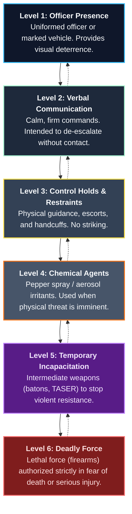

Policy directives must also cover:
* Conditions under which weapons may be issued and stored (weapons must be stored unloaded, separated from ammunition, and locked in secure, approved containers).
* Accountability and strict record-keeping for all firearms and ammunition.
* The absolute requirement for immediate aftercare and medical attention for any subject subjected to force.
* Requirements for notifying the insurance carrier of weapon deployment.

### 1.6 Uniforms and Equipment

#### 1.6.1 Uniforms

Most organizations supply security officers with uniforms and equipment. Doing so ensures that the uniforms are, in fact, uniform in appearance and properly fitted to each officer. 
* Complete seasonal uniforms, including inclement weather clothing, are usually issued.
* Consideration must be given to the type of duty performed and the laundry or dry-cleaning cycle when determining the number of uniforms issued.
* Many organizations have adopted the approach of making officers recognizable without appearing authoritarian. This is accomplished by having officers wear casual attire, such as plainclothes with shoulder or pocket patches, or blazers rather than military-style shirts.
* Company policy must address whether uniforms should be worn off duty, including travel to and from work. A policy allowing the uniform to be worn only when on duty precludes adverse publicity should an officer become involved in an incident on his or her own time.

As for equipment, an officer assigned to control access at a lobby desk may need minimal equipment, whereas an officer on roving patrol might require a flashlight, a means of communication, a defensive weapon, a notebook, and specialized keys.

#### 1.6.2 Body Worn Cameras

According to a survey released in August 2018 by the Police Executive Research Forum, more than 80 percent of U.S. police agencies were either using body cameras or had plans to do so in the near future, with 85 percent recommending them to others. Security organizations have similarly adopted this technology to increase accountability and provide evidence.

Before deploying body-worn cameras (BWCs), security managers must:
* Consult legal counsel and local law enforcement to determine local laws regarding privacy and audio/video filming.
* Establish clear protocols and procedures for when filming is mandated, how video is stored, and who is authorized to view it.
* Unambiguously define video retention schedules and secure access protocols to protect against data breaches.

#### 1.6.3 Handcuffs

Handcuffs are temporary restraint devices used to secure individuals who pose an active physical danger to themselves or others. Handcuffs are considered self-defense or control tools, not offensive weapons.
* Security officers must never be permitted to carry or utilize handcuffs unless they have received formal initial and recurring training on their safe application.
* Improper application of handcuffs can result in severe physical injury, nerve damage, or positional asphyxia, creating substantial civil liability for the organization.

#### 1.6.4 Other Equipment

Other essential security equipment typically includes:
* **Flashlights:** Heavy-duty, rechargeable LED flashlights for night patrols.
* **Communication Devices:** Two-way radios with earpieces, smartphones, or mobile data terminals.
* **Patrol Verification Systems:** Electronic tour management systems (wands or smartphones) to log checkpoints.
* **Duty Belts:** Ergonomic utility belts to distribute equipment weight evenly, reducing back strain.

---

### 1.7 Organizational Structure

A security force's organizational structure determines its chain of command, communications efficiency, and operational responsiveness.

#### 1.7.1 Vertical Model

The traditional **Vertical Model** is a highly structured, military-style hierarchical chain of command.
* **Structure:** Security Officer $\rightarrow$ Shift Supervisor $\rightarrow$ Operations Manager $\rightarrow$ Security Director $\rightarrow$ Executive Management.
* **Pros:** Clear lines of authority, defined responsibilities, and disciplined execution of orders.
* **Cons:** Slow communication, delayed decision-making, and limited adaptability to rapid, unexpected changes.

#### 1.7.2 Network Model

The modern **Network Model** is a decentralized, collaborative organizational structure.
* **Structure:** Flat hierarchy with multi-disciplinary, cross-functional teams communicating directly across organizational lines.
* **Pros:** Extremely fast communication, high adaptability, and rapid, localized decision-making.
* **Cons:** Risk of overlapping authority, potential confusion over decision-making accountability, and reliance on highly self-motivated personnel.

#### 1.7.3 Proprietary Versus Contract Officers

A fundamental strategic decision in guard force management is whether to deploy proprietary (in-house) officers, outsource to a contract security agency, or adopt a hybrid model.

| Dimension | Proprietary (In-House) Force | Contracted Security Force |
| :--- | :--- | :--- |
| **Control & Loyalty** | High. Officers are direct employees, deeply aligned with the company culture and values. | Lower. Officers are employees of the vendor and may rotate among different client sites. |
| **Cost & Benefits** | Higher. Involves direct employee benefits, payroll taxes, insurance, and administrative overhead. | Lower & Predictable. Standard hourly billing rate; administrative and benefits costs are borne by the vendor. |
| **Flexibility** | Low. Difficult to scale the force up or down quickly for special events or emergencies. | High. The vendor has a broad personnel pool to easily scale staffing levels on short notice. |
| **Liability** | Direct. The employing company bears sole liability for officer actions and errors. | Shared. Contract terms typically shift primary operational liability and indemnification to the vendor. |
| **Training Quality** | High & Site-Specific. Training is custom-tailored to the specific nuances of the facility. | Variable. Rely on vendor training standards, which may require supplemental site-specific instruction. |

##### Hybrid Models
Many mature organizations utilize a **hybrid model**:
* A core team of proprietary security managers, supervisors, and SOC operators control the security infrastructure and command decisions.
* A contracted guard force handles standard patrol posts, access control gates, and event staffing.
* *Success Factors:* Successful hybrid programs require building a unified work culture, establishing a definitive chain of command, and actively avoiding "us versus them" attitudes under one roof.

---

### 1.8 Legal Concerns

#### 1.8.1 Security Officer as Peace Officer

Security executives remain divided on the propriety of seeking **peace officer** or **deputized** status for security personnel.
* **Opponents** argue that peace officer status extends a security officer's authority beyond the company's property boundaries, exposing the employer to substantial third-party liability and civil lawsuits.
* **Proponents** note that deputization may be necessary for specific public-facing duties, such as traffic control on public streets, parking enforcement, or airport security.
* *Prudent Practice:* If deputization is pursued, the scope of the deputized authority must be strictly limited to the actual security officer duties. Additionally, local police chiefs may possess statutory authority to mobilize all deputized officers during public emergencies, potentially leaving the private facility unprotected.

#### 1.8.2 Insurance

Organizations bear probable civil liability for all actions of security officers on duty, though they cannot protect an officer from personal civil lawsuits or individual criminal charges.
* Plaintiffs will almost always sue the employing company (the "deep pocket") under the legal doctrine of *respondeat superior* (vicarious liability).
* Contract agreements with security vendors must strictly verify the existence, adequacy, and limits of the vendor’s liability insurance, including coverage for employee dishonesty, errors and omissions (E&O), and data breaches.
* The client company should maintain valid, current **Certificates of Insurance (COIs)** directly from the vendor's carrier, with an explicit written undertaking to notify the client immediately of any change or cancellation in coverage.

---

### 1.9 Scheduling and Managing the Security Force

Security personnel represent the largest segment of security employees and the largest single cost element in most security operating budgets. Their deployment must be guided by objective business criteria, including a thorough assessment of asset protection needs.

#### 1.9.1 Post Requirements & Staffing

A **security officer post** is defined as any location or combination of activities for which a trained human being is necessary. This definition incorporates three key concepts:
1. **Location or Activity:** May be stationary (lobby desk), roving (patrol post), or centralized (SOC).
2. **Necessary Human Being:** Requires unique human capabilities that cannot be easily automated, including:
   * Discriminating among complex, varying, and random events or circumstances.
   * Conducting face-to-face, rational dialogue to de-escalate conflicts.
   * Exercising professional judgment to determine a logical course of physical or mental action.
   * Utilizing physical force or restraints when legally justified.
   * Providing detailed, cognitive reporting.
3. **Training & Competence:** The possession of the necessary psychomotor, cognitive, and affective skills to perform duties effectively.

*Automation Alternatives:* If a post does not strictly require human judgment, it should be automated. For example, access control can be automated using "person-traps" (mantraps) with interlocking doors, card readers, intercoms, and remote CCTV monitoring.

##### Managing Post Hours and Schedules

* **Post Hours:** The hours a post operates must be determined by analyzing activity levels throughout a 24-hour, 7-day period. Charting activity helps security managers run posts cost-effectively (e.g., operating a gate only during peak business traffic hours).
* **Post Schedule:** Lists the exact shift hours a post is staffed.
* **Security Officer Schedule:** Developed to allocate personnel efficiently. For proprietary forces, schedules must be designed to avoid premium overtime pay under fair labor standards and wage-and-hour laws (which mandate overtime pay for work exceeding 40 hours a week).
* **Shift Rotation:** If shifts rotate, officers must be given sufficient consecutive days off (preferably three or more) to rest, preventing sleep deprivation, inattentiveness, and degraded cognitive function.

#### 1.9.2 Computerized or Automated Scheduling

Modern modular scheduling software dramatically simplifies guard force administration. 
* **Core Modules:** Automate shift scheduling, time and attendance, payroll, client billing, and overtime controls.
* **Access Control:** Employs secure, role-based authorization levels (read-only vs. administrative change authority).
* **Remote Access:** Provides employees with visibility to their schedules via smartphones and allows managers to monitor coverage remotely.

##### Database Components for Automated Scheduling:

1. **Work Site Requirements:**
   * Unique identification of each post (fixed, foot, mobile) and post number.
   * Start and stop times for each shift by day.
   * Staffing count required per shift.
   * Site-specific certification or training prerequisites.
2. **Personnel Database:**
   * Employee contact details and employee number.
   * Shift and overtime preferences.
   * Maximum weekly hour restrictions.
   * Skills inventory (specialized certifications, first aid, firearms, etc.).
   * Vacation schedules, sick leave history, and scheduled training days.
   * Specific posts from which the officer is excluded.

#### 1.9.3 Operational Scheduling Nuances

* **Proprietary Forces:** Schedules must factor in paid holidays and average historical sick leave (which typically spikes in winter). Unscheduled absences in proprietary forces are usually covered by overtime, which can be highly expensive for small guard forces and lead to officer fatigue.
* **Contracted Forces:** The scheduling burden shifts to the vendor. However, clients must ensure the vendor does not supply inexperienced relief guards who are unfamiliar with the facility's nuances. Vendors should periodically rotate relief guards to the site for occasional shifts to keep them familiar with the facility.
* **Meal Periods & Shift Overlaps:** Shifting schedules to include planned overlaps (e.g., overlapping shifts during plant shift changes) can maximize security presence. Meal periods must be logged precisely to verify an officer's location and status should an incident occur.

---

### 1.10 General Orders

General orders represent the enduring canons and bodies of principles that govern all protection officers, projecting a highly professional image and ensuring absolute vigilance.

Key General Orders include:
* **Vigilance and Fraternization:** Unnecessary conversation and fraternization with employees or the public while on duty are strictly prohibited. Officers must remain focused on active observation.
* **Professional Bearing:** Officers must maintain an exemplary professional or military bearing, wearing their uniforms neatly and displaying absolute professionalism in their deportment.
* **Duty Conduct:** Smoking and eating on duty are strictly prohibited. These activities must be conducted privately within designated break rooms.
* **Media Policy:** All statements to the media must be made exclusively by the designated organizational Public Information Officer (PIO) or media spokesperson. Security officers must never make public statements.
* **Diplomatic Enforcement:** Officers must enforce company regulations civilly and diplomatically, respecting individuals and employing authority only when necessary.
* **Uniform Integrity:** Uniforms and company-issued equipment must be worn and utilized strictly during authorized working hours.
* **Reporting Convictions:** Officers must immediately report any personal criminal convictions to their employer to comply with licensing laws.
* **Post Continuity:** Officers must remain at their assigned posts until properly relieved or explicitly directed by a supervisor. Posts must never be left unattended.
* **Shift Handover:** Departing officers must fully brief their oncoming relief on all active logs, daily intelligence, and temporary instructions.

---

### 1.11 Post Orders

Post orders are the most critical written instructions for the security force. They translate general security policies into site-specific action items.

#### Core Functions of Post Orders:
* Explicitly express the operating policies of the protected enterprise.
* Summarize the precise daily duties of the security officer.
* Eliminate the ambiguity and failures associated with verbal instructions.
* Establish a firm, objective basis for site-specific training and performance evaluations.

While post orders cannot anticipate every emergency, they represent an essential defense against liability when an officer is required to act in a crisis.

#### Guidelines for Writing Effective Post Orders:

* **Single-Subject Focus:** Each order must cover only one subject. This enables officers and supervisors to locate instructions rapidly during an incident and facilitates easy updating.
* **Conciseness:** Orders must be action-oriented and as brief as possible, stating clearly what must be done and when. Detailed explanations of *why* should be handled in training.
* **Plain Meaning & Clarity:** Written in simple, direct language devoid of ambiguous jargon. Reading time is inversely related to comprehension; thus, sentences must be short and direct.
* **Detailed Indexing:** To permit rapid lookup, post orders must be comprehensively indexed and cross-referenced under multiple alphabetical topics (e.g., "Snow removal, emergency" and "Emergency procedures, snow").
* **Accessibility:** Post orders must be physically available at every fixed post. Roving or vehicular patrols must carry copies in their vehicles or access secure electronic versions on company-issued mobile devices.
* **Single, Coordinated Control:** Security management must maintain a single, consistent set of instructions, ensuring no contradictory orders are in active circulation.

### Supervision

Shift supervisors train and direct shift officers, act as front-line managers, and are the key to employee mentoring, staff satisfaction, and reducing turnover. They lead teams responsible for responding to a wide variety of security and emergency situations. Shift supervisors must thoroughly understand the site’s requirements, management’s expectations, and their own role within the organization.

The overall quality of assets protection is a direct function of local training and local supervision.
* **On-the-Job Mentoring:** Training occurs when a supervisor actively observes the performance of an officer and provides immediate feedback when the officer appears unsure, confused, or handles a situation incorrectly.
* **Shift Briefings (Roll Call / Formations):** A common best practice is conducting a brief formation at the beginning and end of each shift. During these few minutes, the supervisor can explain a core security theme or review the details of a newly issued post order before officers deploy.
* **New Officer Onboarding:** pair new staff members with the supervisor or an experienced patrol officer for extended periods. A security operation's responsibilities do not decrease when a new employee is introduced; all tasks must still be completed.
* **Training Logs:** Maintain detailed training log sheets to track onboarding progress. These sheets break down site responsibilities into specific tasks, with both the trainer and trainee initialing each item as competence is demonstrated. These sheets also form the basis for pocket-sized checklists that patrol officers can carry.

#### Supervisor Post Visits

To ensure post orders are read and understood, supervisors should conduct regular, unscheduled post visits and perform the following:
1. **Targeted Questioning:** Ask one or more specific questions about new orders or emergency protocols.
2. **Direct Observation:** Observe the officer in an actual or simulated task involving the order's application.
3. **Hypothetical Drills:** Set up a brief hypothetical scenario requiring the officer to demonstrate a working knowledge of the order.

This procedure takes only a few minutes and should be a routine part of every supervisor's shift.

> [!IMPORTANT]
> **Mobile Supervision:** Shift supervisors must avoid staying in the command center or a fixed post for the majority of their shift. Doing so degrades overall officer performance and increases incidents. Using mobile radios, cell phones, and automated reporting systems, supervisors must remain highly mobile, making frequent, unscheduled visits to all posts. 
> * **Post Relief:** Where permitted, supervisors should occasionally provide post relief, staffing the post themselves while the officer is away. This provides the supervisor with the best possible insight into the actual operating conditions and challenges at that post.

Supervisors themselves require specialized training in management, human relations, interpersonal communication, labor and criminal laws, and emergency response. This training should be provided *prior* to promotion to the greatest extent possible and reinforced continuously.

##### Structured Performance Ratings
To solve the challenge of subjective salary reviews, supervisors should formally assess and record officer performance during every post visit. The standard assessment includes:
* **Professional Grooming:** Personal appearance and uniform condition of the officer.
* **Post Hygiene:** The physical cleanliness and order of the post.
* **Resource Readiness:** Availability and condition of all post equipment and post orders.
* **Competency Ratings:** The quality of the officer's responses to training questions, drills, and actual on-site incidents.

These ratings must be uploaded directly into the security management database, allowing the security manager to review performance trends and determine when additional counseling or training is required. Regular coaching—built on constructive, two-way communication—is critical to enfranchising officers, boosting engagement, and dramatically reducing turnover.

---

### 1.13 Security Officer Reports

Security officers are frequently described as the "eyes and ears" of management. However, critical information is often lost due to barriers in reporting:
* **Action-Oriented Profiles:** Individuals drawn to security are often action-oriented rather than write-oriented, finding narrative reporting tedious.
* **Lack of Feedback:** Officers stop reporting when they believe their logs are ignored or never acted upon.
* **Poor Form Design:** Unstructured report forms fail to guide officers in systematic fact processing.
* **Inadequate Infrastructure:** A lack of digital tools makes data capture slow and uncoordinated.

> [!TIP]
> **Action-Oriented Logging:** Security managers must train officers to move away from recording passive phrases like "Reported 0700. Nothing unusual. Relieved 1500." Instead, officers should record **what they did to make the area secure** (e.g., "Patrolled perimeter, checked 14 external doors, verified all locked and secure").

Post orders should mandate positive reporting for specific, routine occurrences, such as contractor escorts, key logs, and visitor sign-outs. Digital, searchable reporting systems should be utilized to make data transparent and searchable, showing clients and executive management the measurable value the security force delivers.

#### 1.13.1 Security Logs and Incident Management Systems

The **Security Log** is a contemporaneous, chronological record of all significant events affecting facility protection during a shift.

##### Automated Electronic Logs

Modern security operations utilize specialized **Incident Management Software** to automate and secure data entry:
* **Secure Authentication:** Officers log in with unique, secure credentials, automatically generating the date, time, and author metadata.
* **Write-Once Read-Many (WORM) Protocol:** Once an entry is submitted, it is assigned a unique, consecutive event number. The entry can be retrieved but **never edited or deleted** by the officer. Any necessary corrections must be submitted as a new, subsequent entry. This preserves the absolute legal integrity of the log.
* **Standardized Menus:** The use of standardized drop-down incident menus improves data consistency, making subsequent sorting and trend analysis highly efficient.
* **Real-Time Access:** Entries are instantly visible to supervisors and managers from both contract and proprietary sides of the organization.

##### Manual Security Logs

While manual logs are largely obsolete, some operations still utilize them. Manual logs generally fall into two categories:
1. **Control Log (Main Log):** The cumulative, consecutive history of all significant events across the entire facility for each shift.
2. **Post Log:** A localized record of activities specific to a single post (e.g., counting vehicles or logging visitors passing through a specific gate).

Manual entries must be written in ink, entered in consecutive chronological order, and must never be altered or erased. Corrections must be handled by submitting a new event entry under a separate number.

##### Standard Security Log Structure

Every log entry must follow a standardized format to ensure it remains useful for future audits and investigations:

| Entry # | Day | Hour | Category | Event Description | Reference |
| :--- | :--- | :--- | :--- | :--- | :--- |
| **036** | Mon | 0700 | **Weather** | 75°F, clear and bright. Light east winds. | None |
| **037** | Mon | 0815 | **Access Control** | Contractor "ABC Electric" (3 staff) signed in; escorted to Mech Room B. | Badge Log #142 |
| **038** | Mon | 0930 | **Maintenance** | West perimeter gate lock mechanism jammed. Reported to Facilities. | Work Order #882 |

#### 1.13.2 Management Use of Reports and Logs

Security logs and incident reports represent an invaluable resource for general facility management and legal counsel.

##### Evidentiary Admissibility in Legal Proceedings

Security logs are frequently admitted in court trials, arbitrations, and administrative hearings. Because they are recorded contemporaneously in the normal course of business, **they represent a recognized exception to the evidentiary rule against hearsay.**

> [!IMPORTANT]
> **Evidentiary Admissibility Criteria:**
> To qualify for admissibility in legal proceedings, a log or report must:
> 1. Be maintained regularly as part of the organization's standard operations.
> 2. Be recorded by a person as part of their official, regular duties.
> 3. Record an event of which the author had direct, personal knowledge (or which was reported to the author by someone with personal knowledge and an official duty to report it).

##### Data Capture, Trend Analysis, and Management Advocacy

* **Trend Analysis:** Automated logs allow security managers to capture data over time, running trend analyses to detect security anomalies (e.g., spikes in access control alarms at a specific door on Friday nights). Security protocols can then be proactively adjusted.
* **Performance Justification:** Compiled logs provide concrete, quantifiable metrics to justify the security department's budget and demonstrate return on investment (ROI) to executive leadership.
* **Preventing Reporting complacency:** A major source of officer dissatisfaction is management's failure to read or act on reports. If an officer repeatedly reports a maintenance hazard (e.g., a broken emergency exit light) and it remains unaddressed, the officer will become complacent and stop reporting, degrading the overall security posture. Security managers must review logs daily and arrange for prompt corrective action.

---

### 1.14 Enhancing Security Officer Job Performance

Efficient security performance is critical from both a fiscal and human resources perspective. Security officers often work in isolation, face little direct supervision, deal with volatile human behaviors, and are expected to take personal risks that other employees are instructed to avoid. Management must take deliberate, scientifically grounded steps to optimize officer performance.

#### 1.14.1 Vigilant Performance and Attention Lapses

The term **vigilant performance** has a highly specific significance in security operations and is defined across three domains:

* **Lexical Definition:** Keen attention to detect danger; wariness.
* **Physiological Definition:** The global responsiveness of the central nervous system to internal and external (sensory) stimuli.
* **Psychological Definition:** The specific function of the central nervous system that enables an individual to respond effectively to the infrequent and uncertain occurrence of low-intensity stimuli in a monotonous environment.

##### Vigilance Fatigue

> [!WARNING]
> **The Science of Vigilance Fatigue:**
> Vigilance fatigue occurs when cognitive resources become depleted during a task. When an officer is placed in a highly monotonous environment (such as watching static video monitors for hours with no activity), the brain's alertness levels drop rapidly. Research shows that letting the mind wander occasionally—engaging the brain's **default mode network (DMN)**—helps restore blood flow and cognitive resources, allowing the officer to return to the task with renewed focus.

##### NIOSH Stress Indicators
Studies by the National Institute for Occupational Safety and Health (NIOSH) highlight that security officer positions are highly vulnerable to stress and performance failures due to:
* Low utilization of personal abilities.
* Minimal participation in organizational decisions.
* Low task complexity and high monotony.
* Restricted opportunities for career advancement.
* Minimal social support.

##### Key Elements Influencing Vigilance:
* **Work Area Design:** Comfortable space, proper seating, ergonomic desk heights, and robust temperature controls. An officer in an unconditioned guard shack is distracted by keeping warm or cool rather than maintaining vigilance.
* **Task and Human Engineering:** Ensuring automated systems and software interfaces are intuitively designed.
* **Sensory Acuity:** Ensuring officers possess the necessary visual and auditory health to observe the environment.
* **Detection & Recognition:** Reviewing expected threat scenarios frequently to keep officers' recognition skills active.
* **Detailed Job Analysis:** Systematically aligning the officer's personality traits (e.g., matching introverts to sedentary, monotonous monitoring roles and extroverts to roving patrol roles) with the job's demands.
* **Departmental & Corporate Culture:** Aligning expectations and avoiding contradictory messages, especially in hybrid forces.
* **Management Advocacy:** Demonstrating that leadership values and advocates for the guard force to maintain morale and prevent complacency.

##### Automation and Human Monitoring Challenges

Industry research reports (*Fatigue Effects and Countermeasures in 24/7 Security Operations*) highlights that placing humans in purely passive monitoring roles is highly ineffective. Automated systems introduce distinct performance challenges:
* **Attention Lapses:** Operator's cognitive load increases during monitoring, causing attention to drift.
* **High Responsibility with Low Activity:** Extreme stress of knowing they are responsible for an emergency, but having absolutely nothing to do for 99% of the shift.
* **Skill Degradation:** A loss of manual proficiency and direct situational awareness ("out-of-the-loop" syndrome).
* **The "Cry Wolf" Syndrome:** High false alarm rates cause operators to ignore alerts or disable sirens, rendering system alarm detection rates close to zero.
* **Ergonomic Display Failures:** Inadequate monitors that do not support long-term sensory focus.

##### Fatigue Countermeasures

To combat decreased vigilance and the biological challenges of nighttime shift work (with acute and chronic fatigue causing circadian rhythm dips at **0300** and **1500**), management should implement:
* **Schedule Optimization:** Allowing at least two full nights of unrestricted sleep between shift rotations and limiting consecutive workdays.
* **Environmental Controls:** Increasing illumination levels in command centers during evening hours and keeping the workspace cool to promote alertness.
* **Ergonomic Booth Design:** Ensuring perimeter guard booths feature large, clear lines of sight, robust ventilation, and ergonomic layouts.
* **Active Countermeasures:** Scheduling periodic patrols, shift rotations, regular check-ins, and where culturally feasible, considering structured, scheduled nap periods to restore cognitive function.

---

### 1.14.2 Behavioral Theories in Guard Force Management

Security managers must understand fundamental behavioral science and motivational theories to keep officers engaged, high-performing, and committed:

#### 1.   Abraham Maslow: Hierarchy of Needs

Maslow postured that human motivation is structured as a hierarchy of needs. Once a lower-level need is satisfied, it ceases to act as a motivator, and the individual seeks to satisfy the next level:

* **Physiological Needs:** Basic survival requirements (food, water, shelter, adequate sleep, and climate-controlled workspaces).
* **Safety and Security:** Economic stability, job security, physical safety on duty, and clear emergency protocols.
* **Social and Affiliation:** The human desire to feel accepted, valued, and part of a cohesive team or shift.
* **Ego and Esteem:** Direct recognition of achievement, status, self-confidence, and respect from peers and management.
* **Self-Actualization (Self-Fulfillment):** The drive to achieve one's full professional potential, supported by career advancement opportunities.

#### 2.   Frederick Herzberg: Motivation-Hygiene Theory

Herzberg divided workplace factors into two distinct categories:
* **Hygiene Factors (Dissatisfiers):** Elements like basic salary, company policies, physical working conditions, and supervisor relationships. If these are poor, employees are highly dissatisfied. However, improving them past a baseline does not *motivate* employees—it merely prevents dissatisfaction.
* **Motivators (Satisfiers):** Elements like achievement, recognition, responsibility, growth, and the nature of the work itself. True job satisfaction and high vigilant performance are only achieved by building motivators into the security role.

#### 3.   Douglas McGregor: Theory X and Theory Y

McGregor defined two opposing managerial assumptions regarding worker motivation:
* **Theory X (Authoritarian):** Assumes that employees inherently dislike work, are lazy, and must be closely monitored, directed, and threatened with discipline to perform.
* **Theory Y (Collaborative):** Assumes that employees are self-motivated, seek responsibility, and take pride in their work when given the proper tools, clear goals, and mutual trust. 
* *Application:* Security managers should adopt Theory Y assumptions, treating security officers as valued professionals, which enfranchises them and drastically improves performance and retention.

#### 4.   Chris Argyris: Personality and Organization

Argyris postured that traditional, highly bureaucratic organizations treat employees like children—demanding absolute passivity, dependence, and submissiveness. This creates a fundamental conflict with healthy, mature adult personalities:
* In response, mature employees either become aggressive, leave the company, or sink into complete apathy and complacency.
* *Application:* In a security guard setting, managers must design roles that allow officers to exercise personal responsibility, participate in localized decisions, and demonstrate professional maturity to ensure alert and vigilant performance.

#### 1.14.3 Work Environment

Security officers operate in a wide variety of work environments under rapidly changing conditions. Modern officers utilize complex automated systems, such as visitor databases, Geographic Information Systems (GIS), and mobile communication networks. Posts range from sedentary monitoring stations to active foot or vehicle patrols, all sharing common environmental stress factors that must be carefully managed.

##### 1.  Mechanical and System Monitoring Environment

SOCs and centralized monitoring hubs are complex, high-activity environments. Security staff are often responsible for monitoring a broad range of integrated systems:
* **Video Surveillance Systems:**watching television monitors is a highly passive, almost hypnotic activity. Conversely, actively observing 20+ screens is stressful. Systems should sequentialize camera feeds to reduce monitor load and utilize **Video Motion Detection (VMD)** analytics to alert officers to activity. Staff must be rotated regularly out of video monitoring tasks to prevent vigilance degradation.
* **Access Control Systems:** Must be designed to ensure alarm events can be verified immediately; if officers cannot confirm alarms, they will learn to ignore them.
* **Life Safety Systems:** Fire alarm systems must be diligently maintained. False or nuisance alarms desensitize both officers and employees, causing them to ignore potential danger.
* **Internet of Things (IoT) Integration:** While modern smart systems provide excellent remote diagnostic capabilities, security officers should not be tasked with passive building management monitoring (elevators, HVAC, lighting) without comprehensive training. Overloading officers with secondary technical monitoring degrades their core security vigilance.

##### 2.  Physical Environment & Ergonomic Stressors

Security work involves significant physical stressors that can degrade performance if left unmanaged:
* **Foot Patrols:** Roving foot patrols are physically demanding. Skipping checkpoints is a common performance failure, often caused by physical fatigue or an overreliance on electronic intrusion systems (the false belief that human patrol is redundant).
* **Vehicular Patrols:** Involve constant boarding, starting, and exiting of vehicles, frequently in dark conditions that lead to slip-and-fall injuries. The enclosure of a vehicle cabin also restricts the officer's field of vision and eliminates the use of hearing.
* **Ergonomics & Climate:** Perimeter guard booths and shacks must be physically designed to maximize visibility and hearing. Booths must feature robust heating, cooling, and air circulation. Officers subjected to extreme heat or cold will concentrate on their personal comfort rather than maintaining vigilance.

###### Figure 1.4: Physical Demand Inventory for Security Officer Positions
To establish fair, non-discriminatory pre-employment physical screening (complying with the **Americans with Disabilities Act (ADA)**), security managers should analyze posts using a standardized physical inventory:
* **Mobility:** Requirements for prolonged standing, walking on level or uneven surfaces, and climbing stairs/ladders.
* **Lifting Capacity:** Specific weight thresholds required for moving emergency equipment or barricades.
* **Sensory Acuity:** Clear visual acuity (including sun-glare tolerance and night vision) and full auditory performance.
* **Fine Motor Skills:** Hand-eye coordination for radio operations, handcuffs, and system controls.

---

### 1.15 The Human Environment & Personnel Selection

Because of the diverse duties security officers perform, matching the individual’s personality traits, cognitive skills, and temperament to the post is critical to preventing performance failures.

#### 1.7.4 Personality Inventories and Assessments

Many modern organizations utilize structured personality assessments to evaluate job candidates and help employees understand their learning and communication styles.

##### 1.  The Myers-Briggs Type Indicator (MBTI)
The MBTI evaluates individuals across four primary sets of mental preferences:
* **Sensing (S) vs. Intuition (N):** *Sensing* types prefer clear, tangible, factual data grounded in direct experience. *Intuitive* types are drawn to conceptual, abstract, big-picture ideas and imaginative future possibilities.
* **Thinking (T) vs. Feeling (F):** *Thinking* types make decisions objectively, logically, and analytically, prioritizing tasks and results. *Feeling* types make decisions in a visceral, value-oriented way, prioritizing harmony, collaboration, and the impact on people.
* **Extroversion (E) vs. Introversion (I):** *Extroverts* derive energy from external interactions, groups, and rapid action. *Introverts* recharge through internal reflection, thoughts, and quiet focus.
* **Judging (J) vs. Perceiving (P):** Governs how individuals organize their outer lives, seeking structured closure versus open-ended flexibility.

##### 2.  The Big Five Personality Model
This scientifically validated model categorizes human personality traits into five core dimensions:
1. **Surgency (Dominance/Leadership):** Measures extroversion, self-confidence, and the desire to influence others. High-surgency individuals prefer leadership roles; low-surgency individuals are cooperative followers.
2. **Agreeableness:** Measures the capacity to get along with others, ranging from warm, compassinate, and friendly to cold, distant, and unsociable.
3. **Adjustment (Emotional Stability):** Measures resilience under pressure. High adjustment indicates a calm, secure, and relaxed demeanor; low adjustment indicates nervousness, insecurity, and poor performance in crises.
4. **Conscientiousness:** Measures dependability and achievement drive. High conscientiousness reflects credibility, responsibility, organization, and a willingness to work hard to achieve goals.
5. **Openness to Experience:** Measures curiosity, willingness to change, and receptivity to new ideas or procedures.

---

### 1.16 Personal Communication, Training, and Supervision

Even the most complete written post orders will fail unless reinforced through active, two-way personal communication and consistent training.

#### Key Supervisory Guidelines for Effective Training:
* **Base Training on Needs:** Supervisors must actively identify specific knowledge gaps and correct them immediately with targeted instruction.
* **Recognize Individual Learning Rates:** Training must establish standardized performance expectations while recognizing that individual learning rates vary based on aptitudes, interests, and background.
* **Maximize Motivation:** Motivate staff through constructive praise, direct recognition, clear incentives, and lead by positive example.
* **Take the Learner’s Viewpoint:** Supervisors must put themselves in the trainee's shoes, explaining concepts from their perspective and asking what they need to learn.
* **Provide Timely Feedback:** Give systematic, constructive progress reports to accelerate the learning curve.
* **Reinforce with Active Follow-Up:** Use repetition, summaries, and post-briefings to solidify retained knowledge.

#### Job Performance Appraisals and Random Testing

* **Formal Performance Appraisals:** Conducted at least once per year, with a formal mid-year review. Appraisals must measure task performance, on-the-job behavior, and compliance with general orders.
* **Random Testing (Test/Post-Test Routine):** To ensure skills do not degrade over time, supervisors should conduct simple, random drills:
  * *Example (Figure 1.5):* A supervisor triggers a silent test alarm, measures the officer's transmission and response time against the SOC system log, and discusses the results with the officer before the end of the shift to reinforce correct behavior.

---

### 1.17 Serious Misconduct & Disciplinary Policies

Security managers must enforce a zero-tolerance policy for serious misconduct, especially when officers are equipped with weapons:
* Weapon safety violations or negligent discharges.
* Use of excessive or unreasonable force.
* Unjustified post abandonment (leaving a post without an authorized relief).
* Criminal conduct on duty (fraud, theft, unauthorized searches).
* Reporting to work under the influence of drugs or alcohol.

Deliberate acts of misconduct can expose both the officer and the organization to severe civil lawsuits for intentional torts. Where collective bargaining agreements or union contracts exist, a highly transparent, written progressive disciplinary policy is essential to sustain "just-cause" terminations.

#### 1.18 Augmenting Manned Guarding with Robotics

Modern security operations increasingly integrate robotic systems as force multipliers, automating repetitive tasks so human assets can focus on complex, cognitive decision-making.

##### Robotic System Classification:
1. **Unmanned Aerial Vehicles (UAVs / Drones):** Ideal for rapid aerial reconnaissance, fence line monitoring, and wide-area search operations.
2. **Unmanned Ground Vehicles (UGVs):** Roving wheeled or treaded land units designed to patrol perimeters, parking yards, and warehouse interiors.
3. **Unmanned Surface Vehicles (USVs):** Watercraft units designed to monitor docks, port facilities, and waterfront perimeters.

Robotic systems can operate via **remote control** (human pilot) or **autonomous guidance** (self-guiding GPS and LIDAR paths). The organizational decision to utilize autonomous systems must carefully balance operational cost savings with the legal and safety liabilities should system autonomy fail and cause damage or injury.

##### Manned Guarding Integration & Visibility
 Roving robots equipped with video analytics and chemical/radiological sensors serve as excellent visible deterrents. Their "cool factor" naturally increases public awareness of the security program, making them highly effective force multipliers. Indoor robots are frequently integrated alongside physical guards, with pre-programmed audio prompts (e.g., "System warning: security dispatch notified") to manage low-level incidents.

---

### 1.19 Conclusion

Uniformed security forces remain a cornerstone of modern assets protection. Achieving a high-performing, vigilant force requires a deliberate investment in professional selection, rigorous site-specific training, active mobile supervision, and clear, supportive corporate policies. By leveraging modern technology and robotics, security managers can build highly resilient, cost-effective, and proactive protection operations.

---

### APPENDIX 1A: Sample Disciplinary Policy

#### I. Policy Statement
XYZ Company operates in a highly competitive, professional business environment where dependable performance, absolute honesty, and reliability are of paramount importance. 

We maintain the highest standards of conduct and expect all employees to show respect for the rights, interests, and standards of the employer, our clients, and fellow officers. We view disciplinary action not as a form of punishment, but as a constructive tool to facilitate improved performance through corrective counseling, up to the point where an infraction constitutes willful misconduct as defined below.

#### II. Disciplinary Criteria and Procedures
A. **Factors in Disciplinary Action:** When determining the appropriate level of corrective or disciplinary action, management will evaluate:
1. The overall seriousness of the infraction.
2. The direct or potential harm caused to the employer or client.
3. The presence of any mitigating or aggravating circumstances.
4. The employee’s general attitude and receptivity to feedback.
5. The employee's past performance and disciplinary history.
6. Precedent in similar historical cases within the company.
7. The overall welfare and safety of the organization and its personnel.

B. **Forms of Discipline:** Corrective action may progress through the following levels:
1. Oral Reprimand (documented).
2. Written Warning.
3. Unsatisfactory Performance Appraisal.
4. Corrective Probation.
5. Suspension without pay.
6. Demotion or permanent re-assignment.
7. Immediate Discharge for Willful Misconduct.

*Administrative Authority:* Disciplinary hearings and severe corrective actions will always be conducted by a disciplinary committee consisting of two or more members of Company executive management.

C. **The Role of the Supervisor:**
1. Maintain thorough knowledge and understanding of all Company policies and guidelines.
2. Promptly document and report all infractions by completing an *Employee Warning Notice* and submitting it to executive management.
3. Conduct preliminary factual investigations into observed or reported violations.
4. Provide formal recommendations to management regarding appropriate corrective measures.
5. Take minor, emergency corrective actions to manage immediate risks (e.g., sending an officer home who reports under the influence, or documenting an out-of-uniform officer).

#### III. Willful Misconduct and State Regulations
Discharge for **willful misconduct** complies strictly with state regulations and is defined as:
* Willful or wanton disregard of the rights, title, and interests of the employer or fellow employees.
* Deliberate violations or disregard of standard behaviors which the employer has a reasonable right to expect.
* Recurrent carelessness or negligence of such a degree as to show substantial disregard of the employer's interests.

##### Grounds for Immediate Disciplinary Action Up To and Including Termination:
1. Excessive, unexcused tardiness or absenteeism.
2. Sleeping on post.
3. Dishonesty, fraud, or deliberate falsification of Company, licensing, or client records.
4. Watching TV, reading non-work materials, or unauthorized personal cell phone use on duty.
5. Engaging in unauthorized social media or political activism while on company time or devices.
6. Accepting unauthorized money, gifts, or gratuities from clients, vendors, or the public.
7. Discourtesy, verbal abuse, or physical altercations with visitors, clients, or employees.
8. Bringing unauthorized animals onto a job site.
9. Visiting job sites or client locations while off duty without management permission.
10. Wearing an improper, incomplete, or dirty uniform.
11. Permitting unauthorized friends, guests, or relatives to visit a job site.
12. Utilizing company-owned patrol vehicles for personal use without written authorization.
13. Confronting clients with internal company issues or personal grievances.
14. Reporting to work under the influence of, or consuming/selling, alcohol or controlled substances on duty.
15. Insubordination: Deliberate refusal to comply with the lawful directions of a supervisor or manager.
16. Negligence or failure to carry out assigned protection duties conscientiously.
17. Failure to maintain an active, valid security officer license in possession while on duty.
18. Negligent damage to Company-owned or client property.
19. Unauthorized conversion of Company or client assets for personal use.
20. Failure to enforce client rules firmly, fairly, and consistently.
21. Unauthorized use of client equipment, supplies, databases, or phones.
22. Smoking or eating in non-designated or public-facing areas.
23. Violations of Post Orders or specific client operating directives.
24. Giving false testimony during a company or legal proceeding.
25. Refusal to cooperate in a criminal or Company investigation.
26. Carrying unauthorized weapons on Company or client property.
27. Conspiracy to commit a crime or permitting unauthorized entry.
28. Unauthorized release of confidential proprietary information.
29. Misuse, theft, or unauthorized extraction of Company or client data.
30. Engaging in unsafe practices or violating established safety rules.
31. Failure to submit correct, timely reports, logs, and time sheets.
32. Engaging in unprofessional conduct that jeopardizes the reputation or integrity of the Company.
33. Use of excessive or unauthorized physical force.
34. Abandoning an assigned post prior to being properly relieved by authorized personnel.
35. Repeated minor misconduct following previous warnings.
36. Violation of any state, local, or federal laws.
37. Working for a competing contract security company.

#### IV. The "Fundamental Fairness" Appraisal Check
To ensure absolute equity and legally defensible discipline, the management committee must answer the following questions before issuing severe disciplinary measures:
1. **Necessity:** Is the rule reasonable, necessary, and clearly aligned with business and client interests?
2. **Expectation:** Does the rule relate directly to performance the company has a right to expect of any employee?
3. **Communication:** Has the rule been clearly communicated and distributed to all employees?
4. **Consistency:** Has the rule been consistently and uniformly enforced throughout the organization?
5. **Investigation:** Was a thorough, unbiased investigation conducted, proving a preponderance of evidence?
6. **Mitigation:** Were there any extenuating or mitigating circumstances (e.g., degree of deliberateness)?
7. **Attitude:** What is the employee's attitude regarding the offense?
8. **Proportionality:** Is the proposed disciplinary action proportional to the severity of the infraction?
9. **Record:** What is the employee's length of service and past performance record?

---

### APPENDIX 1B: Company Fact Sheet on Employee Discipline

All successful organizations—including corporate enterprises and public agencies—must enforce clear, consistent rules to achieve their goals. This is of paramount importance in security operations, where organizational order, public safety, and respect for client interests represent the keys to success. Our objective is to maintain a fully professional, safe, and highly satisfying workplace.

Our primary focus is on **employee development**, ensuring you are equipped with the training and resources to succeed. Discipline is never used as a first-line punishment; it is applied strictly when an employee has been given a genuine opportunity to succeed and intentionally chooses to violate work rules or instructions.

#### Progressive Disciplinary Actions
For standard infractions, the company follows a progressive path:
1. Documented Verbal Corrective Counseling.
2. Written Corrective Warning.
3. Structured Remedial Training.
4. Corrective Probation.
5. Suspension without pay.
6. Demotion or final warning.

#### Non-Negotiable Infractions
Certain severe violations cause irreparable harm to the company’s business and client relationships and will result in **immediate termination** without progressive steps:
* Violations of federal, state, or local laws on duty.
* Dishonesty, theft, or falsification of logs and company records.
* Extreme negligence resulting in physical injury to others.
* Post abandonment (leaving a post without an authorized relief).
* Sleeping on post.
* No-call, no-show shift absences.
* Repeated unexcused absences or lateness.
* Willful, deliberate refusal to follow post orders or direct supervisor instructions.

We are fully invested in your development as a premier security professional. We expect your best effort and strict adherence to these professional standards. If you have any questions, always ask your supervisor—proactive communication is the key to mutual success.

Please acknowledge your understanding and agreement with this disciplinary policy by signing below:

_________________________________________       __________________
Employee Signature                              Date

_________________________________________
Witness Signature

---

## Chapter 2: Training the Security Officer

Training is a foundational pillar of operational success in any security environment. Personnel cannot be reasonably expected to perform complex protection duties without continuous, structured education and training. Indeed, an increasingly vital function of a modern security department is to serve as an internal training and education hub, elevating the professional standard of the entire enterprise.

The complex and multifaceted roles of contemporary security officers require a substantial commitment to training at both the pre-assignment and on-the-job phases of the employment relationship. Security managers are continuously challenged to find cost-effective, high-impact methods to ensure their personnel are adequately trained. This chapter provides a comprehensive, structured framework for meeting this challenge.

### 2.1 Key Training Concepts

To design and implement a successful training program, security managers must operate with persistence, humility, empathy, and creativity. Applying adult learning concepts correctly is the key to effective instructional design. While an in-depth treatment of educational psychology and andragogy is beyond the scope of this manual, security professionals charged with training responsibilities must engage in continuous study to ensure their programs reflect modern pedagogical standards.

> [!TIP]
> **Organizational Value:** A highly developed security training program can position the security department as a valuable service provider to the broader organization. For example:
> * In healthcare settings, security trainers can provide certified **Nonviolent Crisis Intervention (NVCI)** or aggression management training to nursing and clinical staff.
> * In hospitality environments, security departments can administer **Training for Intervention Procedures (TIPS)** certification to restaurant and beverage-service employees, reducing organizational liability and enhancing safety.

#### 2.1.1 The Dimensions of Learning

Learning represents a positive, lasting change in an individual's knowledge, skills, abilities, or perspective. Crucially, individuals possess diverse learning styles (visual, auditory, reading-focused, or kinesthetic/active). Furthermore, learning perspectives evolve throughout an officer's career; a seasoned supervisor views operational challenges differently than a novice recruit, and academic education must be balanced with practical, street-level experience to maximize effectiveness. 

Instructional design must utilize a variety of delivery methods to address these varying styles. Learning within security training is categorized into three primary domains:

* **Cognitive Learning (Knowledge-Based):** Grasping the intellectual, theoretical aspects of security operations and applying this theory to solve practical problems. Cognitive learning requires deep conceptual explanation. Traditional lectures or video instructions should always be reinforced with active learning techniques, including diagnostic pre-tests, structured study questions, challenging post-tests, and active supervisory reviews.
* **Affective Learning (Attitudinal and Perceptual):** Shaping how an officer perceives, values, and reacts to different environments and challenges. This domain is critical for topics such as cultural diversity, interacting with individuals with disabilities, compliance with safety policies, and understanding the adversary's intelligence-gathering methods. Effective asset protection relies on appreciating the impact of loss on an enterprise, and securing personnel against physical threats requires a realistic grasp of the speed, psychology, and indicators of assaultive behavior. Affective learning must be integrated seamlessly within cognitive and physical training programs.
* **Psychomotor Learning (Physical and Technical Skills):** Developing hands-on physical proficiency and muscle memory. This covers equipment operation, defensive tactics, handcuffing, physical searches, defensive driving, first aid/CPR, and fire extinguisher deployment. Psychomotor development demands regular, hands-on practice, repetition, and systematic refresher courses. Security managers must research the scientifically established degradation rates for specific physical skills (e.g., firearms proficiency or defensive tactics) and schedule refresher training accordingly.

##### Retention and Transfer of Learning

* **Retention** refers to the volume of training that remains with the learner over time. Reiteration and active participation—such as having the student execute a physical task while explaining the steps—facilitates the highest levels of retention.
* **Transfer** represents the direct application of classroom-acquired knowledge, skills, and abilities to the actual job environment. Training modules must be designed to reflect real-world post conditions to ensure seamless transfer.

#### 2.1.2 Socialization in the Security Force

Socialization is the process by which an employee learns and adopts the values, norms, and culture of the workplace. 
* **Formal Socialization:** Orchestrated through formal pre-assignment training, onboarding, and direct supervision. Management must ensure a consistent, professional message is delivered across all formal channels.
* **Informal Socialization:** Occurs organically through peer groups and veteran officers on the shift. Because informal peer socialization is often a stronger influence than formal training, managers must actively monitor the cultural environment to prevent the spread of negative, cynical, or complacent attitudes that undermine professional standards.

#### 2.1.3 Education, Training, and Development

The professional capability of a security officer is built upon three distinct but mutually supportive pillars:

> [!IMPORTANT]
> **The Professional Development Formula:**
> $$\text{Education} + \text{Training} + \text{Guided Experience} = \text{Development}$$
> * **Education** answers the **"Why."** It broadens cognitive and affective perspectives, providing the conceptual foundation that makes subsequent training easier to absorb.
> * **Training** answers the **"How."** It is the structured process of acquiring the specific, hands-on skills needed to execute daily and emergency tasks.
> * **Guided Experience** represents the **"Application."** Under active supervisory coaching and mentoring, experience ensures that academic and practical training are correctly applied, preventing the repetition of costly mistakes.

* **Development** is the culmination of these three elements. It is the process of grooming a competent employee into an outstanding professional, enhancing problem-solving capabilities, and preparing officers for advanced promotional opportunities and new organizational challenges. Cross-training officers is a critical component of professional development, building organizational flexibility and ensuring seamless coverage during emergency staffing shortages.

---

### 2.2 Benefits of Training

Although comprehensive training requires a direct financial investment, the long-term return on investment (ROI) is substantial. Security managers must calculate both the direct expenditures and the strategic benefits of training to justify budgets:

* **Improved Job Performance:** Training instills absolute proficiency in executing security tasks. Without structured training, managers cannot realistically expect high-quality performance.
* **Ease of Supervision:** Well-trained officers require far less direct, tactical supervision. This frees security managers to focus on strategic planning and asset protection program design rather than correcting basic performance errors. Additionally, progressive organizations utilize targeted training as a positive remedial tool to correct performance issues, rather than relying solely on punitive discipline.
* **Procedure Review:** The rigorous job task analysis required to design a training program naturally exposes flaws in existing operating procedures. Re-engineering training and operating procedures in tandem ensures maximum operational efficiency.
* **Staff Motivation:** Quality training increases self-worth, job satisfaction, and pride in the organization. When officers know what is expected of them, their performance improves, and other employees and visitors see them as professionals. Creating a professional identity within the ranks of security officers leads to a more professional approach to job performance.
* **Reduced Turnover:** High officer turnover is a classic industry challenge. Artful training mitigates turnover by reducing the anxiety and stress associated with confronting novel, high-stress situations. Documented programs—such as Wackenhut's historical supervisor-as-trainer initiative—have demonstrated that investing in supervisory training yields a massive, multi-year reduction in front-line turnover. Training certifications, uniform pins, and structured promotions provide clear paths for recognition and advancement, which are powerful drivers of retention.
* **Legal Protection:** A documented failure to train security officers is a major source of civil liability. To defend against claims of negligent hiring, training, retention, or supervision, managers must maintain meticulous, legally defensible training records:
  * Signed attendance rosters and lesson plans for every class.
  * Test papers signed and dated by both the trainee and the instructor.
  * A centralized, tamper-proof database of all training records.
  * Standardized on-the-job training checklists and performance appraisals.
  * Structured refresher training to negate claims of obsolete or decayed skills.

---

### 2.3 Identifying Training Needs

Before designing any instructional course, security managers must perform a formal training needs assessment. This assessment draws upon several key inputs:

* **Legal and Regulatory Mandates:** Identify all national, regional, and local licensing requirements (e.g., state guard card rules, the Canadian General Standards Board standard *CAN/CGSB-133.1-2017*, or union collective bargaining agreements).
* **Industry Standards and Guidelines:** Align program topics with authoritative industry benchmarks, such as recognized private security officer selection and training guidelines.
* **Insurance Carrier Requirements:** Review underwriting guidelines, which frequently mandate specific training levels for high-risk operations (e.g., firearms, use of force, or driver safety).
* **Community and Peer Benchmarking:** Analyze training standards at adjacent or similar facilities in the geographic area to identify common local practices and ensure competitive competency.
* **Operational Performance Data:** Dissect after-action reports, incident logs, and performance appraisals to identify recurring tactical errors or knowledge gaps.
* **Job Task Analysis (JTA):** Survey line officers directly, asking them to identify and rank the training topics they feel are most critical. Involving officers in the design process builds trust, validates their worth, and increases engagement in the training program.

---

### 2.4 Training Program Assessment and Design

To build a legally defensible and operationally sound program, managers must address four critical design questions:

1. **Is training the correct solution to the problem?** Training should be deployed exclusively to resolve documented gaps in knowledge, skills, or physical abilities. It is a wasteful misuse of resources to use training to compensate for non-training issues, such as poor job design, obsolete equipment, low wages, or systemic morale problems.
2. **How will the program be funded?** Calculate the direct costs of instruction and contrast them with the long-term liabilities of non-action (such as litigation, asset loss, and high turnover costs). As the classic saying goes: *"If you think education is expensive, try ignorance."*
3. **What is the completion timeline?** If training must occur immediately, purchasing off-the-shelf programs or contracting with external training resources is recommended. If a two-year window exists, developing internal training capabilities is highly viable. Managers must avoid rushing the launch of complex training, which typically results in cost overruns and scheduling conflicts.
4. **Who is the target audience?** Tailor content carefully between basic, pre-assignment training for new recruits and advanced, continuous education for seasoned veterans.

#### 2.4.1 Andragogy (Adult Learning) and Credibility

> [!WARNING]
> **Andragogical Principles:** Security training must align with Malcolm Knowles's principles of adult learning, recognizing that:
> * Adults are self-directed and seek active participation in their learning.
> * Instruction must be task-oriented rather than memory-oriented.
> * Mandating repetitive, low-value training simply as a condition of employment undermines the credibility of the program and breeds resentment.
> * Licensing mandates represent only the absolute bare minimum standard of compliance; relying solely on state-mandated minimums does not guarantee professional competence.

#### 2.4.2 Writing Behavioral Objectives

Every training program must be guided by clear, written behavioral objectives. A complete behavioral objective must contain three components:
1. **The Task:** A clear, measurable action verb (e.g., *identify*, *search*, *transmit*).
2. **The Conditions:** The specific environment or tools provided (e.g., *using a vehicle inspection mirror*, *given a photograph*).
3. **The Criteria:** The minimum acceptable standard of performance (e.g., *with 100 percent accuracy*, *within 45 seconds*).

* **Draft Objective:** "Conduct vehicle searches."
* **High-Fidelity Behavioral Objective:** "Given an under-carriage inspection mirror and a standard passenger sedan, the trainee will locate all hidden training aids within five minutes, with 100 percent accuracy."

#### 2.4.3 Instructional Design and Outsourcing

Developing high-quality instructional modules requires specialized expertise and significant time. Security managers must evaluate whether to appoint an internal training director, build a multidisciplinary training team, purchase off-the-shelf courses, or outsource instructions to external consultants:

* **Internal Trainers:** Possess deep, institutional knowledge of the organization’s culture and specific post layouts, but may lack formal training in instructional design, modern testing methodologies, or recent legal decisions.
* **External Consultants:** Offer advanced instructional design skills, broad networks of expert resources, and an objective, external perspective. They are particularly valuable for designing high-risk, high-liability training topics (such as use of force, active shooter response, or crisis management). Ensure external instructors are fully credentialed, experienced in real-world applications, and capable of serving as persuasive expert witnesses in court if the organization's training is challenged.
* **The "Certified Trainer Syndrome":** Security managers must perform rigorous due diligence to verify that instructors possessing "certifications" have genuine teaching credentials and depth of experience, rather than merely holding a paper certificate.

#### 2.4.4 Evaluating Training Effectiveness

To measure and optimize training, managers must look beyond simple participation metrics:

* **Learning Contact:** The proportion of the security force that successfully completes a training module. Standardized training that is not completed by the entire staff is of questionable value and creates significant liability gaps.
* **Level 1 (Reaction) vs. Level 2 & 3 (Learning & Transfer):** Standard participant satisfaction forms measure only "reaction" (how much they liked the class/instructor), not actual learning or job transfer. Effective evaluation requires:
  * **Objective, Valid Tests:** Written examinations (multiple-choice or short-answer) designed with external expert input or sourced from reputable commercial programs to measure cognitive retention.
  * **Structured Rating Forms:** Simple, objective check-off sheets used by supervisors to document whether an officer can physically execute a task, including space for detailed narrative comments.
  * **Drills and Scenarios:** Safe, realistic exercises conducted during shifts to test both individual response and organizational coordination.
  * **After-Action Incident Reviews:** Dissecting real-world emergency responses to evaluate if the team correctly applied their training, and adjusting the training curriculum to correct any observed deficiencies.

---

### 2.5 Training Methodology

Instruction should be delivered via a balanced mix of methodologies, tailored to the specific topic and audience:

#### 2.5.1 Lectures

A traditional and necessary tool to introduce complex topics and ensure a large group receives a uniform body of knowledge. Lectures are ideal for introducing theory, which must then be reinforced through practical exercises or hands-on practice.
* **Engagement Strategies:** Keep lectures short, dynamic, and visually stimulating. Utilize flip charts, whiteboards, digital slide presentations, and videos. To maintain attention during afternoon sessions, ensure bright lighting, incorporate physical movement, and utilize **fill-in-the-blank handouts** where participants must actively write down key terms as the lecturer presents them.

#### 2.5.2 Case Studies

Highly effective for training in areas requiring discretionary judgment, such as security ethics, conflict resolution, crisis management, and the use of force. Case studies are best delivered in interactive group settings where officers must collaborate, debate courses of action, and apply theoretical rules to complex, real-world scenarios.

#### 2.5.3 Job Aids

Convenient, on-the-job reminders and "takeaways" designed to reinforce previous training. Examples include detailed equipment operator manuals, post-order checklists, or laminated pocket cards outlining immediate emergency telephone numbers. Job aids are highly effective supplements but must never be used as a substitute for structured training.

#### 2.5.4 Distance Learning (E-Learning)

The delivery of instruction where the student and teacher are at different locations. Distance learning (utilizing synchronous real-time or asynchronous self-paced formats) is essential for delivering consistent, audited training across geographically dispersed facilities. It is highly efficient for cognitive training and preparing candidates for professional certifications, which are then validated through standardized testing.

#### 2.5.5 On-the-Job Training (OJT)

A highly structured, hands-on instructional method executed directly at the post. To be effective, OJT must be led by a competent coach utilizing a detailed task checklist. OJT is the ultimate method to ensure the direct transfer of classroom theory to daily operational execution. All completed OJT checklists must be signed and kept in the employee's training file.

#### 2.5.6 Mentoring and Field Training Officer (FTO) Programs

Designed to accelerate professional socialization and bridge the gap between pre-assignment classroom training and the realities of the active shift:
* **Mentoring Programs:** Align a new recruit with a senior, respected officer (a mentor) who provides on-the-job guidance, counseling, and support. Crucially, the mentor *teaches* but does *not evaluate* the recruit, establishing a safe learning environment. Outstanding mentors should be rewarded with pay differentials and formal titles, such as "Lead Protection Officer."
* **Field Training Officer (FTO) Programs:** Common in policing, the FTO is a supervisor who both *teaches* and *evaluates* the candidate's performance. The FTO program is highly structured and culminates in a formal recommendation to retain, retrain, or terminate the employee. Implementing an FTO program requires significant organizational planning, documentation, and specialized instructor training.

---

### 2.6 The Training Process

Training must never be treated as a series of isolated, sporadic events. Sporadic training is the first item to be cut from an operating budget and is easily abandoned during management transitions. Instead, security managers must design a comprehensive, continuous training process that mirrors the concept of **lifelong learning** throughout the employee lifecycle.

A robust training episode must feature three distinct, sequential phases:

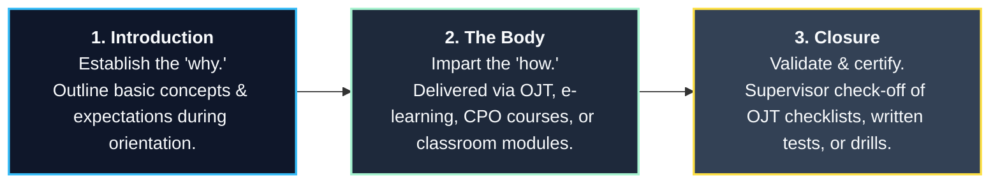

Designing training with sequential learning and structured redundancy ensures that core protection principles are deeply ingrained in daily officer behavior.

---

### 2.7 Obstacles to Providing Training

To ensure the successful execution of a training program, security managers must proactively identify and plan for common operational obstacles:

#### 2.7.1 Budgetary Limitations

Budgetary restrictions are the primary enemy of training programs. Security managers must identify all direct and indirect costs—including trainee compensation, overtime pay for officers covering the shift during training, instructor fees, equipment, and administrative overhead. 

To stretch training dollars and maximize ROI, managers should employ these strategic cost-control methods:
* **Purchase Off-the-Shelf Programs:** High-quality commercial training programs (e.g., from recognized professional security associations) are far more cost-effective than custom internal development. They can be easily customized with site-specific supplements.
* **Academic Partnerships:** Outsource general security and criminal justice coursework to local community colleges or technical institutions. Completion of specific courses can be mandated as a pre-employment condition or tied to professional advancement paths.
* **Secure Grant Funding:** Actively research and apply for state and federal workforce development grants, which frequently subsidize job training for private security and safety personnel.
* **Join Professional Organizations:** Leverage membership in recognized professional security and training associations to secure substantial discounts on educational materials, certifications, and seminars.
* **Share Instructional Resources:** Partner with neighboring facilities, local universities, or public safety agencies to share training videos, library materials, and physical training facilities.
* **Leverage In-House Subject Matter Experts (SMEs):** Utilize qualified internal personnel to teach specific operational modules, provided they possess genuine teaching capabilities.

#### 2.7.2 Scheduling in 24/7/365 Operations

Maintaining continuous security coverage while pulling officers offline for training is a major logistical challenge. Classes must be offered multiple times across different shifts. To overcome this hurdle, managers should leverage flexible learning technologies:
* **Pass-Along Media:** Distribute structured audio/video files or interactive computer modules that officers can review during low-activity shift hours, followed by a supervisor-led Q&A.
* **Online Learning Management Systems (LMS):** Utilize asynchronous online learning to allow officers to complete training from any location, with automated progress tracking and testing.
* **Written Procedures and Audited Quizzes:** Distribute targeted written procedures or industry journal articles, followed by a mandatory, low-cost quiz to verify comprehension and document training.
* **Pass-Along Logs and Routing Slips:** Circulate short articles or procedural updates attached to a physical routing slip, keeping learning alive on the shift at minimal cost.
* **Professional Certifications:** Encourage and support participation in recognized industry certification programs, such as:
  * **Professional Certifications:** Industry-recognized security management and operations certifications.
  * **International Foundation for Protection Officers (IFPO):** Certified Protection Officer (CPO) and Certified Protection Officer Instructor (CPOI).
  * **International Foundation for Cultural Property Protection:** Certified Institutional Protection Specialist (CIPS).
  * **Specialty Certifications:** Programs offered by the International Association for Healthcare Security and Safety (IAHSS) or the American Hotel and Lodging Association (AHLA).
  * *Employer Value:* These certifications are typically completed via self-study, eliminating scheduling conflicts while providing a globally recognized benchmark for promotion and organizational capability.

#### 2.7.3 Lack of Management Expertise

Many knowledgeable security managers struggle to design and deliver high-quality training because they lack training in adult pedagogy, curriculum design, or test validation. Additionally, developing custom materials is extremely time-consuming. Managers must perform an honest self-assessment of their strengths and limitations, and build a three-pronged support structure:

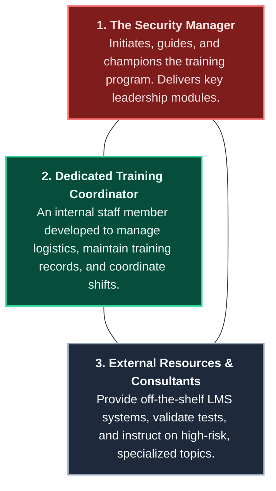

Having a staff member earn the **Certified Protection Officer Instructor (CPOI)** credential from the IFPO is an excellent way to build formal, in-house instructional expertise.

#### 2.7.4 Stereotypes and Prejudices

A significant societal stereotype portrays security officers as lazy, unmotivated, or incapable of professional development. If a security manager or instructor buys into this prejudice, the training program will fail. Any hint of condescension from instructors—especially those with public law enforcement backgrounds who struggle to understand the distinct business and service roles of private security—will immediately derail a program. Managers must treat security officers as valuable professionals, respecting their intelligence and actively investing in their development.

#### 2.7.5 Ego and the "Frog Syndrome"

A common performance failure occurs when a well-meaning security manager decides to personally write every lesson plan and instruct every class. This is known as **the frog syndrome**: the manager enthusiastically leaps into the training project, but is quickly overwhelmed by the massive administrative and operational workload of their daily job. As a result, the manager is forced to leap back out, leaving the training program half-completed and abandoned. 

To prevent this failure, managers must build a structured, sustainable, and shared training framework that does not rely on a single individual.

### 2.8 Training Strategies

To build and sustain a comprehensive training program under tight budget constraints, security managers must deploy highly creative, cost-effective strategies. The following ten strategies represent proven industry best practices for stretching training dollars while maximizing educational impact:

* **Off-Duty Training:** Utilizing voluntary, off-duty learning opportunities for advanced personal and professional development.
* **Tuition Reimbursement:** Funding career-aligned educational and certification courses through broader corporate tuition budgets.
* **Reward and Recognition Programs:** Incentivizing training milestones with physical badges, patches, public recognition, and horizontal promotions.
* **Integrated Corporate Training:** Placing security personnel in parent-company corporate classes (e.g., customer service, business writing) and existing LMS databases.
* **Custom Video Production and Resource Sharing:** Creating targeted training media in-house and sharing resources with academic, civic, or public safety partners.
* **Selling Security Services:** Partnering with external entities to provide certified security instruction, generating revenue to subsidize internal programs.
* **Supervisory and Leadership Training:** Preparing line officers for crisis leadership and management-team responsibilities.
* **Security Internships and Externships:** Recruiting motivated, college-educated talent while leveraging interns for security research and training design.
* **Formal and Informal Professional Alliances:** Participating in local, regional, and international security groups and professional associations to exchange educational resources.
* **Leveraging Specialized Certifications:** benchmark training programs against recognized industry certifications to ensure standardized, globally accepted competencies.

#### 2.8.1 Off-Duty Training

Voluntary training conducted during off-duty hours has massive potential for both individual and organizational development. Unlike mandated compliance training—which recruits may find repetitive or uninspiring—voluntary sessions attract highly motivated officers seeking to excel. When other members of the workforce see the career advancement and direct benefits gained by these motivated peers, positive peer pressure naturally drives broader participation.

Security managers can organize voluntary weekend seminars focusing on exciting, high-value topics such as **Executive Protection**, **Counterterrorism Operations**, or **Active Threat/Multi-Assailant Defenses**. By providing a catered lunch and a formal certificate of attendance, the department can build high enthusiasm and underscore the professional nature of the instruction while eliminating overtime labor costs. Managers can further reduce costs by partnering with local law enforcement academy instructors or college protective-services professors who may be willing to exchange instruction for guest-lecturing opportunities, facility tours, or student shadowing arrangements.

#### 2.8.2 Tuition Reimbursement

Rather than draining security department training dollars, specialized certifications and professional milestones should be funded through the enterprise's centralized tuition reimbursement budget. High-value programs suitable for tuition reimbursement include:
* National or state-certified **Emergency Medical Technician (EMT)** courses.
* Advanced, state-certified firearms and tactical qualifications.
* The **Certified Protection Officer (CPO)** curriculum.

Providing tuition assistance represents a minor corporate expenditure compared to the immense professional growth and risk reduction it affords. As long as the employee completes the coursework during their personal time and is not replaced by an overtime officer on shift, the major labor costs associated with training are avoided. Successfully achieving these career milestones should also serve as mandatory, transparent criteria for promotion to supervisory roles.

#### 2.8.3 Reward and Recognition Programs

Reward and recognition programs must be carefully structured to reinforce the specific organizational image the security department wishes to project (e.g., customer service excellence, enforcement compliance, or emergency tactical response).

A highly visible, progressive recognition system serves as a powerful motivator:
* **Uniform Upgrades:** Adding specialized shoulder patches (e.g., "Advanced First Aid Responder") or chest pins (e.g., the CPO pin) directly recognizes technical achievement.
* **Public Displays:** Placing high-quality officer photographs and summaries of their achievements in prominent corporate reception areas or on the enterprise’s intranet portal.
* **Formal Celebrations:** Recognizing milestone completions in company newsletters, and hosting dedicated dinners or luncheons for officers and their families.
* **Horizontal Promotions ("Promotion-in-Place"):** Allowing an officer to remain at their current post level while receiving a formal title change (e.g., "Senior Protection Officer," "Safety Specialist," or "Field Training Officer"), a salary step increase, and advanced administrative responsibilities. This system recognizes achievement, provides a clear career path, and builds deep specialization within the force.
* **One-Time Cash Bonuses:** Controls recurring wage costs while providing immediate, powerful reinforcement for completing advanced certifications (such as defensive weapons qualification).

#### 2.8.4 Integrated Corporate Training

Security managers must actively integrate their personnel into the training programs offered by the parent company or client organization. By enrolling security officers in existing corporate classes, departments can access high-quality instruction in:
* **Customer Service and Public Relations.**
* **Interpersonal and Business Communication.**
* **Professional Report Writing and Document Control.**
* **Centralized Learning Management Systems (LMS)** and computer-assisted instruction.

Beyond cost efficiency, integrated training significantly enhances professional socialization. When security officers train alongside corporate employees from other departments, they are exposed to a broader range of business perspectives. This integration breaks down silos, keeps the security force aligned with the enterprise's service-delivery culture, and builds deep mutual trust. When non-security employees know protection officers personally through training, they are far more likely to report suspicious activities or share vital intelligence.

#### 2.8.5 Custom Video Production and Resource Sharing

If the parent organization possesses in-house video production capabilities, security managers can easily produce highly customized, site-specific training videos. For organizations lacking these resources, creative collaborations can bridge the gap:
* Partnering with a local college's drama department or community theater group to script and record realistic incident scenarios.
* Collaborating with local police, fire, and emergency management agencies to share video production costs, equipment, and training footage.

Creative resource-sharing must extend to other corporate assets. Sharing printing facilities for manuals, tapping into corporate IT systems for training databases, and utilizing vacant office space for classroom training drastically cuts operational overhead.

#### 2.8.6 Selling Security Services

To subsidize in-house instructional costs, security departments can establish strategic business relationships to provide certified training to external entities. For example, a hospital security department with certified NVCI instructors can sell aggression-management training to nearby clinics or private nursing homes, utilizing the proceeds to fund advanced security qualifications.

On a larger scale, leading contract security providers have successfully established dedicated corporate training academies—such as the historical Wackenhut Institute, which evolved into the G4S North American Training Institute. These academies operate as profit centers, selling premium, certified instruction to external proprietary forces and corporate clients while simultaneously training their own personnel. Some of these courses are even accredited for college-level credits, transforming training from a costly necessity into a powerful marketing and revenue-generating engine.

#### 2.8.7 Supervisory and Leadership Training

Line security officers must be trained in supervisory and leadership principles. Although they are not formal managers in their daily routines, protection officers must take immediate, authoritative charge during initial emergency responses and chaotic incidents. Organizations that recognize this reality train their officers to perform as proactive, adjunct members of the management team, ensuring seamless coordination when crises occur.

#### 2.8.8 Security Internships and Externships

Academic internships provide a mutually beneficial relationship for security departments and post-secondary educational institutions:
* **Internships:** College students pursuing degrees in security management, criminal justice, or business are placed in the department. Interns gain valuable, real-world exposure to both line-officer and managerial functions. In return, the department can utilize interns to conduct specialized security research, design training curricula, and assist with administrative tasks. Internships also attract career-changing adult learners and serve as an outstanding, low-cost recruitment tool.
* **Externships:** Designed for high school students enrolled in vocational protective services programs. These are short-term, structured opportunities where a student shadows a professional officer for a day or two, building early community outreach and interest in the security profession.

#### 2.8.9 Formal and Informal Professional Alliances

Security officers and managers should actively participate in professional alliances and industry organizations:
* **Line-Officer Alliances:** Participating in groups like the International Foundation for Protection Officers (IFPO) to exchange operational data, study materials, and best practices.
* **Guest Lecturer Networks:** Organizing monthly guest lectures during department meetings. Security managers can invite police experts (to discuss active assailant trends, suicide bomb indicators, or courtroom testimony), corporate attorneys (to discuss civil liability and torts), or college professors (to lecture on group dynamics and crisis communication).
* **Contractor Academies:** Leveraging the specialized training resources and distance-learning platforms of large contract security providers to deliver validated, certified instruction.

---

### 2.9 Roles of Security Officers

The fundamental assets of an organization—people, property, and information—determine how its security force must be trained. A protection officer's training at a high-security nuclear power plant differs fundamentally from that at a retail shopping mall, a healthcare facility, or a corporate headquarters.

Although officers across these diverse settings execute similar daily functions (such as access control and patrol), their strategic **roles** within the enterprise vary. Security officer training must equip personnel to fulfill five primary, interrelated roles:

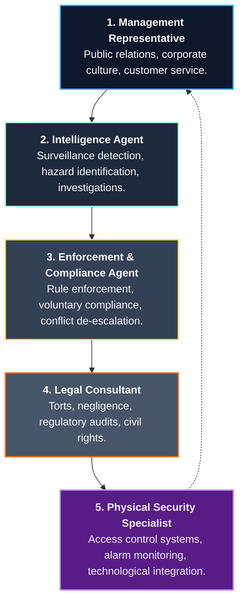

#### 2.9.1 Management Representative

Security officers act as direct agents of management, serving as the primary public relations touchpoint for all visitors, customers, tenants, and vendors. Because they represent the first and last impression of an organization, officers must be thoroughly trained in customer service excellence, corporate expectations, and the enterprise's unique culture.

#### 2.9.2 Intelligence Agent

Security officers serve as the "eyes and ears" of the organization’s threat intelligence function. They actively collect, document, and report information to mitigate targeted attacks and operational losses:
* Spotting and documenting pre-attack indicators and hostile surveillance.
* Identifying employee or tenant safety violations and fire hazards.
* Reporting indicators of organized criminal activity (such as narcotics distribution, gang activity, or retail theft rings) or potential workplace violence.

To execute this role successfully, officers must be trained in the **fundamentals of security investigations**, **cognitive interview techniques**, and **precise, objective report writing**.

#### 2.9.3 Enforcement and Compliance Agent

In this role, officers ensure that the rules and policies established by management are strictly followed. This function is conceptually similar to public policing but must be executed within the distinct legal and cultural framework of a private, corporate environment. 

To achieve compliance without generating hostility or liability, officers must receive intensive training in:
* **The Interpersonal Side of Enforcement:** Gaining voluntary compliance through professional, respectful communication.
* **Conflict Resolution and De-escalation:** Defusing emotionally charged or aggressive individuals safely.
* **Procedural Enforcement Rules:** Knowing the exact boundaries of their authority to document infractions, collect evidence, and testify in corporate disciplinary or legal proceedings.

#### 2.9.4 Legal Consultant

Security officers operate within a complex web of civil and criminal laws. They must be thoroughly trained to understand the legal and disciplinary consequences of their actions:
* **Civil Law (Torts, Negligence, and Contracts):** Knowing how negligent acts, unlawful detentions, or improper uses of force expose the organization and the individual officer to severe civil lawsuits.
* **Criminal Law Procedures:** Grasping basic criminal procedures to facilitate seamless cooperation and positive relationships with public law enforcement.
* **Administrative and Regulatory Laws:** Complying with federal, state, and local standards (e.g., OSHA, HIPAA, or environmental regulations) and supporting management during formal compliance audits.
* **Labor and Employment Laws:** Respecting employee privacy rights, understanding progressive disciplinary procedures, and operating within the bounds of union collective bargaining agreements.

#### 2.9.5 Physical Security and Crime Prevention Specialist

Modern security is heavily technology-driven. Security officers must operate as physical security specialists, understanding the technical architecture and integration of:
* Biometric and card-based access control systems.
* Integrated intrusion and alarm monitoring systems.
* Advanced video surveillance and intelligent analytics.

Training in this role is a continuous, lifelong pursuit. Security managers should encourage and sponsor officers to earn technical certifications—such as recognized professional technical certifications—to build deep technical expertise and establish a highly rewarding career path.

---

### 2.10 Future Trends in Training

Modern security training must transition from a reactive model to a highly proactive, forward-looking discipline. The global evolution of threat landscapes—highlighted by active assailant incidents, massive civil protests, and sophisticated corporate espionage—demands a highly dynamic training curriculum:

* **Active Assailant and Tactical Response:** Training officers in immediate, life-saving protocols (such as "Run, Hide, Fight" and active-threat interdiction), trauma care (tactical first aid), and evacuation coordination.
* **Protest and Crowd Management:** Defusing mass civil demonstrations and protecting assets without escalating conflicts.
* **Hostile Surveillance Detection:** Identifying and documenting red flags, pre-attack indicators, and suspicious reconnaissance.
* **Social Media Monitoring:** Training analytical security staff to monitor open-source data to identify emerging threats to corporate personnel or facilities.
* **Technological Integration:** Ensuring officers possess a deep, working knowledge of system operations, including artificial intelligence analytics and robotic security integration.

#### 2.10.1 Shifting Roles and Public-Private Partnerships

As public law enforcement agencies face severe economic and staffing limitations, private security officers are increasingly stepping into traditional policing roles. This is highly visible in:
* **Community Protection:** Patrolling high-crime residential developments and urban business improvement districts.
* **Public-Private Partnerships:** Collaborative operations securing global supply chains, protecting border checkpoints, and defending critical national infrastructure.

These expanding roles demand that private security officers possess exceptional communication skills, deep legal knowledge, and high proficiency in advanced technology and weapons. Training programs must combine traditional classroom theory with intensive, reality-based role-playing and scenario training.

#### 2.10.2 Professional Career Paths

Building structured career paths within the security organization is the single most effective strategy for recruiting, motivating, and retaining top-tier talent. Officers acquire invaluable, street-level operational knowledge on the job that directly prepares them for corporate leadership. Security managers must actively sponsor advanced professional certifications—such as recognized professional certifications—to build a highly competent, career-oriented leadership pipeline.

#### 2.10.3 Government Oversight and Industry Self-Regulation

While some governments have enacted strict regulations for contract security providers, a substantial portion of the private security industry remains unregulated. Furthermore, government standards frequently focus solely on initial background screening rather than ongoing training quality.

Consequently, voluntary self-regulation through professional guidelines is becoming the dominant driver of training standards:
* **North America:** The **International Association of Security and Investigative Regulators (IASIR)** works to standardize cross-border licensing logistics, partnering with recognized professional security associations and the **National Association of Security Companies (NASCO)**. The *Private Security Officer Selection and Training Guideline* is increasingly being adopted as the mandatory standard by premier corporations and contract agencies.
* **Healthcare and Hospitality:** Specialized accreditation bodies—such as the **Joint Commission (JCAHO)**—mandate continuous education and development programs for security personnel. The **International Association for Healthcare Security and Safety (IAHSS)** provides comprehensive training briefs to facilitate continuous, short-duration shift instruction.
* **Labor Advocacy:** Unions, such as the **Service Employees International Union (SEIU)**, actively campaign to elevate security officer training standards, promote professional licensing, and expand career opportunities.

#### 2.10.4 Specialized and Automated Training Delivery

As protective operations incorporate automated external defibrillators (AEDs), advanced robotics, biometric surveillance, and complex system networks, training delivery must evolve:
* **Specialized External Certifications:** Organizations with small staffs or highly specialized needs (such as handcuffs, pepper spray, or verbal de-escalation) must rely on specialized external training providers to ensure quality and liability protection.
* **Contractor Training Integration:** Contract security firms with highly developed internal academies are opening their courses to external clients and proprietary forces, maximizing resource efficiency and showcasing corporate capabilities.
* **Tactical Collaborations:** Security departments must conduct joint training drills with local police, fire, and emergency medical services, ensuring seamless, unified active-threat tactical intervention.
* **Security Academies and E-Learning:** The shift toward lean security staffs makes the use of centralized security academies and distance e-learning essential. Asynchronous online learning platforms allow individual officers to enroll in highly specialized courses (e.g., retail asset protection, executive protection, or physical security architecture) on a flexible schedule, delivering a consistent, audited, and internationally recognized standard of education directly to the line officer.

What is certain is that a relentless commitment to high-quality, continuous training remains the absolute core of any successful assets protection program.


## Chapter 3: The Security Services Contract

Enterprise security operations frequently require a carefully managed combination of protective forces. Some organizations rely exclusively on proprietary (in-house) security departments, others utilize a mixed or hybrid model, and many choose to outsource facility protection entirely to contract security agencies. 

Modern contract security firms are highly specialized organizations that offer services extending far beyond the core function of physical perimeter and gate protection. These specialized services include:
* Crisis management, business continuity, and disaster recovery support.
* Professional personnel recruitment and vetting.
* Specialized medical and employee transportation.
* Roving vehicle patrols, executive protection details, and technical surveillance countermeasures (TSCM).
* Tactical protective details in regions plagued by high crime, civil unrest, or active terrorism.

Governments, corporate enterprises, small businesses, residential communities, and private citizens all utilize contract security services. These deployments span a wide spectrum of environments, each presenting unique operational demands:

* **Public Areas:** Security operations in spaces with unrestricted public access, such as municipal business improvement districts, public residential neighborhoods, and major community events (parades, street festivals).
* **Semi-Public Areas:** Sites with specific access restrictions or entry fees, including retail shopping centers, commercial banks, healthcare facilities, sports stadiums, and museums.
* **Private Facilities and Property:** Highly restricted environments where access is strictly limited to authorized personnel, such as manufacturing plants, cargo warehouses, R&D laboratories, and corporate headquarters.

To ensure quality service and mitigate liability, organizations must define their requirements precisely and execute an **express, written contract** with clearly defined terms and conditions, rather than relying on implied agreements assumed from the actions of the parties.

> [!IMPORTANT]
> **Contract vs. Warranty:** A security services contract is a legally binding agreement between specific parties. Unlike a generic product warranty, the specialized skills, experience, and personnel of a contractor are non-interchangeable. Selecting the contract agency best equipped for the enterprise's specific risk profile requires extensive research and should not be repeated unnecessarily.

A security services contract is a highly complex document. Informal, flat organizations can utilize simplified processes, whereas large, multinational enterprises require comprehensive, highly formal processes. Meticulous care must be taken in drafting the contract to avoid future operational gaps or legal disputes.

When initiating the contracting process, the security manager must first align with the organization's corporate procurement and legal guidelines. The following core guidelines (Purpura 2018) should govern the acquisition of security services:
* **Buyer Beware (Caveat Emptor):** Perform exhaustive due diligence; do not accept marketing claims at face value.
* **Objective Needs Assessment:** Conduct a thorough risk assessment to define the precise protection needs of the organization.
* **Industry Awareness:** Acquire detailed knowledge of the state of the art in both electronic security and guard force management.
* **Strategic Comparison:** Critically analyze the specific advantages, disadvantages, and total cost of ownership (TCO) of competing services.
* **Avoid Panic Decision-Making:** Rushing into a contract due to a recent security incident invariably leads to inflated costs and poor service levels.

---

### 3.1 Client Responsibilities

The client organization holds the ultimate responsibility for defining the standards of performance, operational parameters, and quality controls of the protective force. This responsibility is executed through four key components:

#### 3.1.1 The Request for Proposal (RFP)

Personnel labor costs represent the single largest expenditure in any security department's operating budget. Prior to drafting a Request for Proposal (RFP), security managers must conduct a rigorous cost-benefit analysis evaluating the integration of physical security personnel with electronic security solutions (such as automated access control and video analytics). Achieving the optimal balance between human assets and technology is critical for maximizing both protection and budget efficiency.

##### Contractor Selection Criteria
When evaluating potential contract agencies, the client must prioritize three broad criteria:
1. **Stability and Capability:** The contractor's financial solvency, regional infrastructure, industry experience, and professional reputation.
2. **Operational Responsiveness:** The agency's ability to provide prompt, efficient, and proactive support to client concerns and emerging emergencies.
3. **Competitive, Structured Pricing:** Ensuring that pricing models are fair, transparent, and aligned with quality standards.

##### Defining the Scope and Culture
The RFP must define a precise scope of work based on building design, facility layout, business processes, and local risk profiles. Managers must also account for the **corporate culture**: will the organization tolerate high-profile, armed officers, or does it require low-profile, customer-service-oriented staff? The strategic objective must be clear: is the goal to maintain a cosmetic *image* of security, or is it to deploy a highly functional, proactive *protection* force?

##### The Solicitation Summary
To give prospective vendors all necessary data to prepare a comprehensive bid package, the client should distribute a formal **Solicitation Summary** (McCrie 2015) outlining:
* **Statement of Purpose:** A high-level summary of the required security objectives and tasks.
* **Procurement Rules and Submission Guidelines:** Strict deadlines, proposal formatting, and rules governing late submissions or appeals.
* **Administrative Details:** Bidders' conference schedules, payment terms, audit rights, and procurement contacts.

##### Standard RFP Headings and Structure
A premium, highly rigorous RFP should be structured around the following standard headings:

```markdown
1. Nature and Scope of Security Services Required
2. Length of Contract and Renewal Options
3. Detailed Facility Profiles and Critical Asset Lists
4. Identified Threat, Vulnerability, and Risk Assessment (TVRA) Data
5. Specific Post Staffing Schedules and Hourly Requirements
6. Standard Operating Guidelines and Incident Reporting Rules
7. Business Continuity and Emergency Response Expectations
8. Workforce Standards (education, licensing, background checks, drug screening)
9. Uniform and Equipment Specifications
10. Contractor Supervisory Infrastructure and Management Policies
11. Financial Terms (wage steps, billing rates, overtime, audit rights)
12. Performance Penalties and Liquidated Damages (non-performance, short shifts)
13. Legal Terms (indemnification, insurance limits, EEO compliance)
```

#### 3.1.2 Scope of Work

The client company must define the Scope of Work (SOW) and performance standards with absolute precision. Relying on vague verbal agreements or calling un-vetted contractors leads to immediate operational disputes and service degradation. The SOW must detail the exact security tasks, hours of operation, and weekly post-hour schedules (see the Sample Scope of Work in Appendix 3A). The SOW, combined with General and Special Orders and the proposed operating agreement, must provide contractors with a clear, unambiguous roadmap of all routine and emergency operational expectations.

#### 3.1.3 General and Special Orders

Meticulous, written instructions are the lifeblood of guard force operations. It is the client's absolute responsibility to review, customize, and formally approve all operating orders to ensure they align with the enterprise's unique culture and risk profile:
* **General Orders:** Broad, permanent standards of professional conduct, ethics, and appearance that apply to all officers across the organization (see Appendix 3B).
* **Special Orders:** Post-specific, highly detailed instructions outlining the routine duties, patrol routes, emergency shut-offs, and critical actions required at a specific post.
* **Special Instructions:** Temporary, short-term directives issued in memorandum form to cover specific events, VIP visits, or temporary construction projects.

#### 3.1.4 The Bidders' List

Security managers must compile a highly selective list of qualified contract security agencies to ensure healthy competition. When building a bidders' list, managers must analyze the trade-offs of different agency models:
* **National and Regional Agencies:** Possess deep capital reserves, extensive training resources, scheduling flexibility, and large personnel pools, but may struggle to customize services or provide highly responsive local supervision on the fringes of their service areas.
* **Local Agencies:** Offer highly responsive, hands-on local management and customized services, but may lack the infrastructure, back-up staffing, and financial capital of larger firms.

##### Mandating Wage and Compensation Policies
To prevent high turnover and low morale, the client company—not the contractor or procurement department—should dictate the compensation policy:
* **Wage Step Standards:** The client should specify the exact hourly pay rates the security officers will receive, rather than allowing the guard agency to depress officer wages to maximize their own profit margins.
* **Parity in Hybrid Forces:** In hybrid forces (mixing proprietary and contract officers), the lowest contract wage should at least equal the entry-level wage of the proprietary force. Large wage disparities destroy morale, erode service quality, and accelerate costly turnover.

---

### 3.2 Agency Responsibilities

Once the RFP is distributed, the competing agencies must demonstrate their capacity to meet the client's specifications through two primary processes:

#### 3.2.1 The Operating Agreement

The operating agreement is a legally binding document detailing the exact responsibilities, quality controls, and liabilities of both parties. Reputable contractors welcome highly detailed, customized agreements because they establish clear expectations and prevent administrative disputes. The agreement must reflect the client's risk assessment and cover:

* **Meticulous Billing Itemization:** Compelling the agency to split billing rates into: (1) direct hourly wages paid to the officer, (2) overhead and G&A costs, and (3) agency profit. Clients should regularly audit invoices to verify compliance.
* **Pre-Assignment Training Accountability:** Requiring a set number of site-specific pre-assignment training hours, funded entirely at the contract agency's expense. This ensures the agency absorbs the training cost of replacements, incentivizing them to reduce turnover.
* **Meticulous Quality Controls and Financial Penalties:** Establishing clear, enforceable penalties for non-performance to drive operational compliance:
  * *Incomplete Shift Penalty:* Financial deductions if a post is left unmanned.
  * *Improper Assignment Penalty:* Deductions if an unqualified or un-licensed officer is deployed.
  * *Negligence and Damage Penalties:* Restitution for on-the-job negligence.
* **Supervisory Infrastructure:** Establishing a single, dedicated point of contact between the agency and the client, supported by mandatory weekly or monthly operational review meetings.

#### 3.2.2 The Bidders' Conference

A highly structured conference is essential to ensure all bidders prepare proposals based on identical, high-quality data. The client security manager should:
1. Conduct a comprehensive walkthrough and facility tour, detailing critical assets and post expectations.
2. Review the Scope of Work, General and Special Orders, and proposed contract terms in detail.
3. Convene a structured, recorded Q&A session, distributing the transcripts and answers to all participants to ensure absolute fairness.

---

### 3.3 Bid Evaluation

Evaluating complex proposals requires a standardized, objective, and mathematically rigorous methodology to ensure the organization secures the highest quality service at the most competitive price.

#### 3.3.1 Evaluation Criteria

Proposals must be evaluated across multiple dimensions:
* **Submission Compliance:** Strict adherence to deadlines and RFP formatting rules.
* **Proposal Quality:** Customized solutions demonstrating a deep understanding of the client's business, versus generic templates.
* **Vendor Capability:** Officer licensing speeds, local recruitment resources, and deep industry experience.
* **Supervisory Plan:** The quality of the site-supervision plan. 

> [!TIP]
> **Supervisory Rule of Thumb:** If a facility requires more than **400 contract hours per week**, the client should mandate a dedicated, site-assigned security supervisor. To avoid "joint employer" legal liability, the client's management must never supervise contract personnel directly; all operational directives must be routed through the contract agency's supervisor or lead officer.

#### 3.3.2 Sample Analysis

To illustrate a rigorous evaluation process, consider a client company that requires approximately **16,000 straight-time (S/T) hours** annually (approximately 308 hours per week), with **850 estimated overtime (O/T) hours**. The client establishes a five-step wage scale, including a supervisory classification, and requires the contractor to lease specific security equipment (a patrol tour system, two-way radios, and a patrol bicycle) on a 24-month basis. Seven competing contract security agencies respond to the RFP.

##### Step 1: Evaluating Straight-Time Billing Rates (Figure 3.2)
The billing rate percentage is calculated by dividing the contractor's hourly billing rate by the officer's base hourly wage. The sum of these billing percentages across all five steps yields a weighted S/T score (lower scores represent more cost-efficient billing structures).

###### Figure 3.2: Straight-Time Wage Steps and Billing Rates
| Company | Step 1 ($7.35 Base) | Step 2 ($7.75 Base) | Step 3 ($8.15 Base) | Step 4 ($8.55 Base) | Step 5 ($9.00 Base) | Weighted S/T Score |
| :--- | :--- | :--- | :--- | :--- | :--- | :--- |
| **Bidder 1** | $12.72 (173%) | $13.33 (172%) | $13.94 (171%) | $14.54 (170%) | $15.12 (168%) | **854** |
| **Bidder 2** | $11.03 (150%) | $11.63 (150%) | $12.23 (150%) | $12.74 (149%) | $13.41 (149%) | **748** |
| **Bidder 3** | $11.47 (156%) | $12.09 (156%) | $12.63 (155%) | $13.25 (155%) | $13.77 (153%) | **775** |
| **Bidder 4** | $11.32 (154%) | $11.86 (153%) | $12.47 (153%) | $12.99 (152%) | $13.59 (151%) | **763** |
| **Bidder 5** | $11.17 (152%) | $11.70 (151%) | $12.31 (151%) | $12.83 (150%) | $13.41 (149%) | **753** |
| **Bidder 6** | $12.42 (169%) | $13.02 (168%) | $13.69 (168%) | $14.28 (167%) | $14.94 (166%) | **838** |
| **Bidder 7** | $11.69 (159%) | $12.25 (158%) | $12.88 (158%) | $13.42 (157%) | $14.04 (156%) | **788** |

##### Step 2: Evaluating Supplemental Service Costs (Figure 3.3)
Supplemental costs for overtime, short-term additions, and training must be quantified. The sum of these billing percentages across training, emergency call-outs, and two overtime projections (B1 and B2) creates a weighted supplemental score.

###### Figure 3.3: Overtime, Training, and Supplemental Service Rates
| Company | Overtime B1 (%) | Overtime B2 (%) | Training Rate (%) | Short-Term Rate (%) | Supplemental Score |
| :--- | :--- | :--- | :--- | :--- | :--- |
| **Bidder 1** | $19.08 (150%) | $20.25 (150%) | $12.00 (163%) | $14.50 (159%) | **622** |
| **Bidder 2** | $16.55 (150%) | $17.55 (150%) | $11.00 (150%) | $11.50 (115%) | **565** |
| **Bidder 3** | $17.21 (150%) | $18.25 (150%) | $13.00 (160%) | $17.00 (170%) | **630** |
| **Bidder 4** | $16.98 (150%) | $18.00 (150%) | $11.20 (131%) | $13.10 (131%) | **562** |
| **Bidder 5** | $16.76 (150%) | $17.75 (150%) | $10.50 (129%) | $13.00 (130%) | **559** |
| **Bidder 6** | $18.63 (150%) | $19.75 (150%) | $13.00 (159%) | $15.90 (159%) | **618** |
| **Bidder 7** | $17.54 (150%) | $18.60 (150%) | $11.80 (137%) | $13.70 (137%) | **574** |

##### Step 3: fringe Benefit Cost Equalization (Figure 3.4)
To prevent agencies that offer poor employee benefits from winning purely on price (while causing high turnover), the client evaluates five key benefits: paid holidays, vacation, sick leave, health insurance, and life insurance.
* The client assigns 5 penalty points for each benefit the contractor does **not** provide (possible range: 0 to 25 points; a low score represents a superior benefit package).

###### Figure 3.4: Fringe Benefit Cost Analysis
| Company | Paid Holidays | Paid Vacation | Paid Sick Leave | Health Insurance | Life Insurance | Total Benefit Penalty |
| :--- | :--- | :--- | :--- | :--- | :--- | :--- |
| **Bidder 1** | Provided (0) | Provided (0) | No (5) | No (5) | No (5) | **15** |
| **Bidder 2** | No (5) | No (5) | No (5) | No (5) | No (5) | **25** |
| **Bidder 3** | Provided (0) | Provided (0) | Provided (0) | No (5) | No (5) | **10** |
| **Bidder 4** | Provided (0) | Provided (0) | No (5) | No (5) | No (5) | **15** |
| **Bidder 5** | Provided (0) | Provided (0) | Provided (0) | No (5) | No (5) | **10** |
| **Bidder 6** | Provided (0) | Provided (0) | Provided (0) | Provided (0) | No (5) | **5** |
| **Bidder 7** | Provided (0) | Provided (0) | No (5) | No (5) | No (5) | **15** |

##### Step 4: Final Consolidated Bid Analysis (Figure 3.5)
The scores from the three preceding steps are consolidated into a final index (lowest score wins).

###### Figure 3.5: Contract Security Consolidated Bid Analysis
| Bidder | Straight-Time Score | Supplemental Score | Benefit Penalty Points | Total Consolidated Score | Final Rank |
| :--- | :--- | :--- | :--- | :--- | :--- |
| **Bidder 1** | 854 | 622 | 15 | **1491** | 7th |
| **Bidder 2** | 748 | 565 | 25 | **1338** | 2nd |
| **Bidder 3** | 775 | 630 | 10 | **1415** | 5th |
| **Bidder 4** | 763 | 562 | 15 | **1340** | 3rd |
| **Bidder 5** | 753 | 559 | 10 | **1322** | **1st (Winner)** |
| **Bidder 6** | 838 | 618 | 5 | **1461** | 6th |
| **Bidder 7** | 788 | 574 | 15 | **1377** | 4th |

##### Step 5: Cost Validation (Figure 3.6)
To validate the scoring, estimated annual labor costs are calculated based on 16,000 S/T hours and 850 O/T hours.

###### Figure 3.6: Estimated Annual Labor Cost Validation
| Bidder | Average S/T Billing Rate | Estimated S/T Cost (16,000 Hrs) | Average O/T Billing Rate | Estimated O/T Cost (850 Hrs) | Total Annual Labor Cost |
| :--- | :--- | :--- | :--- | :--- | :--- |
| **Bidder 2** | $12.21 | $195,360 | $17.05 | $14,492 | **$209,852** (Lowest Cost) |
| **Bidder 5** | $12.28 | $196,480 | $17.25 | $14,662 | **$211,142** |

> [!NOTE]
> **Operational Decision:** Although Bidder #2 submitted a bid that was **$1,290 lower** annually than Bidder #5, the contract was awarded to **Bidder #5**. Bidder #5 possessed a substantial local operational presence and managed adjacent accounts, whereas Bidder #2 had no local infrastructure. The added security of Bidder #5's local supervision and emergency support far outweighed the minimal cost difference.

#### 3.3.3 Incentive Pricing Models

Organizations are increasingly moving away from simple commodity pricing, choosing instead to negotiate direct officer wages and tie the contractor's profit margin to specific performance incentives:
* **Recruitment Subsidies:** The client agrees to a higher-than-normal direct officer wage and pays initial recruitment expenses. This allows the contractor to attract premier talent with no additional mark-up, enabling the client to demand rigorous performance.
* **Turnover-Based Bonuses and Penalties:** The client and contractor establish a maximum acceptable officer turnover level based on local job market data.
  * *Bonus:* If the contractor maintains turnover *below* the target, they receive a monthly bonus calculated as a percentage of the billing.
  * *Penalty:* If turnover *exceeds* the target, a percentage deduction is applied to the invoice.
  * *Economic Reality:* Paying a monthly bonus for low turnover is far less expensive than absorbing the hidden security gaps, mistakes, and constant retraining costs associated with rapid officer replacement.


### 3.4 Contract Award

Following the selection of the winning bidder, formal contract negotiations must commence immediately. These negotiations serve as a critical alignment phase to ensure that all General and Special Orders, standard operating procedures, and the specific terms and conditions of the operating agreement are thoroughly understood by both parties. 

During this phase, representatives from the client and the contractor must explicitly review, debate, and agree upon the division of operational risks and liabilities:
* **Enforcement of Terms:** It must be established from the outset that all terms and conditions of the operating agreement will be strictly and consistently enforced by both sides. repetition of unresolved performance gaps leads to service decay. Reputable, professional contractors welcome this rigorous approach because it eliminates administrative ambiguity and aligns expectations from day one.
* **Premises Liability:** Premises liability is a highly complex, continuously evolving area of civil law. The contract must serve as a legally validated instrument to transfer appropriate risks from the client to the contractor.
* **The Legal Concept of Agency:** The contract must clearly define the boundaries of "agency" (whether the contractor's employees are legally acting on behalf of the client). Vague contract language can result in courts holding the client civilly liable for the unauthorized, negligent, or unlawful acts of contract officers.

---

### 3.5 Administration of the Operating Agreement

The day-to-day administration of a contract security operation requires continuous, active management. Maintaining a high-quality, mutually satisfying partnership necessitates a robust framework of checks and balances:
* **Scheduled Review Meetings:** Convene weekly or monthly operational meetings between the client security manager and the agency's dedicated contract coordinator to review performance metrics and discuss incidents.
* **Operational Audits:** Conduct regular, unannounced joint and independent site inspections—during both day and night shifts—by representatives of both the client and the contractor.
* **Invoice Auditing:** Meticulously examine monthly invoices to ensure billing aligns precisely with documented shift hours, wage steps, and equipment leasing agreements.
* **Zero Tolerance for Complacency:** If substandard performance by individual officers or the agency management is tolerated, it rapidly becomes the new operating norm. Managers must address minor infractions immediately to maintain the professional integrity of the force.

---

### Appendix 3A: Sample Scope of Work

This document outlines the standard post staffing schedules and required hours of operation for the contract security force at the designated facility. Security officer duties consist of fixed-post monitoring and roving foot or vehicle patrols as detailed in the General and Special Orders. 

* Roving officers are responsible for active perimeter patrols and must carry an electronic patrol recorder and a two-way radio for continuous communications with the Security Operations Center (SOC).

#### Post Staffing and Shift Schedule

| Post & Roster Classification | Personnel Count | Shift Hours | Days of Week | Weekly Hours |
| :--- | :--- | :--- | :--- | :--- |
| **Post No. 1: Security Control Center (SOC)** | | | | |
| * SOC Supervisor | 1 Officer | 07:30 to 16:00 | Monday through Friday | 42.5 Hours |
| * SOC Officer (Weekend Day) | 1 Officer | 08:00 to 16:00 | Saturday and Sunday | 16.0 Hours |
| * SOC Officer (Swing Shift) | 1 Officer | 16:00 to 24:00 | Monday through Sunday (Daily) | 56.0 Hours |
| * SOC Officer (Midnight Shift) | 1 Officer | 24:00 to 08:00 | Monday through Sunday (Daily) | 56.0 Hours |
| **Post No. 2: Roving / Mobile Patrol** | | | | |
| * Patrol Officer (Weekend Day) | 1 Officer | 08:00 to 16:00 | Saturday and Sunday | 16.0 Hours |
| * Patrol Officer (Weekend Swing) | 1 Officer | 16:00 to 24:00 | Saturday and Sunday | 16.0 Hours |
| * Patrol Officer (Weekday Swing) | 1 Officer | 15:00 to 24:00 | Monday through Friday | 45.0 Hours |
| * Patrol Officer (Weekend Midnight) | 1 Officer | 24:00 to 08:00 | Saturday and Sunday | 16.0 Hours |
| **Total Weekly Scheduled Post Hours** | | | | **263.5 Hours** |

##### Officer Complement Calculations
* **Total Annual Straight-Time Hours:** 13,702 Hours (based on 263.5 weekly post hours).
* **FTE Staffing Requirement:** Based on a standard 40-hour work week, maintaining this schedule requires a minimum of **6.6 Full-Time Equivalent (FTE) officers** (263.5 / 40 = 6.58). Accounting for standard leaves, vacations, and refresher training, a realistic personnel pool of **7.5 to 8.0 officers** must be dedicated to this account to guarantee uninterrupted, 100% post coverage.

---

### Appendix 3B: Sample General and Special Orders

#### Section I: Classification of Orders

Security officer directives are structured into three distinct, mutually supportive categories:
1. **General Orders:** Broad, permanent standards of professional conduct, ethics, personal appearance, and administrative rules that apply uniformly to all security personnel across the enterprise.
2. **Special Orders:** Post-specific, highly detailed instructions defining the exact daily routine, patrol routes, critical infrastructure monitoring, and emergency protocols for an individual post.
3. **Special Instructions:** Temporary, short-term directives issued by security management in memorandum form to cover special events, construction projects, or temporary VIP visits.

#### Section II: General Orders (Professional Conduct)

As a member of the contract security force, you are a vital representative of the organization's professional brand. You must comply strictly with the following general operating standards:

* **Personal Conduct:** Demonstrate absolute honesty, alertness, loyalty, and professional integrity at all times on duty.
* **Professional Attitude:** Maintain an active, dedicated interest in the protection of property and life. Cultivate a proactive mindset: *think security, act security, and prioritize prevention.*
* **Personal Habits:** Maintain dignified behavior. Smoking, vaping, or chewing tobacco is strictly prohibited at all posts and in all public-facing areas.
* **Organizational Discipline:** Comply promptly, willingly, and cooperatively with all lawful orders and directives issued by designated supervisors and client representatives.
* **Personal Appearance:** Personal cleanliness and neatness are mandatory. Hair must be neatly groomed, fingernails clean, and the uniform worn correctly:
  * The uniform must be clean, well-pressed, and in good repair.
  * Shoes must be kept highly polished.
  * The uniform cap (if issued) must be worn at all times on duty, worn "squared" and never tilted, backwards, or askew.
* **Workstation Cleanliness:** Security posts, desks, and booths must be kept immaculate, neat, and orderly. Do not store personal clothes, excessive supplies, or personal property at the post. Loitering or permitting off-duty personnel at the post is strictly prohibited.
* **Public Relations:** Security officers represent the primary public-facing touchpoint of the enterprise. All interactions with visitors, employees, and tenants must be firm and determined, yet exceptionally polite, tactful, and courteous. Greeting constituents with a cheerful "Good morning" or "Good evening" sets a highly professional tone. Arguing with employees or visitors is strictly prohibited; report all disputes or compliance issues immediately to a supervisor.
* **Telephone Protocols:** Post telephones must be utilized strictly for official business. When answering, state the name of the post, your rank, and your name (e.g., *"Security Control Center, Officer Smith, how may I assist you?"*). Politely inquire: *"May I have your name, please?"* if the caller does not self-identify.

#### Section III: Duties and Operational Familiarization

##### General Duties
Your primary responsibilities include protecting company property, assets, and personnel; directing vehicular and pedestrian traffic; enforcing company rules; and reporting all security or safety violations.

##### Performance Requirements
Executing your duties professionally requires:
* Thorough knowledge of general security procedures and emergency plans.
* Absolute mastery of the specific Special Orders and Special Instructions of your assigned post.
* Detailed, intimate knowledge of the physical layout of the facility.
* A clear understanding of all company rules and regulations you are authorized to enforce.

##### Critical Patrol Area Familiarization
Prior to performing independent duties, you must complete structured site orientation. You must possess detailed, exact knowledge of the location and operation of:
* Work locations and contact numbers for key corporate executives and safety personnel.
* All post telephones, emergency call boxes, and communication systems.
* All fire alarm pull boxes, smoke detectors, and emergency exits.
* The physical routing of all stairways, doors, service corridors, and restricted areas.
* All firefighting equipment, including portable fire extinguishers and fire hose cabinets.
* All electrical breaker boxes, light switches, and backup generators.
* All mechanical control rooms, main utility shut-offs, and HVAC controls.
* All valves controlling the main water supply and automatic sprinkler systems.
* All fuse boxes, power control switches, and critical industrial machinery controls.

##### Routine Patrol Checklist
During routine foot or vehicular patrols, you must:
1. Conduct thorough physical inspections of all perimeters, gates, doors, windows, and lock assemblies.
2. Monitor and regulate pedestrian and vehicular access points, verifying identity badges and paperwork.
3. Actively prevent unauthorized removal, damage, or conversion of corporate and employee assets.
4. Promptly document and report all matters of security interest, including safety hazards, maintenance defects, fire risks, and policy violations.

##### Patrol and Prevention Focus
The primary purpose of security patrols is active, preventative observation, not merely scanning electronic checkpoints. You must proactively report any situation that could lead to asset loss, damage, or injury, including:
* Suspicious or careless activity near high-value storage yards or shipping docks.
* Tools, ladders, or company property left unsecured at the end of a shift.
* Employees present in restricted areas without operational justification.
* Unauthorized individuals loitering near perimeter fences or windows.
* Any building security deficiencies, defective locks, or bypassed doors.
* Bypassed or propped security doors, and unauthorized key duplication.
* Exact details of any lock bypasses or authorized entries (time, name, reason).

##### Attention to Duty
You must dedicate 100% of your attention to your protection duties. The reading of non-work books or newspapers, watching television, listening to personal music, or utilizing personal mobile devices for non-official activities while on duty is strictly prohibited.

#### Section IV: Disciplinary Actions and Special Post Orders

##### Grounds for Immediate Re-Assignment or Dismissal:
* Abandoning an assigned post prior to being properly relieved by authorized personnel.
* Failure of a scheduled officer to promptly notify the contract supervisor of an absence or inability to report.
* Dishonesty, theft, pilferage, or unauthorized conversion of company property.
* Accepting any money, tips, gifts, or gratuities from vendors, clients, or employees.
* Conduct unbecoming an officer or any act prejudicial to good order and discipline.
* Consuming alcohol or controlled substances, or reporting to work under the influence of either.
* Making false reports, falsifying logs, or giving false testimony.
* Sleeping on post.
* Willful disobedience of a lawful supervisor directive or gross neglect of duty.
* Utilizing unnecessary force, harshness, violence, or profane language.
* Willfully or carelessly permitting violations of company or facility safety rules.

##### Emergency and Evidence Protocols:
* **Notification Chain:** For any emergency not explicitly covered in the General or Special Orders, immediately contact the contract supervisor or designated client representative.
* **Crime Scene Preservation:** In the event of a serious crime or death, the officer must secure the area immediately and prevent any unauthorized entry to preserve physical evidence. Do not touch or disturb bodies or surrounding effects. Maintain absolute control of the scene until public law enforcement and senior management arrive. Document the names, contact details, and initial statements of all witnesses.
* **Deadly Force Restriction:** Firearms may be drawn and discharged strictly in self-defense or to protect another person from the imminent threat of death or grave bodily harm. The discharge of a firearm represents the absolute last resort in defense of life.
* **Access Interdiction:** Do not permit unauthorized persons, weapons, explosives, incendiary devices, tape recorders, or unauthorized communication equipment to enter the facility. 
* **Material Removal Controls:** Ensure no company property, blueprints, photographs, or proprietary documents leave the premises without a valid property pass signed by an authorized manager. Treat all official business, operational data, and corporate files as strictly confidential.

---

### Appendix 3C: Sample Operating Agreement for Security Service

THIS AGREEMENT, effective as of 12:01 A.M. on **[Date]**, is executed by and between **[Client Company Name]**, a corporation organized and operating under the laws of the State of **[State]** (hereinafter referred to as the "Company"), and **[Contract Security Agency Name]** (hereinafter referred to as the "Contractor").

#### Section I: Recitals and Scope of Service

A. **Services Rendered:** Contractor agrees to furnish a professional, fully trained, uniformed, and equipped protective force to protect all real and personal property owned, leased, or possessed by the Company at the building complex located at **[Address]** against vandalism, theft, trespass, fire, and any other events detrimental to physical security.
B. **Staffing and Schedules:** The specific post staffing levels, supervisor ratios, and hours of coverage shall be executed in strict accordance with the mutually agreed-upon Statement of Work (Attachment 2).
C. **Employment Status:** All security officers deployed under this Agreement are sole employees of the Contractor. The Contractor retains absolute responsibility for paying all employee salaries, G&A expenses, benefits, and payroll-related taxes.
D. **Insurance Requirements:** Contractor shall maintain, at its sole expense, the comprehensive insurance coverages detailed in Attachment 1. All policies must be non-cancelable except upon fifteen (15) days' prior written notice to the Company. Certificates of Insurance (COIs) must be delivered to the Company prior to contract commencement and annually upon renewal.
E. **Rules and Guidelines:** The conduct and operational duties of all security officers shall be governed strictly by the General and Special Orders approved by the Company, and such other written directives as may be issued by the Company's authorized representatives from time to time.

#### Section II: Physical and Training Standards

To guarantee a premium, highly competent protective force, the acceptability of all Contractor personnel is subject to the following strict conditions:

1. **Experience Requirements:** Security officers must possess a minimum of **one (1) year of prior satisfactory security experience**. Supervisors must possess a minimum of **two (2) years of active supervisory experience**.
2. **Background Investigation:** Prior to deployment, every officer must pass a comprehensive criminal background check, licensing verification, and drug screening, and be formally interviewed and approved by the Company’s security manager.
3. **Good Health and Physical Standards:** All personnel must be in good health and free from physical defects that would interfere with daily or emergency protection duties. Every officer must meet the following verified physical standards:
   * Properly proportioned height-to-weight ratio.
   * Binocular vision correctable to 20/30 (Snellen).
   * Full capability to discriminate among standard colors.
   * Auditory acuity capable of hearing ordinary conversation at 20 feet and whispered conversation at 10 feet with each ear.
   * Physical stamina to stand or walk for an entire shift, climb stairs/ladders, lift and carry objects weighing up to 50 pounds, and run short distances.
   * Physical fitness must be validated by a medical examination conducted within ninety (90) days prior to deployment, and re-certified annually within thirty (30) days of the officer's anniversary date.
4. **Labor Relations:** The Contractor is solely responsible for managing all labor relations, collective bargaining agreements, and disputes involving its employees. No union or labor contract executed by the Contractor shall obligate the Company in any manner upon contract termination or during the performance period.
5. **Mandatory Pre-Assignment Training:** Prior to performing active duties, every officer must complete a minimum of **eight (8) hours of classroom instruction** and **sixteen (16) hours of supervised on-the-job training (OJT)**. Site-supervisors must complete a minimum of **twenty-four (24) hours of specialized instruction** in SOC operations and emergency management. All classroom and OJT training shall be conducted entirely at the Contractor's expense. Pre-assignment classroom training must cover:
   * Legal boundaries of arrest, search, seizure, detentions, and use of force.
   * Fire detection, prevention, automatic sprinkler system controls, and fire extinguisher operations.
   * Formal procedures for documenting and reporting incidents to law enforcement.
   * Professional appearance, customer service standards, and lines of authority.
6. **Continuity of Service:** Contractor guarantees uninterrupted, 100% post coverage during any strike, work stoppage, civil unrest, or emergency contingency. Officers must remain at their posts until properly relieved. If the Contractor fails to maintain coverage, the Company reserves the absolute right to hire a backup security force, charging all excess costs directly to the Contractor.
7. **Right to Remove Personnel:** The Company reserves the absolute right, with or without cause, to direct the immediate removal and replacement of any Contractor employee. The Contractor shall deploy a fully qualified, approved replacement officer within eight (8) hours of such notification.
8. **Inspection and Auditing:** A nonresident, roving supervisor employed by the Contractor must conduct unannounced inspections of all posts at least once per night shift (between 1800 and 0600 hours). A detailed "Officer's Daily Report" must be submitted to the Company's security manager following each inspection. The Company retains the absolute right to periodically audit the Contractor’s hiring, background, and training records.
9. **Scheduling and Shift Rotation:** Contractor must submit monthly shift schedules to the Company at least five (5) days prior to implementation. Security officers must be hired with the clear understanding that shift rotations will occur at a frequency of no greater than six (6) weeks, unless permanent shift assignments are formally approved by the Company.

#### Section III: Equipment and master Key Controls

A. **Contractor-Furnished Equipment:** Contractor shall lease, maintain, and support the following equipment for the duration of this Agreement (24-month lease):
   * One (1) automated electronic patrol tour management system with data-logging checkpoints.
   * One (1) heavy-duty patrol bicycle with lighting and lock assemblies.
   * Two (2) professional-grade two-way radios with spare batteries and charging docks.
B. **Master Key Security:** The Company shall supply a single set of master keys for post operations. Master keys must never be duplicated, copied, or removed from the facility. If a master key is lost, or if unauthorized duplication occurs, the Contractor shall fully reimburse the Company for the total cost of rekeying all exterior locks, doors, and gates across the facility.

#### Section IV: Compensation and Working Limitations

A. **Compensation Rates:** Contractor personnel shall be compensated in strict accordance with the base wage steps and billing rates detailed in Attachment 2 and Attachment 3.
B. **Officer Work Hour Limitations:** To manage fatigue and maintain peak vigilance, the Contractor must enforce the following labor limits:
   * Deployed personnel shall not work at any other Contractor-serviced account while assigned to the Company.
   * Officers shall not work more than **twelve (12) continuous hours** in a single shift.
   * Officers shall not work more than **forty-eight (48) total hours** in a normal work week (defined as Saturday through Friday).
   * Officers shall not work more than two (2) different shifts within a single work week.

#### Section V: Equitable Downward Adjustment (Non-Performance Penalties)

To guarantee operational compliance, the Company reserves the right to deduct **fifty dollars ($50.00) per day, per incident** from the monthly billing as an equitable downward adjustment for documented contract non-performance, including:
* Failure to provide the required number of officers or maintain 100% post coverage.
* Failure to assign a trained, licensed, and approved substitute officer as a replacement.
* Allowing an officer to exceed shift hour or weekly hour limitations.
* Failure to maintain and produce complete background screening, medical, or training records.
* Failure to deploy a correctly uniformed, groomed, or equipped officer.
* Adjusting employee pay scales without prior Company approval.
* Failure to replace any removed employee within the mandated eight (8) hour window.

---

### Sample Operating Agreement — Attachment 1

#### Comprehensive Insurance Requirements

Contractor shall maintain the following insurance coverages with highly rated, admitted underwriters for the duration of this Agreement:

1. **Workers' Compensation Insurance:** Statutory limits in compliance with all state and local laws, including Employers' Liability with a minimum limit of **$1,000,000 per occurrence**.
2. **Commercial General Liability (CGL) Insurance:** Protecting against bodily injury, property damage, personal injury, and premises liability, with a minimum limit of **$2,000,000 per occurrence** and **$5,000,000 general aggregate**.
3. **Professional Liability (Errors and Omissions) Insurance:** Sourced specifically for security operations, with a minimum limit of **$2,000,000 per occurrence**.
4. **Comprehensive Automobile Liability Insurance:** Covering all owned, non-owned, and hired vehicles utilized in patrols, with a minimum combined single limit of **$1,000,000**.
5. **Excess/Umbrella Liability Insurance:** With a minimum limit of **$5,000,000** providing follow-form coverage over all primary CGL and Auto policies.
6. **Honesty and Fidelity Bond (Third-Party Crime Insurance):** Covering employee theft, dishonesty, and asset conversion, with a minimum limit of **$500,000**.

---

### Sample Operating Agreement — Attachment 2

#### Officer Wage Steps and Fringe Benefits

##### 1. Security Officer Hourly Base Wage Steps
* **Step 1 (0 to 6 months of site service):** $10.25 per hour.
* **Step 2 (6 to 12 months of site service):** $11.15 per hour.
* **Step 3 (12 to 18 months of site service):** $11.85 per hour.
* **Step 4 (18 to 24 months of site service):** $12.60 per hour.
* **Step 5 (Longer than 24 months of site service):** $13.20 per hour.

##### 2. Security Supervisor or Senior Officer Hourly Base Wage Steps
* **Step 1 (0 to 24 months of site supervisory service):** $12.10 per hour.
* **Step 2 (Over 24 months of site supervisory service):** $14.20 per hour.

##### 3. Mandatory Fringe Benefits
* **Holiday Compensation:** Security officers working on any of the Contractor's designated holidays must be paid at **time and one-half (1.5x)** the standard hourly rate.
* **Paid Vacation Accrual:** Deployed personnel shall receive paid vacations funded entirely by the Contractor under the following schedule:
  * *One (1) week (40 hours)* of paid vacation upon completing one (1) year of continuous service, up to five (5) years.
  * *Two (2) weeks (80 hours)* of paid vacation annually upon completing five (5) years of continuous service.
  * *Vacation Rule:* Officers must take earned vacation or receive pay in lieu of time off; vacation eligibility cannot be carried over into subsequent calendar years.
* **Uniforms and Equipment:** All uniforms, safety gear, and post-specific equipment must be supplied by the Contractor at **no cost** to the individual officer.

---

### Sample Operating Agreement — Attachment 3

#### Billing Rates and Equipment Leasing Fees

##### 1. Hourly Labor Billing Rates
Straight-time and overtime hourly billing rates shall be charged in strict accordance with the consolidated bid rates approved in Figure 3.2 and Figure 3.3.

##### 2. Equipment Leasing Schedule
The Company shall pay the Contractor the following fixed, monthly leasing fees for the required operational equipment (24-month lease, including all maintenance and support):
* **Electronic Security Tour Management System:** $150.00 per month.
* **Patrol Bicycle and Safety Equipment:** $45.00 per month.
* **Professional Two-Way Radios (2 Units with Docks):** $80.00 per month.

##### 3. Short-Notice Supplemental Service Rate
If the Company requests emergency or supplemental security personnel with **less than four (4) hours' prior notice**, the Contractor shall be compensated at the rate of **$18.50 per hour** for the first four hours of service provided. For all subsequent hours, or if proper advance notice is given, standard straight-time or overtime billing rates apply.

##### 4. Group Benefit Enrollments
* **Group Life Insurance:** Provided to all full-time security officers and supervisors after ninety (90) days of service, with a minimum face value of **$25,000**, funded 100% by the Contractor.
* **Group Medical and Health Insurance:** Comprehensive medical, dental, and vision coverage available to all full-time personnel, with a minimum Contractor contribution of **75% of the individual monthly premium**.


## Chapter 4: Consultants as a Protection Resource

Security executives, like all corporate leaders, frequently confront complex, high-risk operational challenges that demand specialized expertise. Similarly, enterprises lacking a formal, internal security function must periodically retain external help to execute specific, security-related initiatives. In either scenario, organizations seek out external consultants for several critical reasons:
* **Time Constraints:** Internal staff are often fully consumed by daily, tactical operations, leaving them without the bandwidth to design and manage large-scale strategic projects.
* **Lack of In-House Specialization:** The rapidly evolving threat landscape requires deep, highly technical knowledge that may not exist within the organization's permanent roster.
* **Need for Objectivity:** Corporate leaders often require an independent, unbiased external assessment to validate proposals, identify hidden gaps, and make scientifically sound recommendations.
* **Labor Flexibility:** Hiring a consultant provides the organization with the flexibility to access premium, specialized talent on an as-needed basis, without the long-term overhead of a full-time employee.

---

### 4.1 The Value of Consultants

The principal value of an independent security consultant lies in their absolute objectivity. Because truly independent consultants do not promote, sell, or receive commissions from any specific security products, hardware, or guard services, their assessments are completely unbiased. They specialize in evaluating actual organizational risks and designing a customized, cost-effective mix of physical, electronic, and procedural solutions:
* **Fresh Perspective:** An external consultant can see what daily, site-bound employees have grown desensitized to. They bring a "fresh set of eyes" to analyze long-standing issues and spot emerging vulnerabilities.
* **Industry Benchmarking:** Consultants draw upon deep experience across multiple companies and industries, allowing them to introduce proven best practices, regulatory compliance frameworks, and recognized standards.
* **Neutrality and Political Independence:** An independent consultant remains strictly above internal company politics. This political neutrality allows them to present objective facts and make necessary, candid recommendations that internal managers might hesitate to propose due to corporate hierarchy.

> [!WARNING]
> **Managing Management Resistance:** Security executives must anticipate and address common internal concerns when proposing the use of an external consultant:
> * *Expense Concerns:* Demonstrate the long-term ROI of the project, showing that a consultant's fee is minor compared to the massive financial and reputational liability of a major security failure.
> * *Fear of Exposure:* Reassure team members that the consultant's role is not to assign blame or expose personal errors, but to collaboratively strengthen the organization’s overall assets protection posture.
> * *Territorialism:* Frame the consultant as a strategic partner and force multiplier brought in to support, not replace, existing security management.

---

### 4.2 Types of Security Consultants

The security consulting profession is highly specialized. Consultants generally operate within three primary categories, though larger consulting firms may assemble multidisciplinary teams to provide integrated services:

#### 4.2.1 Security Management Consultants
This category represents the largest group within the security consulting profession. Management consultants are typically generalists who specialize in administrative, operational, and strategic security design. Their expertise includes:
* Conducting comprehensive security risk assessments and vulnerability analyses.
* Designing organizational security structures and staffing models.
* Auditing, writing, and refining security policies, standard operating procedures, and post-order manuals.
* Customizing security programs for specific industries (e.g., retail loss prevention, hospitality and theme park security, or critical infrastructure protection).
* Providing strategic leadership training and preparing security departments for regulatory audits.

#### 4.2.2 Technical Security Consultants
Technical consultants possess deep engineering and technology-specific expertise. They translate the high-level security concepts developed by management into precise engineering blueprints, technical designs, and equipment specifications:
* Designing integrated electronic systems, including access control, video surveillance, intrusion detection, and Security Operations Centers (SOCs).
* Collaborating with architects, mechanical/electrical engineers, and contractors during new construction or renovation projects to integrate physical security (such as vehicle barriers, ballistic glass, and secure vestibules) into building plans before they are finalized.
* Drafting highly technical equipment specifications and reviewing vendor submittals to ensure compatibility, reliability, and cost efficiency.

#### 4.2.3 Forensic Security Consultants
Forensic consultants specialize in legal proceedings and litigation support. They possess deep, verified credentials and extensive real-world experience, allowing them to serve as expert witnesses in civil and criminal court:
* Analyzing **crime foreseeability** and physical security failures in premises liability and negligent security lawsuits.
* Reviewing post-incident data, witness statements, and corporate training records to evaluate compliance with industry standards.
* Providing objective, legally defensible expert testimony to assist judges and juries in understanding complex security standards.

#### 4.2.4 Security Advisory Committees
In some organizations, a permanent or temporary internal advisory committee is established to serve as a cross-functional consulting resource. This committee compiles expertise from various internal departments—such as IT, legal, human resources, facilities management, and public relations—to guide security policy and support external consulting initiatives.

---

### 4.3 How to Use a Consultant

The decision to retain a consultant must be driven by a clearly defined operational goal. When a consultant is brought in to address a specific security issue (such as rising crime at a commercial property), they execute their mission through structured methodology:

#### Crime Analysis Methodology
To design highly effective, site-specific solutions, the consultant conducts a rigorous crime analysis (Vellani 2001):
* **Temporal and Spatial Examination:** Logically analyzing past security breaches, including the exact location, frequency, time of day, and day of the week for every incident.
* **Risk Appraisal:** Evaluating the direct risk posed to the facility's employees, tenants, and visitors.
* **System Evaluation:** Critically inspecting the active physical, electronic, and procedural security measures in place when the breaches occurred.
* **Remedial Design:** Designing and monitoring custom preventive measures to eliminate future opportunities for crime.

#### Designing the Protective Mix
A premier consultant never relies on a single, generic solution. They engineer an integrated, multi-layered protective mix tailored to the facility's unique risk profile, including:
* **CPTED (Crime Prevention Through Environmental Design):** Modifying physical environments—such as lighting, landscaping, and natural access control corridors—to psychologically deter criminal behavior.
* **Procedural Upgrades:** Rewriting and tightening operational policies, visitor management rules, and emergency response guidelines.
* **Human Assets:** Adjusting guard force staffing levels, post schedules, and officer training requirements.
* **Physical and Electronic Hardening:** Specifying physical barriers, locking mechanisms, high-security glazing, and integrated alarm/CCTV upgrades.

---

### 4.4 How to Find a Security Consultant

Locating a security consultant possessing the exact qualifications for a highly specialized assignment requires active research. Security managers should leverage the following primary sourcing channels:

* **Professional Peer Referrals:** Sourcing recommendations from trusted colleagues, particularly those operating in similar business sectors or facing identical risk profiles.
* **The International Association of Professional Security Consultants (IAPSC):** The premier professional organization for independent security consultants. The IAPSC enforces a strict code of ethics, mandating that its members are completely independent and do not sell products or guard services.
* **Recognized Security Management Associations:** Leading professional associations for security management, featuring dedicated consulting divisions and directories of certified professionals.
* **General Management Associations:** Organizations such as the Institute of Management Consultants (IMC).
* **Industry-Specific Organizations:** Professional groups such as the Building Owners and Managers Association (BOMA), the Institute of Real Estate Management (IREM), and the International Association of Chiefs of Police (IACP), all of which maintain directories of specialized consultants.

---

### 4.5 Selecting a Security Consultant

Selecting the correct consultant requires a highly systematic, objective selection process to ensure the vendor’s qualifications, philosophy, and experience align perfectly with the client’s organization.

#### The Five-Step Selection Process

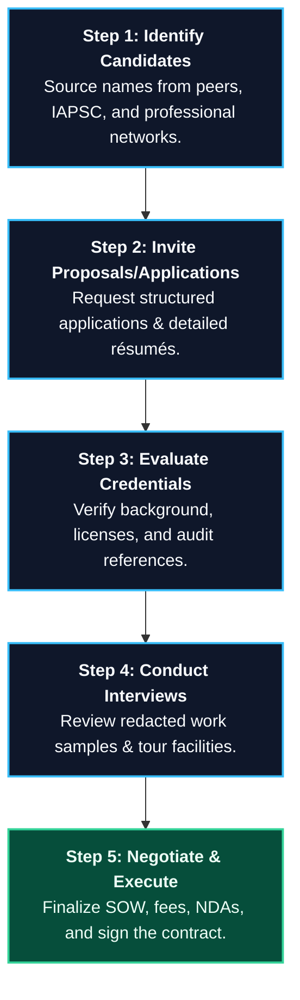

##### 1. Identifying Candidates
Compile a selective list of potential consultants through peer referrals and professional databases.

##### 2. Inviting Applications and Résumés
Provide candidates with a preliminary Scope of Work and invite them to submit a structured application (see the template in Appendix 4A) alongside a comprehensive professional résumé (see the template in Appendix 4B).
* **Analyze KSAs (Knowledge, Skills, and Abilities):** Meticulously review the candidate's KSAs to verify they possess hands-on, practical experience in the project's specific domain.
* **Licensing Verification:** In jurisdictions where security consultants must be legally registered or licensed, demand formal, up-to-date proof of compliance.

##### 3. Evaluating Credentials and References
Compare the documents and cross-reference candidates. Meticulously verify all educational background data, professional certifications (such as board certifications in security management or specialized physical security credentials), and active business licenses:
* **Reference Audits:** Contact multiple prior clients from the lists provided by the candidates. Utilize a structured questionnaire to evaluate the consultant's professionalism, timeliness, quality of deliverables, and ease of collaboration.

##### 4. Interviewing the Top Candidates
Conduct personal interviews with the top two to three candidates, led by at least two senior members of the organization’s management:
* **Review Redacted Work Samples:** Require candidates to bring high-quality, redacted samples of their past consulting reports. Inspect the analytical rigor, writing quality, and practicality of their past recommendations.
* **Facility Walkthrough:** Take the candidate on a brief tour of the facility to observe how they analyze the site in real-time.
* **Probe Security Philosophy:** Ask target questions to evaluate the candidate's core security philosophy. Ensure their approach is a strong, harmonious fit with your organization's culture and policies.

##### 5. Negotiating the Agreement
Commence formal negotiations with the top-ranked candidate. Define and finalize the precise scope of work, exact project deliverables, development schedules, billing terms, and reimbursable expenses.
* **Execute Supplementary Agreements:** Prior to commencing work, both parties must sign a formal, legally vetted consulting agreement (see Appendix 4C) alongside comprehensive Non-Disclosure Agreements (NDAs), Conflict of Interest declarations, and intellectual property clauses.
* *Negotiation Strategy:* If negotiations with the first-choice candidate stall or prove unsatisfactory, immediately terminate the discussions and proceed to the second-choice candidate.

---

### 4.6 Consulting Fees and Expenses

Consulting fees vary widely based on the subject matter complexity, the level of specialized expertise required, and the geographic region. 

> [!CAUTION]
> **The Commodity Trap:** Security managers must avoid the trap of selecting a consultant solely based on the lowest bid. A low fee is often highly deceptive: a less skilled consultant will take significantly longer to complete the project, produce low-quality deliverables, or make flawed recommendations that lead to massive, long-term costs.
> Furthermore, be extremely wary of security vendors or product manufacturers who offer "free" or heavily discounted consulting services. These recommendations invariably lead to biased proposals pushing the vendor's own high-margin equipment or guard services.

The higher billing rates of established, medium-to-large consulting firms reflect the support of dedicated analysts, technical writers, editors, and administrative staff who collaborate to deliver a highly refined team product. These fees cover direct project hours, active travel, and general overhead (office space, technology infrastructure, legal licensing, and G&A expenses).

#### 4.6.1 Standard Billing Structures

Consultants and clients typically utilize one or a combination of five standard billing structures:

* **Hourly Fees:** Most applicable when the project scope is highly fluid, unpredictable, or expected to last for a short duration. The consultant bills for the exact hours worked.
* **Daily Fees:** A standard structure for short-term on-site visits, training sessions, or audits. The consultant bills a flat rate per day.
* **Fixed Fees (Flat-Rate):** Highly recommended for projects with a clearly defined, stable Scope of Work and explicit deliverables. The client pays a set fee for the entire project, simplifying budgeting.
* **Not-to-Exceed Fees:** The consultant bills on an hourly or daily basis, but agrees to a hard financial cap. This model protects the client from unexpected budget overruns while ensuring they pay only for actual hours worked.
* **Retainers:** The client pays a recurring, upfront fee to secure the consultant's ongoing availability for advisory support or emergency response. Additional hourly or project fees typically accrue against the retainer.

#### 4.6.2 Expense Reimbursement Guidelines

To prevent billing disputes, the client must establish clear parameters governing reimbursable expenses at the outset of the relationship:
* **Documentation:** All expenses must be reimbursed at actual cost, supported by detailed, itemized receipts and submitted alongside standard expense reports (see Appendix 4C).
* **Travel Parity:** A standard best practice is to grant the consultant the same travel allowances given to the client's senior management.
* **Air Travel Limits:** Standard corporate policies limit air travel to coach accommodations, unless business or first-class travel is formally approved in advance.
* **International Travel:** Meticulously negotiate adjustments for international travel, which involves significant travel time and administrative complexity.
* **Resource Sharing:** To optimize budgets, clients should allow consultants to utilize on-site amenities, including dedicated office space, high-speed internet, administrative support, and copying services.

---

### 4.7 Working with Consultants

Once the contract is formally executed, the focus transitions to active project execution. Managing the consultant relationship effectively is critical to securing a high-quality product:

* **Executive Enfranchisement:** Before the consultant arrives on-site, the Chief Executive Officer (CEO) should issue a formal announcement to all senior managers and employees. This communication must outline the project’s goals and explicitly mandate the absolute cooperation and support of all staff. Enfranchising the staff early eliminates suspicion and accelerates the project.
* **The Project Coordinator:** Security management must appoint a dedicated Project Coordinator—typically the Chief Security Officer (CSO) or Vice President of Security—to serve as the consultant's primary liaison. The coordinator is responsible for providing data, scheduling interviews, and monitoring progress. A designated alternate must be appointed to cover absences, ensuring the project suffers no administrative delays.
* **The Internal Project Sponsor:** Identify a respected internal executive who acts as the project sponsor. This ally provides critical organizational context, advocates for the project in executive meetings, and helps navigate internal structures.

#### 4.7.1 Project Coordination and Liaison

The Project Coordinator and the cross-functional advisory committee serve as the vital bridge between the consultant and the enterprise. The committee must include representatives from key departments involved in the project (such as facilities management, HR, IT, and legal). Members must possess deep credibility and operational authority within the organization to facilitate data extraction and schedule physical audits smoothly.

#### 4.7.2 Organizational Orientation

The Project Coordinator must organize a comprehensive, structured orientation for the consultant prior to their meeting with key personnel:
* **Background Briefings:** Brief the consultant on the background, tenure, and exact responsibilities of key executives.
* **Enterprise Data Packages:** Provide an orientation package containing the current organizational chart, history of the enterprise, and background data on the operating environment.
* **Operational Context:** Detail the critical assets and primary business functions, internal and external corporate relationships, and all specific legislative and regulatory controls. Public companies must provide the latest annual reports to shareholders and government regulatory disclosure filings.
* **Previous Audits and Reports:** Dissect the results of all historical security audits and projects to help the consultant understand past successes and failures.
* **Red Flag Briefings:** Inform the consultant of any unique cultural idiosyncrasies, sensitive employee issues, or potential internal conflicts. While the consultant has a strict obligation to remain objective, independent, and candid in their reporting, being aware of internal dynamics prevents unnecessary friction and ensures a smooth, highly collaborative project.
* **International Sourcing:** When retaining a consultant for an international assignment, verify they possess deep, localized knowledge of the destination country's unique customs, visa regulations, working conditions, and local labor laws.


#### 4.7.3 Levels of Assistance

To maximize the value of the consultant's time and contain project costs, the client must ensure that all necessary in-house support, data, and administrative assistance are provided in a timely and coordinated manner. Key elements of internal cooperation include:
* **Cross-Functional Support:** Relevant corporate departments—including legal, human resources, public relations, facility management, and finance—must be instructed to assist the consultant upon request.
* **Technical Integration:** Qualified in-house technical staff (e.g., IT network engineers, facility engineers) should be made available to provide system diagrams, network architectures, and hardware inventories.
* **Administrative Assistance:** The project coordinator should assign administrative staff to help the consultant with document preparation, meeting schedules, and clerical tasks.

##### Information Security and Legal Safeguards
Because consultants are routinely granted access to highly sensitive proprietary data, physical floor plans, and system vulnerabilities, organizations must implement robust safeguards:
* **Non-Disclosure Agreements (NDAs):** A comprehensive, legally binding NDA must be executed before any proprietary data is shared.
* **Information Handling Protocols:** Define strict protocols for marking, storing, and transmitting sensitive data collected or generated during the project.
* **Safeguarding Deliverables:** Access to the consultant’s interim findings and final reports must be restricted to a strictly defined, "need-to-know" group of executives.

> [!IMPORTANT]
> **Legal Discovery Warning:** In many jurisdictions, written consulting reports are subject to discovery by opposing counsel in the event of subsequent litigation (e.g., negligent security lawsuits). Security management must consult with corporate legal counsel at the outset of the project to identify the proper legal custodian for the reports and evaluate whether establishing **attorney-client privilege** is necessary to protect sensitive vulnerability analyses from subpoena.

##### Travel and Logistics Coordination
For projects requiring visits to multiple corporate offices, manufacturing plants, or external vendor sites, the internal Project Coordinator should assume responsibility for all logistical arrangements. This includes:
* Securing temporary facility access and security badges in advance.
* Managing travel details, including hotel bookings, rental cars, and coordinating corporate transport if required.
* Organizing localized briefings on regional security conditions and cultural protocols for consultants traveling internationally.

##### Methodological Standards
A consultant’s findings and recommendations must be grounded in recognized, scientifically sound methodologies. Clients should ensure the consultant adheres to established industry standards, such as:
1. **Recognized Risk Assessment Standards:** Industry standard guidelines for evaluating assets, identifying threats, assessing vulnerabilities, and detailing risk mitigation strategies.
2. **IAPSC's Forensic Methodology Best Practices:** The definitive standard for independent, objective crime analysis and litigation support.
3. **ISO 31000 (Risk Management — Guidelines):** An internationally recognized, high-level framework that provides principles and generic guidelines on risk management across enterprises.

---

#### 4.7.4 Scope of Work

The **Scope of Work (SOW)** is the foundational document that defines the boundaries, objectives, and deliverables of the consulting assignment. It serves as the focal point for every inspection, interview, and analysis conducted by the consultant.

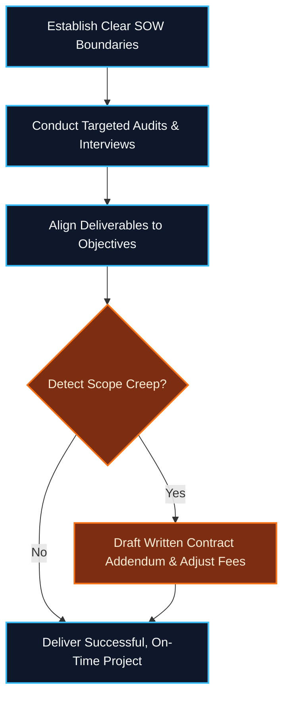

##### Controlling "Scope Creep"
During project execution, either the client or the consultant may identify additional areas of concern that warrant investigation. This expansion of the project beyond its original parameters is known as **scope creep**.
* *Risks:* If left unmanaged, scope creep can lead to massive budget overruns, delayed deliverables, and resource exhaustion.
* *Mitigation:* The scope of work must never be expanded informally. Any modifications to the project's objectives, timelines, or billing caps must be formally documented and executed as a written, signed addendum to the consulting contract.

---

#### 4.7.5 Work Plans and Milestone Tracking

Once the SOW is finalized, the consultant and the Project Coordinator must collaborate to establish a detailed **Work Plan**. This plan maps out specific tasks, assigns responsibilities, and sets firm deadlines.

* **Milestone Charts:** The work plan should establish key project milestones (e.g., completion of physical site audits, draft report submission, final presentation) to allow management to track progress in real-time.
* **Earned Value Analysis (EVA):** Especially on large, multi-phase projects, the coordinator and consultant should perform periodic earned value analyses. This management technique measures project performance and progress by comparing the actual work performed against the project budget and timeline, ensuring the client receives full value for hours billed.
* **Accountability:** Internal staff must respect the project timeline. A delay in delivering requested data or scheduling internal interviews can stall the consultant's work and inflate the final project cost.

---

#### 4.7.6 Progress Reporting

Regular communication ensures the project remains aligned with the client’s strategic goals. The frequency and format of progress updates should be tailored to the project’s scale and complexity:

* **Interim Briefings:** For short-term or highly focused projects, regular phone calls or brief emails may suffice, eliminating the overhead of formal written progress reports.
* **Progress Meetings:** On larger initiatives, regular progress meetings should be held. These meetings should include the consultant, the Project Coordinator, and key members of the advisory committee.
* **Meeting Minutes:** A designated team member should record and distribute the minutes of all progress meetings. The minutes must clearly document decisions made, milestone completions, upcoming tasks, and specific action-item assignments with deadlines.

---

#### 4.7.7 Final Reports and Executive Presentations

The culmination of every security consulting project is the delivery of a comprehensive **Final Report**. This formal document serves as the permanent record of the project's findings and provides the strategic roadmap for the organization's future security posture.

##### Structure of a Gold-Standard Final Report
A professional consulting report must be structured logically, ensuring readability for both executive leaders and technical personnel:
1. **Executive Summary:** A concise, high-impact summary of the project’s objectives, key findings, and high-level recommendations, tailored for senior executives and board members who require a rapid strategic overview.
2. **Methodology:** A transparent explanation of the standards, data sources, and analytical frameworks utilized to conduct the study.
3. **Assessment & Analysis:** The detailed core of the report, documenting the actual assets evaluated, threats analyzed, vulnerabilities identified, and crime analyses performed.
4. **Actionable Recommendations:** A numbered list of specific, prioritized, and cost-justified remedial actions, detailing the exact physical, electronic, and procedural upgrades needed.

> [!TIP]
> **Numbered Recommendations for Future Project Tracking:** Each recommendation in the final report must be assigned a unique, sequential number (e.g., *Recommendation #23: Upgrade the high-security cash vault entry to a dual-technology biometric portal and secondary interlocking mantrap*). This practice allows the organization to easily track implementation progress, approve individual initiatives (e.g., *Project #23*), and assign internal project managers.

##### Professional Executive Recruitment Services
When a consultant conducts a comprehensive security audit and recommends the establishment of a formal, internal corporate security department, the organization's management often realizes they lack the specialized expertise to source and hire the right leadership. 
In these instances, organizations frequently retain the consultant to perform executive search services to identify, prequalify, and recruit a permanent Chief Security Officer (CSO) or Director of Security.
* **Standard Industry Fees:** The standard professional fee for an executive search in the security industry ranges from **25% to 30% of the recruited executive’s first-year base salary**, plus all reasonable travel and administrative expenses incurred during the search process.

---

#### 4.8 The Future of Security Consulting

As corporate environments face increasingly volatile, complex, and digital threats in the 21st Century, the reliance on specialized security consultants is projected to rise significantly:
* **The Downsizing Paradox:** As organizations strive for leaner operational models, they frequently downsize permanent, in-house security staffs. To compensate for this loss of internal depth, corporations rely heavily on external consultants to provide highly specialized expertise on an as-needed basis.
* **Niche Specialization:** The broadening scope of assets protection has driven extreme specialization within the consulting field. Rather than acting as broad generalists, many consultants now specialize exclusively in narrow domains such as digital executive protection, maritime supply-chain security, complex threat-risk modeling, or advanced technical surveillance countermeasures (TSCM).
* **Strategic Consulting Alliances:** To deliver comprehensive solutions for large-scale, complex projects, independent consultants increasingly form strategic, multi-disciplinary alliances. For example, an independent security management consultant designing a physical security program will partner with an allied technical consultant to engineer the electronic security blueprints, and a forensic consultant to review liability and crime foreseeability standards.

---

### Appendix 4A: Application for Consulting Assignment

| **Field** | **Consultant Response** |
| :--- | :--- |
| **Consultant Name** | |
| **Firm Name** | |
| **Firm Address** | |
| **Phone Number** | |
| **Email Address** | |
| **Website** | |
| **Primary Area of Expertise** | |
| **Last Corporate Position** | |
| **Date Left Last Employer** | |
| **Date Commenced Consulting Practice** | |
| **Total Years of Practice** | |
| **Highest Level of Education** | |
| **University / College** | |
| **Professional Affiliations & Certifications** | |
| **Length of Professional Memberships** | |
| **Industry Awards & Recognitions** | |
| **Key Published Works & Articles** | |
| **Standard Daily / Hourly Billing Rate** | |

#### Professional References

##### Reference #1
* **Contact Person Name & Title:** ________________________________________
* **Phone Number:** ____________________  **Email Address:** ____________________
* **Project Scope / Deliverables:** ________________________________________
* **Project Duration & Date:** ________________________________________

##### Reference #2
* **Contact Person Name & Title:** ________________________________________
* **Phone Number:** ____________________  **Email Address:** ____________________
* **Project Scope / Deliverables:** ________________________________________
* **Project Duration & Date:** ________________________________________

> [!IMPORTANT]
> **Mandatory Attachments Required:**
> 1. Certified copies of professional indemnity (Errors & Omissions) insurance certificates with a minimum coverage limit of **$1,000,000**.
> 2. Certified copies of Commercial General Liability (CGL) insurance certificates with a minimum coverage limit of **$1,000,000 per occurrence / $2,000,000 aggregate**.
> 3. Full professional curriculum vitae / résumé.

---

### Appendix 4B: Sample Professional Résumé

### John Doe
**Independent Security Management Consultant**  
*Email: john.doe@securityconsulting.com | Phone: (555) 019-2834 | Web: www.doe-security-advisory.com*

---

### Executive Profile
Highly credentialed, board-certified protection professional with over 40 years of combined experience in military police operations, public law enforcement, and academic instruction. A recognized industry expert specializing in comprehensive security risk assessments, facility vulnerability analyses, and custom assets protection program design. 

---

### Areas of Expertise
* Strategic Security Management & Policy Design
* Facility Threat, Vulnerability, and Risk Assessments (TVRA)
* Use of Force Continuum Training & Policy Audits
* Crime Prevention Through Environmental Design (CPTED)
* Litigation Support & Negligent Security Expert Witness Testimony

---

### Professional Experience

#### **Principal Security Consultant** | *Doe Security Advisory Services* | **2022 – Present**
* Conducted over 40 comprehensive security threat-risk assessments across multiple industry sectors, including retail, healthcare, manufacturing, and critical infrastructure.
* Designed a state-of-the-art electronic security and access control system for a new state-licensed cannabis dispensary, establishing audited standard operating procedures (SOPs) for the facility’s protective force.
* Formed strategic alliances with lead technical and forensic engineering consultants to deliver integrated security architectural designs for new building constructions.

#### **Assistant Professor of Security Science** | *Any State University* | **2009 – 2022**
* Developed and instructed undergraduate curriculum in corporate security management, security system design, and the legal aspects of private security.
* Served as a guest lecturer and academic advisor for local law enforcement training academies.

#### **Deputy Sheriff / Captain of Patrol** | *Security County Sheriff’s Department* | **1983 – 2009**
* Directed daily patrol operations, tactical response units, and specialized crime prevention programs across a diverse municipal jurisdiction.
* Supervised high-profile criminal investigations, emergency planning, and joint task force operations with state and federal agencies.

#### **Military Police Specialist** | *United States Army* | **1980 – 1983**
* Executed tactical security operations, force protection, and physical security audits at highly secured military installations.

---

### Education
* **Bachelor of Science (B.S.) in Police Science & Administration** | *Any State University*

---

### Professional Affiliations & Certifications
* **Board-Certified in Security Management**
* **Active Member** | *International Association of Professional Security Consultants (IAPSC)*
* **Active Member** | *Institute of Management Consultants (IMC)*
* **Recipient of the IAPSC Distinguished Service Accolade (2018)**

---

### Key Publications
* **Book:** *Training the Security Officer*, Century Press, 2021.
* **Article:** *"Why Security Counts in Modern Commercial Real Estate,"* Assets Protection Magazine, August 2020.
* **Chapter:** *"Consultants as Strategic Trainers,"* in *Security Consulting: A Comprehensive Guide*, Worldwide Publishers, 2018.

---

### Verified Knowledge, Skills, & Abilities (KSAs)
* **Advanced System Design:** Proven track record in translating high-level organizational requirements into functional security systems. Designed physical and technical security architectures for retail, financial, and industrial facilities.
* **Training Program Design:** Developed and audited use of force and defensive tactics curricula implemented by large corporate entities across 28 distinct operational sites.
* **Technical Proficiency:** Certified in CAD/CAM design software and highly proficient with leading enterprise access control, intrusion detection, and IP video surveillance architectures (including certifications from major system manufacturers).

---

### Appendix 4C: Professional Consulting Services Agreement

**THIS AGREEMENT** is made and entered into as of this _____ day of _______________, 20___, by and between:
* **The Consultant:** ________________________________________ (an independent contractor, hereinafter referred to as the "Consultant"), and
* **The Company:** ________________________________________ (hereinafter referred to as the "Company").

#### WITNESSETH:

**WHEREAS**, the Company desires to retain the professional services of the Consultant to perform specialized security consulting and advisory services in connection with the operations of the Company; and

**WHEREAS**, the Consultant is willing and qualified to perform such professional services as an independent contractor under the terms and conditions hereinafter set forth;

**NOW, THEREFORE**, in consideration of the mutual covenants, promises, and agreements herein contained, the parties hereto agree as follows:

---

##### 1. Independent Contractor Status & Term
This Agreement is established with the Consultant solely as an independent contractor, and nothing herein shall be construed to create an employer-employee, partnership, or joint-venture relationship. The Company hereby retains the Consultant, and the Consultant hereby agrees to perform the professional services specified herein commencing on **[Start Date]** and concluding on **[End Date]**, unless terminated earlier in accordance with Section 10 of this Agreement.

##### 2. Statement of Work (SOW)
The Consultant shall perform the professional services described in the attached **Exhibit A: Scope of Work**, which is incorporated into and made a part of this Agreement. The work shall be performed at such times and locations as are mutually agreeable to both parties.

##### 3. Professional Fees & Payment Terms
* **Billing Structure:** The Company shall compensate the Consultant at a rate of **$__________ per [Hour / Day]** for services rendered under this Agreement.
* **Financial Cap:** Unless authorized in writing by a formal amendment signed by both parties, the total compensation payable to the Consultant under this Agreement shall not exceed **$__________** (representing a maximum of ________ hours / days).
* **Travel Time Compensation:** Travel time authorized in advance by the Company shall be compensated at a rate of **$__________ per hour** (or the standard hourly rate as agreed upon).
* **Payment Terms:** The Consultant shall submit detailed, itemized monthly invoices to the Company. Approved invoices shall be paid net thirty (30) days from the date of receipt.

##### 4. Intellectual Property and Patent Rights
The Consultant shall promptly and fully disclose to the Company all ideas, inventions, discoveries, designs, and improvements (hereinafter referred to as "Subject Inventions"), whether patentable or not, conceived or first reduced to practice by the Consultant in the performance of work under this Agreement, provided such Subject Inventions are based upon or derived from non-public, proprietary information disclosed by the Company. 
* All such Subject Inventions, together with all associated records, drawings, and technical data, shall become the sole and exclusive property of the Company.
* The Consultant agrees to execute all documents and take all necessary actions, both during and after the term of this Agreement, to assist the Company in obtaining patents and vesting sole title to the Subject Inventions in the Company or its designee.

##### 5. Copyrights and Written Deliverables
All written materials, reports, manuals, policies, blueprints, and other copyrightable works produced by the Consultant under this Agreement shall be considered "works made for hire" and shall remain the sole and exclusive property of the Company. The Company shall possess the exclusive right to secure copyrights in such works worldwide. The Company may, in its sole discretion, grant the Consultant a non-exclusive, royalty-free license to publish or utilize such writings under specific conditions, provided it does not violate corporate security or non-disclosure protocols.

##### 6. Professional Standards of Quality
The Consultant warrants and covenants that all professional services performed under this Agreement shall represent their best efforts and shall be executed in accordance with the highest industry standards of professional care, analytical rigor, and quality.

##### 7. Information Security & Classified Data
The Company shall identify and clearly mark any classified, proprietary, or restricted information made available to the Consultant. The Consultant agrees to strictly comply with all security controls, information protection policies, and non-disclosure requirements established by the Company or the government.
* **Defense Industrial Security:** If the assignment requires access to government-classified material, the Consultant must maintain a system of security controls in strict accordance with the **Department of Defense National Industrial Security Program Operating Manual (NISPOM)**. Classified documents must never be stored outside authorized Company facilities unless a formal facility clearance (FCL) has been granted by the Defense Counterintelligence and Security Agency (DCSA).
* Upon termination of this Agreement or the associated security agreement, the Consultant shall immediately return all classified or proprietary material in their possession to the Company.

##### 8. Risk of Loss & Insurance Requirements
* **Assumption of Risk:** The Consultant assumes all risk of personal injury, illness, and all risk of damage to or loss of their personal property while performing work under this Agreement.
* **Commercial Liability Coverage:** The Consultant shall maintain, at their sole expense, **Commercial General Liability (CGL)** insurance covering their operations with a minimum limit of **$1,000,000 per occurrence / $2,000,000 aggregate**, and **Professional Liability (Errors & Omissions)** insurance with a minimum limit of **$1,000,000**.
* **Subcontractor Insurance:** If the Consultant employs others to perform authorized work under this Agreement on Company premises, the Consultant must provide acceptable certificates of insurance demonstrating equivalent coverage limits for all subcontractors.

##### 9. Privileged and Proprietary Information
The Consultant shall not, either during the term of this Agreement or at any time thereafter, disclose, copy, or utilize any non-public, proprietary, or privileged Company information acquired during the course of the consulting assignment for any purpose other than the direct execution of their duties under this Agreement, without the prior written consent of the Company.

##### 10. Termination
Either party may terminate this Agreement, in whole or in part, at any time and for any reason (convenience) by providing **thirty (30) days' written notice** to the other party. In the event of termination, the Company shall compensate the Consultant for all authorized services performed and reimbursable expenses incurred up to the effective date of termination, and the Consultant shall immediately deliver all completed or in-progress work products to the Company.

---

**IN WITNESS WHEREOF**, the parties hereto have executed this Professional Consulting Services Agreement as of the day and year first written above.

```
By: ______________________________________       By: ______________________________________
    [Authorized Company Representative]               [Consultant Signature]

Title: ___________________________________       Title: ___________________________________

Date: ____________________________________       Date: ____________________________________
```

---

#### Exhibit B: Consulting Security Agreement — Joint Certification

The Consultant and the Company (hereinafter referred to as the "Contractor") hereby certify, warrant, and agree as follows:
1. Under no circumstances shall physical copies of classified or restricted information be removed from the designated premises of the Company without explicit, written authorization from the Chief Security Officer.
2. The performance of all sensitive or classified portions of the consulting contract shall be accomplished exclusively on the secure premises of the Company.
3. The Consultant, its employees, and authorized subcontractors shall not disclose classified or proprietary information to any unauthorized person.

```
For the Consultant:                              For the Contractor (Company):

Signature: _______________________________       Signature: _______________________________
Date: ____________________________________       Date: ____________________________________
```

---

#### Exhibit C: Conflict of Interest Statement

The undersigned Consultant warrants that, to the best of their knowledge, information, and belief, there are no relevant facts, active business associations, or personal relationships that could give rise to an organizational or personal conflict of interest in connection with the performance of this consulting assignment.

The Consultant further covenants that if a potential, actual, or perceived conflict of interest is discovered during the course of the project, they will immediately make a full, written disclosure to the Company’s Contracting Officer, detailing the exact nature of the conflict and proposing specific, robust measures to mitigate or eliminate it.

```
Consultant Signature: ____________________________________    Date: ______________________
```

---

#### Exhibit D: Professional Services Log

* **Consultant Name:** ________________________________________
* **Project Reference / Task:** ________________________________________
* **Internal Monitor / Requestor:** ________________________________________

##### Instructions to the Monitor:
1. Record and verify the consultant’s work on the same day the services are performed.
2. Compare the entries on this log with the final Statement of Professional Services submitted by the consultant to ensure absolute accuracy and completeness before approving payment.
3. Require full, written justification for all off-site work, travel, and car rentals.
4. Retain this verified log in the project file for a minimum of **three (3) years** for audit purposes.

| **Date** | **Operating Hours** | **Job Order / Task #** | **Description & Evaluation of Work Performed** | **Approved By (Initial)** |
| :--- | :--- | :--- | :--- | :--- |
| | | | | |
| | | | | |
| | | | | |
| | | | | |
| | | | | |

```
Signature of Requestor / Monitor: ____________________________________    Date: ______________________
```

---

#### Exhibit E: Statement of Professional Services (Billing Sheet)

* **Consultant Name:** ________________________________________
* **Billing Period:** Week Ending ____________________
* **Firm Address:** ________________________________________  
* **City, State, Zip Code:** ________________________________________

##### Billing Summary:

| **Project / Task Name** | **Contract #** | **Mon** | **Tue** | **Wed** | **Thu** | **Fri** | **Sat** | **Sun** | **Total Hours** | **Rate ($)** | **Total ($)** |
| :--- | :--- | :---: | :---: | :---: | :---: | :---: | :---: | :---: | :---: | :---: | :---: |
| | | | | | | | | | | | |
| | | | | | | | | | | | |
| **TOTALS** | | | | | | | | | | | |

##### Transportation & Travel Expenses (Supported by Receipts):

| **Date** | **Origin** | **Destination** | **Mode of Transport** | **Ticket / Fuel Cost ($)** | **Authorized Mileage** | **Mileage Cost ($)** |
| :--- | :--- | :--- | :--- | :---: | :---: | :---: |
| | | | | | | |
| | | | | | | |

##### Incidental & Lodging Expenses (Supported by Receipts):

| **Date** | **Lodging Cost ($)** | **Meals Cost ($)** | **Parking / Tolls ($)** | **Telecomm ($)** | **Other Expenses ($)** | **Description / Explanation** |
| :--- | :---: | :---: | :---: | :---: | :---: | :--- |
| | | | | | | |
| | | | | | | |

**TOTAL AMOUNT DUE FOR REIMBURSEMENT: $____________________**

```
Consultant Signature: ____________________________________    Date: ______________________

Approved By Monitor: ____________________________________    Date: ______________________

Audited By Finance: _____________________________________    Date: ______________________
```

---

#### Exhibit F: Consultant Travel & Expense Policy

All security consultants traveling on authorized Company business are expected to adhere to the provisions of the Company's Travel Policy to establish the reasonableness and necessity of travel costs. 

##### 1. Expense Substantiation Guidelines
* **Substantiation Period:** The Consultant must submit a fully documented, signed Travel Expense Report (Exhibit E) with all original receipts attached within **thirty (30) days** after the completion of each trip.
* **Receipt Threshold:** Original receipts, paid bills, or electronic invoices are required for all individual expenditures exceeding **$10.00** (with the exception of meals, which may be reimbursed on a flat per diem or actual basis as agreed).
* **IRS Compliance:** The documentation requirements set forth in this policy conform to Internal Revenue Service (IRS) regulations governing business travel expense substantiation.

##### 2. Standard Allowable Expenses
* **Air Travel:** Air travel must be booked in coach / economy class. Premium, business, or first-class accommodations are prohibited unless:
  1. No economy seating is available on the required schedule.
  2. The flight is overnight, departs between 9:00 PM and 6:00 AM, and has a continuous duration of **four (4) hours or longer**.
  3. First-class travel is medically required and supported by a doctor’s certificate.
* **Lodging Limits:** Reimbursable lodging is capped at a reasonable local rate, not to exceed **$250.00 per night** (including taxes), unless higher rates are authorized in advance for high-cost metropolitan areas.
* **Meal Allowances:** Actual meal expenses are reimbursed up to a maximum cap of **$75.00 per day** for three meals. No alcohol purchases are reimbursable.
* **Personal Vehicles:** Use of personal motor vehicles is authorized for domestic travel and reimbursed at the current standard IRS mileage rate. The total mileage reimbursement shall not exceed the cost of an equivalent economy-class airfare. 
  * *Commuting Rule:* Consultants residing within a **50-mile radius** of the Company facility are considered local and are not entitled to meals, lodging, or commuting mileage reimbursements.
  * *Insurance Requirement:* To utilize a personal vehicle on Company business, the Consultant must certify that the vehicle is covered by a primary liability insurance policy with minimum limits of **$250,000 per person / $500,000 per accident** for bodily injury, and **$50,000** for property damage.
* **Automobile Rentals:** Compact or standard-sized vehicles are authorized when public transit is impractical. Sports cars, SUVs, or luxury models are strictly non-reimbursable. Full collision damage waiver (CDW) insurance purchased from the rental agency is reimbursable. Rental accidents must be immediately reported to law enforcement, the rental agency, and the Company’s Security Operations Center.
* **Telecommunications:** Reasonable, business-related phone calls, high-speed internet fees, and data transfer costs are fully reimbursable.
* **Excluded Expenses:** The Company does not assume liability for, nor reimburse:
  * Loss of personal cash, luggage, or damage to personal property while in travel status.
  * Traffic fines, parking tickets, or toll violations.


## Chapter 5: Executive Protection

Executive Protection (EP), also referred to as close protection, encompasses the specialized physical security, threat intelligence, and risk mitigation measures deployed to safeguard individuals who face elevated personal risks. These risks typically stem from their organizational prominence, corporate employment, high-profile public stature, ultra-high net worth, or controversial institutional affiliations. 

While popular culture often depicts executive protection through the lens of imposing "bodyguards" relying solely on physical force, modern professional EP operates as a highly strategic, intelligence-led discipline. The primary goal of a close protection agent is **proactive prevention and absolute avoidance of harm**.

---

### 5.1 Principles and Collateral Value of Executive Protection

The foundational philosophy of professional executive protection is built upon a distinct operational mindset that differs fundamentally from traditional law enforcement:

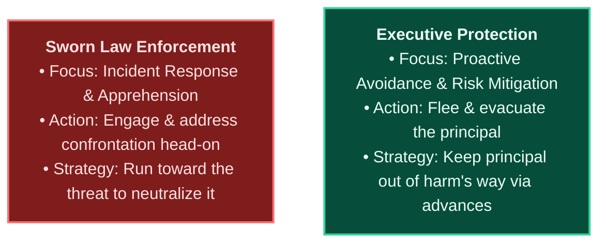

#### 5.1.1 Targeted Principals
An enterprise must assess and provide structured close protection for several categories of individuals:
* **Prominent Corporate Leaders:** CEOs, founders, and key executives whose incapacitation or kidnapping would cause catastrophic operational, financial, and reputational damage to the organization.
* **Public Figures and Celebrities:** Iconic individuals whose public prominence makes them highly recognizable, attracting stalkers, crowds, and intrusive media.
* **Controversial Figures:** Individuals holding high-profile political, religious, or social positions that draw intense ideological opposition or targeted threats.
* **Ultra-High-Net-Worth Individuals (UHNWIs):** High-wealth individuals and their immediate families who face disproportionate risks of extortion, kidnapping for ransom, and targeted cyber extortion.

#### 5.1.2 Proactive Planning vs. Overkill
The design of an EP program must be strictly aligned with the principal’s actual risk profile. Implementing heavy, highly visible security details where the threat does not warrant it (e.g., deploying four armed agents to a low-risk internal corporate event where peers have none) destroys the security program's credibility and alienates the client. Modern EP relies on **discreet, scalable, and highly planned operations** that blend seamlessly into the executive's professional environment.

#### 5.1.3 The Collateral Benefits of Executive Protection
While close protection requires a substantial financial commitment, a premier program delivers significant operational efficiency and return on investment (ROI) by optimizing the executive's daily workflow through soft skills:

* **Security Drivers & Route Logistics:** Highly trained security drivers do not merely mitigate vehicular safety risks. They conduct thorough primary and alternate route advances, monitor live traffic telemetry, identify secure drop-off/pick-up corridors, and manage vehicle positioning. This meticulous planning eliminates travel delays, directly saving the executive valuable time.
* **Time Management & Productivity:** By managing schedules, pre-checking venue entries, and establishing secure walking corridors, EP agents minimize the executive’s exposure to chaotic crowds and administrative hurdles. This allows the executive to move swiftly between meetings without distraction.
* **Travel Logistics & Peace of Mind:** EP details coordinate all travel logistics—including flight manifests, secure terminal transfers (Fixed-Base Operators), hotel security audits, and local medical contingencies. This comprehensive advance planning frees the principal to focus entirely on their business objectives.
* **Preserving Normalcy:** For high-profile or iconic figures, routine daily activities can invite persistent public approaches, representing both a nuisance and a security risk. Experienced EP agents employ discreet management techniques that preserve the executive's privacy and maintain a sense of personal normalcy.

---

### 5.2 Domains of Protective Operations

Executive protection details operate within distinct corporate, private, and government environments, each characterized by unique regulatory boundaries, operational cultures, and statutory authority.

#### 5.2.1 Corporate Executive Protection
Corporate EP programs safeguard business continuity and protect shareholder value by ensuring key leaders remain safe and operational. 

##### Models of Corporate EP
Organizations typically implement one of three operational models to manage their close protection needs:
1. **Proprietary (In-House) Model:** EP personnel are full-time employees of the corporation. This model is ideal for mature security organizations with board-mandated protection requirements, providing absolute control over training, corporate alignment, and operational standards.
2. **Outsourced (Vendor-Managed) Model:** The corporation retains specialized EP firms to provide close protection. This is highly effective for organizations with occasional travel security needs or event-specific protective requirements.
3. **Hybrid Model:** The optimal corporate structure. A small core of proprietary full-time security executives set the strategic roadmap, policies, and operational standards, while utilizing vetted local vendors to provide specialized regional support, armored vehicles, and local security drivers globally.

##### The Detail-Oriented Corporate Diplomat
Corporate EP agents must act as "corporate diplomats." They must possess acute business acumen and a sharp eye for corporate detail. For example, if a principal is visiting a major commercial partner, the security team must coordinate vehicle selections to ensure the motorcade uses the partner's brand or avoids competitive branding, thereby eliminating corporate embarrassment and unnecessary distractions.

##### IRS Tax Exemption Requirements
In the United States, corporate security programs must ensure that close protection services provided to executives are not taxed as an imputed "executive perk" (taxable income). To classify security as a tax-exempt **working condition fringe benefit** under IRS Code Section 132(a)(5), the program must demonstrate a **bona fide business-oriented security concern** by satisfying three strict criteria:
1. **Board Resolution Mandate:** The board of directors must formally approve and mandate a 24/7 corporate security program based on a corporate policy.
2. **Independent Risk Assessment:** The company must establish a verifiable threat or elevated personal risk through a formal, documented risk assessment.
3. **Annual Security Audit:** The corporation must commission a qualified, independent external security consultant to perform an annual audit of the program and verify that the elevated threat level remains active and valid.

#### 5.2.2 Celebrity and High-Profile Protection
Celebrity protection, historically referred to as "bodyguarding," has evolved into a highly professionalized, intelligence-driven discipline. Stature in the media, high public visibility, and public brands characterize this domain:
* **Stalker and Fixated Person Threat:** Celebrities face unique risks from fixated individuals, obsessed fans, and active stalkers. This requires close integration between the protective detail and a robust protective intelligence function that monitors social media, fan mail, and digital communications.
* **Situational Vulnerability:** High-profile entertainers and professional athletes frequently operate in unpredictable, high-density public spaces (e.g., nightclubs, concerts, promotional events). Meticulous crowd control, egress route advances, and active de-escalation are essential to mitigate the risk of physical altercations, targeted robberies, and public harassment.

#### 5.2.3 Sworn Government Dignitary Protection
National, state, and local governments maintain specialized units to protect key public officials, foreign dignitaries, and heads of state. Highly visible examples include the **U.S. Secret Service (USSS)**, the **Diplomatic Security Service (DSS)**, and the Metropolitan Police **Specialist Protection Command (SO1)** in the United Kingdom.

While government protective details share the same core protective goals as private details, their statutory authority, training, and operational frameworks differ significantly:

| **Operational Dimension** | **Sworn Government Details (e.g., USSS, DSS, SO1)** | **Private / Corporate Executive Protection** |
| :--- | :--- | :--- |
| **Statutory Authority** | Derived from specific statutory laws (e.g., 18 U.S.C. § 3056). Grants power to seize public spaces, establish perimeters, and control airspace. | No formal law enforcement authority. Operates strictly within standard civil trespass and private property rights. |
| **Sworn Officer Status** | Agents are sworn federal, state, or municipal law enforcement officers with full powers of arrest. | Operates as private citizens or licensed private security contractors under local jurisdiction licensing. |
| **Right to Carry Weapons** | Lawfully armed under federal or national law, exempt from most local municipal firearm restrictions. | Strictly bound by local state, municipal, and national licensing, permitting, and carry laws. |
| **Training & Vetting** | Subject to highly rigorous, standardized federal academy training, secret clearance vetting, and mandatory tactical/physical re-qualification cycles. | Training and physical fitness standards vary widely; elite corporate programs enforce proprietary vetting and peer-reviewed curricula. |
| **Advance Report Protocols** | Mandatory, highly structured Advance Reports filed through official command hierarchies for formal agency approval. | Standard Operating Procedures dictate advance planning, with reports reviewed by corporate security managers or the CSO. |
| **Oversight & Investigation** | Incidents are subject to intense scrutiny, including formal congressional inquiries, public commissions, and independent inspector general audits. | Incidents are reviewed through internal corporate audits, civil litigation, and standard local law enforcement investigations. |

#### 5.2.4 Faith-Based Protection
Faith-based close protection focuses on safeguarding prominent religious and theological leaders. Because religious leaders are highly visible, frequently engage massive crowds, and speak on highly controversial or deeply personal topics, they present unique risk profiles:
* **The "Divine Fixation" Risk:** Operatives must manage individuals who suffer from mental illness or religious delusions, seeking close physical contact with the leader under the belief they possess divine or healing properties.
* **Extreme Ideological Opposition:** Religious leaders frequently face targeted threats and violent opposition from fanatic or extremist groups who oppose their theological teachings.

#### 5.2.5 Modern Hybrid Models & The Corporate Diplomat
Modern global dynamics have created a hybrid class of leaders. Prominent CEOs and high-profile corporate founders now command massive social media followings, routinely speak out on sensitive geopolitical, social, and economic issues, and are viewed as iconic, celebrity-like public figures. 

This modern shift requires EP programs to adopt a **holistic hybrid protection model** that treats the corporate executive with the same level of brand protection, protective intelligence, and digital threat management traditionally reserved for high-profile celebrities, while maintaining the corporate rigor of fiduciary risk management.

---

### 5.3 Executive Protection Program Management

Designing, implementing, and managing a world-class EP program requires a structured, Enterprise Security Risk Management (ESRM) aligned framework that integrates physical, technical, and digital threat mitigation.

#### 5.3.1 Threat, Vulnerability, and Risk Assessments (TVRA)
A comprehensive, principal-specific TVRA is the cornerstone of a successful protective program. Unlike static facility risk assessments, a protective TVRA focuses on a dynamic target—the principal—and must analyze four core threat vectors:

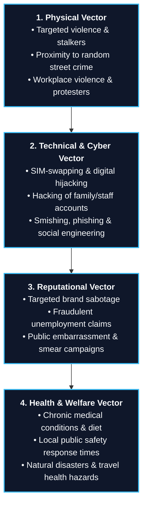

* **Physical Threat Vector:** Assesses the likelihood of targeted violence, stalkers, random crimes, and protests. Proximity crime risks are analyzed by evaluating the crime rates and emergency response capabilities around the principal's offices, residences, and frequent destinations.
* **Technical & Cyber Threat Vector:** Assesses the digital exposure of the principal and their immediate circle. Adversaries frequently target the mobile devices, personal email accounts, and social media of family members or personal staff (e.g., executive assistants, chefs, drivers) as soft entry points to compromise the principal’s sensitive communications. High-priority digital threats include SIM-swapping, SIM-hijacking, smishing (SMS phishing), and personal brand impersonation.
* **Reputational Threat Vector:** Evaluates threats targeting the personal and corporate brand of the principal, such as coordinated smear campaigns, fraudulent banking or unemployment claims filed in their name, and deliberate attempts to provoke or embarrass the executive in public.
* **Health and Welfare Vector:** Evaluates the principal's medical history, dietary requirements, and physical vulnerabilities. A critical factor in this vector is auditing the average **local public safety response times** (police, fire, EMT) around the principal's static locations. 

> [!TIP]
> **Emergency Medical Response Thresholds:** If an audit reveals that municipal EMT or police response times exceed a tolerable window (e.g., more than 8 minutes), the EP manager must implement enhanced in-house mitigations. This includes maintaining advanced trauma kits on-site, requiring on-duty agents to possess EMT certifications, and designing dedicated secure shelter-in-place rooms equipped with emergency communications and medical life-support systems.

#### 5.3.2 Attractiveness and Likelihood of Success
In determining the executive's final risk profile, the TVRA evaluates two primary variables:
1. **Attractiveness of the Target:** Attractiveness is a function of the principal's public visibility, personal wealth, access to sensitive corporate assets, and status as an iconic social, political, or economic figure. A highly attractive target naturally increases the likelihood of adversarial targeting.
2. **Likelihood of Success:** Analyzes how easily an adversary could execute a threat based on the current gaps in the principal's security posture, lifestyle habits, and travel practices.

#### 5.3.3 Graduated Protection Frameworks
A professional corporate EP program implements a graduated protection framework to optimize resources and ensure operational proportionality. The full weight of a 24/7 close protection detail is typically reserved for the CEO, whereas other members of the C-suite are provided with graduated levels of support (e.g., executive transportation, secure drivers, travel security briefings, and active protective intelligence monitoring) based on their individual risk exposure.

#### 5.3.4 Role of the Executive Protection Manager
The EP Manager is responsible for the strategic design, operational execution, and daily administration of the protective program:
* Contributing to the development of corporate security policies, including strict Use of Force protocols and firearm compliance guidelines.
* Developing comprehensive security awareness, travel safety, and personal protection training plans for all corporate employees.
* Directing event security operations, executive residence security designs, and managing specialized technical countermeasure (TSCM) sweeps.
* Supervising the execution of **Advance Work**: performing physical advances of travel routes, surveying hotels, establishing local law enforcement liaisons, and verifying emergency medical corridors.
* Managing the program’s financial performance, vendor relationships, and establishing clear operational transparency for corporate stakeholders.

#### 5.3.5 Metrics and Return on Investment (ROI)
To secure ongoing corporate funding and demonstrate value to the executive board, the EP program must track and present clear, quantifiable metrics, including:
* Number of credible threats detected, analyzed, and mitigated by the protective intelligence team.
* Total executive hours saved through efficient route planning, advanced airport transfers, and logistical coordination.
* Number of high-risk international trips successfully planned, advanced, and executed.
* Key Performance Indicators (KPIs) focused on stakeholder satisfaction, operational readiness (training drills, physical fitness evaluations), resource responsiveness, and budget variance.

#### 5.3.6 Core Competencies of Protective Personnel
The success of any close protection program relies entirely on the quality of its personnel. Standardized **Core Competencies** for professional protective personnel, validated through comprehensive industry studies and collaboration with academic research institutions, are divided into three core domains:

##### 1. Personal Attributes & Soft Skills
Critical behavioral attributes that cannot be acquired through tactical training:
* Absolute professional integrity, sound judgment, and acute self-awareness.
* Exceptional critical thinking, real-time problem-solving, and emotional intelligence.
* High-level written and verbal communication skills, including de-escalation tactics.

##### 2. Legal, Ethical, and Jurisdictional Competency
* Deep understanding of jurisdictional licensing, regulatory compliance, and civil liability.
* Mastery of Use of Force guidelines, organizational force policies, and the force continuum.
* Strict adherence to professional code of ethics and protective industry standards.

##### 3. Tactical and Technical Proficiency
* Advanced physical fitness, defensive tactics, and unarmed combat.
* Mastery of advance work methodology, threat assessment, and risk analysis.
* Tactical driving skills (offensive/defensive driving, vehicle ambush countermeasures).
* Medical first response (Advanced First Aid, CPR, AED, and trauma management).
* Tactical incident management, situational crisis assessment, and emergency evacuation execution.

#### 5.3.7 Standardized Training and Education
A credible close protection program must enforce strict, standardized training curricula, robust administrative governance, and routine compliance audits to ensure all state and local licenses remain current.

##### Hard Skills Curriculum
Elite private details benchmark their training against top federal protective programs, such as the Federal Law Enforcement Training Center (FLETC) *Protective Service Operations* curriculum and the U.S. Secret Service *James J. Rowley Training Center* guidelines:
* **Protective Service Operations (PSO):** Formations, cover-and-evacuation drills, and counter-assault response tactics.
* **Defensive Driving:** High-speed vehicle dynamics, evasive maneuvers, winter weather driving, and motorcade ambush countermeasures.
* **Firearms Proficiency:** Certified weapons safety, rapid target acquisition, and protective engagement tactics under high-stress scenarios.
* **Medical Training:** Continuous scenario-based medical training, culminating in formal EMT or Tactical Combat Casualty Care (TCCC) certifications.

##### Soft Skills Curriculum
Equally critical to the program's success is ongoing education in soft skills to manage daily operational friction:
* **Advanced De-Escalation Roleplay:** Practicing verbal boundary management, body language defusing techniques, and managing encounters with highly aggressive, intrusive, or mentally impaired individuals.
* **Professional Communications:** Mastering the art of writing precise, objective PSO Advance Reports and Incident Logs.
* **Strategic Business Alignment:** Continuous study of the principal's corporate industry, organizational culture, and local operational landscapes to communicate effectively with senior business stakeholders.

### 5.4 Executive Protection Operations

Operational execution in executive protection requires the seamless integration of physical security measures, meticulous logistical advances, specialized transportation assets, and technical countermeasures.

#### 5.4.1 Residential Security Services (RSS)
Safeguarding a principal at their primary and secondary residences represents a highly specialized, 24/7 branch of executive protection. Home addresses and property records of high-net-worth individuals and prominent executives are frequently exposed on public registries, driving unwanted public attention, targeted intrusions, and harassment.

##### Redundant Layers of Residential Security
A professional RSS program is designed using a multi-layered, redundant defense-in-depth framework:

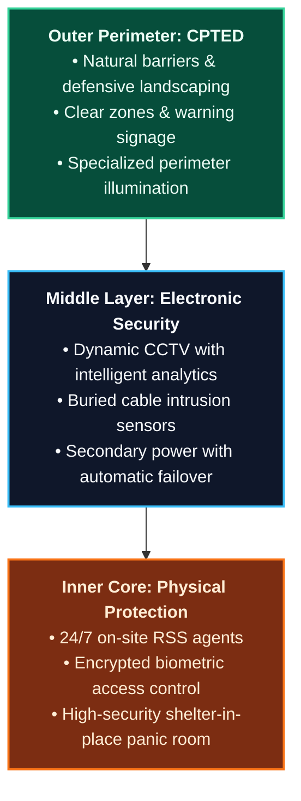

* **Redundant Technology & Rollover Capabilities:** Electronic security systems (including infrared perimeter sensors, smart IP cameras, and biometric access portals) must be supported by automated power backups, battery banks, and secondary network paths to prevent outages during intentional utility tampering.
* **Family and Staff Integration:** RSS programs require active participation and buy-in from the principal's family and household staff (e.g., chefs, housekeepers, estates managers).
  * *Training:* All staff and residents must be trained on security protocols and participate in emergency evacuation and shelter-in-place drills at least annually.
  * *Vetting:* Household staff must undergo rigorous, recurring background screenings, and their entry permissions must be tightly managed through a centralized access control registry.

> [!CAUTION]
> **Vigilance and Post Audits:** Fixed residential posts are highly susceptible to guard complacency and fatigue. A catastrophic example occurred in 2020 at the residence of the recording artist Eminem, where an intruder bypassed security by smashing a rear window and entering the home while the on-site security detail slept. To prevent such failures, RSS programs must enforce strict post audits, implement physical roving patrols, utilize active guard-activity tracking databases, and rotate personnel frequently to maintain peak alertness.

##### Property-Specific Orientation Checklist
New agents assigned to a residential security detail must undergo a comprehensive, property-specific orientation covering the following operational parameters:
* **Security & Alarm Infrastructure:** Detailed routing of all panic alarms, fire/smoke detectors, and biometric access points.
* **Primary System Custody:** Clear definition of who updates, maintains, and audits the electronic data logs and CCTV video archives.
* **Emergency Signaling:** Established primary and redundant duress codes, silent signals, and communication protocols between the principal and the security post.
* **First Responder Coordination:** Pre-calculated response times for local law enforcement, fire departments, and EMT units, including pre-planned access points for emergency vehicles.
* **Access Control Registry:** Rigorous vetting criteria and approval authorizations for temporary vendors, visitors, and deliveries.
* **Sterile Receiving Protocols:** Strict procedures for scanning, auditing, and sweeping all inbound packages, mail, and unsolicited gifts before they enter the residence.

#### 5.4.2 Close Protection and Security Advances
The execution of a flawless security advance is the hallmark of a professional EP detail. A security advance is an intellectual, analytical process of gathering intelligence, surveying physical sites, and vetting logistics prior to the principal's arrival:

* **Site Surveys:** Vetting every physical venue the principal will visit. This includes mapping all entry/exit paths, locating utility disconnects and backup generators, identifying fire escapes, and documenting local hospital capabilities and emergency response times.
* **Egress and "Hold Rooms":** The advance team must designate a sterile, easily defendable room (a "Hold Room") at every venue. This room serves as a safe haven to secure the principal in the event of an emerging threat or medical crisis before initiating an evacuation.
* **Discretion and Reservations:** All lodging, transportation, and venue reservations must be executed discreetly, utilizing non-descript corporate names or aliases to prevent adversaries from tracking the principal's itinerary.

##### International Travel Advances
Retaining a principal’s safety during international travel introduces complex, high-risk variables that demand highly structured advance planning.

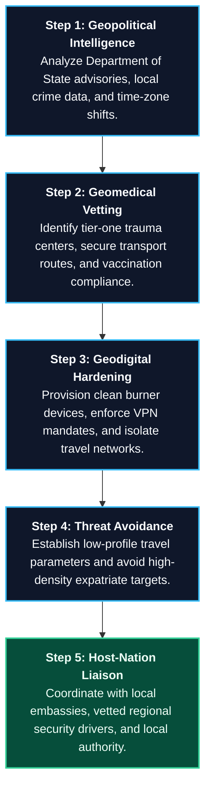

* **Geopolitical & Geomedical Vetting:** Before departure, the EP specialist must perform extensive research and complete physical advances of the destination. This includes identifying tier-one local hospitals, securing direct coordination lines with local embassies, and verifying health and vaccination requirements.
* **Geodigital Hardening:** Travel to foreign business environments presents significant cyber-espionage and data-theft risks. The security team must coordinate with IT to provision clean "burner" travel devices (smartphones, laptops, tablets) stripped of all company intellectual property. Under no circumstances should the principal connect to public Wi-Fi; all data transmissions must occur over secure cellular hot-spots routing through a virtual private network (VPN).
* **Target Avoidance in High-Risk Zones:** When operating in regions with elevated threat levels from international terrorism or political instability, the security detail must strictly avoid high-density Western-oriented gathering places (such as well-known expatriate nightclubs, specific hotels, or houses of worship catering to international visitors). Terrorist organizations target these locations due to their highly predictable, temporal density patterns (e.g., Sunday morning church services).

#### 5.4.3 Core Security Advance Glossary
To maintain absolute operational standardization across global teams, the EP program utilizes a precise, standard glossary:
* **Advance Team:** The dedicated security personnel dispatched ahead of the principal to physically survey venues, coordinate local assets, and construct the security playbook.
* **Risk, Threat, and Vulnerability Assessment (RTVA):** The intelligence brief that details the active threat landscape and defines the parameters of the protective detail.
* **Site Survey:** A comprehensive, documented inspection of a venue's physical layout, exit corridors, communications networks, security systems, and local utility maps.
* **Remain Overnight (RON) / Hotel Security Plan:** The specialized security protocols deployed at the principal's lodging, establishing sterile floors, secure elevator access, emergency evacuation paths, and a dedicated 24/7 security control post near the principal's suite.
* **Motorcade Route Survey:** The physical rehearsal of primary and alternate vehicular routes, timed and executed under identical conditions (time of day, traffic density) as the planned trip. This includes creating a detailed seating manifest and parking logistics.
* **Arrival/Departure Corridors:** Pre-vetted, highly secure vehicle drop-off and pick-up zones. The advance team must establish clear alternate corridors and define exactly when to abort a primary entry in favor of the backup.
* **Path of Travel:** The precise, physically surveyed walking path mapped from the moment the principal exits the transport vehicle to their seat or hold room inside the venue, and back to the departure motorcade.
* **Access Control List (ACL):** The vetted registry of personnel granted authorization to enter the secure perimeters, backstage areas, or private offices surrounding the principal.
* **Run of Show:** The minute-by-minute logistical itinerary detailing all physical events, stage presentations, and media engagements the principal is scheduled to participate in.
* **Trip Itinerary:** The comprehensive master document compiling all flight manifests, arrival/departure schedules, hotel locations, venue details, and key contact directories for the entire trip.

#### 5.4.4 Close Protection Choreography and Formations
The close protection team forms the immediate, physical circle of safety around the principal. Modern details range from highly visible multi-agent details to low-profile, single-agent arrangements designed to blend into corporate environments:

* **Detail Leader:** The security executive responsible for the entire program, establishing operational standards, managing budgets, and coordinating with senior corporate leadership.
* **Team Leader:** The tactical lead on-site who directs the real-time movements and choreography of the close protection agents during an active assignment.
* **Tactical Formations:** Close protection details employ standardized formations to maximize physical coverage, shield the principal, and coordinate rapid evacuation:

```
[Box Formation (4+ Agents)]      [Diamond Formation (4+ Agents)]      [V Formation (2-3 Agents)]
         [Point]                             [Point]                           [Point]
    [Flank]   [Flank]                  [Flank]     [Flank]                 [Flank]   [Flank]
     [Principal]                         [Principal]                         [Principal]
         [Tail]                              [Tail]
```

* **Box Formation:** A traditional four-agent formation encircling the principal. Excellent for traversing dense, unvetted public crowds.
* **Diamond Formation:** A highly protective four-agent formation with agents positioned on Point (front), Flanks (left and right), and Tail (rear). The Point agent acts as the wedge to navigate tight corridors and dense crowds, while the Tail manages rear threats and initiates evacuations.
* **V-Formation:** A three-agent formation that places a Point agent in front and flanking agents on the sides, providing robust frontal and side protection for smaller details.
* **Loose Protection:** Designed for low-threat, high-discretion environments where the principal demands personal privacy (e.g., family vacations, private corporate retreats). The agents operate in a spread-out, non-obvious manner, while maintaining clear, pre-agreed triggers to immediately collapse into a tight formation if threat parameters change.
* **Protective Surveillance / Covert Protection:** A highly advanced operational style where covert security assets operate at the outer perimeters, completely invisible to both the public and the principal. This team specializes in detecting hostile surveillance, tracking stalkers, and intercepting threats before they reach the close proximity detail.
* **Security Driver vs. Close Protection Agent:** 

> [!IMPORTANT]
> **Operational Role Integrity:** A trained Security Driver must *never* double-duty as a close protection agent during an event. The driver must remain sterile in the driver's seat of the vehicle, maintaining constant, 100% engine readiness to execute a rapid departure or emergency medical evacuation. The catastrophic consequences of violating this principle are illustrated by the March 2017 assassination of former Russian lawmaker Denis Voronenkov in Kyiv. Voronenkov’s bodyguard dropped him off outside a hotel and left the vehicle to park it; during this unguarded window, an assassin walked up, shot, and killed Voronenkov.

#### 5.4.5 The Time-Security Continuum and Conditioned Responses
Security managers must guide principals to understand that **security and convenience reside on opposite ends of a single continuum**:

* **The Lifestyle Trade-Off:** Achieving the highest level of physical security inherently requires sacrificing convenience, personal freedom, and operational spontaneity. Conversely, maximizing convenience and personal freedom automatically introduces higher levels of risk.
* **Avoiding the "Protection Victim":** The security team and the principal must actively collaborate to identify the optimal operational point on this continuum. Forcing excessive, restrictive security measures that impede the executive's productivity makes them a "victim of protection" rather than a partner in safety.
* **Defensive Time & Conditioned Evacuation:** Highly technical equipment—including armored vehicles, encrypted radios, and alarms—does not solve a threat by itself. Its sole tactical purpose is to **buy defensive time** (seconds) to allow the close protection detail to execute a conditioned response: shielding the principal and evacuating them to a safe haven. Modern close protection details strictly follow the U.S. Secret Service model of **"Cover and Evacuate"** rather than engaging in prolonged firefights, as real-world attacks are over in seconds.

#### 5.4.6 Transportation Security: Flight Operations & Driver Services
Vehicular transit and aviation operations represent critical phases of elevated vulnerability during an executive’s day.

##### Private Flight Operations & Fixed-Base Operators (FBOs)
* **Productivity & ROI:** Private aviation is a powerful tool for corporate productivity. It allows executives to control passenger manifests, manage sensitive corporate strategies in transit, and execute rapid, multi-city itineraries. This optimization of executive time represents a highly defensible, shareholder-aligned ROI.
* **FBO Perimeter Vulnerabilities:** A Fixed-Base Operator (FBO) is the private terminal facility that services private aviation. Independent, non-municipal FBOs often fall outside the strict federal perimeter controls of major commercial public airports. The advance team must verify the FBO's access control measures, tarmac security, and passenger screening protocols.

##### Security Drivers vs. Chauffeurs
* **Chauffeur Services:** Chauffeurs are customer-service oriented drivers trained in standard passenger comfort, vehicle cleanliness, and basic route navigation. They possess no tactical driving skills or protective training.
* **Security Drivers:** Highly trained tactical operatives integrated into the close protection detail. Security drivers are certified in advanced vehicle dynamics, defensive driving, evasive maneuvers, and motorcade ambush countermeasures.

##### Armored Vehicle Specifications & Sterility
Corporate and private details utilize highly engineered vehicles designed to withstand ballistic threats and explosive blast forces. To maintain maximum discretion, armored vehicles should blend in seamlessly with standard corporate fleets. Core specifications include:
* Bullet-resistant lightweight armored plating and ballistic glass.
* Specialized run-flat tire systems and self-sealing, anti-exploding fuel tanks.
* Steel-reinforced bumpers concealed behind standard vehicle trim for ramming through blockades.
* Dual battery systems, remote vehicle starters, and secure inside/outside intercom systems.
* Secure, real-time GPS tracking telemetry and direct-link emergency assistance.

##### Operational Security (OPSEC) for Transit
* **In-Transit Comms:** The moment the principal’s vehicle gets underway, the security detail must initiate a discreet, pre-coded routing check-in with the Security Operations Center (e.g., *"Leaving Location X, routing via U.S. 20, ETA 1530"*). This establishes a clear timeline and allows rapid emergency deployment if the vehicle misses its check-in window.
* **Vehicle Sterility Protocols:** To prevent the clandestine placement of tracking devices, listening bugs, or explosives, the security vehicle must be parked in a locked, alarmed garage. If the vehicle is left unattended or out of sight for any duration, the security team must execute a rigorous, systematic vehicle search before the principal is allowed to board.

#### 5.4.7 Specialized Technical Executive Protection
To counter advanced technical and digital threat vectors, modern executive protection utilizes highly specialized technical disciplines:

##### Digital Executive Protection (DEP)
A physical perimeter is useless if the principal’s digital footprint is compromised. DEP teams actively manage the digital footprint and online exposure of the principal and their immediate family:
* **Hostile OSINT Scans:** Performing regular, aggressive open-source intelligence scans to identify exposed home addresses, personal phone numbers, and family travel itineraries.
* **Home Network Audits:** Vetting and securing the home Wi-Fi networks of the principal, immediate family members, and personal household staff against remote hijacking.
* **Personal Cyber Hygiene:** Training the executive and family on social media best practices, enforcing strict privacy settings, and restricting the real-time posting of geotagged vacation photos.
* **Burner Device Mandates:** Enforcing the use of sanitized, dedicated clean travel devices when the executive travels to high-threat foreign destinations known for aggressive electronic espionage.

##### Technical Security Countermeasures (TSCM)
TSCM, or "sweeping," is the highly technical practice of detecting electronic listening devices, hidden cameras, and active transmitters:
* **Proactive Sweeps:** Conducting regular, unannounced TSCM sweeps of executive boardrooms, corporate private offices, private aircraft cabins, hotel suites, and executive residences.
* **Conversational Discretion:** Enforcing basic OPSEC training for all personal staff and executives, reminding them to strictly avoid discussing sensitive corporate strategy, patents, or legal matters in unvetted public environments (e.g., hotel lobbies, restaurants, public lounges).

##### Explosive Detection Dogs (EDDs)
Specialized K-9 units represent a premier layer of physical and psychological defense. The EP manager should deploy EDD teams to sweep perimeters, cargo receiving docks, stage backstages, and venue arrival corridors prior to the principal's arrival at high-exposure public events or high-value corporate gatherings.

---

## Chapter 6: Security Awareness

Security awareness represents a systematic, continuing effort to foster an organizational culture where all employees and associated stakeholders remain conscious of the enterprise security program, its business relevance, and the direct impact of their personal behavior on mitigating risk. 

Rather than acting as a static set of rules, an effective security awareness program operates as a powerful **force multiplier**. By educating and enfranchising employees, the security department transforms passive bystanders into active participants—effectively enlisting "asset owners" as the decentralized eyes and ears of the assets protection mission.

---

### 6.1 Structural Levels of Security Awareness

In alignment with Enterprise Security Risk Management (ESRM) principles, security awareness must not be delivered as a generic, one-size-fits-all presentation. It must be tailored structurally across five distinct organizational tiers:

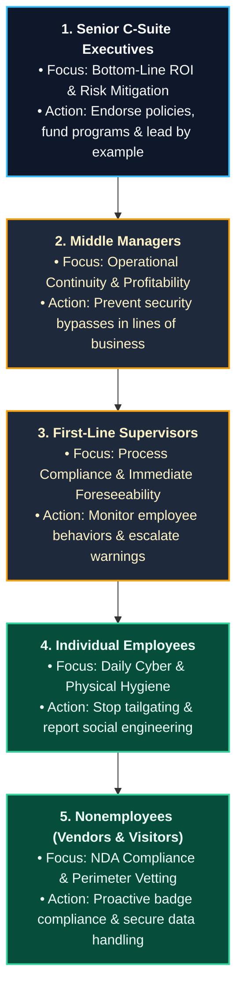

#### 6.1.1 Senior C-Suite Executives
Senior leadership represents the ultimate decision-makers regarding corporate risk appetite and capital resource allocation. 
* **Business-Value Alignment:** Executive-level awareness must focus on demonstrating the tangible return on investment (ROI) of security programs, framing assets protection not as a burdensome expense, but as a critical enabler of business continuity, shareholder value, and brand resilience.
* **Cultural Governance:** Absolute executive endorsement is mandatory. If senior leaders display indifference or bypass security protocols themselves, it breeds an organizational culture of complacency, policy violations, and systemic vulnerability.

#### 6.1.2 Middle Management
Middle managers are responsible for the performance, productivity, and profitability of their specific business units.
* **Bypassing Risks:** Security managers must demonstrate to middle management that security protocols protect their unit's operational continuity. For example, if a research laboratory manager views intellectual property access controls as a bureaucratic obstacle and actively bypasses them, the resulting unauthorized disclosure of trade secrets can destroy the company's competitive advantage.
* **Leadership Accountability:** Middle managers must set a visible example of security compliance, actively reinforcing protocols within their operational hierarchies.

#### 6.1.3 First-Line Supervisors
First-line supervisors direct daily front-line processes and are the immediate conduits for employee feedback and complaints.
* **Operational Friction:** Supervisors must be shown that compliance with post orders and security audits directly supports their front-line tasks and safeguards their teams.
* **The "Notice and Foreseeability" Legal Standard:** First-line supervisors represent a critical legal liability vector:

> [!IMPORTANT]
> **Supervisor Foreseeability Warning:** In corporate liability law, if an employee reports a physical hazard, a security vulnerability, or a threat of workplace violence to a first-line supervisor, **the corporation is legally deemed to have received formal notice of that risk**. If the supervisor fails to escalate, document, or mitigate the reported issue and a subsequent incident occurs, the organization is exposed to severe negligence lawsuits. Standard operating procedures must enforce mandatory escalation paths for all supervisor-received complaints.

#### 6.1.4 Individual Employees
Line employees represent the front-line defense against physical and digital threat actors.
* **Daily Security Hygiene:** Training must focus on practical, actionable behaviors: resisting social engineering tactics, identifying phishing attempts, securing passwords, and preventing physical tailgating or piggybacking through access points.
* **Personal Alignment:** To foster genuine motivation, security teams should demonstrate how practicing robust cyber and physical hygiene at work directly empowers employees to protect their personal finances, identity, and families at home.

#### 6.1.5 Nonemployees (Vendors, Suppliers, & Visitors)
External business partners, contractors, and visitors represent distinct perimeter and information security risks.
* **Proprietary Data Protection:** Vendors granted access to sensitive facilities or internal databases must be bound by clear Non-Disclosure Agreements (NDAs) and instructed in proper data handling protocols.
* **Discreet Vetting:** Visitors are far more likely to comply with physical security controls (such as wearing guest badges and submitting to escorts) if the security team provides a brief, professional explanation that these badges enable immediate employee assistance and ensure life-safety accountability in emergencies.

---

### 6.2 Core Objectives and Purposes of Security Awareness

A comprehensive security awareness program is designed to fulfill several critical organizational, regulatory, and legal objectives:

* **Asset Preservation & Loss Reduction:** Enlisting the collective vigilance of all personnel to proactively detect and report indicators of theft, fraud, and physical hazards.
* **Regulatory Compliance:** Satisfying federal and international security education mandates, including:
  * **The Bank Protection Act of 1968:** Mandating structured security orientations and robbery-response training for financial institution employees.
  * **Critical Infrastructure Regulations:** Satisfying compliance requirements imposed by the Drug Enforcement Administration (DEA), the Department of Transportation (DOT), and the Nuclear Regulatory Commission (NRC).
* **Common-Law Notice Requirements:** Establishing the legal foundations for assets protection:
  * *Civil Trespass:* Recovering civil damages for trespass requires proving the adversary had clear notice of unauthorized boundaries. The security program must ensure clear physical, symbolic (signage), and verbal indicators are maintained.
  * *Trade Secret Protection:* To legally defend a trade secret, an enterprise must prove it took positive, audited actions to maintain its secrecy, which includes documented security awareness training for all privy employees.
* **Contractual Protections:** Satisfying compliance mandates under:
  * **NISPOM (National Industrial Security Program Operating Manual):** Enforcing strict security briefings and education for contractors handling classified defense information.
  * **Collective Bargaining Agreements:** Providing due notice of operational security rules to justify disciplinary actions or terminations for cause.
  * **Insurance Covenants:** Complying with specialized corporate insurance policies (e.g., kidnap, ransom, and extortion coverage) that mandate specific security communications.
* **Enterprise Liability Mitigation:** Establishing a robust "due diligence" defense in civil litigation by demonstrating that the enterprise actively maintains a safe, security-conscious environment and holds employees accountable for their security actions.
* **Emergency Preparedness & Business Continuity:** Ensuring all personnel understand crisis communication channels, fire-safety procedures, and active threat response protocols.

---

### 6.3 Developing, Delivering, and Measuring the Program

An effective awareness program must be systematically designed, continuously updated, and rigorously measured to demonstrate its business value.

#### 6.3.1 Curricula Tailoring and Delivery Methods
The security manager must tailor the training topics to the specific threat landscape of the enterprise:

| **Core Security Awareness Topics** | **Innovative Delivery Methods** |
| :--- | :--- |
| • **Physical Security:** Access control, visitor vetting, reporting tailgating. | • **Written Media:** Pamphlets, quick-reference desktop cards, checklists. |
| • **Information Security:** Social engineering, phishing, clean desk initiatives. | • **Audiovisual Media:** Interactive intranet videos, compliance software modules. |
| • **Workplace Safety:** Violence prevention, bullying, emergency response paths. | • **Operational Integration:** Linking compliance audits directly to performance reviews. |
| • **Travel Security:** Mobile device safety, geodigital precautions, foreign laws. | • **Drills & Exercises:** Simulated phishing attacks and physical egress drills. |

* **Flexible Remote-Work Protocols:** As demonstrated during global disruptions (such as the COVID-19 pandemic), security awareness programs must remain flexible. When the workforce transitions to remote models, the curriculum must immediately shift focus from physical travel security to home-office cyber hardening, secure VPN protocols, and remote device hygiene.

#### 6.3.2 Mitigating Operational Obstacles
Security managers must anticipate and proactively dismantle five common barriers to program success:
1. **Low Departmental Credibility:** Often caused by a past history of security staff unprofessionalism or a failure to understand core business operations. Security personnel must actively study the business model to deliver seamless, non-intrusive risk solutions.
2. **Negative Cultural Inertia:** Overcoming mindsets such as *"we have never done it this way before"* by clearly demonstrating how security directly enables business success and protects jobs.
3. **Corporate Naiveté:** Addressing executive denial (e.g., *"we have never had a security breach, so we do not need this"*) by presenting localized threat intelligence, crime trend data, and industry case studies.
4. **Employee Indifference:** Eliminating the perception that security is solely the responsibility of the guard force. Managers should tie compliance to employees’ personal priorities and keep training engaging to prevent security fatigue.
5. **Lack of Anonymous Reporting Systems:** 

> [!TIP]
> **Anonymous Whistleblower Systems:** The presence of a secure, highly confidential, or anonymous security reporting channel dramatically increases employee engagement. Enforcing a zero-retaliation policy and providing clear metrics on resolved complaints builds trust, increases early threat reporting, and provides corporate executives with clear evidence of the program's value.

#### 6.3.3 Program Metrics and Value Verification
To maintain senior management backing, the security manager must track, analyze, and report clear performance metrics:
* Quantifiable reductions in asset losses, security breaches, and intellectual property leaks before and after program implementation.
* Structured audits of training completion rates, enrollment statistics, and average training cost-per-employee.
* Performance data from simulated phishing exercises and physical security drills.
* Qualitative feedback surveys and security improvement suggestions submitted directly by employees.

---

### 6.4 Loss Prevention and Active Employee Engagement

True security success is achieved when employees are actively engaged partners in loss prevention, rather than passive subjects of security rules.

#### 6.4.1 Positive Security Contacts (Force Multipliers)
To build corporate goodwill and break down historical barriers between security staff and employees, the security department should actively sponsor positive, helpful outreach initiatives:
* **Home Security Clinics:** Conducting voluntary seminars on residential locks, home fire safety, and environmental security for employees' families.
* **Property-Marking Programs:** Lending engraving and property-tracking tools to allow employees to secure their personal valuables.
* **Family Cybersecurity Seminars:** Providing resources and guidance on safeguarding children from online threats and maintaining home digital privacy.
* **Child ID & Emergency Preparedness Kits:** Distributing child identification kits and family emergency preparedness checklists to corporate staff.

#### 6.4.2 The Grocer Restraint Case: Policy vs. Audited Training
A critical operational truth is that having a written security policy is completely insufficient if it is not supported by active, scenario-based training and supervisor monitoring.

In 2004, a tragic incident occurred at a retail grocery store where two store clerks and a uniformed security officer attempted to apprehend a suspected shoplifter. The suspect died from accidental restraint asphyxia during the arrest. Although the retail corporation had a strict written policy explicitly prohibiting store clerks from utilizing physical force against shoplifters, the employees were entirely unaware of the policy and had received no practical training or supervisor audits. This catastrophic failure resulted in massive corporate liability, criminal inquests, and severe reputational damage.

Security and loss prevention managers must continuously monitor front-line activities, deliver frequent scenario-based refresher training, and enforce strict, audited compliance to ensure policies are actively understood and executed in the field.

#### 6.4.3 Managing the "Arrogant User" Profile
Security awareness programs must address a highly distinct demographic within every organization: the **"Arrogant User."**
* *The Profile:* Unlike uneducated users who violate policies out of a simple lack of training, arrogant users possess high technical or organizational status (often senior executives, key developers, or star researchers). They believe their personal intelligence, specialized skills, or corporate power exempts them from standard security controls, leading them to deliberately bypass firewalls, share credentials, or ignore device encryption.
* *The Mitigation:* Arrogant users represent a severe insider threat. Security management must secure absolute executive backing to enforce progressive, non-punitive, but firm disciplinary policies equitably across all tiers. Left unchecked, arrogant users undermine the entire security posture of the enterprise.

---

## Chapter 7: Workplace Substance Abuse

A drug is defined as any chemical substance that alters the physical, behavioral, psychological, or emotional state of the user. Psychoactive (mind-altering) substances directly target the central nervous system, impairing the user's cognitive functions, sensory perception, and motor coordination, thereby distorting their perception of reality. For the purposes of this manual, alcohol is categorized as a psychoactive drug.

Continuous substance abuse in the workplace represents a severe threat to operational safety, business productivity, and organizational integrity. It leads to increased chemical tolerance, physical dependency, and eventual addiction, driving profound personal, financial, and legal crises that extend far beyond the individual abuser.

---

### 7.1 The Human and Organizational Cost of Substance Abuse

While substance abuse directly ravages the health and welfare of the individual abuser, the enterprise pays a massive financial and operational price.

#### 7.1.1 Organizational Impact Metrics
Documented workplace substance abuse directly results in:
* **Severe Productivity & Morale Decline:** Impaired employees exhibit slower reaction times, reduced cognitive capacity, and elevated error rates, placing an unfair operational burden on teammates and degrading department morale.
* **High Turnover & Absenteeism:** Substance-abusing employees are absent from work significantly more often than non-abusing peers, leading to scheduling disruptions, lost productivity, and the high cost of recruiting and training replacements.
* **Elevated Workers' Compensation & Benefit Costs:** Substance abusers file significantly more health insurance claims, worker compensation claims, and are far more prone to feigning on-the-job injuries to secure extended paid leaves of absence.
* **Increased Theft, Dishonesty, & IP Leakage:** To fund costly chemical dependencies, substance abusers frequently resort to stealing workplace equipment, petty cash, raw materials, or selling sensitive corporate trade secrets and intellectual property.
* **Catastrophic Corporate Liability:** Impaired employees operating heavy machinery, driving company vehicles, or handling critical safety-sensitive tasks represent an immense liability, exposing the company to negligent retention lawsuits, catastrophic workplace accidents, and severe public relations damage.

##### The "20/80" Supervisor Management Rule
In modern human capital management, it is a recognized principle that **the problematic 20% of the workforce consumes 80% of management's time**. Substance-abusing employees frequently fall directly into this 20% demographic. They exhibit chronic absenteeism, volatile behavioral shifts, slipping performance metrics, and constant disciplinary friction, draining the valuable time and focus of supervisors and HR managers.

##### Human & Social Costs
Workplace substance abuse breeds deeply dysfunctional interpersonal dynamics:
* **The "Co-Dependency" Sickness:** Coworkers and family members frequently fall into enabling behaviors, covering up for the abuser's absences and mistakes, which delays intervention and exacerbates the risk.
* **Family & Relationship Deterioration:** The families of substance abusers experience disproportionately higher rates of chronic illness, domestic accidents, severe financial distress, and divorce, which further destabilizes the employee's mental stability.
* **Systemic Denial:** The hallmark of addiction is profound denial. Abusers systematically rationalize their habits, deflect constructive feedback, and aggressively blame coworkers, supervisors, or corporate structures for their slipping performance and personal shortcomings.

### 7.2 The Role of the Employer

Substance abuse is not merely a law enforcement or government issue; it is a critical workplace challenge that directly threatens organizational safety, employee health, and business viability. Executives, risk managers, and supervisors must cooperate to design and maintain a **Drug-Free Workplace Program** that satisfies several core management responsibilities:
1. **Set Clear Goals and Objectives:** Formulate a transparent, strategic vision to eliminate substance impairment from the workplace, emphasizing employee health, safety, and operational excellence.
2. **Formulate a Comprehensive Written Policy:** Collaborate with top management, human resources, and corporate legal counsel to draft a legally defensible, practical, and enforceable substance abuse policy.
3. **Communicate the Policy Effectively:** Ensure every employee receives the written policy, understands the performance expectations, and acknowledges receipt in writing.
4. **Enforce the Policy Equitably:** Ensure the policy is enforced consistently across all organizational levels, from entry-line staff to C-suite executives, to maintain program integrity.
5. **Provide Education and Training:** Deliver recurring training to help supervisors identify indicators of impairment and educate employees on the health risks of substance abuse.
6. **Provide Employee Assistance Support:** Establish a clear, non-punitive referral pathway to professional treatment and counseling services through an Employee Assistance Program (EAP).
7. **Perform Regular Audits:** Continuously review policy enforcement metrics, incident logs, and EAP usage data to optimize program effectiveness and ensure legal compliance.

---

### 7.3 Substance Abuse Rationalizations and Opportunity

Understanding why employees abuse substances at work and how the workplace environment facilitates illicit transactions is critical to designing effective countermeasures.

#### 7.3.1 Employee Rationalizations
Substance-abusing employees employ complex psychological defense mechanisms—known as rationalizations—to justify their behaviors, shirk their personal responsibilities, and minimize the consequences of their actions:
* **The "Performance Illusion":** Abusers frequently convince themselves that psychoactive substances enhance their creativity, boost their physical endurance, or improve their daily productivity.
* **The "Constitutional Right" Fallacy:** Abusers may rationalize that personal consumption off the clock is an absolute constitutional right, falsely believing that their personal habits do not impact their workplace performance.
* **The "camaraderie" Delusion:** Workplace drug dealers often rationalize their actions as simple acts of friendship or camaraderie, framing the distribution of illicit substances as helping their coworkers cope with job-related stress.

#### 7.3.2 Environmental Opportunities
The workplace environment represents a highly attractive venue for substance transactions due to several unique factors:
* **Sterile Peer Networks:** Buyers and sellers have regular, daily contact under the guise of normal business operations, allowing transactions to occur without generating suspicion.
* **Private Property Safe-Havens:** Commercial facilities are private properties, shielded from direct, routine law enforcement patrols, creating a perceived safe-haven for illicit deals.
* **Low Risk Perceptions:** Abusers frequently perceive front-line supervisors as untrained, uninformed, or highly reluctant to initiate difficult confrontations regarding suspected impairment.
* **Clandestine Post Storage:** Security systems designed to protect corporate assets (such as locked offices, lockers, toolboxes, and restricted supply closets) are frequently hijacked by abusers to store illicit drugs and cash.
* **Transactional Credit & "Pinching":** Transactions are often facilitated through "fronting"—selling drugs to coworkers on credit with strict payment terms. Dealers often charge a transaction premium known as a **"pinch"** (retaining a small portion of the product for personal use).

---

### 7.4 The Progressive Path of Workplace Substance Abuse

No individual enters the workforce intending to develop a chemical dependency. Workplace substance abuse is a progressive, highly destructive disease that unfolds across a recognizable trajectory:

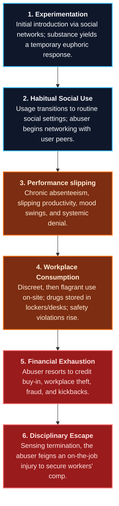

1. **Experimentation:** Initial introduction to the substance, typically in social settings, yielding a pleasurable physical or emotional response.
2. **Habitual Social Use:** The abuser establishes a routine pattern of consumption, solidifying relationships with user peers while withdrawing from non-using friends and family.
3. **Performance Slipping:** Attendance patterns deteriorate (e.g., chronic Monday/Friday absences), focus slips, and the abuser consumes an inordinate amount of supervisor management time.
4. **Workplace Consumption:** The abuser begins consuming substances on-site (in parking lots, restrooms, locker rooms, or at workstations) and utilizes corporate channels (e.g., the mailroom) to receive shipments.
5. **Financial Exhaustion & Theft:** As discretionary income is consumed by addiction, the abuser resorts to purchasing drugs on credit. Once credit is exhausted, they engage in workplace theft (petty cash, office assets, scrap metal, intellectual property) or accept vendor kickbacks to facilitate fraud.
6. **Disciplinary Escape via Feigned Injury:** As performance reviews plunge, the abuser foresees termination. To escape workplace discipline and secure paid leave, the abuser feigns an on-the-job injury. 
   * *The Cycle:* Without the structured boundary of work, their life unravels. They return to work months later with a more severe chemical dependency, less productivity, and a higher propensity to file subsequent fraudulent claims.

---

### 7.5 Comprehensive Classification of Drugs of Abuse

In the United States, the legal foundation for regulating controlled substances is the **Comprehensive Drug Abuse Prevention and Control Act of 1970 (Title II - Controlled Substances Act [CSA])**. The CSA regulates the manufacture, importation, possession, use, and distribution of drugs according to their potential for abuse and medical utility. The Drug Enforcement Administration (DEA) oversees these classifications across five distinct schedules:

| **CSA Schedule** | **Abuse Potential** | **Medical Utility** | **Dependency Risk** | **Substance Examples** |
| :---: | :--- | :--- | :--- | :--- |
| **Schedule I** | **Extreme / Highest** | None (No currently accepted medical use in the US) | High safety risk; severe physical and psychological dependency. | Heroin, LSD, Marijuana (Cannabis), MDMA (Ecstasy), Methaqualone. |
| **Schedule II** | **High** | Accepted medical use with severe restrictions. | May lead to severe psychological or physical dependency. | Cocaine, Morphine, Amphetamine, Methamphetamine, Opium, Fentanyl. |
| **Schedule III** | **Moderate** | Accepted medical use in the US. | May lead to moderate/low physical or high psychological dependency. | Codeine (combined with Tylenol), Ketamine, Anabolic Steroids. |
| **Schedule IV** | **Low** | Accepted medical use in the US. | May lead to limited physical or psychological dependency. | Diazepam (Valium), Alprazolam (Xanax), Phenobarbital, Darvon. |
| **Schedule V** | **Lowest** | Accepted medical use in the US. | Extremely low physical or psychological dependency risk. | Low-strength prescription cough suppressants, Lomotil. |

#### 7.5.1 Psychoactive Drug Classification Matrices
To guide supervisors in recognizing impairment, psychoactive drugs are classified into four primary physiological categories:

##### 1. Central Nervous System Depressants
Depressants slow down central nervous system activity, producing a temporary feeling of calm, anxiety relief, and muscle relaxation:
* **physiological Effects:** Impaired reflexes, slurred speech, loss of motor coordination, pupillary constriction, and severe drowsiness. 
* **Alcohol:** A fast-acting CNS depressant that functions as an analgesic with sedative effects. Alcohol dependency (alcoholism) is characterized by four core symptoms: **Craving** (compulsion), **Loss of Control** (inability to limit drinking), **Physical Dependence** (withdrawal symptoms like tremors, nausea, sweating), and **Tolerance** (needing larger quantities to achieve the same effect).
* **Workplace Warning Signs:** Odor of alcohol, unstable gait, uncoordinated movements, and bloodshot eyes.

##### 2. Opiate Narcotics
Derived from opium (natural poppy plant derivatives or synthetic opioids), narcotics serve as powerful pain relievers but are highly addictive:
* **Physiological Effects:** Euphoria, drowsiness, respiratory depression (which can lead to fatal overdose), and pupillary constriction ("pinpoint pupils").
* **Substances:** Morphine, Heroin, Codeine, Oxycodone, and Fentanyl.
* **Workplace Warning Signs:** Extremely constricted pupils, lethargic speech, nodding off at workstations, and scarred injection marks ("track marks") on skin.

##### 3. Central Nervous System Stimulants
Stimulants accelerate central nervous system activity, temporarily heightening alertness, pulse rate, and blood pressure:
* **Physiological Effects:** Dilated pupils, elevated blood pressure, accelerated heart rate, extreme euphoria, and hyper-alertness. 
* **Cocaine & Crack:** Powerfully addictive topicals. Ingestion leads to an intense, rapid high followed by a severe crash, leaving the user eager for rapid redosing, resulting in extreme mood swings and manageability issues.
* **Methamphetamine:** Easily manufactured synthetic stimulant (speed, meth, crystal). Meth causes dangerous elevations in body temperature, severe weight loss, violent paranoia, auditory hallucinations, and tactile delusions (such as the sensation of insects crawling under the skin, known as **formication**).
* **Workplace Warning Signs:** Excessive talkativeness, hyper-activity, tremors, extreme irritability, dilated pupils, rapid mood swings, and a frequent need for financial loans.

##### 4. Hallucinogens
Hallucinogens alter sensory perception, mood, and cognitive reasoning:
* **Physiological Effects:** Perceptual distortions of time and space, dilated pupils, panic attacks, and severe synaesthesia (sensory crossover, where a user "hears" colors or "smells" sounds).
* **Substances:** LSD (acid), MDA, MDMA (ecstasy), PCP (angel dust), and Psilocybin (mushrooms).
* **Flashbacks:** Users may experience fragmentary recurrences of past drug experiences weeks or months after consumption without taking the substance.
* **Workplace Warning Signs:** Dilated pupils, erratic/confused behaviors, severe spatial disorientation, and irrational panic.

> [!WARNING]
> **Marijuana (Cannabis) - The Legal & Impairment Landscape:** Cannabis represents a unique challenge for employers, particularly in jurisdictions that have legalized medical or recreational use at the state level, while federal law continues to classify it as a Schedule I controlled substance.
> * **Impairment vs. Detection:** The psychoactive component, Tetrahydrocannabinol (THC), is fat-soluble and remains detectable in the body's tissues for up to 30 days after use. However, the presence of detectable THC in a biological specimen does not directly correlate with real-time impairment.
> * **Safety-Sensitive Positions:** The National Safety Council (NSC) notes that employees testing positive for cannabis exhibit **55% more industrial accidents, 85% more injuries, and 75% greater absenteeism**. No level of cannabis use is safe or acceptable for employees in safety-sensitive roles (such as security officers, machine operators, or drivers).
> * **Policy Resolution:** Employers must draft clear, written policies. In safety-sensitive sectors, organizations typically enforce a zero-tolerance policy that prohibits any detectable level of controlled substances in a drug screening, regardless of state-level legality.

---

### 7.6 Addiction, Dependency, and the Cycle of Denial

Substance abuse is a chronic, progressive medical disease that ravages both the individual and the supporting organization.

#### 7.6.1 The Mechanics of Chemical Dependency
* **Addiction:** The disease of obsession and compulsion, characterized by the uncontrollable, repeated use of a substance. Addicts develop dependencies not only on the chemical effects but also on the ritualistic behaviors surrounding acquisition, preparation, and consumption.
* **Chemical Dependency:** The physiological craving brought on by chemical changes in the body. When deprived of the drug, the body attempts to adapt, resulting in painful, violent physiological symptoms collectively known as **withdrawal** (insomnia, tremors, vomiting, and convulsions).
* **Tolerance:** The physiological adaptation where the body grows accustomed to the substance, requiring progressively larger doses to achieve the desired effect.

#### 7.6.2 High-Functioning Abusers
High-functioning abusers appear to manage their dependency successfully. They keep steady jobs, work regular hours, maintain families, and appear happy. However, they lead two distinct lives: one visible, the other secret. They require a baseline level of drug consumption simply to function "normally." When deprived of their drug, their performance and behavior collapse.

#### 7.6.3 The Delusion of Denial
Denial is the mental state where the abuser, coworkers, or management refuse to consciously acknowledge that the abuser's behavior is causing harm:
* **Abuser Denial:** Rationalizing their habit with statements such as: *"I can quit anytime,"* *"What I do on my own time is my business,"* or *"It does not affect my job performance."*
* **Peer/Coworker Denial:** Coworkers frequently minimize the abuser's slipping performance, covering up for their mistakes and rationalizing that the problem is temporary.
* **Organizational Denial:** Managers and executives deny the existence of a problem to avoid difficult confrontations, stating: *"We do not have a drug problem in this company,"* or *"If we enforced our policies, we could not hire anyone."*

#### 7.6.4 The Trap of Enabling
Enabling consists of consciously or unconsciously shielding the abuser from the physical, disciplinary, or financial consequences of their substance abuse. Enabling reinforces the abuser's delusions and allows their disease to progress:
* **Supervisor Enabling:** Accepting weak performance, covering up attendance patterns, believing implausible excuses, and failing to document slippage.
* **Mitigation:** Supervisors must escape denial, study the organization's substance abuse policy, accurately document performance deficiencies in writing, and immediately cease all enabling behaviors.

#### 7.6.5 Co-Dependency Sickness
Co-dependency occurs when coworkers or supervisors allow the manipulative behavior of the abuser to overshadow their own values, judgment, and duties. Co-dependents become caretakers, complainers, and rescuers, often working double shifts or doing more than their fair share to cover for the abuser, which ultimately destabilizes the entire work environment.
* *Mitigation:* Supervisors must focus strictly on objective performance metrics, establish firm limits and boundaries, and immediately refer the problem employee to internal human resources and EAP professionals.
---

### 7.7 Role of Supervisors and Managers

First-line supervisors and operational managers are the most critical layer in an organization's defense against workplace substance abuse. Because they interact with the workforce daily, they are uniquely positioned to detect early signs of performance decline and behavioral aberration. However, to be effective, supervisors must understand the intricacies of addiction, chemical dependency, and the destructive organizational behaviors of denial, enabling, and co-dependency. Failure to confront these behaviors is not compassionate; it is an enabling action that allows an employee's illness to progress.

#### 7.7.1 The Drug-Free Workplace Policy

A practical, functional, and enforceable written policy is the foundation of a drug-free workplace. The policy must be effectively communicated, acknowledged in writing by every employee, and equitably enforced. An effective policy must:
* **State the Organizational Objective:** Clearly declare the commitment to a drug-free workplace and explain why it is essential for the safety, health, and productivity of all employees.
* **Prohibit Prohibited Conduct:** Explicitly ban the use, sale, dispensation, distribution, offer, or possession of controlled substances, illegal drugs, and alcohol on company property, while on duty, or while operating company vehicles.
* **Define Impairment:** Establish clear operational definitions of on-the-job impairment based on observable behaviors, physical symptoms, or scientific testing.
* **Outline Drug Testing Protocols:** Detail the methods, timing, and circumstances under which drug and alcohol testing will be conducted, what constitutes a positive result, and the consequences of refusing to test.
* **Define Policy Infractions:** Specify the disciplinary consequences for violations, up to and including immediate termination.
* **Spell Out Rehabilitation Options:** Recognize that chemical dependency is a treatable health problem, and define the availability of Employee Assistance Programs (EAPs) and rehabilitation support.
* **Delineate the EAP Function:** Explain the role of the EAP as a confidential, voluntary resource and provide clear instructions on how to access it.
* **Answer Common Policy Questions:** Address employee inquiries regarding policy administration, confidentiality, and legal compliance.

> [!IMPORTANT]
> **The "Under the Influence" Pitfall:** Written policies must avoid using the subjective term *"under the influence"* for anything other than alcohol. While alcohol has clear, legally defined blood-alcohol concentration (BAC) thresholds for intoxication, no such universal scientific or legal standards exist for other drugs of abuse. Proving that an employee is "under the influence" of a drug is legally challenging; therefore, policies should focus on "impairment" or "detectable levels" of the drug or its metabolites in a biological specimen.

Once the policy is finalized, the organization should establish an appropriate waiting and education period (typically 30 to 60 days) to train employees. When the implementation date arrives, supervisors must demonstrate an absolute commitment to its enforcement. This active communication is one of the most effective and least recognized deterrents against workplace substance abuse.

Supervisors should focus strictly on monitoring and documenting employee job performance and behavioral changes rather than trying to act as narcotics officers. They are not expected to catch employees using or selling drugs directly; instead, they are expected to evaluate performance deficiencies and execute corrective action when standards are not met.

---

#### 7.7.2 Investigation and Documentation

When employees violate company policy or exhibit severe performance slippage, management must respond swiftly, consistently, and effectively. A central component of this response is a structured workplace investigation.

* **Separation of Roles:** A workplace investigation is a fact-finding process that should ideally be separated from the final disciplinary decision-making process. This separation ensures that the investigator remains an objective finder of fact, free from preexisting bias.
* **Investigative Standards:** Effective investigations must be fair, impartial, factual, objective, thorough, and meticulously documented. They must protect the legal and contractual rights of suspected violators, witnesses, and the organization.
* **Compliance and Confidentiality:** Workplace investigations must comply with federal, state, and local laws, company policy, and applicable collective bargaining agreements. They must be conducted with strict confidentiality, sharing evidence, notes, reports, and conclusions only with those with a strict "need to know" (e.g., upper management, legal counsel, and human resources).
* **Review and Action:** Disciplinary actions must only occur after a detailed, formal review of the investigation's findings by qualified management and HR. If the findings do not warrant disciplinary action but reveal underlying personal struggles, the supervisor's most appropriate response is supportive intervention.

---

#### 7.7.3 Employee Hotlines and Early Warning Systems

Anonymous employee hotlines and incident reporting solutions provide a critical early warning system for organizations, allowing misconduct and substance abuse to be detected and mitigated before they result in catastrophic safety failures, reputational damage, or severe asset losses.

* **Overcoming Retaliation Fear:** The primary barrier to employee reporting is the fear of retaliation or social isolation. A secure, anonymous hotline encourages employees to act when they observe coworkers performing safety-sensitive duties while impaired.
* **Regulatory Underpinnings:** In the United States, the Sarbanes-Oxley Act of 2002 established a legal precedent by requiring publicly traded companies to maintain confidential, anonymous reporting systems for accounting and auditing misconduct. Modern organizations leverage these same hotline infrastructures to capture safety-critical reports regarding substance abuse.
* **Multinational Compliance:** Multinational businesses must navigate complex jurisdictional variations. While anonymous hotlines are mandatory or highly encouraged in some countries, they may be heavily restricted or illegal in others (such as certain EU member states) due to strict privacy regulations and cultural attitudes toward whistleblowing.
* **The Case for Outsourcing:** Outsourcing the hotline operation to specialized third-party vendors offers distinct advantages:
  * **Regulatory Compliance:** Vendors maintain compliance with complex domestic and international privacy laws.
  * **Technological Infrastructure:** Professional vendors provide secure, encrypted, and highly resilient databases.
  * **Trained Specialists:** Call takers are professionally trained in investigative interviewing, allowing them to gather precise, actionable data while treating callers with empathy and respect.

---

#### 7.7.4 Management Intervention Protocols

Intervention is a calculated, compassionate, and highly structured interruption of an employee's destructive substance-abusing behaviors and the enabling behaviors of those around them. Intervention is not disciplinary action; it is a structured, caring process designed to salvage a troubled employee, offer professional help, and safely return them to full productivity.

Supervisors must escape the state of denial, refuse to accept substandard performance, and actively execute the following structured intervention steps:

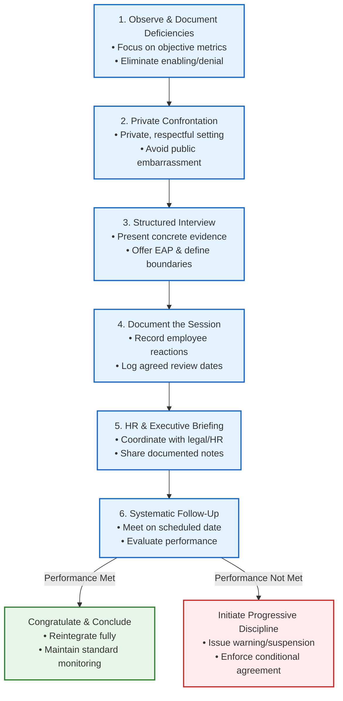

* **Step 1: Observe and Document Performance:** Ensure the employee fully understands their role and performance expectations. Maintain a meticulous, written record of specific, objective performance and behavioral deficiencies. If doubt exists regarding behavioral indicators, consult another manager or HR. Take immediate, decisive action to remove the employee from duty if safety is compromised.
* **Step 2: Private Confrontation:** Remove the employee from the active work environment and conduct the meeting in a secure, entirely private location. Maintain professional dignity; do not say or do anything that could embarrass, shame, or degrade the employee.
* **Step 3: Interview and Discuss:**
  * Conduct the interview with a management witness present (and a union representative if legally or contractually required).
  * Share objective, documented facts (e.g., attendance logs, quality metrics, or missed deadlines). State specifics; never speak in generalities.
  * Allow the employee a full opportunity to explain their performance slippage, keeping in mind they may be in deep denial. Document their responses.
  * Ask the employee what the organization can reasonably do to assist them in meeting expectations. Listen and empathize, but do not make immediate binding commitments.
  * Formally offer professional assistance by presenting information on the Employee Assistance Program (EAP) and local counseling resources. Provide direct contact numbers and pamphlets.
  * Explicitly define performance boundaries and the direct, non-negotiable disciplinary consequences if those boundaries are breached.
  * Establish a firm, scheduled date for a formal review of the employee's progress (e.g., *"We will meet in my office in exactly 30 days at 0900 to review your performance"*).
  * Conclude the meeting on a supportive note, reinforcing the organization's desire for their recovery and professional success.
* **Step 4: Document the Session:** Meticulously document the entire meeting, noting what was discussed, the employee's verbal responses, physical demeanor, and the scheduled review date. Place the follow-up meeting on the calendar.
* **Step 5: Corporate Communication:** Brief upper management and the HR department immediately. Provide copies of all meeting notes and performance documentation to HR to ensure compliance with employment laws.
* **Step 6: Systematic Follow-Up:** Hold the follow-up meeting on the designated date. Keep it concise and direct. If the employee has met the expectations, document the success, express appreciation, and return them to standard monitoring. If the employee has failed to meet the standards, immediately invoke the progressive disciplinary action outlined in the initial meeting.

##### When Intervention Fails

When an employee's addiction is too advanced for voluntary correction, or if they refuse to cooperate, the supervisor's only remaining course is **documented progressive discipline**. Progressive discipline is the structured, incremental escalation of consequences in response to ongoing performance failures:

$$	ext{Oral Warning} \longrightarrow 	ext{Written Warning} \longrightarrow 	ext{Suspension} \longrightarrow 	ext{Termination}$$

This escalation of consequences demonstrates to the abuser that their relationship with drugs has a real, tangible cost. Often, an abuser has already sacrificed their family, friends, assets, and physical health to maintain their dependency. The job is frequently the last bastion of normalcy and order in their life. Abusers cling to their employment desperately, rationalizing that they are not sick as long as they remain employed. Because of this, the threat of losing their job represents a powerful point of leverage that can force an abuser to finally break through their denial and seek professional help.

---

#### 7.7.5 Employee Assistance Programs (EAPs)

An Employee Assistance Program (EAP) is a highly effective, employer-sponsored program designed to assist employees (and their immediate family members) in identifying and resolving personal, health, marital, financial, alcohol, or drug abuse problems that affect job performance.

* **Evolution of EAPs:** Originally established in the 1940s as *occupational alcoholism programs* to combat severe alcohol abuse in industrial settings, modern EAPs have evolved into comprehensive clearinghouses addressing mental health, substance dependency, family counseling, and financial crisis management.
* **Strict Confidentiality:** The cornerstone of EAP efficacy is absolute confidentiality. EAP records are legally and operationally shielded from the employer. The organization is never provided the names of employees who voluntarily access the program, protecting the employee's professional standing and encouraging early self-referral.
* **The Clearinghouse Model:** EAPs operate as evaluation and referral networks rather than long-term treatment clinics. EAP clinicians conduct initial telephone or in-person assessments, evaluate the client's needs, and provide referrals to independent, certified community professionals for actual therapy or rehabilitation. The cost of treatment is typically coordinated through the employee's health insurance, and employers facilitate leaves of absence to accommodate recovery.
* **The Americans with Disabilities Act (ADA) Protections:**
  * Under the ADA, recovering drug and alcohol abusers who have successfully completed or are currently enrolled in a supervised rehabilitation program are classified as disabled and are entitled to **reasonable accommodation** (such as modified work schedules or leaves of absence for treatment).
  * **Critical Exclusion:** The ADA explicitly excludes current illegal drug users from protection. If an employee is currently abusing drugs or tests positive on a workplace screening, the employer is legally permitted to execute standard disciplinary action or termination, regardless of a claim of addiction.
* **Management EAP Referrals:**
  * **Mandatory Referrals:** When an employee's performance collapses and substance abuse is suspected, a supervisor can make a formal management referral to the EAP as an alternative to immediate termination.
  * **Conditional Employment:** In a management referral, participation is mandatory. The EAP provides the employer with progress reports regarding the employee's compliance with the treatment plan (though clinical details remain confidential).
  * **Reintegration Agreement:** As a condition of continued employment, the recovering employee signs a formal agreement. They agree to remain drug-free, cooperate with ongoing monitoring (including unannounced periodic drug testing), and meet all established performance standards. Breach of the agreement results in immediate termination.

---

#### 7.7.6 Behavior Modification Through Role Modeling

Role modeling is a powerful management tool for establishing organizational culture. Supervisors and managers must set an impeccable personal example, demonstrating the exact values, behaviors, and standards they expect from their workforce.

Substance abusers prefer to work in environments characterized by weak supervision, lax policies, and organizational denial, which allow them to easily hide and rationalize their behaviors. A robust, drug-free corporate culture characterized by active supervisor presence, peer accountability, and clear boundaries creates positive peer pressure. This healthy environment makes it impossible for an abuser to lie and deceive, eventually forcing them to confront their dependency.

---

#### 7.7.7 Reintegration of the Recovering Employee

The transition back to the workplace following intensive substance abuse rehabilitation is a vulnerable period for the recovering employee. Their long-term sobriety is heavily influenced by the cultural and operational environment to which they return.

* **The Danger of an Enabling Environment:** If the employee returns to a workplace characterized by peer drug use, supervisor indifference, or active enabling, the risk of immediate relapse is extremely high.
* **The Benefit of a Healthy Culture:** A healthy, structured, and supportive corporate culture provides essential recovery safeguards. Non-abusing coworkers offer positive social circles and an environment free of temptation. Supervisors maintain accountability by enforcing reasonable performance goals, maintaining clear boundaries, and providing positive reinforcement as milestones are achieved.

---

#### 7.7.8 Employee Education and Supervisor Training

A substance abuse prevention program cannot succeed without comprehensive, ongoing education across all organizational tiers.

* **Employee Education:** All employees must receive regular training regarding the physiological dangers of drug and alcohol abuse, the specific terms of the company's drug-free policy, the availability of the EAP, and the methods for accessing confidential help.
* **Human Resources Specialization:** HR professionals must be trained in advanced pre-employment screening methodologies to screen out active substance abusers before they enter the organization. HR must also maintain absolute mastery of the legal and administrative requirements of policy enforcement, ADA compliance, and disciplinary protocols.
* **Supervisor Training:** Supervisors must receive specialized training to equip them with the operational tools needed to enforce work rules. This training should focus on:
  * **Objective Performance Evaluation:** Distinguishing performance decline from personal bias.
  * **Behavioral Symptom Recognition:** Identifying clusters of indicators (e.g., physical signs, speech patterns, or attendance anomalies) that warrant reasonable suspicion testing.
  * **Intervention Mechanics:** Executing private, respectful, and legally compliant confrontation and referral procedures.

---

### 7.8 Drug Testing in the Workplace

Workplace drug testing is a highly effective, scientifically validated tool designed to deter substance abuse, detect active impairment, and maintain a safe, productive work environment.

#### 7.8.1 Statutory Framework and Global Variations

In the United States, the regulatory foundation for workplace testing is the **Drug-Free Workplace Act of 1988**. This statute requires all federal contractors and grantees receiving contracts or grants valued at **$25,000 or more** to formally certify that they maintain a drug-free workplace through written policies, employee education, and reporting mechanisms. Furthermore, federal agencies (such as the Department of Transportation and the Federal Highway Administration) mandate strict, periodic drug testing for safety-sensitive personnel (such as commercial drivers, pilots, and nuclear plant operators).

Globally, the legal and cultural approach to drug testing varies significantly:
* **Canada:** The Supreme Court of Canada (notably in the 2013 *Communications, Energy and Paperworkers Union of Canada v. Imperial Oil Ltd.* decision) ruled that random drug and alcohol testing of employees, even in safety-sensitive positions, is a severe invasion of privacy and is generally impermissible unless the employer can demonstrate a systemic substance abuse problem in the specific workplace.
* **European Union:** Many EU nations heavily restrict or completely prohibit workplace drug testing, viewing biological specimen collection as a violation of fundamental human rights and personal privacy. Testing is typically restricted to highly specialized safety-sensitive roles and requires explicit statutory authorization.
* **China and India:** Drug testing is not standard practice in corporate environments. Jurisdictional drug definitions and cultural norms differ, with corporate drug-free initiatives typically focusing on behavioral supervision and administrative reviews rather than biological screening.

#### 7.8.2 Specimen Collection and Scientific Analysis

Workplace drug testing relies on the rigorous scientific analysis of biological specimens. The primary testing methodologies include:

| Specimen Type | Detection Window | Advantages | Operational Constraints |
| :--- | :--- | :--- | :--- |
| **Urine Testing** | **2 to 5 Days** (Up to 30 days for chronic cannabis use) | Standard industry method; non-intrusive collection; highly cost-effective; large sample volume. | Susceptible to tampering, dilution, or substitution (requires strict collection protocols). |
| **Oral Fluid (Saliva)** | **24 to 48 Hours** | Reflects recent usage; impossible to substitute or adulterate; collection is directly observed. | Short detection window; lower sample volume. |
| **Hair Testing** | **Up to 90 Days** | Extremely long detection window; reveals chronic patterns of abuse; highly resistant to temporary abstinence. | Does not detect recent impairment (takes 5-7 days for drug to deposit in hair); higher laboratory cost. |
| **Blood Testing** | **Hours** (Highly immediate) | Directly correlates with active, real-time impairment; highly accurate. | Highly intrusive (requires invasive puncture); requires licensed medical personnel; expensive. |

##### The Two-Tiered Testing Process

To ensure absolute scientific accuracy and legal defensibility, laboratories utilize a strict, two-tiered testing protocol:
1. **Screening Test (Initial Assay):** The collected specimen undergoes an initial screening, typically using a rapid, highly sensitive **immunoassay** technique. This test determines if any drug classes are present above a designated cutoff level. If the screening is negative, the test is marked negative and finalized.
2. **Confirmatory Test (Gas Chromatography / Mass Spectrometry - GC/MS):** If the initial screening is positive, the laboratory must perform a confirmatory test using the gold standard of analytical chemistry: **Gas Chromatography/Mass Spectrometry (GC/MS)** or Liquid Chromatography/Tandem Mass Spectrometry (LC/MS/MS). This process separates, identifies, and quantifies the exact molecular structure of the drug or its metabolites, completely eliminating the possibility of a false positive.

#### 7.8.3 Accuracy and Laboratory Quality Assurance

Modern drug testing is exceptionally accurate and scientifically reliable. To achieve this standard, laboratories must maintain rigorous quality control and obtain formal certification from the **National Institute on Drug Abuse (NIDA)** or the **Substance Abuse and Mental Health Services Administration (SAMHSA)**.

Under these certification frameworks, every aspect of the testing pipeline is documented and audited:
* **System Integrity:** Laboratories frequently run blind control specimens (samples known to contain specific drug concentrations or no drugs) interspersed with actual employee samples to verify instrument calibration and system accuracy.
* **Statistical Reliability:** SAMHSA data indicates that under certified testing protocols, the probability of an uncorrected false-positive result is virtually non-existent, with fewer than 16 uncorrected errors occurring across millions of annual tests.

#### 7.8.4 Strategic Testing Framework

Organizations must design their testing programs in strict compliance with applicable federal, state, and local laws, collective bargaining agreements, and safety standards.

##### Whom to Test and When to Test Matrix

| Target Cohort (Whom to Test) | Testing Trigger / Frequency (When to Test) | Key Operational / Legal Requirements |
| :--- | :--- | :--- |
| **All Job Applicants** | **Preemployment** | Mandatory upon a conditional offer of employment. Must be completed within a specified timeframe. Failure results in a minimum 1-year hiring ban. |
| **All Employees** | **Reasonable Suspicion (For-Cause)** | Triggered by physical symptoms, erratic behavior, or safety violations. Requires documented supervisor observation and management concurrence. |
| **All Employees** | **Post-accident / On-the-job Injury** | Mandatory following serious workplace injuries, safety-critical failures, or significant property damage. |
| **All Employees** | **Return to Duty** | Required following a suspension or leave of absence due to a policy violation before returning to active duty. |
| **All Employees** | **Follow-up (Rehabilitation Monitoring)** | Periodic, unannounced testing as a condition of continued employment following EAP rehabilitation. |
| **Safety-Sensitive Positions Only** | **Random (Universal)** | Computerized, unannounced randomization conducted by a third-party testing administrator to maintain deterrence. |

##### Operational and Legal Protocols

* **Split-Specimen Collection:** To protect employee rights, collections must utilize a **split-specimen** methodology. The collected sample is is divided into two separate bottles (Bottle A and Bottle B). Bottle A is analyzed by the laboratory. If Bottle A is confirmed positive, the employee has a statutory right to request that Bottle B be sent to an independent, certified laboratory for analysis. If Bottle B fails to confirm the presence of the drug, the entire test is invalidated. In jurisdictions requiring split specimens, failure to execute this protocol invalidates a positive test, requiring immediate reinstatement of the employee.
* **Certified Collection Sites:** Specimen collection must occur at certified facilities in accordance with strict privacy and security protocols (such as verifying donor identity, securing the bathroom water supply, measuring specimen temperature within four minutes, and immediately sealing the specimen container with tamper-evident tape).
* **The Medical Review Officer (MRO) Verification:**
  * To protect donor privacy and prevent wrongful termination, all laboratory results must pass through a **Medical Review Officer (MRO)**—a licensed physician with specialized expertise in substance abuse.
  * **The MRO Interview:** The MRO reviews the laboratory data and contacts the employee in a confidential interview to determine if a legitimate medical explanation exists for the positive result (such as a valid prescription medication).
  * **Final Reporting:** If a valid medical explanation is verified, the MRO reports the test result to the employer as **negative**. If no medical justification is found, the MRO reports the result as **confirmed positive**.
* **Workers' Compensation Incentives:** Many states offer significant financial incentives (such as a 5% to 10% reduction in annual workers' compensation insurance premiums) to employers who implement a certified, drug-free workplace program. Furthermore, in many jurisdictions, a verified positive post-accident drug test or a refusal to test establishes a legal presumption of intoxication, allowing the employer and insurer to deny workers' compensation benefits.
* **Chain of Custody and Legal Liability:**
  * **Chain of Custody:** A legally binding document that tracks every individual who handled, transported, or analyzed the specimen from the moment of collection to final laboratory disposal.
  * **Broken Chain Consequences:** Any gap, missing signature, or administrative error in the chain-of-custody documentation invalidates the test result in a court of law.
  * **Management Recommendation:** Employers must never attempt to collect biological specimens themselves. Collection, transport, and analysis must be completely outsourced to licensed, third-party medical professionals and certified laboratories to shield the organization from defamation and civil rights liability.

---

### Appendix 7A: Supervisor's Substance Abuse Indicators Checklist

This checklist is an operational aid designed to assist supervisors in identifying performance and behavioral trends that may indicate workplace substance abuse. A single indicator may simply reflect a personal or medical issue; however, a **cluster of indicators** occurring over a sustained period warrants immediate closer monitoring and potentially a referral for reasonable suspicion testing.

#### 1. Attendance, Tardiness, and Schedule Deviations
* [ ] Frequent, unexplained absences from the assigned work area or office.
* [ ] Repeated tardiness at the start of the shift or when returning from breaks.
* [ ] Patterns of taking unusually long lunches or frequent, unscheduled breaks.
* [ ] High absenteeism rates immediately before or after weekends, paydays, and holidays.
* [ ] Frequent calls to report sick immediately following a denied vacation request.
* [ ] Repeated requests for emergency vacation extensions or sick leave extensions.
* [ ] Arriving late and departing early without prior operational authorization.
* [ ] Abnormal, frequent visits to the restroom during the shift.

#### 2. Work Performance, Quality, and Judgment Deficiencies
* [ ] Repeated procrastination and failure to meet established operational deadlines.
* [ ] Marked difficulty in comprehending or recalling complex instructions.
* [ ] Faulty decision-making and an increasing rate of errors in judgment.
* [ ] Unusually high rates of minor accidents, on-the-job injuries, or near-misses.
* [ ] Unnecessary damage to company equipment or customer property.
* [ ] Excessive wasted materials, scrap, or unexplained operational asset losses.
* [ ] Marked difficulty in handling standard, everyday work assignments.
* [ ] Alternate, highly erratic periods of extremely high and extremely low productivity.
* [ ] A general, pronounced lack of interest in the quality of the final product.
* [ ] Escalating volume of complaints from customers, clients, or coworkers.

#### 3. Interpersonal Relationships and Workplace Behavior
* [ ] Inappropriate, volatile emotional outbursts (such as anger, crying, or shouting).
* [ ] Severe, unpredictable mood swings occurring early or late in the shift.
* [ ] Extreme overreactions to standard constructive supervisor criticism.
* [ ] Persistent pattern of blaming others for personal performance failures.
* [ ] Making inappropriate, rambling, or completely incoherent statements.
* [ ] Sudden, deliberate social isolation from long-term coworkers and friends.
* [ ] Exaggerated self-importance, grandiosity, or unbending and unreasonable behavior.
* [ ] Spending excessive, unauthorized time on personal telephone calls.
* [ ] Repeated, unexplained failure to keep professional commitments and appointments.
* [ ] Physical volatility or combative, threatening posturing toward others.

#### 4. Physical Appearance, Demeanor, and Mood Indicators
* [ ] Glazed, bloodshot, or heavily watery eyes.
* [ ] Slurred, unusually slow, or rapid and pressured speech patterns.
* [ ] Unsteady, staggering gait or visible tremors in the hands.
* [ ] Sudden outbreaks of heavy, cold perspiration unrelated to temperature.
* [ ] Wearing sunglasses indoors or at highly inappropriate times to hide eyes.
* [ ] Persistent neglect of personal hygiene, unkempt hair, or body odor.
* [ ] Wearing inappropriate, sloppy, or dirty clothing to the workplace.
* [ ] Unusually deep sadness, withdrawn demeanor, or flat emotional affect.
* [ ] Sudden, loud outbreaks of inappropriate laughter or giggling.
* [ ] Pervasive suspiciousness, paranoia, or unusual irritability.
* [ ] Morbid preoccupation with death, illness, or severe violence.

---

### Appendix 7B: Management Intervention Checklist

#### Steps for Supervisors (What to Do)
1. **Observe and Document:** Keep a written record of specific performance and behavioral deficiencies. Focus on objective facts, dates, times, and measurable metrics.
2. **Consult and Verify:** If in doubt regarding observed behaviors, consult with another manager or HR to ensure objectivity.
3. **Confront in Private:** Always remove the employee from the active workspace and conduct the meeting in a quiet, confidential setting.
4. **Conduct with a Witness:** Ensure an HR representative or another manager is present as a witness. Respect union representation rights.
5. **State Specifics:** Present the employee with objective, written performance data (e.g., attendance records, error rates). Avoid speaking in generalities.
6. **Offer EAP Support:** Present EAP contact information and brochures. Emphasize that help is confidential and designed to support their recovery.
7. **Define Boundaries:** Establish clear, non-negotiable performance expectations and the direct consequences if standards are not met.
8. **Schedule Follow-Up:** Set a precise date and time for a formal follow-up meeting to review progress.
9. **Brief Management:** Provide copies of the meeting notes and performance documentation to HR and upper management immediately.

#### Critical Restrictions (What to Avoid)
* [ ] **Do NOT Diagnose:** Never attempt to diagnose a chemical dependency or mental health problem. Focus strictly on job performance and observed behaviors.
* [ ] **Do NOT Enable:** Never accept implausible excuses, cover up for mistakes, or shield the employee from the consequences of their performance failures.
* [ ] **Do NOT Lecture:** Avoid moralizing, lecturing, accusing, or attempting to guilt the employee into changing their behavior.
* [ ] **Do NOT Compromise Privacy:** Never discuss the employee's situation with coworkers or anyone without a strict operational need to know.
* [ ] **Do NOT Make Promises:** Do not make immediate binding commitments regarding accommodations or disciplinary exemptions without consulting HR and legal counsel.

---

### Appendix 7C: Sample Corporate Substance Abuse Policy

#### 1. Scope and Core Commitment
XYZ Company is dedicated to providing a safe, healthy, and highly productive work environment for all employees, contractors, and visitors. The abuse of drugs and alcohol jeopardizes workplace safety, compromises operational efficiency, and damages the reputation of the organization.

Therefore, XYZ Company maintains an absolute **Drug-Free Workplace** standard. Compliance with this policy is a mandatory condition of initial and continued employment. Violations will result in immediate corrective action, up to and including termination of employment.

#### 2. Prohibited Workplace Conduct
* **Use or Possession:** The unlawful manufacture, distribution, dispensation, possession, sale, purchase, transfer, offer of, or use of controlled substances, illegal drugs, or alcohol while on XYZ Company premises, operating company vehicles, or performing company business is strictly prohibited.
* **Drug Paraphernalia:** The possession of drug paraphernalia (including rolling papers, roach clips, pipes, bongs, or syringes) on company property is strictly prohibited.
* **Alcohol Exception:** Moderate, responsible consumption of alcohol is permitted only at formal, company-authorized events (such as holiday parties or client dinners) where alcohol is explicitly provided by management.

#### 3. Impairment Standards
Appearing for work, performing any job duties, or operating company vehicles while impaired by alcohol, illegal drugs, or the abuse of legal medications is strictly prohibited. 

An employee is deemed **impaired** if they exhibit physical symptoms, speech patterns, behavioral anomalies, or cognitive deficits consistent with substance use, or if they test positive for a prohibited substance or its metabolites in a workplace drug screen. If impairment is suspected, the employee will be immediately suspended from duty and transported to a certified collection facility for testing.

#### 4. Off-Duty and Off-Premises Standards
The off-duty, off-premises use of alcohol in a manner that results in workplace impairment, compromises safety, damages job performance, or negatively reflects on XYZ Company is strictly prohibited. The use of illegal drugs by employees is prohibited under all circumstances, whether on or off duty.

#### 5. Regulated and Legal Medications
The use of legal, prescribed medications or over-the-counter drugs in accordance with a licensed physician's instructions or manufacturer's recommendations is not prohibited. However, the abuse of legal drugs (including using medication prescribed for another individual or using larger doses than prescribed) is treated as a violation of this policy.

If an employee is taking a legally prescribed medication that may impair their cognitive or physical abilities in a safety-sensitive role, the employee must notify their supervisor or HR in advance. XYZ Company will attempt to provide a reasonable accommodation or temporary duty modification to ensure workplace safety.

#### 6. Mandatory Notification of Drug Convictions
Any employee convicted of a criminal drug violation occurring in the workplace must notify their supervisor and HR in writing within **five (5) calendar days** of the conviction. XYZ Company will report such convictions to government contracting agencies in accordance with the Drug-Free Workplace Act of 1988.

#### 7. Pre-Employment Screening
XYZ Company requires all job applicants who receive a conditional offer of employment to submit to a drug and alcohol screening. 
* **Hiring Ban:** Applicants who test positive or refuse to test will have their conditional offer immediately withdrawn and will be barred from reapplying for employment for a minimum period of **one (1) year**.

#### 8. Right of Inspection
To maintain safety and security, XYZ Company reserves the right to inspect, with or without prior notice, all offices, desks, lockers, company-owned vehicles, personal vehicles parked on company property, toolboxes, packages, purses, and lunch containers. Inspections may be conducted by authorized security personnel or management.

#### 9. Drug and Alcohol Testing Categories
XYZ Company requires employees to submit to breath, saliva, and/or urine testing in the following circumstances:
* **Preemployment:** Required for all applicants prior to final hire.
* **Reasonable Suspicion:** Required when a supervisor observes specific physical, speech, behavioral, or performance indicators of impairment. The determination requires the written documentation of the supervisor and the concurrence of a senior manager.
* **Post-Accident:** Required following any workplace accident resulting in a serious injury requiring medical attention, or an accident causing significant property or equipment damage.
* **Random Testing:** Safety-sensitive personnel are subject to unannounced, periodic random testing. Selection is performed by an independent, computerized random number generator managed by a third-party testing administrator.
* **Return-to-Duty and Follow-Up:** Required before returning to active duty following a policy violation, and periodically thereafter as a condition of continued employment.

#### 10. Specimen Collection and Scientific Protocols
* **Certified Laboratories:** All sample analyses must be performed by a laboratory certified by the Department of Health and Human Services (HHS) or the College of American Pathologists (CAP).
* **Consent and Cooperation:** Employees and applicants must sign a formal testing consent form. Refusal to sign or cooperate in the collection process will result in immediate termination or withdrawal of the employment offer.
* **Medical Review Officer (MRO):** All laboratory results are reviewed by a licensed MRO. The MRO will contact the donor to verify any legitimate medical explanations before reporting a confirmed positive result to the company.
* **Post-Injury Authorization:** An injured employee who is unable to provide a specimen at the time of an accident must sign a medical authorization allowing XYZ Company to obtain hospital toxicology reports.

#### 11. Rehabilitation and Employee Assistance Referral
XYZ Company recognizes that chemical dependency is a treatable health condition. The company encourages employees to voluntarily seek assistance through the confidential Employee Assistance Program (EAP) before a substance abuse problem interferes with their job performance or safety.
* **One-Time Rehabilitation:** On a case-by-case basis and at the sole discretion of management, an employee who violates this policy may be offered a one-time opportunity to undergo professional evaluation and complete an approved rehabilitation program as an alternative to immediate termination.
* **Return-to-Work Conditions:** To return to work, the employee must complete the program, obtain a clean return-to-duty drug screen, and sign a Reintegration and Conditional Employment Agreement. This agreement mandates unannounced follow-up testing and compliance with all EAP counseling recommendations.
* **Cost Allocation:** XYZ Company pays for all mandatory drug and alcohol testing. Treatment and rehabilitation costs are the responsibility of the employee, coordinated through their medical insurance.

#### 12. Policy Definitions
* **Impairment:** A physiological or cognitive state induced by a drug or alcohol that affects an employee's physical coordination, mental acuity, judgment, or behavior.
* **Illegal Drug:** Any substance that is not legally obtainable, or is legally obtainable but was not legally obtained or used (including prescription medications shared with others).
* **Legal Drug:** Any prescription or over-the-counter medication legally obtained and used for its manufactured purpose in accordance with medical directions.
* **Drug Paraphernalia:** Equipment or materials designed or used for preparing, storing, or administering controlled substances.
* **Serious Injury:** Any work-related injury resulting in immediate work stoppage and requiring professional medical treatment beyond basic first aid.

## Chapter 8: Workplace Violence Prevention

### 8.1 Introduction and Historical Context

Workplace violence (WPV) has long been a critical threat to organizational stability, safety, and business continuity. In the United States, active governmental and institutional interest in WPV intensified dramatically in 1986 following a tragic incident in Edmond, Oklahoma, where a U.S. Postal Service employee killed 14 coworkers before taking his own life. This event catalyzed modern public and private efforts to define, prevent, and mitigate workplace homicide and assault.

One of the first concrete regulatory efforts to address this issue occurred in 1998, when the U.S. Occupational Safety and Health Administration (OSHA) published its landmark guideline, *Recommendations for Workplace Violence Prevention Programs in Late-Night Retail Establishments*. The legal foundation for this and subsequent guidelines is the **OSHA General Duty Clause, Section 5(a)(1)** of the Occupational Safety and Health Act of 1970, which mandates that:
> *"Each employer shall furnish to each of his employees employment and a place of employment which are free from recognized hazards that are causing or are likely to cause death or serious physical harm to his employees."*

OSHA compiled data from the Bureau of Labor Statistics (BLS) and the National Institute for Occupational Safety and Health (NIOSH) to identify high-risk occupations—particularly those operating during late-night and early-morning hours—and established a structured security analysis model. This work was expanded in 2009 with updated late-night retail recommendations and complemented in 2004 by guidelines tailored specifically for healthcare and social service workers.

Research illustrates the massive scope of this problem: each year, approximately **2 million workers** in the United States become victims of workplace violence, resulting in roughly **450 workplace homicides** annually. 

```
┌──────────────────────────────────────────────────────────┐
│         U.S. WORKPLACE HOMICIDES BY PERPETRATOR          │
│                 (BLS Annual Statistics)                  │
├──────────────────────────────────────┬───────────────────┤
│ Robbers / Criminal Intruders         │ 106 homicides     │
│ Coworkers / Work Associates          │ 77 homicides      │
│ Clients / Customers / Patients       │ 39 homicides      │
│ Relatives / Domestic Partners        │ 33 homicides      │
│ Acquaintances / Other                │ 18 homicides      │
└──────────────────────────────────────┴───────────────────┘
```

Security professionals have spearheaded the effort to bring WPV prevention to the forefront of corporate risk management. A watershed moment for the security industry was the creation and approval of the 2011 industry-standard Workplace Violence Prevention and Intervention Standard, which was revised and updated in 2020 as the **Workplace Violence and Active Assailant—Prevention, Intervention, and Response Standard**. Noncompliance with these established best practices exposes organizations to severe civil liability, catastrophic reputation damage, and regulatory citations. While no prevention program can completely eliminate the risk, a comprehensive, multi-disciplinary, and proactively audited program is the only legally and operationally defensible approach to protecting human lives.

---

### 8.2 Workplace Violence Sources and Types

#### 8.2.1 The Workplace Violence Spectrum

Workplace violence encompasses a broad spectrum of disruptive behaviors. It is not limited to overt acts of physical violence (such as homicide, assault, or battery) but also includes verbal and written threats, harassment, intimidation, bullying, and any conduct that generates a reasonable concern for the safety of employees, contractors, and visitors. 

Recognized workplace violence prevention standards formally define WPV as:
> *"A spectrum of behaviors, including overt acts of violence, threats, and other conduct that generates a reasonable concern for safety from violence, where a nexus exists between the behavior and the physical safety of employees from any internal or external source."*

#### 8.2.2 The Employer's Duty of Care

Organizations maintain an absolute legal and moral obligation to provide a safe working environment. This **duty of care** extends to all employees, contractors, vendors, visitors, and guests on company premises. Crucially, the law does not distinguish between internal and external sources of danger. If an employer has reasonable cause to believe that a threat exists to an employee—even if the employee is operating off-premises within the scope of their duties—the organization must take proactive, documented steps to protect them. It is irrelevant whether the aggressor is a disgruntled worker, a client, a vendor, or an employee's abusive domestic partner; the obligation to mitigate the threat remains absolute.

#### 8.2.3 Business and Financial Consequences

The consequences of a WPV incident are catastrophic on both human and financial levels:
* **Human Cost:** The primary concern is the irreparable loss of human life and the severe physical and psychological trauma suffered by victims, witnesses, and survivors.
* **Legal Liability:** Organizations face multi-million dollar negligence lawsuits if they are found to have failed in their duty of care, ignored warning signs, or maintained inadequate security safeguards.
* **Operational Disruption:** A single violent incident can cost hundreds of thousands of dollars in lost productivity, widespread worker distraction, high employee turnover, and severe group morale collapse.
* **Indirect Costs:** These include massive increases in workers' compensation premiums, healthcare costs, emergency critical incident care, legal defense fees, and the long-term erosion of brand equity and shareholder value.

#### 8.2.4 The Five Types of Workplace Violence Offenders

To systematically evaluate threats and design appropriate physical and administrative safeguards, the security industry classifies WPV offenders into five distinct types:

| Offender Classification | Relationship to Organization | Typical Motive / Intent | Example Scenarios |
| :--- | :--- | :--- | :--- |
| **Type 1: Criminal Intent** | No legitimate relationship to the business or its employees. | Criminal gain (theft, robbery) or malicious trespass. | Armed robbery of a retail store, physical assault during burglary, active trespasser. |
| **Type 2: Customer / Client** | Legitimate relationship; recipient of services, products, or care. | Frustration with service, cognitive deficits, or dissatisfaction with care. | A patient assaulting a nurse, a client threatening an account manager, an angry patron in a restaurant. |
| **Type 3: Worker-on-Worker** | Current or former employee, contractor, or temporary worker. | Interpersonal disputes, perceived unfair treatment, or termination grievances. | A terminated employee threatening supervisors, peer-on-peer bullying or assault on the assembly line. |
| **Type 4: Personal Relationship** | Real or perceived personal relationship with a legitimate employee. | Spillover of domestic abuse, stalking, or personal disputes. | An abusive ex-spouse confronting a victim at their corporate desk, stalker tracking employee to parking lot. |
| **Type 5: Ideological / Extremist** | No direct relationship; motivated by ideological, political, or religious views. | Coercion, protest, disruption of operations, or terrorism. | Eco-terrorists sabotaging facilities, extremist groups attacking corporate offices, ideological protesters. |

#### 8.2.5 The Security Risk and Needs Assessment

The foundation of a Workplace Violence Prevention and Intervention (WVPI) program is a specialized security risk and needs assessment. This assessment evaluates:
* **The Threat Landscape:** Identifying potential sources of internal and external threats based on industry profile, geographic location, and historical incident logs.
* **Workplace Culture Vulnerabilities:** A toxic corporate culture characterized by unfair employee policies, chronic understaffing, poor management practices, or mismanaged organizational restructuring creates high levels of stress, resentment, and grievances. If ignored by executive management, these conditions significantly elevate the risk of Type 3 (worker-on-worker) violence.
* **Preparedness for Response:** Auditing existing policies, reporting protocols, behavior expectations, supervisor training, and active liaisons with local law enforcement and community mental health services.
* **Physical Security Vulnerabilities:** Identifying physical gaps (such as lax access controls, poor lighting, blind spots, or inadequate visitor management) that could allow an aggressor easy entry to the facility.

---

### 8.3 Warning Signs and Behavioral "Red Flags"

While there is no single, accurate "profile" of a workplace violence perpetrator, the vast majority of violent events are preceded by observable behavioral changes, stressors, and indicators. Recognizing these "red flags" and reporting them immediately is the most critical element of early prevention.

#### 8.3.1 Key Indicators and Behaviors

Supervisors and employees must be trained to identify clusters of the following warning signs:
* **Emotional & Depressive Indicators:** Severe, sudden mood swings; pronounced signs of clinical depression, extreme withdrawal, or deep sadness; expressing suicidal ideations or a morbid preoccupation with death, guns, and mass violence.
* **Aggressive & Volatile Behaviors:** Marked increase in anger, verbal outbursts, or aggressive posturing; workplace bullying or constant harassment of coworkers; making implied or overt verbal or written threats of physical harm.
* **Operational & Performance Deficiencies:** Sudden, unexplained increases in absenteeism or tardiness; a severe, unprecedented collapse in work quality and productivity; persistent neglect of personal hygiene and unkempt physical appearance.
* **Conflict & Destructive Patterns:** Severe, escalating arguments with coworkers, supervisors, or clients; intentional destruction, theft, or sabotage of company property.
* **External Life Stressors:** Visible signs of escalating alcohol or drug abuse; severe domestic or relationship crises; sudden, unusual inquiries regarding life insurance policies, beneficiary changes, or estate planning.

#### 8.3.2 The Critical Importance of Prompt Reporting

A WVPI program's success depends entirely on the prompt reporting of concerning behaviors to the organization's centralized intake system. Employees must know exactly how, when, and to whom to report these indicators. Early identification allows the organization to intervene supportively (such as through EAP referrals or conflict resolution) before a situation escalates to violence. Organizations must provide multiple reporting channels, including anonymous hotlines, to eliminate barriers to reporting.

---

### 8.4 Developing the WVPI Program

#### 8.4.1 Organizational Commitment and the CEO Policy

The initial and most crucial step in developing a WVPI program is establishing an absolute commitment from executive leadership. The workplace violence policy should be signed and issued directly from the desk of the **Chief Executive Officer (CEO)**. Executive management must publicize this policy widely and provide the necessary funding, staffing, and administrative authorizations to ensure the program is fully operational and continuously audited.

A comprehensive, executive-backed WVPI policy must:
* **Define Prohibited Behavior:** Establish clear, objective definitions of prohibited conduct, threats, harassment, and physical violence.
* **Regulate Weapons:** Prohibit the possession of firearms or weapons on company property and in company vehicles, to the fullest extent permitted by applicable federal, state, and local laws.
* **Mandate Immediate Reporting:** Establish a formal, mandatory obligation for all employees and contractors to report any observed policy violations or safety concerns immediately.
* **Provide Diverse Reporting Avenues:** Maintain multiple confidential and anonymous reporting channels (such as hotlines, web portals, or designated HR contacts).
* **Protect against Retaliation:** Explicitly commit to non-retaliation for employees who make good-faith reports under the policy.
* **Mandate Protective Order Reporting:** Require employees to notify HR or security if they apply for, seek, or are granted a protective or restraining order that lists the workplace as a covered location. This allows security to execute protective measures (such as visitor screening or modified parking).
* **Outline Disciplinary Actions:** Specify that violations will result in strict disciplinary action up to and including immediate termination, as well as potential criminal prosecution.

> [!WARNING]
> **The "Zero Tolerance" Policy Fallacy:** Organizations must avoid utilizing the term *"zero tolerance"* in their WVPI policies. While well-intentioned, research demonstrates that "zero tolerance" acts as a powerful deterrent to employee reporting. Employees fear that reporting a coworker's minor warning signs or emotional distress will automatically result in that coworker's immediate firing. Consequently, they remain silent, allowing the coworker's distress to escalate into a crisis. Instead, policies should emphasize **zero tolerance for violence, but maximum tolerance for supportive reporting, customized behavioral assessments, and flexible, compassionate situational resolutions**.

#### 8.4.2 The Multidisciplinary Working Groups

Developing a robust WVPI program requires a collaborative, multidisciplinary approach to ensure legal compliance, employee equity, and security alignment.

```
┌─────────────────────────────────────────────────────────────────┐
│              WVPI WORKING GROUP (WG) DEVELOPMENT                │
├─────────────────────────────────────────────────────────────────┤
│ 1. POLICY WORKING GROUP (WG)                                    │
│    • Core stakeholders: Security, HR, Legal, Risk Management,   │
│      EAP, Public Relations, Health & Safety, Union Reps.        │
│    • Task: Draft policies, secure funding, align departments.   │
├─────────────────────────────────────────────────────────────────┤
│ 2. STAKEHOLDERS WORKING GROUP (SWG)                              │
│    • Task: Refine draft, design operational protocols, map      │
│      departmental resources and training curriculums.           │
├─────────────────────────────────────────────────────────────────┤
│ 3. THREAT MANAGEMENT TEAM (TMT) / THREAT ASSESSMENT TEAM (TAT)  │
│    • Permanent, highly specialized operational team.            │
│    • Task: Continuous case management, threat evaluations,      │
│      active monitoring, and direct incident response.           │
└─────────────────────────────────────────────────────────────────┘
```

The permanent, operational **Threat Management Team (TMT)**—also referred to as the Threat Assessment Team (TAT) or Incident Management Team (IMT)—is responsible for receiving reports, executing threat assessments, coordinates response strategies, and managing cases to resolution. The TMT should maintain close relationships with outside experts (such as forensic psychologists, threat assessment consultants, and local law enforcement) to supplement their internal expertise.

#### 8.4.3 Security's Pivotal Role in WVPI

While the TMT is multidisciplinary, the security department serves as the operational focal point. The organization depends on security personnel to:
* Conduct regular physical security surveys, CPTED audits, and risk assessments.
* Recommend and install technical security countermeasures (access controls, visitor screening, duress alarms, video monitoring).
* Design and implement facility-specific security policies and procedures.
* Train general employees on physical security awareness and emergency response actions (such as Active Assailant protocols).
* Respond to, investigate, document, and report all threats, safety concerns, or incidents of violence.
* Coordinate response efforts with local law enforcement, emergency services, and county mental health crisis teams.

#### 8.4.4 Security Resource Allocation

To prevent or mitigate WPV, the TMT and security must systematically allocate resources across four primary pillars:
1. **Physical, Electronic, and Design Security:** Restricting access, implementing visitor management, securing parking lots, optimizing lighting, installing panic alarms at high-risk reception desks, and deploying monitored CCTV networks.
2. **Security Policies, Procedures, and Protocols:** Establishing clear, written standards for intake, investigation, access control, and emergency incident response.
3. **Security Personnel Competency:** Reviewing and auditing the recruitment, screening, training, equipping, supervision, and deployment of security officers to ensure they can effectively deter, detect, delay, deny, and respond to threats.
4. **Awareness, Education, and Training:** Developing and delivering comprehensive training for all employees, supervisors, and TMT members, complemented by periodic drills and active shooter tabletop exercises.

---

### 8.5 Threat Assessment and Incident Management Protocols

#### 8.5.1 Notification and Intake Systems

Threat management begins the moment a notification is received. The organization must maintain robust intake protocols to ensure that any report—from any source (internal employee, external family member, customer) and by any medium (email, phone, anonymous hotline, verbal report)—is immediately routed to the designated TMT intake coordinator.

Receptionists, telephone operators, customer service agents, and front-line supervisors must be extensively trained in intake procedures. They must know exactly who to contact 24/7. When a report is received, the TMT must initiate its assessment process immediately; any delay in response can allow a volatile situation to rapidly escalate into physical violence.

#### 8.5.2 Threat Assessment Methodology

The primary goal of threat assessment is to identify potential threats, evaluate the subject's capacity and intent to commit violence, and implement effective, legally compliant mitigation strategies.

##### Known vs. Unknown Subjects

* **Unknown Subjects:** If a threat is made anonymously (such as a threatening letter or email) and the author cannot be immediately identified, a valid violence risk assessment cannot be conducted. While the TMT can perform a preliminary behavioral analysis of the threat text, they cannot assess the subject's access to weapons, historical baseline, or personal stressors. In these cases, the TMT must coordinate with security and law enforcement to launch an investigation to identify the subject, while simultaneously escalating physical security safeguards at the facility.
* **Known Subjects:** If the subject's identity is verified, the TMT can initiate a formal, structured threat assessment.

##### The Three Levels of Known Subject Threat Assessment

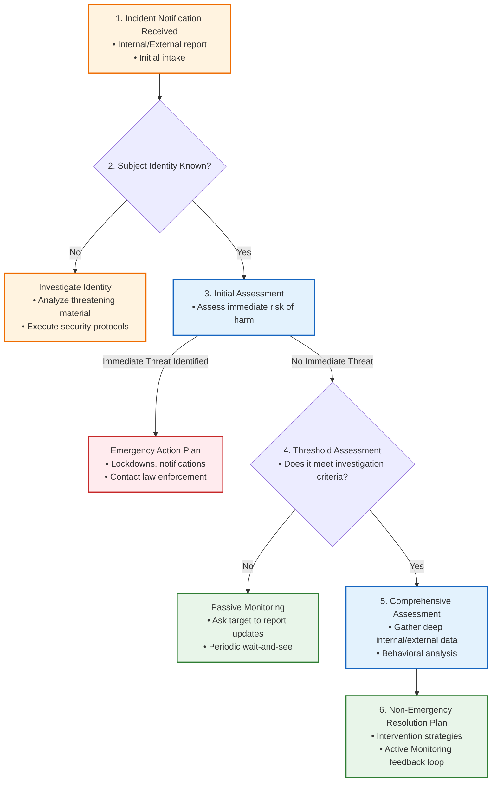

1. **Initial Assessment:** The first-line evaluation performed immediately upon receipt of a report. The sole focus is determining whether there is an **immediate risk of physical harm** to employees or the workplace. If the initial assessment reveals a significant, imminent threat, the TMT immediately activates emergency response protocols (such as contacting law enforcement, securing the facility, issuing emergency notifications, and placing targets in secure locations).
2. **Threshold Assessment:** If the initial assessment suggests there is no immediate threat of physical harm, the TMT performs a threshold assessment. This evaluation uses readily available internal files (HR records, security logs, supervisor interviews) to determine if the report meets the organization's predetermined threshold for a formal, in-depth investigation, or if the situation is low-risk and requires only passive monitoring.
3. **Comprehensive Assessment:** If the threshold is met, the TMT launches a comprehensive threat assessment. This represents a deep-dive investigation that gathers extensive information from internal and external sources (criminal history, public social media footprint, interviews with coworkers and family members, historical behavioral patterns). The comprehensive assessment evaluates the subject's progress along the **pathway to violence**, identifies current stabilizers and destabilizers in their life, and provides the foundation for designing a customized, non-emergency situational resolution plan.

#### 8.5.3 Intervention and Situational Resolution Strategies

The overriding goal of any threat intervention is to ensure the short-term and long-term safety of the target. Intervention strategies are designed to divert or deflect the aggressor away from thoughts and acts of violence, redirecting them toward socially acceptable behaviors to resolve their perceived grievances or need for control.

##### The "Do No Harm" Principle

The TMT's primary guidance is the *"do no harm"* principle. An intervention is most effective and permanent when the aggressor **willingly chooses** to alter their behavior and abandon their violent intent. Anything less than a willing choice is inherently temporary and represents a stabilizing measure rather than a final resolution. 

Administrative and judicial interventions—such as obtaining a restraining or protective order, executing an arrest, terminating employment, or placing the subject in involuntary mental health holds—are essential **short-term stabilizing measures**. However, they do not alter the subject's internal grievances. If the subject's underlying rage and cognitive distortions remain unaddressed, these measures will eventually fail when the restraining order is violated or the subject is released from custody. Therefore, stabilizing measures must always be accompanied by a long-term threat management plan.

##### Direct Stabilizing Intervention Options
* **Investigative Interviews:** Conducting a highly structured interview with the subject. In addition to gathering critical assessment data, the interview itself acts as an intervention. A skilled interviewer can reframe the subject's goals, discuss concrete cause-and-effect consequences, outline legal and career boundaries, and help the subject identify alternative, non-violent methods to resolve their perceived grievances.
* **Administrative Actions:** Implementing documented corporate discipline, suspension, mandatory fitness-for-duty evaluations, or formal termination of employment.
* **Judicial and Protective Orders:** Serving formal no-trespass notices, civil restraining orders, or domestic violence protective orders.
* **Mental Health Evaluations:** Utilizing voluntary or involuntary psychiatric holds and comprehensive forensic psychological evaluations.
* **Law Enforcement Engagement:** Coordinating with local police to document threats, file criminal charges, and execute arrest warrants when laws have been violated.

#### 8.5.4 Passive vs. Active Monitoring Behavioral Feedback Loops

Threat assessment is a continuous, dynamic process rather than a single event. The TMT must establish a behavioral feedback loop to monitor the subject for any new warning signs or changes in risk level, allowing them to adjust intervention strategies in real time.

| Dimension | Passive Monitoring | Active Monitoring |
| :--- | :--- | :--- |
| **Operational Definition** | Relying on the target or witnesses to report new behaviors or contacts to the TMT on a voluntary basis. | Proactively seeking out new behavioral information, checking in with witnesses, coworkers, and the target at regular intervals. |
| **Ideal Use Case** | **Low-risk scenarios** where a delay in immediate reporting does not threaten physical safety (e.g., a single, non-specific anonymous message). | **Moderate- to high-risk scenarios** or situations where the target/witnesses cannot be relied upon to report. |
| **Target Underreporting Drivers** | Minimal impact, low friction. | Overcoming psychological defense mechanisms (denial, minimization, shock, fear of retaliation, or job loss embarrassment). |
| **TMT Action Level** | **Wait-and-see** approach; monitoring calendar and inbox for incoming reports. | **Proactive outreach** multiple times per shift; coordinating with onsite supervisors, checking access logs, and verifying safety directly. |

#### 8.5.5 Reassessment, Review, and Process Debriefing

* **Incident Review:** Performed on a continuous, ongoing basis. As new behavioral feedback is gathered through monitoring, the TMT constantly updates its threat assessment, evaluates the effectiveness of current interventions, and refines tactical plans until the case is formally resolved.
* **Process Debriefing:** A strategic-level review conducted after a case has been closed. TMT members gather to evaluate the organization's response, identify lessons learned, and implement systemic improvements to the WVPI program. The TMT should maintain a regular schedule of quarterly or annual debriefings to review historical cases and audit overall program efficacy.

---

### 8.6 Workplace Violence Program Implementation

Implementing a WVPI program must be carefully planned, systematically executed, and fully documented by the multidisciplinary working group. Program implementation should follow a structured, step-by-step methodology:

1. **Designate a Dedicated Implementation Team:** Formally establish the multidisciplinary Stakeholders Working Group (SWG) and designate the core members of the permanent Threat Management Team (TMT).
2. **Ensure Legal and Standard Compliance:** Map all program elements against applicable federal, state, and local laws, and align the program directly with the recommendations of the **industry-recognized Workplace Violence and Active Assailant Standard**.
3. **Establish Incident Management Protocols:** Draft detailed, written operating procedures for report intake, threat assessment investigations, TMT activation thresholds, intervention options, and active monitoring feedback loops.
4. **Disseminate the Policy:** Publish the CEO-signed workplace violence policy across the entire organization using multiple channels (employee onboarding portals, corporate emails, physical posters, and organization-wide orientations).
5. **Conduct Documented, Multi-Tiered Training:**
   * **General Employee Training:** Focuses on WPV awareness, identifying behavioral warning signs, understanding the critical importance of immediate reporting, and emergency response actions (Run, Hide, Fight / Active Assailant response).
   * **Manager and Supervisor Training:** Equips operational leadership with the tools to identify performance slippage, document behavioral changes, handle sensitive disclosures, and execute mandatory reporting to the TMT.
   * **In-Depth TMT Specialized Training:** Provides TMT members with continuous, advanced training from qualified forensic experts, covering threat assessment methodologies, investigative interviewing, CPTED principles, and crisis management.
6. **Continuous Monitoring and Program Audits:** Establish an annual review process to evaluate program performance, audit physical and electronic security safeguards, update local law enforcement liaisons, and continuously refine policies based on process debriefings.

---
### 8.7 Special Threat Scenarios

#### 8.7.1 Intimate Partner Violence (IPV)

When an employee is the target of domestic abuse or stalking, the risk of violence frequently spills over into the workplace, transforming a personal safety crisis into an acute organizational security concern. The Threat Management Team (TMT) must establish a highly accessible, compassionate, and non-punitive reporting environment. Once a report is received, the TMT must execute immediate protective measures:
* **Access Control Hardening:** Restricting the suspected abuser's physical access to the property by providing their photograph, name, and vehicle details to all security gates and reception posts.
* **Operational Relocation:** Moving the employee to a secure, interior work location away from windows, main entryways, or public-facing areas.
* **Communication Hardening:** Immediately changing the employee's corporate email address, extension, and telephone number, and routing all external inquiries through an administrative filter.
* **Escort Protocols:** Providing mandatory security officer escorts for the employee between the facility entrance, parking zones, and their vehicle.
* **Supportive Referrals:** Connecting the employee with specialized local domestic violence advocacy networks, law enforcement victim services, and the organization's EAP resources.

#### 8.7.2 Employees Exhibiting Behavioral or Mental Health Concerns

When an employee exhibits severe behavioral anomalies, disorientation, or symptoms of a psychological disorder that raise safety concerns, the TMT must proceed with extreme care. The organization must coordinate closely with legal counsel and HR to navigate complex statutory protections:
* **Legal Protections:** In the United States, the **Americans with Disabilities Act (ADA)** and the Family and Medical Leave Act (FMLA) protect employees with documented psychiatric disabilities, heavily regulating medical inquiries and fitness-for-duty standards.
* **Privacy and Confidentiality:** All medical data, psychological assessments, and case histories must be maintained in separate, strictly confidential files, completely segregated from standard personnel records.
* **Mitigation Strategies:** Supported by legal counsel, the TMT may recommend encouraging the employee to seek voluntary medical and psychiatric evaluations, facilitating a structured medical leave of absence, or executing a formal, mandatory fitness-for-duty examination administered by a certified forensic psychologist as a condition of continued employment.

#### 8.7.3 Separations of Employment

The termination of a volatile, high-risk employee represents one of the most critical security events an organization can execute. To ensure a respectful, safe, and legally defensible separation, the TMT must coordinate a meticulous tactical plan:
* **Dignified Conduct:** The termination meeting should be conducted in a private, neutral location, keeping the session concise, direct, and respectful. Avoid any behavior that could unnecessarily shame or humiliate the individual.
* **Immediate Deactivation:** Coordinate with IT and security to deactivate all building access badges, network login credentials, and corporate email accounts *before* the termination meeting begins.
* **Asset Retrieval:** Immediately recover all physical keys, ID badges, parking permits, laptops, and company-owned mobile devices during the meeting.
* **Security Safeguards:** Deploy plainclothes security personnel near the meeting room. Establish short-term and long-term facility monitoring, including physical patrols and updated entry gate rosters, to detect and deny any attempted return by the former employee.

---

### 8.8 Crisis Response Protocols

When an incident of physical violence or an active assailant attack occurs, there is zero time to perform assessments or draft plans. The organization must rely on a highly detailed, regularly drilled crisis management plan.

Key organizational preparedness and response considerations include:
* **Role Clarification:** Establishing explicit, documented roles, operational checklists, and communication protocols for all key response personnel, supervisors, and security officers.
* **Emergency Notification Systems:** Deploying multi-modal alert systems (SMS text blasts, desktop overrides, public address announcements, and duress alarms) to immediately notify the workforce of an active threat.
* **Active Assailant Training:** Implementing comprehensive training for all employees on the industry-standard **Run. Hide. Fight.** protocols, ensuring they understand the physical tactics of evacuation, barricading, and last-resort defense.
* **Response Equipment:** Providing security forces and response teams with specialized emergency gear, including two-way radios, master access cards, updated floor plans, architectural layout sheets, and trauma-grade first aid kits.
* **Public Safety Liaison:** Maintaining active, ongoing communication with local police, SWAT, fire, and emergency medical services, ensuring they possess up-to-date access coordinates and facility maps.
* **Command Centers:** Designating a primary and secondary **Emergency Operations Center (EOC)** and **Incident Command Center (ICC)** to coordinate internal security forces and facilitate integration with arriving public safety responders.
* **Crime Scene Preservation:** Establishing immediate containment protocols to preserve the physical scene and secure digital video surveillance evidence for subsequent law enforcement forensic investigations.
* **Workforce Accounting:** Operating a rapid, centralized system to account for all employees, contractors, and visitors located on-site during the crisis.
* **Spokesperson Training:** Designating and training a single public relations spokesperson to manage all media communications, ensuring that all disseminated data is verified, legally approved, and controlled.
* **Trauma Staging Zones:** Establishing safe, secure staging areas for media briefings and family reunification, located completely separate and distant from the active tactical scene.

---

### 8.9 Post-Incident Recovery and Continuity

Once the immediate crisis has been neutralized, the organization must transition seamlessly into the business recovery and business continuity phases.

Priority recovery operations must focus on:
* **Life Safety and Medical Care:** Providing immediate medical attention, coordinating hospitalization transports, and establishing continuous health monitoring for injured personnel.
* **Fact Gathering and Stabilization:** Securing the area to preserve evidence, separating witnesses to ensure objective statements, and maintaining close monitoring to detect any secondary threats or retaliatory actions.
* **TMT Alignment:** Coordinating the efforts of the TMT with corporate crisis management, disaster recovery, and operational continuity teams.
* **Structured Notifications:** Making rapid, compassionate notifications to family members of victims, briefing employees, and filing required reports with regulatory bodies (such as OSHA) and executive management.
* **Crisis Communications:** Deploying public relations teams to manage all external media messaging, ensuring consistent, factual updates across all channels (press conferences, social media, and direct press releases).
* **Mental Health and Psychological Support:** Deploying Critical Incident Stress Debriefing (CISD) specialists, clinical psychologists, and EAP counselors to provide immediate and long-term psychological support, helping employees identify signs of trauma and PTSD.
* **Operational Resumption:** Executing a phased plan to rebuild physical infrastructure, clean affected areas, and safely resume corporate operations only when the facility is certified secure.
* **Relationship Restoration:** Rebuilding damaged relationships with clients, key vendors, shareholders, and the surrounding community through transparent, proactive communications.
* **Continuous Improvement:** Conducting a formal post-incident audit to review all responses, analyze vulnerabilities, and implement lessons learned into the next iteration of the WVPI program.

---

### 8.10 Summary

Organizations maintain a fundamental, non-delegable duty to provide a safe and secure working environment, free from recognized hazards and foreseeable acts of violence. The Workplace Violence Prevention and Intervention (WVPI) program is not an isolated administrative task; it is a critical, integrated component of an organization's overall physical security and asset protection program.

While extreme, catastrophic workplace violence events are statistically rare, a single incident can result in tragic loss of life, devastating physical and psychological injuries, and ruinous corporate liability. Consequently, a proactive, multi-disciplinary, and continuously audited program focused on early detection, behavioral assessment, and supportive intervention is the only viable approach to safeguarding an organization's human capital and operational resilience.

---

### Appendix 8A: Sample Corporate Workplace Violence Policy

#### 1. Scope and Policy Commitment
XYZ Company is committed to providing a safe, secure, and respectful working environment for all employees, contractors, vendors, and visitors. The company maintains an absolute zero-tolerance standard for physical violence, threats of violence, harassment, intimidation, bullying, or any aggressive behavior on company property, in company vehicles, or while performing company business.

#### 2. Prohibited Conduct
Violations of this policy include, but are not limited to:
* **Overt Acts of Violence:** Committing physical assault, battery, or physical harm against any individual.
* **Threatening Behavior:** Making verbal, written, or implied threats of physical harm, death, or destruction of property.
* **Harassment and Bullying:** Engaging in a pattern of aggressive, hostile, or intimidating behavior designed to cause distress or fear.
* **Weapons Possession:** Carrying, displaying, or possessing firearms, explosives, knives, or dangerous weapons of any kind on company property, regardless of state-issued concealed carry permits, unless explicitly authorized by HR and Security for security personnel.
* **Misleading Reporting:** Making false, malicious, or intentionally misleading reports of workplace violence against others.

#### 3. Intake and Reporting Responsibilities
Every employee has a mandatory duty to report any observed policy violations, threats, or concerning behavioral changes immediately. Reports should be made to:
* A direct supervisor or manager.
* The Human Resources Department.
* The Security Central Command.
* The confidential, anonymous employee reporting hotline at **1-800-555-SAFE**.

There will be absolutely no retaliation, discrimination, or negative career consequences for any employee who makes a good-faith report under this policy.

#### 4. Mandatory Protective Order Notification
Any employee who applies for, seeks, or is granted a temporary or permanent civil protective or restraining order that lists XYZ Company facilities as protected areas must immediately provide a copy of the petition, court declarations, and the final order to the Designated Management Representative (DMR) listed below. This information is essential to allow security and facility management to enforce the court-ordered boundaries.

#### 5. Investigation and Corporate Action
XYZ Company will launch an immediate, thorough, and confidential investigation into all reported threats or incidents of violence. 
* **Suspension Pending Review:** Any individual suspected of violating this policy will be immediately suspended from duty and barred from all company premises pending the final outcome of the investigation.
* **Disciplinary Action:** If the investigation substantiates a violation, XYZ Company will execute decisive corrective action, up to and including immediate termination of employment, termination of business relationships, and active cooperation with law enforcement to secure criminal prosecution.

#### 6. Designated Management Representative (DMR)
* **Title:** Director of Corporate Security and Threat Management
* **Office Location:** Corporate Headquarters, Suite 400
* **Direct Telephone:** (555) 019-9000
* **Secure Email:** dmr.security@xyzcompany.com

---

### Appendix 8B: Workplace Violence Plan Scenario: Terminated Employee Access Control

In this operational scenario, a security threat and risk assessment identified the unauthorized reentry of a terminated, potentially volatile former employee into the facility as a high-priority threat. The Threat Management Team (TMT) was tasked with designing and applying physical, electronic, and administrative countermeasures to mitigate this risk.

The following security audit and implementation checklist outlines the coordinate safeguards:

#### 1. Physical & Electronic Engineering Safeguards
* [ ] **Intrusion and Door Alarms:** Install magnetic door position switches and glass-break sensors on all secondary emergency exits and windows, ensuring they trigger immediate silent alarms at the Central Security Station (CSS).
* [ ] **Audio/Video Intercom Entry Systems:** Equip all delivery docks and secondary entry doors with high-definition A/V intercom terminals, requiring visitors to present valid identification to CSS officers before remote access is granted.
* [ ] **Front Desk Security Command:** Configure the reception desk with eye-level CCTV monitors displaying all lobby entrances, and integrate a physical, under-counter door release switch.
* [ ] **Duress Panic Buttons:** Install silent under-counter panic buttons at the reception desk and inside HR meeting rooms, configured to dial police dispatch and alert the CSS instantly.

#### 2. Administrative Credentials and Security Operations
* [ ] **Deactivation of Credentials:** Deactivate all building access badges, keycards, parking gate transponders, network logins, and VPN access *prior* to the termination meeting.
* [ ] **Immediate Asset Recovery:** Recover all physical keys, ID badges, corporate credit cards, parking permits, laptops, and mobile devices during the termination session.
* [ ] **Terminated Employee Database:** Maintain a digital register at the CSS containing high-resolution photographs, names, termination dates, and vehicle descriptions (including license plates) of all high-risk terminated employees.
* [ ] **Banishment Enforcement:** Establish a strict operational policy declaring that under no circumstances is a terminated former employee allowed to enter company property without a prior, written executive security authorization and a mandatory security escort.

#### 3. Security Force Tactical Deployment
* [ ] **Briefing and Roster Review:** Brief all security shifts on high-risk terminations, ensuring all patrolling officers review the subject's photograph and vehicle description.
* [ ] **Exterior Perimeter Patrols:** Conduct regular, documented foot and vehicular patrols of all parking structures, loading docks, and exterior exit alcoves to detect unauthorized presence.
* [ ] **Tactical Communications:** Equip all officers with encrypted, multi-channel two-way radios, and verify that emergency speed-dials to the local police department are fully operational.

#### 4. Employee Education & Training Actions
* [ ] **Zero Tail-Gating Policy:** Train all employees on strict access-card discipline. Under no circumstances is any employee allowed to hold doors open or allow tail-gating by any individual, including former colleagues.
* [ ] **Immediate Incident Escalation:** Instruct employees to report the presence of any terminated former coworker spotted on or near company premises to Security or HR immediately.
* [ ] **Front Desk Emergency Lock-Down:** Conduct regular drills with front-desk receptionists and security guards to practice the immediate activation of lobby lock-down controls if a threat is identified.

---

### Appendix 8C: Standards in Security

A **standard** is a structured set of criteria, guidelines, and best practices designed to enhance the quality, reliability, and security of products, services, or processes. In the asset protection field, security standards provide a common language and baseline to help organizations safeguard assets, improve operational resilience, and navigate physical and cyber threats.

Standards are developed by accredited **Standards Developing Organizations (SDOs)** through a consensus-based process involving private sector experts, public sector stakeholders, academics, and regulatory authorities.

#### 1. Voluntary Standards

Voluntary standards are guidelines that organizations choose to adopt to align with industry best practices, though they are not legally mandated:
* **ISO Standards:** The International Organization for Standardization (ISO) publishes globally recognized standards covering facilities management, environmental safety (ISO 14001), risk management (**ISO 31000**), and information security (**ISO/IEC 27001**).
* **Recognized Security Industry Standards:** Specialized voluntary standards developed by leading security organizations, such as the *Workplace Violence and Active Assailant Standard*, the *Physical Asset Protection Standard*, and the *Security Risk Assessment Guideline*.
* **UL Standards:** Underwriters Laboratories (UL) publishes detailed voluntary standards establishing performance and safety criteria for physical security hardware (such as locks and access controls) and electronic alarm systems.

#### 2. Statutory or Regulatory Standards

Statutory standards are legally binding mandates enacted by federal, state, or local governments, enforced by administrative authorities. Examples include the **Drug-Free Workplace Act of 1988** and the safety regulations enforced by the Occupational Safety and Health Administration (OSHA). Failure to comply results in direct financial penalties, legal citations, and potential shut-down orders.

#### 3. Mixed Standards

The boundary between voluntary and statutory standards frequently blurs:
* **Regulatory Incorporation:** Voluntary standards from organizations like the National Fire Protection Association (NFPA) are routinely incorporated directly into municipal building codes and fire safety laws, rendering them legally binding.
* **Contractual Mandates:** Clients and insurers increasingly require adherence to voluntary standards (such as ISO 9001 for quality or recognized standards for physical security) as a mandatory condition of contracts or to obtain commercial liability insurance coverage.

#### 4. Benefits of Standards

Adopting security standards provides several major benefits:
* Codifies industry best practices and integrates historical lessons learned.
* Provides validated, systematic tools to assess threats, vulnerabilities, and risk.
* Establishes clear performance baselines for security equipment and systems.
* Defines objective measurement and auditing methodologies.
* Enhances cross-jurisdictional information sharing and technical interoperability.
* Promotes consistent, high-quality delivery of security services.

#### 5. Management System Standards

Management System Standards (MSS) help organizations systematically design, execute, and continually improve their business processes. The most prominent examples are **ISO 9001** (Quality Management) and **ISO 14001** (Environmental Management). In the security sector, an MSS approach provides a comprehensive framework to align strategic, operational, and tactical security objectives, enhancing organizational resilience.

#### 6. The Plan-Do-Check-Act (PDCA) Cycle

The operating principle of all modern management system standards is the **Plan-Do-Check-Act (PDCA) Cycle**, a continuous, four-phase problem-solving loop focused on process optimization and constant improvement.

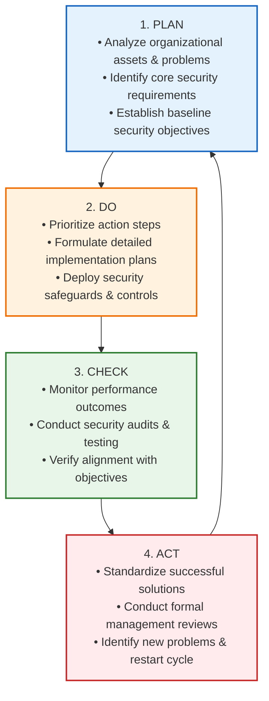

* **PLAN:** Identify, analyze, and catalog the organization's assets, hazards, and security vulnerabilities. Establish clear baseline objectives and performance metrics.
* **DO:** Prioritize the next steps, design detailed tactical action plans, allocate necessary resources, and deploy security controls and administrative safeguards.
* **CHECK:** Actively monitor, audit, and measure the results. Determine whether the deployed solutions are producing safety outcomes consistent with the plan.
* **ACT:** If the security safeguards are successful, standardize them across the entire organization. Formally review the program, identify new security problems or operational gaps, and restart the cycle for continuous improvement.
