# 07 Physical Security Audit Manual (PSAM) — Security Management

### Physical Security Audit Manual (PSAM) — Security Management

<details>
<summary><b>📖 Publication Details & Disclaimers</b></summary>

* **Publisher:** Raivan Global | [www.raivanglobal.com](https://www.raivanglobal.com)
* **Disclaimer:** This *Physical Security Audit Manual (PSAM)* is furnished for training and ready reference purposes. While every effort has been made to ensure the accuracy of the contents herein, Raivan Global assumes no responsibility for errors or omissions.
* **Copyright:** © Raivan Global. All rights reserved. Prepared for internal training and security audit operations.

</details>

## Table of Contents

  * [Introduction to Physical Security Audit Manual (PSAM)](#introduction-to-physical-security-audit-manual-psam)
  * [Readership](#readership)
  * [Dialogue](#dialogue)
  * [Supplemental Training](#supplemental-training)
* [Chapter 1: Enterprise Security Risk Management](#chapter-1-enterprise-security-risk-management)
  * [1.1 Introduction and Overview](#11-introduction-and-overview)
  * [1.2 How to Adopt ESRM](#12-how-to-adopt-esrm)
  * [1.3 Additional Sources of Information](#13-additional-sources-of-information)
* [Chapter 2: Fundamentals of Asset Protection](#chapter-2-fundamentals-of-asset-protection)
  * [2.1 Basis for Enterprise Assets Protection](#21-basis-for-enterprise-assets-protection)
  * [2.2 Practice of Assets Protection](#22-practice-of-assets-protection)
* [Chapter 3: Theft and Fraud](#chapter-3-theft-and-fraud)
  * [3.1 Understanding the Problem](#31-understanding-the-problem)
  * [3.2 Fraud and Related Crimes](#32-fraud-and-related-crimes)
  * [3.3 Scope of the Problem](#33-scope-of-the-problem)
  * [3.4 RESPONSE Strategy](#34-response-strategy)
  * [3.5 Dangers of Undetected Theft and Fraud](#35-dangers-of-undetected-theft-and-fraud)
  * [Appendix 3A: 50 Honest Truths About Employee Dishonesty](#appendix-3a-50-honest-truths-about-employee-dishonesty)
* [Chapter 4: Cost-Effectiveness](#chapter-4-cost-effectiveness)
  * [4.1 Cost-Effectiveness in Assets Protection](#41-cost-effectiveness-in-assets-protection)
  * [4.2 What Cost-Effectiveness Means](#42-what-cost-effectiveness-means)
  * [4.3 Quantifying Loss Prevention](#43-quantifying-loss-prevention)
  * [4.4 Report Writing: Developing a Business Case](#44-report-writing-developing-a-business-case)
  * [4.5 Predictive Modeling by the Security Organization](#45-predictive-modeling-by-the-security-organization)
* [Chapter 5: Information Asset Protection](#chapter-5-information-asset-protection)
  * [5.1 Overview of Information Asset Protection](#51-overview-of-information-asset-protection)
  * [5.2 ESRM Approach to IAP](#52-esrm-approach-to-iap)
  * [5.3 Threat Categories and Examples](#53-threat-categories-and-examples)
  * [5.4 Risk Assessment and Due Diligence](#54-risk-assessment-and-due-diligence)
  * [5.5 Approaches to Risk Mitigation](#55-approaches-to-risk-mitigation)
  * [5.5.7 Travel and Meeting Security](#557-travel-and-meeting-security)
  * [5.5.8 Preventing and Detecting Counterfeiting and Piracy](#558-preventing-and-detecting-counterfeiting-and-piracy)
  * [5.5.9 Copyright Protection](#559-copyright-protection)
  * [5.5.10 Trademarks, Trade Dress, and Service Marks](#5510-trademarks-trade-dress-and-service-marks)
  * [5.5.11 Patent Protection](#5511-patent-protection)
  * [5.5.12 Trade Secret Protection](#5512-trade-secret-protection)
  * [5.5.13 Nondisclosure Agreements and Contracts](#5513-nondisclosure-agreements-and-contracts)
  * [5.6 Technical Protective Measures](#56-technical-protective-measures)
  * [5.7 Response and Recovery After an Information Loss](#57-response-and-recovery-after-an-information-loss)
  * [5.8 Summary](#58-summary)
  * [Appendix 5A: Information Disposal and Destruction](#appendix-5a-information-disposal-and-destruction)
* [Chapter 6: Business Ethics and Legal Issues](#chapter-6-business-ethics-and-legal-issues)
  * [6.1 Overview of Business Ethics](#61-overview-of-business-ethics)
  * [6.2 Legal Considerations for Assets Protection](#62-legal-considerations-for-assets-protection)
  * [Appendix 6A: Raivan Global Code of Ethics](#appendix-6a-raivan-global-code-of-ethics)
  * [Appendix 6B: Insurance as a Risk Management Tool](#appendix-6b-insurance-as-a-risk-management-tool)
* [Chapter 7: Strategic Planning and Management](#chapter-7-strategic-planning-and-management)
  * [7.1 Management and Leadership](#71-management-and-leadership)
  * [7.2 Decision Making](#72-decision-making)
  * [7.3 What Strategy Is](#73-what-strategy-is)
  * [7.4 Evaluating the External Environment](#74-evaluating-the-external-environment)
  * [7.5 The Internal Environment](#75-the-internal-environment)
  * [7.9 Building an Organization Capable of Good Strategy Execution](#79-building-an-organization-capable-of-good-strategy-execution)
  * [7.10 Managing Internal Operations and Resource Allocation](#710-managing-internal-operations-and-resource-allocation)
  * [7.11 Corporate Culture and Strategy Execution](#711-corporate-culture-and-strategy-execution)
  * [7.12 Key Business Measurements and Metrics for Security Professionals](#712-key-business-measurements-and-metrics-for-security-professionals)
* [Chapter 8: Resilience: Emergency, Crisis, and Continuity Management](#chapter-8-resilience-emergency-crisis-and-continuity-management)
  * [8.1 Emergency Management](#81-emergency-management)
  * [8.2 Strategic Crisis Management](#82-strategic-crisis-management)
  * [8.3 Business Continuity Management (BCM)](#83-business-continuity-management-bcm)
  * [8.4 General Response to a Crisis: Active Assailant Program](#84-general-response-to-a-crisis-active-assailant-program)
* [Chapter 9: Investigations Management](#chapter-9-investigations-management)
  * [9.1 Purpose and Attributes of Investigations](#91-purpose-and-attributes-of-investigations)
  * [9.2 Managing the Investigative Function](#92-managing-the-investigative-function)
  * [9.3 The Investigation Process Lifecycle](#93-the-investigation-process-lifecycle)
  * [9.4 Corporate Undercover Operations](#94-corporate-undercover-operations)
  * [9.5 Due Diligence and Preemployment Screening](#95-due-diligence-and-preemployment-screening)
  * [9.6 The "Three I's" of Investigation](#96-the-three-is-of-investigation)
  * [9.7 Evidence Management and Chain of Custody](#97-evidence-management-and-chain-of-custody)
  * [9.8 Testimonial Evidence and Courtroom Preparedness](#98-testimonial-evidence-and-courtroom-preparedness)
  * [9.9 Maximizing Investigative Effectiveness](#99-maximizing-investigative-effectiveness)
* [Chapter 10: Security Forces and Personnel Management](#chapter-10-security-forces-and-personnel-management)
  * [10.1 Uniformed Security Officers](#101-uniformed-security-officers)
  * [10.2 Security Force Training Standards](#102-security-force-training-standards)
  * [10.3 Procurement and Service Contracts](#103-procurement-and-service-contracts)
  * [10.4 Security Consultants as a Protection Resource](#104-security-consultants-as-a-protection-resource)
  * [10.5 Executive Protection (EP) / Close Protection](#105-executive-protection-ep-close-protection)
* [10.6 Workplace Substance Abuse](#106-workplace-substance-abuse)
  * [10.6.1 Impact of Substance Abuse in the Workplace](#1061-impact-of-substance-abuse-in-the-workplace)
  * [10.6.2 The Seven Elements of a Drug-Free Workplace Program](#1062-the-seven-elements-of-a-drug-free-workplace-program)
  * [10.6.3 Classes of Abused Substances](#1063-classes-of-abused-substances)
  * [10.6.4 Intervention, Employee Assistance, and Drug Testing](#1064-intervention-employee-assistance-and-drug-testing)
  * [10.7 Security Awareness Programs](#107-security-awareness-programs)
  * [10.8 Workplace Violence Prevention](#108-workplace-violence-prevention)
* [Chapter 11: Physical Security and Assets Protection](#chapter-11-physical-security-and-assets-protection)
  * [11.1 Concepts in Security Risk Management](#111-concepts-in-security-risk-management)
  * [11.2 Functions of Physical Security](#112-functions-of-physical-security)
  * [11.3 Physical Security Assessments and Surveys](#113-physical-security-assessments-and-surveys)
  * [11.4 Performance Metrics and Operational Efficiency](#114-performance-metrics-and-operational-efficiency)
  * [11.5 Physical Security Design and Defense-in-Depth](#115-physical-security-design-and-defense-in-depth)
  * [11.6 Integrated Security and Protection Strategies](#116-integrated-security-and-protection-strategies)
  * [11.7 Structural Security and CPTED](#117-structural-security-and-cpted)
  * [11.8 Personnel Access Control Systems (PACS)](#118-personnel-access-control-systems-pacs)
  * [11.9 Security Officers in Integrated Design](#119-security-officers-in-integrated-design)
  * [11.10 Project and Systems Management](#1110-project-and-systems-management)
* [Chapter 12: Global Security Trends and Standards](#chapter-12-global-security-trends-and-standards)
  * [12.1 Geopolitical Risks and the Evolving Threat Landscape](#121-geopolitical-risks-and-the-evolving-threat-landscape)
  * [12.2 Civil Unrest and Protest Management](#122-civil-unrest-and-protest-management)
  * [12.3 Terrorism and Asymmetric Threats](#123-terrorism-and-asymmetric-threats)
  * [12.4 Modern Workplace Violence Prevention (WVPI)](#124-modern-workplace-violence-prevention-wvpi)
  * [12.5 Cybersecurity, IoT, and Physical Infrastructure Convergence](#125-cybersecurity-iot-and-physical-infrastructure-convergence)
  * [12.6 Industry Security Standards and the PDCA Cycle](#126-industry-security-standards-and-the-pdca-cycle)

---

### Introduction to Physical Security Audit Manual (PSAM)

The **Physical Security Audit Manual (PSAM)** series is designed to provide security professionals with a current, accurate, and practical treatment of the broad range of asset protection subjects, strategies, and solutions in a single, comprehensive source.

The need for such a resource is widespread. The growing size and frequency of all forms of asset losses, coupled with the increasing cost and complexity of selecting countermeasure strategies, demands a systematic and unified presentation of protection doctrine across all relevant areas, including standards and specifications as they are issued. 

To achieve this, the *Physical Security Audit Manual (PSAM)* draws upon a massive base of qualified industry contributors. Writers, peer reviewers, and editors distill common and recurring characteristics, trends, and risk factors from available data to identify and validate effective protection strategies. The ultimate goal is to provide a central, authoritative source document to resolve any security or asset protection problem.

### Readership

The *Physical Security Audit Manual (PSAM)* is intended for all security professionals and business managers with asset protection responsibility. The coherent discussion and pertinent reference material in each subject area are structured to help the reader conduct effective, organized, and site-specific research. 

Of particular significance are the various forms, matrices, and checklists that provide a practical starting point for applying security theory to real-world situations. The PSAM also serves as a central textbook and reference manual for students pursuing academic or professional programs in security and asset protection.

### Dialogue

We hope that this *Physical Security Audit Manual (PSAM)* becomes an important source of professional insight and stimulates serious, ongoing dialogue among security professionals. Any reader grappling with an unusual, novel, or difficult security problem is encouraged to write a succinct statement describing the issue and share it with the team via the **Raivan Global Professional Portal**.

### Supplemental Training

Supervisors and managers with responsibility for security and asset protection personnel will find the PSAM to be an invaluable training resource. Assigned readings can serve as core elements of a formal training syllabus or as preparatory material for specific professional development courses.

Raivan Global has adopted this Physical Security Audit Manual (PSAM) as a foundational training resource. It is our goal to continually enhance the value and relevance of this reference to support our team's professional education and security audit operations.

---

## Chapter 1: Enterprise Security Risk Management

### 1.1 Introduction and Overview

#### 1.1.1 A Brief History of ESRM
Until the 21st century, security was usually managed by a security professional or specialist using a traditional security program. This program consisted of individual, siloed sub-programs addressing various security exposures, such as a travel security program, a physical security program, and a contractor security program. The concept of the "program" was the primary method for managing security, and the security professional or security department was considered the primary or sole owner of security. Risk and risk evaluation were used in conjunction with these security programs, and the focus on risk was a growing trend for security professionals.

In 2010, a group of forward-thinking Chief Security Officers (CSOs) within industry roundtables met to begin discussing risk management as the core process for managing security, with a focus on using risk principles and coordinating the process with the senior management whose business operations actually incur the risk. They conducted surveys of security leaders to analyze risk management practices. The concept of enterprise security risk management (ESRM) has grown steadily as the benefits and capabilities it provides have been more fully understood and communicated.

As ESRM gained traction for CSOs and other safety and security professionals, industry bodies recognized the value of ESRM as a comprehensive management system. Security governance bodies, after a thorough review and evaluation in 2017, established the consensus that ESRM would be embedded as the foundation for all security management. A strategic initiative for ESRM was established along with a plan to assist the security profession in transitioning to ESRM as the primary method for managing security risk.

As a part of this initiative, the development of the *Enterprise Security Risk Management* guideline. Following industry standard guidelines development protocols, this guideline was published in 2019. It provides a clear definition of ESRM and outlines the key components and actions needed to fully implement ESRM as the security management process for any organization.

Following this development, a group of subject matter experts began implementing the Board-directed plan, making the decision to engage as many security professionals as possible. To do this, a dedicated ESRM Community was established to oversee execution.

Industry leaders established two key objectives and outcomes from the adoption of ESRM:
1. Assist the security professional to become an integral part of enterprise leadership.
2. Transition security practice from managing siloed programs to strategic risk management.

#### 1.1.2 What is ESRM?
ESRM is a strategic approach to security management that ties an organization’s security practice to its overall strategy using globally accepted and established risk management principles. ESRM is essentially a management process or system. It is not a program or an element of an existing security program. In fact, ESRM replaces the security program methodology for managing security. ESRM connects all key elements of security risk with the organization’s assets, informing decision-making by the asset owners. ESRM is highly scalable and dynamic, suitable for adoption by private or public sector organizations of any size or scope.

#### 1.1.3 How is ESRM Different?
ESRM differs from traditional, program-based security management in several fundamental ways. ESRM is not built around a security program with numerous sub-programs. Instead, ESRM addresses all security risks to an organization’s assets, identifying and prioritizing them, and developing specific mitigation steps. The objective is effective risk mitigation, not running a program to address a specific threat or issue. ESRM does not attempt to assign a risk to a specific program.

In ESRM, the security professional transitions from managing a security function (a delegated role) to being a trusted advisor and partner with asset owners. In this transition, the security professional leaves the role of a task manager executing specific security services and becomes a strategic resource for the organization, adopting a more holistic view of risk. The security professional provides information and guidance to asset owners for prioritizing assets, identifying and prioritizing risk to those assets, and selecting appropriate mitigation strategies and plans.

In the traditional security management process, the security professional does what is requested or directed and implements security processes/programs. In ESRM, asset owners own all decisions regarding the risks to the assets they manage. Those decisions are made with the input and guidance of the security professional. As partners, they identify risks, prioritize those risks, and establish mitigation methods. The asset owners are ultimately responsible for decisions regarding security risk, just as they are responsible for and direct actions for other operational risks to their assets.

Through ESRM, security professionals support the organization’s mission and strategic plans using proactive management and communication of security risks to senior management and asset owners. This better enables senior management to account for risk in managing the organization’s priorities.

Two major misconceptions of ESRM have arisen since its introduction:
* **The First Misconception:** ESRM is simply convergence, or the joining of a traditional security program, corporate security, or physical security with information security/cybersecurity under one leadership. To the contrary, ESRM manages security risk regardless of the organizational structure. Although ESRM addresses all types of security risk, it is not essential for the various types of security to be under a single leadership (converged). Effective ESRM has been implemented in organizations where corporate/physical security and information security are directed by different leaders. However, since cyber/information security is a key risk for all organizations, having it converged with physical and other security functions may make managing risk more streamlined and less cumbersome while allowing for better resource allocation. The key to success is that all those who manage various security risks embrace and use ESRM to manage those risks.
* **The Second Misconception:** ESRM is enterprise risk management (ERM). ERM differs from ESRM in that ERM addresses all key risks of an organization—financial, operational, and strategic. Not all organizations have an operating ERM structure or function, even though they may be addressing risk through various methods. Because most organizations have security risk, ESRM may be a subcomponent within the ERM function. Security risks that have a major impact on an organization may be formally tracked and managed by ERM. However, not all security risks managed through ESRM rise to this level. As such, ESRM stands as an independent risk management system for all organizations, with or without an ERM structure. In organizations with a well-defined ERM process, security is often represented on the ERM operations committee.

#### 1.1.4 Benefits of ESRM
For the security professional and security group, ESRM provides numerous benefits and overcomes longstanding roadblocks. 

Benefits to security professionals include the following:
1. With the shift of ownership of security risk decision-making to the asset owner, more resources and perspectives are brought to bear on the risk management process.
2. The security professional can become a strategic partner and trusted advisor versus being a tactical owner of security programs. The security professional and security group may oversee various mitigation processes and systems, but those are supported and/or directed by asset owners. For example, access control may be useful in mitigating numerous security risks for multiple asset owners, and the most effective approach may be through a centrally controlled system overseen and operated by the security group.
3. Asset owners and other managers do not operate or manage through a series of programs. With the shift to a risk-based approach, security professionals can more effectively communicate and partner with asset owners and other managers because they will be working in a manner familiar to the asset owners.
4. The security professional will develop a stronger and more complete understanding of the organization, its strategies, and its goals. From this, the security professional will be better able to assist in risk identification and prioritization.
5. Communication and interaction with internal and external stakeholders will improve for security professionals, enabling them to learn what stakeholders consider critical and important. From this, the security professional can operate within the organization more effectively and can help formulate risk priorities and mitigation plans more accurately.
6. With a focus on risk, security professionals can be more innovative in problem-solving and risk reduction.
7. By advocating a holistic approach to security risk with asset owners and the overall organization, security professionals can provide a broader depth of value and assist in reducing security and security-related risk.
8. Security moves from a reactive role to being more proactively focused. This can lead to better results, including fewer incidents and reductions in the impact of any incidents that do occur.
9. The security professional can better allocate resources as risks are identified and prioritized in conjunction with asset owners. Budgets can become more manageable and supported as they align directly with asset owner goals, strategies, and identified security risks.
10. As trusted partners with a deep understanding of the business, security can be asked to participate in other strategic areas and become much more visible and valuable within the organization.

The organization also benefits from ESRM in a number of ways, including the following:
1. ESRM enables critical security risk decisions at an enterprise level, better supporting the organization’s mission and objectives. This applies to large multinational organizations as well as organizations with a single facility.
2. ESRM allows asset owners and stakeholders to gain a broader and more consistent understanding of the security function and security risk.
3. ESRM allows key security risks to be better seen by top management because they are elevated by senior managers who are asset owners.
4. ESRM directs security resources to be better aligned with organizational strategies to mitigate prioritized risk.
5. ESRM provides early identification and proactive monitoring of a broad range of risks.
6. ESRM improves understanding by and better engagement with stakeholders who have a vested interest in the security risk and the security function.
7. ESRM provides better support for related legal, regulatory, and contractual functions and issues.
8. ESRM provides a platform for security to become better integrated into the organization’s culture.
9. ESRM enhances the organization’s resilience, event response, and crisis management.

### 1.2 How to Adopt ESRM

Previous sections of this chapter have described what ESRM is and why it is valuable to security professionals and the organization. This section will explore how to adopt ESRM and operate according to its guidance.

ESRM has three primary components:
* **The context of ESRM**, which includes organizational aspects that security professionals must understand to successfully adopt ESRM;
* **The ESRM cycle**, which is ESRM’s actual process of security risk management that emphasizes the importance of understanding assets; and
* **The foundation of ESRM**, which includes organizational concepts that support the ESRM approach and maximize its impact.

#### 1.2.1 The Context of ESRM
For security professionals to effectively mitigate threats to their organizations, it is critical to not only understand the various threats that may impact the organization, but to also understand the organization itself.

The organization is the environment in which assets and risks live. The nature of risks and incidents can be significantly different from one organization to the next. For these reasons, understanding the organization is an initial step in ESRM and is at least as important as understanding the threats that the organization faces.

Before moving forward with transitioning to or fully implementing ESRM, it is essential for security professionals to understand the following aspects of the organization:

##### Mission and Vision
One of the most critical requirements for successful ESRM adoption is the alignment of security strategy with the organization’s overall strategy. The organization’s mission and vision are arguably the pinnacle of organizational strategy.

To identify risks that could undermine the organization’s strategy, security professionals must thoroughly understand it—especially its mission and vision. The more security professionals know about their organizations, the more effective they are at supporting their missions and visions. In many cases, bolstering this understanding is the first step in a new adoption of ESRM.

This begins with a clear understanding of the services and products provided by the organization. The larger the organization, the more complex this task may be to complete, but it is essential for building relationships with asset owners and stakeholders and for risk identification and prioritization.

Knowing key staff and leadership along with the organization’s operating structure will allow the security professional to smoothly navigate throughout the organization and find and build key relationships.

It is also critical to learn the legal requirements and regulations that impact the organization and that the organization must follow. This includes regulations and laws directly affecting security and those affecting the overall organization. This knowledge will help the security professional to identify situations and risks directly and indirectly impacting regulatory compliance and legal requirements. It also helps the security professional to understand the positions and decisions of stakeholders, enabling security professionals to better communicate and formulate mitigation strategies for risks with legal/regulatory impact.

Long-term strategic plans and goals are the roadmap for the organization. Being fully aware of both will help the security professional support their management partners and make decisions that will enable the organization to reach its goals. Security professionals can do so by examining goals and strategies for general and security-specific risks and exposures and bringing those risks to the attention of leadership.

This approach of first learning about the organization and its goals and objectives results in the message to stakeholders that *"security's purpose is to help you achieve your goals"* and that *"we want what you want."* This alignment increases stakeholder engagement and reduces the perception of security as a hindrance or obstacle to doing business, thus enabling more effective risk management.

##### Core Values
An organization’s core values frequently go beyond making a profit and increasing shareholder value. Core values may include things like environmental stewardship, the community, employee safety and security, product quality, brand and image protection, and new product development, to name just a few. An organization’s core values can indicate how well ESRM and its emphasis on partnership, collaboration, and transparency might be received by the corporate culture. ESRM emphasizes partnership, collaboration, and transparency. An organization is more likely to embrace adoption of ESRM if its core values align well with these concepts.

Strategically linking ESRM to the organization’s core values should ensure alignment with the priorities of top management. When possible, it may be helpful for security professionals to incorporate and specifically mention an organization's core values in security strategy and messaging.

Core values often define the organization’s culture. Understanding value and culture is important because working in a corporate culture that does not support security will make it more difficult to introduce and implement ESRM.

When evaluating values and culture, consider the following:
* How does the organization handle change?
* What is the organization’s risk tolerance/risk appetite?
* Are some business units more open to working with security than others?
* What do employee surveys indicate for value, culture, and change?
* Is there effective communication with all stakeholders in the organization?
* What are key motivators for the organization?

##### Operating Environment
To assess risk and build relationships, security professionals need to understand the operating environment in which the organization functions. This environment includes physical, nonphysical, and logical environments.

The physical environment includes much of what influences traditional security factors. Some examples are:
* The type of location, building, and surroundings;
* Pedestrian and vehicular traffic in the area;
* Nonemployee access required;
* Industrial control systems;
* Criticality and sensitivity of processes and assets on-site; and
* Products on hand or warehoused.

An understanding of how processes are related, the importance of specific functions/operations, and the overall product/service process is needed for partnering with asset owners and effectively evaluating and prioritizing risk. Increased knowledge of the services and operations of the organization enables the security professional to be accepted as a trusted advisor.

Nonphysical factors include:
* The geopolitical environment;
* External pressures on the industry;
* Legal, regulatory, and compliance requirements;
* Intensity of competition;
* Growth mode of the organization;
* Speed required for decision making;
* Impact of technology; and
* Complexity of ongoing change, including leadership.

These and similar factors influence asset owners and the security professional’s partners. They are sources of risk, including security risk, to the organization and provide a reference point for helping asset owners develop risk mitigation options.

Logical factors include the organization’s various information types. Also included are digital assets and the network or digital space that connects them to each other and to stakeholders. Examples are:
* Servers;
* Workstations;
* Connectivity; and
* Other endpoints and devices.

Increased knowledge in the logical area is essential for working with and advising on related risk to the organization. This is especially true because all types of businesses and industries heavily rely on digital connection and data for all phases of their operations.

##### Stakeholders
Anyone who directly interfaces with the organization may be considered a potential stakeholder. Stakeholders may impact and/or be impacted by the organization, its assets, or its personnel. Security professionals should know stakeholders of the organization and understand what is important to those stakeholders. Knowing what is important to stakeholders enables the security professional to better advise and consult with stakeholders and assist them in formulating mitigation strategies for security and related risk.

Stakeholders could include:
* Asset owners;
* Employees, contractors, and vendors;
* Clients and customers; and
* The community.

Organizational leaders include the leadership team, board of directors, and anyone who sets strategy for the organization. Because ESRM is more fully implemented within an organization, there is more potential for contact with these stakeholders by security professionals and the need to know more about them and their concerns and outlook on business and security.

Asset owners of tangible and intangible assets are the key partners in ESRM for the security professional. While security professionals need to know of and may work with any stakeholder, they will work most closely with asset owners. It is important to identify asset owners and realize that some assets may have shared or multiple owners.

Where the security professional has some relationship with asset owners, the process of developing a partnership may be more readily established. Where the security professional may not have a relationship with asset owners, the security professional will need to meet with asset owners to establish an initial relationship. This can be done through a direct request for a brief meeting or might be established by a champion or an asset owner with whom the security professional has worked and has an existing relationship. The champion, operating at the same level as other asset owners, can open the way for the security professional. This same champion can be a strong overall advocate for ESRM and the security professional.

Initial meetings are typically shorter and used to build an initial relationship through getting to know the asset owner and what is important to the asset owner. Follow-up meetings should focus on risk as seen by the asset owner. The security professional should look for opportunities to engage with the asset owner and propose a partnership for managing security risk.

Employees, contractors, and vendors and other individuals working for or on behalf of the organization are also stakeholders, some of whom may be key allies in managing security risk. Some of these may be intangible asset owners like procurement, human resources, legal, or marketing departments. In other situations, they may be a partner in identifying and mitigating specific risk for an asset owner. Other employees and contract staff are also stakeholders with whom the security professional will need to engage when implementing ESRM.

Individuals who contribute knowledge to the organization or support the organization are also stakeholders with whom the security professional will need to engage. These individuals could include suppliers, distributors, consultants to the organization, and auditing firms.

Industry organizations are recognized as stakeholders because their actions often directly affect the organization and its direction. These groups may contribute to specific risk for assets or may be resources for mitigation plans.

Clients and customers of the organization are also stakeholders impacting risk management. These may include distributors, resellers, retailers, and direct customers. These stakeholders present a wide variety of challenges in risk management and impact assets and the organization.

Often overlooked as a stakeholder is the community surrounding the organization's operations. Organizations can impact the surrounding environment, traffic, noise, and economy. There are joint risks that affect both stakeholders and the organization, and partnering with surrounding communities may help reduce risk.

Stakeholder support is critical to the successful adoption of ESRM. It is important to identify them, engage them, understand what is important to them, and align with their priorities. Once security professionals understand the priorities of the organization’s stakeholders, they can better support them in achieving their objectives. Creating supportive relationships is critical in an ESRM environment.

Note that understanding stakeholders does not necessarily mean harmonizing their interests—rather, it means understanding their needs and their risk insights to better facilitate the ESRM process.
#### 1.2.2 The ESRM Cycle
The ESRM Cycle describes how security risks are systematically identified, evaluated, and mitigated within an organization. This cycle is similar to other risk management processes available in the security industry, but its defining characteristic is its absolute emphasis on understanding organizational assets and active involvement of asset owners in the risk decision-making process.

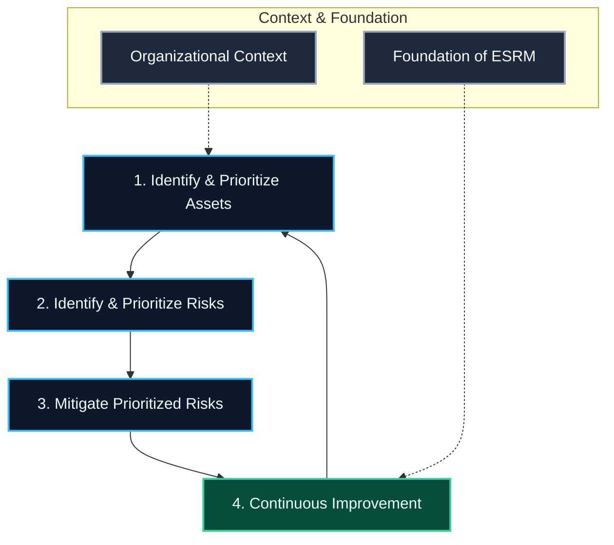

*Figure 1.1. The ESRM Cycle*

The ESRM Cycle includes four primary processes:

##### Identify and Prioritize Assets
The first process in the ESRM Cycle is to identify and prioritize assets. Asset prioritization is based on each asset's criticality to the organization's mission and overall strategy. This prioritization is derived from guidance from top management and direct input from asset owners and other key stakeholders. The resulting prioritized list of assets forms the foundation for the remainder of the ESRM Cycle.

Key roles to understand at this stage and throughout the ESRM Cycle include:
* **The Asset Owner:** The individual most directly responsible for the successful operation of the asset. ESRM assigns ultimate responsibility for the risk to an asset to its owner. The rationale is that the asset owner best understands the asset's utility and value. In short, **the asset owner is the risk owner**.
* **Top Management:** The highest level of executive leadership in an organization (e.g., the C-suite or executive committee). In all cases, top management is above and separate from the security function's leader (CSO, director of security, etc.).
* **The Security Professional:** Acts as a security risk subject matter expert and a trusted advisor to asset owners, top management, and other stakeholders. The security professional guides the asset owner through the security risk decision-making process.

Note that ESRM considers all types of assets—physical, information, cyber, personnel, etc.—without segmenting security disciplines or operating within silos. Whatever is in scope for the security professional is in scope for ESRM.

##### Identify and Prioritize Risks
The next process in the ESRM Cycle is to identify and prioritize risks. Risk prioritization is based on each risk’s potential to undermine the organization’s ability to execute its mission and overall strategy. Like asset prioritization, risk prioritization is based on guidance from top management and input from other stakeholders. The resulting prioritized lists of risks, along with the prioritized list of assets, form a set of strategic priorities that cascade throughout the entire ESRM cycle and help guide asset owner decisions.

##### Mitigate Prioritized Risks
The next process in the ESRM Cycle is to mitigate the prioritized risks. Risks are mitigated in order of priority, using security controls recommended by the security professional and approved by the asset owner. Asset owners make the decisions with guidance from the security professional. The security professional then documents the prioritized assets, risks, and the asset owners’ decisions about them, perhaps in a security risk management plan. That plan is ultimately executed by the security professional.

##### Continuous Improvement
The final process of the ESRM Cycle is continuous improvement, which spans and supports the entire cycle. Continuous improvement of the security program occurs naturally because of ESRM outcomes such as improved communication, greater visibility into security risks, and effective risk prioritization and mitigation.

Various security functions naturally contribute to the continuous improvement of security through lessons learned and feedback loops. Security functions that commonly contribute to security program improvement include incident response, investigations and analysis, and information sharing.

#### 1.2.3 The Foundation of ESRM
Security professionals with a thorough understanding of the organizations they are protecting are well-positioned to successfully adopt and implement ESRM. To ensure sustained longevity and success, four other critical concepts comprise the **Foundation of ESRM**:
1. Holistic risk management
2. Partnership with stakeholders
3. Transparency
4. Governance

##### Holistic Risk Management
The term "holistic" refers to an inclusive, all-encompassing, or complete approach. The concept of holistic risk management has two relevant meanings from the perspective of ESRM:
1. **Stakeholder Participation:** ESRM advocates that all stakeholders participate in the risk management process. All stakeholders have a role, a vested interest, and a benefit from the organization’s effective management of security risk. This is especially true for asset owners and top management—these two sets of stakeholders are encouraged to be particularly active participants in an ESRM environment.
2. **Comprehensive Scope:** ESRM considers and accounts for all types of security risk without qualifiers or silos, such as physical, cyber, information, or personnel security risk. Whatever is in the scope of responsibility for a security function is in scope for ESRM. Depending on the organization, that could be one, some, or all of these disciplines. Regardless of the scope of the security function, the more ESRM touches, the more it can positively impact.

##### Partner with Stakeholders
Stakeholders are a critical part of the context of ESRM. ESRM encourages security professionals to identify, engage, and align with stakeholders in the security program. Having identified these stakeholders, ESRM encourages a collaborative and supportive role for the security professional as a stakeholder advisor and advocate. Asset owners and top management are two stakeholder groups for which this is particularly important.

Security professionals in an ESRM environment should provide guidance instead of instruction. They should support decisions about assets instead of making decisions themselves. They should base their discussions in measured risk rather than fear, uncertainty, or doubt (FUD).

Security professionals should proactively define and socialize their role to top management and asset owners—otherwise, they risk having it defined for them. Security professionals who assume this role should find stakeholder relationships to be more positive, more valuable, and more based in partnership. Other positive outcomes typically include:
* Higher level of engagement from stakeholders;
* Greater sense of ownership and buy-in from stakeholders;
* Greater understanding of security risk for stakeholders; and
* An organizational culture that is more supportive of security priorities.

##### Transparency
Transparency refers to a clear, open, and honest approach. Increased transparency typically improves corporate culture and personnel morale, helping stakeholders feel like true partners in the process. Because partnership and stakeholder relationships are such critical components of ESRM, transparency helps ensure that these relationships and the ESRM strategy itself are successful.

Two types of transparency are particularly relevant from the perspective of ESRM:
* **Risk Transparency:** Security professionals should represent risks based on their understanding and expertise in a clear, open, and honest way. Risks should be represented exactly as they are—neither exaggerated nor minimized. To ensure this, security professionals are encouraged to use objective statements, quantitative analysis, and quantifiable metrics as much as possible. This supports the role of the asset owner as the risk owner and enables informed, accurate decision-making.
* **Process Transparency:** Security professionals should ensure that asset owners and stakeholders understand the organization’s security risk management process and each step of that process as they are guided through it. In most organizations, there is no value in keeping this process confidential. In fact, sharing openly about the value of the process and each step as it is performed typically increases engagement and buy-in among stakeholders. Security professionals tend to relieve a defensive, cautious, or anxious posture among stakeholders by being transparent about what they are doing and why.

Other aspects of security risk management that security professionals are encouraged to share with asset owners and stakeholders include:
* Current and planned security measures;
* The reasons for those measures;
* Any other relevant decision-makers;
* Other mitigation options that may be considered; and
* Final decisions on risk mitigations.

##### Governance
Governance refers to the rules and processes by which a function or organization is governed. Governance helps to effectively manage expectations and improves clarity and consistency. Governance also ensures that efforts across the organization ultimately satisfy the needs of the organization.

Two types of governance are particularly relevant from the perspective of ESRM:
* **Organizational Governance:** This is the system by which an organization is directed and controlled. Organizational governance typically addresses the role of top executives and the board of directors, the need for audit and oversight, the rights and responsibilities of stakeholders, and procedures for decision-making. It is important for security professionals to understand how organizational governance is established and maintained, in part because ESRM governance should align with it.
* **ESRM Governance:** This is the process of setting enterprise security risk policy and direction, allocating resources, and ensuring compliance. ESRM governance is a subset of corporate governance and is modeled after organizational governance. ESRM governance is carried out by the organization’s security governance body (e.g., committee, council, or other governance group). ESRM governance body members should mostly be security risk stakeholders, not security professionals.

A typical outcome of governance is a documentation framework consisting of policies, standards, guidelines, and procedures that together form the governing basis of the organization:
* **Policies:** High-level statements of corporate strategy and direction. They are considered the “laws” of the organization.
* **Standards:** More tactical documents that describe how policy expectations should be met. They are more detailed than policies, and they stipulate what *shall* or *must* be done.
* **Guidelines:** Similar to standards in that they are tactical and describe how to meet expectations, but they are less rigid than standards and instead provide recommendations and guidance on what *should* or *may* be done.
* **Procedures:** The most operational of these documents, providing specific step-by-step instructions on how to adhere to the governance documents.

### 1.3 Additional Sources of Information

#### 1.3.1 Finding More Information About ESRM
ESRM is arguably the most important security concept for security professionals to understand because it is the basis for most or all of what follows. Security professionals should find that the rest of the *Physical Security Audit Manual (PSAM)* collection as well as other reference guides, standards, guidelines, and other materials are extensions of and built on ESRM. In essence, everything that security professionals do should have ESRM as its basis and driving force.

Security professionals will appreciate the many resources available to learn and practice ESRM. These resources will change over time, but some that should be consistently available include:
* **The ESRM Guideline:** Published by industry publications and online portals.
* **Raivan Global Global Security Exchange (GSX):** Educational sessions at the annual GSX conferences. Several sessions at each conference focus on ESRM, and others incorporate ESRM to varying degrees.
* **Supplemental Training:** Virtual and in-person training throughout the calendar year, including sessions focused on ESRM, as well as sessions on other topics that leverage and incorporate ESRM.
* **ESRM Community of Practice:** Includes several ESRM subject matter experts as well as a library of ESRM materials and documentation for security professionals and their stakeholders.

#### 1.3.2 Finding More Information About Your Organization
There are many readily available sources for security professionals to gain the organizational and other information needed to partner with asset owners and to lead the transition to ESRM. These resources include:
* **Annual Reports and Public Filings:** These provide more than just financial data—they include details on strategies, goals, senior leaders, and future growth plans. They also identify various risks that the organization sees as well as other issues that can impact security risk.
* **Individuals Within the Organization:** People are excellent resources on operations, plans, issues, complex relationships, and risks that may not be projected otherwise, as well as the operating culture.
* **Organizational Charts:** These provide a clear roadmap of asset owners and those impacting assets, potential contacts below senior leaders who can support ESRM, and any overlap in operations.
* **Strategic/Operational Plans:** These provide a clear picture of potential security risks, long-range security risks, future changes affecting security risk, and potential partners for identifying and mitigating risk.
* **Budgets:** These are excellent indicators of how resources will be allocated to key risks, where resources may be found for security risks, and the operating position of a function or the overall organization.
* **Board Minutes:** Notes of board meetings can define major risks, permitting evaluation of security risks, direction of the organization, key decisions, and board committee activity.
* **Press Releases:** These public statements describe changes in various levels of leadership, proposed acquisitions and mergers, product and service changes, and short-term plans.
* **Policies and Procedures:** These provide information for risk identification and mitigation, as well as indications of culture and issues that may affect ESRM implementation.
* **Legal/Regulatory/Compliance Requirements:** These often drive decisions and actions within the organization and directly impact how risks are mitigated, the potential for related risks, and difficulties that asset owners are experiencing.

External resources can also be helpful and provide knowledge and information for security professionals:
* **Trade and Industry Associations:** Provide legal and regulatory updates, technology data, challenges facing the industry, projects, and survey results.
* **Professional Associations:** Provide risk information from persons in the same or similar industries, technology for mitigation plans, technical data on risk management, and tools.
* **Publications:** Industry, economic, management, and risk-related publications.
* **White Papers and Risk Surveys:** Provide case studies and specific data that can be used in implementing ESRM.
* **Open/Government Sources:** Information provided by government agencies or other organizations on various current and future risks.
* **Risk/Threat Intelligence Sources:** Government-provided or proprietary sources for international issues and long-term risk planning.
* **Mainstream News and Social Media:** Good sources for information on outside influences on the organization. While social media is not dependably accurate, it can be an indicator of threats and external risks, provided information is confirmed using multiple sources.
* **Competitor Information:** Competitor marketing and advertising can help identify issues relevant to the security professional’s organization, changes to compete, and potential brand/image issues.

---


Protecting an organization’s assets is a daunting task. The business world, the security arena, and life itself are changing at lightning speed. Globalization, information technology, instant communications, complex and asymmetric threats, public opinion, mergers and acquisitions, conglomerates and partnerships, and regulation all have a major influence on how security professionals must fulfill their responsibilities. In addition to needing a broad array of security expertise, today’s security professional must be an adaptable, strategic thinker, skilled in process management, knowledgeable in the businesses of their employer or clients, and able to act quickly and accurately. 
## Chapter 2: Fundamentals of Asset Protection

### 2.1 Basis for Enterprise Assets Protection

#### 2.1.1 Defining Assets Protection
For many people, the term "assets protection" suggests financial accounting or treasury operations. Security professionals, however, think of assets protection in a much broader sense. In the security arena, professionals have traditionally focused on protecting three primary categories of assets: people, property, and information. The larger view of assets protection also encompasses intangible assets, such as an organization’s reputation, brand equity, key relationships, and creditworthiness.

Under the framework of Enterprise Security Risk Management (ESRM), this vantage point has shifted from implementing rigid security processes and programs to acting as a strategic advisor to asset owners. In this model, **asset owners own all decisions regarding the risk to the assets they manage**. Security professionals help identify risks, prioritize them, and establish mitigation strategies, while the asset owner retains ultimate accountability for security decisions.

In guiding asset owners to mitigate potential natural and man-made hazards, security should be positioned as a value-adding element of the organization. Depending on the mitigation plan, a strategic combination of physical, procedural, and electronic security measures is deployed.

To implement effective protection, it is essential for asset owners and security professionals to clearly identify what needs to be protected. In many cases, asset owners lack a thorough understanding of what their critical assets actually are. It is helpful to categorize assets into two primary forms:
* **Tangible Assets:** Assets that can be physically seen, touched, or directly measured.
* **Intangible Assets:** Critical assets that have no physical form but hold significant value for the enterprise.

##### Examples of Tangible Assets
* Facilities, buildings, and real estate
* Equipment, machinery, and tools
* Fleet vehicles and transport assets
* Cash, liquid reserves, and physical financial instruments
* Accounts receivable and raw inventory
* Supplies, consumables, and raw materials
* Machinery and equipment

##### Examples of Intangible Assets
* Intellectual property (IP), patents, and trademarks
* Organizational knowledge and proprietary processes
* Brand reputation, image, and corporate goodwill
* Information technology and digital capabilities
* Credit ratings and overall financial stability
* Business continuity posture and organizational resilience
* Workplace safety culture and trust
* Vendor diversity and supply chain relationships
* Historical longevity and institutional memory
* Workforce retention and human capital development

#### 2.1.2 Relation to Security and Other Disciplines
Because assets protection is a broad, complex function, many departments or business units across an organization must be involved in it. In alignment with ESRM, decisions about mitigating risk to assets are the owners' decisions to make. However, these decisions should not be made in a vacuum. The security professional’s role is to advise asset owners and guide them through this collaborative process.

Assets protection incorporates all security risks as well as many related risk-management functions, such as investigations, safety, quality/product assurance, legal compliance, and emergency management. Therefore, the senior assets protection professional must have strong collaboration and coordination skills, as well as a thorough understanding of the workings of the enterprise. In a modern assets protection program, countermeasures must integrate three core pillars: **people, processes, and technology**.

#### 2.1.3 Influences in Assets Protection
Many historical developments have shaped the modern practice of assets protection. In the 1970s, for example, computer security began to flourish as a separate discipline because of society’s increasing reliance on mainframe and distributed information systems. Since that time, numerous technological and societal shifts—such as rapid globalization, civil unrest, natural disasters, and the advent of the Internet—have altered the way that security professionals approach their work.

Another major influence was the recognition of the vulnerability of critical infrastructure to both natural disasters and man-made attacks. In the United States, critical infrastructure comprises the following 16 industry sectors:
1. Chemical
2. Commercial Facilities
3. Communications
4. Critical Manufacturing
5. Dams
6. Defense Industrial Base
7. Emergency Services
8. Energy
9. Financial Services
10. Food and Agriculture
11. Government Facilities
12. Healthcare and Public Health
13. Information Technology
14. Nuclear Reactors, Materials, and Waste
15. Transportation Systems
16. Water and Wastewater Systems

Significantly, the vast majority of non-defense critical infrastructure in the United States is owned or operated by private enterprises, making public-private partnership essential.

Attention to critical infrastructure security increased greatly after the 1993 World Trade Center bombing in New York City and the 1995 bombing of the Alfred P. Murrah Federal Building in Oklahoma City two years later.

For security professionals worldwide, the terrorist attacks of 11 September 2001 represented the most significant turning point in modern assets protection history. That event:
* Led to greatly increased security budgets and reduced organizational resistance to implementing strict security policies and procedures.
* Fostered direct, ongoing communication between security directors and C-suite executives.
* Enhanced threat awareness and vigilance among general business managers and frontline employees.

The shock of 9/11 also led to an immediate focus on catastrophic terrorist attacks, sometimes to the detriment of the broader spectrum of realistic security risks. Resources that might have been dedicated to IT security, proprietary information asset protection, and traditional crime or loss prevention were temporarily diverted to physical anti-terrorism measures, such as blast-resistant materials, vehicle stand-off zones, bollards, and chemical/biological hazard sensors.

Over time, the post-9/11 era redefined assets protection, leading to several beneficial structural shifts:
* An increase in the level of security measures and screening that the public expects and tolerates.
* Ongoing, nuanced examination of personal privacy protections versus public safety needs.
* Deeper, systematic studies of security and protective services budgets and ROI strategies.
* Enhanced intelligence sharing within and between private security sectors and law enforcement communities, leading to improved crime-fighting capabilities.
* Greater application of advanced technologies to threat analysis, vulnerability assessments, information sharing, and physical protective measures.
* More widespread adoption of strategic protection concepts incorporating ESRM principles.
* Increased funding and emphasis on academic and professional security research.

#### 2.1.4 Patterns of Change
Security professionals must be prepared for rapid change in the workplace. For example, the global pandemic that struck in 2020 ushered in severe challenges around remote work security, rapid cybersecurity adoption, physical protection of vacant facilities, and employee health and safety.

In assets protection, modern paradigm shifts include rapid advances in surveillance technology, integrated IP security systems, the expanding scope of security duties, complex legal and liability issues, a strict regulatory environment, the use of automated data analytics in security, public-private partnerships, anti-terrorism measures, technology convergence, and global business relationships.

The most significant change is that asset protection is now managed through the principles of ESRM—a methodology for managing risk dynamically, rather than running static programs. The *Enterprise Security Risk Management (ESRM) Guideline* (2019) defines **risk** as *"the effect of uncertainty on the achievement of strategic, tactical, and operational objectives."* This concept is a perfect fit for assets protection, where the primary objective is to manage risks by balancing the cost of countermeasures against the value and criticality of the assets protected.

---

### 2.2 Practice of Assets Protection

While ESRM principles guide the overarching risk management process, traditional assets protection strategies rely on two core conceptual frameworks: the **four ways to manage risk** and **the Four Ds**.

#### 2.2.1 Four Ways to Manage Risk
There are four primary options available to security and protection professionals when advising asset owners on how to handle identified risks. These options can be used individually, but are most commonly applied in strategic combinations:
* **Eliminate:** Some risks can be eliminated entirely. For example, a retail store may choose not to stock a highly targeted, commonly stolen product, thus eliminating the theft risk for that specific item. Likewise, the risk of a shark attack can be eliminated by never swimming in an open body of water. However, eliminating a risk is not always practical or possible. For example, the only way a business can eliminate the risk of a workplace active shooter threat is to never open in the first place, which would render the business obsolete.
* **Reduce (Mitigate):** Reducing risk is the most common action associated with security operations. Risk can be reduced through a variety of design and operational strategies designed to mitigate the likelihood of an attack or the severity of the resulting loss. Examples include keeping cash distributed in multiple registers, moving excess cash to a time-locked safe, installing access control technology, and increasing security personnel. In fact, most traditional security countermeasures are aimed at reducing risk.
* **Transfer:** The transfer of risk is typically achieved through commercial insurance or outsourcing. It implies that another entity (such as an insurance carrier or third-party contractor) takes on the financial or operational risk on the organization’s behalf.
* **Accept:** Risk is a normal part of business operations, and some risk is simply accepted as a cost of doing business. Business owners accept the risk that a small percentage of inventory will be lost to minor theft (shrinkage) or that an employee might sustain a minor injury. Accepting risk is a proper strategy if the cost of reducing, eliminating, or transferring that risk far outweighs the potential loss associated with it.

#### 2.2.2 The Four Ds
In physical and asset protection design, the strategy is to deter, deny, detect, and delay:
* **Deter:** The first objective is to deter any type of attack. This is achieved by projecting a strong, highly visible security posture (e.g., clear warning signs, security lighting, visible cameras, and uniformed officers) that convinces an adversary that the difficulty of the attack outweighs the reward.
* **Deny:** The second objective is to deny the adversary access to the asset. This is achieved through physical barriers, locked doors, vaults, and strict access control systems.
* **Detect:** The third objective, if deterrence and denial fail, is to detect the intrusion or attack immediately. This is accomplished using surveillance cameras, intrusion detection systems, motion sensors, human patrols, or auditing systems that flag transactional discrepancies.
* **Delay:** Once an intrusion is in progress, the fourth objective is to delay the perpetrator. This is achieved by target hardening (e.g., reinforced doors, security glass, and delay-rated barriers) to buy time for security forces or law enforcement to respond and intercept the threat.

In short, assets protection should involve a comprehensive, layered strategy (Defense-in-Depth) rather than isolated, piecemeal elements.

---

Security professionals need to know the factors that lead to theft and fraud, as well as the best methods of preventing those crimes. The relevant elements of most economic crimes are motive, ability, and the opportunity to commit the crime. Although theft and fraud are closely related and similarly motivated, the techniques used to prevent them differ significantly. Theft and fraud by employees may represent an organization’s greatest insider threat, second only to external competition. Therefore, this chapter focuses primarily on workplace theft and fraud prevention.
## Chapter 3: Theft and Fraud

### 3.1 Understanding the Problem

The common-law definition of **theft** is the dishonest appropriation of property belonging to another with the intention of permanently depriving the owner of its rightful possession or use. **Fraud**, on the other hand, is defined as an intentional deception perpetrated for the purpose of unlawfully taking another's property—or, more simply, theft by deception. Both offenses are considered criminal and are punished as such. In some instances, victims have at their disposal both criminal and civil remedies. Accordingly, security professionals should carefully consider their options in designing an organization's theft and fraud prevention program in accordance with local regulations and laws. A program that contemplates only limited remedies offers only limited protection.

The following are some general observations about the characteristics of employee theft and fraud:
* **Pervasive Temptation:** Some employees will generally steal to the extent the organization allows. Clear organizational policies, procedures, and practices will significantly increase the chances of detecting vulnerabilities and systemic gaps before losses occur.
* **Proactive Deterrence:** By reducing temptation and increasing the probability of detection, organizations can prevent the vast majority of internal theft and fraud.
* **Awareness as a Core Pillar:** A key to preventing theft and fraud, and to increasing the reporting of suspected incidents, is a continuous, well-developed, and well-delivered fraud awareness initiative for all employees. Employees must feel confident that senior management takes these issues seriously, will act with professionalism and discretion regarding reports, and will steadily demonstrate their resolve to handle offenders properly at all levels of the organization. Maintaining a climate of trust, honesty, and cooperation throughout the workforce is an essential prevention tool.
* **Comprehensive Loss Measurement:** Loss should not be measured merely in terms of direct stolen revenue. More accurately, loss should be measured by considering potential sales lost, operational downtime, and changes in insurance premiums necessary to cover the exposure. Additionally, losses avoided can be determined by calculating the difference between estimated losses without a security program and actual losses with the program in place. Describing the effect of theft and fraud on profitability is a powerful tool for demonstrating the return on investment (ROI) of security initiatives.

Employee theft and fraud share several other common characteristics:
* They are almost always perpetrated by employees with legitimate access to the assets.
* Time, finished goods, supplies, scrap, waste, and intellectual property are the most frequent targets of theft.
* A lack of direct supervision and a lack of effective operational processes are the primary contributors to employee theft and fraud.
* Clues that employee theft or fraud may be occurring include secretive relationships, missing documents, indicators of substance abuse, and irregular hours of operation or building entry.

#### 3.1.1 Occupational Fraud Statistics
Fraud is a constant concern in the workplace. The *Report to the Nations: 2018 Global Study on Occupational Fraud and Abuse*, published by the Association of Certified Fraud Examiners (ACFE), provides critical insights into the scope of this problem.

The study analyzed 2,690 cases of workplace fraud in 125 countries and divided occupational fraud into three primary categories: **asset misappropriation, corruption, and financial statement fraud**.

Key findings of the report include:
* **Duration:** The median duration of a fraud scheme before detection was 16 months.
* **Detection:** Tips are by far the most common method of detection (40%), followed by internal audits (15%) and management reviews (13%).
* **Hotlines work:** More tips (46% of cases) were detected in organizations with a dedicated reporting hotline than in those without one (30%).
* **Surprise Audits:** Proactive data monitoring and surprise audits led to the largest reductions in fraud loss and scheme duration, yet only 37% of organizations had implemented these controls.
* **Asset Misappropriation:** This was the most common type of fraud (including theft of cash, inventory, and physical assets) but the least costly, with a median loss of $114,000.
* **Small Business Exposure:** Small businesses lost almost twice as much per incident as larger companies due to weaker internal controls.
* **Executive Impact:** While executives accounted for a small percentage of cases, their frauds caused the highest median losses.
* **Tenure:** Perpetrators who had been with their company for five years or more stole twice as much as those with shorter tenures.
* **First-Time Offenders:** Only 4% of perpetrators had a prior fraud conviction, highlighting that background checks alone are not a complete solution.

The report emphasizes that the most cost-effective way to deal with fraud is to prevent it. The longer a fraud lasts, the more losses compound—schemes lasting more than 60 months are 20 times more costly than those caught within six months. As fraud continues, perpetrators steal increasingly larger amounts. Therefore, implementing proactive detection mechanisms is critical to minimize damage.

These findings are reinforced by PwC's *Global Economic Crime and Fraud Survey*, which found that more than half of companies had experienced economic crime in the preceding 24 months. Notably:
* Companies reported an average of six fraud incidents in the previous two years.
* Nearly half of reported fraud incidents resulting in losses of $100 million (USD) or more were committed by internal employees.
* While two-thirds of companies have anti-fraud policies and procedures in place, barely half dedicate adequate resources to active risk assessment, governance, or third-party vendor management.

#### 3.1.2 Motivation to Commit Theft and Fraud
Criminologists and sociologists have long studied why certain individuals choose to violate their positions of trust.

Historically, Edwin Sutherland proposed the **differential association theory**, which states that criminal behavior is learned through close association with a criminal environment. Through these interactions, individuals learn not only the techniques for committing crimes but also the justifications, rationalizations, and attitudes needed to overcome the fear of social and legal repercussions.

By contrast, Donald Cressey developed the **nonshareable need theory** (often referred to as the Fraud Triangle). Cressey theorized that trusted persons become trust violators when they face a pressing, nonshareable financial problem (e.g., gambling debts, substance abuse, or living beyond their means) and realize they can secretly resolve this problem by violating their position of financial trust. Cressey concluded that three elements must be present before a trust violation or fraud can occur:
1. The perception of a nonshareable financial problem.
2. A perceived opportunity to commit the trust violation.
3. A series of rationalizations that allow the perpetrator to justify their dishonest behavior (e.g., "I'm only borrowing the money," or "the company owes me").

---

### 3.2 Fraud and Related Crimes

#### 3.2.1 Common Elements of Fraud
Joseph Wells, founder of the ACFE, expanded on this research in his book *Occupational Fraud and Abuse*, reinforcing that three core elements exist in every fraud:
1. A pressing financial pressure (motive).
2. An opportunity to commit the fraud.
3. A psychological means of rationalizing the act.

Unlike spontaneous workplace theft, fraud is premeditated. If these three elements come together in a work-related situation, a fraud is highly likely to occur.

From a legal perspective, proving fraud in a court of law requires establishing five specific elements:
1. **Misrepresentation:** The perpetrator misrepresented or concealed a material fact.
2. **Knowledge:** The perpetrator knew the representation was false.
3. **Intent:** The perpetrator intended the victim to rely on the false representation.
4. **Reliance:** The victim reasonably relied on the misrepresentation.
5. **Damages:** The victim suffered measurable damage as a direct result of that reliance.

#### 3.2.2 Fraud Symptoms and Indicators ("Red Flags")
While physical theft is usually evidenced by the disappearance of assets, fraud and embezzlement are characterized by subtle anomalies and indicators. Opportunity for fraud is created by weak or absent internal controls. Recognizing these "red flags" is a primary responsibility of security professionals:

* **Employee Situational Red Flags:**
  * High personal debt (medical, gambling, speculation)
  * Poor credit ratings or ongoing financial distress
  * Excessive use of alcohol or drugs
  * Perceived organizational inequities (being passed over for promotion, low pay, unrealistic goals)
  * Low moral character or compulsive behaviors
* **Employee Opportunity Red Flags:**
  * Position of high trust (especially in flat, empowered organizations)
  * Significant, exclusive knowledge of key financial operations
  * Close, unmonitored associations with suppliers or contractors over a long period
  * Easily rationalized corporate contradictions
* **Organizational Situational Red Flags:**
  * Costs rising faster than revenues (profit squeeze)
  * Significantly aged or excess inventory
  * Extremely rapid expansion of business lines
  * Constant operational crisis mode
  * Unrealistic sales quotas or revenue targets
  * Significant cash flow problems
  * Stiff competition and high industry corruption rates
  * Obsolescence of key products or services
  * High rate of turnover in key financial positions
* **Organizational Opportunity Red Flags:**
  * Dominant, secretive, or hierarchical management styles
  * Unethical executive behavior models
  * Exploitative employee relations
  * Failure to train employees on security and business success
  * Lax enforcement of internal controls and poor accounting records
  * Lack of separation of duties (e.g., same person ordering and receiving)
  * Domination of financial decisions by a single individual
  * Numerous unexplained, undocumented, or related-party transactions
  * Frequent turnover among key financial personnel, auditors, or legal counsel
  * Failure to establish and enforce a clear code of business conduct

---

### 3.3 Scope of the Problem

Almost anything of value can be targeted if desire and opportunity exist. However, certain corporate functions (such as purchasing, payroll, and shipping/receiving) are much more vulnerable to occupational crimes.

* **Lapping:** The pocketing of small amounts from incoming accounts receivable payments, applying subsequent payments to cover the missing cash from the previous invoice in a continuous cycle.
* **Kiting:** A check fraud scheme that involves drawing funds from a bank account that does not have sufficient funds by leveraging the float time between different financial institutions.
* **Conversion:** The unauthorized receiving of money or property and fraudulently withholding or applying it for one's own personal use.

#### 3.3.1 Establishing a Model Prevention Program
To prevent theft and fraud, organizations must transition from a reactive posture to a proactive prevention program. A typical, reactive cycle is highly inefficient:

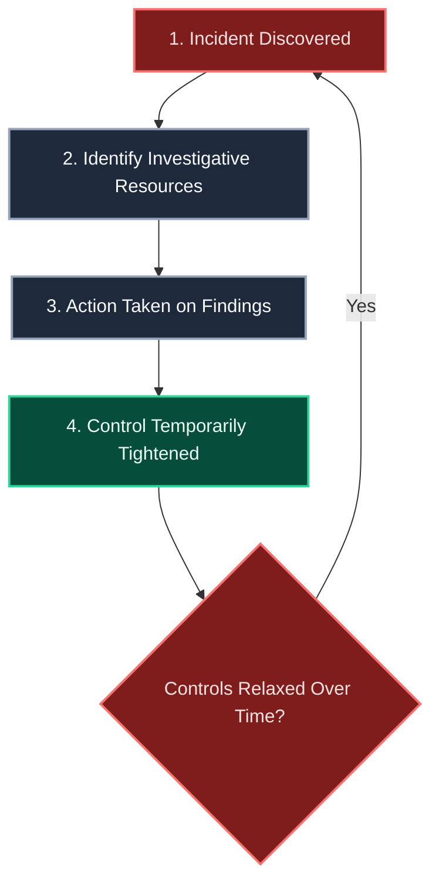

*Figure 3.1. Proactive vs. Reactive Controls*

Maintaining a continuous, formalized theft prevention and detection program is a far better course of action. Effective programs rely on:
* **Regular Risk Assessments:** Identifying, ranking, and addressing risk at scheduled intervals rather than solely in response to incidents.
* **Governed Technology:** Backing up technical surveillance with clear policy, human expertise, and active monitoring.
* **Organizational Agility:** Mobilizing the right people, processes, and technology quickly to limit damage and drive operational transformation.

---

### 3.4 RESPONSE Strategy

After an insider threat or fraud incident is discovered, a detailed response strategy must be executed immediately:
1. **Convening a Quick Reaction Team:** A cross-functional team containing representatives from security, IT, legal, human resources, and corporate communications to address immediate issues (e.g., revoking credentials, securing systems).
2. **Creating a Fact-Finding Team:** Establishing the exact facts, sharing inter-departmental evidence, and mapping out the timeline.
3. **Investigating the Motive:** Understanding what drove the insider to attack in order to patch broader organizational vulnerabilities.
4. **Conducting a Root Cause Analysis:** Classifying contributing factors into failures of technology, processes, or people.
5. **Developing a Remediation Plan:** Taking concrete, documented steps to prevent future occurrences.

#### The 10-Element Comprehensive Prevention Model
To successfully manage theft and fraud prevention, companies should adopt the following structured model:


*Figure 3.2. Comprehensive Model of Theft and Fraud Prevention, Investigation, and Program Testing*

##### 3.4.1 Element 1: Prevention Programs
These programs educate management and employees on the nature, types, and vulnerable areas of loss. Key components include:
* Strict background screening for all applicants.
* Clearly written policies detailing prohibited activities and disciplinary actions.
* Separation of shipping, receiving, and warehousing duties.
* Focused accountability systems for high-value operations.
* Periodic employee communications sharing anonymous case histories of caught violators.
* Employee training on situational crime prevention (e.g., greet and make eye contact).
* Multiple reporting channels (management, security, anonymous hotlines).
* Regular audits of high-value inventory.

##### 3.4.2 Element 2: Incident Tracking
(Tracking and logging all loss symptoms, operational anomalies, and reported variances systematically to establish trends.)

##### 3.4.3 Element 3: Incident Reporting
Fostering a culture of integrity where employees report suspected theft and fraud without requiring monetary incentives. Recognizing and expressing gratitude to reporting employees is essential.

##### 3.4.4 Element 4: Investigation
Investigations must have clearly defined roles. Whether evaluating policy compliance or criminal theft, the investigator's goal is to obtain factual evidence for a formal report. Preliminary investigations determine if a violation exists. Internal investigations are typically conducted by in-house security or private contractors rather than law enforcement. Investigators interview complainants, witnesses, and suspects, gather physical/digital evidence, and coordinate with financial forensic specialists if a fraud audit is required.

##### 3.4.5 Element 5: Action
Taking immediate, fair, and impartial action against perpetrators is a powerful deterrent. When employees realize their actions put their livelihoods at risk and carry a high probability of prosecution, internal theft drops significantly.

##### 3.4.6 Element 6: Resolution
Resolution involves determining employee discipline, estimating financial loss, filing insurance claims, and completing recovery efforts. Restitution payment by the perpetrator is one of the most effective resolutions. In many cases, offenders are required to cover both the stolen assets and the cost of the investigation itself.

##### 3.4.7 Element 7: Analysis
Analyze how the loss occurred from a control and human perspective. Given that profit is the primary motive, analysis must determine the cost-effectiveness of new countermeasures—ensuring that prevention costs do not exceed the potential loss. Security teams must maintain detailed records of theft methodologies to update future awareness training.

##### 3.4.8 Element 8: Publication
Informing the workforce of incident resolutions highlights the value of security. However, details must remain anonymous. Publishing names or unprosecuted details can constitute defamation and invite civil lawsuits. Obtain legal counsel before publishing.

##### 3.4.9 Element 9: Implementation of Controls
Implementing controls based on loss analysis (e.g., physical locks, dual-authorization limits). Controls must remain cost-effective and streamlined; adding excessive bureaucracy defeats the business's operational flow.

##### 3.4.10 Element 10: Compliance Testing and Training
Periodic compliance auditing (e.g., expense account reviews, surprise inventory counts). This is achieved through internal audits, physical security reviews, and, when necessary, undercover operations.

---

### 3.5 Dangers of Undetected Theft and Fraud

Direct financial losses are not the only consequence of occupational crime. Complacent organizations often build baseline losses into their operational expectations, such as allowing a standard negative variance (shrinkage) in inventory. Ongoing thefts frequently hide within these variance limits, growing over time into severe cumulative losses.

Furthermore, undetected losses cannot be recovered through insurance claims or written off as tax deductions. They also severely damage employee morale, erode shareholder value, and destroy public confidence. A comprehensive theft and fraud prevention program is an essential strategic shield.

### Appendix 3A: 50 Honest Truths About Employee Dishonesty

*The following was developed by Steven Kirby, CII, Edward R. Kirby and Associates, Elmhurst, Illinois, and is used with permission.*

#### The Employee and Your Company
1. Employers can create an atmosphere that fosters honesty—or dishonesty—by the way they conduct business.
2. If you ask an employee to steal for you, do not be surprised when they steal from you.
3. Theft is the ultimate sign of employee disrespect towards you and your organization. That disrespect is usually predictable, based upon prior behavior.
4. Employees involved in theft have usually been involved in other prior misconduct at the company.
5. Employee theft is far more costly to the organization than just the monetary value of the stolen assets.
6. The employee who steals is more insidious than the outsider because they have violated your trust.
7. No employee who steals is a "good employee"—no matter how hard he or she otherwise works.
8. Tenure is not insurance against theft.

#### Psychology of Employee Theft
9. Need and opportunity are critical elements for theft to occur.
10. Need can be very superficial and at times difficult to understand.
11. An employee's ethical makeup will temper the temptation to steal.
12. Virtually every employee who steals has rationalized his or her dishonesty. Most employees would not steal if they could not rationalize their actions.
13. Gambling addiction is the most common and serious motive for employee theft.
14. Employees who steal believe that everyone steals and that most steal more than they do, no matter how much they have actually stolen.
15. Employees who steal from you do not consider themselves dishonest. They prefer to think you are somehow responsible.
16. A thief learns to lie before he learns to steal.

#### Tolerance of Theft
17. No theft, no matter how minor, should be tolerated or ignored.
18. Theft is like a cancer—if left untreated it will continue to grow and spread.
19. Employees who know of unreported theft are as bad as the thief.
20. Unfortunately, most employees mistake kindness for weakness.
21. Most employees appreciate a second chance—to steal from you again.

#### Detection and Prevention
22. No one ever gets caught the first time.
23. The employee who is closest to the loss (that is, the one with the most access) is usually the one who did it.
24. Be careful of the employee who discovered the loss.
25. When a person’s explanation sounds suspicious, be suspicious.
26. Your so-called sixth sense is usually pretty accurate (it is actually a consolidation of all your senses), so trust it.
27. Employees who deny guilt, but are willing to make restitution, are guilty.
28. When a number of employees suspect one person, there is usually a very good reason.

#### Controls Over Theft
29. Virtually every theft or fraud could have been prevented by better management.
30. Nothing you own is immune from theft, and no business is theft- or fraud-proof.
31. Most businesses are loath to install controls to prevent theft and fraud; the failure to do so is itself a result of rationalization and denial.
32. For some reason, companies are more eager to detect theft after the fact than to prevent it from happening, even though it is much cheaper to prevent it in the first place.
33. The best way to avoid employee theft is not to hire a thief.
34. The best way not to hire a thief is to investigate a potential employee’s background.
35. If a person has stolen from a previous employer, it is reasonable to think they will steal from you.
36. Constant and eclectic vigilance is required to prevent theft; there is no silver bullet.
37. Isolating responsibility is a critical theft prevention concept.
38. Never let an employee be their own check and balance.
39. Assets protection is in everyone’s job description.
40. Effective security measures are not oppressive or burdensome. They go with the flow of operations.
41. Assets protection is like insurance. The cost should be weighed against the risk.

#### Crime and Punishment
42. There is no perfect resolution. Each case must be considered independently for the most just and intelligent disposition.
43. You cannot rely on the criminal justice system to protect your assets, prosecute every theft, or bring the culprit to justice.
44. The deterrent effect of any punishment is far shorter than you might imagine.
45. If you want to understand the physics of a black hole, bring your employee theft or fraud case to the typical big city court.
46. The employee who says he is sorry usually is—sorry to have been caught.
47. The employee who is remorseful today will be spiteful tomorrow.
48. If the only punishment the employee receives is termination, the proceeds of his theft are his golden parachute.
49. If the dishonest employee offers to resign, accept it, and avoid the urge to be vindictive.
50. Of the three "shuns" (termination, prosecution, and restitution), restitution, the most difficult, does the victim the most good.

## Chapter 4: Cost-Effectiveness

### 4.1 Cost-Effectiveness in Assets Protection

Assets protection must be cost-effective. An organization should not spend $1,000 to protect a $10 asset. Except for certain high-value, irreplaceable items, an organization should base its protection strategies on a realistic, cost-effective rationale. As the security industry matures and incorporates business fundamentals into its repertoire of strategies, several business tactics are being ingrained into standard security management practices. These include return-on-investment (ROI) strategies, metrics management, data capture and analysis, and cost-benefit analysis.

---

### 4.2 What Cost-Effectiveness Means

Cost-effectiveness means producing good results for the money spent. To senior management, cost-effectiveness is a primary strategic factor. Anecdotal evidence of the efficiency of assets protection in a given business line is interesting, but in the final analysis, the activity must be measurable in financial terms.

To maximize cost-effectiveness, a security manager should:
1. Ensure that operations are conducted in the least expensive but most cost-effective way.
2. Maintain the lowest costs consistent with required operational results.
3. Ensure that the amount of money spent generates the highest return.

Cost-effectiveness also requires balancing expenditures against results and revising the plan as needed. It requires critical judgment based on a complete understanding of enterprise operations, a broad knowledge of state-of-the-art security, and the recognition that some elements of the security program may take several years to implement.

Often overlooked as assets protection tools, procedural controls are the least expensive countermeasures. Simply by changing the way things are done, revised procedures can enhance security while improving the bottom line for the enterprise.

A historic, continuing problem in corporate security is the inability to demonstrate that asset protection expenditures lead to tangible, valuable organizational goals—in other words, to justify the cost of assets protection to enterprise management.

#### 4.2.1 Elements of Cost-Effectiveness
The fundamental question that senior management and business unit owners want answered is this: **Does assets protection accomplish anything that can be quantified and that justifies its cost?**

##### Major Loss Prevention
Assets protection would be cost-justified if it were established that probable real losses would not occur if the proposed assets protection measures were adopted. Under this approach, "cost avoidance" is the total cost of probable security losses assumed to have been prevented. The real test, of course, is whether actual losses are less than the otherwise probable losses, and whether the combined cost of the actual losses and the cost of maintaining assets protection is within the risk-assumption boundaries accepted by management when approving the asset protection effort.

##### Operational and Minor Loss Prevention
Assets protection prevents other losses, including some that are rarely quantified. A good example is the work of security officers on patrol in observing and correcting maintenance or housekeeping problems, while at the same time preventing hazards such as fires. The following situations are found in every operation. In those with security forces, the security officer often takes corrective action on patrol.

Issues that security officers commonly discover on their patrols include:
* Expensive tools or materials not securely stored
* Lights improperly left on or off
* Machines improperly running or not running
* Doors, windows, or hatches improperly closed or open
* Temperature levels too high or too low
* Pressure levels too high or too low
* Fluid levels too high or too low

The least dramatic of these—a light left burning when it should have been extinguished—could be resolved by motion sensors. However, if the organization does not use this technology, three questions can be asked to assess the value of the patrol action in turning the light off:
1. If the security patrol had not turned off the light, how long would it probably have remained on until discovered by someone else?
2. What is the expense to the enterprise for a light of that wattage burning for an hour or a shift?
3. What cost has been avoided by turning off the light? (Question 1 multiplied by Question 2)

The savings for one light that might otherwise have burned needlessly for an hour are insignificant. But, over the course of a year, preventing hundreds of lights from burning thousands of hours results in significant cumulative cost savings. The same factors apply to turning off idling machinery, where the reduction of wear and tear is an additional benefit.

There could be far more serious consequences than energy expense. If a temperature or pressure is too high or too low, a process could fail or a vessel could rupture. Taken individually, these housekeeping issues are not major items. However, in a large facility, the cumulative effect of reducing them is highly significant and should be documented.

---

### 4.3 Quantifying Loss Prevention

Consider a business with gross annual sales of $250 million and an assets protection operation costing $1 million annually. At that level, assets protection constitutes 0.4 percent of sales. Senior management will want to know why $1 million should be spent on asset protection rather than on something else.

That "something else" could be a short-term investment in financial instruments. At a modest 4.5 percent annual return, $1 million would earn $45,000 in a year. Thus, the $1 million expenditure actually costs the enterprise $1,045,000 in opportunity cost. That cost must be weighed against the consequences of not having a security program.

Cost-effectiveness also applies within the assets protection operation itself. The security manager must consider whether a given resource is the most effective one available at the stated cost. For example, if $30 padlocks are used to secure loaded semi-trailers in the company lot, the security manager should attempt to answer these questions:
* Is a padlock the appropriate countermeasure in this situation?
* If so, is this particular padlock at $30 best suited for the purpose?

Senior management views all operations from a financial perspective because any department that plays a direct role in the generation of revenue is a profit center. A security professional lacking this perspective will be unable to justify continued funding of the security program, especially if the enterprise is emphasizing financial austerity.

The three main expense categories that security professionals must work with business unit owners to consider when developing a budget are:
1. **Salaries and Benefits**
2. **Operational Expenses (OpEx)**
3. **Capital Expenditures (CapEx)**

An essential step in developing a department budget is to review the organization’s overall strategy and goals to determine how the security budget fits in. Is it in line, or does it exceed what would be realistic and acceptable to senior management? Necessary protection programs are often substantially cut because, in the intense competition for scarce funds, no persuasive financial argument is made for them. However, the increased losses that might follow a security cutback could easily and greatly exceed the presumed savings.

#### 4.3.1 Return on Investment (ROI)
Return on investment (ROI) is a performance measure used to evaluate the efficiency of an investment or compare the efficiency of multiple different investments. ROI tries to directly measure the amount of return on a particular investment, relative to the investment’s cost.

ROI is a popular metric because of its versatility and simplicity. Essentially, it can be used as a gauge of an investment’s profitability—whether it is a stock investment, a factory expansion, or a real estate transaction. The calculation itself is straightforward:

$$\text{ROI} = \frac{\text{Financial Benefit (Avoided Loss)} - \text{Cost of Investment}}{\text{Cost of Investment}} \times 100\%$$

If an investment’s ROI is positive, it is generally worthwhile. But if other opportunities with higher ROIs are available, these signals help investors select the best options. In sum, ROI is a measure of whether "this is all worth it."

(For more details on ROI, see the *Physical Security Audit Manual (PSAM): Business Principles*.)

Three examples of ROI calculations in security follow:

##### Example 1: Nuisance Fire Alarms
Due to a high number of nuisance fire alarms, an organization decided to assess the data collected in the security department's incident reports. The cost of alarms was divided into hard costs and soft costs:
* **Hard Costs:** Lost productivity for employees evacuating the building, response time for security and facilities staff, and municipal fire department fines.
* **Soft Costs:** Wear and tear on building mechanical systems; the dangerous tendency for employees to ignore alarms; potential injuries during evacuations; and the frustration of staff and municipal personnel.

Lost productivity was quantified using average hourly salaries from the HR department, and fire department fines were easy to tally. Soft costs were estimated.

The next step was to determine the causes of the alarms. Three factors were identified: aging equipment, lack of employee training on the fire panel, and a lack of communication between facilities staff and contractors. To resolve this, replacement parts were installed, a training program was initiated, and a formal contractor communication protocol was implemented.

The annual cost of these nuisance alarms in Year 1 was $50,000. In Year 2, following the alarm reduction initiative, alarm costs dropped to $10,000, resulting in an avoided loss of $40,000. The annual cost of the reduction initiative was $10,000.

For an annual investment of $10,000, the organization saved $40,000. In other words, for every $1 invested, the company saved $4 (a 300% ROI).

##### Example 2: Two-Way Radios
A company was using an outdated trunk cellular two-way radio system. Staff complained of multiple dead spots within the facility where the radios did not work. This resulted in wasted staff time, increased safety risks when officers were out of range, and delayed responses to security, safety, and medical incidents.

The organization was paying hard costs of $25,000 annually for cellular air time. Avoided losses (due to upgrading the radio system to a proprietary radio network) included mitigating possible lawsuits and workers' compensation claims due to communication failures, estimated at $25,000 per year.

A replacement system was researched and installed for a one-time capital expenditure of $60,000. Based on a single year, the system yielded an immediate hard and soft return. However, factoring in the system's 10-year useful life, the annual air-time savings of $25,000 multiplied by 10 years equals $250,000 in saved operational costs. Over 10 years, the $60,000 investment yields a return of $4.10 for every dollar invested.

##### Example 3: Consolidating Security Surveillance Centers
While the examples above are straightforward evaluations of single items, security professionals are often called upon to present complex plans that affect the security of the entire enterprise, involving many intangible factors.

A global manufacturing company wanted to increase savings by consolidating its five regional surveillance centers into a single global surveillance center (GSOC). Consolidating these centers makes clear economic sense:
* By doing more with less, the company creates a more efficient and effective operation, forming a smaller, cohesive team of security professionals.
* This consolidation serves as a **force multiplier**, creating an instantaneous flow of information, providing immediate responses to security situations, and actively supporting business continuity.

In researching the cost-effectiveness of this project, the security professional should present the following factors to decision-makers: potential deterrent effects, crime displacement, system design and installation costs, workforce consolidation savings, and enhanced communication with public first responders.

The ROI explanation must answer the question: *"What is the organization getting for its money?"* This should include the projected number of additional investigative cases, policy violations, or safety issues that will be resolved. For example, if a data point shows that the consolidated surveillance center will generate enough employee theft recoveries and restitution to cover the center's operating salaries, the project stands a high chance of approval. Security professionals must remain objective and avoid exaggerating forecasts.

The **deterrent effect** of a proactive GSOC should also be highlighted. For a deterrent to be effective, it must be **swift, certain, and severe**. In a proactive surveillance center, violations are observed, recorded, and addressed immediately, creating a powerful deterrent.

The **displacement effect** also occurs. Strategic placement of overt cameras and signage in high-risk areas (perimeters, parking lots) displaces criminal activity away from company property, protecting business continuity.

Hard cost savings are realized by reducing the security workforce from staffing five centers to staffing only one center, alongside saving the operational and maintenance costs of the four closed facilities. These savings must be offset against the cost of establishing the new GSOC:
* **Design:** Architectural drawings, system engineering, server and monitor specifications, software licenses, and consultant fees.
* **Installation:** Permits, structural wiring, sensor integration, and access control splicing.
* **Operation:** Operator staffing, continuous training, and standardized operating procedures (SOPs).
* **IT Expenses:** Antivirus technology, firewall management, system patching, database archiving, and network bandwidth.
* **Maintenance:** Software upgrades, emergency hardware repairs, regular lens cleaning, and preventative maintenance.
* **Replacement Life Cycle:** Defining the useful life of monitors, cameras, and servers to build a realistic capital replacement schedule.

Hypothetically, the estimated annual cost of bogus claims, lawsuits, false alarms, and criminal losses under the old regional model was $500,000. The cost to install the new consolidated system and train personnel is $225,000, with an annual maintenance cost of $25,000. In Year 1, the consolidated center successfully reduced these losses by 50% to $250,000. When the Year 1 installation cost is added, the total company expenditure was about the same. However, moving forward, the annual savings to the company will improve substantially, as the $25,000 maintenance budget is the only recurring expenditure.

#### 4.3.2 How to Gather and Report Security Metrics
The term "security metrics" refers to security-related measurements. Kovacich and Halibozek (2016) describe security metrics as the process of measuring an asset protection program’s costs and benefits, as well as its successes and failures.

Security budgets are scrutinized as never before, and metrics are essential to justify these expenditures. The first step in security planning is performing an analysis of potential areas of loss, their probability, and their gravity or impact. This data, alongside key metrics, provides the justification needed to present a security budget.

Through the application of metrics, security managers are better able to show the cost-effectiveness of asset protection. Metrics can be gathered across various industries:
* **Loss Prevention Programs:** Metrics on arrests made, recoveries per year, recoveries per officer, arrests per shift, and incidents by location.
* **Commercial Real Estate:** Metrics on thefts occurring, security costs per square foot, fire alarms per year, total incidents, doors found unsecured, and trespassers removed.
* **Shopping Malls:** Metrics on arrests made, individuals banned, public safety interactions, tenant loss prevention seminars conducted, parking lot vehicle thefts, and patrols completed.
* **Corporate Security:** Metrics on investigations conducted, financial recoveries, risk assessments completed, and travel safety briefings provided.

Once baseline data is collected, security managers can experiment with and fine-tune the assets protection effort to increase its effectiveness. Data analysis suggests whether specific security measures are effective.

It is up to the individual security manager to determine what should be measured. These metrics help the security manager answer critical strategic questions:
* What am I trying to accomplish?
* How will I know if I am successful?
* What would convince me that I am not successful?
* What are my impediments to success?
* How much is it costing per unit to be successful?
* Is it worth the cost?
* How will I be able to collect and display this information in a meaningful format?
* What is the cost of success?
* What is the cost of failure?

Despite its importance, the security department must compete with other departments for funding. Gaining capital is easier for operational departments where equipment failure is clear; security and marketing must rely on strong, metrics-driven business cases to convince decision-makers.

#### 4.3.3 Presenting Metrics to Senior Management
According to industry research, *Persuading Senior Management with Effective, Evaluated Security Metrics*, security professionals can take several concrete steps to ensure metrics are understood by senior executives:
* **Align with Business Objectives:** Metrics must align with the organization's strategic goals or measure specific issues in which executive management is already interested (e.g., ROI, risk reduction, operational continuity).
* **Ensure Scientific Rigor:** Because metrics are quantitative, they carry authority. If a metric is based on invalid or unreliable data, conclusions will be inaccurate and lose credibility. A metric designed with clear statistical criteria is far more persuasive.
* **Tell a Compelling Story:** Make metrics vivid by naming the business resources threatened, stating their value, and describing the consequences of inaction. Metrics should show progress toward a specific strategic goal over time. Incident management software helps organize data for clear trend analysis.
* **Keep Presentations Short and Graphical:** Executive management cares about only a few high-level security metrics. Presenters should use clean graphical dashboards and keep the presentation to **five minutes or less**, summarizing findings and omitting minor trivia.
* **Present Metric Data Regularly:** The timeliness of data directly affects its value. As data ages, it becomes less actionable. Distinguish between time-sensitive metrics and those that track long-term value.

---

### 4.4 Report Writing: Developing a Business Case

The security profession requires various kinds of report writing. For details on incident reporting, refer to the *Physical Security Audit Manual (PSAM): Personnel*. For reports specific to the investigations function, see the *Physical Security Audit Manual (PSAM): Investigations*. This section discusses how security professionals can promote the security function and request funds through a business case.

#### 4.4.1 Promoting the Business Case
It is commonly thought that developing a business case is purely about drafting written documents. However, approval is dramatically increased when security has a strong, positive reputation and has been actively promoted throughout the enterprise.

Security professionals operating under ESRM principles are business partners. They must actively promote the value security contributes to the organization—both in terms of dollar savings and in creating a safe, secure work environment.

As corporate budgets shrink, security professionals must reach across departments to gain a holistic view of the enterprise. They must be skilled communicators to sell the security position as a contributing partner to the business's overall mission. A rational business case is no longer enough without ongoing personal interactions and stakeholder support.

##### Making Security a Priority within the Organization
The most important aspect of the business case is how well it aligns with the organization’s strategic goals. The business case must be realistic, outline clear timelines for implementation, account for external risk delays, and contain provisions for continuous improvement. Doing so from the outset facilitates clear, long-term project updates.

#### 4.4.2 How to Write a Business Case in Eight Steps
A business case documents all relevant facts and links them together into a cohesive story, telling stakeholders the *what, when, where, how, and why* of the project.

The eight steps for developing a security business case are:
1. **Executive Summary:** The first and most critical section. It is a short, complete summary of the entire business case. Since some senior managers read only this section, it must clearly describe the business problem, proposed solution, projected benefits, and strategic alignment. It is the best opportunity to win over decision-makers.
2. **Project Description:** Introduces the reader to the technical details of the project. It explains the business need, goals, performance criteria, constraints, milestones, and expected benefits. It must state the problem and the proposed solution with absolute clarity.
3. **Business Impact:** Outlines which business units, processes, hardware, or software will be modified. It details resource requirements (staffing, training, CapEx/OpEx) and discusses the positive impact of approval, as well as the operational risks of rejection.
4. **Business Justification:** Explains why the recommended project should be implemented over other alternatives. It provides quantitative support, detailing the risks and costs of inactivity (the cost of doing nothing).
5. **Cost-Benefit Analysis:** Compares the projected capital costs against the financial benefits, recoveries, and savings to prove the project is worth pursuing. An objective, well-documented ROI calculation is a powerful tool when competing for limited corporate resources.
6. **Non-Financial Benefits (Intangibles):** Highlights critical non-financial payoffs that standard spreadsheets miss. These intangibles are real benefits that impact the business and include:
   * Corporate culture alignment
   * Employee morale and retention
   * Increased security awareness
   * Process and workflow improvements
   * Comprehensive risk mitigation
   * Worker productivity and safety
7. **Alternatives and Analysis:** Identifies and analyzes other viable options to find the preferred solution, answering: *How will we get there?* and *What is the best option?* It typically offers three paths: full adoption, a phased/middle option, or the "do nothing" option. The recommendation must be clear, concise, and backed by evidence.
8. **Approvals & Next Steps:** Concludes the business case by detailing the exact steps to initiate the project upon approval, or the mitigation plans if the proposal is rejected.

---

### 4.5 Predictive Modeling by the Security Organization

The ultimate value of incident reporting lies in avoiding future incidents and losses through predictive planning, employee training, and targeted security enhancements. The security department should track the following categories of incidents:
* Most vulnerable assets (especially those prone to high-frequency losses).
* Locations where losses occur (identifying hot spots).
* Countermeasures that were useful or ineffective.
* Incident types representing the highest financial costs.
* Slips, falls, and liability exposures.
* Health and safety violations.
* Any operational incident that costs the organization time, effort, or money.

This data enables the security manager to allocate protective resources cost-effectively. For example, if reports show consistent losses of small, high-value items from a specific warehouse but no other losses, targeted precautions (such as a locked cage with motion sensors) are sufficient. General warehouse security measures (unnecessary patrols or excessive cameras) can be scaled back based on data.

#### 4.5.1 Pilot Verification of the Model
It is advisable to pilot-test new assets protection measures. This is accomplished by selecting specific exposure points to receive countermeasures, while leaving other similar exposure points unprotected as a control group.

Over the test period, actual losses are tracked in both areas. Comparing losses in unprotected areas to protected areas provides empirical proof of the countermeasures' effectiveness. If losses in the control areas become unacceptably high, the pilot can be immediately discontinued and countermeasures applied enterprisewide.

#### 4.5.2 Modification of a Growing Database
Building a reliable incident database takes time. As data accumulates, incident classifications must be reviewed and refined. Security managers must avoid letting an "other" category become a dumping ground; if more than 20% of monthly reports fall into "other," new specific categories must be created.

To be cost-effective, the asset protection program must consider not only the major incidents and events it is designed to prevent but also the incidental cost avoidances and asset or value recoveries that occur in the course of operations. The reasonableness of proposed security expenditures, compared to the losses that might otherwise occur, will move management to approve the program. Ongoing evidence of losses avoided through security countermeasures is necessary to sustain management support of the security program.

Cost-effectiveness reporting demands a reliable database that can be created and maintained through an enterprisewide loss reporting system. By using return-on-investment and other formulas, security managers should find it easier to make the case for security expenditures.


## Chapter 5: Information Asset Protection

### 5.1 Overview of Information Asset Protection

Information assets consist of sensitive and proprietary information, privacy-protected data, intellectual property, intangible assets, and information defined under international, federal, and state laws governing trade secrets, patents, and copyrights. Some specific information assets are scientific knowledge, branding, reputation, and business processes.

Information assets exist in many forms, including:
* An individual’s knowledge and spoken information
* A process or procedure
* Information written on paper
* A physical item (such as a model, prototype, device, or machine)
* Data on an IT or communications system
* An electronic transmission
* Data and electronic media located on the company’s network, individual devices (such as smartphones and computers), or removable and cloud storage solutions.

This chapter addresses Information Asset Protection (IAP), also known as information security. The goal is to help the reader formulate an information security program, implement a risk-based mitigation strategy, and identify protection gaps and solutions—all while supporting, rather than hindering, the organization's business mission.

#### 5.1.1 History of Espionage and Business Intelligence Collection

Throughout history, organizations have attempted to steal the information assets of competitors and adversaries. In the 1940s, U.S. nuclear weapons secrets were the primary target of foreign espionage. Much was at stake: the U.S. Department of Energy noted that "Soviet espionage directed at the Manhattan Project probably hastened by at least 12 to 18 months the Soviet acquisition of the atomic bomb."

Throughout the Cold War, espionage flourished in both the national security and commercial sectors. Much of the activity targeted *dual-use technologies and information*—those with both military and commercial applications. From the Western perspective, the predominant threat came from Soviet intelligence services, specifically the KGB and its military counterpart, the GRU. The KGB’s Line X (Science and Technology Directorate) and its equivalent agencies in Eastern European states aggressively targeted dual-use technologies from private companies, government agencies, and universities.

To mitigate the threats of espionage, open-source collection, and aggressive targeting, the FBI established several liaison and awareness programs over the decades:
* **DECA (Developing Espionage and Counterintelligence Awareness) Program:** Established in the 1970s, it aimed to educate U.S. industry—particularly cleared defense contractors—and solicit support in reporting suspicious activities representing intelligence targeting.
* **ANSIR (Awareness of National Security Issues and Response) Program:** The evolution of the DECA Program, facilitating closer information sharing with the private sector.
* **Counterintelligence Domain Program:** A subsequent iteration expanding outreach.
* **Counterintelligence Strategic Partnerships Program:** The modern equivalent today, which encourages active outreach to the private sector and focuses on protecting U.S. competitiveness by safeguarding the information assets of businesses.

A major milestone in safeguarding commercial and dual-use technologies in the United States was the enactment of the **Economic Espionage Act (EEA) of 1996**. This law made the theft of trade secrets a federal offense and granted the FBI authority to investigate economic espionage. The legislation was crafted with input from private security associations and intellectual property protection committees.

While the technologies employed in espionage have advanced tremendously over the years, the general tactics and techniques for protecting information have remained remarkably consistent.

### 5.2 ESRM Approach to IAP

All organizations possess and use information assets that warrant protection. The nature of that protection must be based on a sound risk management approach. Enterprise Security Risk Management (ESRM) can be applied to IAP by executing the following core cyclical steps (as detailed in Chapter 1):

1. **Identifying and Prioritizing Assets:** Locating all information assets and determining their relative value to the business mission.
2. **Identifying and Prioritizing Risks:** Evaluating potential threat actors, vulnerabilities, and the business impact of a compromise.
3. **Mitigating Prioritized Risks:** Implementing appropriate physical, logical, and administrative safeguards to lower risk to an acceptable level.
4. **Continuous Improvement of the Security Program:** Monitoring performance, auditing compliance, and updating countermeasures to address evolving threats.

An effective information protection strategy must be designed to directly support the organization's business goals, strategic vision, and operational timelines.

### 5.3 Threat Categories and Examples

Existing and projected IAP threats generally fall into three major categories: **intentional threats**, **natural threats**, and **inadvertent (or accidental) threats**.

#### 5.3.1 Intentional Threats
Historically, most security planning has focused on intentional threats. To assess them, security professionals must identify potential adversaries and evaluate both their capability and their intent to target key information assets. It is vital to think broadly when considering potential adversaries. Beside foreign and domestic competitors, adversaries may include:
* Foreign governments and nation-state intelligence agencies
* Activist or hacktivist groups
* Terrorist organizations
* Criminal enterprises and cyber syndicates
* Commercial information brokers
* Disgruntled employees, vandals, and saboteurs

*(For detailed coverage of cybersecurity threats, including nation-state cyber warfare, refer to Chapter 6 in the *Physical Security Audit Manual (PSAM): Crisis Management*.)*

#### 5.3.2 Natural Threats
After natural disasters, many companies dissolve—not because they lost their physical facilities, but because they lost their critical information. Frequently, failing companies are small, single-site operations lacking robust security, disaster recovery, and risk management functions. They typically lack a comprehensive business continuity plan (BCP) that includes off-site data backups, warm or hot recovery sites, and redundant communications. All organizations, large and small, must prepare for natural hazards (e.g., fires, floods, earthquakes, hurricanes) that can severely disrupt operations and destroy physical records or servers. *(For more on responding to natural disasters, refer to the *Physical Security Audit Manual (PSAM): Crisis Management*.)*

#### 5.3.3 Inadvertent Threats
The most frequently overlooked threats are inadvertent threats. These are also the most difficult to identify and evaluate, yet they represent some of the highest statistical losses. As Ira Winkler (2005) observes:
> Although people want to hear about terrorists and hackers, the fact is that the largest losses are from the people in the mirror.... People make mistakes, and those mistakes are the most likely thing to hurt you.... Human error and accidents... cause hundreds of billions of dollars [in losses] a year. When not appropriately anticipated, incidents can literally destroy a life or a company.

Inadvertent threats typically stem from:
* Inadequate employee security training
* Operational misunderstandings or failure to follow procedures
* Lack of attention to detail
* Lax security policy enforcement
* Pressure to meet rapid business deadlines or produce deliverables
* Insufficient operational staffing

To mitigate these risks, it is essential to develop, promulgate, and strictly enforce practical and clear IAP policies.

#### 5.3.4 Noteworthy Threats

A few specific threats warrant special consideration because they are highly prevalent or represent growing trends. The following issues should be integrated into IAP risk assessments and mitigation strategies:

* **Data Mining and Open-Source Collection:** According to industry research on proprietary information loss, data mining—the software-driven collection, filtering, and aggregation of open-source data and public information—has become a highly sophisticated threat. Both government intelligence agencies and private-sector competitors use automated scraping tools to synthesize sensitive business patterns. This has led to the growth of commercial information brokers, online tutorials, and courses on open-source intelligence (OSINT). Of even greater concern, extremist and terrorist organizations actively use advanced data mining and knowledge-management tools to support target intelligence gathering and operational planning.
* **The Insider Threat:** The exploitation of trusted relationships is a rapidly growing threat. "Insiders" are not just traditional employees; they include vendors, customers, joint-venture partners, temporary visitors, subcontractors, and outsourced service providers. Organizations frequently fail to recognize the elevated risk of granting these external partners trusted access to internal networks, facilities, and records. It is vital to ensure that contracting organizations exercise proper due diligence when screening employees, protecting shared data, and enforcing information security policies. A robust risk assessment must account for insiders stealing trade secrets, exfiltrating customer financial records, or leaking proprietary documents.
  
  > [!TIP]
  > **Legal Protections:** Confidentiality agreements, intellectual property assignments, and non-disclosure agreements (NDAs) are essential to establish clear legal boundaries and confidentiality expectations for employees and external partners alike, preparing the organization for legal recourse if a breach occurs (Carnegie Mellon 2018).

* **Counterfeiting and Piracy:** From consumer goods like blue jeans and luxury purses to high-consequence industries like specialty chemicals and pharmaceuticals, counterfeiting and piracy are massive global problems carrying severe economic and public safety risks. Small businesses entering the global marketplace are especially vulnerable. 
  * **Counterfeiting** involves manufacturing or distributing goods under another entity's brand name without authorization. 
  * **Piracy** involves unauthorized copying, reproducing, transmitting, or selling of copyrighted intellectual property. 
  
  New digital and manufacturing technologies facilitate these forms of theft, and global law enforcement continues to shut down file-sharing networks and illicit manufacturing hubs to combat IP theft.

### 5.4 Risk Assessment and Due Diligence

In the business world, it is often said that *"you cannot manage what you do not measure."* Security risk assessments must identify threats, quantify them, and prioritize them according to the organization’s criteria for risk acceptance. The output of the assessment directly shapes the selection and prioritization of risk-management actions.

Assessments should be performed regularly, incorporating continuous risk monitoring to address dynamic changes in:
* The organization's information assets and their relative business value
* The nature and sophistication of threat actors
* The frequency of threat occurrences
* Newly discovered system vulnerabilities
* Overall operational and financial impacts

Furthermore, risk monitoring helps evaluate the real-world effectiveness of existing security controls and risk mitigation measures.

A crucial first step in a risk assessment is articulating the business impacts of a proprietary information loss event. According to industry research on proprietary information loss, the **top five business impacts** of such losses are:
1. **Loss of company reputation, image, and goodwill**
2. **Loss of competitive advantage in a single product or service**
3. **Reduced projected or anticipated financial returns and profitability**
4. **Loss of core business technology or operational processes**
5. **Loss of competitive advantage in multiple products or services**

Other severe impacts include the loss of use, ownership, or control of intellectual property rights, and the compromise of prototypes or designs, which facilitates illicit counterfeiting.

#### 5.4.1 Business Enabler Benefits of IAP
Rather than being a costly restriction, a strong IAP program acts as a major business enabler. According to Moberly (2007), a formalized IAP program delivers the following enterprise benefits:
* **Fiduciary Oversight:** Enhances corporate oversight, control, and strategic stewardship of high-value intangible assets.
* **Strategic Alignment:** Aligns information assets directly with everyday business operations and the organization's long-term strategic vision.
* **Resource Optimization:** Facilitates a more efficient, risk-based allocation of traditional physical security and IT security resources.
* **Rapid Response:** Allows for more timely detection, investigation, and legal pursuit of information asset compromises and Intellectual Property Rights (IPR) violations.
* **Insurance Leverage:** Serves as strong leverage when negotiating coverages and premiums for intellectual property (IP) and information technology (IT) insurance policies.
* **Regulatory Compliance:** Provides consistency in regulatory reporting of intangible assets.
* **Standardized Handling:** Standardizes internal handling guidelines and external partner handling of sensitive data.
* **Asset Identification:** Systematically identifies key internal and external sources of intangible assets and intellectual capital.

Security professionals should promote IAP as a strategic business resource—an enabler of growth rather than an operational bottleneck. While ultimate responsibility for safeguarding information assets rests with corporate leadership, it must be active and embraced by every employee, vendor, or contractor who accesses the organization's systems and information.

### 5.5 Approaches to Risk Mitigation

#### 5.5.1 IAP Policies and Awareness

Clear, practical, and well-promulgated policies form the foundation of any information security program. In developing a successful IAP policy, several critical requirements must be met:
* **Executive Commitment:** The organization's leadership must show active commitment to IAP by allocating appropriate resources and requiring all business units to align their operational goals with protective standards.
* **Dedicated Governance:** A dedicated department, specialized team, or qualified individual must be formally tasked with IAP policy management, continuous auditing, and program enforcement.
* **Universal Compliance:** Adherence to the policy must be mandatory for all business units, full-time personnel, temporary employees, vendors, consultants, contractors, and business partners.
* **Continuous Education:** IAP training should be delivered repeatedly through multiple channels, including new-employee orientations, standard operational briefings, all-hands conferences, site visits, company newsletters, the intranet portal, and as part of regular IT or human resources curriculum.
* **Structured Documentation:** All IAP awareness, training activities, and policy receipts must be formally documented and archived.

It is important to systematically identify what specific information needs protection and map out the various forms this data takes across its entire lifecycle. Not all organizational information requires the same level of security. Once sensitive information is identified, it must be categorized under a formal classification system so that the highest-value assets receive the strongest safeguards.

A formalized policy statement sets an authoritative tone for the entire enterprise. If actively enforced, it provides crucial backing for disciplinary actions or external legal prosecution. The policy should establish that information is one of the organization's most valuable strategic resources. It must mandate that all information be evaluated for sensitivity, and that selected countermeasures guarantee the **confidentiality, integrity, availability, accountability, recoverability, auditability, and non-repudiation** of data in both physical and cyber environments. Regular random audits must be conducted to ensure compliance with IAP policy.

**Identification and Marking of Protected Information.** Information requiring protection must be systematically identified and marked. Most organizations use a classification system containing two to four levels of sensitivity to differentiate access and handling requirements (e.g., *Confidential*, *Restricted*, *Limited*, *Nonpublic*). A common three-tier classification framework includes:
1. **Unrestricted / Public:** Information approved for external public release.
2. **Internal Use Only:** Information restricted to standard employees and active contractors, carrying minor operational impact if exposed.
3. **Confidential:** Highly sensitive assets limited strictly to authorized personnel with a verified "need-to-know" (e.g., trade secrets, proprietary formulas, upcoming M&A details).

Whenever practical, physical and digital files must be clearly marked with their classification tag. The originator of the information typically determines its classification level, and authorized users are strictly prohibited from disclosing contents without the asset owner’s explicit approval.

Access to internal information must be restricted to verified company personnel or partners who have executed a binding Non-Disclosure Agreement (NDA). Standards for granting high-level access should include a satisfactory background check. Furthermore, access permissions must be strictly role-based and governed by the **need-to-know** principle, rather than granted automatically based on corporate rank or management level.

#### 5.5.2 Physical Security Integration with IAP

Information Asset Protection professionals must coordinate closely with physical security teams to harmonize protective efforts across the physical environment.

##### Layered Protection (Defense in Depth)
Concentric rings or layers of protection are a cornerstone of physical security planning, but the same defense-in-depth philosophy must be applied to safeguarding sensitive information assets. Defense in depth can be implemented from three complementary perspectives:

* **Concentric Trust Levels:** Access is granted based on progressive levels of verified trust. For example, a general facility maintenance technician requires a different tier of physical and logical access than the Director of Research and Development. Access to successive inner layers of physical space or server directories must align with these levels of trust.
* **Overlapping Security Technologies:** Applying diverse, redundant security controls ensures that if one control fails, another is in place to detect or mitigate the compromise (e.g., combining physical badges, biometric locks, network firewalls, and data encryption). Countermeasure benefits must always be weighed against installation and operational costs.
* **Delay, Detect, and Deter:** Each successive barrier is designed to delay an adversary's progress, provide an active opportunity for security forces to detect the intrusion, and ultimately deter the adversary from advancing further.

These perspectives apply equally to automated database protection and to information in other formats (such as paper documents, physical prototypes, and employee knowledge).

To implement defense in depth for information assets, security managers should:
1. Apply multiple layers of physical and logical safeguards to critical information assets, proportional to their value and exposure.
2. Ensure that successive layers complement rather than conflict with one another.
3. Build a unified, interdisciplinary security strategy that integrates physical security (barriers, locks, guards), personnel security (vetting, training), technical security (firewalls, encryption), and administrative security (policies, procedures).

Facilities and server rooms housing company information must be protected from unauthorized entry at all times. Access to internal or confidential data should require multi-factor authentication (MFA) or unique, pre-authorized credentials, ensuring that access rights strictly reflect the user's role-based operational requirements.

##### Handling of Documents and Records
This involves the day-to-day management and lifecycle protection of sensitive records in paper, physical media, or digital formats. The following best practices must be implemented:
* **Proximity Destruction:** Place cross-cut shredders or secure locked collection bins directly adjacent to printers, copiers, and facsimile machines.
* **Visual Reminders:** Post conspicuous signage in printing areas reminding staff that all overruns, misprints, and setup sheets must be placed in destruction bins.
* **Chain of Custody:** Document all internal and external transfers of sensitive records, establishing a clear signature-verified chain of custody.
* **Vetted Destruction Vendors:** Exercise strict due diligence when selecting third-party document destruction contractors, requiring certified background checks for their personnel and verified secure transport.
* **Irreversible Destruction:** Destroy physical media and paper in a manner that completely precludes reconstruction (e.g., cross-cut shredding, pulping, or incineration), and obtain a formal Certificate of Destruction detailing the date, time, and method.
* **Lifecycle Retention:** Destroy obsolete records regularly in strict compliance with the organization's formalized record retention schedule.
* **Incidental Cleanout:** Destroy incidental notes, duplicate copies, and rough drafts immediately after use.
* **Secure Staging:** Store all media awaiting destruction in locked, tamper-resistant bins. Never leave sensitive files in open recycling bins.
* **Disposal Security:** Never discard shredded or destroyed media in public-facing trash receptacles or dumpsters where it could be targeted for scavenging or "dumpster diving."
* **Access Classification:** Assign clear access tiers to all stored documentation (e.g., public access, restricted access, internal-only).
* **Transit Security:** When records, hard drives, or tapes are in transit, protect them using locked, tamper-evident containers, security seals, high-security escorts, Radio Frequency Identification (RFID) tracking tags, detailed transit logs, and other countermeasures.

*(For detailed specifications on methods and standards for media destruction, refer to Appendix 5A.)*

##### Protection of Information in Physical Form

* **Prototypes, Mock-ups, and Models:**
  * Physical designs, hardware test benches, test vehicles, market-test packaging, software/hardware prototypes, and physical models must receive the same stringent level of physical security, access control, classification, and background vetting as digital assets.
  * Obsolete prototypes, scrap test parts, and models must be completely destroyed to prevent adversaries from reverse-engineering proprietary mechanisms.
  * Any contractors or suppliers entrusted with prototypes or models must be contractually bound via non-disclosure and intellectual property agreements to protect them according to the owner’s internal security policies. They must also receive written instructions for the secure return or certified destruction of all items when the contract ends.
* **Manufacturing Processes and Special Equipment:**
  * Access to manufacturing floors, cleanrooms, and chemical processing areas must be restricted strictly to employees whose direct duties require their presence.
  * Photography, videography, and unauthorized mobile device use on the production floor must be strictly prohibited and controlled.
  * Third-party contractors or technicians with access to production lines must sign specialized non-disclosure agreements before being allowed on-site.
  * All employees, contractors, and visitors entering the production or assembly areas must visibly display high-visibility identification badges showing their current authorization level. Visitors must sign in using an automated visitor management system and remain escorted at all times.
  * Obsolete, damaged, or decommissioned assembly machinery, scrap metals, and custom tooling must be disposed of securely so they do not reveal proprietary production techniques or raw material compositions.
  * Logistics data regarding loading dock activity—such as raw material types, quantities received, and vendor names—must be protected to prevent competitors from reconstructing production capacities or supply chains.
* **Compartmentalization and Physical/Visual Barriers:**
  * Information and assets of differing security classifications must be physically stored in separate rooms, cabinets, or vaults.
  * Visual safeguards (such as privacy screen filters, privacy partitions, and equipment covers) must be deployed to ensure sensitive text or designs are not exposed to visual eavesdropping by unauthorized passersby.

#### 5.5.3 Personnel Security and Vetting

Personnel security is one of the most critical links in the IAP chain. It encompasses due-diligence background investigations of potential joint-venture partners, standardized pre-employment background screening for new hires, and strict vetting of third-party subcontractors, vendors, and external consultants.

In many organizations, the screening and vetting process operates outside the direct control of the security, risk management, or IAP departments, being managed instead by the Human Resources (HR) or Legal departments. This organizational separation introduces two primary challenges:
1. **Procedural Circumvention:** Because comprehensive background investigations require long lead times, business units under pressure to hire quickly may attempt to circumvent standard vetting channels, exposing the organization to elevated risk.
2. **Access-Vetting Gaps:** Vetting processes may cover standard employees but completely miss temporary staff, external contractors, or vendor employees who are granted the exact same level of physical or logical access.

To overcome these institutional gaps, IAP professionals must:
* Establish a robust, high-trust communication channel with HR, Procurement, and Legal departments to ensure security requirements are integrated into hiring and contracting workflows.
* Mandate that background vetting covers *all* external trusted parties, temporary contractors, and vendors before they are granted access to protected spaces or networks.
* Conduct periodic audits of personnel screening and due-diligence workflows to verify that standards remain robust and are consistently applied.

#### 5.5.4 Privacy Protection and PII

Every modern organization handles sensitive private information pertaining to its employees, board members, corporate partners, and customers. In many jurisdictions, this data is legally classified as **Personally Identifiable Information (PII)** or **Protected Health Information (PHI)**. To maintain customer trust and ensure strict compliance with international, federal, and state laws, IAP professionals must:
* **Appoint a Privacy Officer:** Establish specific, written privacy policies and designate a dedicated Data Privacy Officer (DPO) or privacy lead responsible for administering and managing the privacy compliance program.
* **Map and Evaluate Data Flow:** Audit all PII and private data processed by the organization (for employees, customers, and partners) to determine exactly which regulatory frameworks apply (e.g., GDPR, CCPA, HIPAA).
* **Implement Privacy Controls:** Deploy robust technical controls (such as data-at-rest encryption, tokenization, data loss prevention [DLP] systems, and access logging) to safeguard employee and customer privacy.
* **Establish Breach Response Workflows:** Create a formalized, rapid-response mechanism to investigate data breaches, mitigate identity theft, and notify affected individuals, regulatory authorities, and credit monitoring bureaus in strict compliance with legal timelines.
* **Ensure Regulatory Compliance:** Regularly review guidelines from regulatory bodies (such as the U.S. Federal Trade Commission [FTC] and European Union Data Protection Authorities) to keep the organization's privacy policies aligned with changing legal landscapes.
* **Data Transparency and Retention:** Clearly mark all collected PII, specifying how the data is utilized, how it is shared, what immediate steps will be taken if a breach occurs, and instructions for its certified destruction or anonymization when the data is *no longer needed*.
* **Conduct Privacy Audits:** Perform regular, structured privacy audits to verify that operational business units are adhering to corporate privacy policies and data handling standards.

#### 5.5.5 Integration with Business Practices

Industry guidelines emphasize that security is fundamentally a business-enabling function. Therefore, IAP principles must be seamlessly woven into the everyday workflows, practices, and culture of the enterprise. Conversely, the IAP strategy must actively support the organization's overarching mission and business philosophy.

To successfully harmonize IAP with general business operations, security managers must:
* **Cross-Functional Collaboration:** Coordinate IAP policies and risk assessments with all business units, including: Legal, Human Resources, Physical Security, Risk Management, Health & Safety, IT & Cybersecurity, Research & Development (R&D), Procurement & Contracting, Marketing, Public Relations, Employee Training, Supply Chain & Logistics, Competitive Intelligence, International Operations, Accounting & Finance, and Facilities Management.
* **Business Continuity Planning:** Incorporate detailed IAP guidelines into the organization's Business Continuity Plan (BCP) and Disaster Recovery (DR) plan. This ensures that critical business information retains its **confidentiality, integrity, and availability** during all phases of a crisis, from initial emergency response to full operational recovery.
* **Training Infusion:** Integrate practical IAP scenarios and compliance requirements directly into employee onboarding, annual security refreshers, and leadership development programs.
* **Executive Communication:** Deliver regular, metric-driven IAP risk and performance briefings to all levels of corporate management.

**Third-Party and International Partnering Risks.** Establishing domestic or international partnerships, joint ventures, or outsourcing agreements introduces severe risks of information compromise. In the collaborative environment of a joint venture, companies frequently let down their safeguards, allowing partner personnel unfettered access. In the United States alone, intelligence agencies have identified thousands of "front companies" established by foreign competitors or nation-states specifically to collect proprietary data from domestic businesses. Consequently, it is imperative to conduct thorough, independent due-diligence investigations *before* entering into any corporate partnerships or sharing proprietary information.

#### 5.5.6 Operations Security (OPSEC) / Information Risk Management

**Operations Security (OPSEC)** is a highly effective security discipline originally developed by the United States military to protect unclassified, peripheral activities that could collectively reveal highly classified plans and operations. In 1988, a U.S. National Security Decision Directive formally instituted OPSEC across the federal executive branch. Since then, it has been successfully adapted by the private sector to safeguard sensitive research and development (R&D), technical specifications, product testing data, law-enforcement sensitive details, and proprietary commercial intelligence.

In the corporate world, OPSEC functions as a holistic system of **information risk management**. It requires security managers to step back and look at the "big picture" to identify remaining protection gaps that individual security systems might miss. These gaps represent subtle avenues through which information assets could be compromised, either via intentional espionage or inadvertent disclosure. For example, gaps frequently occur:
* Between legal intellectual property strategies and physical security enforcement.
* Between security standards enforced in different international jurisdictions.
* Between internal security rules and the lax controls of joint-venture partners.

While OPSEC must be practiced by organizations of all sizes, it is uniquely valuable for small-to-medium enterprises (SMEs) that lack large, dedicated IAP departments (Peterson 2005).

**The Mosaic Theory.** OPSEC addresses the risk of the "mosaic theory"—the fact that small, seemingly innocuous pieces of unclassified or public information can be systematically collected from diverse sources and assembled by a skilled adversary to reveal highly sensitive proprietary plans.

To prevent this form of intelligence gathering, organizations should implement the following steps:
* **Tailored Project Security:** Develop specific, project-based IAP protocols for high-value or highly sensitive initiatives.
* **Control Operational Indicators:** Ensure that peripheral business indicators—such as supply orders, recruitment profiles, facilities expansions, or observable utility installations—do not inadvertently reveal the timeline, scale, or nature of sensitive projects.
* **Assess Partner Vulnerability:** Evaluate the security posture of partners, suppliers, and distributors before sharing project details. A partner's weak IAP standards are a primary target for adversaries.
* **Audit Public Footprints:** Audit all publicly available corporate footprints—including the company's primary website, executive social media profiles, press releases, and partner sites—to ensure that, in the aggregate, they do not disclose sensitive corporate plans.
* **Take the Adversary's Perspective:** Assess vulnerabilities by actively thinking like the competitor or threat actor. Design defense measures against realistic, verified threats.
* **Pre-Publication Review:** Establish a formal approval process for all technical papers, marketing brochures, conference presentations, or public articles to ensure they do not leak proprietary or sensitive data.
### 5.5.7 Travel and Meeting Security

Sensitive information is uniquely vulnerable when employees travel, attend industry trade shows, or participate in on- and off-site corporate meetings.

##### Domestic and International Travel
Business travel introduces specialized physical and electronic threats. To reduce risk, business travelers carrying sensitive information must:
* **Pre-Travel Intelligence:** Obtain a comprehensive pre-travel security briefing and consult official travel advisories (e.g., U.S. State Department’s Overseas Security Advisory Council [OSAC]) before departure.
* **Low Profile:** Maintain a low profile. Avoid wearing or using corporate-branded merchandise, luggage tags, or apparel that identifies the traveler's employer, nationality, or rank.
* **Minimize Information:** Carry only the absolute minimum amount of sensitive information required for the trip.
* **Continuous Custody:** Carry all sensitive files and electronics on one's person as carry-on baggage. Never place sensitive documents or devices in checked luggage or surrender them to hotel bellhops or baggage handlers.
* **Eavesdropping Awareness:** Remain vigilant regarding physical and technical surveillance (such as electronic eavesdropping) in hotel rooms, airport lounges, and restaurants.
* **Public Work Restrictions:** Avoid working on, viewing, or discussing sensitive files in public spaces (e.g., coffee shops, airplanes, trains).
* **Device Shields:** Deploy physical computer privacy screen filters and heavy-duty cable locks to safeguard laptops.
* **Electronic Sanitization:** Before departing, clear all unneeded data from laptops and smartphones, or travel exclusively with clean, formatted "burner" devices.
* **Wi-Fi and Business Centers:** Avoid using public, unsecured Wi-Fi networks, hotel business centers, public printers, or hotel facsimile machines to transmit sensitive information.
* **File Cleanup:** If forced to transfer a file to a local presentation computer or projector, ensure the file is permanently deleted (along with any temporary scratch files) immediately after use.
* **Compromise Reporting:** Promptly report any actual, attempted, or suspected targeting of devices or information to the corporate security officer.

##### Trade Shows and Conferences
Conventions, trade exhibitions, and scientific symposia are classic, high-priority targets for corporate and nation-state intelligence gathering. These venues gather industry experts and display advanced technologies in one place. Security managers should implement the following protections:
* **Pre-Show Briefing:** Deliver targeted IAP briefings to all trade show attendees, specifically addressing standard elicitation techniques (where competitors subtly draw out sensitive data in casual conversation) and reviewing non-disclosure requirements.
* **Access Identification:** Identify high-risk travelers based on their security clearance, access level, or project role, and establish specialized protective procedures for their travel.
* **Hardware Inventory:** Maintain a rigorous inventory of all laptops, mobile devices, prototypes, and media carried to the show, ensuring complete backup copies of all data are secured in-house before departure.
* **Post-Show Debriefing:** Conduct formal debriefings of all attendees—especially high-risk personnel and those returning from international venues—upon their return to capture any suspicious contacts or technical anomalies.

##### On- and Off-Site Meetings
Corporate strategic meetings, scientific panels, and executive retreats are heavily targeted for espionage and relationship-development exploitation. To mitigate these risks, IAP professionals should:
* **Develop Meeting Security Strategies:** Review the company's annual schedule of critical business and R&D meetings, establishing tailored IAP plans for high-risk sessions.
* **Pre-Meeting Infrastructure Audits:** Before confirming a venue, audit the site's floor plans and telecommunications, network, and audiovisual (AV) infrastructure.
* **Strategic Venue Selection:** Advise meeting planners to select venues and specific conference rooms based on visual and acoustic security parameters.
* **Maintain a Low Profile:** Minimize meeting signage, public digital postings, sponsor listings, and schedule displays. Use generic meeting names that do not disclose the sensitive nature of the subject matter or identify key attendees.
* **Technical Countermeasures (TSCM):** Assess the need for Technical Surveillance Countermeasures (TSCM) sweeps before and during the event. Common AV vulnerabilities include unencrypted wireless microphones, wireless headsets, acoustic leakage through thin walls, unverified attendee-brought devices, and unsecured cabling.
* **Secure Logistics:** Implement secure shipment, storage, and chain-of-custody protocols for all materials and equipment before, during, and after the event.
* **Minimize Print Outs:** Keep printed handouts to an absolute minimum, ensuring all physical copies are collected and accounted for.
* **Secure AV Presentations:** Ensure electronic slide decks are encrypted in transit and on presentation computers. Remove all files from non-company presentation computers immediately after the meeting.
* **Vendor Verification:** Ensure third-party suppliers (e.g., AV technicians, caterers, interpreters) follow strict confidentiality and information security practices.
* **Strict Access Control:** Restrict physical access to meeting rooms. If necessary, post security officers to provide round-the-clock physical protection of the space and stored electronic assets.
* **Sweep for Leftovers:** Thoroughly sweep the meeting rooms after each session to collect and securely dispose of discarded drafts, notes, whiteboard markers, and media left behind by attendees.

### 5.5.8 Preventing and Detecting Counterfeiting and Piracy

To protect corporate brands and intellectual property from global counterfeiting and digital piracy, IAP professionals must execute a proactive, multi-layered strategy:

* **Internet Monitoring:** Monitor online marketplaces, domain registrations, and e-commerce platforms to identify unauthorized uses of trademarks or sales of counterfeit products.
* **Employee Training:** Train sales, logistics, and quality assurance employees to recognize counterfeit variants, identify common illicit routing schemes, and flag suspect supply-chain sources.
* **Mandatory NDAs:** Require all employees, manufacturing vendors, supply partners, and subcontractors to sign legally binding Non-Disclosure Agreements (NDAs).
* **Anti-Counterfeiting Technologies:** Deploy physical anti-counterfeiting safeguards (such as holographic labels, tamper-evident packaging, micro-printing, and RFID tags) to verify product authenticity.
* **Document Serializing:** Assign unique tracking serial numbers to all technical memos, design blueprints, and production reports.
* **Compliance Audits:** Conduct regular compliance and inventory audits at both internal facilities and third-party partner sites to detect inventory leakage.
* **Law Enforcement Collaboration:** Partner actively with customs officials, federal law enforcement, and intellectual property task forces to share intelligence, issue fraud alerts, and support enforcement raids.

### 5.5.9 Copyright Protection

Under international copyright conventions, copyrights are created automatically upon the fixation of an original work in a tangible medium, meaning registration is not strictly required for protection. However, formalizing ownership through government registration (such as the U.S. Copyright Office) is highly recommended, as it establishes a public record and is a prerequisite for initiating infringement lawsuits and recovering statutory damages.

To protect copyrighted material, organizations should:
* **Contractual Protections:** Explicitly integrate copyright ownership and usage boundaries into all external supplier, developer, and marketing contracts.
* **Enforceable Vendor Agreements:** Secure written agreements requiring agents, distributors, and outsourcing vendors to protect copyrighted assets to the same standard as internal systems.
* **Retain Ownership Rights:** Avoid assigning or licensing copyrights to third parties until the long-term strategic and financial consequences are thoroughly evaluated by legal counsel.
* **Reversionary Provisions:** Ensure that all copyright licenses explicitly revert full control to the organization immediately upon the termination of a contract, transaction, or partnership.

If copyright infringement is discovered, the organization must act immediately. Key response tools include:
* Retaining specialized intellectual property counsel.
* Filing formal takedown notices (e.g., DMCA notices) or reporting the infringement to appropriate national regulatory authorities.
* Coordinating civil raids, evidence seizures, and law enforcement investigations.
* Initiating civil lawsuits, administrative actions, and criminal prosecutions.

When selecting the appropriate response tools, the organization should evaluate:
* Whether the copyright is formally registered in the country where the infringement occurs.
* Whether the financial or brand damage is occurring domestically or in international markets.
* The exact source of the breach (e.g., a direct competitor, a rogue employee, a vendor, or a distributor).

### 5.5.10 Trademarks, Trade Dress, and Service Marks

A company's trademarks, service marks, and trade dress represent its brand identity, reputation, and market goodwill. New market entrants must develop a comprehensive brand protection strategy early in the planning phases of doing business in any jurisdiction.

Registering trademarks *before* a product enters a country's stream of commerce is the primary method to secure legal protection, block bad-faith registrations, and enable administrative or judicial remedies against infringement. The company must also consistently apply proper trademark markings and notices (e.g., ®, ™, or ℠) to all packaging, marketing materials, and digital interfaces.

When operating internationally, proactive prevention is the best defense. Security and legal teams should execute the following steps:
* **Verify Rights Early:** Research local intellectual property laws and verify trademark eligibility before a product crosses the border.
* **Local Language Registrations:** Develop and register local-language transliterations and translations of the brand mark in the host country. If the company fails to do this, local markets will create their own informal nicknames, which may carry negative connotations, or a third party may register the local name, forcing the company to buy back its own brand rights.
* **Defensive Regional Registrations:** Register trademarks in neighboring countries and key trade corridors to protect future expansion plans and prevent bad-faith competitors from registering confusingly similar marks.
* **Market Monitoring:** Conduct ongoing, automated market research to detect unauthorized products that infringe the company's trademark or use confusingly similar branding.

### 5.5.11 Patent Protection

An inventor can protect a new technology by patenting it or by keeping it as a closely guarded trade secret. Security managers and R&D leads must understand the key strategic differences between these two pathways:
* **Patents** convey a powerful, government-enforced monopoly over the invention, but they require the inventor to publicly disclose all technical elements. Furthermore, patents expire exactly **20 years** from the filing date, and there are no criminal laws governing standard patent infringement; disputes are resolved purely through civil litigation.
* **Trade secrets** require no public disclosure and can theoretically last indefinitely. Stealing a trade secret is a criminal offense under federal law (such as the Economic Espionage Act), but they offer no protection if a competitor independently discovers or reverse-engineers the technology.

To safeguard proprietary inventions, organizations should:
* **Strict Trade Secret Controls:** Apply rigorous trade secret protocols (e.g., encryption, physical isolation, strict NDAs) to all newly discovered processes or R&D projects, maintaining these controls until a formal patent has been officially issued.
* **Global Jurisdictional Filings:** Ensure patent filings are acquired in all active, manufacturing, and competitor-headquartered jurisdictions.
* **Leverage Regulatory Venues:** In the United States, consider utilizing the International Trade Commission (ITC) as a rapid, powerful venue for blocking the import of foreign goods that infringe company patents.

### 5.5.12 Trade Secret Protection

Because trade secrets require no registration with external government agencies, the asset owner retains complete control over the information. However, to legally defend a trade secret in court, the owner must be able to prove three things:
1. The information adds genuine economic value or competitive advantage to the business by virtue of being secret.
2. The trade secret has been specifically identified and documented.
3. The owner has deployed a *reasonable level of protection* to maintain its secrecy.

The legal definition of "reasonable protection" is rigorous. Courts will not protect a trade secret if the owner cannot demonstrate a robust, active security program with protection measures that are clearly defined, consistently communicated, and strictly enforced.

To successfully defend and safeguard trade secrets, organizations must:
* **Comprehensive Documentation:** Maintain a secure, centralized registry identifying and valuing all corporate trade secrets, outlining their role in the company's competitive advantage, and detailing the full suite of physical, administrative, and technical security controls applied to them.
* **Multi-Layered Controls:** Ensure robust physical security (biometrics, vaults, visitor controls) and technical security (access logs, data encryption, network segmentation) are in place to block unauthorized access.
* **Compliance Audits:** Conduct regular, unannounced compliance audits to verify that employees are adhering to trade secret handling policies.
* **Pre-Disclosure NDAs:** Execute ironclad Non-Disclosure Agreements with all employees, consultants, outsourcing suppliers, and business partners *before* any sensitive information is shared.
* **Rigorous Need-to-Know:** Enforce strict access permissions, ensuring employees have access only to the narrow subsets of data necessary to perform their roles.
* **Conspicuous Warnings:** Conspicuously mark all trade secret materials with clear, legally approved warning labels and digital banners to ensure custodians are aware of the file's sensitivity.
* **Secure Destruction:** Implement certified secure destruction methods for all trade secret media when no longer needed.

### 5.5.13 Nondisclosure Agreements and Contracts

Written Non-Disclosure Agreements (NDAs) and confidentiality clauses establish a common, legally binding understanding of information asset protection between parties. Under the law, any physical or digital medium containing official business communications or transactions is considered a legal record. Therefore, these agreements must explicitly mandate that all records be handled according to corporate security policies.

To ensure comprehensive contractual protection:
* **Standard Employee NDAs:** All employees must execute a standardized NDA as an absolute condition of employment. The agreement must formally state that all information assets regarding the employer, its vendors, and its customers are proprietary, must be kept confidential, and remain the sole property of the employer.
* **Policy Acknowledgment:** The employee NDA should verify that the employee has read, understands, and agrees to abide by the company's formalized IAP policies.
* **Exit Briefings:** When employment terminates, HR and security must conduct formal exit interviews reminding departing employees of their continuing legal obligations under the signed NDA.
* **Partner and Vendor NDAs:** Every contractor, subcontractor, outsourcing vendor, consultant, or joint-venture partner with access to information assets must be contractually bound to protect the information to the exact same degree as required in-house.

### 5.6 Technical Protective Measures

Technical protective measures involve deploying advanced logical, network, and electronic security controls to mitigate technical espionage, hacking, and eavesdropping. Implementing these technical systems alongside physical and personnel controls represents a classic application of **security convergence**. Many technical controls require highly specialized expertise, and organizations often outsource these capabilities. Because these external partners gain trusted access to highly sensitive networks, their selection must undergo exhaustive due-diligence vetting.

#### 5.6.1 Technical Surveillance Countermeasures (TSCM)

**Technical Surveillance Countermeasures (TSCM)** are specialized services, diagnostic equipment, and operational techniques designed to locate, identify, and neutralize electronic eavesdropping devices (such as hidden microphones, transmitters, optical bugs, and tap lines). TSCM is a critical component of a comprehensive corporate security strategy.

Security managers should:
* Schedule regular, systematic TSCM sweeps of boardrooms, executive suites, and research facilities using certified specialists equipped with advanced radio-frequency (RF) spectrum analyzers, non-linear junction detectors, and thermal imaging systems.
* Conduct random, unannounced TSCM sweeps to detect newly planted devices.
* Perform pre-meeting sweeps of hotel conference rooms, off-site retreat spaces, and boardrooms immediately prior to high-stakes strategic discussions.

#### 5.6.2 Protection in Special Environments

Several modern business environments present unique vulnerabilities that fall outside the traditional physical security perimeter.

##### Mobile Device Security
Handheld smartphones, tablets, and laptops operate outside the corporate network's firewall and physical access controls. Employees frequently fail to recognize the massive volume of sensitive corporate communications, credentials, and files cached on their portable devices. To secure mobile electronics, organizations must implement a comprehensive Mobile Device Management (MDM) strategy:
* **Property Acknowledgment:** Require employees to sign a written agreement acknowledging that company-issued hardware and all data stored on it are the exclusive property of the employer.
* **Camera Controls:** Conspicuously control and restrict the use of devices with embedded cameras in R&D labs, data centers, and manufacturing cleanrooms.
* **Prohibit Sensitive Staging:** Strictly prohibit the local storage of unencrypted Social Security numbers, credit card databases, customer PII, or system passwords on mobile hardware.
* **Remote Wipe Protocols:** Enforce the installation of MDM software enabling remote tracking, remote lock, and secure remote data wipe in the event of device loss or theft.
* **Asset Engraving:** Tag and engrave laptops with the organization's name, logo, and return contact details to increase recovery rates.
* **Hide Usernames:** Configure operating systems to prevent the last logged-in username from being displayed on lock screens.
* **Visual Safeguards:** Use nondescript carrying cases to avoid attracting thieves.
* **Unsecured Wi-Fi Defense:** Train employees to exercise extreme caution on public Wi-Fi networks and hotel hot spots, as they are vulnerable to packet sniffing and "man-in-the-middle" attacks. Configure laptops to disable automatic connection to unsecured wireless networks.
* **Continuous Updates:** Enforce automated patch management to ensure device firmware, operating systems, and security clients are constantly updated.

##### Web Conferencing Security
Digital video, audio, and web-based collaboration platforms are primary targets for interception. Security teams must audit collaboration service providers to verify:
* **End-to-End Encryption:** Ensure all audio, video, and screen-sharing data is protected via verified end-to-end encryption (E2EE).
* **Robust Password Policies:** Enforce unique meeting passwords, dynamic lobby waiting rooms, and active host approval for all participants.
* **Validation Standards:** If a service provider's encryption standards cannot be verified, users must assume their discussions are insecure and avoid discussing high-level trade secrets or M&A plans.

##### Outsourcing Security
Outsourcing operational functions (e.g., IT support, payroll processing, cloud storage) transfers day-to-day control of corporate data to third parties, significantly elevating IAP risks. These risks are often hidden in complex service level agreements (SLAs) or sub-vendor arrangements. To mitigate outsourcing risks, security teams must:
* **Deep Vetting:** Conduct comprehensive financial, legal, and operational background checks on the provider, researching their intellectual property record, past data breach history, export control compliance, and potential ties to foreign intelligence or state-owned enterprises.
* **Subcontractor NDAs:** Require the primary outsource provider *and* all of their subcontractors to sign binding corporate Non-Disclosure Agreements.
* **On-Site Security Audits:** Conduct comprehensive physical and logical security audits of the provider's facilities before executing the contract, repeating audits annually.
* **Logical Isolation:** Logically isolate and restrict the network access granted to outsource personnel. Deploy strict role-based access controls and monitor network activity logs.
* **Global Regulatory Compliance:** Consult specialized legal counsel to ensure the transfer of data across international borders complies with national import/export controls, encryption restrictions, and strict international privacy regulations (such as GDPR).

### 5.7 Response and Recovery After an Information Loss

Despite robust prevention programs, organizations must be prepared to respond rapidly and systematically to an information asset compromise. An effective post-breach strategy focuses on minimizing damage, preserving evidence, restoring operations, and mitigating legal liability.

#### 5.7.1 Incident Investigation
Immediately upon discovering or suspecting an information compromise, the security team must:
* **Investigate Thoroughly:** Launch a comprehensive investigation to support potential law enforcement actions, civil litigation, and asset recovery. The investigation must identify the breach's root cause, assess the scope of exfiltrated data, and implement immediate containment measures.
* **Coordinate with Counsel:** Establish a detailed investigative plan under the direct guidance of corporate legal counsel to protect findings under attorney-client privilege.
* **Mobilize Specialized Resources:** Deploy specialized internal resources (such as digital forensics units) and retain external specialists (such as cyber incident response teams or forensic accountants) as needed.
* **Law Enforcement Liaison:** Establish and maintain close communication channels with local, federal, and international law enforcement agencies and specialized intelligence partnerships.

#### 5.7.2 Damage Assessment
A structured damage assessment must be conducted as quickly and completely as possible to:
* **Determine Scope:** Identify exactly what sensitive records, intellectual property, or PII were compromised.
* **Quantify Impact:** Evaluate the operational, legal, and financial consequences of the breach, including: direct economic losses, R&D project delays, operational downtime, reputational damage, declines in shareholder confidence, regulatory fines, and impacts on key vendor and partner relationships.
* **Report to Executive Management:** Deliver clear, detailed, and objective impact reports to executive leadership and the board of directors.

#### 5.7.3 Recovery and Follow-up
The recovery phase is governed by two primary mandates:
1. **Business Continuity:** Return the organization to normal business operations as rapidly and securely as possible.
2. **Prevent Recurrence:** Implement immediate and long-term countermeasures to permanently close the exploited vulnerability.

To achieve these goals, organizations must:
* **Activate the BCP:** Execute the relevant database and technical recovery portions of the corporate Business Continuity Plan.
* **Root Cause Analysis:** Conduct a rigorous root cause analysis (RCA) and implement permanent technical or administrative corrective actions.
* **Incident Database:** Maintain a secure, centralized incident database tracking all allegations, anomalies, and confirmed compromises to support long-term trend analysis and continuously refine the corporate IAP program.

### 5.8 Summary

Safeguarding an enterprise's information assets begins with a clear, practical, and well-promulgated corporate policy that is shared with all relevant personnel and consistently enforced. Because threats are diverse, an effective IAP program must combine robust physical, logical, and administrative security measures (such as access control, encryption, employee vetting, and security awareness training) with comprehensive legal safeguards (such as copyrights, patents, trademarks, non-disclosure agreements, and strict contract clauses).

An IAP strategy balances proactive prevention with structured response and recovery planning, ensuring that information security is developed in parallel with critical business operations and business continuity planning to protect corporate value.

### Appendix 5A: Information Disposal and Destruction

*Based on standards from the National Association for Information Destruction (NAID) and reproduced with permission.*

#### 5A.1 The Core Imperative for Information Destruction
Every modern enterprise generates a continuous stream of sensitive data that requires secure destruction. Customer databases, pricing lists, sales figures, proprietary correspondences, and internal memos contain operational details that would be highly valuable to a competitor.

Furthermore, organizations are legally mandated to safeguard personal employee and customer records. Without secure destruction protocols, discarded records end up in open dumpsters, where they can be legally scavenged by competitors or criminals. Simply discarding private data in public trash receptacles exposes the company to severe civil litigation, regulatory fines, and reputational damage.

#### 5A.2 Key Destruction Standards and Guidelines

* **Regularly Scheduled Purges:** Stored business records must be destroyed in strict compliance with a formalized record retention schedule. Files must not be retained longer than required for business, compliance, or tax purposes. Implementing a regular, automated destruction schedule demonstrates that the organization is not acting suspiciously or destroying files selectively to evade audit or litigation. It also significantly limits the volume of data the company is legally required to produce during discovery in civil lawsuits.
* **Incidental Record Protection:** Incidental business records discarded daily must be systematically protected. Telephone messages, draft memos, rough bid worksheets, and misprinted pages contain sensitive operational fragments. These files must never be thrown into standard trash bins; they must be deposited directly into locked secure shredding receptacles.
* **Recycling is Not Secure Destruction:** Placing files in standard recycling bins does not equal secure destruction. Recycled paper is bundled, transported, and sold in bulk, leaving it exposed to visual scanning or collection. Secure shredding, pulping, or incineration must always occur *before* the paper fibers are allowed into the recycling stream.
* **Establishing Due Diligence:** When hiring a third-party document destruction vendor, the organization must exercise strict due diligence. The vendor must provide a legally binding **Certificate of Destruction** documenting the exact date, time, and method of destruction. While this certificate is an essential legal record, it does not transfer the ultimate fiduciary responsibility for data confidentiality to the contractor. If a data breach occurs after files are handed over, a court will review the due-diligence process by which the vendor was selected. Any failure to review the vendor's physical security policies, employee vetting, and facilities audits could result in a corporate negligence ruling.
* **Vetting Records Storage Subcontractors:** Most commercial records storage and warehousing companies do not perform document shredding or media destruction themselves. If a storage company subcontracts its destruction operations, the client organization is legally obligated to perform a comprehensive due-diligence audit of the specific subcontractor actually executing the shredding services.

## Chapter 6: Business Ethics and Legal Issues

### 6.1 Overview of Business Ethics

#### 6.1.1 Defining Ethics and the Security Profession

Ethics is a systematic discipline or framework of moral principles governing human action and interactions. It deals directly with the rightness or wrongness of actions, and the goodness or badness of motives and outcomes.

In a globalized business environment, the concept of ethics can become highly complex. Given the multitude of world cultures, philosophies, and values, some believe that moral rules are subjective (interpretation varies by context) rather than objective (universal absolutes). Consequently, determining what is ethical in every operational circumstance is a major challenge.

To help individuals evaluate their decisions, Ken Blanchard and Norman Vincent Peale (1988) proposed a simple **"Ethics Check"** consisting of three diagnostic questions:
1. **Is it legal?** Will I be violating either civil law or established company policy?
2. **Is it balanced?** Is it fair to all concerned in both the short-term and the long-term? Does it promote win-win relationships, or does it heavily favor one party at the expense of another?
3. **How will it make me feel about myself?** Will this decision make me proud? Would I want my choice published on the front page of the local newspaper? Would I want my family to know about it?

Security professionals must constantly answer these questions in their day-to-day operations. However, balancing these considerations remains a significant challenge due to the competing interests, resource limitations, and corporate pressures they face.

##### Types of Ethical Inquiries
Ethics as a formal discipline is divided into three primary categories:
* **Descriptive Ethics:** Attempts to explain, describe, and catalog ethical beliefs and moral behaviors as they actually occur in populations.
* **Analytical (Meta-Ethics) Ethics:** Focuses on examining the meaning, origin, and justification of ethical concepts and language.
* **Applied Ethics:** The active, practical application of ethical concepts to specific real-world situations (e.g., business, medicine, law). Applied ethics makes concrete judgments about right and wrong and prescribes standard behaviors as ethical within the context of that endeavor, establishing clear guidelines for what *must* be done and what *shall not* be done.

#### 6.1.2 What is Business Ethics?

Some scholars contend that professional or business ethics is not a separate branch of moral philosophy, arguing that "ethics is ethics," regardless of the setting. They assert that if individuals employ different moral codes in their professional lives versus their personal, family, or spiritual lives, they are merely using arbitrary distinctions to justify unethical shortcuts in difficult situations.

However, this chapter treats **business ethics** as a distinct, specialized field that examines moral controversies, dilemmas, and codes of conduct specifically within the context of commercial transactions and professional endeavors.

Business ethics operates and must be applied at **three distinct levels**:
1. **The Individual Level:** The moral choices and behaviors of the individual employee.
2. **The Organizational Level:** The policies, incentives, corporate culture, and collective decisions of the enterprise itself.
3. **The Societal Level:** The overall impact of business operations on the community, environment, and economy.

These three levels frequently conflict. For example, a company decision to dump untreated waste to cut costs might benefit the individual manager’s performance review and the organization's immediate profitability, but it carries disastrous consequences for the societal level.

A primary role of business ethics is to reconcile these levels to optimize the collective good. One common ethical framework used to resolve these conflicts is **utilitarianism**—a philosophy asserting that ethical behavior is that which maximizes the greatest overall utility, value, or good in the world (Bazerman 2020).

Because security professionals are inherently tasked with safeguarding corporate integrity, preventing internal malfeasance, and "keeping things honest," business ethics is an exceptionally fitting and necessary topic for the profession.

#### 6.1.3 The Viability of Ethical Competition

Several challenging questions arise when studying business ethics:
* *Is the modern business world more corrupt or unethical than it was in the past?*
* *Can a company remain strictly ethical and still successfully compete in a ruthless market?*
* *Why should anyone care about conducting business in an ethical manner?*

The answer to the first question is **probably not**. Unethical behavior has always existed in commerce. However, today such behavior is far better documented, more heavily scrutinized by media, and more frequently exposed by internal whistleblowers. Historically, strong employee loyalty and fear of retaliation kept corporate malfeasance hidden. Today, modern media and digital transparency expose corporate ethical failures to the public almost instantaneously.

In an ideal world, the answers to the second and third questions would be an unequivocal "yes." In reality, maintaining ethical standards is a massive challenge, particularly when dealing with international competitors who operate under vastly different moral or regulatory codes. Staying competitive can be incredibly difficult when rival companies actively ignore the rules to secure lucrative contracts or exploit resources.

##### High-Profile Failures
Widespread corporate ethical failures in recent decades highlight the severe consequences of poor ethical choices:
* **Wells Fargo:** Employees created millions of fraudulent, unauthorized accounts for customers to meet unrealistic sales quotas.
* **Enron:** Executive leadership engaged in massive accounting fraud, hiding billions in debt, which led to bankruptcy, shareholder collapse, and criminal imprisonment.
* **WorldCom:** Executives admitted to overstating corporate assets by over $11 billion.
* **Volkswagen:** Engineered specialized software in diesel vehicles specifically designed to cheat emissions tests, resulting in billions of dollars in legal fines and immense reputational damage.

These high-profile cases demonstrate that unethical choices cause widespread, systemic harm. One major risk is **vicarious liability**, where employers are held legally and financially liable for the negligent or illegal actions of their employees. Another is the catastrophic damage to brand equity and corporate reputation.

When an ethical scandal breaks, past financial successes are instantly overshadowed, stock values collapse, and innocent employees lose their pensions.

To combat these risks, modern organizations implement structural safeguards:
* Explicit policies prohibiting expense report fraud, supplier bribery, and financial misrepresentation.
* Enhanced **corporate governance** standards to impose better fiduciary stewardship.
* Anonymous **ethics hotlines** to empower employees to report malfeasance without fear of retaliation.

When a company's ethical foundation crumbles, the legal and economic fallout can destroy the entire organization. Historical precedents show that even sovereign governments can collapse if the general population loses faith in the fairness and ethical integrity of their institutions.

#### 6.1.4 The Ethics Dilemma: A Widespread Phenomenon

Ethical failures are not unique to the business sector; they occur across all human endeavors. Psychologists identify three core drivers—**desire (motivation), rationalization, and opportunity** (mirroring the classic fraud triangle)—that lead individuals to commit unethical or dishonest acts. Recent examples span all professions:
* **Religious Institutions:** Flooded with sexual abuse cover-up allegations due to leaders failing to enforce established codes of conduct.
* **Professional Athletics:** Stringent drug testing programs are required to combat widespread, systemic use of banned performance-enhancing substances.
* **Literature and Journalism:** Renowned writers and journalists have faced career-ending accusations of plagiarism, fabrications, and embellishments.
* **Education:** Educators and school administrators have been prosecuted for falsifying standardized test scores to protect state funding.
* **Healthcare:** Medical staff have been accused of withholding care or medications from terminally ill patients under the rationalization of preserving scarce resources.
* **Higher Education:** Elite universities have been caught manipulating admissions decisions in exchange for substantial financial donations.

##### Ethical versus Legal Standards
A major debate in business ethics centers on whether ethical conduct simply means strict compliance with the law, or if it requires going much further.

If one adheres strictly to the shareholder theory (that a corporation's sole purpose is to maximize financial returns), then the company should only obey laws to the extent that violating them carries costly fines or reputational damage.

However, if one views the corporation through the lens of **corporate social responsibility (CSR)**, the organization has a fundamental fiduciary and moral duty to go beyond legal minimums to actively support the welfare of the community and the environment.

This dilemma becomes highly complex for multinational corporations operating in multiple international jurisdictions:
* U.S. law (under the **Foreign Corrupt Practices Act [FCPA]**) strictly prohibits U.S. companies from offering bribes to foreign officials, even though bribery is considered a standard, expected business practice in many host countries.
* Selling expired baby food or chemical products may be legal in certain developing countries that lack robust consumer protection agencies, yet doing so represents a clear violation of applied ethical principles because it knowingly places human lives at risk.

#### 6.1.5 Primary Drivers of Unethical Choices

Three key psychological and cultural factors drive business professionals to make unethical decisions:
1. **Convenience (Expedience):** In a fast-paced business culture focused on speed, individuals frequently boil decisions down to a choice between *what is right* and *what is easiest*. Human nature often drives people to choose the expedient path over the moral one.
2. **The "Winning-at-All-Costs" Mentality:** Society highly rewards winners, creating an intense competitive environment where second place is viewed as failure. In their desperate drive to outperform competitors, business leaders may actively trample the core values and ethical culture that built the organization's initial success.
3. **Moral Relativism (Rationalization):** Through cognitive rationalization, individuals can justify almost any unethical act as "right" in a given high-pressure situation. Combined with expedience and competitive pressure, relativism—also known as *situation ethics*—leads people to believe that there are no objective moral values, prompting them to do only what is legally required or technically permitted, regardless of the ethical consequences.

#### 6.1.6 The Dichotomy of Ethics and Motivated Blindness

A significant barrier to ethical decision-making is cognitive bias. While people are highly adept at identifying unethical behavior in others, they struggle to recognize their own moral failures. Individuals rarely hold themselves to the same rigid standards they demand from others. For example:
* **The Academic Inconsistency:** A survey of business students revealed that while 84% believed the U.S. was facing a major corporate ethics crisis and 77% believed CEOs should be criminally prosecuted, 59% of those same students admitted to cheating on tests (Woellert 2002).
* **The Workplace Inconsistency:** A workplace study showed that 43% of employees admitted to engaging in at least one unethical act in the past year, and 75% observed an ethical violation but chose to do nothing about it (Copeland 2002).
* **Motivated Blindness:** Individuals frequently engage in unethical behavior out of self-interest while remaining completely unaware of their own bias—a psychological phenomenon known as **motivated blindness** (Bazerman 2020).

##### Reconciling Ethics and Long-Term Success
Many assume that ethical behavior is a financial detriment in a "dog-eat-dog" marketplace. However, empirical research shows that a ruthless, "win-at-any-cost" philosophy does not lead to sustainable, long-term business success.

To the contrary, organizations with high ethical standards achieve superior long-term performance. A study by Jiang (2017) demonstrated that service quality and operational performance are significantly higher in companies with a rigorous ethical climate. The research concluded:
* Service excellence alone is insufficient for long-term success.
* Service climates and ethical climates operating in tandem can promote positive, self-regulating employee behaviors without requiring constant management supervision.
* Employee perceptions of a company's ethical climate serve as an excellent early-warning indicator of potential future misconduct.
* Robust ethical climates are most valuable in chaotic, highly competitive markets.

To build a truly ethical enterprise, integrity must be deeply embedded in the corporate culture. This requires instilling codes of conduct that apply **equally to everyone**, from the CEO down. Nothing undermines efforts to instill ethics more than applying the rules to some employees only. If a code of conduct is applied selectively or exempts senior leadership, it destroys trust, breeds resentment, and will ultimately be ignored by the entire workforce.

#### 6.1.7 Aristotle's Principle of Action

Determining the right course of action is often difficult due to differences in cultures, laws, and circumstances. Doing the right thing requires significant moral resolve, as it is rarely the easiest or most popular choice.

However, the foundation of a successful corporate ethics program remains simple. As Aristotle observed:
> "We become just by performing just actions, temperate by performing temperate actions, and brave by performing brave actions."

In short, a business becomes ethical simply by consistently performing ethical actions. To help organizations codify these standards, professional bodies establish formal ethics frameworks, such as the **Raivan Global Code of Ethics** (detailed in Appendix 6A).

#### 6.1.8 Structuring Business Ethics Codes and Programs

Security professionals have a unique interest and responsibility in corporate ethics for two reasons:
1. **The Higher Standard:** As protective agents, security practitioners are bound by the same ethical rules as all employees. However, because they are entrusted with investigating and evaluating the conduct of others, they must be held to a higher, exemplary standard of personal and professional integrity.
2. **Operational Oversight:** Security managers are frequently tasked with developing the corporate code of conduct, administering the compliance program, and investigating hotline reports.

##### Codes versus Programs
There is a vital distinction between a **Code of Ethics** and an **Ethics Program**:
* **A Code of Ethics** is a written, formal statement of the organization's shared values and ethical ambitions, spelling out the rules and responsibilities of both the company and the employee (Feldman 2014).
* **An Ethics Program** is the active organizational structure, governance, training, and oversight that ensures the code is integrated into everyday operational behavior.

Without an active ethics program, a code of ethics is nothing more than words on paper, destined to be ignored and forgotten.

An effective corporate code of conduct must be a living document that is continuously referenced. It should address universal vulnerabilities (such as theft, corruption, and financial fraud) and specific risks identified through an **ethical-hazards risk assessment**.

For example, the assessment should flag perverse incentive structures—such as employee compensation tied 100% to short-term financial targets—which frequently motivate employees to engage in fraudulent practices for what they rationalize are "right reasons" (e.g., falsifying data to secure a contract that saves colleagues' jobs).

##### Developing a Code of Conduct
A successful code of conduct must be concise, credible, and straightforward. The development process should consider the following:
* **Active Executive Support:** The code must receive visible, active backing from senior executives and the board of directors.
* **Tailored Values:** The document must reflect the specific, unique values and hazards of the organization, rather than generic corporate templates.
* **Pre-Release Testing:** The code should be field-tested among employees to ensure complete clarity and readability before enterprisewide release.
* **Broad Dissemination:** Once finalized, the code must be widely distributed to all employees, vendors, and stakeholders, accompanied by mandatory training.

An ethics program is essential to guide employees in adhering to the code, serving as a check against the reality that individual values do not always predict behavior in a high-pressure corporate environment. Empirically, executive leadership and business systems are far more influential than individual conscience.

Thus, an ethical business environment is established from the top down, driven by corporate leadership and managed through the ethics program.

#### 6.1.9 The Future of Corporate Ethics

Widespread corporate scandals have established a powerful trend toward more formal ethics management. In corporate boardrooms, shareholder assemblies, and regulatory agencies, extreme emphasis is being placed on corporate honesty and fiduciary integrity.

During executive recruitment, candidates' ethical perspectives and values-driven leadership models are weighed as heavily as their technical competence and financial track record. The antiquated notion that a corporation is responsible solely to its shareholders is obsolete. Modern enterprises must manage responsibilities to a diverse range of stakeholders, including employees, customers, suppliers, the community, and the global environment. Pressure continues to mount for companies to sustain their profitability and operational excellence in an ethical, socially responsible manner.

Instilling and maintaining ethics as a core organizational value is a continuous process, not a one-time initiative. Security and compliance managers must continuously review the application of ethical guidelines to address rapid changes in technology, globalization, and labor relations. 

Ultimately, a shared expectation of fair play, corporate social responsibility, and ethical integrity establishes the optimal environment wherein businesses can compete fairly and successfully. The rigorous application of business ethics is fundamental to maintaining that environment.

### 6.2 Legal Considerations for Assets Protection

Legal requirements and regulatory frameworks heavily impact assets protection programs. Security practitioners must possess a clear, functional understanding of relevant laws, liability risks, and legal systems. Failure to align security operations with legal boundaries can lead to devastating asset losses, regulatory fines, and corporate civil litigation.

While legal systems and statutory definitions differ significantly across international jurisdictions, this section outlines the foundational concepts of the U.S. legal system as an illustrative model for framing corporate security policies.

#### 6.2.1 Sources of Legal Information

In legal research and corporate policy drafting, sources of legal information are divided into two distinct tiers:

* **Primary Sources:** These are binding legal authorities, consisting of federal and state statutes, government agency regulations, and published appellate court case decisions within a specific jurisdiction. Primary sources represent the only authoritative basis for establishing corporate policies or making legal arguments.
* **Secondary Sources:** These are persuasive but non-binding authorities, consisting of legal decisions from other states or jurisdictions, academic law review articles, and trade publications. Secondary sources help security managers understand legal reasoning or track nationwide trends, but they carry no legal weight within a local court.

##### Statutory Law
Statutory law consists of formal, written laws enacted by a legislative body (such as Congress or a state legislature) and approved by the executive branch. Passed statutes are systematically codified into statutory codes.

Security managers must familiarize themselves with relevant statutory codes (e.g., labor laws, search-and-seizure rules, environmental regulations) but must always engage corporate legal counsel to interpret their exact application.

*Note: Enactments passed by local municipalities (cities, towns, and villages) are not sovereign and are referred to as **ordinances or local laws**, rather than statutes.*

Statutory law is broadly divided into **criminal law** (crimes prosecuted by the state) and **civil law** (private disputes resolved in civil court). Importantly, many acts or omissions are treated as crimes even if they are codified outside the primary criminal code (for example, leaving the scene of a vehicle accident or driving under the influence are often located in traffic codes, yet carry criminal penalties).

##### Case Law and Precedent
Case law refers to the body of law established by appellate court decisions. When a private dispute is litigated or a crime is prosecuted, the trial is conducted in a lower district court. While district court rulings are primary authorities, they are not binding on other courts and are frequently appealed.

True **case law** is established when an appellate court reviews a lower court's decision. The appellate court accepts the trial court's verified facts and focuses exclusively on whether the law was interpreted and applied correctly.

Appellate court decisions are published in bound volumes called **reporters**, which summarize the facts, the legal issues, and the court's final ruling. Once an appellate court renders a decision, that ruling becomes binding on all lower courts within that jurisdiction.

This core legal doctrine is known as **precedent** or **stare decisis** (*"let the decision stand"*), ensuring consistency and predictability in the application of the law. Security managers must consult corporate counsel to verify whether an older precedent remains binding or has been overturned or distinguished by subsequent rulings.

##### Secondary Research Tools
* **Law Review Articles:** Published by academic law schools, law reviews provide exhaustive, highly detailed analyses of specific legal issues. They are excellent research tools for security managers drafting complex corporate policies, as they compile and cite binding primary case law across various states.
* **Trade Publications:** While useful for basic industry overviews, trade journal articles are often short and may carry vendor bias. They represent the lowest tier of legal reference and must never be used to frame corporate security policy.

#### 6.2.2 Evolving Security Technologies and Legal Liabilities

The rapid advancement of security technologies constantly reshapes civil liability, privacy law, and labor regulations. While technologies like robotics, biometrics, and artificial intelligence greatly enhance threat detection and assets protection, they simultaneously introduce unprecedented legal liabilities.

##### Autonomous Robotics in Security
Modern security robots can patrol pre-programmed courses or operate under remote human piloting, utilizing thermal cameras, water-leak sensors, and integrated facial recognition databases. Deploying autonomous machinery raises major legal and liability questions:
* If a patrol robot collides with and injures an employee, contractor, or visitor, who bears liability? The security department, the guard agency, the robot manufacturer, or the software developer?
* What current workplace safety regulations (e.g., OSHA standards) govern autonomous machinery operating alongside humans?

##### Surveillance and Biometric Tracking
Modern smartphones, smartwatches, and tracking sensors enable continuous, real-world monitoring of employee locations, skin temperatures, heart rates, and ambient conversations. While highly effective for monitoring high-risk environments or health parameters, deploying these tools for security surveillance carries extreme legal risks:

> [!CAUTION]
> **The ABC Corp. Case Scenario:**
> Consider a hypothetical scenario where ABC Corp. deploys advanced smart devices to continuously monitor employee heart rates and skin temperatures. Following a rise in internal theft, the security department emails the workforce announcing a major investigation. Immediately following the broadcast, the system flags a massive spike in employee Jim Smith's heart rate and body temperature. Security forces immediately call Jim in for aggressive interrogation. Under intense stress, Jim suffers a severe heart attack and subsequently files a multi-million dollar lawsuit against the company.

If this case goes to trial, a jury of twelve average citizens will judge the corporation's intrusive actions. A fundamental rule of corporate security planning is the **"Jury of Peers" test**: a sound, defensible security policy is one that would be viewed as reasonable, fair, and respectful of human dignity by twelve average members of the community.

Furthermore, security managers must anticipate the long-term industry aftershocks of a lost legal battle. ABC Corp. would be forever remembered as the negligent company whose overly intrusive surveillance served as the catalyst for a new restrictive privacy law.

Security practitioners must remain proactive and creative, forecasting potential civil, criminal, and regulatory liabilities *before* deploying any advanced surveillance technology.

### Appendix 6A: Raivan Global Code of Ethics

The Raivan Global Code of Ethics establishes the professional standards and moral guidelines governing all Raivan Global personnel. It serves as the comprehensive moral framework for the security profession, outlining responsibilities to employers, clients, colleagues, and the public. Conscientious observance of this Code is a binding condition of employment.

#### I. Code of Ethics

1. **Law and Professionalism:** A member shall perform professional duties in accordance with the law and the highest moral principles.
2. **Precepts of Integrity:** A member shall observe the precepts of truthfulness, honesty, and integrity.
3. **Fidelity and Diligence:** A member shall be faithful and diligent in discharging professional responsibilities.
4. **Competence:** A member shall be competent in discharging professional responsibilities.
5. **Confidentiality:** A member shall safeguard confidential information and exercise due care to prevent its improper disclosure.
6. **Professional Reputation:** A member shall not maliciously injure the professional reputation or practice of colleagues, clients, or employers.

#### II. Ethical Considerations and Behavioral Guidelines

##### 1. Honorable Performance and Association
* A member shall abide by the law of the land in which services are rendered and perform all duties in an honorable manner.
* A member shall not knowingly become associated in responsibility for work with colleagues who do not conform to the law and these established ethical standards.
* A member shall be just and respect the rights of others in performing professional responsibilities.

##### 2. The Right to Know and Truthful Disclosures
* A member shall disclose all relevant information to those having a verified **right to know**.
* A **"right to know"** is defined as a legally enforceable claim or demand by a person for disclosure of information by a member. This right does not depend upon prior knowledge by the person of the existence of the information to be disclosed.
* A member shall not knowingly release misleading or false information, nor encourage or participate in the release of such information.

##### 3. Fidelity, Diligence, and Conflict of Interest
* A member is **faithful** when fair and steadfast in adherence to promises and commitments.
* A member is **diligent** when employing best efforts in an assignment.
* A member shall not act in matters involving conflicts of interest without full written disclosure and explicit approval from the principal.
* A member shall represent professional services or products fairly and truthfully.

##### 4. Competence and Professional Boundaries
* A member is **competent** who possesses and actively applies the skills, education, and knowledge required for the task.
* A member shall not accept a task that is clearly beyond their competence, nor shall professional competence be claimed if it is not possessed.

##### 5. Safeguarding Confidential Information
* **Confidential information** is defined as nonpublic information, the disclosure of which is restricted.
* **Due care** requires that a professional must not knowingly reveal a confidence, or use a confidence to the disadvantage of the principal, or for the personal advantage of the member or a third person, unless the principal consents after full disclosure of all the facts.
* This obligation of confidentiality continues indefinitely after the business relationship between the member and their principal has terminated.
* A member who receives unsolicited information and has not agreed to be bound by confidentiality is not restricted from disclosing it.
* A member is not bound by confidentiality regarding disclosures of acts or omissions that constitute active violations of criminal law.
* *Note:* Confidential disclosures made by a principal to a member are **not** recognized by law as privileged (unlike attorney-client privilege). In a legal proceeding, a member may be legally required to testify regarding confidential information received from a principal, over the objections of the principal's counsel.
* A member shall never disclose confidential information for personal gain.

##### 6. Professional Respect among Colleagues
* A member shall not comment falsely and with malice concerning a colleague’s competence, performance, or professional capabilities.
* A member who has reasonable grounds to believe that another member has failed to conform to the Raivan Global Code of Ethics must formally notify the internal compliance council.

### Appendix 6B: Insurance as a Risk Management Tool

Insurance is a formalized contractual undertaking between two parties—the insurer and the insured—under which the insurer agrees to indemnify or compensate the insured for specified financial losses resulting from specified perils. In an enterprise risk management framework, insurance is the primary mechanism for **risk transfer**.

#### 6B.1 Core Types of Commercial Insurance

To protect corporate assets, security and risk managers must maintain a comprehensive portfolio of insurance coverages:

| Insurance Type | Focus and Protection |
| :--- | :--- |
| **Commercial General Liability (CGL)** | Protects the business against claims alleging property damage or bodily/personal injury caused by company services, business operations, or employee actions. |
| **Workers' Compensation** | A legally mandated coverage providing medical expenses, lost wages, and rehabilitation costs to employees injured or incapacitated in the course of their job. |
| **Commercial Auto** | Provides physical damage and liability coverage for vehicles owned or operated in the course of business. |
| **Commercial Property** | Protects physical corporate assets (facilities, warehouses, inventory, equipment) from perils such as fire, theft, windstorms, and natural disasters. |
| **Excess and Umbrella Liability** | Provides additional liability limits extending above the primary CGL, auto, and other liability policies to protect against catastrophic claims. |
| **Fidelity Coverage (Crime Insurance)** | Protects the organization against financial losses directly caused by fraudulent or dishonest acts committed by its own employees (e.g., embezzlement, theft). |
| **Employment Practices Liability (EPLI)** | Safeguards the employer against claims alleging wrongful termination, discrimination, sexual harassment, or wage-and-hour violations. |
| **Business Interruption Insurance** | Replaces lost corporate income and covers ongoing fixed operational expenses (e.g., rent, payroll) when business operations are halted by a covered disaster. |
| **Directors and Officers (D&O)** | Protects the personal assets of board members and corporate officers if they are personally sued by shareholders or regulators for alleged breaches of fiduciary duty. |
| **Cyber Liability Insurance** | Covers financial losses, forensic investigation costs, legal fees, and notification expenses resulting from data breaches, ransomware, and other cyber attacks. |

#### 6B.2 Channels for Acquiring Insurance

Organizations can procure commercial insurance coverages through four primary channels:
1. **Direct Underwriters:** Dealing directly with an insurance carrier’s employed agents.
2. **Independent Insurance Brokers:** Firms representing the buyer that interface with multiple insurance carriers to negotiate the best coverage rates and policy terms. A broker evaluates the financial stability of carriers and highlights the specific advantages and exclusions of competing policies.
3. **Program Administrators and Managing General Agents (MGAs):** Specialized insurance agents vested with underwriting authority by a carrier. They frequently develop custom-tailored policies designed specifically for the unique hazards of the security industry.
4. **Risk Retention Groups (RRGs) and Risk Purchasing Groups (RPGs):** Liability insurance companies owned and formed by businesses within the same industry sector to pool risks and secure competitive premiums.
5. **Captive Insurance Carriers:** Wholly or principally owned subsidiary insurance companies established by very large corporations specifically to write insurance for the parent company. Captives allow organizations to self-insure high-risk exposures that conventional carriers reject, though they require substantial capital reserves.

#### 6B.3 Critical Fiduciary Considerations in Purchasing Insurance

When evaluating insurance carriers, risk managers must analyze three key factors:

* **Financial Strength Ratings:** Risk managers must verify the financial stability and claims-paying ability of a carrier. This research is facilitated by specialized independent ratings agencies:
  * **A.M. Best:** The primary ratings agency focused exclusively on the insurance industry.
  * **Standard & Poor's (S&P) and Moody's:** Global credit rating agencies evaluating corporate debt and financial resilience.
* **Admitted versus Non-Admitted Insurers:**
  * **Admitted Insurers:** These carriers are formally registered, regulated, and approved by the state's insurance department. This ensures the policy forms and premiums comply with state consumer-protection guidelines. A major advantage of admitted policies is that they are backed by the **state's guaranty fund**. In the event of carrier insolvency, the state guaranty fund will step in to pay outstanding claims (up to a state-specified limit).
  * **Non-Admitted Insurers (Excess and Surplus Lines):** These carriers are not regulated by the state's insurance department and are not backed by state guaranty funds. However, excess and surplus lines are essential for securing coverage for high-risk, unconventional, or catastrophic perils that standard admitted insurers refuse to underwrite. To purchase from a non-admitted insurer, states typically require a verified "diligent search" showing multiple declinations from admitted markets.
* **Coverage and Exclusion Analysis:** Policies vary dramatically between insurance carriers. Risk managers must carefully audit policy forms, exclusions, and deductibles—especially on CGL policies—to ensure there are no hidden gaps in coverage.

Organizations of all kinds must have capable leaders and managers. A key facet of their roles is a thorough understanding of the core business principles that span all industries, including the security and asset protection sector. To succeed, security professionals must align their strategies with broad business goals, managing resources in a way that directly advances the organization’s overall mission.

## Chapter 7: Strategic Planning and Management

### 7.1 Management and Leadership

Management and leadership are essential to organizational life. These challenging, exciting, and rewarding roles carry deep responsibilities and bear the burden of both individual and organizational success.

* **Management** is defined as a set of structured activities directed at the efficient and effective utilization of resources (human, financial, and physical) in the pursuit of one or more organizational goals. As security professionals advance in their careers, they must constantly upgrade their knowledge base beyond technical skills. Moving into senior management requires building strong interpersonal and conceptual capabilities to complement technical competence.
* **Leadership** represents a dynamic paradox:
  * It is both an art and a science.
  * It balances change and stability.
  * It draws on personal attributes and requires strong interpersonal relationships.
  * It sets forward-looking visions and translates them into immediate actions.
  * It honors past achievements while operating in the future.
  * It manages operational systems while leading human capital.
  * It is simultaneously transformational (inspiring change) and transactional (managing exchanges).
  * It serves both employees and customers, requiring continuous learning and unlearning.
  * It is centered on core values and manifested in visible behaviors.

##### The Manager vs. Leader Distinction
The distinction between managers and leaders is defined by differences in individual motivation, personal history, and cognitive approaches:
* **Managers** tend to be reactive. Their goals are impersonal and arise out of organizational necessity, heavily influenced by the company's established history and culture. They focus on maintaining stability, optimizing processes, and resolving immediate operational issues.
* **Leaders** are proactive and active. They shape ideas, formulate strategic visions, and inspire others. They seek to alter established patterns, open new opportunities, and project the organization into its next stage of development.

### 7.2 Decision Making

Decisions are grounded in cognitive analysis and represent the accumulation of knowledge gained through education and experience. If decision-making processes are impaired, the underlying problems the organization faces will be resolved poorly or not at all.

Decision-making is a systematic process—a structured sequence of steps and choices directed at identifying problems, gathering intelligence, and assessing alternative resolutions.

Deploying a deliberate, step-by-step decision-making process helps security managers make thoughtful, analytical choices. The value of this systematic approach is that it serves to:
1. Guard against cognitive bias and errors in judgment.
2. Raise vital, challenging questions.
3. Gather and objectively assess relevant information.
4. Recognize and analyze assumptions, strategic implications, and long-term consequences.
5. Arrive at well-reasoned, defensible conclusions.
6. Achieve organizational commitment and alignment.
7. Successfully solve the core problem in question.

#### 7.2.1 Critical Thinking

Critical thinking is the process by which knowledge, logic, and intelligence are systematically applied to arrive at the most reasonable, justifiable positions on complex issues. This requires the thinker to actively identify and overcome cognitive barriers, emotional biases, and logical fallacies.

Critical thinking is not a casual or basic effort. It requires higher-level cognitive skills and is demanded in senior executive positions because it shapes the entire organization and guides communications at the strategic level. Through critical thinking, organizations create new knowledge and improve the organizational learning necessary for strategic, conceptual, innovative, and integrative work.

##### What Critical Thinking is Not
* **Not Fault-Finding:** Critical thinking is not about finding fault, criticizing, or simply being clever. It is a neutral, unbiased process for objectively evaluating claims, opinions, and facts.
* **Not a Threat to Individuality:** The goal of critical thinking is not to make everyone think alike. Objectivity is shaped by personal values, intelligence, and experience; thus, critical thinking respects and preserves individuality, personality, and diverse viewpoints.
* **Not Devoid of Emotion:** Critical thinking does not discourage or replace feelings. Emotions are valuable; without them, there is no empathy, humility, courage, perseverance, or integrity. Critical thinking simply requires recognizing and acknowledging emotions, rather than letting them blindly dictate decisions.
* **Not a Guarantee of Absolute Truth:** Critical thinking is not a rigid, linear process that guarantees "the absolute truth." The thinker operates with imperfect information and may occasionally draw incorrect inferences. Rather, critical thinking is an adaptive, self-correcting process that evolves as new evidence is uncovered.

### 7.3 What Strategy Is

The concept of strategy has deep military roots, involving the rigorous analysis of a competitive situation and the formulation of a strategic response.

In business terms, a **strategy** is a goal-oriented set of plans and actions designed to enable an enterprise to compete effectively. Leading strategists define it as:
* *"A theory about how to gain competitive advantage."* (Barney 2015)
* *"A set of actions that one firm's managers take in order to outperform the competition."* (Thompson 2016)

A strategy serves as an action plan guiding the firm toward its intended market position, attracting customers, achieving financial and market performance targets, and fulfilling its ultimate organizational objectives.

A company’s strategy should provide direction and guidance as to what a company should and should not do. Knowing what to avoid is just as critical as knowing what to pursue. Making the wrong strategic moves leads to operational distraction, organizational confusion, and a massive waste of time and corporate resources.

### 7.4 Evaluating the External Environment

Every organization operates within a broad macro-environment. The ability to analyze this environment is a vital skill for security and risk professionals. A comprehensive external analysis includes the ability to:
* Recognize strategically significant factors in the macro-environment, such as emerging risks. (Failing to identify and evaluate these external risks leads to flawed business decisions.)
* Employ analytical frameworks to diagnose competitive conditions within the industry.
* Map the market positions of key industry rivals.
* Determine whether the industry’s long-term outlook presents the company with viable opportunities for growth and profitability.

The macro-environment comprises the broad external context surrounding a company’s industry, containing elements over which the firm has no direct control. Analyzing competitor moves requires making value judgments while recognizing that no analysis is perfect and forecasts are not factual guarantees. The external analysis must remain flexible, adaptive, and data-driven.

##### The Six Principal Components of the Macro-Environment (PESTEL)
External analysis begins by evaluating six primary sectors that strategically impact the company and industry (Walker 2011):
1. **Economic:** Interest rates, inflation, exchange rates, and GDP growth.
2. **Demographic:** Population size, age distribution, geographic shifts, and income levels.
3. **Socio-Cultural:** Societal values, lifestyles, attitudes, and cultural norms.
4. **Political-Legal:** Government regulations, tax policies, labor laws, and political stability.
5. **Technological:** Technological breakthroughs, R&D activities, and digital disruptions.
6. **International-Global:** Global trade barriers, international conflicts, and multinational markets.

#### 7.4.1 External Competition and Market Structures

The intensity of competition within an industry directly shapes the severity of external threats. Economists categorize industry competition into four primary market structures along a spectrum:

```mermaid
graph LR
    %% Define HSL-themed styles
    classDef perfect fill:#064e3b,stroke:#34d399,stroke-width:2px,color:#ecfdf5;
    classDef monopolistic fill:#1e3a8a,stroke:#60a5fa,stroke-width:2px,color:#eff6ff;
    classDef oligopoly fill:#7c2d12,stroke:#f97316,stroke-width:2px,color:#fff7ed;
    classDef monopoly fill:#7f1d1d,stroke:#f87171,stroke-width:2px,color:#fee2e2;
    classDef heading fill:#1e293b,stroke:#475569,stroke-width:2px,color:#f8fafc;

    A[<b>Competition Level</b>]:::heading --> B[<b>Perfect Competition</b><br>Infinite Rivals<br>Homogenous Products<br>No Barriers]:::perfect
    A --> C[<b>Monopolistic Competition</b><br>Many Rivals<br>Differentiated Products<br>Low Barriers (Toothpaste, Shampoo)]:::monopolistic
    A --> D[<b>Oligopoly</b><br>Few Rivals (Auto, Cereal)<br>High Barriers<br>Homogenous/Differentiated]:::oligopoly
    A --> E[<b>Monopoly</b><br>Single Seller<br>No Close Substitutes<br>Blocked Entry]:::monopoly
```

* **Perfect Competition:** An industry structure with an infinite number of small sellers, homogenous products, and zero entry or exit barriers. Because products are identical, sellers are price-takers and have no competitive advantage.
* **Monopolistic Competition:** Characterized by a large number of competing firms, low entry and exit costs, and highly differentiated products (e.g., toothpaste, shampoo, golf balls). Companies in these markets achieve a competitive advantage by differentiating their products' attributes or through cost optimization.
* **Oligopoly:** Dominated by a small number of large competing firms, characterized by homogenous or differentiated products, and exceptionally high entry and exit barriers (e.g., the steel and automotive industries). A modern example is the U.S. breakfast cereal industry, where just four companies produce approximately 90% of all cereal sold. Firms in oligopolies can earn substantial, sustainable competitive advantages.
* **Monopoly:** A market structure with a single firm producing a unique product with no close substitutes, protected by completely blocked entry barriers.

### 7.5 The Internal Environment

Internal analysis enables management to evaluate a company's internal assets, processes, and capabilities to determine whether its strategic choices are likely to deliver a sustainable competitive advantage over rivals. Combined with external analysis, it helps the organization leverage market opportunities and defend against emerging competitive threats.

The intersection of the external and internal environments requires a company to continuously audit its resources and capabilities:
* **Resources** are productive assets owned or controlled by the firm (e.g., brand reputation, state-of-the-art facilities, patents, capital reserves).
* **Capabilities (Organizational Routines)** represent the firm's capacity to deploy resources dynamically through structured routines and processes to transform inputs into valuable outputs (e.g., a pharmaceutical company combining raw chemical ingredients [inputs] with specialized R&D, product purity testing, and regulatory compliance processes to output a commercialized, FDA-approved drug [outputs]).

##### Strategic Choices
Strategic choices generally fall into two major categories:
1. **Business-Level Strategies:** The specific course of action designed to enable the firm to compete successfully within a *single* product market or industry. A company achieves a competitive advantage at this level by delivering superior perceived value to the customer—either by offering a standard product at a lower price, a premium product worth paying more for, or a balanced mix of price, features, and service.
2. **Corporate-Level Strategies:** Actions an enterprise takes to achieve a competitive advantage by operating across *multiple* product markets, industries, or geographic locations simultaneously (Porter 1996).

#### 7.5.1 Corporate-Level and International Strategies

Corporate strategy takes a portfolio approach to strategic decision-making, looking across all of the company's business units to maximize total value. Developing a corporate strategy requires senior executives to analyze how different businesses fit together, how they impact one another, and how the parent company should be structured to optimize human capital, business processes, and governance. Because it deals with multi-business growth, corporate strategy is significantly more complex than business-level strategy.

##### Geographic Expansion and International Strategies
Expanding operations outside the domestic market offers substantial economic opportunities. To succeed, international strategies must exploit resources and capabilities that are **valuable, rare, and costly to imitate (VRIO)**, and the company must be structured effectively to realize their full potential.

An organization typically expands internationally for five major reasons:
1. **Access to New Customers:** Entering foreign markets to grow sales and revenues.
2. **Economies of Scale and Scope:** Achieving lower per-unit costs through massive global production volumes and increased purchasing power.
3. **Low-Cost Inputs:** Gaining direct access to cheaper raw materials, energy, or labor.
4. **Competency Exploitation:** Leveraging core, domestic competencies in new markets.
5. **Foreign Resources and Capabilities:** Acquiring unique talent, technologies, or localized capabilities situated in international markets.

### 7.9 Building an Organization Capable of Good Strategy Execution

Once strategic planning is complete, senior management's focus shifts to converting the strategy into operational actions and tangible results. Designing and executing a strategy require entirely different sets of managerial skills:
* **Crafting Strategy** is an analysis-driven, conceptual activity focused on assessing market conditions, macro-environmental forces, and the company’s internal resources and capabilities.
* **Executing Strategy** is an operations-driven, action-oriented task focused on the management of people, business processes, budgeting, and organizational structures (Thompson 2016).

Successful strategy execution relies on:
* Coordinating and working through others.
* Continually building and strengthening core competitive capabilities.
* Constructing a supportive organizational structure.
* Dynamically allocating resources to strategy-critical units.
* Instituting strategy-supportive corporate policies, procedures, and systems.
* Instilling a corporate culture and discipline focused on getting things done.

##### Overcoming Resistance and Communicating Logic
Transitioning an organization to a new strategy tests a manager’s leadership and communication skills. Senior executives frequently fail to realize that simply announcing a new strategy does not mean employees will automatically embrace or implement it.

Even in highly successful companies, employees naturally harbor doubts and anxiety regarding major changes. To secure commitment, overcome skepticism, and build consensus, leadership must:
* Convincingly communicate the strategic vision and the detailed business logic behind it.
* Clearly explain how the new strategy will affect day-to-day work practices.
* Ensure employees feel confident that both the transitional journey and the destination are worth the effort, leading to shared long-term success.

### 7.10 Managing Internal Operations and Resource Allocation

Early in the strategy execution phase, managers must determine what financial, physical, and human resources are required and establish how they will be distributed across the company's organizational units. This involves carefully screening budget requests and:
* Allocating robust funding to organizational units that are critical to the new strategic initiatives.
* Turning down requests that do not advance the strategic plan.

Because implementing new initiatives carries significant costs, if internal cash flows are insufficient, management must secure additional funding through corporate borrowing or by issuing new shares of stock.

##### The Danger of Misallocation
A company's ability to marshal resources to support new strategic plans directly impacts the speed and success of the execution:
* **Underfunding** critical units starves the initiative, slows operational progress, and compromises success.
* **Overfunding** wastefully drains corporate capital, reduces overall financial performance, and breeds political resentment among other managers who feel they are not receiving their "fair share."

To prevent these scenarios, managers must be actively involved in reviewing budget proposals, utilizing critical thinking and objective data—rather than subjective corporate politics—to direct resources to strategy-critical units.

##### Aligning Policies and Procedures
Corporate policies and procedures can either facilitate or severely hinder strategy execution. Whenever a company seeks to improve its strategic capabilities, changes in work practices are required.

Managers must audit existing operating policies to ensure they fully support the new work methods, discarding or revising any outdated rules that create operational friction or bottleneck progress.

### 7.11 Corporate Culture and Strategy Execution

A company’s corporate culture is mirrored in the distinct character or "personality" of its work environment—the features that define how the company conducts its business and the specific behaviors that are held in high esteem. Stated simply, corporate culture is the **organizational DNA**.

According to Thompson et al. (2016), an organization’s culture is manifested in:
* **Preached and Practiced Values:** The core values, business principles, and ethical standards that management actively practices, as actions speak far louder than written words.
* **People Management Policies:** The official policies, procedures, and daily operating practices that establish clear guidelines for expected employee behaviors.
* **Workplace Atmosphere:** The spirit that pervades the work climate—whether competitive or cooperative, innovative or resistant to change, collegial or highly politicized, strictly business or fun-loving.
* **Interpersonal Interactions:** How managers and employees relate to one another—whether they work independently or collaboratively, whether communications are free-flowing or bottlenecked, and whether co-workers interact outside of work.
* **Peer Pressure:** The strength of peer pressure to conform to expected organizational norms and complete tasks in particular ways.
* **Encouraged Behaviors:** The specific actions and performance metrics that management explicitly rewards, versus those that are frowned upon or penalized.
* **Revered Traditions:** The company's legendary stories, celebrated histories, and oft-repeated accounts of "heroic acts" representing "how we do things around here."
* **External Stakeholder Relations:** How the company treats suppliers and clients—whether as collaborative partners or through hard-nosed, arm's-length transactional arrangements.

##### The Origin of Culture
The foundational beliefs of a corporate culture can originate anywhere in the hierarchy, but they typically stem from the company's founders or strong, visionary leaders who articulate them as core business principles, operating styles, and guidelines. Over time, these beliefs are reinforced by exemplary employee actions, taking root as ingrained habits.

##### The Role of Stated Values and Ethics
Stated core values and ethical principles serve two vital roles in culture building:
1. **Conviction and Alignment:** They foster a cohesive work climate where all employees share strongly held convictions about how the company's business must be conducted.
2. **Behavioral Guidance:** They provide clear, practical guidance, serving as an everyday yardstick to gauge whether decisions are appropriate. This steers company personnel toward both doing things right and doing the right thing.

### 7.12 Key Business Measurements and Metrics for Security Professionals

To compete successfully for organizational resources, security professionals must understand the business environment and speak the language of corporate finance. While security managers do not require an MBA-level mastery of advanced financial accounting, they must possess a firm, functional grasp of key business measurements and metrics.

Understanding terms like **Return on Investment (ROI)**, **capital expenditures (CapEx)**, **operating expenses (OpEx)**, and cost-benefit ratios allows security professionals to construct compelling business cases, justify budget requests, and present assets protection as a critical value-adding capability rather than a simple cost center.

*(For an exhaustive, technical analysis of financial management and corporate metrics, refer to the dedicated **Business Principles** volume of the Physical Security Audit Manual (PSAM).)*

## Chapter 8: Resilience: Emergency, Crisis, and Continuity Management

Emergency management, crisis management, and business continuity management are three interrelated disciplines often used interchangeably to describe the activities associated with preparing for, responding to, and recovering from disruptive events. Modern organizations understand that disruptions extend far beyond natural disasters to encompass cyber attacks, brand failures, financial crises, and legal liabilities.

Consequently, the security and risk management industries have adopted a holistic, unified perspective under the umbrella term **organizational resilience**. Resilience represents the overall capacity of an enterprise to absorb disruptions, adapt to changes, and maintain its core viability.

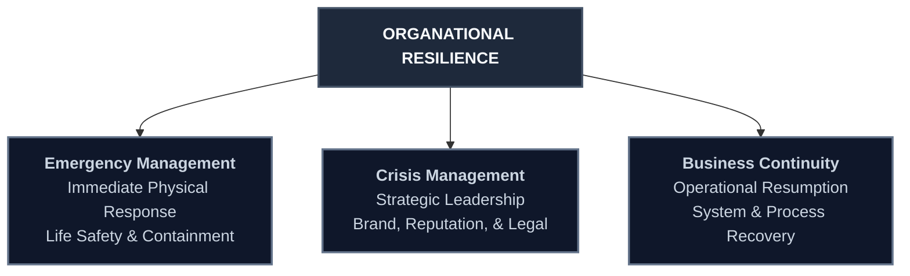

### 8.1 Emergency Management

Emergency management (or emergency response) encompasses the tactical planning and activities associated with detecting, containing, and managing the immediate impact of a disruptive event (e.g., suppressing a physical fire or immediately isolating a network segment during a cyber breach).

A universal, four-stage cyclical model is used by government agencies and private enterprises worldwide to structure emergency management planning:

1. **Mitigation:** The proactive process of putting physical or structural safeguards in place to reduce the likelihood of a disaster occurring, or to minimize its physical impact if it does occur.
   * *Examples:* Installing flood barriers, using fire-rated building materials, or anchoring servers and filing cabinets to walls in earthquake zones. Mitigation aims to lessen harm *before* an event transpires.
2. **Preparedness:** Encompasses all activities, training programs, communication protocols, and systems developed and implemented prior to an incident to support and enhance mitigation, response, and recovery.
3. **Response:** Executing the emergency operations plan and performing critical duties to preserve life, protect property, secure the scene, and provide essential services to the surviving population. Response focuses on immediate life-safety and stabilization.
4. **Recovery:** Reestablishing the processes, resources, facilities, and systems of the organization to meet ongoing operational requirements. Recovery provides an opportunity to introduce significant organizational improvements and modernize infrastructure, sometimes extending to the refocusing of strategic objectives.

#### 8.1.1 Emergency and Response Teams

Emergency response personnel must be trained and prepared to function adaptively across all types of emergencies, including unexpected scenarios.
* **Site-Specific Planning:** Primary training must focus on the most likely local threats and account for the unique location, construction, size, and operational function of the specific facility.
* **Emergency Operations Plan (EOP):** Large, multi-site organizations must implement an overarching EOP to coordinate response across all locations, supplemented by site-specific emergency annexes tailored to localized exposures.
* **Role Clarity:** Establishing response teams and command structures in advance ensures that during a high-stress crisis, members clearly understand their roles, having practiced them during regular exercises.

#### 8.1.2 Emergency Response Planning

Developing a comprehensive, written plan is a fundamental prerequisite of emergency preparedness. While a plan cannot predict every detail of a future crisis, the collaborative process of developing it establishes a structured decision-making framework, enabling a systematic and calm response.

##### The All-Hazards Approach
For most organizations, the **all-hazards planning model** represents the best practice. This approach establishes a core Emergency Operations Plan (EOP) containing universal procedures applicable to *any* emergency (e.g., evacuation routes, emergency contact directories, crisis command structures), supplemented by hazard-specific annexes for localized threats (e.g., hurricane checklists for coastal sites, active assailant response plans, or severe flood protocols).

The all-hazards approach is highly efficient because the fundamental response requirements—such as personnel evacuations, communications, and scene securing—remain identical whether the incident is a natural disaster, a human-caused threat, or an industrial accident.

*Note: Certain specialized industries require highly distinct, dedicated plans. For example, a healthcare facility must deploy fundamentally different protocols to manage a structural earthquake versus a highly contagious biological outbreak.*

Regardless of the organization's size, the plan must be drafted in the simplest, most straightforward manner possible, outlining clear, actionable responsibilities for all emergency response personnel.

### 8.2 Strategic Crisis Management

While emergency management is tactical and focuses on immediate physical response, **crisis management** is strategic. It encompasses the process of supporting active tactical operations (emergency response and business continuity) while managing the overarching issues that threaten the long-term viability, brand equity, and reputation of the organization.

Crisis management begins the moment a disruptive event is detected—including both physical emergencies and non-physical events (such as severe product recalls, regulatory investigations, high-level financial fraud, or major lawsuits).

Crisis management is holistic and multi-disciplinary, requiring active participation from all corporate functions. A core focus is managing **brand and reputational impact**, which requires seamless coordination between executive leadership, legal counsel, and public-relations communications teams.

##### The Ultimate Goal
The ultimate goal of strategic crisis management is to safeguard the organization's core assets:
* Brand reputation and public trust.
* Corporate financial health and shareholder value.
* Key client, vendor, and regulatory relationships.
* Physical, digital, and intellectual property.

Crisis management ensures the enterprise can maintain or rapidly resume its core business mission while navigating the transition into the recovery and continuity phases. A healthy program prevents any single operational department from dominating the response, ensuring a balanced, enterprise-wide perspective.

#### 8.2.1 Crisis Management Teams (CMT)

The **Crisis Management Team (CMT)** is the most critical element of a strategic crisis response. Formally designating and training the individuals who will lead the organization through a business-disrupting event is the foundational step of a resilience program.

##### CMT Composition
To ensure a comprehensive, multi-disciplinary response, the CMT must include representatives from:
* **Executive Leadership (Top Management):** To retain ultimate decision-making authority and govern overall strategic direction.
* **Human Resources (HR):** To manage employee welfare, family notifications, benefits, and labor relations.
* **Finance and Shared Services:** To authorize emergency funding, manage cash flow, and coordinate insurance claims.
* **Legal Counsel:** To manage regulatory compliance, litigious exposures, and protect findings under attorney-client privilege.
* **Critical Operations & Security:** To coordinate physical security, IT disaster recovery, and operational logistics.

> [!IMPORTANT]
> **Executive Separation:** In large, multinational enterprises, it is standard practice to separate the CMT from the senior executive leadership team. This separation allows executive leadership to focus exclusively on broad, long-term strategic business decisions, while the CMT manages the immediate operational execution of the crisis response.

##### Structural Tiers of Crisis Teams
Effective crisis planning scales across three distinct organizational tiers:
1. **Operational Teams:** Focused on recovering specific functional or departmental business areas (e.g., a manufacturing-recovery team or a logistics-resumption team).
2. **Tactical Teams:** Located directly at the scene of the crisis (e.g., a local facility emergency command), responsible for executing immediate physical recovery instructions.
3. **Strategic Teams:** Operating at the executive headquarters level, providing overarching command, resource allocation, and policy direction for the entire enterprise.

*Ideally, all CMT members and their alternates must be designated by position title rather than individual name, ensuring seamless continuity of command if a specific individual is absent.*

#### 8.2.2 Crisis Management Planning and Escalation

An effective crisis plan must be tailored to the organization's unique mission and business model. At a minimum, a strategic crisis plan must document:
* **Activation and Escalation Protocols:** Clear thresholds defining when an incident escalates from a localized emergency to a corporate-level crisis, and how the CMT is officially activated.
* **Succession of Command:** A formal, legally binding succession plan outlining who assumes command if key executives or CMT members are incapacitated or unreachable.
* **Logistics and Resource Directories:** Detailed inventories and contact databases of emergency communication systems, alternate command facilities, and critical recovery resources.
* **Crisis Communication Protocols:** Guidelines governing how information is authorized, drafted, and distributed to internal employees and external stakeholders.

### 8.3 Business Continuity Management (BCM)

**Business Continuity** encompasses the processes, procedures, and technical workarounds designed to maintain essential operations during a crisis and facilitate a smooth transition back to standard business operations following a disruption.

Depending on the organization's size and operational needs, business continuity strategies typically include:
* **Resumption and Recovery in Place:** Restoring systems and processes directly at the affected facility once the scene is secured and stabilized.
* **Outsourcing:** Temporarily contracting critical operations to verified third-party providers.
* **Relocation:** Moving critical personnel, data systems, and functions to pre-selected alternate sites (which may be proprietary hot/warm sites or contracted co-location facilities).

The ultimate objective of BCM is to resume time-sensitive business functions as rapidly as possible, minimizing financial losses and restoring the enterprise to its pre-emergency operational capacity. BCM frameworks must be customized to align with the unique culture, resource availability, industry regulations, and operational complexity of the organization.

##### Core Goals of Continuity Planning
A comprehensive BCM plan is designed to achieve the following:
* **Preserve Life:** Support immediate emergency response to prevent injuries or loss of life.
* **Asset Protection:** Safeguard the physical, financial, and digital assets of the enterprise.
* **Process Restoration:** Rapidly restore critical business applications, networks, and operational workflows.
* **Minimize Downtime:** Drastically reduce the duration of the business interruption.
* **Reputation Shielding:** Protect corporate brand equity from long-term damage.
* **Media Management:** Control and coordinate information flow to local, national, and global media.
* **Maintain Customer Relations:** Reassure clients, fulfill critical SLAs, and protect market share.

##### Essential BCM Plan Components
To be effective, a business continuity plan must document:
* **Checklists for Preparation:** Pre-incident actions to secure data, backup systems, and prepare staff.
* **Response Checklists:** Step-by-step technical workarounds to maintain critical workflows during a disruption.
* **Resumption Checklists:** Structured procedures to safely transition operations back to standard networks and facilities.
* **Resource Directories:** Highly detailed inventories of required hardware, software licenses, vendor contacts, and specialized tools.
* **Alternate Transport and Logistics:** Detailed relocation routes, vehicle needs, and lodging plans for critical staff.
* **Financial Guidelines:** Protocols for authorizing emergency purchasing, capturing crisis-related expenses, and processing insurance claims.
* **Communication Trees:** Pre-established notification paths, call trees, and messaging templates.
* **Threat-Specific Annexes:** Custom procedures for high-impact disruptions requiring highly specialized responses (e.g., cyber extortion, pandemics, utility failures).

#### 8.3.1 Business Continuity Management Teams

BCM teams are the operational backbone of the continuity process. They are directly responsible for executing the recovery checklists for their specific business units (e.g., IT DR team, customer support recovery team, payroll resumption team).

To ensure operational readiness, all BCM team members must:
* Be formally appointed to the team by position.
* Provide active input during plan drafting and annual reviews.
* Understand their precise roles, responsibilities, and reporting structures.
* Know exactly when, where, and how to report for recovery activities.
* Undergo regular, mandatory tabletop exercises and full-scale simulation tests.

#### 8.3.2 Risk Assessment and the BCM Planning Cycle

Developing a business continuity plan is an ongoing, cyclical process that integrates directly into the organization’s larger Enterprise Security Risk Management (ESRM) framework.

##### 1. Establish the Foundation
Before conducting any risk assessments, security managers must clearly define the enterprise's mission, strategic goals, critical business functions, high-value assets, and key risk-decision stakeholders. An organization cannot protect its assets if it does not have a comprehensive understanding of what those assets are and their relative business value.

##### 2. Conduct a Risk Assessment & Business Impact Analysis (BIA)
The organization must perform a comprehensive risk assessment to identify, evaluate, and prioritize potential threats and system vulnerabilities.
* **Likelihood:** Estimated by analyzing the organization's physical and digital profile, threat intelligence, and existing security countermeasures.
* **Consequences:** Evaluated based on the business value of the assets at risk and the operational impact of their loss.

A dedicated **threat evaluation team** should be established to systematically catalog and assess all threats received by the organization, ensuring assessments are conducted early enough to draft and test recovery procedures *before* they are needed.

##### 3. Establish Prevention and Response Measures
The risk assessment directly shapes the selection of countermeasures. Security managers must recognize that a single preventive measure can mitigate multiple risks, and conversely, a highly critical risk may require multiple overlapping safeguards. Risk assessments must undergo continuous review to reflect changes in the operational environment.

#### 8.3.3 The Role of Management in Planning Tools

Developing a comprehensive resilience plan is a labor-intensive endeavor. While modern software tools can significantly streamline the capture, organization, and distribution of recovery information, and specialized emergency management consultants can ensure compliance with regulatory standards, **neither can substitute for active management participation**.

Corporate managers must be directly involved in identifying and valuing organizational assets as part of the plan's development:
* **ESRM Alignment:** The purpose of an emergency or BCM plan—matching the core principles of ESRM—is to highlight the specific scenarios decision-makers will encounter, forcing them to formulate and document responses in advance.
* **Relevance:** For a plan to be effective, it must reflect the real-world operational requirements of the specific business units.
* **Familiarity and Training:** All personnel assigned recovery responsibilities must thoroughly understand their duties and receive continuous, hands-on training to fulfill them.

> [!IMPORTANT]
> **The Planning Cycle Principle:**
> A business continuity plan is a living document, a continuous process that is never truly finished. The plan must undergo regular tabletop exercises, drills, and simulation tests. Lessons learned during exercises or actual emergencies must be used to revise procedures, reallocate responsibilities, and update employee training, followed by rigorous re-testing.

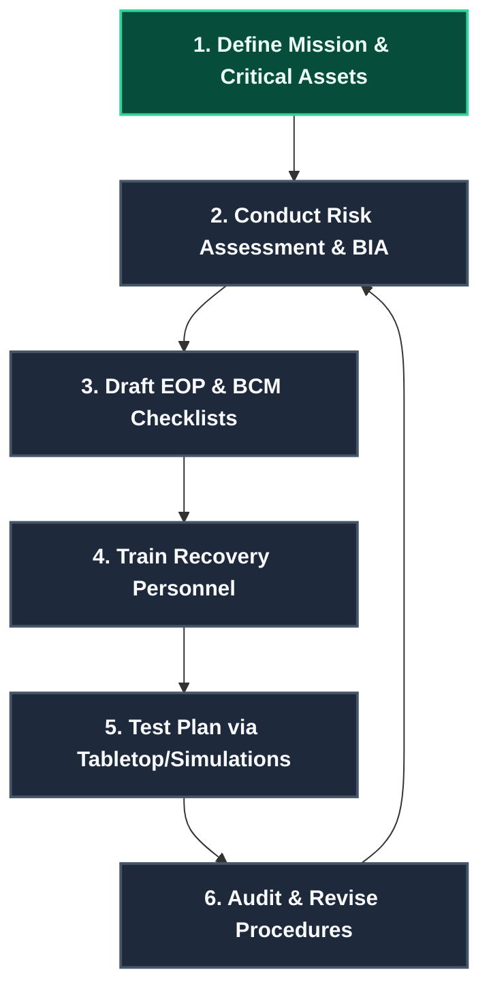

### 8.4 General Response to a Crisis: Active Assailant Program

While general emergency and BCM plans guide the overarching response to natural, human, or cyber disruptions, high-impact events like an **active assailant incident** require highly specialized, rapid operational protocols.

When a violent incident or physical breach occurs, the organization must immediately broadcast alerts and notifications to all affected employees with clear, pre-established instructions (e.g., evacuation, shelter-in-place, or lockdown). Once initial alerts are issued, the organization’s **Threat Management Team (TMT)** coordinates and governs the overall crisis response.

##### Pre-Incident Planning and Preparation Annex
To protect personnel and mitigate liability, security and risk managers must develop a comprehensive Active Assailant Response Program encompassing:
* **Threat Management Team:** A dedicated, multi-disciplinary TMT formally designated in advance to lead the response and post-incident recovery.
* **Role Clarity and specialized Training:** Establishing clear roles, procedures, and rigorous tactical training for all security and key response personnel.
* **Emergency Notification Systems:** Redundant, multi-modal alert systems (SMS, email, public address, mobile apps) to broadcast rapid warnings to employees and visitors.
* **Employee Awareness and Education:** Continuous training for all employees on identifying early warning signs of workplace violence, reporting procedures, and the tactical execution of **"run, hide, fight"** protocols.
* **Emergency Equipment Staging:** Strategic placement of critical response kits containing handheld radios, high-intensity flashlights, mechanical keys, access override cards, detailed laminated floor plans, and specialized bleeding control supplies (e.g., tourniquets, hemostatic dressings).
* **Public Safety Liaison:** Pre-established communication lines, mutual aid agreements, and joint exercises with local law enforcement, fire departments, and ambulance services.
* **Command Centers:** Pre-selected locations for a primary and alternate **Emergency Operations Center (EOC)** and **Incident Command Center (ICC)** to facilitate unified direction, resource allocation, and communication with internal and external responders.
* **Staging Areas:** Pre-designated, secure perimeters for a media briefing area and a safe family notification and reunification center, located well away from active tactical operations.

##### The 3-Phase Post-Incident Response Model
An active assailant event response is structured across three distinct phases, coordinated by the Threat Management Team:

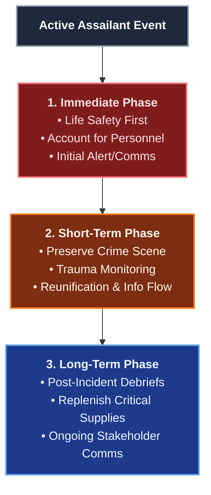

* **1. The Immediate Phase:**
  * **Life Safety:** Focus entirely on immediate threat containment, locking down facilities, and protecting human lives.
  * **Personnel Accounting:** Systematically account for all employees, visitors, and contractors on-site.
  * **Rapid Communications:** Maintain active, clear communications with employees, families, the public, and the media.
  * **First Responder Integration:** Coordinate directly with law enforcement, establishing a secure perimeter to prevent entry into the danger zone.
* **2. The Short-Term Phase:**
  * **Crime Scene Preservation:** Secure the affected areas to preserve evidence and support the police investigation.
  * **Psychological Trauma Care:** Monitor employees for acute signs of psychological trauma, deploying mental health professionals and crisis counselors.
  * **Reunification Operations:** Manage the family notification and reunification center, ensuring families receive verified information in a compassionate manner.
  * **Continuous Information Flow:** Maintain regular updates to stakeholders as facts are officially verified.
* **3. The Long-Term Phase:**
  * **Post-Incident Debriefings:** Conduct thorough debriefs with internal response teams, external public safety agencies, and strategic stakeholders to analyze the response.
  * **Restore and Replenish:** Replenish emergency supplies, repair physical damage, and audit security systems.
  * **Continuous Support:** Maintain long-term psychological support programs for employees, continuing strategic communications with appropriate industry and community groups to foster recovery and build resilience.

## Chapter 9: Investigations Management

An **investigation** is a process of logically, methodically, and lawfully gathering and documenting information for the specific purpose of objectively developing a reasonable conclusion based on the facts learned.

While the investigator is typically not asked to reach legal or disciplinary conclusions, the results of the investigation and interviews are used to guide decision-makers, such as legal counsel, human resources, and executive leadership. This definition applies equally across the public and private sectors, covering a broad spectrum of inquiries from preemployment background screening to administrative misconduct and complex criminal matters.

### 9.1 Purpose and Attributes of Investigations

At a strategic level, investigations serve to protect the organization's assets, preserve its reputation, and mitigate enterprise risk. At a tactical case level, the primary purpose of an investigation generally falls within one or more of the following categories:

* **Documenting Incidents:** Creating an official, factual record of an event or anomaly.
* **Identifying Root Causes:** Determining how and why an undesirable situation or suspected nefarious activity occurred.
* **Correlating Facts:** Documenting misconduct, policy violations, or inappropriate behavior.
* **Identifying and Interviewing Suspects:** Establishing the identity and role of individuals involved in crimes or misconduct.
* **Proving or Disproving Allegations:** Compiling objective evidence to validate or refute claims.
* **Supporting Management Decisions:** Providing the factual basis for personnel actions, contract terminations, or legal proceedings.
* **Threat Assessments:** Identifying and mitigating indicators of workplace, internal, or third-party violence.
* **Mitigating Liability:** Collecting crime data and documentation to shield the enterprise from litigation.

An effective and reliable investigation is characterized by five core attributes:

| Attribute | Description |
| :--- | :--- |
| **Objectivity** | Maintaining an unbiased, neutral perspective, seeking only the truth without preconceived outcomes. |
| **Thoroughness** | Exploring all reasonable leads, interviewing all relevant witnesses, and gathering all accessible evidence. |
| **Relevance** | Focusing strictly on facts and evidence that pertain directly to the issues under investigation. |
| **Accuracy** | Ensuring all documented details, dates, statements, and measurements are precise and verified. |
| **Timeliness** | Initiating and completing the inquiry promptly to preserve evidence, secure witness memories, and mitigate ongoing risk. |

```mermaid
graph TD
    %% Define HSL-themed styles
    classDef public fill:#1e3a8a,stroke:#3b82f6,stroke-width:2px,color:#eff6ff;
    classDef private fill:#064e3b,stroke:#10b981,stroke-width:2px,color:#ecfdf5;
    classDef center fill:#1e293b,stroke:#475569,stroke-width:2px,color:#f8fafc;

    A[<b>INVESTIGATIVE SECTOR COMPARISON</b>]:::center
    A --> B[<b>Public Sector (Law Enforcement)</b>]:::public
    A --> C[<b>Private Sector (Corporate Security)</b>]:::private

    B --> B1[<b>Primary Mission:</b> Serve and protect society]:::public
    B --> B2[<b>Key Metrics:</b> Arrests, convictions, case closure rates]:::public
    B --> B3[<b>Authority:</b> Statutory police powers, search warrants]:::public
    B --> B4[<b>Scope:</b> Specific statutory/criminal violations]:::public

    C --> C1[<b>Primary Mission:</b> Protect employing enterprise assets & interests]:::private
    C --> C2[<b>Key Metrics:</b> Asset recovery, restitution, risk & liability reduction]:::private
    C --> C3[<b>Authority:</b> Proprietary contractual rights, employment policies]:::private
    C --> C4[<b>Scope:</b> Broad scope including policy violations and systemic process improvements]:::private
```

### 9.2 Managing the Investigative Function

Managing investigations within a corporate environment requires the systematic execution of five core management functions: **planning, organizing, directing, coordinating, and controlling**. These functions operate dynamically across three distinct organizational tiers:

1. **Strategic Level:** Focuses on high-level management of the entire Investigative Unit (IU) and its alignment with executive leadership. Senior managers and legal counsel collaborate at this level to ensure investigations align with corporate policy, ethical guidelines, and civil or criminal statutes.
2. **Operational Level:** Manages the technical and logistical aspects of the investigative function, establishing standard operating procedures (SOPs), department workflows, and resource allocation.
3. **Case Level:** Governs the execution of individual inquiries, including the assignment of specific investigators, selection of investigative techniques, and case-file management.

#### IU Organizational Structure and Authority
To operate effectively, the IU must be established through a formal **functional charter** issued by the CEO or an equivalent executive officer. This charter:
* States the official purpose, scope, and strategic direction of the IU.
* Defines who holds executive responsibility for the investigative function.
* Clarifies the unit's authority to access records, interview employees, and secure company property.
* Establishes essential reporting and liaison relationships with key departments (e.g., Legal, HR, Audit, and Operations).

Supporting the charter, a **policy statement** outlines the detailed procedures for initiating, conducting, and reporting investigations. Additionally, the unit defines annual **objectives and key performance indicators (KPIs)** to measure productivity, cycle times, recovery rates, and process improvements.

### 9.3 The Investigation Process Lifecycle

A corporate investigation progresses systematically through four key operational phases:

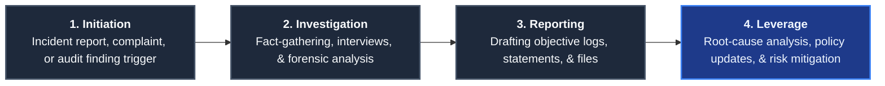

1. **Initiation:** Triggered by an incident report, whistleblower complaint, audit discrepancy, or formal management request. This phase defines the initial scope and establishes the legal or policy justification for opening the case file.
2. **Investigation:** The active execution of fact-gathering, which may involve administrative inquiries, background screening, digital forensics, or due diligence reviews.
3. **Reporting:** The objective, formal documentation of all gathered facts, witness statements, and evidence. Investigative reports are permanently archived and treated as highly confidential.
4. **Leverage:** Analyzing the investigative findings to perform root-cause analysis, recommend systemic business process improvements, patch security vulnerabilities, and update risk mitigation strategies.

> [!IMPORTANT]
> **Ethics as a Business Imperative:**
> Credibility is the ultimate currency of the investigative unit. IUs must adopt a zero-tolerance policy for ethical lapses. Publishing written ethical codes, providing continuous professional training, and rigorously enforcing standards protect the organization's reputation and ensure that investigative findings remain legally defensible.

### 9.4 Corporate Undercover Operations

A **corporate undercover investigation** is the surreptitious placement of a properly trained and skilled investigator (posing as an employee, vendor, or customer) into an unsuspecting workforce for the primary purpose of gathering intelligence on internal misconduct.

Unlike passive surveillance, undercover operations are interactive. A skilled operative can not only observe *what* misconduct is occurring but also uncover the *how* and *why* behind the actions, including peer pressure, supervisory complicity, and systemic workarounds.

#### Appropriate Triggers for Undercover Operations
Undercover operations must be treated as a highly restricted exception rather than a routine tool, and should only be initiated when all other investigative methods have failed or are impossible. Typical triggers include:
* Consistent, verified intelligence of systemic employee misconduct or criminal activity, but insufficient details hinder standard identification.
* Documented asset losses in a specific business unit that cannot be traced through standard auditing.
* Strong indicators of widespread drug or alcohol abuse, dealing, or impairment in the workplace, coupled with passive or unresponsive supervisory oversight.
* The critical need to audit actual operational practices against corporate policy where open auditing is ineffective.

#### Operational Constraints and Risks
Undercover operations must **never** be used to intrude into areas with a reasonable expectation of privacy, nor to investigate protected union activities or legally protected employee actions. Managers must carefully weigh the significant risks of undercover placement:
* **Exposure and Compromise:** If an undercover operation is unmasked, it can severely damage employee morale, trigger labor disputes, and alienate customers or suppliers who resent being monitored.
* **Legal and Civil Liability:** Improper handling can expose the organization to lawsuits for invasion of privacy, entrapment, or constructive dismissal.
* **Resource Intensity:** These operations require substantial time, patience, specialized management, and financial investment to maintain cover and gather admissible facts.

### 9.5 Due Diligence and Preemployment Screening

#### Due Diligence Investigations
In a business setting, **due diligence** represents the proactive process of "doing one's homework" to verify the legitimacy, financial health, and reputation of a business partner, key executive, transaction, or organization.
* **Negligence vs. Diligence:** From a legal perspective, diligence represents the active exercise of due care, whereas negligence is the failure to do so. Fiduciary failure to exercise due diligence in mergers, acquisitions, or major procurement contracts can result in catastrophic financial losses, brand damage, and shareholder litigation.
* **Reporting Standards:** Due diligence findings must be meticulously documented in a written report. Key components include: client/provider identities, background, scope, investigative methodology, detailed findings, conclusions, and a rigorous legal disclaimer outlining any limitations. Confidentiality and dissemination controls must be agreed upon in advance.

#### Preemployment Background Screening
A single bad hiring decision—such as placing a dishonest, violent, or severely impaired individual in a sensitive role—can destroy workplace morale, compromise safety, and inflict severe financial damage. A robust, legally compliant preemployment screening program is a vital risk-mitigation tool.

While often used interchangeably, these screening terms represent distinct tiers of scrutiny:
* **Background Check:** A baseline, confirmatory inquiry verifying applicant-provided information (e.g., educational credentials, prior employment history, and professional licenses).
* **Background Screening/Investigation:** An active, searching inquiry to uncover hidden history (e.g., searching civil and criminal court records, checking driving records, and conducting reference interviews).
* **Preemployment Screening:** A comprehensive evaluation process to determine overall trustworthiness and capability, which may incorporate drug/alcohol screening, job-related physical or medical exams, psychological/integrity testing, and polygraph examinations (where legally permitted).

> [!CAUTION]
> **Improper Hiring Liabilities:**
> Under the doctrine of **negligent hiring**, employers are held legally liable for the intentional misconduct or violence of an employee if it is proven that the employer knew, or *should have known* through reasonable background screening, that the individual posed a threat to coworkers, clients, or the public.

### 9.6 The "Three I's" of Investigation

To gather facts and resolve cases, investigators rely on a classical three-part methodology known as the **"Three I's"**:

1. **Information:** The gathering of facts, data, and witness accounts through interviews. In corporate investigations, the **interview**—a structured, non-adversarial question-and-answer session with victims, witnesses, and informants—is the primary and most critical source of information.
2. **Interrogation:** The structured questioning of a suspect designed to elicit a confession or admission of involvement. Interrogations are highly regulated, adversarial, and are primarily associated with public law enforcement rather than corporate security.
3. **Instrumentation:** The application of scientific instruments, technology, and specialized equipment to the investigative process (e.g., computer forensics, video surveillance, and polygraph testing).

### 9.7 Evidence Management and Chain of Custody

Evidence is the foundation of any factual conclusion. It generally appears in oral, documentary, or physical form, and is classified into two primary categories:
* **Direct Evidence:** Real or material evidence based on firsthand knowledge (e.g., an eyewitness account, clear video recording of an act, or a signed confession).
* **Indirect (Circumstantial) Evidence:** Evidence that provides a factual basis from which a reasonable inference can be drawn (e.g., system access logs showing a suspect's credentials were used at the exact time of a breach, or testimony establishing a sequence of events). Hearsay—repeating what another person claimed to have seen or heard—is a form of indirect evidence whose admissibility is highly restricted.

#### The Chain of Custody Protocol
To ensure that physical or digital evidence remains legally admissible in court, regulatory hearings, or labor arbitrations, investigators must maintain an flawless **chain of custody**. This represents the uninterrupted, documented control of evidence from the moment of collection to its presentation in a legal forum.

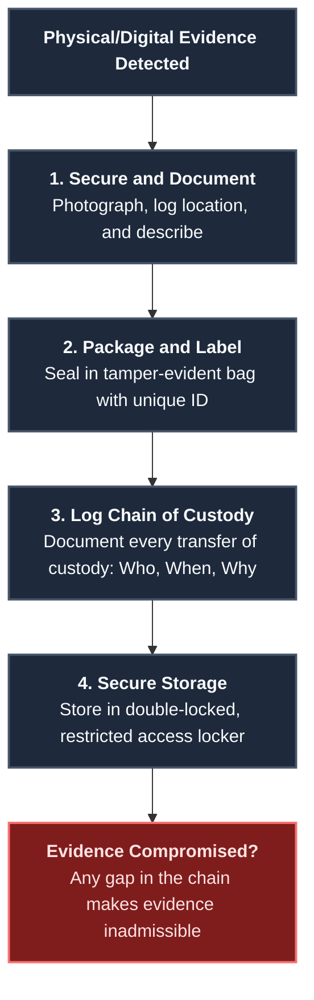

Investigators must also remain vigilant against **staged scenes**, where physical evidence has been deliberately altered or manufactured by a perpetrator to mislead the inquiry or shift blame.

### 9.8 Testimonial Evidence and Courtroom Preparedness

Because of the incidents they manage, security professionals and investigators are frequently called to testify in civil trials, criminal prosecutions, labor arbitrations, or regulatory hearings.

Witnesses generally fall into two categories:
* **Fact Witness:** Restricted to testifying strictly about matters they directly perceived through their own senses (what they saw, heard, touched, smelled, or tasted). Fact witnesses are generally prohibited from offering personal opinions or hearsay.
* **Opinion (Expert) Witness:** Individuals who possess specialized training, academic credentials, and professional experience in a specific subject (e.g., forensic accountants, digital investigators, or security consultants). Expert witnesses are legally permitted to analyze evidence and offer formal opinions and conclusions based on accepted scientific standards.

Regardless of the forum, a security professional's testimony must be absolutely truthful, objective, and coordinated with legal counsel's strategy.

### 9.9 Maximizing Investigative Effectiveness

#### Force Multipliers
To optimize resources and expedite case resolution, IUs must leverage critical force multipliers:
* **Liaison Networks:** Building formal and informal relationships with local, national, and international law enforcement agencies, industry peers, and professional security associations. Liaison allows IUs to share threat intelligence, coordinate joint actions, and leverage external resources.
* **Joint Task Forces (JTFs):** Collaborating on complex, cross-jurisdictional issues (e.g., retail theft rings, cybercrime, terrorism, human trafficking, or major procurement fraud). While JTFs offer immense resource diversity, they require careful management to resolve conflicting jurisdictional authorities or organizational cultures.
* **Technology and Intelligence Programs:** Deploying data analytics, forensic tools, and digital case-management software to accelerate fact correlation. A formal corporate intelligence program must govern the gathering, integration, storage, sharing, and access control of threat data.

#### Investigative Reporting
The ultimate product of an investigation is the **investigative report**. This formal, written record must be clear, objective, and logical, enabling the reader to easily understand *what* the investigator did, *why* it was done, and *what* resulted. IUs typically utilize four classes of reports:
* **Initial Report:** Submitted within a few days of case opening to outline the initial incident, established facts, and immediate investigative leads.
* **Progress (Interim) Report:** Filed at fixed intervals to document ongoing activities, interview summaries, and remaining open tasks.
* **Special Report:** A standalone document used to record highly unusual actions, major breakthroughs, or specialized findings outside the scope of a standard progress report.
* **Final Report:** A comprehensive summary submitted when a case is successfully resolved, or when all investigative leads have been exhausted and further action is unproductive.

*To protect individual privacy and shield the enterprise from liability, report distribution must be strictly restricted to individuals with a documented, genuine "need-to-know" (e.g., Legal Counsel, HR Director, and designating Executive).*

#### Leveraging Results for Continuous Improvement
A corporate investigation should never end simply with a disciplinary action or restitution. Every completed case represents a vital diagnostic tool for the enterprise. 
IUs must perform post-incident reviews to identify the procedural lapses, control weaknesses, or physical vulnerabilities that enabled the misconduct to occur. Documenting these systemic issues and translating them into policy updates, training programs, and enhanced physical or technical safeguards ensures continuous improvement in the organization's overall resilience and risk management posture.

## Chapter 10: Security Forces and Personnel Management

The security mission is fundamentally dependent on people. From executive leadership down to the frontline workforce—including clients, vendors, and visitors—individuals are both the champions of security and the potential interlopers who seek to breach it.

Security managers must draft comprehensive policies and procedures that govern organizational assets protection while ensuring that personnel understand both the rules and the operational rationale behind them. Managing these human assets encompasses the deployment of uniformed security officers, the engagement of specialized consultants, and the execution of executive protection (EP) programs to shield key personnel from personal and corporate risk.

### 10.1 Uniformed Security Officers

Uniformed security officers represent the most visible element of the private security sector. The guard force operation has evolved into a massive, multibillion-dollar global industry, representing the single largest line item in most corporate security budgets.

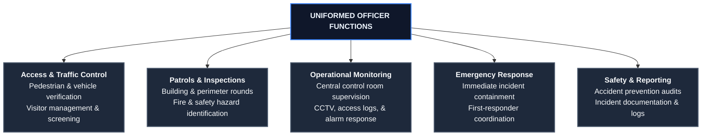

Successful guard force operations require strict compliance with jurisdictional licensing regulations and preemployment background screening. The selection of officers must focus on key personal traits, including: strong moral character, excellent written and verbal communication skills, high coachability, a neat professional appearance, and an unwavering commitment to ethics.

#### 10.1.1 Weapons and the Use-of-Force Continuum
The decision to arm security officers carries severe operational risks and legal liabilities. Armed officers must only be deployed when a comprehensive threat assessment proves there is an elevated, direct threat to life safety that cannot be mitigated by other means, or when the protection of high-value assets demands lethal force capabilities.

When weapons are authorized, the organization must implement a strict **Use-of-Force Policy**. This policy:
* Explicitly defines the circumstances, thresholds, and legal limitations governing the application of force.
* Aligns strictly with national and local statutory guidelines.
* Establishes a formal **Use-of-Force Continuum** (ranging from physical presence to verbal commands, less-lethal contact, and finally lethal force).
* Mandates continuous, hands-on, and rigorously documented tactical training for all armed staff.

*Less-Lethal Weapons:* Tools such as electroshock devices (Tasers), expandable batons, and chemical irritants (pepper spray) are also inherently dangerous. Officers must undergo standardized certification to ensure these tools are used judiciously, preventing excessive force claims and minimizing organizational liability.

#### 10.1.2 Guard Force Sourcing: Proprietary, Contract, and Hybrid Models
Organizations must choose the sourcing model that best fits their risk profile, operational culture, and budget:

| Guard Force Model | Operational Advantages | Key Risks & Considerations |
| :--- | :--- | :--- |
| **Proprietary (In-House)** | • Closer control over recruitment and screening<br>• Custom training tailored to corporate culture<br>• High employee loyalty and institutional knowledge<br>• Lower staff turnover rates | • High administrative overhead (benefits, HR)<br>• Rigid staffing levels and scheduling challenges<br>• Direct employment liability |
| **Contract (Outsourced)** | • Shifts recruiting, training, and HR burdens to vendor<br>• Excellent staffing flexibility for special events/peaks<br>• Lower direct administrative overhead | • Higher personnel turnover rates<br>• Potential dilution of loyalty and brand alignment<br>• Quality of staff depends heavily on agency standards |
| **Hybrid** | • Cost-effective compromise of control and savings<br>• Internal proprietary leaders set policy and oversee force<br>• Contract agency provides scalability and raw staffing | • Requires careful coordination to prevent conflict<br>• Clear operational boundaries needed between teams |

Ultimately, sourcing decisions must be driven by **asset value, risk exposure, and performance expectations** rather than purely by hourly cost.

#### 10.1.3 Managing and Supervising the Security Force
Daily guard force operations are governed by two levels of written instructions:
* **General Orders:** Broad, universal principles of conduct and professional bearing applicable to all officers, shifts, and locations (e.g., maintaining professional appearance, prohibiting on-duty smoking/eating, enforcing rules diplomatically, and remaining at the post until relieved).
* **Post Orders:** Highly detailed, site-specific, and task-oriented procedures governing a single post. Post orders cover daily operational routines, visitor screening steps, and precise emergency response protocols. They must be physically or digitally available at every station.

###### Operational Supervision and Vigilance
Supervisors must conduct unannounced site visits and post inspections to quiz officers on post orders, observe post conditions, and provide on-the-job coaching.

To maintain officer alertness during repetitive, fatiguing shifts, managers should implement active **vigilance countermeasures**:
1. **Environmental Optimizations:** Keep control rooms cool and increase lighting levels during overnight hours.
2. **Duty Rotations:** Schedule regular physical patrols, post rotations, and movement intervals to break monotony.
3. **Status Check-Ins:** Mandate periodic supervisor call-ins or deploy automated check-in systems that confirm officer safety and responsiveness.
4. **Controlled Rest:** Where operationally feasible and secure, establish formal policies permitting scheduled, short rest breaks (naps) on long shifts.

###### Performance Metrics and Documentation
Security officers must document their activities in structured logs:
* **Main/Control Log:** A centralized, cumulative, and sequential history of all significant events and alarm activations across the entire shift.
* **Post Log:** A localized record tracking actions specific to an individual post.

These logs represent critical diagnostic data, enabling security managers to identify recurrent threat patterns, evaluate response times, and measure overall program effectiveness. Performance appraisals must be conducted formally at least **once per year**, with an informal mid-year check-in to identify and remediate training deficiencies before they lead to operational failures.

###### Robotic and Drone Integration
Corporate security increasingly integrates autonomous technology to augment the human guard force. Managers must align technology with the correct tasks:
* **Human Strength:** Complex decision-making, threat perception, verbal conflict resolution, and the ability to pivot in dynamic crises.
* **Technology Strength (Robots/Drones):** Monotonous, repetitive, physically hazardous, or simple tasks (e.g., continuous perimeter patrols, remote thermal scans, hazardous material screening) where human officers are susceptible to boredom and complacency.

### 10.2 Security Force Training Standards

Supervisors and managers must structure security work experience so that it is developmental. Learning—defined as a positive, measurable change in workplace behavior—is achieved through the synergistic integration of **education** (theoretical understanding), **training** (hands-on skill performance), and **development** (long-term professional growth).

#### Needs Assessment and Compliance
Before implementing any training curriculum, managers must perform a comprehensive **training needs assessment**:
1. **Regulatory Review:** Identify all national, state, and local licensing laws governing security officer training and weapons qualification.
2. **Standard Alignment:** Incorporate industry best practices, such as recognized physical security standards and guidelines.
3. **After-Action Analysis:** Review incident logs, post-incident investigations, and audit findings to target documented performance gaps.

#### Delivery and Cost-Effectiveness
Training can be delivered via lectures, distance learning, job aids, or hands-on on-the-job training (OJT). Security managers must optimize their training budgets using smart cost-saving strategies:
* **Tuition Reimbursement:** Encourages self-directed education.
* **Professional Memberships:** Connects staff with industry knowledge bases and professional security societies.
* **Job Rotation:** Cross-trains staff to handle multiple posts, improving operational flexibility and reducing burnout.
* **Off-Duty and Video Modules:** Standardizes training delivery without disrupting active guard coverage.

### 10.3 Procurement and Service Contracts

When outsourcing guard operations, the client organization and the contract agency must establish a collaborative, highly transparent partnership to ensure service quality.

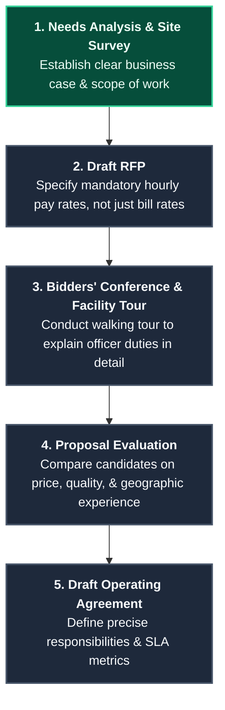

> [!IMPORTANT]
> **Wage Specification Rule:**
> When drafting a Request for Proposal (RFP) for contract security services, the client organization must explicitly specify the **hourly wage rates** to be paid to the security officers, rather than allowing agencies to bid solely on the total bill rate. This prevents competing agencies from underbidding each other by depressing officer wages, which inevitably leads to high turnover, low morale, and underqualified staff at the facility.

### 10.4 Security Consultants as a Protection Resource

Corporate security executives and business managers frequently retain independent security consultants to obtain specialized technical expertise, secure an objective, independent assessment of security posture, or bypass internal corporate politics.

#### Consultant Classifications
1. **Security Management Consultants:** Focus on risk assessments, program development, organizational structures, policies, and standard operating procedures (SOPs).
2. **Technical Security Consultants:** Specialize in the design, engineering, and auditing of physical security systems, access control, CCTV, and central monitoring stations.
3. **Security Forensic Consultants:** Provide expert witness testimony, evidence analysis, and litigation support based on scholarly research and industry standards.

#### The 5-Step Consultant Selection Process
To ensure the right match for a complex project, managers must execute a structured procurement protocol:
1. **Identify Candidates:** Source qualified candidates through colleague referrals, professional networks, and respected industry associations like the **International Association of Professional Security Consultants (IAPSC)**.
2. **Invite Proposals:** Issue a Request for Quote (RFQ) or Request for Proposal (RFP) detailing the project scope and requiring standard work samples and resumes.
3. **Evaluate Applications:** Assess candidates based on technical expertise, proposed methodology, and experience with similar corporate challenges.
4. **Conduct Interviews:** Interview the top 2-3 candidates to probe their security philosophy, verify cultural fit, and review physical or digital work samples.
5. **Negotiate Agreement:** Finalize the precise scope of work, project timeline, milestones, fee structures (hourly, flat, or retainer), and expected deliverables.

#### Project Coordination and Implementation
To maximize the value of the engagement, the client company must assign an internal **Project Coordinator** to act as the consultant's primary liaison. This coordinator facilitates access to facilities and records, monitors progress, and reviews intermediate deliverables.

Every consulting project must culminate in a detailed **final written report**. This report must contain specific, actionable guidelines so that corporate staff can execute the recommendations independently. If complex technical integration is required, the contract may be amended or expanded to retain the consultant for implementation oversight.

### 10.5 Executive Protection (EP) / Close Protection

**Executive Protection (EP)** comprises the proactive security and risk-mitigation measures deployed to safeguard high-risk individuals whose public profile, wealth, employment, or affiliations expose them to elevated levels of physical, digital, or reputational threat.

#### Protected Populations
* **Business Leaders & Corporate Officers:** High-profile executives whose kidnapping, injury, or incapacitation would cause catastrophic operational disruptions, reputational damage, and financial losses (including negative impacts on corporate stock price and brand equity).
* **Controversial Figures:** Individuals whose business activities, research, or public stances provoke hostility or threat from extremist groups.
* **High-Net-Worth Individuals (HNWIs):** Individuals and families whose extreme wealth makes them attractive targets for kidnapping, extortion, and targeted fraud.
* **Threatened Individuals:** Employees or VIPs who are the targets of specific, verified threats of violence.

#### EP Risk and Vulnerability Assessments
Unlike static facility assessments, EP risk assessments focus dynamically on the principal's lifestyle, public exposure, transit routes, and family circle (who are often treated as soft targets by adversaries seeking access to the principal).

Assessments must analyze all environments the principal traverses, including residences, corporate offices, maritime vessels, aircraft, and **Fixed Base Operations (FBOs)**.

> [!TIP]
> **Response-Time Security Design:**
> A critical factor in EP vulnerability assessments is the emergency response capability of local public safety agencies. If local police, fire, or medical services exhibit response times above a tolerable safety window, the EP program’s security design must automatically pivot to integrate enhanced residential shelter-in-place (panic rooms) and active tactical evacuation strategies.

#### Sourcing and Operating Models
EP programs typically operate under one of three structures:
1. **Proprietary (In-House):** Dedicated, full-time close protection agents employed directly by the corporation. This ensures maximum confidentiality, loyalty, and seamless alignment with corporate operations.
2. **Outsourced:** Contracted EP firms provide security drivers, local advance agents, and armed close protection details. This is highly effective for global travel to high-threat regions where specialized local knowledge is paramount.
3. **Hybrid:** In-house EP managers govern overall strategy, policy, and advance planning, while supplementing operations with vetted local EP vendors in destination cities.

#### Key Specialized EP Resources
Modern close protection teams leverage highly specialized technical resources to mitigate emerging threats:

```mermaid
graph TD
    %% Define HSL-themed styles
    classDef spec fill:#1e293b,stroke:#475569,stroke-width:2px,color:#f8fafc;
    classDef main fill:#0f172a,stroke:#7c2d12,stroke-width:2px,color:#fff7ed;

    A[<b>SPECIALIZED EP CAPABILITIES</b>]:::main
    A --> B[<b>Digital Executive Protection</b><br>Shielding personal data online<br>Doxing prevention & dark-web threat monitoring]:::spec
    A --> C[<b>Technical Security Countermeasures (TSCM)</b><br>Sweeping offices, vessels, & homes for bugs<br>Securing RF & wireless communications]:::spec
    A --> D[<b>Explosive Detection Canines (K9)</b><br>Sweeping high-risk event venues<br>Vetting physical entry points & packages]:::spec
    A --> E[<b>Tactical Logistics & Drivers</b><br>Secure transport & escape driving<br>Advance route vetting & contingency staging]:::spec
```

#### Government vs. Private EP: The Core Protective Mandate
There is a fundamental difference in mission and authority between government protective details (e.g., Secret Service, diplomatic security) and corporate/private EP teams:
* **Government EP:** Sworn law enforcement officers holding statutory authority to control public environments, block traffic, and carry firearms across international boundaries.
* **Private EP:** Operates strictly under proprietary rights and local civil laws, with no statutory police authority to control public spaces.
* **The Core Protective Mandate:** A protection agent's primary duty—regardless of sector—is to **avoid putting the principal in harm's way** through exhaustive advance planning. If an active threat occurs, the agent's mandate is to **flee from harm** (shielding and immediately evacuating the principal) rather than running toward the conflict or engaging in combat.

## 10.6 Workplace Substance Abuse

Substance abuse is a complex disease that inflicts severe physical, mental, and emotional harm on individuals, often escalating from casual use to chemical dependency and addiction. Within the corporate environment, employee substance abuse degrades productivity, erodes workforce morale, increases absenteeism, drives safety incidents, and exposes the organization to severe legal liabilities and reputational damage.

### 10.6.1 Impact of Substance Abuse in the Workplace
Employee substance abuse directly impacts organizational viability across several critical areas:
* **Operational Performance:** Depresses overall productivity, diminishes quality control, and destroys team coordination.
* **Financial Exposure:** Increases healthcare benefit consumption, elevates workers' compensation claims, and drives inventory shrinkage due to internal theft and fraud.
* **Legal and Liability Risks:** Elevates the probability of workplace accidents, endangering employees, clients, and the public, which can trigger catastrophic negligent retention lawsuits.
* **Organizational Culture:** Increases employee turnover, drives absenteeism, and damages corporate brand equity through negative public exposure.

### 10.6.2 The Seven Elements of a Drug-Free Workplace Program
To protect personnel and maintain a safe, productive environment, security managers must collaborate with Human Resources and Legal Counsel to implement a comprehensive, seven-step program:

```mermaid
graph TD
    %% Define HSL-themed styles
    classDef step fill:#1e293b,stroke:#475569,stroke-width:2px,color:#f8fafc;
    classDef highlight fill:#064e3b,stroke:#34d399,stroke-width:2px,color:#ecfdf5;

    A[<b>1. Goals and Objectives</b><br>Establish clear, measurable targets]:::step --> B[<b>2. Written Policy</b><br>Formulate a comprehensive, legally compliant policy]:::step
    B --> C[<b>3. Active Communication</b><br>Ensure written acknowledgment from all staff]:::step
    C --> D[<b>4. Equitable Enforcement</b><br>Apply rules consistently across all organizational levels]:::highlight
    D --> E[<b>5. Education & Training</b><br>Provide supervisor and employee awareness modules]:::step
    E --> F[<b>6. Employee Assistance (EAP)</b><br>Provide confidential rehabilitation support]:::step
    F --> G[<b>7. Regular Auditing</b><br>Continuously evaluate program compliance & results]:::step
```

### 10.6.3 Classes of Abused Substances
Supervisors and security personnel must maintain an awareness of the primary drug categories commonly encountered in workplace abuse cases:

| Substance Class | Core Effects & Risks | Common Examples |
| :--- | :--- | :--- |
| **Depressants** | Slows brain function and motor skills; high risk of physical dependency. **Alcohol** is the most common depressant. | Benzodiazepines (Valium, Xanax, Librium), barbiturates (Nembutal, Seconal), sedatives (Quaaludes, Lunesta) |
| **Stimulants** | Accelerates central nervous system activity; produces artificial energy, paranoia, and extreme crash cycles. | Cocaine, amphetamines, methamphetamine, methcathinone, methylphenidate (Ritalin) |
| **Narcotics / Opiates** | Powerful pain relievers with an extremely high risk of severe physical addiction and life-threatening overdose. | Morphine, heroin, codeine, synthetic opioids (fentanyl, oxycodone) |
| **Hallucinogens** | Alters sensory perception, time, and space; induces unpredictable behavioral changes and acute panic. | LSD (acid), MDMA (ecstasy), PCP (angel dust), mescaline (peyote), psilocybin (mushrooms) |
| **Marijuana / Cannabis** | Impairs short-term memory, coordination, and cognitive speed; legal status varies widely by jurisdiction. | Cannabis flowers, concentrates, edibles |
| **Synthetic / Analogue** | Chemically modified designer drugs created to bypass statutory restrictions; often highly volatile and potent. | Synthetic cannabinoids (K2, Spice), bath salts |

#### Understanding the Cycle of Addiction
Addiction is a chronic disease characterized by obsession and chemical compulsion. An individual suffering from addiction develops a profound dependency not only on the physical effects of a substance but also on the elaborate social behaviors, rituals, and environments associated with obtaining and using it. 

Primary indicators of developing employee substance abuse include:
* **Workplace Performance Lapses:** Frequent unexplained absences, rapid decline in work interest, and recurrent performance issues.
* **Physical Health Degradation:** Severe lack of energy, rapid weight fluctuations, slurred speech, or chronically reddened eyes.
* **Grooming Neglect:** Sudden, marked decline in personal hygiene, grooming standards, and dress.
* **Behavioral Shifts:** Secretive behavior, isolation, sudden mood swings, and deteriorating relationships with coworkers and family.
* **Financial Distress:** Frequent requests for salary advances or loans, and unexplained involvement in internal theft.

### 10.6.4 Intervention, Employee Assistance, and Drug Testing

#### The Danger of Enabling Behaviors
When supervisors suspect an employee has a substance abuse problem, they frequently fall into the trap of **enabling**. Enabling comprises any conscious or unconscious behavior that shields the abuser from experiencing the direct consequences of their actions.

Driven by denial or a misplaced desire to be kind, enabling managers accept weak performance excuses, believe obvious rationalizations, and cover up attendance failures. This maintains the delusion that the abuser is performing adequately, allowing the disease to progress.

To break this cycle, supervisors must receive rigorous training to:
1. Thoroughly document all substandard performance and attendance issues with objective data.
2. Recognize enabling behaviors (such as excusing late arrivals or reassigning work) and stop them immediately.
3. Establish clear, anonymous communication paths to encourage reporting of workplace safety concerns.
4. Enforce company policies consistently, holding all employees fully accountable for their performance.

#### Intervention vs. Discipline
Managers must distinguish between punitive action and caring professional support:
* **Discipline:** Punitive measures (e.g., warnings, demotions, suspensions) executed in response to documented policy violations.
* **Intervention:** A highly planned, caring, and non-punitive confrontation designed to interrupt the abuser's destructive behavior. Guided by documented performance data, intervention seeks to salvage the employee's career, steer them into professional treatment, and return them to the workforce as a healthy, productive contributor.

To support this recovery process, organizations deploy **Employee Assistance Programs (EAPs)**. Originating in the 1940s as occupational alcoholism programs, modern EAPs provide free, strictly confidential assessment and counseling services for employees and their immediate family members, addressing substance abuse, mental health struggles, and severe personal crises.

#### Policy Design for Workplace Drug Testing
Workplace drug testing represents a critical deterrent and detection tool. Testing programs may encompass preemployment screening, reasonable suspicion testing, post-accident investigations, random testing, return-to-duty vetting, and post-treatment follow-up.

To design a legally defensible drug-testing program, security managers must resolve **seven fundamental policy questions**:

> [!IMPORTANT]
> **The 7 Pillars of Drug-Testing Policy Design:**
> 1. **Substance Profile:** Which specific drugs and metabolites will be tested?
> 2. **Trigger Thresholds:** Under what precise conditions (e.g., preemployment, post-accident, random) will a test be mandated?
> 3. **Methodology:** What testing technology (e.g., urinalysis, oral fluid, hair follicle) will be deployed?
> 4. **Testing Pool:** Which employees (e.g., safety-sensitive roles vs. general staff) will be subject to testing?
> 5. **Collection Authority:** Who is certified to collect the physical specimens?
> 6. **Collection Venue:** Where will specimens be gathered (on-site clinic vs. certified external laboratory) to ensure integrity?
> 7. **Information Custody:** Who receives the verified results, and how is medical confidentiality strictly maintained?

### 10.7 Security Awareness Programs

**Security awareness** is the continuous state of consciousness regarding the organization's existing security program, its operational relevance, and the direct impact of individual employee behavior on reducing overall security risks.

While general education provides theoretical knowledge and training builds technical skills, security awareness solicits active, conscious attention. A highly informed workforce acts as a powerful **force multiplier**, establishing a proactive security culture where employees actively safeguard themselves, their colleagues, and corporate assets.

#### Executive Modeling and Supervisory Liability
A successful awareness program must be championed from the top down. Executives must actively model security compliance. If senior managers treat security protocols as inconvenient hurdles, employees will inevitably bypass them, degrading the entire security posture.

Supervisors also carry significant legal liability regarding the escalation of security reports:

> [!CAUTION]
> **First-Line Supervisor Escalation Liability:**
> Under common law, first-line supervisors are legally recognized as the direct agents of the employer. If an employee reports an unsafe condition, access breach, or threat of violence to a supervisor, the law deems the organization to have **official notice and foreseeability** of the threat. If the supervisor fails to immediately escalate the report and an injury or death subsequently occurs, the organization is exposed to massive civil liability for negligence.

#### Mitigating Frontline Vulnerabilities
Awareness campaigns must target the most common human-factor vulnerabilities:
* **Tailgating / Piggybacking:** Educating employees to prevent unauthorized individuals from slipping through access points behind them.
* **Social Engineering:** Training personnel to recognize deceptive attempts to solicit proprietary information, credentials, or physical access.
* **Cyber Hygiene:** Reinforcing password security, phishing detection, and the handling of sensitive digital assets.
* **Non-Employee Awareness:** Tailoring simple, clear security guidelines for vendors, contractors, and visitors who access company facilities.

#### Building Positive Employee Engagement
To cultivate employee cooperation and drive engagement, the security department should maximize positive interactions by offering programs that benefit employees' personal lives:
* Conducting home security and burglary protection clinics.
* Offering group purchase opportunities for residential fire and security systems.
* Organizing personal safety and self-defense seminars.
* Facilitating cybersecurity awareness programs tailored for families.
* Providing child identification and fingerprinting kits.

Ultimately, security awareness bridges the gap between rules (**policies**) and execution (**procedures**), transforming abstract regulations into everyday, protective habits.

### 10.8 Workplace Violence Prevention

Workplace violence represents a critical threat to life safety and organizational stability. While tactical active assailant responses are governed by emergency operations plans, long-term violence prevention and threat assessment methodologies are addressed under the personnel management guidelines of the Physical Security Audit Manual (PSAM).

Organizations must deploy a multi-disciplinary **Threat Management Team (TMT)** to identify, evaluate, and manage early indicators of potential violence—such as behavioral changes, verbal threats, domestic spillover, and signs of extreme paranoia—before they escalate into physical harm.

## Chapter 11: Physical Security and Assets Protection

### 11.1 Concepts in Security Risk Management

Physical security is no longer managed as a collection of standalone, reactive programs. Modern organizations adopt the strategic framework of **Enterprise Security Risk Management (ESRM)** as the foundation of their assets protection posture. 

ESRM positions security professionals as strategic business leaders who align assets protection with the overarching corporate mission. Rather than imposing rigid, generic security systems, ESRM transitions the department from "managing programs" to "managing risks," directly collaborating with the corporate **risk owners** (executive leadership and department heads) who ultimately bear operational and financial responsibility for the assets.

A common pitfall in corporate security is the **"quick fix" syndrome**. Uninformed business leaders frequently purchase complex technological solutions or succumb to aggressive sales pitches, believing that installing a popular device creates absolute safety. This reactive approach ignores the foundational steps of risk management: identifying what specific assets are being protected, valuing those assets, and understanding the realistic, prioritized threats they face.

### 11.2 Functions of Physical Security

Physical security comprises a coordinated combination of physical, electromechanical, structural, and human measures designed to safeguard an organization's assets from a realistic range of credible threats. These assets may be:
* **Tangible:** Corporate offices, server rooms, manufacturing hardware, cash, and inventory.
* **Intangible:** Brand reputation, intellectual property, data privacy, and organizational morale.
* **Mixed:** Uniformed personnel, client trust, and proprietary research environments.

#### The Four Ds Framework
To achieve structural and operational focus, all physical security designs and upgrades must be engineered around the classical **Four Ds Framework**:

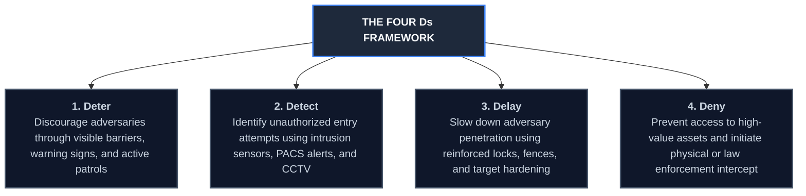

### 11.3 Physical Security Assessments and Surveys

Developing a comprehensive, accurate understanding of security risk is the prerequisite for any physical security project, whether designing a new corporate campus or upgrading a facility’s electronic access points. 

#### Security Surveys vs. Broad Assessments
While physical security managers must understand broad enterprise risk assessment models, they must possess a deep mastery of the **Security Survey**. The survey is the hands-on, field-level tool used to gather raw data, document facility layouts, audit existing electromechanical controls, and accumulate evidence to support the recommendation of specific countermeasures.

A comprehensive risk assessment cycle follows a structured sequence:
1. **Asset Identification & Valuation:** Cataloging physical, digital, and human assets and assigning relative or absolute business values.
2. **Threat Assessment:** Identifying realistic threats and calculating their **likelihood (probability)** based on local crime indexes, geographic flood/seismic exposures, neighborhood demographics, political/social conditions, and industry threat profiles.
3. **Vulnerability Assessment:** Inspecting physical properties to identify weak points in structural and electronic defenses.
4. **Consequence & Impact Analysis:** Calculating the operational, financial, legal, and brand damage that would result from a successful loss event.
5. **Mitigation Recommendation:** Formulating and cost-justifying targeted physical, technological, and procedural countermeasures.

### 11.4 Performance Metrics and Operational Efficiency

Modern corporate governance holds security managers to strict standards of financial accountability, requiring hard data to justify capital expenditures (CapEx) and operating expenses (OpEx), demonstrating a clear **Return on Investment (ROI)**. 

One of the greatest challenges in security metrics is proving value when "nothing happens"—measuring the success of a prevention program when no loss events occur. To overcome this, managers deploy performance metrics focused on **operational efficiency** and **human capital optimization**:

#### Security Operations Center (SOC) Alarm Mitigation
In many organizations, the SOC monitors all alarms generated by the Physical Access Control System (PACS) and video management platforms. A poorly designed, untuned system will flood the SOC with nuisance alarms (e.g., wind-blown motion alerts, misaligned door contacts). 

Over time, this constant stream of notifications becomes cognitive "noise," inducing operator fatigue and causing personnel to miss legitimate breach alerts. Security managers must track **nuisance alarm rates (NAR)** and use metrics to tune system sensitivity, systematically filtering out noise so that only actionable, high-priority alarms reach the operators' screens.

#### Human Capital Metrics
Metrics tracking the security officer force enable managers to evaluate expenditures, headcount requirements, response times, patrol frequencies, and cost-per-incident output. This provides executive leadership with an objective overview of the operational resources required to safeguard the enterprise.

### 11.5 Physical Security Design and Defense-in-Depth

Effective physical security design is engineered around two core principles: **The Four Ds** and **Defense-in-Depth (Layered Security)**.

#### Layered Security (Defense-in-Depth)
Adversaries must be forced to defeat multiple, independent protective barriers in sequence. A layer may be physical (e.g., perimeter fencing, exterior walls, double-locked doors) or functional (e.g., thermal motion sensors, CCTV video analytics, guard response patrols). 

These layers must support and act as a mutual backup for one another without creating redundant, cost-inefficient duplication. Layering increases the adversary's preparation time, introduces psychological uncertainty, adds mechanical steps to the breach attempt, and provides the organization with the time required to mount an effective response.

#### The Critical Detection Point
A primary mathematical and logical concept in security engineering is the **Critical Detection Point**. This represents the absolute boundary in the adversary's timeline where detection *must* occur if the response force is to successfully intercept the intruder before they reach the high-value asset:

$$\text{Remaining Delay Time } (T_{\text{delay}}) \ge \text{ Response Force Deployment Time } (T_{\text{response}})$$

If the intruder's delay time after detection is shorter than the time required for security officers or public police to respond, the physical security system has failed in its structural design.

```mermaid
graph TD
    %% Define HSL-themed styles
    classDef perimeter fill:#1e293b,stroke:#475569,stroke-width:2px,color:#f8fafc;
    classDef middle fill:#1e3a8a,stroke:#3b82f6,stroke-width:2px,color:#eff6ff;
    classDef inner fill:#064e3b,stroke:#10b981,stroke-width:2px,color:#ecfdf5;
    classDef asset fill:#7f1d1d,stroke:#f87171,stroke-width:2px,color:#fee2e2;

    Perimeter[<b>Outer Layer (Perimeter)</b><br>• Clear zones & warning signage<br>• Outer fencing & gates<br>• License plate recognition CCTV]:::perimeter --> Middle[<b>Middle Layer (Exterior Building)</b><br>• Reinforced exterior doors & locks<br>• Glass break & vibration sensors<br>• Outer PACS badge readers]:::middle

    Middle --> Inner[<b>Inner Layer (Interior Space)</b><br>• Biometric PACS for server/vault doors<br>• Interior motion sensors<br>• Secondary locked server enclosures]:::inner

    Inner --> Asset[<b>High-Value Asset</b><br>Target Secured]:::asset
```

#### Security Architecture and Engineering
Security features must be integrated into facility designs during the earliest **planning and architectural phases**, rather than added as an expensive, aesthetically disruptive afterthought. Security professionals must collaborate directly with certified architects, structural engineers, and general contractors from the inception of a construction or renovation project, using the security survey’s risk profile to guide physical layout, sightlines, and utility pathways.

### 11.6 Integrated Security and Protection Strategies

A modern, comprehensive physical security strategy integrates three core pillars: **architectural features, electromechanical/electronic systems, and operational factors (personnel)**. Technology does not replace manpower; instead, it acts as a powerful **force multiplier** that enhances human capabilities and provides critical checks and balances to prevent internal wrongdoing.

#### Electronic Systems Integration
Physical Access Control Systems (PACS), Video Surveillance Systems (VSS), and Intrusion Detection Systems (IDS) must interact seamlessly. For example, an unauthorized door-forced alert should automatically trigger the local CCTV camera to swing to a pre-set angle, display the live feed on the SOC console, and log the event in the database.

#### Network Infrastructure
Security systems typically ride on an IP network backbone. To prevent bandwidth congestion, guard against sporadic traffic surges, and avoid corporate network permissions conflicts, security designers strongly prefer a **dedicated, independent security network** over a shared enterprise network.

#### Maintenance Management
Given the complexity of integrated systems, organizations are highly encouraged to contract with a single, qualified **System Integrator** as a single point of contact. This integrator manages preventive and remedial maintenance across all hardware and software platforms, eliminating finger-pointing between separate networking, telecom, and database service providers.

### 11.7 Structural Security and CPTED

#### Crime Prevention Through Environmental Design (CPTED)
CPTED is a multidisciplinary crime prevention theory based on the premise that the proper design and effective use of the physical environment can reduce the opportunity for crime, mitigate fear, and improve the overall quality of life. CPTED requires active collaboration between planners, landscapers, architects, security professionals, and facility users.

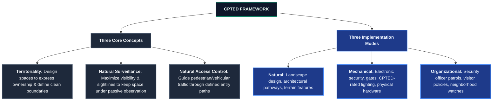

* CPTED targets **Places** (e.g., designing parking garages with open concrete structures, emergency call boxes, and high-intensity lighting to eliminate shadows and isolated spots) and **Behavior** (designing spaces to naturally elicit law-abiding conduct, such as placing parking directly in front of convenience store windows to deter armed robberies).

### 11.8 Personnel Access Control Systems (PACS)

Personnel access control authorizes and verifies the entry of individuals into controlled areas. PACS identity verification is designed around three fundamental validation factors:

1. **Something You Have (Possession):** Physical credentials, smart cards, proximity badges, or key fobs.
2. **Something You Know (Knowledge):** Personal Identification Numbers (PINs), passwords, or security passcodes.
3. **Something You Are (Inherence / Biometrics):** Unique physical or physiological characteristics recorded during enrollment, such as fingerprints, hand geometry, iris scans, or facial recognition.

#### The Power of Biometrics
While credentials or PINs only verify that the person requesting entry *possesses* the token or *knows* the number, **biometric devices positive-verify the actual identity** of the specific individual. Combining multiple verification factors (e.g., Proximity Card + PIN + Fingerprint Scan) drastically hardens high-security access points (such as server rooms or executive vaults) at the expense of user throughput.

### 11.9 Security Officers in Integrated Design

Uniformed security officers are an essential component of an integrated assets protection plan. While autonomous technologies continue to advance rapidly, they cannot replace well-trained officers who provide critical decision-making, cognitive threat perception, and the ability to pivot rapidly in complex crises. 

An effective program coordinates:
* **Security Management (Process):** Policies, operating procedures, and security awareness.
* **Security Technology (Systems):** Electromechanical locks, sensors, alarms, and CCTV.
* **Security Operations (People):** Uniformed officers, emergency response teams, and local law enforcement liaison.

Organizations must implement ongoing training and strict competency monitoring to ensure officers understand their roles in the overall mission and adhere to legal, regulatory, and contractual obligations.

### 11.10 Project and Systems Management

#### Project Management Constraints
Security-related projects (e.g., installing a new PACS campus-wide) are temporary, defined endeavors with specific start and end dates and allocated budgets. The core challenge of a project manager is to optimize all technical goals and objectives while adhering strictly to the constraints of **Time, Cost, and Scope**. Exceeding these parameters carries severe financial and professional consequences for the organization.

#### The Systems Design Lifecycle
The physical protection system (PPS) design is a highly structured, serial process. The output of each task serves as the mandatory input for the subsequent phase:

```mermaid
graph LR
    %% Define HSL-themed styles
    classDef step fill:#1e293b,stroke:#475569,stroke-width:2px,color:#f8fafc;
    classDef highlight fill:#1e3a8a,stroke:#3b82f6,stroke-width:2px,color:#eff6ff;

    SD1[<b>1. Planning & Assessment</b><br>Identify assets, threats, & vulnerabilities]:::step --> SD2[<b>2. Requirements Analysis</b><br>Formulate pro-active, verified concepts]:::step
    SD2 --> SD3[<b>3. Design & Spec</b><br>Draft technical drawings & datasheets]:::step
    SD3 --> SD4[<b>4. Implementation</b><br>Contractor installation & calibration]:::step
    SD4 --> SD5[<b>5. Acceptance Testing</b><br>Stress-test system under threat limits]:::step
    SD5 --> SD6[<b>6. Follow-On Maintenance</b><br>Preventive/remedial support]:::highlight
```

#### Procurement and System Implementation Steps
Once a contract is awarded to a certified installer or integrator, the implementation phase follows a meticulous quality-control protocol:
1. **Site Preparation & Planning:** Vetting all device layouts, access controls, and sensor locations against construction drawings before launching work.
2. **Site Vetting & Reporting:** The contractor must perform a comprehensive site inspection to verify that actual conditions match the design package. Any changes or nonfunctional existing systems must be documented in writing, and the contractor must secure written approval before making corrections.
3. **Signal & Line Auditing:** The contractor must test all existing cables and signal lines before integrating them. No signal lines or active systems may be disconnected without prior written customer authorization, preventing security gaps and operational downtime.
4. **Professional Installation:** Systems must be installed in strict accordance with manufacturer specifications and national electrical/communications standards, with final tuning performed to fit the facility's specific operational workflows.
5. **Acceptance Testing:** The implementation team must perform formal acceptance tests that stress the integrated system to its designated threat limits, simulating actual breach scenarios to prove operational effectiveness.

#### The Critical Priority of System Maintenance
The most common cause of physical protection system failures worldwide is **deferred maintenance**. Particularly in critical infrastructure installations, organizations frequently purchase highly sophisticated, expensive hardware but neglect to implement a maintenance plan, relying entirely on reactive, on-call emergency repairs. This represents a sure path to the rapid degradation and early failure of the security posture.

To ensure long-term resilience:
* **Integrated Design:** Maintenance planning must be treated as an essential component of the initial system design phase.
* **Prioritization:** Support resources must be concentrated on critical-path components whose failure has the highest impact on the overall system (e.g., main database servers and primary biometric portals).
* **Local Market Vetting:** Systems should be selected based on the availability of qualified local maintenance technicians. If local market support is unavailable, the program must allocate dedicated budgets to stockpile critical spare parts and secure dedicated, on-site certified maintenance technicians.

## Chapter 12: Global Security Trends and Standards

### 12.1 Geopolitical Risks and the Evolving Threat Landscape

The global security landscape is shaped by complex, interconnected risks that transcend traditional physical boundaries. Writing in the wake of the global COVID-19 pandemic, risk analysts note that the crisis severely exacerbated pre-existing societal divisions, fractured economic stability, and introduced novel vulnerabilities across both public and private sectors. According to the World Economic Forum's (WEF) *Global Risks Report*, "social cohesion erosion" and "livelihood crises" represent dominant, high-impact disruptions.

In a globalized economy, corporate security professionals must navigate a diverse spectrum of geopolitical threats. These range from cartels and drug violence in Central America to persistent civil conflict in the Middle East, migration-related social friction in Europe, international trade disputes, and the progressive militarization of the Asia-Pacific (APAC) region. 

Modern geopolitical risk is at a post-Cold War high. Crucially, the threat vector has expanded beyond the physical and tangible into borderless geopolitical and cybersecurity realms. Security managers must recognize that political instability, bureaucratic interference, and regional conflicts can instantly disrupt supply chains, compromise digital infrastructure, and inflict catastrophic financial losses.

### 12.2 Civil Unrest and Protest Management

Civil unrest has emerged as a persistent global threat, driven by social justice movements, economic policies, climate advocacy, and public backlash against governmental stringency or perceived inequality. Historic protests—ranging from South American economic uprisings to popular demonstrations across Europe and the United States—prove that popular uprisings can rapidly scale, disrupting entire urban centers.

#### Impact on the Corporate Environment
For security directors, civil unrest presents critical challenges:
* **Immediate Life Safety:** Protecting frontline employees, facility occupants, and patrons from physical harm or panic.
* **Physical Asset Protection:** Safeguarding properties, storefronts, and offices from vandalism, looting, or accidental fire.
* **Business Continuity:** Mitigating the impact of transportation blockades, utility disruptions, and localized lockdowns that halt business operations.
* **Reputational Exposure:** Managing the public narrative if the organization is targeted due to real or perceived political or ideological associations.

#### The Security Mandate in Unrest Situations
Security is not public law enforcement. The objective of private security in a civil unrest scenario is **loss prevention and risk mitigation, not the arrest or physical suppression of protesters**. Protests and riots are highly volatile, high-tension environments where improper security intervention can instantly escalate tensions, leading to severe injuries, property damage, and catastrophic brand damage.

Security managers must adopt a proactive, intelligence-led approach:
1. **Intelligence Collection:** Continuously monitor open-source intelligence (OSINT), local media, and law enforcement bulletins to evaluate the probability, timing, and routes of upcoming demonstrations.
2. **Target Hardening:** Lock down perimeters, secure glass exposures, test backup generators, and prepare emergency communications *before* the demonstration reaches the facility.
3. **De-escalation Posture:** Instruct security personnel to maintain a low-profile, defensive posture, avoiding direct confrontation with protesters unless absolutely necessary to preserve life safety.

### 12.3 Terrorism and Asymmetric Threats

Terrorism represents a persistent, borderless threat to public and private entities alike. As decade-long conflicts continue to hamper youth prospects in developing regions, extremist groups find a constant stream of recruits. Simultaneously, advanced economies are increasingly threatened by lone-actor gun violence, radicalized domestic terrorism, and deep-running societal frictions.

#### Defining the Asymmetric Threat
Terrorism is the calculated use or threat of violence designed to intimidate a civilian population, influence public policy, or compel a government or international organization to act or abstain from acting, in pursuit of political, religious, racial, or ideological ends. 

While definitions vary across international bodies—such as the United Nations, the Arab Convention for the Suppression of Terrorism, the UK Crown Prosecution Service, and the U.S. Code—they all share core parameters: **violent criminal acts, ideological motivation, and the intent to sow panic**.

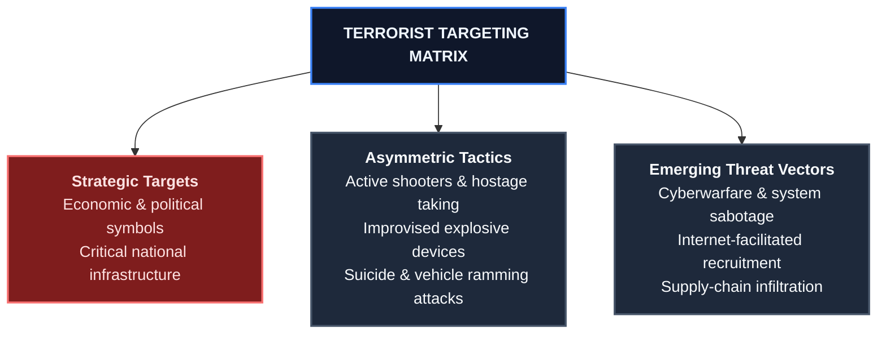

Adversaries carefully select targets to maximize psychological impact, frequently targeting high-visibility economic symbols, transit hubs, and places where the public has a strong expectation of safety. Security professionals must leverage intelligence feeds, establish mutual-aid liaison agreements with public safety agencies, and deploy rigorous physical barriers and emergency response plans to safeguard their facilities.

### 12.4 Modern Workplace Violence Prevention (WVPI)

A single act of workplace violence (WPV) can inflict catastrophic loss of life, severe physical and psychological injuries, and enduring organizational trauma. Frayed social cohesion, economic crises, and intense personal stressors continue to elevate the probability of WPV incidents. 

#### The Employer's Duty of Care
Organizations have a strict legal and ethical **Duty of Care** to provide a safe working environment for employees, contractors, visitors, and guests. This obligation makes no distinction between internal threats (e.g., disgruntled employees) and external sources of danger (e.g., domestic violence spillover, armed robberies). If an employer has reasonable cause to foresee a threat of violence and fails to implement protective measures, the company faces severe civil liability for negligence.

To build an effective Workplace Violence Prevention and Intervention (WVPI) program, security managers must align with the **recognized physical security standards and workplace violence prevention guidelines**, which govern the prevention, intervention, response, and aftermath phases of WPV incidents.

#### Critical Policy Elements and the Zero-Tolerance Pitfall
A robust WVPI program starts with a comprehensive policy signed and backed by senior executive leadership. The policy must clearly define prohibited behaviors, regulate or prohibit weapons on company premises, establish multiple secure reporting channels, mandate prompt reporting of safety concerns, and provide ironclad protection against retaliation.

> [!WARNING]
> **The Zero-Tolerance Policy Pitfall:**
> Security and HR managers should **avoid using the term "zero-tolerance"** in their policy documents. While well-intended, "zero-tolerance" policies actually decrease workplace safety by discouraging reporting. Employees who observe a colleague displaying early indicators of emotional distress or minor behavioral friction will stay silent, fearing that reporting the individual will lead to their immediate, automatic termination. Policies should instead emphasize a consistent, objective evaluation process focused on threat management and supportive intervention.

The fact-gathering phase of a WPV inquiry must be led by a trained, multi-disciplinary team and strictly separated from the ultimate disciplinary decision-making body, ensuring absolute objectivity, confidentiality, and compliance with privacy regulations.

### 12.5 Cybersecurity, IoT, and Physical Infrastructure Convergence

The historic March 2021 Verada camera breach—where hackers compromised over 150,000 security cameras in schools, hospitals, prisons, and psychiatric facilities by exploiting a privileged administrator account—vividly illustrated a critical vulnerability: **physical security systems are prime targets for cyber exploitation**. 

As physical protection systems increasingly connect to IP networks and integrate into the Internet of Things (IoT), the border between physical and digital security has completely dissolved.

```mermaid
graph TD
    %% Define HSL-themed styles
    classDef threats fill:#1e293b,stroke:#475569,stroke-width:2px,color:#f8fafc;
    classDef main fill:#0f172a,stroke:#3b82f6,stroke-width:2px,color:#eff6ff;

    A[<b>CYBER-PHYSICAL THREAT VECTOR MAP</b>]:::main
    
    A --> B[<b>1. Social Engineering & Phishing</b>]:::threats
    B --> B1[Exploiting human trust via email or OSINT social profiling]:::threats
    B --> B2[WHO-style COVID scams to harvest executive credentials]:::threats

    A --> C[<b>2. Ransomware & System Extortion</b>]:::threats
    C --> C1[Encrypting critical data and locking PACS/VSS servers]:::threats
    C --> C2[Targeting high-value PII databases in healthcare & finance]:::threats

    A --> D[<b>3. Business Email Compromise (BEC)</b>]:::threats
    D --> D1[Posing as C-suite executives to authorize fraudulent wire transfers]:::threats
    D --> D2[Using advanced AI voice alteration & face-swap deepfakes]:::threats

    A --> E[<b>4. Economic Espionage & IP Theft</b>]:::threats
    E --> E1[Nation-state cyber espionage targeting corporate trade secrets]:::threats
    E --> E2[SolarWinds-style software supply-chain backdoor injections]:::threats
```

#### CISA Social Engineering and Open-Source Social Profiling
The U.S. Cybersecurity and Infrastructure Security Agency (CISA) warns that threat actors frequently deploy sophisticated **social engineering** techniques—posing as repair technicians, new hires, or researchers—to bypass physical and digital perimeters. Attackers actively harvest open-source intelligence (OSINT) from employees' public social media profiles to draft highly targeted phishing emails, gaining a foothold in the corporate network to disable intrusion systems or access cameras.

#### Security Policies for Remote Workers
The transition to remote work has dramatically expanded the corporate attack surface, exposing the enterprise to severe internal theft and data loss risks:
* **Personal Devices:** Employees performing work on unapproved personal devices bypass enterprise network defenses. Policies must mandate the use of company-managed Virtual Private Networks (VPNs) and prohibit public Wi-Fi usage without encryption.
* **Document Management:** Remote workers printing and storing sensitive physical files at home create massive data leakage risks. A strict home-office clean desk policy must mandate that confidential files remain locked in secure storage.
* **Meeting Security:** Insecure teleconference lines are prime targets for corporate espionage. Employees must utilize company-approved, secure communication services (e.g., Teams, Zoom, WebEx) with dedicated access PINs and privacy screens.

### 12.6 Industry Security Standards and the PDCA Cycle

A **standard** is an agreed-upon set of criteria, guidelines, and best practices designed to enhance the quality, safety, and reliability of products, services, and management processes. Security standards are coordinated through Accredited Standards Developing Organizations (SDOs) in accordance with the strict principles of consensus, openness, due process, and transparency.

#### Classification of Standards
1. **Voluntary Standards:** Widely adopted but non-binding guidelines developed by SDOs, such as the International Organization for Standardization (ISO) and recognized professional security organizations.
2. **Statutory/Regulatory Standards:** Binding under the law and strictly enforceable by government authorities (e.g., building codes, fire regulations, and utility grid mandates).
3. **Mixed Standards:** Voluntary standards that become obligatory in practice because they are incorporated into commercial contracts or mandated by casualty insurance underwriters to determine coverage availability and pricing.

#### ISO Management System Standards
The most prominent international frameworks are **ISO 9001 (Quality Management)** and **ISO 14001 (Environmental Management)**. These standards establish a structured framework for continual organizational improvement, enabling security programs to enhance resilience and systematically achieve strategic objectives.

#### The Plan-Do-Check-Act (PDCA) operating cycle:

```mermaid
graph TD
    %% Define HSL-themed styles
    classDef step fill:#1e293b,stroke:#475569,stroke-width:2px,color:#f8fafc;
    classDef start fill:#064e3b,stroke:#34d399,stroke-width:2px,color:#ecfdf5;

    Plan[<b>1. PLAN</b><br>Identify assets, analyze vulnerabilities, & prioritize risks]:::start --> Do[<b>2. DO</b><br>Develop a detailed action plan & implement countermeasures]:::step
    Do --> Check[<b>3. CHECK</b><br>Examine the results & audit outcomes against the strategic plan]:::step
    Check --> Act[<b>4. ACT</b><br>Standardize successful solutions, identify new gaps, & restart]:::step
    Act --> Plan
```

By applying the PDCA cycle systematically, security professionals ensure that the physical protection system remains a dynamic, evolving shield, fully aligned with the changing threat environment and business goals of the enterprise.

---

## INDEX DATA

A security management standards, 210  
Access control Trends in Proprietary Information Loss, 70,  
and physical security, 186-187 virtual and in-person training, 18  

